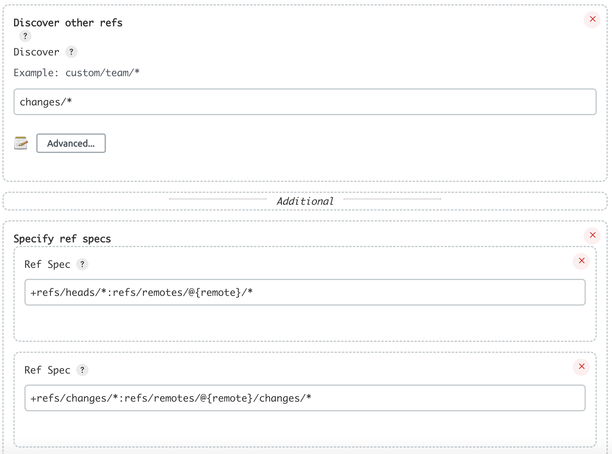

<!-- START doctoc generated TOC please keep comment here to allow auto update -->
<!-- DON'T EDIT THIS SECTION, INSTEAD RE-RUN doctoc TO UPDATE -->
**Table of Contents**  *generated with [DocToc](https://github.com/thlorenz/doctoc)*

- [gerrit refspecs](#gerrit-refspecs)

<!-- END doctoc generated TOC please keep comment here to allow auto update -->

> [!TIP]
> references:
> - [* jenkins-pipeline-library/src/cloudflare/Caching.groovy](https://github.com/AckeeDevOps/jenkins-pipeline-library/blob/master/src/cloudflare/Caching.groovy)

## usage
### load implicitly
```groovy
@Library( 'library-name' ) _
@Library( 'library-name@library-version' ) _

// or load multiple
@Library([ 'library-name', 'library-name' ]) _
```

### load dynamically
```groovy
library identifier: 'library-name@library-version',
        retriever: modernSCM([
                 $class : 'GitSCMSource',
                 remote : 'library-git-url',
          credentialsId : 'git-credentials'
        ])
```


## gerrit refspecs


> references:
> - [* Dependencies and Class Loading](https://www.jenkins.io/doc/developer/plugin-development/dependencies-and-class-loading/)
> - [* GERRIT_REFSPEC not recognized during scm git checkout - Jenkinsfile declarative](https://stackoverflow.com/a/69119448/2940319)
> - [How to dynamically add all methods of a class into another class](https://stackoverflow.com/a/45606058/2940319)
> - [Verifying Gerrit CRs to Your Jenkins’ Pipeline’s Shared Libraries](https://dustinoprea.com/2018/07/25/jenkins-how-to-verify-gerrit-crs-to-your-jenkins-pipeline-shared-libraries/)
> - [git plugin 3.6.4 regression with shared libraries](https://issues.jenkins.io/browse/JENKINS-48061?page=com.atlassian.jira.plugin.system.issuetabpanels%3Acomment-tabpanel&showAll=true)
> - [Cannot load a pipeline shared library from Bitbucket PR with cloudbees-bitbucket-branch-source 2.2.7](https://issues.jenkins.io/browse/JENKINS-48295)
> - [multibranch: Add refspecs trait to bitbucket scm](https://opendev.org/jjb/jenkins-job-builder/commit/74d2e1302c748f3db0f4fef03a5ff154e32909ae)
> - [Import library from specific branch via variable in Jenkinsfile](https://stackoverflow.com/questions/60224615/import-library-from-specific-branch-via-variable-in-jenkinsfile)
> - [Private Jenkins Shared Libraries](https://medium.com/@AndrzejRehmann/private-jenkins-shared-libraries-540abe7a0ab7)
> - [Pipeline: Shared Groovy Libraries](https://www.jenkins.io/doc/pipeline/steps/workflow-cps-global-lib/)
> <br>
> - something else:
>   - [Extension methods do not work in Pipeline](https://issues.jenkins.io/browse/JENKINS-47450)
>   - [* GerritForge/gerrit-ci-library](https://github.com/GerritForge/gerrit-ci-library)
>   - [* releng/pipelines](https://gerrit.linuxfoundation.org/infra/gitweb?p=releng/pipelines.git;a=tree;hb=refs/changes/46/68246/3)
>   - [* Jenkins Pipeline DSL Cheat Sheet](https://lzone.de/cheat-sheet/Jenkins%20Pipeline%20DSL)


- refs/changes
  - mandatory:
    - `+refs/heads/*:refs/remotes/@{remote}/*`
    - `+refs/changes/*:refs/changes/*`
  - optional:
    - `+refs/changes/*:refs/remotes/@{remote}/*`

- pull-request
  - `+refs/pull-requests/*/from:refs/remotes/@{remote}/pr/*`
  - `+refs/pull/*:refs/remotes/@{remote}/pr/*`
  - `+refs/heads/*:refs/remotes/@{remote}/*`



### gerrit
```groovy
library (
  identifier : "mylibs@" + GERRIT_REFSPEC,
   retriever : modernSCM (
    gerrit( traits: [[
              $class: 'RefSpecsSCMSourceTrait',
              templates: [
                [ value: '+refs/heads/*:refs/remotes/@{remote}/*'   ] ,
                [ value: '+refs/changes/*:refs/changes/*'           ] ,
                [ value: '+refs/changes/*:refs/remotes/@{remote}/*' ]
              ]
            ]],
            credentialsId: 'SSH_CREDENTIAL',
            remote: 'ssh://account@my.gerrit.com:29418/jenkins/libs'
    )
  )
) _
```

### git
```groovy
library (
  identifier : 'devops-libs',
  retriever  : modernSCM ([
    $class        : 'GitSCMSource',
    credentialsId : 'SSH_CREDENTIAL',
    remote        : 'ssh://account@my.gerrit.com:29418/jenkins/libs',
    traits        : [
      gitBranchDiscovery(),
      [
        $class    : 'RefSpecsSCMSourceTrait',
        templates : [
          [ value : '+refs/heads/*:refs/remotes/@{remote}/*'   ] ,
          [ value : '+refs/changes/*:refs/remotes/@{remote}/*' ] ,
          [ value : '+refs/changes/*:refs/changes/*'           ]
        ]
      ]
    ]
  ])
)
```
