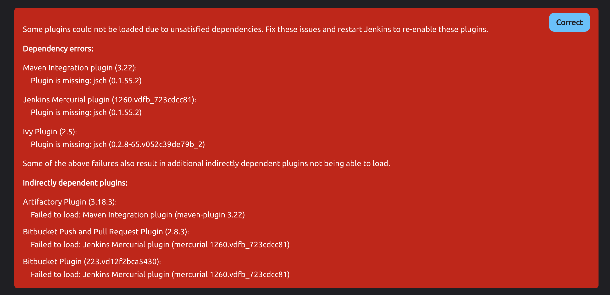

<!-- START doctoc generated TOC please keep comment here to allow auto update -->
<!-- DON'T EDIT THIS SECTION, INSTEAD RE-RUN doctoc TO UPDATE -->
**Table of Contents**  *generated with [DocToc](https://github.com/thlorenz/doctoc)*

- [downgrade](#downgrade)
  - [jsch](#jsch)

<!-- END doctoc generated TOC please keep comment here to allow auto update -->


## downgrade
### jsch

> [!NOTE]
> - [Nicola Beghin](https://stackoverflow.com/questions/72743823/public-key-authentication-fails-with-jsch-but-work-with-openssh-with-the-same-ke#comment133364530_72771323)
> - [Public key authentication fails with JSch but work with OpenSSH with the same key](https://stackoverflow.com/questions/72743823/public-key-authentication-fails-with-jsch-but-work-with-openssh-with-the-same-ke/72771323#comment133364530_72771323)
> - api
>   - [org.jenkinsci.plugins.jsch.JSchConnector](https://javadoc.jenkins.io/plugin/jsch/org/jenkinsci/plugins/jsch/JSchConnector.html)
>   - [Package com.jcraft.jsch](https://epaul.github.io/jsch-documentation/javadoc/)
>   - [com.jcraft.jsch.Session](https://epaul.github.io/jsch-documentation/javadoc/com/jcraft/jsch/Session.html)
>   - [com.jcraft.jsch.KeyExchange](https://epaul.github.io/jsch-documentation/javadoc/com/jcraft/jsch/KeyExchange.html)
>   - [com.jcraft.jsch.OpenSSHConfig](https://epaul.github.io/jsch-documentation/javadoc/com/jcraft/jsch/OpenSSHConfig.html)
> - references:
>   - [Java JSch Example to run Shell Commands on SSH Unix Server](https://www.digitalocean.com/community/tutorials/jsch-example-java-ssh-unix-server)
>   - [Best Java code snippets using com.jcraft.jsch.JSch](https://www.tabnine.com/code/java/classes/com.jcraft.jsch.JSch)
>   - [Java SSH connect with key using JSch - Auth Failed](https://stackoverflow.com/a/68919510/2940319)
>   - [JSCH: SFTP. Hangs at session.connect() using the port 21](https://stackoverflow.com/a/36693526/2940319)
>   - [Creating JSch HostKey instance from a public key in .pub format](https://stackoverflow.com/a/29605457/2940319)

```
$ curl -O https://repo1.maven.org/maven2/com/github/mwiede/jsch/0.2.7/jsch-0.2.7.jar
$ docker cp jsch-0.2.7.jar e6cd5d7516cd:/var/jenkins_home/plugins/jsch/WEB-INF/lib/jsch-0.1.55.jar
#                               ^
#                        Docker Container ID
```

```groovy
import org.jenkinsci.plugins.jsch.JSchConnector
import java.io.InputStream

import com.jcraft.jsch.JSch
import com.jcraft.jsch.Session
import com.jcraft.jsch.LocalIdentityRepository
import com.jcraft.jsch.Channel
import com.jcraft.jsch.ChannelExec


String user = 'srv-ssd-fw-devops'
String host = 'vgitcentral.marvell.com'
int port    = 29418
String path = System.getProperty( 'user.home' ) + '/.ssh/ed25519/devops@ssdfw'
// Byte[] privateKey = ''.getBytes()

JSch jsch = new JSchConnector( user, host, port ).getJSch()
jsch.addIdentity( path )

Session session = jsch.getSession( user, host, port )
session.setConfig( 'StrictHostKeyChecking', 'no' )
session.setConfig( 'HostkeyAlgorithms', '+ssh-rsa' )
session.setConfig( 'PreferredAuthentications', 'publickey' )

println """
  ${session.getClass()}:
    session client version : ${session.getClientVersion()} : ${session.clientVersion}
    session host           : ${session.getHost()} : ${session.host}
    session port           : ${session.getPort()} : ${session.port}
    session hostkey        : ${session.getHostKey()} : ${session.hostKey}
    session hostkey alias  : ${session.getHostKeyAlias()} : ${session.hostKeyAlias}
    session isConnected    : ${session.isConnected()}
"""

def knowHosts = session.getHostKeyRepository()
println """
  ${knowHosts.getClass()}:
    knownHosts host key     : ${knowHosts.getHostKey( host, 'ssh-rsa' )}
    knowHosts repository id : ${knowHosts.getKnownHostsRepositoryID()}
"""

def idRepo = jsch.getIdentityRepository()
println """
  ${idRepo.getClass()} :
      identityRepository name       : ${idRepo.getName()} : ${idRepo.name}
      identityRepository status     : ${idRepo.getStatus()} : ${idRepo.status}
      identityRepository identities : ${idRepo.getIdentities()} : ${idRepo.identities}
"""

session.connect()
```

- revert
  ```bash
  sudo cp -rp /jenkins/DEVOPS-JENKINS/plugins/jsch* .
  sudo cp -rp /jenkins/DEVOPS-JENKINS/plugins/gerrit* .
  sudo cp -rp /jenkins/DEVOPS-JENKINS/plugins/maven-plugin* .
  sudo cp -rp /jenkins/DEVOPS-JENKINS/plugins/mercuri* .
  sudo cp -rp /jenkins/DEVOPS-JENKINS/plugins/ivy* .
  sudo cp -rp /jenkins/DEVOPS-JENKINS/plugins/artifactory* .
  sudo cp -rp /jenkins/DEVOPS-JENKINS/plugins/bitbucket*
  ```

  
