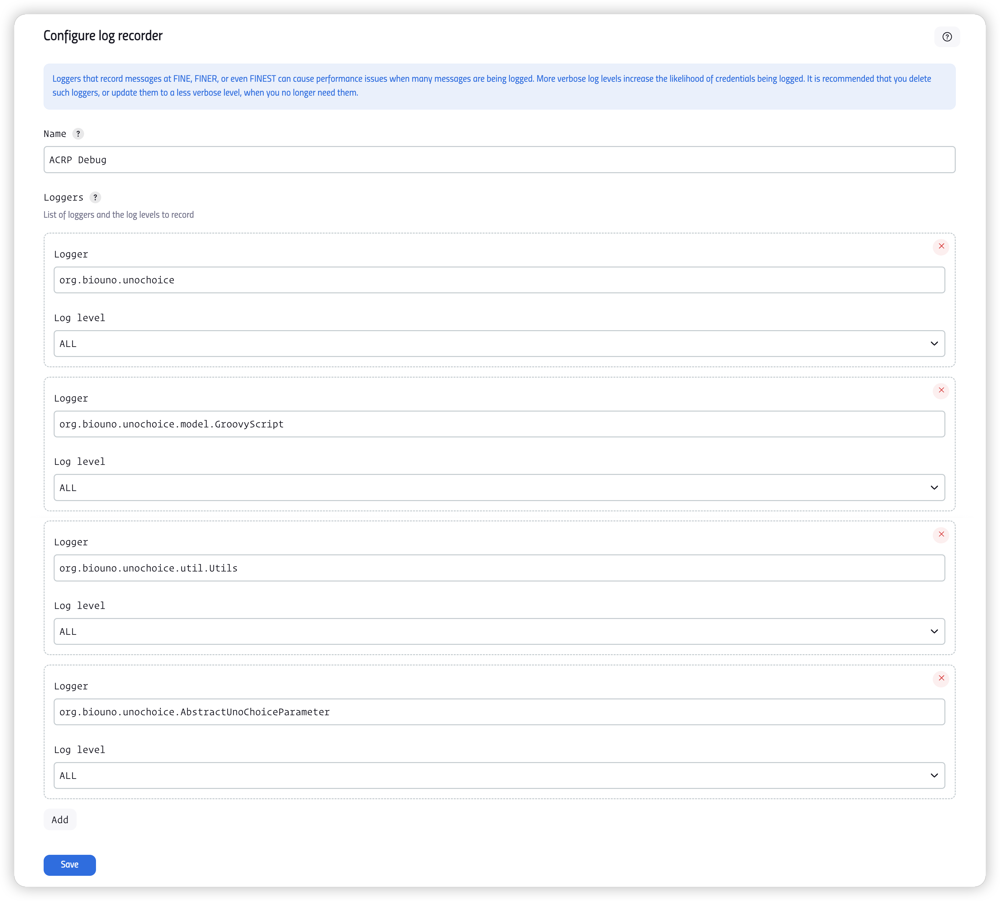

> [!NOTE|label:references:]
> - [How to Render Jenkins Build Parameters Dynamically?](https://www.infracloud.io/blogs/render-jenkins-build-parameters-dynamically/)

## troubleshooting

### Log

- **Manage Jenkins** -> **System Log**
- add new log recorder for
  - `org.biouno.unochoice`
  - `org.biouno.unochoice.model.GroovyScript`
  - `org.biouno.unochoice.util.Utils`
  - `org.biouno.unochoice.AbstractUnoChoiceParameter`



### show variables

> [!TIP]
>> `throw new RuntimeException("...")`

```groovy
String sdkCode = ( "\${releaseId}" =~ '^SDK-?([^\\\\.]+).*' )[0][1]
Map map = ${matrix.inspect()}
throw new RuntimeException(
  ">> sdkCode: \${sdkCode}" +
  ">> map.get(SDK13): \${map.get("SDK13")}" +
  ">> map.get(SDK{sdkCode}) - GString : \${map.get("SDK\${sdkCode}")}" +
  ">> map.get(SDK{sdkCode}) - String  : \${map.get("SDK\${sdkCode}".toString())}"
)
return map.get("SDK\${sdkCode}".toString()).collect{ ${defaultCustomers.inspect()}.contains( it.key ) ? "\${it.key}:selected" : it.key }
```
