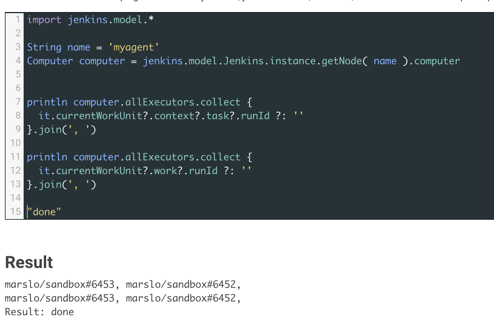

<!-- START doctoc generated TOC please keep comment here to allow auto update -->
<!-- DON'T EDIT THIS SECTION, INSTEAD RE-RUN doctoc TO UPDATE -->

- [get information](#get-information)
  - [get all](#get-all)
  - [`Computer` and `Node`](#computer-and-node)
  - [get projects tied to agent](#get-projects-tied-to-agent)
  - [get ip address of node](#get-ip-address-of-node)
  - [get agent credentialsId](#get-agent-credentialsid)
  - [get agent environment variable](#get-agent-environment-variable)
  - [get agent labels](#get-agent-labels)
  - [get a list of all Jenkins nodes assigned with label](#get-a-list-of-all-jenkins-nodes-assigned-with-label)
- [cloud agents](#cloud-agents)
  - [check how many cloud agent running](#check-how-many-cloud-agent-running)
  - [KubernetesComputer](#kubernetescomputer)
- [executor](#executor)
  - [basic usage](#basic-usage)
  - [get executor status](#get-executor-status)
  - [stop all running builds via WorkflowRun](#stop-all-running-builds-via-workflowrun)
  - [force interrupt executors](#force-interrupt-executors)
  - [to `WorkflowRun`](#to-workflowrun)
  - [to `WorkUnit` and `SubTask` ( `ExecutorStepExecution.PlaceholderTask` )](#to-workunit-and-subtask--executorstepexecutionplaceholdertask-)
  - [to `Computer`](#to-computer)
- [managing nodes](#managing-nodes)
  - [create agent](#create-agent)
  - [update agent label](#update-agent-label)
  - [update agent credentialsId](#update-agent-credentialsid)
  - [universal agent update](#universal-agent-update)
  - [disconnect agent](#disconnect-agent)
  - [temporarily offline agent](#temporarily-offline-agent)
  - [restart agent](#restart-agent)
  - [delete agent](#delete-agent)
- [monitor](#monitor)
  - [monitor and restart offline agents](#monitor-and-restart-offline-agents)
  - [for jenkins master](#for-jenkins-master)
  - [send alerts](#send-alerts)
  - [for jenkins agents](#for-jenkins-agents)

<!-- END doctoc generated TOC please keep comment here to allow auto update -->



> references:
> - [SSH Agents leak "Computer.threadPoolForRemoting" threads](https://docs.cloudbees.com/docs/cloudbees-ci-kb/latest/client-and-managed-masters/ssh-agents-leak-computer-threadpoolforremoting-threads)
>   - [JENKINS-27514: Core - Thread spikes in Computer.threadPoolForRemoting leading to eventual server OOM](https://issues.jenkins.io/browse/JENKINS-27514)
>   - [JENKINS-19465: Slave hangs while being launched](https://issues.jenkins.io/browse/JENKINS-19465)
> - [CloudBees: Managing agents](https://docs.cloudbees.com/docs/cloudbees-ci/latest/cloud-admin-guide/agents#static-agents)
> - [* CloudBees: Create a Permanent Agent from Groovy Console](https://docs.cloudbees.com/docs/cloudbees-ci-kb/latest/client-and-managed-controllers/create-agent-node-from-groovy)
>   - [DumbSlave](https://javadoc.jenkins-ci.org/hudson/slaves/DumbSlave.html)
>   - [JNLPLauncher](https://javadoc.jenkins.io/hudson/slaves/JNLPLauncher.html)
> - [Create a new Jenkins node, and run your Jenkins agent as a service](https://www.jenkins.io/blog/2022/12/27/run-jenkins-agent-as-a-service/)
> - [WebSocket](https://www.jenkins.io/blog/2020/02/02/web-socket/)



## get information


> API:
> - [hudson.model.Computer](https://javadoc.jenkins-ci.org/hudson/model/Computer.html)
> - [hudson.model.Node](https://javadoc.jenkins-ci.org/hudson/model/Node.html)
> - [hudson.model.Slave](https://javadoc.jenkins.io/hudson/model/Slave.html)
> - [hudson.slaves.DumbSlave](https://javadoc.jenkins.io/hudson/slaves/DumbSlave.html)
>
> references:
> - [Display Information About Nodes](https://wiki.jenkins.io/display/JENKINS/Display+Information+About+Nodes)
> - [jenkins-scripts/scriptler/showAgentJavaVersion.groovy](https://github.com/jenkinsci/jenkins-scripts/blob/master/scriptler/showAgentJavaVersion.groovy)
> - [jenkins-scripts/scriptler/checkNodesLauncherVersion.groovy](https://github.com/jenkinsci/jenkins-scripts/blob/master/scriptler/checkNodesLauncherVersion.groovy)
> - [Skip Jenkins Pipeline Steps If Node Is Offline](https://stackoverflow.com/a/43065873/2940319)
>
> sample scripts:
> - [jenkins-scripts/scriptler/findOfflineSlaves.groovy](https://github.com/jenkinsci/jenkins-scripts/blob/master/scriptler/findOfflineSlaves.groovy)
> - [jenkins-scripts/scriptler/showAgentJavaVersion.groovy](https://github.com/jenkinsci/jenkins-scripts/blob/master/scriptler/showAgentJavaVersion.groovy)
> - [jenkins-scripts/scriptler/checkNodesLauncherVersion.groovy](https://github.com/jenkinsci/jenkins-scripts/blob/master/scriptler/checkNodesLauncherVersion.groovy)
> - [Jenkins : Monitoring Scripts](https://wiki.jenkins.io/display/JENKINS/Monitoring-Scripts.html)
> - [Jenkins : Display Tools Location on All Nodes](https://wiki.jenkins.io/display/JENKINS/Display-Tools-Location-on-All-Nodes.html)
> - [Jenkins : Display Information About Nodes](https://wiki.jenkins.io/display/JENKINS/Display-Information-About-Nodes.html)


### get all


> get all agents including Jenkins master:
> - [`jenkins.model.Jenkins.instance.computers`](https://javadoc.jenkins-ci.org/hudson/model/Computer.html)
> - `jenkins.model.Jenkins.instance.get().computers`


```groovy
jenkins.model.Jenkins.instance.computers.each { agent ->
  println "${agent.displayName} : ${agent.class} : ${agent.class.superclass}"
  println "     >> is master : ${jenkins.model.Jenkins.MasterComputer.isInstance(agent)}"
  println "     >> is cloud  : ${hudson.slaves.AbstractCloudComputer.isInstance(agent)} "
}
```

- or
  ```groovy
  jenkins.model.Jenkins.instance.get().computers.each { agent ->
    println "${agent.displayName} : ${agent.class} : ${agent.class.superclass}"
    println "     >> is master : ${jenkins.model.Jenkins.MasterComputer.isInstance(agent)}"
    println "     >> is cloud  : ${hudson.slaves.AbstractCloudComputer.isInstance(agent)} "
  }
  ```

### `Computer` and `Node`

> - `hudson.model.Computer` -> `hudson.model.Node` via [`computer.setNode()`](https://javadoc.jenkins-ci.org/hudson/model/Computer.html#setNode-hudson.model.Node-)
> - `hudson.model.Node` -> `hudson.model.Computer` via [`node.toComputer()`](https://javadoc.jenkins-ci.org/hudson/model/Node.html#toComputer--)



#### example for `Computer` Object
- get description
  ```groovy
  jenkins.model.Jenkins.instance.getNode('<AGENT_NAME>').toComputer().description
  ```

- get all info
  ```groovy
  import hudson.slaves.ComputerLauncher

  String agentName = <AGENT_NAME>

  jenkins.model.Jenkins.instance.computers.findAll { computer ->
    agentName == computer.name
  }.each { computer ->
    String moreinfo = computer.online
                        ? "properties : ${computer.getSystemProperties().collect { k, v -> "$k=$v" }.join('\n\t\t\t>>> ')}"
                        : "      logs : ${computer.getLog()}"
    ComputerLauncher launcher = computer.node.launcher

    println """
      >> ${computer.displayName} :
                      class : ${computer.getClass()}
                      class : ${computer.class.superclass?.simpleName}
                    online? : ${computer.online}
                description : ${computer.description}
                connectTime : ${computer.connectTime} | ${new Date(computer.connectTime).format("yyyy-MM-dd'T'HH:mm:ss.SSS'Z'")}
      idleStartMilliseconds : ${computer.idleStartMilliseconds} | ${new Date(computer.idleStartMilliseconds).format("yyyy-MM-dd'T'HH:mm:ss.SSS'Z'")}
         offlineCauseReason : ${computer.offlineCauseReason}
                   executor : ${computer.numExecutors} | ${computer.node.numExecutors}
                   launcher : ${launcher.host} | ${launcher.port} | ${launcher.credentialsId}
                 ${moreinfo}
    """
  }
  ```

  - result
   ```groovy
        >> AGENT_NAME :
                        class : class hudson.slaves.SlaveComputer
                        class : Computer
                      online? : false
                  description : marslo test agent offline
                  connectTime : 1620478291102 | 2021-05-08T05:51:31.102Z
        idleStartMilliseconds : 1707980922716 | 2024-02-14T23:08:42.716Z
           offlineCauseReason : This agent is offline because Jenkins failed to launch the agent process on it.
                     executor : 1
                     launcher : 1.2.3.4 | sample.com | 22 | NEW_CREDENTIAL
                         logs : SSHLauncher{host='1.2.3.4', port=22, credentialsId='NEW_CREDENTIAL', jvmOptions='', javaPath='', prefixStartSlaveCmd='', suffixStartSlaveCmd='', launchTimeoutSeconds=30, maxNumRetries=5, retryWaitTime=30, sshHostKeyVerificationStrategy=hudson.plugins.sshslaves.verifiers.NonVerifyingKeyVerificationStrategy, tcpNoDelay=true, trackCredentials=true}
    [05/08/21 05:51:31] [SSH] Opening SSH connection to 1.2.3.4:22.
    connect timed out
    SSH Connection failed with IOException: "connect timed out", retrying in 30 seconds. There are 5 more retries left.
    connect timed out
        ...
   ```

#### example for `Node` Object
```groovy
import hudson.slaves.*

DumbSlave agent = jenkins.model.Jenkins.instance.getNode( 'AGEENT_NAME' )
ComputerLauncher launcher = agent.launcher

println """
     display name : ${agent.getDisplayName()}
        node name : ${agent.getNodeName()}
      description : ${agent.getNodeDescription()}
         executor : ${agent.getNumExecutors()}
     label string : ${agent.getLabelString()}
        node mode : ${agent.getMode()}
  hold off launch : ${agent.isHoldOffLaunchUntilSave()}
         launcher : ${launcher.host} | ${launcher.port} | ${launcher.credentialsId}
"""
```
- result
  ```
     display name : AGEENT_NAME
        node name : AGEENT_NAME
      description : marslo test agent offline
         executor : 1
     label string :
        node mode : NORMAL
  hold off launch : true
         launcher : 1.2.3.4 | sample.com | 22 | NEW_CREDENTIAL
  ```


> setup `hold off launch` via: `agent.holdOffLaunchUntilSave = true`


- `node` -> `computer`
  ```groovy
  String agent = 'AGEENT_NAME'

  jenkins.model.Jenkins.instance.getNode(agent).toComputer().isOnline()
  // or
  hudson.model.Hudson.instance.getNode(agent).toComputer().isOnline()
  // or
  jenkins.model.Jenkins.instance.getNode(agent).computer.isOnline()
  ```

- or get log
  ```groovy
  println jenkins.model.Jenkins.instance.getNode( 'AGEENT_NAME' ).toComputer().getLog()

  // result
  SSHLauncher{host='1.2.3.4', port=22, credentialsId='DevOpsSSHCredential', jvmOptions='', javaPath='', prefixStartSlaveCmd='', suffixStartSlaveCmd='', launchTimeoutSeconds=30, maxNumRetries=5, retryWaitTime=30, sshHostKeyVerificationStrategy=hudson.plugins.sshslaves.verifiers.NonVerifyingKeyVerificationStrategy, tcpNoDelay=true, trackCredentials=true}
  [05/24/21 03:59:16] [SSH] Opening SSH connection to 1.2.3.4:22.
  connect timed out
  SSH Connection failed with IOException: "connect timed out", retrying in 30 seconds. There are 5 more retries left.
  ```

### get projects tied to agent

> [!NOTE|label:reference:]
> - [`jenkins.model.Computer.allExecutors`](https://javadoc.jenkins-ci.org/hudson/model/Computer.html#getAllExecutors--)
> - [`hudson.model.Executor.currentWorkUnit`](https://javadoc.jenkins-ci.org/hudson/model/Executor.html#getCurrentWorkUnit--)
> - [`<SubTask> hudson.model.queue.WorkUnit.work`](https://javadoc.jenkins-ci.org/hudson/model/queue/WorkUnit.html#work)

```groovy
import hudson.model.*
import jenkins.model.*
import hudson.slaves.*

String name = '<AGENT_NAME>'
Computer computer = jenkins.model.Jenkins.instance.getNode(name)?.computer ?: null
println computer.allExecutors.collect { it.currentWorkUnit?.work?.runId ?: '' }.join(', ') ?: ''
```
- result
  

- or
  ```groovy
  println computer.getAllExecutors().collect { it.getCurrentWorkUnit()?.work?.runId ?: '' }
  ```

- or via [`<WorkUnitContext> hudson.model.queue.WorkUnit.context`](https://javadoc.jenkins-ci.org/hudson/model/queue/WorkUnit.html#context)
  ```groovy
  println computer.allExecutors.collect { it.currentWorkUnit?.context?.task?.runId ?: '' }
  ```

- get running job from label

  > [!TIP]
  > solution:
  > - `hudson.model.Executor` -> `hudson.model.queue.WorkUnit` -> `org.jenkinsci.plugins.workflow.support.steps.ExecutorStepExecution$PlaceholderTask`
  > - `hudson.model.Executor` -> `hudson.model.queue.WorkUnit` -> `hudson.model.queue.WorkUnitContext` -> `org.jenkinsci.plugins.workflow.support.steps.ExecutorStepExecution$PlaceholderTask`
  >
  > might helps: [Label Linked Jobs](https://plugins.jenkins.io/label-linked-jobs/)

  ```groovy
  jenkins.model.Jenkins.instance.getNode(name)?.computer?.allExecutors.each {
    println it.currentWorkUnit.work.getClass()
    println '.................'
    println it.currentWorkUnit.work.label
    println it.currentWorkUnit.work.runId
    println '.................'
    println it.currentWorkUnit?.context?.task?.label
    println it.currentWorkUnit?.context?.task?.runId
    println '.................'
    println it.currentWorkUnit.work.getOwnerTask().getClass()
    println it.currentWorkUnit.work.getOwnerTask().getFullDisplayName()
    println '.................'
  }
  // result
  class org.jenkinsci.plugins.workflow.support.steps.ExecutorStepExecution$PlaceholderTask
  .................
  AGENT_001
  marslo/sandbox#6460
  .................
  AGENT_001
  marslo/sandbox#6460
  .................
  class org.jenkinsci.plugins.workflow.job.WorkflowJob
  marslo » sandbox
  .................
  Result: [Thread[Executor #0 for AGENT_001 : executing PlaceholderExecutable:ExecutorStepExecution.PlaceholderTask{runId=marslo/sandbox#6460,label=CI-WP-CD-RPI005,context=CpsStepContext[3:node]:Owner[marslo/sandbox/6460:marslo/sandbox #6460],cookie=null,auth=null},5,]]
  ```

#### get number of executor of agents
```groovy
jenkins.model.Jenkins.instance.getNode(name)?.computer?.allExecutors?.size
```

### [get ip address of node](https://stackoverflow.com/a/39752509/2940319)
```groovy
import hudson.model.Computer.ListPossibleNames

println jenkins.model.Jenkins.instance
               .getNode( '<AGENT_NAME>' ).computer
               .getChannel().call(new ListPossibleNames())
```

or
```groovy
println jenkins.model.Jenkins.instance
               .getNode( '<AGENT_NAME>' ).computer
               .getHostName()
```

[or](https://stackoverflow.com/a/14930330/2940319)
```groovy
println InetAddress.localHost.hostAddress
```

### get agent credentialsId

> [!NOTE|label:references:]
> - [Class hudson.plugins.sshslaves.SSHLauncher](https://javadoc.jenkins.io/plugin/ssh-slaves/hudson/plugins/sshslaves/SSHLauncher.html)
> - [Class hudson.slaves.SlaveComputer: getLauncher](https://javadoc.jenkins.io/hudson/slaves/SlaveComputer.html#getLauncher())
> - [JENKINS-72716: credentialsId shows different in `Jenkins.instance.nodes` and `Jenkins.instance.computers`](https://issues.jenkins.io/browse/JENKINS-72716)
> - [marslo/0.script for jenkins agent.md](https://gist.github.com/marslo/ce6dddd2cf7e264ba5e2ffec2d6610c4)

```groovy
/**
 * @author marslo
 * @since 02/16/2024
 *
 * @result
 * | AGENT NAME         | NODE CREDENTIAL | COMPUTER CREDENTIIAL |
 * | ------------------ | --------------- | -------------------- |
 * | STAGING_TEST_01    | SSH_CREDENTIAL  | SSH_CREDENTIAL       |
 * | DEVELOPMENT_ENV_03 | SSH_CREDENTIAL  | SSH_CREDENTIAL       |
**/

List<String> title = [ 'AGENT NAME', 'NODE CREDENTIAL', 'COMPUTER CREDENTIIAL' ]
List<List<String>> agentCredentials = jenkins.model.Jenkins.instance.computers.findAll { computer ->
  ! jenkins.model.Jenkins.MasterComputer.isInstance(computer) &&
  computer?.launcher instanceof hudson.plugins.sshslaves.SSHLauncher
}.collect { computer ->
  [ computer.name, computer.node.launcher?.credentialsId?.toString() ?: '', computer.launcher?.credentialsId?.toString() ?: '' ]
}

agentCredentials.add( 0, title )
agentCredentials.add( 0, agentCredentials.transpose().collect { column -> column.collect{ it.size() }.max() } )

agentCredentials = agentCredentials.withIndex().collect { raw, idx ->
  if ( idx ) raw.withIndex().collect { x, y -> x.toString().padRight(agentCredentials[0][y]) }
}.findAll()

String showTable ( List l ) {
  l.collect{ '| ' +  it.join(' | ' ) + ' |' }.join('\n')
}

println showTable( [ agentCredentials.head(), agentCredentials.head().collect { '-'*it.size() } ] )
println showTable( agentCredentials.tail() )
```

- or simple output
  ```groovy
  /**
   * @author marslo
   * @since 02/16/2024
   *
   * @result
   * STAGING_TEST_01    | SSH_CREDENTIAL  | SSH_CREDENTIAL
   * DEVELOPMENT_ENV_03 | SSH_CREDENTIAL  | SSH_CREDENTIAL
  **/

  List<List<String>> agentCredentials = jenkins.model.Jenkins.instance.computers.findAll { computer ->
    ! jenkins.model.Jenkins.MasterComputer.isInstance(computer) &&
    computer?.launcher instanceof hudson.plugins.sshslaves.SSHLauncher
  }.collect { computer ->
    [ computer.name, computer.node.launcher?.credentialsId?.toString() ?: '', computer.launcher?.credentialsId?.toString() ?: '' ]
  }

  agentCredentials.add( 0, agentCredentials.transpose().collect { column -> column.collect{ it.size() }.max() } )
  println agentCredentials.withIndex().collect { raw, idx ->
    if ( idx ) {
      raw.withIndex().collect { x, y -> "${x.padRight(agentCredentials[0][y])}" }.join(' | ')
    }
  }.findAll().join('\n')
  ```

- or
  ```groovy
  println "   AGENT".padRight(33) + "ONLINE".padRight(15) + "CREDENTIAL ID"

  jenkins.model.Jenkins.instance.computers.findAll { computer ->
    ! jenkins.model.Jenkins.MasterComputer.isInstance(computer) &&
    computer?.launcher instanceof hudson.plugins.sshslaves.SSHLauncher
  }.each { computer ->
    println ">> ${computer.displayName.padRight(30)}" +
            "[${computer.online}]".padRight(15) +
            "${computer.node.launcher?.credentialsId?.toString() ?: ''} | ${computer.launcher?.credentialsId?.toString() ?: ''}"
  }

  "DONE"
  ```
- or
  ```groovy
  println "   AGENT".padRight(33) + "ONLINE".padRight(15) + "CREDENTIAL ID"

  jenkins.model.Jenkins.instance.nodes.findAll { node ->
    ! jenkins.model.Jenkins.MasterComputer.isInstance(node) &&
    node?.launcher instanceof hudson.plugins.sshslaves.SSHLauncher
  }.each { node ->
    println ">> ${node.displayName.padRight(30)}" +
            "[${node.computer.online}]".padRight(15) +
            "${node.launcher?.credentialsId?.toString() ?: ''} | ${node.computer.launcher?.credentialsId?.toString() ?: ''}"
  }

  "DONE"
  ```

### get agent environment variable
```groovy
import hudson.slaves.EnvironmentVariablesNodeProperty

jenkins.model.Jenkins.instance.slaves.each { agent ->
  List props = agent.nodeProperties.getAll(hudson.slaves.EnvironmentVariablesNodeProperty.class)
  if ( props ) {
    println """
       name : ${agent.name} :
      props : ${props.collect{ prop -> prop.envVars.collect { "${it.key} ~> ${it.value}" } }.flatten().join(', ')}
    """
  }
}

"DONE"
```

- [or](https://stackoverflow.com/a/28076291/2940319)
  ```groovy
  for ( slave in jenkins.model.Jenkins.instance.slaves ) {
    println( slave.name + ": " )
    def props = slave.nodeProperties.getAll(hudson.slaves.EnvironmentVariablesNodeProperty.class)
    for ( prop in props ) {
      for ( envvar in prop.envVars ) {
        println envvar.key + " -> " + envvar.value
      }
    }
  }
  ```

### get agent labels
```groovy
println jenkins.model.Jenkins.instance.nodes.collect { agent ->
          "${agent.name} -> ${agent.getLabelString()}"
        }.join('\n')
```

- function
  ```groovy
  def getLabel( String label ){
    jenkins.model.Jenkins.instance.nodes.find { it.getNodeName().toString().equals(label) }.getLabelString()
  }
  ```

  - or
    ```groovy
    def getLabel( String label ){
      for ( node in jenkins.model.Jenkins.instance.nodes ) {
        if ( node.getNodeName().toString().equals(label) ) {
          return node.getLabelString()
        }
      }
    }
    ```

### [get a list of all Jenkins nodes assigned with label](https://stackoverflow.com/a/64106569/2940319)
```groovy
def nodes = jenkins.model.Jenkins.get().computers
                   .findAll{ it.node.labelString.contains(label) }
                   .collect{ it.node.selfLabel.name }
```

- [or](https://stackoverflow.com/a/49625621/2940319)
  ```groovy
  @NonCPS
  def hostNames(label) {
    def nodes = []
    jenkins.model.Jenkins.get.computers.each { c ->
      if (c.node.labelString.contains(label)) {
        nodes.add(c.node.selfLabel.name)
      }
    }
    return nodes
  }
  ```
- [or](https://stackoverflow.com/a/53429175/2940319)
  ```groovy
  jenkins.model.Jenkins.instance.getLabel('my-label').getNodes().collect{ it.getNodeName() }
  ```

## cloud agents

### check how many cloud agent running
```groovy
println jenkins.model.Jenkins.instance.getNodes().findAll {
  [ 'AbstractCloudSlave', 'AbstractCloudComputer' ].contains(it.class.superclass?.simpleName)
}.size()
```

### KubernetesComputer

> [!NOTE]
> references:
> - [org.csanchez.jenkins.plugins.kubernetes.KubernetesComputer](https://javadoc.jenkins.io/plugin/kubernetes/org/csanchez/jenkins/plugins/kubernetes/KubernetesComputer.html)
> - io.fabric8.kubernetes.api.model.Container
>   - [1.0.28](https://www.javadoc.io/doc/io.fabric8/kubernetes-model/1.0.28/io/fabric8/kubernetes/api/model/Container.html)
>   - [2.0.4](https://www.javadoc.io/doc/io.fabric8/kubernetes-model/2.0.4/io/fabric8/kubernetes/api/model/Container.html)
>   - [4.9.2](https://www.javadoc.io/doc/io.fabric8/kubernetes-model/4.9.2/io/fabric8/kubernetes/api/model/Container.html)
> - [io.fabric8.kubernetes.api.model.ResourceRequirements](https://www.javadoc.io/static/io.fabric8/kubernetes-model/1.0.28/io/fabric8/kubernetes/api/model/ResourceRequirements.html)
> - [io.fabric8.kubernetes.api.model.EnvVar](https://www.javadoc.io/static/io.fabric8/kubernetes-model/1.0.28/io/fabric8/kubernetes/api/model/EnvVar.html)
> - [io.fabric8.kubernetes.api.model.ResourceRequirements](https://www.javadoc.io/static/io.fabric8/kubernetes-model/1.0.28/io/fabric8/kubernetes/api/model/ResourceRequirements.html)
> - [io.fabric8.kubernetes.api.model.ContainerPort](https://www.javadoc.io/static/io.fabric8/kubernetes-model/2.0.4/io/fabric8/kubernetes/api/model/ContainerPort.html)

```groovy
import org.csanchez.jenkins.plugins.kubernetes.KubernetesComputer
import io.fabric8.kubernetes.api.model.Container
import io.fabric8.kubernetes.api.model.EnvVar
import io.fabric8.kubernetes.api.model.VolumeMount

String sep    = ' ' * 16
String subsep = ' ' * 20

jenkins.model.Jenkins.instance.computers.findAll{ it instanceof KubernetesComputer && it.isOnline()}.each { computer ->
  println """
         name : ${computer.getDisplayName()}
       images : ${computer.getContainers().collect{ it.image }.join(', ')}
           os : ${computer.getOSDescription()}
  isJnlpAgent : ${computer.isJnlpAgent()}
         jobs : ${computer.allExecutors.collect { it.currentWorkUnit?.work?.runId ?: '' }.join(', ') ?: ''}
          env : ${computer.containers.collect{ it.getEnv() }.flatten().collect{ "${it.name} : ${it.value}" }.join( '\n' + sep )}
    resources : limits :
                    ${computer.containers.collect{ it.getResources().getLimits() }?.first().collect{ "${it.key} : ${it.value}"}.join( '\n' + subsep ) ?: ''}
                requests :
                    ${computer.containers.collect{ it.getResources().getRequests() }?.first().collect{ "${it.key} : ${it.value}"}.join( '\n' + subsep ) ?: ''}
       volume : ${computer.containers.collect { it.getVolumeMounts() }.flatten().collect{ "${it.name} : ${it.mountPath}" }.join( '\n' + sep )}
     commands : ${computer.containers.collect{ it.getCommand() }.join(', ')}
         agrs : ${computer.containers.collect{ it.getArgs() }.join(', ')}
   workingDir : ${computer.containers.collect{ it.getWorkingDir() }.join()}
      message : ${computer.containers.collect{ it.getTerminationMessagePath()}.join()}
  isLaunching : ${computer.isLaunching()}
     isOnline : ${computer.isOnline()}
  """
}
```

- result
  ```
         name : jenkins-sample-job-381-fcql9-j2mp9
       images : artifactory.domain.com/docker/jnlp:2.0.2-py38-bionic
           os : Unix
  isJnlpAgent : true
         jobs : sample-job#381
          env : JENKINS_SECRET : 43406803cb55dc7457242e08232c9e762cfb68e08157485e31d2c1fff4624d72
                JENKINS_TUNNEL : 10.69.78.73:30380
                JENKINS_AGENT_NAME : jenkins-sample-job-381-fcql9-j2mp9
                JENKINS_NAME : jenkins-sample-job-381-fcql9-j2mp9
                JENKINS_AGENT_WORKDIR : /home/devops
                JENKINS_URL : https://jenkins.domain.com/
    resources : limits :
                    cpu : 1
                    ephemeral-storage : 500Mi
                    memory : 1Gi
                requests :
                    cpu : 500m
                    ephemeral-storage : 50Mi
                    memory : 512Mi
       volume : workspace-volume : /home/devops
                default-token-m6bqf : /var/run/secrets/kubernetes.io/serviceaccount
     commands : []
         agrs : []
   workingDir : /home/devops
      message : /dev/termination-log
  isLaunching : false
     isOnline : true
  ```

## executor

> reference:
> - [`hudson.model.Executor`](https://javadoc.jenkins-ci.org/hudson/model/Executor.html)
> - [`jenkins.model.Computer.allExecutors`](https://javadoc.jenkins-ci.org/hudson/model/Computer.html#getAllExecutors--)
> - [`hudson.model.Executor.currentWorkUnit`](https://javadoc.jenkins-ci.org/hudson/model/Executor.html#getCurrentWorkUnit--)
> - [`<SubTask> hudson.model.queue.WorkUnit.work`](https://javadoc.jenkins-ci.org/hudson/model/queue/WorkUnit.html#work)
> - [Interface Queue.Executable](https://javadoc.jenkins-ci.org/hudson/model/Queue.Executable.html)

> [!NOTE|label:getParentExecutable]
> ```bash
> @CheckForNull default Queue.Executable getParentExecutable()
>
> An umbrella executable (such as a Run) of which this is one part. Some invariants:
>   - `getParent().getOwnerTask() == getParent()` || `getParentExecutable().getParent() == getParent().getOwnerTask()`
>   - `getParent().getOwnerExecutable() == null`  || `getParentExecutable() == getParent().getOwnerExecutable()`
>
> Returns:
>    a distinct executable (never this, unlike the default of SubTask.getOwnerTask()!); or null if this executable was already at top level
>
> See Also:
>   SubTask.getOwnerExecutable()
> ```

### basic usage
```groovy
List<List<hudson.model.Executor>> executors = jenkins.model.Jenkins.instance.computers.collect {c -> c.executors}
println executors.collect{ e -> e.collect{ it.getClass() } }

// Result:
// [[class hudson.model.Executor, class hudson.model.Executor], [class hudson.model.Executor]]
```

### [get executor status](https://github.com/samrocketman/jenkins-script-console-scripts/blob/main/count-active-jobs.groovy)
```groovy
import jenkins.model.Jenkins

int active_builds      = 0
int inactive_executors = 0

jenkins.model.Jenkins.instance.slaves.findAll { agent ->
  ! agent.computer.isOffline()
}.each { agent ->
  def executors = agent.computer.executors
  executors.each { executor ->
    if ( executor.isBusy() ) {
      active_builds++
    } else {
      inactive_executors++
    }
  }
}

println """
           Queue : ${jenkins.model.Jenkins.instance.queue.items.size()}
          Active : ${active_builds}
  Free executors : ${inactive_executors}
"""
```

- result
  ```groovy
             Queue : 0
            Active : 10
    Free executors : 100
  ```

#### features
```groovy

jenkins.model.Jenkins.instance
                     .computers.collect { c -> c.executors }
                     .collectMany { e -> e.findAll{ it.isBusy() } }
                     .each{ e ->
                        println '\n>> e.owenr:'
                        println "\te.owner : ${e.owner}"
                        println "\te.owner.countBusy : ${e.owner.countBusy()}"
                        println "\te.owner.countExecutors : ${e.owner.countExecutors()}"
                        println "\te.owner.log :   ${e.owner.log.split('\n').join('\n\t\t\t')}"

                        println '\n>> e.status:'
                        println "\te.isBusy() : ${e.isBusy()}"
                        println "\te.isIdle() : ${e.isIdle()}"
                        println "\te.isLikelyStuck() : ${e.isLikelyStuck()}"
                        println "\te.isParking() : ${e.isParking()}"

                        println '\n>> e.currentWorkUnit.work:'
                        println "\tfullDisplayName : ${e.currentWorkUnit.work.fullDisplayName}"
                        println "\trunId: ${e.currentWorkUnit.work.runId}"
                        println "\tlabel: ${e.currentWorkUnit.work.label}"
                        println "\townerTask : ${e.currentWorkUnit.work.ownerTask}"
                        println "\tgetResourceList() : ${e.currentWorkUnit.work.getResourceList()}"
                        println "\tisBuildBlocked() : ${e.currentWorkUnit.work.isBuildBlocked()}"
                        println "\tisConcurrentBuild() : ${e.currentWorkUnit.work.isConcurrentBuild()}"
                        println "\tisContinued() : ${e.currentWorkUnit.work.isContinued()}"

                        println "\n>> e.currentExecutable:"
                        println "\turl : ${e.currentExecutable?.url}"
                        println "\tnumber : ${e.currentExecutable?.number}"
                        println "\testimatedDuration : ${e.currentExecutable?.estimatedDuration}"
                        println "\tfullDisplayName : ${e.currentExecutable?.fullDisplayName}"

                        println "\n>> e.currentExecutable.parentExecutable:"
                        println "\tcurrentExecutable.parentExecutable: ${e.currentExecutable.parentExecutable.getClass()}"

                        println "\n>> e.currentWorkUnit.work.ownerTask:"
                        println "\townerTask : ${e.currentWorkUnit.work.ownerTask.getClass()}"
                     }
```

- result
  ```bash
  >> e.owenr:
    e.owner : KubernetesComputer name: jenkins-yaml-31-51jcr-wclf1 agent: KubernetesSlave name: jenkins-yaml-31-51jcr-wclf1
    e.owner.countBusy : 1
    e.owner.countExecutors : 1
    e.owner.log :   Inbound agent connected from 10.244.13.0/10.244.13.0:33584
                    Remoting version: 4.13
                    Launcher: KubernetesLauncher
                    Communication Protocol: JNLP4-connect
                    This is a Unix agent
                    Agent successfully connected and online

  >> e.status:
    e.isBusy() : true
    e.isIdle() : false
    e.isLikelyStuck() : false
    e.isParking() : false

  >> e.currentWorkUnit.work:
    fullDisplayName : yaml #31 (show info)
    runId: yaml#31
    label: jenkins-yaml-31-51jcr-wclf1
    ownerTask : org.jenkinsci.plugins.workflow.job.WorkflowJob@775876ce[yaml]
    getResourceList() : {}
    isBuildBlocked() : false
    isConcurrentBuild() : false
    isContinued() : true

  >> e.currentExecutable:
    url : job/yaml/31/
    number : 31
    estimatedDuration : 17227
    fullDisplayName : yaml #31 (show info)

  >> e.currentExecutable.parentExecutable:
    currentExecutable.parentExecutable: class org.jenkinsci.plugins.workflow.job.WorkflowRun

  >> e.currentWorkUnit.work.ownerTask:
    ownerTask : class org.jenkinsci.plugins.workflow.job.WorkflowJob
  ```

### stop all running builds via WorkflowRun

> [!NOTE]
> - using `WorkflowRun.finish` might cause issue : https://stackoverflow.com/q/75651552/2940319

```groovy
List<List<hudson.model.Executor>> executors = jenkins.model.Jenkins.instance.computers.collect { c -> c.executors }
List<hudson.model.Executor> busyExecutors   = jenkins.model.Jenkins.instance.computers.collect { c -> c.executors }.collectMany { it.findAll{ it.isBusy() } }

busyExecutors.each {
  org.jenkinsci.plugins.workflow.job.WorkflowRun run = it?.currentExecutable?.parentExecutable
  run.setDescription( '<b>aborted by Jenkins restart</b><br>' )
  run.finish( hudson.model.Result.NOT_BUILT, new java.io.IOException( "aborted by Jenkins restart" ) )
}
```

### force interrupt executors
```groovy
List<List<hudson.model.Executor>> executors = jenkins.model.Jenkins.instance.computers.collect { c -> c.executors }
List<hudson.model.Executor> busyExecutors   = jenkins.model.Jenkins.instance.computers.collect { c -> c.executors }.collectMany { it.findAll{ it.isBusy() } }
busyExecutors.each { it.interrupt() }

// or simply in one line
jenkins.model.Jenkins.instance
                     .computers.collect { c -> c.executors }
                     .collectMany { it.findAll{ it.isBusy() } }
                     .each { it.interrupt() }
```

### to [`WorkflowRun`](https://javadoc.jenkins.io/plugin/workflow-job/org/jenkinsci/plugins/workflow/job/WorkflowRun.html)

> [!NOTE|label:basic concept]
> `Computer` -> `Executor` -> `ExecutorStepExecution$PlaceholderTask$PlaceholderExecutable` -> `WorkflowRun`
>

```bash
jenkins.model.Jenkins.instance
                     .computers.collect { c -> c.executors }                 // all executors
                     .collectMany { it.findAll{ it.isBusy() } }              // running executors
                     .collectMany {[
                        it?.getClass(),                                      // Executor
                        it?.currentExecutable?.getClass(),                   // org.jenkinsci.plugins.workflow.support.steps.ExecutorStepExecution$PlaceholderTask$PlaceholderExecutable
                        it?.currentExecutable?.parentExecutable?.getClass()  // org.jenkinsci.plugins.workflow.job.WorkflowRun
                     ]}
```
### to `WorkUnit` and `SubTask` ( `ExecutorStepExecution.PlaceholderTask` )
```groovy
jenkins.model.Jenkins.instance.computers.findAll { computer ->
  '<agentName>' == computer.name
}.collect { it.executors }
 .flatten()
 .each { e ->
   println e                      // class hudson.model.Executor
   println e.currentWorkUnit      // hudson.model.queue.WorkUnit
   println e.currentWorkUnit.work // org.jenkinsci.plugins.workflow.support.steps.ExecutorStepExecution$PlaceholderTask
 }
```
- result
  ```
  e                              :  Thread[Executor #0 for jenkins-sandbox-sample-11998-r16jc-nj9fc : executing PlaceholderExecutable:ExecutorStepExecution.PlaceholderTask{runId=sandbox/sample#11998,label=jenkins-sandbox-sample-11998,context=CpsStepContext[10:node]:Owner[sandbox/sample/11998:sandbox/sample #11998],cookie=null,auth=null},5,]
  e.currentWorkUnit              :  hudson.model.queue.WorkUnit@5e2236a4[work=part of sandbox » sample #11998]
  e.currentWorkUnit.work         :  ExecutorStepExecution.PlaceholderTask{runId=sandbox/sample#11998,label=jenkins-sandbox-sample-11998-r16jc-nj9fc,context=CpsStepContext[10:node]:Owner[sandbox/sample/11998:sandbox/sample #11998],cookie=80f25325-1b41-48fc-89aa-5b81e8288c5f,auth=null}
  ```

### to `Computer`
```groovy
jenkins.model.Jenkins.instance.computers.findAll { computer ->
  '<agentName>' == computer.name
}.collect { it.executors }
 .flatten()
 .each { e ->
   println e                      // class hudson.model.Executor
   println e.owner                // class org.csanchez.jenkins.plugins.kubernetes.KubernetesComputer
 }
```
- result
  ```groovy
  e                              :  Thread[Executor #0 for jenkins-sandbox-sample-11998-r16jc-nj9fc : executing PlaceholderExecutable:ExecutorStepExecution.PlaceholderTask{runId=sandbox/sample#11998,label=jenkins-sandbox-sample-11998,context=CpsStepContext[10:node]:Owner[sandbox/sample/11998:sandbox/sample #11998],cookie=null,auth=null},5,]
  owner                          :  KubernetesComputer name: jenkins-sandbox-sample-11998-r16jc-nj9fc agent: null
  ```

## [managing nodes](https://www.jenkins.io/doc/book/managing/nodes/)
### [create agent](https://support.cloudbees.com/hc/en-us/articles/218154667-Create-a-Permanent-Agent-from-Groovy-Console?mobile_site=false)


> api:
> - [hudson.plugins.sshslaves.SSHLauncher](https://javadoc.jenkins.io/plugin/ssh-slaves/hudson/plugins/sshslaves/SSHLauncher.html)
> - [hudson.plugins.sshslaves.verifiers.SshHostKeyVerificationStrategy](https://javadoc.jenkins.io/plugin/ssh-slaves/hudson/plugins/sshslaves/verifiers/SshHostKeyVerificationStrategy.html)
> - [hudson.slaves.DumbSlave](https://javadoc.jenkins-ci.org/hudson/slaves/DumbSlave.html)
> - [hudson.slaves.ComputerLauncher](https://javadoc.jenkins-ci.org/hudson/slaves/ComputerLauncher.html)
>


> [!NOTE|label:references:]
> - scripts:
>   - [jenkins-scripts/createAgentsScript.groovy](https://github.com/cloudbees/jenkins-scripts/blob/master/createAgentsScript.groovy)
>   - [GroovyJenkins/src/main/groovy/AddNodeToJenkins.groovy](https://github.com/MovingBlocks/GroovyJenkins/blob/master/src/main/groovy/AddNodeToJenkins.groovy)
>   - [JenkinsSharedSSHAgent.groovy](https://github.com/cloudbees/jenkins-scripts/blob/master/JenkinsSharedSSHAgent)
>   - [createAgentsScript.groovy](https://github.com/cloudbees/jenkins-scripts/blob/master/createAgentsScript.groovy)


> useful libs:
> - `import jenkins.model.*`
> - `import hudson.slaves.*`
> - `import hudson.slaves.NodePropertyDescriptor`
> - `import hudson.plugins.sshslaves.*`
> - `import hudson.plugins.sshslaves.verifiers.*`
> - `import hudson.model.*`
> - `import hudson.model.Node`
> - `import hudson.model.Queue`
> - `import hudson.model.queue.CauseOfBlockage`
> - `import hudson.slaves.EnvironmentVariablesNodeProperty.Entry`
> - `import java.util.ArrayList`
> - `import com.synopsys.arc.jenkinsci.plugins.jobrestrictions.nodes.JobRestrictionProperty`
> - `import com.synopsys.arc.jenkinsci.plugins.jobrestrictions.Messages`
> - `import com.synopsys.arc.jenkinsci.plugins.jobrestrictions.restrictions.JobRestriction`
> - `import com.synopsys.arc.jenkinsci.plugins.jobrestrictions.restrictions.JobRestrictionBlockageCause`
> - `import hudson.Extension`
> - `import hudson.slaves.NodeProperty`
> - `import org.kohsuke.stapler.DataBoundConstructor`
>
> - SSH host verification strategy:
>   ```groovy
>   // Known hosts file Verification Strategy
>   new KnownHostsFileKeyVerificationStrategy()
>   // Manually provided key Verification Strategy
>   new ManuallyProvidedKeyVerificationStrategy("<your-key-here>")
>   // Manually trusted key Verification Strategy
>   new ManuallyTrustedKeyVerificationStrategy(false /*requires initial manual trust*/)
>   // Non verifying Verification Strategy
>   new NonVerifyingKeyVerificationStrategy()
>   ```


```groovy
import hudson.model.*
import jenkins.model.*
import hudson.slaves.*
import hudson.slaves.EnvironmentVariablesNodeProperty.Entry
import hudson.plugins.sshslaves.verifiers.*

// Pick one of the strategies from the comments below this line
// SshHostKeyVerificationStrategy hostKeyVerificationStrategy = new KnownHostsFileKeyVerificationStrategy()
//    = new KnownHostsFileKeyVerificationStrategy(                                         ) // Known hosts file Verification Strategy
//    = new ManuallyProvidedKeyVerificationStrategy("<your-key-here>"                      ) // Manually provided key Verification Strategy
//    = new ManuallyTrustedKeyVerificationStrategy(false /*requires initial manual trust*/ ) // Manually trusted key Verification Strategy
//    = new NonVerifyingKeyVerificationStrategy(                                           ) // Non verifying Verification Strategy

// define a "Launch method": "Launch agents via SSH"
ComputerLauncher launcher = new hudson.plugins.sshslaves.SSHLauncher(
        "1.2.3.4",                                 // Host
        22,                                        // Port
        "MyCredentials",                           // Credentials
        (String)null,                              // JVM Options
        (String)null,                              // JavaPath
        (String)null,                              // Prefix Start Agent Command
        (String)null,                              // Suffix Start Agent Command
        (Integer)null,                             // Connection Timeout in Seconds
        (Integer)null,                             // Maximum Number of Retries
        (Integer)null,                             // The number of seconds to wait between retries
        new NonVerifyingKeyVerificationStrategy()  // Host Key Verification Strategy
)

// define a "Permanent Agent"
Slave agent             = new DumbSlave( "AGEENT_NAME", "/home/devops", launcher )
agent.nodeDescription   = '.. agent description ..'
agent.numExecutors      = 1
agent.labelString       = ''
agent.mode              = Node.Mode.NORMAL
agent.retentionStrategy = new RetentionStrategy.Always()

List<Entry> env         = new ArrayList<Entry>();
env.add(new Entry("key1","value1"))
env.add(new Entry("key2","value2"))
EnvironmentVariablesNodeProperty envPro = new EnvironmentVariablesNodeProperty(env);

agent.getNodeProperties().add(envPro)

// create a "Permanent Agent"
jenkins.model.Jenkins.instance.addNode(agent)

return "Node has been created successfully."
```

- [or](https://groups.google.com/g/jenkinsci-users/c/JmVNQm47l8g)
  ```groovy
  import hudson.model.*
  import jenkins.model.*
  import hudson.slaves.*
  import hudson.plugins.sshslaves.verifiers.*
  import hudson.slaves.EnvironmentVariablesNodeProperty.Entry

  String name        = 'AGEENT_NAME'
  String description = 'marslo test agent'
  String rootDir     = '/home/marslo'
  String nodeLabel   = ''
  String ip          = '1.2.3.4'
  String credential  = 'MyCredential'
  Map envVars        = [
    'key1' : 'value1',
    'key2' : 'value2'
  ]
  SshHostKeyVerificationStrategy hostKeyVerificationStrategy = new NonVerifyingKeyVerificationStrategy()

  List<Entry> env = new ArrayList<Entry>();
  envVars.each { k, v -> env.add(new Entry(k, v)) }
  EnvironmentVariablesNodeProperty envPro = new EnvironmentVariablesNodeProperty(env);

  Slave agent = new DumbSlave(
    name,
    description,
    rootDir,
    "1",
    Node.Mode.NORMAL,
    nodeLabel,
    new hudson.plugins.sshslaves.SSHLauncher(
      ip,                          // Host
      22,                          // Port
      credential,                  // Credentials
      (String)null,                // JVM Options
      (String)null,                // JavaPath
      (String)null,                // Prefix Start Agent Command
      (String)null,                // Suffix Start Agent Command
      (Integer)null,               // Connection Timeout in Seconds
      (Integer)null,               // Maximum Number of Retries
      (Integer)null,               // The number of seconds to wait between retries
      hostKeyVerificationStrategy  // Host Key Verification Strategy
    ) ,
    new RetentionStrategy.Always(),
    new LinkedList()
  )

  agent.getNodeProperties().add(envPro)
  jenkins.model.Jenkins.instance.addNode(agent)
  ```

### update agent label

> [!NOTE|label:references:]
> - [Groovy script for modifying Jenkins nodes labels](https://stackoverflow.com/questions/62148298/groovy-script-for-modifying-jenkins-nodes-labels)

```groovy
def updateLabel( String agent, String label ) {
  def node = jenkins.model.Jenkins.instance.getNode( agent )
  if ( node ) {
    node.setLabelString( label )
    node.save()
  }
}
```

### update agent credentialsId

> [!NOTE|label:references:]
> - [JENKINS-72716: credentialsId shows different in `Jenkins.instance.nodes` and `Jenkins.instance.computers`](https://issues.jenkins.io/browse/JENKINS-72716)
> - [* marslo/0.script for jenkins agent.md](https://gist.github.com/marslo/ce6dddd2cf7e264ba5e2ffec2d6610c4)

```groovy
import jenkins.model.Jenkins
import hudson.plugins.sshslaves.SSHLauncher
import hudson.slaves.ComputerLauncher

String newCredId = 'NEW_CREDENTIAL'

jenkins.model.Jenkins.instance.nodes.findAll { node ->
  ! jenkins.model.Jenkins.MasterComputer.isInstance(node) &&
  node?.launcher instanceof hudson.plugins.sshslaves.SSHLauncher
}.each { node ->
  println ">> ${node.name} update <<"
  ComputerLauncher launcher = node.launcher
  SSHLauncher newLauncher = new SSHLauncher( launcher.host,
                                             launcher.port,
                                             newCredId,
                                             launcher.jvmOptions,
                                             launcher.javaPath,
                                             launcher.prefixStartSlaveCmd,
                                             launcher.suffixStartSlaveCmd,
                                             launcher.launchTimeoutSeconds,
                                             launcher.maxNumRetries,
                                             launcher.retryWaitTime,
                                             launcher.sshHostKeyVerificationStrategy
                                           )
  node.setLauncher( newLauncher )
  node.save()
  node.computer.setNode( node )

  // restart agent
  if ( node.computer.isOnline() && node.computer.countBusy() == 0 ) {
    println ">> ${node.name} disconnect <<"
    String message = 'disconnect due to credential update'
    node.computer.setTemporarilyOffline( true, new hudson.slaves.OfflineCause.ByCLI(message) )
    node.computer.disconnect( new hudson.slaves.OfflineCause.UserCause(User.current(), message ) )
    node.computer.doChangeOfflineCause( message )
    println '\t.. computer.getOfflineCause: ' + node.computer.getOfflineCause();
  }
  Thread.sleep( 5*1000 )
  if ( node.computer.isOffline() ) {
    println ">> ${node.name} reconnect <<"
    node.getComputer().connect( true )
    node.computer.setTemporarilyOffline( false, null )
  }
}
```

- or simply
  ```groovy
  import jenkins.model.Jenkins
  import hudson.plugins.sshslaves.SSHLauncher
  import hudson.slaves.ComputerLauncher

  String newCredId = 'NEW_CREDENTIAL'

  jenkins.model.Jenkins.instance.nodes.findAll { node ->
    ! jenkins.model.Jenkins.MasterComputer.isInstance(node) &&
    node?.launcher instanceof hudson.plugins.sshslaves.SSHLauncher
  }.each { node ->
    println ">> ${node.name} update <<"
    ComputerLauncher launcher = node.launcher
    SSHLauncher newLauncher = new SSHLauncher( launcher.host, launcher.port, newCredId )
    newLauncher.sshHostKeyVerificationStrategy = launcher.sshHostKeyVerificationStrategy
    node.setLauncher( newLauncher )
    node.save()
    node.computer.setNode( node )
  }

  // restart agent
  if ( node.computer.isOnline() && node.computer.countBusy() == 0 ) {
    println ">> ${node.name} disconnect <<"
    String message = 'disconnect due to credential update'
    node.computer.setTemporarilyOffline( true, new hudson.slaves.OfflineCause.ByCLI(message) )
    node.computer.disconnect( new hudson.slaves.OfflineCause.UserCause(User.current(), message ) )
    node.computer.doChangeOfflineCause( message )
    println '\t.. computer.getOfflineCause: ' + node.computer.getOfflineCause();
  }
  Thread.sleep( 5*1000 )
  if ( node.computer.isOffline() ) {
    println ">> ${node.name} reconnect <<"
    node.getComputer().connect( true )
    node.computer.setTemporarilyOffline( false, null )
  }
  ```

- by `Jenkins.instance.addNode`
  ```groovy
  import hudson.slaves.*
  import hudson.model.Node.Mode
  import jenkins.model.Jenkins
  import hudson.plugins.sshslaves.SSHLauncher

  String newCredId = 'NEW_CREDENTIAL'
  String nodeName  = AGENT_NAME

  jenkins.model.Jenkins.instance.nodes.findAll { node ->
    ! jenkins.model.Jenkins.MasterComputer.isInstance(node) &&
    node?.launcher instanceof hudson.plugins.sshslaves.SSHLauncher &&
    nodeName == node.name
  }.each { node ->
    ComputerLauncher launcher = node.launcher
    SSHLauncher newLauncher = new SSHLauncher( launcher.host,
                                               launcher.port,
                                               newCredId,
                                               launcher.jvmOptions,
                                               launcher.javaPath,
                                               launcher.prefixStartSlaveCmd,
                                               launcher.suffixStartSlaveCmd,
                                               launcher.launchTimeoutSeconds,
                                               launcher.maxNumRetries,
                                               launcher.retryWaitTime,
                                               launcher.sshHostKeyVerificationStrategy
                                             )
    DumbSlave agent = new DumbSlave( node.name, node.remoteFS, newLauncher )
    agent.nodeDescription   = node.nodeDescription
    agent.numExecutors      = node.numExecutors
    agent.labelString       = node.labelString
    agent.mode              = node.mode
    agent.retentionStrategy = node.retentionStrategy
    node.computer.doDoDelete()
    Thread.sleep( 5*1000 )
    jenkins.model.Jenkins.instance.addNode( agent )

    // restart agent
    if ( node.computer.isOnline() && node.computer.countBusy() == 0 ) {
      println ">> ${node.name} disconnect <<"
      String message = 'disconnect due to credential update'
      node.computer.setTemporarilyOffline( true, new hudson.slaves.OfflineCause.ByCLI(message) )
      node.computer.disconnect( new hudson.slaves.OfflineCause.UserCause(User.current(), message ) )
      node.computer.doChangeOfflineCause( message )
      println '\t.. computer.getOfflineCause: ' + node.computer.getOfflineCause();
    }
    Thread.sleep( 5*1000 )
    if ( node.computer.isOffline() ) {
      println ">> ${node.name} re-connect <<"
      node.getComputer().connect( true )
      node.computer.setTemporarilyOffline( false, null )
    }
  }
  ```

### universal agent update
```groovy
/**
 * @author marslo
 * @since 02/14/2024
**/

import hudson.slaves.*
import hudson.model.Node.Mode
import jenkins.model.Jenkins
import hudson.plugins.sshslaves.SSHLauncher

Map<String, Object> newInfo = [
        credId : 'NEW_CREDENTIAL' ,
          name : ''               ,
         label : ''               ,
   description : ''               ,
      hostname : ''               ,
  numExecutors : 1                ,
          port : 22
]

jenkins.model.Jenkins.instance.nodes.findAll { node ->
  ! jenkins.model.Jenkins.MasterComputer.isInstance(node) &&
  node?.launcher instanceof hudson.plugins.sshslaves.SSHLauncher
}.each { node ->
  println ">> ${node.name} update <<"
  ComputerLauncher launcher = node.launcher
  SSHLauncher newLauncher = new SSHLauncher( newInfo.get('hostname') ?: launcher.host,
                                             newInfo.get('port')     ?: launcher.port,
                                             newInfo.get('credId')   ?: launcher.credentialsId,
                                             launcher.jvmOptions,
                                             launcher.javaPath,
                                             launcher.prefixStartSlaveCmd,
                                             launcher.suffixStartSlaveCmd,
                                             launcher.launchTimeoutSeconds,
                                             launcher.maxNumRetries,
                                             launcher.retryWaitTime,
                                             launcher.sshHostKeyVerificationStrategy
                                           )
  node.nodeDescription   = newInfo.get('description')  ?: node.nodeDescription
  node.numExecutors      = newInfo.get('numExecutors') ?: node.numExecutors
  node.labelString       = newInfo.get('label')        ?: node.labelString
  node.mode              = node.mode
  node.retentionStrategy = node.retentionStrategy
  node.setLauncher( newLauncher )
  node.save()
  node.computer.setNode( node )

  // disconnect agent
  if ( node.computer.isOnline() && node.computer.countBusy() == 0 ) {
    println ">> ${node.name} disconnect <<"
    String message = 'disconnect due to credential update'
    node.computer.setTemporarilyOffline( true, new hudson.slaves.OfflineCause.ByCLI(message) )
    node.computer.disconnect( new hudson.slaves.OfflineCause.UserCause(User.current(), message ) )
    node.computer.doChangeOfflineCause( message )
    println '\t.. computer.getOfflineCause: ' + node.computer.getOfflineCause();
  }

  // connect agent
  Thread.sleep( 5*1000 )
  if ( node.computer.isOffline() ) {
    println ">> ${node.name} connect <<"
    node.getComputer().connect( true )
    node.computer.setTemporarilyOffline( false, null )
  }

  println ">> ${node.name} DONE <<"
}

"DONE"
```

### disconnect agent

> - reconnect:
>   - `agent.computer.connect( true  )`
>   - `jenkins.model.Jenkins.instance.getNode( name ).computer.connect( true )`
> - disconnect:
>   - `agent.computer.doDoDisconnect( 'messasge' )`
>   - `agent.computer.disconnect( new hudson.slaves.OfflineCause.UserCause(User.current(), 'message') )`
>   - `agent.computer.disconnect( new hudson.slaves.OfflineCause.ByCLI('message') )`
> - reference:
>   - [awslabs/ec2-spot-jenkins-plugin](https://github.com/awslabs/ec2-spot-jenkins-plugin/blob/master/src/test/java/com/amazon/jenkins/ec2fleet/AutoResubmitIntegrationTest.java#L101) | [or](https://www.programcreek.com/java-api-examples/?api=hudson.slaves.OfflineCause)
>   - [cloudbees/jenkins-scripts/disableAgents.groovy](https://github.com/cloudbees/jenkins-scripts/blob/master/disableAgents.groovy)
>   - [jenkins-scripts/scriptler/disableSlaveNodeStartsWith.groovy](https://github.com/jenkinsci/jenkins-scripts/blob/master/scriptler/disableSlaveNodeStartsWith.groovy)
> - API:
>   - [Class hudson.model.Computer](https://javadoc.jenkins-ci.org/hudson/model/computer.html)
>   - [Class hudson.slaves.OfflineCause](https://javadoc.jenkins-ci.org/hudson/slaves/OfflineCause.html)


```groovy
import jenkins.model.Jenkins
import hudson.plugins.sshslaves.SSHLauncher
import hudson.slaves.ComputerLauncher
import hudson.slaves.OfflineCause

String newCredId = 'NEW_CREDENTIAL'
String nodeName  = 'AGENT_NAME'

jenkins.model.Jenkins.instance.nodes.findAll { node ->
  ! jenkins.model.Jenkins.MasterComputer.isInstance(node) &&
  node?.launcher instanceof hudson.plugins.sshslaves.SSHLauncher &&
  nodeName == node.name
}.each { node ->
  if ( node.computer.isOnline() && node.computer.countBusy() == 0 ) {
    println ">> ${node.name} disconnect <<"
    String message = 'disconnect due to ...'
    node.computer.setTemporarilyOffline( true, new hudson.slaves.OfflineCause.ByCLI(message) )
    node.computer.disconnect( new OfflineCause.UserCause(User.current(), message) )
    node.computer.doChangeOfflineCause( message )
    println '\t.. computer.getOfflineCause: ' + node.computer.getOfflineCause();
  }
}
```
- legacy version
  ```groovy
  import hudson.slaves.*

  String name = 'AGEENT_NAME'
  String cause = "disconnet the agent automatically via ${env.BUILD_URL}"

  DumbSlave agent = jenkins.model.Jenkins.instance.getNode( name )

  if ( agent
       && ! ['AbstractCloudComputer', 'AbstractCloudSlave'].contains(agent.computer?.class.superclass?.simpleName)
       && ! (agent.computer instanceof jenkins.model.Jenkins.MasterComputer)
     ) {
      Boolean online = agent.computer.isOnline()
      Boolean busy = agent.computer.countBusy() != 0
      if( online && !busy ) {
        agent.computer.disconnect( new OfflineCause.ChannelTermination(new UnsupportedOperationException(cause)) )
      }
  }
  ```

### temporarily offline agent


> offline agent is normally for workspace cleanup
>
> reference:
> - [codecentric/jenkins-scripts](https://github.com/codecentric/jenkins-scripts/blob/master/src/main/groovy/CleanupSlaveWorkspaces.groovy)
> - [Display Information About Nodes](https://wiki.jenkins.io/display/jenkins/display+information+about+nodes)
> - [IS there any process to automate the jeniks nodes/slaves](https://stackoverflow.com/a/74110981/2940319)
> - [Bring 'offline node' online script](https://stackoverflow.com/a/72787137/2940319)
> - [How do I disable a node in Jenkins UI after it has completed its currently running jobs?](https://stackoverflow.com/a/69641939/2940319)
>
> - bring node online
>   ```groovy
>   computer.setTemporarilyOffline( false, null )
>   ```


> [!NOTE|label:references:]
> - [CleanupSlaveWorkspaces.groovy](https://github.com/codecentric/jenkins-scripts/blob/master/src/main/groovy/CleanupSlaveWorkspaces.groovy)
>   ```groovy
>   import hudson.slaves.OfflineCause
>
>   // offline
>   node.computer.setTemporarilyOffline( true, new hudson.slaves.OfflineCause.ByCLI("disk cleanup on slave") )
>   // online
>   node.computer.setTemporarilyOffline( false, null )
>   // or online
>   node.computer.cliOnline()
>   ```
> - [hudson.slaves.OfflineCause Java Examples](https://www.programcreek.com/java-api-examples/?api=hudson.slaves.OfflineCause)
>   - [AutoResubmitIntegrationTest.java](https://www.programcreek.com/java-api-examples/?code=awslabs%2Fec2-spot-jenkins-plugin%2Fec2-spot-jenkins-plugin-master%2Fsrc%2Ftest%2Fjava%2Fcom%2Famazon%2Fjenkins%2Fec2fleet%2FAutoResubmitIntegrationTest.java#)


```groovy
import jenkins.model.Jenkins
import hudson.plugins.sshslaves.SSHLauncher
import hudson.slaves.ComputerLauncher

String nodeName = <AGENT_NAME>

jenkins.model.Jenkins.instance.nodes.findAll { node ->
  ! jenkins.model.Jenkins.MasterComputer.isInstance(node) &&
  node?.launcher instanceof hudson.plugins.sshslaves.SSHLauncher &&
  nodeName == node.name
}.each { node ->
  if ( node.computer.isOnline() && node.computer.countBusy() == 0 ) {
    println ">> ${node.name} offline <<"
    String message = 'disconnect due to update credential'
    node.computer.setTemporarilyOffline(true, new hudson.slaves.OfflineCause.ByCLI( message ))
    node.computer.doChangeOfflineCause( message )
    println '\t.. computer.getOfflineCause: ' + node.computer.getOfflineCause();
  }

  if ( ! node.computer.isOnline() ) {
    sleep 10
    println ">> ${node.name} re-online <<"
    node.computer.cliOnline()
  }
}
```

- legacy version
  ```groovy
  import hudson.slaves.*

  String name  = 'AGEENT_NAME'
  String cause = "temporary offline for the agent workspace cleanup"
  DumbSlave agent = jenkins.model.Jenkins.instance.getNode( name )

  if ( agent
       && ! ['AbstractCloudComputer', 'AbstractCloudSlave'].contains(agent.computer?.class.superclass?.simpleName)
       && ! (agent.computer instanceof jenkins.model.Jenkins.MasterComputer)
   ) {
    Boolean online = agent.computer.isOnline()
    Boolean busy = agent.computer.countBusy() != 0

    if( online && !busy ) {
      agent.computer.setTemporarilyOffline( true,
                                            new hudson.slaves.OfflineCause.ByCLI("disk cleanup on slave")
                                          )
    }
  }
  ```

### restart agent

> [!NOTE|label:references:]
> - [Jenkins slave disconnect via pipeline script from scm](https://groups.google.com/g/jenkinsci-dev/c/ch2lQZvZdkw/m/Rs6KuXNHDAAJ)
> - [darinpope/How-to-Restart-Jenkins-Agent.md](https://gist.github.com/darinpope/ae8fd8432b173fbe507336e2746e206d)

```groovy
import jenkins.model.Jenkins
import hudson.plugins.sshslaves.SSHLauncher
import hudson.slaves.ComputerLauncher
import hudson.slaves.OfflineCause

String nodeName = '<AGENT_NAME>'

jenkins.model.Jenkins.instance.nodes.findAll { node ->
  ! jenkins.model.Jenkins.MasterComputer.isInstance(node) &&
  node?.launcher instanceof hudson.plugins.sshslaves.SSHLauncher &&
  nodeName == node.name
}.each { node ->
  if ( node.computer.isOnline() && node.computer.countBusy() == 0 ) {
    println ">> ${node.name} disconnect <<"
    String message = 'disconnect due to ...'
    node.computer.setTemporarilyOffline( true, new hudson.slaves.OfflineCause.ByCLI(message) )
    node.computer.disconnect( new OfflineCause.UserCause(User.current(), message ) )
    node.computer.doChangeOfflineCause( message )
    println '\t.. computer.getOfflineCause: ' + node.computer.getOfflineCause();
  }

  if ( node.computer.isOffline() ) {
    sleep 10
    println ">> ${node.name} re-connect <<"
    node.getComputer().connect( true )
    node.getComputer().cliOnline()
  }
}
```

### delete agent
> references:
> - [cloudbees/jenkins-scripts/deleteAgents.groovy](https://github.com/cloudbees/jenkins-scripts/blob/master/deleteAgents.groovy)

```groovy
def isAgentExists( String name ) {
  jenkins.model.Jenkins.instance.getNodes().any { name == it.computer?.name }
}

def removeAgent( String name ) {
  Boolean deleted = false
  DumbSlave agent = jenkins.model.Jenkins.instance.getNode( name )

  if ( agent
       && ! AbstractCloudComputer.isInstance( agent.computer )
       && ! AbstractCloudSlave.isInstance( agent.computer )
       && ! ( agent.computer instanceof jenkins.model.Jenkins.MasterComputer )
  ) {
    Boolean online = agent.computer.isOnline()
    Boolean busy   = agent.computer.countBusy() != 0

    if ( !busy ) {
      println """
        "${online ? ' offline and' : ''} remove agent ${name} :"
           display name : ${agent.getDisplayName()}
            description : ${agent.getNodeDescription()}
               executor : ${agent.getNumExecutors()}
              node mode : ${agent.getMode()}
                online? : ${online}
                  busy? : ${busy}
         offline cause? : ${agent.computer.getOfflineCause()}
      """
      if ( online ) {
        agent.computer.setTemporarilyOffline( true,
                                              new hudson.slaves.OfflineCause.ByCLI('offline due to agent will be removed automatically')
        )
        Thread.sleep( 5*1000 )
      }
      agent.computer.doDoDelete()
      deleted = ! isAgentExists( name )
      println( "INFO: agent ${name} ${deleted ? 'has been successfully removed' : 'failed been removed'} from ${env.JENKINS_URL}computer")
    } else {
      println("WARN: the agent ${name} cannot be removed due to project is tie to it" )
    }
  } else {
    println('WARN: cloud agent or Jenkins master cannot be removed!' )
  }

  return deleted
}
```

## [monitor](https://wiki.jenkins.io/display/JENKINS/Monitoring-Scripts.html)


> references:
> - [Jenkins : Invalidate Jenkins HTTP sessions](https://wiki.jenkins.io/display/JENKINS/Invalidate-Jenkins-HTTP-sessions.html)
> - [Jenkins : Display monitors status](https://wiki.jenkins.io/display/JENKINS/Display-monitors-status.html)


### [monitor and restart offline agents](https://www.jenkins.io/doc/book/managing/nodes/)
```groovy
import hudson.node_monitors.*
import hudson.slaves.*
import java.util.concurrent.*
import javax.mail.internet.*;
import javax.mail.*
import javax.activation.*

jenkins = jenkins.model.Jenkins.instance

def sendMail ( agent, cause ) {
  message = agent + " agent is down. Check http://JENKINS_HOSTNAME:JENKINS_PORT/computer/" + agent + "\nBecause " + cause
  subject = agent + " agent is offline"
  toAddress = "JENKINS_ADMIN@YOUR_DOMAIN"
  fromAddress = "JENKINS@YOUR_DOMAIN"
  host = "SMTP_SERVER"
  port = "SMTP_PORT"

  Properties mprops = new Properties();
  mprops.setProperty("mail.transport.protocol","smtp");
  mprops.setProperty("mail.host",host);
  mprops.setProperty("mail.smtp.port",port);

  Session lSession = Session.getDefaultInstance(mprops,null);
  MimeMessage msg = new MimeMessage(lSession);

  //tokenize out the recipients in case they came in as a list
  StringTokenizer tok = new StringTokenizer(toAddress,";");
  ArrayList emailTos = new ArrayList();
  while(tok.hasMoreElements()) {
    emailTos.add(new InternetAddress(tok.nextElement().toString()));
  }
  InternetAddress[] to = new InternetAddress[emailTos.size()];
  to = (InternetAddress[]) emailTos.toArray(to);
  msg.setRecipients(MimeMessage.RecipientType.TO,to);
  InternetAddress fromAddr = new InternetAddress(fromAddress);
  msg.setFrom(fromAddr);
  msg.setFrom(new InternetAddress(fromAddress));
  msg.setSubject(subject);
  msg.setText(message)

  Transport transporter = lSession.getTransport("smtp");
  transporter.connect();
  transporter.send(msg);
}

def getEnviron(computer) {
  def env
  def thread = Thread.start("Getting env from ${computer.name}", { env = computer.environment })
  thread.join(2000)
  if (thread.isAlive()) thread.interrupt()
  env
}

def agentAccessible(computer) {
  getEnviron(computer)?.get('PATH') != null
}

def numberOfflineNodes = 0
def numberNodes = 0
for (agent in jenkins.getNodes()) {
  def computer = agent.computer
  numberNodes ++
  println ""
  println "Checking computer ${computer.name}:"
  def isOK = (agentAccessible(computer) && !computer.offline)
  if (isOK) {
    println "\t\tOK, got PATH back from agent ${computer.name}."
    println('\tcomputer.isOffline: ' + computer.isOffline());
    println('\tcomputer.isTemporarilyOffline: ' + computer.isTemporarilyOffline());
    println('\tcomputer.getOfflineCause: ' + computer.getOfflineCause());
    println('\tcomputer.offline: ' + computer.offline);
  } else {
    numberOfflineNodes ++
    println "  ERROR: can't get PATH from agent ${computer.name}."
    println('\tcomputer.isOffline: ' + computer.isOffline());
    println('\tcomputer.isTemporarilyOffline: ' + computer.isTemporarilyOffline());
    println('\tcomputer.getOfflineCause: ' + computer.getOfflineCause());
    println('\tcomputer.offline: ' + computer.offline);
    sendMail(computer.name, computer.getOfflineCause().toString())
    if (computer.isTemporarilyOffline()) {
      if (!computer.getOfflineCause().toString().contains("Disconnected by")) {
        computer.setTemporarilyOffline(false, agent.getComputer().getOfflineCause())
      }
    } else {
        computer.connect(true)
    }
  }
 }
println ("Number of Offline Nodes: " + numberOfflineNodes)
println ("Number of Nodes: " + numberNodes)
```


### for jenkins master
#### execute gc
```groovy
import net.bull.javamelody.*;
import net.bull.javamelody.internal.model.*;
import net.bull.javamelody.internal.common.*;

before = Runtime.getRuntime().totalMemory() - Runtime.getRuntime().freeMemory();
System.gc();
after = Runtime.getRuntime().totalMemory() - Runtime.getRuntime().freeMemory();
println I18N.getFormattedString("ramasse_miette_execute", Math.round((before - after) / 1024));
```

#### display http sessions
```groovy
import net.bull.javamelody.*;
import net.bull.javamelody.internal.model.*;
import net.bull.javamelody.internal.common.*;

println SessionListener.getSessionCount() + " sessions:";
sessions = SessionListener.getAllSessionsInformations();
for (session in sessions) {
    println session;
}
```

#### display a simple threads dump
```groovy
import net.bull.javamelody.*;
import net.bull.javamelody.internal.model.*;
import net.bull.javamelody.internal.common.*;

java = new JavaInformations(Parameters.getServletContext(), true);
threads = java.getThreadInformationsList();
println threads.size() + " threads (" + java.activeThreadCount + " http threads active):";
for (thread in threads) {
  println "";
  println thread;
  for (s in thread.getStackTrace())
    println "    " + s;
}
```

#### display deadlocked threads
```groovy
import net.bull.javamelody.*;
import net.bull.javamelody.internal.model.*;
import net.bull.javamelody.internal.common.*;

java = new JavaInformations(Parameters.getServletContext(), true);
threads = java.getThreadInformationsList();
deadlocked = new java.util.ArrayList();
for (thread in threads) {
  if (thread.deadlocked)
    deadlocked.add(thread);
}
println deadlocked.size() + " deadlocked threads / " + threads.size() + " threads (" + java.activeThreadCount + " http threads active)";
for (thread in deadlocked) {
  println "";
  println thread;
  for (s in thread.getStackTrace())
    println "    " + s;
}
```

#### display some memory data
```groovy
import net.bull.javamelody.*;
import net.bull.javamelody.internal.model.*;
import net.bull.javamelody.internal.common.*;

memory = new MemoryInformations();
println "\nused memory:\n    " + Math.round(memory.usedMemory / 1024 / 1024) + " Mb";
println "\nmax memory:\n    " + Math.round(memory.maxMemory / 1024 / 1024) + " Mb";
println "\nused perm gen:\n    " + Math.round(memory.usedPermGen / 1024 / 1024) + " Mb";
println "\nmax perm gen:\n    " + Math.round(memory.maxPermGen / 1024 / 1024) + " Mb";
println "\nused non heap:\n    " +       Math.round(memory.usedNonHeapMemory / 1024 / 1024) + " Mb";
println "\nused physical memory:\n    " +       Math.round(memory.usedPhysicalMemorySize / 1024 / 1024) + " Mb";
println "\nused swap space:\n    " +       Math.round(memory.usedSwapSpaceSize / 1024 / 1024) + " Mb";
```

#### display some jvm data
```groovy
import net.bull.javamelody.*;
import net.bull.javamelody.internal.model.*;
import net.bull.javamelody.internal.common.*;

java = new JavaInformations(Parameters.getServletContext(), true);
println "\nsessions count:\n    "            + java.sessionCount;
println "\nactive HTTP threads count:\n    " + java.activeThreadCount;
println "\nthreads count:\n    "             + java.threadCount;
println "\nsystem load average:\n    "       + java.systemLoadAverage;
println "\nsystem cpu load:\n    "           + java.systemCpuLoad; // since 1.59
println "\navailable processors:\n    "      + java.availableProcessors;
println "\nhost:\n    "                      + java.host;
println "\nos:\n    "                        + java.os;
println "\njava version:\n    "              + java.javaVersion;
println "\njvm version:\n    "               + java.jvmVersion;
println "\npid:\n    "                       + java.pid;
println "\nserver info:\n    "               + java.serverInfo;
println "\ncontext path:\n    "              + java.contextPath;
println "\nstart date:\n    "                + java.startDate;
println "\nfree disk space in Jenkins directory:\n    " + Math.round(java.freeDiskSpaceInTemp / 1024 / 1024) + " Mb";
```

#### display heap histogram (object instances per class)
```groovy
import net.bull.javamelody.*;
import net.bull.javamelody.internal.model.*;
import net.bull.javamelody.internal.common.*;

classes = VirtualMachine.createHeapHistogram().getHeapHistogram();
println "class    instances    bytes    source";
println "=====================================";
for ( c in classes ) {
  println c.name + "    " + c.instancesCount + "    " + c.bytes + "    " + c.source;
}
```

#### take a heap dump
```groovy
import net.bull.javamelody.*;
import net.bull.javamelody.internal.model.*;
import net.bull.javamelody.internal.common.*;

if (System.getProperty("java.vendor").contains("IBM")) {
  Action.HEAP_DUMP.ibmHeapDump();
  println I18N.getString("heap_dump_genere_ibm");
} else {
  heapDumpPath = Action.HEAP_DUMP.heapDump().getPath();
  println I18N.getFormattedString("heap_dump_genere", heapDumpPath);
}
```

#### display some MBean attribute value
```groovy
import net.bull.javamelody.*;
import net.bull.javamelody.internal.model.*;
import net.bull.javamelody.internal.common.*;

exampleAttribute = "java.lang:type=OperatingSystem.ProcessCpuTime";
println exampleAttribute + " = " + MBeans.getConvertedAttributes(exampleAttribute);
Display stats of builds and build steps having mean time greater than severe threshold
(By default, severe threshold = 2 x stddev of all durations and warning threshold = 1 x stddev)

import net.bull.javamelody.*;
import net.bull.javamelody.internal.model.*;
import net.bull.javamelody.internal.common.*;

buildCounter = CounterRunListener.getBuildCounter();
aggreg = new CounterRequestAggregation(buildCounter);
for ( request in aggreg.getRequests() ) {
  if ( request.getMean() >= aggreg.getSevereThreshold()
       || request.getCpuTimeMean() >= aggreg.getSevereThreshold() ) {
      println( request.getName()
               + ", hits=" + request.getHits()
               + ", mean=" + request.getMean()
               + ", max=" + request.getMaximum()
               + ", stddev=" + request.getStandardDeviation()
               + ", cpuTimeMean=" + request.getCpuTimeMean()
               + ", systemErrorPercentage=" + request.getSystemErrorPercentage()
      );
   }
}
```

### send alerts

> [!TIP|label:references:]
> - suppose that you want to check:
>   - every 15 minutes on the Jenkins master,
>   - if the system load average is above 50
>   - if the active HTTP threads count is above 100
>   - if there are deadlocked threads
>   - if there are less than 10 Gb free disk space left:
> - by:
>   - create a freestyle job in jenkins by clicking "New Item".
>   - check "build periodically" and write a schedule, "*/15 * * * *" for example.
>   - add a build step "execute system groovy script" and write a script
>
> <br>
> - or any script with monitoring values in this page
>   - add a post-build action "E-mail Notification" and write your email in "Recipients".
>   - you can also configure "Discard old builds" and write a description.
>   - save.
>   - click "Build now" to test it.

```groovy
import net.bull.javamelody.*;
import net.bull.javamelody.internal.model.*;
import net.bull.javamelody.internal.common.*;

java = new JavaInformations(Parameters.getServletContext(), true);
memory = java.memoryInformations;
println "used memory = " + Math.round(memory.usedMemory / 1024 / 1024) + " Mb";
println "active HTTP threads count = " + java.activeThreadCount;
println "system load average = " + java.systemLoadAverage;
println "free disk space in Jenkins directory = " + Math.round(java.freeDiskSpaceInTemp / 1024 / 1024) + " Mb";

threads = java.getThreadInformationsList();
deadlocked = new java.util.ArrayList();
for (thread in threads) {
  if (thread.deadlocked)
    deadlocked.add(thread);
}
println deadlocked.size() + " deadlocked threads / " + threads.size() + " threads";
for (thread in deadlocked) {
  println "";
  println thread;
  for (s in thread.getStackTrace())
    println "    " + s;
}

if (java.systemLoadAverage > 50) throw new Exception("Alert for Jenkins: systemLoadAverage is " + java.systemLoadAverage);
if (java.activeThreadCount > 100) throw new Exception("Alert for Jenkins: activeThreadCount is " + java.activeThreadCount);
if (deadlocked.size() > 0) throw new Exception("Alert for Jenkins: " + deadlocked.size() + " deadlocked threads");
if (java.freeDiskSpaceInTemp / 1024 / 1024 < 10000) throw new Exception("Alert for Jenkins: only " + Math.round(java.freeDiskSpaceInTemp / 1024 / 1024) + " Mb free disk space left");
```

### for jenkins agents
#### display jvm data, memory data, deadlocked threads by node
```groovy
import net.bull.javamelody.*;
import net.bull.javamelody.internal.model.*;
import net.bull.javamelody.internal.common.*;

String nodeName = null ; // null for all nodes, not null for a particular node
Map mapByNodeName = new RemoteCallHelper(nodeName).collectJavaInformationsListByName();
for (node in mapByNodeName.keySet()) {
  java = mapByNodeName.get(node);
  println "\nNode:\n  " + node;

  println "\nsessions count:\n    " + java.sessionCount;
  println "\nactive HTTP threads count:\n    " + java.activeThreadCount;
  println "\nthreads count:\n    " + java.threadCount;
  println "\nsystem load average:\n    " + java.systemLoadAverage;
  println "\nsystem cpu load:\n    " + java.systemCpuLoad; // since 1.59
  println "\navailable processors:\n    " + java.availableProcessors;
  println "\nhost:\n    " + java.host;
  println "\nos:\n    " + java.os;
  println "\njava version:\n    " + java.javaVersion;
  println "\njvm version:\n    " + java.jvmVersion;
  println "\npid:\n    " + java.pid;
  println "\nserver info:\n    " + java.serverInfo;
  println "\ncontext path:\n    " + java.contextPath;
  println "\nstart date:\n    " + java.startDate;
  println "";

  memory = java.memoryInformations;
  println "\nused memory:\n    " + Math.round(memory.usedMemory / 1024 / 1024) + " Mb";
  println "\nmax memory:\n    " + Math.round(memory.maxMemory / 1024 / 1024) + " Mb";
  println "\nused perm gen:\n    " + Math.round(memory.usedPermGen / 1024 / 1024) + " Mb";
  println "\nmax perm gen:\n    " + Math.round(memory.maxPermGen / 1024 / 1024) + " Mb";
  println "\nused non heap:\n    " +       Math.round(memory.usedNonHeapMemory / 1024 / 1024) + " Mb";
  println "\nused physical memory:\n    " +       Math.round(memory.usedPhysicalMemorySize / 1024 / 1024) + " Mb";
  println "\nused swap space:\n    " +       Math.round(memory.usedSwapSpaceSize / 1024 / 1024) + " Mb";
  println "";

  threads = java.getThreadInformationsList();
  deadlocked = new java.util.ArrayList();
  for (thread in threads) {
    if (thread.deadlocked)
      deadlocked.add(thread);
  }
  println deadlocked.size() + " deadlocked threads / " + threads.size() + " threads (" + java.activeThreadCount + " threads active)";
  for (thread in deadlocked) {
    println "";
    println thread;
    for (s in thread.getStackTrace())
      println "    " + s;
  }
  println "";

  println "*************************************************************";
  println "";
}
```

#### display some mbean attributes values by node
```groovy
import net.bull.javamelody.*;
import net.bull.javamelody.internal.model.*;
import net.bull.javamelody.internal.common.*;

String exampleAttributes = "java.lang:type=OperatingSystem.ProcessCpuTime|java.lang:type=Memory.HeapMemoryUsage";
String nodeName = null;         // null for all nodes, not null for a particular node
List values = new RemoteCallHelper(nodeName).collectJmxValues(exampleAttributes);
for (String value in values) {
  println exampleAttributes + " = " + value;
}
```
