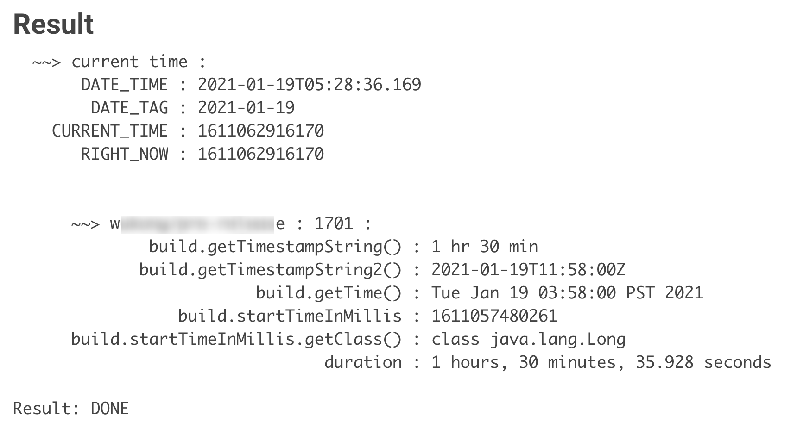
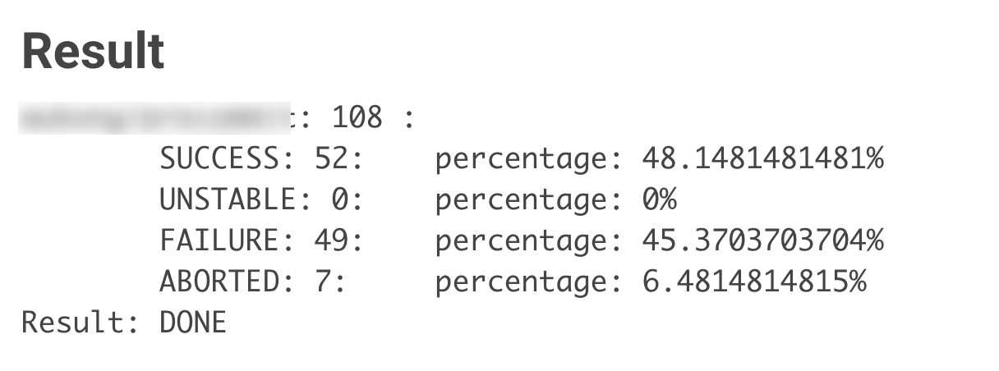
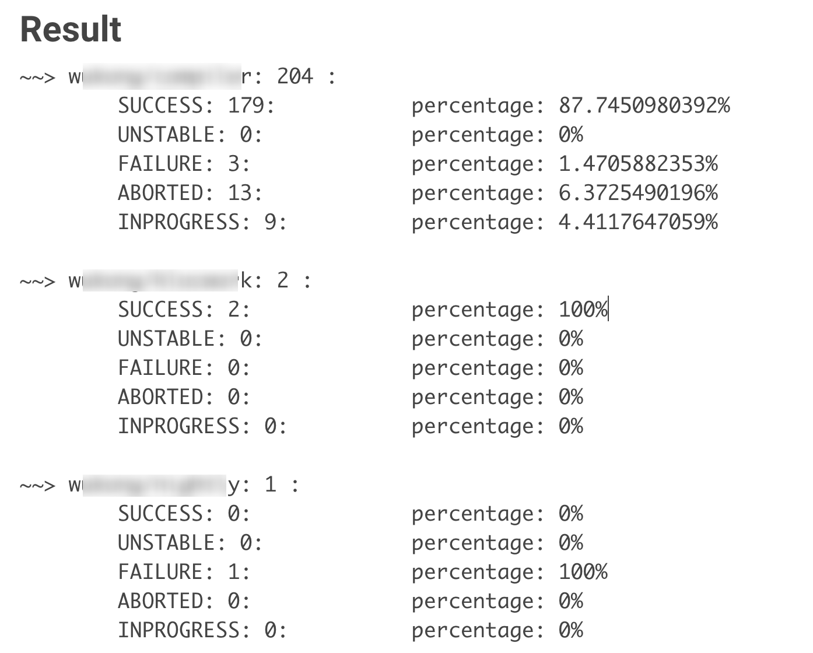
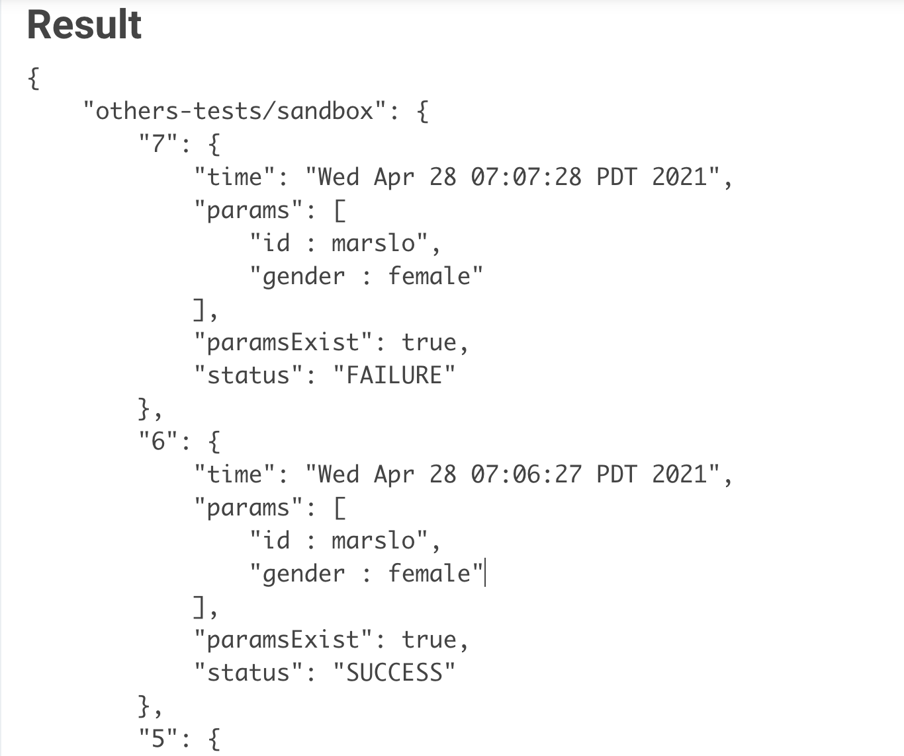
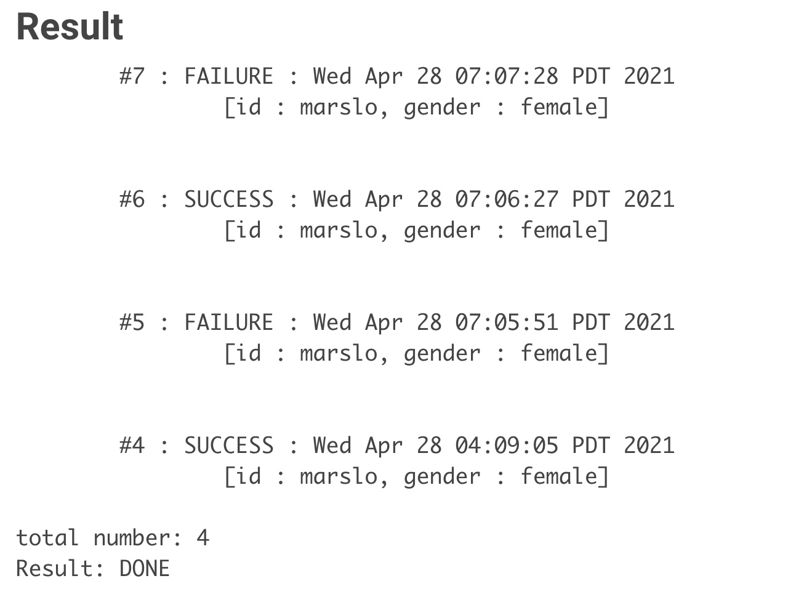
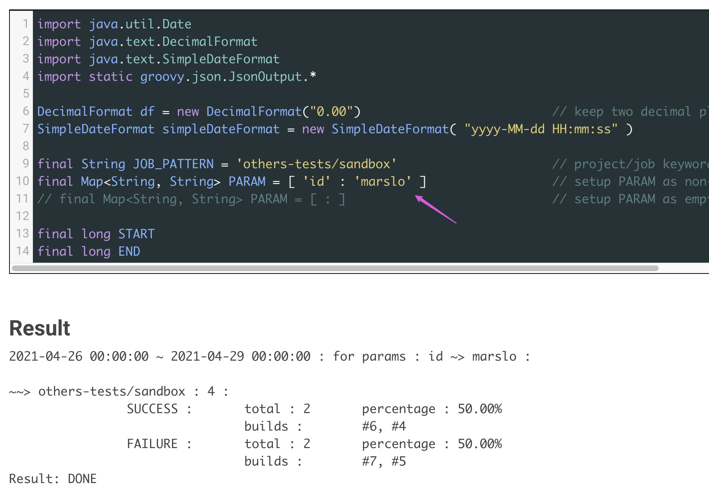

<!-- START doctoc generated TOC please keep comment here to allow auto update -->
<!-- DON'T EDIT THIS SECTION, INSTEAD RE-RUN doctoc TO UPDATE -->

- [get build](#get-build)
  - [get WorkflowRun by build number](#get-workflowrun-by-build-number)
  - [get build details](#get-build-details)
    - [setup next build number](#setup-next-build-number)
  - [build cause](#build-cause)
    - [trigger cause](#trigger-cause)
    - [get build cause](#get-build-cause)
    - [get builds cause (within 24 hours)](#get-builds-cause-within-24-hours)
    - [details on `Cause.UserIdCause`](#details-on-causeuseridcause)
    - [GerritCause](#gerritcause)
  - [abort cause](#abort-cause)
    - [builds aborted by timeout](#builds-aborted-by-timeout)
    - [abort by userId `CauseOfInterruption.UserInterruption`](#abort-by-userid-causeofinterruptionuserinterruption)
    - [get all abort causes](#get-all-abort-causes)
  - [build log](#build-log)
    - [get console output](#get-console-output)
    - [check whether if log kept](#check-whether-if-log-kept)
    - [check last N logs](#check-last-n-logs)
  - [build parameters](#build-parameters)
    - [get build parameters](#get-build-parameters)
    - [get builds parameters](#get-builds-parameters)
    - [get wanted parameter values in builds](#get-wanted-parameter-values-in-builds)
    - [get only `String` type parameters](#get-only-string-type-parameters)
    - [retrieving parameters and triggering another build](#retrieving-parameters-and-triggering-another-build)
    - [get queue jobs parameters](#get-queue-jobs-parameters)
  - [build changesets](#build-changesets)
    - [code clone via DSL](#code-clone-via-dsl)
  - [SCM info](#scm-info)
    - [get repo url](#get-repo-url)
  - [build time](#build-time)
    - [get started build time](#get-started-build-time)
    - [sort last build](#sort-last-build)
    - [sort all buildable jobs](#sort-all-buildable-jobs)
- [list builds](#list-builds)
  - [list all running builds](#list-all-running-builds)
    - [list all running builds via pattern](#list-all-running-builds-via-pattern)
    - [list builds running more than 24 hours via executor](#list-builds-running-more-than-24-hours-via-executor)
    - [list builds running more than 24 hours via pattern](#list-builds-running-more-than-24-hours-via-pattern)
  - [list builds via job pattern](#list-builds-via-job-pattern)
    - [list all builds byTimestamp ( within 24 hours )](#list-all-builds-bytimestamp--within-24-hours-)
    - [get last 24 hours failure builds](#get-last-24-hours-failure-builds)
    - [get last 24 hours failure builds via Map structure](#get-last-24-hours-failure-builds-via-map-structure)
  - [list build with results](#list-build-with-results)
    - [get all builds result percentage](#get-all-builds-result-percentage)
    - [get builds result percentage within 24 hours](#get-builds-result-percentage-within-24-hours)
    - [get builds result data range](#get-builds-result-data-range)
    - [get builds result and percentage in data range](#get-builds-result-and-percentage-in-data-range)
- [stop builds](#stop-builds)
  - [abort single build](#abort-single-build)
  - [abort previous running builds by params condition](#abort-previous-running-builds-by-params-condition)
  - [stop all queue and running jobs](#stop-all-queue-and-running-jobs)
  - [stop all running builds via pattern](#stop-all-running-builds-via-pattern)
  - [stop all running builds started in 24 hours](#stop-all-running-builds-started-in-24-hours)
  - [list all queue tasks and blocked reason](#list-all-queue-tasks-and-blocked-reason)
- [remove builds](#remove-builds)
  - [delete multiple builds](#delete-multiple-builds)

<!-- END doctoc generated TOC please keep comment here to allow auto update -->


> javadoc
> - [org.jenkinsci.plugins.workflow.job.WorkflowRun](https://javadoc.jenkins.io/plugin/workflow-job/org/jenkinsci/plugins/workflow/job/WorkflowRun.html)
> - [How to get details of Successful Jenkins build in last x days](https://stackoverflow.com/a/58320445/2940319)
> - [`build.getAction(ParametersAction.class)`](https://stackoverflow.com/a/54924165/2940319)
> - [Variables defined in groovy script always resolve to null](https://stackoverflow.com/a/22411076/2940319)
> - [`build.buildVariableResolver.resolve`](https://stackoverflow.com/a/26545605/2940319)
> - [groovy.lang.MissingPropertyException: No such property: jenkins for class: groovy.lang.Binding](https://stackoverflow.com/q/47064135/2940319)
> - [Class BuildVariableResolver](https://javadoc.jenkins.io/plugin/plasticscm-plugin/index.html?com/codicesoftware/plugins/hudson/util/BuildVariableResolver.html)
> - [batmat/get-jenkins-build-time.groovy](https://gist.github.com/batmat/91faa3201ad2ae88e3d8)
> source code:
> - [WorkflowRun.java](https://github.com/jenkinsci/workflow-job-plugin/blob/master/src/main/java/org/jenkinsci/plugins/workflow/job/WorkflowRun.java)
> - [GitSCM.java](https://github.com/jenkinsci/git-plugin/blob/master/src/main/java/hudson/plugins/git/GitSCM.java)
> - [GitChangeSetList.java](https://github.com/jenkinsci/git-plugin/blob/master/src/main/java/hudson/plugins/git/GitChangeSetList.java)
> sample code:
> - [Jenkins : Enable Timestamper plugin on all jobs](https://wiki.jenkins.io/display/JENKINS/Enable-Timestamper-plugin-on-all-jobs.html)
> - [Jenkins : Display timer triggers](https://wiki.jenkins.io/display/JENKINS/Display-timer-triggers.html)
> - [Jenkins : Display the number of jobs using SCM Polling from Freestyle, Pipeline and Maven](https://wiki.jenkins.io/display/JENKINS/138454178.html)
> - [Jenkins : Delete workspace for all disabled jobs](https://wiki.jenkins.io/display/JENKINS/Delete-workspace-for-all-disabled-jobs.html)
> - [Jenkins : Delete .tmp files left in workspace-files](https://wiki.jenkins.io/display/JENKINS/Delete-.tmp-files-left-in-workspace-files.html)
> - [Jenkins : Change publish over SSH configuration](https://wiki.jenkins.io/display/JENKINS/Change-publish-over-SSH-configuration.html)
> references:
> - [jenkins.model.BuildDiscarder](https://programtalk.com/java-api-usage-examples/jenkins.model.BuildDiscarder/)
> - [jenkins.model.BuildDiscarderProperty](https://programtalk.com/java-api-usage-examples/jenkins.model.BuildDiscarderProperty/)


> [!TIP]
> references:
> - `currentBuild.class` == [Class RunWrapper](https://javadoc.jenkins.io/plugin/workflow-support/org/jenkinsci/plugins/workflow/support/steps/build/RunWrapper.html)
> - `currentBuild.rawBuild.class` == `Jenkins.instance.getItemByFullName(String).getBuildByNumber(int).class` == [Class WorkflowRun](https://javadoc.jenkins.io/plugin/workflow-job/org/jenkinsci/plugins/workflow/job/WorkflowRun.html)


> references:
> - [Jenkins : Find builds currently running that has been executing for more than N seconds](https://wiki.jenkins.io/display/JENKINS/Find-builds-currently-running-that-has-been-executing-for-more-than-N-seconds.html)
> - [Jenkins : Display list of projects that were built more than 1 day ago](https://wiki.jenkins.io/display/JENKINS/Display-list-of-projects-that-were-built-more-than-1-day-ago..html)
> - [Jenkins : Display jobs group by the build steps they use](https://wiki.jenkins.io/display/JENKINS/Display-jobs-group-by-the-build-steps-they-use.html)


> [!TIP|style:flat|label:get builds|icon:fa fa-bullhorn]
> - inherited from `hudson.model.Job` :
>   - `WorkflowJob.getBuilds()` : `[marslo/sandbox #2, marslo/sandbox #1]`
>   - `WorkflowJob.getBuildsAsMap()` : `[2:marslo/sandbox #2, 1:marslo/sandbox #1]`
>   - `WorkflowJob.getLastFailedBuild()` : get last failed build
>   - `WorkflowJob.getLastStableBuild()` : get last stable build
>   - `WorkflowJob.getLastSuccessfulBuild()` : get last successful build
>   - `WorkflowJob.getLastUnstableBuild()` : get last unstalbe build
>   - `WorkflowJob.getLastUnsuccessfulBuild()` : get last unsuccessful build
>   - `WorkflowJob.getLastCompletedBuild()` : get last completed only build
> - from `org.jenkinsci.plugins.workflow.job.WorkflowJob` :
>   - `WorkflowJob.getBuildByNumber(int n)` : get specific build by number
>   - `WorkflowJob.getFirstBuild()` : get first build
>   - `WorkflowJob.getLastBuild()` : get last build
>   - `WorkflowJob.getNearestBuild(int n)` : gets the youngest build #m that satisfies n<=m.
>   - `WorkflowJob.getNearestOldBuild(int n)` : gets the latest build #m that satisfies m<=n.

# get build

## get WorkflowRun by build number
```groovy
final String JOB_NAME  = 'marslo/sandbox'
final int BUILD_NUMBER = 6458

def build = Jenkins.instance
                   .getItemByFullName( JOB_NAME )
                   .getBuildByNumber( BUILD_NUMBER )
```

## get build details
```groovy
import org.jenkinsci.plugins.workflow.job.WorkflowJob
import hudson.util.RunList

WorkflowJob job = Jenkins.instance.getItemByFullName( '/marslo/sandbox/test' )
RunList runList = job.getBuilds()

println """
                  all builds : ${job.getBuildsAsMap().collect{ k, v -> k }}
                build exists : ${job.getBuilds().collect { it.id }.contains( 25.toString() )}

             completedOnly() : ${runList.completedOnly().collect{ it.id }}
               failureOnly() : ${runList.failureOnly().collect{ it.id }}
              getLastBuild() : ${runList.getLastBuild()}
             getFirstBuild() : ${runList.getFirstBuild()}

     getLastCompletedBuild() : ${job.getLastCompletedBuild()}
        getLastFailedBuild() : ${job.getLastFailedBuild()}
        getLastStableBuild() : ${job.getLastStableBuild()}
    getLastSuccessfulBuild() : ${job.getLastSuccessfulBuild()}
      getLastUnstableBuild() : ${job.getLastUnstableBuild()}
  getLastUnsuccessfulBuild() : ${job.getLastUnsuccessfulBuild()}
                 isInQueue() : ${job.isInQueue()}
           getActions.causes : ${runList.collect{ run -> run.id + ': ' + run.getActions( jenkins.model.InterruptedBuildAction.class ).causes.flatten().collect{ it.class.simpleName } }}
"""
```
- result:
  ```
                    all builds : [42, 41, 40, 39, 38, 37, 36, 35, 34, 33, 32, 31, 30, 29, 28, 27, 26, 25, 24, 23, 22, 21, 20, 19, 18, 17, 16, 15, 14, 13, 12, 11, 10, 9, 8, 7, 6, 5, 4, 3, 2, 1]
                  build exists : true

               completedOnly() : [42, 41, 40, 39, 38, 37, 36, 35, 34, 33, 32, 31, 30, 29, 28, 27, 26, 25, 24, 23, 22, 21, 20, 19, 18, 17, 16, 15, 14, 13, 12, 11, 10, 9, 8, 7, 6, 5, 4, 3, 2, 1]
                 failureOnly() : [42, 41, 40, 36, 35, 34, 33, 32, 31, 30, 29, 28, 27, 26, 24, 23, 22, 21, 20, 19, 18, 17, 16, 15, 14, 13, 12, 11, 10, 9, 8, 7, 6, 5, 4, 3, 2, 1]
                getLastBuild() : marslo/abort #42
               getFirstBuild() : marslo/abort #1

       getLastCompletedBuild() : marslo/abort #42
          getLastFailedBuild() : marslo/abort #32
          getLastStableBuild() : marslo/abort #39
      getLastSuccessfulBuild() : marslo/abort #39
        getLastUnstableBuild() : null
    getLastUnsuccessfulBuild() : marslo/abort #42
                   isInQueue() : false
             getActions.causes : [42: [ExceededTimeout], 41: [ExceededTimeout], 40: [ExceededTimeout], 36: [ExceededTimeout], 35: [ExceededTimeout], 34: [ExceededTimeout], 33: [ExceededTimeout], 32: [], 31: [], 30: [ExceededTimeout], 29: [], 28: [], 27: [], 26: [], 24: [], 23: [], 22: [ExceededTimeout], 21: [], 20: [], 19: [ExceededTimeout], 18: [ExceededTimeout], 17: [], 16: [], 15: [], 14: [], 13: [], 12: [], 11: [], 10: [ExceededTimeout], 9: [ExceededTimeout], 8: [UserInterruption], 7: [ExceededTimeout], 6: [UserInterruption], 5: [UserInterruption], 4: [ExceededTimeout], 3: [ExceededTimeout], 2: [UserInterruption], 1: [ExceededTimeout]]
  ```

#### get culprits
```groovy
println build.getCulprits()
```

### setup next build number
```groovy
Jenkins.instance
       .getItemByFullName( '/path/to/job' )
       .updateNextBuildNumber( n )
```

## build cause
### trigger cause


> references:
> - [Cause.UpstreamCause](https://javadoc.jenkins-ci.org/hudson/model/Cause.UpstreamCause.html)
> - [Cause.UserIdCause](https://javadoc.jenkins.io/hudson/model/Cause.UserIdCause.html)
> - [RebuildCause](https://javadoc.jenkins.io/plugin/rebuild/com/sonyericsson/rebuild/RebuildCause.html)
> - [ReplayCause](https://javadoc.jenkins.io/plugin/workflow-cps/org/jenkinsci/plugins/workflow/cps/replay/ReplayCause.html)
> - [TimerTrigger.TimerTriggerCause](https://javadoc.jenkins.io/hudson/triggers/TimerTrigger.TimerTriggerCause.html)
> - [ParameterizedTimerTriggerCause](https://javadoc.jenkins.io/plugin/parameterized-scheduler/org/jenkinsci/plugins/parameterizedscheduler/ParameterizedTimerTriggerCause.html)
> see also
> - [imarslo: jenkinsfile/triggered by](../jenkinsfile/trigger.html#triggered-by)


```groovy
import org.jenkinsci.plugins.parameterizedscheduler.ParameterizedTimerTriggerCause
import hudson.model.Cause.UpstreamCause
import org.jenkinsci.plugins.workflow.cps.replay.ReplayCause
import com.sonyericsson.rebuild.RebuildCause
import hudson.model.Cause.UserIdCause
import com.sonyericsson.hudson.plugins.gerrit.trigger.hudsontrigger.GerritCause
import org.jenkinsci.plugins.workflow.job.WorkflowJob
import hudson.util.RunList

WorkflowJob job = Jenkins.instance.getItemByFullName( '/path/to/job' )
RunList builds  = job.getBuilds()

builds.each { build ->
  println build.number
  println build.getCauses()
  println build.getCauses().collect { it.getClass().getCanonicalName() }
  println "byUser        : ${build.getCause( UserIdCause.class  ) && true        }"
  println "byRebuild     : ${build.getCause( RebuildCause.class ) && true        }"
  println "byReplay      : ${build.getCause( ReplayCause.class  ) && true        }"
  println "byUpstream    : ${build.getCause( Cause.UpstreamCause.class ) && true }"
  println "byGerritCause : ${build.getCause( GerritCause.class ) && true         }"
}

"DONE"
```

### get build cause
```groovy
List<String> projects = [ 'project-1', 'project-2', 'project-n' ]
Jenkins.instance.getAllItems( Job.class ).findAll {
  projects.any { p -> it.fullName.startsWith(p) }
}.each {
  println it.name + "\t -> " + it.fullName + "\t ~> " +
          ( it.getLastBuild()?.getCauses()?.collect { it.getClass().getCanonicalName() }?.join(', ') ?: 'no build' )
}

"DONE"
```
- result
  ```
  user-trigger -> marslo/user-trigger ~> hudson.model.Cause.UserIdCause
  sandbox      -> marslo/sandbox      ~> hudson.model.Cause.UserIdCause, org.jenkinsci.plugins.workflow.cps.replay.ReplayCause
  whitebox     -> marslo/whitebox     ~> org.jenkinsci.plugins.workflow.support.steps.build.BuildUpstreamCause, hudson.model.Cause.UserIdCause, com.sonyericsson.rebuild.RebuildCause
  replay       -> marslo/reply        ~> org.jenkinsci.plugins.workflow.cps.replay.ReplayCause, hudson.model.Cause.UserIdCause, com.sonyericsson.rebuild.RebuildCause
  no-build     -> marslo/no-build     ~> no build
  rebuild      -> marslo/rebuild      ~> org.jenkinsci.plugins.workflow.cps.replay.ReplayCause, hudson.model.Cause.UserIdCause, com.sonyericsson.rebuild.RebuildCause
  upstream     -> marslo/upstream     ~> org.jenkinsci.plugins.workflow.support.steps.build.BuildUpstreamCause
  Result: DONE
  ```

- or
  ```groovy
  List<String> projects = [ 'project-1', 'project-2', 'project-n' ]
  Jenkins.instance.getAllItems( Job.class ).findAll {
    projects.any { p -> it.fullName.startsWith(p) }
  }.each {
    println it.name + "\t -> " +
            it.fullName + " :\n\t\t" +
            (
              it.getLastBuild()?.getCauses()?.collect { it.getClass().getCanonicalName() }.join('\n\t\t') ?: 'no-builds'
            )
  }
  "DONE"
  ```

### get builds cause (within 24 hours)
```groovy
import hudson.model.Job
import hudson.model.Run
import java.util.Calendar
import jenkins.model.Jenkins

final List<String> PROJECTS = [ 'project-1' ]
final long BENCH_MARK       = 1*24*60*60*1000
final Calendar RIGHT_NOW    = Calendar.getInstance()

Jenkins.instance.getAllItems(Job.class).findAll { Job job ->
  PROJECTS.any { job.fullName.startsWith(it) }
}.collectEntries { Job job ->
  [
    ( job.fullName ) : job.builds.findAll { Run run ->
                         ( RIGHT_NOW.getTimeInMillis() - run.getStartTimeInMillis() ) <= BENCH_MARK
                       }.collectEntries { Run run ->
                         [
                           (run.id) : run.getCauses()?.collect { it.getClass().getSimpleName() }?.join(' -> ')
                         ]
                       }

  ]
}.collectEntries { k, v ->
  [
    (k) : v.groupBy( {it.value} )
           .collectEntries{ x, y -> [ (x) : y.keySet() ] }
  ]
}.each{ k, v ->
  println ">> ${k} : ${v.values().flatten().size()}"
  println v.collect { "\t${it.key} : \n\t\t${it.value.join('\n\t\t')}" }.join('\n')
}

"DONE"
```

- result
  ```groovy
  >> project-1 : 4
     BuildUpstreamCause :
       122
       123
     BuildUpstreamCause ->  UserIdCause ->  RebuildCause :
       124
     UserIdCause ->  ReplayCause :
       125
  Result: DONE
  ```

### details on `Cause.UserIdCause`
```groovy
Jenkins.instance
       .getItemByFullName( JOB_NAME )
       .getBuildByNumber( JOB_NUMBER )
       .getActions( hudson.model.CauseAction.class )
       .causes
       .flatten()
       .each { c ->
          println c.userId
          println c.getUserName()
          println c.getShortDescription()
          println c.getUserUrl()
       }
```

### GerritCause

> references:
> - [gerrit-events/Change.java](https://github.com/sonyxperiadev/gerrit-events/blob/master/src/main/java/com/sonymobile/tools/gerrit/gerritevents/dto/attr/Change.java)
> - [gerrit-events/GerritTriggeredEvent.java](https://github.com/sonyxperiadev/gerrit-events/blob/master/src/main/java/com/sonymobile/tools/gerrit/gerritevents/dto/events/GerritTriggeredEvent.java)
> - [gerrit-events/Provider.java](https://github.com/sonyxperiadev/gerrit-events/blob/master/src/main/java/com/sonymobile/tools/gerrit/gerritevents/dto/attr/Provider.java)
>
> APIs:
> - [All Classes](https://javadoc.jenkins.io/plugin/gerrit-trigger/allclasses.html)
> - [GerritCause](https://javadoc.jenkins.io/plugin/gerrit-trigger/com/sonyericsson/hudson/plugins/gerrit/trigger/hudsontrigger/GerritCause.html)
> - [GerritUserCause](https://javadoc.jenkins.io/plugin/gerrit-trigger/com/sonyericsson/hudson/plugins/gerrit/trigger/hudsontrigger/GerritUserCause.html)
> - [GerritManualCause](https://javadoc.jenkins.io/plugin/gerrit-trigger/com/sonyericsson/hudson/plugins/gerrit/trigger/hudsontrigger/GerritManualCause.html)
> - [ManualPatchsetCreated](https://javadoc.jenkins.io/plugin/gerrit-trigger/com/sonyericsson/hudson/plugins/gerrit/trigger/events/ManualPatchsetCreated.html)
> - [TriggerContext](https://javadoc.jenkins.io/plugin/gerrit-trigger/com/sonyericsson/hudson/plugins/gerrit/trigger/hudsontrigger/data/TriggerContext.html)
> - [ManualTriggerAction](https://javadoc.jenkins.io/plugin/gerrit-trigger/com/sonyericsson/hudson/plugins/gerrit/trigger/hudsontrigger/actions/manual/ManualTriggerAction.html)
> - [GerritEventLifecycleListener](https://javadoc.jenkins.io/plugin/gerrit-trigger/com/sonyericsson/hudson/plugins/gerrit/trigger/events/lifecycle/GerritEventLifecycleListener.html)
> - [GerritProject](https://javadoc.jenkins.io/plugin/gerrit-trigger/com/sonyericsson/hudson/plugins/gerrit/trigger/hudsontrigger/data/GerritProject.html)


```groovy
import org.jenkinsci.plugins.workflow.job.WorkflowJob
import hudson.util.RunList
import com.sonyericsson.hudson.plugins.gerrit.trigger.hudsontrigger.GerritCause
import com.sonyericsson.hudson.plugins.gerrit.trigger.hudsontrigger.GerritUserCause
import com.sonyericsson.hudson.plugins.gerrit.trigger.hudsontrigger.GerritManualCause
import com.sonymobile.tools.gerrit.gerritevents.dto.events.CommentAdded
import com.sonymobile.tools.gerrit.gerritevents.dto.events.RefUpdated
import com.sonymobile.tools.gerrit.gerritevents.dto.events.PatchsetCreated

WorkflowJob job = Jenkins.instance.getItemByFullName( '/path/to/pipeline' )
RunList builds  = job.getBuilds()

builds.each { build ->
  if ( build.getCause( GerritCause.class ) && true ) {
    println build.number
    println "context           : ${build.getCause( GerritCause.class ).getContext()}"
    println "  build number    : ${build.getCause( GerritCause.class ).getContext().getThisBuild().getBuildNumber().toString()}"
    println "  project name    : ${build.getCause( GerritCause.class ).getContext().getThisBuild().getProjectId()}"
    println "description       : ${build.getCause( GerritCause.class ).getShortDescription()}"
    println "url               : ${build.getCause( GerritCause.class ).getUrl()}"
    println "events            : ${build.getCause( GerritCause.class ).getEvent().getClass()}"
    println "  byCommentAdded  : " +
            ( build.getCause(GerritCause.class).getEvent() instanceof CommentAdded ).toString()
    println "  byRefUpdated    : " +
            ( build.getCause(GerritCause.class).getEvent() instanceof RefUpdated ).toString()
    println "  byPathUpdated   : " +
            ( build.getCause(GerritCause.class).getEvent() instanceof PatchsetCreated).toString()
    println "  server hostname : " +
            build.getCause( GerritCause.class ).getEvent().getProvider().host
    println "  server port     : " +
            build.getCause( GerritCause.class ).getEvent().getProvider().port
    println "  server version  : " +
            build.getCause( GerritCause.class ).getEvent().getProvider().version
    println '.'*10
    println "userCause?        : ${build.getCause( GerritUserCause.class ) && true}"
    if (build.getCause( GerritUserCause.class ) && true) {
      println "  comments        : " +
              build.getCause( GerritUserCause.class )?.getEvent().comment
      println "  approvals       : " +
              build.getCause( GerritUserCause.class )?.getEvent().approvals
      println "  change          : " +
              build.getCause( GerritUserCause.class )?.getEvent().change
      println "  usernmae        : " +
              build.getCause( GerritUserCause.class )?.getUserName()
      println "  description     : " +
              build.getCause( GerritUserCause.class )?.getShortGerritDescription()
      println "  changer account : " +
              build.getCause( GerritUserCause.class )?.getEvent().getAccount().name
      println "  changer email   : " +
              build.getCause( GerritUserCause.class )?.getEvent().getAccount().email
    }
    println '.'*10
    println "manualCause?      : ${build.getCause( GerritManualCause.class ) && true}"
    println '~'*30
  }
}

"DONE"
```

  <!--sec data-title="Result" data-id="section1" data-show=true data-collapse=true ces-->
  ```
  10121
  context           : com.sonyericsson.hudson.plugins.gerrit.trigger.hudsontrigger.data.TriggerContext@6fbdc2a5
    build number    : 10121
    project name    : /path/to/project
  description       : Retriggered by user marslo for Gerrit: https://my.gerrit.com/c/my/project/+/72667
  url               : https://my.gerrit.com/c/my/project/+/72667
  events            : class com.sonymobile.tools.gerrit.gerritevents.dto.events.CommentAdded
    byCommentAdded  : true
    byRefUpdated    : false
    byPathUpdated   : false
    server hostname : my.gerrit.com
    server port     : 29418
    server version  : 2.16.27-RP-1.10.1.1
  ..........
  userCause?        : true
    comments        : Patch Set 104: Code-Review+2
    approvals       : [Approval: Verified 0, Approval: Code-Review 2]
    change          : Change-Id for #72667: I68e47b094e142a63cec7c698094320d79f5350f8
    usernmae        : marslo
    description     : Retriggered by user marslo for Gerrit: https://my.gerrit.com/c/my/project/+/72667
    changer account : Marslo Jiao
    changer email   : marslo@gmail.com
  ..........
  manualCause?      : false
  ~~~~~~~~~~~~~~~~~~~~~~~~~~~~~~
  10120
  context           : com.sonyericsson.hudson.plugins.gerrit.trigger.hudsontrigger.data.TriggerContext@26ab2c12
    build number    : 10120
    project name    : /path/to/project
  description       : Triggered by Gerrit: https://my.gerrit.com/c/my/project/+/123069
  url               : https://my.gerrit.com/c/my/project/+/123069
  events            : class com.sonymobile.tools.gerrit.gerritevents.dto.events.CommentAdded
    byCommentAdded  : true
    byRefUpdated    : false
    byPathUpdated   : false
    server hostname : my.gerrit.com
    server port     : 29418
    server version  : 2.16.27-RP-1.10.1.1
  ..........
  userCause?        : false
  ..........
  manualCause?      : false
  ~~~~~~~~~~~~~~~~~~~~~~~~~~~~~~
  ```
  <!--endsec-->

## abort cause

> references:
> - [FlowInterruptedException cause is not available in post condition](https://issues.jenkins.io/browse/JENKINS-62257)
>   - `org.jenkinsci.plugins.workflow.support.steps.build.BuildTriggerCancelledCause`
>   - `org.jenkinsci.plugins.workflow.support.steps.build.DownstreamFailureCause`
> - [Halt a jenkins pipeline job early](https://stackoverflow.com/a/43889224/2940319)
> - [Thread.getAllStackTraces()](https://stackoverflow.com/a/26306081/2940319)
> - [Pipeline: How to add an input step, with timeout, that continues if timeout is reached, using a default value](https://support.cloudbees.com/hc/en-us/articles/226554067-Pipeline-How-to-add-an-input-step-with-timeout-that-continues-if-timeout-is-reached-using-a-default-value)
> - [How to time out Jenkins Pipeline stage and keep the pipeline running?](https://e.printstacktrace.blog/how-to-time-out-jenkins-pipeline-stage-and-keep-the-pipeline-running/)
> - [Pipeline retry operation doesn't retry when there is a timeout inside of it](https://issues.jenkins.io/browse/JENKINS-51454)
> - [jenkins.model.InterruptedBuildAction](https://programtalk.com/java-api-usage-examples/jenkins.model.InterruptedBuildAction/)
> - [Class InterruptedBuildAction](https://javadoc.jenkins.io/jenkins/model/InterruptedBuildAction.html)
> - [Cancelling of concurrent pipeline run due to milestone wrongly claims that user aborted via FlowInterruptedException#actualInterruption](https://issues.jenkins.io/browse/JENKINS-67067)


```groovy
Jenkins.instance
       .getItemByFullName( JOB_NAME )
       .getBuildByNumber( BUILD_NUMBER )
       .getActions( jenkins.model.InterruptedBuildAction.class )
       .causes
       .flatten()
```

### builds aborted by timeout
```groovy
import org.jenkinsci.plugins.workflow.steps.TimeoutStepExecution

Jenkins.instance
       .getItemByFullName( JOB_NAME )
       .getBuildByNumber( BUILD_NUMBER )
       .getActions( jenkins.model.InterruptedBuildAction.class )
       .causes
       .flatten()
       .any { it instanceof TimeoutStepExecution.ExceededTimeout }
```

- or
  ```groovy
  import org.jenkinsci.plugins.workflow.steps.TimeoutStepExecution
  import org.jenkinsci.plugins.workflow.job.WorkflowJob

  WorkflowJob job = Jenkins.instance.getItemByFullName( JOB_NAME )
  job.builds.findAll { Run run ->
    BUILD_NUMBER.toString() == run.id
  }.collect { Run run -> run.getActions( jenkins.model.InterruptedBuildAction.class )
                            .causes
                            .flatten()
                            .any { it instanceof TimeoutStepExecution.ExceededTimeout }
  }
  ```

### abort by userId `CauseOfInterruption.UserInterruption`
```groovy
import org.jenkinsci.plugins.workflow.support.steps.build.BuildTriggerCancelledCause
import jenkins.model.CauseOfInterruption

Jenkins.instance
       .getItemByFullName( JOB_NAME )
       .getBuildByNumber( BUILD_NUMBER )
       .getActions( jenkins.model.InterruptedBuildAction.class )
       .causes
       .flatten()
       .any { c ->
                  [ CauseOfInterruption.UserInterruption, BuildTriggerCancelledCause ].any {
                    it.isAssignableFrom( c.getClass() )
                  }
            }
```

- get user details
  ```bash
  import jenkins.model.CauseOfInterruption

  Jenkins.instance
         .getItemByFullName( '/marslo/sandbox/abort' )
         .getBuildByNumber(159)
         .getActions( jenkins.model.InterruptedBuildAction.class )
         .causes
         .flatten()
         .findAll { c -> [ CauseOfInterruption.UserInterruption ].any { it.isAssignableFrom(c.getClass()) } }
         .each { c ->
           User user = c.user
           println c.getShortDescription()
           println "${user.fullName} : ${user.absoluteUrl}"
           currentBuild.description = 'ABORTED by user : <a href="${user.absoluteUrl}">' +
                                      "${user.displayName} [ ${user.id} ]</a>"
           currentBuild.result = 'NOT_BUILT'
         }
  ```

### get all abort causes
```groovy
import org.jenkinsci.plugins.workflow.job.WorkflowJob

WorkflowJob job = Jenkins.instance.getItemByFullName( JOB_NAME )
job.builds.findAll { Run run ->
  run.getActions( jenkins.model.InterruptedBuildAction.class ).causes
}.collect{ Run run ->
  List c = run.getActions( jenkins.model.InterruptedBuildAction.class ).causes
  "#${run.id} : ${c.flatten().collect{ it.class.simpleName }.first()}"
}.join('\n')
```

- result
  ```
  #42 : ExceededTimeout
  #41 : ExceededTimeout
  #40 : ExceededTimeout
  #36 : ExceededTimeout
  #35 : ExceededTimeout
  #34 : ExceededTimeout
  #33 : ExceededTimeout
  #30 : ExceededTimeout
  #22 : ExceededTimeout
  #19 : ExceededTimeout
  #18 : ExceededTimeout
  #10 : ExceededTimeout
  #9 : ExceededTimeout
  #8 : UserInterruption
  #7 : ExceededTimeout
  #6 : UserInterruption
  #5 : UserInterruption
  #4 : ExceededTimeout
  #3 : ExceededTimeout
  #2 : UserInterruption
  #1 : ExceededTimeout
  ```

## build log
### get console output


> references:
> - [org.kohsuke.stapler.framework.io.LargeText](https://javadoc.jenkins.io/component/stapler/org/kohsuke/stapler/framework/io/LargeText.html)
> - [How To Read Console Output In Jenkins During Build](https://automationscript.com/how-to-read-console-output-in-jenkins-pipeline/)
> - [[FIXED] Jenkins console output not in realtime](https://www.javafixing.com/2022/02/fixed-jenkins-console-output-not-in.html)
> - [How To Read Console Output In Jenkins During Build](https://automationscript.com/how-to-read-console-output-in-jenkins-pipeline)


```groovy
Jenkins.instance
       .getItemByFullName( JOB_NAME )
       .getBuildByNumber( BUILD_NUMBER )
       .logFile
       .text
```

### check whether if log kept
```groovy
import org.jenkinsci.plugins.workflow.job.WorkflowJob

workflowJob job = Jenkins.getInstance().getItemByFullName( '/sandbox/job' )
job.builds.findAll { Run run -> run.isKeepLog() }
          .collect { Run run -> run.id }
```

- list build number and start timestamp
  ```bash
  List<String> projects = [ 'project-1', 'project-2', 'project-n' ]

  Jenkins.instance
         .getAllItems( Job.class )
         .findAll { projects.any { p -> it.fullName.startsWith(p) } }
         .findAll { job -> job.builds.any { Run run -> run.isKeepLog() } }
         .collectEntries {[
            ( it ) : it.builds.findAll { Run run -> run.isKeepLog() }
         ]}
         .each { k, v ->
           println '>> ' + k.fullName.padRight(35) + ': \n\t - ' +
             [
               v.id,
               v.collect{ new Date(it.startTimeInMillis).format("yyyy-MM-dd'T'HH:mm:ss.SSS'Z'") }
               // v.collect { groovy.time.TimeCategory.minus( new Date(), it.getTime() ) }
               // v.collect { it.getTime() }
             ].transpose()
              .collectEntries()
              .collect{ "${it.key.padRight(5)} : ${it.value}" }
              .join('\n\t - ')
         }

  "DONE"

  -- result --
  v.collect{ new Date(it.startTimeInMillis).format("yyyy-MM-dd'T'HH:mm:ss.SSS'Z'") } :
  >> marslo/sample
     - 454   : 2024-02-13T10:16:31.563Z
     - 36    : 2023-10-18T03:39:19.496Z
     - 32    : 2023-10-18T03:39:05.577Z

  v.collect { groovy.time.TimeCategory.minus( new Date(), it.getTime() ) } :
  >> marslo/sample
     - 454   : 1 days, 7 hours, 27 minutes, 13.394 seconds
     - 36    : 119 days, 15 hours, 4 minutes, 25.450 seconds
     - 32    : 119 days, 15 hours, 4 minutes, 39.369 seconds

  v.collect { it.getTime() }
  >> vail/sync                          :
     - 454   : Tue Feb 13 10:16:31 PST 2024
     - 36    : Wed Oct 18 03:39:19 PDT 2023
     - 32    : Wed Oct 18 03:39:05 PDT 2023
  ```

- or
  ```groovy
  List<String> projects = [ 'project-1', 'project-2', 'project-n' ]

  Jenkins.instance
         .getAllItems( Job.class )
         .findAll { projects.any { p -> it.fullName.startsWith(p) } }
         .collectEntries {[
            ( it.fullName.toString() ) : it.builds.findAll { Run run -> run.isKeepLog() }
                                                  .collect { Run run -> run.id }
         ]}
         .findAll { it.value }
         .each { k, v ->
            println "~~> ${k}:\n\t#${v.join('\n\t#')}"
         }
  "DONE"
  ```

### check last N logs

> [!NOTE|label:original log:]
> ```log
> 21:19:37  Running on Jenkins in /var/jenkins_home/workspace/marslo/desc
> [Pipeline] {
> [Pipeline] sh
> 21:19:37  + sleep 10
> 21:19:47
> 21:19:47  real  0m10.003s
> 21:19:47  user  0m0.000s
> 21:19:47  sys   0m0.003s
> [Pipeline] }
> [Pipeline] // node
> [Pipeline] }
> 21:19:47
> [Pipeline] // ansiColor
> [Pipeline] }
> [Pipeline] // timestamps
> [Pipeline] End of Pipeline
> Finished: SUCCESS
> ```

```groovy
Jenkins.instance.getItemByFullName( <JOB_PATTERN> )
                .getBuildByNumber( <BUILD_NUMBER> )
                .getLog( 30 )
                .find{ it.contains('real\t') }
                .split( '\t' )
                .last()
                .trim()

// Result: 0m10.003s
```

## build parameters
### [get build parameters](https://wiki.jenkins.io/display/JENKINS/Parameterized+System+Groovy+script)


> reference:
> - [`build?.actions.find{ it instanceof ParametersAction }`](https://stackoverflow.com/a/38130496/2940319)
> - [Jenkins & Groovy – accessing build parameters](https://rucialk.wordpress.com/2016/03/17/jenkins-groovy-accessing-build-parameters/)
> - [Parameterized System Groovy script](https://wiki.jenkins.io/display/JENKINS/Parameterized+System+Groovy+script)
> - [Jenkins : Display job parameters](https://wiki.jenkins.io/display/JENKINS/Display+job+parameters)
> - [Let users specify any kind of parameters when creating a job from a pipeline template and handle them in the job created](https://docs.cloudbees.com/docs/cloudbees-ci-kb/latest/client-and-managed-masters/let-users-specify-any-kind-of-parameters-when-creating-a-job-from-a-pipeline-template-and-handle-them-in-the-job-created)
> - [GenericBuild.groovy](https://github.com/root-project/jenkins-pipelines/blob/master/src/cern/root/pipeline/GenericBuild.groovy)


```groovy
def job = Jenkins.getInstance().getItemByFullName( '/marlso/sandbox' )
job.builds.each { Run run ->
  String parameters = run?.getAction(ParametersAction.class)?.parameters?.collectEntries {
    [ it.name, it.value ]
  }.collect { k, v -> "\t\t${k}\t: ${v}" }
   .join('\n')
  println "#${run.id}: ${parameters}"
}

"DONE"
```
- result
  ```
  #7:     id  : marslo
      gender  : female
  #6:     id  : marslo
      gender  : female
  #5:     id  : marslo
      gender  : female
  #4:     id  : marslo
      gender  : female
  #3:     name  : marslo
      gender  : female
  #2:     name  : marslo
      gender  : female
  #1:
  ```

- or via `action instanceof ParametersAction`
  ```groovy
  def job = Jenkins.getInstance().getItemByFullName( 'others-tests/sandbox' )
  job.getBuilds().each { Run build ->
    String parameters = build?.actions.find{ it instanceof ParametersAction }?.parameters?.collectEntries {
      [ it.name, it.value ]
    }.collect { k, v -> "\t\t${k}\t: ${v}" }
     .join('\n')
    println "#${build.getId()}: ${parameters}"
  }
  ```

- [or](https://wiki.jenkins.io/display/JENKINS/Display+job+parameters) by using [Job Parameter Summary Plugin](https://wiki.jenkins.io/display/JENKINS/Job-Parameter-Summary-Plugin.html)
  ```groovy
  import hudson.model.*

  for( item in Hudson.instance.items ) {
    prop = item.getProperty( ParametersDefinitionProperty.class )
    if( prop ) {
      println( "--- Parameters for " + item.name + " ---" )
      for( param in prop.getParameterDefinitions() ) {
        try {
          println( param.name + " " + param.defaultValue )
        }
        catch( Exception e ) {
          println( param.name )
        }
      }
      println()
    }
  }
  ```

  - result
    ```
    --- Parameters for GRA-00-UploadIntoClearCase ---
    ONCSDAP1_USER jdoe
    ONCSDAP1_PASSWORD
    GRA_ZIP_NAME GRA_Delivery_r.2.0.0_28-5_impl.zip
    GRA_RELEASE n.28

    --- Parameters for IN8-03-DeployXnetWebAppToRecette ---
    STOP_START_AS
    ```

### get builds parameters

> [!TIP]
> running following snippet in Jenkinsfile

```groovy
params.each { param ->
  println " ~~> '${param.key.trim()}' -> '${param.value}' "
}
```
- or : [Jenkins : Parameterized System Groovy script](https://wiki.jenkins.io/display/JENKINS/Parameterized-System-Groovy-script.html)
  ```groovy
  def parameters = currentBuild.rawBuild?.getActions(ParametersAction.class)?.parameters
  parameters.each {
    println " ~~> ${it.name} -> ${it.value} -> ${it.description ?: ''} "
    println "-" * 20
  }
  ```
  - or
    ```groovy
    def parameters = currentBuild.rawBuild?.actions.find{ it instanceof ParametersAction }?.parameters
    ```

### get wanted parameter values in builds
```groovy
final String PARAM = 'id'
Map params = [:]

def job = Jenkins.getInstance().getItemByFullName( 'others-tests/sandbox' )
job.getBuilds().each { Run build ->
  params."${build.getId()}" = build?.getActions(ParametersAction.class)?.parameters?.collectEntries {
                                [ it.name , it.value ]
                              }
}

println params.collect { k , v ->
  "build #${k} ~~> ${v ? "${PARAM} : ${v.getOrDefault(PARAM, "No '${PARAM}' found")}" : 'No Params Found'}"
}.join('\n')
```

- result
  ```
  build #7 ~~> id : marslo
  build #6 ~~> id : marslo
  build #5 ~~> id : marslo
  build #4 ~~> id : marslo
  build #3 ~~> id : No 'id' found
  build #2 ~~> id : No 'id' found
  build #1 ~~> No Params Found
  ```

### get only `String` type parameters
```groovy
Map params = build?.getAction( ParametersAction.class )
                   .parameters?.findAll{ it instanceof StringParameterValue }?.dump()
```

- or
  ```groovy
  Map params = build?.getAction( ParametersAction.class )
                     .parameters?.findAll{ it instanceof StringParameterValue }?.collectEntries {
                       [ it.name, it.value ]
                     }
  ```

- or
  ```groovy
  Map params = build?.actions
                     .find{ it instanceof ParametersAction }?.parameters?.findAll{ it instanceof StringParameterValue }?.dump()
  ```

### [retrieving parameters and triggering another build](https://wiki.jenkins.io/display/JENKINS/Groovy-plugin.html)
```groovy
import hudson.model.*
import hudson.AbortException
import hudson.console.HyperlinkNote
import java.util.concurrent.CancellationException

// Retrieve parameters of the current build
def foo = build.buildVariableResolver.resolve("FOO")
println "FOO=$foo"

// Start another job
def job = Hudson.instance.getJob('MyJobName')
def anotherBuild
try {
    def params = [
      new StringParameterValue('FOO', foo),
    ]
    def future = job.scheduleBuild2(0, new Cause.UpstreamCause(build), new ParametersAction(params))
    println "Waiting for the completion of " + HyperlinkNote.encodeTo('/' + job.url, job.fullDisplayName)
    anotherBuild = future.get()
} catch (CancellationException x) {
    throw new AbortException("${job.fullDisplayName} aborted.")
}
println HyperlinkNote.encodeTo('/' + anotherBuild.url, anotherBuild.fullDisplayName) + " completed. Result was " + anotherBuild.result

// Check that it succeeded
build.result = anotherBuild.result
if (anotherBuild.result != Result.SUCCESS && anotherBuild.result != Result.UNSTABLE) {
    // We abort this build right here and now.
    throw new AbortException("${anotherBuild.fullDisplayName} failed.")
}

// Do something with the output.
// On the contrary to Parameterized Trigger Plugin, you may now do something from that other build instance.
// Like the parsing the build log (see http://javadoc.jenkins-ci.org/hudson/model/FreeStyleBuild.html )
// You probably may also wish to update the current job's environment.
build.addAction(new ParametersAction(new StringParameterValue('BAR', '3')))
```

### [get queue jobs parameters](https://stackoverflow.com/a/32912802/2940319)

> [!NOTE|label:refernece:]
> - [cg-soft/explore.groovy](https://gist.github.com/cg-soft/4251ad83932340129925)

```groovy
def q = Jenkins.instance.queue
q.items.each {
  println("${it.task.name}:")
  println("Parameters: ${it.params}")
}
```

## build changesets
### code clone via DSL
```groovy
checkout([
  $class: 'GitSCM',
  branches: [[ name: 'refs/heads/sandbox' ]],
  browser: [
    $class: 'GitWeb',
    repoUrl: 'https://my.gerrit.com/path/to/repo'
  ],
  userRemoteConfigs: [[
      credentialsId: 'SSHCredential',
      url: 'git://my.gerrit.com/path/to/repo.git'
  ]]
])
```


> references:
> - [hudson.plugins.git.GitChangeSet](https://javadoc.jenkins.io/plugin/git/hudson/plugins/git/GitChangeSet.html)
> - [hudson.plugins.git.GitChangeSetList](https://javadoc.jenkins.io/plugin/git/index.html?hudson/plugins/git/GitChangeSetList.html)
> - [jenkins.plugins.git.AbstractGitSCMSource](https://javadoc.jenkins.io/plugin/git/index.html?hudson/plugins/git/GitChangeSetList.html)
> - [hudson.model.AbstractBuild<P,R>](https://javadoc.jenkins.io/hudson/model/AbstractBuild.html#getChangeSets--)
> - [get changeset in Jenkisnfile](../jenkinsfile/jenkinsfile.html#get-changesets)


```groovy
Jenkins.instance
       .getItemByFullName( '/marslo/up' )
       .getBuildByNumber( 195 )
       .changeSets
       .each {
         it.items.each { i ->
           println """
             \n-----------------------------\n
                      paths : ${i.paths}
              parent commit : ${i.parentCommit}
                   commitId : ${i.commitId} : ${i.revision}
                     author : ${i.author}
                 authorName : ${i.authorName}
                authorEmail : ${i.authorEmail}
              committerTime : ${i.committerTime}
                    message : ${i.msg}
                    repoUrl : ${it.browser?.repoUrl ?: ''}
             affected files :
               \t\t${i.affectedFiles.collect{ f -> f.editType.name + ' : ' + f.path }.join('\n\t\t\t\t')}
           """
         }
       }
```

- get changeSets to `List<Map<String, String>>`:
  ```groovy
  def getChangeSets( String name, int nubmer ) {
    Jenkins.instance
           .getItemByFullName( name )
           .getBuildByNumber( number )
           .changeSets
  }

  def changeSetsEntry( def changeSets ) {
    List<Map<String, String>> changeSetsEntry = []
    changeSets.collect { it.items.collect { i ->
      changeSetsEntry += [
        'parentCommit'  : i.parentCommit      ,
        'commitId'      : i.commitId          ,
        'revision'      : i.revision          ,
        'author'        : i.author.toString() ,
        'authorName'    : i.authorName        ,
        'authorEmail'   : i.authorEmail       ,
        'committerTime' : i.committerTime     ,
        'msgAnnotated'  : i.msg               ,
        'affectedFiles' : i.affectedFiles.collect{ f -> ['editType' : f.editType.name, 'path' : f.path ] }
      ]
    }}
    return changeSetsEntry
  }

  // testing
  List<Map<String, String>> totalChangeSets = []
  totalChangeSets += changeSetsEntry( getChangeSets('/path/to/pipeline', 123) )
  totalChangeSets += changeSetsEntry( getChangeSets('/path/to/pipeline', 456) )
  totalChangeSets.each {
    println """
      it.getClass()
      it.author
      it.commitId
    """
  }
  ```

## SCM info


> references:
> - [jenkins.triggers.SCMTriggerItem](https://programtalk.com/java-api-usage-examples/jenkins.triggers.SCMTriggerItem/)
> - [hudson.plugins.git.GitSCM](https://javadoc.jenkins.io/plugin/git/hudson/plugins/git/GitSCM.html)
> - [hudson.plugins.git.UserRemoteConfig](https://javadoc.jenkins.io/plugin/git/hudson/plugins/git/UserRemoteConfig.html)
> - [Poll SCM and Timer triggers include "Changes" for a Pipeline for any/all Shared Libraries](https://issues.jenkins.io/browse/JENKINS-41497)
> - [jenkins.scm.SCMCheckoutStrategy](https://programtalk.com/java-api-usage-examples/jenkins.scm.SCMCheckoutStrategy/)
> - scripts
>   - [killing-hanging-polling.groovy](https://github.com/cloudbees/jenkins-scripts/blob/master/killing-hanging-polling)


```groovy
Jenkins.instance
       .getItemByFullName( '/path/to/pipeline' )
       .getBuildByNumber( n )
       .SCMs
       .each {
         println """
           .......................
               repoUrl : ${it.userRemoteConfigs.url.join(',')}
               remotes : ${it.userRemoteConfigs.name.join(',')}
              branches : ${it.branches.join(',')}
           .......................
         """
       }
```

### get repo url


> references:
> - [hudson.scm.SCM](https://javadoc.jenkins.io/hudson/scm/SCM.html#getBrowser--)


```groovy
def job = Jenkins.instance
                 .getItemByFullName( '/path/to/pipeline' )
                 .getBuildByNumber( n )

job.changeSets
   .each {
     it.items.each { i ->
       println """
         \n-----------------------------\n
          repoUrl : ${ it.browser.repoUrl }
          repoUrl : ${ job.SCMs.collect { s -> s.browser?.repoUrl }.findAll().join() }
              url : ${ job.SCMs.collect { s -> s.browser?.url }.findAll().join() }
      ormalizeUrl : ${ job.SCMs.collect { s -> s.browser?.normalizeUrl } }
      absoluteUrl : ${ job.SCMs.collect { s -> s.browser?.getChangeSetLink(i) }.findAll().join() }
         commitId : ${i.commitId} : ${i.revision}
       """
     }
   }
```
- result
  ```bash
  -----------------------------

            repoUrl : https://my.gerrit.com/admin/repos/sandbox
            repoUrl : https://my.gerrit.com/admin/repos/sandbox
                url : https://my.gerrit.com/admin/repos/sandbox
        ormalizeUrl : [null, false]
        absoluteUrl : https://my.gerrit.com/admin/repos/sandbox?a=commit&h=095e4470964ee8ca6ab50ceea7acf88094dc08d4
           commitId : 095e4470964ee8ca6ab50ceea7acf88094dc08d4 : 095e4470964ee8ca6ab50ceea7acf88094dc08d4
  ```


## build time


> more details can be found in
> - [imarslo: groovy programming -> time](../../programming/groovy/time.html)


> [!TIP]
> reference :
> - [Getting current timestamp in inline pipeline script using pipeline plugin of hudson](https://stackoverflow.com/a/55242657/2940319)
> - [get Job && build by number for the Job and all related to time](https://stackoverflow.com/a/54947196/2940319)
> - [convert milliseconds to date-time format](https://stackoverflow.com/a/45815290/2940319)
> - [Date.format(String format)](http://docs.groovy-lang.org/latest/html/groovy-jdk/java/util/Date.html)
> <br>
>
> ```groovy
> final long NOW       = System.currentTimeMillis()
> final int BENCH_MARK = 1*24*60*60*1000
> println """
>                                NOW : ${NOW}
>                   NOW - BENCH_MARK : ${NOW - BENCH_MARK}
>                 Date(NOW).format() : ${new Date(NOW).format("yyyy-MM-dd'T'HH:mm:ss.SSS'Z'")}
>      Date(NOW-BENCH_MARK).format() : ${new Date(NOW - BENCH_MARK).format("yyyy-MM-dd'T'HH:mm:ss.SSS'Z'")}
> """
> ```
>
> - result:
>   ```
>                                NOW : 1619790803151
>                   NOW - BENCH_MARK : 1619704403151
>                 Date(NOW).format() : 2021-04-30T06:53:23.151Z
>      Date(NOW-BENCH_MARK).format() : 2021-04-29T06:53:23.151Z
>   ```

```groovy
import java.time.LocalDateTime
import java.time.LocalDate
import java.util.Calendar

final String JOB_PATTERN      = '<group>/<name>'
final LocalDateTime DATE_TIME = LocalDateTime.now()
final LocalDate DATE_TAG      = java.time.LocalDate.now()
final long CURRENT_TIME       = System.currentTimeMillis()
final long RIGHT_NOW          = Calendar.getInstance().getTimeInMillis()

println """
  >> current time :
        DATE_TIME : ${DATE_TIME}
         DATE_TAG : ${DATE_TAG}
     CURRENT_TIME : ${CURRENT_TIME}
        RIGHT_NOW : ${RIGHT_NOW}
"""

Jenkins.instance.getAllItems( Job.class ).each { job ->
  if ( job.fullName.contains( JOB_PATTERN ) ) {
    def build = job.getLastBuild()
    println """
      >> ${job.getFullName()} : ${build.getId()} :
              build.getTimestampString() : ${build.getTimestampString()}
             build.getTimestampString2() : ${build.getTimestampString2()}
                         build.getTime() : ${build.getTime()}
                 build.startTimeInMillis : ${build.startTimeInMillis}
      build.startTimeInMillis.getClass() : ${build.startTimeInMillis.getClass()}
                                duration : ${groovy.time.TimeCategory.minus( new Date(), build.getTime() )}
  """
  }
}
"DONE"
```
- result:
  
**or** :
```groovy
final String JOB_PATTERN = '<group>/<name>'                  // keywords

Jenkins.instance.getAllItems( Job.class ).findAll { Job job ->
  job.fullName.contains( JOB_PATTERN )
}.each { Job job ->
  def build = job.getLastBuild()
  println """
                 build.getTime() : ${build.getTime()}
         build.getTimeInMillis() : ${build.getTimeInMillis()}
            build.getTimestamp() : ${build.getTimestamp()}
    build.getStartTimeInMillis() : ${build.getStartTimeInMillis()}
      build.getTimestampString() : ${build.getTimestampString()}
     build.getTimestampString2() : ${build.getTimestampString2()}
  """
}
```

- result
  ```
                 build.getTime() : Thu Apr 29 04:08:08 PDT 2021
         build.getTimeInMillis() : 1619694488799
            build.getTimestamp() : java.util.GregorianCalendar[time=1619694488799,areFieldsSet=true,areAllFieldsSet=true,lenient=true,zone=sun.util.calendar.ZoneInfo[id="America/Los_Angeles",offset=-28800000,dstSavings=3600000,useDaylight=true,transitions=185,lastRule=java.util.SimpleTimeZone[id=America/Los_Angeles,offset=-28800000,dstSavings=3600000,useDaylight=true,startYear=0,startMode=3,startMonth=2,startDay=8,startDayOfWeek=1,startTime=7200000,startTimeMode=0,endMode=3,endMonth=10,endDay=1,endDayOfWeek=1,endTime=7200000,endTimeMode=0]],firstDayOfWeek=1,minimalDaysInFirstWeek=1,ERA=1,YEAR=2021,MONTH=3,WEEK_OF_YEAR=18,WEEK_OF_MONTH=5,DAY_OF_MONTH=29,DAY_OF_YEAR=119,DAY_OF_WEEK=5,DAY_OF_WEEK_IN_MONTH=5,AM_PM=0,HOUR=4,HOUR_OF_DAY=4,MINUTE=8,SECOND=8,MILLISECOND=799,ZONE_OFFSET=-28800000,DST_OFFSET=3600000]
    build.getStartTimeInMillis() : 1619694488807
      build.getTimestampString() : 2 min 1 sec
     build.getTimestampString2() : 2021-04-29T11:08:08Z
  ```

### get started build time

> [!NOTE|label:references:]
> get `lastBuild` start time

```groovy
final String JOB_PATTERN = '<group>/<name>'                  // keywords

jenkins.model.Jenkins.instance.getAllItems( Job.class ).findAll { Job job ->
  job.fullName.contains( JOB_PATTERN )
}.each { Job job ->
  def build = job.getLastBuild()
  println groovy.time.TimeCategory.minus( new Date(), build.getTime() )
  println ( new Date(build.startTimeInMillis).format("yyyy-MM-dd'T'HH:mm:ss.SSS'Z'") )
  println build.getTime()
}

"DONE"

-- result --
14 hours, 37 minutes, 25.397 seconds
2024-02-14T04:06:30.021Z
Wed Feb 14 04:06:30 PST 2024
```

### sort last build

> [!TIP]
> references:
> - [Date.format(String format)](http://docs.groovy-lang.org/latest/html/groovy-jdk/java/util/Date.html#format(java.lang.String))
> - [Convert milliseconds to yyyy-MM-dd date-time format in Groovy](https://stackoverflow.com/a/45815290/2940319)
> - [java.util.Date](https://docs.groovy-lang.org/latest/html/groovy-jdk/java/util/Date.html)
> - [* imarslo : groovy/time](../../programming/groovy/time.html)
> details:
> ```
> java.util.Date                                           : job.getLastBuild()?.getTime()
> java.lang.Long                                           : job.getLastBuild()?.getTimeInMillis()
> Date.getTime()      : java.util.Date -> java.lang.Long   : job.getLastBuild()?.getTime()          -> job.getLastBuild()?.getTime().getTime()
> Date.format(String) : java.lang.Long -> java.lang.String : job.getLastBuild()?.getTimeInMillis()  -> new Date(job.getLastBuild()?.getTimeInMillis())?.format("yyyy-MM-dd'T'HH : mm : ss.SSS'Z'")
> ```
> example:
> ```groovy
> println "${job.getLastBuild()?.getTime()} ~> ${job.getLastBuild()?.getTime()?.getClass()}"
> println "${new Date(job.getLastBuild()?.getTimeInMillis())?.format("yyyy-MM-dd'T'HH:mm:ss.SSS'Z'")} ~> ${new Date(job.getLastBuild()?.getTimeInMillis())?.format("yyyy-MM-dd'T'HH:mm:ss.SSS'Z'")?.getClass()}"
> println "${job.getLastBuild()?.getTimeInMillis()} ~> ${job.getLastBuild()?.getTimeInMillis()?.getClass()}"
> println "${job.getLastBuild()?.getTime()?.getTime()} ~> ${job.getLastBuild()?.getTime()?.getTime()?.getClass()}"
> -- result --
> Thu Aug 11 06:28:00 PDT 2022 ~> class java.util.Date
> 2022-08-11T06:28:00.220Z ~> class java.lang.String
> 1660224480220 ~> class java.lang.Long
> 1660224480220 ~> class java.lang.Long
> ```

```groovy
List<String> projects = [ 'project-1', 'project-2', 'project-n' ]

Jenkins.instance
       .getAllItems( Job.class )
       .findAll { projects.any { p -> it.fullName.startsWith(p) } }
       .collectEntries {[ (it.fullName) : it.getLastBuild()?.getTime() ]}
       .sort() { a, b -> b.value?.getTime() <=> a.value?.getTime() }           // Date to timeToMillis
       .each { println "${it.key.padRight(30)} ~> ${it.value}" }

"DONE"
```

- result
  ```
  marslo/dangling                ~> Fri Nov 04 02:28:14 PDT 2022
  marslo/abort                   ~> Thu Aug 11 06:28:00 PDT 2022
  marslo/dump                    ~> Thu Aug 11 01:29:39 PDT 2022
  marslo/agent                   ~> Tue Aug 09 06:19:43 PDT 2022
  marslo/docker                  ~> null
  Result: DONE
  ```

### sort all buildable jobs
```groovy
Jenkins.instance
       .getAllItems( org.jenkinsci.plugins.workflow.job.WorkflowJob.class )
       .findAll { it.isBuildable() }
       .collectEntries {[ (it.fullName + ' #' + it.getLastBuild()?.id) : it.getLastBuild()?.getTime() ]}
       .sort() { a, b -> b.value?.getTime() <=> a.value?.getTime() }           // Date to timeToMillis
       .each { println "${it.key.padRight(40)} ~> ${it.value}" }

"DONE"
```

# list builds
## list all running builds

> [!NOTE|label:references:]
> - [find-running-pipeline-jobs.groovy](https://github.com/samrocketman/jenkins-script-console-scripts/blob/main/find-running-pipeline-jobs.groovy)

```groovy
jenkins.model.Jenkins.instance.computers
             .collect { it.executors }
             .flatten()
             .findAll { it.isBusy() }
             .collect { it.currentExecutable.parentExecutable }
```

### list all running builds via pattern
```groovy
import static groovy.json.JsonOutput.*

final String JOB_PATTERN                 = '<group>[/<name>]'                         // project/job keywords
Map<String, Map<String, String>> results = [:]

Jenkins.instance.getAllItems(Job.class).findAll { Job job ->
  job.fullName.contains( JOB_PATTERN )
}.each { Job job ->
  results.(job.fullName) = job.builds.findAll { Run run ->
    run.isBuilding()                                                                  // or `run.result.equals(null)`
  }.collectEntries { Run run ->
    [ (run.id) : run.getAbsoluteUrl() ]
  }
}

results.findAll{ !it.value.isEmpty() }
       .each { name, builds ->
         println ">> ${name} : ${builds.size()} :" +
                 '\n\t - ' + builds.collect{ "#${it.key} : ${it.value}" }.join('\n\t - ')
       }

"DONE"
```

### list builds running more than 24 hours via executor
```groovy
final long BENCH_MARK    = 1*24*60*60*1000
final Calendar RIGHT_NOW = Calendar.getInstance()

jenkins.model.Jenkins.instance.computers
       .collect { it.executors }
       .flatten()
       .findAll { it.isBusy() }
       .collect { it.currentExecutable.parentExecutable }
       .findAll { build -> ( RIGHT_NOW.getTimeInMillis() - build.startTimeInMillis ) >= BENCH_MARK }
       .each { build ->
         println "${build.fullDisplayName} started at : ${groovy.time.TimeCategory.minus( new Date(), build.getTime() )}"
       }
```

- show `UserIdCause.userId`
  ```groovy
  import org.jenkinsci.plugins.workflow.job.WorkflowRun

  final long BENCH_MARK    = 1*24*60*60*1000
  final Calendar RIGHT_NOW = Calendar.getInstance()

  List<WorkflowRun> builds = jenkins.model.Jenkins.instance.computers
         .collect { it.executors }
         .flatten()
         .findAll { it.isBusy() }
         .collect { it.currentExecutable.parentExecutable }
         .findAll { ( RIGHT_NOW.getTimeInMillis() - it.startTimeInMillis ) >= BENCH_MARK }


  builds.each { build ->
    println ">> ${build.fullDisplayName} :" +
            "\n\t - started " + groovy.time.TimeCategory.minus( new Date(), build.getTime() ) +
            "\n\t - triggerd by " + build.getCause( Cause.UserIdCause.class ).userId
  }

  "DONE"
  ```

- [list job which running for more than 24 hours](https://raw.githubusercontent.com/cloudbees/jenkins-scripts/master/builds-running-more-than-24h.groovy)

  > [!TIP]
  > only for `lastBuild`.

  ```bash
  /**
   * We had to write this script several times. Time to have it stored, it is a very simple approach but will serve as starting point for more refined approaches.
  **/

  Jenkins.instance.getAllItems( Job )
                  .findAll{ job -> job.isBuildable() }
                  .each { job ->
                    def build = job.getLastBuild()
                    def runningSince = groovy.time.TimeCategory.minus( new Date(), build.getTime() )
                    if ( runningSince.hours >= 24 ){
                      println job.name +"---- ${runningSince.hours} hours:${runningSince.minutes} minutes"
                    }
                  }
  "DONE"
  ```

### list builds running more than 24 hours via pattern

> [!NOTE|label:references:]
> - scripts:
>   - [findRunningPipelineJobs.groovy](https://github.com/jenkinsci/jenkins-scripts/blob/master/scriptler/findRunningPipelineJobs.groovy)

```groovy
import hudson.model.Job
import hudson.model.Result
import hudson.model.Run
import java.util.Calendar
import jenkins.model.Jenkins

final Calendar RIGHT_NOW = Calendar.getInstance()
final long BENCH_MARK    = 1*24*60*60*1000
final String JOB_PATTERN = '<group>/<name>'

Jenkins.instance.getAllItems(Job.class).findAll { Job job ->
  job.fullName.startsWith( JOB_PATTERN )
}.collect { Job job ->
  job.builds.findAll { Run run ->
    run.isBuilding() &&
    ( RIGHT_NOW.getTimeInMillis() - run.getStartTimeInMillis() ) <= BENCH_MARK
  }
}.sum()
```

## list builds via job pattern
```groovy
import hudson.model.Job
import hudson.model.Result
import hudson.model.Run
import jenkins.model.Jenkins

final String JOB_PATTERN = '<group>/<name>'

Jenkins.instance.getAllItems(Job.class).findAll { Job job ->
  job.fullName.startsWith( JOB_PATTERN )
}.collectEntries { Job job ->
  [ ( job.fullName ) : job.builds.findAll { Run run -> run.isBuilding() }.collect { Run run -> run.id } ]
}.findAll{ it.value }
 .each { println "${it.key} : ${it.value.size()} :\n\t#${it.value.join(', #')}\n" }

"DONE"
```

### [list all builds byTimestamp ( within 24 hours )](https://gist.github.com/batmat/91faa3201ad2ae88e3d8)

> [!TIP|label:references:]
> - [hudson.util.RunList<R>](https://javadoc.jenkins.io/hudson/util/RunList.html)
> - [List Jenkins job build detials for last one year along with the user who triggered the build](https://stackoverflow.com/a/64509896/2940319)
> - [`public RunList<R> byTimestamp(long start, long end)`](https://javadoc.jenkins.io/hudson/util/RunList.html#byTimestamp(long,long))
>   ```
>   Filter the list by timestamp. s<=e.
>   Warning: this method mutates the original list and then returns it.
>   ```

```groovy
String JOB_PATTERN      = '<group>[/<name>]'                  // keywords
final long CURRENT_TIME = System.currentTimeMillis()
final int BENCH_MARK    = 1*24*60*60*1000                     // days * hours * minutes * seconds * microseconds (1000)

Jenkins.instance.getAllItems(Job.class).findAll { Job job ->
  job.fullName.contains( JOB_PATTERN )
}.each { Job job ->
  def history = job.getBuilds().byTimestamp( CURRENT_TIME - BENCH_MARK, CURRENT_TIME )
  if ( history ) {
    println """
      >> ${job.fullName} : ${history.size()} :
         history         : ${history.join('\n\t\t\t    ')}
    """
  }
}
```

### [get last 24 hours failure builds](https://stackoverflow.com/a/60375862/2940319)
```groovy
import hudson.model.Job
import hudson.model.Result
import hudson.model.Run
import java.util.Calendar
import jenkins.model.Jenkins

final Calendar RIGHT_NOW = Calendar.getInstance()
final long BENCH_MARK    = 1*24*60*60*1000
final String JOB_PATTERN = '<group>'

Jenkins.instance.getAllItems(Job.class).findAll { Job job ->
  job.fullName.contains( JOB_PATTERN )
}.collect { Job job ->
  job.builds.findAll { Run run ->
    run.result == Result.FAILURE &&
    ( RIGHT_NOW.getTimeInMillis() - run.getStartTimeInMillis() ) <= BENCH_MARK
  }
}.sum()
```

### get last 24 hours failure builds via Map structure
```groovy
import hudson.model.Job
import hudson.model.Result
import hudson.model.Run
import java.util.Calendar
import jenkins.model.Jenkins
import static groovy.json.JsonOutput.*

final Calendar RIGHT_NOW  = Calendar.getInstance()
final long BENCH_MARK    = 1*24*60*60*1000
final String JOB_PATTERN = '<group>'

Map results = [:]

Jenkins.instance.getAllItems(Job.class).findAll { Job job ->
  job.fullName.contains( JOB_PATTERN )
}.each { Job job ->
  results.(job.fullName) = job.builds.findAll { Run run ->
    ! run.isBuilding() &&
    run.result == Result.FAILURE &&
    ( RIGHT_NOW.getTimeInMillis() - run.getStartTimeInMillis() ) <= BENCH_MARK
  }.collectEntries { Run run ->
    [ (run.id) : run.getAbsoluteUrl() ]
  }
}

println prettyPrint( toJson(results.findAll{ !it.value.isEmpty() }) )
```

- or
  ```groovy
  import hudson.model.Job
  import hudson.model.Result
  import hudson.model.Run
  import jenkins.model.Jenkins
  import static groovy.json.JsonOutput.*

  final long CURRENT_TIME  = java.util.Calendar.getInstance().getTimeInMillis()
  final long BENCH_MARK    = 1*24*60*60*1000
  final String JOB_PATTERN = '<group>'
  Map results = [:]

  Jenkins.instance.getAllItems(Job.class).findAll { Job job ->
    job.fullName.contains( JOB_PATTERN )
  }.each { Job job ->
    results.(job.fullName) = job.getBuilds().byTimestamp( CURRENT_TIME - BENCH_MARK, CURRENT_TIME ).findAll { Run run ->
      ! run.isBuilding() &&
      run.result == Result.FAILURE
    }.collectEntries { Run run ->
      [ run.id, run.getAbsoluteUrl() ]
    }
  }

  println prettyPrint( toJson(results.findAll{ !it.value.isEmpty() }) )
  ```

- or
  ```groovy
  import hudson.model.Job
  import hudson.model.Result
  import hudson.model.Run
  import jenkins.model.Jenkins
  import static groovy.json.JsonOutput.*

  final long CURRENT_TIME  = java.util.Calendar.getInstance().getTimeInMillis()
  final long BENCH_MARK    = 1*24*60*60*1000
  final String JOB_PATTERN = '<group>'
  Map results = [:]

  Jenkins.instance.getAllItems(Job.class).findAll { Job job ->
    job.fullName.contains(JOB_PATTERN)
  }.each { Job job ->
    def history = job.getBuilds().byTimestamp( CURRENT_TIME - BENCH_MARK, CURRENT_TIME )
    if( history ) {
      results.(job.fullName) = history.findAll { Run run ->
        !run.isBuilding() &&
        run.result == Result.FAILURE
      }.collectEntries { Run run ->
        [ (run.id) : run.getAbsoluteUrl() ]
      }
    }
  }

  println prettyPrint( toJson(results.findAll{ !it.value.isEmpty() }) )
  ```

## list build with results
### [get all builds result percentage](https://stackoverflow.com/a/28039134/2940319)
```groovy
final String JOB_PATTERN = '<group>/<name>'
Map<String, Map<String, String>> results = [:]
int sum = 0

Jenkins.instance.getAllItems( Job.class ).findAll{ project ->
  project.fullName.contains( JOB_PATTERN )
  // or
  // project.fullName.startsWith( JOB_PATTERN )
}.each { project ->
  results."${project.fullName}" = [ SUCCESS:0, UNSTABLE:0, FAILURE:0, ABORTED:0, INPROGRESS:0, NOT_BUILT:0 ]
  def build = project.getLastBuild()
  while ( build ) {
    // if job is building, then results."${project.fullName}"."${build.result}" will be null
    if ( build.isBuilding() ) {
      results."${project.fullName}".INPROGRESS = results."${project.fullName}".INPROGRESS + 1
    } else {
      // println "$project.name;$build.id;$build.result"
      results."${project.fullName}"."${build.result}" = results."${project.fullName}"."${build.result}" + 1
    }
    build = build.getPreviousBuild()
  }
}
results.each{ name, status ->
  sum = status.values().sum()
  println "${name}: ${sum} : "
  status.each{ r, c ->
    if ( c ) println "\t${r.padRight(11)}: ${c.toString().padRight(10)}: percentage: " + (sum ? "${c * 100 / sum}%" : '0%')
  }
}
"DONE"
```



### [get builds result percentage within 24 hours](https://stackoverflow.com/a/28039134/2940319)
```groovy
final String JOB_PATTERN = '<group>'
final long CURRENT_TIME  = System.currentTimeMillis()
final int BENCH_MARK     = 1*24*60*60*1000

Map<String, Map<String, String>> results = [:]
int sum = 0

Jenkins.instance.getAllItems( Job.class ).findAll{ project ->
  project.fullName.startsWith( JOB_PATTERN )
  // or
  // project.fullName.contains( JOB_PATTERN )
}.each { project ->
  if ( project.getBuilds().byTimestamp(CURRENT_TIME - BENCH_MARK, CURRENT_TIME).size() > 0 ) {
    results."${project.fullName}" = [ SUCCESS:0, UNSTABLE:0, FAILURE:0, ABORTED:0, INPROGRESS:0, NOT_BUILT:0 ]
    def build = project.getLastBuild()

    while ( build && (CURRENT_TIME - build.startTimeInMillis) <= BENCH_MARK ) {
      if ( build.isBuilding() ) {
        results."${project.fullName}".INPROGRESS = results."${project.fullName}".INPROGRESS + 1
      } else {
        results."${project.fullName}"."${build.result}" = results."${project.fullName}"."${build.result}" + 1
      } // if job is building, then results."${project.fullName}"."${build.result}" will be null
      build = build.getPreviousBuild()
    } // traverse in the whole traverse builds

  } // if there's builds within 24 hours
}

results.each{ name, status ->
  sum = status.values().sum()
  println "\n>> ${name}: ${sum} : "
  status.each{ r, c ->
    if ( c ) println "\t${r.padRight(11)}: ${c.toString().padRight(5)}: percentage: " +
                     ( sum ? "${c * 100 / sum}%" : '0%' )
  }
}

"DONE"
```



### get builds result data range

> [!TIP]
> - find only `String` type parameters:
>   ```groovy
>   Map params = build?.getAction( ParametersAction.class )?.parameters?.findAll{ it instanceof StringParameterValue }?.dump()
>   ```
> - scripts:
>   - [jobExecutedInDateRange.groovy](https://github.com/jenkinsci/jenkins-scripts/blob/master/scriptler/jobExecutedInDateRange.groovy)

```bash
import java.text.SimpleDateFormat
import java.util.Date
import static groovy.json.JsonOutput.*

final String JOB_PATTERN = '<group>[/<name>]'                        // keywords
final Map<String, String> PARAM = [ 'param_name' : 'param_value' ]
Map<String, Map<String, String>> results = [:]

SimpleDateFormat simpleDateFormat = new SimpleDateFormat( "yyyy-MM-dd HH:mm:ss" )
final String START_DATE = '2021-04-26 00:00:00'
final String END_DATE   = '2021-04-27 00:00:00'

long start = simpleDateFormat.parse( START_DATE ).getTime()
long end   = simpleDateFormat.parse( END_DATE ).getTime()

Jenkins.instance.getAllItems( Job.class ).findAll { Job job ->
  job.fullName.contains( JOB_PATTERN )
}.each { Job job ->
  results."${job.fullName}" = [:]
  job.getBuilds().byTimestamp( start, end ).each { Run build ->
    Map params = build?.getAction( ParametersAction.class )?.parameters?.findAll{ it instanceof StringParameterValue }?.collectEntries {
                   [ it.name, it.value ]
                 }
    results."${job.fullName}"."${build.getId()}" = [
            'time' : build.getTime().toString() ,
          'params' : params?.collect { k, v -> "${k} : ${v}"},
      'paramsExist': params?.entrySet()?.containsAll( PARAM.entrySet() )
    ]
    if ( build.isBuilding() ) {
      results."${job.fullName}"."${build.getId()}" << [ 'status' : 'INPROGRESS' ]
    } else {
      results."${job.fullName}"."${build.getId()}" << [ 'status' : build.getResult().toString() ]
    }
  }

  println prettyPrint( toJson(results) )
}

int count = 0
results.get( JOB_PATTERN ).each { k, v ->
  if ( v.paramsExist ) {
    count += 1
    println """
      #${k} : ${v.status} : ${v.time}
              ${v.params}
    """
  }
}

println "total number: ${count}"
"DONE"
```





### get builds result and percentage in data range
```groovy
import java.util.Date
import java.text.DecimalFormat
import java.text.SimpleDateFormat
import static groovy.json.JsonOutput.*

DecimalFormat df = new DecimalFormat("0.00")                          // keep two decimal places
SimpleDateFormat simpleDateFormat = new SimpleDateFormat( "yyyy-MM-dd HH:mm:ss" )

final String JOB_PATTERN = '<group>[/<name>]'                         // project/job keywords
final Map<String, String> PARAM = [ 'param_name' : 'param_value' ]    // setup PARAM as non-empty to list all wanted results
// final Map<String, String> PARAM = [ : ]                            // setup PARAM as empty to list all results without params validation

final long START
final long END
Map<String, Map<String, String>> results = [:]
Map<String, Map<String, Integer>> status = [:]

// start-end time format for x days/hours/minutes ago
final long NOW_TIME     = System.currentTimeMillis()
final int BENCH_MARK    = 1*24*60*60*1000
//                        | |  |  |   + milliseconds
//                        | |  |  + seconds
//                        | |  + minutes
//                        | + housrs
//                        + days

// start-end time format for time-x to time-y
// final String START_TIME = '2021-04-26 00:00:00'
// final String END_TIME   = '2021-04-29 00:00:00'

if ( NOW_TIME && BENCH_MARK ) {
  START = NOW_TIME - BENCH_MARK
  END   = NOW_TIME
} else if ( START_TIME && END_TIME ) {
  START = simpleDateFormat.parse( START_TIME ).getTime()
  END   = simpleDateFormat.parse( END_TIME ).getTime()
} else {
  return
}

Jenkins.instance.getAllItems( Job.class ).findAll { Job job ->
  job.fullName.contains( JOB_PATTERN )
}.each { Job job ->
  results."${job.fullName}" = [:]
  job.getBuilds().byTimestamp( START, END ).each { Run build ->
    Map params = PARAM
                  ? build?.getAction( ParametersAction.class )?.parameters?.findAll{ it instanceof StringParameterValue }?.collectEntries {
                             [ it.name, it.value ]
                           }
                  : [:]
    results."${job.fullName}"."${build.getId()}" = [
            'time' : build.getTime().toString() ,
          'params' : params ,
      'paramsExist': params?.entrySet()?.containsAll( PARAM.entrySet() )
    ]
    if ( build.isBuilding() ) {
      results."${job.fullName}"."${build.getId()}" << [ 'status' : 'INPROGRESS' ]
    } else {
      results."${job.fullName}"."${build.getId()}" << [ 'status' : build.getResult().toString() ]
    }
  }
}

println simpleDateFormat.format(START) +
        ' ~ ' + simpleDateFormat.format(END) +
        ' : ' + ( PARAM ? "for params : ${PARAM.collect{k ,v -> "${k} ~> ${v}"}.join(' ')}" : 'for all builds' ) +
        ' :'

results.each { name, values ->
  status."${name}" = [ SUCCESS:0, UNSTABLE:0, FAILURE:0, ABORTED:0, INPROGRESS:0, NOT_BUILT:0 ]
  Map wanted = values.findAll { k, v -> v.get('paramsExist') == true }
  wanted.each { k, v -> status."${name}"."${v.status}" += 1 }

  println "\n>> ${name} : ${wanted.size()} : "
  status."${name}".each { r, c ->
    if (c) {
      println '\t\t' + r +
              ' :\ttotal : ' + c +
              '\tpercentage : ' + (wanted.size() ? "${df.format(c * 100 / wanted.size())}%" : '0%') + '\n' +
              '\t\t\t\tbuilds :\t' +  wanted.findAll { k, v -> v.get('status') == r }?.keySet()?.collect{ "#${it}" }.join(', ')
    }  // print only exists status
}

"DONE"
```




# stop builds

> [!TIP]
> - stop all queued jobs:
>   ```groovy
>   jenkins.model.Jenkins.instance.queue.clear()
>   ```
> - stop all running builds ( in executor ) : [* imarslo : force interrupt executors](./agent.html#force-interrupt-executors)
>   ```bash
>   jenkins.model.Jenkins.instance
>                        .computers.collect { c -> c.executors }
>                        .collectMany { it.findAll{ it.isBusy() } }
>                        .each { it.interrupt() }
>   ```
> - [If your build isn’t aborting](https://www.jenkins.io/doc/book/using/aborting-a-build/)
>   - visit : https://<jenkins.domain.com>/threadDump
> - scripts
>   - [ProperlyStopRunningPipelines.groovy](https://github.com/cloudbees/jenkins-scripts/blob/master/ProperlyStopRunningPipelines.groovy)

## [abort single build](https://stackoverflow.com/a/26306081/2940319)
```groovy
final String JOB_NAME      = env.JOB_NAME
final Integer BUILD_NUMBER = env.BUILD_NUMBER

Jenkins.instance
       .getItemByFullName( JOB_NAME )
       .getBuildByNumber( BUILD_NUMBER )
       .finish(
         hudson.model.Result.ABORTED,
         new java.io.IOException( "Aborting build" )
       )
```

## abort previous running builds by params condition

> [!NOTE|label:reference:]
> - [Controlling the Flow with Stage, Lock, and Milestone](https://www.jenkins.io/blog/2016/10/16/stage-lock-milestone/)
> - [I have a stuck Pipeline and I can not stop it](https://support.cloudbees.com/hc/en-us/articles/360000913392-I-have-a-stuck-Pipeline-and-I-can-not-stop-it)
> - [Aborting a build](https://www.jenkins.io/doc/book/using/aborting-a-build/)
> - [Cancel queued builds and aborting executing builds using Groovy for Jenkins](https://stackoverflow.com/questions/12305244/cancel-queued-builds-and-aborting-executing-builds-using-groovy-for-jenkins)
> - scripts
>   - [cancel-builds-same-job.groovy](https://github.com/cloudbees/jenkins-scripts/blob/master/cancel-builds-same-job.groovy)

```groovy
String JOB_NAME               = env.JOB_NAME
String EXCLUDE_JOB_NUMBER     = env.BUILD_NUMBER
Map<String, String> condition = [ 'str1': params.str1 ]

currentBuild.description = params.collect{ "${it.key}: ${it.value}" }.join('<br>')

Jenkins.instance
       .getItemByFullName( JOB_NAME )
       .getBuilds()
       .findAll { Run run ->
         run.id < EXCLUDE_JOB_NUMBER &&
         run.isInProgress() &&
         run?.getAction(ParametersAction.class)?.parameters?.find {
           condition.keySet().contains( it?.name ) &&
           condition.getOrDefault( it?.name, '' ) == it?.value
         }
       }.each { Run run ->
         run.setDescription( "<b>aborted by ${currentBuild.fullDisplayName} due to new pathcset triggered !</b><br>" + (run.getDescription() ?: '') )
         run.finish(
                    hudson.model.Result.ABORTED,
                    new java.io.IOException( "Aborting build due to new patchset has been triggered" )
                  )
       }
```

- [abort running builds if new one is running](https://stackoverflow.com/a/44326216/2940319)

  ```groovy
  import hudson.model.Result
  import jenkins.model.CauseOfInterruption

  // iterate through current project runs
  build.getProject()._getRuns().iterator().each { run ->
    def exec = run.getExecutor()
    // if the run is not a current build and it has executor (running) then stop it
    if( run != build && exec != null ) {
      // prepare the cause of interruption
      def cause = { "interrupted by build #${build.getId()}" as String } as CauseOfInterruption
      exec.interrupt( Result.ABORTED, cause )
    }
  }
  ```

  - [or](https://stackoverflow.com/a/49901413/2940319)
    ```groovy
    import hudson.model.Result
    import hudson.model.Run
    import jenkins.model.CauseOfInterruption.UserInterruption

    def abortPreviousBuilds() {
      Run previousBuild = currentBuild.rawBuild.getPreviousBuildInProgress()

      while ( previousBuild != null ) {
        if ( previousBuild.isInProgress() ) {
          def executor = previousBuild.getExecutor()
            if ( executor != null ) {
              echo ">> Aborting older build #${previousBuild.number}"
                executor.interrupt( Result.ABORTED,
                                    new UserInterruption(
                                      "Aborted by newer build #${currentBuild.number}"
                                  ))
            }
        }
        previousBuild = previousBuild.getPreviousBuildInProgress()
      }

    } // abortPreviousBuilds
    ```

  - or: [cancel builds same job](https://raw.githubusercontent.com/cloudbees/jenkins scripts/master/cancel builds same job.groovy)
    ```groovy
    /**
     * Author: Isaac S Cohen
     * This script works with workflow to cancel other running builds for the same job
     * Use case: many build may go to QA, but only the build that is accepted is needed,
     * the other builds in the workflow should be aborted
    **/

    def JOB_NAME     = env.JOB_NAME
    int BUILD_NUMBER = env.BUILD_NUMBER.toInteger()

    def job = Jenkins.instance.getItemByFullName( JOB_NAME )
    for ( build in job.builds ) {
      if ( !build.isBuilding() ) { continue; }
      if ( BUILD_NUMBER == build.getNumber().toInteger() ) { continue; println "equals" }
      build.doStop()
    }
    ```

  - or: [properly stop only running pipelines](https://raw.githubusercontent.com/cloudbees/jenkins-scripts/master/ProperlyStopOnlyRunningPipelines.groovy)

## [stop all queue and running jobs](https://stackoverflow.com/a/47631794/2940319)

> [!TIP|label:reference:]
> - [cancel queue builds](https://xanderx.com/post/cancel-all-queued-jenkins-jobs/)
>   ```groovy
>   Jenkins.instance.queue.clear()
>   ```
> - scripts:
>   - [* list all running builds via `executors`](#list-all-running-builds)
>   - [get-current-queue-state.groovy](https://github.com/cloudbees/jenkins-scripts/blob/master/get-current-queue-state.groovy)

```groovy
import java.util.ArrayList
import hudson.model.*
import jenkins.model.Jenkins

// Remove everything which is currently queued
def q = Jenkins.instance.queue
for ( queued in Jenkins.instance.queue.items ) {
  q.cancel( queued.task )
}

// stop all the currently running jobs
for ( job in Jenkins.instance.items ) {
  stopJobs(job)
}

def stopJobs( job ) {
  if ( job in com.cloudbees.hudson.plugins.folder.Folder ) {
    for ( child in job.items ) {
      stopJobs( child )
    }
  } else if ( job in org.jenkinsci.plugins.workflow.multibranch.WorkflowMultiBranchProject ) {
    for ( child in job.items ) {
      stopJobs( child )
    }
  } else if ( job in org.jenkinsci.plugins.workflow.job.WorkflowJob && job.isBuilding() ) {
    for ( build in job.builds ) {
      build.doKill()
    }
  }
}
```

## stop all running builds via pattern

> [!NOTE|label:references:]
> - [* list all running builds via `executors`](#list-all-running-builds)

```groovy
import hudson.model.Job
import hudson.model.Result
import hudson.model.Run
import java.util.Calendar
import jenkins.model.Jenkins

final Calendar RIGHT_NOW = Calendar.getInstance()
final String JOB_PATTERN = '<group>/<name>'

Jenkins.instance.getAllItems(Job.class).findAll { Job job ->
  job.fullName.startsWith( JOB_PATTERN )
}.collect { Job job ->
  job.builds.findAll { Run run -> run.isBuilding() }
            .collect { Run run ->
                           run.setDescription( '<b>aborted by Jenkins restart</b><br>' + run.getDescription() )
                           // or run.doStop(), run.doTerm(), run.doKill()
                           run.finish(
                                       hudson.model.Result.ABORTED,
                                       new java.io.IOException( "aborted by Jenkins restart" )
                                     )
            }
}
```

- or [cancel builds in same job](https://raw.githubusercontent.com/cloudbees/jenkins scripts/master/cancel builds same job.groovy)
  ```groovy
  /*
   Author: Isaac S Cohen
   This script works with workflow to cancel other running builds for the same job
   Use case: many build may go to QA, but only the build that is accepted is needed,
   the other builds in the workflow should be aborted
  */

  final String JOB_NAME  = env.JOB_NAME
  final int BUILD_NUMBER = env.BUILD_NUMBER.toInteger()

  def job = Jenkins.instance.getItemByFullName( JOB_NAME )
  for ( build in job.builds ) {
    if ( !build.isBuilding() ) { continue }
    if ( BUILD_NUMBER == build.getNumber().toInteger() ) { continue; println "equals" }
    build.doStop()
  }
  ```

## stop all running builds started in 24 hours

> [!NOTE|label:references:]
> - [* list builds running more than 24 hours via `executors`](#list-builds-running-more-than-24-hours)

```groovy
import hudson.model.Job
import hudson.model.Result
import hudson.model.Run
import java.util.Calendar
import jenkins.model.Jenkins

final Calendar RIGHT_NOW = Calendar.getInstance()
final long BENCH_MARK    = 1*24*60*60*1000
final String JOB_PATTERN = '<group>/<name>'

Jenkins.instance.getAllItems(Job.class).findAll { Job job ->
  job.fullName.startsWith( JOB_PATTERN )
}.collect { Job job ->
  job.builds.findAll { Run run ->
                           run.isBuilding() &&
                           ( RIGHT_NOW.getTimeInMillis() - run.getStartTimeInMillis() ) <= BENCH_MARK
            }
            .collect { Run run ->
                           run.setDescription( '<b>aborted by Jenkins restart</b><br>' + run.getDescription() )
                           run.finish(
                                       hudson.model.Result.ABORTED,
                                       new java.io.IOException( "aborted by Jenkins restart" )
                                     )
            }
}
```

## [list all queue tasks and blocked reason](https://support.cloudbees.com/hc/en-us/articles/360051376772-How-can-I-purge-clean-the-build-queue-)
```groovy
Jenkins.instance.queue.items.each {
  println """
                   getId : ${it.getId()}
             isBuildable : ${it.isBuildable()}
      getFullDisplayName : ${it.task.getFullDisplayName()}
          getDisplayName : ${it.task.getDisplayName()}
       isConcurrentBuild : ${it.task.isConcurrentBuild()}
          getAffinityKey : ${it.task.getAffinityKey()}
                  getUrl : ${it.task.getUrl()}
           getWhyBlocked : ${it.task.getWhyBlocked()}
    getCauseOfBlockage() : ${it.task.getCauseOfBlockage()}
  """
  // println it.task.metaClass.methods*.name.sort().unique()
}
```

- result:
  ```bash
                   getId : 80210
             isBuildable : false
      getFullDisplayName : marslo » sandbox » test
          getDisplayName : test
       isConcurrentBuild : false
          getAffinityKey : marslo » sandbox » test
                  getUrl : job/marslo/job/sandbox/job/test/
           getWhyBlocked : Build #27 is already in progress (ETA: 3 min 28 sec)
    getCauseOfBlockage() : Build #27 is already in progress (ETA: 3 min 28 sec)
  ```

# remove builds

> [!NOTE|label:references:]
> - [deleteBuildLogHistory.groovy](https://github.com/jenkinsci/jenkins-scripts/blob/master/scriptler/deleteBuildLogHistory.groovy)
> - [discardOldBuilds.groovy](https://github.com/jenkinsci/jenkins-scripts/blob/master/scriptler/discardOldBuilds.groovy)

## delete multiple builds
```groovy
import org.jenkinsci.plugins.workflow.job.WorkflowJob

final String JOB_PATTERN = '<group>/<job>'
WorkflowJob project      = Jenkins.instance.getItemByFullName( JOB_PATTERN )
final int START_BUILD    = <build-id>
final int END_BUILD      = project.getLastCompletedBuild().getId().toInteger()

( START_BUILD..END_BUILD ).each { project.getBuildByNumber( it ).delete() }
```

- setup next build number if necessary
  ```groovy
  Jenkins.instance.getItemByFullName( JOB_PATTERN ).updateNextBuildNumber( START_BUILD+1 )
  ```
