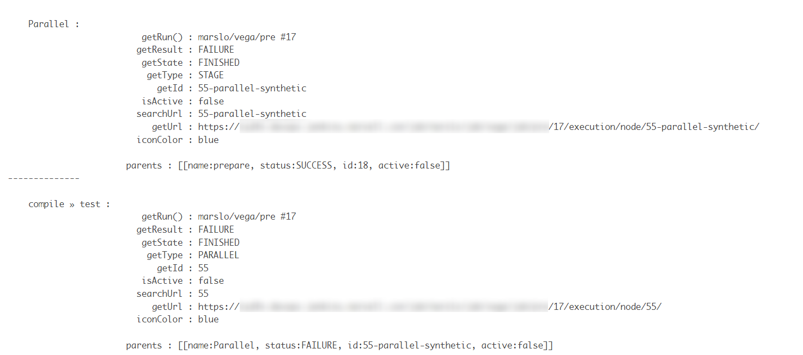

<!-- START doctoc generated TOC please keep comment here to allow auto update -->
<!-- DON'T EDIT THIS SECTION, INSTEAD RE-RUN doctoc TO UPDATE -->
**Table of Contents**  *generated with [DocToc](https://github.com/thlorenz/doctoc)*

- [jobs](#jobs)
  - [get name and classes](#get-name-and-classes)
  - [list all jobs and folders](#list-all-jobs-and-folders)
  - [list all abstract Project](#list-all-abstract-project)
  - [disable and enable jobs](#disable-and-enable-jobs)
  - [get single job properties](#get-single-job-properties)
  - [get particular job status](#get-particular-job-status)
  - [Find Jenkins projects that build periodically](#find-jenkins-projects-that-build-periodically)
  - [list job which running for more than 24 hours](#list-job-which-running-for-more-than-24-hours)
- [build](#build)
  - [build number](#build-number)
  - [get console output](#get-console-output)
  - [get changesets](#get-changesets)
  - [get SCM info](#get-scm-info)
  - [get culprits](#get-culprits)
  - [get builds abort cause](#get-builds-abort-cause)
  - [stop builds](#stop-builds)
  - [get build time](#get-build-time)
  - [list all builds within 24 hours](#list-all-builds-within-24-hours)
  - [get last 24 hours failure builds](#get-last-24-hours-failure-builds)
  - [get last 24 hours failure builds via Map structure](#get-last-24-hours-failure-builds-via-map-structure)
- [build parameters](#build-parameters)
  - [get build parameters](#get-build-parameters)
  - [get builds parameters](#get-builds-parameters)
  - [get wanted parameter values in builds](#get-wanted-parameter-values-in-builds)
  - [get only `String` type parameters](#get-only-string-type-parameters)
  - [retrieving parameters and triggering another build](#retrieving-parameters-and-triggering-another-build)
- [build results](#build-results)
  - [get all builds result percentage](#get-all-builds-result-percentage)
  - [get builds result percentage within 24 hours](#get-builds-result-percentage-within-24-hours)
  - [get builds result during certain start-end time](#get-builds-result-during-certain-start-end-time)
  - [list all running builds](#list-all-running-builds)
  - [get builds result and percentage within certain start-end time](#get-builds-result-and-percentage-within-certain-start-end-time)
  - [check whether if log kepet](#check-whether-if-log-kepet)
- [build stage](#build-stage)
  - [show build stages details](#show-build-stages-details)
  - [get parent stage ID](#get-parent-stage-id)
  - [get stage build status via parent stage name](#get-stage-build-status-via-parent-stage-name)

<!-- END doctoc generated TOC please keep comment here to allow auto update -->



> javadoc
> - [org.jenkinsci.plugins.workflow.job.WorkflowJob](https://javadoc.jenkins.io/plugin/workflow-job/org/jenkinsci/plugins/workflow/job/WorkflowJob.html)
> - [org.jenkinsci.plugins.workflow.job.WorkflowRun](https://javadoc.jenkins.io/plugin/workflow-job/org/jenkinsci/plugins/workflow/job/WorkflowRun.html)
> - [hudson.model.AbstractProject<P,R>](https://javadoc.jenkins-ci.org/hudson/model/AbstractProject.html)
> - [How to get details of Successful Jenkins build in last x days](https://stackoverflow.com/a/58320445/2940319)
> - [`build.getAction(ParametersAction.class)`](https://stackoverflow.com/a/54924165/2940319)
> - [Variables defined in groovy script always resolve to null](https://stackoverflow.com/a/22411076/2940319)
> - [`build.buildVariableResolver.resolve`](https://stackoverflow.com/a/26545605/2940319)
> - [groovy.lang.MissingPropertyException: No such property: jenkins for class: groovy.lang.Binding](https://stackoverflow.com/q/47064135/2940319)
> - [Class BuildVariableResolver](https://javadoc.jenkins.io/plugin/plasticscm-plugin/index.html?com/codicesoftware/plugins/hudson/util/BuildVariableResolver.html)
> - [batmat/get-jenkins-build-time.groovy](https://gist.github.com/batmat/91faa3201ad2ae88e3d8)
> source code:
> - [WorkflowRun.java](https://github.com/jenkinsci/workflow-job-plugin/blob/master/src/main/java/org/jenkinsci/plugins/workflow/job/WorkflowRun.java)
> - [AbstractBuild.java](https://github.com/jenkinsci/jenkins/blob/master/core/src/main/java/hudson/model/AbstractBuild.java)
> - [GitSCM.java](https://github.com/jenkinsci/git-plugin/blob/master/src/main/java/hudson/plugins/git/GitSCM.java)
> - [GitChangeSetList.java](https://github.com/jenkinsci/git-plugin/blob/master/src/main/java/hudson/plugins/git/GitChangeSetList.java)
> sample code:
> - [Jenkins : Failed Jobs](https://wiki.jenkins.io/display/JENKINS/Failed-Jobs.html)
> - [Jenkins : Enable Timestamper plugin on all jobs](https://wiki.jenkins.io/display/JENKINS/Enable-Timestamper-plugin-on-all-jobs.html)
> - [Jenkins : Display timer triggers](https://wiki.jenkins.io/display/JENKINS/Display-timer-triggers.html)
> - [Jenkins : Display the number of jobs using SCM Polling from Freestyle, Pipeline and Maven](https://wiki.jenkins.io/display/JENKINS/138454178.html)
> - [Jenkins : Delete workspace for all disabled jobs](https://wiki.jenkins.io/display/JENKINS/Delete-workspace-for-all-disabled-jobs.html)
> - [Jenkins : Delete .tmp files left in workspace-files](https://wiki.jenkins.io/display/JENKINS/Delete-.tmp-files-left-in-workspace-files.html)
> - [Jenkins : Change publish over SSH configuration](https://wiki.jenkins.io/display/JENKINS/Change-publish-over-SSH-configuration.html)


## [jobs](https://support.cloudbees.com/hc/en-us/articles/226941767-Groovy-to-list-all-jobs)

### get name and classes
```groovy
Jenkins.instance.getAllItems(Job.class).each {
  println it.name + " -> " + it.fullName + ' ~> ' + it.class
}
```
- result
  ```
  marslo - class org.jenkinsci.plugins.workflow.job.WorkflowJob
  fs - class hudson.model.FreeStyleProject
  ```

### list all jobs and folders
```groovy
Jenkins.instance.getAllItems(AbstractItem.class).each {
  println(it.fullName)
}
```
- result:
  ```
  marslo/marslo
  marslo/fs
  ```

### [list all abstract Project](https://github.com/samrocketman/jenkins-script-console-scripts/blob/main/find-all-freestyle-jobs-using-shell-command.groovy)


> Abstract Project: freestyle, maven, etc...


```groovy
Jenkins.instance.getAllItems( AbstractProject.class ).each {
  println it.fullName
}
```

### disable and enable jobs
#### disable all particular projects jobs
```groovy
List<String> projects = [ 'project-1', 'project-2', 'project-n' ]

Jenkins.instance.getAllItems(Job.class).findAll {
  projects.any { p -> it.fullName.startsWith(p) }
}.each {
  println "~~> ${it.fullName}"
  it.disabled = true
  it.save()
}
```

#### undo disable jobs in particular projects
```groovy
List<String> projects = [ 'project-1', 'project-2', 'project-n' ]

Jenkins.instance.getAllItems(Job.class).findAll {
  it.disabled && projects.any{ p -> it.fullName.startsWith(p) }
}.each {
  println "~~> ${it.fullName}"
  it.disabled = false
  it.save()
}
```

#### find all disabled projects/jobs
```groovy
Jenkins.instance
       .getAllItems( Job.class )
       .findAll { it.disabled }
       .collect { it.fullName }
```

- or
  ```groovy
  jenkins.model
         .Jenkins
         .instance
         .getAllItems(jenkins.model.ParameterizedJobMixIn.ParameterizedJob.class)
         .findAll{ it.disabled }
         .each {
           println it.fullName;
         }
  ```

- or
  ```groovy
  jenkins.model
         .Jenkins
         .instance
         .getAllItems(jenkins.model.ParameterizedJobMixIn.ParameterizedJob.class)
         .findAll{ it.disabled }
         .collect { it.fullName }
  ```


### get single job properties
> [Java Code Examples for jenkins.model.Jenkins#getItemByFullName()](https://www.programcreek.com/java-api-examples/?class=jenkins.model.Jenkins&method=getItemByFullName)

```groovy
def job = Jenkins.instance.getItemByFullName('<group>/<name>')
println """
       job.getClass() : ${job.getClass()}
    job.isBuildable() : ${job.isBuildable()}
  job.getFirstBuild() : ${job.getFirstBuild()}
         job.getACL() : ${job.getACL()}
  "======================="
      job.getBuilds() : ${job.getBuilds()}
"""
```

### get particular job status
```groovy
def job = Jenkins.instance.getItemByFullName('<group>/<name>')
println """
  Last success : ${job.getLastSuccessfulBuild()}
    All builds : ${job.getBuilds().collect{ it.getNumber() }}
    Last build : ${job.getLastBuild()}
   Is building : ${job.isBuilding()}
"""
```

### [Find Jenkins projects that build periodically](https://support.cloudbees.com/hc/en-us/articles/360032285111-Find-Jenkins-projects-that-build-periodically)

- example 1:
  ```groovy
  import hudson.model.*
  import hudson.triggers.*
  TriggerDescriptor TIMER_TRIGGER_DESCRIPTOR = Hudson.instance.getDescriptorOrDie(TimerTrigger.class)

  for(item in Jenkins.instance.getAllItems(Job))
  {
    def timertrigger = item.getTriggers().get(TIMER_TRIGGER_DESCRIPTOR)
    if (timertrigger) {
      if (item.class.canonicalName == "hudson.model.FreeStyleProject") {
        item.removeTrigger(TIMER_TRIGGER_DESCRIPTOR)
        println(item.name + " Build periodically disabled");
      }
      else {
        println(item.name + " Build periodically remains enabled; not as Freestyle project");
      }
    }
  }
  ```

- example 2:
  ```groovy
  Jenkins.instance.getAllItems(Job).each{
    def jobBuilds=it.getBuilds()

        // Check the last build only
        jobBuilds[0].each { build ->
          def runningSince = groovy.time.TimeCategory.minus( new Date(), build.getTime() )
          def currentStatus = build.buildStatusSummary.message
          def cause = build.getCauses()[0] //we keep the cause

        //triggered by a user
        def user = cause instanceof Cause.UserIdCause? cause.getUserId():null;

        if( !user ) {
          println "[AUTOMATION] ${build}"
        }
        else
        {
          println "[${user}] ${build}"
        }
      }
  }
  return
  ```

### [list job which running for more than 24 hours](https://raw.githubusercontent.com/cloudbees/jenkins-scripts/master/builds-running-more-than-24h.groovy)
> only for `lastBuild`.

```bash
/*
   We had to write this script several times. Time to have it stored, it is a very simple approach but will serve as starting point for more refined approaches.
 */
Jenkins.instance.getAllItems(Job).each(){ job -> job.isBuildable()
  if (job.isBuilding()){
    def myBuild= job.getLastBuild()
      def runningSince = groovy.time.TimeCategory.minus( new Date(), myBuild.getTime() )
      if (runningSince.hours >= 24){
        println job.name +"---- ${runningSince.hours} hours:${runningSince.minutes} minutes"
      }
  }
}
return null
```

## build


> references:
> - [Jenkins : Find builds currently running that has been executing for more than N seconds](https://wiki.jenkins.io/display/JENKINS/Find-builds-currently-running-that-has-been-executing-for-more-than-N-seconds.html)
> - [Jenkins : Display list of projects that were built more than 1 day ago](https://wiki.jenkins.io/display/JENKINS/Display-list-of-projects-that-were-built-more-than-1-day-ago..html)
> - [Jenkins : Display jobs group by the build steps they use](https://wiki.jenkins.io/display/JENKINS/Display-jobs-group-by-the-build-steps-they-use.html)


> [!TIP]
> references:
> - `currentBuild.class` == [Class RunWrapper](https://javadoc.jenkins.io/plugin/workflow-support/org/jenkinsci/plugins/workflow/support/steps/build/RunWrapper.html)
> - `currentBuild.rawBuild.class` == `Jenkins.instance.getItemByFullName(String).getBuildByNumber(int).class` == [Class WorkflowRun](https://javadoc.jenkins.io/plugin/workflow-job/org/jenkinsci/plugins/workflow/job/WorkflowRun.html)


### build number

#### get WorkflowRun by build number
```groovy
final String JOB_NAME  = 'marslo/sandbox'
final int BUILD_NUMBER = 6458

def build = Jenkins.instance
                   .getItemByFullName( JOB_NAME )
                   .getBuildByNumber( BUILD_NUMBER )
```

#### get builds of a job
```groovy
import org.jenkinsci.plugins.workflow.job.WorkflowJob
import hudson.util.RunList

WorkflowJob job = Jenkins.instance.getItemByFullName( '/marslo/sandbox/test' )
RunList runList = job.getBuilds()

println """
                  all builds : ${job.getBuildsAsMap().collect{ k, v -> k }}
                build exists : ${job.getBuilds().collect { it.id }.contains( 25.toString() )}

             completedOnly() : ${runList.completedOnly().collect{ it.id }}
               failureOnly() : ${runList.failureOnly().collect{ it.id }}
              getLastBuild() : ${runList.getLastBuild()}
             getFirstBuild() : ${runList.getFirstBuild()}

     getLastCompletedBuild() : ${job.getLastCompletedBuild()}
        getLastFailedBuild() : ${job.getLastFailedBuild()}
        getLastStableBuild() : ${job.getLastStableBuild()}
    getLastSuccessfulBuild() : ${job.getLastSuccessfulBuild()}
      getLastUnstableBuild() : ${job.getLastUnstableBuild()}
  getLastUnsuccessfulBuild() : ${job.getLastUnsuccessfulBuild()}
                 isInQueue() : ${job.isInQueue()}
           getActions.causes : ${runList.collect{ run -> run.id + ': ' + run.getActions( jenkins.model.InterruptedBuildAction.class ).causes.flatten().collect{ it.class.simpleName } }}
"""
```
- result:
  ```
                     all builds : [42, 41, 40, 39, 38, 37, 36, 35, 34, 33, 32, 31, 30, 29, 28, 27, 26, 25, 24, 23, 22, 21, 20, 19, 18, 17, 16, 15, 14, 13, 12, 11, 10, 9, 8, 7, 6, 5, 4, 3, 2, 1]
                  build exists : true

               completedOnly() : [42, 41, 40, 39, 38, 37, 36, 35, 34, 33, 32, 31, 30, 29, 28, 27, 26, 25, 24, 23, 22, 21, 20, 19, 18, 17, 16, 15, 14, 13, 12, 11, 10, 9, 8, 7, 6, 5, 4, 3, 2, 1]
                 failureOnly() : [42, 41, 40, 36, 35, 34, 33, 32, 31, 30, 29, 28, 27, 26, 24, 23, 22, 21, 20, 19, 18, 17, 16, 15, 14, 13, 12, 11, 10, 9, 8, 7, 6, 5, 4, 3, 2, 1]
                getLastBuild() : marslo/abort #42
               getFirstBuild() : marslo/abort #1

       getLastCompletedBuild() : marslo/abort #42
          getLastFailedBuild() : marslo/abort #32
          getLastStableBuild() : marslo/abort #39
      getLastSuccessfulBuild() : marslo/abort #39
        getLastUnstableBuild() : null
    getLastUnsuccessfulBuild() : marslo/abort #42
                   isInQueue() : false
             getActions.causes : [42: [ExceededTimeout], 41: [ExceededTimeout], 40: [ExceededTimeout], 36: [ExceededTimeout], 35: [ExceededTimeout], 34: [ExceededTimeout], 33: [ExceededTimeout], 32: [], 31: [], 30: [ExceededTimeout], 29: [], 28: [], 27: [], 26: [], 24: [], 23: [], 22: [ExceededTimeout], 21: [], 20: [], 19: [ExceededTimeout], 18: [ExceededTimeout], 17: [], 16: [], 15: [], 14: [], 13: [], 12: [], 11: [], 10: [ExceededTimeout], 9: [ExceededTimeout], 8: [UserInterruption], 7: [ExceededTimeout], 6: [UserInterruption], 5: [UserInterruption], 4: [ExceededTimeout], 3: [ExceededTimeout], 2: [UserInterruption], 1: [ExceededTimeout]]
  ```

### get console output


> references:
> - [org.kohsuke.stapler.framework.io.LargeText](https://javadoc.jenkins.io/component/stapler/org/kohsuke/stapler/framework/io/LargeText.html)
> - [How To Read Console Output In Jenkins During Build](https://automationscript.com/how-to-read-console-output-in-jenkins-pipeline/)
> - [[FIXED] Jenkins console output not in realtime](https://www.javafixing.com/2022/02/fixed-jenkins-console-output-not-in.html)


```groovy
Jenkins.instance
       .getItemByFullName( JOB_NAME )
       .getBuildByNumber( BUILD_NUMBER )
       .logFile
       .text
```

### get changesets

#### code clone via
```groovy
checkout([
  $class: 'GitSCM',
  branches: [[ name: 'refs/heads/sandbox' ]],
  browser: [
    $class: 'GitWeb',
    repoUrl: 'https://my.gerrit.com/path/to/repo'
  ],
  userRemoteConfigs: [[
      credentialsId: 'SSHCredential',
      url: 'git://my.gerrit.com/path/to/repo.git'
  ]]
])
```


> references:
> - [hudson.plugins.git.GitChangeSet](https://javadoc.jenkins.io/plugin/git/hudson/plugins/git/GitChangeSet.html)
> - [hudson.plugins.git.GitChangeSetList](https://javadoc.jenkins.io/plugin/git/index.html?hudson/plugins/git/GitChangeSetList.html)
> - [jenkins.plugins.git.AbstractGitSCMSource](https://javadoc.jenkins.io/plugin/git/index.html?hudson/plugins/git/GitChangeSetList.html)
> - [hudson.model.AbstractBuild<P,R>](https://javadoc.jenkins.io/hudson/model/AbstractBuild.html#getChangeSets--)
> - [get changeset in Jenkisnfile](../jenkinsfile/jenkinsfile.html#get-changesets)


```groovy
Jenkins.instance
       .getItemByFullName('/marslo/up')
       .getBuildByNumber(195)
       .changeSets
       .each {
         it.items.each { i ->
           println """
             \n-----------------------------\n
                      paths : ${i.paths}
              parent commit : ${i.parentCommit}
                   commitId : ${i.commitId} : ${i.revision}
                     author : ${i.author}
                 authorName : ${i.authorName}
                authorEmail : ${i.authorEmail}
              committerTime : ${i.committerTime}
                    message : ${i.msg}
                    repoUrl : ${it.browser?.repoUrl ?: ''}
             affected files :
               \t\t${i.affectedFiles.collect{ f -> f.editType.name + ' : ' + f.path }.join('\n\t\t\t\t')}
           """
         }
       }
```

- get changeSets to `List<Map<String, String>>`:
  ```groovy
  def getChangeSets( String name, int nubmer ) {
    Jenkins.instance
           .getItemByFullName( name )
           .getBuildByNumber( number )
           .changeSets
  }

  def changeSetsEntry( def changeSets ) {
    List<Map<String, String>> changeSetsEntry = []
    changeSets.collect { it.items.collect { i ->
      changeSetsEntry += [
        'parentCommit'  : i.parentCommit      ,
        'commitId'      : i.commitId          ,
        'revision'      : i.revision          ,
        'author'        : i.author.toString() ,
        'authorName'    : i.authorName        ,
        'authorEmail'   : i.authorEmail       ,
        'committerTime' : i.committerTime     ,
        'msgAnnotated'  : i.msg               ,
        'affectedFiles' : i.affectedFiles.collect{ f -> ['editType' : f.editType.name, 'path' : f.path ] }
      ]
    }}
    return changeSetsEntry
  }

  // testing
  List<Map<String, String>> totalChangeSets = []
  totalChangeSets += changeSetsEntry( getChangeSets('/path/to/pipeline', 123) )
  totalChangeSets += changeSetsEntry( getChangeSets('/path/to/pipeline', 456) )
  totalChangeSets.each {
    println """
      it.getClass()
      it.author
      it.commitId
    """
  }
  ```

#### get repo url


> references:
> - [hudson.scm.SCM](https://javadoc.jenkins.io/hudson/scm/SCM.html#getBrowser--)


```groovy
def job = Jenkins.instance
                 .getItemByFullName('/path/to/pipeline')
                 .getBuildByNumber(n)

job.changeSets
   .each {
     it.items.each { i ->
       println """
         \n-----------------------------\n
          repoUrl : ${ it.browser.repoUrl }
          repoUrl : ${ job.SCMs.collect { s -> s.browser?.repoUrl }.findAll().join() }
              url : ${ job.SCMs.collect { s -> s.browser?.url }.findAll().join() }
      ormalizeUrl : ${ job.SCMs.collect { s -> s.browser?.normalizeUrl } }
      absoluteUrl : ${ job.SCMs.collect { s -> s.browser?.getChangeSetLink(i) }.findAll().join() }
         commitId : ${i.commitId} : ${i.revision}
       """
     }
   }
```
- result
  ```bash
  -----------------------------

            repoUrl : https://my.gerrit.com/admin/repos/sandbox
            repoUrl : https://my.gerrit.com/admin/repos/sandbox
                url : https://my.gerrit.com/admin/repos/sandbox
        ormalizeUrl : [null, false]
        absoluteUrl : https://my.gerrit.com/admin/repos/sandbox?a=commit&h=095e4470964ee8ca6ab50ceea7acf88094dc08d4
           commitId : 095e4470964ee8ca6ab50ceea7acf88094dc08d4 : 095e4470964ee8ca6ab50ceea7acf88094dc08d4
  ```

### get SCM info


> references:
> - [hudson.plugins.git.GitSCM](https://javadoc.jenkins.io/plugin/git/hudson/plugins/git/GitSCM.html)
> - [hudson.plugins.git.UserRemoteConfig](https://javadoc.jenkins.io/plugin/git/hudson/plugins/git/UserRemoteConfig.html)
> - [Poll SCM and Timer triggers include "Changes" for a Pipeline for any/all Shared Libraries](https://issues.jenkins.io/browse/JENKINS-41497)


```groovy
Jenkins.instance
       .getItemByFullName('/path/to/pipeline')
       .getBuildByNumber(n)
       .SCMs
       .each {
         println """
           .......................
               repoUrl : ${it.userRemoteConfigs.url.join(',')}
               remotes : ${it.userRemoteConfigs.name.join(',')}
              branches : ${it.branches.join(',')}
           .......................
         """
       }
```

### get culprits
```groovy
println build.getCulprits()
```

#### setup next build number
```groovy
Jenkins.instance
       .getItemByFullName("/path/to/job")
       .updateNextBuildNumber(n)
```

### get builds abort cause


> references:
> - [FlowInterruptedException cause is not available in post condition](https://issues.jenkins.io/browse/JENKINS-62257)
>   - `org.jenkinsci.plugins.workflow.support.steps.build.BuildTriggerCancelledCause`
>   - `org.jenkinsci.plugins.workflow.support.steps.build.DownstreamFailureCause`
> - [Halt a jenkins pipeline job early](https://stackoverflow.com/a/43889224/2940319)
> - [Thread.getAllStackTraces()](https://stackoverflow.com/a/26306081/2940319)
> - [Pipeline: How to add an input step, with timeout, that continues if timeout is reached, using a default value](https://support.cloudbees.com/hc/en-us/articles/226554067-Pipeline-How-to-add-an-input-step-with-timeout-that-continues-if-timeout-is-reached-using-a-default-value)
> - [How to time out Jenkins Pipeline stage and keep the pipeline running?](https://e.printstacktrace.blog/how-to-time-out-jenkins-pipeline-stage-and-keep-the-pipeline-running/)


```groovy
Jenkins.instance
       .getItemByFullName( JOB_NAME )
       .getBuildByNumber( BUILD_NUMBER )
       .getActions( jenkins.model.InterruptedBuildAction.class )
       .causes
       .flatten()
```

- check builds aborted by timer
  ```groovy
  import org.jenkinsci.plugins.workflow.steps.TimeoutStepExecution

  Jenkins.instance
         .getItemByFullName( JOB_NAME )
         .getBuildByNumber( BUILD_NUMBER )
         .getActions( jenkins.model.InterruptedBuildAction.class )
         .causes
         .flatten()
         .any{ it instanceof TimeoutStepExecution.ExceededTimeout }
  ```

  - or
    ```groovy
    import org.jenkinsci.plugins.workflow.steps.TimeoutStepExecution
    import org.jenkinsci.plugins.workflow.job.WorkflowJob

    WorkflowJob job = Jenkins.instance.getItemByFullName( JOB_NAME )
    job.builds.findAll { Run run ->
      BUILD_NUMBER.toString() == run.id
    }.collect { Run run -> run.getActions( jenkins.model.InterruptedBuildAction.class )
                              .causes
                              .flatten()
                              .any{ it instanceof TimeoutStepExecution.ExceededTimeout }
    }
    ```

#### get all abort causes
```groovy
import org.jenkinsci.plugins.workflow.job.WorkflowJob

WorkflowJob job = Jenkins.instance.getItemByFullName( JOB_NAME )
job.builds.findAll { Run run ->
  run.getActions( jenkins.model.InterruptedBuildAction.class ).causes
}.collect{ Run run ->
  List c = run.getActions( jenkins.model.InterruptedBuildAction.class ).causes
  "#${run.id} : ${c.flatten().collect{ it.class.simpleName }.first()}"
}.join('\n')
```

- result
  ```
  #42 : ExceededTimeout
  #41 : ExceededTimeout
  #40 : ExceededTimeout
  #36 : ExceededTimeout
  #35 : ExceededTimeout
  #34 : ExceededTimeout
  #33 : ExceededTimeout
  #30 : ExceededTimeout
  #22 : ExceededTimeout
  #19 : ExceededTimeout
  #18 : ExceededTimeout
  #10 : ExceededTimeout
  #9 : ExceededTimeout
  #8 : UserInterruption
  #7 : ExceededTimeout
  #6 : UserInterruption
  #5 : UserInterruption
  #4 : ExceededTimeout
  #3 : ExceededTimeout
  #2 : UserInterruption
  #1 : ExceededTimeout
  ```

### stop builds

#### [abort single build](https://stackoverflow.com/a/26306081/2940319)
```groovy
final String JOB_NAME  = 'job_name'
final int BUILD_NUMBER = job_number

Jenkins.instance
       .getItemByFullName( JOB_NAME )
       .getBuildByNumber( BUILD_NUMBER )
       .finish(
         hudson.model.Result.ABORTED,
         new java.io.IOException( "Aborting build" )
       )
```

#### [cancel builds in same job](https://raw.githubusercontent.com/cloudbees/jenkins scripts/master/cancel builds same job.groovy)
```groovy
/*
 Author: Isaac S Cohen
 This script works with workflow to cancel other running builds for the same job
 Use case: many build may go to QA, but only the build that is accepted is needed,
 the other builds in the workflow should be aborted
*/

final String JOB_NAME  = env.JOB_NAME
final int BUILD_NUMBER = env.BUILD_NUMBER.toInteger()

def job = Jenkins.instance.getItemByFullName( JOB_NAME )
for ( build in job.builds ) {
  if ( !build.isBuilding() ) { continue }
  if ( BUILD_NUMBER == build.getNumber().toInteger() ) { continue; println "equals" }
  build.doStop()
}
```

#### [stop all queue and running jobs](https://stackoverflow.com/a/47631794/2940319)
> reference:
> - [cancel queue builds](https://xanderx.com/post/cancel-all-queued-jenkins-jobs/)
> ```groovy
> Jenkins.instance.queue.clear()
> ```

```groovy
import java.util.ArrayList
import hudson.model.*
import jenkins.model.Jenkins

// Remove everything which is currently queued
def q = Jenkins.instance.queue
for ( queued in Jenkins.instance.queue.items ) {
  q.cancel( queued.task )
}

// stop all the currently running jobs
for ( job in Jenkins.instance.items ) {
  stopJobs(job)
}

def stopJobs( job ) {
  if ( job in com.cloudbees.hudson.plugins.folder.Folder ) {
    for ( child in job.items ) {
      stopJobs( child )
    }
  } else if ( job in org.jenkinsci.plugins.workflow.multibranch.WorkflowMultiBranchProject ) {
    for ( child in job.items ) {
      stopJobs( child )
    }
  } else if ( job in org.jenkinsci.plugins.workflow.job.WorkflowJob && job.isBuilding() ) {
    for ( build in job.builds ) {
      build.doKill()
    }
  }
}
```

#### [get queue jobs parameters](https://stackoverflow.com/a/32912802/2940319)
> refernece:
> - [cg-soft/explore.groovy](https://gist.github.com/cg-soft/4251ad83932340129925)

```groovy
def q = Jenkins.instance.queue
q.items.each {
  println("${it.task.name}:")
  println("Parameters: ${it.params}")
}
```

#### [list all queue tasks and blocked reason](https://support.cloudbees.com/hc/en-us/articles/360051376772-How-can-I-purge-clean-the-build-queue-)
```groovy
Jenkins.instance.queue.items.each {
  println """
                   getId : ${it.getId()}
             isBuildable : ${it.isBuildable()}
      getFullDisplayName : ${it.task.getFullDisplayName()}
          getDisplayName : ${it.task.getDisplayName()}
       isConcurrentBuild : ${it.task.isConcurrentBuild()}
          getAffinityKey : ${it.task.getAffinityKey()}
                  getUrl : ${it.task.getUrl()}
           getWhyBlocked : ${it.task.getWhyBlocked()}
    getCauseOfBlockage() : ${it.task.getCauseOfBlockage()}
  """
  // println it.task.metaClass.methods*.name.sort().unique()
}
```

- result:
  ```bash
                   getId : 80210
             isBuildable : false
      getFullDisplayName : marslo » sandbox » test
          getDisplayName : test
       isConcurrentBuild : false
          getAffinityKey : marslo » sandbox » test
                  getUrl : job/marslo/job/sandbox/job/test/
           getWhyBlocked : Build #27 is already in progress (ETA: 3 min 28 sec)
    getCauseOfBlockage() : Build #27 is already in progress (ETA: 3 min 28 sec)
  ```

### get build time


> more details can be found in
> - [imarslo: groovy programming -> utility](../../programming/groovy/utility.html#time)


> [!TIP]
> reference :
> - [Getting current timestamp in inline pipeline script using pipeline plugin of hudson](https://stackoverflow.com/a/55242657/2940319)
> - [get Job && build by number for the Job and all related to time](https://stackoverflow.com/a/54947196/2940319)
> - [convert milliseconds to date-time format](https://stackoverflow.com/a/45815290/2940319)
> - [Date.format(String format)](http://docs.groovy-lang.org/latest/html/groovy-jdk/java/util/Date.html)
> <br>
>
> ```groovy
> final long NOW       = System.currentTimeMillis()
> final int BENCH_MARK = 1*24*60*60*1000
> println """
>                                NOW : ${NOW}
>                   NOW - BENCH_MARK : ${NOW - BENCH_MARK}
>                 Date(NOW).format() : ${new Date(NOW).format("yyyy-MM-dd'T'HH:mm:ss.SSS'Z'")}
>      Date(NOW-BENCH_MARK).format() : ${new Date(NOW - BENCH_MARK).format("yyyy-MM-dd'T'HH:mm:ss.SSS'Z'")}
> """
> ```
>
> - result:
>   ```
>                                NOW : 1619790803151
>                   NOW - BENCH_MARK : 1619704403151
>                 Date(NOW).format() : 2021-04-30T06:53:23.151Z
>      Date(NOW-BENCH_MARK).format() : 2021-04-29T06:53:23.151Z
>   ```

```groovy
import java.time.LocalDateTime
import java.time.LocalDate
import java.util.Calendar

final String JOB_PATTERN      = '<group>/<name>'
final LocalDateTime DATE_TIME = LocalDateTime.now()
final LocalDate DATE_TAG      = java.time.LocalDate.now()
final long CURRENT_TIME       = System.currentTimeMillis()
final long RIGHT_NOW          = Calendar.getInstance().getTimeInMillis()

println """
  ~~> current time :
       DATE_TIME : ${DATE_TIME}
        DATE_TAG : ${DATE_TAG}
    CURRENT_TIME : ${CURRENT_TIME}
       RIGHT_NOW : ${RIGHT_NOW}
"""

Jenkins.instance.getAllItems( Job.class ).each { job ->
  if ( job.fullName.contains( JOB_PATTERN ) ) {
    def build = job.getLastBuild()
    println """
      ~~> ${job.getFullName()} : ${build.getId()} :
              build.getTimestampString() : ${build.getTimestampString()}
             build.getTimestampString2() : ${build.getTimestampString2()}
                         build.getTime() : ${build.getTime()}
                 build.startTimeInMillis : ${build.startTimeInMillis}
      build.startTimeInMillis.getClass() : ${build.startTimeInMillis.getClass()}
                                duration : ${groovy.time.TimeCategory.minus( new Date(), build.getTime() )}
  """
  }
}
"DONE"
```
- result:
  

**or** :
```groovy
final String JOB_PATTERN = '<group>/<name>'                  // keywords

Jenkins.instance.getAllItems( Job.class ).findAll { Job job ->
  job.fullName.contains( JOB_PATTERN )
}.each { Job job ->
  def build = job.getLastBuild()
  println """
                 build.getTime() : ${build.getTime()}
         build.getTimeInMillis() : ${build.getTimeInMillis()}
            build.getTimestamp() : ${build.getTimestamp()}
    build.getStartTimeInMillis() : ${build.getStartTimeInMillis()}
      build.getTimestampString() : ${build.getTimestampString()}
     build.getTimestampString2() : ${build.getTimestampString2()}
  """
}
```

- result
  ```
                 build.getTime() : Thu Apr 29 04:08:08 PDT 2021
         build.getTimeInMillis() : 1619694488799
            build.getTimestamp() : java.util.GregorianCalendar[time=1619694488799,areFieldsSet=true,areAllFieldsSet=true,lenient=true,zone=sun.util.calendar.ZoneInfo[id="America/Los_Angeles",offset=-28800000,dstSavings=3600000,useDaylight=true,transitions=185,lastRule=java.util.SimpleTimeZone[id=America/Los_Angeles,offset=-28800000,dstSavings=3600000,useDaylight=true,startYear=0,startMode=3,startMonth=2,startDay=8,startDayOfWeek=1,startTime=7200000,startTimeMode=0,endMode=3,endMonth=10,endDay=1,endDayOfWeek=1,endTime=7200000,endTimeMode=0]],firstDayOfWeek=1,minimalDaysInFirstWeek=1,ERA=1,YEAR=2021,MONTH=3,WEEK_OF_YEAR=18,WEEK_OF_MONTH=5,DAY_OF_MONTH=29,DAY_OF_YEAR=119,DAY_OF_WEEK=5,DAY_OF_WEEK_IN_MONTH=5,AM_PM=0,HOUR=4,HOUR_OF_DAY=4,MINUTE=8,SECOND=8,MILLISECOND=799,ZONE_OFFSET=-28800000,DST_OFFSET=3600000]
    build.getStartTimeInMillis() : 1619694488807
      build.getTimestampString() : 2 min 1 sec
     build.getTimestampString2() : 2021-04-29T11:08:08Z
  ```

### [list all builds within 24 hours](https://gist.github.com/batmat/91faa3201ad2ae88e3d8)
> reference:
> - [List Jenkins job build detials for last one year along with the user who triggered the build](https://stackoverflow.com/a/64509896/2940319)

```groovy
String JOB_PATTERN      = '<group>[/<name>]'                  // keywords
final long CURRENT_TIME = System.currentTimeMillis()
final int BENCH_MARK    = 1*24*60*60*1000                     // days * hours * minutes * seconds * microseconds (1000)

Jenkins.instance.getAllItems(Job.class).findAll { Job job ->
  job.fullName.contains( JOB_PATTERN )
}.each { Job job ->
  def history = job.getBuilds().byTimestamp( CURRENT_TIME - BENCH_MARK, CURRENT_TIME )
  if ( history ) {
    println """
      ~~> ${job.fullName} : ${history.size()} :
          history         : ${history.join('\n\t\t\t    ')}
    """
  }
}
```

### [get last 24 hours failure builds](https://stackoverflow.com/a/60375862/2940319)
```groovy
import hudson.model.Job
import hudson.model.Result
import hudson.model.Run
import java.util.Calendar
import jenkins.model.Jenkins

final Calendar RIGHT_NOW = Calendar.getInstance()
final long BENCH_MARK    = 1*24*60*60*1000
final String JOB_PATTERN = '<group>'

Jenkins.instance.getAllItems(Job.class).findAll { Job job ->
  job.fullName.contains( JOB_PATTERN )
}.collect { Job job ->
  job.builds.findAll { Run run ->
    run.result == Result.FAILURE &&
    ( RIGHT_NOW.getTimeInMillis() - run.getStartTimeInMillis() ) <= BENCH_MARK
  }
}.sum()
```

### get last 24 hours failure builds via Map structure
```groovy
import hudson.model.Job
import hudson.model.Result
import hudson.model.Run
import java.util.Calendar
import jenkins.model.Jenkins
import static groovy.json.JsonOutput.*

final Calendar RIGHT_NOW  = Calendar.getInstance()
final long BENCH_MARK    = 1*24*60*60*1000
final String JOB_PATTERN = '<group>'

Map results = [:]

Jenkins.instance.getAllItems(Job.class).findAll { Job job ->
  job.fullName.contains( JOB_PATTERN )
}.each { Job job ->
  results.(job.fullName) = job.builds.findAll { Run run ->
    !run.isBuilding() &&
    run.result == Result.FAILURE &&
    ( RIGHT_NOW.getTimeInMillis() - run.getStartTimeInMillis() ) <= BENCH_MARK
  }.collectEntries { Run run ->
    [ (run.id) : run.getAbsoluteUrl() ]
  }
}

println prettyPrint( toJson(results.findAll{ !it.value.isEmpty() }) )
```

- or
  ```groovy
  import hudson.model.Job
  import hudson.model.Result
  import hudson.model.Run
  import jenkins.model.Jenkins
  import static groovy.json.JsonOutput.*

  final long CURRENT_TIME  = java.util.Calendar.getInstance().getTimeInMillis()
  final long BENCH_MARK    = 1*24*60*60*1000
  final String JOB_PATTERN = '<group>'
  Map results = [:]

  Jenkins.instance.getAllItems(Job.class).findAll { Job job ->
    job.fullName.contains( JOB_PATTERN )
  }.each { Job job ->
    results.(job.fullName) = job.getBuilds().byTimestamp( CURRENT_TIME - BENCH_MARK, CURRENT_TIME ).findAll { Run run ->
      !run.isBuilding() &&
      run.result == Result.FAILURE
    }.collectEntries { Run run ->
      [ run.id, run.getAbsoluteUrl() ]
    }
  }

  println prettyPrint( toJson(results.findAll{ !it.value.isEmpty() }) )
  ```

- or
  ```groovy
  import hudson.model.Job
  import hudson.model.Result
  import hudson.model.Run
  import jenkins.model.Jenkins
  import static groovy.json.JsonOutput.*

  final long CURRENT_TIME  = java.util.Calendar.getInstance().getTimeInMillis()
  final long BENCH_MARK    = 1*24*60*60*1000
  final String JOB_PATTERN = '<group>'
  Map results = [:]

  Jenkins.instance.getAllItems(Job.class).findAll { Job job ->
    job.fullName.contains(JOB_PATTERN)
  }.each { Job job ->
    def history = job.getBuilds().byTimestamp( CURRENT_TIME - BENCH_MARK, CURRENT_TIME )
    if( history ) {
      results.(job.fullName) = history.findAll { Run run ->
        !run.isBuilding() &&
        run.result == Result.FAILURE
      }.collectEntries { Run run ->
        [ (run.id) : run.getAbsoluteUrl() ]
      }
    }
  }

  println prettyPrint( toJson(results.findAll{ !it.value.isEmpty() }) )
  ```


## build parameters

### [get build parameters](https://wiki.jenkins.io/display/JENKINS/Parameterized+System+Groovy+script)


> reference:
> - [`build?.actions.find{ it instanceof ParametersAction }`](https://stackoverflow.com/a/38130496/2940319)
> - [Jenkins & Groovy – accessing build parameters](https://rucialk.wordpress.com/2016/03/17/jenkins-groovy-accessing-build-parameters/)
> - [Parameterized System Groovy script](https://wiki.jenkins.io/display/JENKINS/Parameterized+System+Groovy+script)
> - [Jenkins : Display job parameters](https://wiki.jenkins.io/display/JENKINS/Display+job+parameters)
> - [Let users specify any kind of parameters when creating a job from a pipeline template and handle them in the job created](https://docs.cloudbees.com/docs/cloudbees-ci-kb/latest/client-and-managed-masters/let-users-specify-any-kind-of-parameters-when-creating-a-job-from-a-pipeline-template-and-handle-them-in-the-job-created)
> - [GenericBuild.groovy](https://github.com/root-project/jenkins-pipelines/blob/master/src/cern/root/pipeline/GenericBuild.groovy)


```groovy
def job = Jenkins.getInstance().getItemByFullName( '/marlso/sandbox' )
job.builds.each { Run run ->
  String parameters = run?.getAction(ParametersAction.class)?.parameters?.collectEntries {
    [ it.name, it.value ]
  }.collect { k, v -> "\t\t${k}\t: ${v}" }
   .join('\n')
  println "#${run.id}: ${parameters}"
}

"DONE"
```
- result
  ```
  #7:     id  : marslo
      gender  : female
  #6:     id  : marslo
      gender  : female
  #5:     id  : marslo
      gender  : female
  #4:     id  : marslo
      gender  : female
  #3:     name  : marslo
      gender  : female
  #2:     name  : marslo
      gender  : female
  #1:
  ```

- or via `action instanceof ParametersAction`
  ```groovy
  def job = Jenkins.getInstance().getItemByFullName( 'others-tests/sandbox' )
  job.getBuilds().each { Run build ->
    String parameters = build?.actions.find{ it instanceof ParametersAction }?.parameters?.collectEntries {
      [ it.name, it.value ]
    }.collect { k, v -> "\t\t${k}\t: ${v}" }
     .join('\n')
    println "#${build.getId()}: ${parameters}"
  }
  ```

- [or](https://wiki.jenkins.io/display/JENKINS/Display+job+parameters) by using [Job Parameter Summary Plugin](https://wiki.jenkins.io/display/JENKINS/Job-Parameter-Summary-Plugin.html)
  ```groovy
  import hudson.model.*

  for( item in Hudson.instance.items ) {
    prop = item.getProperty( ParametersDefinitionProperty.class )
    if( prop ) {
      println( "--- Parameters for " + item.name + " ---" )
      for( param in prop.getParameterDefinitions() ) {
        try {
          println( param.name + " " + param.defaultValue )
        }
        catch( Exception e ) {
          println( param.name )
        }
      }
      println()
    }
  }
  ```

  - result
    ```
    --- Parameters for GRA-00-UploadIntoClearCase ---
    ONCSDAP1_USER jdoe
    ONCSDAP1_PASSWORD
    GRA_ZIP_NAME GRA_Delivery_r.2.0.0_28-5_impl.zip
    GRA_RELEASE n.28

    --- Parameters for IN8-03-DeployXnetWebAppToRecette ---
    STOP_START_AS
    ```

### get builds parameters

> [!TIP]
> running following snippet in Jenkinsfile

```groovy
params.each { param ->
  println " ~~> '${param.key.trim()}' -> '${param.value}' "
}
```
- or : [Jenkins : Parameterized System Groovy script](https://wiki.jenkins.io/display/JENKINS/Parameterized-System-Groovy-script.html)
  ```groovy
  def parameters = currentBuild.rawBuild?.getActions(ParametersAction.class)?.parameters
  parameters.each {
    println " ~~> ${it.name} -> ${it.value} -> ${it.description ?: ''} "
    println "-" * 20
  }
  ```
  - or
    ```groovy
    def parameters = currentBuild.rawBuild?.actions.find{ it instanceof ParametersAction }?.parameters
    ```


### get wanted parameter values in builds
```groovy
final String PARAM = 'id'
Map params = [:]

def job = Jenkins.getInstance().getItemByFullName( 'others-tests/sandbox' )
job.getBuilds().each { Run build ->
  params."${build.getId()}" = build?.getActions(ParametersAction.class)?.parameters?.collectEntries {
                                [ it.name , it.value ]
                              }
}

println params.collect { k , v ->
  "build #${k} ~~> ${v ? "${PARAM} : ${v.getOrDefault(PARAM, "No '${PARAM}' found")}" : 'No Params Found'}"
}.join('\n')
```

- result
  ```
  build #7 ~~> id : marslo
  build #6 ~~> id : marslo
  build #5 ~~> id : marslo
  build #4 ~~> id : marslo
  build #3 ~~> id : No 'id' found
  build #2 ~~> id : No 'id' found
  build #1 ~~> No Params Found
  ```

### get only `String` type parameters
```groovy
Map params = build?.getAction( ParametersAction.class )
                   .parameters?.findAll{ it instanceof StringParameterValue }?.dump()
```

- or
  ```groovy
  Map params = build?.getAction( ParametersAction.class )
                     .parameters?.findAll{ it instanceof StringParameterValue }?.collectEntries {
                       [ it.name, it.value ]
                     }
  ```

- or
  ```groovy
  Map params = build?.actions
                     .find{ it instanceof ParametersAction }?.parameters?.findAll{ it instanceof StringParameterValue }?.dump()
  ```

### [retrieving parameters and triggering another build](https://wiki.jenkins.io/display/JENKINS/Groovy-plugin.html)
```groovy
import hudson.model.*
import hudson.AbortException
import hudson.console.HyperlinkNote
import java.util.concurrent.CancellationException

// Retrieve parameters of the current build
def foo = build.buildVariableResolver.resolve("FOO")
println "FOO=$foo"

// Start another job
def job = Hudson.instance.getJob('MyJobName')
def anotherBuild
try {
    def params = [
      new StringParameterValue('FOO', foo),
    ]
    def future = job.scheduleBuild2(0, new Cause.UpstreamCause(build), new ParametersAction(params))
    println "Waiting for the completion of " + HyperlinkNote.encodeTo('/' + job.url, job.fullDisplayName)
    anotherBuild = future.get()
} catch (CancellationException x) {
    throw new AbortException("${job.fullDisplayName} aborted.")
}
println HyperlinkNote.encodeTo('/' + anotherBuild.url, anotherBuild.fullDisplayName) + " completed. Result was " + anotherBuild.result

// Check that it succeeded
build.result = anotherBuild.result
if (anotherBuild.result != Result.SUCCESS && anotherBuild.result != Result.UNSTABLE) {
    // We abort this build right here and now.
    throw new AbortException("${anotherBuild.fullDisplayName} failed.")
}

// Do something with the output.
// On the contrary to Parameterized Trigger Plugin, you may now do something from that other build instance.
// Like the parsing the build log (see http://javadoc.jenkins-ci.org/hudson/model/FreeStyleBuild.html )
// You probably may also wish to update the current job's environment.
build.addAction(new ParametersAction(new StringParameterValue('BAR', '3')))
```


## build results

### [get all builds result percentage](https://stackoverflow.com/a/28039134/2940319)
```groovy
final String JOB_PATTERN = '<group>/<name>'
Map<String, Map<String, String>> results = [:]
int sum = 0

Jenkins.instance.getAllItems( Job.class ).each { project ->
  if ( project.fullName.contains(JOB_PATTERN) ) {
    results."${project.fullName}" = [ SUCCESS:0, UNSTABLE:0, FAILURE:0, ABORTED:0, INPROGRESS:0, NOT_BUILT:0 ]
    def build = project.getLastBuild()
    while ( build ) {
      // if job is building, then results."${project.fullName}"."${build.result}" will be null
      if ( build.isBuilding() ) {
        results."${project.fullName}".INPROGRESS = results."${project.fullName}".INPROGRESS + 1
      } else {
        // println "$project.name;$build.id;$build.result"
        results."${project.fullName}"."${build.result}" = results."${project.fullName}"."${build.result}" + 1
      }
      build = build.getPreviousBuild()
    }
  }
}
results.each{ name, status ->
  sum = status.values().sum()
  println "${name}: ${sum} : "
  status.each{ r, c ->
    println "\t${r}: ${c}: \t\tpercentage: " + (sum ? "${c * 100 / sum}%" : '0%')
  }
}
"DONE"
```
- result
  

### [get builds result percentage within 24 hours](https://stackoverflow.com/a/28039134/2940319)
```groovy
final String JOB_PATTERN = '<group>'
final long CURRENT_TIME  = System.currentTimeMillis()
final int BENCH_MARK     = 1*24*60*60*1000

Map<String, Map<String, String>> results = [:]
int sum = 0

Jenkins.instance.getAllItems( Job.class ).each { project ->
  if ( project.fullName.contains(JOB_PATTERN) && project.getBuilds().byTimestamp(CURRENT_TIME - BENCH_MARK, CURRENT_TIME).size() > 0 ) {
    results."${project.fullName}" = [ SUCCESS:0, UNSTABLE:0, FAILURE:0, ABORTED:0, INPROGRESS:0, NOT_BUILT:0 ]
    def build = project.getLastBuild()

    while ( build && (CURRENT_TIME - build.startTimeInMillis) <= BENCH_MARK ) {
      if ( build.isBuilding() ) {
        results."${project.fullName}".INPROGRESS = results."${project.fullName}".INPROGRESS + 1
      } else {
        results."${project.fullName}"."${build.result}" = results."${project.fullName}"."${build.result}" + 1
      } // if job is building, then results."${project.fullName}"."${build.result}" will be null
      build = build.getPreviousBuild()
    } // traverse in the whole traverse builds

  } // if there's builds within 24 hours
}

results.each{ name, status ->
  sum = status.values().sum()
  println "\n~~> ${name}: ${sum} : "
  status.each{ r, c ->
    println "\t${r}: ${c}: \t\tpercentage: " + (sum ? "${c * 100 / sum}%" : '0%')
  }
}

"DONE"
```
- result
  


### get builds result during certain start-end time

> [!TIP]
> find only `String` type parameters:
> ```groovy
> Map params = build?.getAction( ParametersAction.class )?.parameters?.findAll{ it instanceof StringParameterValue }?.dump()
> ```

```bash
import java.text.SimpleDateFormat
import java.util.Date
import static groovy.json.JsonOutput.*

final String JOB_PATTERN = '<group>[/<name>]'                        // keywords
final Map<String, String> PARAM = [ 'param_name' : 'param_value' ]
Map<String, Map<String, String>> results = [:]

SimpleDateFormat simpleDateFormat = new SimpleDateFormat( "yyyy-MM-dd HH:mm:ss" )
final String START_DATE = '2021-04-26 00:00:00'
final String END_DATE   = '2021-04-27 00:00:00'

long start = simpleDateFormat.parse( START_DATE ).getTime()
long end   = simpleDateFormat.parse( END_DATE ).getTime()

Jenkins.instance.getAllItems( Job.class ).findAll { Job job ->
  job.fullName.contains( JOB_PATTERN )
}.each { Job job ->
  results."${job.fullName}" = [:]
  job.getBuilds().byTimestamp( start, end ).each { Run build ->
    Map params = build?.getAction( ParametersAction.class )?.parameters?.findAll{ it instanceof StringParameterValue }?.collectEntries {
                   [ it.name, it.value ]
                 }
    results."${job.fullName}"."${build.getId()}" = [
            'time' : build.getTime().toString() ,
          'params' : params?.collect { k, v -> "${k} : ${v}"},
      'paramsExist': params?.entrySet()?.containsAll( PARAM.entrySet() )
    ]
    if ( build.isBuilding() ) {
      results."${job.fullName}"."${build.getId()}" << [ 'status' : 'INPROGRESS' ]
    } else {
      results."${job.fullName}"."${build.getId()}" << [ 'status' : build.getResult().toString() ]
    }
  }

  println prettyPrint( toJson(results) )
}

int count = 0
results.get( JOB_PATTERN ).each { k, v ->
  if ( v.paramsExist ) {
    count += 1
    println """
      #${k} : ${v.status} : ${v.time}
              ${v.params}
    """
  }
}

println "total number: ${count}"
"DONE"
```

- result:
  
  


### list all running builds
```groovy
import static groovy.json.JsonOutput.*

final String JOB_PATTERN                 = '<group>[/<name>]'                         // project/job keywords
Map<String, Map<String, String>> results = [:]

Jenkins.instance.getAllItems(Job.class).findAll { Job job ->
  job.fullName.contains( JOB_PATTERN )
}.each { Job job ->
  results.(job.fullName) = job.builds.findAll { Run run ->
    run.isBuilding()                                                                  // or `run.result.equals(null)`
  }.collectEntries { Run run ->
    [ (run.id) : run.getAbsoluteUrl() ]
  }
}

results.findAll{ !it.value.isEmpty() }
       .each { name, builds ->
         println """
           ~~> ${name} : ${builds.size()}
                ${builds.collect{ "#${it.key} : ${it.value}" }.join('\n' + ' '*16)}
         """
       }

"DONE"
```


### get builds result and percentage within certain start-end time
```groovy
import java.util.Date
import java.text.DecimalFormat
import java.text.SimpleDateFormat
import static groovy.json.JsonOutput.*

DecimalFormat df = new DecimalFormat("0.00")                          // keep two decimal places
SimpleDateFormat simpleDateFormat = new SimpleDateFormat( "yyyy-MM-dd HH:mm:ss" )

final String JOB_PATTERN = '<group>[/<name>]'                         // project/job keywords
final Map<String, String> PARAM = [ 'param_name' : 'param_value' ]    // setup PARAM as non-empty to list all wanted results
// final Map<String, String> PARAM = [ : ]                            // setup PARAM as empty to list all results without params validation

final long START
final long END
Map<String, Map<String, String>> results = [:]
Map<String, Map<String, Integer>> status = [:]

// start-end time format for x days/hours/minutes ago
final long NOW_TIME     = System.currentTimeMillis()
final int BENCH_MARK    = 1*24*60*60*1000
//                        | |  |  |   + milliseconds
//                        | |  |  + seconds
//                        | |  + minutes
//                        | + housrs
//                        + days

// start-end time format for time-x to time-y
// final String START_TIME = '2021-04-26 00:00:00'
// final String END_TIME   = '2021-04-29 00:00:00'

if ( NOW_TIME && BENCH_MARK ) {
  START = NOW_TIME - BENCH_MARK
  END   = NOW_TIME
} else if ( START_TIME && END_TIME ) {
  START = simpleDateFormat.parse( START_TIME ).getTime()
  END   = simpleDateFormat.parse( END_TIME ).getTime()
} else {
  return
}

Jenkins.instance.getAllItems( Job.class ).findAll { Job job ->
  job.fullName.contains( JOB_PATTERN )
}.each { Job job ->
  results."${job.fullName}" = [:]
  job.getBuilds().byTimestamp( START, END ).each { Run build ->
    Map params = PARAM
                  ? build?.getAction( ParametersAction.class )?.parameters?.findAll{ it instanceof StringParameterValue }?.collectEntries {
                             [ it.name, it.value ]
                           }
                  : [:]
    results."${job.fullName}"."${build.getId()}" = [
            'time' : build.getTime().toString() ,
          'params' : params ,
      'paramsExist': params?.entrySet()?.containsAll( PARAM.entrySet() )
    ]
    if ( build.isBuilding() ) {
      results."${job.fullName}"."${build.getId()}" << [ 'status' : 'INPROGRESS' ]
    } else {
      results."${job.fullName}"."${build.getId()}" << [ 'status' : build.getResult().toString() ]
    }
  }
}


println simpleDateFormat.format(START) +
        ' ~ ' + simpleDateFormat.format(END) +
        ' : ' + ( PARAM ? "for params : ${PARAM.collect{k ,v -> "${k} ~> ${v}"}.join(' ')}" : 'for all builds' ) +
        ' :'

results.each { name, values ->
  status."${name}" = [ SUCCESS:0, UNSTABLE:0, FAILURE:0, ABORTED:0, INPROGRESS:0, NOT_BUILT:0 ]
  Map wanted = values.findAll { k, v -> v.get('paramsExist') == true }
  wanted.each { k, v -> status."${name}"."${v.status}" += 1 }

  println "\n~~> ${name} : ${wanted.size()} : "
  status."${name}".each { r, c ->
    if (c) {
      println '\t\t' + r +
              ' :\ttotal : ' + c +
              '\tpercentage : ' + (wanted.size() ? "${df.format(c * 100 / wanted.size())}%" : '0%') + '\n' +
              '\t\t\t\tbuilds :\t' +  wanted.findAll { k, v -> v.get('status') == r }?.keySet()?.collect{ "#${it}" }.join(', ')
    }  // print only exists status
}

"DONE"
```
- result
  
  


### check whether if log kepet
```groovy
def job = Jenkins.getInstance().getItemByFullName( '/sandbox/job' )
job.builds.findAll { Run run -> run.isKeepLog() }
          .collect { Run run -> run.id }
```

## build stage
> references:
> - [Access Stage results in Workflow/ Pipeline plugin](https://stackoverflow.com/a/59854515/2940319)
> - [pipeline中任务分段日志获取](https://gingkoleaf.github.io/2019/10/22/jenkins/jenkins-pipeline-stage-log/)
> - [GuillaumeSmaha/build-stages-status.groovy](https://gist.github.com/GuillaumeSmaha/fdef2088f7415c60adf95d44073c3c88)
> - [Access Stage name during the build in Jenkins pipeline](https://stackoverflow.com/a/45224119/2940319)
> - [jenkinsci/plugins/workflow/cps/FlowDurabilityTest.java](https://github.com/jenkinsci/workflow-cps-plugin/blob/master/src/test/java/org/jenkinsci/plugins/workflow/cps/FlowDurabilityTest.java#L273)

### show build stages details
```groovy
import org.jenkinsci.plugins.workflow.job.*
import org.jenkinsci.plugins.workflow.flow.*
import io.jenkins.blueocean.rest.impl.pipeline.*
import org.jenkinsci.plugins.workflow.cps.*
mport org.jenkinsci.plugins.workflow.graph.FlowNode;

final String JOB_NAME  = '/marslo/sandbox'
final int BUILD_NUMBER = 17

WorkflowRun run = Jenkins.instance
                   .getItemByFullName( JOB_NAME )
                   .getBuildByNumber( BUILD_NUMBER )
PipelineNodeGraphVisitor visitor = new PipelineNodeGraphVisitor(run)
List<FlowNodeWrapper> flowNodes = visitor.getPipelineNodes()


flowNodes.each {
  println """
    ${it.getDisplayName()} :
                          getRun() : ${it.getRun()}
                         getResult : ${it.status.getResult()}
                          getState : ${it.status.getState()}
                           getType : ${it.getType()}
                             getId : ${it.getId()}
                          isActive : ${it.node.active}
                         searchUrl : ${it.node.getSearchUrl()}
                            getUrl : ${Jenkins.instance.getRootUrl() + it.node.getUrl()}
                         iconColor : ${it.node.getIconColor()}
  """
// println """
//                         getError : ${it.node.getError()}
//                        getAction : ${it.node.getActions()}
//           getDisplayFunctionName : ${it.node.getDisplayFunctionName()}
//               getTypeDisplayName : ${it.node.getTypeDisplayName()}
//              getTypeFunctionName : ${it.node.getTypeFunctionName()}
//   it.node.metaClass.methods.name : ${it.node.metaClass.methods*.name.sort().unique()}
//                    it.getClass() : ${it.getClass()}
// """
  println "                       parents : " + it.getParents().collect { p ->
    [
        'name' : p.displayName,
      'status' : p.status.getResult(),
          'id' : p.id,
      'active' : p.node.active
    ]
  }.flatten()
  println '--------------'
}
```

- result
  

### get parent stage ID
```groovy
import org.jenkinsci.plugins.workflow.job.*
import org.jenkinsci.plugins.workflow.flow.*
import org.jenkinsci.plugins.workflow.cps.*
import org.jenkinsci.plugins.workflow.graph.FlowNode;
import io.jenkins.blueocean.rest.impl.pipeline.*
import io.jenkins.blueocean.rest.model.*
import io.jenkins.blueocean.rest.model.BlueRun.*

def withFlowNodes( String name, int buildNumber, Closure body ) {
  WorkflowRun run = Jenkins.instance
                           .getItemByFullName( name )
                           .getBuildByNumber( buildNumber )
  PipelineNodeGraphVisitor visitor = new PipelineNodeGraphVisitor( run )
  List<FlowNodeWrapper> flowNodes  = visitor.getPipelineNodes()

  body( flowNodes )
}

def isStageFinished( String keyword, String job, int buildNumber, String type = 'parallel' ) {
  withFlowNodes ( job, buildNumber ) { flowNodes ->

    List<String> parentIds = flowNodes.findAll {
                               it.displayName.startsWith(keyword) && it.getType() == FlowNodeWrapper.NodeType.valueOf( type.toUpperCase() )
                             }.collectMany { it.parents.collect{ p -> p.id } }.unique()
    flowNodes.findAll { parentIds.contains( it.id ) }.every { it.status.getState() == BlueRun.BlueRunState.FINISHED }

  } // withFlowNodes
}
```

### get stage build status via parent stage name

```groovy
import org.jenkinsci.plugins.workflow.job.*
import org.jenkinsci.plugins.workflow.flow.*
import org.jenkinsci.plugins.workflow.cps.*
import org.jenkinsci.plugins.workflow.graph.FlowNode;
import io.jenkins.blueocean.rest.impl.pipeline.*
import io.jenkins.blueocean.rest.model.*
import io.jenkins.blueocean.rest.model.BlueRun.*

@NonCPS
def on( String job, int buildNumber ) {
  [
    isBuilding : { ->
      isBuilding( job, buildNumber )
    }
    stageStatus : { String keyword, String type = 'parallel', String parentStage = 'Parallel' ->
      stageStatus ( keyword, job, buildNumber, type, parentStage )
    }
  ]
}

Boolean isBuilding( String job, int buildNumber ) {
  Jenkins.instance
         .getItemByFullName( job )
         .getBuildByNumber( buildNumber )
         .isInProgress()
}

def withFlowNodes( String name, int buildNumber, Closure body ) {
  WorkflowRun run = Jenkins.instance
                           .getItemByFullName( name )
                           .getBuildByNumber( buildNumber )
  PipelineNodeGraphVisitor visitor = new PipelineNodeGraphVisitor( run )
  List<FlowNodeWrapper> flowNodes  = visitor.getPipelineNodes()

  body( flowNodes )
}

def stageStatus( String keyword ,
                 String job ,
                 int buildNumber ,
                 String type = 'parallel' ,
                 String parentStage = 'Parallel'
) {

  if ( ! isBuilding(job, buildNumber) ) {
    println( "pipeline ${job} #${buildNumber} haven't started yet" )
    return false
  }

  withFlowNodes ( job, buildNumber ) { flowNodes ->
    List<String> parentIds = flowNodes.findAll {
                               it.displayName.startsWith(keyword) && it.getType() == FlowNodeWrapper.NodeType.valueOf( type.toUpperCase() )
                             }.collectMany { it.parents.findAll { p -> p.displayName == parentStage }
                                                       .collect { p -> p.id }
                             }.unique()

    return parentIds
        ? flowNodes.findAll { parentIds.contains( it.id ) }.collect { it.status.getState() }
        : false
  } // withFlowNodes

}

// call
on( BUILD_NAME, BUILD_NUMBER ).stageStatus( stageName )
```
