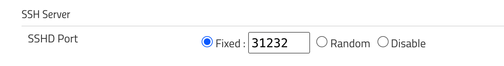
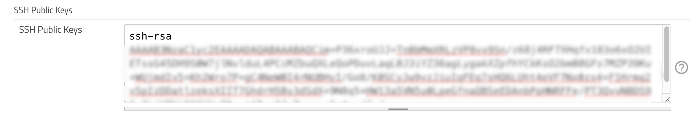

<!-- START doctoc generated TOC please keep comment here to allow auto update -->
<!-- DON'T EDIT THIS SECTION, INSTEAD RE-RUN doctoc TO UPDATE -->
**Table of Contents**  *generated with [DocToc](https://github.com/thlorenz/doctoc)*

- [setup cli](#setup-cli)
  - [get port](#get-port)
  - [ssh](#ssh)
  - [jenkins-cli.jar](#jenkins-clijar)
- [Execute groovy script via cli](#execute-groovy-script-via-cli)
  - [`ERROR: This command is requesting the -remoting mode which is no longer supported`](#error-this-command-is-requesting-the--remoting-mode-which-is-no-longer-supported)
  - [Solution](#solution)
  - [execute the script via https](#execute-the-script-via-https)

<!-- END doctoc generated TOC please keep comment here to allow auto update -->



> references:
> - [Jenkins World 2017: Mastering the Jenkins Script Console](https://www.youtube.com/watch?v=qaUPESDcsGg)
> - [Jenkins Area Meetup - Hacking on Jenkins Internals - Jenkins Script Console](https://www.youtube.com/watch?v=T1x2kCGRY1w)
> - [Write Groovy scripts for Jenkins with code completion](https://www.mdoninger.de/2011/11/07/write-groovy-scripts-for-jenkins-with-code-completion.html)
> - [Example Groovy scripts](https://www.jenkins.io/doc/book/managing/script-console/#example-groovy-scripts)



## setup cli
```bash
export JENKINS_URL=<my.jenkins.com>
```

### get port
```bash
$ curl -Lv https://${JENKINS_URL}/login 2>&1 | grep -i 'x-ssh-endpoint'
< x-ssh-endpoint: my.jenkins.com:31232

$ k -n ci get svc jenkins-discovery -o yaml
apiVersion: v1
kind: Service
metadata:
  ...
spec:
  ports:
  - name: jenkins-agent
    nodePort: 3xxxx
    port: 50000
    protocol: TCP
    targetPort: jnlp-port
  - name: cli-agent
    nodePort: 32123
    port: 31232
    protocol: TCP
    targetPort: cli-port
  selector:
    app: jenkins
...
```




### [ssh](https://www.jenkins.io/doc/book/managing/cli/)
* Jenkins config



* `~/.ssh/config`
```bash
$ cat ~/.ssh/config
Host  my.jenkins.com
      User                marslo
      IdentityFile        ~/.ssh/marslo
      Port                32123
```

* using cli
```bash
$ ssh -q ${JENKINS_URL} help
  add-job-to-view
    Adds jobs to view.
  apply-configuration
    Apply YAML configuration to instance
  build
    Builds a job, and optionally waits until its completion.
  cancel-quiet-down
    Cancel the effect of the "quiet-down" command.
  channel-process
    Launch a new JVM on a slave and connect it with the master with remoting
  ...
```

  OR

    ```bash
    $ ssh -l <user> -i <ssh-private-key> -p <port> ${JENKINS_URL} <command>

    # example
    $ ssh -l marslo -i ~/.ssh/marslo -p 32123 ${JENKINS_URL} help
    ```


### [jenkins-cli.jar](https://www.jenkins.io/doc/book/managing/cli/#using-the-cli-client)

* get client (`jenkins-cli.jar`)
  ```bash
  $ curl -fsSL -O [-u<username>:<password>] https://${JENKINS_URL}/jnlpJars/jenkins-cli.jar

  # or
  $ curl -fsSL -O --netrc-file ~/.marslo/.netrc' https://${JENKINS_URL}/jnlpJars/jenkins-cli.jar
  $ cat ~/.marslo/.netrc
  machine <JENKINS_URL>
  login myaccount
  password mypassword
  ```

* use cli
  ```bash
  $ java -jar jenkins-cli.jar -auth <username>:<password> -s https://${JENKINS_URL} <command>

  # example
  $ java -jar jenkins-cli.jar -auth marslo:<MY-CLI-TOKEN> -s https://${JENKINS_URL} help
    add-job-to-view
      Adds jobs to view.
    apply-configuration
      Apply YAML configuration to instance
    build
      Builds a job, and optionally waits until its completion.
    cancel-quiet-down
      Cancel the effect of the "quiet-down" command.
    ...
  ```

#### handle `-auth`
* using directly in command line
  ```bash
  $ java -jar jenkins-cli.jar -auth marslo:<MY-CLI-TOKEN> -s https://${JENKINS_URL}
  ```

* using file
  ```bash
  $ echo 'marslo:<MY-CLI-TOKEN> ~/.marslo/.jenkins-cli'
  $ java -jar jenkins-cli.jar -auth @/Users/marslo/.marslo/.jenkins-cli -s https://${JENKINS_URL}
  ```

* using environment
  ```bash
  $ export JENKINS_USER_ID=marslo
  $ export JENKINS_API_TOKEN=<MY-CLI-TOKEN>
  $ java -jar jenkins-cli.jar -s https://${JENKINS_URL}
  ```

## [Execute groovy script via cli](https://xanderx.com/post/run-jenkins-script-console-scripts-from-command-line-without-remoting/)
### `ERROR: This command is requesting the -remoting mode which is no longer supported`
```bash
$ ssh -q <jenkins.domain.name> groovy <script.groovy>
```

### Solution
```bash
$ ssh -q <jenkins.domain.name> groovy = < <script.groovy>
```
- i.e.:
  ```bash
  $ ssh -q my.jenkins.com groovy < = plugin.groovy
  ```

### execute the script via https

> [!TIP]
> references:
> - [Script Console](https://www.jenkins.io/doc/book/managing/script-console/)
>
> A Jenkins Admin can execute groovy scripts remotely by sending an HTTP POST request to /script/ url or /scriptText/.

- format
  ```bash
  $ curl -d "script=<your_script_here>" https://jenkins/script

  # or to get output as a plain text result (no HTML)
  $ curl -d "script=<your_script_here>" https://jenkins/scriptText
  ```
- example : [curl submitting groovy file via bash](https://www.jenkins.io/doc/book/managing/script-console/#remote-access)
  ```bash
  $ curl --data-urlencode "script=$(< ./somescript.groovy)" https://jenkins/scriptText

  # or
  $ curl --user 'username:api-token' --data-urlencode \
         "script=$(< ./somescript.groovy)" https://jenkins/scriptText
  ```

- example : Python submitting groovy file providing username and api token
  ```python
  with open('somescript.groovy', 'r') as fd:
      data = fd.read()
  r = requests.post('https://jenkins/scriptText', auth=('username', 'api-token'), data={'script': data})
  ```
