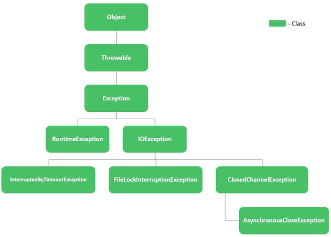

<!-- START doctoc generated TOC please keep comment here to allow auto update -->
<!-- DON'T EDIT THIS SECTION, INSTEAD RE-RUN doctoc TO UPDATE -->
**Table of Contents**  *generated with [DocToc](https://github.com/thlorenz/doctoc)*

- [Aborted Exception](#aborted-exception)
  - [shutdown physical agent](#shutdown-physical-agent)
  - [shutdown pod](#shutdown-pod)

<!-- END doctoc generated TOC please keep comment here to allow auto update -->



> references:
> - [Class java.lang.Throwable](https://docs.oracle.com/en/java/javase/11/docs/api/java.base/java/lang/Throwable.html)
> - [Class Throwable](https://docs.oracle.com/javase/7/docs/api/java/lang/Throwable.html)
> - [* Java Custom Exceptions and Best Practices](https://howtodoinjava.com/java/exception-handling/best-practices-for-for-exception-handling/)


## Aborted Exception


> references:
> - [Class hudson.AbortException](https://javadoc.jenkins-ci.org/hudson/AbortException.html)


### shutdown physical agent
```groovy
e.getClass()       // class hudson.remoting.RequestAbortedException

e.cause            // java.io.IOException: Unexpected termination of the channel
e.cause.getClass() // class java.io.IOException
e.cause.dump()     // detailMessage=Unexpected termination of the channel
                   // cause=java.io.EOFException

e.message          // java.io.IOException: Unexpected termination of the channel
```

### shutdown pod


> references:
> - [Class hudson.remoting.RequestAbortedException](https://javadoc.jenkins.io/component/remoting/hudson/remoting/RequestAbortedException.html)
> - [Class java.nio.channels.ClosedChannelException](https://docs.oracle.com/javase/7/docs/api/java/nio/channels/ClosedChannelException.html)



#### before fully initialized


> references:
> - Class org.jenkinsci.plugins.workflow.support.steps.AgentOfflineException
> - [How to retry a Jenkins Pipeline stage with an agent condition](https://stackoverflow.com/a/73632214/2940319)


#### after fully initialized


> references:
> - [Java Suppressed Exceptions with Examples](https://howtodoinjava.com/java/exception-handling/java-suppressed-exceptions/)
> - [Example usage for java.lang InterruptedException getCause](http://www.java2s.com/example/java-api/java/lang/interruptedexception/getcause-0-11.html)
> - [The hierarchy of ClosedChannelException](https://www.geeksforgeeks.org/closedchannelexception-in-java-with-examples/)
>   


```groovy
e.getClass()       // class hudson.remoting.RequestAbortedException

e.cause            // java.nio.channels.ClosedChannelException
e.cause.getClass() // class java.nio.channels.ClosedChannelException

e.message          // java.nio.channels.ClosedChannelException

e.suppressed.getClass()                              // class [Ljava.lang.Throwable
e.suppressed.collect { it.getClass() }.join('\n')    // class hudson.remoting.Channel$CallSiteStackTrace
e.suppressed.collect { it.message }.join('\n')       // Remote call to JNLP4-connect connection from 10.244.13.1/10.244.13.1:59576
```
- sample in CI
  ```groovy
  import hudson.remoting.RequestAbortedException

  try {
    ...
  } catch ( RequestAbortedException e ) {
    Throwable throwable = e.getCause()
    if ( throwable instanceof java.nio.channels.ClosedChannelException ) {
      String msg = "FAILED : ${e.message} : ${e.suppressed.collect{ it.message }. join(' && ')}"
      error ( msg )
    }
  } catch ( Exception e ) {
    def sw = new StringWriter()
    e.printStackTrace( new PrintWriter(sw) )
    echo sw.toString()
    throw e
  }
  ```

- more samples
  ```groovy
  import static java.lang.System.err ;

  try {
    ...
  } catch( Exception ex ) {
    err.println( "Exception encountered: " + ex.toString() );
    final Throwable[] suppressedExceptions = ex.getSuppressed();
    final int numSuppressed = suppressedExceptions.length;
    if ( numSuppressed ) {
      err.println( "There are ${numSuppressed} suppressed exceptions: " );
      for ( final Throwable exception : suppressedExceptions ) {
        err.println( exception.toString() );
      }
    }
  }
  ```
