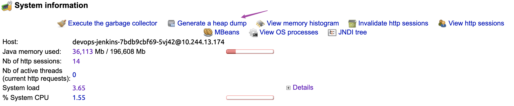
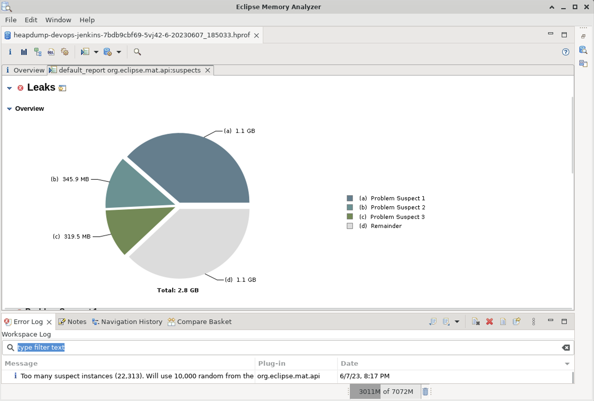
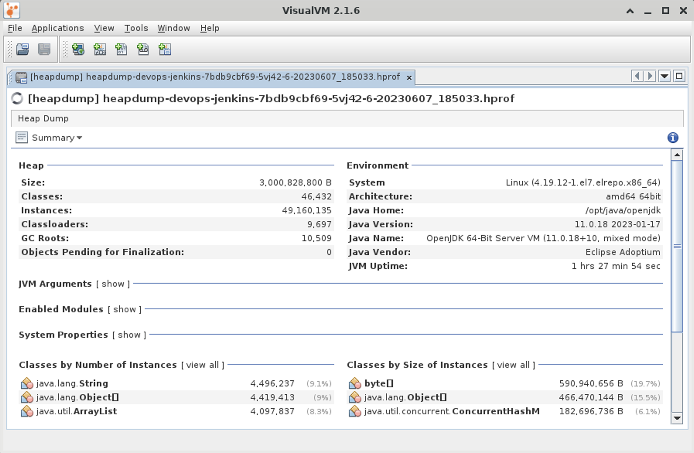

<!-- START doctoc generated TOC please keep comment here to allow auto update -->
<!-- DON'T EDIT THIS SECTION, INSTEAD RE-RUN doctoc TO UPDATE -->

- [troubleshooting](#troubleshooting)
  - [tools](#tools)
  - [thread dump](#thread-dump)
- [plugin miss-match issue](#plugin-miss-match-issue)
- [other tools](#other-tools)

<!-- END doctoc generated TOC please keep comment here to allow auto update -->

> [!TIP|label:official recommended]
> - [Prepare Jenkins for Support](https://docs.cloudbees.com/docs/cloudbees-ci-kb/latest/best-practices/prepare-jenkins-for-support)
> - [CloudBees Jenkins JVM troubleshooting](https://docs.cloudbees.com/docs/cloudbees-ci/latest/jvm-troubleshooting/)
>   - [* Supported Java 8 arguments](https://docs.cloudbees.com/docs/cloudbees-ci/latest/jvm-troubleshooting/#java8-arguments)
>   - [* Supported Java 11 arguments](https://docs.cloudbees.com/docs/cloudbees-ci/latest/jvm-troubleshooting/#java11-arguments)
>   - [* collectPerformanceData Script](https://docs.cloudbees.com/docs/cloudbees-ci/latest/jvm-troubleshooting/#running-collectPerformanceData)
> - [Diagnosing Errors](https://www.jenkins.io/doc/book/troubleshooting/diagnosing-errors/)
> - [Tuning Jenkins GC For Responsiveness and Stability with Large Instances](https://www.jenkins.io/blog/2016/11/21/gc-tuning/)
> - [** Java Heap settings Best Practice](https://docs.cloudbees.com/docs/cloudbees-ci-kb/latest/best-practices/jvm-memory-settings-best-practice)
>   - [Minimum and maximum heap sizes](https://docs.cloudbees.com/docs/cloudbees-ci/latest/jvm-troubleshooting/#_minimum_and_maximum_heap_sizes)
> - [How to Troubleshoot and Address Jenkins Startup Performances](https://docs.cloudbees.com/docs/cloudbees-ci-kb/latest/troubleshooting-guides/jenkins-startup-performances)

## troubleshooting

> [!NOTE|label:references:]
> - [How to Troubleshoot and Address Jenkins Startup Performances](https://docs.cloudbees.com/docs/cloudbees-ci-kb/latest/troubleshooting-guides/jenkins-startup-performances)
> - [Required Data: Jenkins Hang Issue On Linux](https://docs.cloudbees.com/docs/cloudbees-ci-kb/latest/required-data/required-data-hang-issue-on-linux-cjp)
> - [collectPerformanceData Script](https://docs.cloudbees.com/docs/cloudbees-ci/latest/jvm-troubleshooting/#running-collectPerformanceData)
>   - [collectPerformanceData.sh](https://s3.amazonaws.com/cloudbees-jenkins-scripts/e206a5-linux/collectPerformanceData.sh)
> - [Understanding Thread Dumps](https://docs.cloudbees.com/docs/cloudbees-ci/latest/jvm-troubleshooting/#_understanding_thread_dumps)
>   - [fastthread.io](https://fastthread.io/)
> - [gceasy.io](https://gceasy.io/)
> - [What causes high CPU usage and how can I reduce it](https://pc.net/helpcenter/answers/reduce_high_cpu_usage)
>
> - Unrecognized VM Option
>   - `UseGCLogFileRotation`
>   - `GCLogFileSize=100m`
>   - `PrintGCDateStamps`
>   - `PrintGCCause`
>   - `PrintTenuringDistribution`
>   - `PrintReferenceGC`
>   - `PrintAdaptiveSizePolicy`

### tools

> [!NOTE|label:tools]
> - `iostat`
> - [`nfsiostat`](https://docs.cloudbees.com/docs/cloudbees-ci/latest/jvm-troubleshooting/#_nfsiostat)
> - [`nfsstat`](https://docs.cloudbees.com/docs/cloudbees-ci/latest/jvm-troubleshooting/#_nfsstat)
> - [`vmstat` - understanding Thread DumpUnderstanding Thread Dumpss](https://docs.cloudbees.com/docs/cloudbees-ci/latest/jvm-troubleshooting/#_vmstat)
> - [`top`](https://docs.cloudbees.com/docs/cloudbees-ci/latest/jvm-troubleshooting/#_top)
>   - [`top -H`](https://docs.cloudbees.com/docs/cloudbees-ci/latest/jvm-troubleshooting/#_top_h)
> - [`netstat`](https://docs.cloudbees.com/docs/cloudbees-ci/latest/jvm-troubleshooting/#_netstat)
> - [jstack](https://docs.cloudbees.com/docs/cloudbees-ci/latest/jvm-troubleshooting/#_jstack)
> - [`stap`](https://man7.org/linux/man-pages/man1/stap.1.html)

- prepare
  ```bash
  $ apt update
  $ apt install sudo vim netstat net-tools sysstat nfs-common
  $ sudo systemctl start sysstat
  $ sudo systemctl enable sysstat
  $ cat /etc/cron.d/sysstat
  ```

  > [!NOTE|label:tips for sar]
  > - if you wanted to check your memory usage instead, you could use the `-r` argument rather than `-u`
  >   ```bash
  >   $ sar -r 2 30
  >   ```

- collectPerformanceData.sh
  ```bash
  $ curl -sO https://s3.amazonaws.com/cloudbees-jenkins-scripts/e206a5-linux/collectPerformanceData.sh
  $ chmod +x collectPerformanceData.sh

  $ sudo -u $JENKINS_USER sh collectPerformanceData.sh $JENKINS_PID 300 5
  $ or
  <jenkins> $ bash collectPerformanceData.sh $JENKINS_PID 300 5
  [INFO] Collected a threadDump for PID 8.
  [INFO] A new collection will start in 5 seconds.
  [INFO] Taking top data collection.
  [INFO] Taking TopdashH data collection.
  [INFO] Taking vmstat data collection.
  [INFO] Taking netstat collection.
  [INFO] Taking iostat data collection.
  [INFO] Taking nfsiostat data collection.
  [INFO] Taking nfsstat data collection.
  ```

  > [!NOTE]
  > - `300`: "Length to run the script in seconds"
  > - `5`: "Intervals to execute commands in seconds"


### thread dump

- generated via monitor plugin

  

- generated via `jmap`

  > [!NOTE|label:references:]
  > - [List All the Classes Loaded in the JVM](https://www.baeldung.com/jvm-list-all-classes-loaded)

  ```bash
  $ pid=$(ps auxfww | grep devops-jenkins | awk '{print $2}')
  $ jmap -dump:format=b,file=/opt/tmp/heapdump.bin ${pid}
  ```

- analysis via
  - [fastthread.io](https://fastthread.io/)
  - [MAT: Eclipse Memory Analyzer](https://www.eclipse.org/mat/)

   

  - [VisualVM](https://visualvm.github.io/)
    - i.e.: `visualvm.exe --jdkhome "C:\Software\Java\jdk1.6.0" --userdir "C:\Temp\visualvm_userdir"`

   

## plugin miss-match issue

```bash
# jenkins version
$ java -jar /usr/share/jenkins/jenkins.war --version
2.458
```

```bash
# -- fix single plugin --
# check version
$ cat /va/lib/jenkins/plugins/credentials.jpi.version_from_image
1380.va_435002fa_924
$ unzip -p credentials.jpi META-INF/MANIFEST.MF | tr -d '\r' | grep -E 'Plugin-Version|Short-Name|Jenkins-Version'
Short-Name: credentials
Plugin-Version: 1487.va_d001edge2c31
Jenkins-Version: 2.504.3

# download correct version
$ mv credentials.jpi credentials.jpi.bad-1487
$ curl -fsSL \
  https://updates.jenkins.io/download/plugins/credentials/1380.va_435002fa_924/credentials.hpi \
  -o credentials.jpi
$ chown -R jenkins:jenkins credentials.jpi
$ unzip -p credentials.jpi META-INF/MANIFEST.MF | tr -d '\r' | grep -E 'Plugin-Version|Short-Name|Jenkins-Version'
Short-Name: credentials
Plugin-Version: 1380.va_435002fa_924
Jenkins-Version: 2.426.3
$ rm -rf credentials

# restart docker image
$ docker restart jenkins
```

```bash
# -- multiple plugins --
# check all plugins
$ cd /var/lib/jenkins/plugins
$ for p in *.jpi; do
  needs=$(unzip -p "$p" META-INF/MANIFEST.MF 2>/dev/null | tr -d '\r' | sed -n 's/^Jenkins-Version: //p')
  [ -n "${needs}" ] && printf '%s\t%s\n' "${needs}" "${p%.jpi}"
done | sort -V | awk -F'\t' '$1 > "2.458" {print "FAILED: "$2"  needs "$1}'
FAILED: pipeline-timeline  needs 2.7.3
FAILED: jquery  needs 2.60.3
FAILED: bouncycastle-api  needs 2.479.1
FAILED: commons-lang3-api  needs 2.479.3
FAILED: commons-text-api  needs 2.479.3
FAILED: structs  needs 2.479.3
FAILED: ionicons-api  needs 2.504.1

# fix
$ for name in bouncycastle-api commons-lang3-api commons-text-api structs ionicons-api; do
  ver=$(command cat "${name}.jpi.version_from_image" 2>/dev/null | tr -d '\r\n')
  echo "== ${name} -> ${ver} =="
  mv "${name}.jpi" "${name}.jpi.bad" 2>/dev/null
  if curl -fsSL "https://updates.jenkins.io/download/plugins/${name}/${ver}/${name}.hpi" -o "${name}.jpi"; then
    rm -rf "${name}"
    chown jenkins:jenkins "${name}.jpi"
    echo "  OK"
  else
    echo "  Download Failed, Rollback"; mv "${name}.jpi.bad" "${name}.jpi"
  fi
done
== bouncycastle-api -> 2.30.1.78.1-248.ve27176eb_46cb_ ==
  OK
== commons-lang3-api -> 3.17.0-84.vb_b_938040b_078 ==
  OK
== commons-text-api -> 1.12.0-129.v99a_50df237f7 ==
  OK
== structs -> 338.v848422169819 ==
  OK
== ionicons-api -> 74.v93d5eb_813d5f ==
  OK

# re-check
$ for name in bouncycastle-api commons-lang3-api commons-text-api structs ionicons-api; do
  printf '%-20s ' "$name"
  unzip -p "${name}.jpi" META-INF/MANIFEST.MF | tr -d '\r' | \
    awk -F': ' '/^Plugin-Version/{v=$2} /^Jenkins-Version/{j=$2} END{printf "ver=%s  needs=%s\n", v, j}'
done
bouncycastle-api     ver=2.30.1.78.1-248.ve27176eb_46cb_  needs=2.361.4
commons-lang3-api    ver=3.17.0-84.vb_b_938040b_078  needs=2.361.4
commons-text-api     ver=1.12.0-129.v99a_50df237f7  needs=2.440.3
structs              ver=338.v848422169819  needs=2.414.3
ionicons-api         ver=74.v93d5eb_813d5f  needs=2.361.4

# restart docker image
$ docker restart jenkins
```

## other tools
- [Decimal to Hexadecimal Converter](https://www.binaryhexconverter.com/decimal-to-hex-converter)
- [GC Log Analyzer](https://gceasy.io/)
