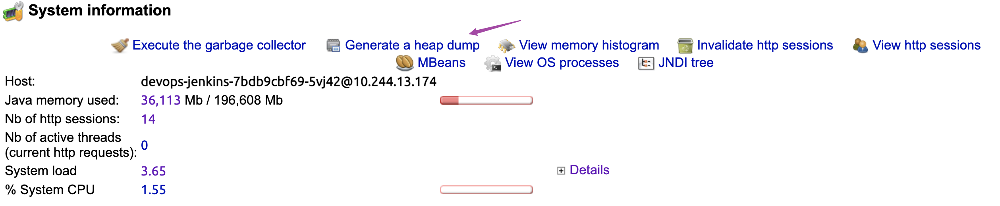

<!-- START doctoc generated TOC please keep comment here to allow auto update -->
<!-- DON'T EDIT THIS SECTION, INSTEAD RE-RUN doctoc TO UPDATE -->

- [troubleshooting](#troubleshooting)
  - [tools](#tools)
  - [thread dump](#thread-dump)
- [other tools](#other-tools)

<!-- END doctoc generated TOC please keep comment here to allow auto update -->

> [!TIP|label:official recommended]
> - [Prepare Jenkins for Support](https://docs.cloudbees.com/docs/cloudbees-ci-kb/latest/best-practices/prepare-jenkins-for-support)
> - [CloudBees Jenkins JVM troubleshooting](https://docs.cloudbees.com/docs/cloudbees-ci/latest/jvm-troubleshooting/)
>   - [* Supported Java 8 arguments](https://docs.cloudbees.com/docs/cloudbees-ci/latest/jvm-troubleshooting/#java8-arguments)
>   - [* Supported Java 11 arguments](https://docs.cloudbees.com/docs/cloudbees-ci/latest/jvm-troubleshooting/#java11-arguments)
>   - [* collectPerformanceData Script](https://docs.cloudbees.com/docs/cloudbees-ci/latest/jvm-troubleshooting/#running-collectPerformanceData)
> - [Diagnosing Errors](https://www.jenkins.io/doc/book/troubleshooting/diagnosing-errors/)
> - [Tuning Jenkins GC For Responsiveness and Stability with Large Instances](https://www.jenkins.io/blog/2016/11/21/gc-tuning/)
> - [** Java Heap settings Best Practice](https://docs.cloudbees.com/docs/cloudbees-ci-kb/latest/best-practices/jvm-memory-settings-best-practice)
>   - [Minimum and maximum heap sizes](https://docs.cloudbees.com/docs/cloudbees-ci/latest/jvm-troubleshooting/#_minimum_and_maximum_heap_sizes)
> - [How to Troubleshoot and Address Jenkins Startup Performances](https://docs.cloudbees.com/docs/cloudbees-ci-kb/latest/troubleshooting-guides/jenkins-startup-performances)

## troubleshooting

> [!NOTE|label:references:]
> - [How to Troubleshoot and Address Jenkins Startup Performances](https://docs.cloudbees.com/docs/cloudbees-ci-kb/latest/troubleshooting-guides/jenkins-startup-performances)
> - [Required Data: Jenkins Hang Issue On Linux](https://docs.cloudbees.com/docs/cloudbees-ci-kb/latest/required-data/required-data-hang-issue-on-linux-cjp)
> - [collectPerformanceData Script](https://docs.cloudbees.com/docs/cloudbees-ci/latest/jvm-troubleshooting/#running-collectPerformanceData)
>   - [collectPerformanceData.sh](https://s3.amazonaws.com/cloudbees-jenkins-scripts/e206a5-linux/collectPerformanceData.sh)
> - [Understanding Thread Dumps](https://docs.cloudbees.com/docs/cloudbees-ci/latest/jvm-troubleshooting/#_understanding_thread_dumps)
>   - [fastthread.io](https://fastthread.io/)
> - [gceasy.io](https://gceasy.io/)
> - [What causes high CPU usage and how can I reduce it](https://pc.net/helpcenter/answers/reduce_high_cpu_usage)
>
> - Unrecognized VM Option
>   - `UseGCLogFileRotation`
>   - `GCLogFileSize=100m`
>   - `PrintGCDateStamps`
>   - `PrintGCCause`
>   - `PrintTenuringDistribution`
>   - `PrintReferenceGC`
>   - `PrintAdaptiveSizePolicy`

### tools

> [!NOTE|label:tools]
> - `iostat`
> - [`nfsiostat`](https://docs.cloudbees.com/docs/cloudbees-ci/latest/jvm-troubleshooting/#_nfsiostat)
> - [`nfsstat`](https://docs.cloudbees.com/docs/cloudbees-ci/latest/jvm-troubleshooting/#_nfsstat)
> - [`vmstat`Understanding Thread DumpUnderstanding Thread Dumpss](https://docs.cloudbees.com/docs/cloudbees-ci/latest/jvm-troubleshooting/#_vmstat)
> - [`top`](https://docs.cloudbees.com/docs/cloudbees-ci/latest/jvm-troubleshooting/#_top)
>   - [`top -H`](https://docs.cloudbees.com/docs/cloudbees-ci/latest/jvm-troubleshooting/#_top_h)
> - [`netstat`](https://docs.cloudbees.com/docs/cloudbees-ci/latest/jvm-troubleshooting/#_netstat)
> - [jstack](https://docs.cloudbees.com/docs/cloudbees-ci/latest/jvm-troubleshooting/#_jstack)
> - [`stap`](https://man7.org/linux/man-pages/man1/stap.1.html)

- prepare
  ```bash
  $ apt update
  $ apt install sudo vim netstat net-tools sysstat nfs-common
  $ sudo systemctl start sysstat
  $ sudo systemctl enable sysstat
  $ cat /etc/cron.d/sysstat
  ```

  > [!NOTE|label:tips for sar]
  > - if you wanted to check your memory usage instead, you could use the `-r` argument rather than `-u`
  >   ```bash
  >   $ sar -r 2 30
  >   ```

- collectPerformanceData.sh
  ```bash
  $ curl -sO https://s3.amazonaws.com/cloudbees-jenkins-scripts/e206a5-linux/collectPerformanceData.sh
  $ chmod +x collectPerformanceData.sh

  $ sudo -u $JENKINS_USER sh collectPerformanceData.sh $JENKINS_PID 300 5
  $ or
  <jenkins> $ bash collectPerformanceData.sh $JENKINS_PID 300 5
  [INFO] Collected a threadDump for PID 8.
  [INFO] A new collection will start in 5 seconds.
  [INFO] Taking top data collection.
  [INFO] Taking TopdashH data collection.
  [INFO] Taking vmstat data collection.
  [INFO] Taking netstat collection.
  [INFO] Taking iostat data collection.
  [INFO] Taking nfsiostat data collection.
  [INFO] Taking nfsstat data collection.
  ```

  > [!NOTE]
  > - `300`: "Length to run the script in seconds"
  > - `5`: "Intervals to execute commands in seconds"


### thread dump

- generated via monitor plugin

  

- generated via `jmap`

  > [!NOTE|label:references:]
  > - [List All the Classes Loaded in the JVM](https://www.baeldung.com/jvm-list-all-classes-loaded)

  ```bash
  $ pid=$(ps auxfww | grep devops-jenkins | awk '{print $2}')
  $ jmap -dump:format=b,file=/opt/tmp/heapdump.bin ${pid}
  ```

- analysis via
  - [fastthread.io](https://fastthread.io/)
  - [MAT: Eclipse Memory Analyzer](https://www.eclipse.org/mat/)

   

  - [VisualVM](https://visualvm.github.io/)
    - i.e.: `visualvm.exe --jdkhome "C:\Software\Java\jdk1.6.0" --userdir "C:\Temp\visualvm_userdir"`

   

## other tools
- [Decimal to Hexadecimal Converter](https://www.binaryhexconverter.com/decimal-to-hex-converter)
- [GC Log Analyzer](https://gceasy.io/)
