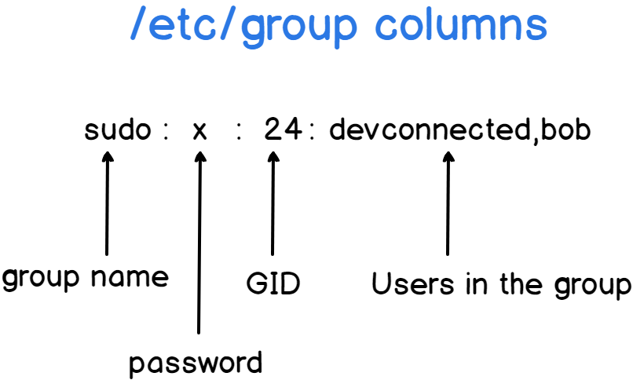
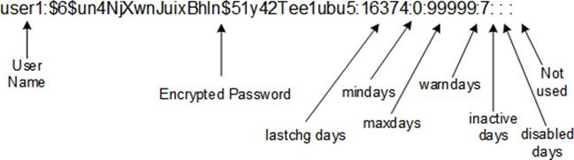

<!-- START doctoc generated TOC please keep comment here to allow auto update -->
<!-- DON'T EDIT THIS SECTION, INSTEAD RE-RUN doctoc TO UPDATE -->

- [tools](#tools)
  - [getent](#getent)
  - [sss](#sss)
- [sssd](#sssd)
  - [sss_override management](#sss_override-management)
    - [check user](#check-user)
    - [add user name](#add-user-name)
    - [override the uid](#override-the-uid)
    - [override the gid](#override-the-gid)
    - [override the home directory](#override-the-home-directory)
    - [override the shell attribute](#override-the-shell-attribute)
    - [managing the sssd cache](#managing-the-sssd-cache)
    - [remove account](#remove-account)
    - [backup and restore](#backup-and-restore)
    - [list all override](#list-all-override)
  - [sssd config](#sssd-config)
    - [other sssd config](#other-sssd-config)
  - [troubleshooting](#troubleshooting)
- [local](#local)
  - [user](#user)
    - [`subuid` & `subgid`](#subuid--subgid)
    - [local user management](#local-user-management)
  - [group](#group)
    - [get group](#get-group)
    - [create group](#create-group)
    - [modify group](#modify-group)
    - [manager group users](#manager-group-users)
- [tips](#tips)
  - [list account permission](#list-account-permission)
  - [check account locale](#check-account-locale)
  - [logout](#logout)
    - [view users password properties in linux](#view-users-password-properties-in-linux)
    - [hash_algorithm](#hash_algorithm)
- [authentication in RHEL](#authentication-in-rhel)

<!-- END doctoc generated TOC please keep comment here to allow auto update -->


# tools
## getent

> [!NOTE|label:references:]
> - [difference between `getent passwd <USER>` and `getent passwd | grep <USER>`](https://serverfault.com/a/810945/129815)

- `getent passwd <USER>` -> checking data in `/var/lib/sss/mc/passwd`
- `getent passwd | grep <USER>` -> checking data in `/var/lib/sss/pipes/nss`

## sss

> [!NOTE|label:references]
> - [Chapter 7. SSSD client-side view](https://docs.redhat.com/en/documentation/red_hat_enterprise_linux/8/html/configuring_authentication_and_authorization_in_rhel/assembly_sssd-client-side-view_configuring-authentication-and-authorization-in-rhel)
```bash
# sss_override
$ sudo dnf install -y sssd-tools
```

# [sssd](https://access.redhat.com/documentation/en-us/red_hat_enterprise_linux/8/html/configuring_authentication_and_authorization_in_rhel/configuring-sssd-to-use-ldap-and-require-tls-authentication_configuring-authentication-and-authorization-in-rhel)


> references:
> - sssd
>   - [understanding sssd and its benefits](https://access.redhat.com/documentation/en-us/red_hat_enterprise_linux/8/html/configuring_authentication_and_authorization_in_rhel/understanding-sssd-and-its-benefits_configuring-authentication-and-authorization-in-rhel)
>   - [sssd client-side view](https://access.redhat.com/documentation/en-us/red_hat_enterprise_linux/8/html/configuring_authentication_and_authorization_in_rhel/assembly_sssd-client-side-view_configuring-authentication-and-authorization-in-rhel)
>   - [Configuring an LDAP Client to use SSSD](https://docs.oracle.com/cd/E37670_01/E41138/html/ol_sssd_ldap.html)
>   - [`/etc/sssd/sssd.conf` sample](https://github.com/marslo/iDevOps/blob/master/centos/sssd/sssd.conf)
>   - [Troubleshooting SSSD](https://access.redhat.com/documentation/en-us/red_hat_enterprise_linux/7/html/system-level_authentication_guide/trouble)
>   - [Linux user authentication with SSSD / LDAP](https://aws.nz/best-practice/sssd-ldap/)
>   - [man sss_override](https://jhrozek.fedorapeople.org/sssd/1.13.3/man/sss_override.8.html)
>   - [Setting Password Expiry](https://access.redhat.com/articles/3027531)
>   - [How To Clear The SSSD Cache In Linux](https://www.rootusers.com/how-to-clear-the-sssd-cache-in-linux/)
> - rhel
>   - [Chapter 7. Configuring SSSD](https://access.redhat.com/documentation/en-us/red_hat_enterprise_linux/7/html/system-level_authentication_guide/sssd)
>     - [7.5. Configuring System Services for SSSD](https://access.redhat.com/documentation/en-us/red_hat_enterprise_linux/7/html/system-level_authentication_guide/configuring_services)
>     - [7.5.2. Configuring Services: PAM](https://access.redhat.com/documentation/en-us/red_hat_enterprise_linux/7/html/system-level_authentication_guide/configuring_services#Configuration_Options-PAM_Configuration_Options)
>     - [7.6. SSSD Client-side Views](https://access.redhat.com/documentation/en-us/red_hat_enterprise_linux/7/html/system-level_authentication_guide/sssd-client-side-views)
>   - [13.2. Using and Caching Credentials with SSSD](https://access.redhat.com/documentation/en-us/red_hat_enterprise_linux/6/html/deployment_guide/sssd-introduction#doc-wrapper)
>     - [13.2.2. Setting up the sssd.conf File](https://access.redhat.com/documentation/en-us/red_hat_enterprise_linux/6/html/deployment_guide/about-sssd-conf)
>     - [13.2.23. Creating Domains: Primary Server and Backup Servers](https://access.redhat.com/documentation/en-us/red_hat_enterprise_linux/6/html/deployment_guide/sect-configuring_failover)
>     - [13.2.22. Creating Domains: Access Control](https://access.redhat.com/documentation/en-us/red_hat_enterprise_linux/6/html/deployment_guide/sect-config-sssd-domain-access)
>     - [13.2.28. Managing the SSSD Cache](https://access.redhat.com/documentation/en-us/red_hat_enterprise_linux/6/html/deployment_guide/sssd-cache)
> - pam
>   - [Quickstart: Joining a Linux VM to a domain](https://cloud.google.com/managed-microsoft-ad/docs/quickstart-domain-join-linux)
>   - [additional configuration for identity and authentication providers](https://access.redhat.com/documentation/en-us/red_hat_enterprise_linux/8/html/configuring_authentication_and_authorization_in_rhel/assembly_additional-configuration-for-identity-and-authentication-providers_configuring-authentication-and-authorization-in-rhel#proc_adjusting-how-sssd-interprets-full-user-names_assembly_additional-configuration-for-identity-and-authentication-providers)
>   - [Editing the /etc/pam.d files on Red Hat Enterprise Linux Server](https://www.ibm.com/docs/en/powersc-mfa/1.1?topic=cpmcs-editing-etcpamd-files-red-hat-enterprise-linux-server)
>   - [2.2. PAM Configuration Files](https://access.redhat.com/documentation/en-us/red_hat_enterprise_linux/6/html/managing_smart_cards/pam_configuration_files)


## sss_override management

```bash
$ sudo dnf install -y sssd-tools
```

### check user
```bash
$ sudo sssctl user-checks <username>
user: marslo
action: acct
service: system-auth

SSSD nss user lookup result:
 - user name: marslo
 - user id: 33637
 - group id: 40048
 - gecos: Marslo Jiao (Marslo Jiao)
 - home directory: /home/marslo
 - shell: /bin/bash

InfoPipe operation failed. Check that SSSD is running and the InfoPipe responder is enabled. Make sure 'ifp' is listed in the 'services' option in sssd.conf.InfoPipe User lookup with [marslo] failed.
testing pam_acct_mgmt

pam_acct_mgmt: Success

PAM Environment:
 - no env -

# or
$ getent passwd -s sss marslo
```

### add user name
```bash
$ sudo /usr/sbin/sss_override user-add <username> -n secondary-username

# verification
$ id secondary-username
# display the override
$ sudo /usr/sbin/sss_override user-show user-name
```

### override the uid
```bash
# check current uid
$ id -u <username>

# overwride
$ sudo /usr/sbin/sss_override user-add <username> -u <new-uid>
$ sudo /usr/sbin/sss_cache --users
# or
$ sudo /usr/sbin/sss_cache --user <username>
$ sudo systemctl restart sssd
```

### override the gid
```bash
# check current gid
$ id -g <username>
# or
$ id -nG <username>
# or
$ sudo lid -g <group_name>

# override
$ sudo /usr/sbin/sss_override user-add <username> -g <new-gid>
$ sudo /usr/sbin/sss_cache --users
$ sudo /usr/sbin/sss_cache --user <username>
$ sudo systemctl restart sssd
```

### override the home directory
```bash
# check current home directory
$ getent passwd <username>

# override
$ sudo /usr/sbin/sss_override user-add <username> -h /new/home/directory
$ sudo systemctl restart sssd
```

### override the shell attribute
```bash
# check current
$ getent passwd <username>

# override
$ sudo /usr/sbin/sss_override user-add <username> -s /new/shell
$ sudo systemctl restart sssd

# or
$ sudo /usr/sbin/sss_override user-add <username> \
       -h </original/home/directory> \
       -s /bin/bash
$ sudo systemctl restart sssd
```

### [managing the sssd cache](https://access.redhat.com/documentation/en-us/red_hat_enterprise_linux/6/html/deployment_guide/sssd-cache#sssd-cache-purge)
```bash
# clear the cache and update all records
$ sudo /usr/sbin/sss_cache [-E|--everything]

# clear invalidates cache entries for all user records
$ sudo /usr/sbin/sss_cache [-U|--users]

# clear all cached entries for a particular domain
$ sudo /usr/sbin/sss_cache [-E|--everything] [-d|--domain] <ldap_name>

# purge the records for that specific account and leave the rest of the cache intact
$ sudo /usr/sbin/sss_cache [-u|--user] <username>

# invalidates the cache entry for the specified group
$ sudo /usr/sbin/sss_cache [-g|--group] <groupname>
```

### remove account


> - references:
>   - [How do you cleanup after deleting an LDAP user on RHEL 7?](https://unix.stackexchange.com/a/538885/29178)


```bash
$ sudo sss_override user-del [--debug 1..9] <username>
$ sudo /usr/sbin/sss_cache --everything
$ sudo systemctl restart sssd
```

- or
  ```bash
  # get info
  $ loginctl

  # logout
  $ loginctl kill-user <username>
  $ sudo /usr/sbin/sss_cache -u <username>
  $ loginctl terminate-user <username>
  $ sudo pkill -u <username>
  $ systemctl restart sssd
  $ systemctl restart accounts-daemon
  ```

#### tricky
- sssd account cannot be deleted
  ```bash
  $ sudo /usr/sbin/sss_cache -u devops
  $ sudo /usr/sbin/sss_cache -E
  $ sudo systemctl restart sssd

  # verify
  $ getent passwd devops
  devops:*:41032:10:Service Account-Block-chain:/user/devops:/bin/tcsh
  $ id devops
  uid=41032(devops) gid=10(uucp) groups=10(uucp),0(root),4(adm),1000(marvell),994(docker)
  $ sudo useradd -m -d '/home/devops' -u 1000 -s /bin/bash devops
  useradd: user 'devops' already exists

  $ hexdump -C /var/lib/sss/mc/passwd
  00000000  01 00 00 f0 01 00 00 00  01 00 00 00 01 00 00 00  |................|
  00000010  b1 e9 04 d3 80 ff 7f 00  66 66 00 00 c0 cc 0c 00  |........ff......|
  00000020  38 00 00 00 b8 ff 7f 00  20 66 80 00 00 00 00 00  |8....... f......|
  00000030  01 00 00 f0 00 00 00 00  00 00 00 f0 74 00 00 00  |............t...|
  00000040  a7 14 ac 66 00 00 00 00  ff ff ff ff ff ff ff ff  |...f............|
  00000050  70 db 02 00 1c 36 02 00  ff ff ff ff 00 00 00 f0  |p....6..........|
  00000060  10 00 00 00 48 a0 00 00  0a 00 00 00 3c 00 00 00  |....H.......<...|
  00000070  64 65 76 6f 70 73 00 2a  00 53 65 72 76 69 63 65  |devops.*.Service|
  00000080  20 41 63 63 6f 75 6e 74  2d 42 6c 6f 63 6b 2d 63  | Account-Block-c|
  00000090  68 61 69 6e 00 2f 75 73  65 72 2f 64 65 76 6f 70  |hain./user/devop|
  000000a0  73 00 2f 62 69 6e 2f 74  63 73 68 00 ff ff ff ff  |s./bin/tcsh.....|
  000000b0  ff ff ff ff ff ff ff ff  ff ff ff ff ff ff ff ff  |................|
  *
  ......
  ```

- solution

  > [!TIP|label:references:]
  > - login to `root` to execute the following commands; or use any sudo **local** account, otherwise the sssd account will be unavailable when sssd service is stopped !

  ```bash
  # login to root or any sudo local account
  $ sudo su -

  # clean cache
  $ sudo /usr/sbin/sss_cache -u devops
  $ sudo /usr/sbin/sss_cache -E
  $ sudo systemctl restart sssd

  # stop sssd service and remove /var/lib/sss/mc/passwd
  $ sudo systemctl stop sssd.service
  $ sudo mv /var/lib/sss/mc/passwd{,.bak}

  # create local user
  $ sudo useradd -m -d '/home/devops' -u 1001 -g devops -s /bin/bash devops
  $ id devops
  uid=1001(devops) gid=1001(devops) groups=1001(devops)

  # start sssd service
  $ sudo systemctl start sssd.service
  ```

### backup and restore
```bash
# export
$ /usr/sbin/sss_override user-export user-export.bak
$ /usr/sbin/sss_override group-export group-export.bak

# restore
$ /usr/sbin/sss_override user-import user-import.bak
$ /usr/sbin/sss_override group-import group-import.bak
```

### list all override
```bash
$ /usr/sbin/sss_override user-find
```

## [sssd config](https://serverfault.com/a/749305/129815)


> After this in `/etc/sssd/sssd.conf` file
> Specify `ldap_default_bind_dn` and `ldap_default_authtok` as default bind dn and password respectively, this depends upon your ldap setup.
> <br>
> - references:
> - [Chapter 13. Configuring Authentication](https://access.redhat.com/documentation/en-us/red_hat_enterprise_linux/6/html/deployment_guide/ch-configuring_authentication)


```bash
# optional
$ yum install -y sssd \
                 realmd \
                 oddjob \
                 oddjob-mkhomedir \
                 adcli \
                 samba-common \
                 samba-common-tools \
                 krb5-workstation \
                 openldap-clients \
                 policycoreutils-python \
                 authselect-compat \
                 ntpdate \
                 ntp
$ authselect select sssd
$ authselect select sssd with-mkhomedir
$ systemctl enable oddjobd.service
$ systemctl start oddjobd.service

$ authconfig --enablesssd \
             --enablesssdauth \
             --enablelocauthorize \
             --enableldap \
             --enableldapauth \
             --ldapserver=ldap://ipaserver.example.com:389 \
             --disableldaptls \
             --ldapbasedn=dc=example,dc=com \
             --enablerfc2307bis \
             --enablemkhomedir \
             --enablecachecreds \
             --update
```

### other sssd config


> references:
> - [2.2. PAM Configuration Files](https://access.redhat.com/documentation/en-us/red_hat_enterprise_linux/6/html/managing_smart_cards/pam_configuration_files)
> - [Chapter 4. Hardening Your System with Tools and Services](https://access.redhat.com/documentation/en-us/red_hat_enterprise_linux/7/html/security_guide/chap-hardening_your_system_with_tools_and_services)
> - [21.2.2. Mounting NFS File Systems using autofs](https://access.redhat.com/documentation/en-us/red_hat_enterprise_linux/4/html/system_administration_guide/mounting_nfs_file_systems-mounting_nfs_file_systems_using_autofs)
> - [13.2.28. Managing the SSSD Cache](https://access.redhat.com/documentation/en-us/red_hat_enterprise_linux/6/html/deployment_guide/sssd-cache)


- config files

| file                        | comments                                     |
| --------------------------- | -------------------------------------------- |
| `/etc/krb5.keytab`          | host keytab file                             |
| `/etc/nsswitch.conf`        | Name Service Switch (NSS) configuration file |
| `/etc/sssd/sssd.conf`       | sssd configure file                          |
| `/etc/auto.master`          | mount NFS                                    |
| `/etc/auto.misc`            | automount utility can mount and unmount NFS  |
| `/etc/pam.d/password-auth`  | PAM module                                   |
| `/etc/pam.d/system-auth`    | PAM module                                   |
| `/var/lib/sss/db/*`         | sssd cache                                   |
| `/etc/security/access.conf` | local login access control table             |


- [discovery domain](https://access.redhat.com/documentation/en-us/red_hat_enterprise_linux/7/html/windows_integration_guide/realmd-domain)
  ```bash
  $ realm discover my.com [--server-software=active-directory]
  my.com
    type: kerberos
    realm-name: MY.COM
    domain-name: my.com
    configured: no
    server-software: active-directory
    client-software: sssd
    required-package: oddjob
    required-package: oddjob-mkhomedir
    required-package: sssd
    required-package: adcli
    required-package: samba-common-tools
  ```

- join the system
  ```bash
  $ realm join <my.domain> -U <account> [--membership-software=samba] [--verbose] [--install]
  ```

## troubleshooting

- `sudo: unable to dlopen /usr/lib/libsss_sudo.so`

  > [!NOTE|label:issue:]
  > ```bash
  > sudo: unable to load /usr/lib/x86_64-linux-gnu/libsss_sudo.so: /usr/lib/x86_64-linux-gnu/libsss_sudo.so: cannot open shared object file: No such file or directory
  > sudo: unable to initialize SSS source. Is SSSD installed on your machine?
  > ```

  ```bash
  $ sudo apt install libsss-sudo
  ```

# local
## user
### `subuid` & `subgid`

> [!NOTE|label:references:]
> - [Podman](https://docs.podman.io/en/latest/markdown/podman.1.html#rootless-mode)
> - check subuid and subgid from `/etc/subuid` and `/etc/subgid`

```bash
# rootless mode
$ sudo usermod --add-subuids 10000-75535 USERNAME
$ sudo usermod --add-subgids 10000-75535 USERNAME

# or
$ echo USERNAME:10000:65536 >> /etc/subuid
$ echo USERNAME:10000:65536 >> /etc/subgid
```


> references:
> - [how to list users and groups on linux](https://devconnected.com/how-to-list-users-and-groups-on-linux/)
> - [How to Create Groups in Linux (groupadd Command)](https://linuxize.com/post/how-to-create-groups-in-linux/)
> - [understanding /etc/shadow file format on linux](https://www.cyberciti.biz/faq/understanding-etcshadow-file/)
> - [understanding the /etc/shadow file](https://linuxize.com/post/etc-shadow-file/)
> - [linux: instructions on using commands about user and group on linux](https://techbast.com/2019/06/linux-instructions-on-using-commands-about-user-and-group-on-linux.html)



> find users
> - `/etc/passwd`
> - `/etc/shadow`
> - `/etc/pam.d/passwd`
> more on users
> - [`/etc/login.defs`](https://www.2daygeek.com/understanding-linux-etc-shadow-file-format/)


### local user management
#### `useradd`


> create user `devops`


```bash
$ useradd -c "comments here" \
          -m \
          -d "/home/devops" \
          -u 1000 \
          -g 1000 \
          -s /bin/bash \
          devops
```
- or
  ```bash
  $ useradd --comment "comments here" \
            --create-home \
            --home-dir /home/devops \
            --shell /bin/bash \
            --uid 1000 \
            --gid 1000 \
            --user-group devops
            devops
  ```

- full steps
  ```bash
  $ uid='1000'
  $ gid='1000'
  $ user='devops'

  $ mkdir -p /home/${user}
  $ chown -R ${uid}:${gid} /home/${user}
  $ groupadd -g ${gid} ${user}
  $ useradd -c "create user ${user}" \
            -d "/home/${user}" \
            -u ${uid} \
            -g ${gid} \
            -m \
            -s /bin/bash \
            ${user}
  ```

#### [`deluser`](http://manpages.ubuntu.com/manpages/trusty/man8/deluser.8.html) for ubunut

> [!NOTE|label:references:]
> - `deluser` - remove a user from the system
> - `userdel` - delete a user account and group ( if possible )


`deluser`, `delgroup` - remove a user or group from the system
> **SYNOPSIS**
> - deluser  [options]  [--force] [--remove-home] [--remove-all-files] [--backup] [--backup-to DIR] user
> - deluser --group [options] group
> - delgroup [options] [--only-if-empty] group
> - deluser [options] user group


```bash
$ deluser <account> <group>
```

## group

- `/etc/group`
  

- `/etc/passwd`
  

- `/etc/shadow`
  


> references:
> - [Linux groupadd command](https://www.computerhope.com/unix/groupadd.htm)


### get group
- [list all groups](https://www.howtogeek.com/50787/add-a-user-to-a-group-or-second-group-on-linux/)
  ```bash
  $ getent group

  # or
  $ getent group <GID|GNAME>
  ```

- get gid
  ```bash
  $ sudo lid -g <group_name>
  # or
  $ getent group <group_name>
  ```

### create group
#### create group with random gid
```bash
$ sudo groupadd <group_name>
```

- get available gid

  
  > for error:
  > ```bash
  > groupadd: GID 'xxxx' already exists
  > ```
  

  ```bash
  $ gname='mytestgroup'
  $ sudo groupadd ${gname}

  $ getent group ${gname} | cut -d: -f3
  # or
  $ sed -nr "s/^${gname}:x:([0-9]+):.*/\1/p" /etc/group
  # or
  $ grep "^${gname}" /etc/group | cut -d: -f3

  # and finally remove the group
  $ sudo groupdel ${gname}
  ```

#### create group with particular gid
```bash
$ sudo groupadd -g <gid> <group_name>
```

#### create group with existing gid

> [!TIP]
> ```bash
> -o (--non-unique) option the groupadd command allows you to create a group with non-unique GID
> ```
>
> **troubleshooting**
> - issue:
>   ```
>   /usr/bin/id: cannot find name for group ID xxxx
>   ```
> - solution
>   ```bash
>   $ groupadd --gid <GID> <GROUP_NAME>
>   ```

```bash
$ sudo groupadd -o -g <new_gid> <group_name>
```

- create group with password
  ```bash
  $ groupadd -p secretpassword writers
  ```

- add system group

  > [!NOTE|label:`-r` or `--system  `]

  ```bash
  $ groupadd -r hardwareteam
  $ groupadd --system hardwareteam
  ```

### modify group

> [!NOTE|label:references:]
> - [Change gid of a specific group](https://unix.stackexchange.com/a/33874/29178)

```bash
$ sudo groupmod -o -g <gid> <group_name>

# change file mode
$ find / -gid OLD_GID ! -type l -exec chgrp NEW_GID {} \;
```

- `groupmod: group 'xxx' does not exist in /etc/group`
  ```bash
  $ getent group 994
  gl3:*:994:

  # check available GID
  $ getent group 1994

  # modify GID
  $ sudo groupmod -o -g 1994 gl3
  groupmod: group 'gl3' does not exist in /etc/group
  $ sudo echo 'gl3:*:994:' >> /etc/group
  $ grep gl3 /etc/group
  gl3:*:994:

  $ sudo groupmod -o -g 1994 gl3
  $ sudo groupmod -o -g 994 docker

  # verify
  $ getent group docker
  docker:x:994:marslo,devops
  $ getent group gl3
  gl3:*:1994:
  ```

### manager group users
- add user into group
  ```bash
  $ sudo usermod -a -G adm,root,docker,wheel devops
  $ sudo usermod -a -G sudo devops
  ```

- remove user from group

  
  > - [How to Add or Remove a User from a Group in Linux](https://www.tecmint.com/add-or-remove-user-from-group-in-linux/)
  

  ```bash
  $ gpasswd -d <account> <group>

  # or ubuntu
  $ sudo deluser <account> <group>
  ```

# tips
## list account permission
```bash
$ sudo -l -U marslo
User marslo may run the following commands on kuberentes-01:
    (ALL) NOPASSWD: ALL
    (ALL) NOPASSWD: /usr/bin/su - devops
```

## check account locale

> [!NOTE|label:references:]
> - [* iMarslo: check and set locale](./system.md#setup-via-environment)

```bash
$ sudo su -l -c locale marslo
LANG=en_US.UTF-8
LC_CTYPE="en_US.UTF-8"
LC_NUMERIC="en_US.UTF-8"
LC_TIME="en_US.UTF-8"
LC_COLLATE="en_US.UTF-8"
LC_MONETARY="en_US.UTF-8"
LC_MESSAGES="en_US.UTF-8"
LC_PAPER="en_US.UTF-8"
LC_NAME="en_US.UTF-8"
LC_ADDRESS="en_US.UTF-8"
LC_TELEPHONE="en_US.UTF-8"
LC_MEASUREMENT="en_US.UTF-8"
LC_IDENTIFICATION="en_US.UTF-8"
LC_ALL=en_US.UTF-8
```

## logout
```bash
$ pkill -KILL -u ${useranme}
```
- or
  ```bash
  $ who -uH
  NAME     LINE         TIME             IDLE          PID COMMENT
  devops   pts/0        2022-06-14 05:44 00:17       41455 (192.168.1.1)
  marslo   pts/1        2022-06-14 05:58   .         50162 (192.168.1.1)
  $ sudo kill  41455
  $ who -uH
  NAME     LINE         TIME             IDLE          PID COMMENT
  marslo   pts/1        2022-06-14 05:58   .         50162 (192.168.1.1)
  ```

- [or : `loginctl`](https://unix.stackexchange.com/a/538885/29178)
  ```bash
  # get login details
  $ loginctl

  # logout
  $ loginctl kill-user <username>
  ```

### [view users password properties in linux](https://www.2daygeek.com/understanding-linux-etc-shadow-file-format/)
```bash
$ chage -l marslo
Last password change      : Mar 09, 2022
Password expires          : never
Password inactive         : never
Account expires           : never
Minimum number of days between password change    : 0
Maximum number of days between password change    : 99999
Number of days of warning before password expires : 7
```

### [hash_algorithm](https://www.2daygeek.com/understanding-linux-etc-shadow-file-format/)

| Code | Algorithm             |
|:----:|-----------------------|
| `$1` | MD5 hashing algorithm |
| `$2` | Blowfish Algorithm    |
| `$3` | Eksblowfish Algorithm |
| `$4` | NT hashing algorithm  |
| `$5` | SHA-256 Algorithm     |
| `$6` | SHA-512 Algorithm     |

# authentication in RHEL

> [!NOTE|label:references:]
> - [Configuring authentication and authorization in RHEL](https://docs.redhat.com/en/documentation/red_hat_enterprise_linux/8/html-single/configuring_authentication_and_authorization_in_rhel/index#proc_providing-feedback-on-red-hat-documentation_configuring-authentication-and-authorization-in-rhel)

```bash
$ sudo dnf install -y oddjob-mkhomedir
$ sudo systemctl enable --now oddjobd.service

$ sudo authconfig --enablemkhomedir --update
$ sudo authselect select sssd with-mkhomedir --force
```
