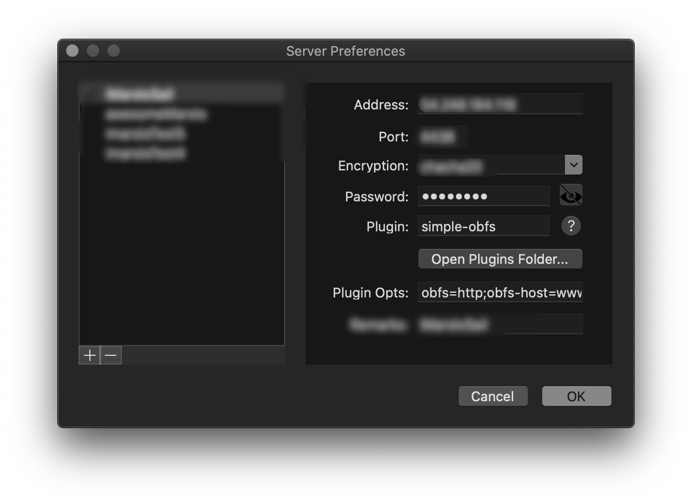

<!-- START doctoc generated TOC please keep comment here to allow auto update -->
<!-- DON'T EDIT THIS SECTION, INSTEAD RE-RUN doctoc TO UPDATE -->

- [pre-config](#pre-config)
  - [dependencies installation](#dependencies-installation)
  - [account](#account)
  - [PS1](#ps1)
- [proxy service](#proxy-service)
  - [shadowsocks](#shadowsocks)
  - [shadowsocks-libev](#shadowsocks-libev)
- [squid](#squid)
- [docker client](#docker-client)
  - [add insecure-regiestry](#add-insecure-regiestry)
  - [docker login & logout](#docker-login--logout)
  - [docker pull](#docker-pull)
  - [docker push](#docker-push)
- [X Windows](#x-windows)
  - [get screen solution](#get-screen-solution)
  - [desktop sharing](#desktop-sharing)
- [utility](#utility)
  - [konsole](#konsole)
  - [Gnome-Terminal](#gnome-terminal)
- [settings](#settings)
  - [adjust Chinese font](#adjust-chinese-font)
  - [install system monitor indicator](#install-system-monitor-indicator)
  - [install ubuntu theme](#install-ubuntu-theme)
  - [specified cursor](#specified-cursor)
  - [specified font for tty1-6](#specified-font-for-tty1-6)
  - [specified size and scroolback for TTY 1-6](#specified-size-and-scroolback-for-tty-1-6)
  - [disable bluetooth booting](#disable-bluetooth-booting)
  - [ALSA Settings:](#alsa-settings)
- [build and install moc (music on console) by source code](#build-and-install-moc-music-on-console-by-source-code)
  - [precondiction:](#precondiction)
  - [moc config:](#moc-config)
  - [errors and solutions](#errors-and-solutions)

<!-- END doctoc generated TOC please keep comment here to allow auto update -->

> [!NOTE|label:references:]
> - [使用ssl模块配置同时支持http和https并存](http://blog.csdn.net/weixin_35884835/article/details/52588157)
> - [How To Create an SSL Certificate on Nginx for Ubuntu 14.04](https://www.digitalocean.com/community/tutorials/how-to-create-an-ssl-certificate-on-nginx-for-ubuntu-14-04)
> - [How To Create a Self-Signed SSL Certificate for Nginx in Ubuntu 16.04](https://www.digitalocean.com/community/tutorials/how-to-create-a-self-signed-ssl-certificate-for-nginx-in-ubuntu-16-04)
> - [Enabling Https with Nginx](https://manual.seafile.com/deploy/https_with_nginx.html)
> - [Enable SSL for HTTPS Configuration on nginx](https://linode.com/docs/security/ssl/enable-ssl-for-https-configuration-on-nginx/)
> - [Nginx+Https配置](https://segmentfault.com/a/1190000004976222)
> - [Test an insecure registry](https://docs.docker.com/registry/insecure/)
> - [Protect the Docker daemon socket](https://docs.docker.com/engine/security/https/)

> [!TIP|label:download deb only]
> - [Is there an apt command to download a deb file from the repositories to the current directory?](https://askubuntu.com/a/30581/92979)
>   ```bash
>   # get package name
>   $ sudo apt list --installed | grep <keywords>
>   $ apt-get install --reinstall --print-uris -qq <package-name> | cut -d"'" -f2
>   ```

## pre-config
### dependencies installation
```bash
$ sudo apt install -y apt-file \
                      autoconf \
                      automake \
                      bash-completion* \
                      binutils \
                      binutils-doc \
                      bison \
                      build-essential \
                      cmake \
                      cpp \
                      cpp-5 \
                      cpp-doc \
                      curl \
                      debian-keyring \
                      dlocate \
                      dos2unix \
                      dpkg-dev \
                      dstat \
                      fakeroot \
                      flex \
                      g++ \
                      g++-5 \
                      g++-5-multilib \
                      g++-multilib \
                      gcc \
                      gcc-5 \
                      gcc-5-doc \
                      gcc-5-locales \
                      gcc-5-multilib \
                      gcc-doc \
                      gcc-multilib \
                      gdb \
                      git \
                      htop \
                      ifstat \
                      iftop \
                      iptables-persistent \
                      jq \
                      landscape-common \
                      libasan2 \
                      libasan2-dbg \
                      libatomic1 \
                      libatomic1-dbg \
                      libbz2-dev \
                      libc-dev-bin \
                      libc6-dev \
                      libcc1-0 \
                      libcilkrts5 \
                      libcilkrts5-dbg \
                      libexpat-dev \
                      libexpat1-dev \
                      libfakeroot \
                      libgcc1-dbg \
                      libgomp1-dbg \
                      libisl15 \
                      libitm1 \
                      libitm1-dbg \
                      liblsan0 \
                      liblsan0-dbg \
                      liblxc1 \
                      libmpc3 \
                      libmpx0 \
                      libmpx0-dbg \
                      libncurses-dev \
                      libncurses5-dev \
                      libncursesw5-dev \
                      libpython-all-dev \
                      libpython2.7 \
                      libquadmath0 \
                      libquadmath0-dbg \
                      libsensors4 \
                      libssl-dev \
                      libstdc++-5-dev \
                      libstdc++-5-doc \
                      libstdc++6-5-dbg \
                      libtool \
                      libtsan0 \
                      libtsan0-dbg \
                      libubsan0 \
                      libubsan0-dbg \
                      linux-libc-dev \
                      lxc-common \
                      lxcfs \
                      m4 \
                      mailutils \
                      make \
                      manpages-dev \
                      ncurses-doc \
                      net-tools \
                      netfilter-persistent \
                      policycoreutils \
                      python-docutils \
                      python-pip \
                      python-setuptools-doc \
                      ruby \
                      sysstat \
                      texinfo \
                      traceroute \
                      tree \
                      update-motd \
                      update-notifier-common \
                      zlib1g-dev
```

### account
```bash
$ sudo usermod -a -G sudo,adm,root,docker devops
```

### PS1

> [!NOTE]
> - [Terminals Are Sexy](https://terminalsare.sexy/#bash)

- powerline
  > [!NOTE|label:powerline]
  > - [powerline/powerline](https://github.com/powerline/powerline)
  > - [milkypostman/powerline](https://github.com/milkypostman/powerline)
  > - [erikw/tmux-powerline](https://github.com/erikw/tmux-powerline)
  > - [riobard/bash-powerline](https://github.com/riobard/bash-powerline)
  > - [riobard/zsh-powerline](https://github.com/riobard/zsh-powerline)
  > - [Lokaltog/vim-powerline](https://github.com/Lokaltog/vim-powerline)
  > - [b-ryan/powerline-shell](https://github.com/b-ryan/powerline-shell)
  > - [Fancy bash prompt with colors](https://yalneb.blogspot.com/2018/01/fancy-bash-promt.html)

- oh-my-*
  > [!NOTE|label:oh-my-*]
  > - [arialdomartini/oh-my-git](https://github.com/arialdomartini/oh-my-git)
  > - [ohmybash/oh-my-bash](https://github.com/ohmybash/oh-my-bash)
  > - [oh-my-fish/oh-my-fish](https://github.com/oh-my-fish/oh-my-fish)
  > - [ohmyzsh/ohmyzsh](https://github.com/ohmyzsh/ohmyzsh)
  >   - [unixorn/zsh-quickstart-kit](https://github.com/unixorn/zsh-quickstart-kit)

## proxy service
### shadowsocks
#### server
```bash
# ubuntu
$ sudo apt install m2crypto git python-pip
# centos
$ sudo yum install m2crypto git python3-pip

$ pip install --upgrade pip
# or
$ pip3 install --upgrade pip
# or
$ sudo /usr/bin/python3 -m pip install --upgrade pip

$ pip install git+https://github.com/shadowsocks/shadowsocks.git@master

$ sudo ln -sf /home/marslo/.local/bin/ssserver /usr/local/bin/ssserver
```

- start
  ```bash
  $ sudo bash -c 'cat > /etc/rc.local' << EOF
  ## ssserver -c /etc/shadowsocks.json -d start
  sudo /home/marslo/.local/bin/ssserver -c /etc/shadowsocks.json -d start
  EOF
  ```

#### client
##### ubuntu
```bash
$ sudo add-apt-repository ppa:hzwhuang/ss-qt5
 Shadowsocks-Qt5 is a cross-platform Shadowsocks GUI client.

Shadowsocks is a lightweight tool that helps you bypass firewall(s).

This PPA mainly includes packages for Shadowsocks-Qt5, which means it also includes libQtShadowsocks packages.
 More info: https://launchpad.net/~hzwhuang/+archive/ubuntu/ss-qt5
Press [ENTER] to continue or Ctrl-c to cancel adding it.

gpg: keybox '/tmp/tmpaegs6_x4/pubring.gpg' created
gpg: /tmp/tmpaegs6_x4/trustdb.gpg: trustdb created
gpg: key 6DA746A05F00FA99: public key "Launchpad PPA for Symeon Huang" imported
gpg: Total number processed: 1
gpg:               imported: 1
OK

$ sudo apt update
$ sudo apt install shadowsocks-qt5
```

##### others
```bash
$ sudo apt install python-pip
$ sudo pip install genpac
```

### shadowsocks-libev
#### service
- started by docker image `teddysun/shadowsocks-libev`
  ```bash
  $ mkdir -p /etc/shadowsocks-libev
  $ sudo bash -c "cat > /etc/shadowsocks-libev/config.json" << EOF
  {
      "server":"0.0.0.0",
      "server_port":1111,
      "password":"password0",
      "timeout":300,
      "user":"nobody",                // optional
      "method":"aes-256-gcm",
      "fast_open":false,
      "nameserver":"8.8.8.8",         // be careful for this in private sub-network
      "mode":"tcp_and_udp",
      "plugin":"obfs-server",
      "plugin_opts":"obfs=http"
  }
  EOF

  $ docker run -d -p 1111:1111 \
                  -p 1111:1111/udp \
                  --name ss-libev \
                  --restart=always \
                  -v /etc/shadowsocks-libev:/etc/shadowsocks-libev \
                  teddysun/shadowsocks-libev
  $ docker logs -f ss-libev
  ```

- started by `/etc/init.d/shadowsocks-libev`
  ```bash
  $ wget --no-check-certificate \
         -O shadowsocks-all.sh \
         https://raw.githubusercontent.com/teddysun/shadowsocks_install/master/shadowsocks-all.sh
  $ chmod +x shadowsocks-all.sh
  $ ./shadowsocks-all.sh 2>&1 | tee shadowsocks-all.log
  ...

  Which Shadowsocks server you'd select:
  1) Shadowsocks-Python
  2) ShadowsocksR
  3) Shadowsocks-Go
  4) Shadowsocks-libev
  Please enter a number (Default Shadowsocks-Python): 4
  You choose = Shadowsocks-libev
  ...

  [Info] Starting install package autoconf
  Do you want install simple-obfs for Shadowsocks-libev? [y/n]
  (default: n): y
  You choose = y

  Please select obfs for simple-obfs:
  1) http
  2) tls
  Which obfs you'd select(Default: http): 1
  obfs = http
  ...
  ```
  - service
    ```bash
    $ sudo /etc/init.d/shadowsocks-libev start
    $ sudo /etc/init.d/shadowsocks-libev stop
    $ sudo /etc/init.d/shadowsocks-libev restart
    $ sudo /etc/init.d/shadowsocks-libev status
    Shadowsocks-libev (pid 903) is running...
    ```
  - config
    ```bash
    $ /etc/shadowsocks-libev/config.json
    {
        "server":"0.0.0.0",
        "server_port": 1111,
        "password":"mypassword",
        "timeout":300,
        "user":"nobody",                  // optinal
        "method":"aes-256-cfb",
        "fast_open":false,
        "nameserver":"1.0.0.1",           // be careful for dns resolve in private network
        "mode":"tcp_and_udp",
        "plugin":"obfs-server",
        "plugin_opts":"obfs=http"
    }
    ```

- check status
  ```bash
  $ sudo lsof -i:1111
  COMMAND   PID   USER   FD   TYPE DEVICE SIZE/OFF NODE NAME
  ss-server 903 nobody    8u  IPv4  20522      0t0  UDP *:1111
  obfs-serv 909   root    7u  IPv4  20649      0t0  TCP *:1111 (LISTEN)
  $ sudo netstatus -tunpla | grep 1111
  tcp        0      0 0.0.0.0:1111            0.0.0.0:*               LISTEN      909/obfs-server
  udp        0      0 0.0.0.0:1111            0.0.0.0:*                           903/ss-server
  ```


#### client

|     PLUGIN    |              PLUGIN OPTS             |
|:-------------:|:------------------------------------:|
| `simple-obfs` | `obfs=http;obfs-host=www.google.com` |




## [squid](http://www.squid-cache.org/Doc/)

> [!NOTE|label:references:]
> - [About Squid proxy servers](https://ubuntu.com/server/docs/proxy-servers-squid)
> - [Squid installation and configuration in Ubuntu](https://help.ubuntu.com/community/Squid)
> - [SquidGuard in ubuntu](https://help.ubuntu.com/community/SquidGuard)
> - [How to configure an SSH proxy server with Squid](https://fedoramagazine.org/configure-ssh-proxy-server/)
> - [Use Squid as HTTP / HTTPS / SSH Proxy](https://www.squins.com/knowledge/squid-http-https-ssh-proxy/)
> - [Tunnelling SSH/SFTP over Squid proxy](https://www.seniorlinuxadmin.co.uk/ssh-over-proxy.html)
> - [How to Set Up a Proxy Server on Your Mac Using SquidMan](https://howchoo.com/mac/how-to-set-up-a-proxy-server-on-mac)
> - [brew install squid on macOS but can't run squid](https://serverfault.com/a/1069392/129815)

## docker client
### add insecure-regiestry
```bash
$ cat ~/.docker/daemon.json
{
  "debug" : true,
  "experimental" : true,
  "insecure-registries" : ["sample.artifactory.com", "sample.artifactory.com:2500", "sample.artifactory.com:2501", "docker-1.artifactory", "docker-1.artifactory:443"]
}

$ sudo systemctl daemon-reload
$ sudo systemctl restart docker
```

### docker login & logout
```bash
$ docker --debug -l debug login --username admin  https://docker-1.artifactory
Password:
Login Succeeded

$ docker --debug -l debug logout docker-1.artifactory
Removing login credentials for docker-1.artifactory
```

### docker pull
```bash
$ docker pull docker-1.artifactory/nginx:latest
latest: Pulling from nginx
e7bb522d92ff: Pull complete
0f4d7753723e: Pulling fs layer
91470a14d63f: Download complete
0f4d7753723e: Pull complete
91470a14d63f: Pull complete
Digest: sha256:3eff18554e47c4177a09cea5d460526cbb4d3aff9fd1917d7b1372da1539694a
Status: Downloaded newer image for docker-1.artifactory/nginx:latest
```

### docker push
```bash
$ docker pull hello-world
$ docker tag hello-world docker-1.artifactory/bello-marslo:2.0
$ docker login --username admin docker-1.artifactory
$ docker push docker-1.artifactory/bello-marslo:2.0
```

## X Windows
### get screen solution
```bash
$ xrandr --verbose
Screen 0: minimum 320 x 200, current 1920 x 1080, maximum 8192 x 8192
XWAYLAND0 connected 1920x1080+0+0 (0x22) normal (normal left inverted right x axis y axis) 480mm x 270mm
    Identifier: 0x21
    Timestamp:  3807
    Subpixel:   unknown
    Gamma:      1.0:1.0:1.0
    Brightness: 0.0
    Clones:
    CRTC:       0
    CRTCs:      0
    Transform:  1.000000 0.000000 0.000000
                0.000000 1.000000 0.000000
                0.000000 0.000000 1.000000
               filter:
  1920x1080 (0x22) 173.000MHz -HSync +VSync *current +preferred
        h: width  1920 start 2048 end 2248 total 2576 skew    0 clock  67.16KHz
        v: height 1080 start 1083 end 1088 total 1120           clock  59.96Hz
```

### desktop sharing
#### enable remote access
```bash
##!/bin/bash
export DISPLAY=:0
read -e -p "VNC Password: " -i "ubuntu" password
dconf write /org/gnome/desktop/remote-access/enabled true
dconf write /org/gnome/desktop/remote-access/prompt-enabled false
dconf write /org/gnome/desktop/remote-access/authentication-methods "['vnc']"
dconf write /org/gnome/desktop/remote-access/require-encryption false08/03/2018
dconf write /org/gnome/desktop/remote-access/vnc-password \"\'$(echo -n $password | base64)\'\"
dconf dump /org/gnome/desktop/remote-access/
## sudo service lightdm restart
```

- or
  ```bash
  $ vino-preference
  $ dconf-editor
  ```

#### start x server
```bash
$ export DISPLAY=:0
$ /usr/lib/vino/vino-server --display=:0 &
```

#### [reset vnc password](https://access.redhat.com/solutions/346033)
```bash
$ echo -n 'awesome' | base64
$ gconftool-2 -s -t string /desktop/gnome/remote_access/vnc_password $(echo -n "<YOURPASSWORD>" | base64)
$ gconftool-2 --type string --set /desktop/gnome/remote_acess/vnc_password '123456'
```

#### [wayland known error](https://askubuntu.com/a/967538)
```bash
cat <<EOF | sudo tee /etc/xdg/autostart/xhost.desktop
[Desktop Entry]
Name=xhost
Comment=Fix graphical root applications
Exec="xhost +si:localuser:root"
Terminal=false
Type=Application
EOF
```

#### check using wayland or xorg
```bash
$ echo $XDG_SESSION_TYPE
```

- Ubuntu: Wayland (Wayland)
- Ubuntu on Xorg: Xorg (X11)

## utility

> [!NOTE:label:reference:]
> - [Nam Huy Linux Blog](http://namhuy.net/1397/disable-bluetooth-ubuntu-xubuntu-linux-mint.html)
> - [Stackoverflow answers](http://askubuntu.com/questions/67758/how-can-i-deactivate-bluetooth-on-system-startup)

### konsole
#### installation
```bash
$ sudo apt install konsole
```

#### restore the settings
- copy `mylinux/confs/home/konsole` to `~/.kde/share/apps/konsole`
  ```bash
  $ cp -r mylinux/confs/home/konsole/ ~/.kde/share/apps/konsole
  ```

#### shortcuts in Konsole
- <kbd>Alt</kbd> + <kbd>J</kbd>: scroll down one line
- <kbd>Alt</kbd> + <kbd>K</kbd>: scroll up one line

### Gnome-Terminal
> - [inspired from askubuntu](http://askubuntu.com/questions/453906/how-to-disable-or-reorder-gnome-terminal-right-click-context-menu)

- move context menu items [_Open Terminal_, _Open Tab_, _Close window_]
  ```bash
  $ sudo cp mylinux/confs/terminal/usr/share/gnome-terminal/terminal.xml /usr/share/gnome-terminal/
  ```

## settings
### adjust Chinese font
- modified by manual
  ```bash
  $ cat /etc/fonts/conf.d/49-sansserif.conf
  ....
  18       <string>WenQuanYi Micro Hei</string>
  ....
  ```

- copy the template file to the `conf.d` folder
  ```bash
  $ sudo cp Configs/etc/fonts/49-sansserif.conf /etc/fonts/conf.d/
  ```

### install system monitor indicator

```bash
$ sudo add-apt-repository ppa:indicator-multiload/stable-daily
$ sudo apt update
$ sudo apt install indicator-multiload
```

### install ubuntu theme
- (nokto-theme) [Official Website](https://launchpad.net/~noobslab/+archive/ubuntu/themes?field.series_filter=trusty)
  ```bash
  $ sudo add-apt-repository ppa:noobslab/themes
  $ sudo apt update
  $ sudo apt install nokto-theme

  # OR:

  $ sudo cat >> /etc/apt/sources.list << EOF
  > deb http://ppa.launchpad.net/noobslab/themes/ubuntu trusty main
  > deb-src http://ppa.launchpad.net/noobslab/themes/ubuntu trusty main
  EOF

  $ sudo apt update
  ```

- ambiance-dark
  ```bash
  $ sudo add-apt-repository ppa:noobslab/themes
  $ sudo apt update
  $ sudo apt install ambiance-dark
  ```

### specified cursor
```bash
$ cat /usr/share/icons/default/index.theme
[Icon Theme]
Inherits=handhelds
```

### specified font for tty1-6
```bash
$ sudo dpkg-reconfigure console-setup
```

- `UTF-8` -> `Combined - Latin: Cyrillic: Greek` -> `Terminus` -> `24x12`
- `UTF-8` -> `Combined - Latin: Cyrillic: Greek` -> `TerminusBold` -> `24x12`

### specified size and scroolback for TTY 1-6

```bash
$ sudo mv /etc/default/grub.cfg{,_bak}
$ sudo cp Configs/Grub/etc/default/grub /etc/default
$ sudo update-grub && sudo reboot
```

### disable bluetooth booting
#### to stop bluetooth service

```bash
$ sudo service bluetooth stop
```

#### disable bluetooth service on startup

```bash
$ cat /etc/rc.local
....
# Turn off bluetooth
rfkill block bluetooth
exit 0
```

#### disable the bluetooth driver on startup

```bash
$ cat /etc/modprob.d/blacklist.conf
....
# Turn off bluetooth
blacklist btusb
```

#### cut power source for bluetooth to run

```bash
$ cat /etc/bluetooth/main.conf
...
4 DisablePlugins = network,input
...
37 nitiallyPowered = false
```

#### [DANGEROUS]: REMOVE BLUETOOTH MANAGER AND ALL DEPENDENCIES

```bash
$ sudo apt remove bluez* bluetooth
$ sudo apt autoremove
```

### ALSA Settings:
#### Informations
- Check the **type** of Sound Card:

    ```bash
    $ head -1 /proc/asound/card0/codec#0
    Realtek ALC262
    ```
- Check the **version** of Sound Card:

    ```bash
    $ /proc/asound/version
    Advanced Linux Sound Archite chue Driver Version 1.0.24
    ```
- Check the **configuration** about Sound Card

    ```bash
    $ vim /etc/modprobe.d/alsa-base.conf
    ```
#### Install extra libs (ubuntu 13.04)

```bash
$ sudo apt install build-essential ncurses-dev gettext libncursesw5-dev
$ sudo apt install xmlto
```

#### Update ALSA in Ubuntu (<= 12.10)
- Download **alsa driver**, **alsa lib** and **alsa utils**

    ```bash
    $ wget ftp://ftp.alsa-project.org/pub/driver/alsa-driver-1.0.25.tar.bz2
    $ wget ftp://ftp.alsa-project.org/pub/lib/alsa-lib-1.0.25.tar.bz2
    $ wget ftp://ftp.alsa-project.org/pub/utils/alsa-utils-1.0.25.tar.bz2
    $ tar xjvf alsa-driver-1.0.25.tar.bz2
    $ tar xjvf alsa-lib-1.0.25.tar.bz2
    $ tar xjvf alsa-utils-1.0.25.tar.bz2
    ```

- Upgrade **alsa dirver**

    ```bash
    $ cd alsa-driver-1.0.25
    $ sudo ./configure
    $ sudo make
    $ sudo make install
    ```

- Upgrade **alsa lib**

    ```bash
    $ cd ../alsa-lib-1.0.25
    $ sudo ./configure
    $ sudo make
    $ sudo make install
    ```

- Upgrade **alsa utils**

    ```bash
    $ cd ../alsa-utils-1.0.25
    $ sudo ln -s libpanelw.so.5 /usr/lib/libpanelw.so
    $ sudo ln -s libformw.so.5 /usr/lib/libformw.so
    $ sudo ln -s libmenuw.so.5 /usr/lib/libmenuw.so
    $ sudo ln -s libncursesw.so.5 /lib/libncursesw.so
    $ ./configure --with-curses=ncurses
    $ sudo make
    $ sudo make install
    ```

- Reboot

    ```bash
    $ sudo shutdown -r now
    ```

#### Change settings in Sound Card
- Input `alsamixer`, and input <kbd>F6</kbd> to select sound card:

    ```bash
    $ alsamixer
    ```


- Startup Settings

    ```bash
    Name: [Everything_You_Want]
    Command: /sbin/alsactl restore
    ```

## build and install moc (music on console) by source code
### precondiction:
- download source code from [official web site](http://moc.daper.net/download)
- [moc-2.5.0-beta1](http://ftp.daper.net/pub/soft/moc/unstable/moc-2.5.0-beta1.tar.bz2)
- [DEB packages FTP](http://ftp.de.debian.org/pub/debian/pool/main/m/moc/)

### moc config:
- Check details at [marslo/moc-cmus](https://github.com/marslo/moc-cmus/blob/master/README.md)

### errors and solutions
- error: BerkeleyDB (libdb) not found
  ```bash
  $ sudo apt install libdb++-dev libdb-dev
  ```

- decoder.c:22:18: fatal error: ltdl.h
  ```bash
  $ sudo apt install libltdl-dev
  ```

- FATAL_ERROR: No valid sound driver!
  - Error shows:
    ```bash
    $ mocp
    Running the server...
    Trying OSS...
    FATAL_ERROR: No valid sound driver!
    FATAL_ERROR: Server exited!
    [marslo@iMarslo ~]

    $ gdb mocp core
    GNU gdb (GDB) 7.6.1-ubuntu
    Copyright (C) 2013 Free Software Foundation, Inc.
    License GPLv3+: GNU GPL version 3 or later <http://gnu.org/licenses/gpl.html>
    This is free software: you are free to change and redistribute it.
    There is NO WARRANTY, to the extent permitted by law.  Type "show copying"
    and "show warranty" for details.
    This GDB was configured as "i686-linux-gnu".
    For bug reporting instructions, please see:
    <http://www.gnu.org/software/gdb/bugs/>...
    Reading symbols from /home/marslo/Tools/Software/SourceCode/Moc/moc-2.5.0-beta1/mocp...done.
    /home/marslo/Tools/Software/SourceCode/Moc/moc-2.5.0-beta1/core: No such file or directory.
    (gdb) run
    Starting program: /home/marslo/Tools/Software/SourceCode/Moc/moc-2.5.0-beta1/mocp
    [Thread debugging using libthread_db enabled]
    Using host libthread_db library "/lib/i386-linux-gnu/libthread_db.so.1".
    Running the server...
    Trying OSS...
    FATAL_ERROR: No valid sound driver!
    FATAL_ERROR: Server exited!
    [Inferior 1 (process 18165) exited with code 02]
    (gdb) exit
    Undefined command: "exit".  Try "help".
    (gdb) quit
    ```

  - soluction
      ```bash
      $ sudo apt install autoconf automake1.9 libasound2-dev libavcodec-dev libavformat-dev libcurl4-gnutls-dev libflac-dev libid3tag0-dev libltdl3-dev libmad0-dev libmodplug-dev libmpcdec-dev libncurses5-dev libncursesw5-dev libogg-dev libresid-builder-dev libsamplerate0-dev libsidplay2-dev libsidutils-dev libsndfile1-dev libspeex-dev libtagc0-dev libtool libvorbis-dev libwavpack-dev zlib1g-dev
      Reading package lists... Done
      Building dependency tree
      Reading state information... Done
      Note, selecting 'libltdl-dev' instead of 'libltdl3-dev'
      libltdl-dev is already the newest version.
      libncurses5-dev is already the newest version.
      libncursesw5-dev is already the newest version.
      libogg-dev is already the newest version.
      libogg-dev set to manually installed.
      libtool is already the newest version.
      libtool set to manually installed.
      libvorbis-dev is already the newest version.
      zlib1g-dev is already the newest version.
      libavcodec-dev is already the newest version.
      libavcodec-dev set to manually installed.
      libavformat-dev is already the newest version.
      The following packages were automatically installed and are no longer required:
      librcc0 librcd0 linux-headers-generic linux-image-generic
      Use 'apt autoremove' to remove them.
      The following extra packages will be installed:
      comerr-dev krb5-multidev libgssrpc4 libidn11-dev libkadm5clnt-mit8 libkadm5srv-mit8 libkdb5-6
      libkrb5-dev libldap2-dev librtmp-dev libsigsegv2 libtag1-dev m4
      Suggested packages:
      autoconf2.13 autoconf-archive gnu-standards autoconf-doc automake1.9-doc krb5-doc libasound2-doc
      libcurl4-doc libcurl3-dbg krb5-user
      Recommended packages:
      automake automaken
      The following NEW packages will be installed:
      autoconf automake1.9 comerr-dev krb5-multidev libasound2-dev libcurl4-gnutls-dev libflac-dev libgssrpc4
      libid3tag0-dev libidn11-dev libkadm5clnt-mit8 libkadm5srv-mit8 libkdb5-6 libkrb5-dev libldap2-dev
      libmad0-dev libmodplug-dev libmpcdec-dev libresid-builder-dev librtmp-dev libsamplerate0-dev
      libsidplay2-dev libsidutils-dev libsigsegv2 libsndfile1-dev libspeex-dev libtag1-dev libtagc0-dev
      libwavpack-dev m4
      0 upgraded, 30 newly installed, 0 to remove and 16 not upgraded.
      Need to get 6,250 kB of archives.
      After this operation, 16.9 MB of additional disk space will be used.
      ....
      ```

  - Check alas-base and alas-utils
    ```bash
    $ dpkg -l alsa-base
    Desired=Unknown/Install/Remove/Purge/Hold
    | Status=Not/Inst/Conf-files/Unpacked/halF-conf/Half-inst/trig-aWait/Trig-pend
    |/ Err?=(none)/Reinst-required (Status,Err: uppercase=bad)
    ||/ Name                 Version         Architecture    Description
    +++-====================-===============-===============-==============================================
    ii  alsa-base            1.0.25+dfsg-0ub all             ALSA driver configuration files

    $ dpkg -l alsa-utils
    Desired=Unknown/Install/Remove/Purge/Hold
    | Status=Not/Inst/Conf-files/Unpacked/halF-conf/Half-inst/trig-aWait/Trig-pend
    |/ Err?=(none)/Reinst-required (Status,Err: uppercase=bad)
    ||/ Name                 Version         Architecture    Description
    +++-====================-===============-===============-==============================================
    ii  alsa-utils           1.0.27.1-1ubunt i386            Utilities for configuring and using ALSA
    ```

