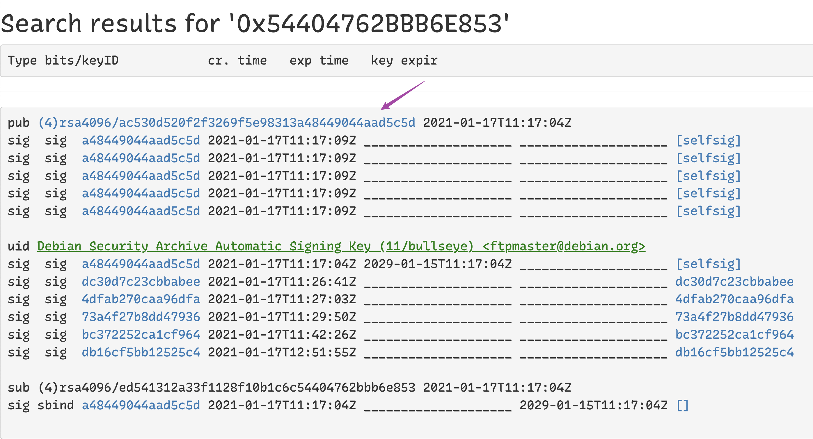

<!-- START doctoc generated TOC please keep comment here to allow auto update -->
<!-- DON'T EDIT THIS SECTION, INSTEAD RE-RUN doctoc TO UPDATE -->

- [rpm & dpkg & brew](#rpm--dpkg--brew)
- [apt](#apt)
  - [apt.conf](#aptconf)
  - [necessary packages and dependencies](#necessary-packages-and-dependencies)
  - [disable](#disable)
    - [package auto-upgrade disable](#package-auto-upgrade-disable)
    - [disable server auto upgrade](#disable-server-auto-upgrade)
    - [revert hold settings](#revert-hold-settings)
    - [show all hold](#show-all-hold)
  - [complete remove an app](#complete-remove-an-app)
  - [keyring](#keyring)
    - [`apt-key`](#apt-key)
    - [`curl`](#curl)
  - [gpg keys](#gpg-keys)
    - [`gpg`](#gpg)
    - [Ghostbird/add-repository](#ghostbirdadd-repository)
    - [openmediavault-keyring](#openmediavault-keyring)
    - [others](#others)
  - [apt-cache](#apt-cache)
    - [get package name by command](#get-package-name-by-command)
    - [search package name for apt-get](#search-package-name-for-apt-get)
  - [trouble shooting](#trouble-shooting)
- [yum/dnf](#yumdnf)
  - [repo](#repo)
    - [download package](#download-package)
    - [check configure](#check-configure)
    - [check variable](#check-variable)
    - [enable or disable repo](#enable-or-disable-repo)
    - [cache](#cache)
    - [cleanup no-required packages](#cleanup-no-required-packages)
  - [yum group](#yum-group)
  - [tools installation](#tools-installation)
    - [resolve conflict](#resolve-conflict)
    - [`File "/usr/libexec/urlgrabber-ext-down", line 28`](#file-usrlibexecurlgrabber-ext-down-line-28)
    - [centos eol](#centos-eol)
  - [CentOS 8 -> CentOS 9](#centos-8---centos-9)
- [snap](#snap)

<!-- END doctoc generated TOC please keep comment here to allow auto update -->

# rpm & dpkg & brew

> [!NOTE|label:references:]
> - [ubuntu: Package management](https://ubuntu.com/server/docs/package-management)
> - for apt-file, execute `sudo apt-file update` first before start search

| RPM                                                         | DPKG                                                                                        | BREW                                         |
|-------------------------------------------------------------|---------------------------------------------------------------------------------------------|----------------------------------------------|
| `rpm -qa`                                                   | `dpkg -l`                                                                                   | `brew list`                                  |
| `rpm -ql sofrwareanme`                                      | `dpkg -L name`<br>`dpkg --listfiles name`<br> `dpkg-qurery -L name`<br>`apt-file list name` | `brew list name`<br>`brew ls --verbose name` |
| `rpm -qf /path/to/file`<br>`yum whatprovides /path/to/file` | `dpkg -S /path/to/file`<br>`apt-file search /path/to/file`                                  | `brew which-formula name`                    |
| `rpm -qip pkgfile.rpm`<br>`rpm -qlp pkgfile.rpm`            | `dpkg -l pkgfile.deb`<br>`dpkg -c pkgfile.deb`                                              |                                              |
| `rpm -q name`<br>`rpm -qi name`                             | `dpkg -l name`<br>`dpkg -s name`<br>`dpkg -p name`                                          | `brew info name`                             |
| `rpm -e name`                                               | `dpkg -r name`<br>`dpkg -P name`                                                            | `brew uninstall name`                        |
| `dnf --showduplicates <name>`                               | `apt-cache madison <name>`                                                                  | -                                            |

> [!NOTE|label:references:]
> - [Google Linux Software Repositories](https://www.google.com/linuxrepositories/)
> - [How To Build a Debian Packages](https://forums.debian.net/viewtopic.php?f=16&t=38976)
> - [Official Archive Mirrors for Ubuntu](https://launchpad.net/ubuntu/+archivemirrors)

# apt

> [!TIP|label:download deb only]
> - [Is there an apt command to download a deb file from the repositories to the current directory?](https://askubuntu.com/a/30581/92979)
>   ```bash
>   # get package name
>   $ sudo apt list --installed | grep <keywords>
>   $ apt-get install --reinstall --print-uris -qq <package-name> | cut -d"'" -f2
>   ```

## apt.conf
```bash
$ cat /etc/apt/apt.conf
Acquire::http::Proxy "http://161.91.27.236:8080";
Acquire::https::Proxy "http://161.91.27.236:8080";
Acquire::ftp::Proxy "http://161.91.27.236:8080";

$ cat /etc/apt/apt.conf.d/99ignoresave
Dir::Ignore-Files-Silently:: "(.save|.distupgrade)$";
Dir::Ignore-Files-Silently:: "\.gz$";
Dir::Ignore-Files-Silently:: "\.save$";
Dir::Ignore-Files-Silently:: "\.distUpgrade$";
Dir::Ignore-Files-Silently:: "\.list_$";
```

## necessary packages and dependencies
```bash
$ sudo apt --list upgradable
$ sudo apt upgrade
$ sudo apt install sysv-rc-conf tree dos2unix iptables-persistent mailutils policycoreutils build-essential landscape-common gcc g++ make cmake
```

## disable
### package auto-upgrade disable
```bash
$ sudo sed -i 's/Prompt=.*/Prompt=never/' /etc/update-manager/release-upgrades
$ sudo sed -i 's/"1"/"0"/' /etc/apt/apt.conf.d/10periodic
$ sudo sed -i 's/"1"/"0"/' /etc/apt/apt.conf.d/20auto-upgrades
```

### disable server auto upgrade
```bash
# dpkg --list | grep jenkins
ii  jenkins                            2.19.4                             all          Jenkins monitors executions of repeated jobs, such as building a software
# echo "jenkins hold" | dpkg --set-selections
OR
# apt-mark hold jenkins
# dpkg --list | grep jenkins
hi  jenkins                            2.19.4                             all          Jenkins monitors executions of repeated jobs, such as building a software
```

### revert hold settings
```bash
$ sudo echo "jenkins install" | dpkg --set-selections
# OR
$ sudo apt-mark unhold jenkins
```

### show all hold
```bash
$ sudo apt-mark showhold
```

## complete remove an app
```bash
$ sudo systemctl stop mysql
$ sudo apt-get --purge autoremove mysql*
$ sudo apt-get autoclean
$ sudo apt --purge autoremove mysql*
$ sudo apt autoclean
$ sudo apt list --installed | grep mysql
$ sudo rm -rf /var/lib/mysql/debian-*.flag
$ sudo rm -rf /var/lib/mysql
$ sudo rm -rf /etc/mysql
```

## keyring

> [!NOTE]
> - [* iMarslo : gpg](../../cheatsheet/bash/bash.html#gpg)
> - [step by step by `apt-key add`](https://github.com/microsoft/WSL/issues/3286#issuecomment-402594992)
> - [Hockeypuck OpenPGP keyserver](http://keyserver.ubuntu.com/)
> - for
>   ```bash
>   The following signatures couldn't be verified because the public key is not available: NO_PUBKEY 112696A0E562B32A NO_PUBKEY 54404762BBB6E853
>   ```

### `apt-key`
```bash
$ apt-key adv --keyserver hkp://keyserver.ubuntu.com:80 --recv-keys 54404762BBB6E853
# or
$ apt-key adv --keyserver keyserver.ubuntu.com --recv-keys 54404762BBB6E853
```

### `curl`

> [!NOTE|label:references:]
> - [#3286: Ubuntu 18.04 gpg dirmngr IPC connect call failed](https://github.com/microsoft/WSL/issues/3286#issuecomment-402594992)

```bash
#                                                                0x<PUBKEY>
#                                                                v
$ curl -sL "http://keyserver.ubuntu.com/pks/lookup?op=get&search=0x112696A0E562B32A" | sudo apt-key add
$ curl -sL "http://keyserver.ubuntu.com/pks/lookup?op=get&search=0x54404762BBB6E853" | sudo apt-key add
```

- or manually download
  ```bash
  $ cat armored-keys.asc | sudo apt-key add
  ```

  

## gpg keys

> [!NOTE|label:references:]
> - [Omv and Apt broken: Pending configuration changes](https://forum.openmediavault.org/index.php?thread/48094-omv-and-apt-broken-pending-configuration-changes/&postID=352338#post352338)
>   - `$ sudo dpkg -l | grep openmediavault`
>   - `$ sudo ls -alh /etc/apt/trusted.gpg.d/`
> - [apt-get update errors missing public keys](https://forum.openmediavault.org/index.php?thread/49140-apt-get-update-errors-missing-public-keys/)
> - [The following signatures couldn't be verified because the public key is not available](https://forums.raspberrypi.com/viewtopic.php?t=352539)

### `gpg`
```bash
$ gpg --keyserver hkp://keyserver.ubuntu.com:80 --recv-keys 3FA7E0328081BFF6A14DA29AA6A19B38D3D831EF
```
- more options
  ```bash
  $ gpg --ignore-time-conflict \
        --no-options \
        --no-default-keyring \
        --homedir /tmp/tmp.Hrb5ETPac2 \
        --no-auto-check-trustdb \
        --trust-model always \
        --keyring /etc/apt/trusted.gpg \
        --primary-keyring /etc/apt/trusted.gpg \
        --keyserver keyserver.ubuntu.com \
        --recv-keys 3FA7E0328081BFF6A14DA29AA6A19B38D3D831EF
  ```

- or install keyring via `apt-key`
  ```bash
  $ sudo apt-key adv --keyserver keyserver.ubuntu.com --recv-keys 112695A0E562B32A
  ```

### [Ghostbird/add-repository](https://gist.github.com/Ghostbird/83eb5bcd2ffd4a6b6966137a2e1c4caf)
```bash
$ ./add-repository "https://keyserver.ubuntu.com/pks/lookup?search=0x3fa7e0328081bff6a14da29aa6a19b38d3d831ef&op=get" "deb https://download.mono-project.com/repo/debian stable-buster main" mono-official-stable.list
```

### openmediavault-keyring
```bash
$ cd /tmp
$ sudo wget https://packages.openmediavault.org/public/pool/main/o/openmediavault-keyring/openmediavault-keyring_1.0.2-2_all.deb
$ sudo dpkg -i openmediavault-keyring
$ sudo apt-get update
```

### [others](https://github.com/mono/mono/issues/21584#issuecomment-1354833031)
```bash
# dockerfile
RUN apt install -y gnupg ca-certificates
RUN gpg --keyserver keyserver.ubuntu.com --recv 3FA7E0328081BFF6A14DA29AA6A19B38D3D831EF
RUN gpg --export 3FA7E0328081BFF6A14DA29AA6A19B38D3D831EF | tee /usr/share/keyrings/mono.gpg >/dev/null
RUN gpg --batch --yes --delete-keys 3FA7E0328081BFF6A14DA29AA6A19B38D3D831EF
RUN echo "deb [signed-by=/usr/share/keyrings/mono.gpg] https://download.mono-project.com/repo/debian stable-buster main" | tee /etc/apt/sources.list.d/mono-official-stable.list
RUN apt update
RUN apt install -y mono-devel
```

## apt-cache
### get package name by command
```bash
$ apt-cache search mkpasswd
whois - intelligent WHOIS client
libstring-mkpasswd-perl - Perl module implementing a random password generator
```

### search package name for apt-get
```bash
$ sudo apt-cache search chrome browser
chromium-browser - Chromium browser
chromium-chromedriver - WebDriver driver for the Chromium Browser
cloudprint - Server for Google Cloud Print
collabtive - Web-based project management software
epiphany-browser - Intuitive GNOME web browser
jsxgraph - Interactive Geometry with JavaScript
kpartsplugin - Netscape-compatible plugin to embed KDE file-viewers into browser
libjs-excanvas - HTML5 Canvas for Internet Explorer
libjs-jquery-jplayer - HTML5 Audio & Video for jQuery with a Flash fallback
libjs-jquery-jush - jQuery Syntax Highlighter
google-chrome-beta - The web browser from Google
google-chrome-stable - The web browser from Google
google-chrome-unstable - The web browser from Google
```

## trouble shooting

- [修复 apt-key deprecated 警告](https://taoshu.in/unix/apt-key-deprecated.html)

# yum/dnf

> [!NOTE|label:references:]
> - [Yum install error file "/usr/bin/yum", line 30](http://www.programmersought.com/article/3242669414/)
> - [failed at yum update and how to fix it](http://wenhan.blog/2018/02/18/failed-at-yum-update-and-how-to-fix-it/)
> - [Upgraded Python, and now I can't run “yum upgrade”](https://unix.stackexchange.com/questions/524552/upgraded-python-and-now-i-cant-run-yum-upgrade)
> - [How to Find Out Top Directories and Files (Disk Space) in Linux](https://www.tecmint.com/find-top-large-directories-and-files-sizes-in-linux/)
> - [8.4. Configuring Yum and Yum Repositories](https://access.redhat.com/documentation/en-us/red_hat_enterprise_linux/6/html/deployment_guide/sec-configuring_yum_and_yum_repositories)
>   - [8.4.2. Setting [repository] Options](https://access.redhat.com/documentation/en-us/red_hat_enterprise_linux/6/html/deployment_guide/sec-setting_repository_options)
> - [repo vars](https://unix.stackexchange.com/q/624738/29178)
>   ```bash
>   $ cd /etc/dnf/vars; grep -H --color=none . *
>   contentdir:centos
>   infra:stock
>   # or
>   $ tail -f /var/log/dnf.log
>   ```
> - [moving from CentOS 8 to CentOS Stream 8](https://unix.stackexchange.com/a/704363/29178)
>   ```bash
>   $ sudo sed -i 's|#baseurl=http://mirror.centos.org|baseurl=http://vault.centos.org|g' /etc/yum.repos.d/CentOS-*
>   $ sudo sed -i 's/mirrorlist/#mirrorlist/g'  /etc/yum.repos.d/CentOS-*
>   $ sudo dnf install centos-release-stream -y --allowerasing
>   $ sudo dnf swap centos-{linux,stream}-repos
>   $ sudo dnf distro-sync --best --allowerasing
>   $ sudo reboot
>   ```
> - [DNF Command Reference](https://dnf.readthedocs.io/en/latest/command_ref.html)

## repo

> [!NOTE]
> - [CentOS Repositories](https://centos.pkgs.org/)
> - [CentOS Stream Mirror](https://mirror.stream.centos.org/)
> - [8.4. Configuring Yum and Yum Repositories](https://access.redhat.com/documentation/en-us/red_hat_enterprise_linux/6/html/deployment_guide/sec-configuring_yum_and_yum_repositories)
> - [createrepo 建立本地源](https://www.cnblogs.com/xzongblogs/p/16858402.html)
> - [sync repo 同步Yum源](https://www.kancloud.cn/pshizhsysu/linux/1789494)
> - [variables in repo files](https://unix.stackexchange.com/a/20226/29178)
>   ```bash
>   # centos 8
>   $ /usr/libexec/platform-python -c 'import dnf, json; db = dnf.dnf.Base(); print(json.dumps(db.conf.substitutions, indent=2))'
>   {
>     "arch": "x86_64",
>     "basearch": "x86_64",
>     "releasever": "8"
>   }
>
>   # centos 7
>   $ python -c 'import yum, json; yb = yum.YumBase(); print json.dumps(yb.conf.yumvar, indent=2)'
>   Loaded plugins: fastestmirror, langpacks, versionlock
>   {
>     "uuid": "512cdde3-4de7-47af-a2fd-6b4e6d711b12",
>     "contentdir": "centos",
>     "basearch": "x86_64",
>     "infra": "stock",
>     "releasever": "7",
>     "arch": "ia32e"
>   }
>
>   # or
>   $ dnf config-manager --dump-variables
>   arch = x86_64
>   basearch = x86_64
>   stream = 9-stream
>   releasever = 8
>   ```

```bash
$ sudo dnf install -y https://mirror.stream.centos.org/9-stream/BaseOS/aarch64/os/Packages/centos-gpg-keys-9.0-23.el9.noarch.rpm \
                      https://mirror.stream.centos.org/9-stream/BaseOS/x86_64/os/Packages/centos-stream-repos-9.0-23.el9.noarch.rpm
```

- i.e.:
  ```bash
  $ sudo cat << EOF > /etc/yum.repos.d/centos.repo
  [baseos]
  name=CentOS Stream $releasever - BaseOS
  metalink=https://mirrors.centos.org/metalink?repo=centos-baseos-$stream&arch=$basearch&protocol=https,http
  gpgkey=file:///etc/pki/rpm-gpg/RPM-GPG-KEY-centosofficial
  gpgcheck=1
  repo_gpgcheck=0
  metadata_expire=6h
  countme=1
  enabled=1
  EOF

  $ dnf --disablerepo=* --enablerepo=baseos reinstall centos-stream-repos
  ```

### download package

> [!NOTE]
> - [yum 源](https://www.kancloud.cn/pshizhsysu/linux/1788898)
> - [yum 下载全量依赖 rpm 包及离线安装（终极解决方案）](https://cloud.tencent.com/developer/article/1614031)
> - [yumdownloader vs repotrack](https://serverfault.com/q/470964/129815)
> - tips
>   ```bash
>   # check dependencies
>   $ yum deplist <PACKAGE>
>
>   # i.e.:
>   $ yum deplist chrony
>   package: chrony-3.5-1.el8.x86_64
>     dependency: /bin/bash
>      provider: bash-4.4.19-10.el8.x86_64
>     dependency: /bin/sh
>      provider: bash-4.4.19-10.el8.x86_64
>     dependency: libc.so.6(GLIBC_2.4)(64bit)
>      provider: glibc-2.28-72.el8_1.1.x86_64
>     dependency: libcap.so.2()(64bit)
>      provider: libcap-2.26-1.el8.x86_64
>     dependency: libedit.so.0()(64bit)
>      provider: libedit-3.1-23.20170329cvs.el8.x86_64
>     dependency: libm.so.6()(64bit)
>      provider: glibc-2.28-72.el8_1.1.x86_64
>     dependency: libm.so.6(GLIBC_2.2.5)(64bit)
>      provider: glibc-2.28-72.el8_1.1.x86_64
>     dependency: libnettle.so.6()(64bit)
>      provider: nettle-3.4.1-1.el8.x86_64
>     dependency: libnettle.so.6(NETTLE_6)(64bit)
>      provider: nettle-3.4.1-1.el8.x86_64
>     dependency: libpthread.so.0()(64bit)
>      provider: glibc-2.28-72.el8_1.1.x86_64
>     dependency: libpthread.so.0(GLIBC_2.2.5)(64bit)
>      provider: glibc-2.28-72.el8_1.1.x86_64
>     dependency: libseccomp.so.2()(64bit)
>      provider: libseccomp-2.4.1-1.el8.x86_64
>     dependency: rtld(GNU_HASH)
>      provider: glibc-2.28-72.el8_1.1.i686
>      provider: glibc-2.28-72.el8_1.1.x86_64
>     dependency: shadow-utils
>      provider: shadow-utils-2:4.6-8.el8.x86_64
>     dependency: systemd
>      provider: systemd-239-18.el8_1.5.i686
>      provider: systemd-239-18.el8_1.5.x86_64
>   ```

- yumdownloader
  ```bash
  $ sudo yum -y install yum-utils
  $ yumdownloader <PACKAGE_NAME> --destdir ./                        # 下载xxx最新的包，放在当前目录下，不会下载依赖
  ```
- repotrack
  ```bash
  $ sudo yum -y install yum-utils
   $ repotrack <PACKAGE_NAME>
  ```
- yum-download
  ```bash
  $ sudo yum -y install yum-download
  $ yum -y install <PACKAGE_NAME> --downloadonly --downloaddir ./    # 下载xxx最新的包，放在当前目录下，会下载依赖
  ```

- install rpms
  ```bash
  $ sudo rpm -Uvh --force --nodeps *.rpm
  ```

### check configure

```bash
$ dnf config-manager --dump
```

### check variable

> [!NOTE]
> - [`man yum.conf`](https://man7.org/linux/man-pages/man5/yum.conf.5.html)
> - [Yum: How can I view variables like $releasever, $basearch & $YUM0?](https://unix.stackexchange.com/a/20226/29178)

```bash
$ dnf config-manager --dump-variables
arch = x86_64
basearch = x86_64
contentdir = centos
infra = stock
stream = 8-stream
releasever = 8

# or
$ /usr/libexec/platform-python -c 'import dnf, json; db = dnf.dnf.Base(); print(json.dumps(db.conf.substitutions, indent=2))'
{
  "arch": "x86_64",
  "basearch": "x86_64",
  "releasever": "8"
}

# or
$ cat /etc/yum/vars/*
       File: /etc/yum/vars/contentdir
   1   centos
──────────────────────────────────────────────────────────────────────────────────────────────────
       File: /etc/yum/vars/infra
   1   stock
──────────────────────────────────────────────────────────────────────────────────────────────────
       File: /etc/yum/vars/stream
   1   8-stream
```

#### [install via different releasever](https://gist.github.com/yodermk/9c8081a70ec4e0f2ffca8d6c3603da32?permalink_comment_id=4067846#gistcomment-4067846)
```bash
$ dnf -y --releasever=9 --allowerasing --setopt=deltarpm=false swap python39-setuptools python3-setuptools
```

### enable or disable repo
```bash
# enable
$ sudo yum config-manager --set-enabled PowerTools

# disable
$ sudo yum config-manager --set-disabled PowerTools
```

### cache

```bash
# clean
$ sudo dnf clean all [ --refresh ]

# makecache
$ sudo dnf makecache
```

### [cleanup no-required packages](https://www.tecmint.com/upgrade-centos-7-to-centos-8/)
```bash
$ sudo package-cleanup --leaves
$ sudo package-cleanup --orphans
```

## yum group


> references:
> - [2.5 Yum Groups](https://docs.oracle.com/cd/E37670_01/E37355/html/ol_about_yum_groups.html)
> - [How to install a group of packages with yum on Red Hat Enterprise Linux?](https://access.redhat.com/solutions/15815)


```bash
$ yum grouplist
$ yum group hidden
$ yum groupinfo <groupName>
$ yum groupinstall <groupName>
$ yum groupupdate <groupName>
$ yum groupremove <groupName>
```

## tools installation

> [!TIP|label:convert CentOS repo file in RHEL]
> ```bash
> $ sudo sed -i 's/\$contentdir/centos/' /etc/yum.repo.d/*.repo
> ```
> - [CentOS through a VM - no URLs in mirrorlist [closed]](https://stackoverflow.com/a/70930049/2940319)
>   ```bash
>   $ sed -i 's/mirrorlist/#mirrorlist/g' /etc/yum.repos.d/CentOS-Linux-*
>   $ sed -i 's|#baseurl=http://mirror.centos.org|baseurl=http://vault.centos.org|g' /etc/yum.repos.d/CentOS-Linux-*
>   $
>   $ sudo dnf install centos-release-stream -y
>   $ sudo dnf swap centos-{linux,stream}-repos -y
>   $ sudo dnf distro-sync -y
>   ```

- epel

  > [!TIP|label:references:]
  > - [How To enable the EPEL Repository on RHEL 8 / CentOS 8 Linux](https://linuxconfig.org/redhat-8-epel-install-guide)
  > - [* Extra Packages for Enterprise Linux (EPEL)](https://docs.fedoraproject.org/en-US/epel/)
  > - [404 error trying to install EPEL](https://access.redhat.com/discussions/5473561)
  > - [Index of /epel/8/Everything](https://mirrors.iu13.net/epel/8/Everything/)

  ```bash
  # install from url
  # centos 7
  $ sudo dnf [re]install https://dl.fedoraproject.org/pub/epel/epel-release-latest-7.noarch.rpm
  # centos 8
  $ sudo dnf [re]install https://dl.fedoraproject.org/pub/epel/epel-release-latest-8.noarch.rpm
  # centos 9
  $ sudo dnf [re]install https://dl.fedoraproject.org/pub/epel/epel-release-latest-9.noarch.rpm

  # install via cmd
  $ sudo yum [re]install -y epel-release yum-utils
  # or
  $ sudo dnf config-manager --set-enabled powertools
  $ sudo dnf install -y epel-release epel-next-release
  ```

  - info
    ```bash
    $ cat /etc/yum.repos.d/epel.repo
    [epel]
    name=Extra Packages for Enterprise Linux 8 - $basearch
    # It is much more secure to use the metalink, but if you wish to use a local mirror
    # place its address here.
    #baseurl=https://download.example/pub/epel/8/Everything/$basearch
    metalink=https://mirrors.fedoraproject.org/metalink?repo=epel-8&arch=$basearch&infra=$infra&content=centos
    enabled=1
    gpgcheck=1
    countme=1
    gpgkey=file:///etc/pki/rpm-gpg/RPM-GPG-KEY-EPEL-8

    $ dnf repoinfo epel
    Repo-id            : epel
    Repo-name          : Extra Packages for Enterprise Linux 8 - x86_64
    Repo-status        : enabled
    Repo-revision      : 1697078836
    Repo-updated       : Wed 11 Oct 2023 07:48:01 PM PDT
    Repo-pkgs          : 9,872
    Repo-available-pkgs: 9,870
    Repo-size          : 17 G
    Repo-metalink      : https://mirrors.fedoraproject.org/metalink?repo=epel-8&arch=x86_64&infra=$infra&content=centos
      Updated          : Thu 12 Oct 2023 05:16:56 PM PDT
    Repo-baseurl       : https://mirrors.iu13.net/epel/8/Everything/x86_64/ (153 more)
    Repo-expire        : 172,800 second(s) (last: Thu 12 Oct 2023 05:16:56 PM PDT)
    Repo-filename      : /etc/yum.repos.d/epel.repo
    Total packages: 9,872

    $ dnf repoinfo epel-next
    Last metadata expiration check: 0:10:35 ago on Wed 13 Dec 2023 03:48:24 PM PST.
    Repo-id            : epel-next
    Repo-name          : Extra Packages for Enterprise Linux 8 - Next - x86_64
    Repo-status        : enabled
    Repo-revision      : 1693098199
    Repo-updated       : Sat 26 Aug 2023 06:03:39 PM PDT
    Repo-pkgs          : 40
    Repo-available-pkgs: 40
    Repo-size          : 87 M
    Repo-metalink      : https://mirrors.fedoraproject.org/metalink?repo=epel-next-8&arch=x86_64&infra=$infra&content=$contentdir
      Updated          : Wed 13 Dec 2023 03:48:22 PM PST
    Repo-baseurl       : http://mirrors.wcupa.edu/epel/next/8/Everything/x86_64/ (126 more)
    Repo-expire        : 172,800 second(s) (last: Wed 13 Dec 2023 03:48:22 PM PST)
    Repo-filename      : /etc/yum.repos.d/epel-next.repo
    Total packages: 40

    $ dnf repoinfo epel-modular
    Last metadata expiration check: 0:11:06 ago on Wed 13 Dec 2023 03:48:24 PM PST.
    Repo-id            : epel-modular
    Repo-name          : Extra Packages for Enterprise Linux Modular 8 - x86_64 - RETIRED
    Repo-status        : enabled
    Repo-revision      : 1663033591
    Repo-updated       : Mon 12 Sep 2022 06:46:46 PM PDT
    Repo-pkgs          : 290
    Repo-available-pkgs: 0
    Repo-size          : 835 M
    Repo-metalink      : https://mirrors.fedoraproject.org/metalink?repo=epel-modular-8&arch=x86_64&infra=$infra&content=centos
      Updated          : Wed 13 Dec 2023 03:48:21 PM PST
    Repo-baseurl       : http://opencolo.mm.fcix.net/epel/8/Modular/x86_64/ (189 more)
    Repo-expire        : 172,800 second(s) (last: Wed 13 Dec 2023 03:48:21 PM PST)
    Repo-filename      : /etc/yum.repos.d/epel-modular.repo
    Total packages: 290
    ```

  - [We can workaround this by replacing the $releasever variable with 8](https://access.redhat.com/discussions/5473561#comment-2119161)
    ```bash
    $ sudo sed -i 's/$releasever/8/g' /etc/yum.repos.d/epel*.repo

    # Same problem, RHEL 8.2 on Azure.
    $ sed -i.bak 's/\$releasever/8/g' /etc/yum.repos.d/epel*.repo
    ```

  - list only epel supported
    ```bash
    $ dnf --disablerepo="*" --enablerepo="epel" list available
    ```

- moreutils

  > [!NOTE|label:references:]
  > - [1820925 - moreutils from epel8 not installable](https://bugzilla.redhat.com/show_bug.cgi?id=1820925)
  > - [Has anyone figured out how to install `moreutils` on Centos8?](https://stackoverflow.com/a/68834383/2940319)
  > - [RPM resource perl-IPC-Run](https://rpmfind.net/linux/rpm2html/search.php?query=perl-IPC-Run)
  > - [or](https://unix.stackexchange.com/a/447936/29178)
  >   ```bash
  >   $ dnf config-manager --enable powertools
  >   ```

  ```bash
  $ dnf install epel-release -y
  $ dnf --enablerepo=powertools install moreutils -y
  ```

- check what's package repo can provide
  ```
  $ dnf repository-packages epel list
  ```


### resolve conflict

> [!NOTE|label:references:]
> - [How do I resolve a conflict reported by dnf?](https://forums.fedoraforum.org/showthread.php?311928-How-do-I-resolve-a-conflict-reported-by-dnf&s=8c3c741c88076f09c1a5187ea8c66849&p=1773908#post1773908)

- issue
  ```bash
  $ sudo dnf update --refresh
  CentOS Linux 8 - BaseOS                                                                 15 kB/s | 3.9 kB     00:00
  CentOS Linux 8 - Extras                                                                 14 kB/s | 1.5 kB     00:00
  Extra Packages for Enterprise Linux 8 - x86_64                                          50 kB/s |  22 kB     00:00
  jfrog-cli                                                                              3.9 kB/s | 1.4 kB     00:00
  mono-centos8-stable                                                                     20 kB/s | 2.9 kB     00:00
  Error:
   Problem 1: cannot install both authselect-1.2.2-3.el8.x86_64 and authselect-1.1-2.el8.x86_64
    - package authselect-compat-1.1-2.el8.x86_64 requires authselect(x86-64) = 1.1-2.el8, but none of the providers can be installed
    - cannot install the best update candidate for package authselect-1.1-2.el8.x86_64
    - problem with installed package authselect-compat-1.1-2.el8.x86_64
   Problem 2: cannot install both cups-libs-1:2.2.6-40.el8.x86_64 and cups-libs-1:2.2.6-28.el8.x86_64
    - package cups-client-1:2.2.6-28.el8.x86_64 requires cups-libs(x86-64) = 1:2.2.6-28.el8, but none of the providers can be installed
    - cannot install the best update candidate for package cups-libs-1:2.2.6-28.el8.x86_64
    - problem with installed package cups-client-1:2.2.6-28.el8.x86_64
   Problem 3: cannot install both dbus-daemon-1:1.12.8-14.el8.x86_64 and dbus-daemon-1:1.12.8-9.el8.x86_64
    - package dbus-x11-1:1.12.8-9.el8.x86_64 requires dbus-daemon = 1:1.12.8-9.el8, but none of the providers can be installed
    - cannot install the best update candidate for package dbus-daemon-1:1.12.8-9.el8.x86_64
    - problem with installed package dbus-x11-1:1.12.8-9.el8.x86_64
   Problem 4: cannot install both libgomp-8.5.0-4.el8_5.x86_64 and libgomp-8.3.1-4.5.el8.x86_64
    - package gcc-8.3.1-4.5.el8.x86_64 requires libgomp = 8.3.1-4.5.el8, but none of the providers can be installed
    - cannot install the best update candidate for package libgomp-8.3.1-4.5.el8.x86_64
    - problem with installed package gcc-8.3.1-4.5.el8.x86_64
   Problem 5: package libsolv-0.7.19-1.el8.x86_64 conflicts with rpm(x86-64) < 4.14.3 provided by rpm-4.14.2-26.el8_1.x86_64
    - package rpm-build-4.14.2-26.el8_1.x86_64 requires rpm = 4.14.2-26.el8_1, but none of the providers can be installed
    - cannot install the best update candidate for package libsolv-0.7.4-3.el8.x86_64
    - problem with installed package rpm-build-4.14.2-26.el8_1.x86_64
   Problem 6: cannot install both libstdc++-8.5.0-4.el8_5.x86_64 and libstdc++-8.3.1-4.5.el8.x86_64
    - package gcc-c++-8.3.1-4.5.el8.x86_64 requires libstdc++ = 8.3.1-4.5.el8, but none of the providers can be installed
    - cannot install the best update candidate for package libstdc++-8.3.1-4.5.el8.x86_64
    - problem with installed package gcc-c++-8.3.1-4.5.el8.x86_64
   Problem 7: cannot install both lua-libs-5.3.4-12.el8.x86_64 and lua-libs-5.3.4-11.el8.x86_64
    - package lua-5.3.4-11.el8.x86_64 requires lua-libs = 5.3.4-11.el8, but none of the providers can be installed
    - cannot install the best update candidate for package lua-libs-5.3.4-11.el8.x86_64
    - problem with installed package lua-5.3.4-11.el8.x86_64
   Problem 8: cannot install both newt-0.52.20-11.el8.x86_64 and newt-0.52.20-9.el8.x86_64
    - package python3-newt-0.52.20-9.el8.x86_64 requires newt(x86-64) = 0.52.20-9.el8, but none of the providers can be installed
    - cannot install the best update candidate for package newt-0.52.20-9.el8.x86_64
    - problem with installed package python3-newt-0.52.20-9.el8.x86_64
   Problem 9: cannot install both perl-libs-4:5.26.3-420.el8.x86_64 and perl-libs-4:5.26.3-416.el8.x86_64
    - package perl-devel-4:5.26.3-416.el8.x86_64 requires perl-libs(x86-64) = 4:5.26.3-416.el8, but none of the providers can be installed
    - cannot install the best update candidate for package perl-libs-4:5.26.3-416.el8.x86_64
    - problem with installed package perl-devel-4:5.26.3-416.el8.x86_64
   Problem 10: cannot install both platform-python-3.6.8-41.el8.x86_64 and platform-python-3.6.8-15.1.el8.x86_64
    - package platform-python-devel-3.6.8-15.1.el8.x86_64 requires platform-python = 3.6.8-15.1.el8, but none of the providers can be installed
    - cannot install the best update candidate for package platform-python-3.6.8-15.1.el8.x86_64
    - problem with installed package platform-python-devel-3.6.8-15.1.el8.x86_64
   Problem 11: cannot install both platform-python-pip-9.0.3-20.el8.noarch and platform-python-pip-9.0.3-15.el8.noarch
    - package python3-pip-9.0.3-15.el8.noarch requires platform-python-pip = 9.0.3-15.el8, but none of the providers can be installed
    - cannot install the best update candidate for package platform-python-pip-9.0.3-15.el8.noarch
    - problem with installed package python3-pip-9.0.3-15.el8.noarch
   Problem 12: cannot install both python3-gobject-base-3.28.3-2.el8.x86_64 and python3-gobject-base-3.28.3-1.el8.x86_64
    - package python3-gobject-3.28.3-1.el8.x86_64 requires python3-gobject-base(x86-64) = 3.28.3-1.el8, but none of the providers can be installed
    - cannot install the best update candidate for package python3-gobject-base-3.28.3-1.el8.x86_64
    - problem with installed package python3-gobject-3.28.3-1.el8.x86_64
   Problem 13: package platform-python-devel-3.6.8-15.1.el8.x86_64 requires python3-libs(x86-64) = 3.6.8-15.1.el8, but none of the providers can be installed
    - cannot install both python3-libs-3.6.8-41.el8.x86_64 and python3-libs-3.6.8-15.1.el8.x86_64
    - package python36-devel-3.6.8-2.module+el8.1.0+3334+5cb623d7.x86_64 requires platform-python-devel, but none of the providers can be installed
    - cannot install the best update candidate for package python3-libs-3.6.8-15.1.el8.x86_64
    - problem with installed package python36-devel-3.6.8-2.module+el8.1.0+3334+5cb623d7.x86_64
   Problem 14: cannot install both dbus-daemon-1:1.12.8-14.el8.x86_64 and dbus-daemon-1:1.12.8-9.el8.x86_64
    - package dbus-x11-1:1.12.8-9.el8.x86_64 requires dbus-daemon = 1:1.12.8-9.el8, but none of the providers can be installed
    - package dbus-1:1.12.8-14.el8.x86_64 requires dbus-daemon = 1:1.12.8-14.el8, but none of the providers can be installed
    - package ibus-1.5.19-4.el8.x86_64 requires dbus-x11, but none of the providers can be installed
    - cannot install the best update candidate for package dbus-1:1.12.8-9.el8.x86_64
    - problem with installed package ibus-1.5.19-4.el8.x86_64
   Problem 15: cannot install both perl-libs-4:5.26.3-420.el8.x86_64 and perl-libs-4:5.26.3-416.el8.x86_64
    - package perl-devel-4:5.26.3-416.el8.x86_64 requires perl-libs(x86-64) = 4:5.26.3-416.el8, but none of the providers can be installed
    - package perl-Errno-1.28-420.el8.x86_64 requires perl-libs(x86-64) = 4:5.26.3-420.el8, but none of the providers can be installed
    - package perl-ExtUtils-CBuilder-1:0.280230-2.el8.noarch requires perl-devel, but none of the providers can be installed
    - cannot install the best update candidate for package perl-Errno-1.28-416.el8.x86_64
    - problem with installed package perl-ExtUtils-CBuilder-1:0.280230-2.el8.noarch
   Problem 16: cannot install both perl-libs-4:5.26.3-420.el8.x86_64 and perl-libs-4:5.26.3-416.el8.x86_64
    - package perl-devel-4:5.26.3-416.el8.x86_64 requires perl-libs(x86-64) = 4:5.26.3-416.el8, but none of the providers can be installed
    - package perl-interpreter-4:5.26.3-420.el8.x86_64 requires perl-libs(x86-64) = 4:5.26.3-420.el8, but none of the providers can be installed
    - package perl-ExtUtils-MakeMaker-1:7.34-1.el8.noarch requires perl-devel, but none of the providers can be installed
    - cannot install the best update candidate for package perl-interpreter-4:5.26.3-416.el8.x86_64
    - problem with installed package perl-ExtUtils-MakeMaker-1:7.34-1.el8.noarch
   Problem 17: package dbus-x11-1:1.12.8-9.el8.x86_64 requires dbus-daemon = 1:1.12.8-9.el8, but none of the providers can be installed
    - package dbus-daemon-1:1.12.8-9.el8.x86_64 requires dbus-common = 1:1.12.8-9.el8, but none of the providers can be installed
    - package ibus-1.5.19-4.el8.x86_64 requires dbus-x11, but none of the providers can be installed
    - cannot install both dbus-common-1:1.12.8-14.el8.noarch and dbus-common-1:1.12.8-9.el8.noarch
    - package ibus-libpinyin-1.10.0-1.el8.x86_64 requires ibus >= 1.5.11, but none of the providers can be installed
    - cannot install the best update candidate for package dbus-common-1:1.12.8-9.el8.noarch
    - problem with installed package ibus-libpinyin-1.10.0-1.el8.x86_64
   Problem 18: package dbus-x11-1:1.12.8-9.el8.x86_64 requires dbus-daemon = 1:1.12.8-9.el8, but none of the providers can be installed
    - package dbus-daemon-1:1.12.8-9.el8.x86_64 requires dbus-libs(x86-64) = 1:1.12.8-9.el8, but none of the providers can be installed
    - package ibus-1.5.19-4.el8.x86_64 requires dbus-x11, but none of the providers can be installed
    - cannot install both dbus-libs-1:1.12.8-14.el8.x86_64 and dbus-libs-1:1.12.8-9.el8.x86_64
    - package ibus-setup-1.5.19-4.el8.noarch requires ibus = 1.5.19-4.el8, but none of the providers can be installed
    - cannot install the best update candidate for package dbus-libs-1:1.12.8-9.el8.x86_64
    - problem with installed package ibus-setup-1.5.19-4.el8.noarch
  (try to add '--allowerasing' to command line to replace conflicting packages or '--skip-broken' to skip uninstallable packages or '--nobest' to use not only best candidate packages)
  ```

- solution
  ```bash
  $ sudo dnf repolist
  repo id                                       repo name
  baseos                                        CentOS Linux 8 - BaseOS
  epel                                          Extra Packages for Enterprise Linux 8 - x86_64
  extras                                        CentOS Linux 8 - Extras
  jfrog-cli                                     jfrog-cli
  mono-centos8-stable                           mono-centos8-stable
  $ sudo dnf update --refresh --allowerasing
  $ sudo dnf distro-sync -y

  # or
  $ sudo dnf remove $(dnf repoquery --duplicated --latest-limit -1 -q)

  # show duplicate packages
  $ dnf repoquery --duplicated
  ```

### `File "/usr/libexec/urlgrabber-ext-down", line 28`

- error
  ```bash
  File "/usr/libexec/urlgrabber-ext-down", line 28
  except OSError, e:
                ^
  ```

- solution
  ```bash
  $ sudo update-alternatives --remove python /usr/bin/python3
  $ realpath /usr/bin/python
  /usr/bin/python2.7
  ```

- or
  ```bash
  $ sudo update-alternatives --config python

  There are 3 programs which provide 'python'.

    Selection    Command
  -----------------------------------------------
  *+ 1           /usr/bin/python3
     2           /usr/bin/python2.7
     3           /usr/bin/python2

  Enter to keep the current selection[+], or type selection number: 3
  ```

- [reason](https://www.linuxquestions.org/questions/linux-newbie-8/yum-upgrading-error-4175632414/)
  ```bash
  $ ls -l /usr/bin/python*
  lrwxrwxrwx 1 root root    24 Jul 10 02:29 /usr/bin/python -> /etc/alternatives/python
  lrwxrwxrwx 1 root root     9 Dec  6  2018 /usr/bin/python2 -> python2.7
  -rwxr-xr-x 1 root root  7216 Oct 30  2018 /usr/bin/python2.7
  lrwxrwxrwx 1 root root     9 Mar  7  2019 /usr/bin/python3 -> python3.4
  -rwxr-xr-x 2 root root 11392 Feb  5  2019 /usr/bin/python3.4
  -rwxr-xr-x 2 root root 11392 Feb  5  2019 /usr/bin/python3.4m

  $ ls -altrh /etc/alternatives/python
  lrwxrwxrwx 1 root root 16 Jul 10 02:29 /etc/alternatives/python -> /usr/bin/python3
  ```

### centos eol

> [!NOTE|label:references:]
> - [Error: Failed to download metadata for repo 'baseos' / 'appstream' - Centos 8](https://www.linode.com/community/questions/22398/error-failed-to-download-metadata-for-repo-baseos-appstream-centos-8#:~:text=The%20reason%20you're%20seeing,keep%20mirrors%20for%20this%20anymore.)
> - [CentOS 8: Failed to download metadata for repo 'appstream'](https://forums.centos.org/viewtopic.php?t=78708&start=30)
>   ```bash
>   $ sed -i 's/mirrorlist/#mirrorlist/g' /etc/yum.repos.d/CentOS-*
>   $ sed -i 's|#baseurl=http://mirror.centos.org|baseurl=http://vault.centos.org|g' /etc/yum.repos.d/CentOS-*
>   ```
> - [CentOS Linux EOL](https://www.centos.org/centos-linux-eol/)
>   - At that time, or in the event of a serious security bug in this time window (Defined as anything with a VCSS v3 score of 9 or greater), this content will be removed from our mirrors, and moved to [vault.centos.org](https://vault.centos.org/) where it will be archived permanently, since we will not be able to provide updates to the content after the EOL date.
> - [How To Fix Error Failed to download metadata for repo in CentOS 8](https://netshop-isp.com.cy/blog/how-to-fix-error-failed-to-download-metadata-for-repo-in-centos-8/)


```bash
$ cat CentOS-Stream-BaseOS.repo
[baseos]
name=CentOS Stream $releasever - BaseOS
#mirrorlist=http://mirrorlist.centos.org/?release=$stream&arch=$basearch&repo=BaseOS&infra=$infra
#baseurl=http://mirror.centos.org/$contentdir/$stream/BaseOS/$basearch/os/
baseurl=http://vault.centos.org/$contentdir/$releasever/BaseOS/$basearch/os/
gpgcheck=1
enabled=1
gpgkey=file:///etc/pki/rpm-gpg/RPM-GPG-KEY-centosofficial

$ cat CentOS-Stream-AppStream.repo
[appstream]
name=CentOS Stream $releasever - AppStream
#mirrorlist=http://mirrorlist.centos.org/?release=$stream&arch=$basearch&repo=AppStream&infra=$infra
#baseurl=http://mirror.centos.org/$contentdir/$stream/AppStream/$basearch/os/
baseurl=http://vault.centos.org/$contentdir/$releasever/AppStream/$basearch/os/
gpgcheck=1
enabled=1
gpgkey=file:///etc/pki/rpm-gpg/RPM-GPG-KEY-centosofficial
```

- [solution for gpg key issue](https://forums.centos.org/viewtopic.php?t=78708&start=30#p331015)
  ```bash
  # -- This downloads the Stream repo files.
  $ sudo dnf install centos-release-stream -y --disablerepo=* --enablerepo='extras'

  # -- Enabling Stream-* allows you to download the latest gpg key
  $ sudo dnf swap centos-{linux,stream}-repos -y --disablerepo=* --enablerepo=extras,Stream-*

  # -- Only necessary if you're using epel repos
  $ sudo dnf config-manager --set-enabled powertools

  $ sudo dnf distro-sync -y
  $ sudo reboot

  # -- Not all packages are upgradeable during the distro-sync. I had 28 packages on one server, including gcc-c++, gcc-fortran, and mysql-server
  $ sudo dnf upgrade -y

  # -- Optional. There's no need to keep these files, but if you don't mind your directory being messy, you can leave them.
  $ sudo rm -f /etc/yum.repos.d/*rpmsave

  # -- Optional. The *.repo.rpmnew files have $releasever in the Name directive, so this is just to keep the display names consistent across repos and servers (if you build new Stream systems, they'll have $releasever in the display name); the actual repo names are the same in both files.
  $ ls *rpmnew | awk -F '.' '{ print $1 }' | while read -r REPO ; do /usr/bin/cp  $REPO.repo.rpmnew $REPO.repo ; done
  ```

  - [or](https://forums.centos.org/viewtopic.php?t=78708&start=30#p331159)
    ```bash
    $ curl https://vault.centos.org/8.5.2111/BaseOS/x86_64/os/Packages/centos-gpg-keys-8-3.el8.noarch.rpm -o centos-gpg-keys-8-3.el8.noarch.rpm
    $ sudo rpm -i centos-gpg-keys-8-3.el8.noarch.rpm
    $ sudo dnf --disablerepo '*' --enablerepo=extras swap centos-linux-repos centos-stream-repos
    $ sudo dnf distro-sync
    ```

## CentOS 8 -> CentOS 9

> [!NOTE|label:references:]
> - [yodermk/centos8-9.sh](https://gist.github.com/yodermk/9c8081a70ec4e0f2ffca8d6c3603da32)
> - [Conflicting requests after update to CentOS 9 Stream from 8](https://unix.stackexchange.com/q/694789/29178)

```bash
$ sudo yum upgrade
$ sudo reboot
$ sudo dnf install epel-release
$ sudo dnf install rpmconf
$ sudo dnf install yum-utils
$ sudo rpmconf -a  # answer "n" to both things
$ sudo package-cleanup --leaves
$ sudo package-cleanup --orphans
$ dnf install http://mirror.stream.centos.org/9-stream/BaseOS/x86_64/os/Packages/centos-stream-repos-9.0-9.el9.noarch.rpm \
              http://mirror.stream.centos.org/9-stream/BaseOS/x86_64/os/Packages/centos-stream-release-9.0-9.el9.noarch.rpm \
              http://mirror.stream.centos.org/9-stream/BaseOS/x86_64/os/Packages/centos-gpg-keys-9.0-9.el9.noarch.rpm
$ sudo curl -O https://dl.fedoraproject.org/pub/epel/epel-release-latest-9.noarch.rpm
$ sudo curl -O https://dl.fedoraproject.org/pub/epel/epel-next-release-latest-9.noarch.rpm
$ sudo rpm -Uvh *.rpm
$ sudo yum update
$ sudo dnf clean all
$ sudo rpm -e `rpm -q kernel`
$ sudo dnf -y --releasever=9 --allowerasing --setopt=deltarpm=false distro-sync
$ sudo dnf clean all
$ sudo reboot
$ sudo rm -f /var/lib/rpm/__db*
$ sudo rpm --rebuilddb
$ sudo dnf -y groupupdate "Core" "Minimal Install"
```

# snap

> [!NOTE|label:references:]
> - [Is it possible to install the .snap application in an offline computer?](https://askubuntu.com/a/944479/92979)

```bash
# online machine
$ snap download curl
Fetching snap "curl"
2024/01/05 21:58:46.632267 store_download.go:142: no host system xdelta3 available to use deltas
Fetching assertions for "curl"
Install the snap with:
   snap ack curl_1754.assert
   snap install curl_1754.snap

$ scp curl_1754* account@offline.server.com:~/snap

# offline machine
$ sudo snap ack curl_1754.assert
$ sudo snap install curl_1754.snap
curl 8.1.2 from Wouter van Bommel (woutervb) installed

$ curl --version
curl 8.1.2 (x86_64-pc-linux-gnu) libcurl/8.1.2 OpenSSL/1.1.1f zlib/1.2.11 brotli/1.0.7 zstd/1.4.4 libidn2/2.2.0 libpsl/0.21.0 (+libidn2/2.2.0) libssh/0.9.3/openssl/zlib nghttp2/1.40.0 librtmp/2.3 libgsasl/1.8.1
Release-Date: 2023-05-30
Protocols: dict file ftp ftps gopher gophers http https imap imaps ldap ldaps mqtt pop3 pop3s rtmp rtsp scp sftp smb smbs smtp smtps telnet tftp
Features: alt-svc AsynchDNS brotli gsasl GSS-API HSTS HTTP2 HTTPS-proxy IDN IPv6 Kerberos Largefile libz NTLM NTLM_WB PSL SPNEGO SSL threadsafe TLS-SRP UnixSockets zstd
```
