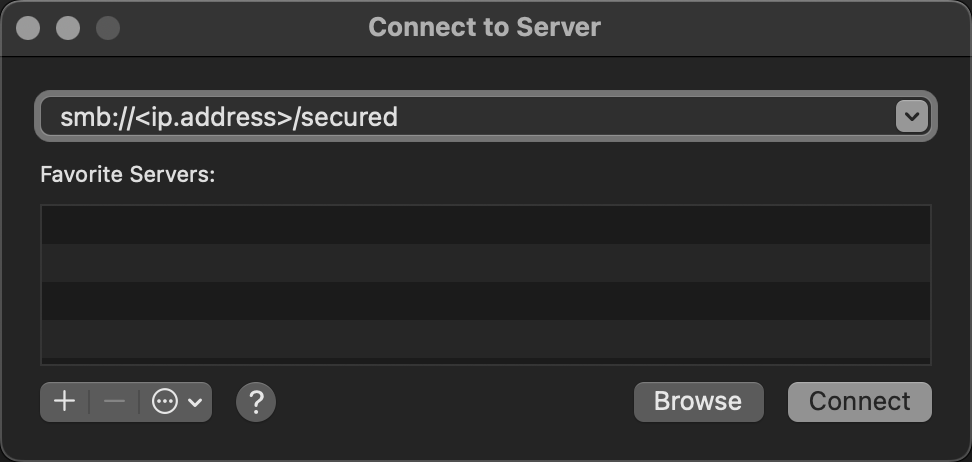

<!-- START doctoc generated TOC please keep comment here to allow auto update -->
<!-- DON'T EDIT THIS SECTION, INSTEAD RE-RUN doctoc TO UPDATE -->
**Table of Contents**  *generated with [DocToc](https://github.com/thlorenz/doctoc)*

- [check status](#check-status)
- [mount](#mount)
  - [mount ios](#mount-ios)
  - [mount smb](#mount-smb)
  - [mount nfs](#mount-nfs)
  - [disconnect the mount](#disconnect-the-mount)
- [LVM](#lvm)
  - [example](#example)
- [performance](#performance)
  - [check NFS performance](#check-nfs-performance)
  - [`iostat`](#iostat)
  - [`sar`](#sar)
  - [hdparm](#hdparm)
  - [dd](#dd)
- [samba](#samba)
  - [setup](#setup)
  - [configure](#configure)
  - [firewall is necessary](#firewall-is-necessary)
  - [enable services](#enable-services)

<!-- END doctoc generated TOC please keep comment here to allow auto update -->

## check status
- `$ lsblk`
- `$ ncdu`
- `$ pvs`
- `$ lvs`
- `$ vgs`
- `$ pvscan`
- `$ lvscan`
- `$ pvdisplay`
- `$ vgdisplay`
- `$ lvdisplay`
- `$ fdisk -l`
- `$ sfdisk  -l -uM`
- `$ lshw -class disk`
- `$ hwinfo --block --short`
- `$ cat /proc/partitions`
- `$ sudo blkid`


## mount
### [mount ios](https://www.tecmint.com/how-to-mount-and-unmount-an-iso-image-in-linux/)
```bash
$ [[ -z $(findmnt /mnt/tmp) ]] || umount -f /mnt/tmp
$ mkdir /mnt/tmp
$ mount -t iso9660 -o loop /vol/builds/os/linux/RHEL-6.6-20140926.0-Server-x86_64-dvd1.iso  /mnt/tmp/
```

### mount smb

> [!NOTE]
> references:
> - [Mounting a Samba share](https://apple.stackexchange.com/a/444568/254265)
> - [如何在 macOS 中停用 SMB 1 或 NetBIOS](https://support.apple.com/zh-tw/HT211927)
> - [Performance issues with SMB 2 and 3 connections](http://www.centralit-helpdesk.co.uk/index.php?pg=kb.page&id=240)

#### macos
- via GUI :
  - Go -> Connect toServer -> `smb://<ip.address>/secured`
    

- via cmd
  - `osascript`
    ```bash
    $ /usr/bin/osascript -e "try" -e "mount volume \"smb://guest@${host}\"" -e "end try"
    ```
  - `mount`
    ``bash
    $ mkdir -p /Volumes/mount
    $ sudo mkdir -p $(whoami):staff /Volumes/mount

    # mount
    $ mount -t smbfs //user1:<password>@<ip.address>/secured /Volumes/mount

    # mount_smbfs
    $ mount_smbfs //user1@<ip.address>/secured /Volumes/mount
    Password for <ip.address>: <password>

    # umount
    $ umount /Volumes/mount
    ```

- check
  ```bash
  $ mount
  ...
  //user1@<ip.address>/secured on /Volumes/mount (smbfs, nodev, nosuid, mounted by user1)
  ```

#### linux
```bash
$ smbclient --user=user1 -L //<ip.address>

# or
$ smbclient //<ip.address>/secured -U user1
```

### mount nfs


```bash
# example
nfs server: 1.2.3.4
sub-folder: /a/b
mount to local: /mnt/mynfs
```


```bash
$ sudo mkdir -p /mnt/mynfs
$ sudo mount -t nfs 1.2.3.4:/a/b /mnt/mynfs

# or force using nfsversion 4
$ sudo mount -t nfs -o nfsvers=4 1.2.3.4:/a/b /mnt/mynfs -vvv
```

- [test if sub-folder exists in remote nfs server](https://www.tecmint.com/how-to-setup-nfs-server-in-linux/)
  ```bash
  $ showmount -e 1.2.3.4 | grep '/a/b'
  ```

- environment setup
  ```bash
  # centos
  $ yum install nfs-utils nfs-utils-lib
  $ yum install portmap (not required with NFSv4)

  # for nfs4

  # ubuntu
  $ apt-get install nfs-utils nfs-utils-lib
  ```

#### check mount
```bash
$ cat /etc/mtab | grep /folder_name
/dev/sdb1 /folder_name ext4 rw,seclabel,relatime,stripe=64 0 0
```

##### [Check if folder is a mounted remote filesystem](https://unix.stackexchange.com/a/72224/29178)
```bash
$ df -P -T /folder_name
Filesystem     Type 1024-blocks     Used  Available Capacity Mounted on
/dev/sdb1      ext4  744******* 658***** 699*******       1% /folder_name
```

- `df`
  ```bash
  $ df /local_storage
  Filesystem      1K-blocks     Used  Available Use% Mounted on
  /dev/sdb1      744******* 658***** 699*******   1% /folder_name
  ```

- `/etc/fstab`
  ```bash
  $ cat /etc/fstab
  ```

- [`findmnt`](https://www.tecmint.com/find-mounted-file-systems-in-linux/)
  ```bash
  $ findmnt --fstab /local_storage
  TARGET         SOURCE    FSTYPE OPTIONS
  /local_storage /dev/sdb1 ext4   defaults
  ```

#### check nfs mount points
```bash
$ df -h -F nfs [ | column -t ]
$ mount | column -t | grep -E 'type.*nfs
$ findmnt /mnt/mynfs
```

#### check mount version

- [`nfsstat -c` will show you the NFS version actually being used](https://unix.stackexchange.com/a/185831/29178)
- [`nfsstat -m` will show statistics on mounted NFS filesystems](https://unix.stackexchange.com/a/138999/29178)
- `grep nfs /proc/mounts` equals `nfsstat -m`


- local
  ```bash
  $ rpcinfo -p localhost
    program vers proto   port  service
     100000    4   tcp    111  portmapper
     100000    3   tcp    111  portmapper
     100000    2   tcp    111  portmapper
     100000    4   udp    111  portmapper
     100000    3   udp    111  portmapper
     100000    2   udp    111  portmapper
     100024    1   udp  38978  status
     100024    1   tcp  36415  status
     100021    1   udp  51669  nlockmgr
     100021    3   udp  51669  nlockmgr
     100021    4   udp  51669  nlockmgr
     100021    1   tcp  42699  nlockmgr
     100021    3   tcp  42699  nlockmgr
     100021    4   tcp  42699  nlockmgr
  ```

- remote
  ```bash
  $ rpcinfo 1.2.3.4 | egrep "service|nfs"
     program version netid     address          service    owner
      100003    3    udp       1.2.3.4.8.1      nfs
      100003    3    tcp       1.2.3.4.8.1      nfs
  ```

#### setup nfs mount by default server boot
```bash
$ sudo bash -c "cat > /etc/fstab" << EOF
1.2.3.4:/a/b    /mnt/mynfs nfs default 0 0
EOF
```

#### related configure
- `/etc/fstab`
- `/etc/nsswitch.conf`
- `/etc/nfsmount.conf`
- `/etc/nfs.conf`
- `/proc/mounts`

### disconnect the mount
```bash
$ sudo umount /mnt/mynfs
```

## LVM
> reference:
> - [CONFIGURING AND MANAGING LOGICAL VOLUMES](https://access.redhat.com/documentation/en-us/red_hat_enterprise_linux/8/html/configuring_and_managing_logical_volumes/index)
> - [CHAPTER 5. MODIFYING THE SIZE OF A LOGICAL VOLUME](https://access.redhat.com/documentation/en-us/red_hat_enterprise_linux/8/html/configuring_and_managing_logical_volumes/assembly_modifying-logical-volume-size-configuring-and-managing-logical-volumes)

### example
- extends the logical volume /dev/myvg/homevol to 12 gigabytes
  ```bash
  $ sudo lvextend -L12G /dev/myvg/homevol
  lvextend -- extending logical volume "/dev/myvg/homevol" to 12 GB
  lvextend -- doing automatic backup of volume group "myvg"
  lvextend -- logical volume "/dev/myvg/homevol" successfully extended
  ```
- adds another gigabyte to the logical volume /dev/myvg/homevol
  ```bash
  $ sudo lvextend -L+1G /dev/myvg/homevol
  lvextend -- extending logical volume "/dev/myvg/homevol" to 13 GB
  lvextend -- doing automatic backup of volume group "myvg"
  lvextend -- logical volume "/dev/myvg/homevol" successfully extended
  ```

## performance
### check NFS performance


> references:
> - [Using nfsstat and nfsiostat to troubleshoot NFS performance issues on Linux](https://www.redhat.com/sysadmin/using-nfsstat-nfsiostat)
> - [NFS poor write performance](https://serverfault.com/questions/682000/nfs-poor-write-performance)
> - [Analyzing Linux NFS server performance](https://serverfault.com/questions/38756/analyzing-linux-nfs-server-performance)


- `nfsstat`
- `nfsiostat`
- [collectl](http://collectl.sourceforge.net/)
  - `collectl -sjmf -oT`
  - `collectl -sn --verbose -oT`
  - `collectl -sJ -oTm`
- [`tshark -R nfs -i eth0`](https://serverfault.com/a/38893/129815)
- [`nfswatch`](http://nfswatch.sourceforge.net)
- `netstat -plaute | grep nfs`
- `watch -d "netstat -plaute | grep nfs | sort -k 4,5"`
- `iostat -mx <delay in sec.> <devices>`
- [`sudo fio --randrepeat=1 --ioengine=libaio --direct=0 --gtod_reduce=1 --name=test1 --filename=/media/ramdisk/test --bs=4k --iodepth=64 --size=4G --readwrite=randrw --rwmixread=75`](https://serverfault.com/a/938554/129815)
- [`time dd if=/dev/zero of=/mnt/nfs/testfile bs=16k count=128k`](https://serverfault.com/a/324489/129815)
- [`iozone -aRcU /mnt/nfs/ -f /mnt/nfs/testfile > logfile`](https://serverfault.com/a/324489/129815)

### `iostat`
```bash
$ iostat -x -d 1
Linux 3.10.0-957.27.2.el7.x86_64 (dc5-ssdfwtst3)  01/15/2021  _x86_64_  (4 CPU)

Device:         rrqm/s   wrqm/s     r/s     w/s    rkB/s    wkB/s avgrq-sz avgqu-sz   await r_await w_await  svctm  %util
sda               0.00     0.09    0.07   13.91     6.83    81.26    12.61     0.01    0.93   11.40    0.88   0.38   0.53
dm-0              0.00     0.00    0.07   14.00     6.83    81.26    12.53     0.01    0.95   11.60    0.90   0.38   0.53
dm-1              0.00     0.00    0.00    0.00     0.00     0.00    52.91     0.00    0.64    0.64    0.00   0.48   0.00
```

### `sar`
```bash
$ sar -bdp 1
Linux 3.10.0-957.27.2.el7.x86_64 (dc5-ssdfwtst3)  01/15/2021  _x86_64_  (4 CPU)

05:44:20 AM       tps      rtps      wtps   bread/s   bwrtn/s
05:44:21 AM    863.00    863.00      0.00  47048.00      0.00

05:44:20 AM       DEV       tps  rd_sec/s  wr_sec/s  avgrq-sz  avgqu-sz     await     svctm     %util
05:44:21 AM       sda    863.00  47048.00      0.00     54.52      2.86      3.33      0.16     14.20
05:44:21 AM centos-root    863.00  47048.00      0.00     54.52      2.88      3.33      0.16     14.20
05:44:21 AM centos-swap      0.00      0.00      0.00      0.00      0.00      0.00      0.00      0.00
```

### hdparm

> [!NOTE]
> hdparm - get/set SATA/IDE device parameters
>
> references:
> - [Linux and Unix Test Disk I/O Performance With dd Command](https://www.cyberciti.biz/faq/howto-linux-unix-test-disk-performance-with-dd-command/)
> - [hdparm Command Examples in Linux](https://www.thegeekdiary.com/hdparm-command-examples-in-linux/)
> - [hdparm command in Linux with Examples](https://www.geeksforgeeks.org/hdparm-command-in-linux-with-examples/)

```bash
$ sudo hdparm -Tt /dev/sda3
/dev/sda3:
 Timing cached reads:   15900 MB in  1.99 seconds = 7978.64 MB/sec
 Timing buffered disk reads: 1796 MB in  3.00 seconds = 598.17 MB/sec

$ sudo hdparm -Tt /dev/sda3
/dev/sda3:
 Timing cached reads:   18924 MB in  1.98 seconds = 9539.84 MB/sec
 Timing buffered disk reads: 102 MB in 12.88 seconds =   7.92 MB/sec
```

### dd

> [!NOTE]
> references:
> - [Linux and Unix Test Disk I/O Performance With dd Command](https://www.cyberciti.biz/faq/howto-linux-unix-test-disk-performance-with-dd-command/)

```bash
$ flush
$ echo 3 | sudo tee /proc/sys/vm/drop_caches
$ time dd if=/path/to/bigfile of=/dev/null bs=8k
```

- write speed
  ```bash
  $ dd if=/dev/zero of=/tmp/test1.img bs=1G count=1 oflag=dsync
  ```
- server latency time
  ```bash
  $ dd if=/dev/zero of=/tmp/test2.img bs=512 count=1000 oflag=dsync
  ```

## samba

> [!NOTE]
> references:
> - [Instructions for setting up a secure Samba share on CentOS 8 Linux](https://support.cleo.com/hc/en-us/articles/360063139733-Instructions-for-setting-up-a-secure-Samba-share-on-CentOS-8-Linux)
> - [How to Install and Configure Samba on CentOS 8](https://www.linuxtechi.com/install-configure-samba-centos-8/)

### setup
```bash
# install
$ sudo dnf install samba samba-common samba-client
$ sudo mv /etc/samba/smb.conf /etc/samba/smb.con.bak

# setup user
$ sudo groupadd secure_group
$ sudo useradd -g secure_group user1
$ sudo useradd -g secure_group user2

# create folder
$ sudo mkdir -p /srv/samba/shared
$ sudo mkdir -p /srv/samba/secure_shared

$ sudo smbpasswd -a user1
  password_1
$ sudo smbpasswd -a user2
  password_2
```

### configure
```
$ cat /etc/samba/smb.conf
[global]
workgroup = WORKGROUP
server string = Samba Server %v
netbios name = centos-8
security = user
map to guest = bad user
dns proxy = no
ntlm auth = yes              // for windows
```

- for anonymous
  ```bash
  $ sudo chmod -R 0755 /srv/samba/shared
  $ sudo chown -R nobody:nobody /srv/samba/shared
  $ sudo chcon -t samba_share_t /srv/samba/shared
  # or
  $ sudo chcon -R system_u:object_r:samba_share_t:s0 /srv/samba/shared

  $ cat /etc/samba/smb.conf
  [anonymous]
  path = /srv/samba/shared
  browsable =yes
  writable = yes
  guest ok = yes
  read only = no
  force user = nobody

  $ testparm
  ```

- for secured
  ```
  $ sudo chmod -R 0770 /srv/samba/secure_shared
  $ sudo chcon -t samba_share -p /srv/samba/secure_shared
  $ sudo chown -R root:secure_group /srv/samba/secure_shared

  $ cat /etc/samba/smb.conf
  [secured]
  path = /srv/samba/secure_shared
  valid users = @secure_group
  guest ok = no
  writable = yes
  browsable = yes

  # verify the configuration is sound
  $ testparm
  ```

### firewall is necessary
```bash
# centos
$ sudo firewall-cmd --add-service=samba --zone=public --permanent
$ sudo firewall-cmd --reload

# ubuntu: https://help.ubuntu.com/lts/serverguide/firewall.html
$ sudo ufw app list
$ sudo ufw allow Samba
$ sudo ufw allow from 192.168.0.0/24 to any app Samba
$ sudo ufw app info Samba
```

### enable services
```
# enable service
$ sudo systemctl start smb
$ sudo systemctl enable smb
$ sudo systemctl status smb
$ sudo systemctl start nmb
$ sudo systemctl enable nmb
$ sudo systemctl status nmb
```

- config

  > [!TIP]
  > FILES :
  > - /etc/nsmb.conf
  >   - The global configuration file.
  > - ~/Library/Preferences/nsmb.conf
  >     - The user's configuration file, conflicts will be overwritten by the global file.

  ```bash
  $ cat /etc/nsmb.conf
  [default]
  signing_required=no
  file_ids_off=yes
  ```
