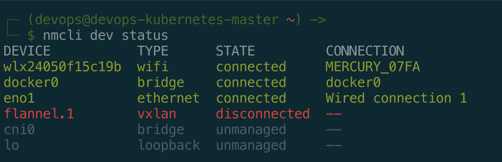
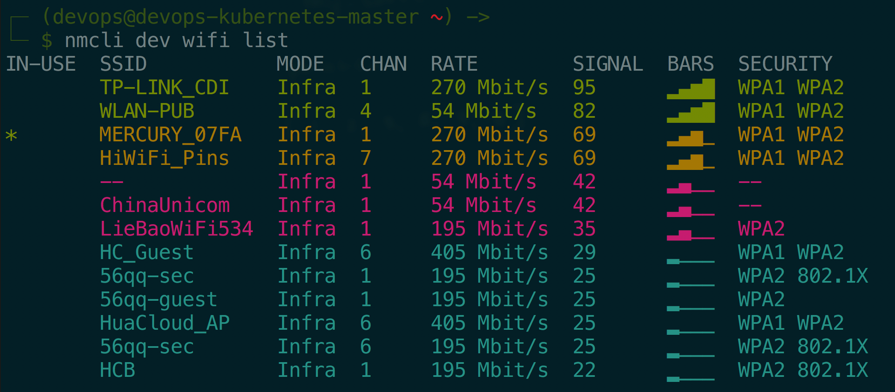
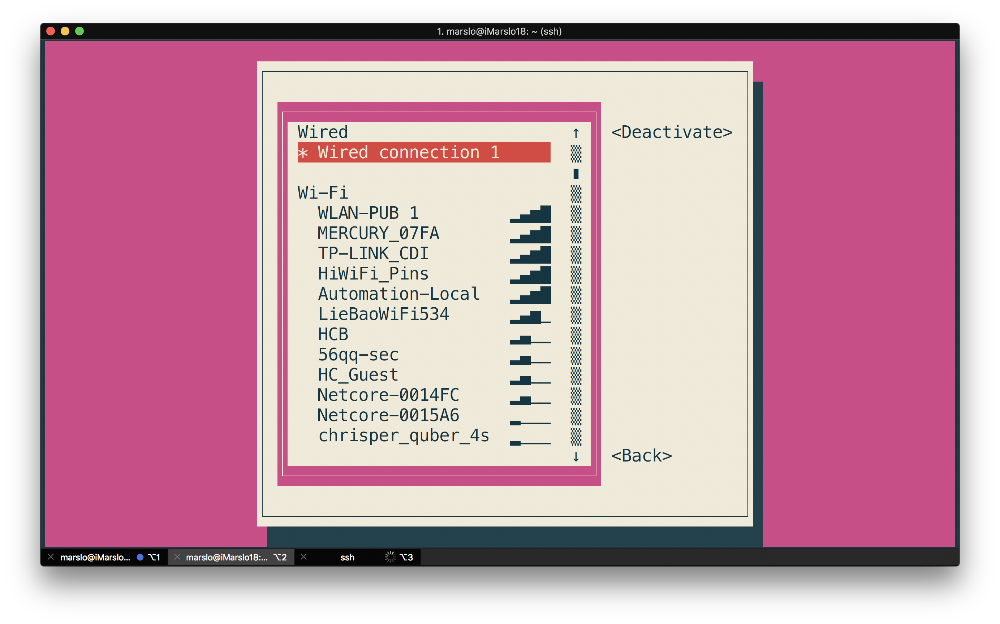
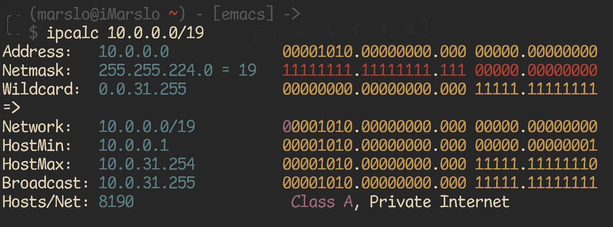
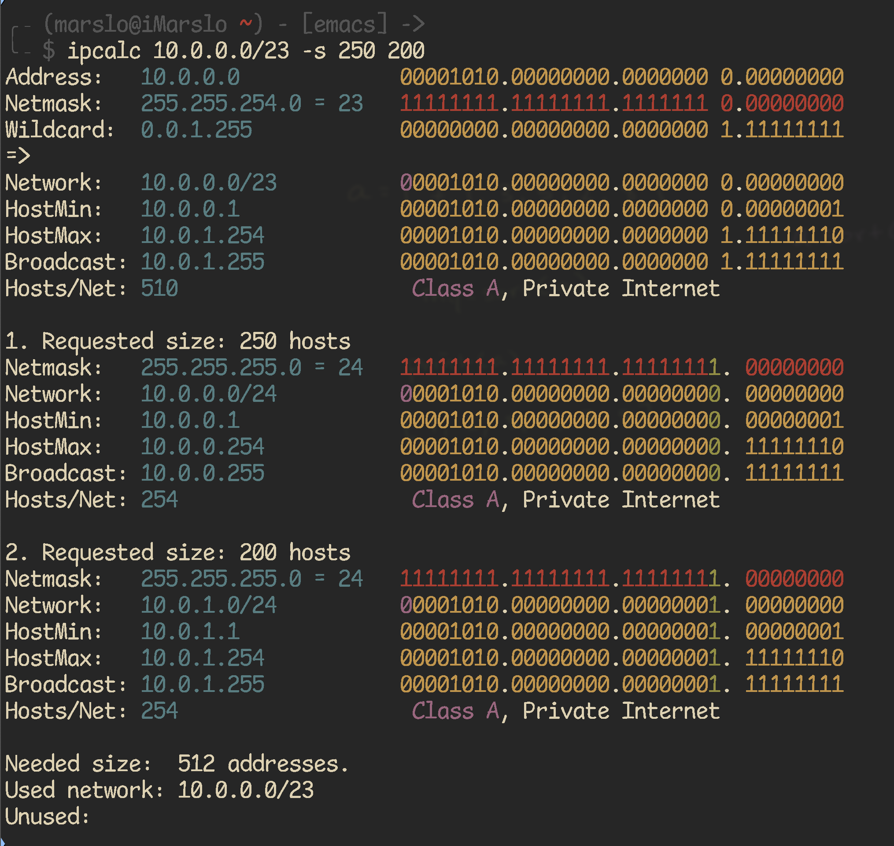
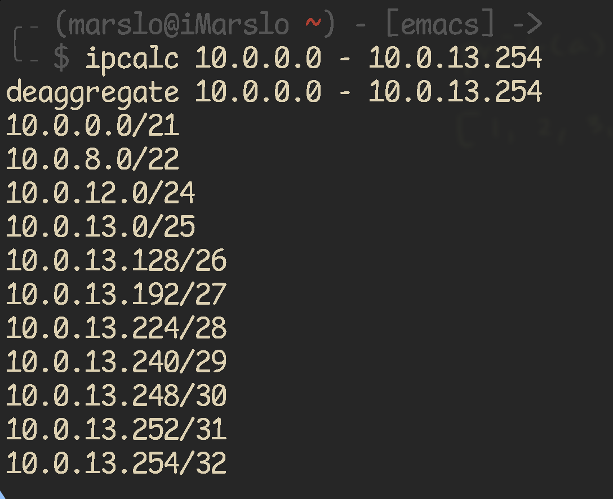

<!-- START doctoc generated TOC please keep comment here to allow auto update -->
<!-- DON'T EDIT THIS SECTION, INSTEAD RE-RUN doctoc TO UPDATE -->

- [get into](#get-into)
  - [get interface by command](#get-interface-by-command)
  - [get gateway](#get-gateway)
  - [get ipv4 address](#get-ipv4-address)
  - [get ip address by hostname](#get-ip-address-by-hostname)
  - [get active IP address](#get-active-ip-address)
  - [get active Mac address](#get-active-mac-address)
  - [get network speed](#get-network-speed)
  - [check remote server dns](#check-remote-server-dns)
  - [show hardware spec](#show-hardware-spec)
  - [change interface name](#change-interface-name)
  - [Clean up network interfaces](#clean-up-network-interfaces)
- [nginx](#nginx)
- [nmap](#nmap)
  - [host discovery](#host-discovery)
  - [check available IPs](#check-available-ips)
  - [scan `80` or `22` in particular setment](#scan-80-or-22-in-particular-setment)
  - [OS detection with verbosity](#os-detection-with-verbosity)
  - [find printer](#find-printer)
  - [list hostname with mac address](#list-hostname-with-mac-address)
  - [get all server up ip address](#get-all-server-up-ip-address)
  - [scan ip/host](#scan-iphost)
- [route](#route)
  - [iptables](#iptables)
  - [port forwarding](#port-forwarding)
  - [port redirection](#port-redirection)
  - [nslookup](#nslookup)
- [traceroute](#traceroute)
  - [traceroute for port](#traceroute-for-port)
  - [No route to host](#no-route-to-host)
- [DNS](#dns)
  - [add new DNS permanently](#add-new-dns-permanently)
- [wifi](#wifi)
  - [`iwconfig`](#iwconfig)
  - [nmcli](#nmcli)
  - [nmtui](#nmtui)
- [netmask](#netmask)
  - [conversion](#conversion)
  - [basic concept](#basic-concept)
  - [example](#example)
  - [netmask quick reference](#netmask-quick-reference)
  - [ipcalc](#ipcalc)

<!-- END doctoc generated TOC please keep comment here to allow auto update -->


> reference:
> - [ARCH NetWork Configuration](https://wiki.archlinux.org/index.php/Network_configuration#Change_device_name)
> - [How do I add a DNS server via resolv.conf?](https://askubuntu.com/a/51332/92979)
> - [How to Configure and Manage Network Connections Using ‘nmcli’ Tool](https://www.tecmint.com/configure-network-connections-using-nmcli-tool-in-linux/)
> - [9 张动图让明白网络性能的四大指标：带宽、时延、抖动、丢包](https://zhuanlan.zhihu.com/p/404778160)
> - [* 连接追踪](https://www.kancloud.cn/pshizhsysu/linux/1799632)


## get into

> [!NOTE|label:references:]
> - [* imarslo : osx/network](../osx/network.md)
> - [Ubuntu Linux view status of my network interfaces card])(https://www.cyberciti.biz/tips/ubuntu-linux-view-the-status-of-my-network-interfacescard.html)

### get interface by command
```bash
$ interface=$(netstat -nr | grep -E 'UG|UGSc' | grep -E '^0.0.0|default' | grep -E '[0-9.]{7,15}' | awk -F' ' '{print $NF}')

# or get the route to github
$ interface=$(ip route get $(nslookup github.com | grep Server | awk -F' ' '{print $NF}') | sed -rn 's|.*dev\s+(\S+)\s+src.*$|\1|p')
# or
$ ip route get 1.1.1.1 | grep --color=never 'via' | sed -re 's/.+via.+dev ([0-9a-zA-Z]+) src.+$/\1/'

# or via nmcli
$ interface=$(nmcli device | grep --color=never -w connected | awk '{print $1}')
```

- list all interfaces
  ```bash
  $ ip l show
  ```

- show active via `nmcli`
  ```bash
  $ nmcli connection show --active
  NAME                UUID                                  TYPE      DEVICE
  Wired connection 5  f866f67c-16db-3808-8e45-29352a730089  ethernet  enx7ae71f506ee6
  Wired connection 4  dc0adc36-baa3-361b-ab2d-15dd111a0e82  ethernet  enp74s0
  ```

- get status
  ```bash
  # with color
  $ ip -c route get 1.1.1.1

  # without color
  $ ip route get 1.1.1.1
  1.1.1.1 via 10.111.22.1 dev enp74s0 src 10.111.22.97 uid 1001
  #-----#     #---------#     #-----#     #----------#
  #target       gateway      interface     ip address
      cache
  ```

### get gateway
```bash
$ getway=$(route -n | grep --color=never -E 'UG|UGSc' | awk '{print $2}')
$ echo ${gateway}
10.111.22.1
```

### get ipv4 address
```bash
$ ipAddr=$(ip a s "${interface}" | sed -rn 's|.*inet ([0-9\.]{7,15})/[0-9]{2} brd.*$|\1|p')
```

### get ip address by hostname
- [`ping` & `sed`](https://unix.stackexchange.com/a/45246/29178)
  ```bash
  $ ping -q -c 1 -t 1 github.com | sed -n -re 's:^PING.*\(([0-9\.]{7,15})\).*$:\1:p'
  ```

- [`dig`](https://unix.stackexchange.com/a/20793/29178)
  ```bash
  $ dig +short github.com

  # or
  $ dig github.com | awk '/^;; ANSWER SECTION:$/ { getline ; print $5 }'
  ```

- `nslookup`
  ```bash
  $ nslookup github.com | awk '/Name:/{getline; print $2;}'
  ```

### get active IP address
```bash
$ githubIP=$(dig +short github.com | head -1)

$ interface=$(ip route get ${githubIP} | sed -rn 's|.*dev\s+(\S+)\s+src.*$|\1|p')
$ ipaddr=$(ip a s ${interface} | sed -rn 's|\W*inet[^6]([0-9\.]{7,15}).*$|\1|p')
```

### get active Mac address
```bash
$ githubIP=$(dig +short github.com | head -1)

$ interface=$(ip route get ${githubIP} | sed -rn 's|.*dev\s+(\S+)\s+src.*$|\1|p')
$ macaddr=$(ip link show ${interface} | sed -rn 's|.*ether ([0-9a-fA-F:]{17}).*$|\1|p' | sed 's|:||g' | tr [a-z] [A-Z])
```

#### `dig`
```bash
$ dig +noall +answer <domain.name>
```

### get network speed
```bash
$ ifstat -n -i en7
       en7
 KB/s in  KB/s out
    7.35      1.15
    4.91      1.02
    6.05      0.80
    8.36      1.78
```

### check remote server dns
```bash
$ for _i in {1..10}; do
    echo -e "\n\n ~~~> myserver_${i}"
    ssh -q marslo@myserver_${_i} "cat /etc/resolv.conf | sed -nre 's:^nameserver\s([0-9.]+):\1:p' | xargs -L1 /usr/bin/ping -c 1"
  done
```

### show hardware spec
#### `ethtool`
```bash
$ sudo ethtool eth0
Settings for eth0:
    Supported ports: [ TP ]
    Supported link modes:   10baseT/Half 10baseT/Full
                            100baseT/Half 100baseT/Full
                            1000baseT/Full
    Supported pause frame use: No
    Supports auto-negotiation: Yes
    Supported FEC modes: Not reported
    Advertised link modes:  10baseT/Half 10baseT/Full
                            100baseT/Half 100baseT/Full
                            1000baseT/Full
    Advertised pause frame use: No
    Advertised auto-negotiation: Yes
    Advertised FEC modes: Not reported
    Speed: 100Mb/s
    Duplex: Full
    Port: Twisted Pair
    PHYAD: 1
    Transceiver: internal
    Auto-negotiation: on
    MDI-X: on (auto)
    Supports Wake-on: pumbg
    Wake-on: g
    Current message level: 0x00000007 (7)
                   drv probe link
    Link detected: yes
```

#### list hardware

<!--sec data-title="sudo lshw -class network" data-id="section0" data-show=true data-collapse=true ces-->
```bash
$ sudo lshw -class network
  *-network
       description: Wireless interface
       product: Wireless 8260
       vendor: Intel Corporation
       physical id: 0
       bus info: pci@0000:02:00.0
       logical name: wlan0
       version: 3a
       serial: 34:f3:9a:52:75:65
       width: 64 bits
       clock: 33MHz
       capabilities: pm msi pciexpress bus_master cap_list ethernet physical wireless
       configuration: broadcast=yes driver=iwlwifi driverversion=4.15.0-23-generic firmware=34.0.1 ip=192.168.10.235 latency=0 link=yes multicast=yes wireless=IEEE 802.11
       resources: irq:129 memory:e4100000-e4101fff
  *-network
       description: Ethernet interface
       product: Ethernet Connection (2) I219-LM
       vendor: Intel Corporation
       physical id: 1f.6
       bus info: pci@0000:00:1f.6
       logical name: eth0
       version: 31
       serial: 30:e1:71:95:19:bc
       size: 100Mbit/s
       capacity: 1Gbit/s
       width: 32 bits
       clock: 33MHz
       capabilities: pm msi bus_master cap_list ethernet physical tp 10bt 10bt-fd 100bt 100bt-fd 1000bt-fd autonegotiation
       configuration: autonegotiation=on broadcast=yes driver=e1000e driverversion=3.2.6-k duplex=full firmware=0.8-4 ip=130.147.182.57 latency=0 link=yes multicast=yes port=twisted pair speed=100Mbit/s
       resources: irq:127 memory:e4300000-e431ffff
  *-network:0
       description: Ethernet interface
       physical id: 2
       logical name: veth680e7b1b
       serial: 86:86:ae:b1:3f:c3
       size: 10Gbit/s
       capabilities: ethernet physical
       configuration: autonegotiation=off broadcast=yes driver=veth driverversion=1.0 duplex=full link=yes multicast=yes port=twisted pair speed=10Gbit/s
  *-network:1
       description: Ethernet interface
       physical id: 3
       logical name: vethdd057c06
       serial: ae:b1:42:e3:30:d0
       size: 10Gbit/s
       capabilities: ethernet physical
       configuration: autonegotiation=off broadcast=yes driver=veth driverversion=1.0 duplex=full link=yes multicast=yes port=twisted pair speed=10Gbit/s
  *-network:2
       description: Ethernet interface
       physical id: 4
       logical name: vethfe693595
       serial: 16:ec:cd:4e:c3:d8
       size: 10Gbit/s
       capabilities: ethernet physical
       configuration: autonegotiation=off broadcast=yes driver=veth driverversion=1.0 duplex=full link=yes multicast=yes port=twisted pair speed=10Gbit/s
  *-network:3
       description: Ethernet interface
       physical id: 5
       logical name: flannel.1
       serial: 2a:2b:77:a7:35:8f
       capabilities: ethernet physical
       configuration: broadcast=yes driver=vxlan driverversion=0.1 ip=10.244.0.0 link=yes multicast=yes
  *-network:4
       description: Ethernet interface
       physical id: 6
       logical name: cni0
       serial: 0a:58:0a:f4:00:01
       capabilities: ethernet physical
       configuration: broadcast=yes driver=bridge driverversion=2.3 firmware=N/A ip=10.244.0.1 link=yes multicast=yes
  *-network:5
       description: Ethernet interface
       physical id: 7
       logical name: docker0
       serial: 02:42:99:41:e5:02
       capabilities: ethernet physical
       configuration: broadcast=yes driver=bridge driverversion=2.3 firmware=N/A ip=172.17.0.1 link=no multicast=yes
  *-network:6
       description: Ethernet interface
       physical id: 8
       logical name: vethc1b38134
       serial: 76:6a:6c:0f:e8:a1
       size: 10Gbit/s
       capabilities: ethernet physical
       configuration: autonegotiation=off broadcast=yes driver=veth driverversion=1.0 duplex=full link=yes multicast=yes port=twisted pair speed=10Gbit/s
```
<!--endsec-->

### change interface name

> [!NOTE|label:references:]
> - [重命名网卡](https://www.kancloud.cn/pshizhsysu/linux/1799739)

#### [Permanent Solution](https://wiki.archlinux.org/index.php/Network_configuration#Change_interface_name)
``` bash
$ sudo touch /etc/udev/rules.d/10-network.rules
$ sudo bash -c "cat > /etc/udev/rules.d/10-network.rules" << EOF
SUBSYSTEM=="net", ACTION=="add", DRIVERS=="?*", ATTR{address}=="<INTERFACE_MAC_ADDRESS>", KERNEL=="<ORIGINAL_INTERFACE_NAME>", NAME="<NEW_INTERFACE_NAME>"
EOF
```

- e.g.:
  ```bash
  $ nmcli connection
  NAME                UUID                                  TYPE      DEVICE
  WLAN-PUB            2cde1f25-8c28-4318-9781-b9fcdabd985d  wifi      wlp2s0
  Wired connection 1  f72d569d-065b-3bc8-98ae-e07f8bf46945  ethernet  enp0s31f6
  cni0                dcfc10c6-5421-4405-9d56-b3bb595780f5  bridge    cni0
  docker0             29822e8f-772f-4e67-8052-55b9e6c9e298  bridge    docker0

  $ sudo bash -c "cat > /etc/udev/rules.d/10-network.rules" << EOF
  SUBSYSTEM=="net", ACTION=="add", DRIVERS=="?*", ATTR{address}=="30:e1:71:95:19:bc", NAME="eth0"
  SUBSYSTEM=="net", ACTION=="add", DRIVERS=="?*", ATTR{address}=="34:f3:9a:52:75:65", NAME="wlan0"
  EOF

  $ sudo reboot

  $ nmcli connection
  NAME                UUID                                  TYPE      DEVICE
  WLAN-PUB            2cde1f25-8c28-4318-9781-b9fcdabd985d  wifi      wlan0
  Wired connection 1  f72d569d-065b-3bc8-98ae-e07f8bf46945  ethernet  eth0
  cni0                9a2d48d7-e1c7-4fe4-a164-ffde9716dbf3  bridge    cni0
  docker0             5db99dac-d17d-4765-9f38-057ff2c853ff  bridge    docker0
  ```

#### [temporary Solution](http://kernelpanik.net/rename-a-linux-network-interface-without-udev/)
```bash
$ sudo ifconfig <ORIGINAL_INTERFACE_NAME> down
$ sudo ip link set <ORIGINAL_INTERFACE_NAME> name <NEW_INTERFACE_NAME>
$ sudo ifconfig <NEW_INTERFACE_NAME>
```

- e.g.:
  ```bash
  $ nmcli dev
  DEVICE        TYPE      STATE         CONNECTION
  wlp2s0        wifi      connected     WLAN-PUB
  cni0          bridge    connected     cni0
  enp0s31f6     ethernet  connected     Wired connection 1
  docker0       bridge    connected     docker0
  flannel.1     vxlan     disconnected  --
  veth1890b284  ethernet  unmanaged     --
  veth5145289b  ethernet  unmanaged     --
  vetha9ee773c  ethernet  unmanaged     --
  vethf5a48bb2  ethernet  unmanaged     --
  lo            loopback  unmanaged     --

  $ nmcli connection
  NAME                UUID                                  TYPE      DEVICE
  WLAN-PUB            2cde1f25-8c28-4318-9781-b9fcdabd985d  wifi      wlp2s0
  Wired connection 1  f72d569d-065b-3bc8-98ae-e07f8bf46945  ethernet  enp0s31f6
  cni0                dcfc10c6-5421-4405-9d56-b3bb595780f5  bridge    cni0
  docker0             29822e8f-772f-4e67-8052-55b9e6c9e298  bridge    docker0

  $ sudo ifconfig enp0s31f6 down; sudo ip link set enp0s31f6 name eth0; sudo ifconfig eth0 up

  $ nmcli dev
  DEVICE        TYPE      STATE         CONNECTION
  wlp2s0        wifi      connected     WLAN-PUB
  cni0          bridge    connected     cni0
  docker0       bridge    connected     docker0
  eth0          ethernet  connected     Wired connection 1
  flannel.1     vxlan     disconnected  --
  veth1890b284  ethernet  unmanaged     --
  veth5145289b  ethernet  unmanaged     --
  vetha9ee773c  ethernet  unmanaged     --
  vethf5a48bb2  ethernet  unmanaged     --
  lo            loopback  unmanaged     --

  $ nmcli connection
  NAME                UUID                                  TYPE      DEVICE
  WLAN-PUB            2cde1f25-8c28-4318-9781-b9fcdabd985d  wifi      wlp2s0
  Wired connection 1  f72d569d-065b-3bc8-98ae-e07f8bf46945  ethernet  eth0
  cni0                e557e9bc-754e-4dc9-b9db-4519a7b15c33  bridge    cni0
  docker0             47c195b8-4867-40d3-acec-c28223e2b013  bridge    docker0
  ```

### [Clean up network interfaces](https://github.com/canonical/microk8s/issues/712#issue-504138458)
```bash
$ ip a | grep -o "veth[a-z0-9]\+" | xargs -I[] sudo ip link delete []
```

## nginx

> [!NOTE|label:references:]
> - [使用 Nginx 反向代理 HTTPS 网站](https://taoshu.in/unix/nginx-proxy-https.html)

## [nmap](https://nmap.org/)

> reference:
> - [SOLUTION: Scan a Large Network for a Certain Open TCP Port](https://nmap.org/book/solution-find-open-port.html)
> - [Nmap Network Scanning](http://nmap.org/book/man-host-discovery.html)



### [host discovery](https://nmap.org/book/man-host-discovery.html)

|                       PARAMETER | COMMENTS                                                             |
|--------------------------------:|----------------------------------------------------------------------|
|           `-iL <inputfilename>` | Input from list of hosts/networks                                    |
|               `-iR <num hosts>` | Choose random targets                                                |
|                           `-sL` | List Scan - simply list targets to scan                              |
|                           `-sP` | Ping Scan - go no further than determining if host is online         |
|                           `-P0` | Treat all hosts as online -- skip host discovery                     |
|          `-PS/PA/PU [portlist]` | TCP SYN/ACK or UDP discovery probes to given ports                   |
|                     `-PE/PP/PM` | ICMP echo, timestamp, and netmask request discovery probes           |
|                         `-n/-R` | Never do DNS resolution/Always resolve [default ⎮ sometimes resolve] |
|               `-sS/sT/sA/sW/sM` | TCP SYN/Connect()/ACK/Window/Maimon scans                            |
|                     `-sN/sF/sX` | TCP Null, FIN, and Xmas scans                                        |
|                           `-sO` | IP protocol scan                                                     |
| `-sI <zombie host[:probeport]>` | Idlescan                                                             |
|                            `-O` | Enable OS detection                                                  |


### [check available IPs](https://serverfault.com/a/23743/129815)
```bash
$ nmap -sP -PR 1.2.3.*

# or via IP range
$ nmap -sP -PR 1.2.3.1-254

# or via CIDR
$ nmap -sP -PR 1.2.3.0/22
```

### scan `80` or `22` in particular setment
```bash
$ nmap -sT -p 80 -oG - 10 - 1.2.3.* [| grep open]
$ nmap -sT -p 22 -oG - 10 - 1.2.3.* [| grep open]
```

### [OS detection with verbosity](https://nmap.org/book/osdetect-usage.html)
```bash
$ sudo nmap -O -v 192.168.1.0/23
Starting Nmap 7.91 ( https://nmap.org ) at 2021-02-03 15:51 CST
Initiating ARP Ping Scan at 15:51
Scanning 511 hosts [1 port/host]
Completed ARP Ping Scan at 15:51, 2.02s elapsed (511 total hosts)
Initiating Parallel DNS resolution of 118 hosts. at 15:51
Completed Parallel DNS resolution of 118 hosts. at 15:51, 0.18s elapsed
Nmap scan report for 192.168.1.0 [host down]
Nmap scan report for 192.168.1.2 [host down]
...

Nmap scan report for 192.168.1.1
Host is up (0.0016s latency).
Not shown: 998 closed ports
PORT   STATE SERVICE
22/tcp open  ssh
23/tcp open  telnet
MAC Address: C0:**:**:**:**:C8 (Cisco Systems)
OS details: Cisco 2950, 2960, 3550, 3560, 3750, or 4500 switch or 6500 router (IOS 12.1 - 15.0); or Adaptive Security Appliance firewall
Network Distance: 1 hop
TCP Sequence Prediction: Difficulty=264 (Good luck!)
IP ID Sequence Generation: Randomized
...
```

### [find printer](https://serverfault.com/a/154696/129815)
```bash
$ sudo nmap -p 9100,515,631 192.168.1.0/23 [-oX printers.xml]
...
Starting Nmap 7.91 ( https://nmap.org ) at 2021-02-03 16:09 CST
Nmap scan report for 192.168.1.191
Host is up (0.0029s latency).

PORT     STATE  SERVICE
515/tcp  closed printer
631/tcp  closed ipp
9100/tcp open   jetdirect
MAC Address: 08:00:27:96:17:9E (Oracle VirtualBox virtual NIC)

Nmap done: 1 IP address (1 host up) scanned in 0.29 second
...
```

- or
  ```bash
  $ sudo nmap [-sT] -p 9100,515,631 -oG - 192.168.1.0/23
  # Nmap 7.91 scan initiated Wed Feb  3 16:44:20 2021 as: nmap -p 9100,515,631 -oG - 192.168.1.0/23
  Host: 192.168.1.1 ()  Status: Up
  Host: 192.168.1.1 ()  Ports: 515/closed/tcp//printer///, 631/closed/tcp//ipp///, 9100/closed/tcp//jetdirect///
  Host: 192.168.1.13 () Status: Up
  Host: 192.168.1.13 () Ports: 515/open/tcp//printer///, 631/open/tcp//ipp///, 9100/open/tcp//jetdirect///
  Host: 192.168.1.1 ()  Status: Up
  Host: 192.168.1.1 ()  Ports: 515/closed/tcp//printer///, 631/closed/tcp//ipp///, 9100/closed/tcp//jetdirect///
  Host: 192.168.1.254 ()  Status: Up
  Host: 192.168.1.254 ()  Ports: 515/filtered/tcp//printer///, 631/filtered/tcp//ipp///, 9100/filtered/tcp//jetdirect///
  # Nmap done at Wed Feb  3 16:44:28 2021 -- 512 IP addresses (4 hosts up) scanned in 8.37 seconds
  ```

### [list hostname with mac address](https://serverfault.com/a/674347/129815)
```bash
$ sudo nmap -sP 172.31.201.0/24 | awk '/Nmap scan report for/{printf $5;}/MAC Address:/{print " => "$3;}' | sort
192.168.1.1 => C0:**:**:**:**:C8
192.168.1.108 => 08:**:**:**:**:6B
192.168.1.109 => 08:**:**:**:**:96
...
```

- [get hostname, macaddress, OS](https://serverfault.com/a/939364/129815)
  ```bash
  $ sudo nmap -sn 192.168.1.0/23 | awk '/Nmap scan report for/{printf $5;}/MAC Address:/{print " => "substr($0, index($0,$3)) }' | sort
  192.168.1.1 => C0:**:**:**:**:C8 (Cisco Systems)
  192.168.1.108 => 08:**:**:**:**:6B (Oracle VirtualBox virtual NIC)
  192.168.1.109 => 08:**:**:**:**:96 (Oracle VirtualBox virtual NIC)
  ...
  ```

### [get all server up ip address](https://serverfault.com/a/586721/129815)
```bash
$ sudo nmap -v -sn -n 192.168.1.0/24 -oG - | awk '/Status: Up/{print $2}'
```
- get down
  ```bash
  $ sudo nmap -v -sn -n 192.168.1.0/24 -oG - | awk '/Status: Down/{print $2}'
  ```

### [scan ip/host](https://www.maketecheasier.com/fix-no-route-to-host-error-linux/)
```bash
$ sudo nmap -sS 1.2.3.4
Starting Nmap 7.94 ( https://nmap.org ) at 2023-08-14 22:52 PDT
Nmap scan report for host.example.com (1.2.3.4)
Host is up (0.00077s latency).
Not shown: 991 filtered tcp ports (no-response), 6 filtered tcp ports (admin-prohibited)
PORT     STATE SERVICE
22/tcp   open  ssh
3389/tcp open  ms-wbt-server
9090/tcp open  zeus-admin

Nmap done: 1 IP address (1 host up) scanned in 4.98 seconds

# or
$ sudo nmap -Pn -sS --reason 1.2.3.4
Starting Nmap 7.94 ( https://nmap.org ) at 2023-08-14 23:02 PDT
Nmap scan report for host.example.com (1.2.3.4)
Host is up, received user-set (0.018s latency).
Not shown: 997 closed tcp ports (reset)
PORT     STATE SERVICE REASON
22/tcp   open  ssh     syn-ack ttl 61
111/tcp  open  rpcbind syn-ack ttl 61
2049/tcp open  nfs     syn-ack ttl 61
```

- [trace with port](https://serverfault.com/q/999723/129815)
  ```bash
  $ nmap --reason -p 16000 192.168.0.104
  ```

## route
### iptables

> [!NOTE|label:references:]
> - [Linux系统运维: Iptables 应用](https://www.yaolong.net/article/linux-ops-iptables/)
> - [How to save/backup existing iptables rules to a file – Iptables commands](https://www.crybit.com/how-to-save-current-iptables-rules/)
> - [How to Backup Iptables Configuration](https://elearning.wsldp.com/pcmagazine/backup-iptables-configuration/)
> - [What's the difference between PREROUTING and FORWARD in iptables?](https://askubuntu.com/a/579242/92979)
>   ```bash
>   $ iptables -t nat -A PREROUTING -i eth0 -p tcp --dport 80 -j REDIRECT --to-port 8080
>   $ iptables -A FORWARD -i eth0 -p tcp --dport 80 -d 192.168.0.4 -j ACCEPT
>   ```
> - [How to list all iptables rules with line numbers on Linux](https://www.cyberciti.biz/faq/how-to-list-all-iptables-rules-in-linux/)
> - [How To Forward Ports through a Linux Gateway with Iptables](https://www.digitalocean.com/community/tutorials/how-to-forward-ports-through-a-linux-gateway-with-iptables)
> - [* iptables 匹配条件](https://www.kancloud.cn/pshizhsysu/linux/1799485)
>   - [基础匹配条件](https://www.kancloud.cn/pshizhsysu/linux/1799486)
>   - [扩展匹配条件](https://www.kancloud.cn/pshizhsysu/linux/1799487) | [match extensions](https://ipset.netfilter.org/iptables-extensions.man.html#index)


- show status
  ```bash
  $ sudo iptables -L -nv --line-number
  ```

- backup
  ```bash
  $ sudo iptables-save > iptables-backup-$(date +%F)

  # or
  $ sudo iptables-save > /etc/iptables/rules.v4
  $ sudo ip6tables-save > /etc/iptables/rules.v6 # for ipv6

  # automatic backup
  $ crontab -L
  0 0 * * * root iptables-save > /backup/iptables-backup-$(date +%F)
  ```

- restore
  ```bash
  $ sudo iptables-restore < /path/to/backup/file
  ```

- flush
  ```bash
  $ sudo iptables -F
  ```

### port forwarding

> [!NOTE|label:references:]
> - [How can I port forward with iptables?](https://serverfault.com/a/140626/129815)
> - [Basic iptables NAT port forwarding](https://serverfault.com/a/326577/129815)
> - [How to formulate IP forwarding rule using iptables](https://serverfault.com/a/383348/129815)

```bash
# enable forwarding is allowed
$ echo '1' | sudo tee /proc/sys/net/ipv4/conf/ppp0/forwarding
$ echo '1' | sudo tee /proc/sys/net/ipv4/conf/eth0/forwarding
# or
$ sudo sysctl net.ipv4.conf.eth0.forwarding=1
$ sudo sysctl net.ipv6.conf.eth0.forwarding=1
# or
$ cat << EOF > /etc/sysctl.d/99-forwarding.conf
sysctl net.ipv4.conf.eth0.forwarding=1
sysctl net.ipv6.conf.eth0.forwarding=1
EOF

# port forward
$ sudo iptables -t nat -A PREROUTING -p tcp -i ppp0 --dport 8001 -j DNAT --to-destination 192.168.1.200:8080
$ sudo iptables -A FORWARD -p tcp -d 192.168.1.200 --dport 8080 -m state --state NEW,ESTABLISHED,RELATED -j ACCEPT

# or https://serverfault.com/a/140624/129815
$ sudo iptables -A FORWARD -m state -p tcp -d 192.168.1.200 --dport 8080 --state NEW,ESTABLISHED,RELATED -j ACCEPT
$ sudo iptables -t nat -A PREROUTING -p tcp --dport 8001 -j DNAT --to-destination 192.168.1.200:8080
```

- [more details](https://serverfault.com/a/326577/129815)
  ```bash
  #    PC ----- Ubuntu 10 Server ----- Slashdot
  # (1.2.3.4)      (5.6.7.8)        (216.34.181.45)

  # enable ip forwarding
  $ sudo echo 1 > /proc/sys/net/ipv4/ip_forward

  # add rule
  $ iptables -t nat -A PREROUTING -i eth0 -p tcp -m tcp --dport 8080 -j DNAT --to-destination 216.34.181.45:80
  $ iptables -t nat -A POSTROUTING -o eth0 -j SNAT --to-source 5.6.7.8

  # use MASQUERADE if the Ubuntu has a dynamic IP
  $ iptables -t nat -A POSTROUTING -j MASQUERADE

  # jumper server
  $ ssh -L 5.6.7.8:8080:216.34.181.45:80 -N user@216.34.181.45

  # more config
  $ cat /etc/rinetd.conf
  5.6.7.8 8080 216.34.181.45 80
  $ /etc/init.d/rinetd start

  # iptable-save
  *nat -A PREROUTING -p tcp -m tcp -i eth0 --dport 8080 -j DNAT --to-destination 216.34.181.45:80 -A POSTROUTING -o eth0 -j SNAT --to-source 5.6.7.8 COMMIT
  ```

- [script](https://serverfault.com/a/743017/129815)

  <!--sec data-title="./port_forward.sh -r 192.168.1.100 3000" data-id="section1" data-show=true data-collapse=true ces-->
  ```bash
  #!/bin/bash

  # decide which action to use
  action="add"
  if [[ "-r" == "$1" ]]; then
    action="remove"
    shift
  fi

  # break out components
  dest_addr_lan="$1"
  dest_port_wan="$2"
  dest_port_lan="$3"

  # figure out our WAN ip
  wan_addr=`curl -4 -s icanhazip.com`

  # auto fill our dest lan port if we need to
  if [ -z $dest_port_lan ]; then
    dest_port_lan="$dest_port_wan"
  fi

  # print info for review
  echo "Destination LAN Address: $dest_addr_lan"
  echo "Destination Port WAN: $dest_port_wan"
  echo "Destination Port LAN: $dest_port_lan"
  echo "WAN Address: $wan_addr"

  # confirm with user
  read -p "Does everything look correct? " -n 1 -r
  echo    # (optional) move to a new line
  if [[ $REPLY =~ ^[Yy]$ ]]; then
    if [[ "remove" == "$action" ]]; then
      iptables -t nat -D PREROUTING  -p tcp -m tcp -d $wan_addr --dport     $dest_port_wan -j DNAT --to-destination $dest_addr_lan:$dest_port_lan
      iptables -D FORWARD -m state -p tcp -d $dest_addr_lan --dport     $dest_port_lan --state NEW,ESTABLISHED,RELATED -j ACCEPT
      iptables -t nat -D POSTROUTING -p tcp -m tcp -s $dest_addr_lan --sport     $dest_port_lan -j SNAT --to-source $wan_addr
      echo "Forwarding rule removed"
    else
      iptables -t nat -A PREROUTING  -p tcp -m tcp -d $wan_addr --dport     $dest_port_wan -j DNAT --to-destination $dest_addr_lan:$dest_port_lan
      iptables -A FORWARD -m state -p tcp -d $dest_addr_lan --dport     $dest_port_lan --state NEW,ESTABLISHED,RELATED -j ACCEPT
      iptables -t nat -A POSTROUTING -p tcp -m tcp -s $dest_addr_lan --sport $dest_port_lan -j SNAT --to-source $wan_addr
      echo "Forwarding rule added"
    fi
  else
    echo "Info not confirmed, exiting..."
  fi
  ```
  <!--endsec-->

### port redirection
```bash
$ sudo iptables -L -n
Chain INPUT (policy ACCEPT)
target     prot opt source               destination
Chain FORWARD (policy ACCEPT)
target     prot opt source               destination
Chain OUTPUT (policy ACCEPT)
target     prot opt source               destination

$ sudo iptables -I INPUT 1 -p tcp --dport 8080 -j ACCEPT
$ sudo iptables -I INPUT 1 -p tcp --dport 80 -j ACCEPT
$ sudo iptables -A PREROUTING -t nat -i ens32 -p tcp --dport 80 -j REDIRECT --to-port 8080
$ sudo iptables -t nat -I OUTPUT -p tcp -d 127.0.0.1 --dport 80 -j REDIRECT --to-ports 8080
$ sudo iptables -t nat -I OUTPUT -p tcp -o lo --dport 80 -j REDIRECT --to-ports 8080

$ sudo iptables -L -n
Chain INPUT (policy ACCEPT)
target     prot opt source               destination
ACCEPT     tcp  --  0.0.0.0/0            0.0.0.0/0            tcp dpt:80
ACCEPT     tcp  --  0.0.0.0/0            0.0.0.0/0            tcp dpt:8080
Chain FORWARD (policy ACCEPT)
target     prot opt source               destination
Chain OUTPUT (policy ACCEPT)
target     prot opt source               destination

$ sudo netfilter-persistent save
run-parts: executing /usr/share/netfilter-persistent/plugins.d/15-ip4tables save
run-parts: executing /usr/share/netfilter-persistent/plugins.d/25-ip6tables save
$ sudo iptables-save > /etc/iptables/rules.v4
```

### nslookup
```bash
$ nslookup sample.gitlab.com
Server:     130.147.236.5
Address:    130.147.236.5#53

Non-authoritative answer:
Name:   sample.gitlab.com
Address: 130.147.219.15

$ ip route get 130.147.219.15
130.147.219.15 dev eno1 src 130.147.182.240 uid 1000
    cache

$ nslookup github.com
Server:     130.147.236.5
Address:    130.147.236.5#53

Non-authoritative answer:
Name:   github.com
Address: 192.30.253.112
Name:   github.com
Address: 192.30.253.113

$ ip route get 192.30.253.113
192.30.253.113 via 192.168.10.1 dev wlan0 src 192.168.11.166 uid 1000
    cache
```

- or
  ```bash
  $ ip route show
  default via 192.168.10.1 dev wlan0 proto dhcp metric 600
  10.244.0.0/24 dev cni0 proto kernel scope link src 10.244.0.1
  130.140.0.0/16 dev eth0 scope link
  130.145.0.0/16 dev eth0 scope link
  130.146.0.0/16 dev eth0 scope link
  130.147.0.0/16 dev eth0 scope link
  130.147.182.0/23 dev eth0 proto kernel scope link src 130.147.182.57 metric 100
  137.55.0.0/16 dev eth0 scope link
  161.83.0.0/16 dev eth0 scope link
  161.84.0.0/16 dev eth0 scope link
  161.85.0.0/16 dev eth0 scope link
  161.88.0.0/16 dev eth0 scope link
  161.91.0.0/16 dev eth0 scope link
  161.92.0.0/16 dev eth0 scope link
  169.254.0.0/16 dev eth0 scope link metric 1000
  172.17.0.0/16 dev docker0 proto kernel scope link src 172.17.0.1 linkdown
  185.166.0.0/16 dev eth0 scope link
  192.168.10.0/23 dev wlan0 proto kernel scope link src 192.168.10.235 metric 600
  ```

- or
  ```bash
  $ route -n
  Kernel IP routing table
  Destination     Gateway         Genmask         Flags Metric Ref    Use Iface
  0.0.0.0         192.168.10.1    0.0.0.0         UG    600    0        0 wlan0
  10.244.0.0      0.0.0.0         255.255.255.0   U     0      0        0 cni0
  130.140.0.0     0.0.0.0         255.255.0.0     U     0      0        0 eth0
  130.145.0.0     0.0.0.0         255.255.0.0     U     0      0        0 eth0
  130.146.0.0     0.0.0.0         255.255.0.0     U     0      0        0 eth0
  130.147.0.0     0.0.0.0         255.255.0.0     U     0      0        0 eth0
  130.147.182.0   0.0.0.0         255.255.254.0   U     100    0        0 eth0
  137.55.0.0      0.0.0.0         255.255.0.0     U     0      0        0 eth0
  161.83.0.0      0.0.0.0         255.255.0.0     U     0      0        0 eth0
  161.84.0.0      0.0.0.0         255.255.0.0     U     0      0        0 eth0
  161.85.0.0      0.0.0.0         255.255.0.0     U     0      0        0 eth0
  161.88.0.0      0.0.0.0         255.255.0.0     U     0      0        0 eth0
  161.91.0.0      0.0.0.0         255.255.0.0     U     0      0        0 eth0
  161.92.0.0      0.0.0.0         255.255.0.0     U     0      0        0 eth0
  169.254.0.0     0.0.0.0         255.255.0.0     U     1000   0        0 eth0
  172.17.0.0      0.0.0.0         255.255.0.0     U     0      0        0 docker0
  185.166.0.0     0.0.0.0         255.255.0.0     U     0      0        0 eth0
  192.168.10.0    0.0.0.0         255.255.254.0   U     600    0        0 wlan0
  ```


## traceroute

> [!NOTE|label:references:]
> - [How does traceroute -T -p work?](https://serverfault.com/q/791718/129815)
> - [What does "!Z" and "!X" mean in a traceroute?](https://serverfault.com/a/434218/129815)
>   - `!X` means "communication administratively prohibited"`
>   - `!Z` means "communication with destination host administratively prohibited"
>   ```bash
>   Since Linux uses UDP for trace-routes, this can originate from a `--reject-with icmp-host-prohibited`
>   To fix this you need to reply with `--reject-with icmp-port-unreachable` on UDP ports 33434 through 33534
>   ```
> - [How to open and close ports on RHEL 8 / CentOS 8 Linux](https://linuxconfig.org/redhat-8-open-and-close-ports)
> - [How To Set Up a Firewall Using firewalld on CentOS 8](https://www.digitalocean.com/community/tutorials/how-to-set-up-a-firewall-using-firewalld-on-centos-8)
> - [How to stop/start firewall on RHEL 8 / CentOS 8](https://linuxconfig.org/redhat-8-stop-start-firewall)
> - [How To Fix “No Route To Host” In Linux](https://www.technewstoday.com/no-route-to-host/)

### traceroute for port

```bash
## before firewall open the port 2376
$ sudo traceroute -T -p 2376 1.2.3.4
traceroute to 1.2.3.4 (1.2.3.4), 30 hops max, 60 byte packets
 1  _gateway (127.0.0.1)  0.624 ms  0.603 ms  0.594 ms
 6  host.example.com (1.2.3.4)  14.750 ms !X  14.682 ms !X  23.138 ms !X

## after firewall open the port 2376
$ sudo traceroute -T -p 2376 1.2.3.4
traceroute to 1.2.3.4 (1.2.3.4), 30 hops max, 60 byte packets
 1  _gateway (127.0.0.1)  0.346 ms  0.316 ms  0.310 ms
 6  host.example.com (1.2.3.4)  23.093 ms  14.725 ms  14.625 ms
```

### No route to host

> [!NOTE|label:references:]
> - [Linux系统运维: 防火墙 - Firewalld](https://www.yaolong.net/article/linux-ops-firewalld/)

```bash
$ nc -zv 1.2.3.4 2376
nc: connect to 1.2.3.4 port 2376 (tcp) failed: No route to host

$ traceroute 1.2.3.4
traceroute to 1.2.3.4 (1.2.3.4), 30 hops max, 60 byte packets
 1  _gateway (127.0.0.1)  0.569 ms  0.539 ms  2.512 ms
 2  host.example.com (1.2.3.4)  23.582 ms !X  23.486 ms !X  15.065 ms !X
#                                          ^             ^             ^
#                                    communication administratively prohibited
```

- check firewall status
  ```bash
  $ ssh 1.2.3.4
  $ sudo firewall-cmd --state
  running

  $ sudo firewall-cmd --list-all
  public (active)
    target: default
    icmp-block-inversion: no
    interfaces: enp74s0
    sources:
    services: cockpit dhcpv6-client ssh
    ports: 3389/tcp
    protocols:
    forward: no
    masquerade: no
    forward-ports:
    source-ports:
    icmp-blocks:
    rich rules:

  $ sudo firewall-cmd --zone=public --list-ports
  3389/tcp
  ```

- enable port
  ```bash
  $ sudo firewall-cmd --zone=public --permanent --add-port 2376/tcp
  success

  $ sudo firewall-cmd --zone=public --list-ports
  3389/tcp

  $ sudo firewall-cmd --reload
  success

  $ sudo firewall-cmd --zone=public --list-ports
  2376/tcp 3389/tcp
  ```

- verify
  ```bash
  $ nc -zv 1.2.3.4 2376
  Connection to 1.2.3.4 2376 port [tcp/docker-s] succeeded!

  $ docker -H tcp://1.2.3.4:2376 images
  REPOSITORY     TAG        IMAGE ID       CREATED          SIZE
  ubuntu         18.04      71cb16d32be4   10 months ago    63.1MB
  ```

- other usage
  ```bash
  # get
  $ firewall-cmd --list-all
  $ firewall-cmd --get-default-zone
  $ firewall-cmd --get-active-zones
  $ sudo firewall-cmd --list-all-zones | less
  $ sudo firewall-cmd --zone=public --list-all
  $ sudo firewall-cmd --zone=public --list-services
  $ sudo firewall-cmd --zone=public --change-interface=eth0
  $ firewall-cmd --get-zones
  $ firewall-cmd --get-services
  $ sudo firewall-cmd --runtime-to-permanent

  # add
  $ sudo firewall-cmd --zone=public --add-service=http
  $ sudo firewall-cmd --zone=public --add-service=http --permanent
  $ sudo firewall-cmd --zone=public --add-port 8080/tcp --permanent

  # remove
  $ sudo firewall-cmd --zone=public --permanent --remove-port 2376/tcp
  $ sudo firewall-cmd --reload
  ```

  - add ip range

    > [!NOTE|label:references:]
    > - [How to open port for a specific IP address with firewall-cmd on CentOS? [duplicate]](https://serverfault.com/a/684603/129815)
    > - [How to open port for a specific IP address with firewall-cmd on CentOS? [duplicate]](https://serverfault.com/a/684739/129815)
    > - [open all ports to specific IP with firewalld](https://serverfault.com/a/890421/129815)

    ```bash
    # all ports for ip range
    $ sudo firewall-cmd --zone=trusted --add-source=64.39.96.0/20

    # limited ports for ip range
    $ firewall-cmd --new-zone=special --permanent
    $ firewall-cmd --reload
    $ firewall-cmd --zone=special --add-source=192.0.2.4/32
    $ firewall-cmd --zone=special --add-port=4567/tcp

    # or rich rule
    $ firewall-cmd --permanent --zone=public --add-rich-rule='
        rule family="ipv4"
        source address="1.2.3.4/32"
        port protocol="tcp" port="4567" accept'
    ```

- possibly impacted
  ```bash
  $ echo 1 | sudo tee /proc/sys/net/ipv4/ip_forward
  $ sudo sysctl -w net.ipv4.conf.all.route_localnet=1
  ```


## DNS
### add new DNS permanently
```bash
$ sudo apt install resolvconf
$ sudo cp /etc/resolvconf/resolv.conf.d/head{,.org}
$ sudo bash -c "cat > /etc/resolvconf/resolv.conf.d/head" << EOF
nameserver 130.147.236.5
nameserver 161.92.35.78
search cn-132.lan.sample.com
EOF

$ sudo resolvconf -u

$ cat /etc/resolv.conf
nameserver 127.0.0.53

$ sudo resolvconf -u

$ cat /etc/resolv.conf
nameserver 130.147.236.5
nameserver 161.92.35.78
nameserver 127.0.0.53
search cn-132.lan.sample.com
```

## wifi
### `iwconfig`
- installation
    ```bash
    $ sudo apt install wireless-tools
    ```

- get wireless card
    ```bash
    $ WIRELESSCARD="$(iwconfig 2>/dev/null | /bin/grep ESSID | awk -F' ' '{print $1}')"

    $ iwconfig 2>/dev/null | \grep ESSID
    wlx24050f15c19b  IEEE 802.11  ESSID:"MERCURY_07FA"
    ```

- wireless network details
  ```bash
  $ sudo iwlist scan
  docker0   Interface doesn't support scanning.
  eno1      Interface doesn't support scanning.
  lo        Interface doesn't support scanning.
  cni0      Interface doesn't support scanning.
  flannel.1  Interface doesnt support scanning.
  wlx24050f15c19b  Scan completed :
            Cell 01 - Address: 50:3A:A0:CB:07:FA
                      Channel:1
                      Frequency:2.412 GHz (Channel 1)
                      Quality=55/70  Signal level=-55 dBm
                      Encryption key:on
                      ESSID:"MERCURY_07FA"
                      Bit Rates:1 Mb/s; 2 Mb/s; 5.5 Mb/s; 11 Mb/s; 9 Mb/s
                                18 Mb/s; 36 Mb/s; 54 Mb/s
                      Bit Rates:6 Mb/s; 12 Mb/s; 24 Mb/s; 48 Mb/s
                      Mode:Master
  ...
  ```

- or
  ```bash
  $ nmcli --show-secrets connection show 'MERCURY_07FA'
  connection.id:                          MERCURY_07FA
  connection.uuid:                        8e362f4a-d3a3-4147-b31e-4519954b55ef
  connection.stable-id:                   --
  connection.type:                        802-11-wireless
  connection.interface-name:              --
  connection.autoconnect:                 yes
  connection.autoconnect-priority:        0
  connection.autoconnect-retries:         -1 (default)
  connection.auth-retries:                -1
  connection.timestamp:                   1530689982
  connection.read-only:                   no
  ...
  ```

### [nmcli](https://askubuntu.com/a/461831/92979)


- show available wifi
  ```bash
  $ sudo nmcli device wifi rescan
  $ nmcli dev wifi list
  IN-USE  SSID              MODE   CHAN  RATE        SIGNAL  BARS  SECURITY
          CDI_TP-LINK       Infra  11    405 Mbit/s  100     ▂▄▆█  WPA1 WPA2
          TP-LINK_CDI       Infra  1     270 Mbit/s  82      ▂▄▆█  WPA1 WPA2
          WLAN-PUB          Infra  4     54 Mbit/s   82      ▂▄▆█  WPA1 WPA2
          HiWiFi_Pins       Infra  7     270 Mbit/s  82      ▂▄▆█  WPA1 WPA2
          --                Infra  1     54 Mbit/s   59      ▂▄▆_  --
  *       MERCURY_07FA      Infra  1     270 Mbit/s  55      ▂▄__  WPA1 WPA2
          Automation-Local  Infra  9     195 Mbit/s  55      ▂▄__  WPA2
          ChinaUnicom       Infra  1     54 Mbit/s   42      ▂▄__  --
          61-PUB            Infra  1     270 Mbit/s  29      ▂___  WPA2
          HC_Guest          Infra  6     405 Mbit/s  29      ▂___  WPA1 WPA2
          HuaCloud_AP       Infra  6     405 Mbit/s  29      ▂___  WPA1 WPA2
          56qq-guest        Infra  6     195 Mbit/s  25      ▂___  WPA2
          56qq-sec          Infra  1     195 Mbit/s  22      ▂___  WPA2 802.1X
          56qq-guest        Infra  1     195 Mbit/s  22      ▂___  WPA2
          HCB               Infra  1     195 Mbit/s  19      ▂___  WPA2 802.1X
  ```



- show saved wifi list
  ```bash
  $ nmcli c ( = $ nmcli connection)
  NAME                UUID                                  TYPE      DEVICE
  WLAN-PUB            545d5d95-723f-4e1b-b764-8e9bd2fe6a9f  wifi      wlp2s0
  Wired connection 1  a2a10a61-4519-3380-9301-c6e2a592eaa7  ethernet  enp0s31f6
  CDI_TP-LINK_5G      cb00cf00-58ca-4668-9b4c-e1fb3b18c932  wifi      --
  ```

### nmtui




## netmask

> [!NOTE|label:references:]
> - [ipcalc online](https://jodies.de/ipcalc?host=10.0.0.0&mask1=29&mask2=)
> - [ipcalc brew install](https://formulae.brew.sh/formula/ipcalc)

### conversion

> [!NOTE|label:references:]
> - [* iMarslo : math : binary <> decimal <> hexadecimal](../cheatsheet/math.html#binary--decimal--hexadecimal)
>   - `obase` : `[o]utput base`
>   - `ibase` : `[i]utput base`

```bash
# bin -> dec
$ bc <<< 'ibase=2;11111111;11111111;11000000;00000000' | paste -sd. -
255.255.192.0

# bin -> hex
$ bc <<< 'obase=16;ibase=2;11111111;11111111;11000000;00000000' | awk '{ printf "%04s\n", $1 }' | paste -sd. -
00FF.00FF.00C0.0000

# dec -> bin
$ bc <<< 'ibase=10;obase=2;255;255;240;0' | numfmt --format %08f | paste -sd' ' -
11111111 11111111 11110000 00000000

# dec -> hex
$ bc <<< 'ibase=10;obase=16;255;255;240;0' | awk '{ printf "%04s\n", $1 }' | paste -sd. -
00FF.00FF.00F0.0000

# hex -> bin
$ bc <<< 'ibase=16;obase=2;FF;FF;EE;0A' | numfmt --format %08f | paste -sd' ' -
11111111 11111111 11101110 00001010

# hex -> dec
$ bc <<< 'ibase=16;FF;FF;EE;0A' | paste -sd. -
255.255.238.10
```

### basic concept

> [!TIP|label:what is netmask]
> A netmask is a `32-bit` binary mask used to divide an IP address into subnets and specify the network's available hosts.
> - full 32-bit :
>   ```bash
>     11111111 11111111 11111111 11111111
>   # |------| |------| |------| |------|
>   #    8    +    8   +    8   +    8       == total 32-bit
>   ```
> - sample data:
>   - ip address: `10.0.0.0`

- `24-bit` <br>
  = `1x8x3` + `0x8` bit <br>
  = <font color="red"><code>11111111</code> <code>11111111</code> <code>11111111</code></font> <font color="black"><code>00000000</code></font>
- wildcard <br>
  = <font color="black"><code>00000000</code> <code>00000000</code> <code>00000000</code></font> <font color="red"><code>11111111</code></font>
  = `0x8x3` + `1x8` bit <br>
  = `2^8 - 1` <br>
  = `255` <br>
  = support 255 IPs maximum including boardcast <br>
  = support `255-1` regular IPs <br>

==>

- network   : `10.0.0.0/24`
- hostMin   : `10.0.0.1`
- hostMax   : `10.0.0.254`
- boardcast : `10.0.0.254`
- host/net  : `254`

### example
#### if netmask using `n-bit`, then supported hosts/nets = `2^(32-<n>) - 1 - 1`. i.e.:
- netmask : `27`
- supported IPs : `2^(32-27) - 1 - 1` = `2^5 - 1 - 1` = `32 - 2` = `30`
- IP ranges : `10.0.0.1 ~ 10.0.0.30`
- boardcast : `10.0.0.31`

#### if netmask using `255.255.x.x`
1. convert netmask decimal to binary, and get bit and then get wildcard. i.e.:
  - netmask : `255.255.255.192`
  - decimal to binary :

    > [!TIP]
    > ```bash
    > $ bc -l <<< 'obase=2;255;255;192;0' | awk '{ printf "%08d\n", $0 }' | xargs
    > 11111111 11111111 11000000 00000000
    > $ bc -l <<< 'obase=2;255;255;192;0' | numfmt --format=%08f | xargs
    > 11111111 11111111 11000000 00000000
    > ```

    `192` <br>
    = `128` + `64` <br>
    = `2^7` + `2^6` <br>
    = <br>
    <pre><font color="black"><font color="red">1</font>0000000 + 0<font color="red">1</font>000000</font></pre>
  - netmask :
    <pre><font color="red">  255   <font color="black">.</font>  255   <font color="black">.</font>  255   <font color="black">.</font>  192   </font> <br><font color="red">11111111 11111111 11111111 11</font><font color="black">000000</font><br>|---------------------------|<br>             26-bit</pre>
    = `1x3x8` + `1x2` + `0x6` = `26`
  - wildcard :
    <pre><font color="black">   0    .   0    .   0    .<font color="red">   63   </font><br>00000000 00000000 00000000 00<font color="red">111111</font></font><br>                             |----|<br>                              6-bit</pre>
    = `0x3x8` + `0x2` + `1x6` = `6` === `32 - 26` = `6`
  - IPs : `2^6 - 1 - 1` = `64 - 2` = `62`
    = `10.0.0.1 ~ 10.0.0.62`
  - boardcast : `10.0.0.63`
1. `255.255.255.255 - <netmask>`, and then convert decimal to binary
  - netmask : `255.255.240.0`
  - wildcard :

    > [!TIP]
    > ```bash
    > $ bc -l <<< 'obase=2;0;0;15;255' | awk '{ printf "%08d\n", $0 }' | xargs
    > 00000000 00000000 00001111 11111111
    > $ bc <<< 'obase=2; 0;0;15;255' | numfmt --format=%08f | xargs
    > 00000000 00000000 00001111 11111111
    > ```

    `255.255.255.255 - 255.255.240.0` = `0.0.15.255` =
    <pre><font color="black">    0    .    0   .</font><font color="red">    15  <font color="black">.</font>  255</font> <br> <font color="black">00000000 00000000 0000</font><font color="red">1111 11111111</font><br>                       |-----------|<br>                           12-bit</pre>
  - IPs : `2^12 - 1 - 1` = `4094` =
    <pre><font color="black">10.0.0.1 ~ 10.0.0.</font><font color="red">15</font><font color="black">.254</font> <br>                  <font color="red">--</font> <br>              <font color="gray">0.0.</font><font color="red">15</font><font color="gray">.255    # 255.255.255.255 - 255.255.240.0 = 0.0.</font><font color="red">15</font><font color="gray">.255</font> </pre>
  - boardcast : `10.0.15.255`


### [netmask quick reference](http://www.unixwiz.net/techtips/netmask-ref.html)

| # BITS   | # HOSTS       | NETMASK           | CLASS |
| :------: | ------------- | ----------------- | :---: |
| `/4`     | `268435456`   | `240.0.0.0`       | A     |
| `/5`     | `134217728`   | `248.0.0.0`       | A     |
| `/6`     | `67108864`    | `252.0.0.0`       | A     |
| `/7`     | `33554432`    | `254.0.0.0`       | A     |
| `/8`     | `16777216`    | `255.0.0.0`       | A     |
| `/9`     | `8388608`     | `255.128.0.0`     | B     |
| `/10`    | `4194304`     | `255.192.0.0`     | B     |
| `/11`    | `2097152`     | `255.224.0.0`     | B     |
| `/12`    | `1048576`     | `255.240.0.0`     | B     |
| `/13`    | `524288`      | `255.248.0.0`     | B     |
| `/14`    | `262144`      | `255.252.0.0`     | B     |
| `/15`    | `131072`      | `255.254.0.0`     | B     |
| `/16`    | `65536`       | `255.255.0.0`     | B     |
| `/17`    | `32768`       | `255.255.128.0`   | C     |
| `/18`    | `16384`       | `255.255.192.0`   | C     |
| `/19`    | `8192`        | `255.255.224.0`   | C     |
| `/20`    | `4096`        | `255.255.240.0`   | C     |
| `/21`    | `2048`        | `255.255.248.0`   | C     |
| `/22`    | `1024`        | `255.255.252.0`   | C     |
| `/23`    | `512`         | `255.255.254.0`   | C     |
| `/24`    | `256`         | `255.255.255.0`   | C     |
| `/25`    | `128`         | `255.255.255.128` | -     |
| `/26`    | `64`          | `255.255.255.192` | -     |
| `/27`    | `32`          | `255.255.255.224` | -     |
| `/28`    | `16`          | `255.255.255.240` | -     |
| `/29`    | `8`           | `255.255.255.248` | -     |
| `/30`    | `4`           | `255.255.255.252` | -     |
| `/31`    | -             | -                 | -     |
| `/32`    | `1`           | `255.255.255.255` | -     |


### [ipcalc](https://www.linux.com/topic/networking/how-calculate-network-addresses-ipcalc/)

> [!NOTE|label:references:]
> - [How to Calculate Network Addresses with ipcalc](https://www.linux.com/topic/networking/how-calculate-network-addresses-ipcalc/)

- basic usage

  

- split network to subnets

  

- deaggregate address range

  
