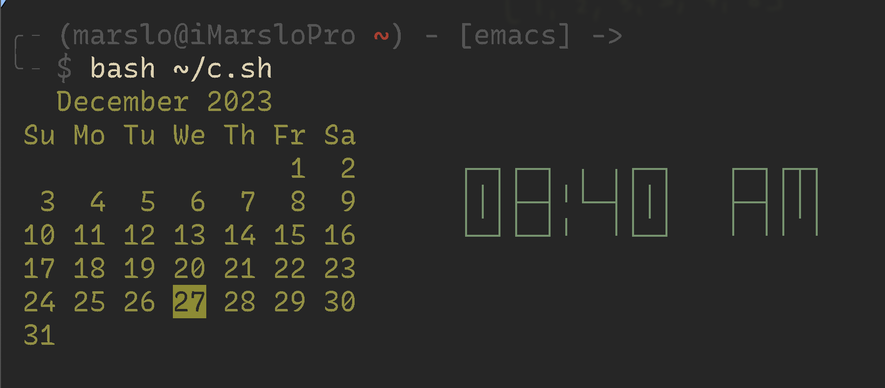

<!-- START doctoc generated TOC please keep comment here to allow auto update -->
<!-- DON'T EDIT THIS SECTION, INSTEAD RE-RUN doctoc TO UPDATE -->

- [terminal](#terminal)
  - [terminal info](#terminal-info)
  - [reset terminal](#reset-terminal)
- [`tput`](#tput)
- [`stty`](#stty)
- [`tty` ( teletypewriter )](#tty--teletypewriter-)
- [`tabs`](#tabs)

<!-- END doctoc generated TOC please keep comment here to allow auto update -->

## terminal

> [!NOTE]
> - [bash-hackers.org](bash-hackers.org)
> - [terminfo Directory](https://sites.ualberta.ca/dept/chemeng/AIX-43/share/man/info/C/a_doc_lib/files/aixfiles/terminfo.htm#A72P01a)
> - [man terminfo](https://invisible-island.net/ncurses/man/terminfo.5.html)
> - [man infocmp](https://invisible-island.net/ncurses/man/infocmp.1m.html)
> - [man term](https://invisible-island.net/ncurses/man/term.7.html)
> - [man tset/reset](https://invisible-island.net/ncurses/man/tset.1.html)
> - [stty](https://pubs.opengroup.org/onlinepubs/9699919799/utilities/stty.html)
> - [tty](https://www.freebsd.org/cgi/man.cgi?query=tty&apropos=0&sektion=4&manpath=SunOS+4.1.3&arch=default&format=html)
> - [ttys](https://www.freebsd.org/cgi/man.cgi?query=ttys&apropos=0&sektion=5&manpath=SunOS+4.1.3&arch=default&format=html)

### terminal info


> references:
> - [How To Install rxvt-unicode-terminfo on CentOS 8](https://installati.one/centos/8/rxvt-unicode-terminfo/)


- list info
  ```bash
  $ terminfo -f
  $ terminfo -W
  ```

### reset terminal

> [!NOTE]
> - [Shell does not show typed-in commands, what do I do to fix it?](https://askubuntu.com/a/1238357/92979)

```bash
$ stty sane
# or
$ stty echo

# or
$ reset
# or
$ tset
```

## `tput`

> [!NOTE]
> - [tput](https://linuxcommand.org/lc3_adv_tput.php)
> - [* tput: Portable Terminal Control](https://www.gnu.org/software/termutils/manual/termutils-2.0/html_chapter/tput_1.html)
> - controlling
>
> |      CAPNAME      | DESCRIPTION                                |
> |:-----------------:|--------------------------------------------|
> |        `sc`       | Save the cursor position                   |
> |        `rc`       | Restore the cursor position                |
> |       `home`      | Move the cursor to upper left corner (0,0) |
> | `cup <row> <col>` | Move the cursor to position row, col       |
> |       `cud1`      | Move the cursor down 1 line                |
> |       `cuu1`      | Move the cursor up 1 line                  |
> |      `civis`      | Set to cursor to be invisible              |
> |      `cnorm`      | Set the cursor to its normal state         |
>
> - [text effects](https://linuxcommand.org/lc3_adv_tput.php)
>
> |     CAPNAME     | DESCRIPTION             |
> |:---------------:|-------------------------|
> |      `bold`     | Start bold text         |
> |      `smul`     | Start underlined text   |
> |      `rmul`     | End underlined text     |
> |      `rev`      | Start reverse video     |
> |     `blink`     | Start blinking text     |
> |     `invis`     | Start invisible text    |
> |      `smso`     | Start “standout” mode   |
> |      `rmso`     | End “standout” mode     |
> |      `sgr0`     | Turn off all attributes |
> | `setaf <value>` | Set foreground color    |
> | `setab <value>` | Set background color    |
>
> - [Text Color](https://linuxcommand.org/lc3_adv_tput.php)
>
> | VALUE | COLOR                  |
> |:-----:|------------------------|
> |  `0`  | Black                  |
> |  `1`  | Red                    |
> |  `2`  | Green                  |
> |  `3`  | Yellow                 |
> |  `4`  | Blue                   |
> |  `5`  | Magenta                |
> |  `6`  | Cyan                   |
> |  `7`  | White                  |
> |  `8`  | Not used               |
> |  `9`  | Reset to default color |
>
> - [Clearing the Screen](https://linuxcommand.org/lc3_adv_tput.php)
>
> | CAPNAME | DESCRIPTION                                        |
> |:-------:|----------------------------------------------------|
> | `smcup` | Save screen contents                               |
> | `rmcup` | Restore screen contents                            |
> |   `el`  | Clear from the cursor to the end of the line       |
> |  `el1`  | Clear from the cursor to the beginning of the line |
> |   `ed`  | Clear from the cursor to the end of the screen     |
> | `clear` | Clear the entire screen and home the cursor        |
>
> - cursor action:
>
> |   Name  | Termcap Equiv. | Description                                    |
> |:-------:|:--------------:|------------------------------------------------|
> | `civis` |      `vi`      | Make cursor invisible                          |
> | `cvvis` |      `vs`      | Make cursor very visible                       |
> | `cnorm` |      `ve`      | Make cursor normal (undo `cvvis' & `civis)'    |
> |  `cuf`  |      `RI`      | Move cursor right #1 spaces (P*)               |
> |  `cuf1` |      `nd`      | Move cursor right one space                    |
> |  `cub`  |      `LE`      | Move cursor left #1 spaces (P)                 |
> |  `cub1` |      `le`      | Move cursor left one space                     |
> |  `cuu`  |      `UP`      | Move cursor up #1 lines (P*)                   |
> |  `cuu1` |      `up`      | Move cursor up one line                        |
> |  `cud`  |      `DO`      | Move cursor down #1 lines (P*)                 |
> |  `cud1` |      `do`      | Move cursor down one line                      |
> |  `cup`  |      `cm`      | Move cursor to row #1, column #2 of screen (P) |
> | `mrcup` |      `CM`      | Move cursor to row #1, column #2 of memory (P) |
> |  `vpa`  |      `cv`      | Move cursor to row #1 (P)                      |
> |  `hpa`  |      `ch`      | Move cursor to column #1 (P)                   |
> |  `home` |      `ho`      | Home cursor (if no `cup')                      |
> |   `hd`  |      `hd`      | Move cursor down one-half line                 |
> |   `hu`  |      `hu`      | Move cursor up one-half line                   |
> |   `sc`  |      `sc`      | Save cursor position                           |
> |   `rc`  |      `rc`      | Restore cursor to position of last `sc'        |
> | `sgr0`  |      `me`      | Turn off all attributes                        |
> |  `ll`   |      `ll`      | Go to last line, first column (if no `cup`)    |
>
> - samples
>   - [AdaRoseCannon/todo-repl](https://gist.github.com/AdaRoseCannon/1165e64d83ccf85f2f8638d0629bf4b3)
>   - [slumos/xtctl](https://gist.github.com/slumos/a8907d067bbc128dfa40)
>   - [zhgqthomas/ssr-install.sh](https://gist.github.com/zhgqthomas/67d1191e8ac42ca9c84c2d8bd09598be)
>   - [izabera/mappings](https://gist.github.com/izabera/6a1e58b22e33a496457e)

- move sequence to top
  ```bash
  $ tput home
  # or
  $ tput cup 0 0
  # or
  $ tput cup %py %px >/dev/tty
  ```

- show info
  ```bash
  $ tput -T screen longname
  VT 100/ANSI X3.64 virtual terminal

  $ tput longname
  xterm with 256 colors

  $ echo "Rows=$(tput lines) Cols=$(tput cols)"
  Rows=30 Cols=104
  ```

- set cursor
  ```bash
  # invisible
  $ tput civis
  # normal
  $ tput cnorm
  ```

- text color
  ```bash
  for fg_color in {0..255}; do
    set_foreground=$(tput setaf $fg_color)
    for bg_color in {0..7}; do
        set_background=$(tput setab $bg_color)
        echo -n $set_background$set_foreground
        printf ' F:%s B:%s ' $fg_color $bg_color
    done
    echo $(tput sgr0)
  done
  ```

  - PS1

    > [!NOTE|label:references:]
    > - [How can I print text in various colors?](https://mywiki.wooledge.org/BashFAQ/037)

    ```bash
    red=$(tput setaf 1)
    green=$(tput setaf 2)
    blue=$(tput setaf 4)
    reset=$(tput sgr0)
    PS1='\[$red\]\u\[$reset\]@\[$green\]\h\[$reset\]:\[$blue\]\w\[$reset\]\$ '
    ```

- shows tput processing in one invocation
  ```bash
  $ tput -S <<!
    clear
    cup 10 10
    bold
    !

  # or
  $ tput -S <<EOF
    sc
    cup $line $column
    rev
    EOF
  %p1%d;%p2%dH
  ```

- print in center of line
  ```bash
  COLUMNS=`tput cols` export COLUMNS # Get screen width.
  echo "$@" | awk '
  { spaces = ('$COLUMNS' - length) / 2
    while (spaces-- > 0) printf (" ")
    print
  }'
  ```

- print in center of terminal
  ```bash
  COLUMNS=`tput cols`
  LINES=`tput lines`
  line=`expr $LINES / 2`
  column=`expr \( $COLUMNS - 6 \) / 2`
  tput sc
  tput cup $line $column
  tput rev
  echo 'Hello, World'
  tput sgr0
  tput rc
  ```

- `tput_menu` : script for clean screen

  <!--sec data-title="tput-menu" data-id="section0" data-show=true data-collapse=true ces-->
  ```bash
  BG_BLUE="$(tput setab 4)"
  BG_BLACK="$(tput setab 0)"
  FG_GREEN="$(tput setaf 2)"
  FG_WHITE="$(tput setaf 7)"

  # save screen
  tput smcup

  # display menu until selection == 0
  while [[ $REPLY != 0 ]]; do
    echo -n ${BG_BLUE}${FG_WHITE}
    clear
    cat <<- _EOF_
      Please Select:

      1. Display Hostname and Uptime
      2. Display Disk Space
      3. Display Home Space Utilization
      0. Quit

  _EOF_

    read -p "Enter selection [0-3] > " selection

    # clear area beneath menu
    tput cup 10 0
    echo -n ${BG_BLACK}${FG_GREEN}
    tput ed
    tput cup 11 0

    # act on selection
    case $selection in
      1)  echo "Hostname: $HOSTNAME"
          uptime
          ;;
      2)  df -h
          ;;
      3)  if [[ $(id -u) -eq 0 ]]; then
            echo "Home Space Utilization (All Users)"
            du -sh /home/* 2> /dev/null
          else
            echo "Home Space Utilization ($USER)"
            du -s $HOME/* 2> /dev/null | sort -nr
          fi
          ;;
      0)  break
          ;;
      *)  echo "Invalid entry."
          ;;
    esac
    printf "\n\npress any key to continue."
    read -n 1
  done

  # restore screen
  tput rmcup
  echo "Program terminated."
  ```
  <!--endsec-->

- now

  > [!NOTE]
  > - [now bash script](https://askubuntu.com/a/1020693/92979)
  > - [now bash script](https://unix.stackexchange.com/a/434701/29178)

  

  <!--sec data-title="show now" data-id="section1" data-show=true data-collapse=true ces-->
  ```bash
  #!/usr/bin/env bash

  dataColumn=1
  timeColumn=27
  tput sc                    # save cursor position.

  #--------- DATE -------------------------------------------------------------
  tput rc                    # restore saved cursor position.
  cal | tr -cd '\11\12\15\40\60-\136\140-\176' > /tmp/terminal

  calLineCnt=1
  Today=$(date +"%e")

  printf "\033[32m"           # color green -- see list above.

  while IFS= read -r Cal; do
    printf "%s" "$Cal"
    if [[ $calLineCnt -gt 2 ]] ; then
      tput cub 22                   # see if today is on current line & invert background
      for (( j=0 ; j <= 18 ; j += 3 )) ; do
        Test=${Cal:$j:2}            # Current day on calendar line
        if [[ "$Test" == "$Today" ]] ; then
          printf "\033[7m"          # reverse: [7m
          printf "%s" "$Today"
          printf "\033[0m"          # normal: [0m
          printf "\033[32m"         # color green -- see list above.
          tput cuf 1
        else
          tput cuf 3
        fi
      done
    fi

    tput cud1                 # down one line
    tput cuf $dataColumn      # move 27 columns right
    calLineCnt=$((++calLineCnt))
  done < /tmp/terminal

  printf "\033[00m"           # color -- bright white (default)
  echo ""

  tput rc                     # restore saved cursor position.

  #-------- TIME --------------------------------------------------------------

  tput sc                     # save cursor position.
  tput cuu 7                  # move up 9 lines
  tput cuf $timeColumn        # move 49 columns right

  if hash toilet 2>/dev/null; then                          # if has toilet
     date +"%I:%M %P" | toilet -f future  > /tmp/terminal
  elif hash figlet 2>/dev/null; then                        # if has figlet
     date +"%I:%M %P" | figlet > /tmp/terminal
  else
     date +"%I:%M %P" > /tmp/terminal
  fi

  while IFS= read -r Time; do
    printf "\033[01;36m"    # color cyan
    printf "%s" "$Time"
    tput cud1               # Up one line
    tput cuf $timeColumn    # Move 49 columns right
  done < /tmp/terminal

  tput rc                     # Restore saved cursor position.

  exit 0
  ```
  <!--endsec-->

## `stty`

> [!NOTE|label:references:]
> - [19.2 stty: Print or change terminal characteristics](https://www.gnu.org/software/coreutils/manual/html_node/stty-invocation.html)
> - [Shell does not show typed-in commands, what do I do to fix it?](https://askubuntu.com/a/1238357/92979)
> - [stty : set or display terminal options](https://www.mkssoftware.com/docs/man1/stty.1.asp)
> - [Linux in a Nutshell.pdf](https://repo.zenk-security.com/Linux%20et%20systemes%20d.exploitations/Linux-in-a-Nutshell-6th-Edition.pdf)
> - [man pages section 1: User Commands: stty (1g)](https://docs.oracle.com/cd/E36784_01/html/E36870/stty-1g.html)
> - [Local Modes](https://sites.ualberta.ca/dept/chemeng/AIX-43/share/man/info/C/a_doc_lib/cmds/aixcmds5/stty.htm)
>
> |   OPTION   | COMMENTS                                                                                                                                                                                                                                                                                                                          |
> |:----------:|-----------------------------------------------------------------------------------------------------------------------------------------------------------------------------------------------------------------------------------------------------------------------------------------------------------------------------------|
> |   `echo`   | Echoes every character typed.                                                                                                                                                                                                                                                                                                     |
> |   `-echo`  | Does not echo characters.                                                                                                                                                                                                                                                                                                         |
> |  `echoctl` | Echoes control characters as ^X (Ctrl-X), where X is the character given by adding 100 octal to the code of the control character.                                                                                                                                                                                                |
> | `-echoctl` | Does not echo control characters as ^X (Ctrl-X).                                                                                                                                                                                                                                                                                  |
> |   `echoe`  | Echoes the ERASE character as the "backspace space backspace" string.                                                                                                                                                                                                                                                             |
> |  `-echoe`  | Does not echo the ERASE character, just backspace.                                                                                                                                                                                                                                                                                |
> |   `echok`  | Echoes a NL character after a KILL character.                                                                                                                                                                                                                                                                                     |
> |  `-echok`  | Does not echo a NL character after a KILL character.                                                                                                                                                                                                                                                                              |
> |  `echoke`  | Echoes the KILL character by erasing each character on the output line.                                                                                                                                                                                                                                                           |
> |  `-echoke` | Just echoes the KILL character.                                                                                                                                                                                                                                                                                                   |
> |  `echonl`  | Echoes the NL character.                                                                                                                                                                                                                                                                                                          |
> |  `-echonl` | Does not echo the NL character.                                                                                                                                                                                                                                                                                                   |
> |  `echoprt` | Echoes erased characters backwards with / (slash) and \ (backslash).                                                                                                                                                                                                                                                              |
> | `-echoprt` | Does not echo erased characters backwards with / (slash) and \ (backslash).                                                                                                                                                                                                                                                       |
> |  `icanon`  | Enables canonical input (canonical input allows input-line editing with the ERASE and KILL characters). See the discussion about canonical mode input in Line Discipline Module (ldterm) AIX Version 4.3 Communications Programming Concepts.                                                                                     |
> |  `-icanon` | Disables canonical input.                                                                                                                                                                                                                                                                                                         |
> |  `iexten`  | Specifies that implementation-defined functions shall be recognized from the input data. Recognition of the following control characters requires iexten to be set: eol2, dsusp, reprint, discard, werase, lnext. The functions associated with these modes also require iexten to be set: imaxbel, echoke, echoprt, and echoctl. |
> |  `-iexten` | Specifies that implementation-defined functions shall not be recognized from the input data.                                                                                                                                                                                                                                      |
> |   `isig`   | Enables the checking of characters against the special control characters INTR, SUSP and QUIT special control characters.                                                                                                                                                                                                         |
> |   `-isig`  | Disables the checking of characters against the special control characters INTR, SUSP and QUIT special control characters.                                                                                                                                                                                                        |
> |  `noflsh`  | Does not clear buffers after INTR, SUSP, or QUIT control characters.                                                                                                                                                                                                                                                              |
> |  `-noflsh` | Clears buffers after INTR, SUSP, or QUIT control characters.                                                                                                                                                                                                                                                                      |
> |  `pending` | Causes any input that is pending after a switch from raw to canonical mode to be re-input the next time a read operation becomes pending or the next time input arrives. Pending is an internal state bit.                                                                                                                        |
> | `-pending` | No text is pending.                                                                                                                                                                                                                                                                                                               |
> |  `tostop`  | Signals SIGTOU for background output.                                                                                                                                                                                                                                                                                             |
> |  `-tostop` | Does not signal SIGTOU for background output.                                                                                                                                                                                                                                                                                     |
> |   `xcase`  | Echoes uppercase characters on input, and displays uppercase characters on output with a preceding \ (backslash).                                                                                                                                                                                                                 |
> |  `-xcase`  | Does not echo uppercase characters on input.                                                                                                                                                                                                                                                                                      |

- show all
  ```bash
  $ stty -a
  speed 38400 baud; rows 30; columns 104;
  intr = ^C; quit = ^\; erase = ^?; kill = ^U; eof = ^D; eol = <undef>; eol2 = <undef>; start = ^Q;
  stop = ^S; susp = ^Z; dsusp = ^Y; rprnt = ^R; werase = ^W; lnext = ^V; discard = ^O; status = ^T;
  min = 1; time = 0;
  -parenb -parodd cs8 hupcl -cstopb cread -clocal -crtscts
  -ignbrk brkint -ignpar -parmrk -inpck -istrip -inlcr -igncr icrnl -ixon ixoff ixany imaxbel iutf8
  opost -ocrnl onlcr -onocr -onlret -ofill -ofdel nl0 cr0 tab0 bs0 vt0 ff0
  isig icanon iexten echo echoe echok -echonl -noflsh -tostop -echoprt echoctl echoke -flusho -extproc
  ```

- show size
  ```bash
  $ stty size
  30 104
  ```

- enable/disable echo
  ```bash
  $ stty echo    # or stty sane
  $ stty -echo
  ```

## `tty` ( teletypewriter )

> [!NOTE|label:references:]
> - [19.4 tty: Print file name of terminal on standard input](https://www.gnu.org/software/coreutils/manual/html_node/tty-invocation.html)
> - [What are pseudo terminals (pty/tty)?](https://unix.stackexchange.com/a/21149/29178)
> - [The TTY demystified](https://www.linusakesson.net/programming/tty/index.php) | [解密tty](https://www.cnblogs.com/liqiuhao/p/9031803.html)
> - [终端、Shell、tty 和控制台（console）有什么区别？](https://www.zhihu.com/question/21711307)
> - [Linux终端和Line discipline图解](https://blog.csdn.net/dog250/article/details/78818612)
> - [彻底理解Linux的各种终端类型以及概念](https://blog.csdn.net/dog250/article/details/78766716)
> - [printf的归宿-数据打印到哪儿了](https://blog.csdn.net/dog250/article/details/23000909)

## `tabs`

> [!NOTE|label:references]
> - [tabs: Setting Terminal Tabs](https://www.gnu.org/software/termutils/manual/termutils-2.0/html_chapter/tput_2.html#SEC10)
