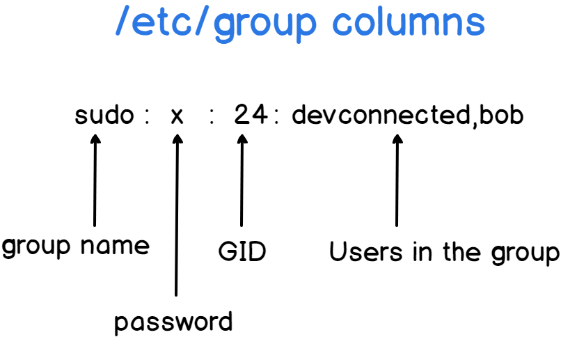
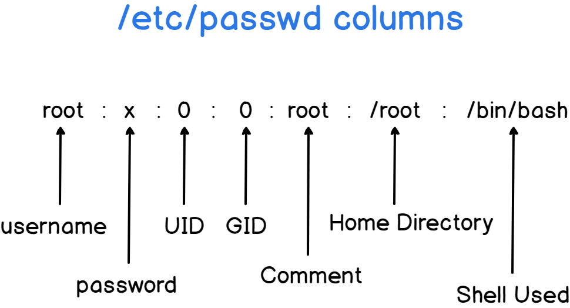
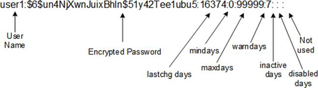

<!-- START doctoc generated TOC please keep comment here to allow auto update -->
<!-- DON'T EDIT THIS SECTION, INSTEAD RE-RUN doctoc TO UPDATE -->
**Table of Contents**  *generated with [DocToc](https://github.com/thlorenz/doctoc)*

- [hardware spec](#hardware-spec)
  - [os](#os)
  - [hardware](#hardware)
  - [cpu](#cpu)
  - [memory](#memory)
  - [bios](#bios)
  - [disk](#disk)
  - [network](#network)
  - [environment variables](#environment-variables)
- [get system info](#get-system-info)
  - [top](#top)
  - [ps](#ps)
- [set system info](#set-system-info)
  - [clear duplicated PATH](#clear-duplicated-path)
  - [set dns for ubuntu](#set-dns-for-ubuntu)
  - [disable firewall](#disable-firewall)
  - [change net.bridge](#change-netbridge)
  - [off swap](#off-swap)
  - [disable selinux](#disable-selinux)
  - [confined and unconfined users](#confined-and-unconfined-users)
- [process](#process)
  - [find the zombie process](#find-the-zombie-process)
  - [about `whatis`](#about-whatis)
- [user management](#user-management)
  - [sssd to use LDAP](#sssd-to-use-ldap)
  - [local user](#local-user)
  - [`subuid` & `subgid`](#subuid--subgid)
  - [local group](#local-group)
  - [get gid](#get-gid)
  - [logout](#logout)
  - [others](#others)
- [system encoding](#system-encoding)
  - [setup via environment](#setup-via-environment)
  - [setup via `locale` command](#setup-via-locale-command)
  - [locales](#locales)
  - [langpacks](#langpacks)
- [terminal info](#terminal-info)
  - [list info](#list-info)
- [applications](#applications)
- [Q&A](#qa)
  - [yum issue after python upgrade to 3.x](#yum-issue-after-python-upgrade-to-3x)
  - [ls: Argument list too long](#ls-argument-list-too-long)
- [others](#others-1)
  - [cockpit](#cockpit)

<!-- END doctoc generated TOC please keep comment here to allow auto update -->



> references:
> - [Environment Variables](https://help.ubuntu.com/community/EnvironmentVariables#The_LANGUAGE_priority_list)
> - [16 Commands to Check Hardware Information on Linux](https://www.binarytides.com/linux-commands-hardware-info/)
> - [Using Commands to Display System Information](https://docs.oracle.com/cd/E19455-01/805-7229/6j6q8svf4/index.html)
> - [30 Useful Linux Commands for System Administrators](https://www.tecmint.com/useful-linux-commands-for-system-administrators/)
> - [90 Linux Commands frequently used by Linux Sysadmins](https://haydenjames.io/90-linux-commands-frequently-used-by-linux-sysadmins/)
> - [50 UNIX / Linux Sysadmin Tutorials](https://www.thegeekstuff.com/2010/12/50-unix-linux-sysadmin-tutorials/)
> - [50 Most Frequently Used UNIX / Linux Commands (With Examples)](https://www.thegeekstuff.com/2010/11/50-linux-commands/)
> - [Top 25 Best Linux Performance Monitoring and Debugging Tools](https://www.thegeekstuff.com/2011/12/linux-performance-monitoring-tools/)
> - [dmidecode – A Best Tool to Get System Hardware Information on Linux](https://www.2daygeek.com/dmidecode-command-find-get-check-linux-system-hardware-information/)
> - [17 Ways to check size of physical memory (RAM) in Linux](https://www.2daygeek.com/easy-ways-to-check-size-of-physical-memory-ram-in-linux/)
> - [Top 15 tools to monitor disk IO performance with examples](https://www.golinuxcloud.com/monitor-disk-io-performance-statistics-linux/)
> - [How To Find Linux System Details Using inxi](https://ostechnix.com/how-to-find-your-system-details-using-inxi/)
> - [Tutorial: Beginners guide on linux memory management](https://www.golinuxcloud.com/tutorial-linux-memory-management-overview/)
>   - [Buffers vs Page cache](https://www.golinuxcloud.com/tutorial-linux-memory-management-overview/#Buffers_vs_Page_cache)
>   - [Understanding Dirty Page](https://www.golinuxcloud.com/tutorial-linux-memory-management-overview/#Understanding_Dirty_Page)
>   - [Understanding Active and Inactive Memory](https://www.golinuxcloud.com/tutorial-linux-memory-management-overview/#Understanding_Active_and_Inactive_Memory)
>   - [Different types of swapping scenarios and risks](https://www.golinuxcloud.com/tutorial-linux-memory-management-overview/#Different_types_of_swapping_scenarios_and_risks)
>
> drop caches
> ```bash
> $ sudo bash -c "echo 3 > /proc/sys/vm/drop_caches"
> ```


## hardware spec

> [!TIP]
> list info
> - `glances`
> - `hwinfo`
> - `lshw`
> - `lscpu`
> - `lsmem`
> - `lspci`
> - `lsscsi`
> - `lsusb`
> - `inxi` ( `inxi --recommends`, `inxi -F|--full` )
> - `lsblk`
> - `lsof`
> - `ncdu` - a disk utility for Unix systems
> - `fdisk`
> - `blkid` - command-line utility to locate/print block device attributes
> - `mount`
> - `free`
> - `dmidecode`
> - `hdparm`
> - `lstopo-no-graphics`
> - `hwloc-ls`
> - `/proc`
>   - `/proc/cpuinfo`
>   - `/proc/meminfo`
>   - `/proc/version`
>   - `/proc/scsi/scsi`
>   - `/proc/partitions`
> performance & analysis
> - [* imarslo : adminTools](../devops/adminTools.html)
> - `vmstat` - shows system memory, processes, interrupts, paging, block I/O, and CPU info
> - `iostat` - for storage I/O statistics.
> - `iotop` - interactive I/O viewer. Get an overview of storage r/w activity
> - `netstat` – for network statistics
> - `iftop` - network traffic viewer
> - `nload` - a super simple, command-line network interface monitoring tool
> - `mtr` - network diagnostic tool
> - `dig` - DNS lookup utility tool
> - `nethogs` - network traffic analyzer
> - `apropos` - search man page names and descriptions
> - `fsck` - tool for checking the consistency of a file system
> - `vnstat`
> - `dstat`
> - `mpstat`
> - `ss` - socket statistics
> - `sar`
> - `nethogs` - network traffic analyzer


> lshw Classes
> - `address`
> - `bridge`
> - `bus`
> - `communication`
> - `disk`
> - `display`
> - `generic`
> - `input`
> - `memory`
> - `multimedia`
> - `network`
> - `power`
> - `printer`
> - `processor`
> - `storage`
> - `system`
> - `tape`
> - `volume`


### os
```bash
$ lsb_release -a
LSB Version    : :core-4.1-amd64:core-4.1-noarch
Distributor ID : CentOS
Description    : CentOS Linux release 7.9.2009 (Core)
Release        : 7.9.2009
Codename       : Core

$ uname  -a
Linux my-computer 3.10.0-1160.42.2.el7.x86_64 #1 SMP Tue Sep 7 14:49:57 UTC 2021 x86_64 x86_64 x86_64 GNU/Linux

$ cat /etc/centos-release
CentOS Linux release 7.9.2009 (Core)
```

### hardware
```bash
$ sudo dmidecode -s
```

- [portable hardware locality](https://www.open-mpi.org/projects/hwloc/)

  > [!TIP]
  > - [lstopo command in Linux](https://iq.opengenus.org/lstopo-in-linux/)

  ```bash
  $ sudo yum install -y hwloc
  $ lstopo-no-graphics
  $ hwloc-ls
  $ hwloc-info
  $ lstopo-no-graphics -p
  ```

#### system information
```bash
$ sudo dmidecode | grep -A5 '^System Information'
  System Information
    Manufacturer: HPE
    Product Name: ProLiant DL380 Gen10
    Version: Not Specified
    Serial Number: S*************0
    UUID: 0******0-0**0-0**0-0**0-3**********e

# or Display System [M]anufacture
$ inxi -M
    Machine:   Type: Server Mobo: HPE model: ProLiant DL380 Gen10 serial: <root required> UEFI: HPE v: U30
               date: 06/15/2018
# or
$ sudo inxi --dmidecode -Mxxx
    Machine:   Type: Rack Mount Chassis Mobo: HPE model: ProLiant DL380 Gen10 serial: PFARA%%LMAZ6XB BIOS: HPE
           v: U30 rev: 1.40 date: 06/15/2018 rom size: 16384 kB
```

#### manufacturer
```bash
$ sudo dmidecode -s system-manufacturer
    HPE

# or
$ sudo dmidecode -s baseboard-manufacturer
HPE

# or
$ cat /sys/devices/virtual/dmi/id/sys_vendor
HPE
```

#### product name and version

#### product name only
```bash
$ sudo dmidecode -s system-product-name
    ProLiant DL380 Gen10

# or
$ sudo dmidecode -s baseboard-product-name
ProLiant DL380 Gen10

# or
$ cat /sys/devices/virtual/dmi/id/product_name
ProLiant DL380 Gen10

# or
$ sudo dmidecode | grep -i prod
        Product Name: Vostro 5560
        Product Name: 04YDT0
```

#### uuid
```bash
$ sudo dmidecode | grep -i uuid | awk '{print $2}' | tr '[:upper:]' '[:lower:]'
```

### cpu


> references:
> - [How to know number of cores of a system in Linux?](https://unix.stackexchange.com/a/279354/29178)
> - [How to find out the number of CPU & Cores of your Linux machine](https://www.ryadel.com/en/cpu-cores-threads-number-linux-centos-virtual-machine/)


#### [cpu cores](https://www.ryadel.com/en/cpu-cores-threads-number-linux-centos-virtual-machine/)
```bash
$ cat /proc/cpuinfo | egrep "core id|physical id" | tr -d "\n" | sed s/physical/\\nphysical/g | grep -v ^$ | sort | uniq | wc -l
36

# or
$ grep -c processor /proc/cpuinfo
32

# or
$ nproc --all
32

# or
$ getconf _NPROCESSORS_ONLN
32

# or
$ cat /sys/devices/system/cpu/present
0-31

# or CPUs = Threads per core X cores per socket X socket
$ lscpu | grep -E '^Thread|^Core|^Socket|^CPU\('
CPU(s):                32
Thread(s) per core:    2
Core(s) per socket:    8
Socket(s):             2

# or
$ sudo dmidecode -t 4 | grep -E 'Socket Designation|Count'
  Socket Designation: CPU1
  Core Count: 8
  Thread Count: 16
  Socket Designation: CPU2
  Core Count: 8
  Thread Count: 16
```

- others
  ```bash
  $ lscpu --all --extended
  $ lscpu --all --parse=CPU,SOCKET,CORE | grep -v '^#'
  ```

#### check CPU support 64 bit or not
```bash
$ sudo dmidecode --type=processor | grep -i -A 1 Characteristics
    Characteristics:
            64-bit capable
```

#### `cat /proc/cpuinfo`
```bash
$ lscpu
Architecture:          i686
CPU op-mode(s):        32-bit, 64-bit
Byte Order:            Little Endian
CPU(s):                4
On-line CPU(s) list:   0-3
....
```

#### cpu info
```bash
$ sudo dmidecode -t processor

# or
$ sudo lshw -C cpu

# or
$ sudo dmidecode -t 4 | egrep -i "Designation|Intel|core|thread"

# or
$ inxi -C
CPU:
  Info: 2x 8-core model: Intel Xeon E5-2667 v4 bits: 64 type: MT MCP SMP cache: L2: 2x 2 MiB (4 MiB)
  Speed (MHz): avg: 1324 min/max: 1200/3600 cores: 1: 1202 2: 1202 3: 1251 4: 1200 5: 1201
    6: 1376 7: 1260 8: 1205 9: 1203 10: 1202 11: 1201 12: 1201 13: 1201 14: 1202 15: 1201 16: 1202
    17: 1200 18: 1200 19: 1600 20: 1199 21: 1201 22: 1287 23: 1892 24: 1201 25: 1200 26: 1201
    27: 3200 28: 1200 29: 1200 30: 1701 31: 1201 32: 1200
```

### memory


> references:
> - [Find Out the Total Physical Memory (RAM) on Linux](https://www.baeldung.com/linux/total-physical-memory)
> - [17 Ways to check size of physical memory (RAM) in Linux](https://www.2daygeek.com/easy-ways-to-check-size-of-physical-memory-ram-in-linux/)
> - [free – A standard command to check memory usage statistics in Linux](https://www.2daygeek.com/free-command-to-check-memory-usage-statistics-in-linux/)
> - [nmon – A Nifty Tool To Monitor System Resources On Linux](https://www.2daygeek.com/nmon-system-performance-monitor-system-resources-on-linux/)
>
> - RAM: Random Access Memory is a temporary memory. This information will go away when the computer is turned off.
> - ROM: Read Only Memory is permanent memory, that holds the data even if the system is switched off.


#### list total memory
```bash
$ hwinfo --memory | grep 'Memory Size'
  Memory Size: 128 GB

$ sudo lshw -short | grep 'System Memory'
/0/2c                           memory         128GiB System Memor

$ vmstat -s -S M | egrep -ie 'total memory'
       128817 M total memory

$ vmstat -s | grep "total memory"
    131909608 K total memory

$ vmstat -s | awk '{print $1 / 1024 / 1024}' | head -1
125.799

$ inxi -F | grep "Memory"
  Processes: 414 Uptime: 87d 17h 40m Memory: 125.8 GiB used: 27.21 GiB (21.6%) Init: systemd

$ sudo dmidecode -t memory | grep  Size: | grep -v "No Module Installed" | awk '{sum+=$2}END{print sum}'
131072

$ egrep 'MemTotal|MemFree|MemAvailable' /proc/meminfo
MemTotal:       131909608 kB
MemFree:        95760488 kB
MemAvailable:   104355708 kB

$ vmstat -s
```

#### list only installed RAM modules
```bash
$ sudo dmidecode -t memory | grep  Size: | grep -v "No Module Installed"
```

#### memory information
```bash
$ sudo dmidecode -t memory

# or
$ sudo lshw -C memory
$ sudo lshw -short -class memory

# Physical Memory Array
$ sudo dmidecode --type 16

# get Memory Device
$ sudo dmidecode --type 17

# Memory Array Mapped Address
$ sudo dmidecode --type 19
```

#### print memory only
```bash
$ ps -o comm,%mem,args -u marslo | more
COMMAND         %MEM COMMAND
gnome-keyring-d  0.0 /usr/bin/gnome-keyring-daemon --daemonize --login
init             0.0 init --user
ssh-agent        0.0 ssh-agent
dbus-daemon      0.0 dbus-daemon --fork --session --address=unix:abstract=/tmp/dbus-i5FUVjzADG
upstart-event-b  0.0 upstart-event-bridge
window-stack-br  0.0 /usr/lib/i386-linux-gnu/hud/window-stack-bridge
upstart-dbus-br  0.0 upstart-dbus-bridge --daemon --session --user --bus-name session
upstart-dbus-br  0.0 upstart-dbus-bridge --daemon --system --user --bus-name system
upstart-file-br  0.0 upstart-file-bridge --daemon --user
ibus-daemon      0.1 /usr/bin/ibus-daemon --daemonize --xim
....
```

#### check memory in time
```bash
$ free -h -s 5

# or
$ vmstat -w

# or
$ dmesg | grep "Memory"
[    0.995127] Memory: 131882904K/134101416K available (12300K kernel code, 2504K rwdata, 3684K rodata, 2340K init, 3240K bss, 2218512K reserved, 0K cma-reserved)
[    1.139890] x86/mm: Memory block size: 2048MB
```

### bios
```bash
$ sudo dmidecode -t bios
```

### disk
- `hwinfo`
  ```bash
  $ hwinfo --disk --only /dev/sda
  192: SCSI 20.0: 10600 Disk
    [Created at block.245]
    Unique ID: R7kM.qzo5k6MLsu5
    Parent ID: svHJ.VbV94345RfA
    SysFS ID: /class/block/sda
    SysFS BusID: 0:2:0:0
    SysFS Device Link: /devices/pci0000:00/0000:00:02.0/0000:03:00.0/host0/target0:2:0/0:2:0:0
    Hardware Class: disk
    Model: "AVAGO SMC3108"
    Vendor: "AVAGO"
    Device: "SMC3108"
    Revision: "4.68"
    Driver: "megaraid_sas", "sd"
    Driver Modules: "megaraid_sas"
    Device File: /dev/sda (/dev/sg1)
    Device Files: /dev/sda, /dev/disk/by-id/scsi-360030480243a18012424538006708dc9, /dev/disk/by-id/wwn-0x60030480243a18012424538006708dc9, /dev/disk/by-path/pci-0000:03:00.0-scsi-0:2:0:0
    Device Number: block 8:0-8:15 (char 21:1)
    BIOS id: 0x80
    Drive status: no medium
    Config Status: cfg=new, avail=yes, need=no, active=unknown
    Attached to: #37 (RAID bus controller)
  ```

#### disk type

> [!INFO]
> Check disk interface types
> - Advanced technology attachment (`ATA`)
> - Integrated Drive Electronics (`IDE`)
> - Serial ATA (`SATA`)
> - Small Computer system interface (`SCSI`)
> - Serial attached SCSI (`SAS`)
> - Fibre Channel

- `lsblk`
  ```bash
  $ lsblk -do name,tran
  NAME TRAN
  sdb  sas
  sdc  sas
  ```

- `lshw`
  ```bash
  $ sudo lshw -c storage -c disk
    ...
    *-sas
         description: Serial Attached SCSI controller
         product: Smart Storage PQI 12G SAS/PCIe 3
         vendor: Adaptec
         physical id: 0
         bus info: pci@0000:5c:00.0
         logical name: scsi1
         version: 01
         width: 64 bits
         clock: 33MHz
         capabilities: sas pm msix pciexpress bus_master cap_list
         configuration: driver=smartpqi latency=0
         resources: irq:32 memory:e9100000-e9107fff ioport:8000(size=256)
       *-disk:0
            description: SCSI Disk                            # SCSC
            product: LOGICAL VOLUME
            vendor: HPE
            physical id: 1.0.0
            bus info: scsi@1:1.0.0
            logical name: /dev/sdb
            version: 1.99
            serial: P************C
            size: 1788GiB (1920GB)
            capabilities: 15000rpm gpt-1.00 partitioned partitioned:gpt
            configuration: ansiversion=5 guid=eda10475-9cdb-44cd-8dbd-28bf482b0e25 logicalsectorsize=512 sectorsize=4096
  ```

- `hdparm`
  ```bash
  $ sudo hdparm -I /dev/sdb

  /dev/sdb:
  SG_IO: bad/missing sense data, sb[]:  7***

  ATA device, with non-removable media
  Standards:
    Likely used: 1
  Configuration:
    Logical   max current
    cylinders 0 0
    heads   0 0
    sectors/track 0 0
    --
    Logical/Physical Sector size:           512 bytes
    device size with M = 1024*1024:           0 MBytes
    device size with M = 1000*1000:           0 MBytes
    cache/buffer size  = unknown
  Capabilities:
    IORDY not likely
    Cannot perform double-word IO
    R/W multiple sector transfer: not supported
    DMA: not supported
    PIO: pio0
  ```

- SSD or HHD

  > [!INFO]
  > - `0`: SSD
  > - `1`: HHD
  > references:
  > - [7 easy methods to check disk type (HDD or SSD) in Linux](https://www.golinuxcloud.com/check-disk-type-linux/)
  > - [How To Find If The Disk Is SSD Or HDD In Linux](https://ostechnix.com/how-to-find-if-the-disk-is-ssd-or-hdd-in-linux/)

  - check rotational
    ```bash
    # HHD
    $ cat /sys/block/sd*/queue/rotational
    1
    1

    # SSD
    $ lsscsi
    [0:0:0:0]    disk    Generic- SD/MMC CRW       1.00  /dev/sda
    [1:0:0:0]    enclosu HPE      Smart Adapter    1.99  -
    [1:1:0:0]    disk    HPE      LOGICAL VOLUME   1.99  /dev/sdb
    [1:1:0:1]    disk    HPE      LOGICAL VOLUME   1.99  /dev/sdc
    [1:2:0:0]    storage HPE      P408i-a SR Gen10 1.99  -
    [devops@dc5-ssdfw11 ~]$ cat /sys/block/sd*/queue/rotational
    1
    0
    0
    ```
  - `lsblk`
    ```bash
    ## SSD
    $ lsblk -d -o name,rota
    NAME ROTA
    sdb     0
    sdc     0

    # or
    ## SSD
    $ lsblk -d -e 7 -o NAME,ROTA,DISC-MAX,MODEL
    NAME ROTA DISC-MAX MODEL
    sdb     0       0B LOGICAL VOLUME
    sdc     0       0B LOGICAL VOLUME
    ## HHD
    $ lsblk -d -e 7 -o NAME,ROTA,DISC-MAX,MODEL
    NAME ROTA DISC-MAX MODEL
    sdb     1       0B SMC3108
    sda     1       0B SMC3108
    ```

  - `smartctl` ( `$ yum install smartmontools` )
    ```bash
    $ sudo smartctl -a /dev/sdb1
    smartctl 7.0 2018-12-30 r4883 [x86_64-linux-4.19.12-1.el7.elrepo.x86_64] (local build)
    Copyright (C) 2002-18, Bruce Allen, Christian Franke, www.smartmontools.org

    === START OF INFORMATION SECTION ===
    Vendor:               AVAGO
    Product:              SMC3108
    Revision:             4.68
    Compliance:           SPC-3
    User Capacity:        7,679,267,307,520 bytes [7.67 TB]
    Logical block size:   512 bytes
    Physical block size:  4096 bytes
    Logical Unit id:      0x60030480243a7b0124d58c0646f9617d
    Serial number:        007d61f946068cd524017b3a24800403
    Device type:          disk
    Local Time is:        Thu Mar 30 10:51:52 2023 PDT
    SMART support is:     Unavailable - device lacks SMART capability.

    === START OF READ SMART DATA SECTION ===
    Current Drive Temperature:     0 C
    Drive Trip Temperature:        0 C

    ## SSD
    $ sudo smartctl -a /dev/sdc
    smartctl 6.6 2017-11-05 r4594 [x86_64-linux-4.18.0-193.28.1.el8_2.x86_64] (local build)
    Copyright (C) 2002-17, Bruce Allen, Christian Franke, www.smartmontools.org

    === START OF INFORMATION SECTION ===
    Vendor:               HPE
    Product:              LOGICAL VOLUME
    Revision:             1.99
    User Capacity:        1,920,349,855,744 bytes [1.92 TB]
    Logical block size:   512 bytes
    Rotation Rate:        Solid State Device                          # SSD
    Logical Unit id:      0x600508b1001c5be1882c0a4afb83c8ec
    Serial number:        P************C
    Device type:          disk
    Local Time is:        Thu Mar 30 10:53:12 2023 PDT
    SMART support is:     Available - device has SMART capability.
    SMART support is:     Enabled
    Temperature Warning:  Disabled or Not Supported

    === START OF READ SMART DATA SECTION ===
    SMART Health Status: OK
    Current Drive Temperature:     0 C
    Drive Trip Temperature:        0 C
    ```

  - `/proc/scsi/scsi`
    ```bash
    ## SSD
    $ cat /proc/scsi/scsi
    Attached devices:
    Host: scsi0 Channel: 00 Id: 00 Lun: 00
      Vendor: Generic- Model: SD/MMC CRW       Rev: 1.00
      Type:   Direct-Access                    ANSI  SCSI revision: 06
    Host: scsi1 Channel: 00 Id: 00 Lun: 00
      Vendor: HPE      Model: Smart Adapter    Rev: 1.99
      Type:   Enclosure                        ANSI  SCSI revision: 05
    Host: scsi1 Channel: 01 Id: 00 Lun: 00
      Vendor: HPE      Model: LOGICAL VOLUME   Rev: 1.99
      Type:   Direct-Access                    ANSI  SCSI revision: 05
    Host: scsi1 Channel: 01 Id: 00 Lun: 01
      Vendor: HPE      Model: LOGICAL VOLUME   Rev: 1.99
      Type:   Direct-Access                    ANSI  SCSI revision: 05
    Host: scsi1 Channel: 02 Id: 00 Lun: 00
      Vendor: HPE      Model: P408i-a SR Gen10 Rev: 1.99
      Type:   RAID                             ANSI  SCSI revision: 05
    ```

#### check status
- `$ lsblk`
- `$ pvs`
- `$ lvs`
- `$ vgs`
- `$ pvscan`
- `$ lvscan`
- `$ pvdisplay`
- `$ vgdisplay`
- `$ lvdisplay`
- `$ fdisk -l`
- `$ sfdisk  -l -uM`
- `$ lshw -class disk`
- `$ hwinfo --block --short`
- `$ cat /proc/partitions`
- `$ sudo hdparm -I /dev/sda`

### network

#### get network cards
```bash
$ sudo lshw -short -class network
H/W path            Device        Class          Description
============================================================
/0/100/1/0          enp1s0f0      network        I350 Gigabit Network Connection
/0/100/1/0.1        enp1s0f1      network        I350 Gigabit Network Connection
/0/100/1.1/0        enp2s0f0      network        Ethernet Controller X710 for 10GbE SFP+
/0/100/1.1/0.1      enp2s0f1      network        Ethernet Controller X710 for 10GbE SFP+
/0/2/0              enp131s0f0    network        Ethernet Controller 10-Gigabit X540-AT2
/0/2/0.1            enp131s0f1    network        Ethernet Controller 10-Gigabit X540-AT2
/3                  veth8c9c4570  network        Ethernet interface
/4                  flannel.1     network        Ethernet interface
/5                  veth8d141a78  network        Ethernet interface
/6                  veth3cc4bf19  network        Ethernet interface
/7                  cni0          network        Ethernet interface
/8                  docker0       network        Ethernet interface
/9                  veth179b5dab  network        Ethernet interface
```

#### network speed
```bash
$ ifstat -n -i en7
       en7
 KB/s in  KB/s out
    7.35      1.15
    4.91      1.02
    6.05      0.80
    8.36      1.78
```

#### get the public ip address
```bash
$ curl ifconfig.me
```

### environment variables
#### show PATH
```bash
$ echo src::${PATH} | awk 'BEGIN{pwd=ENVIRON["PWD"];RS=":";FS="\n"}!$1{$1=pwd}$1!~/^\//{$1=pwd"/"$1}{print $1}'
/home/marslo/src
/home/marslo
/home/marslo/.vim/tools/bin
/usr/local/mysql/bin
/usr/local/bcompare/bin
/usr/lib/lightdm/lightdm
/usr/local/sbin
/usr/local/bin
/usr/sbin
/usr/bin
/sbin
/bin
/usr/games
/usr/local/games
OR
$ echo "${PATH//:/$'\n'}"
```

## get system info


> references:
> - [Shell script to check top memory & cpu consuming process in Linux](https://www.golinuxcloud.com/check-top-memory-cpu-consuming-process-script/)


### top
- batch mode

  > [!TIP]
  > references:
  > - [`top -n1 d2`](https://serverfault.com/a/626909)
  > - [How to Save Top Command Output to a File](https://www.tecmint.com/save-top-command-output-to-a-file/)

  ```bash
  $ top -bn1

  # or
  $ top -n 1 d 2
  ```

  - get only summary of top command
    ```bash
    $ top -bn1 | sed -n '/^top.*/,/^\s*$/p'

    ## or
    $ top -bn1 | sed -e '/^$/Q'
    ```

### ps

> [!TIP]
> references:
> - [Command to check top CPU consuming process](https://www.golinuxcloud.com/check-top-memory-cpu-consuming-process-script/)

- cpu
  ```bash
  $ ps -eocomm,pcpu | egrep -v '(0.0)|(%CPU)'
  systemd          0.2
  rcu_sched        0.2
  sshd             0.5
  java             8.2
  java             0.6
  dockerd         16.1
  docker-containe  0.6
  ...
  ```

- memory
  ```bash
  $ ps -eocomm,pmem | egrep -v '(0.0)|(%MEM)'
  java             0.1
  java             0.1
  java             0.8
  gvfs-udisks2-vo  0.1
  kube-apiserver   0.1
  ```

## set system info
### clear duplicated PATH
```bash
$ export PATH=`echo -n $PATH | awk -v RS=":" '{ if (!x[$0]++) {printf s $0; s=":"} }'`
```

### [set dns for ubuntu](http://askubuntu.com/questions/130452/how-do-i-add-a-dns-server-via-resolv-conf)
```bash
$ cat /etc/resolv.conf
# Dynamic resolv.conf(5) file for glibc resolver(3) generated by resolvconf(8)
# DO NOT EDIT THIS FILE BY HAND -- YOUR CHANGES WILL BE OVERWRITTEN
nameserver 8.8.8.8
nameserver 8.8.4.4
nameserver 127.0.1.1

$ cat /etc/resolvconf/resolv.conf.d/head
# Dynamic resolv.conf(5) file for glibc resolver(3) generated by resolvconf(8)
# DO NOT EDIT THIS FILE BY HAND -- YOUR CHANGES WILL BE OVERWRITTEN
nameserver 8.8.8.8
nameserver 8.8.4.4
$ sudo resolvconf -u

# or
$ cat /etc/dhcp/dhclient.conf | grep "prepend domain-name-servers"
prepend domain-name-servers 8.8.8.8, 8.8.4.4;

# or
$ cat /etc/network/interfaces | grep dns
    dns-nameservers 8.8.8.8 8.8.4.4
```

### disable firewall
```bash
$ sudo systemctl stop firewalld
$ sudo systemctl disable firewalld
$ sudo systemctl mask firewalld
```

- check result
  ```bash
  $ sudo systemctl is-enabled firewalld
  $ sudo systemctl is-active firewalld
  $ sudo firewall-cmd --state
  ```

### change net.bridge
```bash
$ sudo modprobe br_netfilter
$ sudo sysctl net.bridge.bridge-nf-call-iptables=1
$ sudo sysctl net.bridge.bridge-nf-call-ip6tables=1

# or
$ sudo bash -c "cat >  /etc/sysctl.d/k8s.conf" << EOF
net.bridge.bridge-nf-call-ip6tables = 1
net.bridge.bridge-nf-call-iptables = 1
EOF
```

- check status
  ```bash
  $ sudo sysctl --system
  ```

### off swap
```bash
$ sudo swapoff -a
$ sudo bash -c "/usr/bin/sed -e 's:^\\(.*swap.*\\)$:# \\1:' -i /etc/fstab"
```

### disable selinux
```bash
$ setenforce 0
$ sudo bash -c "/usr/bin/sed 's/^SELINUX=enforcing$/SELINUX=permissive/' -i /etc/selinux/config"
```

### [confined and unconfined users](https://access.redhat.com/documentation/en-us/red_hat_enterprise_linux/7/html/selinux_users_and_administrators_guide/sect-security-enhanced_linux-targeted_policy-confined_and_unconfined_users)


> references:
> - [SELinux笔记](https://my.oschina.net/u/589241/blog/2050011)
> - [SELinux/Users and logins](https://wiki.gentoo.org/wiki/SELinux/Users_and_logins)


- installation
  ```bash
  $ yum -y install setools-console
  ```

- setup for exiting account
  ```bash
  $ semanage login -a -s staff_u <account>

  # or
  $ semanage login -a -s staff_u -r s0-s0:c0.c100 <account>
  ```

- Modifying an existing mapping
  ```bash
  $ semanage login -m -s sysadm_u <account>
  ```

- delete a mapping
  ```bash
  $ semanage login -d <account>
  ```

- list mappings
  ```bash
  $ semanage user -l
  ```

## process

### find the zombie process
```bash
$ ps aux | awk '{ print $8 " " $2 " " $11}' | grep -w Z
```

#### sort process by PID
```bash
$ ps -axww
```

#### check the group PID
```bash
$ ps -xj
```

### about `whatis`
```bash
$ whatis whois
whois (1)            - client for the whois directory service
$ whatis which
which (1)            - locate a command
$ whatis whereis
whereis (1)          - locate the binary, source, and manual page files for a command
```

## user management

### [sssd to use LDAP](https://access.redhat.com/documentation/en-us/red_hat_enterprise_linux/8/html/configuring_authentication_and_authorization_in_rhel/configuring-sssd-to-use-ldap-and-require-tls-authentication_configuring-authentication-and-authorization-in-rhel)


> references:
> - sssd
>   - [understanding sssd and its benefits](https://access.redhat.com/documentation/en-us/red_hat_enterprise_linux/8/html/configuring_authentication_and_authorization_in_rhel/understanding-sssd-and-its-benefits_configuring-authentication-and-authorization-in-rhel)
>   - [sssd client-side view](https://access.redhat.com/documentation/en-us/red_hat_enterprise_linux/8/html/configuring_authentication_and_authorization_in_rhel/assembly_sssd-client-side-view_configuring-authentication-and-authorization-in-rhel)
>   - [Configuring an LDAP Client to use SSSD](https://docs.oracle.com/cd/E37670_01/E41138/html/ol_sssd_ldap.html)
>   - [`/etc/sssd/sssd.conf` sample](https://github.com/marslo/iDevOps/blob/master/centos/sssd/sssd.conf)
>   - [Troubleshooting SSSD](https://access.redhat.com/documentation/en-us/red_hat_enterprise_linux/7/html/system-level_authentication_guide/trouble)
>   - [Linux user authentication with SSSD / LDAP](https://aws.nz/best-practice/sssd-ldap/)
>   - [man sss_override](https://jhrozek.fedorapeople.org/sssd/1.13.3/man/sss_override.8.html)
>   - [Setting Password Expiry](https://access.redhat.com/articles/3027531)
>   - [How To Clear The SSSD Cache In Linux](https://www.rootusers.com/how-to-clear-the-sssd-cache-in-linux/)
> - rhel
>   - [Chapter 7. Configuring SSSD](https://access.redhat.com/documentation/en-us/red_hat_enterprise_linux/7/html/system-level_authentication_guide/sssd)
>     - [7.5. Configuring System Services for SSSD](https://access.redhat.com/documentation/en-us/red_hat_enterprise_linux/7/html/system-level_authentication_guide/configuring_services)
>     - [7.5.2. Configuring Services: PAM](https://access.redhat.com/documentation/en-us/red_hat_enterprise_linux/7/html/system-level_authentication_guide/configuring_services#Configuration_Options-PAM_Configuration_Options)
>     - [7.6. SSSD Client-side Views](https://access.redhat.com/documentation/en-us/red_hat_enterprise_linux/7/html/system-level_authentication_guide/sssd-client-side-views)
>   - [13.2. Using and Caching Credentials with SSSD](https://access.redhat.com/documentation/en-us/red_hat_enterprise_linux/6/html/deployment_guide/sssd-introduction#doc-wrapper)
>     - [13.2.2. Setting up the sssd.conf File](https://access.redhat.com/documentation/en-us/red_hat_enterprise_linux/6/html/deployment_guide/about-sssd-conf)
>     - [13.2.23. Creating Domains: Primary Server and Backup Servers](https://access.redhat.com/documentation/en-us/red_hat_enterprise_linux/6/html/deployment_guide/sect-configuring_failover)
>     - [13.2.22. Creating Domains: Access Control](https://access.redhat.com/documentation/en-us/red_hat_enterprise_linux/6/html/deployment_guide/sect-config-sssd-domain-access)
>     - [13.2.28. Managing the SSSD Cache](https://access.redhat.com/documentation/en-us/red_hat_enterprise_linux/6/html/deployment_guide/sssd-cache)
> - pam
>   - [Quickstart: Joining a Linux VM to a domain](https://cloud.google.com/managed-microsoft-ad/docs/quickstart-domain-join-linux)
>   - [additional configuration for identity and authentication providers](https://access.redhat.com/documentation/en-us/red_hat_enterprise_linux/8/html/configuring_authentication_and_authorization_in_rhel/assembly_additional-configuration-for-identity-and-authentication-providers_configuring-authentication-and-authorization-in-rhel#proc_adjusting-how-sssd-interprets-full-user-names_assembly_additional-configuration-for-identity-and-authentication-providers)
>   - [Editing the /etc/pam.d files on Red Hat Enterprise Linux Server](https://www.ibm.com/docs/en/powersc-mfa/1.1?topic=cpmcs-editing-etcpamd-files-red-hat-enterprise-linux-server)
>   - [2.2. PAM Configuration Files](https://access.redhat.com/documentation/en-us/red_hat_enterprise_linux/6/html/managing_smart_cards/pam_configuration_files)


#### check user
```bash
$ sudo sssctl user-checks <username>
user: marslo
action: acct
service: system-auth

SSSD nss user lookup result:
 - user name: marslo
 - user id: 33637
 - group id: 40048
 - gecos: Marslo Jiao (Marslo Jiao)
 - home directory: /home/marslo
 - shell: /bin/bash

InfoPipe operation failed. Check that SSSD is running and the InfoPipe responder is enabled. Make sure 'ifp' is listed in the 'services' option in sssd.conf.InfoPipe User lookup with [marslo] failed.
testing pam_acct_mgmt

pam_acct_mgmt: Success

PAM Environment:
 - no env -

# or
$ getent passwd -s sss marslo
```

#### add user name
```bash
$ sudo /usr/sbin/sss_override user-add <username> -n secondary-username

# verification
$ id secondary-username
# display the override
$ sudo /usr/sbin/sss_override user-show user-name
```

#### override the uid
```bash
# check current uid
$ id -u <username>

# overwride
$ sudo /usr/sbin/sss_override user-add <username> -u <new-uid>
$ sudo /usr/sbin/sss_cache --users
# or
$ sudo /usr/sbin/sss_cache --user <username>
$ sudo systemctl restart sssd
```

#### override the gid
```bash
# check current gid
$ id -g <username>
# or
$ id -nG <username>
# or
$ sudo lid -g <group_name>

# override
$ sudo /usr/sbin/sss_override user-add <username> -g <new-gid>
$ sudo /usr/sbin/sss_cache --users
$ sudo /usr/sbin/sss_cache --user <username>
$ sudo systemctl restart sssd
```

#### override the home directory
```bash
# check current home directory
$ getent passwd <username>

# override
$ sudo /usr/sbin/sss_override user-add <username> -h /new/home/directory
$ sudo systemctl restart sssd
```

#### override the shell attribute
```bash
# check current
$ getent passwd <username>

# override
$ sudo /usr/sbin/sss_override user-add <username> -s /new/shell
$ sudo systemctl restart sssd
```

#### [managing the sssd cache](https://access.redhat.com/documentation/en-us/red_hat_enterprise_linux/6/html/deployment_guide/sssd-cache#sssd-cache-purge)
```bash
# clear the cache and update all records
$ sudo /usr/sbin/sss_cache [-E|--everything]

# clear invalidates cache entries for all user records
$ sudo /usr/sbin/sss_cache [-U|--users]

# clear all cached entries for a particular domain
$ sudo /usr/sbin/sss_cache [-E|--everything] [-d|--domain] <ldap_name>

# purge the records for that specific account and leave the rest of the cache intact
$ sudo /usr/sbin/sss_cache [-u|--user] <username>

# invalidates the cache entry for the specified group
$ sudo /usr/sbin/sss_cache [-g|--group] <groupname>
```

#### remove account


> references:
> - [How do you cleanup after deleting an LDAP user on RHEL 7?](https://unix.stackexchange.com/a/538885/29178)


```bash
$ sudo sss_override user-del [--debug 1..9] <username>
$ sudo /usr/sbin/sss_cache --everything
$ sudo systemctl restart sssd
```

- or
  ```bash
  # get info
  $ loginctl

  # logout
  $ loginctl kill-user <username>
  $ sudo /usr/sbin/sss_cache -u <username>
  $ loginctl terminate-user <username>
  $ sudo pkill -u <username>
  $ systemctl restart sssd
  $ systemctl restart accounts-daemon
  ```

#### backup and restore
```bash
# export
$ /usr/sbin/sss_override user-export user-export.bak
$ /usr/sbin/sss_override group-export group-export.bak

# restore
$ /usr/sbin/sss_override user-import user-import.bak
$ /usr/sbin/sss_override group-import group-import.bak
```

#### list all override
```bash
$ /usr/sbin/sss_override user-find
```

#### [create sssd config](https://serverfault.com/a/749305/129815)


> After this in `/etc/sssd/sssd.conf` file
> Specify `ldap_default_bind_dn` and `ldap_default_authtok` as default bind dn and password respectively, this depends upon your ldap setup.
> <br>
> - references:
> - [Chapter 13. Configuring Authentication](https://access.redhat.com/documentation/en-us/red_hat_enterprise_linux/6/html/deployment_guide/ch-configuring_authentication)


```bash
# optional
$ yum install -y sssd \
                 realmd \
                 oddjob \
                 oddjob-mkhomedir \
                 adcli \
                 samba-common \
                 samba-common-tools \
                 krb5-workstation \
                 openldap-clients \
                 policycoreutils-python \
                 authselect-compat \
                 ntpdate \
                 ntp
$ authselect select sssd
$ authselect select sssd with-mkhomedir
$ systemctl enable oddjobd.service
$ systemctl start oddjobd.service

$ authconfig --enablesssd \
             --enablesssdauth \
             --enablelocauthorize \
             --enableldap \
             --enableldapauth \
             --ldapserver=ldap://ipaserver.example.com:389 \
             --disableldaptls \
             --ldapbasedn=dc=example,dc=com \
             --enablerfc2307bis \
             --enablemkhomedir \
             --enablecachecreds \
             --update
```

#### others


> references:
> - [2.2. PAM Configuration Files](https://access.redhat.com/documentation/en-us/red_hat_enterprise_linux/6/html/managing_smart_cards/pam_configuration_files)
> - [Chapter 4. Hardening Your System with Tools and Services](https://access.redhat.com/documentation/en-us/red_hat_enterprise_linux/7/html/security_guide/chap-hardening_your_system_with_tools_and_services)
> - [21.2.2. Mounting NFS File Systems using autofs](https://access.redhat.com/documentation/en-us/red_hat_enterprise_linux/4/html/system_administration_guide/mounting_nfs_file_systems-mounting_nfs_file_systems_using_autofs)
> - [13.2.28. Managing the SSSD Cache](https://access.redhat.com/documentation/en-us/red_hat_enterprise_linux/6/html/deployment_guide/sssd-cache)


- config files

| file                        | comments                                     |
| --------------------------- | -------------------------------------------- |
| `/etc/krb5.keytab`          | host keytab file                             |
| `/etc/nsswitch.conf`        | Name Service Switch (NSS) configuration file |
| `/etc/sssd/sssd.conf`       | sssd configure file                          |
| `/etc/auto.master`          | mount NFS                                    |
| `/etc/auto.misc`            | automount utility can mount and unmount NFS  |
| `/etc/pam.d/password-auth`  | PAM module                                   |
| `/etc/pam.d/system-auth`    | PAM module                                   |
| `/var/lib/sss/db/*`         | sssd cache                                   |
| `/etc/security/access.conf` | local login access control table             |


- [discovery domain](https://access.redhat.com/documentation/en-us/red_hat_enterprise_linux/7/html/windows_integration_guide/realmd-domain)
  ```bash
  $ realm discover my.com [--server-software=active-directory]
  my.com
    type: kerberos
    realm-name: MY.COM
    domain-name: my.com
    configured: no
    server-software: active-directory
    client-software: sssd
    required-package: oddjob
    required-package: oddjob-mkhomedir
    required-package: sssd
    required-package: adcli
    required-package: samba-common-tools
  ```

- join the system
  ```bash
  $ realm join <my.domain> -U <account> [--membership-software=samba] [--verbose] [--install]
  ```

### local user

### `subuid` & `subgid`

> [!NOTE]
> references:
> - [Podman](https://docs.podman.io/en/latest/markdown/podman.1.html#rootless-mode)

```bash
# rootless mode
$ sudo usermod --add-subuids 10000-75535 USERNAME
$ sudo usermod --add-subgids 10000-75535 USERNAME

# or
$ echo USERNAME:10000:65536 >> /etc/subuid
$ echo USERNAME:10000:65536 >> /etc/subgid
```



> references:
> - [how to list users and groups on linux](https://devconnected.com/how-to-list-users-and-groups-on-linux/)
> - [How to Create Groups in Linux (groupadd Command)](https://linuxize.com/post/how-to-create-groups-in-linux/)
> - [understanding /etc/shadow file format on linux](https://www.cyberciti.biz/faq/understanding-etcshadow-file/)
> - [understanding the /etc/shadow file](https://linuxize.com/post/etc-shadow-file/)
> - [linux: instructions on using commands about user and group on linux](https://techbast.com/2019/06/linux-instructions-on-using-commands-about-user-and-group-on-linux.html)



> find users
> - `/etc/passwd`
> - `/etc/shadow`
> - `/etc/pam.d/passwd`
> more on users
> - [`/etc/login.defs`](https://www.2daygeek.com/understanding-linux-etc-shadow-file-format/)


#### `useradd`


> create user `devops`


```bash
$ useradd -c "comments here" \
          -m \
          -d "/home/devops" \
          -u 1000 \
          -g 1000 \
          -s /bin/bash \
          devops
```
- or
  ```bash
  $ useradd --comment "comments here" \
            --create-home \
            --home-dir /home/devops \
            --shell /bin/bash \
            --uid 1000 \
            --gid 1000 \
            --user-group devops
            devops
  ```

- full steps
  ```bash
  $ uid='1000'
  $ gid='1000'
  $ user='devops'

  $ mkdir -p /home/${user}
  $ chown -R ${uid}:${gid} /home/${user}
  $ groupadd -g ${gid} ${user}
  $ useradd -c "create user ${user}" \
            -d "/home/${user}" \
            -u ${uid} \
            -g ${gid} \
            -m \
            -s /bin/bash \
            ${user}
  ```

#### [`deluser`](http://manpages.ubuntu.com/manpages/trusty/man8/deluser.8.html) for ubunut


`deluser`, `delgroup` - remove a user or group from the system
> **SYNOPSIS**
> - deluser  [options]  [--force] [--remove-home] [--remove-all-files] [--backup] [--backup-to DIR] user
> - deluser --group [options] group
> - delgroup [options] [--only-if-empty] group
> - deluser [options] user group


```bash
$ deluser <account> <group>
```

### local group

- `/etc/group`
  

- `/etc/passwd`
  

- `/etc/shadow`
  


> references:
> - [Linux groupadd command](https://www.computerhope.com/unix/groupadd.htm)


#### [list all groups](https://www.howtogeek.com/50787/add-a-user-to-a-group-or-second-group-on-linux/)
```bash
$ getent group
```

### get gid
```bash
$ sudo lid -g <group_name>
```

#### create group with random gid
```bash
$ sudo groupadd <group_name>
```

- get available gid

  
  > for error:
  > ```bash
  > groupadd: GID 'xxxx' already exists
  > ```
  

  ```bash
  $ gname='mytestgroup'
  $ sudo groupadd ${gname}

  $ getent group ${gname} | cut -d: -f3
  # or
  $ sed -nr "s/^${gname}:x:([0-9]+):.*/\1/p" /etc/group
  # or
  $ grep "^${gname}" /etc/group | cut -d: -f3

  # and finally remove the group
  $ sudo groupdel ${gname}
  ```

#### create group with particular gid
```bash
$ sudo groupadd -g <gid> <group_name>
```

#### create group with existing gid

> [!TIP]
> ```bash
> -o (--non-unique) option the groupadd command allows you to create a group with non-unique GID
> ```

```bash
$ sudo groupadd -o -g <new_gid> <group_name>
```

#### modify gid
```bash
$ sudo groupmod -g <gid> <group_name>
```

#### add user into group
```bash
$ sudo usermod -a -G adm,root,docker devops
$ sudo usermod -a -G sudo devops
```

#### remove user from group


> - [How to Add or Remove a User from a Group in Linux](https://www.tecmint.com/add-or-remove-user-from-group-in-linux/)


```bash
$ gpasswd -d <account> <group>
```

### logout
```bash
$ pkill -KILL -u ${useranme}
```
- or
  ```bash
  $ who -uH
  NAME     LINE         TIME             IDLE          PID COMMENT
  devops   pts/0        2022-06-14 05:44 00:17       41455 (192.168.1.1)
  marslo   pts/1        2022-06-14 05:58   .         50162 (192.168.1.1)
  $ sudo kill  41455
  $ who -uH
  NAME     LINE         TIME             IDLE          PID COMMENT
  marslo   pts/1        2022-06-14 05:58   .         50162 (192.168.1.1)
  ```

- [or : `loginctl`](https://unix.stackexchange.com/a/538885/29178)
  ```bash
  # get login details
  $ loginctl

  # logout
  $ loginctl kill-user <username>
  ```

### others

#### [view users password properties in linux](https://www.2daygeek.com/understanding-linux-etc-shadow-file-format/)
```bash
$ chage -l marslo
Last password change      : Mar 09, 2022
Password expires          : never
Password inactive         : never
Account expires           : never
Minimum number of days between password change    : 0
Maximum number of days between password change    : 99999
Number of days of warning before password expires : 7
```

#### [hash_algorithm](https://www.2daygeek.com/understanding-linux-etc-shadow-file-format/)

| Code | Algorithm             |
|:----:|-----------------------|
| `$1` | MD5 hashing algorithm |
| `$2` | Blowfish Algorithm    |
| `$3` | Eksblowfish Algorithm |
| `$4` | NT hashing algorithm  |
| `$5` | SHA-256 Algorithm     |
| `$6` | SHA-512 Algorithm     |

## system encoding


> references:
> - [Locale setting variables](https://help.ubuntu.com/community/EnvironmentVariables#Locale_setting_variables)
> - [How to Change or Set System Locales in Linux](https://www.tecmint.com/set-system-locales-in-linux/)
>   - `/etc/default/locale` – on Ubuntu/Debian
>   - `/etc/locale.conf` – on CentOS/RHEL
> - [Unicode characters in console logs do not print correctly in Workflow builds](https://issues.jenkins.io/browse/JENKINS-31096?page=com.atlassian.jira.plugin.system.issuetabpanels%3Acomment-tabpanel&showAll=true)
> - [Locale](https://help.ubuntu.com/community/Locale)
> - [How to set up a clean UTF-8 environment in Linux](https://perlgeek.de/en/article/set-up-a-clean-utf8-environment)
> - ["Locale" issue on Linux CentOS & RHEL](https://blog.nashcom.de/nashcomblog.nsf/dx/locale-issue-on-linux-centos-rhel.htm)
> - [Chapter 43. Using langpacks](https://access.redhat.com/documentation/en-us/red_hat_enterprise_linux/8/html/configuring_basic_system_settings/assembly_using-langpacks_configuring-basic-system-settings)
> - [How to add additional language support in CentOS/RHEL](https://www.thegeekdiary.com/how-to-add-additional-language-support-in-centos-rhel/)
>
>
> important files:
> - `/etc/default/locale`
> - `/etc/locale.gen`
> - `/etc/environment`
> - `/usr/share/locales`
> - `/var/lib/locales/supported.d/local`
> - `/usr/local/share/i18n/SUPPORTED`
> - `/usr/share/i18n/SUPPORTED`



### setup via environment
```bash
$ sudo bash -c 'cat >> /etc/bash.bashrc' << EOF
export LANG=en_US.UTF-8
export LANGUAGE=$LANG
export LC_COLLATE=$LANG
export LC_CTYPE=$LANG
export LC_MESSAGES=$LANG
export LC_MONETARY=$LANG
export LC_NUMERIC=$LANG
export LC_TIME=$LANG
export LC_ALL=$LANG
EOF

$ source /etc/bash.bashrc
```

- check locale for account
  ```bash
  $ sudo su -l -c locale <account>

  # i.e.:
  $ sudo su -l -c locale marslo
  LANG=en_US.UTF-8
  LC_CTYPE="en_US.UTF-8"
  LC_NUMERIC="en_US.UTF-8"
  LC_TIME="en_US.UTF-8"
  LC_COLLATE="en_US.UTF-8"
  LC_MONETARY="en_US.UTF-8"
  LC_MESSAGES="en_US.UTF-8"
  LC_PAPER="en_US.UTF-8"
  LC_NAME="en_US.UTF-8"
  LC_ADDRESS="en_US.UTF-8"
  LC_TELEPHONE="en_US.UTF-8"
  LC_MEASUREMENT="en_US.UTF-8"
  LC_IDENTIFICATION="en_US.UTF-8"
  LC_ALL=en_US.UTF-8
  ```

### setup via `locale` command
```bash
$ apt-get install -y locales

$ sudo locale-gen en_US.UTF-8
$ sudo update-locale LANG=en_US.UTF-8
$ source /etc/default/locale

# or
$ sudo dpkg-reconfigure locales

# or
$ sudo localectl set-locale LANG=en_US.UTF-8,LC_ALL=en_US.UTF-8
```
- setup environment files
  ```bash
  $ sudo bash -c 'cat >> /etc/environment' << EOF
  LANG="en_US.UTF-8"
  LANGUAGE="en_US:en:en_US:en"
  EOF
  ```

### locales
#### CentOS8

##### installation
> references:
> - [* Locale](https://wiki.archlinux.org/title/locale)
> - [How to Fix “Failed to set locale, defaulting to C.UTF-8” in CentOS 8](https://www.tecmint.com/fix-failed-to-set-locale-defaulting-to-c-utf-8-in-centos/)
> - [How do I change my locale to UTF-8 in CentOS?](https://serverfault.com/a/275411)
> - [Set System Locale](https://www.server-world.info/en/note?os=CentOS_8&p=locale)
> - [How to Change or Set System Locales in Linux?](https://www.geeksforgeeks.org/how-to-change-or-set-system-locales-in-linux/)
> - [How To Install rxvt-unicode-terminfo on CentOS 8](https://installati.one/centos/8/rxvt-unicode-terminfo/)
>
>
> `locale.conf` files support the following environment variables.
> - `LANG`
> - `LANGUAGE`
> - `LC_ADDRESS`
> - `LC_COLLATE`
> - `LC_CTYPE`
> - `LC_IDENTIFICATION`
> - `LC_MEASUREMENT`
> - `LC_MESSAGES`
> - `LC_MONETARY`
> - `LC_NAME`
> - `LC_NUMERIC`
> - `LC_PAPER`
> - `LC_TELEPHONE`
> - `LC_TIME`

```bash
$ sudo dnf install -y langpacks-en glibc-all-langpacks glibc-langpack-en glibc-langpack-zh
$ sudo localectl set-locale LANG=en_US.UTF-8

# or
$ sudo localectl set-locale LANG=en_US.UTF-8 LANGUAGE=en_US:en:C:es_E

# option
$ sudo localedef -c -f UTF-8 -i en_US en_US.UTF-8
```

- check
  ```bash
  $ locale
  LANG=en_US.UTF-8
  LC_CTYPE="en_US.UTF-8"
  LC_NUMERIC="en_US.UTF-8"
  LC_TIME="en_US.UTF-8"
  LC_COLLATE="en_US.UTF-8"
  LC_MONETARY="en_US.UTF-8"
  LC_MESSAGES="en_US.UTF-8"
  LC_PAPER="en_US.UTF-8"
  LC_NAME="en_US.UTF-8"
  LC_ADDRESS="en_US.UTF-8"
  LC_TELEPHONE="en_US.UTF-8"
  LC_MEASUREMENT="en_US.UTF-8"
  LC_IDENTIFICATION="en_US.UTF-8"
  LC_ALL=en_US.UTF-8

  $ localectl status
     System Locale: LANG=en_US.UTF-8
                    LANGUAGE=en_US:en:C:es_ES
         VC Keymap: us
        X11 Layout: us

  $ localectl [--no-pager] list-locales
  ```

- more options
  ```bash
  $ yum list available | grep glibc-langpack
  ```

#### get infomation
```bash
$ locale -k LC_TIME
$ locale -k LC_TELEPHONE
$ locale -k LC_PAPER

# list all
$ locale -a

# or
$ localedef --list-archive
```

- print out terminfo descriptions

  > references:
  > - [Why do I see the unicode character è when I type Alt-h in my xterm on CentOS?](https://superuser.com/a/783941/112396)

  ```bash
  $ infocmp
  $ tput rmm
  $ sudo yum install *terminfo
  ```

### langpacks


> references:
> - [Language families, language family groups, subgroups of languages](http://www.italiantechnicaltranslations.com/language-family-groups.htm)
> - [How to add additional language support in CentOS/RHEL](https://www.thegeekdiary.com/how-to-add-additional-language-support-in-centos-rhel/)
> - [Chapter 43. Using langpacks](https://access.redhat.com/documentation/en-us/red_hat_enterprise_linux/8/html/configuring_basic_system_settings/assembly_using-langpacks_configuring-basic-system-settings#removing-language-support_working-with-langpacks)
> - ["Locale" issue on Linux CentOS & RHEL](https://blog.nashcom.de/nashcomblog.nsf/dx/locale-issue-on-linux-centos-rhel.htm)
> - [How to Fix “Failed to set locale, defaulting to C.UTF-8” in CentOS 8](https://www.tecmint.com/fix-failed-to-set-locale-defaulting-to-c-utf-8-in-centose)
> - [The LANGUAGE priority list](https://help.ubuntu.com/community/EnvironmentVariables#The_LANGUAGE_priority_list)


#### list
```bash
$ sudo yum list langpacks-*
$ sudo yum list installed langpacks*
$ sudo yum list available langpacks*
$ sudo yum repoquery --whatsupplements langpacks-<locale_code>
```

#### install
```bash
$ sudo yum install langpacks-<locale_code>
# i.e.:
$ sudo yum install -y langpacks-en langpacks-en_GB langpacks-zh_CN

# or saving disk space by using glibc-langpack-<locale_code>
$ sudo yum install -y glibc-common glibc-all-langpacks
# or
$ sudo yum install -y *langpacks
# or
$ sudo yum install -y glibc-minimal-langpack
# or
$ sudo yum install -y glibc-langpack-en
```

- chinese
  ```bash
  $ sudo yum groupinstall "Chinese Support"
  ```

## terminal info


> references:
> - [man terminfo](https://invisible-island.net/ncurses/man/terminfo.5.html)
> - [man infocmp](https://invisible-island.net/ncurses/man/infocmp.1m.html)
> - [man term](https://invisible-island.net/ncurses/man/term.7.html)
> - [man tset](https://invisible-island.net/ncurses/man/tset.1.html)
> - [stty](https://pubs.opengroup.org/onlinepubs/9699919799/utilities/stty.html)
> - [tty](https://www.freebsd.org/cgi/man.cgi?query=tty&apropos=0&sektion=4&manpath=SunOS+4.1.3&arch=default&format=html)
> - [ttys](https://www.freebsd.org/cgi/man.cgi?query=ttys&apropos=0&sektion=5&manpath=SunOS+4.1.3&arch=default&format=html)
> - [How To Install rxvt-unicode-terminfo on CentOS 8](https://installati.one/centos/8/rxvt-unicode-terminfo/)


### list info
```bash
$ terminfo -f
$ terminfo -W
```


## applications
#### sogou Pinyin input method
```bash
$ sudo add-apt-repository ppa:fcitx-team/nightly
$ sudo apt-get update
$ sudo apt-get install fcitx-sogoupinyin
$ # sudo apt-get remove ibus
```

#### specified terminal size
```bash
$ gnome-terminal --geometry=123x42+0+0
```

## Q&A
### yum issue after python upgrade to 3.x
> references:
> - [CentOS 7升级Python到3.6.6后yum出错问题解决总结](https://www.cnblogs.com/kerrycode/p/11553470.html)
> - [yum upgrading error](https://www.linuxquestions.org/questions/linux-newbie-8/yum-upgrading-error-4175632414/#post6071710)

- issue
  ```bash
  SyntaxError: invalid syntax
    File "/usr/libexec/urlgrabber-ext-down", line 28
      except OSError, e:
                    ^
  ```

- solution
  ```bash
  $ sed -r '1s/^(.*python)$/\12/g' -i /usr/libexec/urlgrabber-ext-down
  ```

  - or change shebang from `#! /usr/bin/python` to `#! /usr/bin/python2`
    ```bash
    $ vim /usr/libexec/urlgrabber-ext-down
    ... change '#! /usr/bin/python' to  '#! /usr/bin/python2'
    ```

### ls: Argument list too long


> references:
> - [* "Argument list too long": Beyond Arguments and Limitations](https://www.linuxjournal.com/article/6060)
> - [* ARG_MAX, maximum length of arguments for a new process](https://www.in-ulm.de/~mascheck/various/argmax)
>   - [How to avoid the limit in a shell](https://www.in-ulm.de/~mascheck/various/argmax/#avoid)
> - [* Configuring HugePages for Oracle on Linux (x86-64)](https://oracle-base.com/articles/linux/configuring-huge-pages-for-oracle-on-linux-64)
> - [* Chapter 36. Configuring huge pages](https://access.redhat.com/documentation/en-us/red_hat_enterprise_linux/8/html/monitoring_and_managing_system_status_and_performance/configuring-huge-pages_monitoring-and-managing-system-status-and-performance)
>   - [14.7. Configuring Huge Pages in Red Hat Enterprise Linux 4 or 5](https://access.redhat.com/documentation/en-us/red_hat_enterprise_linux/5/html/tuning_and_optimizing_red_hat_enterprise_linux_for_oracle_9i_and_10g_databases/sect-oracle_9i_and_10g_tuning_guide-large_memory_optimization_big_pages_and_huge_pages-configuring_huge_pages_in_red_hat_enterprise_linux_4_or_5)
> - ["Argument list too long": How do I deal with it, without changing my command?](https://unix.stackexchange.com/a/45584/29178)
> - [Argument list too long for ls](https://unix.stackexchange.com/a/38962/29178)
> - [setup ulimit](https://unix.stackexchange.com/a/45584/29178)
> - [How to avoid the limit in a shell](https://www.in-ulm.de/~mascheck/various/argmax/#avoid)
> - [Increasing number of huge pages exhausted memory](https://superuser.com/a/1327823/112396)
> - [3 easy steps to configure hugepages in RHEL/CentOS 7/8](https://www.golinuxcloud.com/configure-hugepages-vm-nr-hugepages-red-hat-7/)
> - [Bug 1364332 - systemd --user does not load limits from /etc/security/limits.d/](https://bugzilla.redhat.com/show_bug.cgi?id=1364332)
> - [How to Increase Number of Open Files Limit in Linux](https://www.tecmint.com/increase-set-open-file-limits-in-linux/)


> [!NOTE]
> config files
> - `/etc/sysctl.conf`
> - `/etc/system`
> - `/etc/security/limits.conf`
>   ```bash
>   #Each line describes a limit for a user in the form:
>   #
>   #<domain>        <type>  <item>  <value>
>   #
>   #Where:
>   #<domain> can be:
>   #        - a user name
>   #        - a group name, with @group syntax
>   #        - the wildcard *, for default entry
>   #        - the wildcard %, can be also used with %group syntax,
>   #                 for maxlogin limit
>   ```
> - `/etc/limits.conf`
> - `/etc/security/limits.d/*.conf`
>   - `/etc/security/limits.d/99-nproc-devops.conf`
>
> all modifications requires **logout** and **login** again
> ```bash
> $ sudo pkill -u <username>
> ```

#### check the limit
```bash
$ getconf ARG_MAX
2097152

# or
$ echo $(( $(ulimit -s)*1024 / 4 ))
2097152

# check all
$ ulimit -a
core file size          (blocks, -c) unlimited
data seg size           (kbytes, -d) unlimited
scheduling priority             (-e) 0
file size               (blocks, -f) unlimited
pending signals                 (-i) 320869
max locked memory       (kbytes, -l) 16384
max memory size         (kbytes, -m) unlimited
open files                      (-n) 1024
pipe size            (512 bytes, -p) 8
POSIX message queues     (bytes, -q) 819200
real-time priority              (-r) 0
stack size              (kbytes, -s) 8192
cpu time               (seconds, -t) unlimited
max user processes              (-u) 320869
virtual memory          (kbytes, -v) unlimited
file locks                      (-x) unlimited

# or
$ grep Huge /proc/meminfo
AnonHugePages:     43008 kB
ShmemHugePages:        0 kB
HugePages_Total:       0
HugePages_Free:        0
HugePages_Rsvd:        0
HugePages_Surp:        0
Hugepagesize:       2048 kB
Hugetlb:               0 kB
```

- check page size
  ```bash
  $ cat /proc/sys/vm/nr_hugepages
  0
  # modify
  $ echo 17290 > /proc/sys/vm/nr_hugepages

  # or
  $ grep Hugepagesize /proc/meminfo
  Hugepagesize:       2048 kB
  ```

- [grub](https://www.golinuxcloud.com/configure-hugepages-vm-nr-hugepages-red-hat-7/#comment-26988)
  ```bash
  ## centos7
  $ grep GRUB_CMDLINE_LINUX /etc/default/grub
  GRUB_CMDLINE_LINUX="crashkernel=auto rd.lvm.lv=centos/root rd.lvm.lv=centos/swap rhgb quiet"
  # append `default_hugepagesz=1G` to GRUB_CMDLINE_LINUX
  GRUB_CMDLINE_LINUX="crashkernel=auto rd.lvm.lv=centos/root rd.lvm.lv=centos/swap rhgb quiet default_hugepagesz=1G"

  ## centos8
  $ grep kernelopts /boot/grub2/grubenv
  kernelopts=root=/dev/mapper/rhel-root ro crashkernel=auto resume=/dev/mapper/rhel-swap rd.lvm.lv=rhel/root rd.lvm.lv=rhel/swap rhgb quiet
  # append default_hugepagesz=1G to kernelopts
  kernelopts=root=/dev/mapper/rhel-root ro crashkernel=auto resume=/dev/mapper/rhel-swap rd.lvm.lv=rhel/root rd.lvm.lv=rhel/swap rhgb quiet default_hugepagesz=1G
  ```
  - rebuid bios & efi
    ```bash
    # for bios booting
    $ sudo grub2-mkconfig -o /boot/grub/grub.cfg
    # for efi booting
    $ sudo grub2-mkconfig -o /boot/efi/EFI/redhat/grub.cfg
    ```

#### setup `ulimit`
```bash
$ ulimit -s
8192

$ ulimit -s 65536
$ ulimit -s
65536
```

- via `limits.d`
  ```bash
  $ cat /etc/security/limits.d/99-nproc-devops.conf
  devops soft    nproc    32768
  devops soft    nofile 65535
  ```

#### modify open file
```bash
# via sysctl
$ sudo sysctl -w fs.file-max=500000
fs.file-max = 500000
$ cat /proc/sys/fs/file-max
500000

# or via sysctl.conf
$ echo 'fs.file-max = 500000' >> /etc/sysctl.conf

# or via ulimit
$ ulimit -Sn 5000
#         |
#         v
#  soft open file
$ ulimit -Hn 50000
#         |
#         v
#  hard open file

# or
$ cat /etc/security/limits.conf
* hard nofile 50000
* soft nofile 5000
```

#### setup for particular group
```bash
# setup for group `marslo` and `docker`
$ cat /etc/security/limits.conf
...
@marslo   - nofile    65535
@docker   - nofile    65535
```


## others
### cockpit
```bash
$ sudo systemctl enable --now cockpit.socket
Created symlink /etc/systemd/system/sockets.target.wants/cockpit.socket → /usr/lib/systemd/system/cockpit.socket.

# visit via http://<ip.address>:9090
```

- disable
  ```bash
  $ sudo systemctl stop cockpit.socket
  $ sudo systemctl disable cockpit.socket
  ```

- motd
  - [disable via `cockpit-ws`](https://serverok.in/centos-8-disable-activate-the-web-console)
    ```bash
    $ sudo yum remove -y cockpit-ws
    ```
  - disable in hard way
    ```bash
    $ sudo ln -sfn /dev/null /etc/motd.d/cockpit

    # details
    # https://serverok.in/centos-8-disable-activate-the-web-console#comment-35367
    $ cat /etc/issue.d/cockpit.issue                // issue shows before login
    $ cat /etc/motd.d/cockpit                       // moted shows after login

    $ la /etc/motd.d/cockpit
    lrwxrwxrwx. 1 root root 17 Mar 15  2021 /etc/motd.d/cockpit -> /run/cockpit/motd
    $ la /etc/issue.d/cockpit.issue
    lrwxrwxrwx. 1 root root 17 Mar 15  2021 /etc/issue.d/cockpit.issue -> /run/cockpit/motd
    $ la /run/cockpit/motd
    lrwxrwxrwx. 1 root root 11 Jan  6 03:11 /run/cockpit/motd -> active.motd
    $ la /run/cockpit/active.motd
    -rw-r-----. 1 root wheel 80 Jan  6 03:11 /run/cockpit/active.motd
    ```

- package info
 ```bash
  $ sudo yum search cockpit
  cockpit.x86_64 : Web Console for Linux servers

  $ sudo yum list installed | grep cockpit
  cockpit.x86_64                                     251.1-1.el8                                   @baseos
  cockpit-bridge.x86_64                              251.1-1.el8                                   @baseos
  cockpit-packagekit.noarch                          251.1-1.el8                                   @appstream
  cockpit-podman.noarch                              33-1.module_el8.5.0+890+6b136101              @appstream
  cockpit-storaged.noarch                            251.1-1.el8                                   @appstream
  cockpit-system.noarch                              251.1-1.el8                                   @baseos
  cockpit-ws.x86_64                                  251.1-1.el8                                   @baseos

  $ rpm -ql cockpit-ws.x86_64
  /etc/cockpit
  /etc/cockpit/ws-certs.d
  /etc/issue.d/cockpit.issue
  /etc/motd.d/cockpit                 // for moted
  /etc/pam.d/cockpit
  ...
  ```
