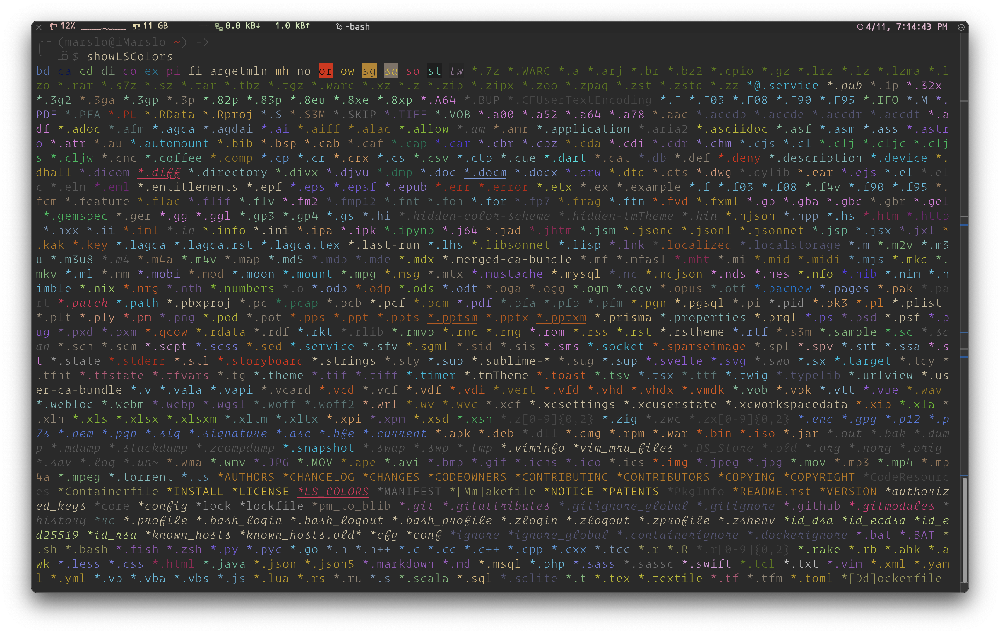

<!-- START doctoc generated TOC please keep comment here to allow auto update -->
<!-- DON'T EDIT THIS SECTION, INSTEAD RE-RUN doctoc TO UPDATE -->

- [hardware spec](#hardware-spec)
  - [os](#os)
  - [hardware](#hardware)
  - [cpu](#cpu)
  - [memory](#memory)
  - [bios](#bios)
  - [disk](#disk)
    - [RAID Info](#raid-info)
  - [network](#network)
  - [environment variables](#environment-variables)
  - [graphics card driver](#graphics-card-driver)
- [get system info](#get-system-info)
  - [top](#top)
  - [ps](#ps)
- [set system info](#set-system-info)
  - [clear duplicated PATH](#clear-duplicated-path)
  - [sysctl](#sysctl)
    - [change max_user_watches](#change-max_user_watches)
    - [change net.bridge](#change-netbridge)
  - [LS_COLORS](#ls_colors)
  - [set dns for ubuntu](#set-dns-for-ubuntu)
  - [disable firewall](#disable-firewall)
  - [off swap](#off-swap)
  - [disable selinux](#disable-selinux)
  - [confined and unconfined users](#confined-and-unconfined-users)
- [process](#process)
  - [find the zombie process](#find-the-zombie-process)
  - [about `whatis`](#about-whatis)
- [service](#service)
  - [enable/disable service](#enabledisable-service)
  - [start/stop service](#startstop-service)
  - [check log](#check-log)
- [system encoding](#system-encoding)
  - [setup via environment](#setup-via-environment)
  - [setup via `locale` command](#setup-via-locale-command)
  - [locales](#locales)
  - [langpacks](#langpacks)
- [applications](#applications)
  - [disable lock screen in CentOS 8](#disable-lock-screen-in-centos-8)
  - [sogou Pinyin input method](#sogou-pinyin-input-method)
  - [specified terminal size](#specified-terminal-size)
- [burn bootable usb stick](#burn-bootable-usb-stick)
- [remove system](#remove-system)
- [Q&A](#qa)
  - [yum issue after python upgrade to 3.x](#yum-issue-after-python-upgrade-to-3x)
  - [none of the providers can be installed in `dnf upgrade`](#none-of-the-providers-can-be-installed-in-dnf-upgrade)
  - [ls: Argument list too long](#ls-argument-list-too-long)
- [others](#others)
  - [motd](#motd)
  - [motd](#motd-1)

<!-- END doctoc generated TOC please keep comment here to allow auto update -->



> references:
> - [Environment Variables](https://help.ubuntu.com/community/EnvironmentVariables#The_LANGUAGE_priority_list)
> - [16 Commands to Check Hardware Information on Linux](https://www.binarytides.com/linux-commands-hardware-info/)
> - [Using Commands to Display System Information](https://docs.oracle.com/cd/E19455-01/805-7229/6j6q8svf4/index.html)
> - [30 Useful Linux Commands for System Administrators](https://www.tecmint.com/useful-linux-commands-for-system-administrators/)
> - [90 Linux Commands frequently used by Linux Sysadmins](https://haydenjames.io/90-linux-commands-frequently-used-by-linux-sysadmins/)
> - [50 UNIX / Linux Sysadmin Tutorials](https://www.thegeekstuff.com/2010/12/50-unix-linux-sysadmin-tutorials/)
> - [50 Most Frequently Used UNIX / Linux Commands (With Examples)](https://www.thegeekstuff.com/2010/11/50-linux-commands/)
> - [Top 25 Best Linux Performance Monitoring and Debugging Tools](https://www.thegeekstuff.com/2011/12/linux-performance-monitoring-tools/)
> - [dmidecode – A Best Tool to Get System Hardware Information on Linux](https://www.2daygeek.com/dmidecode-command-find-get-check-linux-system-hardware-information/)
> - [17 Ways to check size of physical memory (RAM) in Linux](https://www.2daygeek.com/easy-ways-to-check-size-of-physical-memory-ram-in-linux/)
> - [Top 15 tools to monitor disk IO performance with examples](https://www.golinuxcloud.com/monitor-disk-io-performance-statistics-linux/)
> - [How To Find Linux System Details Using inxi](https://ostechnix.com/how-to-find-your-system-details-using-inxi/)
> - [Tutorial: Beginners guide on linux memory management](https://www.golinuxcloud.com/tutorial-linux-memory-management-overview/)
>   - [Buffers vs Page cache](https://www.golinuxcloud.com/tutorial-linux-memory-management-overview/#Buffers_vs_Page_cache)
>   - [Understanding Dirty Page](https://www.golinuxcloud.com/tutorial-linux-memory-management-overview/#Understanding_Dirty_Page)
>   - [Understanding Active and Inactive Memory](https://www.golinuxcloud.com/tutorial-linux-memory-management-overview/#Understanding_Active_and_Inactive_Memory)
>   - [Different types of swapping scenarios and risks](https://www.golinuxcloud.com/tutorial-linux-memory-management-overview/#Different_types_of_swapping_scenarios_and_risks)
>
> drop caches
> ```bash
> $ sudo bash -c "echo 3 > /proc/sys/vm/drop_caches"
> ```


# hardware spec

> [!TIP]
> list info
> - `glances`
> - `hwinfo`
> - `lshw`
> - `lscpu`
> - `lsmem`
> - `lspci`
> - `lsscsi`
> - `lsusb`
> - `inxi` ( `inxi --recommends`, `inxi -F|--full` )
> - `lsblk`
> - `lsof`
> - `ncdu` - a disk utility for Unix systems
> - `fdisk`
> - `blkid` - command-line utility to locate/print block device attributes
> - `mount`
> - `free`
> - `dmidecode`
> - `hdparm`
> - `lstopo-no-graphics`
> - `hwloc-ls`
> - `/proc`
>   - `/proc/cpuinfo`
>   - `/proc/meminfo`
>   - `/proc/version`
>   - `/proc/scsi/scsi`
>   - `/proc/partitions`
> performance & analysis
> - [* imarslo : adminTools](../devops/adminTools.html)
> - `vmstat` - shows system memory, processes, interrupts, paging, block I/O, and CPU info
> - `iostat` - for storage I/O statistics.
> - `iotop` - interactive I/O viewer. Get an overview of storage r/w activity
> - `netstat` – for network statistics
> - `iftop` - network traffic viewer
> - `nload` - a super simple, command-line network interface monitoring tool
> - `mtr` - network diagnostic tool
> - `dig` - DNS lookup utility tool
> - `nethogs` - network traffic analyzer
> - `apropos` - search man page names and descriptions
> - `fsck` - tool for checking the consistency of a file system
> - `vnstat`
> - `dstat`
> - `mpstat`
> - `ss` - socket statistics
> - `sar`
> - `nethogs` - network traffic analyzer


> lshw Classes
> - `address`
> - `bridge`
> - `bus`
> - `communication`
> - `disk`
> - `display`
> - `generic`
> - `input`
> - `memory`
> - `multimedia`
> - `network`
> - `power`
> - `printer`
> - `processor`
> - `storage`
> - `system`
> - `tape`
> - `volume`


## os
```bash
$ lsb_release -a
LSB Version    : :core-4.1-amd64:core-4.1-noarch
Distributor ID : CentOS
Description    : CentOS Linux release 7.9.2009 (Core)
Release        : 7.9.2009
Codename       : Core

$ uname  -a
Linux my-computer 3.10.0-1160.42.2.el7.x86_64 #1 SMP Tue Sep 7 14:49:57 UTC 2021 x86_64 x86_64 x86_64 GNU/Linux

$ cat /etc/centos-release
CentOS Linux release 7.9.2009 (Core)
```

## hardware
```bash
$ sudo dmidecode -s
```

- [portable hardware locality](https://www.open-mpi.org/projects/hwloc/)

  > [!TIP]
  > - [lstopo command in Linux](https://iq.opengenus.org/lstopo-in-linux/)

  ```bash
  $ sudo yum install -y hwloc
  $ lstopo-no-graphics
  $ hwloc-ls
  $ hwloc-info
  $ lstopo-no-graphics -p
  ```

#### system information
```bash
$ sudo dmidecode | grep -A5 '^System Information'
  System Information
    Manufacturer: HPE
    Product Name: ProLiant DL380 Gen10
    Version: Not Specified
    Serial Number: S*************0
    UUID: 0******0-0**0-0**0-0**0-3**********e

# or display system [m]anufacture
$ inxi -M
    Machine:   Type: Server Mobo: HPE model: ProLiant DL380 Gen10 serial: <root required> UEFI: HPE v: U30
               date: 06/15/2018
# or
$ sudo inxi --dmidecode -Mxxx
    Machine:   Type: Rack Mount Chassis Mobo: HPE model: ProLiant DL380 Gen10 serial: PFARA%%LMAZ6XB BIOS: HPE
           v: U30 rev: 1.40 date: 06/15/2018 rom size: 16384 kB
```

#### manufacturer
```bash
$ sudo dmidecode -s system-manufacturer
    HPE

# or
$ sudo dmidecode -s baseboard-manufacturer
HPE

# or
$ cat /sys/devices/virtual/dmi/id/sys_vendor
HPE
```

#### product name and version

#### product name only
```bash
$ sudo dmidecode -s system-product-name
    ProLiant DL380 Gen10

# or
$ sudo dmidecode -s baseboard-product-name
ProLiant DL380 Gen10

# or
$ cat /sys/devices/virtual/dmi/id/product_name
ProLiant DL380 Gen10

# or
$ sudo dmidecode | grep -i prod
        Product Name: Vostro 5560
        Product Name: 04YDT0
```

#### uuid
```bash
$ sudo dmidecode | grep -i uuid | awk '{print $2}' | tr '[:upper:]' '[:lower:]'
```

## cpu


> references:
> - [How to know number of cores of a system in Linux?](https://unix.stackexchange.com/a/279354/29178)
> - [How to find out the number of CPU & Cores of your Linux machine](https://www.ryadel.com/en/cpu-cores-threads-number-linux-centos-virtual-machine/)


#### [cpu cores](https://www.ryadel.com/en/cpu-cores-threads-number-linux-centos-virtual-machine/)
```bash
$ cat /proc/cpuinfo | egrep "core id|physical id" | tr -d "\n" | sed s/physical/\\nphysical/g | grep -v ^$ | sort | uniq | wc -l
36

# or
$ grep -c processor /proc/cpuinfo
32

# or
$ nproc --all
32

# or
$ getconf _NPROCESSORS_ONLN
32

# or
$ cat /sys/devices/system/cpu/present
0-31

# or CPUs = Threads per core X cores per socket X socket
$ lscpu | grep -E '^Thread|^Core|^Socket|^CPU\('
CPU(s):                32
Thread(s) per core:    2
Core(s) per socket:    8
Socket(s):             2
$ lscpu | grep --color=none -E '^(Thread|Core|Socket|CPU\(|NUMA|Model\ name)'
CPU(s):              128
Thread(s) per core:  2
Core(s) per socket:  64
Socket(s):           1
NUMA node(s):        1
Model name:          AMD EPYC 7742 64-Core Processor
NUMA node0 CPU(s):   0-127

# or
$ sudo dmidecode -t 4 | grep -E 'Socket Designation|Count'
  Socket Designation: CPU1
  Core Count: 8
  Thread Count: 16
  Socket Designation: CPU2
  Core Count: 8
  Thread Count: 16

# list clock speed
$ sudo lscpu | grep --color=none -E '^(Thread|Core|Socket|CPU\(|NUMA\ node\(|Model\ name|CPU.+MHz|BogoMIPS)'
CPU(s):              32
Thread(s) per core:  2
Core(s) per socket:  8
Socket(s):           2
NUMA node(s):        2
Model name:          Intel(R) Xeon(R) CPU E5-2667 v4 @ 3.20GHz
CPU MHz:             1719.616
CPU max MHz:         3600.0000
CPU min MHz:         1200.0000
BogoMIPS:            6399.86
```

- others
  ```bash
  $ lscpu --all --extended
  $ lscpu --all --parse=CPU,SOCKET,CORE | grep -v '^#'
  ```

#### check CPU support 64 bit or not
```bash
$ sudo dmidecode --type=processor | grep -i -A 1 Characteristics
    Characteristics:
            64-bit capable
```

#### `cat /proc/cpuinfo`
```bash
$ lscpu
Architecture:          i686
CPU op-mode(s):        32-bit, 64-bit
Byte Order:            Little Endian
CPU(s):                4
On-line CPU(s) list:   0-3
....
```

#### cpu info
```bash
$ sudo dmidecode -t processor

# or
$ sudo lshw -C cpu

# or
$ sudo dmidecode -t 4 | egrep -i "Designation|Intel|core|thread"

# or
$ inxi -C
CPU:
  Info: 2x 8-core model: Intel Xeon E5-2667 v4 bits: 64 type: MT MCP SMP cache: L2: 2x 2 MiB (4 MiB)
  Speed (MHz): avg: 1324 min/max: 1200/3600 cores: 1: 1202 2: 1202 3: 1251 4: 1200 5: 1201
    6: 1376 7: 1260 8: 1205 9: 1203 10: 1202 11: 1201 12: 1201 13: 1201 14: 1202 15: 1201 16: 1202
    17: 1200 18: 1200 19: 1600 20: 1199 21: 1201 22: 1287 23: 1892 24: 1201 25: 1200 26: 1201
    27: 3200 28: 1200 29: 1200 30: 1701 31: 1201 32: 1200
```

## memory


> references:
> - [Find Out the Total Physical Memory (RAM) on Linux](https://www.baeldung.com/linux/total-physical-memory)
> - [17 Ways to check size of physical memory (RAM) in Linux](https://www.2daygeek.com/easy-ways-to-check-size-of-physical-memory-ram-in-linux/)
> - [free – A standard command to check memory usage statistics in Linux](https://www.2daygeek.com/free-command-to-check-memory-usage-statistics-in-linux/)
> - [nmon – A Nifty Tool To Monitor System Resources On Linux](https://www.2daygeek.com/nmon-system-performance-monitor-system-resources-on-linux/)
>
> - RAM: Random Access Memory is a temporary memory. This information will go away when the computer is turned off.
> - ROM: Read Only Memory is permanent memory, that holds the data even if the system is switched off.


#### list total memory
```bash
$ hwinfo --memory | grep 'Memory Size'
  Memory Size: 128 GB

$ sudo lshw -short | grep 'System Memory'
/0/2c                           memory         128GiB System Memor

$ vmstat -s -S M | egrep -ie 'total memory'
       128817 M total memory

$ vmstat -s | grep "total memory"
    131909608 K total memory

$ vmstat -s | awk '{print $1 / 1024 / 1024}' | head -1
125.799

$ inxi -F | grep "Memory"
  Processes: 414 Uptime: 87d 17h 40m Memory: 125.8 GiB used: 27.21 GiB (21.6%) Init: systemd

$ sudo dmidecode -t memory | grep  Size: | grep -v "No Module Installed" | awk '{sum+=$2}END{print sum}'
131072

$ egrep 'MemTotal|MemFree|MemAvailable' /proc/meminfo
MemTotal:       131909608 kB
MemFree:        95760488 kB
MemAvailable:   104355708 kB

$ vmstat -s
```

#### list only installed RAM modules
```bash
$ sudo dmidecode -t memory | grep  Size: | grep -v "No Module Installed"
$ sudo dmidecode -t memory | grep -E '(^Memory Device|^\s+(Size:|Type:|Type Detail:|Serial Number:|Part Number:|Memory Technology:|Manufacturer))' --color=never | grep -v -E 'Not Specified|No Module Installed|Unknow|None|OUT OF SPEC'
```

#### memory information
```bash
$ sudo dmidecode -t memory
$ sudo dmidecode -t memory | grep -E '(^Memory Device|^\s+(Size:|Type:|Type Detail:|Serial Number:|Part Number:|Memory Technology:|Configured Memory Speed:|Manufacturer))' --color=never
Memory Device
  Size: 16384 MB
  Type: DDR4
  Type Detail: Synchronous Registered (Buffered)
  Manufacturer: 00AD063200AD
  Serial Number: 44965EB1
  Part Number: HMA82GR7DJR8N-XN
  Configured Memory Speed: 2933 MT/s
  Memory Technology: DRAM
# or
$ sudo dmidecode -t memory | grep -E '(^Memory Device|^\s+(Size:|Type:|Type Detail:|Serial Number:|Part Number:|Memory Technology:|Configured Memory Speed:|Manufacturer))' --color=never | grep -v -E 'Not Specified|No Module|Unknow|None|<OUT OF SPEC>'

# or
$ sudo lshw -C memory
$ sudo lshw -short -class memory

# Physical Memory Array
$ sudo dmidecode --type 16

# get Memory Device
$ sudo dmidecode --type 17

# Memory Array Mapped Address
$ sudo dmidecode --type 19
```

#### print memory only
```bash
$ ps -o comm,%mem,args -u marslo | more
COMMAND         %MEM COMMAND
gnome-keyring-d  0.0 /usr/bin/gnome-keyring-daemon --daemonize --login
init             0.0 init --user
ssh-agent        0.0 ssh-agent
dbus-daemon      0.0 dbus-daemon --fork --session --address=unix:abstract=/tmp/dbus-i5FUVjzADG
upstart-event-b  0.0 upstart-event-bridge
window-stack-br  0.0 /usr/lib/i386-linux-gnu/hud/window-stack-bridge
upstart-dbus-br  0.0 upstart-dbus-bridge --daemon --session --user --bus-name session
upstart-dbus-br  0.0 upstart-dbus-bridge --daemon --system --user --bus-name system
upstart-file-br  0.0 upstart-file-bridge --daemon --user
ibus-daemon      0.1 /usr/bin/ibus-daemon --daemonize --xim
....
```

#### check memory in time
```bash
$ free -h -s 5

# or
$ vmstat -w

# or
$ dmesg | grep "Memory"
[    0.995127] Memory: 131882904K/134101416K available (12300K kernel code, 2504K rwdata, 3684K rodata, 2340K init, 3240K bss, 2218512K reserved, 0K cma-reserved)
[    1.139890] x86/mm: Memory block size: 2048MB
```

## bios
```bash
$ sudo dmidecode -t bios
```

## disk
- `hwinfo`
  ```bash
  $ hwinfo --disk --only /dev/sda
  192: SCSI 20.0: 10600 Disk
    [Created at block.245]
    Unique ID: R7kM.qzo5k6MLsu5
    Parent ID: svHJ.VbV94345RfA
    SysFS ID: /class/block/sda
    SysFS BusID: 0:2:0:0
    SysFS Device Link: /devices/pci0000:00/0000:00:02.0/0000:03:00.0/host0/target0:2:0/0:2:0:0
    Hardware Class: disk
    Model: "AVAGO SMC3108"
    Vendor: "AVAGO"
    Device: "SMC3108"
    Revision: "4.68"
    Driver: "megaraid_sas", "sd"
    Driver Modules: "megaraid_sas"
    Device File: /dev/sda (/dev/sg1)
    Device Files: /dev/sda, /dev/disk/by-id/scsi-360030480243a18012424538006708dc9, /dev/disk/by-id/wwn-0x60030480243a18012424538006708dc9, /dev/disk/by-path/pci-0000:03:00.0-scsi-0:2:0:0
    Device Number: block 8:0-8:15 (char 21:1)
    BIOS id: 0x80
    Drive status: no medium
    Config Status: cfg=new, avail=yes, need=no, active=unknown
    Attached to: #37 (RAID bus controller)
  ```

#### disk type

> [!INFO]
> Check disk interface types
> - Advanced technology attachment (`ATA`)
> - Integrated Drive Electronics (`IDE`)
> - Serial ATA (`SATA`)
> - Small Computer system interface (`SCSI`)
> - Serial attached SCSI (`SAS`)
> - Fibre Channel

- `lsblk`
  ```bash
  $ lsblk -do name,tran
  NAME TRAN
  sdb  sas
  sdc  sas
  ```

- `lshw`
  ```bash
  $ sudo lshw -c storage -c disk
    ...
    *-sas
         description: Serial Attached SCSI controller
         product: Smart Storage PQI 12G SAS/PCIe 3
         vendor: Adaptec
         physical id: 0
         bus info: pci@0000:5c:00.0
         logical name: scsi1
         version: 01
         width: 64 bits
         clock: 33MHz
         capabilities: sas pm msix pciexpress bus_master cap_list
         configuration: driver=smartpqi latency=0
         resources: irq:32 memory:e9100000-e9107fff ioport:8000(size=256)
       *-disk:0
            description: SCSI Disk                            # SCSC
            product: LOGICAL VOLUME
            vendor: HPE
            physical id: 1.0.0
            bus info: scsi@1:1.0.0
            logical name: /dev/sdb
            version: 1.99
            serial: P************C
            size: 1788GiB (1920GB)
            capabilities: 15000rpm gpt-1.00 partitioned partitioned:gpt
            configuration: ansiversion=5 guid=eda10475-9cdb-44cd-8dbd-28bf482b0e25 logicalsectorsize=512 sectorsize=4096
  ```

- `hdparm`
  ```bash
  $ sudo hdparm -I /dev/sdb

  /dev/sdb:
  SG_IO: bad/missing sense data, sb[]:  7***

  ATA device, with non-removable media
  Standards:
    Likely used: 1
  Configuration:
    Logical   max current
    cylinders 0 0
    heads   0 0
    sectors/track 0 0
    --
    Logical/Physical Sector size:           512 bytes
    device size with M = 1024*1024:           0 MBytes
    device size with M = 1000*1000:           0 MBytes
    cache/buffer size  = unknown
  Capabilities:
    IORDY not likely
    Cannot perform double-word IO
    R/W multiple sector transfer: not supported
    DMA: not supported
    PIO: pio0
  ```

- SSD or HHD

  > [!INFO]
  > - `0`: SSD
  > - `1`: HHD
  > references:
  > - [7 easy methods to check disk type (HDD or SSD) in Linux](https://www.golinuxcloud.com/check-disk-type-linux/)
  > - [How To Find If The Disk Is SSD Or HDD In Linux](https://ostechnix.com/how-to-find-if-the-disk-is-ssd-or-hdd-in-linux/)

  - check rotational
    ```bash
    # HHD
    $ cat /sys/block/sd*/queue/rotational
    1
    1

    # SSD
    $ lsscsi
    [0:0:0:0]    disk    Generic- SD/MMC CRW       1.00  /dev/sda
    [1:0:0:0]    enclosu HPE      Smart Adapter    1.99  -
    [1:1:0:0]    disk    HPE      LOGICAL VOLUME   1.99  /dev/sdb
    [1:1:0:1]    disk    HPE      LOGICAL VOLUME   1.99  /dev/sdc
    [1:2:0:0]    storage HPE      P408i-a SR Gen10 1.99  -
    [devops@dc5-ssdfw11 ~]$ cat /sys/block/sd*/queue/rotational
    1
    0
    0
    ```
  - `lsblk`
    ```bash
    ## SSD
    $ lsblk -d -o name,rota
    NAME ROTA
    sdb     0
    sdc     0

    # or
    ## SSD
    $ lsblk -d -e 7 -o NAME,ROTA,DISC-MAX,MODEL
    NAME ROTA DISC-MAX MODEL
    sdb     0       0B LOGICAL VOLUME
    sdc     0       0B LOGICAL VOLUME
    ## HHD
    $ lsblk -d -e 7 -o NAME,ROTA,DISC-MAX,MODEL
    NAME ROTA DISC-MAX MODEL
    sdb     1       0B SMC3108
    sda     1       0B SMC3108
    ```

  - `smartctl` ( `$ yum install smartmontools` )
    ```bash
    $ sudo smartctl -a /dev/sdb1
    smartctl 7.0 2018-12-30 r4883 [x86_64-linux-4.19.12-1.el7.elrepo.x86_64] (local build)
    Copyright (C) 2002-18, Bruce Allen, Christian Franke, www.smartmontools.org

    === START OF INFORMATION SECTION ===
    Vendor:               AVAGO
    Product:              SMC3108
    Revision:             4.68
    Compliance:           SPC-3
    User Capacity:        7,679,267,307,520 bytes [7.67 TB]
    Logical block size:   512 bytes
    Physical block size:  4096 bytes
    Logical Unit id:      0x60030480243a7b0124d58c0646f9617d
    Serial number:        007d61f946068cd524017b3a24800403
    Device type:          disk
    Local Time is:        Thu Mar 30 10:51:52 2023 PDT
    SMART support is:     Unavailable - device lacks SMART capability.

    === START OF READ SMART DATA SECTION ===
    Current Drive Temperature:     0 C
    Drive Trip Temperature:        0 C

    ## SSD
    $ sudo smartctl -a /dev/sdc
    smartctl 6.6 2017-11-05 r4594 [x86_64-linux-4.18.0-193.28.1.el8_2.x86_64] (local build)
    Copyright (C) 2002-17, Bruce Allen, Christian Franke, www.smartmontools.org

    === START OF INFORMATION SECTION ===
    Vendor:               HPE
    Product:              LOGICAL VOLUME
    Revision:             1.99
    User Capacity:        1,920,349,855,744 bytes [1.92 TB]
    Logical block size:   512 bytes
    Rotation Rate:        Solid State Device                          # SSD
    Logical Unit id:      0x600508b1001c5be1882c0a4afb83c8ec
    Serial number:        P************C
    Device type:          disk
    Local Time is:        Thu Mar 30 10:53:12 2023 PDT
    SMART support is:     Available - device has SMART capability.
    SMART support is:     Enabled
    Temperature Warning:  Disabled or Not Supported

    === START OF READ SMART DATA SECTION ===
    SMART Health Status: OK
    Current Drive Temperature:     0 C
    Drive Trip Temperature:        0 C
    ```

  - `/proc/scsi/scsi`
    ```bash
    ## SSD
    $ cat /proc/scsi/scsi
    Attached devices:
    Host: scsi0 Channel: 00 Id: 00 Lun: 00
      Vendor: Generic- Model: SD/MMC CRW       Rev: 1.00
      Type:   Direct-Access                    ANSI  SCSI revision: 06
    Host: scsi1 Channel: 00 Id: 00 Lun: 00
      Vendor: HPE      Model: Smart Adapter    Rev: 1.99
      Type:   Enclosure                        ANSI  SCSI revision: 05
    Host: scsi1 Channel: 01 Id: 00 Lun: 00
      Vendor: HPE      Model: LOGICAL VOLUME   Rev: 1.99
      Type:   Direct-Access                    ANSI  SCSI revision: 05
    Host: scsi1 Channel: 01 Id: 00 Lun: 01
      Vendor: HPE      Model: LOGICAL VOLUME   Rev: 1.99
      Type:   Direct-Access                    ANSI  SCSI revision: 05
    Host: scsi1 Channel: 02 Id: 00 Lun: 00
      Vendor: HPE      Model: P408i-a SR Gen10 Rev: 1.99
      Type:   RAID                             ANSI  SCSI revision: 05
    ```

#### check status
- `$ lsblk`
- `$ pvs`
- `$ lvs`
- `$ vgs`
- `$ pvscan`
- `$ lvscan`
- `$ pvdisplay`
- `$ vgdisplay`
- `$ lvdisplay`
- `$ fdisk -l`
- `$ sfdisk  -l -uM`
- `$ lshw -class disk`
- `$ hwinfo --block --short`
- `$ cat /proc/partitions`
- `$ sudo hdparm -I /dev/sda`

### RAID Info

> [!NOTE|label:references:]
> - [ubuntu bios raid卡管理界面 ubuntu raid驱动](https://blog.51cto.com/u_16099343/7908062)
> - [Dell Lifecycle Controller Graphical User Interface Version 2.05.05.05 For 13th Generation Dell PowerEdge Servers User's Guide](https://www.dell.com/support/manuals/en-us/idrac8-with-lc-v2.05.05.05/lc_2.05.05.05_ug-v1/viewing-current-raid-configuration?guid=guid-0856216c-7a31-4f6d-9a4d-ec1ca2bfac69&lang=en-us)

```bash
$ sudo apt install -y smartmontools

# RAID1
$ sudo smartctl --scan
/dev/sda -d scsi # /dev/sda, SCSI device
/dev/bus/0 -d megaraid,0 # /dev/bus/0 [megaraid_disk_00], SCSI device
/dev/bus/0 -d megaraid,1 # /dev/bus/0 [megaraid_disk_01], SCSI device
```

#### RAID details info
```bash
$ sudo smartctl --all -d megaraid,1 /dev/sda
smartctl 7.1 2019-12-30 r5022 [x86_64-linux-5.15.0-107-generic] (local build)
Copyright (C) 2002-19, Bruce Allen, Christian Franke, www.smartmontools.org

=== START OF INFORMATION SECTION ===
Device Model:     HF***********9N
Serial Number:    EJ*************4P
LU WWN Device Id: 5 ace42e 02565881c
Add. Product Id:  DELL(tm)
Firmware Version: DZ02
User Capacity:    960,197,124,096 bytes [960 GB]
Sector Sizes:     512 bytes logical, 4096 bytes physical
Rotation Rate:    Solid State Device
Form Factor:      2.5 inches
Device is:        Not in smartctl database [for details use: -P showall]
ATA Version is:   ACS-4 (minor revision not indicated)
SATA Version is:  SATA 3.3, 6.0 Gb/s (current: 6.0 Gb/s)
Local Time is:    Wed Jun  5 16:34:16 2024 PDT
SMART support is: Available - device has SMART capability.
SMART support is: Enabled

# or even more details
$ sudo smartctl --xall -d megaraid,1 /dev/sda
```

## network

#### get network cards
```bash
$ sudo lshw -short -class network
H/W path            Device        Class          Description
============================================================
/0/100/1/0          enp1s0f0      network        I350 Gigabit Network Connection
/0/100/1/0.1        enp1s0f1      network        I350 Gigabit Network Connection
/0/100/1.1/0        enp2s0f0      network        Ethernet Controller X710 for 10GbE SFP+
/0/100/1.1/0.1      enp2s0f1      network        Ethernet Controller X710 for 10GbE SFP+
/0/2/0              enp131s0f0    network        Ethernet Controller 10-Gigabit X540-AT2
/0/2/0.1            enp131s0f1    network        Ethernet Controller 10-Gigabit X540-AT2
/3                  veth8c9c4570  network        Ethernet interface
/4                  flannel.1     network        Ethernet interface
/5                  veth8d141a78  network        Ethernet interface
/6                  veth3cc4bf19  network        Ethernet interface
/7                  cni0          network        Ethernet interface
/8                  docker0       network        Ethernet interface
/9                  veth179b5dab  network        Ethernet interface
```

#### network speed
```bash
$ ifstat -n -i en7
       en7
 KB/s in  KB/s out
    7.35      1.15
    4.91      1.02
    6.05      0.80
    8.36      1.78
```

#### get the public ip address
```bash
$ curl ifconfig.me
```

## environment variables
#### show PATH
```bash
$ echo src::${PATH} | awk 'BEGIN{pwd=ENVIRON["PWD"];RS=":";FS="\n"}!$1{$1=pwd}$1!~/^\//{$1=pwd"/"$1}{print $1}'
/home/marslo/src
/home/marslo
/home/marslo/.vim/tools/bin
/usr/local/mysql/bin
/usr/local/bcompare/bin
/usr/lib/lightdm/lightdm
/usr/local/sbin
/usr/local/bin
/usr/sbin
/usr/bin
/sbin
/bin
/usr/games
/usr/local/games
OR
$ echo "${PATH//:/$'\n'}"
```

## graphics card driver

> [!NOTE|label:references:]
> - [How to Install NVIDIA Drivers on Fedora 39, 38 Linux](https://www.linuxcapable.com/how-to-install-nvidia-drivers-on-fedora-linux/)

# get system info


> references:
> - [Shell script to check top memory & cpu consuming process in Linux](https://www.golinuxcloud.com/check-top-memory-cpu-consuming-process-script/)


## top
- batch mode

  > [!TIP]
  > references:
  > - [`top -n1 d2`](https://serverfault.com/a/626909)
  > - [How to Save Top Command Output to a File](https://www.tecmint.com/save-top-command-output-to-a-file/)

  ```bash
  $ top -bn1

  # or
  $ top -n 1 d 2
  ```

  - get only summary of top command
    ```bash
    $ top -bn1 | sed -n '/^top.*/,/^\s*$/p'

    ## or
    $ top -bn1 | sed -e '/^$/Q'
    ```

## ps

> [!TIP]
> references:
> - [Command to check top CPU consuming process](https://www.golinuxcloud.com/check-top-memory-cpu-consuming-process-script/)

- cpu
  ```bash
  $ ps -eocomm,pcpu | egrep -v '(0.0)|(%CPU)'
  systemd          0.2
  rcu_sched        0.2
  sshd             0.5
  java             8.2
  java             0.6
  dockerd         16.1
  docker-containe  0.6
  ...
  ```

- memory
  ```bash
  $ ps -eocomm,pmem | egrep -v '(0.0)|(%MEM)'
  java             0.1
  java             0.1
  java             0.8
  gvfs-udisks2-vo  0.1
  kube-apiserver   0.1
  ```

# set system info
## clear duplicated PATH
```bash
$ export PATH=`echo -n $PATH | awk -v RS=":" '{ if (!x[$0]++) {printf s $0; s=":"} }'`
```

## sysctl
### [change max_user_watches](https://code.visualstudio.com/docs/setup/linux#_visual-studio-code-is-unable-to-watch-for-file-changes-in-this-large-workspace-error-enospc)
```bash
# permanent
$ sudo bash -c "echo fs.inotify.max_user_watches=524288 >> /etc/sysctl.conf"
$ sudo sysctl -p

# temporary
$ sudo sysctl fs.inotify.max_user_watches=524288
```

- verify
  ```bash
  $ cat /proc/sys/fs/inotify/max_user_watches
  ```

### change net.bridge
```bash
$ sudo modprobe br_netfilter
$ sudo sysctl net.bridge.bridge-nf-call-iptables=1
$ sudo sysctl net.bridge.bridge-nf-call-ip6tables=1

# or
$ sudo bash -c "cat >  /etc/sysctl.d/k8s.conf" << EOF
net.bridge.bridge-nf-call-ip6tables = 1
net.bridge.bridge-nf-call-iptables = 1
EOF
```

- check status
  ```bash
  $ sudo sysctl --system
  ```

## LS_COLORS

> [!NOTE|label:references:]
> - [tpope/dotfiles/.dir_colors](https://github.com/tpope/dotfiles/blob/master/.dir_colors)
> - [benoit-pierre/ls_colors.py](https://gist.github.com/benoit-pierre/5cebb8bf5210b838ddc45f07da32943a)
>
> | pattern |     name     | comments          |
> |:--------|:------------:|-------------------|
> | `bd`    |   `device`   | block device      |
> | `ca`    |       -      | cap               |
> | `cd`    |   `device`   | char device       |
> | `cl`    |       -      | clear end of line |
> | `di`    |  `directory` | directory         |
> | `do`    |       -      | Solaris door      |
> | `ec`    |       -      | end color, unused |
> | `ex`    | `executable` | executable        |
> | `fi`    |    `file`    | file              |
> | `fl`    |       -      | file, default     |
> | `lc`    |       -      | left, unused      |
> | `ln`    |    `link`    | symlink           |
> | `mh`    |       -      | multi hardlink    |
> | `mi`    |       -      | missing file      |
> | `no`    |       -      | normal            |
> | `or`    |   `orphan`   | orphaned symlink  |
> | `ow`    |       -      | other-writable    |
> | `pi`    |    `fifo`    | pipe              |
> | `rc`    |       -      | right, unused     |
> | `rs`    |       -      | reset             |
> | `sg`    |       -      | setgid            |
> | `so`    |   `socket`   | socket            |
> | `st`    |       -      | sticky            |
> | `su`    |       -      | setuid            |
> | `tw`    |       -      | ow with sticky    |
>
> - [sharkdp/vivid](https://github.com/sharkdp/vivid)
> - [How can I list LS_COLORS in colour?](https://unix.stackexchange.com/a/52676/29178)
> - [What causes this green background in ls output?](https://unix.stackexchange.com/a/94505/29178)
> - [Configuring LS_COLORS](http://www.bigsoft.co.uk/blog/2008/04/11/configuring-ls_colors)
> - [trapd00r/LS_COLORS](https://github.com/trapd00r/LS_COLORS/blob/master/lscolors.sh)

- show database
  ```bash
  $ dircolors --print-database
  $ which -a dircolors
  /usr/local/opt/coreutils/libexec/gnubin/dircolors

  $ echo $COLORTERM
  truecolor
  $ echo $TERM
  xterm-256color
  ```

- setup LS_COLORS
  ```bash
  # with background color
  $ export LS_COLORS='*.patch=48;5;197;38;5;232;1:'

  # with italic
  $ export LS_COLORS='*.bak=38;5;241;3'

  # with underline
  $ export LS_COLORS='*.xlsxm=38;5;112;4:'

  # with italic and underline
  $ export LS_COLORS='*.patch=38;5;197;3;4:'

  # with italic and underline and blink
  $ export LS_COLORS='*.patch=38;5;197;3;4;5:"'
  #                            ^       ^ ^ ^
  #                            +       + + + blink
  #                            +       + + underline
  #                            +       + italic
  #                            + frontend color
  ```

  [!LS_COLORS example](../screenshot/linux/LS_COLORS.gif)

- [show current settings](https://unix.stackexchange.com/a/52676/29178)
  ```bash
  ( # Run in a subshell so it won't crash current color settings
    dircolors -b >/dev/null
    IFS=:
    for ls_color in ${LS_COLORS[@]}; do # For all colors
        color=${ls_color##*=}
        ext=${ls_color%%=*}
        echo -en "\E[${color}m${ext}\E[0m " # echo color and extension
    done
    echo
  )
  ```

  - or [Script to show colors](https://askubuntu.com/a/884513/92979)
    ```bash
    declare -A descriptions=(
        [bd]="block device"
        [ca]="file with capability"
        [cd]="character device"
        [di]="directory"
        [do]="door"
        [ex]="executable file"
        [fi]="regular file"
        [ln]="symbolic link"
        [mh]="multi-hardlink"
        [mi]="missing file"
        [no]="normal non-filename text"
        [or]="orphan symlink"
        [ow]="other-writable directory"
        [pi]="named pipe, AKA FIFO"
        [rs]="reset to no color"
        [sg]="set-group-ID"
        [so]="socket"
        [st]="sticky directory"
        [su]="set-user-ID"
        [tw]="sticky and other-writable directory"
    )

    IFS=:
    for ls_color in $LS_COLORS; do
        color="${ls_color#*=}"
        type="${ls_color%=*}"

        # Add description for named types.
        desc="${descriptions[$type]}"

        # Separate each color with a newline.
        if [[ $color_prev ]] && [[ $color != "$color_prev" ]]; then
            echo
        fi

        printf "\e[%sm%s%s\e[m " "$color" "$type" "${desc:+ ($desc)}"

        # For next loop
        color_prev="$color"
    done
    echo
    ```

- settings
  ```bash
  $ cat ~/.bashrc
  LS_COLORS='bd=38;5;68:ca=38;5;17:cd=38;5;113;1:di=38;5;108:do=38;5;127:ex=38;5;31;1:pi=38;5;126:fi=0:ln=target:mh=38;5;222;1:no=0:or=48;5;196;38;5;232;1:ow=38;5;220;1:sg=48;5;3;38;5;0:su=38;5;220;1;3;100;1:so=38;5;197:st=38;5;86;48;5;234:tw=48;5;235;38;5;139;3:'
  LS_COLORS+='*.7z=38;5;64:*.WARC=38;5;64:*.a=38;5;64:*.arj=38;5;64:*.br=38;5;64:*.bz2=38;5;64:*.cpio=38;5;64:*.gz=38;5;64:*.lrz=38;5;64:*.lz=38;5;64:*.lzma=38;5;64:*.lzo=38;5;64:*.rar=38;5;64:*.s7z=38;5;64:*.sz=38;5;64:*.tar=38;5;64:*.tbz=38;5;64:*.tgz=38;5;64:*.warc=38;5;64:*.xz=38;5;64:*.z=38;5;64:*.zip=38;5;64:*.zipx=38;5;64:*.zoo=38;5;64:*.zpaq=38;5;64:*.zst=38;5;64:*.zstd=38;5;64:*.zz=38;5;64:*@.service=38;5;45:'
  LS_COLORS+='*.pub=1;3:*.1p=38;5;7:*.32x=38;5;213:*.3g2=38;5;115:*.3ga=38;5;137;1:*.3gp=38;5;115:*.3p=38;5;7:*.82p=38;5;121:*.83p=38;5;121:*.8eu=38;5;121:*.8xe=38;5;121:*.8xp=38;5;121:*.A64=38;5;213:*.BUP=38;5;241:*.CFUserTextEncoding=38;5;239:*.F=38;5;81:*.F03=38;5;81:*.F08=38;5;81:*.F90=38;5;81:*.F95=38;5;81:*.IFO=38;5;114:*.M=38;5;110:*.PDF=38;5;141:*.PFA=38;5;66:*.PL=38;5;160:*.RData=38;5;178:*.Rproj=38;5;11:*.S=38;5;110:*.S3M=38;5;137;1:*.SKIP=38;5;244:*.TIFF=38;5;97:*.VOB=38;5;115;1:*.a00=38;5;213:*.a52=38;5;213:*.a64=38;5;213:*.a78=38;5;213:*.aac=38;5;137;1:*.accdb=38;5;60:*.accde=38;5;60:*.accdr=38;5;60:*.accdt=38;5;60:*.adf=38;5;213:*.adoc=38;5;184:*.afm=38;5;66:*.agda=38;5;81:*.agdai=38;5;110:*.ai=38;5;99:*.aiff=38;5;136;1:*.alac=38;5;136;1:*.allow=38;5;112:*.am=38;5;242;3:*.amr=38;5;137;1:*.application=38;5;116:*.aria2=38;5;241:*.asciidoc=38;5;184:*.asf=38;5;115:*.asm=38;5;81:*.ass=38;5;117:*.astro=38;5;135;1:*.atr=38;5;213:*.au=38;5;137;1:*.automount=38;5;45:*.bib=38;5;178:*.bsp=38;5;215:*.cab=38;5;215:*.caf=38;5;137;1:*.cap=38;5;29:*.car=38;5;57:*.cbr=38;5;141:*.cbz=38;5;141:*.cda=38;5;136;1:*.cdi=38;5;213:*.cdr=38;5;97:*.chm=38;5;141:*.cjs=38;5;074;1:*.cl=38;5;81:*.clj=38;5;41:*.cljc=38;5;41:*.cljs=38;5;41:*.cljw=38;5;41:*.cnc=38;5;7:*.coffee=38;5;079;1:*.comp=38;5;136:*.cp=38;5;75:*.cr=38;5;81:*.crx=38;5;215:*.cs=38;5;81:*.csv=38;5;78:*.ctp=38;5;81:*.cue=38;5;116:*.dart=38;5;51:*.dat=38;5;137;1:*.db=38;5;60:*.def=38;5;7:*.deny=38;5;196:*.description=38;5;116:*.device=38;5;45:*.dhall=38;5;178:*.dicom=38;5;97:*.diff=38;5;197;3;4:*.directory=38;5;116:*.divx=38;5;114:*.djvu=38;5;141:*.dmp=38;5;29:*.doc=38;5;111:*.docm=38;5;111;4:*.docx=38;5;111:*.drw=38;5;99:*.dtd=38;5;178:*.dts=38;5;137;1:*.dwg=38;5;216:*.dylib=38;5;241:*.ear=38;5;215:*.ejs=38;5;135;1:*.el=38;5;81:*.elc=38;5;241:*.eln=38;5;241:*.eml=38;5;90;1:*.entitlements=1:*.epf=1:*.eps=38;5;99:*.epsf=38;5;99:*.epub=38;5;141:*.err=38;5;160;1:*.error=38;5;160;1:*.etx=38;5;184:*.ex=38;5;7:*.example=38;5;7:*.f=38;5;81:*.f03=38;5;81:*.f08=38;5;81:*.f4v=38;5;115:*.f90=38;5;81:*.f95=38;5;81:*.fcm=38;5;137;1:*.feature=38;5;7:*.flac=38;5;136;1:*.flif=38;5;97:*.flv=38;5;115:*.fm2=38;5;213:*.fmp12=38;5;60:*.fnt=38;5;66:*.fon=38;5;66:*.for=38;5;81:*.fp7=38;5;60:*.frag=38;5;136:*.ftn=38;5;81:*.fvd=38;5;202:*.fxml=38;5;178:*.gb=38;5;213:*.gba=38;5;213:*.gbc=38;5;213:*.gbr=38;5;7:*.gel=38;5;213:*.gemspec=38;5;41:*.ger=38;5;7:*.gg=38;5;213:*.ggl=38;5;213:*.gp3=38;5;115:*.gp4=38;5;115:*.gs=38;5;81:*.hi=38;5;110:*.hidden-color-scheme=38;5;241;3:*.hidden-tmTheme=38;5;241;3:*.hin=38;5;242;3:*.hjson=38;5;178:*.hpp=38;5;110:*.hs=38;5;81:*.htm=38;5;125;1:*.http=38;5;90;1:*.hxx=38;5;110:*.ii=38;5;110:*.iml=38;5;166:*.in=38;5;242;3:*.info=38;5;184:*.ini=1:*.ipa=38;5;215:*.ipk=38;5;213:*.ipynb=38;5;41:*.j64=38;5;213:*.jad=38;5;215:*.jhtm=38;5;125;1:*.jsm=38;5;079;1:*.jsonc=38;5;178:*.jsonl=38;5;178:*.jsonnet=38;5;178:*.jsp=38;5;079;1:*.jsx=38;5;074;1:*.jxl=38;5;97:*.kak=38;5;172:*.key=38;5;166:*.lagda=38;5;81:*.lagda.rst=38;5;81:*.lagda.tex=38;5;81:*.last-run=1:*.lhs=38;5;81:*.libsonnet=38;5;142:*.lisp=38;5;81:*.lnk=38;5;97;5:*.localized=38;5;239:*.localstorage=38;5;60:*.m=38;5;110:*.m2v=38;5;114:*.m3u=38;5;116:*.m3u8=38;5;116:*.m4=38;5;242;3:*.m4a=38;5;137;1:*.m4v=38;5;114:*.map=38;5;7:*.md5=38;5;116:*.mdb=38;5;60:*.mde=38;5;60:*.mdx=38;5;184:*.merged-ca-bundle=1:*.mf=38;5;7:*.mfasl=38;5;7:*.mht=38;5;125;1:*.mi=38;5;7:*.mid=38;5;136;1:*.midi=38;5;136;1:*.mjs=38;5;074;1:*.mkd=38;5;184:*.mkv=38;5;114:*.ml=38;5;81:*.mm=38;5;7:*.mobi=38;5;141:*.mod=38;5;137;1:*.moon=38;5;81:*.mount=38;5;45:*.mpg=38;5;114:*.msg=38;5;178:*.mtx=38;5;7:*.mustache=38;5;135;1:*.mysql=38;5;222:*.nc=38;5;60:*.ndjson=38;5;178:*.nds=38;5;213:*.nes=38;5;213:*.nfo=38;5;184:*.nib=38;5;57:*.nim=38;5;81:*.nimble=38;5;81:*.nix=38;5;155:*.nrg=38;5;202:*.nth=38;5;97:*.numbers=38;5;112:*.o=38;5;241:*.odb=38;5;111:*.odp=38;5;166:*.ods=38;5;112:*.odt=38;5;111:*.oga=38;5;137;1:*.ogg=38;5;137;1:*.ogm=38;5;114:*.ogv=38;5;115:*.opus=38;5;137;1:*.otf=38;5;66:*.pacnew=38;5;33:*.pages=38;5;111:*.pak=38;5;215:*.part=38;5;239:*.patch=38;5;197;3;4:*.path=38;5;45:*.pbxproj=1:*.pc=38;5;7:*.pcap=38;5;29:*.pcb=38;5;7:*.pcf=1:*.pcm=38;5;136;1:*.pdf=38;5;141:*.pfa=38;5;66:*.pfb=38;5;66:*.pfm=38;5;66:*.pgn=38;5;178:*.pgsql=38;5;222:*.pi=38;5;7:*.pid=38;5;248:*.pk3=38;5;215:*.pl=38;5;208:*.plist=1:*.plt=38;5;7:*.ply=38;5;216:*.pm=38;5;203:*.png=38;5;97:*.pod=38;5;184:*.pot=38;5;7:*.pps=38;5;166:*.ppt=38;5;166:*.ppts=38;5;166:*.pptsm=38;5;166;4:*.pptx=38;5;166:*.pptxm=38;5;166;4:*.prisma=38;5;222:*.properties=38;5;116:*.prql=38;5;222:*.ps=38;5;99:*.psd=38;5;97:*.psf=1:*.pug=38;5;135;1:*.pxd=38;5;97:*.pxm=38;5;97:*.qcow=38;5;202:*.rdata=38;5;178:*.rdf=38;5;7:*.rkt=38;5;81:*.rlib=38;5;241:*.rmvb=38;5;114:*.rnc=38;5;178:*.rng=38;5;178:*.rom=38;5;213:*.rss=38;5;178:*.rst=38;5;184:*.rstheme=1:*.rtf=38;5;111:*.s3m=38;5;137;1:*.sample=38;5;114:*.sc=38;5;41:*.scan=38;5;242;3:*.sch=38;5;7:*.scm=38;5;7:*.scpt=38;5;219:*.scss=38;5;105;1:*.sed=38;5;172:*.service=38;5;45:*.sfv=38;5;116:*.sgml=38;5;178:*.sid=38;5;137;1:*.sis=38;5;7:*.sms=38;5;213:*.socket=38;5;45:*.sparseimage=38;5;202:*.spl=38;5;7:*.spv=38;5;217:*.srt=38;5;117:*.ssa=38;5;117:*.st=38;5;213:*.state=38;5;248:*.stderr=38;5;160;1:*.stl=38;5;216:*.storyboard=38;5;196:*.strings=1:*.sty=38;5;7:*.sub=38;5;117:*.sublime-*=1:*.sug=38;5;7:*.sup=38;5;117:*.svelte=38;5;135;1:*.svg=38;5;99:*.swo=38;5;244:*.sx=38;5;81:*.target=38;5;45:*.tdy=38;5;7:*.tfnt=38;5;7:*.tfstate=38;5;168:*.tfvars=38;5;168:*.tg=38;5;7:*.theme=38;5;116:*.tif=38;5;97:*.tiff=38;5;97:*.timer=38;5;45:*.tmTheme=1:*.toast=38;5;202:*.tsv=38;5;78:*.tsx=38;5;074;1:*.ttf=38;5;66:*.twig=38;5;81:*.typelib=38;5;60:*.urlview=38;5;116:*.user-ca-bundle=1:*.v=38;5;81:*.vala=38;5;81:*.vapi=38;5;81:*.vcard=38;5;7:*.vcd=38;5;202:*.vcf=38;5;7:*.vdf=38;5;215:*.vdi=38;5;202:*.vert=38;5;136:*.vfd=38;5;202:*.vhd=38;5;202:*.vhdx=38;5;202:*.vmdk=38;5;202:*.vob=38;5;115;1:*.vpk=38;5;215:*.vtt=38;5;117:*.vue=38;5;135;1:*.wav=38;5;136;1:*.webloc=38;5;116:*.webm=38;5;115:*.webp=38;5;97:*.wgsl=38;5;97:*.woff=38;5;66:*.woff2=38;5;66:*.wrl=38;5;216:*.wv=38;5;136;1:*.wvc=38;5;136;1:*.xcf=38;5;7:*.xcsettings=1:*.xcuserstate=1:*.xcworkspacedata=1:*.xib=38;5;208:*.xla=38;5;76:*.xln=38;5;7:*.xls=38;5;112:*.xlsx=38;5;112:*.xlsxm=38;5;112;4:*.xltm=38;5;73;4:*.xltx=38;5;73:*.xpi=38;5;215:*.xpm=38;5;97:*.xsd=38;5;178:*.xsh=38;5;41:*.z[0-9]{0,2}=38;5;239:*.zig=38;5;81:*.zwc=38;5;241:*.zx[0-9]{0,2}=38;5;239:'
  # encrypted files
  LS_COLORS+='*.enc=38;5;69;3:*.gpg=38;5;69;3:*.p12=38;5;69;3:*.p7s=38;5;69;3:*.pem=38;5;69;3:*.pgp=38;5;69;3:*.sig=38;5;69;3:*.signature=38;5;69;3:*.asc=38;5;69;3:*.bfe=38;5;69;3:*.current=38;5;69;3:'
  # packages
  LS_COLORS+='*.apk=38;5;215:*.deb=38;5;215:*.dll=38;5;241:*.dmg=38;5;215:*.rpm=38;5;215:*.war=38;5;215:*.bin=38;5;202:*.iso=38;5;202:*.jar=38;5;215:*.out=38;5;242;3:'
  # dump/log
  LS_COLORS+='*.bak=38;5;241;3:*.dump=38;5;241;3:*.mdump=38;5;241;3:*.stackdump=38;5;241;3:*.zcompdump=38;5;241;3:*.snapshot=38;5;45:*.swap=38;5;241;3:*.swp=38;5;241;3:*.tmp=38;5;241;3:*.viminfo=1;3:*vim_mru_files=1;3:*.DS_Store=38;5;239;3:*.old=38;5;239;3:*.org=38;5;241;3:*.norg=38;5;241;3:*.orig=38;5;241;3:*.sav=38;5;241;3:*.log=38;5;241;3:*.un~=38;5;241;3:'
  # audio/video
  LS_COLORS+='*.wma=38;5;137;1:*.wmv=38;5;114:*.JPG=38;5;97:*.MOV=38;5;114:*.ape=38;5;136;1:*.avi=38;5;114:*.bmp=38;5;97:*.gif=38;5;97:*.icns=38;5;97:*.ico=38;5;97:*.ics=38;5;7:*.img=38;5;202:*.jpeg=38;5;97:*.jpg=38;5;97:*.mov=38;5;114:*.mp3=38;5;137;1:*.mp4=38;5;114:*.mp4a=38;5;137;1:*.mpeg=38;5;114:*.torrent=38;5;116:*.ts=38;5;074;1:'
  # docs
  LS_COLORS+='*AUTHORS=38;5;172;1:*CHANGELOG=38;5;172;1:*CHANGES=38;5;172;1:*CODEOWNERS=38;5;172;1:*CONTRIBUTING=38;5;172;1:*CONTRIBUTORS=38;5;172;1:*COPYING=38;5;172;1:*COPYRIGHT=38;5;172;1:*CodeResources=38;5;239:*Containerfile=38;5;143:*INSTALL=38;5;220;1:*LICENSE=38;5;220;1:*LS_COLORS=38;5;197;1;3;4:*MANIFEST=38;5;243:*[Mm]akefile=38;5;143:*NOTICE=38;5;220;1:*PATENTS=38;5;220;1:*PkgInfo=38;5;239:*README.rst=38;5;172;1:*VERSION=38;5;172;1:*authorized_keys=1;3:*core=38;5;241:*config=1;3:*lock=38;5;248:*lockfile=38;5;248:*pm_to_blib=38;5;264:'
  # git
  LS_COLORS+='*.git=38;5;133;3:*.gitattributes=38;5;133;3:*.gitignore_global=38;5;60;3:*.gitignore=38;5;60;3:*.github=38;5;133:*.gitmodules=38;5;198;3:'
  # system rc
  LS_COLORS+='*history=38;5;242;3:*rc=38;5;66;3:*.profile=1;3:*.bash_login=1;3:*.bash_logout=1;3:*.bash_profile=1;3:*.zlogin=1;3:*.zlogout=1;3:*.zprofile=1;3:*.zshenv=1;3:*id_dsa=38;5;192;3:*id_ecdsa=38;5;192;3:*id_ed25519=38;5;192;3:*id_rsa=38;5;192;3:*known_hosts=1;3:*known_hosts.old*=1;3:*cfg=1;3:*conf=1;3:*ignore=38;5;60;3:*ignore_global=38;5;60;3:*.containerignore=38;5;60;3:*.dockerignore=38;5;60;3:'
  # program/script
  LS_COLORS+='*.bat=38;5;134:*.BAT=38;5;134:*.sh=38;5;143:*.bash=38;5;143:*.fish=38;5;134:*.zsh=38;5;134:*.py=38;5;99:*.pyc=38;5;105:*.go=38;5;81:*.h=38;5;110:*.h++=38;5;110:*.c=38;5;75:*.cc=38;5;75:*.c++=38;5;75:*.cpp=38;5;75:*.cxx=38;5;75:*.tcc=38;5;110:*.r=38;5;143:*.R=38;5;143:*.r[0-9]{0,2}=38;5;239:*.rake=38;5;155:*.rb=38;5;184:*.ahk=38;5;184:*.awk=38;5;184:*.less=38;5;105;1:*.css=38;5;105;1:*.html=38;5;125;1:*.java=38;5;079;1:*.json=38;5;178:*.json5=38;5;178:*.markdown=38;5;134:*.md=38;5;134:*.msql=38;5;222:*.php=38;5;81:*.sass=38;5;105;1:*.sassc=38;5;244:*.swift=38;5;219:*.tcl=38;5;64;1:*.txt=38;5;253:*.vim=38;5;134:*.xml=38;5;178:*.yaml=38;5;178:*.yml=38;5;178:*.vb=38;5;81:*.vba=38;5;81:*.vbs=38;5;81:*.js=38;5;074;1:*.lua=38;5;178:*.rs=38;5;178:*.ru=38;5;7:*.s=38;5;110:*.scala=38;5;114:*.sql=38;5;222:*.sqlite=38;5;60:*.t=38;5;114:*.tex=38;5;184:*.textile=38;5;184:*.tf=38;5;168:*.tfm=38;5;7:*.toml=38;5;178:*[Dd]ockerfile=38;5;143:'
  export LS_COLORS
  ```

  

- way to verify
  ```bash
  # i.e.:
  LS_COLORS='bd=38;5;68:ca=38;5;17:cd=38;5;113;1:di=38;5;108:do=38;5;127:ex=38;5;31;1:pi=38;5;126:fi=0:ln=target:mh=38;5;222;1:no=0:or=48;5;196;38;5;232;1:ow=38;5;220;1:sg=48;5;3;38;5;0:su=38;5;220;1;3;100;1:so=38;5;197:st=38;5;86;48;5;234:tw=48;5;235;38;5;139;3:'

  # check via
  $ echo -e """
    \033[38;5;68m               bd=  \033[0m
    \033[38;5;17m               ca=  \033[0m
    \033[38;5;113;1m            cd=  \033[0m
    \033[38;5;108m              di=  \033[0m
    \033[38;5;127m              do=  \033[0m
    \033[38;5;31;1m             ex=  \033[0m
    \033[38;5;126m              pi=  \033[0m
    \033[38;5;222;1m            mh=  \033[0m
    \033[48;5;196;38;5;232;1m   or=  \033[0m
    \033[38;5;220;1m            ow=  \033[0m
    \033[48;5;3;38;5;0m         sg=  \033[0m
    \033[38;5;220;1;3;100;1m    su=  \033[0m
    \033[38;5;197m              so=  \033[0m
    \033[38;5;86;48;5;234m      st=  \033[0m
    \033[48;5;235;38;5;139;3m   tw=  \033[0m
    """
  ```

## [set dns for ubuntu](http://askubuntu.com/questions/130452/how-do-i-add-a-dns-server-via-resolv-conf)
```bash
$ cat /etc/resolv.conf
# Dynamic resolv.conf(5) file for glibc resolver(3) generated by resolvconf(8)
# DO NOT EDIT THIS FILE BY HAND -- YOUR CHANGES WILL BE OVERWRITTEN
nameserver 8.8.8.8
nameserver 8.8.4.4
nameserver 127.0.1.1

$ cat /etc/resolvconf/resolv.conf.d/head
# Dynamic resolv.conf(5) file for glibc resolver(3) generated by resolvconf(8)
# DO NOT EDIT THIS FILE BY HAND -- YOUR CHANGES WILL BE OVERWRITTEN
nameserver 8.8.8.8
nameserver 8.8.4.4
$ sudo resolvconf -u

# or
$ cat /etc/dhcp/dhclient.conf | grep "prepend domain-name-servers"
prepend domain-name-servers 8.8.8.8, 8.8.4.4;

# or
$ cat /etc/network/interfaces | grep dns
    dns-nameservers 8.8.8.8 8.8.4.4
```

## disable firewall
```bash
$ sudo systemctl stop firewalld
$ sudo systemctl disable firewalld
$ sudo systemctl mask firewalld
```

- check result
  ```bash
  $ sudo systemctl is-enabled firewalld
  $ sudo systemctl is-active firewalld
  $ sudo firewall-cmd --state
  ```

## off swap
```bash
$ sudo swapoff -a
$ sudo bash -c "/usr/bin/sed -e 's:^\\(.*swap.*\\)$:# \\1:' -i /etc/fstab"
```

## disable selinux
```bash
$ setenforce 0
$ sudo bash -c "/usr/bin/sed 's/^SELINUX=enforcing$/SELINUX=permissive/' -i /etc/selinux/config"
```

## [confined and unconfined users](https://access.redhat.com/documentation/en-us/red_hat_enterprise_linux/7/html/selinux_users_and_administrators_guide/sect-security-enhanced_linux-targeted_policy-confined_and_unconfined_users)


> references:
> - [SELinux笔记](https://my.oschina.net/u/589241/blog/2050011)
> - [SELinux/Users and logins](https://wiki.gentoo.org/wiki/SELinux/Users_and_logins)
> - [系统管理员的 SELinux 指南：这个大问题的 42 个答案](https://linux.cn/article-9906-1.html)


- installation
  ```bash
  $ yum -y install setools-console
  ```

- setup for exiting account
  ```bash
  $ semanage login -a -s staff_u <account>

  # or
  $ semanage login -a -s staff_u -r s0-s0:c0.c100 <account>
  ```

- Modifying an existing mapping
  ```bash
  $ semanage login -m -s sysadm_u <account>
  ```

- delete a mapping
  ```bash
  $ semanage login -d <account>
  ```

- list mappings
  ```bash
  $ semanage user -l
  ```

# process

## find the zombie process
```bash
$ ps aux | awk '{ print $8 " " $2 " " $11}' | grep -w Z
```

#### sort process by PID
```bash
$ ps -axww
```

#### check the group PID
```bash
$ ps -xj
```

## about `whatis`
```bash
$ whatis whois
whois (1)            - client for the whois directory service
$ whatis which
which (1)            - locate a command
$ whatis whereis
whereis (1)          - locate the binary, source, and manual page files for a command
```

# service
## enable/disable service
```bash
$ sudo systemctl enable --now kubelet
Created symlink /etc/systemd/system/multi-user.target.wants/kubelet.service → /etc/systemd/system/kubelet.service
$ sudo systemctl disable --now docker
```

#### check service enable or not
```bash
$ sudo systemctl is-enabled firewalld
$ sudo systemctl is-active firewalld
```

- or
  ```bash
  $ sudo firewall-cmd --state
  not running
  ```

## start/stop service
```bash
$ sudo system start <service>
$ sudo system stop <service>
```

## check log
```bash
$ journalctl -u docker -f
```

# system encoding


> references:
> - [Locale setting variables](https://help.ubuntu.com/community/EnvironmentVariables#Locale_setting_variables)
> - [How to Change or Set System Locales in Linux](https://www.tecmint.com/set-system-locales-in-linux/)
>   - `/etc/default/locale` – on Ubuntu/Debian
>   - `/etc/locale.conf` – on CentOS/RHEL
> - [Unicode characters in console logs do not print correctly in Workflow builds](https://issues.jenkins.io/browse/JENKINS-31096?page=com.atlassian.jira.plugin.system.issuetabpanels%3Acomment-tabpanel&showAll=true)
> - [Locale](https://help.ubuntu.com/community/Locale)
> - [How to set up a clean UTF-8 environment in Linux](https://perlgeek.de/en/article/set-up-a-clean-utf8-environment)
> - ["Locale" issue on Linux CentOS & RHEL](https://blog.nashcom.de/nashcomblog.nsf/dx/locale-issue-on-linux-centos-rhel.htm)
> - [Chapter 43. Using langpacks](https://access.redhat.com/documentation/en-us/red_hat_enterprise_linux/8/html/configuring_basic_system_settings/assembly_using-langpacks_configuring-basic-system-settings)
> - [How to add additional language support in CentOS/RHEL](https://www.thegeekdiary.com/how-to-add-additional-language-support-in-centos-rhel/)
>
>
> important files:
> - `/etc/default/locale`
> - `/etc/locale.gen`
> - `/etc/environment`
> - `/usr/share/locales`
> - `/var/lib/locales/supported.d/local`
> - `/usr/local/share/i18n/SUPPORTED`
> - `/usr/share/i18n/SUPPORTED`



## setup via environment
```bash
$ sudo bash -c 'cat >> /etc/bash.bashrc' << EOF
export LANG=en_US.UTF-8
export LANGUAGE=$LANG
export LC_COLLATE=$LANG
export LC_CTYPE=$LANG
export LC_MESSAGES=$LANG
export LC_MONETARY=$LANG
export LC_NUMERIC=$LANG
export LC_TIME=$LANG
export LC_ALL=$LANG
EOF

$ source /etc/bash.bashrc
```

- check locale for account
  ```bash
  $ sudo su -l -c locale <account>

  # i.e.:
  $ sudo su -l -c locale marslo
  LANG=en_US.UTF-8
  LC_CTYPE="en_US.UTF-8"
  LC_NUMERIC="en_US.UTF-8"
  LC_TIME="en_US.UTF-8"
  LC_COLLATE="en_US.UTF-8"
  LC_MONETARY="en_US.UTF-8"
  LC_MESSAGES="en_US.UTF-8"
  LC_PAPER="en_US.UTF-8"
  LC_NAME="en_US.UTF-8"
  LC_ADDRESS="en_US.UTF-8"
  LC_TELEPHONE="en_US.UTF-8"
  LC_MEASUREMENT="en_US.UTF-8"
  LC_IDENTIFICATION="en_US.UTF-8"
  LC_ALL=en_US.UTF-8
  ```

## setup via `locale` command
```bash
$ apt-get install -y locales

$ sudo locale-gen en_US.UTF-8
$ sudo update-locale LANG=en_US.UTF-8
$ source /etc/default/locale

# or
$ sudo dpkg-reconfigure locales

# or
$ sudo localectl set-locale LANG=en_US.UTF-8,LC_ALL=en_US.UTF-8
```
- setup environment files
  ```bash
  $ sudo bash -c 'cat >> /etc/environment' << EOF
  LANG="en_US.UTF-8"
  LANGUAGE="en_US:en:en_US:en"
  EOF
  ```

## locales
#### CentOS8

##### installation
> references:
> - [* Locale](https://wiki.archlinux.org/title/locale)
> - [How to Fix “Failed to set locale, defaulting to C.UTF-8” in CentOS 8](https://www.tecmint.com/fix-failed-to-set-locale-defaulting-to-c-utf-8-in-centos/)
> - [How do I change my locale to UTF-8 in CentOS?](https://serverfault.com/a/275411)
> - [Set System Locale](https://www.server-world.info/en/note?os=CentOS_8&p=locale)
> - [How to Change or Set System Locales in Linux?](https://www.geeksforgeeks.org/how-to-change-or-set-system-locales-in-linux/)
> - [How To Install rxvt-unicode-terminfo on CentOS 8](https://installati.one/centos/8/rxvt-unicode-terminfo/)
>
>
> `locale.conf` files support the following environment variables.
> - `LANG`
> - `LANGUAGE`
> - `LC_ADDRESS`
> - `LC_COLLATE`
> - `LC_CTYPE`
> - `LC_IDENTIFICATION`
> - `LC_MEASUREMENT`
> - `LC_MESSAGES`
> - `LC_MONETARY`
> - `LC_NAME`
> - `LC_NUMERIC`
> - `LC_PAPER`
> - `LC_TELEPHONE`
> - `LC_TIME`

```bash
$ sudo dnf install -y langpacks-en glibc-all-langpacks glibc-langpack-en glibc-langpack-zh
$ sudo localectl set-locale LANG=en_US.UTF-8

# or
$ sudo localectl set-locale LANG=en_US.UTF-8 LANGUAGE=en_US:en:C:es_E

# option
$ sudo localedef -c -f UTF-8 -i en_US en_US.UTF-8
```

- check
  ```bash
  $ locale
  LANG=en_US.UTF-8
  LC_CTYPE="en_US.UTF-8"
  LC_NUMERIC="en_US.UTF-8"
  LC_TIME="en_US.UTF-8"
  LC_COLLATE="en_US.UTF-8"
  LC_MONETARY="en_US.UTF-8"
  LC_MESSAGES="en_US.UTF-8"
  LC_PAPER="en_US.UTF-8"
  LC_NAME="en_US.UTF-8"
  LC_ADDRESS="en_US.UTF-8"
  LC_TELEPHONE="en_US.UTF-8"
  LC_MEASUREMENT="en_US.UTF-8"
  LC_IDENTIFICATION="en_US.UTF-8"
  LC_ALL=en_US.UTF-8

  $ localectl status
     System Locale: LANG=en_US.UTF-8
                    LANGUAGE=en_US:en:C:es_ES
         VC Keymap: us
        X11 Layout: us

  $ localectl [--no-pager] list-locales
  ```

- more options
  ```bash
  $ yum list available | grep glibc-langpack
  ```

#### get infomation
```bash
$ locale -k LC_TIME
$ locale -k LC_TELEPHONE
$ locale -k LC_PAPER

# list all
$ locale -a

# or
$ localedef --list-archive
```

- print out terminfo descriptions

  > references:
  > - [Why do I see the unicode character è when I type Alt-h in my xterm on CentOS?](https://superuser.com/a/783941/112396)

  ```bash
  $ infocmp
  $ tput rmm
  $ sudo yum install *terminfo
  ```

## langpacks


> references:
> - [Language families, language family groups, subgroups of languages](http://www.italiantechnicaltranslations.com/language-family-groups.htm)
> - [How to add additional language support in CentOS/RHEL](https://www.thegeekdiary.com/how-to-add-additional-language-support-in-centos-rhel/)
> - [Chapter 43. Using langpacks](https://access.redhat.com/documentation/en-us/red_hat_enterprise_linux/8/html/configuring_basic_system_settings/assembly_using-langpacks_configuring-basic-system-settings#removing-language-support_working-with-langpacks)
> - ["Locale" issue on Linux CentOS & RHEL](https://blog.nashcom.de/nashcomblog.nsf/dx/locale-issue-on-linux-centos-rhel.htm)
> - [How to Fix “Failed to set locale, defaulting to C.UTF-8” in CentOS 8](https://www.tecmint.com/fix-failed-to-set-locale-defaulting-to-c-utf-8-in-centose)
> - [The LANGUAGE priority list](https://help.ubuntu.com/community/EnvironmentVariables#The_LANGUAGE_priority_list)


#### list
```bash
$ sudo yum list langpacks-*
$ sudo yum list installed langpacks*
$ sudo yum list available langpacks*
$ sudo yum repoquery --whatsupplements langpacks-<locale_code>
```

#### install
```bash
$ sudo yum install langpacks-<locale_code>
# i.e.:
$ sudo yum install -y langpacks-en langpacks-en_GB langpacks-zh_CN

# or saving disk space by using glibc-langpack-<locale_code>
$ sudo yum install -y glibc-common glibc-all-langpacks
# or
$ sudo yum install -y *langpacks
# or
$ sudo yum install -y glibc-minimal-langpack
# or
$ sudo yum install -y glibc-langpack-en
```

- chinese
  ```bash
  $ sudo yum groupinstall "Chinese Support"
  ```

# applications

## disable lock screen in CentOS 8
- manually
  - `Applications` -> `Settings` -> `Poswer Manager` -> `Display`
  - `Applications` -> `Settings` -> `Screensaver` -> `Lock Screen`

- [cmd](https://superuser.com/a/869078/112396)
  ```bash
  $ xset s off
  $ xset s noblank
  # disable the power management using dpms to power monitor down
  $ xset -dpms
  ```

- via script
  ```bash
  #!/bin/sh
  export DISPLAY=:0.0
  xset s off
  xset s noblank
  xset -dpms
  ```

#### [automatically lock the screen when idle](https://superuser.com/a/908067/112396)

> [!NOTE|label:references:]
> - [How can I automatically lock the screen when idle in CentOS? (3 Solutions!!)](https://www.youtube.com/watch?v=tJM2Goc_OhE)
> - [Disabling the GNOME automatic screen locking](https://docs.stg.fedoraproject.org/en-US/quick-docs/disabling-automatic-screenlock/)

```bash
$ gconftool-2 --type int  --set /desktop/gnome/session/idle_delay 1
$ gconftool-2 --type bool --set /desktop/gnome/lockdown/disable_lock_screen false
```

## sogou Pinyin input method
```bash
$ sudo add-apt-repository ppa:fcitx-team/nightly
$ sudo apt-get update
$ sudo apt-get install fcitx-sogoupinyin
$ # sudo apt-get remove ibus
```

## specified terminal size
```bash
$ gnome-terminal --geometry=123x42+0+0
```

# burn bootable usb stick

> [!NOTE|label:references:]
> - [Create a bootable USB stick on macOS](https://ubuntu.com/tutorials/create-a-usb-stick-on-macos#4-install-and-run-etcher)
> - [download etcher](https://etcher.balena.io/#download-etcher)
>   - [ETCHER FOR MACOS](https://github.com/balena-io/etcher/releases/download/v1.18.11/balenaEtcher-1.18.11.dmg)

* [get ubuntu](https://ubuntu.com/download)

* Disk Utility -> Erase
  * format: `MS-DOS (FAT)`
  * scheme: `GUID Partition Map`

  

* [download and install etcher](https://github.com/balena-io/etcher/releases/download/v1.18.11/balenaEtcher-1.18.11.dmg)

  


# remove system

> [!NOTE|label:references:]
> - [Uninstalling CentOS](https://docs.centos.org/en-US/centos/install-guide/uninstall/#sect-uninstall-dual-linux-x86)
> - [[OS-Uninstaller] Safely remove Windows, Ubuntu... in 1 clic !](https://ubuntuforums.org/showthread.php?t=1769489&s=9c32add65a3609002c225db872e8f762&p=10871988#post10871988)
>   - [OS-Uninstaller](https://help.ubuntu.com/community/OS-Uninstaller)
> - [NEW PROJECT : Ubuntu_uninstaller and Boot_repair](https://ubuntuforums.org/showthread.php?t=1615667)
> - [How to disable IPv6 address on Ubuntu 22.04 LTS Jammy Jellyfish](https://linuxconfig.org/how-to-disable-ipv6-address-on-ubuntu-22-04-lts-jammy-jellyfish)

- remove `initrd.img` and `vmlinuz-*`
  ```bash
  $ ls -altrh /boot/vmlinuz-6.2.0-39-generic /boot/initrd.img-6.2.0-39-generic
  -rw------- 1 root root 14M Nov 16 01:50 /boot/vmlinuz-6.2.0-39-generic
  -rw-r--r-- 1 root root 71M Jan  5 19:58 /boot/initrd.img-6.2.0-39-generic

  $ sudo rm -rf /boot/vmlinuz-6.2.0-39-generic /boot/initrd.img-6.2.0-39-generic
  ```
- update grub
  ```bash
  $ sudo update-grub
  Sourcing file `/etc/default/grub'
  Sourcing file `/etc/default/grub.d/init-select.cfg'
  Generating grub configuration file ...
  Found linux image: /boot/vmlinuz-6.5.0-14-generic
  Found initrd image: /boot/initrd.img-6.5.0-14-generic
  Found linux image: /boot/vmlinuz-6.2.0-39-generic
  Found initrd image: /boot/initrd.img-6.2.0-39-generic
  Memtest86+ needs a 16-bit boot, that is not available on EFI, exiting
  Warning: os-prober will not be executed to detect other bootable partitions.
  Systems on them will not be added to the GRUB boot configuration.
  Check GRUB_DISABLE_OS_PROBER documentation entry.
  Adding boot menu entry for UEFI Firmware Settings ...
  done
  ```

# Q&A
## yum issue after python upgrade to 3.x

> [!NOTE|label:references:]
> - [CentOS 7升级Python到3.6.6后yum出错问题解决总结](https://www.cnblogs.com/kerrycode/p/11553470.html)
> - [yum upgrading error](https://www.linuxquestions.org/questions/linux-newbie-8/yum-upgrading-error-4175632414/#post6071710)

- issue
  ```bash
  SyntaxError: invalid syntax
    File "/usr/libexec/urlgrabber-ext-down", line 28
      except OSError, e:
                    ^
  ```

- solution
  ```bash
  $ sed -r '1s/^(.*python)$/\12/g' -i /usr/libexec/urlgrabber-ext-down
  ```

  - or change shebang from `#! /usr/bin/python` to `#! /usr/bin/python2`
    ```bash
    $ vim /usr/libexec/urlgrabber-ext-down
    ... change '#! /usr/bin/python' to  '#! /usr/bin/python2'
    ```

## none of the providers can be installed in `dnf upgrade`

- issue
  ```bash
  $ sudo dnf update
  ...
  Last metadata expiration check: 0:01:44 ago on Tue 08 Aug 2023 08:43:40 PM PDT.
  Error:
   Problem 1: package authselect-compat-1.1-2.el8.x86_64 requires authselect(x86-64) = 1.1-2.el8, but none of the providers can be installed
    - cannot install both authselect-1.2.2-3.el8.x86_64 and authselect-1.1-2.el8.x86_64
    - cannot install both authselect-1.1-2.el8.x86_64 and authselect-1.2.2-3.el8.x86_64
    - cannot install the best update candidate for package authselect-compat-1.1-2.el8.x86_64
    - cannot install the best update candidate for package authselect-1.1-2.el8.x86_64
   Problem 2: package dbus-x11-1:1.12.8-9.el8.x86_64 requires dbus-daemon = 1:1.12.8-9.el8, but none of the providers can be installed
    - cannot install both dbus-daemon-1:1.12.8-14.el8.x86_64 and dbus-daemon-1:1.12.8-9.el8.x86_64
    - cannot install both dbus-daemon-1:1.12.8-9.el8.x86_64 and dbus-daemon-1:1.12.8-14.el8.x86_64
    - cannot install the best update candidate for package dbus-x11-1:1.12.8-9.el8.x86_64
    - cannot install the best update candidate for package dbus-daemon-1:1.12.8-9.el8.x86_64
   Problem 3: package libstdc++-devel-8.3.1-4.5.el8.x86_64 requires libstdc++(x86-64) = 8.3.1-4.5.el8, but none of the providers can be installed
   ...
  ```

- upgrade bypass issue

  > [!NOTE]
  > issue stills exists, but upgrade will be executed successfully

  ```bash
  $ sudo yum upgrade --allowerasing --nobest

  Last metadata expiration check: 0:02:43 ago on Tue 08 Aug 2023 08:43:40 PM PDT.
  Dependencies resolved.

   Problem 1: cannot install the best update candidate for package cups-client-1:2.2.6-28.el8.x86_64
   ...
   Problem 2: cannot install the best update candidate for package gcc-8.3.1-4.5.el8.x86_64
   ...
   Problem 3: package rpm-libs-4.14.3-19.el8.x86_64 requires liblua-5.3.so()(64bit), but none of the providers can be installed
   ...
   Problem 4: cannot install the best update candidate for package python3-gobject-3.28.3-1.el8.x86_64
   ...
  =======================================================================================================================
   Package                                    Arch       Version                              Repository            Size
  =======================================================================================================================
  Upgrading:
   NetworkManager                             x86_64     1:1.32.10-4.el8                      centos-baseos        2.6 M
   NetworkManager-libnm                       x86_64     1:1.32.10-4.el8                      centos-baseos        1.8 M
   NetworkManager-team                        x86_64     1:1.32.10-4.el8                      centos-baseos        148 k
   NetworkManager-tui                         x86_64     1:1.32.10-4.el8                      centos-baseos        336 k
   ...
  ```

- fix with erase conflict packges permanently
  ```bash
  $ sudo dnf repolist
  repo id                                       repo name
  baseos                                        CentOS Linux 8 - BaseOS
  epel                                          Extra Packages for Enterprise Linux 8 - x86_64
  extras                                        CentOS Linux 8 - Extras
  jfrog-cli                                     jfrog-cli
  mono-centos8-stable                           mono-centos8-stable

  $ sudo dnf update --refresh --allowerasing
  $ sudo dnf distro-sync -y
  ```

## ls: Argument list too long


> references:
> - [* "Argument list too long": Beyond Arguments and Limitations](https://www.linuxjournal.com/article/6060)
> - [* ARG_MAX, maximum length of arguments for a new process](https://www.in-ulm.de/~mascheck/various/argmax)
>   - [How to avoid the limit in a shell](https://www.in-ulm.de/~mascheck/various/argmax/#avoid)
> - [* Configuring HugePages for Oracle on Linux (x86-64)](https://oracle-base.com/articles/linux/configuring-huge-pages-for-oracle-on-linux-64)
> - [* Chapter 36. Configuring huge pages](https://access.redhat.com/documentation/en-us/red_hat_enterprise_linux/8/html/monitoring_and_managing_system_status_and_performance/configuring-huge-pages_monitoring-and-managing-system-status-and-performance)
>   - [14.7. Configuring Huge Pages in Red Hat Enterprise Linux 4 or 5](https://access.redhat.com/documentation/en-us/red_hat_enterprise_linux/5/html/tuning_and_optimizing_red_hat_enterprise_linux_for_oracle_9i_and_10g_databases/sect-oracle_9i_and_10g_tuning_guide-large_memory_optimization_big_pages_and_huge_pages-configuring_huge_pages_in_red_hat_enterprise_linux_4_or_5)
> - ["Argument list too long": How do I deal with it, without changing my command?](https://unix.stackexchange.com/a/45584/29178)
> - [Argument list too long for ls](https://unix.stackexchange.com/a/38962/29178)
> - [setup ulimit](https://unix.stackexchange.com/a/45584/29178)
> - [How to avoid the limit in a shell](https://www.in-ulm.de/~mascheck/various/argmax/#avoid)
> - [Increasing number of huge pages exhausted memory](https://superuser.com/a/1327823/112396)
> - [3 easy steps to configure hugepages in RHEL/CentOS 7/8](https://www.golinuxcloud.com/configure-hugepages-vm-nr-hugepages-red-hat-7/)
> - [Bug 1364332 - systemd --user does not load limits from /etc/security/limits.d/](https://bugzilla.redhat.com/show_bug.cgi?id=1364332)
> - [How to Increase Number of Open Files Limit in Linux](https://www.tecmint.com/increase-set-open-file-limits-in-linux/)


> [!NOTE]
> config files
> - `/etc/sysctl.conf`
> - `/etc/system`
> - `/etc/security/limits.conf`
>   ```bash
>   #Each line describes a limit for a user in the form:
>   #
>   #<domain>        <type>  <item>  <value>
>   #
>   #Where:
>   #<domain> can be:
>   #        - a user name
>   #        - a group name, with @group syntax
>   #        - the wildcard *, for default entry
>   #        - the wildcard %, can be also used with %group syntax,
>   #                 for maxlogin limit
>   ```
> - `/etc/limits.conf`
> - `/etc/security/limits.d/*.conf`
>   - `/etc/security/limits.d/99-nproc-devops.conf`
>
> - all modifications requires **logout** and **login** again
>   ```bash
>   $ sudo pkill -u <username>
>   ```

#### check the limit
```bash
$ getconf ARG_MAX
2097152

# or
$ echo $(( $(ulimit -s)*1024 / 4 ))
2097152

# check all
$ ulimit -a
core file size          (blocks, -c) unlimited
data seg size           (kbytes, -d) unlimited
scheduling priority             (-e) 0
file size               (blocks, -f) unlimited
pending signals                 (-i) 320869
max locked memory       (kbytes, -l) 16384
max memory size         (kbytes, -m) unlimited
open files                      (-n) 1024
pipe size            (512 bytes, -p) 8
POSIX message queues     (bytes, -q) 819200
real-time priority              (-r) 0
stack size              (kbytes, -s) 8192
cpu time               (seconds, -t) unlimited
max user processes              (-u) 320869
virtual memory          (kbytes, -v) unlimited
file locks                      (-x) unlimited

# or
$ grep Huge /proc/meminfo
AnonHugePages:     43008 kB
ShmemHugePages:        0 kB
HugePages_Total:       0
HugePages_Free:        0
HugePages_Rsvd:        0
HugePages_Surp:        0
Hugepagesize:       2048 kB
Hugetlb:               0 kB
```

- check page size
  ```bash
  $ cat /proc/sys/vm/nr_hugepages
  0
  # modify
  $ echo 17290 > /proc/sys/vm/nr_hugepages

  # or
  $ grep Hugepagesize /proc/meminfo
  Hugepagesize:       2048 kB
  ```

- [grub](https://www.golinuxcloud.com/configure-hugepages-vm-nr-hugepages-red-hat-7/#comment-26988)
  ```bash
  ## centos7
  $ grep GRUB_CMDLINE_LINUX /etc/default/grub
  GRUB_CMDLINE_LINUX="crashkernel=auto rd.lvm.lv=centos/root rd.lvm.lv=centos/swap rhgb quiet"
  # append `default_hugepagesz=1G` to GRUB_CMDLINE_LINUX
  GRUB_CMDLINE_LINUX="crashkernel=auto rd.lvm.lv=centos/root rd.lvm.lv=centos/swap rhgb quiet default_hugepagesz=1G"

  ## centos8
  $ grep kernelopts /boot/grub2/grubenv
  kernelopts=root=/dev/mapper/rhel-root ro crashkernel=auto resume=/dev/mapper/rhel-swap rd.lvm.lv=rhel/root rd.lvm.lv=rhel/swap rhgb quiet
  # append default_hugepagesz=1G to kernelopts
  kernelopts=root=/dev/mapper/rhel-root ro crashkernel=auto resume=/dev/mapper/rhel-swap rd.lvm.lv=rhel/root rd.lvm.lv=rhel/swap rhgb quiet default_hugepagesz=1G
  ```
  - rebuid bios & efi
    ```bash
    # for bios booting
    $ sudo grub2-mkconfig -o /boot/grub/grub.cfg
    # for efi booting
    $ sudo grub2-mkconfig -o /boot/efi/EFI/redhat/grub.cfg
    ```

#### setup `ulimit`
```bash
$ ulimit -s
8192

$ ulimit -s 65536
$ ulimit -s
65536
```

- via `limits.d`
  ```bash
  $ cat /etc/security/limits.d/99-nproc-devops.conf
  devops soft    nproc    32768
  devops soft    nofile 65535
  ```

#### modify open file
```bash
# via sysctl
$ sudo sysctl -w fs.file-max=500000
fs.file-max = 500000
$ cat /proc/sys/fs/file-max
500000

# or via sysctl.conf
$ echo 'fs.file-max = 500000' >> /etc/sysctl.conf

# or via ulimit
$ ulimit -Sn 5000
#         |
#         v
#  soft open file
$ ulimit -Hn 50000
#         |
#         v
#  hard open file

# or
$ cat /etc/security/limits.conf
* hard nofile 50000
* soft nofile 5000
```

#### setup for particular group
```bash
# setup for group `marslo` and `docker`
$ cat /etc/security/limits.conf
...
@marslo   - nofile    65535
@docker   - nofile    65535
```

# others
## motd

## motd
```bash
$ sudo chmod -x /etc/update-motd.d/00-header \
                /etc/update-motd.d/10-help-text \
                /etc/update-motd.d/50-motd-news

$ cat << 'EOF' > /etc/landscape/client.conf
[sysinfo]
exclude_sysinfo_plugins = Temperature, LandscapeLink
EOF
```

- motd upgrade disable
  ```bash
  $ sudo mv /etc/update-motd.d/90-updates-available /etc/update-motd.d/org.90-updates-available.org
  ```

#### cockpit
```bash
$ sudo systemctl enable --now cockpit.socket
Created symlink /etc/systemd/system/sockets.target.wants/cockpit.socket → /usr/lib/systemd/system/cockpit.socket.

# visit via http://<ip.address>:9090
```

- disable
  ```bash
  $ sudo systemctl stop cockpit.socket
  $ sudo systemctl disable cockpit.socket
  ```

- motd
  - [disable via `cockpit-ws`](https://serverok.in/centos-8-disable-activate-the-web-console)
    ```bash
    $ sudo yum remove -y cockpit-ws
    ```
  - disable in hard way
    ```bash
    $ sudo ln -sfn /dev/null /etc/motd.d/cockpit

    # details
    # https://serverok.in/centos-8-disable-activate-the-web-console#comment-35367
    $ cat /etc/issue.d/cockpit.issue                // issue shows before login
    $ cat /etc/motd.d/cockpit                       // moted shows after login

    $ la /etc/motd.d/cockpit
    lrwxrwxrwx. 1 root root 17 Mar 15  2021 /etc/motd.d/cockpit -> /run/cockpit/motd
    $ la /etc/issue.d/cockpit.issue
    lrwxrwxrwx. 1 root root 17 Mar 15  2021 /etc/issue.d/cockpit.issue -> /run/cockpit/motd
    $ la /run/cockpit/motd
    lrwxrwxrwx. 1 root root 11 Jan  6 03:11 /run/cockpit/motd -> active.motd
    $ la /run/cockpit/active.motd
    -rw-r-----. 1 root wheel 80 Jan  6 03:11 /run/cockpit/active.motd
    ```

- package info
 ```bash
  $ sudo yum search cockpit
  cockpit.x86_64 : Web Console for Linux servers

  $ sudo yum list installed | grep cockpit
  cockpit.x86_64                                     251.1-1.el8                                   @baseos
  cockpit-bridge.x86_64                              251.1-1.el8                                   @baseos
  cockpit-packagekit.noarch                          251.1-1.el8                                   @appstream
  cockpit-podman.noarch                              33-1.module_el8.5.0+890+6b136101              @appstream
  cockpit-storaged.noarch                            251.1-1.el8                                   @appstream
  cockpit-system.noarch                              251.1-1.el8                                   @baseos
  cockpit-ws.x86_64                                  251.1-1.el8                                   @baseos

  $ rpm -ql cockpit-ws.x86_64
  /etc/cockpit
  /etc/cockpit/ws-certs.d
  /etc/issue.d/cockpit.issue
  /etc/motd.d/cockpit                 // for moted
  /etc/pam.d/cockpit
  ...
  ```
