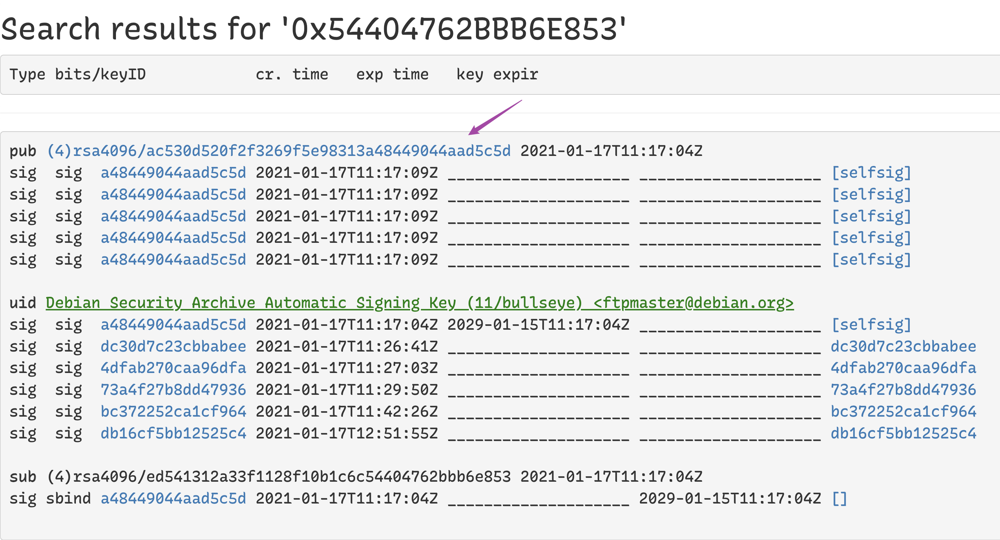

<!-- START doctoc generated TOC please keep comment here to allow auto update -->
<!-- DON'T EDIT THIS SECTION, INSTEAD RE-RUN doctoc TO UPDATE -->

- [apt](#apt)
  - [apt configuration](#apt-configuration)
  - [necessory pckages and dependencies](#necessory-pckages-and-dependencies)
  - [package auto-upgrade dislable](#package-auto-upgrade-dislable)
  - [disable server auto upgrade](#disable-server-auto-upgrade)
    - [revert hold settings](#revert-hold-settings)
    - [show all hold](#show-all-hold)
  - [complete remove an app](#complete-remove-an-app)
  - [keyring](#keyring)
    - [`apt-key`](#apt-key)
    - [`curl`](#curl)
  - [gpg keys](#gpg-keys)
    - [`gpg`](#gpg)
    - [Ghostbird/add-repository](#ghostbirdadd-repository)
    - [openmediavault-keyring](#openmediavault-keyring)
    - [others](#others)
  - [apt-cache](#apt-cache)
    - [get package name by command](#get-package-name-by-command)
    - [search package name for apt-get](#search-package-name-for-apt-get)

<!-- END doctoc generated TOC please keep comment here to allow auto update -->

> [!NOTE|label:references:]
> - [Google Linux Software Repositories](https://www.google.com/linuxrepositories/)
> - [How To Build a Debian Packages](https://forums.debian.net/viewtopic.php?f=16&t=38976)
> - [Official Archive Mirrors for Ubuntu](https://launchpad.net/ubuntu/+archivemirrors)

# apt

> [!TIP|label:download deb only]
> - [Is there an apt command to download a deb file from the repositories to the current directory?](https://askubuntu.com/a/30581/92979)
>   ```bash
>   # get package name
>   $ sudo apt list --installed | grep <keywords>
>   $ apt-get install --reinstall --print-uris -qq <package-name> | cut -d"'" -f2
>   ```

## apt configuration
```bash
$ cat /etc/apt/apt.conf
Acquire::http::Proxy "http://161.91.27.236:8080";
Acquire::https::Proxy "http://161.91.27.236:8080";
Acquire::ftp::Proxy "http://161.91.27.236:8080";

$ cat /etc/apt/apt.conf.d/99ignoresave
Dir::Ignore-Files-Silently:: "(.save|.distupgrade)$";
Dir::Ignore-Files-Silently:: "\.gz$";
Dir::Ignore-Files-Silently:: "\.save$";
Dir::Ignore-Files-Silently:: "\.distUpgrade$";
Dir::Ignore-Files-Silently:: "\.list_$";
```

## necessory pckages and dependencies
```bash
$ sudo apt --list upgradable
$ sudo apt upgrade
$ sudo apt install sysv-rc-conf tree dos2unix iptables-persistent mailutils policycoreutils build-essential landscape-common gcc g++ make cmake
```

## package auto-upgrade dislable
```bash
$ sudo sed -i 's/Prompt=.*/Prompt=never/' /etc/update-manager/release-upgrades
$ sudo sed -i 's/"1"/"0"/' /etc/apt/apt.conf.d/10periodic
$ sudo sed -i 's/"1"/"0"/' /etc/apt/apt.conf.d/20auto-upgrades
```

## disable server auto upgrade
```bash
# dpkg --list | grep jenkins
ii  jenkins                            2.19.4                             all          Jenkins monitors executions of repeated jobs, such as building a software
# echo "jenkins hold" | dpkg --set-selections
OR
# apt-mark hold jenkins
# dpkg --list | grep jenkins
hi  jenkins                            2.19.4                             all          Jenkins monitors executions of repeated jobs, such as building a software
```

### revert hold settings
```bash
$ sudo echo "jenkins install" | dpkg --set-selections
# OR
$ sudo apt-mark unhold jenkins
```

### show all hold
```bash
$ sudo apt-mark showhold
```

## complete remove an app
```bash
$ sudo systemctl stop mysql
$ sudo apt-get --purge autoremove mysql*
$ sudo apt-get autoclean
$ sudo apt --purge autoremove mysql*
$ sudo apt autoclean
$ sudo apt list --installed | grep mysql
$ sudo rm -rf /var/lib/mysql/debian-*.flag
$ sudo rm -rf /var/lib/mysql
$ sudo rm -rf /etc/mysql
```


## keyring

> [!NOTE]
> - [* iMarslo : gpg](../../cheatsheet/bash/bash.html#gpg)
> - [step by step by `apt-key add`](https://github.com/microsoft/WSL/issues/3286#issuecomment-402594992)
> - [Hockeypuck OpenPGP keyserver](http://keyserver.ubuntu.com/)
> - for
>   ```bash
>   The following signatures couldn't be verified because the public key is not available: NO_PUBKEY 112696A0E562B32A NO_PUBKEY 54404762BBB6E853
>   ```

### `apt-key`
```bash
$ apt-key adv --keyserver hkp://keyserver.ubuntu.com:80 --recv-keys 54404762BBB6E853
# or
$ apt-key adv --keyserver keyserver.ubuntu.com --recv-keys 54404762BBB6E853
```

### `curl`

> [!NOTE|label:references:]
> - [#3286: Ubuntu 18.04 gpg dirmngr IPC connect call failed](https://github.com/microsoft/WSL/issues/3286#issuecomment-402594992)

```bash
#                                                                0x<PUBKEY>
#                                                                v
$ curl -sL "http://keyserver.ubuntu.com/pks/lookup?op=get&search=0x112696A0E562B32A" | sudo apt-key add
$ curl -sL "http://keyserver.ubuntu.com/pks/lookup?op=get&search=0x54404762BBB6E853" | sudo apt-key add
```

- or manually download
  ```bash
  $ cat armored-keys.asc | sudo apt-key add
  ```

  

## gpg keys

> [!NOTE|label:references:]
> - [Omv and Apt broken: Pending configuration changes](https://forum.openmediavault.org/index.php?thread/48094-omv-and-apt-broken-pending-configuration-changes/&postID=352338#post352338)
>   - `$ sudo dpkg -l | grep openmediavault`
>   - `$ sudo ls -alh /etc/apt/trusted.gpg.d/`
> - [apt-get update errors missing public keys](https://forum.openmediavault.org/index.php?thread/49140-apt-get-update-errors-missing-public-keys/)
> - [The following signatures couldn't be verified because the public key is not available](https://forums.raspberrypi.com/viewtopic.php?t=352539)

### `gpg`
```bash
$ gpg --keyserver hkp://keyserver.ubuntu.com:80 --recv-keys 3FA7E0328081BFF6A14DA29AA6A19B38D3D831EF
```
- more options
  ```bash
  $ gpg --ignore-time-conflict \
        --no-options \
        --no-default-keyring \
        --homedir /tmp/tmp.Hrb5ETPac2 \
        --no-auto-check-trustdb \
        --trust-model always \
        --keyring /etc/apt/trusted.gpg \
        --primary-keyring /etc/apt/trusted.gpg \
        --keyserver keyserver.ubuntu.com \
        --recv-keys 3FA7E0328081BFF6A14DA29AA6A19B38D3D831EF
  ```

- or install keyring via `apt-key`
  ```bash
  $ sudo apt-key adv --keyserver keyserver.ubuntu.com --recv-keys 112695A0E562B32A
  ```

### [Ghostbird/add-repository](https://gist.github.com/Ghostbird/83eb5bcd2ffd4a6b6966137a2e1c4caf)
```bash
$ ./add-repository "https://keyserver.ubuntu.com/pks/lookup?search=0x3fa7e0328081bff6a14da29aa6a19b38d3d831ef&op=get" "deb https://download.mono-project.com/repo/debian stable-buster main" mono-official-stable.list
```

### openmediavault-keyring
```bash
$ cd /tmp
$ sudo wget https://packages.openmediavault.org/public/pool/main/o/openmediavault-keyring/openmediavault-keyring_1.0.2-2_all.deb
$ sudo dpkg -i openmediavault-keyring
$ sudo apt-get update
```

### [others](https://github.com/mono/mono/issues/21584#issuecomment-1354833031)
```bash
# dockerfile
RUN apt install -y gnupg ca-certificates
RUN gpg --keyserver keyserver.ubuntu.com --recv 3FA7E0328081BFF6A14DA29AA6A19B38D3D831EF
RUN gpg --export 3FA7E0328081BFF6A14DA29AA6A19B38D3D831EF | tee /usr/share/keyrings/mono.gpg >/dev/null
RUN gpg --batch --yes --delete-keys 3FA7E0328081BFF6A14DA29AA6A19B38D3D831EF
RUN echo "deb [signed-by=/usr/share/keyrings/mono.gpg] https://download.mono-project.com/repo/debian stable-buster main" | tee /etc/apt/sources.list.d/mono-official-stable.list
RUN apt update
RUN apt install -y mono-devel
```

## apt-cache
### get package name by command
```bash
$ apt-cache search mkpasswd
whois - intelligent WHOIS client
libstring-mkpasswd-perl - Perl module implementing a random password generator
```

### search package name for apt-get
```bash
$ sudo apt-cache search chrome browser
chromium-browser - Chromium browser
chromium-chromedriver - WebDriver driver for the Chromium Browser
cloudprint - Server for Google Cloud Print
collabtive - Web-based project management software
epiphany-browser - Intuitive GNOME web browser
jsxgraph - Interactive Geometry with JavaScript
kpartsplugin - Netscape-compatible plugin to embed KDE file-viewers into browser
libjs-excanvas - HTML5 Canvas for Internet Explorer
libjs-jquery-jplayer - HTML5 Audio & Video for jQuery with a Flash fallback
libjs-jquery-jush - jQuery Syntax Highlighter
google-chrome-beta - The web browser from Google
google-chrome-stable - The web browser from Google
google-chrome-unstable - The web browser from Google
```
