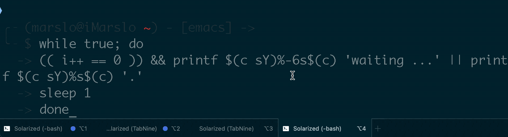
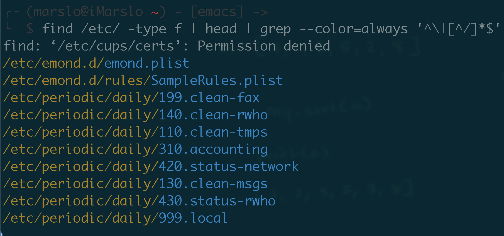

<!-- START doctoc generated TOC please keep comment here to allow auto update -->
<!-- DON'T EDIT THIS SECTION, INSTEAD RE-RUN doctoc TO UPDATE -->

- [process bar](#process-bar)
  - [with dot `.`](#with-dot-)
  - [with `▉ ▎ ▌ ▊`](#with-%E2%96%89-%E2%96%8E-%E2%96%8C-%E2%96%8A)
  - [with `[###----]`](#with-----)
  - [with `|\|/`](#with-%5C)
  - [Integralist/python progress bar.py](#integralistpython-progress-barpy)
- [save & restore screen](#save--restore-screen)
  - [`tput`](#tput)
  - [`echo`](#echo)
- [terminfo escape sequences](#terminfo-escape-sequences)
- [`tput`](#tput-1)
  - [reset terminal](#reset-terminal)
  - [clear screen](#clear-screen)
  - [show term](#show-term)
  - [show terminal width](#show-terminal-width)
  - [customized colorful output](#customized-colorful-output)
- [`Operation not permitted`](#operation-not-permitted)

<!-- END doctoc generated TOC please keep comment here to allow auto update -->


## process bar

> reference:
> - [How to add a progress bar to a shell script?](https://stackoverflow.com/questions/238073/how-to-add-a-progress-bar-to-a-shell-script)


### with dot `.`
> reference:
> - [colorful output : `c()`](https://raw.githubusercontent.com/ppo/bash-colors/master/bash-colors.sh)
> - [`c()` can be also found in .marslorc](https://github.com/marslo/mylinux/blob/master/confs/home/.marslo/.marslorc#L138)

```bash
while true; do
  (( i++ == 0 )) && printf $(c sY)%-6s$(c) 'waiting ...' || printf $(c sY)%s$(c) '.'
  sleep 1
done
```


### [with `▉ ▎ ▌ ▊`](https://stackoverflow.com/a/65532561/2940319)
> another:
> - [A progress bar for the shell](https://ownyourbits.com/2017/07/16/a-progress-bar-for-the-shell/)

```bash
# main function designed for quickly copying to another program
progressBar() {
  Bar=""                                  # Progress Bar / Volume level
  Len=25                                  # Length of Progress Bar / Volume level
  Div=4                                   # Divisor into Volume for # of blocks
  Fill="▒"                                # Fill up to $Len
  Arr=( "▉" "▎" "▌" "▊" )                 # UTF-8 left blocks: 7/8, 1/4, 1/2, 3/4

  FullBlock=$((${1} / Div))               # Number of full blocks
  PartBlock=$((${1} % Div))               # Size of partial block (array index)

  while [[ $FullBlock -gt 0 ]]; do
      Bar="$Bar${Arr[0]}"                 # Add 1 full block into Progress Bar
      (( FullBlock-- ))                   # Decrement full blocks counter
  done

  # if remainder zero no partial block, else append character from array
  if [[ $PartBlock -gt 0 ]]; then Bar="$Bar${Arr[$PartBlock]}"; fi

  # Pad Progress Bar with fill character
  while [[ "${#Bar}" -lt "$Len" ]]; do Bar="$Bar$Fill"; done

  echo progress : "$1 $Bar"
  exit 0                                  # Remove this line when copying into program
} # progressBar

Main () {
  tput civis                              # Turn off cursor
  for ((i=0; i<=100; i++)); do
    CurrLevel=$(progressBar "$i")         # Generate progress bar 0 to 100
    echo -ne "$CurrLevel"\\r              # Reprint overtop same line
    sleep .04
  done
  echo -e \\n                             # Advance line to keep last progress
  echo "$0 Done"
  tput cnorm                              # Turn cursor back on
} # main

Main "$@"
```


### [with `[###----]`](https://stackoverflow.com/a/64932365/2940319)
> another solution:
> - [fearside/ProgressBar](https://github.com/fearside/ProgressBar/blob/master/progressbar.sh)

```bash
BAR='##############################'
FILL='------------------------------'
totalLines=100
barLen=30
count=0

while [ ${count} -lt ${totalLines} ]; do
  # update progress bar
  count=$(( ${count}+ 1 ))
  percent=$(( (${count} * 100 / ${totalLines} * 100)/ 100 ))
  i=$(( ${percent} * ${barLen} / 100 ))
  echo -ne "\r[${BAR:0:$i}${FILL:$i:barLen}] ${count}/${totalLines} (${percent}%)"
  sleep .1
done
```
![progress bar with `[###----]`](../../screenshot/shell/shell-waiting-progress-bar3.gif)

### [with `|\|/`](https://stackoverflow.com/a/3330834/2940319)
```bash
while :; do
  for s in / - \\ \|
    do printf "\r$s"
    sleep .1
  done
done
```


### [Integralist/python progress bar.py](https://gist.github.com/Integralist/01aed051251476c4bd6daa4b076eb23a)

## save & restore screen

> reference
> - [Terminal codes (ANSI/VT100) introduction](https://wiki.bash-hackers.org/scripting/terminalcodes)


### `tput`
- clear
  ```bash
  $ tput smcup
  ```
- restore
  ```bash
  $ tput rmcup
  ```

### `echo`
- save
  ```bash
  $ echo -e '\033[?47h'
  ```
- restore
  ```bash
  $ echo -e '\033[?47l'
  ```

## terminfo escape sequences
```bash
$ infocmp
  ...
  colors#256, cols#80, it#8, lines#24, pairs#32767,
  bel=^G, blink=\E[5m, bold=\E[1m, cbt=\E[Z, civis=\E[?25l,
  clear=\E[H\E[2J, cnorm=\E[?12l\E[?25h, cr=^M,
  ...
```

## `tput`
### reset terminal

> [!NOTE]
> - [Shell does not show typed-in commands, what do I do to fix it?](https://askubuntu.com/a/1238357/92979)

```bash
$ reset
# or
$ stty sane
```

### clear screen
```bash
$ tput home

# or
$ tput cup %py %px
# or
$ tput cup %py %px >/dev/null
```

### show term
```bash
$ tput color
```

### show terminal width
```bash
$ tput cols
```

### [customized colorful output](https://unix.stackexchange.com/a/163781/29178)


> references:
> - [imarslo: highlight output](../../cheatsheet/tricky.html#highlight-output)


```bash
$ export GREP_COLORS="sl=0;33;49:ms=1;34;49"
$ find /etc/ -type f | head | grep --color=always '^\|[^/]*$'
```


## `Operation not permitted`

> [!NOTE|label:references:]
> - [How to Fix 'rm: cannot remove '/etc/resolv.conf': Operation not permitted'](https://support.tools/post/fix-stuck-resolv-conf/)
> - [Can not edit resolv.conf](https://askubuntu.com/a/1276691/92979)
> - [Un-removable /etc/resolv.conf](https://askubuntu.com/questions/125847/un-removable-etc-resolv-conf)
>
> - mac equivalent
>   - [chflags](https://ss64.com/mac/chflags.html)
>   - `/bin/ls -lO`
>     ```bash
>     $ /bin/ls -lO
>     total 288
>     -rwxr-xr-x@  1 marslo  staff  compressed,dataless 1116834851 Feb 21 17:00 Ubuntu2204-221101.AppxBundle
>     ```

```bash
$ sudo lsattr /etc/resolv.conf
----i-------------- /etc/resolv.conf
$ sudo rm -rf /etc/resolv.conf
rm: cannot remove '/etc/resolv.conf': Operation not permitted

# solution
$ sudo chattr -i /etc/resolv.conf
$ sudo lsattr /etc/resolv.conf
------------------- /etc/resolv.conf
$ sudo mv /etc/resolv.conf{,.bak}

# revert back
$ sudo chattr +i /etc/resolv.conf
$ sudo lsattr /etc/resolv.conf
----i-------------- /etc/resolv.conf
```
