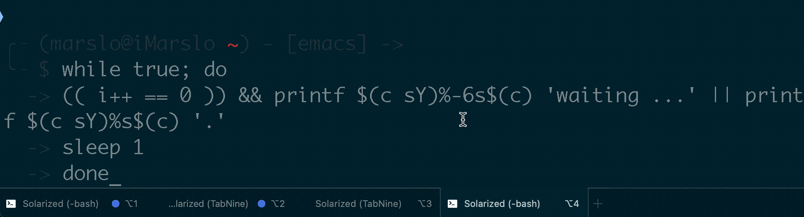
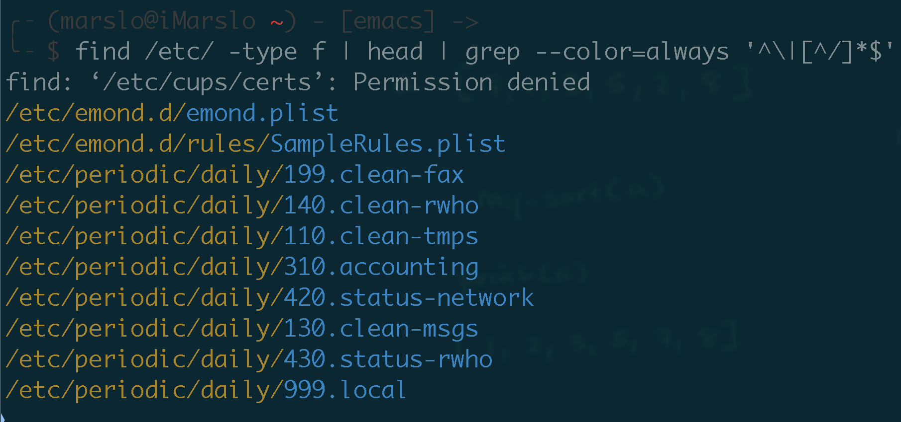

<!-- START doctoc generated TOC please keep comment here to allow auto update -->
<!-- DON'T EDIT THIS SECTION, INSTEAD RE-RUN doctoc TO UPDATE -->

- [process bar](#process-bar)
  - [with dot `.`](#with-dot-)
  - [with `▉ ▎ ▌ ▊`](#with-%E2%96%89-%E2%96%8E-%E2%96%8C-%E2%96%8A)
  - [with `[###----]`](#with-----)
  - [with `|\|/`](#with-%5C)
  - [Integralist/python progress bar.py](#integralistpython-progress-barpy)
- [spinner](#spinner)
  - [Braille Patterns](#braille-patterns)
  - [others](#others)
  - [bash script](#bash-script)
- [save & restore screen](#save--restore-screen)
  - [`tput`](#tput)
  - [`echo`](#echo)
- [terminfo escape sequences](#terminfo-escape-sequences)
- [`tput`](#tput-1)
  - [reset terminal](#reset-terminal)
  - [clear screen](#clear-screen)
  - [show term](#show-term)
  - [show terminal width](#show-terminal-width)
  - [customized colorful output](#customized-colorful-output)
- [`Operation not permitted`](#operation-not-permitted)
- [array](#array)
  - [differences in bash parameter calls](#differences-in-bash-parameter-calls)
  - [wildcard expansion](#wildcard-expansion)

<!-- END doctoc generated TOC please keep comment here to allow auto update -->


## process bar

> reference:
> - [How to add a progress bar to a shell script?](https://stackoverflow.com/questions/238073/how-to-add-a-progress-bar-to-a-shell-script)


### with dot `.`
> reference:
> - [colorful output : `c()`](https://raw.githubusercontent.com/ppo/bash-colors/master/bash-colors.sh)
> - [`c()` can be also found in .marslorc](https://github.com/marslo/mylinux/blob/master/confs/home/.marslo/.marslorc#L138)

```bash
while true; do
  (( i++ == 0 )) && printf $(c sY)%-6s$(c) 'waiting ...' || printf $(c sY)%s$(c) '.'
  sleep 1
done
```


### [with `▉ ▎ ▌ ▊`](https://stackoverflow.com/a/65532561/2940319)
> another:
> - [A progress bar for the shell](https://ownyourbits.com/2017/07/16/a-progress-bar-for-the-shell/)

```bash
# main function designed for quickly copying to another program
progressBar() {
  Bar=""                                  # Progress Bar / Volume level
  Len=25                                  # Length of Progress Bar / Volume level
  Div=4                                   # Divisor into Volume for # of blocks
  Fill="▒"                                # Fill up to $Len
  Arr=( "▉" "▎" "▌" "▊" )                 # UTF-8 left blocks: 7/8, 1/4, 1/2, 3/4

  FullBlock=$((${1} / Div))               # Number of full blocks
  PartBlock=$((${1} % Div))               # Size of partial block (array index)

  while [[ $FullBlock -gt 0 ]]; do
      Bar="$Bar${Arr[0]}"                 # Add 1 full block into Progress Bar
      (( FullBlock-- ))                   # Decrement full blocks counter
  done

  # if remainder zero no partial block, else append character from array
  if [[ $PartBlock -gt 0 ]]; then Bar="$Bar${Arr[$PartBlock]}"; fi

  # Pad Progress Bar with fill character
  while [[ "${#Bar}" -lt "$Len" ]]; do Bar="$Bar$Fill"; done

  echo progress : "$1 $Bar"
  exit 0                                  # Remove this line when copying into program
} # progressBar

Main () {
  tput civis                              # Turn off cursor
  for ((i=0; i<=100; i++)); do
    CurrLevel=$(progressBar "$i")         # Generate progress bar 0 to 100
    echo -ne "$CurrLevel"\\r              # Reprint overtop same line
    sleep .04
  done
  echo -e \\n                             # Advance line to keep last progress
  echo "$0 Done"
  tput cnorm                              # Turn cursor back on
} # main

Main "$@"
```


### [with `[###----]`](https://stackoverflow.com/a/64932365/2940319)
> another solution:
> - [fearside/ProgressBar](https://github.com/fearside/ProgressBar/blob/master/progressbar.sh)

```bash
BAR='##############################'
FILL='------------------------------'
totalLines=100
barLen=30
count=0

while [ ${count} -lt ${totalLines} ]; do
  # update progress bar
  count=$(( ${count}+ 1 ))
  percent=$(( (${count} * 100 / ${totalLines} * 100)/ 100 ))
  i=$(( ${percent} * ${barLen} / 100 ))
  echo -ne "\r[${BAR:0:$i}${FILL:$i:barLen}] ${count}/${totalLines} (${percent}%)"
  sleep .1
done
```
![progress bar with `[###----]`](../../screenshot/shell/shell-waiting-progress-bar3.gif)

### [with `|\|/`](https://stackoverflow.com/a/3330834/2940319)
```bash
while :; do
  for s in / - \\ \|
    do printf "\r$s"
    sleep .1
  done
done
```


### [Integralist/python progress bar.py](https://gist.github.com/Integralist/01aed051251476c4bd6daa4b076eb23a)

## spinner

> [!TIP|label:check more:]
> - [* iMarslo: gist/_spinner.md](https://gist.github.com/marslo/3f4b1eae28902394ad3201d1b5ea5537)

### Braille Patterns

> [!NOTE|label:references:]
> - [unicode - Braille Patterns](https://symbl.cc/en/unicode/blocks/braille-patterns/)
> - [wikipedia - Braille Patterns](https://en.wikipedia.org/wiki/Braille_Patterns)
> - [SamEureka/spinner.sh](https://gist.github.com/SamEureka/3e61942d37256550b40d0ffe75bc22c4)
> - [Braille Patterns - U2800.pdf](https://unicode.org/charts/PDF/U2800.pdf)
>
>> 
>>
>> ```
>> +---+---+
>> | 1 | 4 |
>> +---+---+
>> | 2 | 5 |
>> +---+---+
>> | 3 | 6 |
>> +---+---+
>> | 7 | 8 |
>> +---+---+
>> ```

#### 4-dots

| UNICODE | ICON | HTML ENCODING | COMMENTS |
|:-------:|:----:|:-------------:|----------|
|  `28C4` |   ⣄  |   `&#x28C4;`  | `378`    |
|  `28C6` |   ⣆  |   `&#x28C6;`  | `2378`   |
|  `2847` |   ⡇  |   `&#x2847;`  | `1237`   |
|  `280F` |   ⠏  |   `&#x280F;`  | `1234`   |
|  `280B` |   ⠋  |   `&#x280B;`  | `124`    |
|  `2839` |   ⠹  |   `&#x2839;`  | `1456`   |
|  `28B8` |   ⢸  |   `&#x28B8;`  | `4568`   |
|  `28F0` |   ⣰  |   `&#x28F0;`  | `5678`   |
|  `28E0` |   ⣠  |   `&#x28E0;`  | `678`    |


[](https://github.com/marslo/iDevOps/raw/master/screenshot/spinner/spinner-8.gif)

```bash
local spinner=( '⣄' '⣆' '⡇' '⠏' '⠋' '⠹' '⢸' '⣰' '⣠' )
local spinner=(
  "$(c Rs)⣄$(c)"    # red
  "$(c Ys)⣆$(c)"    # yellow
  "$(c Gs)⡇$(c)"    # green
  "$(c Bs)⠏$(c)"    # blue
  "$(c Ms)⠋$(c)"    # magenta
  "$(c Ys)⠹$(c)"    # yellow
  "$(c Gs)⢸$(c)"    # green
  "$(c Bs)⣰$(c)"    # blue
  "$(c Ms)⣠$(c)"    # magenta
)
```

#### 7-dots

| UNICODE | ICON | HTML ENCODING | COMMENTS  |
|:-------:|:----:|:-------------:|-----------|
|  `28FE` |   ⣾  |   `&#x28FE;`  | `2345678` |
|  `28FD` |   ⣽  |   `&#x28FD;`  | `1345678` |
|  `28FB` |   ⣻  |   `&#x28FB;`  | `1245678` |
|  `28BF` |   ⢿  |   `&#x28BF;`  | `1234568` |
|  `287F` |   ⡿  |   `&#x287F;`  | `1234567` |
|  `28DF` |   ⣟  |   `&#x28DF;`  | `1234578` |
|  `28EF` |   ⣯  |   `&#x28EF;`  | `1234678` |
|  `28F7` |   ⣷  |   `&#x28F7;`  | `1235678` |

[](https://github.com/marslo/iDevOps/raw/master/screenshot/spinner/spinner-5.gif)

```bash
local spinner=( '⣾' '⣽' '⣻' '⢿' '⡿' '⣟' '⣯' '⣷' '⣿' )
local spinner=(
  "$(c Rs)⣾$(c)"     # red
  "$(c Ys)⣽$(c)"     # yellow
  "$(c Gs)⣻$(c)"     # green
  "$(c Cs)⢿$(c)"     # cyan
  "$(c Rs)⡿$(c)"     # red
  "$(c Ys)⣟$(c)"     # yellow
  "$(c Gs)⣯$(c)"     # green
  "$(c Cs)⣷$(c)"     # cyan
)
```

#### 1-dot

[](https://github.com/marslo/iDevOps/raw/master/screenshot/spinner/spinner-6.gif)

```bash
local spinner=( '⠁' '⠂' '⠄' '⡀' '⢀' '⠠' '⠐' '⠈' )
local spinner=(
  "$(c Ys)⠁$(c)"     # yellow
  "$(c Gs)⠂$(c)"     # green
  "$(c Cs)⠄$(c)"     # cyan
  "$(c Ms)⡀$(c)"     # magenta
  "$(c Ys)⢀$(c)"     # yellow
  "$(c Gs)⠠$(c)"     # green
  "$(c Cs)⠐$(c)"     # cyan
  "$(c Ms)⠈$(c)"     # magenta
)
```

### others

[](https://github.com/marslo/iDevOps/raw/master/screenshot/spinner/spinner-2.gif)

```bash
local spinner=( '∙∙∙∙∙' '●∙∙∙∙' '∙●∙∙∙' '∙∙●∙∙' '∙∙∙●∙' '∙∙∙∙●' )
local spinner=(
  "∙∙∙∙∙"
  "$(c Ys)●$(c)∙∙∙∙"     # yellow
  "∙$(c Gs)●$(c)∙∙∙"     # green
  "∙∙$(c Cs)●$(c)∙∙"     # cyan
  "∙∙∙$(c Bs)●$(c)∙"     # blue
  "∙∙∙∙$(c Ms)●$(c)"     # magenta
)
local spinner=(
  "$(c Rs)∙∙∙∙∙$(c)"     # red
  "$(c Ys)●∙∙∙∙$(c)"     # yellow
  "$(c Gs)∙●∙∙∙$(c)"     # green
  "$(c Cs)∙∙●∙∙$(c)"     # cyan
  "$(c Bs)∙∙∙●∙$(c)"     # blue
  "$(c Ms)∙∙∙∙●$(c)"     # magenta
)
```

### bash script

#### [with stdout](https://gist.github.com/marslo/3f4b1eae28902394ad3201d1b5ea5537#file-spinner-with-stdout-sh)

> [!TIP|label:use case:]
> - [* iMarslo: ccm.sh - copilot commit message](https://github.com/marslo/dotfiles/blob/main/.marslo/bin/ccm.sh)

<!--sec data-title="spinner with stdout from sub-process/sub-command" data-id="section0" data-show=true data-collapse=true ces-->
```bash
#!/usr/bin/env bash

# credit: https://github.com/ppo/bash-colors
# shellcheck disable=SC2015,SC2059
c() { [ $# == 0 ] && printf "\e[0m" || printf "$1" | sed 's/\(.\)/\1;/g;s/\([SDIUFNHT]\)/2\1/g;s/\([KRGYBMCW]\)/3\1/g;s/\([krgybmcw]\)/4\1/g;y/SDIUFNHTsdiufnhtKRGYBMCWkrgybmcw/12345789123457890123456701234567/;s/^\(.*\);$/\\e[\1m/g'; }

# capture ctrl-c to exit the sub-process
# return the sub-process stdout ( to external variable )
function withSpinner() {
  local msg="$1"; shift
  local __resultvar="$1"; shift
  local spinner=(
    "$(c Rs)⣾$(c)"
    "$(c Ys)⣽$(c)"
    "$(c Gs)⣻$(c)"
    "$(c Cs)⢿$(c)"
    "$(c Rs)⡿$(c)"
    "$(c Ys)⣟$(c)"
    "$(c Gs)⣯$(c)"
    "$(c Cs)⣷$(c)"
  )
  local frame=0
  local output
  local cmdPid
  local pgid=''
  local interrupted=0

  # define the cursor recovery function
  restoreCursor() { printf "\033[?25h" >&2; }

  # make sure that any exit restores the cursor
  trap 'restoreCursor' EXIT

  # hide cursor
  printf "\033[?25l" >&2
  printf "%s " "$msg" >&2

  set -m
  trap 'interrupted=1; [ -n "$pgid" ] && kill -TERM -- -$pgid 2>/dev/null' INT

  # use file descriptor to capture output
  local tmpout
  tmpout=$(mktemp)
  exec 3<> "${tmpout}"

  # shellcheck disable=SC2031,SC2030
  output="$(
    {
      # execute command and redirect output to file descriptor 3
      "$@" >&3 2>/dev/null &
      cmdPid=$!
      pgid=$(ps -o pgid= "$cmdPid" | tr -d ' ')

      # update the spinner while the command is running
      while kill -0 "$cmdPid" 2>/dev/null && (( interrupted == 0 )); do
        printf "\r\033[K%s %b" "${msg}" "${spinner[frame]}" >&2
        ((frame = (frame + 1) % ${#spinner[@]}))
        sleep 0.08
      done

      wait "$cmdPid" 2>/dev/null
      # show the captured content
      cat "${tmpout}"
    }
  )"

  # clean the temporary file
  exec 3>&-
  rm -f "${tmpout}"

  # \r : beginning of line
  # \033[K : clear current position to end of line
  # shellcheck disable=SC2031
  if (( interrupted )); then
    printf "\r\033[K\033[31m✗\033[0m Interrupted!\033[K\n" >&2
    [ -n "${pgid}" ] && kill -TERM -- -"${pgid}" 2>/dev/null
  else
    # or using `printf "\r" >&2` directly without sub-progress status output
    printf "\r\033[K\033[32m✓\033[0m Done!\033[K\n" >&2
  fi

  # assign the result to an external variable
  printf -v "$__resultvar" "%s" "$output"
}

function main() {
  # shellcheck disable=SC2155
  local tmpfile=$(mktemp)
  trap 'rm -f "${tmpfile}"' EXIT

  local response
  withSpinner "Loading..." response \
    curl -s https://<API> ...

  # check curl output
  echo "${response}"
}

main "$@"

# vim:tabstop=2:softtabstop=2:shiftwidth=2:expandtab:filetype=sh:
```
<!--endsec-->

#### [with exitcode](https://gist.github.com/marslo/3f4b1eae28902394ad3201d1b5ea5537#file-spinner-with-exitcode-sh)

<!--sec data-title="bash spinner with exitcode from sub-process/sub-command" data-id="section1" data-show=true data-collapse=true ces-->
```bash
#!/usr/bin/env bash

# credit: https://github.com/ppo/bash-colors
# shellcheck disable=SC2015,SC2059
c() { [ $# == 0 ] && printf "\e[0m" || printf "$1" | sed 's/\(.\)/\1;/g;s/\([SDIUFNHT]\)/2\1/g;s/\([KRGYBMCW]\)/3\1/g;s/\([krgybmcw]\)/4\1/g;y/SDIUFNHTsdiufnhtKRGYBMCWkrgybmcw/12345789123457890123456701234567/;s/^\(.*\);$/\\e[\1m/g'; }

# capture ctrl-c to exit the sub-process
function withSpinner() {
  local msg="$1"; shift
  local __resultvar="$1"; shift
  local spinner=(
    "$(c Rs)⣄$(c)"
    "$(c Ys)⣆$(c)"
    "$(c Gs)⡇$(c)"
    "$(c Bs)⠏$(c)"
    "$(c Ms)⠋$(c)"
    "$(c Ys)⠹$(c)"
    "$(c Gs)⢸$(c)"
    "$(c Bs)⣰$(c)"
    "$(c Ms)⣠$(c)"
  )
  local frame=0
  local output
  local cmdPid
  local pgid=""
  local interrupted=0

  # explicit recovery cursor
  function restoreCursor() { printf "\033[?25h" >&2; }

  # ensure that any exit restores the cursor.
  trap 'restoreCursor' EXIT

  # hide cursor
  printf "\033[?25l" >&2
  printf "%s " "${msg}" >&2

  set -m
  trap 'interrupted=1; [ -n "${pgid}" ] && kill -TERM -- -${pgid} 2>/dev/null' INT

  # shellcheck disable=SC2034,SC2030
  output="$(
    {
      "$@" 2>/dev/null &
      cmdPid=$!
      pgid=$(ps -o pgid= ${cmdPid} | tr -d ' ')
      echo "${pgid}" > "${tmpfile}"

      while kill -0 "$cmdPid" 2>/dev/null && (( interrupted == 0 )); do
        printf "\r\033[K%s %b" "${msg}" "${spinner[frame]}" >&2
        ((frame = (frame + 1) % ${#spinner[@]}))
        sleep 0.1
      done

      wait "${cmdPid}" 2>/dev/null
    }
  )"

  # \r : beginning of line
  # \033[K : clear current position to end of line
  if (( interrupted )); then
    printf "\r\033[K\033[31m✗\033[0m Interrupted!\033[K\n" >&2
    # shellcheck disable=SC2031
    [ -n "${pgid}" ] && kill -TERM -- -"${pgid}" 2>/dev/null
  else
    printf "\r\033[K\033[32m✓\033[0m Done!\033[K\n" >&2
  fi

  # a separate recovery cursor is no longer required because the exit trap is handled
}

# main function
function main() {
  tmpfile=$(mktemp)
  trap 'rm -f "${tmpfile}"' EXIT

  withSpinner "Loading..." result sleep 5
  echo "Exit code: $?"
}

main "$@"

# vim:tabstop=2:softtabstop=2:shiftwidth=2:expandtab:filetype=sh:
```
<!--endsec-->

## save & restore screen

> reference
> - [Terminal codes (ANSI/VT100) introduction](https://wiki.bash-hackers.org/scripting/terminalcodes)


### `tput`
- clear
  ```bash
  $ tput smcup
  ```
- restore
  ```bash
  $ tput rmcup
  ```

### `echo`
- save
  ```bash
  $ echo -e '\033[?47h'
  ```
- restore
  ```bash
  $ echo -e '\033[?47l'
  ```

## terminfo escape sequences
```bash
$ infocmp
  ...
  colors#256, cols#80, it#8, lines#24, pairs#32767,
  bel=^G, blink=\E[5m, bold=\E[1m, cbt=\E[Z, civis=\E[?25l,
  clear=\E[H\E[2J, cnorm=\E[?12l\E[?25h, cr=^M,
  ...
```

## `tput`
### reset terminal

> [!NOTE]
> - [Shell does not show typed-in commands, what do I do to fix it?](https://askubuntu.com/a/1238357/92979)

```bash
$ reset
# or
$ stty sane
```

### clear screen
```bash
$ tput home

# or
$ tput cup %py %px
# or
$ tput cup %py %px >/dev/null
```

### show term
```bash
$ tput color
```

### show terminal width
```bash
$ tput cols
```

### [customized colorful output](https://unix.stackexchange.com/a/163781/29178)


> references:
> - [imarslo: highlight output](../../cheatsheet/tricky.md#highlight-output)


```bash
$ export GREP_COLORS="sl=0;33;49:ms=1;34;49"
$ find /etc/ -type f | head | grep --color=always '^\|[^/]*$'
```


## `Operation not permitted`

> [!NOTE|label:references:]
> - [How to Fix 'rm: cannot remove '/etc/resolv.conf': Operation not permitted'](https://support.tools/post/fix-stuck-resolv-conf/)
> - [Can not edit resolv.conf](https://askubuntu.com/a/1276691/92979)
> - [Un-removable /etc/resolv.conf](https://askubuntu.com/questions/125847/un-removable-etc-resolv-conf)
>
> - mac equivalent
>   - [chflags](https://ss64.com/mac/chflags.html)
>   - `/bin/ls -lO`
>     ```bash
>     $ /bin/ls -lO
>     total 288
>     -rwxr-xr-x@  1 marslo  staff  compressed,dataless 1116834851 Feb 21 17:00 Ubuntu2204-221101.AppxBundle
>     ```

```bash
$ sudo lsattr /etc/resolv.conf
----i-------------- /etc/resolv.conf
$ sudo rm -rf /etc/resolv.conf
rm: cannot remove '/etc/resolv.conf': Operation not permitted

# solution
$ sudo chattr -i /etc/resolv.conf
$ sudo lsattr /etc/resolv.conf
------------------- /etc/resolv.conf
$ sudo mv /etc/resolv.conf{,.bak}

# revert back
$ sudo chattr +i /etc/resolv.conf
$ sudo lsattr /etc/resolv.conf
----i-------------- /etc/resolv.conf
```

## array

### differences in bash parameter calls

> [!NOTE:label:thinking:]
> I got a issue with/without `eval` commands like:
>> ```bash
>> local fdOpt="--type f --hidden --follow --unrestricted --ignore-file $HOME/.fdignore"
>> local ignores=(
>>   '*.pem' '*.p12'
>>   '*.png' '*.jpg' '*.jpeg' '*.gif' '*.svg'
>>   '*.zip' '*.tar' '*.gz' '*.bz2' '*.xz' '*.7z' '*.rar'
>>   'Music' '.target_book' '_book' 'OneDrive*'
>> )
>> while read -r pattern; do fdOpt+=" --exclude '${pattern}'"; done <<< "$(printf '%s\n' "${ignores[@]}")"
>> fdOpt+=' --exec-batch ls -t'
>> ```
> - the `--exclude` options are not passed correctly when using :
>>   ```bash
>>   fd . ${fdOpt} | fzf ${foption} --bind="enter:become(${VIM} {+})"
>>   ```
> - but it works when using `eval` :
>>   ```bash
>>   eval "fd . ${fdOpt}" | fzf ${foption} --bind="enter:become(${VIM} {+})"
>>   ```

> [!TIP|label:tips:]
>> since `fdOpt` is **a single string** (containing multiple arguments), Bash treats it as **one single argument** when passed to `fd`. This leads to the following issues:
>>
>> `--exclude '*.png'` is treated as **one single argument**, rather than **two separate ones**: `--exclude` and `'*.png'`;
>>
>> As a result, fd cannot correctly interpret the glob pattern and treats it as a literal string;
>> Therefore, `--exclude '*.png'` does not actually exclude anything.
>
> recommend using arrays to store multiple arguments and then pass them to the command.
>
>>   ```bash
>>   # array
>>   local -a fdArgs=(--type f --hidden --follow --unrestricted --ignore-file "${HOME}/.fdignore")
>>   local ignores=(
>>     '*.pem' '*.p12'
>>     '*.png' '*.jpg' '*.jpeg' '*.gif' '*.svg'
>>     '*.zip' '*.tar' '*.gz' '*.bz2' '*.xz' '*.7z' '*.rar'
>>     'Music' '.target_book' '_book' 'OneDrive*'
>>   )
>>
>>   for pattern in "${ignores[@]}"; do fdArgs+=(--exclude "${pattern}"); done
>>   fdArgs+=(--exec-batch ls -t)
>>
>>   #      array call
>>   #    +------------+
>>   fd . "${fdArgs[@]}" | fzf ${foption} --bind="enter:become(${VIM} {+})"
>>   ```
>
> details:
>
> | FORM                   | WORKS?                 | REASON                                                             |
> |------------------------|------------------------|--------------------------------------------------------------------|
> | `fd . ${fdOpt}`        | ❌ No                  | ${fdOpt} is a single string; arguments are not properly split      |
> | `eval "fd . ${fdOpt}"` | ✅ Yes                 | Bash re-splits the command string before execution, but it’s risky |
> | `fd . "${fdArgs[@]}"`  | ✅✅ Yes (Recommended) | Uses an argument array — most recommended, safe, and clean         |


| METHOD        | ARGUMENT PARSING                          | SAFETY  | WILDCARD EXPANSION   | RECOMMENDED USE CASE                                             |
|---------------|-------------------------------------------|---------|----------------------|------------------------------------------------------------------|
| `$cmd`        | ❌ Incorrect, treated as a single command | ❌ Low  | ❌ No                | Avoid using                                                      |
| `eval "$cmd"` | ✅ Correctly splits arguments             | ⚠️ Low  | ✅ Yes               | Quick testing or executing ad-hoc command strings                |
| `"${cmd[@]}"` | ✅ Correct and safe argument passing      | ✅ High | ❌ No (no expansion) | Recommended for building command argument lists programmatically |

```bash
$ ls
bar.bak  bar.txt  demo.sh  foo.log  foo.txt

$ bash demo.sh
→ Running: echo Listing *.txt with excludes: --exclude '*.log' --exclude '*.bak'
Listing bar.txt foo.txt with excludes: --exclude '*.log' --exclude '*.bak'
#       +-------------+
#     *.txt got expanded

→ Running with eval: echo Listing *.txt with excludes: --exclude '*.log' --exclude '*.bak'
Listing bar.txt foo.txt with excludes: --exclude *.log --exclude *.bak
#       +-------------+
#     *.txt got expanded

→ Running with array: echo Listing *.txt with excludes: --exclude *.log --exclude *.bak
Listing *.txt with excludes: --exclude *.log --exclude *.bak
```

```bash
$ cat -c demo.sh
#!/usr/bin/env bash

set -euo pipefail

function plainString() {
  local cmd="echo Listing *.txt with excludes: --exclude '*.log' --exclude '*.bak'"
  echo "→ Running: $cmd"
  $cmd
}

function evalString() {
  local cmd="echo Listing *.txt with excludes: --exclude '*.log' --exclude '*.bak'"
  echo "→ Running with eval: $cmd"
  eval "$cmd"
}

function arrayCall() {
  local -a cmd=("echo" "Listing" "*.txt" "with" "excludes:" "--exclude" "*.log" "--exclude" "*.bak")
  echo "→ Running with array: ${cmd[*]}"
  "${cmd[@]}"
}

plainString
echo ''
evalString
echo ''
arrayCall

# vim:tabstop=2:softtabstop=2:shiftwidth=2:expandtab:filetype=sh:
```

### wildcard expansion

| METHOD                | WILDCARD EXPANDED? | EXPLANATION                                                    |
|-----------------------|--------------------|----------------------------------------------------------------|
| `eval "echo *.txt"`   | ✅ Yes             | Shell expands the wildcard during evaluation                   |
| `eval "echo '*.txt'"` | ❌ No              | `'*.txt'` is a quoted string literal, not subject to expansion |
| `"${arr[@]}"`         | ❌ No              | Arguments are passed as literal strings, no globbing applied   |
