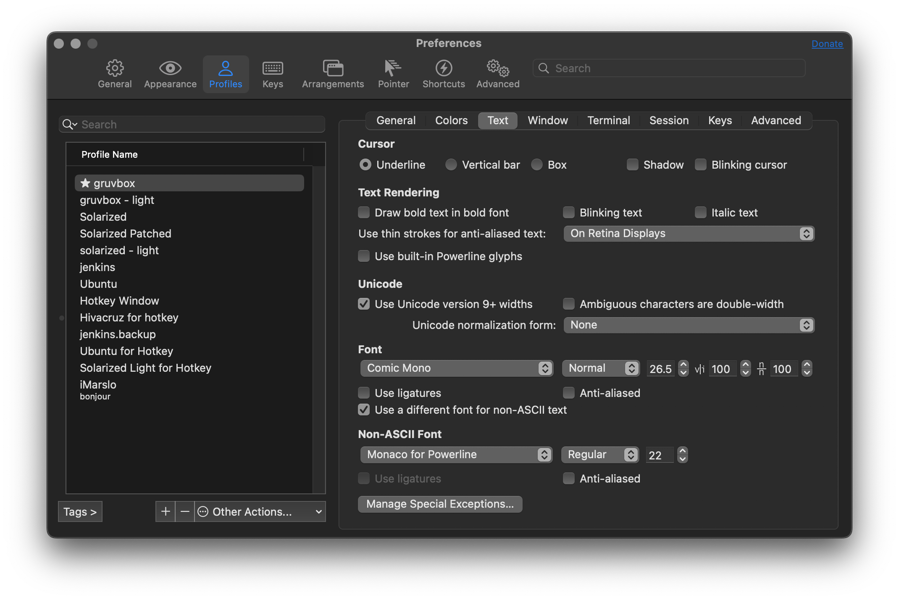
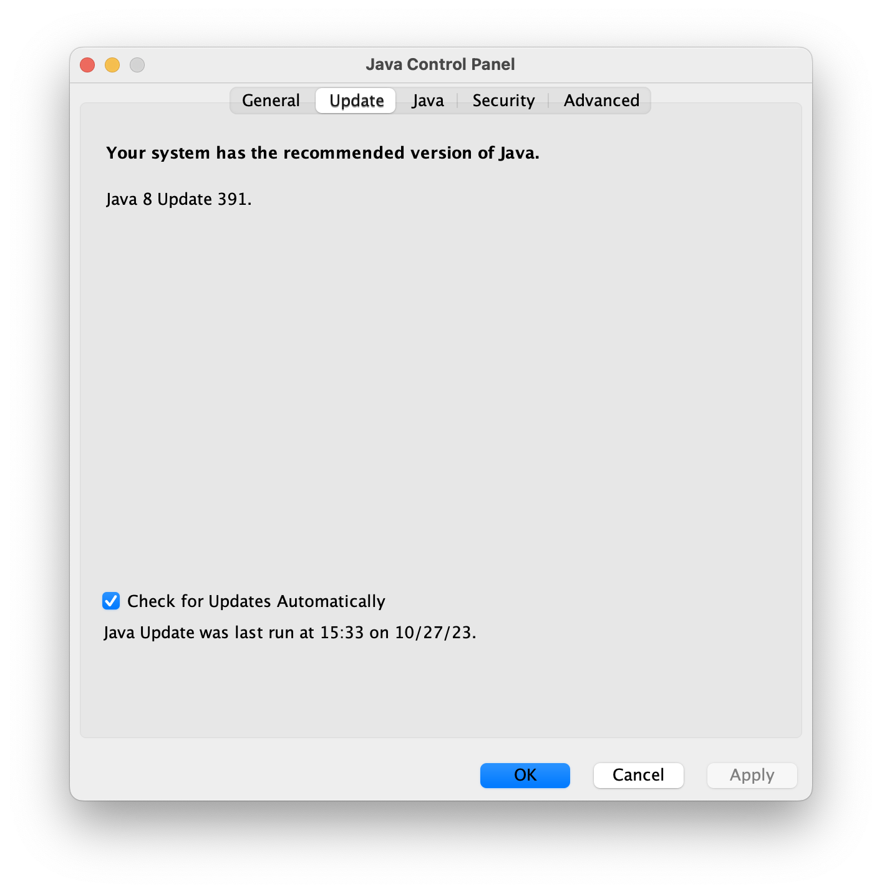
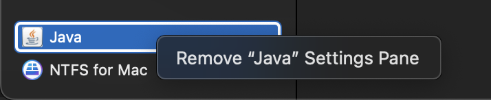

<!-- START doctoc generated TOC please keep comment here to allow auto update -->
<!-- DON'T EDIT THIS SECTION, INSTEAD RE-RUN doctoc TO UPDATE -->
**Table of Contents**  *generated with [DocToc](https://github.com/thlorenz/doctoc)*

- [homebrew](#homebrew)
  - [homebrew installation](#homebrew-installation)
  - [alternative sources](#alternative-sources)
  - [homebrew caskroom installation](#homebrew-caskroom-installation)
  - [list formula](#list-formula)
  - [install](#install)
  - [reinstall/downgrade](#reinstalldowngrade)
  - [tricky](#tricky)
- [install dmg](#install-dmg)
  - [install pkg inside dmg](#install-pkg-inside-dmg)
- [system settings](#system-settings)
- [tools](#tools)
  - [java](#java)
- [accessory](#accessory)
  - [iTerm2](#iterm2)
  - [powerline](#powerline)
  - [backgroundmusic](#backgroundmusic)
  - [mac cli](#mac-cli)
  - [others](#others)
- [trouble shooting](#trouble-shooting)
  - [`failed to connect to raw.githubusercontent.com port 443: connection refused`](#failed-to-connect-to-rawgithubusercontentcom-port-443-connection-refused)
  - [failure in `brew search` for cask formula](#failure-in-brew-search-for-cask-formula)
  - [A fatal error has been detected by the Java Runtime Environment : `SIGILL (0x4)`](#a-fatal-error-has-been-detected-by-the-java-runtime-environment--sigill-0x4)

<!-- END doctoc generated TOC please keep comment here to allow auto update -->


## homebrew

> [!TIP|label:references:]
> - [Mac 下 brew 切换为国内源](https://cloud.tencent.com/developer/article/1614039)
> - [homebrew for additional source](https://frankindev.com/2020/05/15/replace-homebrew-source/)

### homebrew installation
```bash
$ /usr/bin/ruby -e "$(curl -fsSL https://raw.githubusercontent.com/Homebrew/install/master/install)"
```

- default source
  ```bash
  $ git -C "$(brew --repo)" remote -v
  origin  git@github.com:Homebrew/brew (fetch)
  origin  git@github.com:Homebrew/brew (push)

  $ git -C "$(brew --repo homebrew/core)" remote -v
  origin  git@github.com:Homebrew/homebrew-core (fetch)
  origin  git@github.com:Homebrew/homebrew-core (push)
  ```

### alternative sources

- [homebrewCN](https://gitee.com/Busch/HomebrewCN)
  ```bash
  $ /bin/zsh -c "$(curl -fsSL https://gitee.com/cunkai/HomebrewCN/raw/master/Homebrew.sh)"
  ```

- official


  > [!NOTE|label:revert back]
  > ```bash
  > $ brew doctor
  > Please note that these warnings are just used to help the Homebrew maintainers
  > with debugging if you file an issue. If everything you use Homebrew for is
  > working fine: please don't worry or file an issue; just ignore this. Thanks!
  >
  > Warning: Suspicious https://github.com/Homebrew/brew git origin remote found.
  > The current git origin is:
  >   https://mirrors.ustc.edu.cn/brew.git
  >
  > With a non-standard origin, Homebrew won't update properly.
  > You can solve this by setting the origin remote:
  >   git -C "/usr/local/Homebrew" remote set-url origin https://github.com/Homebrew/brew
  >
  > Warning: Suspicious https://github.com/Homebrew/homebrew-core git origin remote found.
  > The current git origin is:
  >   https://mirrors.ustc.edu.cn/homebrew-core.git
  >
  > With a non-standard origin, Homebrew won't update properly.
  > You can solve this by setting the origin remote:
  >   git -C "/usr/local/Homebrew/Library/Taps/homebrew/homebrew-core" remote set-url origin https://github.com/Homebrew/homebrew-core
  > ```

  ```bash
  $ brew_source='https://github.com/Homebrew'
  # brew 程序本身
  $ git -C "$(brew --repo)" remote set-url origin ${brew_source}/brew.git

  $ git -C "$(brew --repo homebrew/core)" remote set-url origin ${brew_source}/homebrew-core.git
  $ git -C "$(brew --repo homebrew/cask)" remote set-url origin ${brew_source}/homebrew-cask.git
  $ git -C "$(brew --repo homebrew/cask-fonts)" remote set-url origin ${brew_source}/homebrew-cask-fonts.git
  $ git -C "$(brew --repo homebrew/cask-drivers)" remote set-url origin ${brew_source}/homebrew-cask-drivers.git

  $ brew update
  ```

- tsinghua (清华)
  ```bash
  $ brew_source='https://mirrors.tuna.tsinghua.edu.cn/git/homebrew'
  # brew 程序本身
  $ git -C "$(brew --repo)" remote set-url origin ${brew_source}/brew.git
  $ git -C "$(brew --repo homebrew/core)" remote set-url origin ${brew_source}/homebrew-core.git
  $ git -C "$(brew --repo homebrew/cask)" remote set-url origin ${brew_source}/homebrew-cask.git
  $ git -C "$(brew --repo homebrew/cask-fonts)" remote set-url origin ${brew_source}/homebrew-cask-fonts.git
  $ git -C "$(brew --repo homebrew/cask-drivers)" remote set-url origin ${brew_source}/homebrew-cask-drivers.git

  $ brew update
  ```

- ustc (中科大)
  ```bash
  $ brew_source='https://mirrors.ustc.edu.cn'
  # brew 程序本身
  $ git -C "$(brew --repo)" remote set-url origin ${brew_source}/brew.git

  $ git -C "$(brew --repo homebrew/core)" remote set-url origin ${brew_source}/homebrew-core.git
  $ git -C "$(brew --repo homebrew/cask)" remote set-url origin ${brew_source}/homebrew-cask.git

  $ brew update
  ```

- ali (阿里)
  ```bash
  $ brew_source='https://mirrors.aliyun.com/homebrew'
  # brew 程序本身
  $ git -C "$(brew --repo)" remote set-url origin ${brew_source}/brew.git
  $ git -C "$(brew --repo homebrew/core)" remote set-url origin ${brew_source}/homebrew-core.git

  $ brew update
  ```

- tencent
  ```bash
  $ brew_source='https://mirrors.cloud.tencent.com/homebrew'
  # brew 程序本身
  $ git -C "$(brew --repo)" remote set-url origin ${brew_source}/brew.git

  $ git -C "$(brew --repo homebrew/core)" remote set-url origin ${brew_source}/homebrew-core.git
  $ git -C "$(brew --repo homebrew/cask)" remote set-url origin ${brew_source}/homebrew-cask.git
  $ git -C "$(brew --repo homebrew/cask-fonts)" remote set-url origin ${brew_source}/homebrew-cask-fonts.git
  $ git -C "$(brew --repo homebrew/cask-drivers)" remote set-url origin ${brew_source}/homebrew-cask-drivers.git

  $ brwe update
  ```

#### homebrew bottles

> [!NOTE|label:address:]
> - `https://mirrors.tuna.tsinghua.edu.cn/homebrew-bottles`
> - `https://mirrors.ustc.edu.cn/homebrew-bottles`
> - `https://mirrors.aliyun.com/homebrew/homebrew-bottles`
> - `https://mirrors.cloud.tencent.com/homebrew-bottles`

```bash
$ export HOMEBREW_BOTTLE_DOMAIN=https://mirrors.cloud.tencent.com/homebrew-bottles
```

### homebrew caskroom installation
```bash
$ brew tap caskroom/versions

$ brew cask outdated
$ brew tap buo/cask-upgrade
$ brew update
$ brew cu --all
```

- home brew cask upgrade
  ```bash
  $ brew cu -a -y -f
  ==> Options
  Include auto-update (-a): true
  Include latest (-f): true
  ==> Updating Homebrew
  Already up-to-date.
  ==> Finding outdated apps
         Cask           Current                                         Latest                                          A/U    Result
   1/10  alfred         3.5.1_883                                       3.5.1_883                                        Y   [   OK   ]
   2/10  android-sdk    3859397,26.0.2                                  3859397,26.0.2                                       [   OK   ]
   3/10  dash           4.1.1                                           4.1.1                                            Y   [   OK   ]
   4/10  etcher         1.2.1                                           1.2.1                                                [   OK   ]
   5/10  firefox        57.0.2                                          57.0.2                                           Y   [   OK   ]
   6/10  imageoptim     1.7.3                                           1.7.3                                            Y   [   OK   ]
   7/10  iterm2-beta    3.1.5.beta.1                                    3.1.5.beta.2                                     Y   [ FORCED ]
   8/10  java8          1.8.0_152-b16,aa0333dd3019491ca4f6ddbe78cdb6d0  1.8.0_152-b16,aa0333dd3019491ca4f6ddbe78cdb6d0       [   OK   ]
   9/10  little-snitch  4.0.4                                           4.0.4                                            Y   [   OK   ]
  10/10  mounty         latest                                          latest                                               [   OK   ]
  ==> Found outdated apps
       Cask         Current       Latest        A/U    Result
  1/1  iterm2-beta  3.1.5.beta.1  3.1.5.beta.2   Y   [ FORCED ]

  ==> Upgrading iterm2-beta to 3.1.5.beta.2
  ==> Satisfying dependencies
  ==> Downloading https://iterm2.com/downloads/beta/iTerm2-3_1_5_beta_2.zip
  ######################################################################## 100.0%
  ==> Verifying checksum for Cask iterm2-beta
  ==> Installing Cask iterm2-beta
  Warning: It seems there is already an App at '/Applications/iTerm.app'; overwriting.
  ==> Removing App '/Applications/iTerm.app'.
  ==> Moving App 'iTerm.app' to '/Applications/iTerm.app'.
  🍺  iterm2-beta was successfully installed!
  ```

  - [or](https://stackoverflow.com/a/31994862/2940319)
  ```bash
  $ brew upgrade --cask --greedy
  ```

### list formula

> [!NOTE|references:]
> - `brew leaves` shows you all top-level packages; packages that are not dependencies

- list all
  ```bash
  $ list leaves

  # or
  $ brew leaves --installed-on-request
  ```

- list all packages with dependencies
  ```bash
  $ brew deps --tree --installed
  ack

  adns

  aften

  aom
  ├── jpeg-xl
  │   ├── brotli
  │   ├── giflib
  │   ├── highway
  │   ├── imath
  │   ├── jpeg-turbo
  │   ├── libpng
  │   ├── little-cms2
  │   │   ├── jpeg-turbo
  │   │   └── libtiff
  │   │       ├── jpeg-turbo
  │   │       └── zstd
  │   │           ├── lz4
  │   │           └── xz
  ...
  ```

- list all formula size
  ```bash
  $ brew list --formula |
              xargs -n1 -P8 -I {} \
              sh -c "
                  brew info {} | \
                  grep -E '[0-9]* files, ' | \
                  sed 's/^.*[0-9]* files, \(.*\)).*$/{} \1/'
              " |
              sort -h -r -k2 - |
              column -t

  ghc                    1.8GB
  ghc@8.6                1.3GB
  go                     629.9MB
  openjdk                322.6MB
  binutils               165.0MB
  ghostscript            151.9MB
  ...
  ```

- list all formula descriptions
  ```bash
  $ brew leaves | xargs -n1 brew desc --eval-all
  ack: Search tool like grep, but optimized for programmers
  adns: C/C++ resolver library and DNS resolver utilities
  autoconf-archive: Collection of over 500 reusable autoconf macros
  automake: Tool for generating GNU Standards-compliant Makefiles
  bash-completion: Programmable completion for Bash 3.2
  bash-completion@2: Programmable completion for Bash 4.2+
  ...
  ```

### install

> [!NOTE]
> reference:
> - [Homebrew Formulae - macvim](https://formulae.brew.sh/formula/macvim)
> - [MacVim](https://macvim-dev.github.io/macvim/)
>
> - more on [mytools/osx/belloMyOSX](https://github.com/marslo/mytools/raw/master/osx/belloMyOSX.sh#L429)
>   ```bash
>   systemlist="imagemagick coreutils bash proctools pstree vnstat ncdu ipcalc htop ack lsof trash"
>   regularlist="wget tmux corkscrew tig ifstat binutils diffutils gawk gnutls gzip less file-formula stow telnet iproute2mac ctags jshon colordiff tree vifm p7zip git mas htop watch jfrog-cli-go youtube-dl etcd mas figlet screenfetch glances bash-completion@2 dos2unix nmap rename renameutils pipenv inetutils hadolint"
>   regularheadlist="shellcheck bats jq gradle-completion git-flow"
>   gnulist="gnu-sed gnu-tar gnu-which grep ed findutils gnu-indent"
>   ```

```bash
# utils
$ brew install imagemagick coreutils moreutils bash proctools pstree vnstat ncdu ipcalc htop ack lsof trash
$ brew install wget tmux corkscrew telnet figlet
$ brew install gnu-sed --with-default-names
$ brew install stow iproute2mac pandoc
$ brew install macvim

$ brew install wdiff --with-gettext
$ brew install less --with-pcre
```

- deprecated (macvim)
  ```bash
  $ brew install macvim --with-override-system-vim --HEAD
  # OR
  $ brew tap macvim-dev/macvim
  $ brew install --HEAD macvim-dev/macvim/macvim

  $ brew linkapps macvim
  # OR
  $ brew linkapps
  # OR
  $ HOME_APPS = File.expand_path("/Applications")
  # OR (Using none-link Info.plist and PkgInfo in *.app/Contents/)
  $ mkdir -p /Applications/gVim.app/Contents
  $ ln -sf /usr/local/Cellar/macvim/HEAD-a5e0355/gVim.app/Contents/* /Applications/gVim.app/Contents/
  $ mv /Applications/gVim.app/Contents/Info.plist{,.link}
  $ mv /Applications/gVim.app/Contents/PkgInfo{,.link}
  $ cp /Applications/gVim.app/Contents/Info.plist{.link,}
  $ cp /Applications/gVim.app/Contents/PkgInfo{.link,}
  ```

- `brew upgrade` ignore specific formulas

  > [!NOTE]
  > - [Ignore formula on brew upgrade](https://stackoverflow.com/a/48995512/2940319)

  ```bash
  $ brew pin macvim
  $ brew list --pinned
  macvim

  $ brew upgrade
  Updating Homebrew...
  Error: Not upgrading 1 pinned package:
  macvim HEAD-caf7642_1
  ==> Upgrading 6 outdated packages:
  ghostscript 9.53.2 -> 9.53.3
  groovy 3.0.5 -> 3.0.6
  node 14.12.0 -> 14.13.1
  unbound 1.11.0 -> 1.12.0
  nmap 7.80_1 -> 7.90
  imagemagick 7.0.10-31 -> 7.0.10-34
  ...
  ```

- unpin
  ```bash
  $ brew unpin macvim
  $ brew list --pinned
  ```

#### batch install

> [!NOTE|label:references:]
> - [List of all packages installed using Homebrew](https://apple.stackexchange.com/a/101092/254265)

```bash
$ xargs brew install < list.txt
```

- [make backup](https://apple.stackexchange.com/a/322371/254265)
  ```bash
  $ brew leaves > list.txt
  ```


### reinstall/downgrade

> [!NOTE|label:references]
> - [Install icu4c version 63 with Homebrew](https://stackoverflow.com/a/55828190/2940319)
> - [Finding the right version of the formula](https://blog.sandipb.net/2021/09/02/installing-a-specific-version-of-a-homebrew-formula/)
> - [Homebrew install specific version of formula?](https://stackoverflow.com/a/67399779/2940319)
> - [homebrew - how to install older versions](https://stackoverflow.com/a/46306176/2940319)
>
> - error log in node@12.22 after `icu4c` upgraded from 71.1 to 72.1:
>   ```bash
>   dyld[43773]: Library not loaded: /usr/local/opt/icu4c/lib/libicui18n.71.dylib
>     Referenced from: <57CC95E2-F00F-30F7-9252-4671B72F7B9E> /usr/local/Cellar/node@12/12.22.12_1/bin/node
>     Reason: tried: '/usr/local/opt/icu4c/lib/libicui18n.71.dylib' (no such file), '/System/Volumes/Preboot/Cryptexes/OS/usr/local/opt/icu4c/lib/libicui18n.71.dylib' (no such file), '/usr/local/opt/icu4c/lib/libicui18n.71.dylib' (no such file), '/usr/local/lib/libicui18n.71.dylib' (no such file), '/usr/lib/libicui18n.71.dylib' (no such file, not in dyld cache), '/usr/local/Cellar/icu4c/72.1/lib/libicui18n.71.dylib' (no such file), '/System/Volumes/Preboot/Cryptexes/OS/usr/local/Cellar/icu4c/72.1/lib/libicui18n.71.dylib' (no such file), '/usr/local/Cellar/icu4c/72.1/lib/libicui18n.71.dylib' (no such file), '/usr/local/lib/libicui18n.71.dylib' (no such file), '/usr/lib/libicui18n.71.dylib' (no such file, not in dyld cache)
>   ```

#### get formula folder
```bash
$ cd $(brew --repo homebrew/core)

# or
$ cd $(brew --prefix)/Homebrew/Library/Taps/homebrew/homebrew-core/Formula   # intel
$ cd $(brew --prefix)/Library/Taps/homebrew/homebrew-core/Formula            # m1

# or
$ hcore="$(brew --repo homebrew/core)"
$ alias git="git -C ${hcore}"
```

#### get proper revision
- from git history
  ```bash
  $ git log --oneline -5 --follow icu4c.rb
  11249c583b5 icu4c: update 72.1 bottle.
  025d9d1deaf icu4c 72.1
  e3317b86c11 (icu4c-71.1) icu4c: update 71.1 bottle.                 # proper version
  54fb3277728 icu4c: update 71.1 bottle.
  c013b416f31 icu4c: update homepage url

  $ git rev-parse e3317b86c11
  e3317b86c11c644e88c762e03eb7b310c3337587
  ```

- via `brew extract`
  ```bash
  $ brew extract --force --version=71.1 icu4c homebrew/cask
  ==> Searching repository history
  ==> Writing formula for icu4c from revision e3317b8 to:           # `e3317b8` is the revision
  /usr/local/Homebrew/Library/Taps/homebrew/homebrew-cask/Formula/icu4c@71.1.rb

  $ git -C $(brew --repo homebrew/core) rev-parse e3317b8
  e3317b86c11c644e88c762e03eb7b310c3337587
  ```

#### reinstall

> [!NOTE]
> - without auto update : `HOMEBREW_NO_AUTO_UPDATE=1`
> - without install dependents : `HOMEBREW_NO_INSTALLED_DEPENDENTS_CHECK=1`
>
> ```bash
> $ brew install --help
>
> Unless `HOMEBREW_NO_INSTALLED_DEPENDENTS_CHECK` is set, `brew upgrade` or `brew
> reinstall` will be run for outdated dependents and dependents with broken
> linkage, respectively.
>
> Unless `HOMEBREW_NO_INSTALL_CLEANUP` is set, `brew cleanup` will then be run for
> the installed formulae or, every 30 days, for all formulae.
>
> Unless `HOMEBREW_NO_INSTALL_UPGRADE` is set, `brew install` formula will
> upgrade formula if it is already installed but outdated.
> ```


- via fully-qualified name
  ```bash
  $ brew --cache --force-bottle icu4c@71.1
  Error: Formulae found in multiple taps:
         * homebrew/cask/icu4c@71.1
         * marslo/icu4c-71-1/icu4c@71.1
  Please use the fully-qualified name (e.g. homebrew/cask/icu4c@71.1) to refer to the formula.

  # will be installed in /usr/local/Cellar/icu4c@71.1
  $ HOMEBREW_NO_AUTO_UPDATE=1 brew install homebrew/cask/icu4c@71.1
  ==> Fetching homebrew/cask/icu4c@71.1
  ==> Downloading https://github.com/unicode-org/icu/releases/download/release-71-1/icu4c-71_1-src.tgz
  Already downloaded: /Users/marslo/Library/Caches/Homebrew/downloads/ff9ece63f455ff1d6aa066340111e22abfc72c249a7f3d1e492ffef111cb0752--icu4c-71_1-src.tgz
  ==> Installing icu4c@71.1 from homebrew/cask
  ...

  # mapping libs
  $ ln -sf /usr/local/Cellar/icu4c@71.1/71.1/lib/*.dylib /usr/local/lib/
  ```

  <!--sec data-title="installation full log" data-id="section0" data-show=true data-collapse=true ces-->
  ```bash
  $ HOMEBREW_NO_AUTO_UPDATE=1 brew install homebrew/cask/icu4c@71.1
  ==> Fetching homebrew/cask/icu4c@71.1
  ==> Downloading https://github.com/unicode-org/icu/releases/download/release-71-1/icu4c-71_1-src.tgz
  Already downloaded: /Users/marslo/Library/Caches/Homebrew/downloads/ff9ece63f455ff1d6aa066340111e22abfc72c249a7f3d1e492ffef111cb0752--icu4c-71_1-src.tgz
  ==> Installing icu4c@71.1 from homebrew/cask
  ==> ./configure --prefix=/usr/local/Cellar/icu4c@71.1/71.1 --disable-samples --disable-tests --enable-static --with-library-bits=64
  ==> make
  ==> make install
  ==> Caveats
  icu4c@71.1 is keg-only, which means it was not symlinked into /usr/local,
  because macOS provides libicucore.dylib (but nothing else).

  If you need to have icu4c@71.1 first in your PATH, run:
    echo 'export PATH="/usr/local/opt/icu4c@71.1/bin:$PATH"' >> /Users/marslo/.bash_profile
    echo 'export PATH="/usr/local/opt/icu4c@71.1/sbin:$PATH"' >> /Users/marslo/.bash_profile

  For compilers to find icu4c@71.1 you may need to set:
    export LDFLAGS="-L/usr/local/opt/icu4c@71.1/lib"
    export CPPFLAGS="-I/usr/local/opt/icu4c@71.1/include"

  For pkg-config to find icu4c@71.1 you may need to set:
    export PKG_CONFIG_PATH="/usr/local/opt/icu4c@71.1/lib/pkgconfig"
  ==> Summary
  ☕️ 🐸  /usr/local/Cellar/icu4c@71.1/71.1: 262 files, 76.2MB, built in 2 minutes 44 seconds
  ==> Running `brew cleanup icu4c@71.1`...
  Disable this behaviour by setting HOMEBREW_NO_INSTALL_CLEANUP.
  Hide these hints with HOMEBREW_NO_ENV_HINTS (see `man brew`).
  ```
  <!--endsec-->

- via url

  > [!INFO]
  > - url should be : `https://raw.githubusercontent.com/Homebrew/homebrew-core/<git-revision>/Formula/<formula-name>.rb`

  ```bash
  $ HOMEBREW_NO_INSTALLED_DEPENDENTS_CHECK=1 \
    HOMEBREW_NO_AUTO_UPDATE=1 \
    brew reinstall https://raw.githubusercontent.com/Homebrew/homebrew-core/e3317b86c11c644e88c762e03eb7b310c3337587/Formula/icu4c.rb
  ```

- via local cache
    ```bash
    $ git log -p -G url.*icu4c -- Formula/icu4c.rb | grep -e ^commit -e https://github.com
    -  url "https://github.com/unicode-org/icu/releases/download/release-71-1/icu4c-71_1-src.tgz"
    +  url "https://github.com/unicode-org/icu/releases/download/release-72-1/icu4c-72_1-src.tgz"
    -  url "https://github.com/unicode-org/icu/releases/download/release-70-1/icu4c-70_1-src.tgz"
    +  url "https://github.com/unicode-org/icu/releases/download/release-71-1/icu4c-71_1-src.tgz"
    -  url "https://github.com/unicode-org/icu/releases/download/release-69-1/icu4c-69_1-src.tgz"
    +  url "https://github.com/unicode-org/icu/releases/download/release-70-1/icu4c-70_1-src.tgz"
       ...

    $ curl -O "https://github.com/unicode-org/icu/releases/download/release-71-1/icu4c-71_1-src.tgz"
    $ mv icu4c-71_1-src.tgz $(brew --cache -s icu4c)
    $ HOMEBREW_NO_AUTO_UPDATE=1 brew install -f $(brew --cache -s icu4c)
    ```

- via new tap

  > [!TIP|label:references:]
  > - [Install specific git version on MacOS using brew](https://stackoverflow.com/a/69549488/2940319)

  - setup environment (tap)
    ```bash
    $ brew tap-new marslo/icu4c-71-1
    Initialized empty Git repository in /usr/local/Homebrew/Library/Taps/marslo/homebrew-icu4c-71-1/.git/
    .git/hooks/post-commit: line 8: git-stats: command not found
    [main (root-commit) ed01d30] Create marslo/icu4c-71-1 tap
     3 files changed, 90 insertions(+)
     create mode 100644 .github/workflows/publish.yml
     create mode 100644 .github/workflows/tests.yml
     create mode 100644 README.md
    ==> Created marslo/icu4c-71-1
    /usr/local/Homebrew/Library/Taps/marslo/homebrew-icu4c-71-1

    # extract
    $ brew extract --version=71.1 icu4c marslo/icu4c-71-1
    ==> Searching repository history
    ==> Writing formula for icu4c from revision e3317b8 to:
    /usr/local/Homebrew/Library/Taps/marslo/homebrew-icu4c-71-1/Formula/icu4c@71.1.rb
    ```

  - install
    ```bash
    $ brew search /icu4c/
    ==> Formulae
    homebrew/cask/icu4c@71.1                       icu4c ✔                                        marslo/icu4c-71-1/icu4c@71.1

    # will be installed in /usr/local/Cellar/icu4c@71.1
    $ HOMEBREW_NO_INSTALLED_DEPENDENTS_CHECK=1 HOMEBREW_NO_AUTO_UPDATE=1 brew install marslo/icu4c-71-1/icu4c@71.1

    # mapping libs : https://stackoverflow.com/a/55024755/2940319
    $ ln -sf /usr/local/Cellar/icu4c@71.1/71.1/lib/*.dylib /usr/local/lib/

    # verify
    $ ls -Altrh /usr/local/lib | grep icu4c
    lrwxr-xr-x   1 marslo admin   59 Jun 26 15:34 libicudata.71.1.dylib -> /usr/local/Cellar/icu4c@71.1/71.1/lib/libicudata.71.1.dylib
    lrwxr-xr-x   1 marslo admin   57 Jun 26 15:34 libicudata.71.dylib -> /usr/local/Cellar/icu4c@71.1/71.1/lib/libicudata.71.dylib
    lrwxr-xr-x   1 marslo admin   54 Jun 26 15:34 libicudata.dylib -> /usr/local/Cellar/icu4c@71.1/71.1/lib/libicudata.dylib
    lrwxr-xr-x   1 marslo admin   59 Jun 26 15:34 libicui18n.71.1.dylib -> /usr/local/Cellar/icu4c@71.1/71.1/lib/libicui18n.71.1.dylib
    lrwxr-xr-x   1 marslo admin   57 Jun 26 15:34 libicui18n.71.dylib -> /usr/local/Cellar/icu4c@71.1/71.1/lib/libicui18n.71.dylib
    lrwxr-xr-x   1 marslo admin   54 Jun 26 15:34 libicui18n.dylib -> /usr/local/Cellar/icu4c@71.1/71.1/lib/libicui18n.dylib
    lrwxr-xr-x   1 marslo admin   57 Jun 26 15:34 libicuio.71.1.dylib -> /usr/local/Cellar/icu4c@71.1/71.1/lib/libicuio.71.1.dylib
    lrwxr-xr-x   1 marslo admin   55 Jun 26 15:34 libicuio.71.dylib -> /usr/local/Cellar/icu4c@71.1/71.1/lib/libicuio.71.dylib
    lrwxr-xr-x   1 marslo admin   52 Jun 26 15:34 libicuio.dylib -> /usr/local/Cellar/icu4c@71.1/71.1/lib/libicuio.dylib
    lrwxr-xr-x   1 marslo admin   59 Jun 26 15:34 libicutest.71.1.dylib -> /usr/local/Cellar/icu4c@71.1/71.1/lib/libicutest.71.1.dylib
    lrwxr-xr-x   1 marslo admin   57 Jun 26 15:34 libicutest.71.dylib -> /usr/local/Cellar/icu4c@71.1/71.1/lib/libicutest.71.dylib
    lrwxr-xr-x   1 marslo admin   54 Jun 26 15:34 libicutest.dylib -> /usr/local/Cellar/icu4c@71.1/71.1/lib/libicutest.dylib
    lrwxr-xr-x   1 marslo admin   57 Jun 26 15:34 libicutu.71.1.dylib -> /usr/local/Cellar/icu4c@71.1/71.1/lib/libicutu.71.1.dylib
    lrwxr-xr-x   1 marslo admin   55 Jun 26 15:34 libicutu.71.dylib -> /usr/local/Cellar/icu4c@71.1/71.1/lib/libicutu.71.dylib
    lrwxr-xr-x   1 marslo admin   52 Jun 26 15:34 libicutu.dylib -> /usr/local/Cellar/icu4c@71.1/71.1/lib/libicutu.dylib
    lrwxr-xr-x   1 marslo admin   57 Jun 26 15:34 libicuuc.71.1.dylib -> /usr/local/Cellar/icu4c@71.1/71.1/lib/libicuuc.71.1.dylib
    lrwxr-xr-x   1 marslo admin   55 Jun 26 15:34 libicuuc.71.dylib -> /usr/local/Cellar/icu4c@71.1/71.1/lib/libicuuc.71.dylib
    lrwxr-xr-x   1 marslo admin   52 Jun 26 15:34 libicuuc.dylib -> /usr/local/Cellar/icu4c@71.1/71.1/lib/libicuuc.dylib
    ```

    <!--sec data-title="result" data-id="section2" data-show=true data-collapse=true ces-->
    ```bash
    ==> Fetching marslo/icu4c-71-1/icu4c@71.1
    ==> Downloading https://github.com/unicode-org/icu/releases/download/release-71-1/icu4c-71_1-src.tgz
    ==> Downloading from https://objects.githubusercontent.com/github-production-release-asset-2e65be/49244766/6a045371-02a9-431c-81b8-be6721ce
    #################################################################################################################################### 100.0%
    ==> Reinstalling marslo/icu4c-71-1/icu4c@71.1
    Warning: Your Xcode (14.1) is outdated.
    Please update to Xcode 14.3 (or delete it).
    Xcode can be updated from the App Store.

    ==> ./configure --prefix=/usr/local/Cellar/icu4c@71.1/71.1 --disable-samples --disable-tests --enable-static --with-library-bits=64
    ==> make
    ==> make install
    ==> Caveats
    icu4c@71.1 is keg-only, which means it was not symlinked into /usr/local,
    because macOS provides libicucore.dylib (but nothing else).

    If you need to have icu4c@71.1 first in your PATH, run:
      echo 'export PATH="/usr/local/opt/icu4c@71.1/bin:$PATH"' >> /Users/marslo/.bash_profile
      echo 'export PATH="/usr/local/opt/icu4c@71.1/sbin:$PATH"' >> /Users/marslo/.bash_profile

    For compilers to find icu4c@71.1 you may need to set:
      export LDFLAGS="-L/usr/local/opt/icu4c@71.1/lib"
      export CPPFLAGS="-I/usr/local/opt/icu4c@71.1/include"

    For pkg-config to find icu4c@71.1 you may need to set:
      export PKG_CONFIG_PATH="/usr/local/opt/icu4c@71.1/lib/pkgconfig"
    ==> Summary
    ☕️ 🐸  /usr/local/Cellar/icu4c@71.1/71.1: 262 files, 76.2MB, built in 2 minutes 55 seconds
    ==> Running `brew cleanup icu4c@71.1`...
    Disable this behaviour by setting HOMEBREW_NO_INSTALL_CLEANUP.
    Hide these hints with HOMEBREW_NO_ENV_HINTS (see `man brew`).
    Warning: HOMEBREW_NO_INSTALLED_DEPENDENTS_CHECK is set: not checking for outdated
    dependents or dependents with broken linkage!
    ```
    <!--endsec-->

- via formula file (.rb)
  ```bash
  $ git checkout -b icu4c-71.1 e3317b86c11

  $ HOMEBREW_NO_INSTALLED_DEPENDENTS_CHECK=1 HOMEBREW_NO_AUTO_UPDATE=1 brew reinstall ./icu4c.rb
  Error: Failed to load cask: ./icu4c.rb
  Cask 'icu4c' is unreadable: wrong constant name #<Class:0x00007f7a52b2d4e0>
  Warning: Treating ./icu4c.rb as a formula.
  ==> Fetching icu4c
  ==> Downloading https://ghcr.io/v2/homebrew/core/icu4c/manifests/71.1
  Already downloaded: /Users/marslo/Library/Caches/Homebrew/downloads/afc80f921cbba7963984e5d24567fbff5b3ba72dfc409cbf7c7f02ccaf0bebab--icu4c-71.1.bottle_manifest.json
  ==> Downloading https://ghcr.io/v2/homebrew/core/icu4c/raws/sha256:012f882f239863200f0f87150541ea695d609aa14c14a390909d249352ae51f9
  Already downloaded: /Users/marslo/Library/Caches/Homebrew/downloads/f0134d8542652b3e26e7a482164caededc27b5ff5925270efdb6f268467f51ae--icu4c--71.1.ventura.bottle.tar.gz
  ==> Reinstalling icu4c
  Warning: icu4c 72.1 is available and more recent than version 71.1.
  ==> Pouring icu4c--71.1.ventura.bottle.tar.gz
  ☕️ 🐸  /usr/local/Cellar/icu4c/71.1: 262 files, 76.2MB
  ==> Running `brew cleanup icu4c`...
  Disable this behaviour by setting HOMEBREW_NO_INSTALL_CLEANUP.
  Hide these hints with HOMEBREW_NO_ENV_HINTS (see `man brew`).
  Removing: /Users/marslo/Library/Caches/Homebrew/icu4c--71.1... (28.2MB)
  Warning: HOMEBREW_NO_INSTALLED_DEPENDENTS_CHECK is set: not checking for outdated
  dependents or dependents with broken linkage!

  # revert formula branch
  $ git checkout master
  ```

- pin formula
  ```bash
  $ brew pin icu4c
  $ brew list --pinned
  icu4c
  ```

#### spotlight error
```bash
$ xattr -dr com.apple.quarantine MacVim.app
$ osascript -e 'tell application "Finder" to make alias file to POSIX file "/usr/local/opt/macvim/MacVim.app" at POSIX file "/Applications"'
```

- warning
  ```bash
  $ brew linkapps macvim
  Warning: `brew linkapps` has been deprecated and will eventually be removed!

  Unfortunately `brew linkapps` cannot behave nicely with e.g. Spotlight using
  either aliases or symlinks and Homebrew formulae do not build "proper" `.app`
  bundles that can be relocated. Instead, please consider using `brew cask` and
  migrate formulae using `.app`s to casks.
  Linking: /usr/local/opt/macvim/MacVim.app
  Linked 1 app to /Applications
  ```

  <!--sec data-title="macvim build install from sourcode" data-id="section1" data-show=true data-collapse=true ces-->
  ```bash
  $ brew install --HEAD macvim-dev/macvim/macvim
  ==> Installing macvim from macvim-dev/macvim
  ==> Installing dependencies for macvim-dev/macvim/macvim: python3, lua
  ==> Installing macvim-dev/macvim/macvim dependency: python3
  ==> Downloading https://homebrew.bintray.com/bottles/python3-3.6.3.high_sierra.bottle.tar.gz
  ==> Pouring python3-3.6.3.high_sierra.bottle.tar.gz
  You can try again using `brew postinstall python3`
  ==> Caveats
  Pip, setuptools, and wheel have been installed. To update them
    pip3 install --upgrade pip setuptools wheel

  You can install Python packages with
    pip3 install <package>

  They will install into the site-package directory
    /usr/local/lib/python3.6/site-packages

  See: https://docs.brew.sh/Homebrew-and-Python.html
  ==> Summary
  🍺  /usr/local/Cellar/python3/3.6.3: 3,009 files, 48MB
  ==> Installing macvim-dev/macvim/macvim dependency: lua
  ==> Downloading https://homebrew.bintray.com/bottles/lua-5.3.4_2.high_sierra.bottle.tar.gz
  ==> Pouring lua-5.3.4_2.high_sierra.bottle.tar.gz
  ==> Caveats
  Please be aware due to the way Luarocks is designed any binaries installed
  via Luarocks-5.3 AND 5.1 will overwrite each other in /usr/local/bin.

  This is, for now, unavoidable. If this is troublesome for you, you can build
  rocks with the `--tree=` command to a special, non-conflicting location and
  then add that to your `$PATH`.
  ==> Summary
  🍺  /usr/local/Cellar/lua/5.3.4_2: 147 files, 752.9KB
  ==> Installing macvim-dev/macvim/macvim --HEAD
  ==> Cloning https://github.com/macvim-dev/macvim.git
  Updating /Users/marslo/Library/Caches/Homebrew/macvim--git
  ==> Checking out branch master
  ==> ./configure --prefix=/usr/local/Cellar/macvim/HEAD-4bf1de8 --with-features=huge --enable-multibyte --enable-terminal --enable-netbeans --with-tlib=ncurses --enable-cscope --enable-termtruecolor --enable-perlinterp=dynamic --enable-pythoninterp=dynamic --enable-python3interp=dynamic --enable-rubyinterp=dynamic --enable-luainterp=dynamic --with-lua-prefix=/usr/local
  ==> make
  ==> PATH=/usr/local/Cellar/gettext/0.19.8.1/bin:$PATH MSGFMT=/usr/local/Cellar/gettext/0.19.8.1/bin/msgfmt INSTALL_DATA=install FILEMOD=644 LOCALEDIR=../../src/MacVim/build/Release/MacVim.app/Contents/Resources/vim/runtime/lang make -C src/po install
  🍺  /usr/local/Cellar/macvim/HEAD-4bf1de8: 2,183 files, 39.7MB, built in 1 minute 13 seconds
  ```
  <!--endsec-->

### tricky

> [!NOTE|label:references]
> - [Tips and Tricks](https://docs.brew.sh/Tips-N%27-Tricks#installing-previous-versions-of-formulae)

#### check formula config files
```bash
$ brew -v edit macvim
Editing /usr/local/Homebrew/Library/Taps/homebrew/homebrew-core/Formula/macvim.rb
vim /usr/local/Homebrew/Library/Taps/homebrew/homebrew-core/Formula/macvim.rb
...
    system "./configure", "--with-features=huge",
                          "--enable-multibyte",
                          "--enable-perlinterp",
                          "--enable-rubyinterp",
                          "--enable-tclinterp",
                          "--enable-terminal",
                          "--with-tlib=ncurses",
                          "--with-compiledby=Homebrew",
                          "--with-local-dir=#{HOMEBREW_PREFIX}",
                          "--enable-cscope",
                          "--enable-luainterp",
                          "--with-lua-prefix=#{Formula["lua"].opt_prefix}",
                          "--enable-luainterp",
                          "--enable-python3interp",
                          "--disable-sparkle"
...

# or
$ brew -v edit macvim-dev/macvim/macvim
```
- manual install formula
> [How to prevent homebrew from upgrading a package?](https://stackoverflow.com/a/48343355/2940319)

  ```bash
  $ brew -v edit macvim
  $ brew -v fetch --deps macvim
  $ brew -v install --build-from-source macvim
  $ brew pin macvim
  ```

#### brew debug
- info
  ```bash
  $ brew info --analytics
  ```
- doctor
  ```bash
  $ brew doctor
  ```

- info
  ```bash
  $ brew config
  HOMEBREW_VERSION: 2.6.0-211-g2c77a54
  ORIGIN: ${brew_source}/brew
  HEAD: 2c77a540b522c2eee74af0745851167412adb83b
  Last commit: 68 minutes ago
  Core tap ORIGIN: ${brew_source}/homebrew-core
  Core tap HEAD: 4fb418f9d1b35c372d82d0b49b0f1df9143be236
  Core tap last commit: 20 minutes ago
  Core tap branch: master
  HOMEBREW_PREFIX: /usr/local
  HOMEBREW_CASK_OPTS: []
  HOMEBREW_EDITOR: vim
  HOMEBREW_INSTALL_BADGE: ☕️ 🐸
  HOMEBREW_MAKE_JOBS: 12
  Homebrew Ruby: 2.6.3 => /System/Library/Frameworks/Ruby.framework/Versions/2.6/usr/bin/ruby
  CPU: dodeca-core 64-bit kabylake
  Clang: 12.0 build 1200
  Git: 2.29.2 => /usr/local/bin/git
  Curl: 7.64.1 => /usr/bin/curl
  Java: 1.8.271.09, 1.8.0_211
  macOS: 11.0.1-x86_64
  CLT: 12.2.0.0.1.1604076827
  Xcode: 12.2
  ```


- pathes
  ```bash
  $ brew --repository
  /usr/local/Homebrew

  $ brew --prefix python@3
  /usr/local/opt/python@3.9

  $ brew --cache
  /Users/marslo/Library/Caches/Homebre

  $ brew --repo homebrew/core
  /usr/local/Homebrew/Library/Taps/homebrew/homebrew-core
  ```

- [cleanup](${brew_source}/brew/issues/3784#issuecomment-364675767)
  ```bash
  # Remove all cache files older than specified days
  $ brew cleanup --prune=1

  # remove all caches
  $ brew cleanup -s
  ```

- check formula
  ```bash
  $ git -C "$(brew --repo homebrew/core)" show a2f05fb0b2^:Formula/rmtrash.rb
  class Rmtrash < Formula
    desc "Move files to macOS's Trash"
    homepage "http://www.nightproductions.net/cli.htm"
    url "http://www.nightproductions.net/downloads/rmtrash_source.tar.gz"
    version "0.3.3"
    ...
  ```

- [list the packages installed from taps](https://stackoverflow.com/a/44358788/2940319)
  ```bash
  $ brew tap-info --installed

  # or
  $ brew info $(brew list) | grep '^From:' | sort
  # or
  $ brew leaves | xargs brew info | grep '^From:'
  ```

  - [to get formula name](https://apple.stackexchange.com/a/392993/254265)
    ```bash
    $ brew tap-info macvim-dev/macvim --json | jq -r '.[]|(.formula_names[])'
    macvim-dev/macvim/macvim

    # or
    $ brew tap                                             # get tap name
    $ TAP='homebrew/cask'
    $ brew tap-info $TAP --json | jq -r '.[]|(.cask_tokens[])'
    $ brew tap-info $TAP --json | jq -r '.[]|(.cask_tokens[])' | grep whatsapp
    homebrew/cask/chatmate-for-whatsapp
    homebrew/cask/whatsapp
    ```

- [manual download and install from local](https://apple.stackexchange.com/a/361603/254265)
  ```bash
  # download manually due to proxy issue
  $ curl -O https://downloads.sourceforge.net/gptfdisk/gdisk-1.0.9.pkg
  $ mv gdisk-1.0.9.pkg $(brew --cache -s gdisk)
  ```

  - check <formula> local cache path
    ```bash
    $ brew --cache -s <formula>
    ```

## install dmg

> [!NOTE|label:referenees:]
> - [install docker desktop on mac](https://docs.docker.com/desktop/install/mac-install/)
> - [MacOS/hdiutil](https://en.wikiversity.org/wiki/MacOS/hdiutil)
> - [hdiutil](https://ss64.com/osx/hdiutil.html)
> - [Can a Mac mount a Debian install CD?](https://unix.stackexchange.com/a/298785/29178)

```bash
$ curl -O https://desktop.docker.com/mac/main/amd64/Docker.dmg

$ sudo hdiutil attach Docker.dmg
$ sudo /Volumes/Docker/Docker.app/Contents/MacOS/install
$ sudo hdiutil detach /Volumes/Docker
```

### install pkg inside dmg
```bash
$ curl -fsSL -O https://download.oracle.com/java/21/latest/jdk-21_macos-x64_bin.dmg
$ hdiutil attach jdk-21_macos-x64_bin.dmg
$ sudo installer -pkg /Volumes/JDK\ 21.0.1/JDK\ 21.0.1.pkg -target /
$ sudo hdiutil detach /Volumes/JDK\ 21.0.1/
```

## system settings

#### [GNU Coreutils](http://en.wikipedia.org/wiki/GNU_Core_Utilities)
```bash
$ brew install coreutils
```
- GNU Command Line Tools
  ```bash
  $ cat /etc/bashrc
  export PATH="$(brew --prefix coreutils)/libexec/gnubin:/usr/local/bin:$PATH"
  ```

#### bash
```bash
$ brew install bash

$ which -a bash
/usr/local/bin/bash
/bin/bash

$ /usr/local/bin/bash --version
GNU bash, version 4.4.12(1)-release (x86_64-apple-darwin17.0.0)
Copyright (C) 2016 Free Software Foundation, Inc.
License GPLv3+: GNU GPL version 3 or later <http://gnu.org/licenses/gpl.html>

This is free software; you are free to change and redistribute it.
There is NO WARRANTY, to the extent permitted by law.

$ /bin/bash --version
GNU bash, version 3.2.57(1)-release (x86_64-apple-darwin17)
Copyright (C) 2007 Free Software Foundation, Inc.
```

#### development tools
```bash
$ brew install binutils diffutils gawk ctags jshon colordiff tree p7zip gnutls gzip watch
$ brew install jq --devel --HEAD
$ brew install cmake --with-completion --HEAD
$ brew install ed --with-default-names
$ brew install findutils --with-default-names
$ brew install gnu-tar --with-default-names
$ brew install gnu-which --with-default-names
$ brew install grep --with-default-names
$ brew install gnu-indent --with-default-names
$ brew install file-formula
```

#### applications(brew, cask and [mas](https://github.com/mas-cli/mas))
```bash
$ brew tap homebrew/dupes           # Optional
$ brew tap macvim-dev/macvim

$ brew install vim --override-system-vi
$ brew install macvim --with-override-system-vim --HEAD
# OR
$ brew install --HEAD macvim-dev/macvim/macvim

$ brew install jfrog-cli-go         # JFrog CLI OR $ CURL -FL HTTPS://XRAY.JFROG.IO | SH
$ brew install mas                  # app tools like appstore

$ brew install youtube-dl

$ brew cask install firefox
$ brew cask install google-chrome   # OR $ brew cask install google-chrome-dev
$ brew cask install moom            # instead of mas install 419330170
$ brew cask install dash
$ brew cask install little-snitch
$ brew cask install vlc

$ mas install 1256503523            # System Indicators
$ mas install 836500024             # WeChat
$ mas install 1233593954            # MailMaster
$ mas install 467939042             # Growl
$ mas install 497799835             # Xcode
$ mas install 736473980             # Paint
$ mas install 520993579             # pwSafe
$ mas install 944848654             # NeteaseMusic
$ mas install 419330170             # Moom

$ mas list
1256503523 System Indicators (1.0.6)
836500024 WeChat (2.3.5)
1233593954 MailMaster (2.2.2)
467939042 Growl (2.1.3)
497799835 Xcode (9.2)
736473980 Paint 2 (5.6.5)
520993579 pwSafe (4.11)
944848654 NeteaseMusic (1.5.7)
419330170 Moom (3.2.10)
```

#### alternative list
```bash
$ find /Applications/*.app/Contents/_MASReceipt/receipt -maxdepth 4 -print | sed 's#.app/Contents/_MASReceipt/receipt#.app#g; s#/Applications/##'
Alfred.app
Growl.app
MailMaster.app
Moom.app
NeteaseMusic.app
Paint S.app
System Indicators.app
WeChat.app
Xcode.app
pwSafe.app
```

## tools
### java

> [!NOTE|label:references:]
> - [Installing the JDK on macOS](https://docs.oracle.com/en/java/javase/15/install/installation-jdk-macos.html#GUID-F575EB4A-70D3-4AB4-A20E-DBE95171AB5F)
> - [Uninstalling the JDK on macOS](https://docs.oracle.com/en/java/javase/15/install/installation-jdk-macos.html#GUID-F9183C70-2E96-40F4-9104-F3814A5A331F)
> - [Java Platform, Standard Edition - JDK Installation Guide.pdf](https://docs.oracle.com/en/java/javase/21/install/installation-guide.pdf)
> - [JDK Development Kit 21.0.1 downloads](https://www.oracle.com/java/technologies/downloads/#jdk21-mac)
>   - [jdk-21_macos-x64_bin.dmg](https://download.oracle.com/java/21/latest/jdk-21_macos-x64_bin.dmg)
>   - [jdk-21_macos-x64_bin.tar.gz](https://download.oracle.com/java/21/latest/jdk-21_macos-x64_bin.tar.gz)
>   - [jdk-21_macos-aarch64_bin.dmg](https://download.oracle.com/java/21/latest/jdk-21_macos-aarch64_bin.dmg)
>   - [jdk-21_macos-aarch64_bin.tar.gz](https://download.oracle.com/java/21/latest/jdk-21_macos-aarch64_bin.tar.gz)
> - [JDK Development Kit 17.0.9 downloads](https://www.oracle.com/java/technologies/downloads/#java17)
>   - [jdk-17_macos-x64_bin.dmg](https://download.oracle.com/java/17/latest/jdk-17_macos-x64_bin.dmg)
>   - [jdk-17_macos-x64_bin.tar.gz ](https://download.oracle.com/java/17/latest/jdk-17_macos-x64_bin.tar.gz )
>   - [jdk-17_macos-aarch64_bin.dmg](https://download.oracle.com/java/17/latest/jdk-17_macos-aarch64_bin.dmg)
>   - [jdk-17_macos-aarch64_bin.tar.gz](https://download.oracle.com/java/17/latest/jdk-17_macos-aarch64_bin.tar.gz)
> - [Java SE Development Kit 11.0.21](https://www.oracle.com/java/technologies/downloads/#java11-mac)
> - [Java SE Development Kit 8u391](https://www.oracle.com/java/technologies/downloads/#java8-mac)
> - others
>   - [wavezhang/java_download.sh](https://gist.github.com/wavezhang/ba8425f24a968ec9b2a8619d7c2d86a6)
>   - [How to install Java 21 and setup JAVA_HOME Path in macOS 🍏 (Apple Silicon M1 & M2)](https://medium.com/@aniketvishal/how-to-install-java-and-setup-java-home-path-in-macos-apple-silicon-m1-m2-2edf185b992c)
>   - [Why should I uninstall older versions of Java from my system?](https://www.java.com/en/download/help/remove_olderversions.html)
>     - [How do I uninstall Java on my Mac?](https://www.java.com/en/download/help/mac_uninstall_java.html)
>     - [How do I uninstall Java for Linux ?](https://www.java.com/en/download/help/linux_uninstall.html)

#### various versions

- `/Library/Java/JavaVirtualMachines`
  ```bash
  $ ls -Altrh /Library/Java/JavaVirtualMachines
  total 0
  drwxr-xr-x 3 root wheel 96 Dec 14  2020 jdk1.8.0_271.jdk
  drwxr-xr-x 3 root wheel 96 Jul 19  2022 jdk-11.0.15.1.jdk
  drwxr-xr-x 3 root wheel 96 Oct 31 20:52 jdk-21.jdk
  drwxr-xr-x 3 root wheel 96 Oct 31 21:06 jdk-17.jdk
  ```

- default `JAVA_HOME`
  ```bash
  $ export JAVA_HOME=$(/usr/libexec/java_home)
  # or
  $ export JAVA_HOME=$(/usr/libexec/java_home -v 21)

  $ /usr/libexec/java_home
  /Library/Java/JavaVirtualMachines/jdk-21.jdk/Contents/Home
  ```

- java 17
  ```bash
  $ export JAVA_HOME=$(/usr/libexec/java_home -v 17)
  # details
  $ /usr/libexec/java_home -v 17
  /Library/Java/JavaVirtualMachines/jdk-17.jdk/Contents/Home

  $ /usr/libexec/java_home -v 17 --exec java -version
  java version "17.0.9" 2023-10-17 LTS
  Java(TM) SE Runtime Environment (build 17.0.9+11-LTS-201)
  Java HotSpot(TM) 64-Bit Server VM (build 17.0.9+11-LTS-201, mixed mode, sharing
  ```

- java 11
  ```bash
  $ export JAVA_HOME=$(/usr/libexec/java_home -v 11)
  # details
  $ /usr/libexec/java_home -v 11
  /Library/Java/JavaVirtualMachines/jdk-11.0.15.1.jdk/Contents/Home
  ```

- java 8
  ```bash
  $ export JAVA_HOME=$(/usr/libexec/java_home -v 1.8)
  $ /usr/libexec/java_home -v 1.8
  /Library/Java/JavaVirtualMachines/jdk1.8.0_271.jdk/Contents/Home
  ```

#### openjdk

```bash
# jdk 21
$ brew install openjdk

# jdk 17
$ brew install openjdk@17

# jdk 11
$ brew install openjdk@11
```

- JAVA_HOME
  ```bash
  # java 21
  $ export JAVA_HOME="$(brew --prefix java)

  # java 17
  $ export JAVA_HOME=$(brew --prefix openjdk@17)

  # java 11
  $ export JAVA_HOME=$(brew --prefix openjdk@11)
  ```

#### [remove old version Java](https://www.java.com/en/download/help/mac_uninstall_java.html)

> [!NOTE|label:references:]
> - [10 Installation of the JDK on macOS](https://docs.oracle.com/javase/8/docs/technotes/guides/install/mac_jdk.html)
> - [OpenJDK JDK 21.0.1 General-Availability Release](https://jdk.java.net/21/)
> - [How to uninstall Java on Mac](https://nektony.com/blog/uninstall-java-on-mac)

```bash
sudo rm -fr /Library/Internet\ Plug-Ins/JavaAppletPlugin.plugin
sudo rm -fr /Library/PreferencePanes/JavaControlPanel.prefPane
sudo rm -fr ~/Library/Application\ Support/Oracle/Java
```

## accessory
### iTerm2
- Install Shell Integration
  ```bash
  $ curl -L https://iterm2.com/shell_integration/install_shell_integration_and_utilities.sh | bash
  ```
- [more settings](../../tools/iterm2.md)

### powerline

> [!NOTE|label:references]
> - [powerline/powerline](https://github.com/powerline/powerline)
> - [* sbt: customize Shell Prompt with git branch (round 2)](http://www.whiteboardcoder.com/2016/03/sbt-customize-shell-prompt-with-git.html)
> - [patmandenver/global.sbt](https://gist.github.com/patmandenver/71839aaf63c71f4d6cd2)
> - [romkatv/powerlevel10k](https://github.com/romkatv/powerlevel10k)

- install

  > [!NOTE|label:references:]
  > - [How to install Powerline to pimp your BASH prompt (For Mac)](https://medium.com/@ITZDERR/how-to-install-powerline-to-pimp-your-bash-prompt-for-mac-9b82b03b1c02)
  > - [itzderr/install-powerline](https://gist.github.com/itzderr/abdb2cdd795a23bc36e6a7838e388867)
  > - [How to Jazz Up Your Bash Terminal — A Step By Step Guide With Pictures](https://www.freecodecamp.org/news/jazz-up-your-bash-terminal-a-step-by-step-guide-with-pictures-80267554cb22/)
  > - settings:
  >   - [* ryanoasis/powerline-extra-symbols](https://github.com/ryanoasis/powerline-extra-symbols) works with fonts [AurulentSansMono.tar.xz](https://github.com/ryanoasis/nerd-fonts/releases/download/v3.0.2/AurulentSansMono.tar.xz) in [ryanoasis/nerd-fonts/releases](https://github.com/ryanoasis/nerd-fonts/releases)
  >     
  >   - [tvieira/ansible-powerline-fonts](https://github.com/tvieira/ansible-powerline-fonts)
  >   - [agemooij/sbt-prompt](https://github.com/agemooij/sbt-prompt)
  >   - [csivanich/dotfiles](https://github.com/csivanich/dotfiles)
  >   - [LeoJhonSong/power-python-prompt](https://github.com/LeoJhonSong/power-python-prompt)

  ```bash
  $ pip install --user powerline-status

  $ cat >> ~/.bash_profile << EOF
  powerline-daemon -q
  POWERLINE_BASH_CONTINUATION=1
  POWERLINE_BASH_SELECT=1
  source /Users/marslo/Library/Python/3.11/lib/python/site-packages/powerline/bindings/bash/powerline.sh
  EOF

  $ mkdir ~/.config/powerline
  $ cp -r /Users/marslo/Library/Python/3.11/lib/python/site-packages/powerline/config_files/ ~/.config/powerline/
  ```

- settings in iTerm2: `Use a different font for non-ASCII text`

  

- font
  > [!TIP]
  > - [* iMarlso : fonts](../tools/fonts.html)
  > - [* iMarslo : fonts : powerline fonts](../tools/fonts.html#powerline-fonts)

### [backgroundmusic](https://github.com/kyleneideck/BackgroundMusic)
```bash
$ (set -eo pipefail; URL='https://github.com/kyleneideck/BackgroundMusic/archive/master.tar.gz'; \
    cd $(mktemp -d); echo Downloading $URL to $(pwd); curl -qfL# $URL | gzcat - | tar x && \
    /bin/bash BackgroundMusic-master/build_and_install.sh -w && rm -rf BackgroundMusic-master)
```

- logs
  ```bash
  $ (set -eo pipefail; URL='https://github.com/kyleneideck/BackgroundMusic/archive/master.tar.gz'; \
   ->     cd $(mktemp -d); echo Downloading $URL to $(pwd); curl -qfL# $URL | gzcat - | tar x && \
   ->     /bin/bash BackgroundMusic-master/build_and_install.sh -w && rm -rf BackgroundMusic-master)
  Downloading https://github.com/kyleneideck/BackgroundMusic/archive/master.tar.gz to /var/folders/dm/dblpttpn3c5cdvg_g2rthhvh0000gn/T/tmp.mixzjjg1
  ######################################################################## 100.0%
  About to install Background Music. Please pause all audio, if you can.

  This script will install:
   - /Applications/Background Music.app
   - /Library/Audio/Plug-Ins/HAL/Background Music Device.driver
   - /Library/Application Support/Background Music/BGMXPCHelper.xpc
   - /Library/LaunchDaemons/com.bearisdriving.BGM.XPCHelper.plist

  Continue (y/N)? y
  Password:

  [1/3] Installing the virtual audio device Background Music Device.driver to /Library/Audio/Plug-Ins/HAL
  [2/3] Installing BGMXPCHelper.xpc to /Library/Application Support/Background Music
  [3/3] Installing Background Music.app to /Applications
  Restarting coreaudiod to load the virtual audio device.
  Launching Background Music.
  Done.
  ```

### [mac cli](https://github.com/guarinogabriel/Mac-CLI)
```bash
$ sh -c "$(curl -fsSL https://raw.githubusercontent.com/marslo/mac-cli/master/mac-cli/tools/install)"
```

- example
  ```bash
  $ mac bluetooth:status
  Bluetooth: ON

  $ mac speedtest
  Testing internet connection speed...

       4.2 Mbps ↓
  ```

### others
#### [markdown-toc](https://github.com/jonschlinkert/markdown-toc)
```bash
$ npm i -g --save markdown-toc --verbose
```

#### [doctoc](https://github.com/thlorenz/doctoc)
```bash
$ npm install -g doctoc
```

- usage
  ```bash
  $ doctoc --gitlab my_osx.md
  $ doctoc --github --maxlevel 3 */*.md
  ```

#### [gitbook](https://www.npmjs.com/package/gitbook)
```bash
$ npm install gitbook-cli -g
```

- usage
  ```bash
  $ gitbook init
  $ gitbook serve
  $ gitbook build
  ```

#### [gitbook-summary](https://www.npmjs.com/package/gitbook-summary)
```bash
$ npm install -g gitbook-summary
```

- usage:
  ```bash
  $ book sm -d -t 'life is hard, make it easier'
  ```

#### npm-completion
```bash
$ npm i -g npm-completion
```
- usage
  ```bash
  $ PATH_TO_NPM_COMPLETION="/usr/local/lib/node_modules/npm-completion"
  $ source $PATH_TO_NPM_COMPLETION/npm-completion.sh
  ```

#### [reveal.js](https://github.com/hakimel/reveal.js)
```bash
$ git clone git@github.com:hakimel/reveal.js.git
$ cd reveal.js
$ npm i -g
```

- usage
  ```bash
  $ npm start -- --port=8081 (http://localhost:8081)
  ```

#### [gnomon](https://www.npmjs.com/package/gnomon)
```bash
$ npm i -g gnomon
```

- usage
  ```bash
  $ ping 127.0.0.1 | gnomon
     0.0066s   PING 127.0.0.1 (127.0.0.1): 56 data bytes
     0.8694s   18:13:43.219648 64 bytes from 127.0.0.1: icmp_seq=0 ttl=64 time=0.048 ms
     0.9999s   18:13:44.221333 64 bytes from 127.0.0.1: icmp_seq=1 ttl=64 time=0.116 ms
     1.0004s   18:13:45.221475 64 bytes from 127.0.0.1: icmp_seq=2 ttl=64 time=0.088 ms
     1.0047s   18:13:46.222231 64 bytes from 127.0.0.1: icmp_seq=3 ttl=64 time=0.059 ms
     1.0001s   18:13:47.226847 64 bytes from 127.0.0.1: icmp_seq=4 ttl=64 time=0.101 ms
     1.0049s   18:13:48.227248 64 bytes from 127.0.0.1: icmp_seq=5 ttl=64 time=0.100 ms
     1.0049s   18:13:49.232354 64 bytes from 127.0.0.1: icmp_seq=6 ttl=64 time=0.093 ms
     0.5038s   18:13:50.237433 64 bytes from 127.0.0.1: icmp_seq=7 ttl=64 time=0.091 ms
  ```

#### [iStats](https://github.com/Chris911/iStats)
```bash
$ sudo gem install iStats -n /usr/local/bin
```

- usage
  ```bash
  $ istats  all
  --- CPU Stats ---
  CPU temp:               57.19°C     ▁▂▃▅▆▇

  --- Fan Stats ---
  Total fans in system:   2
  Fan 0 speed:            2146 RPM    ▁▂▃▅▆▇
  Fan 1 speed:            1985 RPM    ▁▂▃▅▆▇

  --- Battery Stats ---
  Battery health:         unknown
  Cycle count:            34          ▁▂▃▅▆▇  3.4%
  Max cycles:             1000
  Current charge:         6073 mAh    ▁▂▃▅▆▇  100%
  Maximum charge:         6236 mAh    ▁▂▃▅▆▇  85.0%
  Design capacity:        7336 mAh
  Battery temp:           35.8°C

  For more stats run `istats extra` and follow the instructions.
  ```

## trouble shooting
### [`failed to connect to raw.githubusercontent.com port 443: connection refused`](https://www.cnblogs.com/Dylansuns/p/12309847.html)
- issue
  ```bash
  failed to connect to raw.githubusercontent.com port 443: connection refused
  ```
- solution
  ```bash
  $ sudo bash -c " echo '199.232.28.133 raw.githubusercontent.com' >> /etc/hosts"
  ```
  - checking host IP address via [https://www.ipaddress.com/](https://www.ipaddress.com/)

- additional
  > reference:
  > - [DNS查询](http://tool.chinaz.com/dns/)
  > - [iP或域名查询](https://site.ip138.com/)
  > flush DNS via `sudo killall -HUP mDNSResponder`

```bash
sudo bash -c cat >> /etc/hosts << EOF
# GitHub Start
52.74.223.119     github.com
192.30.253.119    gist.github.com
54.169.195.247    api.github.com
185.199.111.153   assets-cdn.github.com
199.232.28.133    raw.githubusercontent.com
# 199.232.96.133  raw.githubusercontent.com
# 151.101.76.133  raw.githubusercontent.com
151.101.76.133    gist.githubusercontent.com
151.101.76.133    cloud.githubusercontent.com
151.101.76.133    camo.githubusercontent.com
151.101.76.133    avatars0.githubusercontent.com
151.101.76.133    avatars1.githubusercontent.com
151.101.76.133    avatars2.githubusercontent.com
151.101.76.133    avatars3.githubusercontent.com
151.101.76.133    avatars4.githubusercontent.com
151.101.76.133    avatars5.githubusercontent.com
151.101.76.133    avatars6.githubusercontent.com
151.101.76.133    avatars7.githubusercontent.com
151.101.76.133    avatars8.githubusercontent.com
# GitHub End
EOF
```

### failure in `brew search` for cask formula
- issue
  ```bash
  $ brew install --cask firefox-developer-edition
  Error: Cask 'firefox-developer-edition' is unavailable: No Cask with this name exists.

  $ brew search firefox
  ==> Casks
  firefox                                                                     multifirefox
  ```

- solution
  ```bash
  $ git -C $(brew --repo homebrew/cask-versions) st
  On branch master
  Your branch is up to date with 'origin/master'.

  Changes not staged for commit:
    (use "git add/rm <file>..." to update what will be committed)
    (use "git restore <file>..." to discard changes in working directory)
    deleted:    Casks/firefox-beta.rb
    deleted:    Casks/firefox-developer-edition.rb
    deleted:    Casks/firefox-esr.rb
    deleted:    Casks/firefox-nightly.rb

  no changes added to commit (use "git add" and/or "git commit -a")

  $ git -C $(brew --repo homebrew/cask-versions) reset --hard
  HEAD is now at 67d487bd6 Update dotnet-preview from 6.0.0-preview.4.21253.7,bab80210-ac54-44fa-bf41-7474c6371cf2:eadcd657b93e347d08bc33c59bd60835 to 6.0.0-preview.5.21301.5,c326f2e1-10ee-482e-9871-5fb8de7f7777:dda8203d3b58e56efeca4a7248cdea67 (#11293)
  ```

### A fatal error has been detected by the Java Runtime Environment : `SIGILL (0x4)`

- error message
  ```bash
  $ groovyConsole
  2023-11-01 18:49:18.068 java[17232:171223] WARNING: Secure coding is automatically enabled for restorable state! However, not on all supported macOS versions of this application. Opt-in to secure coding explicitly by implementing NSApplicationDelegate.applicationSupportsSecureRestorableState:.
  #
  # A fatal error has been detected by the Java Runtime Environment:
  #
  #  SIGILL (0x4) at pc=0x00007ff8144c2bc5, pid=17232, tid=259
  #
  # JRE version: OpenJDK Runtime Environment Homebrew (17.0.9) (build 17.0.9+0)
  # Java VM: OpenJDK 64-Bit Server VM Homebrew (17.0.9+0, mixed mode, sharing, tiered, compressed oops, compressed class ptrs, g1 gc, bsd-amd64)
  # Problematic frame:
  # C  [AppKit+0xc92bc5]  _NSCarbonMenuCrashIfNeeded+0x258
  #
  # No core dump will be written. Core dumps have been disabled. To enable core dumping, try "ulimit -c unlimited" before starting Java again
  #
  # An error report file with more information is saved as:
  # /Users/marslo/hs_err_pid17232.log
  #
  # If you would like to submit a bug report, please visit:
  #   https://github.com/Homebrew/homebrew-core/issues
  # The crash happened outside the Java Virtual Machine in native code.
  # See problematic frame for where to report the bug.
  #
  Abort trap: 6
  ```

  <!--sec data-title="details" data-id="section3" data-show=true data-collapse=true ces-->
  ```bash
  # A fatal error has been detected by the Java Runtime Environment:
  #
  #  SIGILL (0x4) at pc=0x00007ff804d60b73, pid=35543, tid=259
  #
  # JRE version: OpenJDK Runtime Environment Homebrew (21.0.1) (build 21.0.1)
  # Java VM: OpenJDK 64-Bit Server VM Homebrew (21.0.1, mixed mode, sharing, tiered, compressed oops, compressed class ptrs, g1 gc, bsd-amd64)
  # Problematic frame:
  # C  [AppKit+0xc8fb73]  _NSCarbonMenuCrashIfNeeded+0x258
  #
  # No core dump will be written. Core dumps have been disabled. To enable core dumping, try "ulimit -c unlimited" before starting Java again
  #
  # If you would like to submit a bug report, please visit:
  #   https://github.com/Homebrew/homebrew-core/issues
  # The crash happened outside the Java Virtual Machine in native code.
  # See problematic frame for where to report the bug.
  #

  ---------------  S U M M A R Y ------------
  Command Line: -Dsun.awt.keepWorkingSetOnMinimize=true -Dscript.name=/usr/local/opt/groovy/libexec/bin/groovyConsole -Dprogram.name=groovyConsole -Dgroovy.starter.conf=/usr/local/opt/groovy/libexec/conf/groovy-starter.conf -Dgroovy.home=/usr/local/opt/groovy/libexec -Dtools.jar=/usr/local/opt/openjdk/lib/tools.jar org.codehaus.groovy.tools.GroovyStarter --main groovy.console.ui.Console --conf /usr/local/opt/groovy/libexec/conf/groovy-starter.conf --classpath .:/usr/local/opt/openjdk/lib/tools.jar:/usr/local/opt/openjdk/lib/dt.jar:/usr/local/opt/groovy/libexec/lib:.
  Host: "MacBookPro15,1" x86_64 2200 MHz, 12 cores, 16G, Darwin 23.0.0, macOS 14.0 (23A344)
  Time: Tue Oct 31 20:37:27 2023 PDT elapsed time: 6.043659 seconds (0d 0h 0m 6s)

  ---------------  T H R E A D  ---------------
  Current thread (0x00007f7c35a9e600):  JavaThread "AppKit Thread" daemon [_thread_in_native, id=259, stack(0x00007ff7b0184000,0x00007ff7b0984000) (8192K)]
  Stack: [0x00007ff7b0184000,0x00007ff7b0984000],  sp=0x00007ff7b097c360,  free space=8160k
  Native frames: (J=compiled Java code, j=interpreted, Vv=VM code, C=native code)
  C  [AppKit+0xc8fb73]  _NSCarbonMenuCrashIfNeeded+0x258
  C  [AppKit+0xc8f898]  _NSGetCarbonMenu+0xf
  C  [JavaRuntimeSupport+0x307b]  -[JRSMenu installCarbonEventHandlers:]+0xcc
  C  [CoreFoundation+0x717b0]  __CFNOTIFICATIONCENTER_IS_CALLING_OUT_TO_AN_OBSERVER__+0x89
  C  [CoreFoundation+0x102436]  ___CFXRegistrationPost_block_invoke+0x58
  C  [CoreFoundation+0x102380]  _CFXRegistrationPost+0x214
  C  [CoreFoundation+0x416bb]  _CFXNotificationPost+0x2aa
  C  [Foundation+0x87a7]  -[NSNotificationCenter postNotificationName:object:userInfo:]+0x52
  C  [AppKit+0x3361c]  -[NSMenu insertItem:atIndex:]+0x2e0
  C  [Foundation+0x7c2d5]  __NSThreadPerformPerform+0xb2
  C  [CoreFoundation+0x7c337]  __CFRUNLOOP_IS_CALLING_OUT_TO_A_SOURCE0_PERFORM_FUNCTION__+0x11
  C  [CoreFoundation+0x7c2d9]  __CFRunLoopDoSource0+0x9d
  C  [CoreFoundation+0x7c0a4]  __CFRunLoopDoSources0+0xd7
  C  [CoreFoundation+0x7ad21]  __CFRunLoopRun+0x397
  C  [CoreFoundation+0x7a372]  CFRunLoopRunSpecific+0x22d
  C  [HIToolbox+0x309d9]  RunCurrentEventLoopInMode+0x124
  C  [HIToolbox+0x307e6]  ReceiveNextEventCommon+0x299
  C  [HIToolbox+0x30531]  _BlockUntilNextEventMatchingListInModeWithFilter+0x42
  C  [AppKit+0x3f0c5]  _DPSNextEvent+0x370
  C  [AppKit+0x930150]  -[NSApplication(NSEventRouting) _nextEventMatchingEventMask:untilDate:inMode:dequeue:]+0x518
  C  [libosxapp.dylib+0x86aa]  -[NSApplicationAWT nextEventMatchingMask:untilDate:inMode:dequeue:]+0x79
  C  [AppKit+0x3063a]  -[NSApplication run]+0x25b
  C  [libosxapp.dylib+0x8491]  +[NSApplicationAWT runAWTLoopWithApp:]+0xa5
  C  [libawt_lwawt.dylib+0x719af]  +[AWTStarter starter:headless:]+0x1fc
  C  [libosxapp.dylib+0x9fa1]  +[ThreadUtilities invokeBlockCopy:]+0xf
  C  [Foundation+0x7c2d5]  __NSThreadPerformPerform+0xb2
  C  [CoreFoundation+0x7c337]  __CFRUNLOOP_IS_CALLING_OUT_TO_A_SOURCE0_PERFORM_FUNCTION__+0x11
  C  [CoreFoundation+0x7c2d9]  __CFRunLoopDoSource0+0x9d
  C  [CoreFoundation+0x7c0a4]  __CFRunLoopDoSources0+0xd7
  C  [CoreFoundation+0x7ad21]  __CFRunLoopRun+0x397
  C  [CoreFoundation+0x7a372]  CFRunLoopRunSpecific+0x22d
  C  [libjli.dylib+0xb7ee]  CreateExecutionEnvironment+0x17d
  C  [libjli.dylib+0x78b5]  JLI_Launch+0x4d5
  C  [java+0x3c11]  main+0x163
  C  [dyld+0x63a6]  start+0x796
  siginfo: si_signo: 4 (SIGILL), si_code: 1 (ILL_ILLOPC), si_addr: 0x00007ff804d60b73

  Registers:
  RAX=0x0000000000000000, RBX=0x000060000292ae60, RCX=0x0000000000000000, RDX=0x0000000000000000
  RSP=0x00007ff7b097c360, RBP=0x00007ff7b097c470, RSI=0x000000001f08000c, RDI=0x0000000000000000
  R8 =0x0000000000000000, R9 =0x0000000000000000, R10=0x0000000000000032, R11=0x0000000000000202
  R12=0x0000000000000005, R13=0x00007ff800664900, R14=0x0000000000000000, R15=0x00007ff820780f15
  RIP=0x00007ff804d60b73, EFLAGS=0x0000000000010206, ERR=0x0000000000000000
    TRAPNO=0x0000000000000006

  Register to memory mapping:
  RAX=0x0 is null
  RBX=0x000060000292ae60 points into unknown readable memory: 0x011dfff84401b391 | 91 b3 01 44 f8 ff 1d 01
  RCX=0x0 is null
  RDX=0x0 is null
  RSP=0x00007ff7b097c360 is pointing into the stack for thread: 0x00007f7c35a9e600
  RBP=0x00007ff7b097c470 is pointing into the stack for thread: 0x00007f7c35a9e600
  RSI=0x000000001f08000c is an unknown value
  RDI=0x0 is null
  R8 =0x0 is null
  R9 =0x0 is null
  R10=0x0000000000000032 is an unknown value
  R11=0x0000000000000202 is an unknown value
  R12=0x0000000000000005 is an unknown value
  R13=0x00007ff800664900: objc_msgSend+0 in /usr/lib/libobjc.A.dylib at 0x00007ff80065e000
  R14=0x0 is null
  R15=0x00007ff820780f15 points into unknown readable memory: 63 6f 6e

  Top of Stack: (sp=0x00007ff7b097c360)
  0x00007ff7b097c360:   0000000000000010 00007ff7b097c3c0
  0x00007ff7b097c370:   00007ff7b097c378 0000000000000023
  0x00007ff7b097c380:   0000000000000000 0000000000000000
  0x00007ff7b097c390:   0000000000000000 0000000000000000
  0x00007ff7b097c3a0:   0000000000000023 0000000000000010
  0x00007ff7b097c3b0:   0000600000e94060 0000000000000010
  0x00007ff7b097c3c0:   000060000292ad80 000060000292adf0
  0x00007ff7b097c3d0:   0000600002e8e300 000060000336d560
  0x00007ff7b097c3e0:   0000600002e8e180 000060000292ae60
  0x00007ff7b097c3f0:   000060000292aed0 000060000336e130
  0x00007ff7b097c400:   000060000292af40 000060000292afb0
  0x00007ff7b097c410:   000060000336e1c0 000060000292b020
  0x00007ff7b097c420:   000060000292b090 000060000292b100
  0x00007ff7b097c430:   000060000292b170 000060000292b1e0
  0x00007ff7b097c440:   7a953567d9950019 0000600002117340
  0x00007ff7b097c450:   00007ff800664900 0000000000041c00
  0x00007ff7b097c460:   0000600002117340 00007ff820775786
  0x00007ff7b097c470:   00007ff7b097c490 00007ff804d60898
  0x00007ff7b097c480:   0000600002117340 0000600002117340
  0x00007ff7b097c490:   00007ff7b097c500 00007ffb032b507b
  0x00007ff7b097c4a0:   0000000000000000 0000000000000000
  0x00007ff7b097c4b0:   0000000000000000 0000000000000000
  0x00007ff7b097c4c0:   0000000000000000 0000000000000000
  0x00007ff7b097c4d0:   3fe7f7f820000000 7a953567d9950019
  0x00007ff7b097c4e0:   00007ff822b87d48 0000600000025080
  0x00007ff7b097c4f0:   0000600002117340 0000000000000000
  0x00007ff7b097c500:   00007ff7b097c540 00007ff800aff7b0
  0x00007ff7b097c510:   7a953567d9950019 00007ff7b097c5b0
  0x00007ff7b097c520:   0000600002117300 0000000000041c00
  0x00007ff7b097c530:   00007ff7b097c6b8 0000000000000000
  0x00007ff7b097c540:   00007ff7b097c570 00007ff800b90436
  0x00007ff7b097c550:   00007ff822b87d48 0000000000000000

  Instructions: (pc=0x00007ff804d60b73)
  0x00007ff804d60a73:   89 c7 41 ff d5 48 89 85 48 ff ff ff 48 85 c0 0f
  0x00007ff804d60a83:   84 df 00 00 00 48 8d 85 f0 fe ff ff 48 8b 40 10
  0x00007ff804d60a93:   48 8b 00 48 89 85 30 ff ff ff 45 31 f6 4c 8b 3d
  0x00007ff804d60aa3:   19 5e a0 3e 48 8b 85 48 ff ff ff 4c 01 f0 48 89
  0x00007ff804d60ab3:   85 38 ff ff ff 45 31 e4 48 8b 85 00 ff ff ff 48
  0x00007ff804d60ac3:   8b 8d 30 ff ff ff 48 39 08 74 0c 48 8b bd 40 ff
  0x00007ff804d60ad3:   ff ff e8 10 01 36 00 48 8b 85 f8 fe ff ff 4a 8b
  0x00007ff804d60ae3:   1c e0 48 89 df 4c 89 fe 48 8d 15 b6 1b 84 3e 41
  0x00007ff804d60af3:   ff d5 84 c0 0f 85 0a ff ff ff 48 89 df 4c 89 fe
  0x00007ff804d60b03:   48 8d 15 be 1b 84 3e 41 ff d5 84 c0 0f 85 f2 fe
  0x00007ff804d60b13:   ff ff 4b 8d 04 26 48 83 f8 04 7f 48 49 ff c4 4c
  0x00007ff804d60b23:   39 a5 48 ff ff ff 75 90 41 b8 10 00 00 00 48 8b
  0x00007ff804d60b33:   bd 40 ff ff ff 48 8b 35 a9 68 a0 3e 48 8d 95 f0
  0x00007ff804d60b43:   fe ff ff 48 8d 8d 50 ff ff ff 41 ff d5 4c 8b b5
  0x00007ff804d60b53:   38 ff ff ff 48 89 85 48 ff ff ff 48 85 c0 0f 85
  0x00007ff804d60b63:   39 ff ff ff 48 8d 3d 9d 88 4a 00 e8 7d fa 35 00
  0x00007ff804d60b73:   0f 0b e8 c2 f9 35 00 55 48 89 e5 41 56 53 41 89
  0x00007ff804d60b83:   f6 48 89 fb e8 8f fd ff ff 45 84 f6 74 35 48 8b
  0x00007ff804d60b93:   35 68 f4 9e 3e 48 89 df ff 15 3f 76 7a 3e 48 89
  0x00007ff804d60ba3:   c3 48 8b 3d 5d d7 63 3d e8 be 00 36 00 48 89 df
  0x00007ff804d60bb3:   48 89 c6 e8 a1 00 36 00 84 c0 74 13 31 c0 5b 41
  0x00007ff804d60bc3:   5e 5d c3 48 89 df 5b 41 5e 5d e9 b7 fc ff ff 48
  0x00007ff804d60bd3:   8b 35 9f f7 9e 3e 48 8d 15 08 1a 84 3e 48 89 df
  0x00007ff804d60be3:   ff 15 f7 75 7a 3e 84 c0 74 27 48 8b 35 dc 18 9f
  0x00007ff804d60bf3:   3e 4c 8b 35 e5 75 7a 3e 48 89 df 41 ff d6 48 8b
  0x00007ff804d60c03:   35 c8 22 9f 3e 48 89 df 4c 89 f0 5b 41 5e 5d ff
  0x00007ff804d60c13:   e0 48 8b 35 d5 3e 9e 3e 48 8d 15 c6 19 84 3e 48
  0x00007ff804d60c23:   89 df b9 01 00 00 00 41 b8 01 00 00 00 5b 41 5e
  0x00007ff804d60c33:   5d ff 25 a6 75 7a 3e 55 48 89 e5 e8 61 46 aa ff
  0x00007ff804d60c43:   84 c0 74 15 48 8b 3d 82 cc 63 3d 48 8b 35 9b 37
  0x00007ff804d60c53:   9e 3e 5d ff 25 84 75 7a 3e 5d e9 02 f5 35 00 55
  0x00007ff804d60c63:   48 89 e5 41 56 53 48 83 ec 20 48 8b 05 8c 4f 7a

  Stack slot to memory mapping:

  stack at sp + 0 slots: 0x0000000000000010 is an unknown value
  stack at sp + 1 slots: 0x00007ff7b097c3c0 is pointing into the stack for thread: 0x00007f7c35a9e600
  stack at sp + 2 slots: 0x00007ff7b097c378 is pointing into the stack for thread: 0x00007f7c35a9e600
  stack at sp + 3 slots: 0x0000000000000023 is an unknown value
  stack at sp + 4 slots: 0x0 is null
  stack at sp + 5 slots: 0x0 is null
  stack at sp + 6 slots: 0x0 is null
  stack at sp + 7 slots: 0x0 is null

  ---------------  P R O C E S S  ---------------
  Threads class SMR info:
  _java_thread_list=0x00006000000d6740, length=21, elements={
  0x00007f7c36008200, 0x00007f7c34811a00, 0x00007f7c328a3200, 0x00007f7c34009200,
  0x00007f7c34009a00, 0x00007f7c3400e600, 0x00007f7c328a3a00, 0x00007f7c3400ee00,
  0x00007f7c38008800, 0x00007f7c3580be00, 0x00007f7c341d5a00, 0x00007f7c3385da00,
  0x00007f7c34a90800, 0x00007f7c35a9e600, 0x00007f7c32c0a800, 0x00007f7c32b41000,
  0x00007f7c343d3e00, 0x00007f7c358ee200, 0x00007f7c35e0a000, 0x00007f7c3668f400,
  0x00007f7c33a12800
  }

  Java Threads: ( => current thread )
    0x00007f7c36008200 JavaThread "main"                              [_thread_in_native, id=8451, stack(0x000070000ad10000,0x000070000ae10000) (1024K)]
    0x00007f7c34811a00 JavaThread "Reference Handler"          daemon [_thread_blocked, id=23299, stack(0x000070000b62e000,0x000070000b72e000) (1024K)]
    0x00007f7c328a3200 JavaThread "Finalizer"                  daemon [_thread_blocked, id=32003, stack(0x000070000b731000,0x000070000b831000) (1024K)]
    0x00007f7c34009200 JavaThread "Signal Dispatcher"          daemon [_thread_blocked, id=23811, stack(0x000070000b834000,0x000070000b934000) (1024K)]
    0x00007f7c34009a00 JavaThread "Service Thread"             daemon [_thread_blocked, id=24323, stack(0x000070000b937000,0x000070000ba37000) (1024K)]
    0x00007f7c3400e600 JavaThread "Monitor Deflation Thread"   daemon [_thread_blocked, id=31747, stack(0x000070000ba3a000,0x000070000bb3a000) (1024K)]
    0x00007f7c328a3a00 JavaThread "C2 CompilerThread0"         daemon [_thread_blocked, id=24835, stack(0x000070000bb3d000,0x000070000bc3d000) (1024K)]
    0x00007f7c3400ee00 JavaThread "C1 CompilerThread0"         daemon [_thread_blocked, id=30979, stack(0x000070000bc40000,0x000070000bd40000) (1024K)]
    0x00007f7c38008800 JavaThread "Notification Thread"        daemon [_thread_blocked, id=25091, stack(0x000070000bd43000,0x000070000be43000) (1024K)]
    0x00007f7c3580be00 JavaThread "Common-Cleaner"             daemon [_thread_blocked, id=25603, stack(0x000070000be46000,0x000070000bf46000) (1024K)]
    0x00007f7c341d5a00 JavaThread "Timer-0"                    daemon [_thread_blocked, id=27907, stack(0x000070000c55b000,0x000070000c65b000) (1024K)]
    0x00007f7c3385da00 JavaThread "ForkJoinPool.commonPool-worker-1" daemon [_thread_blocked, id=28931, stack(0x000070000c65e000,0x000070000c75e000) (1024K)]
    0x00007f7c34a90800 JavaThread "ForkJoinPool.commonPool-worker-2" daemon [_thread_blocked, id=28675, stack(0x000070000c761000,0x000070000c861000) (1024K)]
  =>0x00007f7c35a9e600 JavaThread "AppKit Thread"              daemon [_thread_in_native, id=259, stack(0x00007ff7b0184000,0x00007ff7b0984000) (8192K)]
    0x00007f7c32c0a800 JavaThread "Image Fetcher 0"            daemon [_thread_blocked, id=75011, stack(0x000070000d38e000,0x000070000d48e000) (1024K)]
    0x00007f7c32b41000 JavaThread "Java2D Queue Flusher"       daemon [_thread_blocked, id=129803, stack(0x000070000d491000,0x000070000d591000) (1024K)]
    0x00007f7c343d3e00 JavaThread "Java2D Disposer"            daemon [_thread_blocked, id=128771, stack(0x000070000d594000,0x000070000d694000) (1024K)]
    0x00007f7c358ee200 JavaThread "AWT-Shutdown"                      [_thread_blocked, id=128531, stack(0x000070000bf49000,0x000070000c049000) (1024K)]
    0x00007f7c35e0a000 JavaThread "AWT-EventQueue-0"                  [_thread_blocked, id=44299, stack(0x000070000c967000,0x000070000ca67000) (1024K)]
    0x00007f7c3668f400 JavaThread "Event Dispatch Thread"      daemon [_thread_blocked, id=81683, stack(0x000070000cd7c000,0x000070000ce7c000) (1024K)]
    0x00007f7c33a12800 JavaThread "C2 CompilerThread1"         daemon [_thread_blocked, id=80147, stack(0x000070000d697000,0x000070000d797000) (1024K)]
  Total: 21

  Other Threads:
    0x00007f7c33206470 VMThread "VM Thread"                           [id=18435, stack(0x000070000b425000,0x000070000b525000) (1024K)]
    0x00007f7c32709da0 WatcherThread "VM Periodic Task Thread"        [id=20995, stack(0x000070000b322000,0x000070000b422000) (1024K)]
    0x00007f7c33107da0 WorkerThread "GC Thread#0"                     [id=13827, stack(0x000070000ae13000,0x000070000af13000) (1024K)]
    0x00007f7c33110530 WorkerThread "GC Thread#1"                     [id=26115, stack(0x000070000c04c000,0x000070000c14c000) (1024K)]
    0x00007f7c33110aa0 WorkerThread "GC Thread#2"                     [id=26627, stack(0x000070000c14f000,0x000070000c24f000) (1024K)]
    0x00007f7c33111010 WorkerThread "GC Thread#3"                     [id=29955, stack(0x000070000c252000,0x000070000c352000) (1024K)]
    0x00007f7c33111580 WorkerThread "GC Thread#4"                     [id=27139, stack(0x000070000c355000,0x000070000c455000) (1024K)]
    0x00007f7c33510830 WorkerThread "GC Thread#5"                     [id=27395, stack(0x000070000c458000,0x000070000c558000) (1024K)]
    0x00007f7c3322dd40 WorkerThread "GC Thread#6"                     [id=32771, stack(0x000070000c864000,0x000070000c964000) (1024K)]
    0x00007f7c32754290 WorkerThread "GC Thread#7"                     [id=76551, stack(0x000070000ce7f000,0x000070000cf7f000) (1024K)]
    0x00007f7c32754800 WorkerThread "GC Thread#8"                     [id=74247, stack(0x000070000cf82000,0x000070000d082000) (1024K)]
    0x00007f7c3343a040 WorkerThread "GC Thread#9"                     [id=76299, stack(0x000070000d085000,0x000070000d185000) (1024K)]
    0x00007f7c327044c0 ConcurrentGCThread "G1 Main Marker"            [id=13571, stack(0x000070000af16000,0x000070000b016000) (1024K)]
    0x00007f7c32704e30 WorkerThread "G1 Conc#0"                       [id=12803, stack(0x000070000b019000,0x000070000b119000) (1024K)]
    0x00007f7c32755440 WorkerThread "G1 Conc#1"                       [id=76035, stack(0x000070000d188000,0x000070000d288000) (1024K)]
    0x00007f7c327557e0 WorkerThread "G1 Conc#2"                       [id=75523, stack(0x000070000d28b000,0x000070000d38b000) (1024K)]
    0x00007f7c32892a00 ConcurrentGCThread "G1 Refine#0"               [id=16387, stack(0x000070000b11c000,0x000070000b21c000) (1024K)]
    0x00007f7c32708550 ConcurrentGCThread "G1 Service"                [id=16643, stack(0x000070000b21f000,0x000070000b31f000) (1024K)]
  Total: 18

  Threads with active compile tasks:
  Total: 0

  VM state: not at safepoint (normal execution)
  VM Mutex/Monitor currently owned by a thread: None
  Heap address: 0x0000000700000000, size: 4096 MB, Compressed Oops mode: Zero based, Oop shift amount: 3
  CDS archive(s) mapped at: [0x0000000130000000-0x0000000130ca1000-0x0000000130ca1000), size 13242368, SharedBaseAddress: 0x0000000130000000, ArchiveRelocationMode: 1.
  Compressed class space mapped at: 0x0000000131000000-0x0000000171000000, reserved size: 1073741824
  Narrow klass base: 0x0000000130000000, Narrow klass shift: 0, Narrow klass range: 0x100000000

  GC Precious Log:
   CardTable entry size: 512
   Card Set container configuration: InlinePtr #cards 4 size 8 Array Of Cards #cards 16 size 48 Howl #buckets 8 coarsen threshold 3686 Howl Bitmap #cards 512 size 80 coarsen threshold 460 Card regions per heap region 1 cards per card region 4096
   CPUs: 12 total, 12 available
   Memory: 16384M
   Large Page Support: Disabled
   NUMA Support: Disabled
   Compressed Oops: Enabled (Zero based)
   Heap Region Size: 2M
   Heap Min Capacity: 8M
   Heap Initial Capacity: 256M
   Heap Max Capacity: 4G
   Pre-touch: Disabled
   Parallel Workers: 10
   Concurrent Workers: 3
   Concurrent Refinement Workers: 10
   Periodic GC: Disabled

  Heap:
   garbage-first heap   total 102400K, used 68456K [0x0000000700000000, 0x0000000800000000)
    region size 2048K, 22 young (45056K), 4 survivors (8192K)
   Metaspace       used 34673K, committed 35712K, reserved 1114112K
    class space    used 4388K, committed 4864K, reserved 1048576K

  Heap Regions: E=young(eden), S=young(survivor), O=old, HS=humongous(starts), HC=humongous(continues), CS=collection set, F=free, TAMS=top-at-mark-start, PB=parsable bottom
  |   0|0x0000000700000000, 0x0000000700200000, 0x0000000700200000|100%| O|  |TAMS 0x0000000700000000| PB 0x0000000700000000| Untracked
  |   1|0x0000000700200000, 0x0000000700400000, 0x0000000700400000|100%| O|  |TAMS 0x0000000700200000| PB 0x0000000700200000| Untracked
  |   2|0x0000000700400000, 0x0000000700600000, 0x0000000700600000|100%| O|  |TAMS 0x0000000700400000| PB 0x0000000700400000| Untracked
  |   3|0x0000000700600000, 0x0000000700800000, 0x0000000700800000|100%| O|  |TAMS 0x0000000700600000| PB 0x0000000700600000| Untracked
  |   4|0x0000000700800000, 0x0000000700a00000, 0x0000000700a00000|100%| O|  |TAMS 0x0000000700800000| PB 0x0000000700800000| Untracked
  |   5|0x0000000700a00000, 0x0000000700c00000, 0x0000000700c00000|100%| O|  |TAMS 0x0000000700a00000| PB 0x0000000700a00000| Untracked
  |   6|0x0000000700c00000, 0x0000000700e00000, 0x0000000700e00000|100%| O|  |TAMS 0x0000000700c00000| PB 0x0000000700c00000| Untracked
  |   7|0x0000000700e00000, 0x0000000700e443a0, 0x0000000701000000| 13%| O|Cm|TAMS 0x0000000700e00000| PB 0x0000000700e00000| Complete
  |   8|0x0000000701000000, 0x0000000701200000, 0x0000000701200000|100%| O|  |TAMS 0x0000000701000000| PB 0x0000000701000000| Untracked
  |   9|0x0000000701200000, 0x0000000701400000, 0x0000000701400000|100%| O|  |TAMS 0x0000000701200000| PB 0x0000000701200000| Untracked
  |  10|0x0000000701400000, 0x0000000701600000, 0x0000000701600000|100%| O|  |TAMS 0x0000000701400000| PB 0x0000000701400000| Untracked
  |  11|0x0000000701600000, 0x0000000701800000, 0x0000000701800000|100%| O|  |TAMS 0x0000000701600000| PB 0x0000000701600000| Untracked
  |  12|0x0000000701800000, 0x0000000701992c00, 0x0000000701a00000| 78%| O|  |TAMS 0x0000000701800000| PB 0x0000000701800000| Untracked
  |  13|0x0000000701a00000, 0x0000000701a00000, 0x0000000701c00000|  0%| F|  |TAMS 0x0000000701a00000| PB 0x0000000701a00000| Untracked
  |  14|0x0000000701c00000, 0x0000000701c00000, 0x0000000701e00000|  0%| F|  |TAMS 0x0000000701c00000| PB 0x0000000701c00000| Untracked
  |  15|0x0000000701e00000, 0x0000000702000000, 0x0000000702000000|100%| S|CS|TAMS 0x0000000701e00000| PB 0x0000000701e00000| Complete
  |  16|0x0000000702000000, 0x0000000702200000, 0x0000000702200000|100%| S|CS|TAMS 0x0000000702000000| PB 0x0000000702000000| Complete
  |  17|0x0000000702200000, 0x0000000702400000, 0x0000000702400000|100%| S|CS|TAMS 0x0000000702200000| PB 0x0000000702200000| Complete
  |  18|0x0000000702400000, 0x0000000702600000, 0x0000000702600000|100%| S|CS|TAMS 0x0000000702400000| PB 0x0000000702400000| Complete
  |  19|0x0000000702600000, 0x0000000702600000, 0x0000000702800000|  0%| F|  |TAMS 0x0000000702600000| PB 0x0000000702600000| Untracked
  |  20|0x0000000702800000, 0x0000000702800000, 0x0000000702a00000|  0%| F|  |TAMS 0x0000000702800000| PB 0x0000000702800000| Untracked
  |  21|0x0000000702a00000, 0x0000000702a00000, 0x0000000702c00000|  0%| F|  |TAMS 0x0000000702a00000| PB 0x0000000702a00000| Untracked
  |  22|0x0000000702c00000, 0x0000000702c00000, 0x0000000702e00000|  0%| F|  |TAMS 0x0000000702c00000| PB 0x0000000702c00000| Untracked
  |  23|0x0000000702e00000, 0x0000000702e00000, 0x0000000703000000|  0%| F|  |TAMS 0x0000000702e00000| PB 0x0000000702e00000| Untracked
  |  24|0x0000000703000000, 0x0000000703000000, 0x0000000703200000|  0%| F|  |TAMS 0x0000000703000000| PB 0x0000000703000000| Untracked
  |  25|0x0000000703200000, 0x0000000703200000, 0x0000000703400000|  0%| F|  |TAMS 0x0000000703200000| PB 0x0000000703200000| Untracked
  |  26|0x0000000703400000, 0x0000000703400000, 0x0000000703600000|  0%| F|  |TAMS 0x0000000703400000| PB 0x0000000703400000| Untracked
  |  27|0x0000000703600000, 0x0000000703600000, 0x0000000703800000|  0%| F|  |TAMS 0x0000000703600000| PB 0x0000000703600000| Untracked
  |  28|0x0000000703800000, 0x0000000703800000, 0x0000000703a00000|  0%| F|  |TAMS 0x0000000703800000| PB 0x0000000703800000| Untracked
  |  29|0x0000000703a00000, 0x0000000703a00000, 0x0000000703c00000|  0%| F|  |TAMS 0x0000000703a00000| PB 0x0000000703a00000| Untracked
  |  30|0x0000000703c00000, 0x0000000703c00000, 0x0000000703e00000|  0%| F|  |TAMS 0x0000000703c00000| PB 0x0000000703c00000| Untracked
  |  31|0x0000000703e00000, 0x0000000703f30e08, 0x0000000704000000| 59%| E|  |TAMS 0x0000000703e00000| PB 0x0000000703e00000| Complete
  |  32|0x0000000704000000, 0x0000000704200000, 0x0000000704200000|100%| E|CS|TAMS 0x0000000704000000| PB 0x0000000704000000| Complete
  |  33|0x0000000704200000, 0x0000000704400000, 0x0000000704400000|100%| E|CS|TAMS 0x0000000704200000| PB 0x0000000704200000| Complete
  |  34|0x0000000704400000, 0x0000000704600000, 0x0000000704600000|100%| E|CS|TAMS 0x0000000704400000| PB 0x0000000704400000| Complete
  |  35|0x0000000704600000, 0x0000000704800000, 0x0000000704800000|100%| E|CS|TAMS 0x0000000704600000| PB 0x0000000704600000| Complete
  |  36|0x0000000704800000, 0x0000000704a00000, 0x0000000704a00000|100%| E|CS|TAMS 0x0000000704800000| PB 0x0000000704800000| Complete
  |  37|0x0000000704a00000, 0x0000000704c00000, 0x0000000704c00000|100%| E|CS|TAMS 0x0000000704a00000| PB 0x0000000704a00000| Complete
  |  38|0x0000000704c00000, 0x0000000704e00000, 0x0000000704e00000|100%| E|CS|TAMS 0x0000000704c00000| PB 0x0000000704c00000| Complete
  |  39|0x0000000704e00000, 0x0000000705000000, 0x0000000705000000|100%| E|CS|TAMS 0x0000000704e00000| PB 0x0000000704e00000| Complete
  |  40|0x0000000705000000, 0x0000000705200000, 0x0000000705200000|100%| E|CS|TAMS 0x0000000705000000| PB 0x0000000705000000| Complete
  |  41|0x0000000705200000, 0x0000000705400000, 0x0000000705400000|100%| E|CS|TAMS 0x0000000705200000| PB 0x0000000705200000| Complete
  |  42|0x0000000705400000, 0x0000000705600000, 0x0000000705600000|100%| E|CS|TAMS 0x0000000705400000| PB 0x0000000705400000| Complete
  | 120|0x000000070f000000, 0x000000070f200000, 0x000000070f200000|100%| E|CS|TAMS 0x000000070f000000| PB 0x000000070f000000| Complete
  | 121|0x000000070f200000, 0x000000070f400000, 0x000000070f400000|100%| E|CS|TAMS 0x000000070f200000| PB 0x000000070f200000| Complete
  | 122|0x000000070f400000, 0x000000070f600000, 0x000000070f600000|100%| E|CS|TAMS 0x000000070f400000| PB 0x000000070f400000| Complete
  | 123|0x000000070f600000, 0x000000070f800000, 0x000000070f800000|100%| E|CS|TAMS 0x000000070f600000| PB 0x000000070f600000| Complete
  | 124|0x000000070f800000, 0x000000070fa00000, 0x000000070fa00000|100%| E|CS|TAMS 0x000000070f800000| PB 0x000000070f800000| Complete
  | 127|0x000000070fe00000, 0x0000000710000000, 0x0000000710000000|100%| E|CS|TAMS 0x000000070fe00000| PB 0x000000070fe00000| Complete
  |2047|0x00000007ffe00000, 0x00000007fff030b8, 0x0000000800000000| 50%| O|  |TAMS 0x00000007ffe00000| PB 0x00000007ffe00000| Untracked

  Card table byte_map: [0x00000001290db000,0x00000001298db000] _byte_map_base: 0x00000001258db000

  Marking Bits: (CMBitMap*) 0x00007f7c3280a210
   Bits: [0x00000001298db000, 0x000000012d8db000)

  Polling page: 0x000000010f5a4000

  Metaspace:

  Usage:
    Non-class:     29.58 MB used.
        Class:      4.29 MB used.
         Both:     33.86 MB used.

  Virtual space:
    Non-class space:       64.00 MB reserved,      30.12 MB ( 47%) committed,  1 nodes.
        Class space:        1.00 GB reserved,       4.75 MB ( <1%) committed,  1 nodes.
               Both:        1.06 GB reserved,      34.88 MB (  3%) committed.

  Chunk freelists:
     Non-Class:  1013.00 KB
         Class:  11.17 MB
          Both:  12.16 MB

  MaxMetaspaceSize: unlimited
  CompressedClassSpaceSize: 1.00 GB
  Initial GC threshold: 21.00 MB
  Current GC threshold: 35.12 MB
  CDS: on
   - commit_granule_bytes: 65536.
   - commit_granule_words: 8192.
   - virtual_space_node_default_size: 8388608.
   - enlarge_chunks_in_place: 1.
   - use_allocation_guard: 0.

  Internal statistics:
  num_allocs_failed_limit: 3.
  num_arena_births: 1542.
  num_arena_deaths: 0.
  num_vsnodes_births: 2.
  num_vsnodes_deaths: 0.
  num_space_committed: 558.
  num_space_uncommitted: 0.
  num_chunks_returned_to_freelist: 3.
  num_chunks_taken_from_freelist: 2604.
  num_chunk_merges: 0.
  num_chunk_splits: 1648.
  num_chunks_enlarged: 897.
  num_inconsistent_stats: 0.

  CodeHeap 'non-profiled nmethods': size=120028Kb used=3150Kb max_used=3150Kb free=116877Kb
   bounds [0x0000000121ba4000, 0x0000000121ec4000, 0x00000001290db000]
  CodeHeap 'profiled nmethods': size=120028Kb used=11104Kb max_used=11104Kb free=108924Kb
   bounds [0x000000011a0db000, 0x000000011abbb000, 0x0000000121612000]
  CodeHeap 'non-nmethods': size=5704Kb used=2125Kb max_used=2151Kb free=3578Kb
   bounds [0x0000000121612000, 0x0000000121882000, 0x0000000121ba4000]
   total_blobs=6371 nmethods=5487 adapters=789
   compilation: enabled
                stopped_count=0, restarted_count=0
   full_count=0

  Compilation events (20 events):
  Event: 6.025 Thread 0x00007f7c3400ee00 nmethod 5474 0x000000011abac110 code [0x000000011abac2e0, 0x000000011abac8a0]
  Event: 6.025 Thread 0x00007f7c3400ee00 5475   !   3       java.lang.invoke.InnerClassLambdaMetafactory::buildCallSite (150 bytes)
  Event: 6.026 Thread 0x00007f7c3400ee00 nmethod 5475 0x000000011abaca10 code [0x000000011abace00, 0x000000011abae850]
  Event: 6.026 Thread 0x00007f7c3400ee00 5476       3       java.lang.invoke.InnerClassLambdaMetafactory::spinInnerClass (118 bytes)
  Event: 6.026 Thread 0x00007f7c3400ee00 nmethod 5476 0x000000011abaf590 code [0x000000011abaf760, 0x000000011abafa60]
  Event: 6.026 Thread 0x00007f7c3400ee00 5477       3       java.lang.invoke.LambdaProxyClassArchive::find (63 bytes)
  Event: 6.026 Thread 0x00007f7c3400ee00 nmethod 5477 0x000000011abafb90 code [0x000000011abafda0, 0x000000011abb0588]
  Event: 6.026 Thread 0x00007f7c3400ee00 5478       3       java.lang.invoke.LambdaProxyClassArchive::loadedByBuiltinLoader (22 bytes)
  Event: 6.026 Thread 0x00007f7c3400ee00 nmethod 5478 0x000000011abb0810 code [0x000000011abb09e0, 0x000000011abb0df0]
  Event: 6.026 Thread 0x00007f7c3400ee00 5480       3       java.lang.invoke.InnerClassLambdaMetafactory::lambdaClassName (48 bytes)
  Event: 6.027 Thread 0x00007f7c3400ee00 nmethod 5480 0x000000011abb0f10 code [0x000000011abb1160, 0x000000011abb1830]
  Event: 6.031 Thread 0x00007f7c3400ee00 5482       3       java.lang.invoke.LambdaForm$DMH/0x0000000131130000::invokeStatic (31 bytes)
  Event: 6.031 Thread 0x00007f7c3400ee00 nmethod 5482 0x000000011abb1b10 code [0x000000011abb1ce0, 0x000000011abb2118]
  Event: 6.031 Thread 0x00007f7c3400ee00 5483       3       java.util.concurrent.ConcurrentHashMap::sumCount (60 bytes)
  Event: 6.031 Thread 0x00007f7c3400ee00 nmethod 5483 0x000000011abb2210 code [0x000000011abb23c0, 0x000000011abb2628]
  Event: 6.032 Thread 0x00007f7c328a3a00 5486       4       jdk.internal.org.objectweb.asm.MethodWriter::visitMethodInsn (191 bytes)
  Event: 6.033 Thread 0x00007f7c3400ee00 5488       3       java.util.concurrent.ConcurrentHashMap$ValueIterator::<init> (12 bytes)
  Event: 6.033 Thread 0x00007f7c3400ee00 nmethod 5488 0x000000011abb2790 code [0x000000011abb2940, 0x000000011abb2a78]
  Event: 6.033 Thread 0x00007f7c3400ee00 5491       3       java.lang.invoke.LambdaForm$NamedFunction::<init> (7 bytes)
  Event: 6.033 Thread 0x00007f7c3400ee00 nmethod 5491 0x000000011abb2b10 code [0x000000011abb2cc0, 0x000000011abb2f18]

  GC Heap History (10 events):
  Event: 0.632 GC heap before
  {Heap before GC invocations=0 (full 0):
   garbage-first heap   total 264192K, used 21516K [0x0000000700000000, 0x0000000800000000)
    region size 2048K, 11 young (22528K), 0 survivors (0K)
   Metaspace       used 7251K, committed 7424K, reserved 1114112K
    class space    used 736K, committed 832K, reserved 1048576K
  }
  Event: 0.637 GC heap after
  {Heap after GC invocations=1 (full 0):
   garbage-first heap   total 264192K, used 6251K [0x0000000700000000, 0x0000000800000000)
    region size 2048K, 2 young (4096K), 2 survivors (4096K)
   Metaspace       used 7251K, committed 7424K, reserved 1114112K
    class space    used 736K, committed 832K, reserved 1048576K
  }
  Event: 0.966 GC heap before
  {Heap before GC invocations=1 (full 0):
   garbage-first heap   total 264192K, used 30827K [0x0000000700000000, 0x0000000800000000)
    region size 2048K, 14 young (28672K), 2 survivors (4096K)
   Metaspace       used 10490K, committed 10880K, reserved 1114112K
    class space    used 1142K, committed 1344K, reserved 1048576K
  }
  Event: 0.972 GC heap after
  {Heap after GC invocations=2 (full 0):
   garbage-first heap   total 264192K, used 10759K [0x0000000700000000, 0x0000000800000000)
    region size 2048K, 2 young (4096K), 2 survivors (4096K)
   Metaspace       used 10490K, committed 10880K, reserved 1114112K
    class space    used 1142K, committed 1344K, reserved 1048576K
  }
  Event: 2.687 GC heap before
  {Heap before GC invocations=2 (full 0):
   garbage-first heap   total 264192K, used 72199K [0x0000000700000000, 0x0000000800000000)
    region size 2048K, 32 young (65536K), 2 survivors (4096K)
   Metaspace       used 20480K, committed 21120K, reserved 1114112K
    class space    used 2419K, committed 2688K, reserved 1048576K
  }
  Event: 2.703 GC heap after
  {Heap after GC invocations=3 (full 0):
   garbage-first heap   total 264192K, used 23837K [0x0000000700000000, 0x0000000800000000)
    region size 2048K, 4 young (8192K), 4 survivors (8192K)
   Metaspace       used 20480K, committed 21120K, reserved 1114112K
    class space    used 2419K, committed 2688K, reserved 1048576K
  }
  Event: 2.804 GC heap before
  {Heap before GC invocations=3 (full 0):
   garbage-first heap   total 264192K, used 27933K [0x0000000700000000, 0x0000000800000000)
    region size 2048K, 7 young (14336K), 4 survivors (8192K)
   Metaspace       used 20806K, committed 21504K, reserved 1114112K
    class space    used 2469K, committed 2816K, reserved 1048576K
  }
  Event: 2.812 GC heap after
  {Heap after GC invocations=4 (full 0):
   garbage-first heap   total 264192K, used 25885K [0x0000000700000000, 0x0000000800000000)
    region size 2048K, 5 young (10240K), 5 survivors (10240K)
   Metaspace       used 20806K, committed 21504K, reserved 1114112K
    class space    used 2469K, committed 2816K, reserved 1048576K
  }
  Event: 3.900 GC heap before
  {Heap before GC invocations=5 (full 0):
   garbage-first heap   total 102400K, used 77085K [0x0000000700000000, 0x0000000800000000)
    region size 2048K, 30 young (61440K), 5 survivors (10240K)
   Metaspace       used 28344K, committed 29184K, reserved 1114112K
    class space    used 3543K, committed 3904K, reserved 1048576K
  }
  Event: 3.916 GC heap after
  {Heap after GC invocations=6 (full 0):
   garbage-first heap   total 102400K, used 33640K [0x0000000700000000, 0x0000000800000000)
    region size 2048K, 4 young (8192K), 4 survivors (8192K)
   Metaspace       used 28344K, committed 29184K, reserved 1114112K
    class space    used 3543K, committed 3904K, reserved 1048576K
  }

  Dll operation events (11 events):
  Event: 0.006 Loaded shared library /usr/local/Cellar/openjdk/21.0.1/libexec/openjdk.jdk/Contents/Home/lib/libjava.dylib
  Event: 0.046 Loaded shared library /usr/local/Cellar/openjdk/21.0.1/libexec/openjdk.jdk/Contents/Home/lib/libnio.dylib
  Event: 0.061 Loaded shared library /usr/local/Cellar/openjdk/21.0.1/libexec/openjdk.jdk/Contents/Home/lib/libzip.dylib
  Event: 0.253 Loaded shared library /usr/local/Cellar/openjdk/21.0.1/libexec/openjdk.jdk/Contents/Home/lib/libjimage.dylib
  Event: 0.757 Loaded shared library /usr/local/Cellar/openjdk/21.0.1/libexec/openjdk.jdk/Contents/Home/lib/libprefs.dylib
  Event: 0.897 Loaded shared library /usr/local/Cellar/openjdk/21.0.1/libexec/openjdk.jdk/Contents/Home/lib/libnet.dylib
  Event: 1.057 Loaded shared library /usr/local/Cellar/openjdk/21.0.1/libexec/openjdk.jdk/Contents/Home/lib/libverify.dylib
  Event: 1.408 Loaded shared library /usr/local/Cellar/openjdk/21.0.1/libexec/openjdk.jdk/Contents/Home/lib/libawt.dylib
  Event: 1.436 Loaded shared library /usr/local/Cellar/openjdk/21.0.1/libexec/openjdk.jdk/Contents/Home/lib/libawt_lwawt.dylib
  Event: 1.470 Loaded shared library /usr/local/Cellar/openjdk/21.0.1/libexec/openjdk.jdk/Contents/Home/lib/libfontmanager.dylib
  Event: 1.954 Loaded shared library /usr/local/Cellar/openjdk/21.0.1/libexec/openjdk.jdk/Contents/Home/lib/libosxui.dylib

  Deoptimization events (20 events):
  Event: 5.929 Thread 0x00007f7c36008200 Uncommon trap: trap_request=0xffffffde fr.pc=0x0000000121debcac relative=0x0000000000000dac
  Event: 5.929 Thread 0x00007f7c36008200 Uncommon trap: reason=class_check action=maybe_recompile pc=0x0000000121debcac method=java.util.concurrent.ConcurrentHashMap.putVal(Ljava/lang/Object;Ljava/lang/Object;Z)Ljava/lang/Object; @ 159 c2
  Event: 5.929 Thread 0x00007f7c36008200 DEOPT PACKING pc=0x0000000121debcac sp=0x000070000ae0c300
  Event: 5.929 Thread 0x00007f7c36008200 DEOPT UNPACKING pc=0x0000000121665f99 sp=0x000070000ae0c280 mode 2
  Event: 5.932 Thread 0x00007f7c36008200 Uncommon trap: trap_request=0xffffffde fr.pc=0x0000000121debcac relative=0x0000000000000dac
  Event: 5.932 Thread 0x00007f7c36008200 Uncommon trap: reason=class_check action=maybe_recompile pc=0x0000000121debcac method=java.util.concurrent.ConcurrentHashMap.putVal(Ljava/lang/Object;Ljava/lang/Object;Z)Ljava/lang/Object; @ 159 c2
  Event: 5.932 Thread 0x00007f7c36008200 DEOPT PACKING pc=0x0000000121debcac sp=0x000070000ae0c300
  Event: 5.932 Thread 0x00007f7c36008200 DEOPT UNPACKING pc=0x0000000121665f99 sp=0x000070000ae0c280 mode 2
  Event: 5.943 Thread 0x00007f7c36008200 Uncommon trap: trap_request=0xffffffde fr.pc=0x0000000121c57908 relative=0x00000000000004e8
  Event: 5.943 Thread 0x00007f7c36008200 Uncommon trap: reason=class_check action=maybe_recompile pc=0x0000000121c57908 method=java.util.stream.ReferencePipeline.forEachWithCancel(Ljava/util/Spliterator;Ljava/util/stream/Sink;)Z @ 1 c2
  Event: 5.943 Thread 0x00007f7c36008200 DEOPT PACKING pc=0x0000000121c57908 sp=0x000070000ae0bfe0
  Event: 5.943 Thread 0x00007f7c36008200 DEOPT UNPACKING pc=0x0000000121665f99 sp=0x000070000ae0bfa0 mode 2
  Event: 5.943 Thread 0x00007f7c36008200 Uncommon trap: trap_request=0xffffffde fr.pc=0x0000000121c57908 relative=0x00000000000004e8
  Event: 5.943 Thread 0x00007f7c36008200 Uncommon trap: reason=class_check action=maybe_recompile pc=0x0000000121c57908 method=java.util.stream.ReferencePipeline.forEachWithCancel(Ljava/util/Spliterator;Ljava/util/stream/Sink;)Z @ 1 c2
  Event: 5.943 Thread 0x00007f7c36008200 DEOPT PACKING pc=0x0000000121c57908 sp=0x000070000ae0c0a0
  Event: 5.943 Thread 0x00007f7c36008200 DEOPT UNPACKING pc=0x0000000121665f99 sp=0x000070000ae0c060 mode 2
  Event: 6.016 Thread 0x00007f7c35a9e600 Uncommon trap: trap_request=0xffffff45 fr.pc=0x0000000121e5f1ec relative=0x000000000000012c
  Event: 6.016 Thread 0x00007f7c35a9e600 Uncommon trap: reason=unstable_if action=reinterpret pc=0x0000000121e5f1ec method=java.lang.StrictMath.floorOrCeil(DDDD)D @ 115 c2
  Event: 6.016 Thread 0x00007f7c35a9e600 DEOPT PACKING pc=0x0000000121e5f1ec sp=0x00007ff7b097b5c0
  Event: 6.016 Thread 0x00007f7c35a9e600 DEOPT UNPACKING pc=0x0000000121665f99 sp=0x00007ff7b097b508 mode 2

  Classes loaded (20 events):
  Event: 6.029 Loading class java/awt/MenuItem$1
  Event: 6.029 Loading class sun/awt/AWTAccessor$MenuItemAccessor
  Event: 6.029 Loading class sun/awt/AWTAccessor$MenuItemAccessor done
  Event: 6.029 Loading class java/awt/MenuItem$1 done
  Event: 6.029 Loading class java/awt/Menu$1
  Event: 6.029 Loading class sun/awt/AWTAccessor$MenuAccessor
  Event: 6.029 Loading class sun/awt/AWTAccessor$MenuAccessor done
  Event: 6.029 Loading class java/awt/Menu$1 done
  Event: 6.029 Loading class com/apple/laf/ScreenMenu$1
  Event: 6.029 Loading class com/apple/laf/ScreenMenu$1 done
  Event: 6.029 Loading class com/apple/laf/ScreenMenuItem
  Event: 6.029 Loading class com/apple/laf/ScreenMenuItem done
  Event: 6.029 Loading class com/apple/laf/ScreenMenuItemUI
  Event: 6.029 Loading class com/apple/laf/ScreenMenuItemUI done
  Event: 6.030 Loading class sun/lwawt/macosx/CMenu
  Event: 6.030 Loading class sun/lwawt/macosx/CMenuItem
  Event: 6.030 Loading class sun/lwawt/macosx/CMenuItem done
  Event: 6.030 Loading class sun/lwawt/macosx/CMenu done
  Event: 6.030 Loading class sun/lwawt/macosx/CFRetainedResource$CFNativeActionGet
  Event: 6.030 Loading class sun/lwawt/macosx/CFRetainedResource$CFNativeActionGet done

  Classes unloaded (0 events):
  No events

  Classes redefined (0 events):
  No events

  Internal exceptions (20 events):
  Event: 5.912 Thread 0x00007f7c36008200 Exception <a 'java/lang/ClassNotFoundException'{0x0000000704218608}: groovy/console/ui/ConsoleTextEditor$UpdateCaretListenerCustomizer> (0x0000000704218608)
  thrown [src/hotspot/share/classfile/systemDictionary.cpp, line 312]
  Event: 5.913 Thread 0x00007f7c36008200 Exception <a 'java/lang/ClassNotFoundException'{0x00000007042211c0}: groovy/console/ui/ConsoleTextEditor$UndoActionCustomizer> (0x00000007042211c0)
  thrown [src/hotspot/share/classfile/systemDictionary.cpp, line 312]
  Event: 5.916 Thread 0x00007f7c36008200 Exception <a 'java/lang/ClassNotFoundException'{0x0000000704280528}: org/apache/groovy/swing/binding/PropertyBinding$PropertyFullBindingBeanInfo> (0x0000000704280528)
  thrown [src/hotspot/share/classfile/systemDictionary.cpp, line 312]
  Event: 5.916 Thread 0x00007f7c36008200 Exception <a 'java/lang/ClassNotFoundException'{0x0000000704284838}: org/apache/groovy/swing/binding/AbstractFullBindingBeanInfo> (0x0000000704284838)
  thrown [src/hotspot/share/classfile/systemDictionary.cpp, line 312]
  Event: 5.916 Thread 0x00007f7c36008200 Exception <a 'java/lang/ClassNotFoundException'{0x0000000704288b38}: org/apache/groovy/swing/binding/AbstractFullBindingCustomizer> (0x0000000704288b38)
  thrown [src/hotspot/share/classfile/systemDictionary.cpp, line 312]
  Event: 5.916 Thread 0x00007f7c36008200 Exception <a 'java/lang/ClassNotFoundException'{0x0000000704296dd8}: org/apache/groovy/swing/binding/PropertyBinding$PropertyFullBindingCustomizer> (0x0000000704296dd8)
  thrown [src/hotspot/share/classfile/systemDictionary.cpp, line 312]
  Event: 5.917 Thread 0x00007f7c36008200 Exception <a 'java/lang/NoSuchMethodError'{0x000000070429ffa8}: 'void java.lang.invoke.DirectMethodHandle$Holder.invokeInterface(java.lang.Object, java.lang.Object)'> (0x000000070429ffa8)
  thrown [src/hotspot/share/interpreter/linkResolver.cpp, line 773]
  Event: 5.920 Thread 0x00007f7c36008200 Exception <a 'java/lang/ClassNotFoundException'{0x00000007042dcec8}: groovy/console/ui/ConsoleTextEditor$RedoActionBeanInfo> (0x00000007042dcec8)
  thrown [src/hotspot/share/classfile/systemDictionary.cpp, line 312]
  Event: 5.920 Thread 0x00007f7c36008200 Exception <a 'java/lang/ClassNotFoundException'{0x00000007042e10f0}: groovy/console/ui/ConsoleTextEditor$RedoActionCustomizer> (0x00000007042e10f0)
  thrown [src/hotspot/share/classfile/systemDictionary.cpp, line 312]
  Event: 5.951 Thread 0x00007f7c36008200 Exception <a 'java/lang/ClassNotFoundException'{0x0000000703e47270}: Script1BeanInfo> (0x0000000703e47270)
  thrown [src/hotspot/share/classfile/systemDictionary.cpp, line 312]
  Event: 5.951 Thread 0x00007f7c36008200 Exception <a 'java/lang/ClassNotFoundException'{0x0000000703e4c750}: Script1Customizer> (0x0000000703e4c750)
  thrown [src/hotspot/share/classfile/systemDictionary.cpp, line 312]
  Event: 5.951 Thread 0x00007f7c36008200 Exception <a 'java/lang/IllegalAccessError'{0x0000000703e53630}: class Script1 (in unnamed module @0x6d5f4900) cannot access class com.apple.eawt.FullScreenUtilities (in module java.desktop) because module java.desktop does not export com.apple.eawt to unnamed module @0x6d5f4900> (0x0000000703e53630)
  thrown [src/hotspot/share/interpreter/linkResolver.cpp, line 311]
  Event: 5.962 Thread 0x00007f7c36008200 Exception <a 'java/lang/NoSuchMethodError'{0x0000000703e67d88}: 'java.lang.Object java.lang.invoke.DirectMethodHandle$Holder.newInvokeSpecial(java.lang.Object, java.lang.Object, java.lang.Object, int, java.lang.Object)'> (0x0000000703e67d88)
  thrown [src/hotspot/share/interpreter/linkResolver.cpp, line 773]
  Event: 5.962 Thread 0x00007f7c36008200 Exception <a 'java/lang/NoSuchMethodError'{0x0000000703e6b818}: 'java.lang.Object java.lang.invoke.Invokers$Holder.linkToTargetMethod(java.lang.Object, java.lang.Object, int, java.lang.Object, java.lang.Object)'> (0x0000000703e6b818)
  thrown [src/hotspot/share/interpreter/linkResolver.cpp, line 773]
  Event: 6.005 Thread 0x00007f7c36008200 Exception <a 'java/lang/NoSuchMethodError'{0x0000000703e6f350}: 'void java.lang.invoke.DirectMethodHandle$Holder.invokeStatic(java.lang.Object, int, long)'> (0x0000000703e6f350)
  thrown [src/hotspot/share/interpreter/linkResolver.cpp, line 773]
  Event: 6.007 Thread 0x00007f7c35e0a000 Exception <a 'java/lang/NoSuchMethodError'{0x0000000705403de0}: 'void java.lang.invoke.DirectMethodHandle$Holder.invokeStatic(java.lang.Object, long)'> (0x0000000705403de0)
  thrown [src/hotspot/share/interpreter/linkResolver.cpp, line 773]
  Event: 6.007 Thread 0x00007f7c36008200 Exception <a 'java/lang/NoSuchMethodError'{0x0000000703e7ff80}: 'java.lang.Object java.lang.invoke.Invokers$Holder.linkToTargetMethod(int, int, int, int, java.lang.Object)'> (0x0000000703e7ff80)
  thrown [src/hotspot/share/interpreter/linkResolver.cpp, line 773]
  Event: 6.016 Thread 0x00007f7c35a9e600 Exception <a 'java/lang/NoSuchMethodError'{0x0000000703f01b00}: 'void java.lang.invoke.DirectMethodHandle$Holder.invokeSpecial(java.lang.Object, java.lang.Object, long)'> (0x0000000703f01b00)
  thrown [src/hotspot/share/interpreter/linkResolver.cpp, line 773]
  Event: 6.032 Thread 0x00007f7c36008200 Exception <a 'java/lang/NoSuchMethodError'{0x0000000703e955b0}: 'void java.lang.invoke.DirectMethodHandle$Holder.invokeSpecial(java.lang.Object, java.lang.Object, java.lang.Object, long)'> (0x0000000703e955b0)
  thrown [src/hotspot/share/interpreter/linkResolver.cpp, line 773]
  Event: 6.032 Thread 0x00007f7c36008200 Exception <a 'java/lang/NoSuchMethodError'{0x0000000703ea19f8}: 'java.lang.Object java.lang.invoke.DirectMethodHandle$Holder.newInvokeSpecial(java.lang.Object, java.lang.Object, java.lang.Object, int, int, int)'> (0x0000000703ea19f8)
  thrown [src/hotspot/share/interpreter/linkResolver.cpp, line 773]

  ZGC Phase Switch (0 events):
  No events

  VM Operations (20 events):
  Event: 4.107 Executing VM operation: HandshakeAllThreads (Deoptimize)
  Event: 4.107 Executing VM operation: HandshakeAllThreads (Deoptimize) done
  Event: 4.178 Executing VM operation: HandshakeAllThreads (Deoptimize)
  Event: 4.178 Executing VM operation: HandshakeAllThreads (Deoptimize) done
  Event: 4.194 Executing VM operation: ICBufferFull
  Event: 4.194 Executing VM operation: ICBufferFull done
  Event: 5.202 Executing VM operation: Cleanup
  Event: 5.203 Executing VM operation: Cleanup done
  Event: 5.692 Executing VM operation: HandshakeAllThreads (Deoptimize)
  Event: 5.692 Executing VM operation: HandshakeAllThreads (Deoptimize) done
  Event: 5.696 Executing VM operation: HandshakeAllThreads (Deoptimize)
  Event: 5.696 Executing VM operation: HandshakeAllThreads (Deoptimize) done
  Event: 5.701 Executing VM operation: HandshakeAllThreads (Deoptimize)
  Event: 5.701 Executing VM operation: HandshakeAllThreads (Deoptimize) done
  Event: 5.770 Executing VM operation: HandshakeAllThreads (Deoptimize)
  Event: 5.770 Executing VM operation: HandshakeAllThreads (Deoptimize) done
  Event: 5.793 Executing VM operation: HandshakeAllThreads (Deoptimize)
  Event: 5.793 Executing VM operation: HandshakeAllThreads (Deoptimize) done
  Event: 5.855 Executing VM operation: ICBufferFull
  Event: 5.855 Executing VM operation: ICBufferFull done

  Events (20 events):
  Event: 3.317 Thread 0x00007f7c343d3e00 Thread added: 0x00007f7c343d3e00
  Event: 3.317 Protecting memory [0x000070000d594000,0x000070000d598000] with protection modes 0
  Event: 4.068 Thread 0x00007f7c34484e00 Thread added: 0x00007f7c34484e00
  Event: 4.068 Protecting memory [0x000070000d697000,0x000070000d69b000] with protection modes 0
  Event: 4.860 Protecting memory [0x000070000cd7c000,0x000070000cd80000] with protection modes 3
  Event: 4.860 Thread 0x00007f7c34b8b600 Thread exited: 0x00007f7c34b8b600
  Event: 4.943 Protecting memory [0x000070000bf49000,0x000070000bf4d000] with protection modes 3
  Event: 4.943 Thread 0x00007f7c36304000 Thread exited: 0x00007f7c36304000
  Event: 5.209 Protecting memory [0x000070000c967000,0x000070000c96b000] with protection modes 3
  Event: 5.209 Thread 0x00007f7c342bbc00 Thread exited: 0x00007f7c342bbc00
  Event: 5.209 Protecting memory [0x000070000d697000,0x000070000d69b000] with protection modes 3
  Event: 5.209 Thread 0x00007f7c34484e00 Thread exited: 0x00007f7c34484e00
  Event: 5.644 Thread 0x00007f7c358ee200 Thread added: 0x00007f7c358ee200
  Event: 5.644 Protecting memory [0x000070000bf49000,0x000070000bf4d000] with protection modes 0
  Event: 5.644 Thread 0x00007f7c35e0a000 Thread added: 0x00007f7c35e0a000
  Event: 5.644 Protecting memory [0x000070000c967000,0x000070000c96b000] with protection modes 0
  Event: 5.653 Thread 0x00007f7c3668f400 Thread added: 0x00007f7c3668f400
  Event: 5.653 Protecting memory [0x000070000cd7c000,0x000070000cd80000] with protection modes 0
  Event: 5.665 Thread 0x00007f7c33a12800 Thread added: 0x00007f7c33a12800
  Event: 5.665 Protecting memory [0x000070000d697000,0x000070000d69b000] with protection modes 0

  Dynamic libraries:
  0x000000010f5a9000  /usr/local/Cellar/openjdk/21.0.1/libexec/openjdk.jdk/Contents/Home/lib/libjli.dylib
  0x00007ff80d770000  /usr/lib/libz.1.dylib
  0x00007ff80d85b000  /usr/lib/libSystem.B.dylib
  0x00007ff80d855000  /usr/lib/system/libcache.dylib
  0x00007ff80d810000  /usr/lib/system/libcommonCrypto.dylib
  0x00007ff80d839000  /usr/lib/system/libcompiler_rt.dylib
  0x00007ff80d82f000  /usr/lib/system/libcopyfile.dylib
  0x00007ff80079f000  /usr/lib/system/libcorecrypto.dylib
  0x00007ff800884000  /usr/lib/system/libdispatch.dylib
  0x00007ff800a35000  /usr/lib/system/libdyld.dylib
  0x00007ff80d84b000  /usr/lib/system/libkeymgr.dylib
  0x00007ff80d7ec000  /usr/lib/system/libmacho.dylib
  0x00007ff80cc87000  /usr/lib/system/libquarantine.dylib
  0x00007ff80d849000  /usr/lib/system/libremovefile.dylib
  0x00007ff80602b000  /usr/lib/system/libsystem_asl.dylib
  0x00007ff80073d000  /usr/lib/system/libsystem_blocks.dylib
  0x00007ff8008ce000  /usr/lib/system/libsystem_c.dylib
  0x00007ff80d841000  /usr/lib/system/libsystem_collections.dylib
  0x00007ff80bda7000  /usr/lib/system/libsystem_configuration.dylib
  0x00007ff80ae24000  /usr/lib/system/libsystem_containermanager.dylib
  0x00007ff80d44c000  /usr/lib/system/libsystem_coreservices.dylib
  0x00007ff803c24000  /usr/lib/system/libsystem_darwin.dylib
  0x00007ffc15437000  /usr/lib/system/libsystem_darwindirectory.dylib
  0x00007ff80d84c000  /usr/lib/system/libsystem_dnssd.dylib
  0x00007ff8008cb000  /usr/lib/system/libsystem_featureflags.dylib
  0x00007ff800a63000  /usr/lib/system/libsystem_info.dylib
  0x00007ff80d784000  /usr/lib/system/libsystem_m.dylib
  0x00007ff80084b000  /usr/lib/system/libsystem_malloc.dylib
  0x00007ff805fa1000  /usr/lib/system/libsystem_networkextension.dylib
  0x00007ff80406d000  /usr/lib/system/libsystem_notify.dylib
  0x00007ff80bdab000  /usr/lib/system/libsystem_sandbox.dylib
  0x00007ff80d846000  /usr/lib/system/libsystem_secinit.dylib
  0x00007ff8009ee000  /usr/lib/system/libsystem_kernel.dylib
  0x00007ff800a59000  /usr/lib/system/libsystem_platform.dylib
  0x00007ff800a29000  /usr/lib/system/libsystem_pthread.dylib
  0x00007ff807b9e000  /usr/lib/system/libsystem_symptoms.dylib
  0x00007ff800785000  /usr/lib/system/libsystem_trace.dylib
  0x00007ff80d81c000  /usr/lib/system/libunwind.dylib
  0x00007ff800741000  /usr/lib/system/libxpc.dylib
  0x00007ff8009d5000  /usr/lib/libc++abi.dylib
  0x00007ff80065e000  /usr/lib/libobjc.A.dylib
  0x00007ff80d827000  /usr/lib/liboah.dylib
  0x00007ff800956000  /usr/lib/libc++.1.dylib
  0x00007ff81b392000  /System/Library/Frameworks/Cocoa.framework/Versions/A/Cocoa
  0x00007ff8040d1000  /System/Library/Frameworks/AppKit.framework/Versions/C/AppKit
  0x00007ff807324000  /System/Library/Frameworks/CoreData.framework/Versions/A/CoreData
  0x00007ff801a44000  /System/Library/Frameworks/Foundation.framework/Versions/C/Foundation
  0x00007ff8054d3000  /System/Library/PrivateFrameworks/UIFoundation.framework/Versions/A/UIFoundation
  0x00007ffb0b980000  /System/Library/PrivateFrameworks/CollectionViewCore.framework/Versions/A/CollectionViewCore
  0x00007ff814cfd000  /System/Library/PrivateFrameworks/RemoteViewServices.framework/Versions/A/RemoteViewServices
  0x00007ff80b5f4000  /System/Library/PrivateFrameworks/XCTTargetBootstrap.framework/Versions/A/XCTTargetBootstrap
  0x00007ff8101ea000  /System/Library/PrivateFrameworks/InternationalSupport.framework/Versions/A/InternationalSupport
  0x00007ff810273000  /System/Library/PrivateFrameworks/UserActivity.framework/Versions/A/UserActivity
  0x00007ffc0ca7a000  /System/Library/PrivateFrameworks/WindowManagement.framework/Versions/A/WindowManagement
  0x00007ff8016fd000  /System/Library/Frameworks/SystemConfiguration.framework/Versions/A/SystemConfiguration
  0x00007ff80f5a6000  /usr/lib/libspindump.dylib
  0x00007ff8056af000  /System/Library/Frameworks/UniformTypeIdentifiers.framework/Versions/A/UniformTypeIdentifiers
  0x00007ff80963f000  /usr/lib/libapp_launch_measurement.dylib
  0x00007ff8087c1000  /System/Library/PrivateFrameworks/CoreAnalytics.framework/Versions/A/CoreAnalytics
  0x00007ff809642000  /System/Library/PrivateFrameworks/CoreAutoLayout.framework/Versions/A/CoreAutoLayout
  0x00007ff80ae6c000  /System/Library/Frameworks/Metal.framework/Versions/A/Metal
  0x00007ff80bdb7000  /usr/lib/liblangid.dylib
  0x00007ff80b5f9000  /System/Library/PrivateFrameworks/CoreSVG.framework/Versions/A/CoreSVG
  0x00007ff806060000  /System/Library/PrivateFrameworks/SkyLight.framework/Versions/A/SkyLight
  0x00007ff8064b3000  /System/Library/Frameworks/CoreGraphics.framework/Versions/A/CoreGraphics
  0x00007ff815451000  /System/Library/Frameworks/Accelerate.framework/Versions/A/Accelerate
  0x00007ff80f40a000  /System/Library/PrivateFrameworks/IconServices.framework/Versions/A/IconServices
  0x00007ff80ae4d000  /System/Library/Frameworks/IOSurface.framework/Versions/A/IOSurface
  0x00007ff8087ed000  /usr/lib/libDiagnosticMessagesClient.dylib
  0x00007ff818dbf000  /System/Library/Frameworks/ApplicationServices.framework/Versions/A/ApplicationServices
  0x00007ff80b5e0000  /System/Library/PrivateFrameworks/DFRFoundation.framework/Versions/A/DFRFoundation
  0x00007ff80398f000  /usr/lib/libicucore.A.dylib
  0x00007ff8111af000  /System/Library/Frameworks/AudioToolbox.framework/Versions/A/AudioToolbox
  0x00007ff8101f6000  /System/Library/PrivateFrameworks/DataDetectorsCore.framework/Versions/A/DataDetectorsCore
  0x00007ff909a94000  /System/Library/PrivateFrameworks/TextInput.framework/Versions/A/TextInput
  0x00007ff805fba000  /usr/lib/libMobileGestalt.dylib
  0x00007ff80b344000  /System/Library/Frameworks/Carbon.framework/Versions/A/Frameworks/HIToolbox.framework/Versions/A/HIToolbox
  0x00007ff808f84000  /System/Library/Frameworks/QuartzCore.framework/Versions/A/QuartzCore
  0x00007ff8035f3000  /System/Library/Frameworks/Security.framework/Versions/A/Security
  0x00007ff814d35000  /System/Library/Frameworks/Carbon.framework/Versions/A/Frameworks/SpeechRecognition.framework/Versions/A/SpeechRecognition
  0x00007ff809374000  /System/Library/PrivateFrameworks/CoreUI.framework/Versions/A/CoreUI
  0x00007ff802ee7000  /System/Library/Frameworks/CoreAudio.framework/Versions/A/CoreAudio
  0x00007ff8088cd000  /System/Library/Frameworks/DiskArbitration.framework/Versions/A/DiskArbitration
  0x00007ff80f9d8000  /System/Library/PrivateFrameworks/MultitouchSupport.framework/Versions/A/MultitouchSupport
  0x00007ff805fb9000  /usr/lib/libenergytrace.dylib
  0x00007ff81f65f000  /System/Library/PrivateFrameworks/RenderBox.framework/Versions/A/RenderBox
  0x00007ff803faa000  /System/Library/Frameworks/IOKit.framework/Versions/A/IOKit
  0x00007ff81514d000  /System/Library/Frameworks/CoreServices.framework/Versions/A/CoreServices
  0x00007ff8095d7000  /System/Library/PrivateFrameworks/PerformanceAnalysis.framework/Versions/A/PerformanceAnalysis
  0x00007ffa1be78000  /System/Library/Frameworks/OpenGL.framework/Versions/A/OpenGL
  0x00007ff80968b000  /usr/lib/libxml2.2.dylib
  0x00007ff80cbad000  /System/Library/PrivateFrameworks/MobileKeyBag.framework/Versions/A/MobileKeyBag
  0x00007ff8150c4000  /System/Library/Frameworks/Accessibility.framework/Versions/A/Accessibility
  0x00007ff806c6c000  /System/Library/Frameworks/ColorSync.framework/Versions/A/ColorSync
  0x00007ff800a8e000  /System/Library/Frameworks/CoreFoundation.framework/Versions/A/CoreFoundation
  0x00007ff80b95c000  /System/Library/Frameworks/CoreImage.framework/Versions/A/CoreImage
  0x00007ff802ce2000  /System/Library/Frameworks/CoreText.framework/Versions/A/CoreText
  0x00007ffb022ed000  /System/Library/Frameworks/CoreTransferable.framework/Versions/A/CoreTransferable
  0x00007ffb02736000  /System/Library/Frameworks/DeveloperToolsSupport.framework/Versions/A/DeveloperToolsSupport
  0x00007ff80b630000  /System/Library/Frameworks/ImageIO.framework/Versions/A/ImageIO
  0x00007ffb069bb000  /System/Library/Frameworks/Symbols.framework/Versions/A/Symbols
  0x00007ff80d861000  /System/Library/PrivateFrameworks/SoftLinking.framework/Versions/A/SoftLinking
  0x00007ff810c27000  /usr/lib/swift/libswiftCore.dylib
  0x00007ff90678c000  /usr/lib/swift/libswiftCoreFoundation.dylib
  0x00007ff9046d6000  /usr/lib/swift/libswiftCoreGraphics.dylib
  0x00007ff9067c9000  /usr/lib/swift/libswiftCoreImage.dylib
  0x00007ff9046dd000  /usr/lib/swift/libswiftDarwin.dylib
  0x00007ff816aba000  /usr/lib/swift/libswiftDispatch.dylib
  0x00007ff9067ca000  /usr/lib/swift/libswiftIOKit.dylib
  0x00007ff9126b6000  /usr/lib/swift/libswiftMetal.dylib
  0x00007ff91f08d000  /usr/lib/swift/libswiftOSLog.dylib
  0x00007ff819222000  /usr/lib/swift/libswiftObjectiveC.dylib
  0x00007ff9162a0000  /usr/lib/swift/libswiftQuartzCore.dylib
  0x00007ff91a2f2000  /usr/lib/swift/libswiftUniformTypeIdentifiers.dylib
  0x00007ff90679c000  /usr/lib/swift/libswiftXPC.dylib
  0x00007ffc1511b000  /usr/lib/swift/libswift_Concurrency.dylib
  0x00007ff819226000  /usr/lib/swift/libswiftos.dylib
  0x00007ff9099f6000  /usr/lib/swift/libswiftsimd.dylib
  0x00007ff80d9f9000  /usr/lib/libcompression.dylib
  0x00007ff81012a000  /System/Library/PrivateFrameworks/TextureIO.framework/Versions/A/TextureIO
  0x00007ff80f0b0000  /usr/lib/libate.dylib
  0x00007ff80ee5f000  /usr/lib/liblzma.5.dylib
  0x00007ff80d85d000  /usr/lib/libfakelink.dylib
  0x00007ff805bf4000  /System/Library/Frameworks/CFNetwork.framework/Versions/A/CFNetwork
  0x00007ff80d8af000  /usr/lib/libarchive.2.dylib
  0x00007ff812faf000  /System/Library/Frameworks/Combine.framework/Versions/A/Combine
  0x00007ffb0b995000  /System/Library/PrivateFrameworks/CollectionsInternal.framework/Versions/A/CollectionsInternal
  0x00007ffc00ada000  /System/Library/PrivateFrameworks/ReflectionInternal.framework/Versions/A/ReflectionInternal
  0x00007ffc010bd000  /System/Library/PrivateFrameworks/RuntimeInternal.framework/Versions/A/RuntimeInternal
  0x00007ffc15256000  /usr/lib/swift/libswift_StringProcessing.dylib
  0x00007ff803f29000  /System/Library/PrivateFrameworks/CoreServicesInternal.framework/Versions/A/CoreServicesInternal
  0x00007ff80ccae000  /usr/lib/libbsm.0.dylib
  0x00007ff80d7f4000  /usr/lib/system/libkxld.dylib
  0x00007ff80960b000  /System/Library/Frameworks/CoreServices.framework/Versions/A/Frameworks/FSEvents.framework/Versions/A/FSEvents
  0x00007ff803c2f000  /System/Library/Frameworks/CoreServices.framework/Versions/A/Frameworks/CarbonCore.framework/Versions/A/CarbonCore
  0x00007ff808835000  /System/Library/Frameworks/CoreServices.framework/Versions/A/Frameworks/Metadata.framework/Versions/A/Metadata
  0x00007ff80d452000  /System/Library/Frameworks/CoreServices.framework/Versions/A/Frameworks/OSServices.framework/Versions/A/OSServices
  0x00007ff80d938000  /System/Library/Frameworks/CoreServices.framework/Versions/A/Frameworks/SearchKit.framework/Versions/A/SearchKit
  0x00007ff807b24000  /System/Library/Frameworks/CoreServices.framework/Versions/A/Frameworks/AE.framework/Versions/A/AE
  0x00007ff800f28000  /System/Library/Frameworks/CoreServices.framework/Versions/A/Frameworks/LaunchServices.framework/Versions/A/LaunchServices
  0x00007ff80ee10000  /System/Library/Frameworks/CoreServices.framework/Versions/A/Frameworks/DictionaryServices.framework/Versions/A/DictionaryServices
  0x00007ff809618000  /System/Library/Frameworks/CoreServices.framework/Versions/A/Frameworks/SharedFileList.framework/Versions/A/SharedFileList
  0x00007ff80d9c2000  /usr/lib/libapple_nghttp2.dylib
  0x00007ff8077b5000  /usr/lib/libsqlite3.dylib
  0x00007ff807ba6000  /System/Library/Frameworks/Network.framework/Versions/A/Network
  0x00007ffc13adb000  /usr/lib/libCoreEntitlements.dylib
  0x00007ffb1c6cc000  /System/Library/PrivateFrameworks/MessageSecurity.framework/Versions/A/MessageSecurity
  0x00007ff80779c000  /System/Library/PrivateFrameworks/ProtocolBuffer.framework/Versions/A/ProtocolBuffer
  0x00007ff80d36f000  /System/Library/PrivateFrameworks/AppleFSCompression.framework/Versions/A/AppleFSCompression
  0x00007ff80cc96000  /usr/lib/libcoretls.dylib
  0x00007ff80ee78000  /usr/lib/libcoretls_cfhelpers.dylib
  0x00007ff80d9f3000  /usr/lib/libpam.2.dylib
  0x00007ff80eef0000  /usr/lib/libxar.1.dylib
  0x00007ff80f3e3000  /usr/lib/libheimdal-asn1.dylib
  0x00007ff805bf3000  /usr/lib/libnetwork.dylib
  0x00007ff80d862000  /usr/lib/libpcap.A.dylib
  0x00007ff807b94000  /usr/lib/libdns_services.dylib
  0x00007ffc151a2000  /usr/lib/swift/libswift_RegexParser.dylib
  0x00007ff80bdb2000  /System/Library/PrivateFrameworks/AppleSystemInfo.framework/Versions/A/AppleSystemInfo
  0x00007ff80c9b2000  /System/Library/PrivateFrameworks/IOMobileFramebuffer.framework/Versions/A/IOMobileFramebuffer
  0x00007ff80d43d000  /usr/lib/libbz2.1.0.dylib
  0x00007ff80cc8a000  /usr/lib/libCheckFix.dylib
  0x00007ff806042000  /System/Library/PrivateFrameworks/TCC.framework/Versions/A/TCC
  0x00007ff80bdb9000  /System/Library/PrivateFrameworks/CoreNLP.framework/Versions/A/CoreNLP
  0x00007ff8087ef000  /System/Library/PrivateFrameworks/MetadataUtilities.framework/Versions/A/MetadataUtilities
  0x00007ff80ccbe000  /usr/lib/libmecab.dylib
  0x00007ff801784000  /usr/lib/libCRFSuite.dylib
  0x00007ff80cd17000  /usr/lib/libgermantok.dylib
  0x00007ff80d99e000  /usr/lib/libThaiTokenizer.dylib
  0x00007ff8088d5000  /System/Library/Frameworks/Accelerate.framework/Versions/A/Frameworks/vImage.framework/Versions/A/vImage
  0x00007ff815120000  /System/Library/Frameworks/Accelerate.framework/Versions/A/Frameworks/vecLib.framework/Versions/A/vecLib
  0x00007ff80ef32000  /System/Library/Frameworks/Accelerate.framework/Versions/A/Frameworks/vecLib.framework/Versions/A/libvMisc.dylib
  0x00007ff80c7a2000  /System/Library/Frameworks/Accelerate.framework/Versions/A/Frameworks/vecLib.framework/Versions/A/libvDSP.dylib
  0x00007ff80132d000  /System/Library/Frameworks/Accelerate.framework/Versions/A/Frameworks/vecLib.framework/Versions/A/libBLAS.dylib
  0x00007ff80dad9000  /System/Library/Frameworks/Accelerate.framework/Versions/A/Frameworks/vecLib.framework/Versions/A/libLAPACK.dylib
  0x00007ff80cd1a000  /System/Library/Frameworks/Accelerate.framework/Versions/A/Frameworks/vecLib.framework/Versions/A/libLinearAlgebra.dylib
  0x00007ff80d9dd000  /System/Library/Frameworks/Accelerate.framework/Versions/A/Frameworks/vecLib.framework/Versions/A/libSparseBLAS.dylib
  0x00007ff80dad3000  /System/Library/Frameworks/Accelerate.framework/Versions/A/Frameworks/vecLib.framework/Versions/A/libQuadrature.dylib
  0x00007ff80bec8000  /System/Library/Frameworks/Accelerate.framework/Versions/A/Frameworks/vecLib.framework/Versions/A/libBNNS.dylib
  0x00007ff801685000  /System/Library/Frameworks/Accelerate.framework/Versions/A/Frameworks/vecLib.framework/Versions/A/libSparse.dylib
  0x00007ffb1b025000  /System/Library/PrivateFrameworks/MIL.framework/Versions/A/MIL
  0x00007ff80d897000  /usr/lib/libiconv.2.dylib
  0x00007ff80d7e8000  /usr/lib/libcharset.1.dylib
  0x00007ff8095ef000  /System/Library/Frameworks/OpenDirectory.framework/Versions/A/Frameworks/CFOpenDirectory.framework/Versions/A/CFOpenDirectory
  0x00007ff8095e3000  /System/Library/Frameworks/OpenDirectory.framework/Versions/A/OpenDirectory
  0x00007ff80ee7a000  /System/Library/PrivateFrameworks/APFS.framework/Versions/A/APFS
  0x00007ff80cbd0000  /System/Library/Frameworks/SecurityFoundation.framework/Versions/A/SecurityFoundation
  0x00007ff80eefe000  /usr/lib/libutil.dylib
  0x00007ffb19522000  /System/Library/PrivateFrameworks/InstalledContentLibrary.framework/Versions/A/InstalledContentLibrary
  0x00007ff803f6a000  /System/Library/PrivateFrameworks/CoreServicesStore.framework/Versions/A/CoreServicesStore
  0x00007ffb098e9000  /System/Library/PrivateFrameworks/AppleMobileFileIntegrity.framework/Versions/A/AppleMobileFileIntegrity
  0x00007ff90676c000  /usr/lib/libmis.dylib
  0x00007ff916765000  /System/Library/PrivateFrameworks/MobileSystemServices.framework/Versions/A/MobileSystemServices
  0x00007ffa14150000  /System/Library/PrivateFrameworks/ConfigProfileHelper.framework/Versions/A/ConfigProfileHelper
  0x00007ff80d9a0000  /System/Library/PrivateFrameworks/AppleSauce.framework/Versions/A/AppleSauce
  0x00007ff802682000  /System/Library/PrivateFrameworks/LanguageModeling.framework/Versions/A/LanguageModeling
  0x00007ff80ef02000  /usr/lib/libxslt.1.dylib
  0x00007ff80d89e000  /usr/lib/libcmph.dylib
  0x00007ff80c981000  /System/Library/PrivateFrameworks/CoreEmoji.framework/Versions/A/CoreEmoji
  0x00007ff80bec3000  /System/Library/PrivateFrameworks/LinguisticData.framework/Versions/A/LinguisticData
  0x00007ff8015a2000  /System/Library/PrivateFrameworks/Lexicon.framework/Versions/A/Lexicon
  0x00007ff80cc59000  /System/Library/PrivateFrameworks/BackgroundTaskManagement.framework/Versions/A/BackgroundTaskManagement
  0x00007ffc13c56000  /usr/lib/libTLE.dylib
  0x00007ff80f89a000  /System/Library/PrivateFrameworks/AppleJPEG.framework/Versions/A/AppleJPEG
  0x00007ff80f3c8000  /usr/lib/libexpat.1.dylib
  0x00007ff80ff81000  /System/Library/Frameworks/ImageIO.framework/Versions/A/Resources/libPng.dylib
  0x00007ff80ffae000  /System/Library/Frameworks/ImageIO.framework/Versions/A/Resources/libTIFF.dylib
  0x00007ff8100a3000  /System/Library/Frameworks/ImageIO.framework/Versions/A/Resources/libGIF.dylib
  0x00007ff80f8e6000  /System/Library/Frameworks/ImageIO.framework/Versions/A/Resources/libJP2.dylib
  0x00007ff810042000  /System/Library/Frameworks/ImageIO.framework/Versions/A/Resources/libJPEG.dylib
  0x00007ff810039000  /System/Library/Frameworks/ImageIO.framework/Versions/A/Resources/libRadiance.dylib
  0x00007ff80b1e4000  /System/Library/PrivateFrameworks/FontServices.framework/libFontParser.dylib
  0x00007ff807ac6000  /System/Library/PrivateFrameworks/RunningBoardServices.framework/Versions/A/RunningBoardServices
  0x00007ff81ba8a000  /System/Library/PrivateFrameworks/IOSurfaceAccelerator.framework/Versions/A/IOSurfaceAccelerator
  0x00007ff80f9d4000  /System/Library/PrivateFrameworks/WatchdogClient.framework/Versions/A/WatchdogClient
  0x00007ff802849000  /System/Library/Frameworks/CoreDisplay.framework/Versions/A/CoreDisplay
  0x00007ff80b0b8000  /System/Library/Frameworks/CoreMedia.framework/Versions/A/CoreMedia
  0x00007ff80ae63000  /System/Library/PrivateFrameworks/IOAccelerator.framework/Versions/A/IOAccelerator
  0x00007ff80976a000  /System/Library/Frameworks/CoreVideo.framework/Versions/A/CoreVideo
  0x00007ff80d9f1000  /System/Library/Frameworks/MetalPerformanceShaders.framework/Versions/A/MetalPerformanceShaders
  0x00007ff80fa15000  /System/Library/Frameworks/VideoToolbox.framework/Versions/A/VideoToolbox
  0x00007ff8097f6000  /System/Library/PrivateFrameworks/UserManagement.framework/Versions/A/UserManagement
  0x00007ff8079f8000  /System/Library/PrivateFrameworks/BaseBoard.framework/Versions/A/BaseBoard
  0x00007ff80bdb1000  /System/Library/PrivateFrameworks/AggregateDictionary.framework/Versions/A/AggregateDictionary
  0x00007ffb09871000  /System/Library/PrivateFrameworks/AppleKeyStore.framework/Versions/A/AppleKeyStore
  0x00007ff810032000  /System/Library/PrivateFrameworks/GPUWrangler.framework/Versions/A/GPUWrangler
  0x00007ff810016000  /System/Library/PrivateFrameworks/IOPresentment.framework/Versions/A/IOPresentment
  0x00007ff81003c000  /System/Library/PrivateFrameworks/DSExternalDisplay.framework/Versions/A/DSExternalDisplay
  0x00007ffb15535000  /System/Library/PrivateFrameworks/GPUCompiler.framework/Versions/32023/Libraries/libllvm-flatbuffers.dylib
  0x00007ffa1be6c000  /System/Library/Frameworks/OpenGL.framework/Versions/A/Libraries/libCoreFSCache.dylib
  0x00007ffb120d5000  /System/Library/PrivateFrameworks/GPUCompiler.framework/Versions/32023/Libraries/libGPUCompilerUtils.dylib
  0x00007ff8100a9000  /System/Library/PrivateFrameworks/CMCaptureCore.framework/Versions/A/CMCaptureCore
  0x00007ffb02819000  /System/Library/Frameworks/ExtensionFoundation.framework/Versions/A/ExtensionFoundation
  0x00007ff8172dd000  /System/Library/PrivateFrameworks/CoreTime.framework/Versions/A/CoreTime
  0x00007ff80f590000  /System/Library/PrivateFrameworks/AppServerSupport.framework/Versions/A/AppServerSupport
  0x00007ff811afa000  /System/Library/PrivateFrameworks/perfdata.framework/Versions/A/perfdata
  0x00007ff802975000  /System/Library/PrivateFrameworks/AudioToolboxCore.framework/Versions/A/AudioToolboxCore
  0x00007ff80b092000  /System/Library/PrivateFrameworks/caulk.framework/Versions/A/caulk
  0x00007ff81139d000  /usr/lib/libAudioStatistics.dylib
  0x00007ff905b6d000  /System/Library/PrivateFrameworks/SystemPolicy.framework/Versions/A/SystemPolicy
  0x00007ff811664000  /usr/lib/libSMC.dylib
  0x00007ff81b1f6000  /System/Library/Frameworks/CoreMIDI.framework/Versions/A/CoreMIDI
  0x00007ff80ff48000  /usr/lib/libAudioToolboxUtility.dylib
  0x00007ff90167b000  /System/Library/PrivateFrameworks/OSAServicesClient.framework/Versions/A/OSAServicesClient
  0x00007ff811b07000  /usr/lib/libperfcheck.dylib
  0x00007ff80f2a9000  /System/Library/PrivateFrameworks/PlugInKit.framework/Versions/A/PlugInKit
  0x00007ff80cbc3000  /System/Library/PrivateFrameworks/AssertionServices.framework/Versions/A/AssertionServices
  0x00007ffa03349000  /System/Library/PrivateFrameworks/Symbolication.framework/Versions/A/Symbolication
  0x00007ffb1fbce000  /System/Library/PrivateFrameworks/PhotosensitivityProcessing.framework/Versions/A/PhotosensitivityProcessing
  0x00007ffa1d478000  /System/Library/Frameworks/OpenCL.framework/Versions/A/OpenCL
  0x00007ff80f53b000  /System/Library/PrivateFrameworks/GraphVisualizer.framework/Versions/A/GraphVisualizer
  0x00007ffa1bec9000  /System/Library/Frameworks/OpenGL.framework/Versions/A/Libraries/libGLU.dylib
  0x00007ffa1be8b000  /System/Library/Frameworks/OpenGL.framework/Versions/A/Libraries/libGFXShared.dylib
  0x00007ffa1c088000  /System/Library/Frameworks/OpenGL.framework/Versions/A/Libraries/libGL.dylib
  0x00007ffa1be93000  /System/Library/Frameworks/OpenGL.framework/Versions/A/Libraries/libGLImage.dylib
  0x00007ffa1be88000  /System/Library/Frameworks/OpenGL.framework/Versions/A/Libraries/libCVMSPluginSupport.dylib
  0x00007ffc13c10000  /usr/lib/libRosetta.dylib
  0x00007ffa1be73000  /System/Library/Frameworks/OpenGL.framework/Versions/A/Libraries/libCoreVMClient.dylib
  0x00007ffb10214000  /System/Library/PrivateFrameworks/FontServices.framework/Versions/A/FontServices
  0x00007ff80f54a000  /System/Library/PrivateFrameworks/OTSVG.framework/Versions/A/OTSVG
  0x00007ff809328000  /System/Library/Frameworks/ApplicationServices.framework/Versions/A/Frameworks/ATS.framework/Versions/A/Resources/libFontRegistry.dylib
  0x00007ff80f59a000  /System/Library/PrivateFrameworks/FontServices.framework/libhvf.dylib
  0x00007ffb10215000  /System/Library/PrivateFrameworks/FontServices.framework/libXTFontStaticRegistryData.dylib
  0x00007ff80bd26000  /System/Library/Frameworks/MetalPerformanceShaders.framework/Versions/A/Frameworks/MPSCore.framework/Versions/A/MPSCore
  0x00007ff80d2d5000  /System/Library/Frameworks/MetalPerformanceShaders.framework/Versions/A/Frameworks/MPSImage.framework/Versions/A/MPSImage
  0x00007ff80cd30000  /System/Library/Frameworks/MetalPerformanceShaders.framework/Versions/A/Frameworks/MPSNeuralNetwork.framework/Versions/A/MPSNeuralNetwork
  0x00007ff80d1a9000  /System/Library/Frameworks/MetalPerformanceShaders.framework/Versions/A/Frameworks/MPSMatrix.framework/Versions/A/MPSMatrix
  0x00007ff80cf5c000  /System/Library/Frameworks/MetalPerformanceShaders.framework/Versions/A/Frameworks/MPSRayIntersector.framework/Versions/A/MPSRayIntersector
  0x00007ff80d1e4000  /System/Library/Frameworks/MetalPerformanceShaders.framework/Versions/A/Frameworks/MPSNDArray.framework/Versions/A/MPSNDArray
  0x00007ffb041bb000  /System/Library/Frameworks/MetalPerformanceShaders.framework/Versions/A/Frameworks/MPSFunctions.framework/Versions/A/MPSFunctions
  0x00007ffb0419d000  /System/Library/Frameworks/MetalPerformanceShaders.framework/Versions/A/Frameworks/MPSBenchmarkLoop.framework/Versions/A/MPSBenchmarkLoop
  0x00007ff8011dd000  /System/Library/PrivateFrameworks/MetalTools.framework/Versions/A/MetalTools
  0x00007ff90ad47000  /System/Library/PrivateFrameworks/IOAccelMemoryInfo.framework/Versions/A/IOAccelMemoryInfo
  0x00007ff916677000  /System/Library/PrivateFrameworks/kperf.framework/Versions/A/kperf
  0x00007ff90677f000  /System/Library/PrivateFrameworks/GPURawCounter.framework/Versions/A/GPURawCounter
  0x00007ff8171d1000  /System/Library/PrivateFrameworks/CoreSymbolication.framework/Versions/A/CoreSymbolication
  0x00007ff90673d000  /System/Library/PrivateFrameworks/MallocStackLogging.framework/Versions/A/MallocStackLogging
  0x00007ff80f150000  /System/Library/PrivateFrameworks/CrashReporterSupport.framework/Versions/A/CrashReporterSupport
  0x00007ff817192000  /System/Library/PrivateFrameworks/DebugSymbols.framework/Versions/A/DebugSymbols
  0x00007ff9159b6000  /System/Library/PrivateFrameworks/OSAnalytics.framework/Versions/A/OSAnalytics
  0x00007ffc0b1ec000  /System/Library/PrivateFrameworks/VideoToolboxParavirtualizationSupport.framework/Versions/A/VideoToolboxParavirtualizationSupport
  0x00007ff80f378000  /System/Library/PrivateFrameworks/AppleVA.framework/Versions/A/AppleVA
  0x00007ff8113e1000  /System/Library/Frameworks/ApplicationServices.framework/Versions/A/Frameworks/ATS.framework/Versions/A/ATS
  0x00007ff806e19000  /System/Library/Frameworks/ApplicationServices.framework/Versions/A/Frameworks/HIServices.framework/Versions/A/HIServices
  0x00007ff8100b6000  /System/Library/Frameworks/ApplicationServices.framework/Versions/A/Frameworks/PrintCore.framework/Versions/A/PrintCore
  0x00007ff8117ba000  /System/Library/Frameworks/ApplicationServices.framework/Versions/A/Frameworks/QD.framework/Versions/A/QD
  0x00007ff8117b2000  /System/Library/Frameworks/ApplicationServices.framework/Versions/A/Frameworks/ColorSyncLegacy.framework/Versions/A/ColorSyncLegacy
  0x00007ff8113b5000  /System/Library/Frameworks/ApplicationServices.framework/Versions/A/Frameworks/SpeechSynthesis.framework/Versions/A/SpeechSynthesis
  0x00007ff810073000  /System/Library/Frameworks/ApplicationServices.framework/Versions/A/Frameworks/ATSUI.framework/Versions/A/ATSUI
  0x00007ff811744000  /usr/lib/libcups.2.dylib
  0x00007ff811b16000  /System/Library/Frameworks/Kerberos.framework/Versions/A/Kerberos
  0x00007ff811b25000  /System/Library/Frameworks/GSS.framework/Versions/A/GSS
  0x00007ff81145a000  /usr/lib/libresolv.9.dylib
  0x00007ff80f5ac000  /System/Library/PrivateFrameworks/Heimdal.framework/Versions/A/Heimdal
  0x00007ff819190000  /System/Library/Frameworks/Kerberos.framework/Versions/A/Libraries/libHeimdalProxy.dylib
  0x00007ff811b72000  /System/Library/PrivateFrameworks/CommonAuth.framework/Versions/A/CommonAuth
  0x00007ffb016de000  /System/Library/Frameworks/AVFAudio.framework/Versions/A/AVFAudio
  0x00007ff9016c4000  /System/Library/PrivateFrameworks/AXCoreUtilities.framework/Versions/A/AXCoreUtilities
  0x00007ff811325000  /System/Library/PrivateFrameworks/AudioSession.framework/Versions/A/AudioSession
  0x00007ff812d77000  /System/Library/Frameworks/IOBluetooth.framework/Versions/A/IOBluetooth
  0x00007ff80f487000  /System/Library/PrivateFrameworks/MediaExperience.framework/Versions/A/MediaExperience
  0x00007ff81117a000  /System/Library/PrivateFrameworks/AudioSession.framework/libSessionUtility.dylib
  0x00007ff8117c6000  /System/Library/PrivateFrameworks/AudioResourceArbitration.framework/Versions/A/AudioResourceArbitration
  0x00007ff815e56000  /System/Library/PrivateFrameworks/PowerLog.framework/Versions/A/PowerLog
  0x00007ff815d74000  /System/Library/Frameworks/CoreBluetooth.framework/Versions/A/CoreBluetooth
  0x00007ff819191000  /System/Library/Frameworks/AudioUnit.framework/Versions/A/AudioUnit
  0x00007ff80ca39000  /System/Library/PrivateFrameworks/CoreUtils.framework/Versions/A/CoreUtils
  0x00007ffb0ea5f000  /System/Library/PrivateFrameworks/CoreUtilsExtras.framework/Versions/A/CoreUtilsExtras
  0x00007ffb193af000  /System/Library/PrivateFrameworks/IO80211.framework/Versions/A/IO80211
  0x00007ff816cf4000  /System/Library/PrivateFrameworks/FrontBoardServices.framework/Versions/A/FrontBoardServices
  0x00007ff818787000  /System/Library/PrivateFrameworks/BackBoardServices.framework/Versions/A/BackBoardServices
  0x00007ff816dae000  /System/Library/PrivateFrameworks/BoardServices.framework/Versions/A/BoardServices
  0x00007ff80f3ec000  /System/Library/PrivateFrameworks/IconFoundation.framework/Versions/A/IconFoundation
  0x00007ff814d25000  /System/Library/PrivateFrameworks/SpeechRecognitionCore.framework/Versions/A/SpeechRecognitionCore
  0x00007ff9016db000  /usr/lib/libAccessibility.dylib
  0x00007ff815499000  /System/Library/Frameworks/MediaAccessibility.framework/Versions/A/MediaAccessibility
  0x00007ffa06a9a000  /System/Library/Frameworks/OSLog.framework/Versions/A/OSLog
  0x00007ff9066ca000  /System/Library/PrivateFrameworks/LoggingSupport.framework/Versions/A/LoggingSupport
  0x0000000110afa000  /usr/local/Cellar/openjdk/21.0.1/libexec/openjdk.jdk/Contents/Home/lib/server/libjvm.dylib
  0x000000010f5f5000  /usr/local/Cellar/openjdk/21.0.1/libexec/openjdk.jdk/Contents/Home/lib/libjimage.dylib
  0x000000010f62f000  /usr/local/Cellar/openjdk/21.0.1/libexec/openjdk.jdk/Contents/Home/lib/libjava.dylib
  0x000000010f8d2000  /usr/local/Cellar/openjdk/21.0.1/libexec/openjdk.jdk/Contents/Home/lib/libnio.dylib
  0x000000010f8b6000  /usr/local/Cellar/openjdk/21.0.1/libexec/openjdk.jdk/Contents/Home/lib/libnet.dylib
  0x000000010f8ee000  /usr/local/Cellar/openjdk/21.0.1/libexec/openjdk.jdk/Contents/Home/lib/libzip.dylib
  0x000000010f902000  /usr/local/Cellar/openjdk/21.0.1/libexec/openjdk.jdk/Contents/Home/lib/libprefs.dylib
  0x000000010f912000  /usr/local/Cellar/openjdk/21.0.1/libexec/openjdk.jdk/Contents/Home/lib/libverify.dylib
  0x000000010fa41000  /usr/local/Cellar/openjdk/21.0.1/libexec/openjdk.jdk/Contents/Home/lib/libawt.dylib
  0x000000010f992000  /usr/local/Cellar/openjdk/21.0.1/libexec/openjdk.jdk/Contents/Home/lib/libmlib_image.dylib
  0x00007ffb032b2000  /System/Library/Frameworks/JavaRuntimeSupport.framework/Versions/A/JavaRuntimeSupport
  0x00007ff90552b000  /System/Library/Frameworks/Carbon.framework/Versions/A/Carbon
  0x00007ff81d1b5000  /System/Library/Frameworks/Carbon.framework/Versions/A/Frameworks/CommonPanels.framework/Versions/A/CommonPanels
  0x00007ff818ab7000  /System/Library/Frameworks/Carbon.framework/Versions/A/Frameworks/Help.framework/Versions/A/Help
  0x00007ff81d1b9000  /System/Library/Frameworks/Carbon.framework/Versions/A/Frameworks/ImageCapture.framework/Versions/A/ImageCapture
  0x00007ff81d191000  /System/Library/Frameworks/Carbon.framework/Versions/A/Frameworks/OpenScripting.framework/Versions/A/OpenScripting
  0x00007ff81d1b1000  /System/Library/Frameworks/Carbon.framework/Versions/A/Frameworks/Ink.framework/Versions/A/Ink
  0x00007ff81d1ad000  /System/Library/Frameworks/Carbon.framework/Versions/A/Frameworks/SecurityHI.framework/Versions/A/SecurityHI
  0x000000011046d000  /usr/local/Cellar/openjdk/21.0.1/libexec/openjdk.jdk/Contents/Home/lib/libawt_lwawt.dylib
  0x000000010f953000  /usr/local/Cellar/openjdk/21.0.1/libexec/openjdk.jdk/Contents/Home/lib/libosxapp.dylib
  0x00007ff90474c000  /System/Library/Frameworks/ExceptionHandling.framework/Versions/A/ExceptionHandling
  0x000000010f926000  /usr/local/Cellar/openjdk/21.0.1/libexec/openjdk.jdk/Contents/Home/lib/libfontmanager.dylib
  0x000000011059d000  /usr/local/Cellar/harfbuzz/8.2.2/lib/libharfbuzz.0.dylib
  0x00000001103c7000  /usr/local/Cellar/openjdk/21.0.1/libexec/openjdk.jdk/Contents/Home/lib/libfreetype.dylib
  0x0000000110755000  /usr/local/Cellar/freetype/2.13.2/lib/libfreetype.6.dylib
  0x000000011090f000  /usr/local/Cellar/glib/2.78.1/lib/libglib-2.0.0.dylib
  0x0000000110364000  /usr/local/Cellar/gettext/0.22.3/lib/libintl.8.dylib
  0x0000000110341000  /usr/local/Cellar/graphite2/1.3.14/lib/libgraphite2.3.2.1.dylib
  0x00000001106b5000  /usr/local/Cellar/libpng/1.6.40/lib/libpng16.16.dylib
  0x0000000110a2b000  /usr/local/Cellar/pcre2/10.42/lib/libpcre2-8.0.dylib
  0x00007ff81643d000  /System/Library/Frameworks/FileProvider.framework/Versions/A/FileProvider
  0x00007ff807960000  /System/Library/Frameworks/Accounts.framework/Versions/A/Accounts
  0x00007ff8165e5000  /System/Library/PrivateFrameworks/GenerationalStorage.framework/Versions/A/GenerationalStorage
  0x00007ff815e4b000  /System/Library/PrivateFrameworks/SymptomDiagnosticReporter.framework/Versions/A/SymptomDiagnosticReporter
  0x00007ff8056c5000  /System/Library/PrivateFrameworks/DesktopServicesPriv.framework/Versions/A/DesktopServicesPriv
  0x00007ff80407d000  /usr/lib/libsandbox.1.dylib
  0x00007ff8117a7000  /System/Library/PrivateFrameworks/NetAuth.framework/Versions/A/NetAuth
  0x00007ff812a58000  /System/Library/PrivateFrameworks/Sharing.framework/Versions/A/Sharing
  0x00007ff8097bb000  /System/Library/PrivateFrameworks/login.framework/Versions/A/Frameworks/loginsupport.framework/Versions/A/loginsupport
  0x00007ff8185ca000  /System/Library/PrivateFrameworks/Apple80211.framework/Versions/A/Apple80211
  0x00007ff80d47f000  /System/Library/PrivateFrameworks/AuthKit.framework/Versions/A/AuthKit
  0x00007ff80c9c1000  /System/Library/Frameworks/CoreWLAN.framework/Versions/A/CoreWLAN
  0x00007ff906783000  /usr/lib/swift/libswiftCoreAudio.dylib
  0x00007ff90ba55000  /usr/lib/swift/libswiftCoreLocation.dylib
  0x00007ff80f147000  /usr/lib/libIOReport.dylib
  0x00007ff8185ce000  /System/Library/PrivateFrameworks/CoreWiFi.framework/Versions/A/CoreWiFi
  0x00007ffa0d5fa000  /System/Library/PrivateFrameworks/WiFiPeerToPeer.framework/Versions/A/WiFiPeerToPeer
  0x00007ff80d621000  /System/Library/Frameworks/UserNotifications.framework/Versions/A/UserNotifications
  0x00007ff811ca0000  /System/Library/PrivateFrameworks/CorePhoneNumbers.framework/Versions/A/CorePhoneNumbers
  0x00007ff811487000  /System/Library/PrivateFrameworks/MultiverseSupport.framework/Versions/A/MultiverseSupport
  0x00007ff818a06000  /System/Library/PrivateFrameworks/RemoteServiceDiscovery.framework/Versions/A/RemoteServiceDiscovery
  0x00007ff815f66000  /System/Library/PrivateFrameworks/DiskManagement.framework/Versions/A/DiskManagement
  0x00007ff815e7e000  /System/Library/PrivateFrameworks/AppleIDAuthSupport.framework/Versions/A/AppleIDAuthSupport
  0x00007ffb07980000  /System/Library/PrivateFrameworks/AAAFoundation.framework/Versions/A/AAAFoundation
  0x00007ff811c79000  /System/Library/PrivateFrameworks/KeychainCircle.framework/Versions/A/KeychainCircle
  0x00007ff818a1a000  /System/Library/PrivateFrameworks/RemoteXPC.framework/Versions/A/RemoteXPC
  0x00007ff818abf000  /usr/lib/libcsfde.dylib
  0x00007ff80f2f0000  /usr/lib/libCoreStorage.dylib
  0x00007ff815f32000  /System/Library/PrivateFrameworks/MediaKit.framework/Versions/A/MediaKit
  0x00007ff815e8a000  /System/Library/Frameworks/DiscRecording.framework/Versions/A/DiscRecording
  0x00007ff812e4e000  /System/Library/PrivateFrameworks/ProtectedCloudStorage.framework/Versions/A/ProtectedCloudStorage
  0x00007ff818abb000  /System/Library/PrivateFrameworks/EFILogin.framework/Versions/A/EFILogin
  0x00007ff81660d000  /System/Library/PrivateFrameworks/OctagonTrust.framework/Versions/A/OctagonTrust
  0x00007ff80ad18000  /System/Library/Frameworks/CoreLocation.framework/Versions/A/CoreLocation
  0x00007ff8130a6000  /System/Library/PrivateFrameworks/GeoServices.framework/Versions/A/GeoServices
  0x00007ff811146000  /System/Library/PrivateFrameworks/LocationSupport.framework/Versions/A/LocationSupport
  0x00007ffb161f3000  /System/Library/PrivateFrameworks/GeoServicesCore.framework/Versions/A/GeoServicesCore
  0x00007ff9016bb000  /System/Library/PrivateFrameworks/PhoneNumbers.framework/Versions/A/PhoneNumbers
  0x00007ff80f2e8000  /usr/lib/libMatch.1.dylib
  0x00007ff90f2be000  /System/Library/CoreServices/RawCamera.bundle/Contents/MacOS/RawCamera
  0x00007ff811b82000  /System/Library/PrivateFrameworks/MobileAsset.framework/Versions/A/MobileAsset
  0x00007ffb095e5000  /System/Library/PrivateFrameworks/AppleJPEGXL.framework/Versions/A/AppleJPEGXL
  0x00007ff90c3d7000  /System/Library/PrivateFrameworks/SoftwareUpdateCoreSupport.framework/Versions/A/SoftwareUpdateCoreSupport
  0x00007ff913a9f000  /System/Library/PrivateFrameworks/SoftwareUpdateCoreConnect.framework/Versions/A/SoftwareUpdateCoreConnect
  0x00007ff8191b5000  /System/Library/PrivateFrameworks/StreamingZip.framework/Versions/A/StreamingZip
  0x00007ff90c06d000  /System/Library/PrivateFrameworks/MSUDataAccessor.framework/Versions/A/MSUDataAccessor
  0x00007ff908252000  /usr/lib/libbootpolicy.dylib
  0x00007ff91a4d0000  /usr/lib/libpartition2_dynamic.dylib
  0x00007ffb0ab32000  /System/Library/PrivateFrameworks/CMPhoto.framework/Versions/A/CMPhoto
  0x00007ff817064000  /System/Library/PrivateFrameworks/AppleVPA.framework/Versions/A/AppleVPA
  0x00007ff8102df000  /System/Library/Frameworks/MediaToolbox.framework/Versions/A/MediaToolbox
  0x00007ff81640d000  /System/Library/PrivateFrameworks/CoreAVCHD.framework/Versions/A/CoreAVCHD
  0x00007ff816409000  /System/Library/PrivateFrameworks/Mangrove.framework/Versions/A/Mangrove
  0x00007ff81699d000  /System/Library/Frameworks/CoreTelephony.framework/Versions/A/CoreTelephony
  0x00007ff81604e000  /System/Library/PrivateFrameworks/CoreAUC.framework/Versions/A/CoreAUC
  0x00007ff811ca9000  /usr/lib/libTelephonyUtilDynamic.dylib
  0x00007ff90ba36000  /System/Library/Frameworks/Accelerate.framework/Versions/A/Frameworks/vImage.framework/Versions/A/Libraries/libCGInterfaces.dylib
  0x0000000110727000  /usr/lib/libobjc-trampolines.dylib
  0x00007ffc1399c000  /usr/lib/libAccessibilityBaseImplementations.dylib
  0x00007ff80f662000  /System/Library/PrivateFrameworks/login.framework/Versions/A/login
  0x00007ff816ebf000  /System/Library/Frameworks/LocalAuthentication.framework/Versions/A/LocalAuthentication
  0x00007ff816f00000  /System/Library/Frameworks/LocalAuthentication.framework/Support/SharedUtils.framework/Versions/A/SharedUtils
  0x00007ff816e5e000  /System/Library/Frameworks/CryptoTokenKit.framework/Versions/A/CryptoTokenKit
  0x00007ff8094d3000  /System/Library/PrivateFrameworks/ViewBridge.framework/Versions/A/ViewBridge
  0x000000012ffe7000  /usr/local/Cellar/openjdk/21.0.1/libexec/openjdk.jdk/Contents/Home/lib/libosxui.dylib
  0x00007ff810bc4000  /usr/lib/libusrtcp.dylib
  0x00007ff805b1f000  /usr/lib/libboringssl.dylib
  0x00007ffb082da000  /System/Library/PrivateFrameworks/AccessibilityBundles.framework/Versions/A/AccessibilityBundles
  0x00007ffa15007000  /System/Library/Extensions/AppleIntelKBLGraphicsMTLDriver.bundle/Contents/MacOS/AppleIntelKBLGraphicsMTLDriver
  0x00007ffb0065e000  /System/Library/Extensions/AMDMTLBronzeDriver.bundle/Contents/MacOS/AMDMTLBronzeDriver

  VM Arguments:
  jvm_args: -Dsun.awt.keepWorkingSetOnMinimize=true -Dscript.name=/usr/local/opt/groovy/libexec/bin/groovyConsole -Dprogram.name=groovyConsole -Dgroovy.starter.conf=/usr/local/opt/groovy/libexec/conf/groovy-starter.conf -Dgroovy.home=/usr/local/opt/groovy/libexec -Dtools.jar=/usr/local/opt/openjdk/lib/tools.jar
  java_command: org.codehaus.groovy.tools.GroovyStarter --main groovy.console.ui.Console --conf /usr/local/opt/groovy/libexec/conf/groovy-starter.conf --classpath .:/usr/local/opt/openjdk/lib/tools.jar:/usr/local/opt/openjdk/lib/dt.jar:/usr/local/opt/groovy/libexec/lib:.
  java_class_path (initial): /usr/local/opt/groovy/libexec/lib/groovy-4.0.15.jar
  Launcher Type: SUN_STANDARD

  [Global flags]
       intx CICompilerCount                          = 4                                         {product} {ergonomic}
       uint ConcGCThreads                            = 3                                         {product} {ergonomic}
       uint G1ConcRefinementThreads                  = 10                                        {product} {ergonomic}
     size_t G1HeapRegionSize                         = 2097152                                   {product} {ergonomic}
      uintx GCDrainStackTargetSize                   = 64                                        {product} {ergonomic}
     size_t InitialHeapSize                          = 268435456                                 {product} {ergonomic}
     size_t MarkStackSize                            = 4194304                                   {product} {ergonomic}
     size_t MaxHeapSize                              = 4294967296                                {product} {ergonomic}
     size_t MaxNewSize                               = 2575302656                                {product} {ergonomic}
     size_t MinHeapDeltaBytes                        = 2097152                                   {product} {ergonomic}
     size_t MinHeapSize                              = 8388608                                   {product} {ergonomic}
      uintx NonNMethodCodeHeapSize                   = 5839372                                {pd product} {ergonomic}
      uintx NonProfiledCodeHeapSize                  = 122909434                              {pd product} {ergonomic}
      uintx ProfiledCodeHeapSize                     = 122909434                              {pd product} {ergonomic}
      uintx ReservedCodeCacheSize                    = 251658240                              {pd product} {ergonomic}
       bool SegmentedCodeCache                       = true                                      {product} {ergonomic}
     size_t SoftMaxHeapSize                          = 4294967296                             {manageable} {ergonomic}
       bool UseCompressedOops                        = true                           {product lp64_product} {ergonomic}
       bool UseG1GC                                  = true                                      {product} {ergonomic}
       bool UseNUMA                                  = false                                     {product} {ergonomic}
       bool UseNUMAInterleaving                      = false                                     {product} {ergonomic}

  Logging:
  Log output configuration:
   #0: stdout all=warning uptime,level,tags foldmultilines=false
   #1: stderr all=off uptime,level,tags foldmultilines=false

  Environment Variables:
  JAVA_HOME=/usr/local/opt/openjdk
  CLASSPATH=.:/usr/local/opt/openjdk/lib/tools.jar:/usr/local/opt/openjdk/lib/dt.jar:/usr/local/opt/groovy/libexec/lib
  PATH=/Users/marslo/.marslo/bin:/Users/marslo/.local/bin:/usr/local/Cellar/icu4c@71.1/71.1/bin:/usr/local/Cellar/icu4c@71.1/71.1/sbin:/opt/kwbuildtools/bin:/usr/local/vim/bin:/Applications/MacVim.app/Contents/bin:/usr/local/opt/llvm/bin:/usr/local/sbin:/usr/local/opt/coreutils/libexec/gnubin:/usr/local/opt/gnu-which/libexec/gnubin:/usr/local/opt/gnu-getopt/bin:/usr/local/opt/grep/libexec/gnubin:/usr/local/opt/gnu-tar/libexec/gnubin:/usr/local/opt/findutils/libexec/gnubin:/usr/local/opt/gnu-indent/libexec/gnubin:/usr/local/opt/gnu-sed/libexec/gnubin:/usr/local/opt/binutils/bin:/usr/local/opt/tcl-tk/bin:/usr/local/opt/python@3.11/libexec/bin:/Users/marslo/Library/Python/3.11/bin:/usr/local/Cellar/node/20.8.0/bin:/usr/local/opt/openjdk/bin:/usr/local/opt/groovy/libexec/bin:/usr/local/opt/ruby/bin:/usr/local/opt/ed/libexec/gnubin:/usr/local/opt/ed/bin:/Users/marslo/.gem/ruby/2.6.0/bin:/usr/local/opt/git-extras/bin:/usr/local/opt/sqlite/bin:/usr/local/opt/openldap/bin:/usr/local/opt/openldap/sbin:/usr/local/opt/curl/bin:/usr/local/opt/openssl@1.1/bin:/usr/local/opt/inetutils/libexec/gnubin:/usr/local/opt/file-formula/bin:/usr/local/opt/gettext/bin:/Users/marslo/.iterm2:/Users/marslo/.docker/bin:/usr/local/bin:/System/Cryptexes/App/usr/bin:/usr/bin:/bin:/usr/sbin:/sbin:/var/run/com.apple.security.cryptexd/codex.system/bootstrap/usr/local/bin:/var/run/com.apple.security.cryptexd/codex.system/bootstrap/usr/bin:/var/run/com.apple.security.cryptexd/codex.system/bootstrap/usr/appleinternal/bin:/Library/Apple/usr/bin:/Applications/iTerm.app/Contents/Resources/utilities
  SHELL=/usr/local/bin/bash
  LANG=en_US.UTF-8
  LC_ALL=en_US.UTF-8
  LC_CTYPE=en_US.UTF-8
  LC_NUMERIC=en_US.UTF-8
  LC_TIME=en_US.UTF-8
  TERM=xterm-256color
  TMPDIR=/var/folders/s3/mg_f3cv54nn7y758j_t46zt40000gn/T/

  Active Locale:
  LC_ALL=en_US.UTF-8
  LC_COLLATE=en_US.UTF-8
  LC_CTYPE=en_US.UTF-8
  LC_MESSAGES=en_US.UTF-8
  LC_MONETARY=en_US.UTF-8
  LC_NUMERIC=en_US.UTF-8
  LC_TIME=en_US.UTF-8

  Signal Handlers:
     SIGSEGV: crash_handler in libjvm.dylib, mask=11100110000111110111111111111111, flags=SA_ONSTACK|SA_RESTART|SA_SIGINFO, unblocked
      SIGBUS: crash_handler in libjvm.dylib, mask=11100110000111110111111111111111, flags=SA_RESTART|SA_SIGINFO, unblocked
      SIGFPE: crash_handler in libjvm.dylib, mask=11100110000111110111111111111111, flags=SA_RESTART|SA_SIGINFO, unblocked
     SIGPIPE: javaSignalHandler in libjvm.dylib, mask=11100110000111110111111111111111, flags=SA_RESTART|SA_SIGINFO, blocked
     SIGXFSZ: javaSignalHandler in libjvm.dylib, mask=11100110000111110111111111111111, flags=SA_RESTART|SA_SIGINFO, blocked
      SIGILL: crash_handler in libjvm.dylib, mask=11100110000111110111111111111111, flags=SA_RESTART|SA_SIGINFO, unblocked
     SIGUSR2: SR_handler in libjvm.dylib, mask=00000000000000000000000000000000, flags=SA_RESTART|SA_SIGINFO, blocked
      SIGHUP: UserHandler in libjvm.dylib, mask=11100110000111110111111111111111, flags=SA_RESTART|SA_SIGINFO, blocked
      SIGINT: UserHandler in libjvm.dylib, mask=11100110000111110111111111111111, flags=SA_RESTART|SA_SIGINFO, blocked
     SIGTERM: UserHandler in libjvm.dylib, mask=11100110000111110111111111111111, flags=SA_RESTART|SA_SIGINFO, blocked
     SIGQUIT: UserHandler in libjvm.dylib, mask=11100110000111110111111111111111, flags=SA_RESTART|SA_SIGINFO, blocked
     SIGTRAP: crash_handler in libjvm.dylib, mask=11100110000111110111111111111111, flags=SA_RESTART|SA_SIGINFO, unblocked

  Periodic native trim disabled

  ---------------  S Y S T E M  ---------------
  OS:
  uname: Darwin 23.0.0 Darwin Kernel Version 23.0.0: Fri Sep 15 14:42:42 PDT 2023; root:xnu-10002.1.13~1/RELEASE_X86_64 x86_64
  OS uptime: 0 days 2:45 hours
  rlimit (soft/hard): STACK 8192k/65532k , CORE 0k/infinity , NPROC 2784/2784 , NOFILE 12544/infinity , AS infinity/infinity , CPU infinity/infinity , DATA infinity/infinity , FSIZE infinity/infinity , MEMLOCK infinity/infinity , RSS infinity/infinity
  load average: 6.53 6.00 5.66

  CPU: total 12 (initial active 12) (6 cores per cpu, 2 threads per core) family 6 model 158 stepping 10 microcode 0xf4, cx8, cmov, fxsr, ht, mmx, 3dnowpref, sse, sse2, sse3, ssse3, sse4.1, sse4.2, popcnt, lzcnt, tsc, tscinvbit, avx, avx2, aes, erms, clmul, bmi1, bmi2, adx, fma, vzeroupper, clflush, clflushopt, rdtscp, f16c
  machdep.cpu.brand_string:Intel(R) Core(TM) i7-8750H CPU @ 2.20GHz
  hw.cpufrequency:2200000000
  hw.cpufrequency_min:2200000000
  hw.cpufrequency_max:2200000000
  hw.cachelinesize:64
  hw.l1icachesize:32768
  hw.l1dcachesize:32768
  hw.l2cachesize:262144
  hw.l3cachesize:9437184

  Memory: 4k page, physical 16777216k(446736k free), swap 0k(0k free)
  vm_info: OpenJDK 64-Bit Server VM (21.0.1) for bsd-amd64 JRE (21.0.1), built on 2023-10-05T13:08:46Z by "brew" with clang Apple LLVM 15.0.0 (clang-1500.0.40.1)
  END.
  ```
  <!--endsec-->

- analysis
  - issue is due to java 8u391 ( version 8 Update 391 (build 1.8.0_391-b13) )

    

  - [details info](http://java.sun.com/products/autodl/j2se)
    ```bash
    $ '/Library/Internet Plug-Ins/JavaAppletPlugin.plugin/Contents/Home/bin/java' -version
    java version "1.8.0_391"
    Java(TM) SE Runtime Environment (build 1.8.0_391-b13)
    Java HotSpot(TM) 64-Bit Server VM (build 25.391-b13, mixed mode)
    ```

- solution

  1. remove old version java

    > [!NOTE|label:see also:]
    > - [* iMarslo : remove old version java](#remove-old-version-java)

    - manual
      

    - cmd
      ```bash
      $ sudo rm -fr /Library/Internet\ Plug-Ins/JavaAppletPlugin.plugin
      $ sudo rm -fr /Library/PreferencePanes/JavaControlPanel.prefPane
      $ sudo rm -fr ~/Library/Application\ Support/Oracle/Java
      ```

  2. using java instead of openjdk

    > [!NOTE|label:see also:]
    > - [* iMarlso : java](#java)

    - remove openjdk
      ```bash
      $ brew list --formula | grep openjdk
      openjdk
      openjdk@17

      $ brew remove openjdk
      Error: Refusing to uninstall /usr/local/Cellar/openjdk/21.0.1
      because it is required by gradle, groovy and jdtls, which are currently installed.
      You can override this and force removal with:
        brew uninstall --ignore-dependencies openjdk

      $ brew uninstall --ignore-dependencies openjdk
      Uninstalling /usr/local/Cellar/openjdk/21.0.1... (600 files, 331.4MB)

      $ brew uninstall openjdk@17
      Uninstalling /usr/local/Cellar/openjdk@17/17.0.9... (635 files, 304.8MB)
      ```

    - install java

      > [!NOTE|label:references:]
      > - [* iMarlso : install dmg](#install-dmg)
      > - [Install dmg file on mac via terminal](https://cyb.tw/docs/Tech/2021/3/17_How-to-install-dmg-and-dkg-on-mac-via-terminal.html)
      > - [Is there a command to install a dmg](https://apple.stackexchange.com/a/73931/254265)

      ```bash
      # java 21
      $ curl -fsSL -O https://download.oracle.com/java/21/latest/jdk-21_macos-x64_bin.dmg
      $ hdiutil attach jdk-21_macos-x64_bin.dmg
      $ sudo installer -pkg /Volumes/JDK\ 21.0.1/JDK\ 21.0.1.pkg -target /
      $ sudo hdiutil detach /Volumes/JDK\ 21.0.1/

      # java 17
      $ curl -fsSL -O https://download.oracle.com/java/17/latest/jdk-17_macos-x64_bin.dmg
      $ hdiutil attach jdk-17_macos-x64_bin.dmg
      $ sudo installer -pkg /Volumes/JDK\ 17.0.9/JDK\ 17.0.9.pkg  -target /
      $ sudo hdiutil detach /Volumes/JDK\ 17.0.9/

      $ java -version
      java version "21.0.1" 2023-10-17 LTS
      Java(TM) SE Runtime Environment (build 21.0.1+12-LTS-29)
      Java HotSpot(TM) 64-Bit Server VM (build 21.0.1+12-LTS-29, mixed mode, sharing)

      $ /usr/libexec/java_home -v 17 --exec java -version
      java version "17.0.9" 2023-10-17 LTS
      Java(TM) SE Runtime Environment (build 17.0.9+11-LTS-201)
      Java HotSpot(TM) 64-Bit Server VM (build 17.0.9+11-LTS-201, mixed mode, sharing)

      $ export JAVA_HOME=$(/usr/libexec/java_home -v 21)
      ```

      - more
        ```bash
        $ /usr/libexec/java_home --verbose
        Matching Java Virtual Machines (3):
            21.0.1 (x86_64) "Oracle Corporation" - "Java SE 21.0.1" /Library/Java/JavaVirtualMachines/jdk-21.jdk/Contents/Home
            17.0.9 (x86_64) "Oracle Corporation" - "Java SE 17.0.9" /Library/Java/JavaVirtualMachines/jdk-17.jdk/Contents/Home
            1.8.0_271 (x86_64) "Oracle Corporation" - "Java SE 8" /Library/Java/JavaVirtualMachines/jdk1.8.0_271.jdk/Contents/Home
        /Library/Java/JavaVirtualMachines/jdk-21.jdk/Contents/Home
        ```

      <!--sec data-title="details" data-id="section4" data-show=true data-collapse=true ces-->
      ```bash
      $ hdiutil attach jdk-21_macos-x64_bin.dmg
      Checksumming Protective Master Boot Record (MBR : 0)…
      Protective Master Boot Record (MBR :: verified   CRC32 $A63E199D
      Checksumming GPT Header (Primary GPT Header : 1)…
       GPT Header (Primary GPT Header : 1): verified   CRC32 $9E905196
      Checksumming GPT Partition Data (Primary GPT Table : 2)…
      GPT Partition Data (Primary GPT Tabl: verified   CRC32 $29140A79
      Checksumming  (Apple_Free : 3)…
                          (Apple_Free : 3): verified   CRC32 $00000000
      Checksumming disk image (Apple_HFS : 4)…
      .......................................................................................................
                disk image (Apple_HFS : 4): verified   CRC32 $1BBB6538
      Checksumming  (Apple_Free : 5)…
                          (Apple_Free : 5): verified   CRC32 $00000000
      Checksumming GPT Partition Data (Backup GPT Table : 6)…
      GPT Partition Data (Backup GPT Table: verified   CRC32 $29140A79
      Checksumming GPT Header (Backup GPT Header : 7)…
        GPT Header (Backup GPT Header : 7): verified   CRC32 $015D0E38
      verified   CRC32 $F5652D51
      /dev/disk3            GUID_partition_scheme
      /dev/disk3s1          Apple_HFS                       /Volumes/JDK 21.0.1

      $ sudo installer -pkg /Volumes/JDK\ 21.0.1/JDK\ 21.0.1.pkg -target /
      installer: Package name is JDK 21.0.1
      installer: Installing at base path /
      installer: The install was successful.

      $ sudo hdiutil detach /Volumes/JDK\ 21.0.1/
      "disk3" ejected.
      ```
      <!--endsec-->
