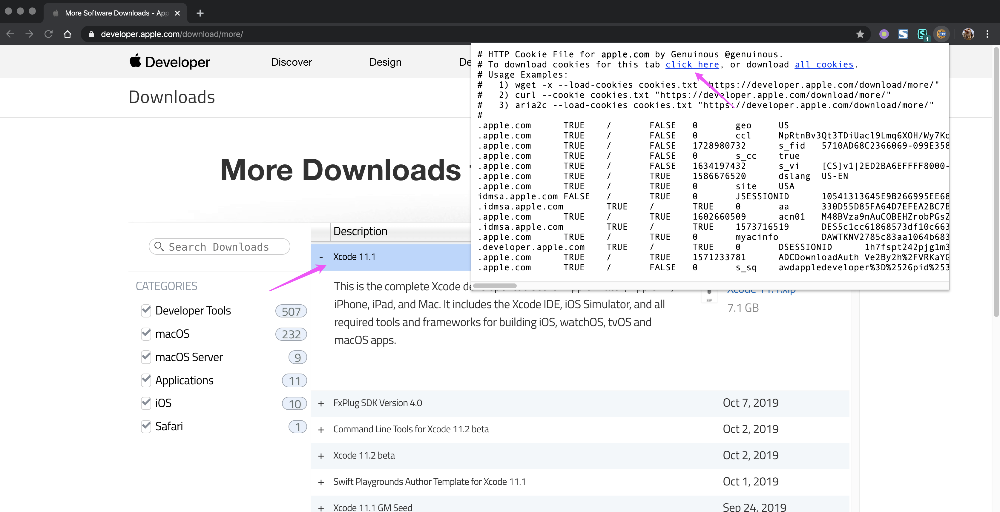
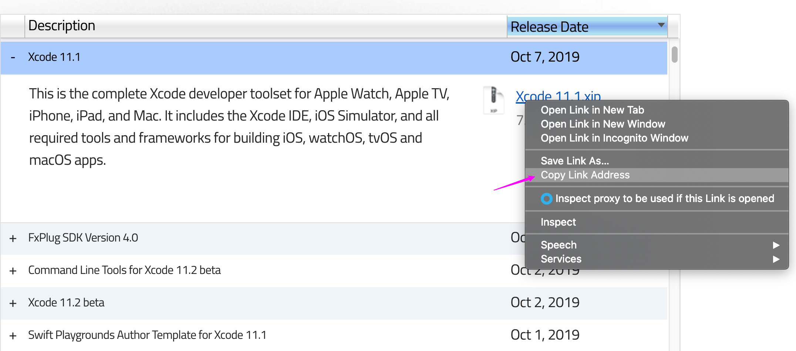

<!-- START doctoc generated TOC please keep comment here to allow auto update -->
<!-- DON'T EDIT THIS SECTION, INSTEAD RE-RUN doctoc TO UPDATE -->

- [check info](#check-info)
  - [path](#path)
  - [version](#version)
  - [sdk](#sdk)
- [install and setup](#install-and-setup)
  - [install](#install)
  - [setup](#setup)
  - [enable developer mode](#enable-developer-mode)
  - [commandline tools](#commandline-tools)
  - [components installation](#components-installation)
- [developer tools](#developer-tools)
  - [pkgutil](#pkgutil)
  - [apple shim](#apple-shim)
- [troubleshooting](#troubleshooting)
  - [xcode-select: error: tool 'xcodebuild' requires Xcode](#xcode-select-error-tool-xcodebuild-requires-xcode)
  - [Symbol not found: _XPCTypeBool](#symbol-not-found-_xpctypebool)
- [download via wget](#download-via-wget)
- [appendix](#appendix)
  - [xcode](#xcode)
  - [command line tool](#command-line-tool)
  - [additional tools](#additional-tools)

<!-- END doctoc generated TOC please keep comment here to allow auto update -->


## check info

### path
```bash
$ xcode-select --print-path
/Applications/Xcode.app/Contents/Developer
```

### version

> [!NOTE|label:list all tools pkgs]
> - [Determine xcode command line tools version](https://apple.stackexchange.com/a/181994/254265)
>   ```bash
>   $ /usr/sbin/pkgutil --pkgs | grep -i tools
>   com.apple.pkg.CLTools_SDK_macOS13
>   com.apple.pkg.CLTools_SDK_macOS12
>   com.apple.pkg.CLTools_Executables
>   com.apple.pkg.CLTools_SDK_macOS14
>   com.apple.pkg.CLTools_SwiftBackDeploy
>   com.apple.pkg.CLTools_macOS_SDK
>   com.microsoft.package.Proofing_Tools
>   ```

```bash
$ xcodebuild -version
Xcode 15.2
Build version 15C500b

$ /usr/sbin/pkgutil --pkg-info=com.apple.pkg.CLTools_Executables | grep version
version: 15.3.0.0.1.1708646388

# full content
$ /usr/sbin/pkgutil --pkg-info=com.apple.pkg.CLTools_Executables
package-id: com.apple.pkg.CLTools_Executables
version: 15.3.0.0.1.1708646388
volume: /
location: /
install-time: 1709684830
# osx 10.8-
$ /usr/sbin/pkgutil --pkg-info=com.apple.pkg.DeveloperToolsCLI
```

### sdk
#### sdk path
```bash
$ /usr/bin/xcrun --show-sdk-path
/Library/Developer/CommandLineTools/SDKs/MacOSX.sdk

$ /usr/bin/xcrun --sdk macosx --show-sdk-path
/Applications/Xcode.app/Contents/Developer/Platforms/MacOSX.platform/Developer/SDKs/MacOSX14.2.sdk

$ /usr/bin/xcrun --sdk macosx --show-sdk-platform-path
/Applications/Xcode.app/Contents/Developer/Platforms/MacOSX.platform

$ /usr/bin/xcodebuild -version $(xcodebuild -showsdks | awk '/^$/{p=0};p; /macOS SDKs:/{p=1}' | tail -1 | cut -f3) Path
/Applications/Xcode.app/Contents/Developer/Platforms/MacOSX.platform/Developer/SDKs/MacOSX14.2.sdk
```

- [reset xcode-select](https://stackoverflow.com/a/69851931/2940319)
  ```bash
  # default
  $ xcode-select --print-path
  /Applications/Xcode.app/Contents/Developer

  # switch
  $ sudo xcode-select --switch /Library/Developer/CommandLineTools
  $ xcode-select --print-path
  /Library/Developer/CommandLineTools

  # reset
  $ sudo xcode-select --reset
  $ xcode-select --print-path
  /Applications/Xcode.app/Contents/Developer
  ```

#### sdk version

> [!TIP|label:references:]
> - command lines for get info:
>   - `SDKVersion`
>   - `Path`
>   - `PlatformVersion`
>   - `PlatformPath`
>   - `BuildID`
>   - `ProductBuildVersion`
>   - `ProductCopyright`
>   - `ProductName`
>   - `ProductUserVisibleVersion`
>   - `ProductVersion`
>   - `iOSSupportVersion`
>
> - sample:
>   ```bash
>   $ /usr/bin/xcodebuild -sdk $(/usr/bin/xcrun --sdk macosx --show-sdk-path) -version SDKVersion
>   14.2
>   $ /usr/bin/xcodebuild -sdk $(/usr/bin/xcrun --sdk macosx --show-sdk-path) -version Path
>   /Applications/Xcode.app/Contents/Developer/Platforms/MacOSX.platform/Developer/SDKs/MacOSX14.2.sdk
>   $ /usr/bin/xcodebuild -sdk $(/usr/bin/xcrun --sdk macosx --show-sdk-path) -version PlatformVersion
>   14.2
>   $ /usr/bin/xcodebuild -sdk $(/usr/bin/xcrun --sdk macosx --show-sdk-path) -version PlatformPath
>   /Applications/Xcode.app/Contents/Developer/Platforms/MacOSX.platform
>   $ /usr/bin/xcodebuild -sdk $(/usr/bin/xcrun --sdk macosx --show-sdk-path) -version BuildID
>   A541C0AE-820A-11EE-A7B4-597349BFF88C
>   $ /usr/bin/xcodebuild -sdk $(/usr/bin/xcrun --sdk macosx --show-sdk-path) -version ProductBuildVersion
>   23C53
>   $ /usr/bin/xcodebuild -sdk $(/usr/bin/xcrun --sdk macosx --show-sdk-path) -version ProductCopyright
>   1983-2023 Apple Inc.
>   $ /usr/bin/xcodebuild -sdk $(/usr/bin/xcrun --sdk macosx --show-sdk-path) -version ProductName
>   macOS
>   $ /usr/bin/xcodebuild -sdk $(/usr/bin/xcrun --sdk macosx --show-sdk-path) -version ProductUserVisibleVersion
>   14.2
>   $ /usr/bin/xcodebuild -sdk $(/usr/bin/xcrun --sdk macosx --show-sdk-path) -version ProductVersion
>   14.2
>   $ /usr/bin/xcodebuild -sdk $(/usr/bin/xcrun --sdk macosx --show-sdk-path) -version iOSSupportVersion
>   17.2
>   ```

```bash
$ /usr/bin/xcrun --sdk macosx --show-sdk-version
14.2

# or
$ /usr/bin/xcodebuild -sdk /Applications/Xcode.app/Contents/Developer/Platforms/MacOSX.platform/Developer/SDKs/MacOSX14.2.sdk -version SDKVersion
14.2

$ /usr/bin/xcrun --sdk macosx --show-sdk-build-version
23C53

# or
$ /usr/bin/xcodebuild -sdk /Applications/Xcode.app/Contents/Developer/Platforms/MacOSX.platform/Developer/SDKs/MacOSX14.2.sdk -version ProductBuildVersion
23C53

$ /usr/bin/xcrun --sdk macosx --show-sdk-platform-version
14.2
# or
$ /usr/bin/xcodebuild -sdk /Applications/Xcode.app/Contents/Developer/Platforms/MacOSX.platform/Developer/SDKs/MacOSX14.2.sdk -version PlatformVersion
14.2
```

#### list all sdk versions

> [!NOTE|label:references:]
> - [get sdk params](https://stackoverflow.com/a/18742844/2940319)
>   ```bash
>   $ /usr/bin/xcodebuild -showsdks | awk '/^$/{p=0};p; /macOS SDKs:/{p=1}' | tail -1 | cut -f3
>   -sdk macosx14.2
>   ```

- `/usr/bin/xcodebuild -showsdks`

  <!--sec data-title="xcodebuild -showsdks" data-id="section0" data-show=true data-collapse=true ces-->
  ```bash
  $ xcodebuild -showsdks
  DriverKit SDKs:
    DriverKit 23.2                  -sdk driverkit23.2

  iOS SDKs:
    iOS 17.2                        -sdk iphoneos17.2

  iOS Simulator SDKs:
    Simulator - iOS 17.2            -sdk iphonesimulator17.2

  macOS SDKs:
    macOS 14.2                      -sdk macosx14.2
    macOS 14.2                      -sdk macosx14.2

  tvOS SDKs:
    tvOS 17.2                       -sdk appletvos17.2

  tvOS Simulator SDKs:
    Simulator - tvOS 17.2           -sdk appletvsimulator17.2

  visionOS SDKs:
    visionOS 1.0                    -sdk xros1.0

  visionOS Simulator SDKs:
    Simulator - visionOS 1.0        -sdk xrsimulator1.0

  watchOS SDKs:
    watchOS 10.2                    -sdk watchos10.2

  watchOS Simulator SDKs:
    Simulator - watchOS 10.2        -sdk watchsimulator10.2
  ```
  <!--endsec-->


  - `/usr/bin/xcodebuild -sdk -version`

    <!--sec data-title="xcodebuild -sdk -version" data-id="section1" data-show=true data-collapse=true ces-->
    ```bash
    $ /usr/bin/xcodebuild -sdk -version
    DriverKit23.2.sdk - DriverKit 23.2 (driverkit23.2)
    SDKVersion: 23.2
    Path: /Applications/Xcode.app/Contents/Developer/Platforms/DriverKit.platform/Developer/SDKs/DriverKit23.2.sdk
    PlatformVersion: 23.2
    PlatformPath: /Applications/Xcode.app/Contents/Developer/Platforms/DriverKit.platform

    iPhoneOS17.2.sdk - iOS 17.2 (iphoneos17.2)
    SDKVersion: 17.2
    Path: /Applications/Xcode.app/Contents/Developer/Platforms/iPhoneOS.platform/Developer/SDKs/iPhoneOS17.2.sdk
    PlatformVersion: 17.2
    PlatformPath: /Applications/Xcode.app/Contents/Developer/Platforms/iPhoneOS.platform
    BuildID: 8142513E-8212-11EE-A6F2-082C27C73D12
    ProductBuildVersion: 21C52
    ProductCopyright: 1983-2023 Apple Inc.
    ProductName: iPhone OS
    ProductVersion: 17.2

    iPhoneSimulator17.2.sdk - Simulator - iOS 17.2 (iphonesimulator17.2)
    SDKVersion: 17.2
    Path: /Applications/Xcode.app/Contents/Developer/Platforms/iPhoneSimulator.platform/Developer/SDKs/iPhoneSimulator17.2.sdk
    PlatformVersion: 17.2
    PlatformPath: /Applications/Xcode.app/Contents/Developer/Platforms/iPhoneSimulator.platform
    BuildID: 8142513E-8212-11EE-A6F2-082C27C73D12
    ProductBuildVersion: 21C52
    ProductCopyright: 1983-2023 Apple Inc.
    ProductName: iPhone OS
    ProductVersion: 17.2

    MacOSX14.sdk - macOS 14.2 (macosx14.2)
    SDKVersion: 14.2
    Path: /Applications/Xcode.app/Contents/Developer/Platforms/MacOSX.platform/Developer/SDKs/MacOSX14.sdk
    PlatformVersion: 14.2
    PlatformPath: /Applications/Xcode.app/Contents/Developer/Platforms/MacOSX.platform
    BuildID: A541C0AE-820A-11EE-A7B4-597349BFF88C
    ProductBuildVersion: 23C53
    ProductCopyright: 1983-2023 Apple Inc.
    ProductName: macOS
    ProductUserVisibleVersion: 14.2
    ProductVersion: 14.2
    iOSSupportVersion: 17.2

    MacOSX14.2.sdk - macOS 14.2 (macosx14.2)
    SDKVersion: 14.2
    Path: /Applications/Xcode.app/Contents/Developer/Platforms/MacOSX.platform/Developer/SDKs/MacOSX14.2.sdk
    PlatformVersion: 14.2
    PlatformPath: /Applications/Xcode.app/Contents/Developer/Platforms/MacOSX.platform
    BuildID: A541C0AE-820A-11EE-A7B4-597349BFF88C
    ProductBuildVersion: 23C53
    ProductCopyright: 1983-2023 Apple Inc.
    ProductName: macOS
    ProductUserVisibleVersion: 14.2
    ProductVersion: 14.2
    iOSSupportVersion: 17.2

    AppleTVOS17.2.sdk - tvOS 17.2 (appletvos17.2)
    SDKVersion: 17.2
    Path: /Applications/Xcode.app/Contents/Developer/Platforms/AppleTVOS.platform/Developer/SDKs/AppleTVOS17.2.sdk
    PlatformVersion: 17.2
    PlatformPath: /Applications/Xcode.app/Contents/Developer/Platforms/AppleTVOS.platform
    BuildID: 4675A566-8211-11EE-99FD-6142F6FFFD3A
    ProductBuildVersion: 21K354
    ProductCopyright: 1983-2023 Apple Inc.
    ProductName: Apple TVOS
    ProductVersion: 17.2

    AppleTVSimulator17.2.sdk - Simulator - tvOS 17.2 (appletvsimulator17.2)
    SDKVersion: 17.2
    Path: /Applications/Xcode.app/Contents/Developer/Platforms/AppleTVSimulator.platform/Developer/SDKs/AppleTVSimulator17.2.sdk
    PlatformVersion: 17.2
    PlatformPath: /Applications/Xcode.app/Contents/Developer/Platforms/AppleTVSimulator.platform
    BuildID: 4675A566-8211-11EE-99FD-6142F6FFFD3A
    ProductBuildVersion: 21K354
    ProductCopyright: 1983-2023 Apple Inc.
    ProductName: Apple TVOS
    ProductVersion: 17.2

    XROS1.0.sdk - visionOS 1.0 (xros1.0)
    SDKVersion: 1.0
    Path: /Applications/Xcode.app/Contents/Developer/Platforms/XROS.platform/Developer/SDKs/XROS1.0.sdk
    PlatformVersion: 1.0
    PlatformPath: /Applications/Xcode.app/Contents/Developer/Platforms/XROS.platform
    BuildID: 12C63F4E-8060-11EE-9FFA-B80B914DE5F9
    ProductBuildVersion: 21N301
    ProductCopyright: 1983-2023 Apple Inc.
    ProductName: xrOS
    ProductVersion: 1.0
    iOSSupportVersion: 17.1

    XRSimulator1.0.sdk - Simulator - visionOS 1.0 (xrsimulator1.0)
    SDKVersion: 1.0
    Path: /Applications/Xcode.app/Contents/Developer/Platforms/XRSimulator.platform/Developer/SDKs/XRSimulator1.0.sdk
    PlatformVersion: 1.0
    PlatformPath: /Applications/Xcode.app/Contents/Developer/Platforms/XRSimulator.platform
    BuildID: 12C63F4E-8060-11EE-9FFA-B80B914DE5F9
    ProductBuildVersion: 21N301
    ProductCopyright: 1983-2023 Apple Inc.
    ProductName: xrOS
    ProductVersion: 1.0
    iOSSupportVersion: 17.1

    WatchOS10.2.sdk - watchOS 10.2 (watchos10.2)
    SDKVersion: 10.2
    Path: /Applications/Xcode.app/Contents/Developer/Platforms/WatchOS.platform/Developer/SDKs/WatchOS10.2.sdk
    PlatformVersion: 10.2
    PlatformPath: /Applications/Xcode.app/Contents/Developer/Platforms/WatchOS.platform
    BuildID: FBDD719C-820F-11EE-B817-4780FBEA8434
    ProductBuildVersion: 21S355
    ProductCopyright: 1983-2023 Apple Inc.
    ProductName: Watch OS
    ProductVersion: 10.2

    WatchSimulator10.2.sdk - Simulator - watchOS 10.2 (watchsimulator10.2)
    SDKVersion: 10.2
    Path: /Applications/Xcode.app/Contents/Developer/Platforms/WatchSimulator.platform/Developer/SDKs/WatchSimulator10.2.sdk
    PlatformVersion: 10.2
    PlatformPath: /Applications/Xcode.app/Contents/Developer/Platforms/WatchSimulator.platform
    BuildID: FBDD719C-820F-11EE-B817-4780FBEA8434
    ProductBuildVersion: 21S355
    ProductCopyright: 1983-2023 Apple Inc.
    ProductName: Watch OS
    ProductVersion: 10.2

    Xcode 15.2
    Build version 15C500b
    ```
    <!--endsec-->

  - [`system_profiler SPDeveloperToolsDataType`](https://stackoverflow.com/a/33732043/2940319)

    <!--sec data-title="system_profile SPDeveloperToolsDataType" data-id="section2" data-show=true data-collapse=true ces-->
    ```bash
    $ /usr/sbin/system_profiler SPDeveloperToolsDataType
    Developer:

        Developer Tools:

          Version: 15.2 (15C500b)
          Location: /Applications/Xcode.app
          Applications:
              Xcode: 15.2 (22503)
              Instruments: 15.2 (64562.5)
          SDKs:
              DriverKit:
                  23.2:
              iOS:
                  17.2: (21C52)
              iOS Simulator:
                  17.2: (21C52)
              macOS:
                  14.2: (23C53)
              tvOS:
                  17.2: (21K354)
              tvOS Simulator:
                  17.2: (21K354)
              visionOS:
                  1.0: (21N301)
              visionOS Simulator:
                  1.0: (21N301)
              watchOS:
                  10.2: (21S355)
              watchOS Simulator:
                  10.2: (21S355)
    ```
    <!--endsec-->


#### get more
```bash
$ cat /Library/Developer/CommandLineTools/SDKs/MacOSX.sdk/SDKSettings.json | jq -r

# or
$ /usr/libexec/PlistBuddy -c print /Applications/Xcode.app/Contents/Developer/Platforms/MacOSX.platform/Info.plist
Dict {
    FamilyName = macOS
    CFBundleIdentifier = com.apple.platform.macosx
    DefaultProperties = Dict {
        DEPLOYMENT_TARGET_SETTING_NAME = MACOSX_DEPLOYMENT_TARGET
        DEFAULT_COMPILER = com.apple.compilers.llvm.clang.1_0
        GCC_WARN_64_TO_32_BIT_CONVERSION[arch=*64] = YES
        COMPRESS_PNG_FILES = NO
        STRIP_PNG_TEXT = NO
    }
    AdditionalInfo = Dict {
        DTXcodeBuild = $(XCODE_PRODUCT_BUILD_VERSION)
        DTPlatformVersion = 14.2
        DTCompiler = $(GCC_VERSION)
        DTSDKName = $(SDK_NAME)
        BuildMachineOSBuild = $(MAC_OS_X_PRODUCT_BUILD_VERSION)
        DTPlatformName = macosx
        DTXcode = $(XCODE_VERSION_ACTUAL)
        DTPlatformBuild = $(PLATFORM_PRODUCT_BUILD_VERSION)
        DTSDKBuild = $(SDK_PRODUCT_BUILD_VERSION)
        LSMinimumSystemVersion = $($(DEPLOYMENT_TARGET_SETTING_NAME))
        CFBundleSupportedPlatforms = Array {
            MacOSX
        }
    }
    CFBundleVersion = 14.2
    Description = macOS
    Name = macosx
    Version = 14.2
    MinimumSDKVersion = 13.0
    Icon = Icon.icns
    Identifier = com.apple.platform.macosx
    FamilyIdentifier = macosx
    CFBundleShortVersionString = 14.2
    Type = Platform
    FamilyDisplayName = macOS
    CFBundleDevelopmentRegion = English
    CFBundleName = macOS Platform
}
```


## install and setup
### install
- Install from App Store
- Offline Package
  - [xCode 9.0.1](https://download.developer.apple.com/Developer_Tools/Xcode_9.0.1/Xcode_9.0.1.xip)
  - [Command_Line_Tools_macOS_10.13_for_Xcode_9.0.1](https://download.developer.apple.com/Developer_Tools/Command_Line_Tools_macOS_10.13_for_Xcode_9.0.1/Command_Line_Tools_macOS_10.13_for_Xcode_9.0.1.dmg)
  - [All Packages](https://developer.apple.com/download/more/)

  ```bash
  $ xip --expand Xcode_x.x.x.xip
  $ sudo mv ./Xcode.app /Applications/Xcode.app
  ```

- switch xcode version
  ```bash
  $ sudo xcode-select -switch /Applications/Xcode_11.2_beta_2.app

  # check version
  $ /usr/bin/xcodebuild -version
  ```

### setup
```bash
$ sudo /usr/bin/xcodebuild -license accept
```

### enable developer mode
```bash
$ /usr/sbin/DevToolsSecurity -enable

# check status
$ /usr/sbin/DevToolsSecurity -status
Developer mode is currently enabled.
```

### commandline tools

> [!NOTE|label:references:]
> - check installation status:
>   ```bash
>   $ /usr/bin/xcode-select -p
>   ```

- install commandline tools
  ```bash
  $ /usr/bin/xcode-select --install
  xcode-select: note: install requested for command line developer tools
  ```

- upgrade commandline tools
  ```bash
  $ /usr/sbin/softwareupdate --all --install --force

  # or
  $ sudo rm -rf /Library/Developer/CommandLineTools
  $ sudo /usr/bin/xcode-select -select --install
  ```

  - [more details](https://stackoverflow.com/a/44234214/2940319)
    ```bash
    $ defaults read /Library/Preferences/com.apple.SoftwareUpdate
    {
        AutomaticallyInstallMacOSUpdates = 1;
        LastAttemptBuildVersion = "10.15.7 (19H2)";
        LastAttemptSystemVersion = "10.15.7 (19H2)";
        LastBackgroundSuccessfulDate = "2020-10-10 06:15:40 +0000";
        LastCatalogChangeDate = "2020-10-10 14:13:29 +0000";
        LastFullSuccessfulDate = "2020-10-10 14:14:38 +0000";
        LastRecommendedMajorOSBundleIdentifier = "";
        LastRecommendedUpdatesAvailable = 0;
        LastResultCode = 2;
        LastSessionSuccessful = 1;
        LastSuccessfulDate = "2020-10-10 14:14:38 +0000";
        LastUpdatesAvailable = 0;
        PrimaryLanguages =     (
            "en-CN",
            en
        );
        RecommendedUpdates =     (
        );
        SkipLocalCDN = 0;
    }
    ```

- list history
  ```bash
  $ softwareupdate --history
  ```

### components installation

> [!TIP|label:references:]
> ```bash
> $ for pkg in /Applications/Xcode.app/Contents/Resources/Packages/*.pkg; do
>     test -f "${pkg}" && printf '%-30s package: %s\n' "$(basename ${pkg})" \
>                         "$( /usr/sbin/installer -pkginfo -verbose -pkg "${pkg}" 2>/dev/null | sed -rn 's/^Package\s+:\s*(.+)$/\1/p' )";
>   done
> CoreTypes.pkg                  package: CoreTypes
> MobileDevice.pkg               package: MobileDevice
> MobileDeviceDevelopment.pkg    package: MobileDeviceDevelopment
> XcodeSystemResources.pkg       package: XcodeSystemResources
>
> $ for pkg in /Applications/Xcode.app/Contents/Resources/Packages/*.pkg; do
>     printf '%-30s %s\n' "$( command basename "${pkg}" )" \
>     "$( /usr/bin/tar -xOf "${pkg}" PackageInfo 2>/dev/null | command grep -oE 'identifier="[^"]*"' | head -1 )"
>   done
> CoreTypes.pkg                  identifier="com.apple.pkg.CoreTypes.1940D10"
> MobileDevice.pkg               identifier="com.apple.pkg.MobileDevice"
> MobileDeviceDevelopment.pkg    identifier="com.apple.pkg.MobileDeviceDevelopment"
> XcodeSystemResources.pkg       identifier="com.apple.pkg.XcodeSystemResources"
> ```

```bash
$ for pkg in /Applications/Xcode.app/Contents/Resources/Packages/*.pkg; do
    sudo installer -pkg "${pkg}" -target /;
  done
```

- example:
  ```bash
  $ ls -Altrh /Applications/Xcode.app/Contents/Resources/Packages/
  total 180512
  -rw-r--r--   1 root  wheel    87K Mar 10  2017 MobileDeviceDevelopment.pkg
  -rw-r--r--   1 root  wheel   5.4M Sep 30 05:28 XcodeSystemResources.pkg
  -rw-r--r--   1 root  wheel    11K Sep 30 05:28 XcodeExtensionSupport.pkg
  -rw-r--r--   1 root  wheel    83M Sep 30 05:28 MobileDevice.pkg

  $ for pkg in /Applications/Xcode.app/Contents/Resources/Packages/*.pkg; do
      sudo installer -pkg "${pkg}" -target /;
    done
  installer: Package name is MobileDevice
  installer: Upgrading at base path /
  installer: The upgrade was successful.
  installer: Package name is MobileDeviceDevelopment
  installer: Installing at base path /
  installer: The install was successful.
  installer: Package name is XcodeExtensionSupport
  installer: Installing at base path /
  installer: The install was successful.
  installer: Package name is XcodeSystemResources
  installer: Installing at base path /
  installer: The install was successful.
  ```

## developer tools

### pkgutil

> [!NOTE]
> `pkgutil` – Query and manipulate macOS Installer packages and receipts.<br>
> - [Install Ansible on Mac OSX](https://hvops.com/articles/ansible-mac-osx/)

```bash
$ /usr/sbin/pkgutil --pkg-info=com.apple.pkg.CLTools_Executables
```

- already installed
  ```bash
  $ /usr/sbin/pkgutil --pkg-info=com.apple.pkg.CLTools_Executables
  package-id: com.apple.pkg.CLTools_Executables
  version: 14.3.1.0.1.1683849156
  volume: /
  location: /
  install-time: 1688011857
  ```

- not been installed
  ```bash
  $ pkgutil --pkg-info=com.apple.pkg.CLTools_Executables
  No receipt for 'com.apple.pkg.CLTools_Executables' found at '/'.
  ```

```bash
# all CLTools related packages
$ /usr/sbin/pkgutil --pkgs | grep -i 'cltools'
com.apple.pkg.CLTools_SDK_macOS13
com.apple.pkg.CLTools_SDK_macOS12
com.apple.pkg.CLTools_Executables
com.apple.pkg.CLTools_SDK_macOS_LMOS
com.apple.pkg.CLTools_SDK_macOS14
com.apple.pkg.CLTools_SDK_macOS_NMOS
com.apple.pkg.CLTools_SDK_macOS110
com.apple.pkg.CLTools_SwiftBackDeploy
com.apple.pkg.CLTools_macOS_SDK

# what is installed in CLTools_Executables (files)
$ /usr/sbin/pkgutil --files com.apple.pkg.CLTools_Executables
$ /usr/sbin/pkgutil --files com.apple.pkg.CLTools_Executables 2>/dev/null | command wc -l
5363

# the root directory of the payload
$ /usr/sbin/pkgutil --files com.apple.pkg.CLTools_Executables 2>/dev/null | head -3
Library
Library/Developer
Library/Developer/CommandLineTools
```

### apple shim

> [!TIP]
> **shim** A.K.A. *stub* / *trampoline*<br>
> **shim** is A tiny Mach-O executable that, at runtime, uses **`libxcselect.dylib`** to locate the *real* tool inside the **active developer directory** (Xcode or the Command Line Tools) and then `exec`s it

```bash
# differentiate
$ file /opt/homebrew/Cellar/git/HEAD-e9019fc/bin/git
/opt/homebrew/Cellar/git/HEAD-e9019fc/bin/git: Mach-O 64-bit arm64 executable, flags:<NOUNDEFS|DYLDLINK|TWOLEVEL|PIE>

$ file /usr/bin/git
/usr/bin/git: Mach-O universal binary with 2 architectures: [x86_64:\012- Mach-O 64-bit x86_64 executable, flags:<NOUNDEFS|DYLDLINK|TWOLEVEL|PIE>] [\012- arm64e (caps: 0x2):\012- Mach-O 64-bit arm64e (caps: PAC00) executable, flags:<NOUNDEFS|DYLDLINK|TWOLEVEL|PIE>]
```

```bash
# details
$ otool -L /usr/bin/git
/usr/bin/git:
  /usr/lib/libxcselect.dylib (compatibility version 1.0.0, current version 1.0.0)          # the forwarding engine — proves it's an xcode-select shim
  /usr/lib/libSystem.B.dylib (compatibility version 1.0.0, current version 1356.0.0)

# show the SAME inode - `78`
$ /bin/ls -li /usr/bin/git /usr/bin/clang /usr/bin/swift
1152921500312571562 -rwxr-xr-x  78 root  wheel  118640 Jul 22 14:57 /usr/bin/clang
1152921500312571562 -rwxr-xr-x  78 root  wheel  118640 Jul 22 14:57 /usr/bin/git
1152921500312571562 -rwxr-xr-x  78 root  wheel  118640 Jul 22 14:57 /usr/bin/swift
#                               ^
#                               + inode

# show name list (symbols) of the shim
$ dyld_info -arch arm64e -imports /usr/bin/git
/usr/bin/git [arm64e]:
    -imports:
      0x0000  _xcselect_invoke_xcrun  (from libxcselect)
      0x0001  __NSGetExecutablePath  (from libSystem)
      0x0002  __NSGetProgname  (from libSystem)
      0x0003  ___error  (from libSystem)
      0x0004  ___stack_chk_fail  (from libSystem)
      0x0005  _dispatch_once  (from libSystem)
      0x0006  _getattrlist  (from libSystem)
      0x0007  _strcmp  (from libSystem)
      0x0008  _strdup  (from libSystem)
      0x0009  _strrchr  (from libSystem)
      0x000A  ___stack_chk_guard  (from libSystem)
      0x000B  __NSConcreteGlobalBlock  (from libSystem)
# - or -
$ dyld_info -arch x86_64 -imports /usr/bin/git
# - or -
$ nm -u /usr/bin/git 2>&1 | command grep -v '^$' | command grep -nE 'xcselect|NSGet|strcmp|strdup|strrchr|dispatch'

# find all shims in `/usr/bin`
$ find /usr/bin -inum "$( /usr/bin/stat -f '%i' /usr/bin/git )" | wc -l
78
```

#### how it works

```bash
/usr/bin/git   (shim shared by 78 hard links)
  └─ libxcselect resolves the active developer directory:
       1. env var DEVELOPER_DIR, else
       2. xcode-select -p   (/var/db/xcode_select_link)
  └─ locates the real git under that directory -> exec, forwarding argv unchanged
       1. pointing at CLT → exec /Library/Developer/CommandLineTools/usr/bin/git          # sudo xcode-select --switch /Library/Developer/CommandLineTools
       2. pointing at Xcode → exec /Applications/Xcode.app/Contents/Developer/usr/bin/git # sudo xcode-select --switch /Applications/Xcode.app/Contents/Developer
```

## troubleshooting
### [xcode-select: error: tool 'xcodebuild' requires Xcode](https://github.com/nodejs/node-gyp/issues/569#issuecomment-104284148)

```bash
$ sudo xcode-select -s /Library/Developer/CommandLineTools
$ xcodebuild -version
xcode-select: error: tool 'xcodebuild' requires Xcode, but active developer directory '/Library/Developer/CommandLineTools' is a command line tools instance

$ sudo xcode-select -s /Applications/Xcode.app/Contents/Developer
$ xcodebuild -version
Xcode 15.2
Build version 15C500b
```

### Symbol not found: _XPCTypeBool

> [!NOTE]
> `_XPCTypeBool` issue is due to `CoreDevice` (`XcodeSystemResources.pkg`) wasn't been registered. To fix can execute:
> ```bash
> $ sudo installer -pkg /Applications/Xcode.app/Contents/Resources/Packages/XcodeSystemResources.pkg -target /
> ```

- error log
  ```bash
  $ /usr/bin/git --version
  Error loading required libraries. If there is an ongoing installation please wait for it to complete. Otherwise reinstall. (dlopen(@rpath/libxcodebuildLoader.dylib, 0x0001): Symbol not found: _XPCTypeBool
    Referenced from: <9AE16A95-2414-31C4-BB7F-672E0C9AE66B> /Library/Developer/PrivateFrameworks/CoreDevice.framework/Versions/A/CoreDevice
    Expected in:     <37B53E42-0118-3C9B-BFA8-73DB82BC3B85> /Library/Apple/System/Library/PrivateFrameworks/Mercury.framework/Versions/A/Mercury)
  Error loading required libraries. If there is an ongoing installation please wait for it to complete. Otherwise reinstall. (dlopen(@rpath/libxcodebuildLoader.dylib, 0x0001): Symbol not found: _XPCTypeBool
    Referenced from: <9AE16A95-2414-31C4-BB7F-672E0C9AE66B> /Library/Developer/PrivateFrameworks/CoreDevice.framework/Versions/A/CoreDevice
    Expected in:     <37B53E42-0118-3C9B-BFA8-73DB82BC3B85> /Library/Apple/System/Library/PrivateFrameworks/Mercury.framework/Versions/A/Mercury)
  git: error: sh -c '/Applications/Xcode.app/Contents/Developer/usr/bin/xcodebuild -sdk /Applications/Xcode.app/Contents/Developer/Platforms/MacOSX.platform/Developer/SDKs/MacOSX.sdk -find git 2> /dev/null' failed with exit code 65280: (null) (errno=No such file or directory)
  xcode-select: Failed to locate 'git', and no install could be requested (perhaps no UI is present). Please install manually from 'developer.apple.com'.

  # or
  $ /Applications/Xcode.app/Contents/Developer/usr/bin/xcodebuild -sdk /Applications/Xcode.app/Contents/Developer/Platforms/MacOSX.platform/Developer/SDKs/MacOSX.sdk -find git
  Error loading required libraries. If there is an ongoing installation please wait for it to complete. Otherwise reinstall. (dlopen(@rpath/libxcodebuildLoader.dylib, 0x0001): Symbol not found: _XPCTypeBool
    Referenced from: <9AE16A95-2414-31C4-BB7F-672E0C9AE66B> /Library/Developer/PrivateFrameworks/CoreDevice.framework/Versions/A/CoreDevice
    Expected in:     <37B53E42-0118-3C9B-BFA8-73DB82BC3B85> /Library/Apple/System/Library/PrivateFrameworks/Mercury.framework/Versions/A/Mercury)

  # or
  $ /Applications/Xcode.app/Contents/Developer/usr/bin/xcodebuild -find git --version
  Error loading required libraries. If there is an ongoing installation please wait for it to complete. Otherwise reinstall. (dlopen(@rpath/libxcodebuildLoader.dylib, 0x0001): Symbol not found: _XPCTypeBool
    Referenced from: <9AE16A95-2414-31C4-BB7F-672E0C9AE66B> /Library/Developer/PrivateFrameworks/CoreDevice.framework/Versions/A/CoreDevice
    Expected in:     <37B53E42-0118-3C9B-BFA8-73DB82BC3B85> /Library/Apple/System/Library/PrivateFrameworks/Mercury.framework/Versions/A/Mercury)
  ```

- solution

  > [!NOTE|label:switch xcode-select to xcode]
  > ```bash
  > $ sudo xcodebuild -runFirstLaunch
  > xcode-select: error: tool 'xcodebuild' requires Xcode, but active developer directory '/Library/Developer/CommandLineTools' is a command line tools instance
  > # fix the issue by switching to Xcode
  > $ sudo xcode-select -s /Applications/Xcode.app/Contents/Developer
  > ```

  ```bash
  # fix
  $ sudo xcodebuild -runFirstLaunch
  Error loading required libraries. If there is an ongoing installation please wait for it to complete. Otherwise reinstall. (dlopen(@rpath/libxcodebuildLoader.dylib, 0x0001): Symbol not found: _XPCTypeBool
    Referenced from: <9AE16A95-2414-31C4-BB7F-672E0C9AE66B> /Library/Developer/PrivateFrameworks/CoreDevice.framework/Versions/A/CoreDevice
    Expected in:     <37B53E42-0118-3C9B-BFA8-73DB82BC3B85> /Library/Apple/System/Library/PrivateFrameworks/Mercury.framework/Versions/A/Mercury)
  Install Started
  1%.........20.........40.........60.........80.......Install Succeeded

  # or with license acceptance + pkg registration
  $ for pkg in /Applications/Xcode.app/Contents/Resources/Packages/*.pkg; do
      sudo installer -pkg "${pkg}" -target /
    done
  $ sudo xcodebuild -license accept

  # check
  $ /Applications/Xcode.app/Contents/Developer/usr/bin/xcodebuild -sdk /Applications/Xcode.app/Contents/Developer/Platforms/MacOSX.platform/Developer/SDKs/MacOSX.sdk -find git
  /Applications/Xcode.app/Contents/Developer/usr/bin/git
  $ /Applications/Xcode.app/Contents/Developer/usr/bin/xcodebuild -find git
  /Applications/Xcode.app/Contents/Developer/usr/bin/git

  $ /usr/bin/xcodebuild -checkFirstLaunchStatus 2>&1 && echo 'yes' || echo 'no'
  yes
  ```

## download via wget

> [!TIP|label:chrome extensions]
> - [Get cookies.txt Clean](https://chromewebstore.google.com/detail/get-cookiestxt-clean/ahmnmhfbokciafffnknlekllgcnafnie) - `ahmnmhfbokciafffnknlekllgcnafnie`
> - [Get cookies.txt LOCALLY](https://chromewebstore.google.com/detail/get-cookiestxt-locally/cclelndahbckbenkjhflpdbgdldlbecc) - `cclelndahbckbenkjhflpdbgdldlbecc`
> - _@deprecated_ [Get cookies.txt](https://chrome.google.com/webstore/detail/cookiestxt/njabckikapfpffapmjgojcnbfjonfjfg) - `njabckikapfpffapmjgojcnbfjonfjfg`


* get cookies.txt
  * install google chrome extension
  * login [developer.apple.com](https://developer.apple.com/download/more/)
  * select cookies.txt and download

  

* get xcode download url and right click and select **Copy Link Address**:

  

* download xcode (inspired from [here](https://stackoverflow.com/a/4089758/2940319) and [here](https://stackoverflow.com/a/46020878/2940319))
  ```bash
  $ wget --cookies=on \
         --load-cookies=cookies.txt \
         --keep-session-cookies \
         --save-cookies=cookies.txt \
         https://download.developer.apple.com/Developer_Tools/Xcode_11.2_beta_2/Xcode_11.2_beta_2.xip
  ```

  * example
    ```bash
    $ wget --cookies=on \
           --load-cookies=cookies.txt \
           --keep-session-cookies \
           --save-cookies=cookies.txt \
           https://download.developer.apple.com/Developer_Tools/Xcode_11.2_beta_2/Xcode_11.2_beta_2.xip
    --2019-10-15 07:55:18--  https://download.developer.apple.com/Developer_Tools/Xcode_11.2_beta_2/Xcode_11.2_beta_2.xip
    Resolving download.developer.apple.com (download.developer.apple.com)... 17.253.17.207, 17.253.17.211
    Connecting to download.developer.apple.com (download.developer.apple.com)|17.253.17.207|:443... connected.
    HTTP request sent, awaiting response... 200 OK
    Length: 7805079698 (7.3G) [application/octet-stream]
    Saving to: ‘Xcode_11.2_beta_2.xip’

    100%[===========================================================================================================>] 7,805,079,698  112MB/s   in 70s

    2019-10-15 07:53:07 (106 MB/s) - ‘Xcode_11.2_beta_2.xip’ saved [7805079698/7805079698]

    $ ls -altrh Xcode_11.2_beta_2.xip
    -rw-rw-r-- 1 devops devops 7.3G Oct  9 13:27 Xcode_11.2_beta_2.xip
    ```

* [install](https://stackoverflow.com/a/56913909/2940319)
  ```bash
  $ xip --expand Xcode_11.2_beta_2.xip
  xip: signing certificate was "Software Update" (validation not attempted)
  xip: expanded items from "~/Xcode_11.2_beta_2.xip"

  $ mv ~/Xcode.app /Applications/Xcode.app
  ```

## appendix
### xcode
| XCODE       | URL                                                                                            |
| ----------- | ---------------------------------------------------------------------------------------------- |
| 12.3 beta   | `https://download.developer.apple.com/Developer_Tools/Xcode_12.3_beta/Xcode_12.3_beta.xip`     |
| 12.2        | `https://download.developer.apple.com/Developer_Tools/Xcode_12.2/Xcode_12.2.xip`               |
| 12.2beta2   | `https://download.developer.apple.com/Developer_Tools/Xcode_12.2_beta_2/Xcode_12.2_beta_2.xip` |
| 12.0.1      | `https://download.developer.apple.com/Developer_Tools/Xcode_12.0.1/Xcode_12.0.1.xip`           |
| 12 beta 5   | `https://download.developer.apple.com/Developer_Tools/Xcode_12_beta_5/Xcode_12_beta_5.xip`     |
| 11.6        | `https://download.developer.apple.com/Developer_Tools/Xcode_11.6/Xcode_11.6.xip`               |
| 11.5 beta 2 | `https://download.developer.apple.com/Developer_Tools/Xcode_11.5_beta_2/Xcode_11.5_beta_2.xip` |
| 11.5 beta   | `https://download.developer.apple.com/Developer_Tools/Xcode_11.5_beta/Xcode_11.5_beta.xip`     |
| 11.4.1      | `https://download.developer.apple.com/Developer_Tools/Xcode_11.4.1/Xcode_11.4.1.xip`           |
| 11.4        | `https://download.developer.apple.com/Developer_Tools/Xcode_11.4/Xcode_11.4.xip`               |
| 11.4 beta 3 | `https://download.developer.apple.com/Developer_Tools/Xcode_11.4_beta_3/Xcode_11.4_beta_3.xip` |
| 11.4 beta 2 | `https://download.developer.apple.com/Developer_Tools/Xcode_11.4_beta_2/Xcode_11.4_beta_2.xip` |
| 11.4 beta   | `https://download.developer.apple.com/Developer_Tools/Xcode_11.4_beta/Xcode_11.4_beta.xip`     |
| 11.3.1      | `https://download.developer.apple.com/Developer_Tools/Xcode_11.3.1/Xcode_11.3.1.xip`           |
| 11.2 beta 2 | `https://download.developer.apple.com/Developer_Tools/Xcode_11.2_beta_2/Xcode_11.2_beta_2.xip` |
| 11.1        | `https://download.developer.apple.com/Developer_Tools/Xcode_11.1/Xcode_11.1.xip`               |
| 11.2 beta   | `https://download.developer.apple.com/Developer_Tools/Xcode_11.2_beta/Xcode_11.2_beta.xip`     |
| 11          | `https://download.developer.apple.com/Developer_Tools/Xcode_11/Xcode_11.xip`                   |
| 10.3        | `https://download.developer.apple.com/Developer_Tools/Xcode_10.3/Xcode_10.3.xip`               |
| 10.2.1      | `https://download.developer.apple.com/Developer_Tools/Xcode_10.2.1/Xcode_10.2.1.xip`           |
| 10.2        | `https://download.developer.apple.com/Developer_Tools/Xcode_10.2/Xcode_10.2.xip`               |
| 10.1        | `https://download.developer.apple.com/Developer_Tools/Xcode_10.1/Xcode_10.1.xip`               |

### command line tool
| COMMAND LINE TOOL    | URL                                                                                                                                                            |
| -------------------- | -------------------------------------------------------------------------------------------------------------------------------------------------------------- |
| 12.3 beta            | `https://download.developer.apple.com/Developer_Tools/Xcode_12.3_beta/Xcode_12.3_beta.xip`                                                                     |
| 12.2                 | `https://download.developer.apple.com/Developer_Tools/Command_Line_Tools_for_Xcode_12.2/Command_Line_Tools_for_Xcode_12.2.dmg`                                 |
| 12.0                 | `https://download.developer.apple.com/Developer_Tools/Command_Line_Tools_for_Xcode_12/Command_Line_Tools_for_Xcode_12.dmg`                                     |
| 11.4.1               | `https://download.developer.apple.com/Developer_Tools/Command_Line_Tools_for_Xcode_11.4.1/Command_Line_Tools_for_Xcode_11.4.1.dmg`                             |
| 11.4                 | `https://download.developer.apple.com/Developer_Tools/Command_Line_Tools_for_Xcode_11.4/Command_Line_Tools_for_Xcode_11.4.dmg`                                 |
| 11.4 beta 3          | `https://download.developer.apple.com/Developer_Tools/Command_Line_Tools_for_Xcode_11.4_beta_3/Command_Line_Tools_for_Xcode_11.4_beta_3.dmg`                   |
| 11.4 beta 2          | `https://download.developer.apple.com/Developer_Tools/Command_Line_Tools_for_Xcode_11.4_beta_2/Command_Line_Tools_for_Xcode_11.4_beta_2.dmg`                   |
| 11.3.1               | `https://download.developer.apple.com/Developer_Tools/Command_Line_Tools_for_Xcode_11.3.1/Command_Line_Tools_for_Xcode_11.3.1.dmg`                             |
| 11.2 beta 2          | `https://download.developer.apple.com/Developer_Tools/Command_Line_Tools_for_Xcode_11.2_beta_2/Command_Line_Tools_for_Xcode_11.2_beta_2.dmg`                   |
| 11.1                 | `https://download.developer.apple.com/Developer_Tools/Command_Line_Tools_for_Xcode_11.2_beta/Command_Line_Tools_for_Xcode_11.2_beta.dmg`                       |
| 11                   | `https://download.developer.apple.com/Developer_Tools/Command_Line_Tools_for_Xcode_11/Command_Line_Tools_for_Xcode_11.dmg`                                     |
| 10.3                 | `https://download.developer.apple.com/Developer_Tools/Command_Line_Tools_macOS_10.14_for_Xcode_10.3/Command_Line_Tools_macOS_10.14_for_Xcode_10.3.dmg`         |
| 10.2.1               | `https://download.developer.apple.com/Developer_Tools/Command_Line_Tools_macOS_10.14_for_Xcode_10.2.1.dmg/Command_Line_Tools_macOS_10.14_for_Xcode_10.2.1.dmg` |
| 10.2                 | `https://download.developer.apple.com/Developer_Tools/Command_Line_Tools_macOS_10.14_for_Xcode_10.2/Command_Line_Tools_macOS_10.14_for_Xcode_10.2.dmg`         |
| 10.1 for macOS 10.14 | `https://download.developer.apple.com/Developer_Tools/Command_Line_Tools_macOS_10.14_for_Xcode_10.1/Command_Line_Tools_macOS_10.14_for_Xcode_10.1.dmg`         |
| 10.1 for macOS 10.13 | `https://download.developer.apple.com/Developer_Tools/Command_Line_Tools_macOS_10.13_for_Xcode_10.1/Command_Line_Tools_macOS_10.13_for_Xcode_10.1.dmg`         |

### additional tools
| ADDITIONAL TOOL      | URL                                                                                                                                                            |
| -------------------- | -------------------------------------------------------------------------------------------------------------------------------------------------------------- |
| 11.4                 | `https://download.developer.apple.com/Developer_Tools/Additional_Tools_for_Xcode_11.4/Additional_Tools_for_Xcode_11.4.dmg`                                     |
| 11.4 beta 2          | `https://download.developer.apple.com/Developer_Tools/Additional_Tools_for_Xcode_11.4_beta_2/Additional_Tools_for_Xcode_11.4_beta_2.dmg`                       |
| 11                   | `https://download.developer.apple.com/Developer_Tools/Additional_Tools_for_Xcode_11/Additional_Tools_for_Xcode_11.dmg`                                         |
| 10.1                 | `https://download.developer.apple.com/Developer_Tools/Additional_Tools_for_Xcode_10.1/Additional_Tools_for_Xcode_10.1.dmg`                                     |

* [additional info](https://stackoverflow.com/a/44390183/2940319)
