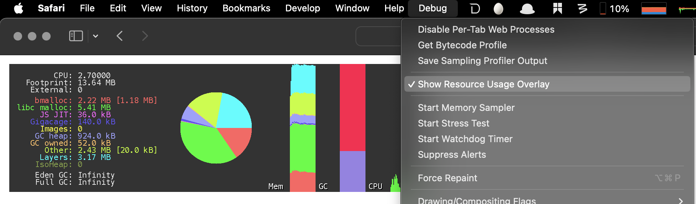
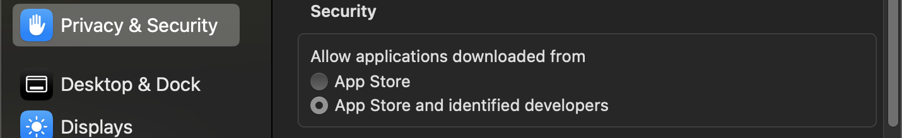

<!-- START doctoc generated TOC please keep comment here to allow auto update -->
<!-- DON'T EDIT THIS SECTION, INSTEAD RE-RUN doctoc TO UPDATE -->

- [usage](#usage)
  - [commands](#commands)
  - [usage](#usage-1)
    - [basic usage](#basic-usage)
    - [list all domains](#list-all-domains)
- [defaults](#defaults)
  - [programming](#programming)
    - [xCode](#xcode)
    - [iTerm2](#iterm2)
    - [terminal](#terminal)
  - [utilities](#utilities)
  - [screenshot](#screenshot)
  - [finder](#finder)
    - [quit via ⌘ + Q](#quit-via-%E2%8C%98--q)
    - [default location](#default-location)
    - [extension](#extension)
    - [view](#view)
    - [icon](#icon)
    - [bars](#bars)
    - [panel](#panel)
    - [hidden file](#hidden-file)
    - [others](#others)
  - [desktop](#desktop)
  - [menu bar](#menu-bar)
  - [trackpad](#trackpad)
  - [dock](#dock)
    - [show](#show)
    - [icon](#icon-1)
    - [animation](#animation)
    - [autohide](#autohide)
    - [others](#others-1)
  - [mission control](#mission-control)
  - [keyboard & trackpad](#keyboard--trackpad)
  - [battery](#battery)
  - [browser](#browser)
    - [chrome](#chrome)
    - [safari](#safari)
  - [system](#system)
  - [others](#others-2)
- [backup & restore](#backup--restore)
  - [Moon](#moon)
  - [vscode](#vscode)

<!-- END doctoc generated TOC please keep comment here to allow auto update -->


> reference:
> - [* defaults-write.com](https://www.defaults-write.com/)
>   - [10 terminal commands to speed up macOS High Sierra on your Mac](https://www.defaults-write.com/speed-up-macos-high-sierra/)
> - [* macOS defaults list](https://macos-defaults.com/)
> - [macOS defaults](https://macos-defaults.com/)
> - [How To Change Preferences From The Command Line On MacOS?](https://www.shell-tips.com/mac/defaults/)
> - [mac defaults](https://github.com/kevinSuttle/macOS-Defaults/blob/master/REFERENCE.md)
> - [uson1x/hack.sh](https://gist.github.com/uson1x/2275613)
> - [Maya/mac settings.sh](https://charlesreid1.com/wiki/Maya/mac_settings.sh)
>   - [dotfiles/mac/mac_settings.sh](https://git.charlesreid1.com/dotfiles/mac/src/branch/main/mac_settings.sh)
> - [osx-for-hackers.sh](https://blocks.roadtolarissa.com/mhkeller/d7e0cd4dc30236291622)
> - [brandonb927/osx-for-hackers.sh](https://gist.github.com/brandonb927/3195465)
> - [mathiasbynens/dotfiles](https://github.com/mathiasbynens/dotfiles)
>   - [.macos](https://github.com/mathiasbynens/dotfiles/blob/main/.macos)
> - [akachrislee/osx](https://gist.github.com/akachrislee/3220956)


# usage
## commands

|   commands  | comments                                                     |
|:-----------:|--------------------------------------------------------------|
|   `read `   | prints the user’s settings to standard output                |
| `read-type` | prints the plist type for a given key                        |
|   `write`   | write a value for the given key                              |
|   `rename`  | rename a key                                                 |
|   `import`  | import a plist to a given domain                             |
|   `export`  | export a domain and all the keys as a plist                  |
|   `delete`  | delete a given key or a domain / all keys for a given domain |
|  `domains`  | prints the name of all domains                               |
|    `find`   | search all domains, keys, and values for a given word        |

## usage
### basic usage
```bash
# gets all
$ defaults read DOMAIN

# gets
$ defaults read DOMAIN PROPERTY_NAME

# find
$ defaults find <KEYWORD>

# get type
$ defaults read-type <DOMAIN> <KEY>

# rename
$ defaults rename <DOMAIN> <OLD_KEY> <NEW_KEY>

# sets
$ defaults write DOMAIN PROPERTY_NAME VALUE

# resets a property
$ defaults delete DOMAIN PROPERTY_NAME

# resets preferences
$ defaults delete DOMAIN
```

### list all domains
```bash
$ defaults domains
```
- i.e.
  ```bash
  $ defaults domains | tr ',' '\n' | head
  ContextStoreAgent
   MobileMeAccounts
   com.100hps.captin
   com.ScooterSoftware.BeyondCompare
   com.app77.pwsafemac
   com.apple.AMPLibraryAgent
   com.apple.ATS
   com.apple.Accessibility
   com.apple.AdLib
   com.apple.AddressBook
  ```

# defaults
## programming
### xCode
#### add additional Counterpart Suffixes
```bash
# `"ViewModel" "View"`
$ defaults write com.apple.dt.Xcode IDEAdditionalCounterpartSuffixes -array-add "ViewModel" "View" && killall Xcode

# `"Router" "Interactor" "Builder"`
$ defaults write com.apple.dt.Xcode IDEAdditionalCounterpartSuffixes -array-add "Router" "Interactor" "Builder" && killall Xcode
```

#### show build durations
```bash
$ defaults write com.apple.dt.Xcode ShowBuildOperationDuration -bool true && killall Xcode
```

#### [add additional counterpart suffixes](https://macos-defaults.com/xcode/ideadditionalcounterpartsuffixes.html)
```bash
# add "ViewModel" and "View"
$ defaults write com.apple.dt.Xcode "IDEAdditionalCounterpartSuffixes" -array-add "ViewModel" "View" && killall Xcode

# add "Router", "Interactor" and "Builder"
$ defaults write com.apple.dt.Xcode "IDEAdditionalCounterpartSuffixes" -array-add "Router" "Interactor" "Builder" && killall Xcode
```

#### [show build durations](https://macos-defaults.com/xcode/showbuildoperationduration.html)
```bash
$ defaults write com.apple.dt.Xcode "ShowBuildOperationDuration" -bool "true" && killall Xcode
```

### iTerm2
#### profile
```bash
# reset
$ cd ~/Library/Preferences/com.googlecode.iterm2.plist
$ defaults delete com.googlecode.iterm2
```

#### prompt when quitting
```bash
# disable
$ defaults write com.googlecode.iterm2 PromptOnQuit -bool false
```

### terminal
```bash
# UTF-8 encoding
$ defaults write com.apple.terminal StringEncodings -array 4

# theme
$ defaults write com.apple.Terminal "Default Window Settings" -string "gruvbox-dark"
$ defaults write com.apple.Terminal "Startup Window Settings" -string "gruvbox-dark"

# more
$ defaults read com.apple.Terminal
```

#### [modify theme](https://github.com/mathiasbynens/dotfiles/blob/main/.macos#L628C33-L628C53)
```bash
$ osascript <<EOD

tell application "Terminal"

  local allOpenedWindows
  local initialOpenedWindows
  local windowID
  set themeName to "Solarized Dark xterm-256color"

  (* Store the IDs of all the open terminal windows. *)
  set initialOpenedWindows to id of every window

  (* Open the custom theme so that it gets added to the list
     of available terminal themes (note: this will open two
     additional terminal windows). *)
  do shell script "open '$HOME/init/" & themeName & ".terminal'"

  (* Wait a little bit to ensure that the custom theme is added. *)
  delay 1

  (* Set the custom theme as the default terminal theme. *)
  set default settings to settings set themeName

  (* Get the IDs of all the currently opened terminal windows. *)
  set allOpenedWindows to id of every window

  repeat with windowID in allOpenedWindows

    (* Close the additional windows that were opened in order
       to add the custom theme to the list of terminal themes. *)
    if initialOpenedWindows does not contain windowID then
      close (every window whose id is windowID)

    (* Change the theme for the initial opened terminal windows
       to remove the need to close them in order for the custom
       theme to be applied. *)
    else
      set current settings of tabs of (every window whose id is windowID) to settings set themeName
    end if

  end repeat
end tell
EOD
```

#### enable security keyboard

> [!NOTE|label:references:]
> - [How secure is "Secure Keyboard Entry" in Mac OS X's Terminal?](https://security.stackexchange.com/a/47786/8918)

```bash
$ defaults write com.apple.terminal SecureKeyboardEntry -bool true
```

#### line marks
```bash
# disable
$ defaults write com.apple.Terminal ShowLineMarks -int 0
```

## utilities

#### [startup sounds](https://www.youtube.com/watch?v=_OjQIh4Ro5A)
```bash
# disable
$ sudo nvram StartupMute=%01
# or
$ sudo nvram SystemAudioVolume=" "

# enable
$ sudo nvram StartupMute=%00
```

#### [forbidden spell automatic correction](https://github.com/bestswifter/macbootstrap/blob/master/doc/system.md)
```bash
$ defaults write -g NSAutomaticQuoteSubstitutionEnabled  -bool false
$ defaults write -g NSAutomaticDashSubstitutionEnabled   -bool false
$ defaults write -g NSAutomaticSpellingCorrectionEnabled -bool false
```

#### disable notification centers
```bash
$ launchctl unload -w /System/Library/LaunchAgents/com.apple.notificationcenterui.plist && killall NotificationCenter
```

#### are you sure you want to open this application?
```bash
$ defaults write com.apple.LaunchServices LSQuarantine -bool false

# or
$ sudo spctl — master-disable
```

#### avoid install resource validation


> references:
> - [How to fix: This is an application downloaded from the Internet. Are you sure you want to open it?](https://www.idownloadblog.com/2017/04/20/fix-application-from-internet-gatekeeper/)
> - [disable application quarantine message](https://macos-defaults.com/misc/lsquarantine.html)


```bash
$ sudo spctl --master-disable
$ defaults write com.apple.LaunchServices LSQuarantine -bool false
```

#### none warning for unknown resource open
```bash
$ defaults write com.apple.LaunchServices LSQuarantine -bool false
```

#### enable the hidden file
```bash
$ defaults write com.apple.finder AppleShowAllFiles TRUE && killall Finder

# or
$ defaults write com.apple.finder AppleShowAllFiles YES
```

## screenshot

#### set screenshot location
```bash
# `~/Picture/Screenshots`
$ defaults write com.apple.iphonesimulator ScreenShotSaveLocation -string ~/Pictures/Screenshots

# `~/Picture/Simulator Screenshots`
$ defaults write com.apple.iphonesimulator ScreenShotSaveLocation -string ~/Pictures/Simulator Screenshots
```

#### shadow
```bash
# show
$ defaults write com.apple.screencapture disable-shadow -bool false && killall SystemUIServer

# disable
$ defaults write com.apple.screencapture disable-shadow -bool true && killall SystemUIServer
```

#### include date
```bash
# include
$ defaults write com.apple.screencapture include-date -bool true && killall SystemUIServer

# disable
$ defaults write com.apple.screencapture include-date -bool false && killall SystemUIServer
```

#### save location
```bash
# `~/Desktop`
$ defaults write com.apple.screencapture location -string ~/Desktop && killall SystemUIServer

# `~/Pictures`
$ defaults write com.apple.screencapture location -string ~/Pictures && killall SystemUIServer
```

#### thumbnail
```bash
# display
$ defaults write com.apple.screencapture show-thumbnail -bool true

# disable thumbnail
$ defaults write com.apple.screencapture show-thumbnail -bool false
```

#### screenshot format
```bash
# `png`
$ defaults write com.apple.screencapture type -string png

# `jpg`
$ defaults write com.apple.screencapture type -string jpg
```

## finder
### [quit via ⌘ + Q](https://macos-defaults.com/finder/quitmenuitem.html)
```bash
# hidden quite
$ defaults write com.apple.finder QuitMenuItem -bool false && killall Finder

# enable quite
$ defaults write com.apple.finder QuitMenuItem -bool true && killall Finder
```

### default location
```bash
$ defaults write com.apple.finder NewWindowTarget -string "PfDe"
$ defaults write com.apple.finder NewWindowTargetPath -string "file://${HOME}/"
```

### extension
```bash
# show
$ defaults write NSGlobalDomain AppleShowAllExtensions -bool true && killall Finder
# disable
$ defaults write NSGlobalDomain AppleShowAllExtensions -bool false && killall Finder

# show warning when change file extension warning
$ defaults write com.apple.finder FXEnableExtensionChangeWarning -bool true && killall Finder
# silent when change file extension warning
$ defaults write com.apple.finder FXEnableExtensionChangeWarning -bool false && killall Finder
```

### view
#### full POSIX path in toolbar title
```bash
$ defaults write com.apple.finder _FXShowPosixPathInTitle -bool true
```

#### column view

> [!TIP]
> - [view modes](https://www.defaults-write.com/change-default-view-style-in-os-x-finder/)
> - [Default view style](https://macos-defaults.com/finder/fxpreferredviewstyle.html)
>   - `icnv` : Icon View
>   - `clmv` : Column View
>   - `Flwv` : Cover Flow View
>   - `Nlsv` : List View

```bash
$ defaults write com.apple.finder FXPreferredViewStyle clmv && killall Finder
```

#### [keep folder on top](https://macos-defaults.com/finder/_fxsortfoldersfirst.html)
```bash
$ defaults write com.apple.finder "_FXSortFoldersFirst" -bool "true" && killall Finder

# for desktop
$ defaults write com.apple.finder "_FXSortFoldersFirstOnDesktop" -bool "true" && killall Finder
```

### icon
#### [set sidebar icon size](https://macos-defaults.com/finder/nstableviewdefaultsizemode.html)
```bash
# small: 1
$ defaults write NSGlobalDomain NSTableViewDefaultSizeMode -int 1 && killall Finder

# medium: 2
$ defaults write NSGlobalDomain NSTableViewDefaultSizeMode -int 2 && killall Finder

# large: 3
$ defaults write NSGlobalDomain NSTableViewDefaultSizeMode -int 3 && killall Finder
```

#### show item info near icons
```bash
$ /usr/libexec/PlistBuddy -c "Set :DesktopViewSettings:IconViewSettings:showItemInfo true" ~/Library/Preferences/com.apple.finder.plist
$ /usr/libexec/PlistBuddy -c "Set :FK_StandardViewSettings:IconViewSettings:showItemInfo true" ~/Library/Preferences/com.apple.finder.plist
$ /usr/libexec/PlistBuddy -c "Set :StandardViewSettings:IconViewSettings:showItemInfo true" ~/Library/Preferences/com.apple.finder.plist
```

#### show item info to right of icons
```bash
$ /usr/libexec/PlistBuddy -c "Set DesktopViewSettings:IconViewSettings:labelOnBottom false" ~/Library/Preferences/com.apple.finder.plist
```

#### snap-to-grid for icons
```bash
$ /usr/libexec/PlistBuddy -c "Set :DesktopViewSettings:IconViewSettings:arrangeBy grid" ~/Library/Preferences/com.apple.finder.plist
$ /usr/libexec/PlistBuddy -c "Set :FK_StandardViewSettings:IconViewSettings:arrangeBy grid" ~/Library/Preferences/com.apple.finder.plist
$ /usr/libexec/PlistBuddy -c "Set :StandardViewSettings:IconViewSettings:arrangeBy grid" ~/Library/Preferences/com.apple.finder.plist
```

#### increase grid spacing for icons
```bash
$ /usr/libexec/PlistBuddy -c "Set :DesktopViewSettings:IconViewSettings:gridSpacing 100" ~/Library/Preferences/com.apple.finder.plist
$ /usr/libexec/PlistBuddy -c "Set :FK_StandardViewSettings:IconViewSettings:gridSpacing 100" ~/Library/Preferences/com.apple.finder.plist
$ /usr/libexec/PlistBuddy -c "Set :StandardViewSettings:IconViewSettings:gridSpacing 100" ~/Library/Preferences/com.apple.finder.plist
```

#### increase the size of icons
```bash
$ /usr/libexec/PlistBuddy -c "Set :DesktopViewSettings:IconViewSettings:iconSize 80" ~/Library/Preferences/com.apple.finder.plist
$ /usr/libexec/PlistBuddy -c "Set :FK_StandardViewSettings:IconViewSettings:iconSize 80" ~/Library/Preferences/com.apple.finder.plist
$ /usr/libexec/PlistBuddy -c "Set :StandardViewSettings:IconViewSettings:iconSize 80" ~/Library/Preferences/com.apple.finder.plist
```

### bars
#### show path bar
```bash
$ defaults write com.apple.finder ShowPathbar -bool true
```

#### show status bar
```bash
$ defaults write com.apple.finder ShowStatusBar -bool true
```

#### show icon in the title bar
```bash
$ defaults write com.apple.universalaccess "showWindowTitlebarIcons" -bool "true" && killall Finder
```

#### adjust toolbar title rollover delay
```bash
# `0.5`
$ defaults write NSGlobalDomain NSToolbarTitleViewRolloverDelay -float 0.5 && killall Finder
# `0`
$ defaults write NSGlobalDomain NSToolbarTitleViewRolloverDelay -float 0 && killall Finder
# `1`
$ defaults write NSGlobalDomain NSToolbarTitleViewRolloverDelay -float 1 && killall Finder
```

### panel
```bash
# expand save panel by default
$ defaults write NSGlobalDomain NSNavPanelExpandedStateForSaveMode -bool true
$ defaults write NSGlobalDomain NSNavPanelExpandedStateForSaveMode2 -bool true

# expand print panel by default
$ defaults write NSGlobalDomain PMPrintingExpandedStateForPrint -bool true
$ defaults write NSGlobalDomain PMPrintingExpandedStateForPrint2 -bool true
```

### hidden file
#### show hidden files
```bash
# show
$ defaults write com.apple.Finder AppleShowAllFiles -bool true && killall Finder

# disable
$ defaults write com.apple.Finder AppleShowAllFiles -bool false && killall Finder
```

#### disable the `.DS_Store` and `._*`

> [!NOTE|label:references:]
> - [Junk files created by macOS (or Finder)...](https://discussions.apple.com/thread/251428275?answerId=252779543022#252779543022)
>   - You can disable MDS on a specific volume, but you need to create a hidden file to do it
>     ```bash
>     $ sudo touch /Volumes/{drive name}/.metadata_never_index
>     ```
> - [more details](https://apple.stackexchange.com/a/208495/254265)
>   - `.DS_Store` – The name of a file in the Apple OS X operating system for storing custom attributes of a folder such as the position of icons or the choice of a background image (Read more)
>   - `.Spotlight-V100` – This file holds information to speed up the 'Spotlight Search' feature. Deleting would simply force this information to be re-indexed if you performed another Spotlight Search for an item in this folder.
>   - `.apDisk` – This file holds information about shared folders and can be safely removed as it will be automatically re-created if Apple needs it.
>   - `.VolumeIcon.icns` – This file is used to store the icon of the volume (USB device) if the volume uses a custom icon and not the default icon. If you want the device to continue using this default icon, or if the folder/device you want to clean contains an application, you might want to keep this file in your system. As a side note, if you wanted to create a custom icon for your device you could create/download an .icns file and rename it .VolumeIcon.icns and place in your folder/device.
>   - `.fseventsd` – This file is used as a buffer for the File System Events daemon. If you are using a program that is monitoring this folder/device, this file might be used to store temporary data.
>   - `.Trash` & `.Trashes` – These folders are used to hold deleted items the same way that the 'Trash' icon from the dock works. If you don't need this feature on your folder/device, you can clean this folder to save space.
>   - `.TemporaryItems` – This file is used by the OS to hold temporary data when files are being copied/moved/appended. If you are running any programs that are accessing the folder/device you want to clean, and you aren't copying or moving any files, then this file can simply hold old data for caching.

```bash
# Network drives
$ defaults write com.apple.desktopservices DSDontWriteNetworkStores -bool true
# USB drives
$ defaults write com.apple.desktopservices DSDontWriteUSBStores -bool true
```

- enable
  ```bash
  $ defaults write com.apple.desktopservices DSDontWriteNetworkStores -bool false
  $ defaults write com.apple.desktopservices DSDontWriteUSBStores -bool false
  ```

- result
  ```bash
  $ defaults read com.apple.desktopservices
  {
      DSDontWriteNetworkStores = 1;
      DSDontWriteUSBStores = 1;
  }
  ```

### others
#### search scope

> [!TIP]
> - [default search scope](https://macos-defaults.com/finder/fxdefaultsearchscope.html)
>   - `SCcf` : Search the current folder
>   - `SCsp` : Use the previous search scope
>   - `SCev` : Search this Mac

```bash
# use current directory as default search scope
$ defaults write com.apple.finder FXDefaultSearchScope -string "SCcf"
```

#### [empty trashcan after 30 days](https://macos-defaults.com/finder/fxremoveoldtrashitems.html)
```bash
$ defaults write com.apple.finder "FXRemoveOldTrashItems" -bool "true" && killall Finder
```

#### disk image verification
```bash
# disable
$ defaults write com.apple.frameworks.diskimages skip-verify -bool true
$ defaults write com.apple.frameworks.diskimages skip-verify-locked -bool true
$ defaults write com.apple.frameworks.diskimages skip-verify-remote -bool true
```

#### silent quiet
```bash
# quit printer app once the print jobs complete
$ defaults write com.apple.print.PrintingPrefs "Quit When Finished" -bool true
```

#### save to disk or iCloud
```bash
# yes: save to iCloud
$ defaults write NSGlobalDomain NSDocumentSaveNewDocumentsToCloud -bool true

# no: save to disk by default
$ defaults write NSGlobalDomain NSDocumentSaveNewDocumentsToCloud -bool false
```

#### select && copy from quicklook
```bash
$ defaults write com.apple.finder QLEnableTextSelection -bool TRUE; killall Finder
```

#### spring loading
```bash
# enable spring loading
$ defaults write NSGlobalDomain com.apple.springing.enabled -bool true

# disable spring loading delay
defaults write NSGlobalDomain com.apple.springing.delay -float 0
```

#### volume mounted
```bash
# open finder automatically
$ defaults write com.apple.frameworks.diskimages auto-open-ro-root -bool true
$ defaults write com.apple.frameworks.diskimages auto-open-rw-root -bool true
$ defaults write com.apple.finder OpenWindowForNewRemovableDisk -bool true
```

## desktop
#### [keep folders on top](https://macos-defaults.com/desktop/_fxsortfoldersfirstondesktop.html)
```bash
$ defaults write com.apple.finder "_FXSortFoldersFirstOnDesktop" -bool "true" && killall Finder
```

#### [quick hidden desktop icons](https://www.defaults-write.com/os-x-how-to-quickly-hide-the-desktop-icons/)
```bash
$ defaults write com.apple.finder CreateDesktop -bool FALSE && killall Finder

# revert back
$ defaults write com.apple.finder CreateDesktop TRUE && killall Finder
```

#### icons
- show external disk
  ```bash
  $ defaults write com.apple.finder ShowExternalHardDrivesOnDesktop -bool true
  ```

- show hard drive
  ```bash
  $ defaults write com.apple.finder ShowHardDrivesOnDesktop -bool false
  ```

- show connected servers
  ```bash
  $ defaults write com.apple.finder ShowMountedServersOnDesktop -bool true
  ```

- show removeable media ( CDs, DVDs and iPods )
  ```bash
  $ defaults write com.apple.finder ShowRemovableMediaOnDesktop -bool true
  ```

## menu bar
#### transparency
```bash
# disable transparency
$ defaults write com.apple.universalaccess reduceTransparency -bool true
```

#### highlight color
```bash
# green
$ defaults write NSGlobalDomain AppleHighlightColor -string "0.764700 0.976500 0.568600"

# black
$ defaults write NSGlobalDomain AppleHighlightColor -string "0.500000 0.500000 0.500000"
```

#### flash clock time separators
```bash
# stay solid
$ defaults write com.apple.menuextra.clock FlashDateSeparators -bool false && killall SystemUIServer

# separator flashes
$ defaults write com.apple.menuextra.clock FlashDateSeparators -bool true && killall SystemUIServer
```

#### [set menu bar digital clock format](https://macos-defaults.com/menubar/dateformat.html)

> [!NOTE|label:region settings:]
> - `ss` for seconds.
> - `HH` for 24-hour clock.
> - `EEE` for 3-letter day of the week.
> - `d MMM` for day of the month and 3-letter month.

```bash
# `EEE d MMM HH:mm:ss`
$ defaults write com.apple.menuextra.clock DateFormat -string "EEE d MMM HH:mm:ss"

# `EEE h:mm:ss`
$ defaults write com.apple.menuextra.clock DateFormat -string "EEE h:mm:ss"

# `EEE HH:mm:ss`
$ defaults write com.apple.menuextra.clock DateFormat -string "EEE HH:mm:ss"
```

#### menu bar transparency
```bash
# disable transparency
$ defaults write NSGlobalDomain AppleEnableMenuBarTransparency -bool false
```

## trackpad

> [!TIP]
> - [* Access Trackpad settings from macOS UI](x-apple.systempreferences:com.apple.preference.trackpad?trackpadTab)

#### [click weight](https://macos-defaults.com/trackpad/firstclickthreshold.html)
```bash
# light: 0
$ defaults write com.apple.AppleMultitouchTrackpad "FirstClickThreshold" -int "0"

# medium: 1
$ defaults write com.apple.AppleMultitouchTrackpad "FirstClickThreshold" -int "1"

# firm: 2
$ defaults write com.apple.AppleMultitouchTrackpad "FirstClickThreshold" -int "2"
```

#### [enable dragging with drag lock](https://macos-defaults.com/trackpad/draglock.html)
```bash
$ defaults write com.apple.AppleMultitouchTrackpad "DragLock" -bool "true"
```

#### [Enable dragging without drag lock](https://macos-defaults.com/trackpad/dragging.html)
```bash
$ defaults write com.apple.AppleMultitouchTrackpad "Dragging" -bool "true"
```

#### [enable dragging with three finger drag](https://macos-defaults.com/trackpad/trackpadthreefingerdrag.html)
```bash
$ defaults write com.apple.AppleMultitouchTrackpad "TrackpadThreeFingerDrag" -bool "true"
```

## dock

> [!NOTE|label:references:]
> - [Dock performance setup](https://sspai.com/post/33493)
> - [revert dock to default](https://www.defaults-write.com/reset-mac-dock-default/)
>   ```bash
>   $ defaults delete com.apple.dock && killall Dock
>   ```

### show
#### add a blank space
```bash
$ defaults write com.apple.dock persistent-apps -array-add '{tile-data={}; tile-type="spacer-tile";}' && killall Dock
```

#### [group window by app](https://macos-defaults.com/mission-control/expose-group-apps.html)
```bash
$ defaults write com.apple.dock "expose-group-apps" -bool "true" && killall Dock
```

#### position

> [!TIP]
> - [* Access Dock settings from macOS UI](x-apple.systempreferences:com.apple.preference.dock?Dock)

```bash
# `left`
$ defaults write com.apple.dock orientation -string left && killall Dock

# `right`
$ defaults write com.apple.dock orientation -string right && killall Dock

# `bottom`
$ defaults write com.apple.dock orientation -string bottom && killall Dock
```

#### disable delay of dock displaying
```bash
$ defaults write com.apple.Dock autohide-delay -float 0 && killall Dock
```

#### show recently
```bash
# show
$ defaults write com.apple.dock show-recents -bool true && killall Dock

# disable show
$ defaults write com.apple.dock show-recents -bool false && killall Dock
```

#### recent use rearrange space
```bash
# disable
$ defaults write com.apple.dock mru-spaces -bool false && killall Dock
```

### icon
#### highlight icon
```bash
$ defaults write com.apple.dock mouse-over-hilite-stack -bool TRUE && killall Dock

# revert
$ defaults delete com.apple.dock mouse-over-hilite-stack && killall Dock
```

#### icon size
- tilesize
  ```bash
  # `48`
  $ defaults write com.apple.dock tilesize -int 48 && killall Dock

  # read current value
  $ defaults read com.apple.dock tilesize
  46
  ```

- [largesize](https://www.defaults-write.com/enable-a-larger-dock-icon-size-than-default/)
  ```bash
  # 72
  $ defaults write com.apple.dock largesize -float 72 && killall Dock
  ```

#### remove none-opened apps
```bash
$ defaults write com.apple.dock static-only -boolean true && killall Dock

# revert
$ defaults delete com.apple.dock static-only && killall Dock
```

#### hidden icon
```bash
$ defaults write com.apple.dock showhidden -bool true && killall Dock

# revert
$ defaults delete com.apple.Dock showhidden && killall Dock
```

### animation
#### opening applications animation
```bash
# enable
$ defaults write com.apple.dock launchanim -bool true

# disable
$ defaults write com.apple.dock launchanim -bool false
```

#### animation of minimize windows
```bash
# suck
$ defaults write com.apple.dock mineffect suck && killall Dock

# `genie`
$ defaults write com.apple.dock mineffect genie && killall Dock

# `scale`
$ defaults write com.apple.dock mineffect -string scale && killall Dock
```

### autohide
```bash
# auto hide
$ defaults write com.apple.dock autohide -bool true && killall Dock

# always show
$ defaults write com.apple.dock autohide -bool false && killall Dock
```

#### autohide animation delay

> [!NOTE|label:precondition]
> - setup autohide to true

```bash
# `0.5`
$ defaults write com.apple.dock autohide-time-modifier -float 0.5 && killall dock

# `2`
$ defaults write com.apple.dock autohide-time-modifier -float 2 && killall dock

# `0`
$ defaults write com.apple.dock autohide-time-modifier -float 0 && killall dock

# read current value
$ defaults read com.apple.dock autohide-time-modifier
1
```

#### autohide delay

> [!NOTE|label:precondition]
> - setup autohide to true

```bash
# `0.5`
$ defaults write com.apple.dock autohide-delay -float 0.5 && killall Dock

# `0`
$ defaults write com.apple.dock autohide-delay -float 0 && killall Dock

# read current value
$ defaults read com.apple.dock autohide-delay
0
```

### others
#### 2D Dock
```bash
$ defaults write com.apple.dock no-glass -bool true
```

#### enable iTunes track notifications in the dock
```bash
$ defaults write com.apple.dock itunes-notifications -bool true
```

#### highlight hover effect
```bash
# enable highlight
$ defaults write com.apple.dock mouse-over-hilte-stack -bool true
```

#### speeding up mission control animations
```bash
$ defaults write com.apple.dock expose-animation-duration -float 0.1
$ defaults write com.apple.dock "expose-group-by-app" -bool true
```

#### spring loading for all Dock items
```bash
$ defaults write com.apple.dock enable-spring-load-actions-on-all-items -bool true
```

#### indicator lights for open apps
```bash
# show indicators lights
$ defaults write com.apple.dock show-process-indicators -bool true
```

## mission control
#### rearrange automatically
```bash
# base on most of recent use
$ defaults write com.apple.dock mru-spaces -bool true && killall Dock

# keep space arrangement
$ defaults write com.apple.dock mru-spaces -bool false && killall Dock
```

#### [switch to space with open windows](https://macos-defaults.com/mission-control/applespacesswitchonactivate.html)
```bash
$ defaults write NSGlobalDomain "AppleSpacesSwitchOnActivate" -bool "true" && killall Dock
```

#### [displays have separate spaces](https://macos-defaults.com/mission-control/spans-displays.html)
```bash
$ defaults write com.apple.spaces "spans-displays" -bool "true" && killall SystemUIServer
```


## keyboard & trackpad

> [!NOTE|label:references:]
> - [Key repeat in GitHub Codespaces](https://stackoverflow.com/a/76385233/2940319)
> - [How can I disable `ApplePressAndHoldEnabled` for a specific application](https://stackoverflow.com/a/70911250/2940319)
> - [#31919: Characters don't repeat when ApplePressAndHoldEnabled is disabled for VSCode](https://github.com/Microsoft/vscode/issues/31919#issuecomment-343897993)

#### [key repeat](https://blog.csdn.net/m290345792/article/details/110383724)
```bash
$ defaults write NSGlobalDomain ApplePressAndHoldEnabled -boolean false

# or
$ defaults write -g ApplePressAndHoldEnabled -bool false
```

- restore
  ```bash
  $ defaults delete -g ApplePressAndHoldEnabled
  ```

- key repeat for in specific apps
  ```bash
  # chrome
  $ defaults delete -g ApplePressAndHoldEnabled
  $ defaults write "com.google.Chrome" ApplePressAndHoldEnabled 0

  # vscode
  $ defaults delete com.microsoft.VSCode ApplePressAndHoldEnabled
  $ defaults write com.microsoft.VSCode ApplePressAndHoldEnabled -bool false
  ```

#### fast keyboard response
```bash
$ defaults write NSGlobalDomain KeyRepeat -int 0.02
```

#### reduce key repeat delay
```bash
$ defaults write NSGlobalDomain InitialKeyRepeat -int 12
```

#### enable full keyboard access

> [!TIP]
>  Enable full keyboard access for all controls (e.g. enable Tab in modal dialogs)

```bash
$ defaults write NSGlobalDomain AppleKeyboardUIMode -int 3
```

#### auto-correct
```bash
# disable
$ defaults write NSGlobalDomain NSAutomaticSpellingCorrectionEnabled -bool false
```

#### keyboard illumination
```bash
# turn off keyboard illumination when computer is not used for 5 minutes
$ defaults write com.apple.BezelServices kDimTime -int 300
```

#### increasing sound quality for bluetooth
```bash
$ defaults write com.apple.BluetoothAudioAgent "Apple Bitpool Min (editable)" -int 40
```

#### enable tap to click
```bash
$ defaults write com.apple.AppleMultitouchTrackpad Clicking -int 1
$ defaults -currentHost write NSGlobalDomain com.apple.mouse.tapBehavior -int 1
$ defaults write NSGlobalDomain com.apple.mouse.tapBehavior -int 1
```

#### enable three finger to drag
```bash
$ defaults write com.apple.driver.AppleBluetoothMultitouch.trackpad TrackpadThreeFingerDrag -bool true
$ defaults write com.apple.AppleMultitouchTrackpad TrackpadThreeFingerDrag -bool true
```

#### trackpad & mouse speed
```bash
$ defaults write -g com.apple.trackpad.scaling 2
$ defaults write -g com.apple.mouse.scaling 2.5
```

## [battery](https://apple.stackexchange.com/a/35718/254265)
```bash
# get display off timer
$ pmset -g  | grep displaysleep
displaysleep         180

# set display off timer
$ pmset -a displaysleep 30
```

#### battery percent
```bash
# show battery percent
$ defaults write com.apple.menuextra.battery ShowPercent -string "YES"
```

#### remaining battery time
```bash
$ defaults write com.apple.menuextra.battery ShowTime -string "YES"
```

## browser
### chrome
#### sensitive backswipe
```bash
# disable on trackpads
$ defaults write com.google.Chrome AppleEnableSwipeNavigateWithScrolls -bool false
$ defaults write com.google.Chrome.canary AppleEnableSwipeNavigateWithScrolls -bool false

# disable on magic mouse
$ defaults write com.google.Chrome AppleEnableMouseSwipeNavigateWithScrolls -bool false
$ defaults write com.google.Chrome.canary AppleEnableMouseSwipeNavigateWithScrolls -bool false
```

#### system-native print preview
```bash
$ defaults write com.google.Chrome DisablePrintPreview -bool true
$ defaults write com.google.Chrome.canary DisablePrintPreview -bool true
```

#### expand the print dialog
```bash
$ defaults write com.google.Chrome PMPrintingExpandedStateForPrint2 -bool true
$ defaults write com.google.Chrome.canary PMPrintingExpandedStateForPrint2 -bool true
```

### safari
#### [show full url](https://macos-defaults.com/safari/showfullurlinsmartsearchfield.html)
```bash
$ defaults write com.apple.Safari "ShowFullURLInSmartSearchField" -bool "true" && killall Safari
```

#### dns prefetching
```bash
# disable
$ defaults write com.apple.safari WebKitDNSPrefetchingEnabled -boolean false

# enable
$ defaults write com.apple.safari WebKitDNSPrefetchingEnabled -boolean true
```

#### bookmarks
```bash
# hidden bookmark
$ defaults write com.apple.Safari ShowFavoritesBar -bool false

# removing useless icons from bookmark bar
defaults write com.apple.Safari ProxiesInBookmarksBar "()"
```

#### sidebar
```bash
# hidden
$ defaults write com.apple.Safari ShowSidebarInTopSites -bool false
```

#### thumbnail cache
```bash
# disable
$ defaults write com.apple.Safari DebugSnapshotsUpdatePolicy -int 2
```

#### debug mode
```bash
# enable debug menu
$ defaults write com.apple.Safari IncludeInternalDebugMenu -bool true
# or
$ defaults write com.apple.Safari IncludeInternalDebugMenu 1
```



#### standard deply
```bash
# disable
$ defaults write com.apple.Safari WebKitInitialTimedLayoutDelay 0.25

```

#### develop menu and the web inspector
```bash
# develop menu and the web inspector
$ defaults write com.apple.Safari IncludeDevelopMenu -bool true
$ defaults write com.apple.Safari WebKitDeveloperExtrasEnabledPreferenceKey -bool true
$ defaults write com.apple.Safari "com.apple.Safari.ContentPageGroupIdentifier.WebKit2DeveloperExtrasEnabled" -bool true

# context menu for web inspector
$ defaults write NSGlobalDomain WebKitDeveloperExtras -bool true
```

#### search banners
```bash
# search banners default to Contains instead of Starts With
$ defaults write com.apple.Safari FindOnPageMatchesWordStartsOnly -bool false
```

#### backspace key to previous page
```bash
# disable
$ defaults write com.apple.Safari com.apple.Safari.ContentPageGroupIdentifier.WebKit2BackspaceKeyNavigationEnabled -bool true
```

#### [safari font size](https://discussions.apple.com/thread/7674863?start=0&tstart=0)
```bash
$ defaults write com.apple.Safari com.apple.Safari.ContentPageGroupIdentifier.WebKit2MinimumFontSize -int 14
```

## system
#### reset dns cache

> [!NOTE|label:references:]
> - [How to Flush DNS Cache on a Mac](https://www.lifewire.com/flush-dns-cache-on-a-mac-5209298)
> - [How to Flush DNS on Mac – MacOS Clear DNS Cache](https://www.freecodecamp.org/news/how-to-flush-dns-on-mac-macos-clear-dns-cache/)
> - [How to reset the DNS cache in OS X](https://www.defaults-write.com/how-to-reset-the-dns-cache-in-os-x/)

```bash
$ sudo dscacheutil -flushcache; sudo killall -HUP mDNSResponder
```

| MACOS VERSION                | COMMAND                                                         |
|------------------------------|-----------------------------------------------------------------|
| macOS 12 (Monterey)          | `sudo dscacheutil -flushcache; sudo killall -HUP mDNSResponder` |
| macOS 11 (Big Sur)           | `sudo dscacheutil -flushcache; sudo killall -HUP mDNSResponder` |
| macOS 10.15 (Catalina)       | `sudo dscacheutil -flushcache; sudo killall -HUP mDNSResponder` |
| macOS 10.14 (Mojave)         | `sudo killall -HUP mDNSResponder`                               |
| macOS 10.13 (High Sierra)    | `sudo killall -HUP mDNSResponder`                               |
| macOS 10.12 (Sierra)         | `sudo killall -HUP mDNSResponder`                               |
| OS X 10.11 (El Capitan)      | `sudo killall -HUP mDNSResponder`                               |
| OS X 10.10 (Yosemite)        | `sudo discoveryutil udnsflushcaches`                            |
| OS X 10.9 (Mavericks)        | `sudo killall -HUP mDNSResponder`                               |
| OS X 10.8 (Mountain Lion)    | `sudo killall -HUP mDNSResponder`                               |
| Mac OS X 10.7 (Lion)         | `sudo killall -HUP mDNSResponder`                               |
| Mac OS X 10.6 (Snow Leopard) | `sudo dscacheutil -flushcache`                                  |
| Mac OS X 10.5 (Leopard)      | `sudo lookupd -flushcache`                                      |
| Mac OS X 10.4 (Tiger)        | `lookupd -flushcache`                                           |

#### cursor
- blink rate
  ```bash
  # 1000 = 1 sec
  $ defaults write -g NSTextInsertionPointBlinkPeriodOn -float 200
  $ defaults write -g NSTextInsertionPointBlinkPeriodOff -float 200

  # revert
  $ defaults delete -g NSTextInsertionPointBlinkPeriodOn
  $ defaults delete -g NSTextInsertionPointBlinkPeriodOff
  ```

#### set standby
```bash
# to 24 hours
$ sudo pmset -a standbydelay 86400
```

#### active dark mode
```bash
$ defaults write -g NSRequiresAquaSystemAppearance -bool true
# logout and login

# revert
$ defaults write -g NSRequiresAquaSystemAppearance -bool false
```

#### reset launchpad
```bash
$ defaults write com.apple.dock ResetLaunchPad -bool TRUE && killall Dock
# or
$ [ -e ~/Library/Application\ Support/Dock/*.db ] && rm ~/Library/Application\ Support/Dock/*.db

# revert back
$ defaults delete com.apple.dock springboard-rows
$ defaults delete com.apple.dock springboard-columns
$ defaults write com.apple.dock ResetLaunchPad -bool TRUE && killall Dock
```

#### automatic terminate inactive apps
```bash
# disable
$ defaults write NSGlobalDomain NSDisableAutomaticTermination -bool true

# enable
$ defaults write NSGlobalDomain NSDisableAutomaticTermination -bool false
```

#### viewer windows mode
```bash
# non-floating mode
$ defaults write com.apple.helpviewer DevMode -bool true

# floating mode
$ defaults write com.apple.helpviewer DevMode -bool false
```

#### textEdit
```bash
# plain text mode
$ defaults write com.apple.TextEdit RichText -int 0
# revert
$ defaults delete com.apple.TextEdit RichText


# UTF-8 in TextEdit
$ defaults write com.apple.TextEdit PlainTextEncoding -int 4
$ defaults write com.apple.TextEdit PlainTextEncodingForWrite -int 4
```

#### disk utility
```bash
# enable debug menu
$ defaults write com.apple.DiskUtility DUDebugMenuEnabled -bool true
$ defaults write com.apple.DiskUtility advanced-image-options -bool true
```

#### QuickTime
```bash
# auto-play when open video
$ defaults write com.apple.QuickTimePlayerX MGPlayMovieOnOpen -bool true
```

#### App Store
```bash
# enable the webkit developer tools
$ defaults write com.apple.appstore WebKitDeveloperExtras -bool true

# enable debug menu
$ defaults write com.apple.appstore ShowDebugMenu -bool true

# enable the automatic update check
$ defaults write com.apple.SoftwareUpdate AutomaticCheckEnabled -bool true

# check for software updates daily instead of weekly
$ defaults write com.apple.SoftwareUpdate ScheduleFrequency -int 1

# download newly available updates in background
$ defaults write com.apple.SoftwareUpdate AutomaticDownload -int 1

# install system data files & security updates
$ defaults write com.apple.SoftwareUpdate CriticalUpdateInstall -int 1

# automatically download apps purchased on other macs
$ defaults write com.apple.SoftwareUpdate ConfigDataInstall -int 1

# turn on app auto-update
$ defaults write com.apple.commerce AutoUpdate -bool true

# allow the app store to reboot machine on macos updates
$ defaults write com.apple.commerce AutoUpdateRestartRequired -bool true
```

#### activity monitor
```bash
# show main window
$ defaults write com.apple.ActivityMonitor OpenMainWindow -bool true

# visualize cpu usage
$ defaults write com.apple.ActivityMonitor IconType -int 5

# show all processes
$ defaults write com.apple.ActivityMonitor ShowCategory -int 0

# sort via cpu usage
$ defaults write com.apple.ActivityMonitor SortColumn -string "CPUUsage"
$ defaults write com.apple.ActivityMonitor SortDirection -int 0

# update frequency
$ defaults write com.apple.ActivityMonitor "UpdatePeriod" -int "1" && killall Activity\ Monitor

# dock icon type
## 1: regular icon
$ defaults write com.apple.ActivityMonitor "IconType" -int "0" && killall Activity\ Monitor
## 2: show network usage over time
$ defaults write com.apple.ActivityMonitor "IconType" -int "2" && killall Activity\ Monitor
## 3: show disk usage over time, as two mirrored line graphs
$ defaults write com.apple.ActivityMonitor "IconType" -int "3" && killall Activity\ Monitor
## 5: show the current cpu usages, as a verticle meter.
$ defaults write com.apple.ActivityMonitor "IconType" -int "5" && killall Activity\ Monitor
## 6: show cpu usage history, graphed over time
$ defaults write com.apple.ActivityMonitor "IconType" -int "6" && killall Activity\ Monitor
```

#### over-the-top focus ring animation
```bash
# disable
$ defaults write NSGlobalDomain NSUseAnimatedFocusRing -bool false
```

#### spotlight
```bash
# disable
$ sudo launchctl unload -w /System/Library/LaunchDaemons/com.apple.metadata.mds.plist

# enable
$ sudo launchctl load -w /System/Library/LaunchDaemons/com.apple.metadata.mds.plist

# [not recommended] hide icon
$ sudo chmod 600 /System/Library/CoreServices/Search.bundle/Contents/MacOS/Search

# stop indexing in a specific volume
$ sudo mdutil -i off "/Volumes/<name>"

# stop mdutil in a specific volume
$ sudo defaults write /.Spotlight-V100/VolumeConfiguration Exclusions -array "/Volumes/<name>"
```

#### change indexing order
```bash
defaults write com.apple.spotlight orderedItems -array \
  '{"enabled" = 1;"name" = "APPLICATIONS";}' \
  '{"enabled" = 1;"name" = "SYSTEM_PREFS";}' \
  '{"enabled" = 1;"name" = "DIRECTORIES";}' \
  '{"enabled" = 1;"name" = "PDF";}' \
  '{"enabled" = 1;"name" = "FONTS";}' \
  '{"enabled" = 0;"name" = "DOCUMENTS";}' \
  '{"enabled" = 0;"name" = "MESSAGES";}' \
  '{"enabled" = 0;"name" = "CONTACT";}' \
  '{"enabled" = 0;"name" = "EVENT_TODO";}' \
  '{"enabled" = 0;"name" = "IMAGES";}' \
  '{"enabled" = 0;"name" = "BOOKMARKS";}' \
  '{"enabled" = 0;"name" = "MUSIC";}' \
  '{"enabled" = 0;"name" = "MOVIES";}' \
  '{"enabled" = 0;"name" = "PRESENTATIONS";}' \
  '{"enabled" = 0;"name" = "SPREADSHEETS";}' \
  '{"enabled" = 0;"name" = "SOURCE";}' \
  '{"enabled" = 0;"name" = "MENU_DEFINITION";}' \
  '{"enabled" = 0;"name" = "MENU_OTHER";}' \
  '{"enabled" = 0;"name" = "MENU_CONVERSION";}' \
  '{"enabled" = 0;"name" = "MENU_EXPRESSION";}' \
  '{"enabled" = 0;"name" = "MENU_WEBSEARCH";}' \
  '{"enabled" = 0;"name" = "MENU_SPOTLIGHT_SUGGESTIONS";}'
# Load new settings before rebuilding the index
killall mds > /dev/null 2>&1
# Make sure indexing is enabled for the main volume
sudo mdutil -i on / > /dev/null
# Rebuild the index from scratch
sudo mdutil -E / > /dev/null
```

#### notification center
```bash
# disable
$ launchctl unload -w /System/Library/LaunchAgents/com.apple.notificationcenterui.plist && killall NotificationCenter

# enable
$ launchctl load -w /System/Library/LaunchAgents/com.apple.notificationcenterui.plist && killall NotificationCenter
```

#### dashboard
```bash
# disable
$ defaults write com.apple.dashboard mcx-disabled -boolean YES && killall Dock

# enable
$ defaults write com.apple.dashboard mcx-disabled -boolean NO && killall Dock
```

#### time machine
```bash
# disable dialog
$ defaults write com.apple.TimeMachine DoNotOfferNewDisksForBackup -bool true

# or disable local backup
$ hash tmutil &> /dev/null && sudo tmutil disablelocal
```

#### scrollbars
```bash
# always show
$ defaults write NSGlobalDomain AppleShowScrollBars -string "Auto"
```

#### ASCII control characters using caret notation in standard text views

> [!NOTE|label:references:]
> - [#465 : NSTextShowsControlCharacters setting causes Mail to freeze](https://github.com/mathiasbynens/dotfiles/issues/465)
> - [Mail App Freezes/Hangs OS X 10.10.2](https://discussions.apple.com/thread/6801271)

```bash
$ defaults write NSGlobalDomain NSTextShowsControlCharacters -bool true
```

#### system-wide resume
```bash
# disable
$ defaults write NSGlobalDomain NSQuitAlwaysKeepsWindows -bool false
```

#### loginwindow
```bash
# reveal ip address, hostname, os version, etc. when clicking the clock in the login window
$ sudo defaults write /Library/Preferences/com.apple.loginwindow AdminHostInfo HostName

# revert
$ sudo defaults delete /Library/Preferences/com.apple.loginwindow AdminHostInfo
```

#### sleep mode
```bash
# never go to sleep mode
$ systemsetup -setcomputersleep Off > /dev/null

# disable computer sleep and stop the display from shutting off
$ sudo pmset -a sleep 0
$ sudo pmset -a displaysleep 0

# disable hibernatemode to speeds up entering sleep mode
$ sudo pmset -a hibernatemode 0
```

#### power button in stand-by mode
```bash
# disable
$ defaults write com.apple.loginwindow PowerButtonSleepsSystem -bool no

# revert to original
$ defaults write com.apple.loginwindow PowerButtonSleepsSystem -bool yes
```

#### remove sleep image file
```bash
$ sudo rm /Private/var/vm/sleepimage
# creating a zero-byte file instead of
$ sudo touch /Private/var/vm/sleepimage
# make sure be rewritten
$ sudo chflags uchg /Private/var/vm/sleepimage
```

#### download apps security
```bash
# disable
$ defaults write com.apple.LaunchServices LSQuarantine -bool NO

# enable
$ defaults write com.apple.LaunchServices LSQuarantine -bool YES
```

#### un-useful sudden motion sensor for SSDs
```bash
# disable
$ sudo pmset -a sms 0
```

#### smart quotes and smart dashes
```bash
# disable
$ defaults write NSGlobalDomain NSAutomaticQuoteSubstitutionEnabled -bool false
$ defaults write NSGlobalDomain NSAutomaticDashSubstitutionEnabled -bool false
```

#### requiring password immediately
```bash
$ defaults write com.apple.screensaver askForPassword -int 1
$ defaults write com.apple.screensaver askForPasswordDelay -int 0
```

#### subpixel font rendering
```bash
# enable subpixel font rendering on non-Apple LCDs
$ defaults write NSGlobalDomain AppleFontSmoothing -int 2
```

#### HiDPI display modes
```bash
$ sudo defaults write /Library/Preferences/com.apple.windowserver DisplayResolutionEnabled -bool true
$ sudo reboot
```

## others
#### feedback assistant
- auto gather
  ```bash
  # allow large
  $ defaults write com.apple.appleseed.FeedbackAssistant Autogather -bool true

  # not allow
  $ defaults write com.apple.appleseed.FeedbackAssistant Autogather -bool false
  ```

#### [sidecar on incompatible macs](https://www.defaults-write.com/enable-sidecar-incompatible-macs/)
```bash
$ defaults write com.apple.sidecar.display AllowAllDevices -bool true; defaults write com.apple.sidecar.display hasShownPref -bool true; open /System/Library/PreferencePanes/Sidecar.prefPane
```

#### open photos automatically
```bash
# disable
$ defaults -currentHost write com.apple.ImageCapture disableHotPlug -bool true

# revert back
$ defaults -currentHost delete com.apple.ImageCapture disableHotPlug
```

#### [show one application at a time](https://www.defaults-write.com/show-one-application-at-a-time/)
```bash
$ defaults write com.apple.dock single-app -bool true && killall Dock

# revert to orignial
$ defaults write com.apple.dock single-app -bool no && killall Dock
```

#### [gatekeeper](https://www.defaults-write.com/disable-gatekeeper-on-your-mac/)
```bash
# disable
$ defaults write /Library/Preferences/com.apple.security GKAutoRearm -bool false

# revert to original
$ defaults delete /Library/Preferences/com.apple.security GKAutoRearm
```



#### music song notifications
```bash
# show
$ defaults write com.apple.Music "userWantsPlaybackNotifications" -bool "false" && killall Music
```

#### [confirm changes popup](https://macos-defaults.com/misc/nsclosealwaysconfirmschanges.html)
```bash
# disable
$ defaults write NSGlobalDomain "NSCloseAlwaysConfirmsChanges" -bool "true"
```

#### [function keys behavior](https://macos-defaults.com/misc/applekeyboardfnstate.html)
```bash
# default
$ defaults write NSGlobalDomain com.apple.keyboard.fnState -bool false

# setup
$ defaults write NSGlobalDomain com.apple.keyboard.fnState -bool true
```

# backup & restore
## [Moon](https://manytricks.com/osticket/kb/faq.php?id=53)
- backup
  ```bash
  $ defaults export com.manytricks.Moom ~/Desktop/Moom.plist
  ```
- restore
  ```bash
  $ defaults import com.manytricks.Moom ~/Desktop/Moom.plist
  ```

## vscode
#### [extension](https://superuser.com/a/1452176)
- backup
  ```bash
  $ code --list-extensions >> vs_code_extensions_list.txt
  ```
- restore
  ```bash
  $ cat vs_code_extensions_list.txt | xargs -n 1 code --install-extension
  ```

#### [settings](https://superuser.com/a/1481920)
- `$HOME/Library/Application Support/Code/User/settings.json`
