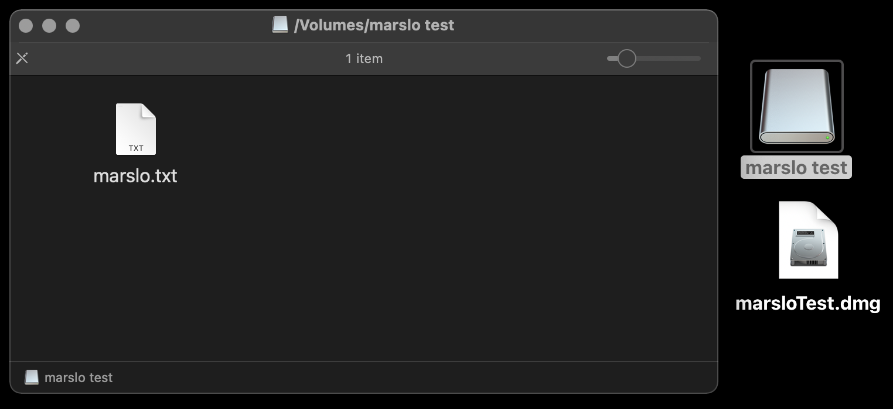
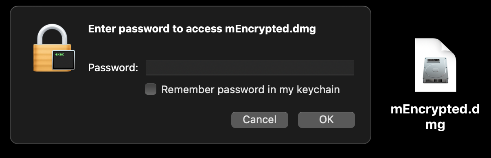
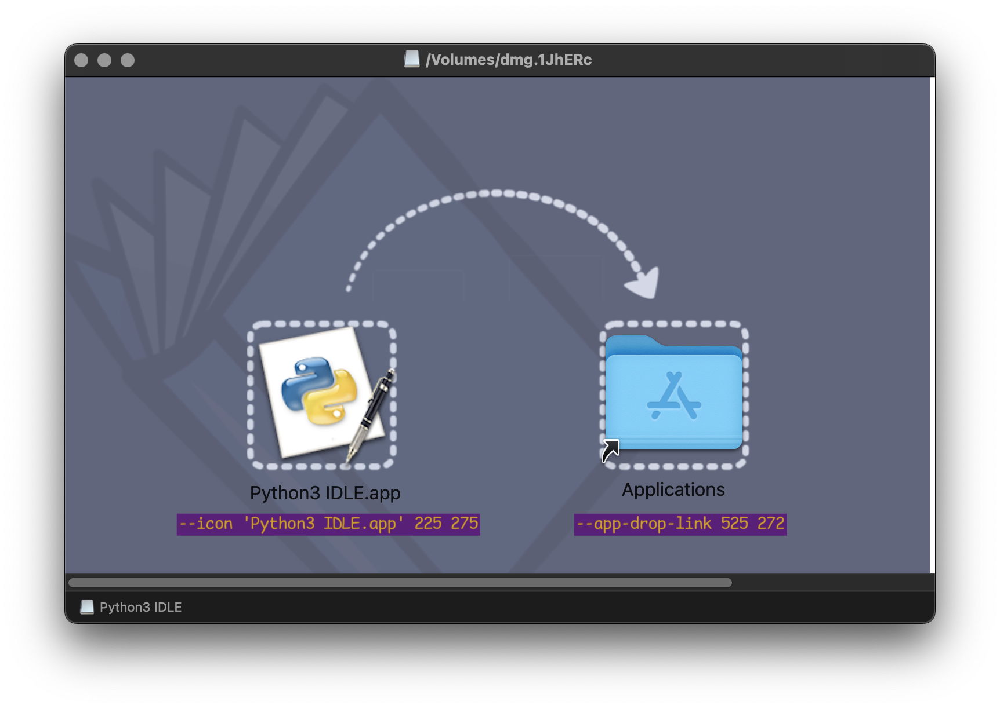

<!-- START doctoc generated TOC please keep comment here to allow auto update -->
<!-- DON'T EDIT THIS SECTION, INSTEAD RE-RUN doctoc TO UPDATE -->

- [disk](#disk)
  - [list disks and volumes](#list-disks-and-volumes)
  - [check volume info](#check-volume-info)
  - [list the apfs info](#list-the-apfs-info)
  - [create volume for case-sensitive APFS](#create-volume-for-case-sensitive-apfs)
  - [create synthetic symlink](#create-synthetic-symlink)
  - [erase disk](#erase-disk)
  - [check detail diskage usage](#check-detail-diskage-usage)
- [create image](#create-image)
  - [background images](#background-images)
  - [create dmg from app](#create-dmg-from-app)
  - [create dvd (for .iso, .img, .dmg)](#create-dvd-for-iso-img-dmg)
  - [create dmg for OS installer](#create-dmg-for-os-installer)
  - [resize the disk image](#resize-the-disk-image)
  - [restore disk images](#restore-disk-images)
- [rename volume](#rename-volume)
  - [partitioning a disk](#partitioning-a-disk)
  - [check usb](#check-usb)

<!-- END doctoc generated TOC please keep comment here to allow auto update -->


## disk


> reference:
> - [Disk Management From the Command-Line, Part 1](http://www.theinstructional.com/guides/disk-management-from-the-command-line-part-1)
> - [Disk Management From the Command-Line, Part 2](http://www.theinstructional.com/guides/disk-management-from-the-command-line-part-2)
> - [Disk Management From the Command-Line, Part 3](http://www.theinstructional.com/guides/disk-management-from-the-command-line-part-3)


### list disks and volumes
```bash
$ diskutil list

# or
$ diskutil list disk1

# or via `lsblk`: https://command-not-found.com/lsblk
$ docker run cmd.cat/lsblk lsblk
NAME   MAJ:MIN RM SIZE RO TYPE MOUNTPOINT
vda    254:0    0  16G  0 disk
└─vda1 254:1    0  16G  0 part /etc/hosts

# or via `lshw`: https://command-not-found.com/lshw
$ docker run cmd.cat/lshw lshw -class disk
  *-virtio1
       description: Virtual I/O device
       physical id: 0
       bus info: virtio@1
       logical name: vda
       configuration: driver=virtio_blk

# or
$ system_profiler SPStorageDataType
```

### check volume info
```bash
$ diskutil info <path/to/volumn>
# i.e.:
$ diskutil info /Volumes/iMarsloOSX/
   Device Identifier:         disk1s5
   Device Node:               /dev/disk1s5
   Whole:                     No
   Part of Whole:             disk1

   Volume Name:               iMarsloOSX
   Mounted:                   Yes
   Mount Point:               /
```

### list the apfs info
```bash
$ diskutil apfs list
APFS Container (1 found)
|
+-- Container disk1 ********-****-****-****-************
    ====================================================
    APFS Container Reference:     disk1
    Size (Capacity Ceiling):      250685575168 B (250.7 GB)
    Capacity In Use By Volumes:   176258826240 B (176.3 GB) (70.3% used)
    Capacity Not Allocated:       74426748928 B (74.4 GB) (29.7% free)
    |
    +-< Physical Store...>
    |
    +-> ...

$ diskutil apfs list
APFS Containers (3 found)
|
+-- Container disk3 8FD21D62-C7F0-4554-B7C7-AE85BE52D8AA
    ====================================================
    APFS Container Reference:     disk3
    Size (Capacity Ceiling):      494384795648 B (494.4 GB)
    Capacity In Use By Volumes:   289735741440 B (289.7 GB) (58.6% used)
    Capacity Not Allocated:       204649054208 B (204.6 GB) (41.4% free)
    |
    +-< Physical Store disk0s2 1*******-****-****-****-***********8
    |   -----------------------------------------------------------
    |   APFS Physical Store Disk:   disk0s2
    |   Size:                       494384795648 B (494.4 GB)
    |
    +-> Volume disk3s1 2*******-****-****-****-***********E
        ---------------------------------------------------
        APFS Volume Disk (Role):   disk3s1 (Data)
        Name:                      Macintosh HD - Data (Case-insensitive)
        Mount Point:               /System/Volumes/Data
        Capacity Consumed:         256742236160 B (256.7 GB)
        Sealed:                    No
        FileVault:                 Yes (Unlocked)
```

### create volume for case-sensitive APFS

> [!NOTE]
> - volume name: `CaseSensitive`
> - volume size: `4000m` (4GB)
> - disk identifier: `disk3`
> - case-sensitive:
>
> | CASE SENSITIVE | CASE INSENSITIVE |
> |:--------------:|:----------------:|
> | APFSX          | APFS             |

```bash
# for case-sensitive APFS
$ diskutil apfs addVolume disk3 APFSX CaseSensitive -quota 4000m

# remove
$ diskutil unmount /Volumes/CaseSensitive
$ diskutil apfs deleteVolume disk3s7
```

### create synthetic symlink

> [!TIP|label:references:]
> to create `/mnt` or `/data` in macOS like Linux

```bash
# create a real directory
$ sudo mkdir -p /System/Volumes/Data/mnt
# to prevent permission denied when create folder/file
$ sudo chown "$(id -un)":staff /System/Volumes/Data/mnt

# edit/create synthetic.conf : `⇥` means tab : using `:set noexpandtab` in nvim/vim to prevent tab to spaces
$ sudo vim /etc/synthetic.conf
mnt⇥System/Volumes/Data/mnt
$ sudo chown root:wheel /etc/synthetic.conf
$ sudo chmod 644 /etc/synthetic.conf
# -- verify --
$ command cat -A /etc/synthetic.conf
mnt^ISystem/Volumes/Data/mnt$
$ ls -l /etc/synthetic.conf
-rw-r--r-- 1 root wheel 28 Sep 30 21:50 /etc/synthetic.conf

# reboot
$ sudo reboot
# or reload synthetic.conf without reboot
$ sudo /System/Library/Filesystems/apfs.fs/Contents/Resources/apfs.util -t
```

```bash
# verify
$ ls -Altrh / | command grep --color=never mnt
lrwxr-xr-x  1 root   wheel   23 Sep 30 21:55 mnt -> System/Volumes/Data/mnt

# mount with smbfs
$ mkdir -p /mnt/path
$ mount -t smbfs -o -d=755,-f=755 //SMB_SERVER:/path /mnt/path

# mount with apfs
$ sudo mount -t apfs /dev/diskNs1 /mnt/disk1
```


### erase disk



| File System                 | Abbreviation |
|:----------------------------|:------------:|
| Mac OS Extended (Journaled) |    `JHFS+`   |
| Mac OS Extended             |    `HFS+`    |
| MS-DOS fat32                |    `FAT32`   |
| ExFAT                       |    `ExFAT`   |


- to list file systems
  ```bash
  $ diskutil listFilesystems
  ...
  -------------------------------------------------------------------------------
  PERSONALITY                     USER VISIBLE NAME
  -------------------------------------------------------------------------------
  Case-sensitive APFS             APFS (Case-sensitive)
    (or) APFSX
  APFS                            APFS
    (or) APFSI
  ExFAT                           ExFAT
  Free Space                      Free Space
    (or) FREE
  MS-DOS                          MS-DOS (FAT)
  MS-DOS FAT12                    MS-DOS (FAT12)
  MS-DOS FAT16                    MS-DOS (FAT16)
  MS-DOS FAT32                    MS-DOS (FAT32)
    (or) FAT32
  HFS+                            Mac OS Extended
  Case-sensitive HFS+             Mac OS Extended (Case-sensitive)
    (or) HFSX
  Case-sensitive Journaled HFS+   Mac OS Extended (Case-sensitive, Journaled)
    (or) JHFSX
  Journaled HFS+                  Mac OS Extended (Journaled)
    (or) JHFS+
  UFSD_NTFS                       Microsoft NTFS
  ```

  <!--sec data-title="ExFAT" data-id="section4" data-show=true data-collapse=true ces-->
  ```bash
  $ diskutil eraseDisk ExFAT iMarsloUSB /dev/disk2
  Started erase on disk2
  Unmounting disk
  Creating the partition map
  Waiting for partitions to activate
  Formatting disk2s2 as ExFAT with name iMarsloUSB
  Volume name      : iMarsloUSB
  Partition offset : 411648 sectors (210763776 bytes)
  Volume size      : 246534144 sectors (126225481728 bytes)
  Bytes per sector : 512
  Bytes per cluster: 131072
  FAT offset       : 2048 sectors (1048576 bytes)
  # FAT sectors    : 8192
  Number of FATs   : 1
  Cluster offset   : 10240 sectors (5242880 bytes)
  # Clusters       : 962984
  Volume Serial #  : 5ff81490
  Bitmap start     : 2
  Bitmap file size : 120373
  Upcase start     : 3
  Upcase file size : 5836
  Root start       : 4
  Mounting disk
  Finished erase on disk2
  ```
  <!--endsec-->

  <!--sec data-title="check" data-id="section5" data-show=true data-collapse=true ces-->
  ```bash
  $ diskutil info disk2s1
     Device Identifier:         disk2s1
     Device Node:               /dev/disk2s1
     Whole:                     No
     Part of Whole:             disk2

     Volume Name:               EFI
     Mounted:                   No

     Partition Type:            EFI
     File System Personality:   MS-DOS FAT32
     Type (Bundle):             msdos
     Name (User Visible):       MS-DOS (FAT32)
     ...
     ...

  $ diskutil info disk2s2
     Device Identifier:         disk2s2
     Device Node:               /dev/disk2s2
     Whole:                     No
     Part of Whole:             disk2

     Volume Name:               iMarsloUSB
     Mounted:                   Yes
     Mount Point:               /Volumes/iMarsloUSB

     Partition Type:            Microsoft Basic Data
     File System Personality:   ExFAT
     Type (Bundle):             exfat
     Name (User Visible):       ExFAT
     ...
     ...
  ```
  <!--endsec-->


```bash
# verifying and repairing volumes
$ diskutil verifyVolume /Volumes/<volume name>
$ diskutil repairVolume /Volumes/<volume name>
```

### check detail diskage usage
```bash
$ sudo fs_usage
21:03:47  ioctl        0.000003   iTerm2
21:03:47  ioctl        0.000003   iTerm2
21:03:47  close        0.000031   privoxy
21:03:47  select       0.000004   privoxy
...
```

## create image

> [!NOTE|label:references:]
> - [How do I create a nice-looking DMG for Mac OS X using command-line tools?](https://stackoverflow.com/a/1513578/2940319)
> - [andreyvit/create-dmg](https://github.com/andreyvit/create-dmg)
> - [LinusU/node-appdmg](https://github.com/LinusU/node-appdmg)
> - [Mac打包dmg文件(更换背景图)](https://blog.csdn.net/u011236348/article/details/88772966)

### background images


### create dmg from app

- via `hdiutil`

  > [!NOTE|label:references:]
  > - `-format`:
  >   - `UDRW`: read/write image
  >   - `UDRO`: read-only image
  >   - `UDCO`: ADC-compressed image
  >   - `UDZO`: zlib-compressed image
  >   - `UDBZ`: bzip2-compressed image
  >   - `ULFO`: lzfse-compressed image, introduced in macOS 10.11
  >   - `ULMO`: lzma-compressed image, introduced in macOS 10.15
  >   - `UDTO`: DVD/CD-R master for export
  >   - `UDSP`: SPARSE (grows with content)
  >   - `UDSB`: SPARSEBUNDLE (grows with content; bundle-backed)
  >   - `UFBI`: UDIF entire image with MD5 checksum

  ```bash
  $ hdiutil create -srcfolder "/Applications/Python3 IDLE.app" \
                   -volname 'Python3 IDLE' \
                   -fs HFS+ \
                   -fsargs "-c c=64,a=16,e=16" \
                   -format UDRW \
                   "Python3 IDLE.dmg" [ --debug ] [ --verbose ]

  # or
  $ hdiutil create -volname "Volume Name" \
                   -srcfolder /path/to/folder \
                   -ov diskimage.dmg

  # create encrypted image
  $ hdiutil create encrypted.dmg
                   -encryption AES-128 \
                   -stdinpass \
                   -volname "Volume Name" \
                   -srcfolder /path/to/folder \
                   -ov                       # overwrite any existing files
  # i.e.:
  $ hdiutil create mEncrypted.dmg \
                   -encryption \
                   -size 1g \
                   -volname "mEncrypted Disk Image" \
                   -fs JHFS+ \
                   -srcfolder /path/to/folder \
  Enter a new password to secure "mEncrypted.dmg":
  Re-enter new password:
  ....
  created: /Users/marslo/Desktop/mEncrypted.dmg

  # create read/write image with specific size
  $ hdiutil create ~/Desktop/mTest.dmg \
            -volname "Marslo Test" \
            -srcfolder ~/Desktop/mTest \
            -size 1g \
            -format UDRW                     # UDRW: read/write image
  ```

  

  

- via `create-dmg`
  ```bash
  $ brew install create-dmg
  $ create-dmg --volname 'Python3 IDLE' \
               --volicon /opt/dmg-backgound/.idle.icns \
               --background /opt/dmg-backgound/.background.2.png \
               --icon 'Python3 IDLE.app' 225 275 \
               --app-drop-link 525 270 \
               --window-size 750 500 \
               --hide-extension 'Python3 IDLE.app' \
               'Python3 IDLE.dmg' '/Applications/Python3 IDLE.app'
  ```

  

### create dvd (for .iso, .img, .dmg)
```bash
$ hdiutil burn /path/to/image_file
```

### create dmg for OS installer
```bash
$ sudo hdiutil create ~/Desktop/Lion.dmg -srcdevice /dev/disk2s4
```

### resize the disk image
```bash
$ hdiutil resize -size <new size> <imagename>.dmg

# or
$ hdiutil resize -size 2g mEncrypted.dmg
```

### restore disk images
```bash
$ sudo asr restore --source <disk image>.dmg --target /Volumes/<volume name>
```


## rename volume
```bash
$ diskutil rename "<current name of volume>" "<new name>"
```

### partitioning a disk


> reference:
> - `GPT`: GUID Partition Table
> - `APM`: Apple Partition Map
> - `MBR`: Master Boot Records


```bash
$ diskutil partitionDisk /dev/disk2 GPT JHFS+ New 0b
```

- multiple partitions
  ```bash
  $ diskutil partitionDisk /dev/disk2 GPT \
             JHFS+ First 10g \
             JHFS+ Second 10g \
             JHFS+ Third 10g \
             JHFS+ Fourth 10g \
             JHFS+ Fifth 0b
  ```

- splitting partitions
  ```bash
  $ diskutil splitPartition /dev/disk2s6 \
             JHFS+ Test 10GB \
             JHFS+ Test2 0b
  ```

- merging partitions
  ```bash
  $ diskutil mergePartitions \
             JHFS+ \
             NewName \
             <first disk identifier in range> \
             <last disk identifier in range>
  # i.e.:
  $ diskutil mergePartitions JHFS+ NewName disk2s4 disk2s6
  ```

### [check usb](https://apple.stackexchange.com/a/170118/254265)

> [!NOTE|label:references:]
> - [tips and tricks](https://gist.github.com/dive/3070807)
> - [`system_profiler -usage`](https://gist.github.com/dive/3070807)

```bash
$ system_profiler SPUSBDataType

# get xml format
$ system_profiler -xml SPUSBDataType

# or
$ ioreg -p IOUSB

# or
$ ioreg -p IOUSB -w0 -l

# or get device name
$ ioreg -p IOUSB -w0 | sed 's/[^o]*o //; s/@.*$//' | grep -v '^Root.*'
```
