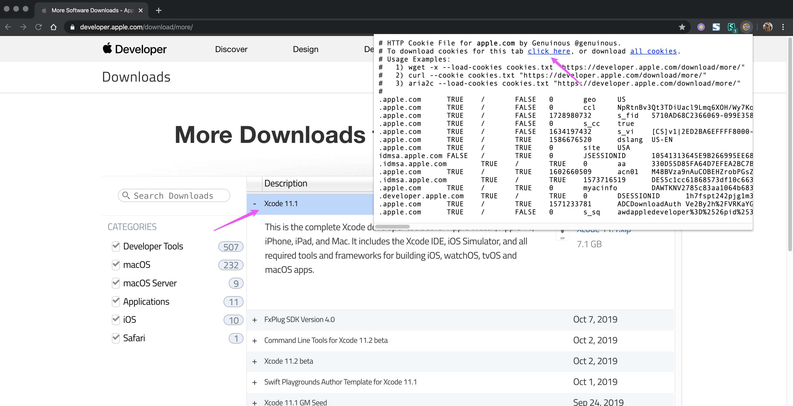
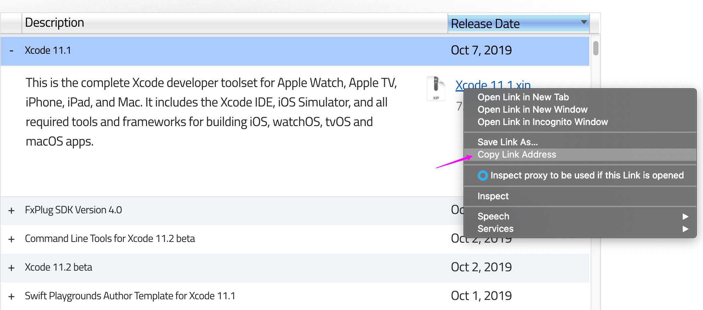

<!-- START doctoc generated TOC please keep comment here to allow auto update -->
<!-- DON'T EDIT THIS SECTION, INSTEAD RE-RUN doctoc TO UPDATE -->
**Table of Contents**  *generated with [DocToc](https://github.com/thlorenz/doctoc)*

- [xcode](#xcode)
  - [downlaod xcode by wget](#downlaod-xcode-by-wget)
  - [Appendix](#appendix)
  - [accpet license from cmd](#accpet-license-from-cmd)
  - [commandline tools and compoents](#commandline-tools-and-compoents)
  - [enable dev mode](#enable-dev-mode)
- [system info](#system-info)
- [system](#system)
  - [setup hostname](#setup-hostname)
  - [disable guest user](#disable-guest-user)
  - [System Integrity Protection](#system-integrity-protection)
- [app](#app)
  - [java](#java)

<!-- END doctoc generated TOC please keep comment here to allow auto update -->

## xcode
### downlaod xcode by wget
* get cookies.txt
  * install google chrome extension from [official website](https://chrome.google.com/webstore/detail/cookiestxt/njabckikapfpffapmjgojcnbfjonfjfg?hl=en)
  * login [developer.apple.com](https://developer.apple.com/download/more/)
  * select cookies.txt and download



* get xcode download url and right click and select **Copy Link Address**:



* download xcode (inspired from [here](https://stackoverflow.com/a/4089758/2940319) and [here](https://stackoverflow.com/a/46020878/2940319))
  ```bash
  $ wget --cookies=on \
         --load-cookies=cookies.txt \
         --keep-session-cookies \
         --save-cookies=cookies.txt \
         https://download.developer.apple.com/Developer_Tools/Xcode_11.2_beta_2/Xcode_11.2_beta_2.xip
  ```
  * exmaple
    ```bash
    $ wget --cookies=on \
    >          --load-cookies=cookies.txt \
    >          --keep-session-cookies \
    >          --save-cookies=cookies.txt \
    >          https://download.developer.apple.com/Developer_Tools/Xcode_11.2_beta_2/Xcode_11.2_beta_2.xip
    --2019-10-15 07:55:18--  https://download.developer.apple.com/Developer_Tools/Xcode_11.2_beta_2/Xcode_11.2_beta_2.xip
    Resolving download.developer.apple.com (download.developer.apple.com)... 17.253.17.207, 17.253.17.211
    Connecting to download.developer.apple.com (download.developer.apple.com)|17.253.17.207|:443... connected.
    HTTP request sent, awaiting response... 200 OK
    Length: 7805079698 (7.3G) [application/octet-stream]
    Saving to: ‘Xcode_11.2_beta_2.xip’

    100%[===========================================================================================================>] 7,805,079,698  112MB/s   in 70s

    2019-10-15 07:53:07 (106 MB/s) - ‘Xcode_11.2_beta_2.xip’ saved [7805079698/7805079698]

    $ ls -altrh Xcode_11.2_beta_2.xip
    -rw-rw-r-- 1 devops devops 7.3G Oct  9 13:27 Xcode_11.2_beta_2.xip
    ```

### Appendix
#### xcode
| xcode       | url                                                                                            |
| ----------- | ---------------------------------------------------------------------------------------------- |
| 12.3 beta   | `https://download.developer.apple.com/Developer_Tools/Xcode_12.3_beta/Xcode_12.3_beta.xip`     |
| 12.2        | `https://download.developer.apple.com/Developer_Tools/Xcode_12.2/Xcode_12.2.xip`               |
| 12.2beta2   | `https://download.developer.apple.com/Developer_Tools/Xcode_12.2_beta_2/Xcode_12.2_beta_2.xip` |
| 12.0.1      | `https://download.developer.apple.com/Developer_Tools/Xcode_12.0.1/Xcode_12.0.1.xip`           |
| 12 beta 5   | `https://download.developer.apple.com/Developer_Tools/Xcode_12_beta_5/Xcode_12_beta_5.xip`     |
| 11.6        | `https://download.developer.apple.com/Developer_Tools/Xcode_11.6/Xcode_11.6.xip`               |
| 11.5 beta 2 | `https://download.developer.apple.com/Developer_Tools/Xcode_11.5_beta_2/Xcode_11.5_beta_2.xip` |
| 11.5 beta   | `https://download.developer.apple.com/Developer_Tools/Xcode_11.5_beta/Xcode_11.5_beta.xip`     |
| 11.4.1      | `https://download.developer.apple.com/Developer_Tools/Xcode_11.4.1/Xcode_11.4.1.xip`           |
| 11.4        | `https://download.developer.apple.com/Developer_Tools/Xcode_11.4/Xcode_11.4.xip`               |
| 11.4 beta 3 | `https://download.developer.apple.com/Developer_Tools/Xcode_11.4_beta_3/Xcode_11.4_beta_3.xip` |
| 11.4 beta 2 | `https://download.developer.apple.com/Developer_Tools/Xcode_11.4_beta_2/Xcode_11.4_beta_2.xip` |
| 11.4 beta   | `https://download.developer.apple.com/Developer_Tools/Xcode_11.4_beta/Xcode_11.4_beta.xip`     |
| 11.3.1      | `https://download.developer.apple.com/Developer_Tools/Xcode_11.3.1/Xcode_11.3.1.xip`           |
| 11.2 beta 2 | `https://download.developer.apple.com/Developer_Tools/Xcode_11.2_beta_2/Xcode_11.2_beta_2.xip` |
| 11.1        | `https://download.developer.apple.com/Developer_Tools/Xcode_11.1/Xcode_11.1.xip`               |
| 11.2 beta   | `https://download.developer.apple.com/Developer_Tools/Xcode_11.2_beta/Xcode_11.2_beta.xip`     |
| 11          | `https://download.developer.apple.com/Developer_Tools/Xcode_11/Xcode_11.xip`                   |
| 10.3        | `https://download.developer.apple.com/Developer_Tools/Xcode_10.3/Xcode_10.3.xip`               |
| 10.2.1      | `https://download.developer.apple.com/Developer_Tools/Xcode_10.2.1/Xcode_10.2.1.xip`           |
| 10.2        | `https://download.developer.apple.com/Developer_Tools/Xcode_10.2/Xcode_10.2.xip`               |
| 10.1        | `https://download.developer.apple.com/Developer_Tools/Xcode_10.1/Xcode_10.1.xip`               |

#### command line tool
| command line tool    | url                                                                                                                                                            |
| -------------------- | -------------------------------------------------------------------------------------------------------------------------------------------------------------- |
| 12.3 beta            | `https://download.developer.apple.com/Developer_Tools/Xcode_12.3_beta/Xcode_12.3_beta.xip`                                                                     |
| 12.2                 | `https://download.developer.apple.com/Developer_Tools/Command_Line_Tools_for_Xcode_12.2/Command_Line_Tools_for_Xcode_12.2.dmg`                                 |
| 12.0                 | `https://download.developer.apple.com/Developer_Tools/Command_Line_Tools_for_Xcode_12/Command_Line_Tools_for_Xcode_12.dmg`                                     |
| 11.4.1               | `https://download.developer.apple.com/Developer_Tools/Command_Line_Tools_for_Xcode_11.4.1/Command_Line_Tools_for_Xcode_11.4.1.dmg`                             |
| 11.4                 | `https://download.developer.apple.com/Developer_Tools/Command_Line_Tools_for_Xcode_11.4/Command_Line_Tools_for_Xcode_11.4.dmg`                                 |
| 11.4 beta 3          | `https://download.developer.apple.com/Developer_Tools/Command_Line_Tools_for_Xcode_11.4_beta_3/Command_Line_Tools_for_Xcode_11.4_beta_3.dmg`                   |
| 11.4 beta 2          | `https://download.developer.apple.com/Developer_Tools/Command_Line_Tools_for_Xcode_11.4_beta_2/Command_Line_Tools_for_Xcode_11.4_beta_2.dmg`                   |
| 11.3.1               | `https://download.developer.apple.com/Developer_Tools/Command_Line_Tools_for_Xcode_11.3.1/Command_Line_Tools_for_Xcode_11.3.1.dmg`                             |
| 11.2 beta 2          | `https://download.developer.apple.com/Developer_Tools/Command_Line_Tools_for_Xcode_11.2_beta_2/Command_Line_Tools_for_Xcode_11.2_beta_2.dmg`                   |
| 11.1                 | `https://download.developer.apple.com/Developer_Tools/Command_Line_Tools_for_Xcode_11.2_beta/Command_Line_Tools_for_Xcode_11.2_beta.dmg`                       |
| 11                   | `https://download.developer.apple.com/Developer_Tools/Command_Line_Tools_for_Xcode_11/Command_Line_Tools_for_Xcode_11.dmg`                                     |
| 10.3                 | `https://download.developer.apple.com/Developer_Tools/Command_Line_Tools_macOS_10.14_for_Xcode_10.3/Command_Line_Tools_macOS_10.14_for_Xcode_10.3.dmg`         |
| 10.2.1               | `https://download.developer.apple.com/Developer_Tools/Command_Line_Tools_macOS_10.14_for_Xcode_10.2.1.dmg/Command_Line_Tools_macOS_10.14_for_Xcode_10.2.1.dmg` |
| 10.2                 | `https://download.developer.apple.com/Developer_Tools/Command_Line_Tools_macOS_10.14_for_Xcode_10.2/Command_Line_Tools_macOS_10.14_for_Xcode_10.2.dmg`         |
| 10.1 for macOS 10.14 | `https://download.developer.apple.com/Developer_Tools/Command_Line_Tools_macOS_10.14_for_Xcode_10.1/Command_Line_Tools_macOS_10.14_for_Xcode_10.1.dmg`         |
| 10.1 for macOS 10.13 | `https://download.developer.apple.com/Developer_Tools/Command_Line_Tools_macOS_10.13_for_Xcode_10.1/Command_Line_Tools_macOS_10.13_for_Xcode_10.1.dmg`         |

#### additional tools
| additional tool      | url                                                                                                                                                            |
| -------------------- | -------------------------------------------------------------------------------------------------------------------------------------------------------------- |
| 11.4                 | `https://download.developer.apple.com/Developer_Tools/Additional_Tools_for_Xcode_11.4/Additional_Tools_for_Xcode_11.4.dmg`                                     |
| 11.4 beta 2          | `https://download.developer.apple.com/Developer_Tools/Additional_Tools_for_Xcode_11.4_beta_2/Additional_Tools_for_Xcode_11.4_beta_2.dmg`                       |
| 11                   | `https://download.developer.apple.com/Developer_Tools/Additional_Tools_for_Xcode_11/Additional_Tools_for_Xcode_11.dmg`                                         |
| 10.1                 | `https://download.developer.apple.com/Developer_Tools/Additional_Tools_for_Xcode_10.1/Additional_Tools_for_Xcode_10.1.dmg`                                     |

* [additional info](https://stackoverflow.com/a/44390183/2940319)

### accpet license from cmd
```bash
$ sudo xcodebuild -license accept
```

### commandline tools and compoents
- installation
  ```bash
  $ xcode-select -p

  $ for pkg in /Applications/Xcode.app/Contents/Resources/Packages/*.pkg; do
      sudo installer -pkg "$pkg" -target /;
  done
  ```
- upgrade
  ```bash
  $ softwareupdate --all --install --force
  ```
  or
  ```bash
  $ sudo rm -rf /Library/Developer/CommandLineTools
  $ sudo xcode-select --install
  ```

  [more details](https://stackoverflow.com/a/44234214/2940319)
  ```bash
  $ defaults read /Library/Preferences/com.apple.SoftwareUpdate
  {
      AutomaticallyInstallMacOSUpdates = 1;
      LastAttemptBuildVersion = "10.15.7 (19H2)";
      LastAttemptSystemVersion = "10.15.7 (19H2)";
      LastBackgroundSuccessfulDate = "2020-10-10 06:15:40 +0000";
      LastCatalogChangeDate = "2020-10-10 14:13:29 +0000";
      LastFullSuccessfulDate = "2020-10-10 14:14:38 +0000";
      LastRecommendedMajorOSBundleIdentifier = "";
      LastRecommendedUpdatesAvailable = 0;
      LastResultCode = 2;
      LastSessionSuccessful = 1;
      LastSuccessfulDate = "2020-10-10 14:14:38 +0000";
      LastUpdatesAvailable = 0;
      PrimaryLanguages =     (
          "en-CN",
          en
      );
      RecommendedUpdates =     (
      );
      SkipLocalCDN = 0;
  }
  ```

### enable dev mode
```bash
$ DevToolsSecurity -enable
```

## system info
- production version

```bash
$ sw_vers
ProductName:    Mac OS X
ProductVersion: 10.15
BuildVersion:   19A602
```

  - [or](https://apple.stackexchange.com/a/368722/254265)
    ```bash
    $ /usr/libexec/PlistBuddy -c "Print:ProductName" \
      ->                         -c "Print:ProductVersion" \
      ->                         -c "Print:ProductBuildVersion" /System/Library/CoreServices/SystemVersion.plist
    macOS
    11.0.1
    20B29
    ```

- hardware
  ```bash
  $ /usr/sbin/system_profiler SPHardwareDataType
  Hardware:

      Hardware Overview:

        Model Name: MacBook Pro
        Model Identifier: MacBookPro15,1
        Processor Name: 6-Core Intel Core i7
        Processor Speed: 2.2 GHz
        Number of Processors: 1
        Total Number of Cores: 6
        L2 Cache (per Core): 256 KB
        L3 Cache: 9 MB
        Hyper-Threading Technology: Enabled
        Memory: 16 GB
        Boot ROM Version: 1037.0.78.0.0 (iBridge: 17.16.10572.0.0,0)
        Serial Number (system): C02XFGWEJG5H
        Hardware UUID: 4EA008BF-9B36-5F1D-9151-AD4F64808AAB
        Activation Lock Status: Enabled

  $ system_profiler SPCameraDataType
  Camera:

      FaceTime HD Camera (Built-in):

        Model ID: UVC Camera VendorID_1452 ProductID_34068
        Unique ID: 0x8020000005ac8514
  ```

- cpu

  ```bash
  $ sysctl -n machdep.cpu.brand_string
  Intel(R) Core(TM) i7-8750H CPU @ 2.20GHz
  ```

  - or
    ```bash
    $ sysctl machdep.cpu
    machdep.cpu.max_basic: 22
    machdep.cpu.max_ext: 2147483656
    machdep.cpu.vendor: GenuineIntel
    machdep.cpu.brand_string: Intel(R) Core(TM) i7-8750H CPU @ 2.20GHz
    machdep.cpu.family: 6
    machdep.cpu.model: 158
    ...
    ```

## system
### setup hostname
```bash
$ sudo scutil --set HostName [HOSTNAME]
$ sudo scutil --set LocalHostName [HOSTNAME]
# Optional
$ sudo scutil --set ComputerName [HOSTNAME]
# Flush the DNS Cache
$ dscacheutil -flushcache
$ sudo shutdown -r now
```

### disable guest user
```bash
$ dscl . delete /Users/Guest
$ sudo defaults write /Library/Preferences/com.apple.AppleFileServer guestAccess -bool NO
$ sudo defaults write /Library/Preferences/SystemConfiguration/com.apple.smb.server AllowGuestAccess -bool NO
```

### [System Integrity Protection](https://derflounder.wordpress.com/2015/10/01/system-integrity-protection-adding-another-layer-to-apples-security-model/)
```bash
$ csrutil disable
Successfully disabled System Integrity Protection. Please restart the machine for the changes to take effect.
$ csrutil clear
Successfully cleared System Integrity Proteciton. Please restart the machine for the changes to take effect.
$ sudo chflags restricted /usr/local
```

#### turn off the Rootless System Integrity Protection
> ```bash
> $ csrutil status
> System Integrity Protection status: enabled.
>
> $ sudo csrutil disable
> csrutil: failed to modify system integrity configuration. This tool needs to be executed from the Recovery OS
> ```

- [reboot and <kbd>command</kbd> + <kbd>r</kbd>](https://support.apple.com/en-us/HT201314)
- go to `Utilities` -> `Terminal`
  

- disable
  ```bash
  -bash-3.2# csrutil status
   System Integrity Protection status: enabled
   -bash-3.2# csrutil disable
   Successfully disabled System Integrity Protection. Please restart the machine for the changes to take effect.
  ```

#### [Remove file lock (uchg) flag](https://superuser.com/a/40754/112396)
```bash
$ chflags -R nouchg *
# or
$ chflags -R nouchg <PATH of folder>
```

- example
  ```bash
  $ find /usr -flags +sunlnk -print
  /usr/libexec/cups
  find: /usr/sbin/authserver: Permission denied
  /usr/local
  /usr/share/man
  /usr/share/snmp

  $ /bin/ls -lO /usr
  total 0
  drwxr-xr-x  976 root  wheel  restricted 31232 Oct 28 19:17 bin/
  drwxr-xr-x  292 root  wheel  restricted  9344 Oct 28 10:04 lib/
  drwxr-xr-x  234 root  wheel  restricted  7488 Oct 28 19:17 libexec/
  drwxr-xr-x   16 root  wheel  sunlnk       512 Oct 28 19:26 local/
  drwxr-xr-x  246 root  wheel  restricted  7872 Oct 28 09:55 sbin/
  drwxr-xr-x   46 root  wheel  restricted  1472 Oct 28 09:55 share/
  drwxr-xr-x    5 root  wheel  restricted   160 Oct  3 13:48 standalone/

  $ csrutil status
  System Integrity Protection status: enabled.

  $ sudo csrutil disable
  csrutil: failed to modify system integrity configuration. This tool needs to be executed from the Recovery OS

  $ cat /System/Library/Sandbox/rootless.conf
  $ /bin/ls -lO /Applications | grep firefox
  22:drwxr-xr-x   3 marslo  staff  -           96 Dec  7 03:14 Firefox.app
  $ sudo chflags restricted Firefox.app
  $ /bin/ls -lO /Applications | grep firefox
  drwxr-xr-x   3 marslo  staff  restricted  96 Dec  7 03:14 Firefox.app
  ```

## app
### java
- setup java home
  ```bash
  $ /usr/libexec/java_home -v 1.8.0.162 -exec javac -versioin
  ```
