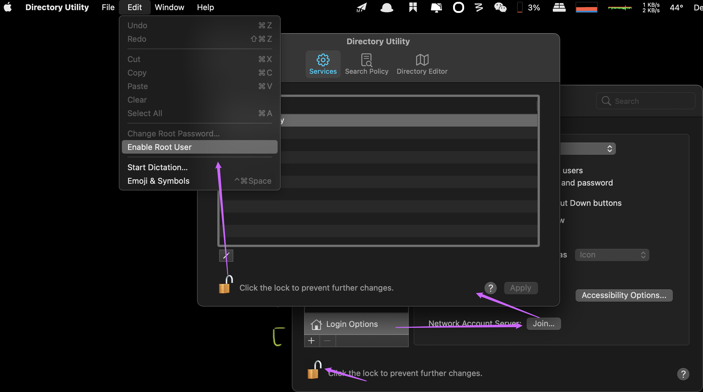
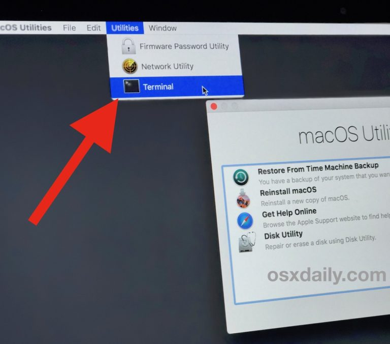
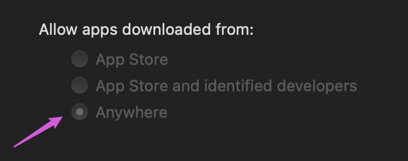

<!-- START doctoc generated TOC please keep comment here to allow auto update -->
<!-- DON'T EDIT THIS SECTION, INSTEAD RE-RUN doctoc TO UPDATE -->

- [system info](#system-info)
- [system](#system)
  - [setup hostname](#setup-hostname)
  - [enable root user](#enable-root-user)
  - [system integrity protection](#system-integrity-protection)
  - [disable/enable gatekeeper](#disableenable-gatekeeper)
- [apps](#apps)
  - [java](#java)
  - [keychain](#keychain)
- [security](#security)
  - [backup security](#backup-security)
- [bash-completion@2](#bash-completion2)

<!-- END doctoc generated TOC please keep comment here to allow auto update -->


> references:
> - [Mac keyboard shortcuts](https://support.apple.com/en-us/HT201236)


## system info
- production version

  > [!NOTE]
  > [issue in fetchScreen](https://github.com/KittyKatt/screenFetch/issues/692#issuecomment-726631900)

  ```bash
  $ sw_vers
  ProductName    : macOS
  ProductVersion : 11.1
  BuildVersion   : 20C69
  ```

  - [or](https://apple.stackexchange.com/a/368722/254265)
    ```bash
    $ /usr/libexec/PlistBuddy -c "Print:ProductName" \
      ->                         -c "Print:ProductVersion" \
      ->                         -c "Print:ProductBuildVersion" /System/Library/CoreServices/SystemVersion.plist
    macOS
    11.0.1
    20B29
    ```

- hardware
  ```bash
  $ /usr/sbin/system_profiler SPHardwareDataType
  Hardware:

      Hardware Overview:

        Model Name: MacBook Pro
        Model Identifier: MacBookPro15,1
        Processor Name: 6-Core Intel Core i7
        Processor Speed: 2.2 GHz
        Number of Processors: 1
        Total Number of Cores: 6
        L2 Cache (per Core): 256 KB
        L3 Cache: 9 MB
        Hyper-Threading Technology: Enabled
        Memory: 16 GB
        Boot ROM Version: 1037.0.78.0.0 (iBridge: 17.16.10572.0.0,0)
        Serial Number (system): C02XFGWEJG5H
        Hardware UUID: 4EA008BF-9B36-5F1D-9151-AD4F64808AAB
        Activation Lock Status: Enabled

  $ system_profiler SPCameraDataType
  Camera:

      FaceTime HD Camera (Built-in):

        Model ID: UVC Camera VendorID_1452 ProductID_34068
        Unique ID: 0x8020000005ac8514
  ```

- grahics & display
  ```bash
  $ system_profiler SPDisplaysDataType
  Graphics/Displays:

      Intel UHD Graphics 630:

        Chipset Model: Intel UHD Graphics 630
        Type: GPU
        Bus: Built-In
        VRAM (Dynamic, Max): 1536 MB
        Vendor: Intel
        Device ID: 0x3e**
        Revision ID: 0x00**
        Automatic Graphics Switching: Supported
        gMux Version: 5.0.0
        Metal Family: Supported, Metal GPUFamily macOS 2
        Displays:
          Color LCD:
            Display Type: Built-In Retina LCD
            Resolution: 3072 x 1920 Retina
            Framebuffer Depth: 24-Bit Color (ARGB8888)
            Main Display: Yes
            Mirror: Off
            Online: Yes
            Automatically Adjust Brightness: Yes
            Connection Type: Internal

      AMD Radeon Pro 5500M:

        Chipset Model: AMD Radeon Pro 5500M
        Type: GPU
        Bus: PCIe
        PCIe Lane Width: x8
        VRAM (Total): 8 GB
        Vendor: AMD (0x1002)
        Device ID: 0x73**
        Revision ID: 0x00**
        ROM Revision: 113-******-***
        VBIOS Version: 113-********-***
        Option ROM Version: 113-********-***
        EFI Driver Version: 01.A1.190
        Automatic Graphics Switching: Supported
        gMux Version: 5.0.0
        Metal Family: Supported, Metal GPUFamily macOS 2
  ```

- cpu
  ```bash
  $ sysctl -n machdep.cpu.brand_string
  Intel(R) Core(TM) i9-9980HK CPU @ 2.40GHz
  ```

  - or
    ```bash
    $ sysctl machdep.cpu
    machdep.cpu.max_basic: 22
    machdep.cpu.max_ext: 2147483656
    machdep.cpu.vendor: GenuineIntel
    machdep.cpu.brand_string: Intel(R) Core(TM) i9-9980HK CPU @ 2.40GHz
    machdep.cpu.family: 6
    machdep.cpu.model: 158
    machdep.cpu.extmodel: 9
    ...
    ```

## system
### setup hostname
```bash
$ HNAME='iMarsloPro'
$ sudo scutil --set HostName "${HNAME}"
$ sudo scutil --set LocalHostName "${HNAME}"
# Optional
$ sudo scutil --set ComputerName "${HNAME}"
# Flush the DNS Cache
$ dscacheutil -flushcache
$ sudo shutdown -r now
```

- [or](https://docs.gz.ro/node/321)
  ```bash
  $ HNAME='iMarsloPro'
  $ sudo /usr/libexec/PlistBuddy -c "Add :ProgramArguments: string --no-namechange" /System/Library/LaunchDaemons/com.apple.discoveryd.plist
  $ sudo launchctl unload -w /System/Library/LaunchDaemons/com.apple.discoveryd.plist
  $ sudo launchctl load -w /System/Library/LaunchDaemons/com.apple.discoveryd.plist

  $ sudo scutil --set ComputerName "${HNAME}"
  $ sudo scutil --set HostName "${HNAME}"
  $ sudo scutil --set LocalHostName "${HNAME}"
  $ hostname -f
  iMarsloPro
  ```

- list all accounts

  > [!TIP]
  > location of plists: `/var/db/dslocal/nodes/Default/users`

  ```bash
  $ dscl . list /Users

  # or
  $ dscl . -list /Users GeneratedUID
  ```

#### create guest and enable

> [!NOTE]
> scripts: https://github.com/sheagcraig/guestAccount/blob/master/guest_account

```bash
$ dscl . -create /Users/Guest

# keychain
$ keychain='/Users/Guest/Library/Keychains/login.keychain'
$ security create-keychain -p '' $keychain
$ security login-keychain -s $keychain
```

### [enable root user](https://support.apple.com/en-us/HT204012)



### [system integrity protection](https://derflounder.wordpress.com/2015/10/01/system-integrity-protection-adding-another-layer-to-apples-security-model/)

> [!NOTE|label:references:]
> - [fxgst/writeable_root - make your Mac yours again!](https://github.com/fxgst/writeable_root)

```bash
$ csrutil disable
Successfully disabled System Integrity Protection. Please restart the machine for the changes to take effect.
$ csrutil clear
Successfully cleared System Integrity Proteciton. Please restart the machine for the changes to take effect.
$ sudo chflags restricted /usr/local
```

#### turn off the Rootless System Integrity Protection
> ```bash
> $ csrutil status
> System Integrity Protection status: enabled.
>
> $ sudo csrutil disable
> csrutil: failed to modify system integrity configuration. This tool needs to be executed from the Recovery OS
> ```

- [reboot and <kbd>command</kbd> + <kbd>r</kbd>](https://support.apple.com/en-us/HT201314)
- go to `Utilities` -> `Terminal`

  

- disable
  ```bash
  -bash-3.2# csrutil status
   System Integrity Protection status: enabled
   -bash-3.2# csrutil disable
   Successfully disabled System Integrity Protection. Please restart the machine for the changes to take effect.
  ```

#### [remove file lock (uchg) flag](https://superuser.com/a/40754/112396)
```bash
$ chflags -R nouchg *
# or
$ chflags -R nouchg <PATH of folder>
```

- example
  ```bash
  $ find /usr -flags +sunlnk -print
  /usr/libexec/cups
  find: /usr/sbin/authserver: Permission denied
  /usr/local
  /usr/share/man
  /usr/share/snmp

  $ /bin/ls -lO /usr
  total 0
  drwxr-xr-x  976 root  wheel  restricted 31232 Oct 28 19:17 bin/
  drwxr-xr-x  292 root  wheel  restricted  9344 Oct 28 10:04 lib/
  drwxr-xr-x  234 root  wheel  restricted  7488 Oct 28 19:17 libexec/
  drwxr-xr-x   16 root  wheel  sunlnk       512 Oct 28 19:26 local/
  drwxr-xr-x  246 root  wheel  restricted  7872 Oct 28 09:55 sbin/
  drwxr-xr-x   46 root  wheel  restricted  1472 Oct 28 09:55 share/
  drwxr-xr-x    5 root  wheel  restricted   160 Oct  3 13:48 standalone/

  $ csrutil status
  System Integrity Protection status: enabled.

  $ sudo csrutil disable
  csrutil: failed to modify system integrity configuration. This tool needs to be executed from the Recovery OS

  $ cat /System/Library/Sandbox/rootless.conf
  $ /bin/ls -lO /Applications | grep firefox
  22:drwxr-xr-x   3 marslo  staff  -           96 Dec  7 03:14 Firefox.app
  $ sudo chflags restricted Firefox.app
  $ /bin/ls -lO /Applications | grep firefox
  drwxr-xr-x   3 marslo  staff  restricted  96 Dec  7 03:14 Firefox.app
  ```

### [disable/enable gatekeeper](https://gist.github.com/boyvanamstel/2919778)
- disable
  ```bash
  $ sudo spctl --master-disable
  ```
  

- enable
  ```bash
  $ sudo spctl  --master-enable
  ```

- check status
  ```bash
  $ spctl --status
  assessments disabled
  ```

## apps
### java
- setup java home
  ```bash
  $ /usr/libexec/java_home -v 1.8.0.162 -exec javac -versioin
  ```

### keychain

> [!NOTE|label:references:]
> - [Install CA Certificate](https://discussions.apple.com/thread/254786551?sortBy=best)

```bash
$ sudo security add-trusted-cert -d \
                                 -r trustRoot \
                                 -k /Library/Keychains/System.keychain \
                                 /Users/Shared/NAMEOFYOURCERTIFICATE.cer
```

## security
### backup security

> [!NOTE|label:references:]
> - [How to make Python use CA certificates from Mac OS TrustStore?](https://stackoverflow.com/a/72053605/2940319)

- export
  ```bash
  $ security export -t certs -f pemseq -k /System/Library/Keychains/SystemRootCertificates.keychain -o bundleCA.pem
  $ security export -t certs -f pemseq -k /Library/Keychains/System.keychain -o selfSignedCAbundle.pem
  ```

- merge
  ```bash
  $ cat bundleCA.pem selfSignedCAbundle.pem >> allCAbundle.pem
  $ export REQUESTS_CA_BUNDLE=/path/to/allCAbundle.pem
  ```

## bash-completion@2

> [!NOTE|label:references:]
> - entry script: `$(brew --prefix)/etc/profile.d/bash_completion.sh`
> - bash_completion.d: `$(brew --prefix)/etc/bash_completion.d`
> - see also:
>   - [* iMarslo: bash completion](../cheatsheet/bash/sugar.md#bash-completion)
>   - [iMarslo: setup auto-completion for linux](../linux/devenv.md#auto-completion)
>   - [iMarslo: bash completion troubleshooting for linux](../linux/troubleshooting.md#bash_completion)

```bash
$ brew info bash-completion@2
...

==> Caveats
Add the following line to your ~/.bash_profile:
  [[ -r "/opt/homebrew/etc/profile.d/bash_completion.sh" ]] && . "/opt/homebrew/etc/profile.d/bash_completion.sh"
...

# or
$ grep -n bash_completion ~/.bash_profile
9:  [[ -r "$(brew --prefix)/etc/profile.d/bash_completion.sh" ]] && source "$(brew --prefix)/etc/profile.d/bash_completion.sh"
29:  command -v brew >/dev/null && source "$(brew --prefix git)"/etc/bash_completion.d/git-*.sh \
30:                             || source "$(brew --prefix git)"/etc/bash_completion.d/git-prompt.sh
```
