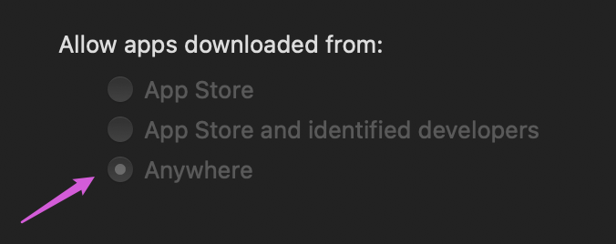

<!-- START doctoc generated TOC please keep comment here to allow auto update -->
<!-- DON'T EDIT THIS SECTION, INSTEAD RE-RUN doctoc TO UPDATE -->

- [system info](#system-info)
- [system](#system)
  - [setup hostname](#setup-hostname)
  - [disable guest user](#disable-guest-user)
  - [enable root user](#enable-root-user)
  - [system integrity protection](#system-integrity-protection)
  - [disable/enable gatekeeper](#disableenable-gatekeeper)
- [apps](#apps)
  - [java](#java)
  - [keychain](#keychain)
- [xcode](#xcode)
  - [downlaod xcode by wget](#downlaod-xcode-by-wget)
  - [developer tools](#developer-tools)
  - [appendix](#appendix)
  - [accpet license from cmd](#accpet-license-from-cmd)
  - [commandline tools and compoents](#commandline-tools-and-compoents)
  - [enable dev mode](#enable-dev-mode)
  - [troubleshooting](#troubleshooting)
- [security](#security)
  - [backup security](#backup-security)

<!-- END doctoc generated TOC please keep comment here to allow auto update -->


> references:
> - [Mac keyboard shortcuts](https://support.apple.com/en-us/HT201236)


## system info
- production version

  > [!NOTE]
  > [issue in fetchScreen](https://github.com/KittyKatt/screenFetch/issues/692#issuecomment-726631900)

  ```bash
  $ sw_vers
  ProductName    : macOS
  ProductVersion : 11.1
  BuildVersion   : 20C69
  ```

  - [or](https://apple.stackexchange.com/a/368722/254265)
    ```bash
    $ /usr/libexec/PlistBuddy -c "Print:ProductName" \
      ->                         -c "Print:ProductVersion" \
      ->                         -c "Print:ProductBuildVersion" /System/Library/CoreServices/SystemVersion.plist
    macOS
    11.0.1
    20B29
    ```

- hardware
  ```bash
  $ /usr/sbin/system_profiler SPHardwareDataType
  Hardware:

      Hardware Overview:

        Model Name: MacBook Pro
        Model Identifier: MacBookPro15,1
        Processor Name: 6-Core Intel Core i7
        Processor Speed: 2.2 GHz
        Number of Processors: 1
        Total Number of Cores: 6
        L2 Cache (per Core): 256 KB
        L3 Cache: 9 MB
        Hyper-Threading Technology: Enabled
        Memory: 16 GB
        Boot ROM Version: 1037.0.78.0.0 (iBridge: 17.16.10572.0.0,0)
        Serial Number (system): C02XFGWEJG5H
        Hardware UUID: 4EA008BF-9B36-5F1D-9151-AD4F64808AAB
        Activation Lock Status: Enabled

  $ system_profiler SPCameraDataType
  Camera:

      FaceTime HD Camera (Built-in):

        Model ID: UVC Camera VendorID_1452 ProductID_34068
        Unique ID: 0x8020000005ac8514
  ```

- grahics & display
  ```bash
  $ system_profiler SPDisplaysDataType
  Graphics/Displays:

      Intel UHD Graphics 630:

        Chipset Model: Intel UHD Graphics 630
        Type: GPU
        Bus: Built-In
        VRAM (Dynamic, Max): 1536 MB
        Vendor: Intel
        Device ID: 0x3e**
        Revision ID: 0x00**
        Automatic Graphics Switching: Supported
        gMux Version: 5.0.0
        Metal Family: Supported, Metal GPUFamily macOS 2
        Displays:
          Color LCD:
            Display Type: Built-In Retina LCD
            Resolution: 3072 x 1920 Retina
            Framebuffer Depth: 24-Bit Color (ARGB8888)
            Main Display: Yes
            Mirror: Off
            Online: Yes
            Automatically Adjust Brightness: Yes
            Connection Type: Internal

      AMD Radeon Pro 5500M:

        Chipset Model: AMD Radeon Pro 5500M
        Type: GPU
        Bus: PCIe
        PCIe Lane Width: x8
        VRAM (Total): 8 GB
        Vendor: AMD (0x1002)
        Device ID: 0x73**
        Revision ID: 0x00**
        ROM Revision: 113-******-***
        VBIOS Version: 113-********-***
        Option ROM Version: 113-********-***
        EFI Driver Version: 01.A1.190
        Automatic Graphics Switching: Supported
        gMux Version: 5.0.0
        Metal Family: Supported, Metal GPUFamily macOS 2
  ```

- cpu
  ```bash
  $ sysctl -n machdep.cpu.brand_string
  Intel(R) Core(TM) i9-9980HK CPU @ 2.40GHz
  ```

  - or
    ```bash
    $ sysctl machdep.cpu
    machdep.cpu.max_basic: 22
    machdep.cpu.max_ext: 2147483656
    machdep.cpu.vendor: GenuineIntel
    machdep.cpu.brand_string: Intel(R) Core(TM) i9-9980HK CPU @ 2.40GHz
    machdep.cpu.family: 6
    machdep.cpu.model: 158
    machdep.cpu.extmodel: 9
    ...
    ```

## system
### setup hostname
```bash
$ HNAME='iMarsloPro'
$ sudo scutil --set HostName "${HNAME}"
$ sudo scutil --set LocalHostName "${HNAME}"
# Optional
$ sudo scutil --set ComputerName "${HNAME}"
# Flush the DNS Cache
$ dscacheutil -flushcache
$ sudo shutdown -r now
```

- [or](https://docs.gz.ro/node/321)
  ```bash
  $ HNAME='iMarsloPro'
  $ sudo /usr/libexec/PlistBuddy -c "Add :ProgramArguments: string --no-namechange" /System/Library/LaunchDaemons/com.apple.discoveryd.plist
  $ sudo launchctl unload -w /System/Library/LaunchDaemons/com.apple.discoveryd.plist
  $ sudo launchctl load -w /System/Library/LaunchDaemons/com.apple.discoveryd.plist

  $ sudo scutil --set ComputerName "${HNAME}"
  $ sudo scutil --set HostName "${HNAME}"
  $ sudo scutil --set LocalHostName "${HNAME}"
  $ hostname -f
  iMarsloPro
  ```

### disable guest user
```bash
$ sudo dscl . delete /Users/Guest
$ sudo defaults write /Library/Preferences/com.apple.AppleFileServer guestAccess -bool NO
$ sudo defaults write /Library/Preferences/SystemConfiguration/com.apple.smb.server AllowGuestAccess -bool NO
$ sudo defaults write /Library/Preferences/com.apple.loginwindow GuestEnabled -bool FALSE

# remove Other
$ sudo defaults write /Library/Preferences/com.apple.loginwindow SHOWOTHERUSERS_MANAGED -bool FALSE
```
- or
  ```bash
  $ sudo /usr/sbin/sysadminctl -deleteUse Guest
  ```

- [check status](https://apple.stackexchange.com/a/402502/254265)
  ```bash
  $ sysadminctl -guestAccount status
  2020-12-30 20:27:59.524 sysadminctl[45327:844298] Guest account disabled.
  $ sudo sysadminctl -guestAccount off
  2020-12-30 20:28:39.645 sysadminctl[45479:846930] Guest account is already disabled
  ```

- list all accounts

  > [!TIP]
  > location of plists: `/var/db/dslocal/nodes/Default/users`

  ```bash
  $ dscl . list /Users

  # or
  $ dscl . -list /Users GeneratedUID
  ```
  

  - [or](https://apple.stackexchange.com/q/310308/254265)
    ```bash
    $ dscacheutil -q user
    ```

#### create guest and enable

> [!NOTE]
> scripts: https://github.com/sheagcraig/guestAccount/blob/master/guest_account

```bash
$ dscl . -create /Users/Guest

# keychain
$ keychain='/Users/Guest/Library/Keychains/login.keychain'
$ security create-keychain -p '' $keychain
$ security login-keychain -s $keychain
```

### [enable root user](https://support.apple.com/en-us/HT204012)


### [system integrity protection](https://derflounder.wordpress.com/2015/10/01/system-integrity-protection-adding-another-layer-to-apples-security-model/)
```bash
$ csrutil disable
Successfully disabled System Integrity Protection. Please restart the machine for the changes to take effect.
$ csrutil clear
Successfully cleared System Integrity Proteciton. Please restart the machine for the changes to take effect.
$ sudo chflags restricted /usr/local
```

#### turn off the Rootless System Integrity Protection
> ```bash
> $ csrutil status
> System Integrity Protection status: enabled.
>
> $ sudo csrutil disable
> csrutil: failed to modify system integrity configuration. This tool needs to be executed from the Recovery OS
> ```

- [reboot and <kbd>command</kbd> + <kbd>r</kbd>](https://support.apple.com/en-us/HT201314)
- go to `Utilities` -> `Terminal`

  

- disable
  ```bash
  -bash-3.2# csrutil status
   System Integrity Protection status: enabled
   -bash-3.2# csrutil disable
   Successfully disabled System Integrity Protection. Please restart the machine for the changes to take effect.
  ```

#### [remove file lock (uchg) flag](https://superuser.com/a/40754/112396)
```bash
$ chflags -R nouchg *
# or
$ chflags -R nouchg <PATH of folder>
```

- example
  ```bash
  $ find /usr -flags +sunlnk -print
  /usr/libexec/cups
  find: /usr/sbin/authserver: Permission denied
  /usr/local
  /usr/share/man
  /usr/share/snmp

  $ /bin/ls -lO /usr
  total 0
  drwxr-xr-x  976 root  wheel  restricted 31232 Oct 28 19:17 bin/
  drwxr-xr-x  292 root  wheel  restricted  9344 Oct 28 10:04 lib/
  drwxr-xr-x  234 root  wheel  restricted  7488 Oct 28 19:17 libexec/
  drwxr-xr-x   16 root  wheel  sunlnk       512 Oct 28 19:26 local/
  drwxr-xr-x  246 root  wheel  restricted  7872 Oct 28 09:55 sbin/
  drwxr-xr-x   46 root  wheel  restricted  1472 Oct 28 09:55 share/
  drwxr-xr-x    5 root  wheel  restricted   160 Oct  3 13:48 standalone/

  $ csrutil status
  System Integrity Protection status: enabled.

  $ sudo csrutil disable
  csrutil: failed to modify system integrity configuration. This tool needs to be executed from the Recovery OS

  $ cat /System/Library/Sandbox/rootless.conf
  $ /bin/ls -lO /Applications | grep firefox
  22:drwxr-xr-x   3 marslo  staff  -           96 Dec  7 03:14 Firefox.app
  $ sudo chflags restricted Firefox.app
  $ /bin/ls -lO /Applications | grep firefox
  drwxr-xr-x   3 marslo  staff  restricted  96 Dec  7 03:14 Firefox.app
  ```

### [disable/enable gatekeeper](https://gist.github.com/boyvanamstel/2919778)
- disable
  ```bash
  $ sudo spctl --master-disable
  ```
  

- enable
  ```bash
  $ sudo spctl  --master-enable
  ```

- check status
  ```bash
  $ spctl --status
  assessments disabled
  ```

## apps
### java
- setup java home
  ```bash
  $ /usr/libexec/java_home -v 1.8.0.162 -exec javac -versioin
  ```

### keychain

> [!NOTE|label:references:]
> - [Install CA Certificate](https://discussions.apple.com/thread/254786551?sortBy=best)

```bash
$ sudo security add-trusted-cert -d \
                                 -r trustRoot \
                                 -k /Library/Keychains/System.keychain \
                                 /Users/Shared/NAMEOFYOURCERTIFICATE.cer
```

## xcode
### downlaod xcode by wget
* get cookies.txt
  * install google chrome extension from [official website](https://chrome.google.com/webstore/detail/cookiestxt/njabckikapfpffapmjgojcnbfjonfjfg?hl=en)
  * login [developer.apple.com](https://developer.apple.com/download/more/)
  * select cookies.txt and download

  

* get xcode download url and right click and select **Copy Link Address**:

  

* download xcode (inspired from [here](https://stackoverflow.com/a/4089758/2940319) and [here](https://stackoverflow.com/a/46020878/2940319))
  ```bash
  $ wget --cookies=on \
         --load-cookies=cookies.txt \
         --keep-session-cookies \
         --save-cookies=cookies.txt \
         https://download.developer.apple.com/Developer_Tools/Xcode_11.2_beta_2/Xcode_11.2_beta_2.xip
  ```
  * exmaple
    ```bash
    $ wget --cookies=on \
    >          --load-cookies=cookies.txt \
    >          --keep-session-cookies \
    >          --save-cookies=cookies.txt \
    >          https://download.developer.apple.com/Developer_Tools/Xcode_11.2_beta_2/Xcode_11.2_beta_2.xip
    --2019-10-15 07:55:18--  https://download.developer.apple.com/Developer_Tools/Xcode_11.2_beta_2/Xcode_11.2_beta_2.xip
    Resolving download.developer.apple.com (download.developer.apple.com)... 17.253.17.207, 17.253.17.211
    Connecting to download.developer.apple.com (download.developer.apple.com)|17.253.17.207|:443... connected.
    HTTP request sent, awaiting response... 200 OK
    Length: 7805079698 (7.3G) [application/octet-stream]
    Saving to: ‘Xcode_11.2_beta_2.xip’

    100%[===========================================================================================================>] 7,805,079,698  112MB/s   in 70s

    2019-10-15 07:53:07 (106 MB/s) - ‘Xcode_11.2_beta_2.xip’ saved [7805079698/7805079698]

    $ ls -altrh Xcode_11.2_beta_2.xip
    -rw-rw-r-- 1 devops devops 7.3G Oct  9 13:27 Xcode_11.2_beta_2.xip
    ```

### developer tools

> [!NOTE]
> - [Install Ansible on Mac OSX](https://hvops.com/articles/ansible-mac-osx/)

```bash
$ pkgutil --pkg-info=com.apple.pkg.CLTools_Executables
```

- already installed
  ```bash
  $ pkgutil --pkg-info=com.apple.pkg.CLTools_Executables
  package-id: com.apple.pkg.CLTools_Executables
  version: 14.3.1.0.1.1683849156
  volume: /
  location: /
  install-time: 1688011857
  ```
- not been installed
  ```bash
  $ pkgutil --pkg-info=com.apple.pkg.CLTools_Executables
  No receipt for 'com.apple.pkg.CLTools_Executables' found at '/'.
  ```

### appendix
#### xcode
| XCODE       | URL                                                                                            |
| ----------- | ---------------------------------------------------------------------------------------------- |
| 12.3 beta   | `https://download.developer.apple.com/Developer_Tools/Xcode_12.3_beta/Xcode_12.3_beta.xip`     |
| 12.2        | `https://download.developer.apple.com/Developer_Tools/Xcode_12.2/Xcode_12.2.xip`               |
| 12.2beta2   | `https://download.developer.apple.com/Developer_Tools/Xcode_12.2_beta_2/Xcode_12.2_beta_2.xip` |
| 12.0.1      | `https://download.developer.apple.com/Developer_Tools/Xcode_12.0.1/Xcode_12.0.1.xip`           |
| 12 beta 5   | `https://download.developer.apple.com/Developer_Tools/Xcode_12_beta_5/Xcode_12_beta_5.xip`     |
| 11.6        | `https://download.developer.apple.com/Developer_Tools/Xcode_11.6/Xcode_11.6.xip`               |
| 11.5 beta 2 | `https://download.developer.apple.com/Developer_Tools/Xcode_11.5_beta_2/Xcode_11.5_beta_2.xip` |
| 11.5 beta   | `https://download.developer.apple.com/Developer_Tools/Xcode_11.5_beta/Xcode_11.5_beta.xip`     |
| 11.4.1      | `https://download.developer.apple.com/Developer_Tools/Xcode_11.4.1/Xcode_11.4.1.xip`           |
| 11.4        | `https://download.developer.apple.com/Developer_Tools/Xcode_11.4/Xcode_11.4.xip`               |
| 11.4 beta 3 | `https://download.developer.apple.com/Developer_Tools/Xcode_11.4_beta_3/Xcode_11.4_beta_3.xip` |
| 11.4 beta 2 | `https://download.developer.apple.com/Developer_Tools/Xcode_11.4_beta_2/Xcode_11.4_beta_2.xip` |
| 11.4 beta   | `https://download.developer.apple.com/Developer_Tools/Xcode_11.4_beta/Xcode_11.4_beta.xip`     |
| 11.3.1      | `https://download.developer.apple.com/Developer_Tools/Xcode_11.3.1/Xcode_11.3.1.xip`           |
| 11.2 beta 2 | `https://download.developer.apple.com/Developer_Tools/Xcode_11.2_beta_2/Xcode_11.2_beta_2.xip` |
| 11.1        | `https://download.developer.apple.com/Developer_Tools/Xcode_11.1/Xcode_11.1.xip`               |
| 11.2 beta   | `https://download.developer.apple.com/Developer_Tools/Xcode_11.2_beta/Xcode_11.2_beta.xip`     |
| 11          | `https://download.developer.apple.com/Developer_Tools/Xcode_11/Xcode_11.xip`                   |
| 10.3        | `https://download.developer.apple.com/Developer_Tools/Xcode_10.3/Xcode_10.3.xip`               |
| 10.2.1      | `https://download.developer.apple.com/Developer_Tools/Xcode_10.2.1/Xcode_10.2.1.xip`           |
| 10.2        | `https://download.developer.apple.com/Developer_Tools/Xcode_10.2/Xcode_10.2.xip`               |
| 10.1        | `https://download.developer.apple.com/Developer_Tools/Xcode_10.1/Xcode_10.1.xip`               |

#### command line tool
| COMMAND LINE TOOL    | URL                                                                                                                                                            |
| -------------------- | -------------------------------------------------------------------------------------------------------------------------------------------------------------- |
| 12.3 beta            | `https://download.developer.apple.com/Developer_Tools/Xcode_12.3_beta/Xcode_12.3_beta.xip`                                                                     |
| 12.2                 | `https://download.developer.apple.com/Developer_Tools/Command_Line_Tools_for_Xcode_12.2/Command_Line_Tools_for_Xcode_12.2.dmg`                                 |
| 12.0                 | `https://download.developer.apple.com/Developer_Tools/Command_Line_Tools_for_Xcode_12/Command_Line_Tools_for_Xcode_12.dmg`                                     |
| 11.4.1               | `https://download.developer.apple.com/Developer_Tools/Command_Line_Tools_for_Xcode_11.4.1/Command_Line_Tools_for_Xcode_11.4.1.dmg`                             |
| 11.4                 | `https://download.developer.apple.com/Developer_Tools/Command_Line_Tools_for_Xcode_11.4/Command_Line_Tools_for_Xcode_11.4.dmg`                                 |
| 11.4 beta 3          | `https://download.developer.apple.com/Developer_Tools/Command_Line_Tools_for_Xcode_11.4_beta_3/Command_Line_Tools_for_Xcode_11.4_beta_3.dmg`                   |
| 11.4 beta 2          | `https://download.developer.apple.com/Developer_Tools/Command_Line_Tools_for_Xcode_11.4_beta_2/Command_Line_Tools_for_Xcode_11.4_beta_2.dmg`                   |
| 11.3.1               | `https://download.developer.apple.com/Developer_Tools/Command_Line_Tools_for_Xcode_11.3.1/Command_Line_Tools_for_Xcode_11.3.1.dmg`                             |
| 11.2 beta 2          | `https://download.developer.apple.com/Developer_Tools/Command_Line_Tools_for_Xcode_11.2_beta_2/Command_Line_Tools_for_Xcode_11.2_beta_2.dmg`                   |
| 11.1                 | `https://download.developer.apple.com/Developer_Tools/Command_Line_Tools_for_Xcode_11.2_beta/Command_Line_Tools_for_Xcode_11.2_beta.dmg`                       |
| 11                   | `https://download.developer.apple.com/Developer_Tools/Command_Line_Tools_for_Xcode_11/Command_Line_Tools_for_Xcode_11.dmg`                                     |
| 10.3                 | `https://download.developer.apple.com/Developer_Tools/Command_Line_Tools_macOS_10.14_for_Xcode_10.3/Command_Line_Tools_macOS_10.14_for_Xcode_10.3.dmg`         |
| 10.2.1               | `https://download.developer.apple.com/Developer_Tools/Command_Line_Tools_macOS_10.14_for_Xcode_10.2.1.dmg/Command_Line_Tools_macOS_10.14_for_Xcode_10.2.1.dmg` |
| 10.2                 | `https://download.developer.apple.com/Developer_Tools/Command_Line_Tools_macOS_10.14_for_Xcode_10.2/Command_Line_Tools_macOS_10.14_for_Xcode_10.2.dmg`         |
| 10.1 for macOS 10.14 | `https://download.developer.apple.com/Developer_Tools/Command_Line_Tools_macOS_10.14_for_Xcode_10.1/Command_Line_Tools_macOS_10.14_for_Xcode_10.1.dmg`         |
| 10.1 for macOS 10.13 | `https://download.developer.apple.com/Developer_Tools/Command_Line_Tools_macOS_10.13_for_Xcode_10.1/Command_Line_Tools_macOS_10.13_for_Xcode_10.1.dmg`         |

#### additional tools
| ADDITIONAL TOOL      | URL                                                                                                                                                            |
| -------------------- | -------------------------------------------------------------------------------------------------------------------------------------------------------------- |
| 11.4                 | `https://download.developer.apple.com/Developer_Tools/Additional_Tools_for_Xcode_11.4/Additional_Tools_for_Xcode_11.4.dmg`                                     |
| 11.4 beta 2          | `https://download.developer.apple.com/Developer_Tools/Additional_Tools_for_Xcode_11.4_beta_2/Additional_Tools_for_Xcode_11.4_beta_2.dmg`                       |
| 11                   | `https://download.developer.apple.com/Developer_Tools/Additional_Tools_for_Xcode_11/Additional_Tools_for_Xcode_11.dmg`                                         |
| 10.1                 | `https://download.developer.apple.com/Developer_Tools/Additional_Tools_for_Xcode_10.1/Additional_Tools_for_Xcode_10.1.dmg`                                     |

* [additional info](https://stackoverflow.com/a/44390183/2940319)

### accpet license from cmd
```bash
$ sudo xcodebuild -license accept
```

### commandline tools and compoents
- installation
  ```bash
  $ xcode-select -p

  $ for pkg in /Applications/Xcode.app/Contents/Resources/Packages/*.pkg; do
      sudo installer -pkg "$pkg" -target /;
  done
  ```
- upgrade
  ```bash
  $ softwareupdate --all --install --force

  # or
  $ sudo rm -rf /Library/Developer/CommandLineTools
  $ sudo xcode-select --install
  ```

  [more details](https://stackoverflow.com/a/44234214/2940319)
  ```bash
  $ defaults read /Library/Preferences/com.apple.SoftwareUpdate
  {
      AutomaticallyInstallMacOSUpdates = 1;
      LastAttemptBuildVersion = "10.15.7 (19H2)";
      LastAttemptSystemVersion = "10.15.7 (19H2)";
      LastBackgroundSuccessfulDate = "2020-10-10 06:15:40 +0000";
      LastCatalogChangeDate = "2020-10-10 14:13:29 +0000";
      LastFullSuccessfulDate = "2020-10-10 14:14:38 +0000";
      LastRecommendedMajorOSBundleIdentifier = "";
      LastRecommendedUpdatesAvailable = 0;
      LastResultCode = 2;
      LastSessionSuccessful = 1;
      LastSuccessfulDate = "2020-10-10 14:14:38 +0000";
      LastUpdatesAvailable = 0;
      PrimaryLanguages =     (
          "en-CN",
          en
      );
      RecommendedUpdates =     (
      );
      SkipLocalCDN = 0;
  }
  ```

### enable dev mode
```bash
$ DevToolsSecurity -enable
```

### troubleshooting
#### [xcode-select: error: tool 'xcodebuild' requires Xcode](https://github.com/nodejs/node-gyp/issues/569#issuecomment-104284148)

```bash
$ sudo xcode-select -s /Library/Developer/CommandLineTools
$ xcodebuild -version
xcode-select: error: tool 'xcodebuild' requires Xcode, but active developer directory '/Library/Developer/CommandLineTools' is a command line tools instance

$ sudo xcode-select -s /Applications/Xcode.app/Contents/Developer
$ xcodebuild -version
Xcode 15.2
Build version 15C500b
```

## security
### backup security

> [!NOTE|label:references:]
> - [How to make Python use CA certificates from Mac OS TrustStore?](https://stackoverflow.com/a/72053605/2940319)

- export
  ```bash
  $ security export -t certs -f pemseq -k /System/Library/Keychains/SystemRootCertificates.keychain -o bundleCA.pem
  $ security export -t certs -f pemseq -k /Library/Keychains/System.keychain -o selfSignedCAbundle.pem
  ```

- merge
  ```bash
  $ cat bundleCA.pem selfSignedCAbundle.pem >> allCAbundle.pem
  $ export REQUESTS_CA_BUNDLE=/path/to/allCAbundle.pem
  ```
