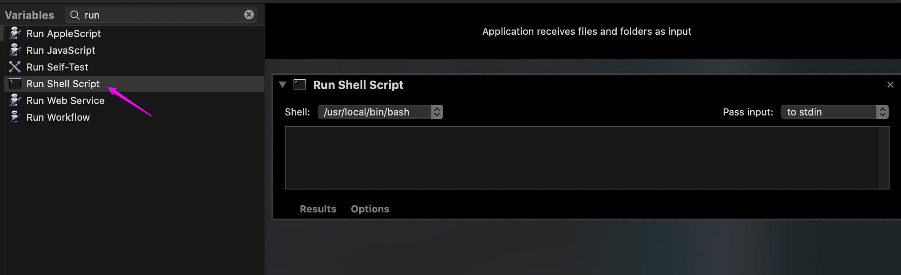
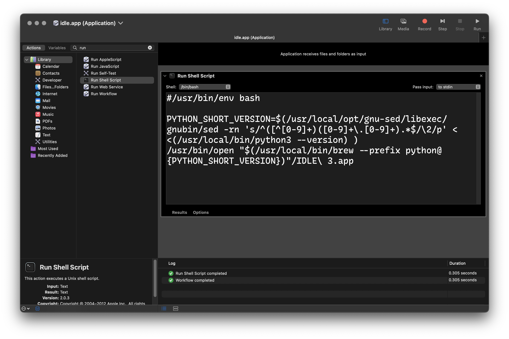
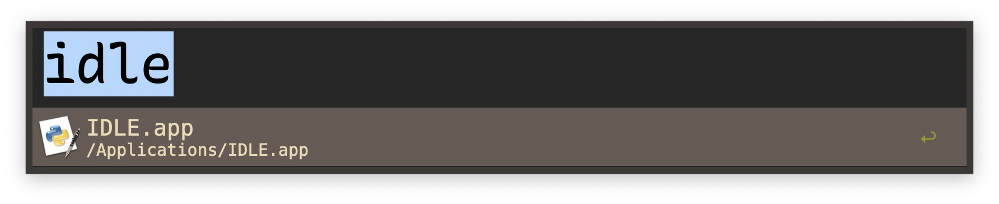
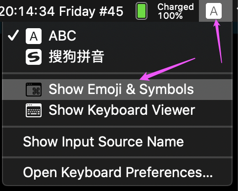
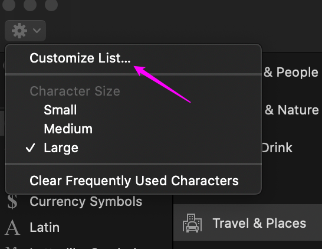
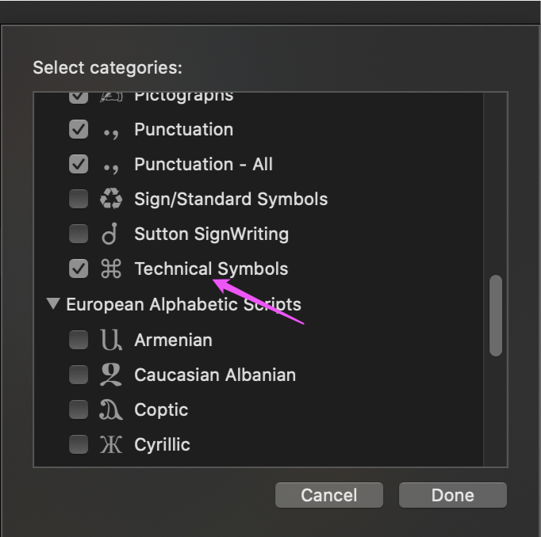
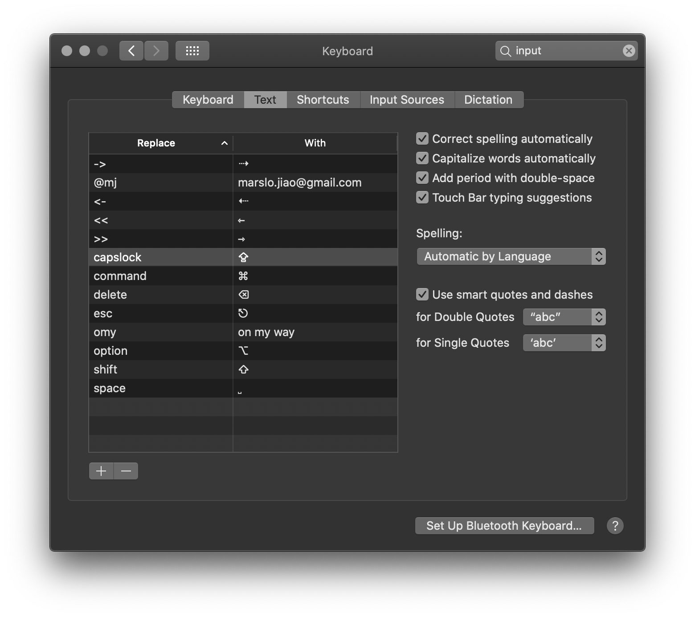
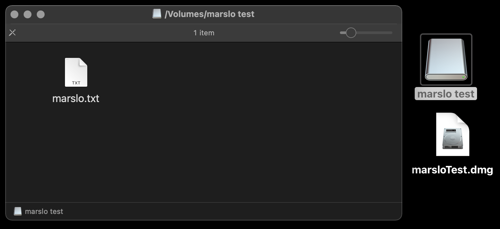
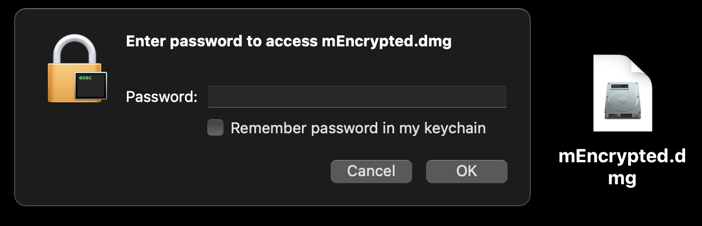
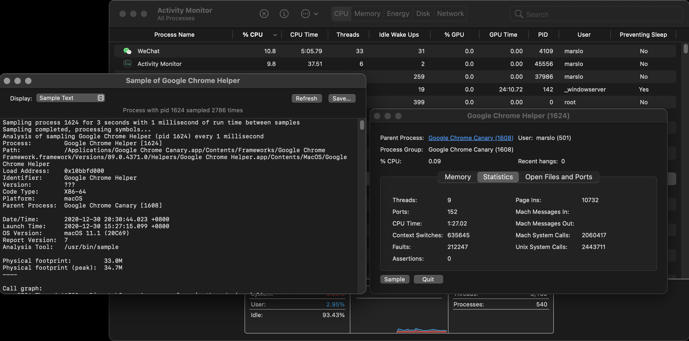

<!-- START doctoc generated TOC please keep comment here to allow auto update -->
<!-- DON'T EDIT THIS SECTION, INSTEAD RE-RUN doctoc TO UPDATE -->

- [copy path](#copy-path)
  - [copy STDOUT into clipboard](#copy-stdout-into-clipboard)
  - [Copy path from finder](#copy-path-from-finder)
- [create app](#create-app)
  - [groovyConsole](#groovyconsole)
  - [python IDLE](#python-idle)
  - [create dmg](#create-dmg)
- [add snippets for input](#add-snippets-for-input)
  - [enable Technical Symbols](#enable-technical-symbols)
  - [and snippets](#and-snippets)
  - [finally](#finally)
- [others](#others)
  - [install font via command](#install-font-via-command)
  - [shutdown mac via commands](#shutdown-mac-via-commands)
  - [turn off the screen without sleeping](#turn-off-the-screen-without-sleeping)
  - [launch apps](#launch-apps)
  - [extra pkg](#extra-pkg)
  - [create image](#create-image)
  - [disk](#disk)
  - [disable startup music](#disable-startup-music)
  - [3D lock screen](#3d-lock-screen)
  - [take screenshot after 3 sec](#take-screenshot-after-3-sec)
  - [setup welcome text in login screen](#setup-welcome-text-in-login-screen)
  - [show message on desktop](#show-message-on-desktop)
  - [modify font in plist](#modify-font-in-plist)
  - [show process details](#show-process-details)
  - [launch iOS simulator](#launch-ios-simulator)

<!-- END doctoc generated TOC please keep comment here to allow auto update -->


## copy path
### copy STDOUT into clipboard

> [!NOTE]
> - `pbcopy` for macOS
> - `xclip` for Linux

```bash
$ <cmd> | pbcopy
```

- example
  ```bash
  $ cat file | pbcopy
  $ pwd | pbcopy
  ```

### Copy path from finder
- [*right-click*(<kbd>control</kbd> + left-click) -> <kbd>option</kbd>](https://osxdaily.com/2013/06/19/copy-file-folder-path-mac-os-x/)


- Automator -> Quick Action


- [Automator -> Apple Script](https://apple.stackexchange.com/a/47234/254265)

  ```bash
  on run {input, parameters}

    try
      tell application "Finder" to set the clipboard to POSIX path of (target of window 1 as alias)
    on error
      beep
    end try

    return input
  end run
  ```


## create app

> [!NOTE|label:references:]
> - [* splaisan/appify.sh](https://gist.github.com/splaisan/e4ebae891f6f26f86e75)
> - [advorak/appify.sh](https://gist.github.com/advorak/1403124)
> - [pypi: mac-appify](https://pypi.org/project/mac-appify/)
> - [9 Automator Apps You Can Create in Under 5 Minutes](https://www.makeuseof.com/tag/10-automator-applications-create-5-minutes-mac/)
> - [How to create an OSX Application to wrap a call to a shell script?](https://apple.stackexchange.com/a/201309/254265)
> - [CREATE YOUR OWN CUSTOM ICONS IN OS X 10.7.5 OR LATER [UPDATED]](https://eshop.macsales.com/blog/28492-create-your-own-custom-icons-in-10-7-5-or-later/)

### groovyConsole

> [!NOTE|label:expection]
> case: run `groovyConsole` from Spolite or Alfred
> - reference:
>   - [Install groovy console on Mac and make it runnable from dock](https://superuser.com/a/1303372/112396)

#### via Automator.app

> [!NOTE|label:tips]
> Automator.app will create whole bunch of necessary files for app. only need to replace the `CFBundleExecutable` filename

- Open **Automator.app** » **New** » **Application**
  

- Select **Run Shell Script** » save to <name>.app with empty shell script
  

  

#### via script

> [!NOTE|label:tips:]
> - get standalone commands for the script
>   ```bash
>   $ ps aux | grep groovyConsole | grep -v grep
>   marslo           63030   0.0  1.9 42636292 310724 s008  S+    2:06PM   0:12.48 /usr/local/opt/openjdk/bin/java -Dsun.awt.keepWorkingSetOnMinimize=true -Xdock:name=GroovyConsole -Xdock:icon=/usr/local/opt/groovy/libexec/lib/groovy.icns -classpath /usr/local/opt/groovy/libexec/lib/groovy-4.0.13.jar -Dscript.name=/usr/local/opt/groovy/libexec/bin/groovyConsole -Dprogram.name=groovyConsole -Dgroovy.starter.conf=/usr/local/opt/groovy/libexec/conf/groovy-starter.conf -Dgroovy.home=/usr/local/opt/groovy/libexec -Dtools.jar=/usr/local/opt/openjdk/lib/tools.jar org.codehaus.groovy.tools.GroovyStarter --main groovy.console.ui.Console --conf /usr/local/opt/groovy/libexec/conf/groovy-starter.conf --classpath .:/usr/local/opt/openjdk/lib/tools.jar:/usr/local/opt/openjdk/lib/dt.jar:/usr/local/opt/groovy/libexec/lib:.
>   ```
>
>   ==> which would be:
>   ```bash
>   /usr/local/opt/openjdk/bin/java \
>        -Dsun.awt.keepWorkingSetOnMinimize=true \
>        -Xdock:name=GroovyConsole \
>        -Xdock:icon=/usr/local/opt/groovy/libexec/lib/groovy.icns \
>        -classpath /usr/local/opt/groovy/libexec/lib/groovy-4.0.13.jar \
>        -Dscript.name=/usr/local/opt/groovy/libexec/bin/groovyConsole \
>        -Dprogram.name=groovyConsole \
>        -Dgroovy.starter.conf=/usr/local/opt/groovy/libexec/conf/groovy-starter.conf \
>        -Dgroovy.home=/usr/local/opt/groovy/libexec \
>        -Dtools.jar=/usr/local/opt/openjdk/lib/tools.jar org.codehaus.groovy.tools.GroovyStarter \
>        --main groovy.console.ui.Console \
>        --conf /usr/local/opt/groovy/libexec/conf/groovy-starter.conf \
>        --classpath .:/usr/local/opt/openjdk/lib/tools.jar:/usr/local/opt/openjdk/lib/dt.jar:/usr/local/opt/groovy/libexec/lib:.
>   ```
>
>   <!--sec data-title="older version" data-id="section0" data-show=true data-collapse=true ces-->
>   ```bash
>   $ ps aux | grep groovyConsole | grep -v grep
>   marslo           50495   0.0  3.4 11683536 577828   ??  S     5:50PM   0:15.85 /Library/Java/JavaVirtualMachines/jdk1.8.0_211.jdk/Contents/Home/bin/java -Xdock:name=GroovyConsole -Xdock:icon=/usr/local/opt/groovy/libexec/lib/groovy.icns -Dgroovy.jaxb=jaxb -classpath /usr/local/opt/groovy/libexec/lib/groovy-3.0.6.jar -Dscript.name=/usr/local/opt/groovy/libexec/bin/groovyConsole -Dprogram.name=groovyConsole -Dgroovy.starter.conf=/usr/local/opt/groovy/libexec/conf/groovy-starter.conf -Dgroovy.home=/usr/local/opt/groovy/libexec -Dtools.jar=/Library/Java/JavaVirtualMachines/jdk1.8.0_211.jdk/Contents/Home/lib/tools.jar org.codehaus.groovy.tools.GroovyStarter --main groovy.console.ui.Console --conf /usr/local/opt/groovy/libexec/conf/groovy-starter.conf --classpath .:/Library/Java/JavaVirtualMachines/jdk1.8.0_211.jdk/Contents/Home/lib/tools.jar:/Library/Java/JavaVirtualMachines/jdk1.8.0_211.jdk/Contents/Home/lib/dt.jar:/usr/local/opt/groovy/libexec/lib:.
>   ```
>
>   ==> which would be:
>   ```bash
>   /Library/Java/JavaVirtualMachines/jdk1.8.0_211.jdk/Contents/Home/bin/java \
>           -Xdock:name=GroovyConsole \
>           -Xdock:icon=/usr/local/opt/groovy/libexec/lib/groovy.icns \
>           -Dgroovy.jaxb=jaxb \
>           -classpath /usr/local/opt/groovy/libexec/lib/groovy-3.0.6.jar \
>           -Dscript.name=/usr/local/opt/groovy/libexec/bin/groovyConsole \
>           -Dprogram.name=groovyConsole \
>           -Dgroovy.starter.conf=/usr/local/opt/groovy/libexec/conf/groovy-starter.conf \
>           -Dgroovy.home=/usr/local/opt/groovy/libexec \
>           -Dtools.jar=/Library/Java/JavaVirtualMachines/jdk1.8.0_211.jdk/Contents/Home/lib/tools.jar org.codehaus.groovy.tools.GroovyStarter \
>           --main groovy.console.ui.Console \
>           --conf /usr/local/opt/groovy/libexec/conf/groovy-starter.conf \
>           --classpath .:/Library/Java/JavaVirtualMachines/jdk1.8.0_211.jdk/Contents/Home/lib/tools.jar:/Library/Java/JavaVirtualMachines/jdk1.8.0_211.jdk/Contents/Home/lib/dt.jar:/usr/local/opt/groovy/libexec/lib:.
>   ```
>   <!--endsec-->


```bash
$ cp /usr/local/opt/groovy/libexec/lib/groovy.icns groovyConsole.app/Contents/Resources

$ cat > groovyConsole.app/Contents/MacOS/groovyConsole << EOF
  -> #!/usr/bin/env bash
  ->
  -> JAVA_HOME="$(/usr/libexec/java_home -v 21)"
  -> GROOVY_HOME="$(/usr/local/bin/brew --prefix groovy)/libexec"
  -> GROOVY_VERSION="$(/usr/bin/sed -rn 's/^[^:]+:[[:blank:]]?([[:digit:].]+)[[:blank:]]?.+$/\1/p' < <(${GROOVY_HOME}/bin/groovy --version))"
  ->
  -> "${JAVA_HOME}"/bin/java \
  ->   -Dsun.awt.keepWorkingSetOnMinimize=true \
  ->   -Xdock:name=GroovyConsole \
  ->   -Xdock:icon="${GROOVY_HOME}"/lib/groovy.icns \
  ->   -classpath "${GROOVY_HOME}"/lib/groovy-"${GROOVY_VERSION}".jar \
  ->   -Dscript.name="${GROOVY_HOME}"/bin/groovyConsole \
  ->   -Dprogram.name=groovyConsole \
  ->   -Dgroovy.starter.conf="${GROOVY_HOME}"/conf/groovy-starter.conf \
  ->   -Dgroovy.home="${GROOVY_HOME}" \
  ->   -Dtools.jar="${JAVA_HOME}"/lib/tools.jar org.codehaus.groovy.tools.GroovyStarter \
  ->   --main groovy.console.ui.Console \
  ->   --conf "${GROOVY_HOME}"/conf/groovy-starter.conf \
  ->   --classpath .:"${JAVA_HOME}"/lib/tools.jar:"${JAVA_HOME}"/lib/dt.jar:"${GROOVY_HOME}"/lib
  -> EOF

$ chmod +x groovyConsole.app/Contents/MacOS/groovyConsole
$ ls -1 groovyConsole.app/Contents/MacOS/
Automator Application Stub                    # ignore it
groovyConsole                                 # ╮ <key>CFBundleExecutable</key>
                                              # ╯ <string>groovyConsole</string>

$ mv groovyConsole.app/ /Applications/
```

<!--sec data-title="older version" data-id="section1" data-show=true data-collapse=true ces-->
```bash
$ touch groovyConsole.app/Contents/MacOS/groovyConsole
$ cat > groovyConsole.app/Contents/MacOS/groovyConsole << EOF
  -> #!/usr/bin/env bash
  ->
  -> JAVA_HOME="$(/usr/local/bin/brew --prefix java)"
  -> # JAVA_HOME="$(/usr/local/bin/brew --prefix openjdk@17)"
  -> GROOVY_VERSION="$(/usr/local/bin/groovy --version | /usr/local/opt/gnu-sed/libexec/gnubin/sed -rn 's/^[^:]+:\s*([0-9\.]+).*$/\1/p')"
  -> GROOVY_HOME="$(/usr/local/bin/brew --prefix groovy)/libexec"
  ->
  -> "${JAVA_HOME}"/bin/java \
  ->     -Dsun.awt.keepWorkingSetOnMinimize=true \
  ->     -Xdock:name=GroovyConsole \
  ->     -Xdock:icon="${GROOVY_HOME}"/lib/groovy.icns \
  ->     -classpath "${GROOVY_HOME}"/lib/groovy-"${GROOVY_VERSION}".jar \
  ->     -Dscript.name="${GROOVY_HOME}"/bin/groovyConsole \
  ->     -Dprogram.name=groovyConsole \
  ->     -Dgroovy.starter.conf="${GROOVY_HOME}"/conf/groovy-starter.conf \
  ->     -Dgroovy.home="${GROOVY_HOME}" \
  ->     -Dtools.jar="${JAVA_HOME}"/lib/tools.jar \
  ->     org.codehaus.groovy.tools.GroovyStarter \
  ->         --main groovy.console.ui.Console \
  ->         --conf "${GROOVY_HOME}"/conf/groovy-starter.conf \
  ->         --classpath .:"${JAVA_HOME}"/lib/tools.jar:"${JAVA_HOME}"/lib/dt.jar:"${GROOVY_HOME}"/lib:.
  -> EOF

# or
$ cat > groovyConsole.app/Contents/MacOS/groovyConsole << EOF
  -> #!/bin/bash
  -> /Library/Java/JavaVirtualMachines/jdk1.8.0_211.jdk/Contents/Home/bin/java \\
  ->         -Xdock:name=GroovyConsole \\
  ->         -Xdock:icon=/usr/local/opt/groovy/libexec/lib/groovy.icns \\
  ->         -Dgroovy.jaxb=jaxb \\
  ->         -classpath /usr/local/opt/groovy/libexec/lib/groovy-3.0.6.jar \\
  ->         -Dscript.name=/usr/local/opt/groovy/libexec/bin/groovyConsole \\
  ->         -Dprogram.name=groovyConsole \\
  ->         -Dgroovy.starter.conf=/usr/local/opt/groovy/libexec/conf/groovy-starter.conf \\
  ->         -Dgroovy.home=/usr/local/opt/groovy/libexec \\
  ->         -Dtools.jar=/Library/Java/JavaVirtualMachines/jdk1.8.0_211.jdk/Contents/Home/lib/tools.jar org.codehaus.groovy.tools.GroovyStarter \\
  ->         --main groovy.console.ui.Console \\
  ->         --conf /usr/local/opt/groovy/libexec/conf/groovy-starter.conf \\
  ->         --classpath .:/Library/Java/JavaVirtualMachines/jdk1.8.0_211.jdk/Contents/Home/lib/tools.jar:/Library/Java/JavaVirtualMachines/jdk1.8.0_211.jdk/Contents/Home/lib/dt.jar:/usr/local/opt/groovy/libexec/lib:.
  -> EOF

$ chmod +x groovyConsole.app/Contents/MacOS/groovyConsole
```
<!--endsec-->

- try validate via execute `groovyConsole.app/Contents/MacOS/groovyConsole` directly. to see whether if the groovyConsole will be opened.

  


#### modify `Info.plist`
```bash
$ vim groovyConsole.app/Contents/Info.plist
...
<key>CFBundleExecutable</key>
<string>groovyConsole</string>           « the script name to MacOS/groovyConsole
<key>CFBundleIconFile</key>
<string>groovy</string>                  « for icon in Resources/groovy.icns
<key>CFBundleIdentifier</key>
<string>com.apple.groovyConsole</string>
...
```

- original
  ```bash
  <key>CFBundleExecutable</key>
  <string>Application Stub</string>
  <key>CFBundleIconFile</key>
  <string>AutomatorApplet</string>
  <key>CFBundleIdentifier</key>
  <string>com.apple.automator.groovyConsole</string>
  ```

#### additional
- set the icon for new app

  > optional

  ```bash
  $ cp /usr/local/opt/groovy/libexec/lib/groovy.icns groovyConsole.app/Contents/Resources
  ```
  - or
    ```bash
    $ ln -sf /usr/local/opt/groovy/libexec/lib/groovy.icns groovyConsole.app/Contents/Resources/groovy.icns
    ```

### python IDLE

#### via automator.app
- script
  ```bash
  #/usr/bin/env bash

  PYTHON_SHORT_VERSION=$(/usr/local/opt/gnu-sed/libexec/gnubin/sed -rn 's/^([^[0-9]+)([0-9]+\.[0-9]+).*$/\2/p' < <(/usr/local/bin/python3 --version) )
  /usr/bin/open "$(/usr/local/bin/brew --prefix python@${PYTHON_SHORT_VERSION})"/IDLE\ 3.app
  ```

  

- icon
  ```bash
  $ PYTHON_SHORT_VERSION=$(/usr/local/opt/gnu-sed/libexec/gnubin/sed -rn 's/^([^[0-9]+)([0-9]+\.[0-9]+).*$/\2/p' < <(/usr/local/bin/python3 --version) )
  $ cp "$(/usr/local/bin/brew --prefix python@${PYTHON_SHORT_VERSION})"/IDLE\ 3.app/Contents/Resources/IDLE.icns IDLE.app/Contents/Resources/

  # modify IDLE.app/Contents/Info.plist
  <key>CFBundleIconFile</key>
  <string>IDLE.icns</string>

  ## original
  <key>CFBundleIconFile</key>
  <string>ApplicationStub</string>
  ```

  - others
    ```bash
    $ cat IDLE.app/Contents/Info.plist
    <key>CFBundleGetInfoString</key>
    <string>3.11.6, © 2001-2023 Python Software Foundation</string>
    <key>CFBundleIconFile</key>
    <string>IDLE.icns</string>
    <key>CFBundleIdentifier</key>
    <string>org.python.IDLE</string>
    ```

#### via appify

> [!NOTE|label:references:]
> - [* splaisan/appify.sh](https://gist.github.com/splaisan/e4ebae891f6f26f86e75)
> - [advorak/appify.sh](https://gist.github.com/advorak/1403124)

- shell script
  ```bash
  $ cat > ~/IDLE << EOF
  #!/usr/bin/env bash

  PYTHON_SHORT_VERSION=$(/usr/local/opt/gnu-sed/libexec/gnubin/sed -rn 's/^([^[0-9]+)([0-9]+\.[0-9]+).*$/\2/p' < <(/usr/local/bin/python3 --version) )
  /usr/bin/open "$(/usr/local/bin/brew --prefix python@${PYTHON_SHORT_VERSION})"/IDLE\ 3.app
  EOF
  ```

- create app via appify
  ```bash
  $ icon=$(brew --prefix python@3.12)/IDLE\ 3.app/Contents/Resources/IDLE.icns
  $ ./appify.sh -i ${icon} -s IDLE -n IDLE
  $ mv IDLE.app /Applications
  ```

  

- more:
  - Info.plist
    ```xml
    <?xml version="1.0" encoding="UTF-8"?>
    <!DOCTYPE plist PUBLIC "-//Apple Computer//DTD PLIST 1.0//EN" "http://www.apple.com/DTDs/PropertyList-1.0.dtd">
    <plist version="1.0">
    <dict>
      <key>CFBundleExecutable</key>
      <string>IDLE</string>
      <key>CFBundleGetInfoString</key>
      <string>IDLE</string>
      <key>CFBundleIconFile</key>
      <string>IDLE</string>
      <key>CFBundleName</key>
      <string>IDLE</string>
      <key>CFBundlePackageType</key>
      <string>APPL</string>
      <key>CFBundleIdentifier</key>
      <string>org.python.IDLE</string>
    </dict>
    </plist>
    ```

  - create dmg
    ```bash
    $ hdiutil create -volname IDLE -srcfolder ~/Desktop/IDLE.app -ov IDLE.dmg
    ....
    created: /Users/marslo/Desktop/IDLE.dmg
    ```

  - change default python3
    ```bash
    $ ln -sf /usr/local/bin/python3.12        /usr/local/bin/python3
    $ ln -sf /usr/local/bin/python3.12-config /usr/local/bin/python3-config

    # or
    $ brew unlink python@3.11
    $ brew unlink python@3.12
    $ brew link --force python@3.12

    # or
    $ brew link --force --overwrite python@3.12
    ```

### create dmg
```bash
$ hdiutil create -volname 'groovyConsole' \
                 -srcfolder ~/Desktop/groovyConsole.app \
                 -ov groovyConsole.dmg
.......................
created: /Users/marslo/Desktop/groovyConsole.dmg

# or
$ hdiutil create -volname 'groovyConsole' \
                 -srcfolder /Applications/groovyConsole.app \
                 -ov groovyConsole.dmg
.................................
created: /Users/marslo/Desktop/groovyConsole.dmg
```

## [add snippets for input](https://sspai.com/post/36203)
### enable Technical Symbols
- Input Method ⇢ **Show emoji and symbols**
  

- Open **Customized List** ⇢ **Technical Symbols**
  

  

### and snippets
- go to **System Preferences** ⇢ **Keyboard** ⇢ **Test**
- add snippets as below
  

### finally


## others
### [install font via command](https://www.reddit.com/r/programming/comments/kj0prs/comment/ggvwadd/?utm_source=share&utm_medium=web2x&context=3)
```bash
$ curl --create-dirs \
       -O \
       --output-dir ~/.fonts \
       https://dtinth.github.io/comic-mono-font/ComicMono.ttf && \
  curl --create-dirs \
       -O \
       --output-dir ~/.fonts \
       https://dtinth.github.io/comic-mono-font/ComicMono-Bold.ttf &&
  fc-cache -f -v
```

### shutdown mac via commands
```bash
$ osascript -e 'tell app 'loginwindow' to «event aevtrsdn»'
```

### [turn off the screen without sleeping](https://apple.stackexchange.com/a/266103/254265)
```bash
$ pmset displaysleepnow
```

- sleep
  ```bash
  $ pmset sleepnow
  ```

- lock
  ```bash
  $ pmset lock
  ```

### launch apps
```bash
$ launchctl list
```

### [extra pkg](https://apple.stackexchange.com/a/309591/254265)
```bash
$ xar -xvf foo.pkg
```

### create image
- create dmg image
  ```bash
  $ hdiutil create -volname "Volume Name" \
                   -srcfolder /path/to/folder \
                   -ov diskimage.dmg
  ```
  - i.e.:
    ```bash
    $ hdiutil create -volname 'groovyConsole' \
                     -srcfolder ~/Desktop/groovyConsole.app \
                     -ov groovyConsole.dmg
    .......................
    created: /Users/marslo/Desktop/groovyConsole.dmg
    ```
- create encrypted image
  ```bash
  $ hdiutil create -encryption \
                   -stdinpass \
                   -volname "Volume Name" \
                   -srcfolder /path/to/folder \
                   -ov encrypted.dmg
  ```

- creaste dvd (for .iso, .img, .dmg)
  ```bash
  $ hdiutil burn /path/to/image_file
  ```

#### create disk image from volume
```bash
$ sudo hdiutil create ~/Desktop/<name>.dmg -srcdevice /dev/<disk-identifier>
```
- i.e.:
  ```bash
  $ sudo hdiutil create ~/Desktop/Lion.dmg -srcdevice /dev/disk2s4
  ```

#### create disk image from a folder
```bash
$ hdiutil create <imagename>.dmg -volname "<name of volume>" -srcfolder /path/to/folder'
```
- i.e.:
  ```bash
  $ hdiutil create ~/Desktop/marsloTest.dmg -volname 'marslo test' -srcfolder ~/Desktop/marsloTest/
  created: /Users/marslo/Desktop/marsloTest.dmg
  ```
  

- setup read & write dmg
  ```bash
  $ hdiutil create ~/Desktop/mTest.dmg \
            -volname "Marslo Test" \
            -srcfolder ~/Desktop/mTest \
            -size 1g \
            -format UDRW
  ```

#### create encrypted disk image
```bash
$ hdiutil create mEncrypted.dmg \
                 -encryption \
                 -size 1g \
                 -volname "mEncrypted Disk Image" \
                 -fs JHFS+ \
                 -srcfolder /path/to/folder \

Enter a new password to secure "mEncrypted.dmg":
Re-enter new password:
....
created: /Users/marslo/Desktop/mEncrypted.dmg
```



#### resize the disk image
```bash
$ hdiutil resize -size <new size> <imagename>.dmg
```
- i.e.:
  ```bash
  $ hdiutil resize -size 2g mEncrypted.dmg
  ```

#### restore disk images
```bash
$ sudo asr restore --source <disk image>.dmg --target /Volumes/<volume name>
```

### disk


> reference:
> - [Disk Management From the Command-Line, Part 1](http://www.theinstructional.com/guides/disk-management-from-the-command-line-part-1)
> - [Disk Management From the Command-Line, Part 2](http://www.theinstructional.com/guides/disk-management-from-the-command-line-part-2)
> - [Disk Management From the Command-Line, Part 3](http://www.theinstructional.com/guides/disk-management-from-the-command-line-part-3)



#### check volumn info
```bash
$ diskutil info <path/to/volumn>
```
- i.e.:
  ```bash
  $ diskutil info /Volumes/iMarsloOSX/
     Device Identifier:         disk1s5
     Device Node:               /dev/disk1s5
     Whole:                     No
     Part of Whole:             disk1

     Volume Name:               iMarsloOSX
     Mounted:                   Yes
     Mount Point:               /
  ```

- list disks and volumns
  ```bash
  $ diskutil list
  ```
  or
  ```bash
  $ diskutil list disk1
  ```

  - or [lsblk](https://command-not-found.com/lsblk)
    ```bash
    $ docker run cmd.cat/lsblk lsblk
    NAME   MAJ:MIN RM SIZE RO TYPE MOUNTPOINT
    vda    254:0    0  16G  0 disk
    └─vda1 254:1    0  16G  0 part /etc/hosts
    ```

  - or [lshw](https://command-not-found.com/lshw)
    ```bash
    $ docker run cmd.cat/lshw lshw -class disk
      *-virtio1
           description: Virtual I/O device
           physical id: 0
           bus info: virtio@1
           logical name: vda
           configuration: driver=virtio_blk
    ```

#### list the apfs info
```bash
$ diskutil apfs list
APFS Container (1 found)
|
+-- Container disk1 ********-****-****-****-************
    ====================================================
    APFS Container Reference:     disk1
    Size (Capacity Ceiling):      250685575168 B (250.7 GB)
    Capacity In Use By Volumes:   176258826240 B (176.3 GB) (70.3% used)
    Capacity Not Allocated:       74426748928 B (74.4 GB) (29.7% free)
    |
    +-< Physical Store...>
    |
    +-> ...
```

#### check detail diskage usage
```bash
$ sudo fs_usage
21:03:47  ioctl        0.000003   iTerm2
21:03:47  ioctl        0.000003   iTerm2
21:03:47  close        0.000031   privoxy
21:03:47  select       0.000004   privoxy
...
```

#### erase disk



| File System                 | Abbreviation |
|:----------------------------|:------------:|
| Mac OS Extended (Journaled) |    `JHFS+`   |
| Mac OS Extended             |    `HFS+`    |
| MS-DOS fat32                |    `FAT32`   |
| ExFAT                       |    `ExFAT`   |

```bash
$ diskutil listFilesystems
...
-------------------------------------------------------------------------------
PERSONALITY                     USER VISIBLE NAME
-------------------------------------------------------------------------------
Case-sensitive APFS             APFS (Case-sensitive)
  (or) APFSX
APFS                            APFS
  (or) APFSI
ExFAT                           ExFAT
Free Space                      Free Space
  (or) FREE
MS-DOS                          MS-DOS (FAT)
MS-DOS FAT12                    MS-DOS (FAT12)
MS-DOS FAT16                    MS-DOS (FAT16)
MS-DOS FAT32                    MS-DOS (FAT32)
  (or) FAT32
HFS+                            Mac OS Extended
Case-sensitive HFS+             Mac OS Extended (Case-sensitive)
  (or) HFSX
Case-sensitive Journaled HFS+   Mac OS Extended (Case-sensitive, Journaled)
  (or) JHFSX
Journaled HFS+                  Mac OS Extended (Journaled)
  (or) JHFS+
UFSD_NTFS                       Microsoft NTFS
```



- ExFAT
  ```bash
  $ diskutil eraseDisk ExFAT iMarsloUSB /dev/disk2
  Started erase on disk2
  Unmounting disk
  Creating the partition map
  Waiting for partitions to activate
  Formatting disk2s2 as ExFAT with name iMarsloUSB
  Volume name      : iMarsloUSB
  Partition offset : 411648 sectors (210763776 bytes)
  Volume size      : 246534144 sectors (126225481728 bytes)
  Bytes per sector : 512
  Bytes per cluster: 131072
  FAT offset       : 2048 sectors (1048576 bytes)
  # FAT sectors    : 8192
  Number of FATs   : 1
  Cluster offset   : 10240 sectors (5242880 bytes)
  # Clusters       : 962984
  Volume Serial #  : 5ff81490
  Bitmap start     : 2
  Bitmap file size : 120373
  Upcase start     : 3
  Upcase file size : 5836
  Root start       : 4
  Mounting disk
  Finished erase on disk2
  ```
  - check
    ```bash
    $ diskutil info disk2s1
       Device Identifier:         disk2s1
       Device Node:               /dev/disk2s1
       Whole:                     No
       Part of Whole:             disk2

       Volume Name:               EFI
       Mounted:                   No

       Partition Type:            EFI
       File System Personality:   MS-DOS FAT32
       Type (Bundle):             msdos
       Name (User Visible):       MS-DOS (FAT32)
       ...
       ...

    $ diskutil info disk2s2
       Device Identifier:         disk2s2
       Device Node:               /dev/disk2s2
       Whole:                     No
       Part of Whole:             disk2

       Volume Name:               iMarsloUSB
       Mounted:                   Yes
       Mount Point:               /Volumes/iMarsloUSB

       Partition Type:            Microsoft Basic Data
       File System Personality:   ExFAT
       Type (Bundle):             exfat
       Name (User Visible):       ExFAT
       ...
       ...
    ```

##### Verifying and Repairing Volumes
```bash
$ diskutil verifyVolume /Volumes/<volume name>
$ diskutil repairVolume /Volumes/<volume name>
```

#### rename volume
```bash
$ diskutil rename "<current name of volume>" "<new name>"
```

#### Partitioning a Disk


> reference:
> - `GPT`: GUID Partition Table
> - `APM`: Apple Partition Map
> - `MBR`: Master Boot Records


```bash
$ diskutil partitionDisk /dev/disk2 GPT JHFS+ New 0b
```

- multiple partitions
  ```bash
  $ diskutil partitionDisk /dev/disk2 GPT \
             JHFS+ First 10g \
             JHFS+ Second 10g \
             JHFS+ Third 10g \
             JHFS+ Fourth 10g \
             JHFS+ Fifth 0b
  ```
- Splitting Partitions
  ```bash
  $ diskutil splitPartition /dev/disk2s6 \
             JHFS+ Test 10GB \
             JHFS+ Test2 0b
  ```

- Merging Partitions
  ```bash
  $ diskutil mergePartitions \
             JHFS+ \
             NewName \
             <first disk identifier in range> \
             <last disk identifier in range>
  ```

  i.e.:
  ```bash
  $ diskutil mergePartitions JHFS+ NewName disk2s4 disk2s6
  ```

#### [check usb](https://apple.stackexchange.com/a/170118/254265)
```bash
$ system_profiler SPUSBDataType
```
- or get xml format
  ```bash
  $ system_profiler -xml SPUSBDataType
  ```
- or
  ```bash
  $ ioreg -p IOUSB
  ```
- or
  ```bash
  $ ioreg -p IOUSB -w0 -l
  ```
  - or get device name
    ```bash
     $ ioreg -p IOUSB -w0 | sed 's/[^o]*o //; s/@.*$//' | grep -v '^Root.*'
    ```

### disable startup music
```bash
$ sudo nvram SystemAudioVolume=" "
```

### 3D lock screen
```bash
$ /System/Library/CoreServices/Menu\ Extras/User.menu/Contents/Resources/CGSession -suspend
```

### take screenshot after 3 sec
```bash
$ screencapture -T 3 -t jpg -P delayedpic.jpg
```

### setup welcome text in login screen
```bash
$ sudo defaults write /Library/Preferences/com.apple.loginwindow LoginwindowText 'Awesome Marslo!!'
```

### show message on desktop
```bash
$ sudo jamf displayMessage -message "Hello World!"
```

### modify font in plist
- original
  ```bash
  $ defaults read ~/Library/Preferences/groovy.console.ui.plist
  {
      "/groovy/console/ui/" =     {
          autoClearOutput = true;
          compilerPhase = 4;
          currentFileChooserDir = "/Users/marslo/Desktop";
          decompiledFontSize = 12;
          fontSize = 18;
          frameHeight = 600;
          frameWidth = 800;
          frameX = 198;
          frameY = 201;
          horizontalSplitterLocation = 100;
          inputAreaHeight = 576;
          inputAreaWidth = 1622;
          outputAreaHeight = 354;
          outputAreaWidth = 1676;
          showClosureClasses = false;
          showIndyBytecode = false;
          showScriptClass = true;
          showScriptFreeForm = false;
          showScriptInOutput = false;
          showTreeView = true;
          threadInterrupt = true;
          verticalSplitterLocation = 100;
      };
  }
  ```

  - [or](https://stackoverflow.com/a/56238780/2940319)
    ```bash
    $ /usr/libexec/PlistBuddy -c 'print ":/groovy/console/ui/:fontSize"' ~/Library/Preferences/groovy.console.ui.plist
    18
    ```
- change
  ```bash
  $ /usr/libexec/PlistBuddy -c 'Set ":/groovy/console/ui/:fontSize" 24' ~/Library/Preferences/groovy.console.ui.plist
  $ /usr/libexec/PlistBuddy -c 'Print ":/groovy/console/ui/:fontSize"' ~/Library/Preferences/groovy.console.ui.plist
  24
  ```

### show process details


### [launch iOS simulator](https://medium.com/@abrisad_it/how-to-launch-ios-simulator-and-android-emulator-on-mac-cd198295532e)
```bash
$ xcrun simctl list
$ open -a Simulator --args -CurrentDeviceUDID <your device UDID>
```
- install the application on the device
  ```bash
  $ xcrun simctl install <your device UDID> <path to application bundle>
  $ xcrun simctl launch <your device UDID> <app bundle identifier>
  ```
  - or
    ```bash
    $ open -a Simulator.app
    ```
  - or
    ```bash
    $ open /Applications/Xcode.app/Contents/Developer/Applications/Simulator.app
    ```
