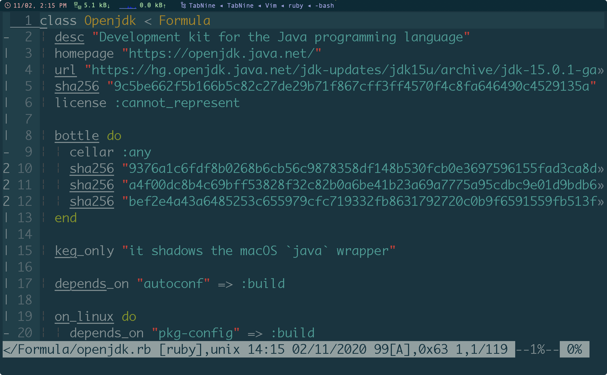

<!-- START doctoc generated TOC please keep comment here to allow auto update -->
<!-- DON'T EDIT THIS SECTION, INSTEAD RE-RUN doctoc TO UPDATE -->

- [brew](#brew)
  - [force the link and overwrite everything](#force-the-link-and-overwrite-everything)
  - [rerurn postinstall](#rerurn-postinstall)
  - [check brew configure file](#check-brew-configure-file)
  - [whatprovide alternatives](#whatprovide-alternatives)
  - [tricky](#tricky)
  - [brew command](#brew-command)
- [network](#network)
  - [show network information](#show-network-information)
  - [change order of networks](#change-order-of-networks)
  - [list hardware](#list-hardware)
  - [IP](#ip)
  - [DNS](#dns)
  - [proxy setup](#proxy-setup)
  - [wifi](#wifi)
  - [firewall](#firewall)

<!-- END doctoc generated TOC please keep comment here to allow auto update -->


> reference
> - [Mac OS X Server Command-Line Administration](https://www.apple.com.cn/server/docs/Command_Line.pdf)


## brew
### force the link and overwrite everything
```bash
$ brew link --overwrite <formula>
```
- example
  ```bash
  $ brew link --overwrite --dry-run python@3.8
  Would remove:
  /usr/local/bin/python3 -> /usr/local/Cellar/python@3.9/3.9.0/bin/python3.9

  If you need to have this software first in your PATH instead consider running:
    echo 'export PATH="/usr/local/opt/python@3.8/bin:$PATH"' >> /Users/marslo/.bash_profile
  ```

### rerurn postinstall
```bash
$ brew postinstall <formula>
```

- i.e.:
  ```bash
  $ sudo chown marslo:admin -R /usr/local/lib/python3.8/site-packages
  $ brew postinstall python@3.8
  ==> Postinstalling python@3.8
  ==> /usr/local/Cellar/python@3.8/3.8.6_1/bin/python3 -s setup.py --no-user-cfg install --force --verbose --install-scripts=/usr/local/Cellar/python@3.8
  ==> /usr/local/Cellar/python@3.8/3.8.6_1/bin/python3 -s setup.py --no-user-cfg install --force --verbose --install-scripts=/usr/local/Cellar/python@3.8
  ==> /usr/local/Cellar/python@3.8/3.8.6_1/bin/python3 -s setup.py --no-user-cfg install --force --verbose --install-scripts=/usr/local/Cellar/python@3.8
  ```

- update homebrew-cask
  ```bash
  $ git -C "/usr/local/Homebrew/Library/Taps/homebrew/homebrew-cask" fetch --unshallow
  ```

### check brew configure file
```bash
$ brew -v edit <formula>
```

- i.e.: `$ brew -v edit openjdk`
  

#### manual install formula
```bash
$ brew -v edit macvim
$ brew -v fetch --deps macvim
$ brew -v install --build-from-source macvim
$ brew pin macvim
```

### whatprovide alternatives
```bash
$ pkgutil --file-info /usr/bin/qlmanage
volume: /
path: /usr/bin/qlmanage

pkgid: com.apple.pkg.Core
pkg-version: 10.15.0.1.1.1569789135
install-time: 1570542610
uid: 0
gid: 0
mode: 755
```
- for brew formula
  ```bash
  $ while read formula; do
      brew list --formula "${formula}" | grep -w magick;
    done < <(brew list --formula)
  ```

### tricky
> reference:
> - [Tips and Tricks](https://docs.brew.sh/Tips-N'-Tricks)

- interactive homebrew shell
  ```bash
  $ brew irb
  ==> Interactive Homebrew Shell
  Example commands available with: brew irb --examples

  WARNING: This version of ruby is included in macOS for compatibility with legacy software.
  In future versions of macOS the ruby runtime will not be available by
  default, and may require you to install an additional package.

  irb(main):001:0>
  ```

- list dependencies
  ```bash
  $ brew deps macvim
  Warning: Treating macvim as a formula. For the cask, use homebrew/cask/macvim
  cscope
  gdbm
  gettext
  libyaml
  lua
  openssl@1.1
  python@3.9
  readline
  ruby
  sqlite
  xz
  ```

- list who depends on
  ```bash
  $ brew uses --installed cscope
  macvim
  ```

- list all formula dpendencies
  ```bash
  $ brew list | while read cask; do
      echo -e -n "\e[1;34m$cask ->\e[0m";
      brew deps $cask | awk '{printf(" %s ", $0)}';
      echo "";
    done
  ```
  - e.g.:
    ```bash
    $ brew list | while read cask; do
        echo -e -n "\e[1;34m$cask ->\e[0m";
        brew deps $cask | awk '{printf(" %s ", $0)}';
        echo "";
      done

    Warning: Calling `brew list` to only list formulae is deprecated! Use `brew list --formula` instead.
    ack ->
    adns ->
    aom ->
    autoconf ->
    autoconf-archive -> autoconf
    automake -> autoconf
    bash ->
    bash-completion ->
    bash-completion@2 -> bash
    bats ->
    bdw-gc ->
    berkeley-db -> openssl@1.1
    binutils ->
    cabal-install -> ghc
    cairo -> fontconfig  freetype  gdbm  gettext  glib  libffi  libpng  lzo  openssl@1.1  pcre  pixman  python@3.8  readline  sqlite  xz
    ...
    ```

### brew command
| command                                  | description                                                                                                |
|------------------------------------------|------------------------------------------------------------------------------------------------------------|
| `brew --cache`                           | Print path to Homebrew’s download cache (usually ~/Library/Caches/Homebrew)                                |
| `brew --cellar`                          | Print path to Homebrew’s Cellar (usually /usr/local/Cellar)                                                |
| `brew --config`                          | Print system configuration info                                                                            |
| `brew --env`                             | Print Homebrew’s environment                                                                               |
| `brew --prefix`                          | Print path to Homebrew’s prefix (usually /usr/local)                                                       |
| `brew --prefix [formula]`                | Print where formula is installed                                                                           |
| `brew audit`                             | Audit all formulae for common code and style issues                                                        |
| `brew cleanup [formula]`                 | Remove older versions from the Cellar for all (or specific) formulae1                                      |
| `brew create [url]`                      | Generate formula for downloadable file at url and open it in $HOMEBREW_EDITOR or $EDITOR2                  |
| `brew create [tarball-url] --cache`      | Generate formula (including MD5), then download the tarball                                                |
| `brew create --fink [formula]`           | Open Fink’s search page in your browser, so you can see how they do formula                                |
| `brew create --macports [formula]`       | Open MacPorts’ search page in your browser, so you can see how they do formula                             |
| `brew deps [formula]`                    | List dependencies for formula                                                                              |
| `brew doctor`                            | Check your Homebrew installation for common issues                                                         |
| `brew edit`                              | Open all of Homebrew for editing in TextMate                                                               |
| `brew edit [formula]`                    | Open [formula] in $HOMEBREW_EDITOR or $EDITOR                                                              |
| `brew fetch --force -v --HEAD [formula]` | Download source package for formula; for tarballs, also prints MD5, SHA1, and SHA256 checksums             |
| `brew home`                              | Open Homebrew’s homepage in your browser                                                                   |
| `brew home [formula]`                    | Opens formula ’s homepage in your browser                                                                  |
| `brew info`                              | Print summary of installed packages                                                                        |
| `brew info [formula]`                    | Print info for formula (regardless of whether formula is installed)                                        |
| `brew info --github [formula]`           | Open Github’s History page for formula in your browser                                                     |
| `brew install [formula]`                 | Install formula                                                                                            |
| `brew install --HEAD [formula]`          | Install the HEAD version of formula (if its formula defines HEAD)                                          |
| `brew install --force --HEAD [formula]`  | Install a newer HEAD version of formula (if its formula defines HEAD)                                      |
| `brew link [formula]`                    | Symlink all installed files for formula into the Homebrew prefix3                                          |
| `brew list [formula]`                    | List all installed files for formula (or all installed formulae with no arguments )                        |
| `brew options [formula]`                 | Display install options specific to formula                                                                |
| `brew outdated`                          | List formulae that have an updated version available (brew install formula will install the newer version) |
| `brew prune`                             | Remove dead symlinks from Homebrew’s prefix4                                                               |
| `brew remove [formula]`                  | Uninstall formula                                                                                          |
| `brew search`                            | List all available formula                                                                                 |
| `brew search [formula]`                  | Search for formula in all available formulae                                                               |
| `brew search /[formula]/`                | Search for /formula/ (as regex) in all available formulae                                                  |
| `brew test [formula]`                    | If formula defines a test, run it                                                                          |
| `brew unlink [formula]`                  | Unsymlink formula from Homebrew’s prefix                                                                   |
| `brew update`                            | Update formulae and Homebrew itself                                                                        |
| `brew upgrade`                           | Install newer versions of outdated packages                                                                |
| `brew upgrade [formula]`                 | Install newer version of formula                                                                           |
| `brew versions [formula]`                | List previous versions of formulae, along with a command to checkout each version                          |
| `brew analytics [state]`                 | Display the current state of Homebrew's analytics                                                          |

- [brew analytics](https://stackoverflow.com/a/19688479/2940319)
  ```bash
  # turn on/off
  $ export HOMEBREW_NO_ANALYTICS=1/0
  $ brew analytics off/on

  # check status
  $ brew analytics
  InfluxDB analytics are enabled.
  Google Analytics were destroyed.
  ```

## network
### show network information
```bash
$ networksetup -listnetworkserviceorder
An asterisk (*) denotes that a network service is disabled.
(1) USB 10/100/1000 LAN
(Hardware Port: USB 10/100/1000 LAN, Device: en7)

(2) Wi-Fi
(Hardware Port: Wi-Fi, Device: en0)

...
```
- or
  ```bash
  $ networksetup -listallnetworkservices
  An asterisk (*) denotes that a network service is disabled.
  USB 10/100/1000 LAN
  Wi-Fi
  Bluetooth PAN
  Thunderbolt Bridge
  ```

### change order of networks
```bash
$ networksetup -ordernetworkservices "Wi-Fi" "Ethernet" "USB Ethernet"
```

### list hardware
```bash
$ networksetup -listallhardwareports
```
- list detail of hardware
  ```bash
  $ networksetup -getinfo 'USB 10/100/1000 LAN'
  DHCP Configuration
  IP address: 192.168.1.10
  Subnet mask: 255.255.255.0
  Router: 192.168.1.1
  Client ID:
  IPv6: Automatic
  IPv6 IP address: none
  IPv6 Router: none
  Ethernet Address: **:**:**:**:**:**
  ```

### IP
- find local device ip address
  ```bash
  $ arp -a
  ```

### DNS
- Get Info
  ```bash
  $ scutil --dns
  DNS configuration
  resolver #1
  ...
  resolver #7

  DNS configuration (for scoped queries)
  resolver #1
    search domain[0] : ...
    nameserver[0] : ...
    nameserver[1] : ...
    nameserver[2] : ...
    if_index : ...
    flags    : ...
    reach    : ...
  ```

- setup DNS

  > ```bash
  > $ networksetup -getdnsservers Wi-Fi
  > There aren't any DNS Servers set on Wi-Fi.
  > ```

```bash
$ networksetup -setdnsservers Wi-Fi 192.168.236.5 192.168.35.78 192.168.2.69 192.168.200.139

$ networksetup -getdnsservers Wi-Fi
192.168.236.5
192.168.35.78
192.168.2.69
192.168.200.139

$ cat /etc/resolv.conf
nameserver 192.168.236.5
nameserver 192.168.35.78
nameserver 192.168.2.69
nameserver 192.168.200.139
```

### proxy setup
```bash
$ networksetup -getwebproxy Wi-Fi
Enabled: No
Server:
Port: 0
Authenticated Proxy Enabled: 0
$ networksetup -getwebproxy Ethernet
Enabled: No
Server:
Port: 0
Authenticated Proxy Enabled: 0

$ networksetup -getproxybypassdomains Ethernet
*.local
169.254/16

$ scutil --proxy
<dictionary> {
  HTTPEnable : 0
  HTTPSEnable : 0
  ProxyAutoConfigEnable : 1
  ProxyAutoConfigURLString : http://my.pac.com/global-pac.pac
  SOCKSEnable : 0
}
```

### wifi
- get wifi name connection currently
  ```bash
  $ networksetup -getairportnetwork en0
  Current Wi-Fi Network: WLAN-PUB
  ```
- connect to another
  ```bash
  $ networksetup -setairportnetwork en0 WLAN-PUB <wifi-password>
  $ networksetup -getairportnetwork en0
  Current Wi-Fi Network: WLAN-PUB

  $ networksetup -setairportnetwork en0 Automation-4G <wifi-password>
  $ networksetup -getairportnetwork en0
  Current Wi-Fi Network: Automation-4G
  ```
- turn on/off wifi
  ```bash
  $ networksetup -setairportpower en0 on
  $ networksetup -getairportpower en0
  Wi-Fi Power (en0): On

  $ networksetup -setairportpower en0 off
  $ networksetup -getairportpower en0
  Wi-Fi Power (en0): Off
  ```

- scan available wifi network
  ```bash
  $ networksetup -setairportpower en0 on
  $ sudo /System/Library/PrivateFrameworks/Apple80211.framework/Versions/Current/Resources/airport -s
                              SSID BSSID             RSSI CHANNEL HT CC SECURITY (auth/unicast/group)
                          Customer **:**:**:**:**:** -75  11      N  CN WEP
                          CorpWLAN **:**:**:**:**:** -72  1       Y  CN WPA2(802.1x,Unrecognized(0)/AES/AES)
                             Guest **:**:**:**:**:** -71  1       Y  CN NONE
  ```

- disable ipv6
  ```bash
  $ networksetup -listallnetworkservices
  An asterisk (*) denotes that a network service is disabled.
  USB 10/100/1000 LAN
  Wi-Fi
  Bluetooth PAN
  Thunderbolt Bridge

  $ networksetup -setv6off 'USB 10/100/1000 LAN'
  $ networksetup -setv6off Wi-fi
  ```
  - undo
    ```bash
    $ networksetup -setv6automatic 'USB 10/100/1000 LAN'
    $ networksetup -setv6automatic Wi-Fi
    ```
- show network connection history
  ```bash
  $ defaults read /Library/Preferences/SystemConfiguration/com.apple.airport.preferences \
             | grep LastConnected -A 7
  ```

#### get wifi password
- list all Wifi
  ```bash
  $ defaults read /Library/Preferences/SystemConfiguration/com.apple.airport.preferences | \grep SSIDString
  ...
  SSIDString = "Apple Network Guest";
  ...
  ```

- get password
  ```bash
  $ sudo security find-generic-password -ga "Apple Network Guest"  | grep password\:
  password: "guest@3742"
  ```

### firewall
- show status
  ```bash
  $ sudo /usr/libexec/ApplicationFirewall/socketfilterfw --getglobalstate
  Firewall is disabled. (State = 0)
  ```
- enable firewall
  ```bash
  $ sudo /usr/libexec/ApplicationFirewall/socketfilterfw --setglobalstate on
  ```
