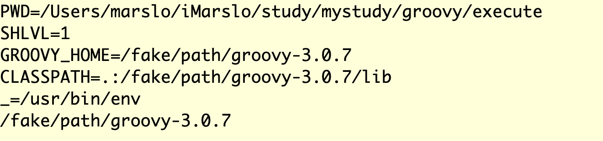

<!-- START doctoc generated TOC please keep comment here to allow auto update -->
<!-- DON'T EDIT THIS SECTION, INSTEAD RE-RUN doctoc TO UPDATE -->

- [basic](#basic)
  - [Program structure](#program-structure)
  - [Customizable Operators](#customizable-operators)
  - [Special Operators](#special-operators)
- [elvis operator](#elvis-operator)
  - [if/elseif{if}/else](#ifelseififelse)
- [execute shell commands in groovy](#execute-shell-commands-in-groovy)
  - [Get STDERR & STDERR](#get-stderr--stderr)
  - [Show output during the process](#show-output-during-the-process)
  - [with environment](#with-environment)
- [groovyConsole](#groovyconsole)
  - [environment](#environment)
  - [get console details](#get-console-details)
  - [font](#font)

<!-- END doctoc generated TOC please keep comment here to allow auto update -->


> download
> - [apach software foundatin distribution directory](https://dlcdn.apache.org/)
> - [groovy](https://dlcdn.apache.org/groovy/)
>   - [2.4.21](https://dlcdn.apache.org/groovy/2.4.21/)
>   - [2.5.19](https://dlcdn.apache.org/groovy/2.5.19/)
>   - [3.0.13](https://dlcdn.apache.org/groovy/3.0.13/)
>   - [4.0.6](https://dlcdn.apache.org/groovy/4.0.6/)
> <br>
> reference:
> - [* Groovy Language Documentation](https://docs.groovy-lang.org/latest/html/documentation)
> - [* Groovy Scripting Reference](https://docs.oracle.com/en/cloud/saas/applications-common/21d/cgsac/index.html)
>   - [groovy basics](https://docs.oracle.com/en/cloud/saas/applications-common/21d/cgsac/groovy-basics.html#groovy-basics)
>   - [groovy tips and techniques](https://docs.oracle.com/en/cloud/saas/applications-common/21d/cgsac/groovy-tips-and-techniques.html#groovy-tips-and-techniques)
> - [* groovy cheatsheet](https://onecompiler.com/cheatsheets/groovy)
> - [* Groovy Cookbook](https://e.printstacktrace.blog/groovy-cookbook/)
> - [* varargs in Groovy](https://docs.groovy-lang.org/latest/html/documentation/#_varargs)
> - [varargs : Variable Arguments (Varargs) in Java](https://www.geeksforgeeks.org/variable-arguments-varargs-in-java/)
> - <kbd>[online compiler](https://onecompiler.com/groovy)</kbd>
> - [http://www.cheat-sheets.org/saved-copy/rc015-groovy_online.pdf](http://www.cheat-sheets.org/saved-copy/rc015-groovy_online.pdf)
> - [Syntax](https://groovy-lang.org/syntax.html)
> - [Five Cool Things You Can Do With Groovy Scripts](http://www.kellyrob99.com/blog/2011/12/04/five-cool-things-you-can-do-with-groovy-scripts/)
> - [Java SE Specifications download](https://docs.oracle.com/javase/specs/)
>   - The Java Language Specification, Java SE 19 Edition : [pdf](https://docs.oracle.com/javase/specs/jls/se19/jls19.pdf) | [html](https://docs.oracle.com/javase/specs/jls/se19/html/index.html)
>   - The Java Language Specification, Java SE 18 Edition : [pdf](https://docs.oracle.com/javase/specs/jls/se18/jls18.pdf) | [html](https://docs.oracle.com/javase/specs/jls/se18/html/index.html)
>   - The Java Language Specification, Java SE 17 Edition : [pdf](https://docs.oracle.com/javase/specs/jls/se17/jls17.pdf) | [html](https://docs.oracle.com/javase/specs/jls/se17/html/index.html)
>   - The Java Language Specification, Java SE 16 Edition : [pdf](https://docs.oracle.com/javase/specs/jls/se16/jls16.pdf) | [html](https://docs.oracle.com/javase/specs/jls/se16/html/index.html)
>   - The Java Language Specification, Java SE 15 Edition : [pdf](https://docs.oracle.com/javase/specs/jls/se15/jls15.pdf) | [html](https://docs.oracle.com/javase/specs/jls/se15/html/index.html)
>   - The Java Language Specification, Java SE 14 Edition : [pdf](https://docs.oracle.com/javase/specs/jls/se14/jls14.pdf) | [html](https://docs.oracle.com/javase/specs/jls/se14/html/index.html)
>   - The Java Language Specification, Java SE 13 Edition : [pdf](https://docs.oracle.com/javase/specs/jls/se13/jls13.pdf) | [html](https://docs.oracle.com/javase/specs/jls/se13/html/index.html)
>   - The Java Language Specification, Java SE 12 Edition : [pdf](https://docs.oracle.com/javase/specs/jls/se12/jls12.pdf) | [html](https://docs.oracle.com/javase/specs/jls/se12/html/index.html)
>   - The Java Language Specification, Java SE 11 Edition : [pdf](https://docs.oracle.com/javase/specs/jls/se12/jls11.pdf) | [html](https://docs.oracle.com/javase/specs/jls/se11/html/index.html)


> [!TIP]
> [Java Tutorial](https://jenkov.com/tutorials/java/index.html) :
> - [Java Exception Handling](https://jenkov.com/tutorials/java-exception-handling/index.html)
> - [Java Tips, How-tos etc](https://jenkov.com/tutorials/java-howto/index.html)
> - [Java JSON Tutorial](https://jenkov.com/tutorials/java-json/index.html)
> - [Java Logging](https://jenkov.com/tutorials/java-logging/index.html)
> - [Java Performance](https://jenkov.com/tutorials/java-performance/index.html)
> - [Java Regex - Java Regular Expressions](https://jenkov.com/tutorials/java-regex/index.html)
> - [Java Unit Testing](https://jenkov.com/tutorials/java-unit-testing/index.html)
> - [朝花夕拾——Groovy & Grails](http://www.blogjava.net/BlueSUN/archive/2007/12/archive/2007/04/23/112978.html)

## basic
### [Program structure](https://groovy-lang.org/structure.html)
### Customizable Operators
| Operator         | Method            |
| :--------------: | ----------------- |
| `a + b`          | `a.plus(b)`       |
| `a - b`          | `a.minus(b)`      |
| `a * b`          | `a.multiply(b)`   |
| `a / b`          | `a.div(b)`        |
| `a % b`          | `a.mod(b)`        |
| `a++` or `++a`   | `a.next()`        |


> ```groovy
> assert [ a: true, b: false ]  +  [ a: false ] == [ a: false, b: false ]
> assert [ a: true, b: false  ] << [ a: false ] == [ a: false, b: false ]
> ```
> - [difference `+`(plus) and `<<`(left shift)](https://stackoverflow.com/a/13326983/2940319) :
>   - [`<<` is to add into left hand map](https://github.com/groovy/groovy-core/blob/GROOVY_2_4_X/src/main/org/codehaus/groovy/runtime/DefaultGroovyMethods.java#L12296)
>   - [`+` it constructs a new Map based on the LHS`](https://github.com/groovy/groovy-core/blob/GROOVY_2_4_X/src/main/org/codehaus/groovy/runtime/DefaultGroovyMethods.java#L7433)


### Special Operators
|   Operator  | Meaning                                      | Name           |
|:-----------:|----------------------------------------------|----------------|
| `a ? b : c` | `if(a) b else c`                             | ternary if     |
|   `a ?: b`  | ` a ? a : b`                                 | Elvis          |
|    `a.?b`   | `( a==null ) ? a : a.b`                      | null safe      |
|  `a(*list)` | `a(list[0], list[1], ...)`                   | spread         |
| `list*.a()` | `[list[0].a, list[1].a, ...]`                | spread-out     |
|    `a.&b`   | reference to method b in object a as closure | method closure |
|  `a.@field` | direct field access                          | dot-at         |

- [`.&` : Method pointer operator](https://docs.groovy-lang.org/latest/html/documentation/core-operators.html#method-pointer-operator)
  ```groovy
  def str = 'example of method reference'
  def fun = str.&toUpperCase
  assert fun() == str.toUpperCase()
  println fun()

  // result
  EXAMPLE OF METHOD REFERENCE
  ```
  ```groovy
  class Person {
    String name
    Integer age
  }
  def list = [
    new Person( name: 'Bob'   , age: 42 ) ,
    new Person( name: 'Julia' , age: 35 )
  ]
  String describe(Person p) { "$p.name is $p.age" }

  def action = this.&describe
  def transform( List<Person> elements, Closure action ) {
    elements.inject([]){ result, e ->
      result << action(e)
      result
    }
  }

  println transform( list, action )
  // result
  // [Bob is 42, Julia is 35]
  ```

## elvis operator
### if/elseif{if}/else


> references:
> - [5.3. Elvis operator](https://groovy-lang.org/operators.html#_elvis_operator)
> - [Groovy Goodness: The Elvis Assignment Operator](https://blog.mrhaki.com/2020/02/groovy-goodness-elvis-assignment.html)
>
> usage
> - `?:` ( existing Elvis operator )
>   ```groovy
>   displayName = user.name ? user.name : 'Anonymous'
>   displayName = user.name ?: 'Anonymous'
>   ```
> - `?=` ( new elvis assignment shorthand )
>   ```groovy
>   name = name ?: 'Hydrogen'   // existing Elvis operator
>   atomicNumber ?= 2           // new Elvis assignment shorthand
>   ```


> condition:
> - if `fruits` is 'apple' or 'orange', get pre-defined number `5` ( `number = 5` )
> - if `fruits` is `watermelon`, get particular given `numbers`. `number` cannot be `null`

```groovy
// by using if/elseif{if}/else
Map option = [:]
if ( [ 'apple', 'orange' ].contains(fruits) ) {
  option = [ "${fruits}" : '5' ]
} else if ( [ 'watermelon' ].contains(fruits) ) {
  if (number) {
    option = [ "${fruits}" : number ]
  }
} else {
  println( 'ERROR: number CANNOT be empty while fruits is watermelon. Exit ...' )
}

// by using elvis operator
Map option = ( [ 'apple', 'orange' ].contains(fruits) ) ? [ "${fruits}" : '5' ]
           : ( [ 'watermelon' ].contains(fruits) ) ? ( number )
              ? [ "${fruits}" : number ]
              : println( 'ERROR: number CANNOT be empty while fruits is watermelon. Exit ...' )
           : [:]
```

- example
  ```groovy
  Closure option = { String fruits, String number = '' ->
      ( [ 'apple', 'orange' ].contains(fruits) ) ? [ (fruits) : '5' ]
      : ( [ 'watermelon' ].contains(fruits) ) ? ( number )
        ? [ (fruits) : number ]
        : println( 'ERROR: number CANNOT be empty while fruits is watermelon. Exit ...' )
      : [:]
  }

  assert option('apple') == ['apple' : '5']
  assert option('watermelon', '100') == [ 'watermelon' : '100' ]
  ```

  
  > - using `[ "${fruits}" : '5' ]`, the class of key is `class org.codehaus.groovy.runtime.GStringImpl`
  > - using `[ (fruits) : '5' ]`   , the class of key is `class java.lang.String`
  


## execute shell commands in groovy


> reference
> - [101 groovy script - Execute commands](https://groovy-lang.gitlab.io/101-scripts/basico/command_local-en.html)
> - [Jenkins Groovy script to execute shell commands](https://stackoverflow.com/a/46488427/2940319)
> - [java.lang.Process](http://docs.groovy-lang.org/latest/html/groovy-jdk/java/lang/Process.html)
> - [gist: Run shell command in groovy](https://gist.github.com/remen/31e798670783261c8a93)


### Get STDERR & STDERR

> [!TIP]
> using `new StringBuffer()` or `new StringBuilder()`
>
> i.e.:
> ```groovy
> def stdout = new StringBuffer(), stderr = new StringBuffer()
> def proc = "cmd".execute()
> proc.waitForProcessOutput( stdout, stderr )
> int exitCode = proc.exitValue()
> println( (exitCode == 0) ? stdout : "exit with ${exitCode}. error: ${stderr}" )
> ```

```groovy
def stdout = new StringBuilder(), stderr = new StringBuilder()

def proc = "ls /tmp/NoFile".execute()
proc.consumeProcessOutput( stdout, stderr )
proc.waitForOrKill( 1000 )

int exitCode = proc.exitValue()
println( ( exitCode == 0 ) ? stdout : "error with exit code ${exitCode}.\nSTDERR: ${stderr}" )
```

[or](https://stackoverflow.com/a/159270/2940319)
```groovy
def stdout = new StringBuilder(), stderr = new StringBuilder()
def proc = 'ls /tmp/NoFile'.execute()
proc.consumeProcesstdoutput( stdout, stderr )
proc.waitForOrKill(1000)
println( stdout ? "out> \n${stdout}" : '' + stderr ? "err> \n${stderr}" : '' )
```

### Show output during the process


> using `System.out` and `System.err`


```groovy
def proc = "ls /tmp/NoFile".execute()
proc.waitForProcessOutput( System.out, System.err )
proc.waitForOrKill(1000)

int exitCode = proc.exitValue()
if ( exitCode != 0 ) {
  println "error with exit code ${exitCode}."
}
```

### [with environment](https://stackoverflow.com/a/159270/2940319)
```groovy
def envVars = ["GROOVY_HOME=/fake/path/groovy-3.0.7", "CLASSPATH=.:/fake/path/groovy-3.0.7/lib"]

def proc = './run.sh'.execute( envVars, new File(".") )
proc.waitForProcessOutput( System.out, System.err )
int exitCode = proc.exitValue()

println( (exitCode != 0) ? "exit with ${exitCode}" : '' )
```

- `run.sh`
  ```bash
  env
  echo ${GROOVY_HOME}
  ```

- result
  

#### with system environment
```groovy
List envVars = System.getenv().collect { k, v -> "${k}=${v}" }

def proc = "./run.sh".execute( envVars, new File(".") )
proc.waitForProcessOutput( System.out, System.err )
int exitCode = proc.exitValue()

println( (exitCode != 0) ? "exit with ${exitCode}" : '' )
```

#### [with partular path](https://gist.github.com/katta/5465317)
> reference:
> - [groovy execute shell with environment and working dir](https://gist.github.com/katta/5465317#gistcomment-3717156)

```groovy
def command = "git log -1"
def proc = command.execute( null, new File('/path/to/folder') )
proc.waitFor()

println """
  ${proc.err.text ?: ''}
  ${proc.in.text ?: ''}
  Process exit code: ${proc.exitValue()}
"""
```

## groovyConsole

### environment

> [!NOTE]
> - [`System.setProperty("file.encoding","UTF-8")`](https://stackoverflow.com/a/14987992/2940319)
> - [font setup for groovyConsole](https://stackoverflow.com/a/7435514/2940319)
> - [Groovy console](https://docs.microfocus.com/OMi/10.62/Content/OMi/ExtGuide/Groovy/GroovyConsole.htm)

```batch
> setx JAVA_OPT '-Dfile.encoding=UTF-8 -Dsun.jnu.encoding=UTF-8'
> setx GROOVY_OPT '-Dfile.encoding=UTF-8'
> setx JAVA_TOOL_OPTIONS '-Dfile.encoding=UTF-8'
```

### get console details
- [charset](https://stackoverflow.com/a/31644153/2940319)
  ```groovy
  import java.nio.charset.Charset

  System.out.println( String.format("file.encoding: %s", System.getProperty("file.encoding")) );
  System.out.println( String.format("defaultCharset: %s", Charset.defaultCharset().name()) );
  ```

  - result
  ```
  file.encoding: UTF-8
  defaultCharset: UTF-8
  ```

### font

> [!NOTE|label:references:]
> - [GROOVY-6303: Add ability to use a different font for the input/output area of Groovy Console](https://issues.apache.org/jira/browse/GROOVY-6303)
>   - windows : add `font/Name` into `HKEY_CURRENT_USER\SOFTWARE\JavaSoft\Prefs\groovy\console\ui`
>     ```batch
>     > REG ADD "HKCU\SOFTWARE\JavaSoft\Prefs\groovy\console\ui" /v "font/Name" /t REG_SZ /d "Monaco" /f
>     ```
>   - linux : add `fontName` into `~/.java/.userPrefs/groovy/ui/prefs.xml`
>   - macox : add `fontName` into `~/Library/Preferences/com.apple.java.JavaPreferences.plist`
> - [Groovy Goodness: Customize Groovy Console Visual Output](https://blog.mrhaki.com/2011/10/groovy-goodness-customize-groovy.html)

- check font
  ```groovy
  javax.swing.UIManager.getLookAndFeelDefaults()

  // or
  javax.swing.UIManager.getLookAndFeelDefaults().each {
    println "... ${it.key} : ${it.value}"
  }
  ```

- [or](https://stackoverflow.com/a/18259107/2940319)
  ```groovy
  import java.awt.Font
  for (Map.Entry<Object, Object> entry : javax.swing.UIManager.getDefaults().entrySet()) {
      Object key = entry.getKey();
      Object value = javax.swing.UIManager.get(key);
      if (value != null && value instanceof javax.swing.plaf.FontUIResource) {
        println ".. ${key} : ${value}"
      }
  }
  ```

  <!--sec data-title="result" data-id="section0" data-show=true data-collapse=true ces-->
  ```groovy
  .. FormattedTextField.font : javax.swing.plaf.FontUIResource[family=Dialog,name=Monaco,style=plain,size=14]
  .. MenuItem.font : javax.swing.plaf.FontUIResource[family=Dialog,name=Monaco,style=plain,size=14]
  .. InternalFrame.titleFont : javax.swing.plaf.FontUIResource[family=Dialog,name=Monaco,style=plain,size=14]
  .. RadioButton.font : javax.swing.plaf.FontUIResource[family=Dialog,name=Monaco,style=plain,size=14]
  .. RadioButton.font : javax.swing.plaf.FontUIResource[family=Dialog,name=Monaco,style=plain,size=14]
  .. OptionPane.buttonFont : javax.swing.plaf.FontUIResource[family=Dialog,name=Monaco,style=plain,size=14]
  .. ToolTip.font : javax.swing.plaf.FontUIResource[family=Dialog,name=Monaco,style=plain,size=14]
  .. FormattedTextField.font : javax.swing.plaf.FontUIResource[family=Dialog,name=Monaco,style=plain,size=14]
  .. Panel.font : javax.swing.plaf.FontUIResource[family=Dialog,name=Monaco,style=plain,size=14]
  .. RadioButtonMenuItem.font : javax.swing.plaf.FontUIResource[family=Dialog,name=Monaco,style=plain,size=14]
  .. OptionPane.messageFont : javax.swing.plaf.FontUIResource[family=Dialog,name=Monaco,style=plain,size=14]
  .. PopupMenu.font : javax.swing.plaf.FontUIResource[family=Dialog,name=Monaco,style=plain,size=14]
  .. CheckBoxMenuItem.acceleratorFont : javax.swing.plaf.FontUIResource[family=Dialog,name=Monaco,style=plain,size=14]
  .. MenuItem.acceleratorFont : javax.swing.plaf.FontUIResource[family=Dialog,name=Monaco,style=plain,size=14]
  .. CheckBoxMenuItem.acceleratorFont : javax.swing.plaf.FontUIResource[family=Dialog,name=Monaco,style=plain,size=14]
  .. RadioButtonMenuItem.acceleratorFont : javax.swing.plaf.FontUIResource[family=Dialog,name=Monaco,style=plain,size=14]
  .. RadioButtonMenuItem.acceleratorFont : javax.swing.plaf.FontUIResource[family=Dialog,name=Monaco,style=plain,size=14]
  .. TabbedPane.smallFont : javax.swing.plaf.FontUIResource[family=Dialog,name=Monaco,style=plain,size=14]
  .. Panel.font : javax.swing.plaf.FontUIResource[family=Dialog,name=Monaco,style=plain,size=14]
  .. OptionPane.font : javax.swing.plaf.FontUIResource[family=Dialog,name=Monaco,style=plain,size=14]
  .. EditorPane.font : javax.swing.plaf.FontUIResource[family=Dialog,name=Monaco,style=plain,size=14]
  .. Label.font : javax.swing.plaf.FontUIResource[family=Dialog,name=Monaco,style=plain,size=14]
  .. ComboBox.font : javax.swing.plaf.FontUIResource[family=Dialog,name=Monaco,style=plain,size=14]
  .. Button.font : javax.swing.plaf.FontUIResource[family=Dialog,name=Monaco,style=plain,size=14]
  .. MenuBar.font : javax.swing.plaf.FontUIResource[family=Dialog,name=Monaco,style=plain,size=14]
  .. Tree.font : javax.swing.plaf.FontUIResource[family=Dialog,name=Monaco,style=plain,size=14]
  .. Tree.font : javax.swing.plaf.FontUIResource[family=Dialog,name=Monaco,style=plain,size=14]
  .. ToolBar.font : javax.swing.plaf.FontUIResource[family=Dialog,name=Monaco,style=plain,size=14]
  .. Button.font : javax.swing.plaf.FontUIResource[family=Dialog,name=Monaco,style=plain,size=14]
  .. ComboBox.font : javax.swing.plaf.FontUIResource[family=Dialog,name=Monaco,style=plain,size=14]
  .. Label.font : javax.swing.plaf.FontUIResource[family=Dialog,name=Monaco,style=plain,size=14]
  .. EditorPane.font : javax.swing.plaf.FontUIResource[family=Dialog,name=Monaco,style=plain,size=14]
  .. Menu.font : javax.swing.plaf.FontUIResource[family=Dialog,name=Monaco,style=plain,size=14]
  .. TextArea.font : javax.swing.plaf.FontUIResource[family=Dialog,name=Monaco,style=plain,size=14]
  .. TextField.font : javax.swing.plaf.FontUIResource[family=Dialog,name=Monaco,style=plain,size=14]
  .. Spinner.font : javax.swing.plaf.FontUIResource[family=Dialog,name=Monaco,style=plain,size=14]
  .. CheckBoxMenuItem.font : javax.swing.plaf.FontUIResource[family=Dialog,name=Monaco,style=plain,size=14]
  .. Spinner.font : javax.swing.plaf.FontUIResource[family=Dialog,name=Monaco,style=plain,size=14]
  .. TextField.font : javax.swing.plaf.FontUIResource[family=Dialog,name=Monaco,style=plain,size=14]
  .. IconButton.font : javax.swing.plaf.FontUIResource[family=Dialog,name=Monaco,style=plain,size=14]
  .. InternalFrame.titleFont : javax.swing.plaf.FontUIResource[family=Dialog,name=Monaco,style=plain,size=14]
  .. OptionPane.messageFont : javax.swing.plaf.FontUIResource[family=Dialog,name=Monaco,style=plain,size=14]
  .. Menu.acceleratorFont : javax.swing.plaf.FontUIResource[family=Dialog,name=Monaco,style=plain,size=14]
  .. Menu.acceleratorFont : javax.swing.plaf.FontUIResource[family=Dialog,name=Monaco,style=plain,size=14]
  .. ToolBar.font : javax.swing.plaf.FontUIResource[family=Dialog,name=Monaco,style=plain,size=14]
  .. TitledBorder.font : javax.swing.plaf.FontUIResource[family=Dialog,name=Monaco,style=plain,size=14]
  .. Menu.font : javax.swing.plaf.FontUIResource[family=Dialog,name=Monaco,style=plain,size=14]
  .. FileChooser.listFont : javax.swing.plaf.FontUIResource[family=Segoe UI,name=Segoe UI,style=plain,size=12]
  .. ToolTip.font : javax.swing.plaf.FontUIResource[family=Dialog,name=Monaco,style=plain,size=14]
  .. TitledBorder.font : javax.swing.plaf.FontUIResource[family=Dialog,name=Monaco,style=plain,size=14]
  .. OptionPane.font : javax.swing.plaf.FontUIResource[family=Dialog,name=Monaco,style=plain,size=14]
  .. MenuBar.font : javax.swing.plaf.FontUIResource[family=Dialog,name=Monaco,style=plain,size=14]
  .. TextArea.font : javax.swing.plaf.FontUIResource[family=Dialog,name=Monaco,style=plain,size=14]
  .. OptionPane.buttonFont : javax.swing.plaf.FontUIResource[family=Dialog,name=Monaco,style=plain,size=14]
  .. CheckBoxMenuItem.font : javax.swing.plaf.FontUIResource[family=Dialog,name=Monaco,style=plain,size=14]
  .. InternalFrame.optionDialogTitleFont : javax.swing.plaf.FontUIResource[family=Dialog,name=Monaco,style=plain,size=14]
  .. InternalFrame.paletteTitleFont : javax.swing.plaf.FontUIResource[family=Dialog,name=Monaco,style=plain,size=14]
  .. Table.font : javax.swing.plaf.FontUIResource[family=Dialog,name=Monaco,style=plain,size=14]
  .. CheckBox.font : javax.swing.plaf.FontUIResource[family=Dialog,name=Monaco,style=plain,size=14]
  .. List.font : javax.swing.plaf.FontUIResource[family=Dialog,name=Monaco,style=plain,size=14]
  .. ToggleButton.font : javax.swing.plaf.FontUIResource[family=Dialog,name=Monaco,style=plain,size=14]
  .. ScrollPane.font : javax.swing.plaf.FontUIResource[family=Dialog,name=Monaco,style=plain,size=14]
  .. ScrollPane.font : javax.swing.plaf.FontUIResource[family=Dialog,name=Monaco,style=plain,size=14]
  .. ToggleButton.font : javax.swing.plaf.FontUIResource[family=Dialog,name=Monaco,style=plain,size=14]
  .. List.font : javax.swing.plaf.FontUIResource[family=Dialog,name=Monaco,style=plain,size=14]
  .. ColorChooser.font : javax.swing.plaf.FontUIResource[family=Dialog,name=Monaco,style=plain,size=14]
  .. CheckBox.font : javax.swing.plaf.FontUIResource[family=Dialog,name=Monaco,style=plain,size=14]
  .. ColorChooser.font : javax.swing.plaf.FontUIResource[family=Dialog,name=Monaco,style=plain,size=14]
  .. Table.font : javax.swing.plaf.FontUIResource[family=Dialog,name=Monaco,style=plain,size=14]
  .. MenuItem.font : javax.swing.plaf.FontUIResource[family=Dialog,name=Monaco,style=plain,size=14]
  .. TableHeader.font : javax.swing.plaf.FontUIResource[family=Dialog,name=Monaco,style=plain,size=14]
  .. TextPane.font : javax.swing.plaf.FontUIResource[family=Dialog,name=Monaco,style=plain,size=14]
  .. Viewport.font : javax.swing.plaf.FontUIResource[family=Dialog,name=Monaco,style=plain,size=14]
  .. ProgressBar.font : javax.swing.plaf.FontUIResource[family=Dialog,name=Monaco,style=plain,size=14]
  .. PasswordField.font : javax.swing.plaf.FontUIResource[family=Dialog,name=Monaco,style=plain,size=14]
  .. TabbedPane.font : javax.swing.plaf.FontUIResource[family=Dialog,name=Monaco,style=plain,size=14]
  .. Slider.font : javax.swing.plaf.FontUIResource[family=Dialog,name=Monaco,style=plain,size=14]
  .. Slider.font : javax.swing.plaf.FontUIResource[family=Dialog,name=Monaco,style=plain,size=14]
  .. TabbedPane.font : javax.swing.plaf.FontUIResource[family=Dialog,name=Monaco,style=plain,size=14]
  .. RadioButtonMenuItem.font : javax.swing.plaf.FontUIResource[family=Dialog,name=Monaco,style=plain,size=14]
  .. PasswordField.font : javax.swing.plaf.FontUIResource[family=Dialog,name=Monaco,style=plain,size=14]
  .. ProgressBar.font : javax.swing.plaf.FontUIResource[family=Dialog,name=Monaco,style=plain,size=14]
  .. TableHeader.font : javax.swing.plaf.FontUIResource[family=Dialog,name=Monaco,style=plain,size=14]
  .. TextPane.font : javax.swing.plaf.FontUIResource[family=Dialog,name=Monaco,style=plain,size=14]
  .. MenuItem.acceleratorFont : javax.swing.plaf.FontUIResource[family=Dialog,name=Monaco,style=plain,size=14]
  .. Viewport.font : javax.swing.plaf.FontUIResource[family=Dialog,name=Monaco,style=plain,size=14]
  .. PopupMenu.font : javax.swing.plaf.FontUIResource[family=Dialog,name=Monaco,style=plain,size=14]
  ```
  <!--endsec-->

- modify font

```groovy
import javax.swing.plaf.FontUIResource
import javax.swing.UIManager
import java.awt.Font

UIManager.put("Panel.font", new FontUIResource(new Font ("Monaco", Font.PLAIN, 16)));
```

- [other options](https://stackoverflow.com/a/50126292/2940319)

  > [!NOTE|label:references:]
  > - [Swing UIManager Keys](https://thebadprogrammer.com/swing-uimanager-keys/)

  <!--sec data-title="other options" data-id="section1" data-show=true data-collapse=true ces-->
  ```groovy
  private void setFont(FontUIResource myFont) {
      UIManager.put("CheckBoxMenuItem.acceleratorFont", myFont);
      UIManager.put("Button.font", myFont);
      UIManager.put("ToggleButton.font", myFont);
      UIManager.put("RadioButton.font", myFont);
      UIManager.put("CheckBox.font", myFont);
      UIManager.put("ColorChooser.font", myFont);
      UIManager.put("ComboBox.font", myFont);
      UIManager.put("Label.font", myFont);
      UIManager.put("List.font", myFont);
      UIManager.put("MenuBar.font", myFont);
      UIManager.put("Menu.acceleratorFont", myFont);
      UIManager.put("RadioButtonMenuItem.acceleratorFont", myFont);
      UIManager.put("MenuItem.acceleratorFont", myFont);
      UIManager.put("MenuItem.font", myFont);
      UIManager.put("RadioButtonMenuItem.font", myFont);
      UIManager.put("CheckBoxMenuItem.font", myFont);
      UIManager.put("OptionPane.buttonFont", myFont);
      UIManager.put("OptionPane.messageFont", myFont);
      UIManager.put("Menu.font", myFont);
      UIManager.put("PopupMenu.font", myFont);
      UIManager.put("OptionPane.font", myFont);
      UIManager.put("Panel.font", myFont);
      UIManager.put("ProgressBar.font", myFont);
      UIManager.put("ScrollPane.font", myFont);
      UIManager.put("Viewport.font", myFont);
      UIManager.put("TabbedPane.font", myFont);
      UIManager.put("Slider.font", myFont);
      UIManager.put("Table.font", myFont);
      UIManager.put("TableHeader.font", myFont);
      UIManager.put("TextField.font", myFont);
      UIManager.put("Spinner.font", myFont);
      UIManager.put("PasswordField.font", myFont);
      UIManager.put("TextArea.font", myFont);
      UIManager.put("TextPane.font", myFont);
      UIManager.put("EditorPane.font", myFont);
      UIManager.put("TabbedPane.smallFont", myFont);
      UIManager.put("TitledBorder.font", myFont);
      UIManager.put("ToolBar.font", myFont);
      UIManager.put("ToolTip.font", myFont);
      UIManager.put("Tree.font", myFont);
      UIManager.put("FormattedTextField.font", myFont);
      UIManager.put("IconButton.font", myFont);
      UIManager.put("InternalFrame.optionDialogTitleFont", myFont);
      UIManager.put("InternalFrame.paletteTitleFont", myFont);
      UIManager.put("InternalFrame.titleFont", myFont);
  }
  setFont(new FontUIResource(new Font("Monaco", Font.PLAIN, 14)));
  ```
  <!--endsec-->
