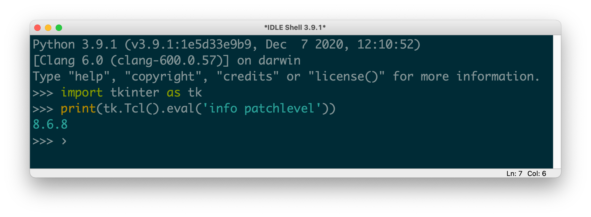

<!-- START doctoc generated TOC please keep comment here to allow auto update -->
<!-- DON'T EDIT THIS SECTION, INSTEAD RE-RUN doctoc TO UPDATE -->
**Table of Contents**  *generated with [DocToc](https://github.com/thlorenz/doctoc)*

- [installation](#installation)
  - [command completion](#command-completion)
  - [installation via source code](#installation-via-source-code)
- [environment in MacOS](#environment-in-macos)
  - [`pip.conf`](#pipconf)
  - [pip config file](#pip-config-file)
  - [list python path](#list-python-path)
  - [python libs](#python-libs)
  - [multiple versions](#multiple-versions)
- [version change](#version-change)
  - [setup default python](#setup-default-python)
  - [modules re-installation](#modules-re-installation)
  - [`PYTHONPATH`](#pythonpath)
- [extension](#extension)
  - [clear windows](#clear-windows)
- [python IDLE in MacOS Big Sur](#python-idle-in-macos-big-sur)
  - [`IDLE quit unexpectedly`](#idle-quit-unexpectedly)
  - [Python may not be configured for Tk](#python-may-not-be-configured-for-tk)

<!-- END doctoc generated TOC please keep comment here to allow auto update -->

> reference:
> - [homebrew and python](https://docs.brew.sh/Homebrew-and-Python)
> - [Installing from local packages](https://pip.pypa.io/en/stable/user_guide/#installing-from-local-packages)
> - [pip list](https://pip.pypa.io/en/stable/reference/pip_list/)

## installation

### [command completion](https://pip.pypa.io/en/stable/user_guide/#command-completion)
```bash
$ python -m pip completion --bash >> ~/.bashrc
```
- or
  ```bash
  $ python -m pip completion --bash >> ~/.profile
  ```
- or
  ```bash
  $ eval "`pip completion --bash`"
  ```

### [installation via source code](https://blog.eldernode.com/install-python-3-8-on-centos/)
- basic environment prepare
  ```bash
  $ sudo dnf install gcc openssl-devel bzip2-devel libffi-devel
  ```
  - [or](https://linuxize.com/post/how-to-install-python-3-8-on-centos-8/)
    ```bash
    $ sudo dnf groupinstall 'development tools'
    $ sudo dnf install bzip2-devel expat-devel gdbm-devel \
               ncurses-devel openssl-devel readline-devel wget \
               sqlite-devel tk-devel xz-devel zlib-devel libffi-devel
    ```

- download source code
  ```bash
  $ curl -O https://www.python.org/ftp/python/3.8.3/Python-3.8.3.tgz
  $ tar xzf Python-3.8.3.tgz
  ```

- compile and install
  ```bash
  $ cd Python-3.8.3
  $ sudo ./configure --enable-optimizations
  $ sudo make -j 12
  $ sudo make altinstall
  ```

- setup
  ```bash
  $ sudo update-alternatives --install /usr/bin/python3 python3 /usr/local/bin/python3.8 99
  ```

## environment in MacOS
### `pip.conf`


> `pip.conf` load priority
> - MacOS : `/Library/Application Support/pip/pip.conf` > `~/.config/pip/pip.conf` > `~/.pip/pip.conf`


- user: `~/.pip/pip.conf` & `~/.config/pip/pip.conf`
- global: `/Library/Application Support/pip/pip.conf`
- list config:
  ```bash
  $ pip config list [ -v ]
  global.index-url='https://repo.my.com/artifactory/api/pypi/tools/simple'
  ```
  - details
    ```bash
    $ pip config list -v
    For variant 'global', will try loading '/Library/Application Support/pip/pip.conf'
    For variant 'user', will try loading '/Users/marslo/.pip/pip.conf'
    For variant 'user', will try loading '/Users/marslo/.config/pip/pip.conf'
    For variant 'site', will try loading '/usr/local/opt/python@3.10/Frameworks/Python.framework/Versions/3.10/pip.conf'
    global.extra-index-url='https://my.artifactory.com/artifactory/api/pypi/myPrivate'
    global.index-url='https://my.artifactory.com/artifactory/api/pypi/pypi/simple'
    ```

- [`PIP_CONF_FILE`](https://pip.pypa.io/en/stable/user_guide/#configuration)
  ```bash
  $ export PIP_CONFIG_FILE=/path/to/pip.conf
  ```

- upgrade all outdated modules
  ```bash
  $ pip install --upgrade --user $(pip list --outdated | sed 1,2d | awk '{print $1}' | xargs)
  ```

  - with exclude
    ```bash
    $ pip3.9 install --upgrade --user $(pip3.9 list --outdated | sed 1,2d | awk '{print $1}' | grep -vw 'docker\|rich')
    ```

### [pip config file](https://pip.pypa.io/en/stable/topics/configuration/#pip-config-file)
- naming
  ```
  [global]
  timeout = 60
  index-url = https://download.zope.org/ppix
  ```

- per-command section
  ```
  [global]
  timeout = 60

  [freeze]
  timeout = 10
  ```

- boolean options
  ```
  [install]
  ignore-installed = true
  no-dependencies = yes
  ```
  - add
    ```
    [global]
    no-cache-dir = false

    [install]
    no-compile = no
    no-warn-script-location = false
    ```

- repeatable options
  ```
  [global]
  quiet = 0
  verbose = 2
  ```

- format: on multiple lines
  ```
  [global]
  find-links =
      http://download.example.com

  [install]
  find-links =
      http://mirror1.example.com
      http://mirror2.example.com

  trusted-host =
      mirror1.example.com
      mirror2.example.com
  ```

### [list python path](https://github.com/Homebrew/legacy-homebrew/issues/31873#issuecomment-53532229)
```bash
$ python -vv -c "import sys; print sys.path"
$ python -vvE -c "import sys; print sys.path"
$ python -vvEsS -c "import sys; print sys.path"
```

### python libs
#### MacOS
- global
 ```bash
  $ ls -ld /usr/local/lib/python*/
  drwxr-xr-x 3 marslo admin 96 May 17  2019 /usr/local/lib/python2.7/
  drwxr-xr-x 3 marslo admin 96 May 17  2019 /usr/local/lib/python3.7/
  drwxr-xr-x 3 marslo admin 96 Jan 13  2020 /usr/local/lib/python3.8/
  drwxr-xr-x 3 marslo admin 96 Oct 10 17:06 /usr/local/lib/python3.9/

  $ ls -ld /Library/Python/2.7/site-packages/
  drwxr-xr-x 9 root wheel 288 Aug  6 18:16 /Library/Python/2.7/site-packages/
 ```
  - or
    ```bash
      $ ls $(brew --prefix)/lib/python*
      /usr/local/lib/python2.7:
      site-packages

      /usr/local/lib/python3.7:
      site-packages

      /usr/local/lib/python3.8:
      site-packages

      /usr/local/lib/python3.9:
      site-packages
    ```

- local
  ```bash
  $ ls -ld ~/Library/Python/*/
  drwx------ 4 marslo staff 128 Aug  6 17:23 /Users/marslo/Library/Python/2.7/
  drwx------ 5 marslo staff 160 Oct 12 21:17 /Users/marslo/Library/Python/3.7/
  drwx------ 5 marslo staff 160 Oct 27 19:24 /Users/marslo/Library/Python/3.8/
  drwx------ 5 marslo staff 160 Oct 27 19:24 /Users/marslo/Library/Python/3.9/
  ```

  - example:
    ```bash
    $ /usr/bin/python -c 'import site; print(site.USER_BASE)'
    /Users/marslo/Library/Python/2.7

    $ /usr/local/bin/python3.9 -c 'import site; print(site.USER_BASE)'
    /Users/marslo/Library/Python/3.9

    $ /usr/local/bin/python3.6 -c 'import sysconfig; print(sysconfig.get_paths()["purelib"])'
    /usr/lib/python3.6/site-packages
    ```

#### linux
> references:
> - [How do I find the location of my Python site-packages directory](https://stackoverflow.com/a/46071447/2940319)

```bash
$ /usr/local/bin/python3.6 -m site --user-site
/home/marslo/.local/lib/python3.6/site-packages

$ /usr/local/bin/python3.6 -c 'import site; print(site.getsitepackages())'
['/usr/local/lib64/python3.6/site-packages', '/usr/local/lib/python3.6/site-packages', '/usr/lib64/python3.6/site-packages', '/usr/lib/python3.6/site-packages']

$ python3.6 -m site
sys.path = [
    '/home/marslo',
    '/usr/lib64/python36.zip',
    '/usr/lib64/python3.6',
    '/usr/lib64/python3.6/lib-dynload',
    '/usr/local/lib/python3.6/site-packages',
    '/usr/lib64/python3.6/site-packages',
    '/usr/lib/python3.6/site-packages',
]
USER_BASE: '/home/marslo/.local' (exists)
USER_SITE: '/home/marslo/.local/lib/python3.6/site-packages' (doesn't exist)
ENABLE_USER_SITE: True
```

- check particular lib
  ```bash
  $ python -c "import os as _; print(_.__file__)"
  /usr/lib64/python3.6/os.py

  $ python -c "import setuptools as _; print(_.__path__)"
  ['/usr/lib/python3.6/site-packages/setuptools']
  ```

### multiple versions
#### get current working version
```bash
$ CFLAGS=-I$(brew --prefix)/include LDFLAGS=-L$(brew --prefix)/lib pip --version
pip 20.2.4 from /Users/marslo/Library/Python/3.8/lib/python/site-packages/pip (python 3.8)
```
- or
  ```bash
  $ $(brew --prefix)/opt/python/libexec/bin/python -V
  Python 3.8.6
  ```

#### upgrade particular modules
```bash
$ sudo -H python3.9 -m pip install --upgrade pip
Collecting pip
  Using cached pip-20.2.4-py2.py3-none-any.whl (1.5 MB)
Installing collected packages: pip
  Attempting uninstall: pip
    Found existing installation: pip 20.2.3
    Uninstalling pip-20.2.3:
      Successfully uninstalled pip-20.2.3
Successfully installed pip-20.2.4
```
  - upgrade to previous version
  ```bash
  $ pip install --upgrade --no-cache-dir --pre pip
  ```

#### install all older version modules
```bash
$ /usr/local/bin/python3.8 -m pip freeze > pip3.8-requirements.txt
$ sudo -H /usr/local/bin/python3.9 -m pip install --pre -r pip3.8-requirements.txt
```
- reference:
  ```bash
  $ CFLAGS=-I$(brew --prefix)/include LDFLAGS=-L$(brew --prefix)/lib pip freeze
  beautifulsoup4==4.9.1
  certifi==2020.6.20
  cffi==1.14.1
  chardet==3.0.4
  click==7.1.2
  click-config-file==0.6.0
  colorama==0.4.3
  ...
  ```
  - or
    ```bash
    $ pip list --outdate --format=freeze
    docker==4.2.2
    rich==3.0.5

    $ pip list -o --format columns
    Package Version Latest Type
    ------- ------- ------ -----
    docker  4.2.2   4.3.1  wheel
    rich    3.0.5   9.1.0  whee

    $ pip list --outdate --format=json
    [{"name": "docker", "version": "4.2.2", "latest_version": "4.3.1", "latest_filetype": "wheel"}, {"name": "rich", "version": "3.0.5", "latest_version": "9.1.0", "latest_filetype": "wheel"}]
    ```

## version change


> change default python from `3.9` to `3.10`


### setup default python
- via `ln`
  ```bash
  $ unlink /usr/local/opt/python
  $ ln -sf /usr/local/Cellar/python@3.10/3.10.4 /usr/local/opt/python

  $ unlink /usr/local/bin/python
  $ ln -sf /usr/local/Cellar/python@3.10/3.10.4/bin/python3.10 /usr/local/bin/python3
  $ ln -sf /usr/local/Cellar/python@3.10/3.10.4/bin/python3.10 /usr/local/bin/python

  $ export PYTHONUSERBASE="$(/usr/local/opt/python/libexec/bin/python -c 'import site; print(site.USER_BASE)')"
  $ export PYTHON3='/usr/local/opt/python/libexec/bin'
  $ export PATH="$PYTHONUSERBASE/bin:${PYTHON3}:$PATH"
  ```

- via [`brew link`](https://stackoverflow.com/a/61560541/2940319)
  ```bash
  $ brew link python3 python@3.10 --overwrite
  ```
  - example
    ```bash
    $ python3 --version
    Python 3.9.13

    $ brew link python3 python@3.10 --overwrite
    Warning: Already linked: /usr/local/Cellar/python@3.9/3.9.13_1
    To relink, run:
      brew unlink python@3.9 && brew link python@3.9
    Linking /usr/local/Cellar/python@3.10/3.10.4... 24 symlinks created.

    If you need to have this software first in your PATH instead consider running:
      echo 'export PATH="/usr/local/opt/python@3.10/bin:$PATH"' >> /Users/marslo/.bash_profile

    $ python3 --version
    Python 3.10.4
    ```

- via [`default`](https://github.com/Homebrew/homebrew-cask/issues/52128#issuecomment-424680522)
  ```bash
  $ defaults write com.apple.versioner.python Version 3.8
  ```
  - get default version
    ```bash
    $ defaults read com.apple.versioner.python Version
    ```
  - example
    ```bash
    $ defaults read com.apple.versioner.python Version
    3.9

    $ defaults write com.apple.versioner.python Version 3.10

    $ defaults read com.apple.versioner.python Version
    3.10
    ```

### modules re-installation
```bash
$ /usr/local/bin/python3.9 -m pip freeze > pip3.9-requirements.txt
$ sudo -H /usr/local/bin/python3.10 -m pip install --pre -r pip3.9-requirements.txt
```

### `PYTHONPATH`
```bash
$ export PYTHONPATH="/usr/local/lib/python3.9/site-packages"
    ⇣⇣
$ export PYTHONPATH="/usr/local/lib/python3.10/site-packages"
```

## extension
### [clear windows](https://gist.github.com/tonidy/1175133)
- download
  ```bash
  $ curl -o /Library/Frameworks/Python.framework/Versions/3.9/lib/python3.9/idlelib/ClearWindow.py https://bugs.python.org/file14303/ClearWindow.py
  ```
- configure
  ```bash
  $ cat >> /Library/Frameworks/Python.framework/Versions/3.9/lib/python3.9/idlelib/config-extensions.def < EOF

  [ClearWindow]

  enable=1
  enable_editor=0
  enable_shell=1
  [ClearWindow_cfgBindings]
  clear-window=<Command-Key-l>
  EOF
  ```

## python IDLE in MacOS Big Sur
### `IDLE quit unexpectedly`
```bash
Process:               Python [53851]
Path:                  /usr/local/Cellar/python@3.9/3.9.1_5/IDLE 3.app/Contents/MacOS/Python
Identifier:            org.python.IDLE
Version:               3.9.1 (3.9.1)
Code Type:             X86-64 (Native)
Parent Process:        ??? [1]
Responsible:           Python [53851]
User ID:               501

Date/Time:             2021-01-10 15:20:06.574 +0800
OS Version:            macOS 11.1 (20C69)
Report Version:        12
Bridge OS Version:     5.1 (18P3030)
Anonymous UUID:        AB6EE819-0314-4161-9650-FFE340DF84C8

Application Specific Information:
abort() called
...
```

- root cause
  ```bash
  $ python
  Python 3.9.1 (default, Jan  6 2021, 06:05:23)
  [Clang 12.0.0 (clang-1200.0.32.28)] on darwin
  Type "help", "copyright", "credits" or "license" for more information.
  >>> import tkinter as tk
  >>> print(tk.Tcl().eval('info patchlevel'))
  8.5.9
  >>> exit()
  ```

- using `https://www.python.org/ftp/python/3.9.1/python-3.9.1-macosx10.9.pkg`
  ```bash
  $ brew info tcl-tk | head -1
  tcl-tk: stable 8.6.11 (bottled) [keg-only]

  $ python
  Python 3.9.1 (v3.9.1:1e5d33e9b9, Dec  7 2020, 12:10:52)
  [Clang 6.0 (clang-600.0.57)] on darwin
  Type "help", "copyright", "credits" or "license()" for more information.
  >>> import tkinter as tk
  >>> print(tk.Tcl().eval('info patchlevel'))
  8.6.8
  ```

  

- [more on tkinter](https://stackoverflow.com/a/60469203/2940319)
  ```bash
  >>> import tkinter
  >>> tkinter.TclVersion, tkinter.TkVersion
  (8.5, 8.5)
  >>> tkinter._tester()
  Traceback (most recent call last):
    File "<stdin>", line 1, in <module>
  AttributeError: module 'tkinter' has no attribute '_tester'
  >>> tkinter._test()
  macOS 11 or later required !
  Abort trap: 6
  ```

### Python may not be configured for Tk
```bash
$ python
Python 3.10.4 (main, Apr 26 2022, 19:42:59) [Clang 13.1.6 (clang-1316.0.21.2)] on darwin
Type "help", "copyright", "credits" or "license" for more information.
>>> import tkinter as tk
Traceback (most recent call last):
  File "<stdin>", line 1, in <module>
  File "/usr/local/Cellar/python@3.10/3.10.4/Frameworks/Python.framework/Versions/3.10/lib/python3.10/tkinter/__init__.py", line 37, in <module>
    import _tkinter # If this fails your Python may not be configured for Tk
ModuleNotFoundError: No module named '_tkinter'
```

- solution
  ```bash
  $ brew info python@3.10
  python@3.10: stable 3.10.4 (bottled) [keg-only]
  ... ...
  tkinter is no longer included with this formula, but it is available separately:
    brew install python-tk@3.10
  ... ...

  $ brew install python-tk@3.10
  ==> Downloading https://ghcr.io/v2/homebrew/core/python-tk/3.10/manifests/3.10.4
######################################################################## 100.0%
  ==> Downloading https://ghcr.io/v2/homebrew/core/python-tk/3.10/blobs/sha256:6a937be1fd531589ef7f9b4d971cb91ee7549d99f7f1aaf97f0fc3c0911f1c5d
  ==> Downloading from https://pkg-containers.githubusercontent.com/ghcr1/blobs/sha256:6a937be1fd531589ef7f9b4d971cb91ee7549d99f7f1aaf97f0fc3c0911f1c5d?s
######################################################################## 100.0%
  ==> Pouring python-tk@3.10--3.10.4.monterey.bottle.tar.gz
  ==> Caveats
  python-tk@3.10 is keg-only, which means it was not symlinked into /usr/local,
  because this is an alternate version of another formula.

  ==> Summary
  ☕️ 🐸  /usr/local/Cellar/python-tk@3.10/3.10.4: 5 files, 132.6KB
  ==> Running `brew cleanup python-tk@3.10`...
  Disable this behaviour by setting HOMEBREW_NO_INSTALL_CLEANUP.
  Hide these hints with HOMEBREW_NO_ENV_HINTS (see `man brew`).

  $ brew reinstall python@3.10
  ... ...
  ```
