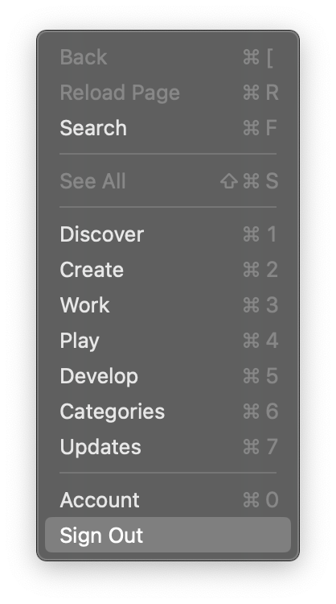

<!-- START doctoc generated TOC please keep comment here to allow auto update -->
<!-- DON'T EDIT THIS SECTION, INSTEAD RE-RUN doctoc TO UPDATE -->
**Table of Contents**  *generated with [DocToc](https://github.com/thlorenz/doctoc)*

- [recommend apps](#recommend-apps)
  - [screenshot](#screenshot)
  - [keystore](#keystore)
  - [gif](#gif)
  - [development](#development)
  - [system](#system)
- [app store](#app-store)
- [program](#program)
  - [Java](#java)

<!-- END doctoc generated TOC please keep comment here to allow auto update -->

## recommend apps
### screenshot
- [jietu](https://jietu.qq.com/)
- [snagit](https://www.techsmith.com/screen-capture.html)
- [snipaste](https://www.snipaste.com/)   ⇠ for windows

### keystore
- Visualize
  - [cn](https://apps.apple.com/cn/app/visualize-display-your-keystrokes-and-mouse-clicks/id978980906?l=en&mt=12)
  - [us](https://apps.apple.com/us/app/visualize-display-your-keystrokes-and-mouse-clicks/id978980906?mt=12)
- [keyCastr](https://github.com/keycastr/keycastr)
- [captin](https://captin.mystrikingly.com/)
- [Carnac](http://carnackeys.com/)      ⇠ for windows

- keyboard customized
  - [Karabiner-Elements](https://karabiner-elements.pqrs.org/)

### gif
- [GIF Brewery 3 by Gfycat](https://gfycat.com/gifbrewery)
  > caches: `$HOME/Movies/GIF Brewery 3/*.mp4`

  - [cn](https://apps.apple.com/cn/app/gif-brewery-3-by-gfycat/id1081413713?l=en&mt=12)
  - [us](https://apps.apple.com/us/app/gif-brewery-3-by-gfycat/id1081413713?mt=12)
- [LICEcap](https://www.cockos.com/licecap/)

### development
- [macvim](https://github.com/macvim-dev/macvim)
- [RegExRX](https://www.macupdate.com/app/mac/33164/regexrx)
  - [cn](https://apps.apple.com/cn/app/regexrx/id498370702?l=en&mt=12)
  - [us](https://apps.apple.com/us/app/regexrx/id498370702?mt=12)
- [iTerm2](https://www.iterm2.com/)
- [dash](https://kapeli.com/dash)
- [doctoc](https://github.com/thlorenz/doctoc)
- [gnomon](https://www.npmjs.com/package/gnomon)
- [Css Scan](https://getcssscan.com/)

### system
- [psSafe](https://pwsafe.org/)
- [iStat Menus](https://bjango.com/mac/istatmenus/)
- [Moon](https://manytricks.com/moom/)
- [Alfed](https://www.alfredapp.com/)
  - backup:
    - `user path`: `$HOME/Library/Application Support/Alfred`
- [Chrome Canary](https://www.google.com/chrome/canary/?platform=mac&standalone=1)
  - [chrome extension downloader](https://chrome-extension-downloader.com/)
- [Chromium](https://www.chromium.org/getting-involved/download-chromium)
- [Karabiner-Elements](https://karabiner-elements.pqrs.org/) Saviour of MadCatz R.A.T in MacOS
- [System Color Picker](https://apps.apple.com/us/app/system-color-picker/id1545870783?mt=12) | [Just Color Picker](https://annystudio.com/software/colorpicker/)
- [Bob Translate](https://bobtranslate.com/) | [TTime Translate](https://ttime.timerecord.cn/)  ⇠ for windows

## app store
- logout
  - `Store` -> `logout`

  

## program
### [Java](https://www.oracle.com/java/technologies/)

> [!NOTE|label:references:]
> - [* iMarslo : apps/java](../../osx/apps.html#java)
> - [Oracle Java Archive](https://www.oracle.com/java/technologies/downloads/archive/)

- [java 21](https://www.oracle.com/java/technologies/downloads/#java21)
  - [linux](https://www.oracle.com/java/technologies/downloads/#jdk21-linux)
  - [osx](https://www.oracle.com/java/technologies/downloads/#jdk21-mac)
  - [windows](https://www.oracle.com/java/technologies/downloads/#jdk21-windows)

- [java 17](https://www.oracle.com/java/technologies/downloads/#java17)
  - [linux](https://www.oracle.com/java/technologies/downloads/#jdk17-linux)
  - [osx](https://www.oracle.com/java/technologies/downloads/#jdk17-mac)
  - [windows](https://www.oracle.com/java/technologies/downloads/#jdk17-windows)

- [java 11](https://www.oracle.com/java/technologies/downloads/#java11)
  - [linux](https://www.oracle.com/java/technologies/downloads/#java11-linux)
  - [osx](https://www.oracle.com/java/technologies/downloads/#java11-mac)
  - [windows](https://www.oracle.com/java/technologies/downloads/#java11-windows)
  - [solaris](https://www.oracle.com/java/technologies/downloads/#java11-solaris)

- [java 8](https://www.oracle.com/java/technologies/downloads/#java8)

  > [!NOTE|label:references:]
  > - [java 8u391](https://www.oracle.com/java/technologies/downloads/#java8)
  > - [java 8u211 and later](https://www.oracle.com/java/technologies/javase/javase8u211-later-archive-downloads.html)
  > - [java 8u202 and earlier](https://www.oracle.com/java/technologies/javase/javase8-archive-downloads.html)

  - [linux](https://www.oracle.com/java/technologies/downloads/#java8-linux)
  - [osx](https://www.oracle.com/java/technologies/downloads/#java8-mac)
  - [windows](https://www.oracle.com/java/technologies/downloads/#java8-windows)
  - [solaris](https://www.oracle.com/java/technologies/downloads/#java8-solaris)

- [java archive](https://www.oracle.com/java/technologies/downloads/archive/)
  - [Java SE 7](https://www.oracle.com/java/technologies/javase/javase7-archive-downloads.html)
  - [Java SE 6](https://www.oracle.com/java/technologies/javase-java-archive-javase6-downloads.html)
  - [Java SE 5](https://www.oracle.com/java/technologies/java-archive-javase5-downloads.html)
  - [Java SE 1.4](https://www.oracle.com/java/technologies/java-archive-javase-v14-downloads.html)
  - [Java SE 1.3](https://www.oracle.com/java/technologies/java-archive-javase-v13-downloads.html)
  - [Java SE 1.2](https://www.oracle.com/java/technologies/java-archive-javase-v12-downloads.html)
  - [Java SE 1.1](https://www.oracle.com/java/technologies/java-archive-downloads-javase11-downloads.html)
