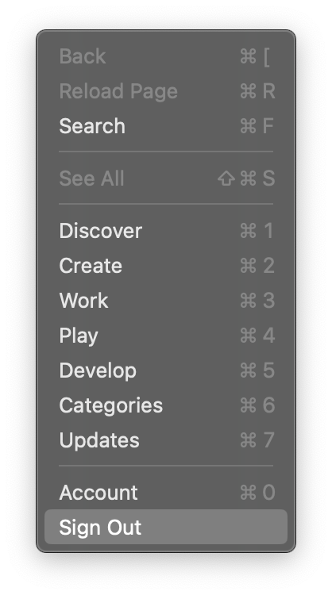

<!-- START doctoc generated TOC please keep comment here to allow auto update -->
<!-- DON'T EDIT THIS SECTION, INSTEAD RE-RUN doctoc TO UPDATE -->

- [recommend apps](#recommend-apps)
  - [screenshot](#screenshot)
  - [keystore](#keystore)
  - [gif](#gif)
  - [development](#development)
  - [system](#system)
- [app store](#app-store)
- [development](#development-1)
  - [Java](#java)

<!-- END doctoc generated TOC please keep comment here to allow auto update -->

## recommend apps

> [!NOTE|label:references:]
> - [XXMac](https://www.xxmac.com/) | 如遇打开下载文件需要密码为: `xxmac.com`
>   - [GIF Brewery for Mac v3.9.5 英文破解 GIF制作工具](https://www.xxmac.com/gif-brewery.html) | [提取码: `iasr`](https://pan.baidu.com/s/1aPJCP4cRn0JbYLgU83rTRg) | [提取码: `tjtd`](https://pan.baidu.com/s/1cyG-bXc6NbCRZzfTAX9IBw?pwd=tjtd)
>   - [Boxy SVG for Mac v4.37.0 英文破解 矢量图形编辑工具](https://www.xxmac.com/boxy-svg.html) | [提取码: `yqpy`](https://pan.baidu.com/s/11ft9BUO4vF4iJ9c128xOcw?pwd=yqpy)
>   - [GIF’ted for Mac v1.1.3 英文破解 把视频做成GIF动画](https://www.xxmac.com/gifted.html) | [提取码: `nw2i`](https://pan.baidu.com/s/1KKONAMqvVvJjk3g34Jk-Nw)
> - [MacX苹果电脑资讯站](https://www.macw.cn/down-view-2309-16157.html)

### screenshot
- [jietu](https://jietu.qq.com/)
- [snagit](https://www.techsmith.com/screen-capture.html)
- [snipaste](https://www.snipaste.com/)  | [iShot](https://www.better365.cn/ishot.html)
- [pageres-cli](https://github.com/sindresorhus/pageres-cli) | [capture-website-cli](https://github.com/sindresorhus/capture-website-cli) | [CutyCapt](https://cutycapt.sourceforge.net/)

### keystore
- Visualize
  - [cn](https://apps.apple.com/cn/app/visualize-display-your-keystrokes-and-mouse-clicks/id978980906?l=en&mt=12)
  - [us](https://apps.apple.com/us/app/visualize-display-your-keystrokes-and-mouse-clicks/id978980906?mt=12)
- [keyCastr](https://github.com/keycastr/keycastr)
- [captin](https://captin.mystrikingly.com/)
- [Carnac](http://carnackeys.com/)      ⇠ for windows

- keyboard customized
  - [Karabiner-Elements](https://karabiner-elements.pqrs.org/)

### gif
- [GIF Brewery 3 by Gfycat](https://gfycat.com/gifbrewery)
  > caches: `$HOME/Movies/GIF Brewery 3/*.mp4`
  > - [GIF Brewery 3.9.5 功能强大的动图制作工具](https://xclient.info/s/gif-brewery.html) | [城通网盘](https://xclient.info/s/gif-brewery.html?a=dl&v=3.9.5&k=1&t=f7cda89238e1e645bdc60f7c5337e0fa629b8ddf) | [提取码: `456641`](https://url64.ctfile.com/f/13114864-656132467-6eacce?p=456641)
  >   - 本站DMG、zip统一打开密码: `xclient.info`

  - [cn](https://apps.apple.com/cn/app/gif-brewery-3-by-gfycat/id1081413713?l=en&mt=12)
  - [us](https://apps.apple.com/us/app/gif-brewery-3-by-gfycat/id1081413713?mt=12)
- [LICEcap](https://www.cockos.com/licecap/)

### development
- [macvim](https://github.com/macvim-dev/macvim)
- [RegExRX](http://www.mactechnologies.com/index.php?page=downloads#regexrx) | [macupdate](https://www.macupdate.com/app/mac/33164/regexrx)
  - [cn](https://apps.apple.com/cn/app/regexrx/id498370702?l=en&mt=12)
  - [us](https://apps.apple.com/us/app/regexrx/id498370702?mt=12)
- [iTerm2](https://www.iterm2.com/)
- [dash](https://kapeli.com/dash)
- [doctoc](https://github.com/thlorenz/doctoc)
- [iStats](https://github.com/Chris911/iStats) | [see also](../../osx/apps/brew.md##brew-install)
- [gnomon](https://www.npmjs.com/package/gnomon)
- [Css Scan](https://getcssscan.com/)

### system

> [!NOTE|label:references:]
> - [better365](https://www.better365.cn/apps.html)
>   - [Better And Better 2.0](https://www.better365.cn/bab2.html)
>   - [LiuHai](https://www.better365.cn/LiuHai.html)
> - [setapp](https://setapp.com/)
>   - [Bartender](https://setapp.com/apps/bartender)
>   - [core shell](https://setapp.com/apps/core-shell) | [Dash](https://setapp.com/apps/dash)
>   - [Paste](https://setapp.com/apps/paste) | [PopClip](https://setapp.com/apps/popclip)
>   - [Keysmith](https://setapp.com/apps/keysmith)
>   - [CleanMyMac](https://setapp.com/apps/cleanmymac) | [iStat Menus](https://setapp.com/apps/istat-menus)
>   - [Lungo](https://setapp.com/apps/lungo) -> keep your mac awake

- [mas](https://github.com/mas-cli/mas)

- [caffeine](https://www.zhornsoftware.co.uk/caffeine/)

  > [!TIP|label:references:]
  > - Caffeine.app
  >   ```bash
  >   $ brew info --cask caffeine
  >   ... ...
  >   caffeine is built for Intel macOS and so requires Rosetta 2 to be installed.
  >   You can install Rosetta 2 with:
  >     softwareupdate --install-rosetta --agree-to-license
  >   $ which -a caffeine
  >   /usr/bin/caffeinate
  >   ```
  > - references:
  >   - [Moving the mouse with applescript](https://blog.andrewparnell.com/2010/01/moving-the-mouse-with-applescript/)

- awake
  - [jiggler](https://www.sticksoftware.com/software/Jiggler.html) - `$ brew install --cask jiggler`
  - [Post2Fix/TerminalWake](https://github.com/Post2Fix/TerminalWake)
  - [Amphetamine](https://apps.apple.com/us/app/amphetamine/id937984704?mt=12)
  - [KeepingYouAwake](https://keepingyouawake.app/) | [newmarcel/KeepingYouAwake](https://github.com/newmarcel/KeepingYouAwake) - `$ brew install --cask keepingyouawake`
  - [Caffeinated](https://apps.apple.com/us/app/caffeinated-anti-sleep-app/id1362171212?mt=12)

#### utilities
- [Alfed](https://www.alfredapp.com/)
  - backup:
    - `user path`: `$HOME/Library/Application Support/Alfred`
- [Keyboard Maestro](https://www.keyboardmaestro.com/main/)
- [iStat Menus](https://bjango.com/mac/istatmenus/) | [State](https://www.better365.cn/state.html)
- [Moon](https://manytricks.com/moom/) | [BetterSnapTool](https://folivora.ai/bettersnaptool) | [Simple Window Manager - SWM](https://community.folivora.ai/t/simple-window-manager-swm/12796)
- [Bartender 5](https://www.macbartender.com/) | [iBar](https://www.better365.cn/ibar.html)
- [Everything](https://www.voidtools.com/support/everything/) | [All](https://www.better365.cn/all.html)
- [Bob Translate](https://bobtranslate.com/) | [TTime Translate](https://ttime.timerecord.cn/)  ⇠ for windows
- [BetterTouchTool](https://folivora.ai/)
- [Karabiner-Elements](https://karabiner-elements.pqrs.org/) Saviour of MadCatz R.A.T in MacOS

#### browser
- [Chrome Canary](https://www.google.com/chrome/canary/?platform=mac&standalone=1)
  - [chrome extension downloader](https://chrome-extension-downloader.com/)
- [Chromium](https://www.chromium.org/getting-involved/download-chromium)

#### password management
- [psSafe](https://pwsafe.org/)

#### color picker
- [Sip](https://sipapp.io/) | [jonathaneunice/iterm2-tab-set](https://github.com/jonathaneunice/iterm2-tab-set) | [Color Picker](https://apps.apple.com/us/app/system-color-picker/id1545870783?mt=12) | [Just Color Picker](https://annystudio.com/software/colorpicker/) | [Aquarelo](https://setapp.com/apps/aquarelo)

#### display
- [Flux](https://justgetflux.com/)

#### network
- [Little Snitch](https://www.obdev.at/products/littlesnitch/index.html)

## app store
- logout
  - `Store` -> `logout`

  

## development
### [Java](https://www.oracle.com/java/technologies/)

> [!NOTE|label:references:]
> - [* iMarslo : apps/java](../../osx/apps.html#java)
> - [Oracle Java Archive](https://www.oracle.com/java/technologies/downloads/archive/)
> - [bellsoft/Liberica](https://github.com/bell-sw/Liberica/releases)

#### oracle
- [java 21](https://www.oracle.com/java/technologies/downloads/#java21)
  - [linux](https://www.oracle.com/java/technologies/downloads/#jdk21-linux)
  - [osx](https://www.oracle.com/java/technologies/downloads/#jdk21-mac)
  - [windows](https://www.oracle.com/java/technologies/downloads/#jdk21-windows)

- [java 17](https://www.oracle.com/java/technologies/downloads/#java17)
  - [linux](https://www.oracle.com/java/technologies/downloads/#jdk17-linux)
  - [osx](https://www.oracle.com/java/technologies/downloads/#jdk17-mac)
  - [windows](https://www.oracle.com/java/technologies/downloads/#jdk17-windows)

- [java 11](https://www.oracle.com/java/technologies/downloads/#java11)
  - [linux](https://www.oracle.com/java/technologies/downloads/#java11-linux)
  - [osx](https://www.oracle.com/java/technologies/downloads/#java11-mac)
  - [windows](https://www.oracle.com/java/technologies/downloads/#java11-windows)
  - [solaris](https://www.oracle.com/java/technologies/downloads/#java11-solaris)

- [java 8](https://www.oracle.com/java/technologies/downloads/#java8)

  > [!NOTE|label:references:]
  > - [java 8u391](https://www.oracle.com/java/technologies/downloads/#java8)
  > - [java 8u211 and later](https://www.oracle.com/java/technologies/javase/javase8u211-later-archive-downloads.html)
  > - [java 8u202 and earlier](https://www.oracle.com/java/technologies/javase/javase8-archive-downloads.html)

  - [linux](https://www.oracle.com/java/technologies/downloads/#java8-linux)
  - [osx](https://www.oracle.com/java/technologies/downloads/#java8-mac)
  - [windows](https://www.oracle.com/java/technologies/downloads/#java8-windows)
  - [solaris](https://www.oracle.com/java/technologies/downloads/#java8-solaris)

- [java archive](https://www.oracle.com/java/technologies/downloads/archive/)
  - [Java SE 7](https://www.oracle.com/java/technologies/javase/javase7-archive-downloads.html)
  - [Java SE 6](https://www.oracle.com/java/technologies/javase-java-archive-javase6-downloads.html)
  - [Java SE 5](https://www.oracle.com/java/technologies/java-archive-javase5-downloads.html)
  - [Java SE 1.4](https://www.oracle.com/java/technologies/java-archive-javase-v14-downloads.html)
  - [Java SE 1.3](https://www.oracle.com/java/technologies/java-archive-javase-v13-downloads.html)
  - [Java SE 1.2](https://www.oracle.com/java/technologies/java-archive-javase-v12-downloads.html)
  - [Java SE 1.1](https://www.oracle.com/java/technologies/java-archive-downloads-javase11-downloads.html)

#### bellsoft

> [!NOTE|label:references:]
> - [B4J Tutorials](https://www.b4x.com/android/forum/forums/b4j-tutorials.57/)
> - [Raspberry Pi with Java 11](https://www.b4x.com/android/forum/threads/raspberry-pi-with-java-11.99606/)
> - [Liberica JDK.pdf](https://bell-sw.com/assets/files/Liberica_JDK_Whitepaper.pdf)
>   - [Installation Guide](https://docs.bell-sw.com/liberica-jdk/17.0.11b12/general/install-guide/) | [pdf](https://download.bell-sw.com/documentation/liberica-jdk/17.0.11+12-psu//install-guide-17.0.11+12-psu-liberica-jdk.pdf)

- [21.0.1+12](https://github.com/bell-sw/Liberica/releases/tag/21.0.1%2B12)
  - [bellsoft-jdk21.0.1+12-linux-arm32-vfp-hflt-full.deb](https://github.com/bell-sw/Liberica/releases/download/21.0.1%2B12/bellsoft-jdk21.0.1+12-linux-arm32-vfp-hflt-full.deb)
  - [bellsoft-jdk21.0.1+12-linux-aarch64-full.deb](https://github.com/bell-sw/Liberica/releases/download/21.0.1%2B12/bellsoft-jdk21.0.1+12-linux-aarch64-full.deb)
  - [bellsoft-jdk21.0.1+12-linux-aarch64.deb](https://github.com/bell-sw/Liberica/releases/download/21.0.1%2B12/bellsoft-jdk21.0.1+12-linux-aarch64.deb)
  - [bellsoft-jdk21.0.1+12-linux-amd64-full.deb](https://github.com/bell-sw/Liberica/releases/download/21.0.1%2B12/bellsoft-jdk21.0.1+12-linux-amd64-full.deb)
  - [bellsoft-jdk21.0.1+12-linux-amd64.deb](https://github.com/bell-sw/Liberica/releases/download/21.0.1%2B12/bellsoft-jdk21.0.1+12-linux-amd64.deb)

- [17.0.11+12](https://github.com/bell-sw/Liberica/releases/tag/17.0.11%2B12)
  - [bellsoft-jdk17.0.11+12-linux-aarch64-full.debf](https://github.com/bell-sw/Liberica/releases/download/17.0.11%2B12/bellsoft-jdk17.0.11+12-linux-aarch64-full.deb)
  - [bellsoft-jdk17.0.11+12-linux-aarch64.deb](https://github.com/bell-sw/Liberica/releases/download/17.0.11%2B12/bellsoft-jdk17.0.11+12-linux-aarch64.deb)
  - [bellsoft-jdk17.0.11+12-linux-amd64-full.deb](https://github.com/bell-sw/Liberica/releases/download/17.0.11%2B12/bellsoft-jdk17.0.11+12-linux-amd64-full.deb)
  - [bellsoft-jdk17.0.11+12-linux-amd64.deb](https://github.com/bell-sw/Liberica/releases/download/17.0.11%2B12/bellsoft-jdk17.0.11+12-linux-amd64.deb)
  - [bellsoft-jdk17.0.11+12-linux-arm32-vfp-hflt-full.deb](https://github.com/bell-sw/Liberica/releases/download/17.0.11%2B12/bellsoft-jdk17.0.11+12-linux-arm32-vfp-hflt-full.deb)
  - [bellsoft-jdk17.0.11+12-linux-arm32-vfp-hflt.deb](https://github.com/bell-sw/Liberica/releases/download/17.0.11%2B12/bellsoft-jdk17.0.11+12-linux-arm32-vfp-hflt.deb)

- [17.0.9+11](https://github.com/bell-sw/Liberica/releases/tag/17.0.9%2B11)
  - [bellsoft-jdk17.0.9+11-linux-aarch64-full.deb](https://github.com/bell-sw/Liberica/releases/download/17.0.9%2B11/bellsoft-jdk17.0.9+11-linux-aarch64-full.deb)
  - [bellsoft-jdk17.0.9+11-linux-aarch64.deb](https://github.com/bell-sw/Liberica/releases/download/17.0.9%2B11/bellsoft-jdk17.0.9+11-linux-aarch64.deb)
  - [bellsoft-jdk17.0.9+11-linux-amd64-full.deb](https://github.com/bell-sw/Liberica/releases/download/17.0.9%2B11/bellsoft-jdk17.0.9+11-linux-amd64-full.deb)
  - [bellsoft-jdk17.0.9+11-linux-amd64.deb](https://github.com/bell-sw/Liberica/releases/download/17.0.9%2B11/bellsoft-jdk17.0.9+11-linux-amd64.deb)
  - [bellsoft-jdk17.0.9+11-linux-arm32-vfp-hflt-full.deb](https://github.com/bell-sw/Liberica/releases/download/17.0.9%2B11/bellsoft-jdk17.0.9+11-linux-arm32-vfp-hflt-full.deb)
  - [bellsoft-jdk17.0.9+11-linux-arm32-vfp-hflt.deb](https://github.com/bell-sw/Liberica/releases/download/17.0.9%2B11/bellsoft-jdk17.0.9+11-linux-arm32-vfp-hflt.deb)

- [11.0.21+10](https://github.com/bell-sw/Liberica/releases/tag/11.0.21%2B10)
  - [bellsoft-jdk11.0.21+10-linux-aarch64-full.deb](https://github.com/bell-sw/Liberica/releases/download/11.0.21%2B10/bellsoft-jdk11.0.21+10-linux-aarch64-full.deb)
  - [bellsoft-jdk11.0.21+10-linux-aarch64.deb](https://github.com/bell-sw/Liberica/releases/download/11.0.21%2B10/bellsoft-jdk11.0.21+10-linux-aarch64.deb)
  - [bellsoft-jdk11.0.21+10-linux-amd64-full.deb](https://github.com/bell-sw/Liberica/releases/download/11.0.21%2B10/bellsoft-jdk11.0.21+10-linux-amd64-full.deb)
  - [bellsoft-jdk11.0.21+10-linux-amd64.deb](https://github.com/bell-sw/Liberica/releases/download/11.0.21%2B10/bellsoft-jdk11.0.21+10-linux-amd64.deb)
  - [bellsoft-jdk11.0.21+10-linux-arm32-vfp-hflt-full.deb](https://github.com/bell-sw/Liberica/releases/download/11.0.21%2B10/bellsoft-jdk11.0.21+10-linux-arm32-vfp-hflt-full.deb)
  - [bellsoft-jdk11.0.21+10-linux-arm32-vfp-hflt.deb](https://github.com/bell-sw/Liberica/releases/download/11.0.21%2B10/bellsoft-jdk11.0.21+10-linux-arm32-vfp-hflt.deb)
