<!-- START doctoc generated TOC please keep comment here to allow auto update -->
<!-- DON'T EDIT THIS SECTION, INSTEAD RE-RUN doctoc TO UPDATE -->
**Table of Contents**  *generated with [DocToc](https://github.com/thlorenz/doctoc)*

- [tab](#tab)
  - [setup a colorful tab](#setup-a-colorful-tab)
  - [add favor color to a file (`~/.marslo/.colors`)](#add-favor-color-to-a-file-marslocolors)
- [[hidden settings](Hidden Settings)](#hidden-settingshidden-settings)
- [iTerm2 Python REPL](#iterm2-python-repl)
- [theme](#theme)

<!-- END doctoc generated TOC please keep comment here to allow auto update -->

## tab
### setup a colorful tab
#### pick colors


> references:
> - [Digital Color Meter.app](https://support.apple.com/guide/digital-color-meter/welcome/mac)
> - [iterm2-tab-set](https://www.npmjs.com/package/iterm2-tab-set)
> - [System Color Picker](https://apps.apple.com/us/app/system-color-picker/id1545870783?mt=12)
> using : `tabset --list`


```bash
> $ while read i; do
>   c=$(echo $i | awk -F':' '{print $1}');
>   echo === $c === ;
>   tabset --add m-$c $c;
> done < csscolors.js

$ tabset --list
```


### add favor color to a file (`~/.marslo/.colors`)
```bash
$ echo "<color-name>" >> ~/.marslo/.colors
```

#### get color hex (for [`it2setcolor`](https://github.com/gnachman/iterm2-website/blob/master/source/utilities/it2setcolor))

> [!TIP]
> download original csscolor.js if necessory:
> ```bash
> $ curl -fsSL -O https://raw.githubusercontent.com/jonathaneunice/iterm2-tab-set/master/csscolors.js
> ```

```bash
$ while read -r i; do
>   rgb=$(grep -E "\s$i:" csscolors.js | sed -re "s:.*\[(.*)\],?$:\1:";)
>   hexc=$(for c in $(echo ${rgb} | sed -re 's:,::g'); do printf '%x' $c; done)
>   echo -e """$i :\t$rgb :\t$hexc"""
>   echo "$hexc" >> ~/.marslo/.it2color
> done < ~/.marslo/.colors
```

result:
```bash
$ ./rgb2hex.sh
yellowgreen   : 154, 205, 50  : 9acd32
wheat         : 245, 222, 179 : f5deb3
tomato        : 255, 99, 71   : ff6347
steelblue     : 70, 130, 180  : 4682b4
tan           : 210, 180, 140 : d2b48c
sandybrown    : 244, 164, 96  : f4a460
plum          : 221, 160, 221 : dda0dd
palegoldenrod : 238, 232, 170 : eee8aa
palegreen     : 152, 251, 152 : 98fb98
navajowhite   : 255, 222, 173 : ffdead
olive         : 128, 128, 0   : 80800
moccasin      : 255, 228, 181 : ffe4b5
chartreuse    : 127, 255, 0   : 7fff0
palegreen     : 152, 251, 152 : 98fb98
mediumorchid  : 186, 85, 211  : ba55d3
royalblue     : 65, 105, 225  : 4169e1
olivedrab     : 107, 142, 35  : 6b8e23
khaki         : 240, 230, 140 : f0e68c
```

#### [show color in iterm2](https://raw.githubusercontent.com/marslo/mylinux/master/confs/home/.marslo/.marslorc)
```bash
$ cat << 'EOF' > ~/.profile
# iTerm2 tab titles
function itit {
  if [ "$1" ]; then
    unset PROMPT_COMMAND
    echo -ne "\\033]0;${1}\\007"

    if [ 2 -eq $# ]; then
      case $2 in
        [cC] )
          it2setcolor tab $(shuf -n 1 ~/.marslo/.it2colors) || echo
          ;;
        [bB] )
          printf "\e]1337;SetBadgeFormat=%s\a" $(echo -n "${1} \(user.gitBranch)" | base64)
          ;;
        [bB][cC] | [cC][bB] )
          printf "\e]1337;SetBadgeFormat=%s\a" $(echo -n "${1}" | base64)
          it2setcolor tab $(shuf -n 1 ~/.marslo/.it2colors) || echo
          ;;
      esac
    fi

  else
    export PROMPT_COMMAND='echo -ne "\033]0;${PWD/#$HOME/\~}\007";'
    printf "\e]1337;SetBadgeFormat=%s\a" $(echo -n "" | base64)
    it2setcolor tab default
  fi
}
EOF
```

- usage:
  ```bash
  $ itit 'title-string-here' [c][b]
  ```
- result:


## [hidden settings](Hidden Settings)
- To change the number of entries in the autocomplete menu:
  ```bash
  $ defaults write com.googlecode.iterm2 AutocompleteMaxOptions -int 10
  ```

- To change the number of coprocess commands remembered:
  ```bash
  $ defaults write com.googlecode.iterm2 "Coprocess MRU" -int 10
  ```

- To preserve whitespace in selections copied to the pasteboard:
  ```bash
  $ defaults write com.googlecode.iterm2 TrimWhitespaceOnCopy -bool false
  ```

- When you open a file from the finder in iTerm2 (e.g., by double-clicking a shell script), it will either open in a window or a tab. By default, it opens in a tab. You can change this with:
  ```bash
  $ defaults write com.googlecode.iterm2 OpenFileInNewWindows -bool true
  ```
- quite iTerm2 when the last session is closed
  ```bash

  $ defaults write com.googlecode.iterm2 MinRunningTime -float 10.0
  ```
- increase the delay before it attempts to reconfigure itself after a change of monitors
  ```bash
  $ defaults write com.googlecode.iterm2 UpdateScreenParamsDelay -float 1.0
  ```

- To change the number of paste history entries saved:
  ```bash
  defaults write com.googlecode.iterm2 MaxPasteHistoryEntries -int 20
  ```

- Pastes (both regular and slow) are done by splitting the text to paste into chunks. There is a delay between the transmission of each chunk. To change the speed that "paste" pastes at:
  ```bash
  $ defaults write com.googlecode.iterm2 QuickPasteBytesPerCall -int 1024
  $ defaults write com.googlecode.iterm2 QuickPasteDelayBetweenCalls -float 0.01
  ```

- To change the speed that "paste slowly" pastes at:
  ```bash
  $ defaults write com.googlecode.iterm2 SlowPasteBytesPerCall -int 16
  $ defaults write com.googlecode.iterm2 SlowPasteDelayBetweenCalls -float 0.125
  ```

- To disable using the pinch gesture to change font size:
  ```bash
  $ defaults write com.googlecode.iterm2 PinchToChangeFontSizeDisabled -bool true
  ```

- To keep LC_CTYPE from being set when locale environment variables are set:
  ```bash
  $ defaults write com.googlecode.iterm2 DoNotSetCtype -bool true
  ```

- To allow Growl notifications to be posted for the current tab:
  ```bash
  $ defaults write com.googlecode.iterm2 GrowlOnForegroundTabs -bool true
  ```

- To tune smart cursor color settings:
  ```bash
  $ defaults write com.googlecode.iterm2.plist SmartCursorColorBgThreshold -float 0.5
  $ defaults write com.googlecode.iterm2.plist SmartCursorColorFgThreshold -float 0.75
  ```

- To allow a three-finger tap to act like a three-finger click:
  ```bash
  $ defaults write com.googlecode.iterm2.plist ThreeFingerTapEmulatesThreeFingerClick \
  -bool true
  ```

- To change the set of characters that are considered part of a URL (besides alphanumerics):
  ```bash
  $ defaults write com.googlecode.iterm2.plist URLCharacterSet -string \
  ".?\\/:;%=&_-,+~#@!*'()|[]"
  ```

- To use some experimental optimizations that will improve performance (safety not guaranteed):
  ```bash
  $ defaults write com.googlecode.iterm2.plist ExperimentalOptimizationsEnabled \
  -bool true
  ```

- To tweak tab sizes:
  ```bash
  $ defaults write com.googlecode.iterm2 UseUnevenTabs -bool false
  $ defaults write com.googlecode.iterm2 MinTabWidth -int 75
  $ defaults write com.googlecode.iterm2 MinCompactTabWidth -int 60
  $ defaults write com.googlecode.iterm2 OptimumTabWidth -int 175
  ```

- To change your search engine:
  ```bash
  $ defaults write com.googlecode.iterm2 SearchCommand \
  -string "http://google.com/search?q=%@"
  ```

- To adjust the speed of the animation of the hotkey window's appearance and disappearance:
  ```bash
  $ defaults write com.googlecode.iterm2 HotkeyTermAnimationDuration \
  -float 0.25
  ```

- To adjust the amount of dimming of split panes. Set the value to a floating-point number between 0 (no dimming) and 1 (complete dimming). The default is 0.15:
  ```bash
  $ defaults write com.googlecode.iterm2 SplitPaneDimmingAmount \
  -float 0.25
  ```

## [iTerm2 Python REPL](https://iterm2.com/python-api/tutorial/running.html)
```bash
Welcome to the iTerm2 Python REPL!

This is an interactive Python interpreter where you can experiment with
scripts. Unlike standard Python interpreters, you can use "await" not inside an
async function. Here's an example script to try:

import iterm2
connection=await iterm2.Connection.async_create()
await iterm2.Window.async_create(connection)

⌘-click here for iTerm2 Python API Docs

>>>
```

## theme

> [!NOTE|label:references:]
> - [Iterm2-color-schemes](https://iterm2colorschemes.com/)
> - [mbadolato/iTerm2-Color-Schemes](https://github.com/mbadolato/iTerm2-Color-Schemes)
> - [Alan/iTerm2-Color-Schemes](https://gitee.com/glp800/iTerm2-Color-Schemes)


```bash
$ echo $LS_COLORS
no=00:fi=00:di=32:ow=37:ln=35:pi=30;44:so=35;44:do=35;44:bd=33;44:cd=37;44:or=05;37;41:mi=05;37;41:ex=01;31:*.cmd=01;31:*.exe=01;31:*.com=01;31:*.bat=01;31:*.reg=01;31:*.app=01;31:*.txt=32:*.org=32:*.md=32:*.mkd=32:*.h=32:*.hpp=32:*.c=32:*.C=32:*.cc=32:*.cpp=32:*.cxx=32:*.objc=32:*.cl=32:*.sh=32:*.bash=32:*.csh=32:*.zsh=32:*.el=32:*.vim=32:*.java=32:*.pl=32:*.pm=32:*.py=32:*.rb=32:*.hs=32:*.php=32:*.htm=32:*.html=32:*.shtml=32:*.erb=32:*.haml=32:*.xml=32:*.rdf=32:*.css=32:*.sass=32:*.scss=32:*.less=32:*.js=32:*.coffee=32:*.man=32:*.0=32:*.1=32:*.2=32:*.3=32:*.4=32:*.5=32:*.6=32:*.7=32:*.8=32:*.9=32:*.l=32:*.n=32:*.p=32:*.pod=32:*.tex=32:*.go=32:*.sql=32:*.csv=32:*.bmp=33:*.cgm=33:*.dl=33:*.dvi=33:*.emf=33:*.eps=33:*.gif=33:*.jpeg=33:*.jpg=33:*.JPG=33:*.mng=33:*.pbm=33:*.pcx=33:*.pdf=33:*.pgm=33:*.png=33:*.PNG=33:*.ppm=33:*.pps=33:*.ppsx=33:*.ps=33:*.svg=33:*.svgz=33:*.tga=33:*.tif=33:*.tiff=33:*.xbm=33:*.xcf=33:*.xpm=33:*.xwd=33:*.xwd=33:*.yuv=33:*.aac=33:*.au=33:*.flac=33:*.m4a=33:*.mid=33:*.midi=33:*.mka=33:*.mp3=33:*.mpa=33:*.mpeg=33:*.mpg=33:*.ogg=33:*.opus=33:*.ra=33:*.wav=33:*.anx=33:*.asf=33:*.avi=33:*.axv=33:*.flc=33:*.fli=33:*.flv=33:*.gl=33:*.m2v=33:*.m4v=33:*.mkv=33:*.mov=33:*.MOV=33:*.mp4=33:*.mp4v=33:*.mpeg=33:*.mpg=33:*.nuv=33:*.ogm=33:*.ogv=33:*.ogx=33:*.qt=33:*.rm=33:*.rmvb=33:*.swf=33:*.vob=33:*.webm=33:*.wmv=33:*.doc=31:*.docx=31:*.rtf=31:*.odt=31:*.dot=31:*.dotx=31:*.ott=31:*.xls=31:*.xlsx=31:*.ods=31:*.ots=31:*.ppt=31:*.pptx=31:*.odp=31:*.otp=31:*.fla=31:*.psd=31:*.7z=1;35:*.apk=1;35:*.arj=1;35:*.bin=1;35:*.bz=1;35:*.bz2=1;35:*.cab=1;35:*.deb=1;35:*.dmg=1;35:*.gem=1;35:*.gz=1;35:*.iso=1;35:*.jar=1;35:*.msi=1;35:*.rar=1;35:*.rpm=1;35:*.tar=1;35:*.tbz=1;35:*.tbz2=1;35:*.tgz=1;35:*.tx=1;35:*.war=1;35:*.xpi=1;35:*.xz=1;35:*.z=1;35:*.Z=1;35:*.zip=1;35:*.ANSI-30-black=30:*.ANSI-01;30-brblack=01;30:*.ANSI-31-red=31:*.ANSI-01;31-brred=01;31:*.ANSI-32-green=32:*.ANSI-01;32-brgreen=01;32:*.ANSI-33-yellow=33:*.ANSI-01;33-bryellow=01;33:*.ANSI-34-blue=34:*.ANSI-01;34-brblue=01;34:*.ANSI-35-magenta=35:*.ANSI-01;35-brmagenta=01;35:*.ANSI-36-cyan=36:*.ANSI-01;36-brcyan=01;36:*.ANSI-37-white=37:*.ANSI-01;37-brwhite=01;37:*.log=01;32:*~=01;32:*#=01;32:*.bak=01;33:*.BAK=01;33:*.old=01;33:*.OLD=01;33:*.org_archive=01;33:*.off=01;33:*.OFF=01;33:*.dist=01;33:*.DIST=01;33:*.orig=01;33:*.ORIG=01;33:*.swp=01;33:*.swo=01;33:*,v=01;33:*.gpg=34:*.gpg=34:*.pgp=34:*.asc=34:*.3des=34:*.aes=34:*.enc=34:*.sqlite=34:
```

- [GruvboxDark](https://github.com/morhetz/gruvbox)

  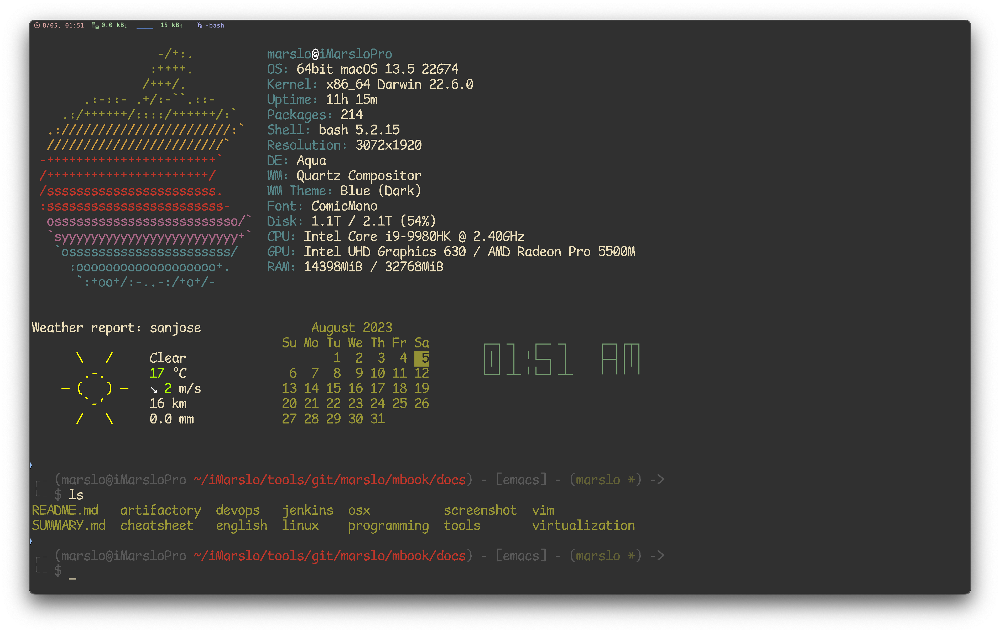

- [Solarized](https://ethanschoonover.com/solarized/)

  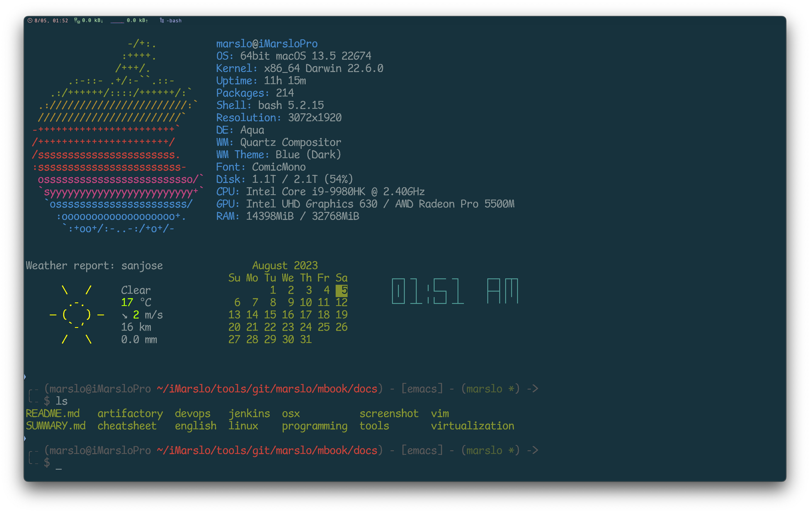

- [Ciapre](https://vscodethemes.com/e/konart.ciapre/ciapre)

  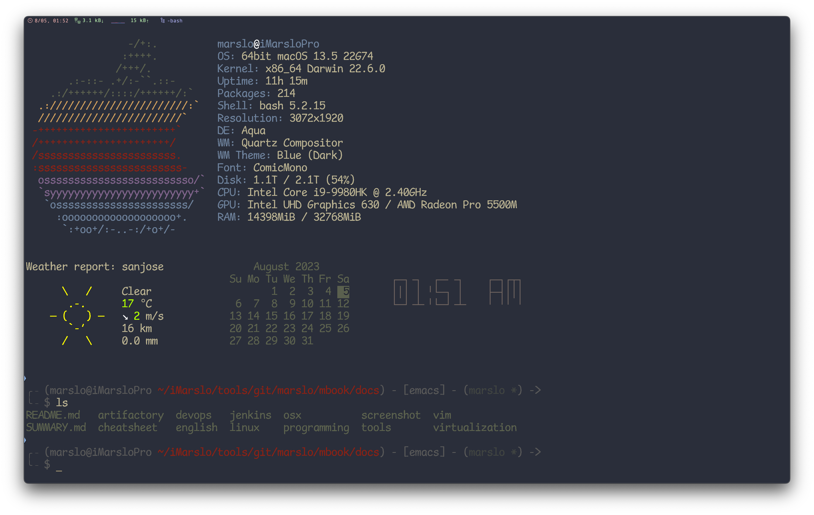
  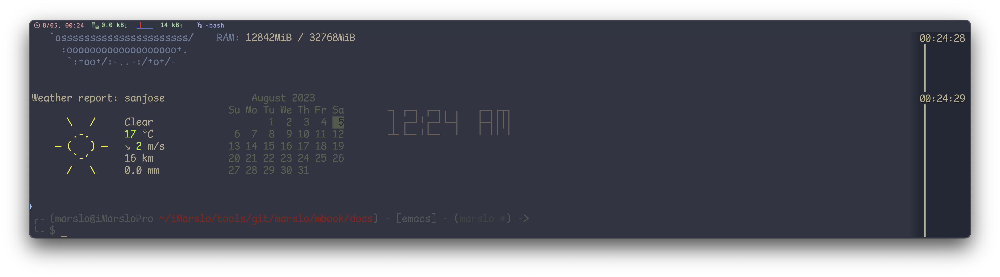

- [Hivacruz](https://theme.typora.io/fork/Hivacruz/)

  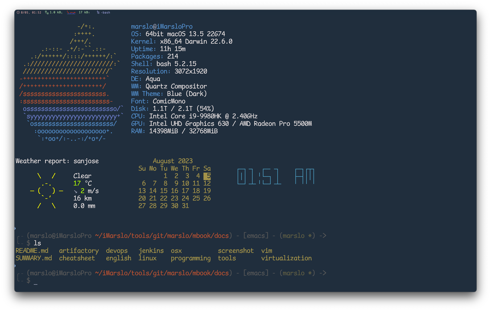
  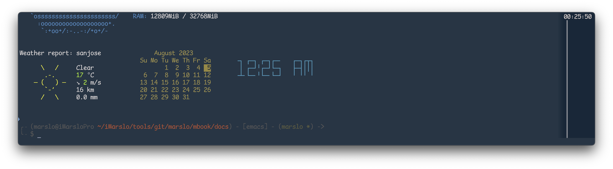

- Ryuuko

  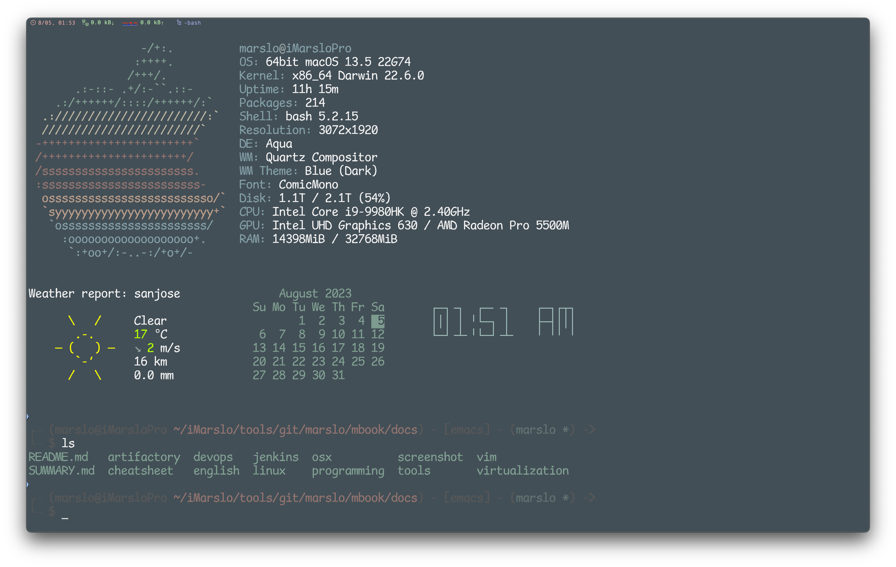

- [Relaxed](https://github.com/Relaxed-Theme/relaxed-terminal-themes)

  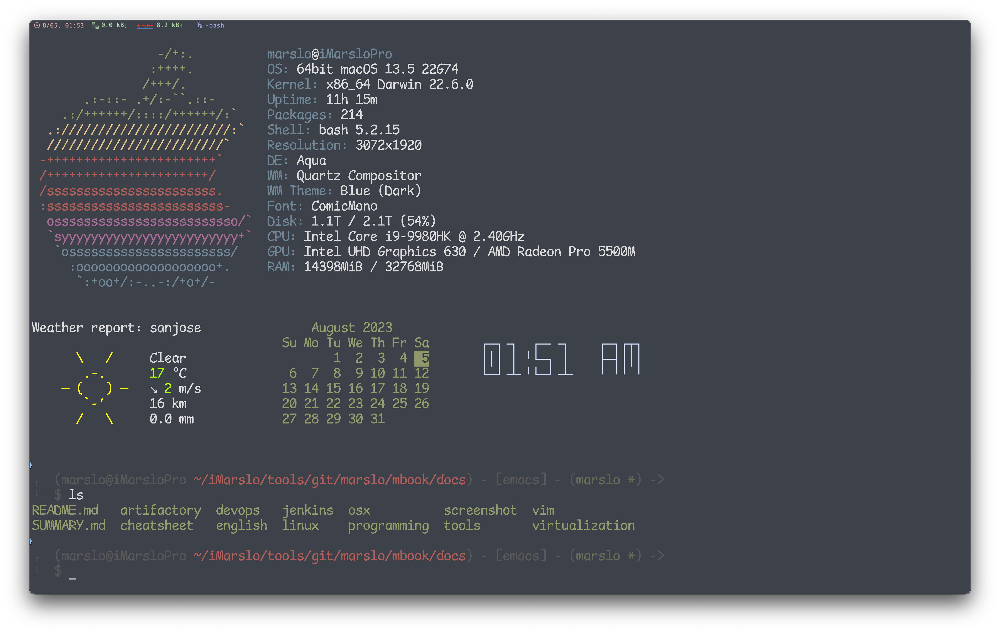

- SeaShells

  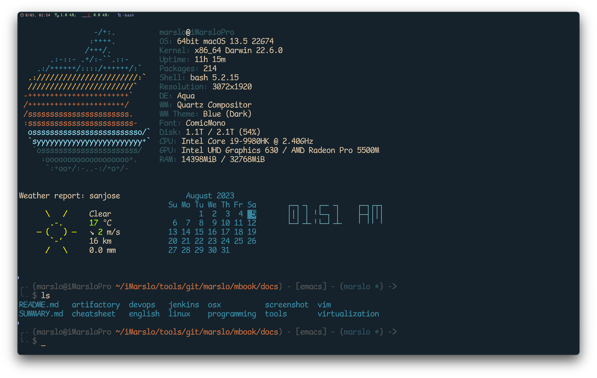

- Seafoam Pastel

  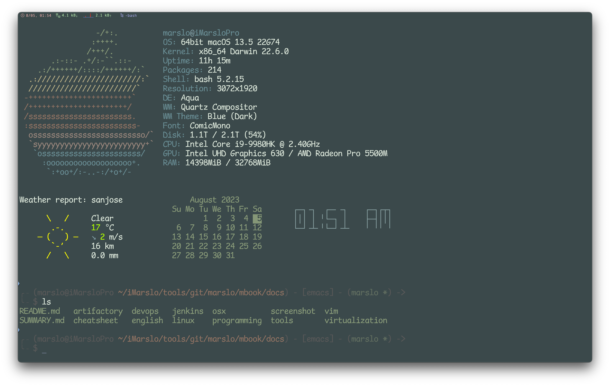

- N0tch2k

  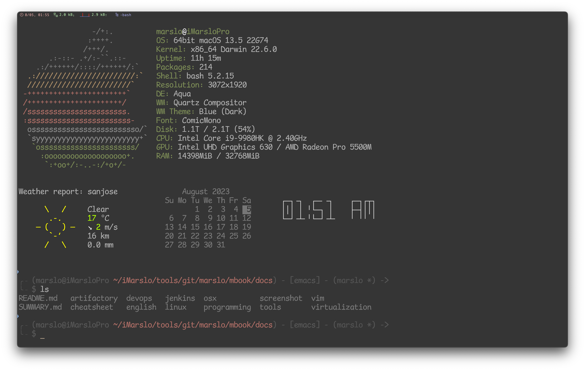

- [Parasio Dark](https://github.com/idleberg/Paraiso.tmTheme)

  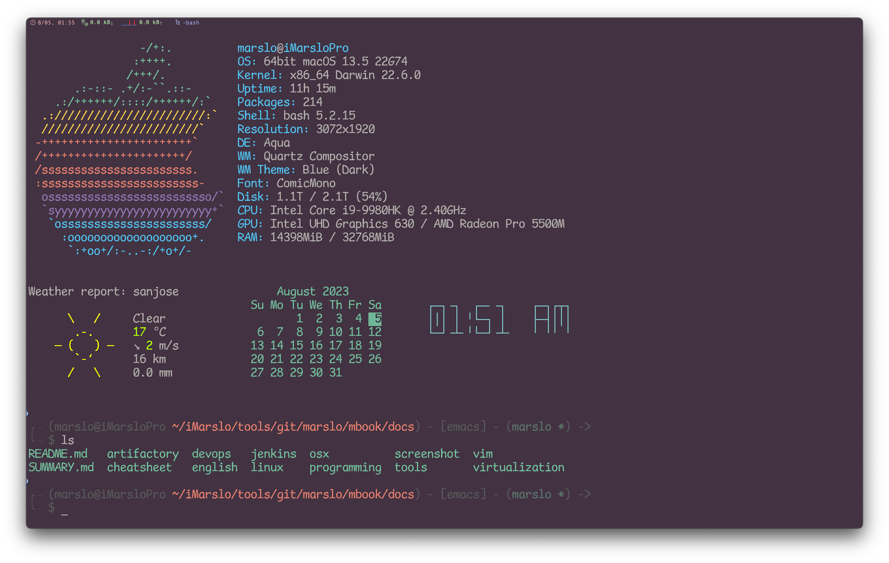

- [Red Planet](https://github.com/eliquious/Red-Planet-Theme)

  

- SoftServer

  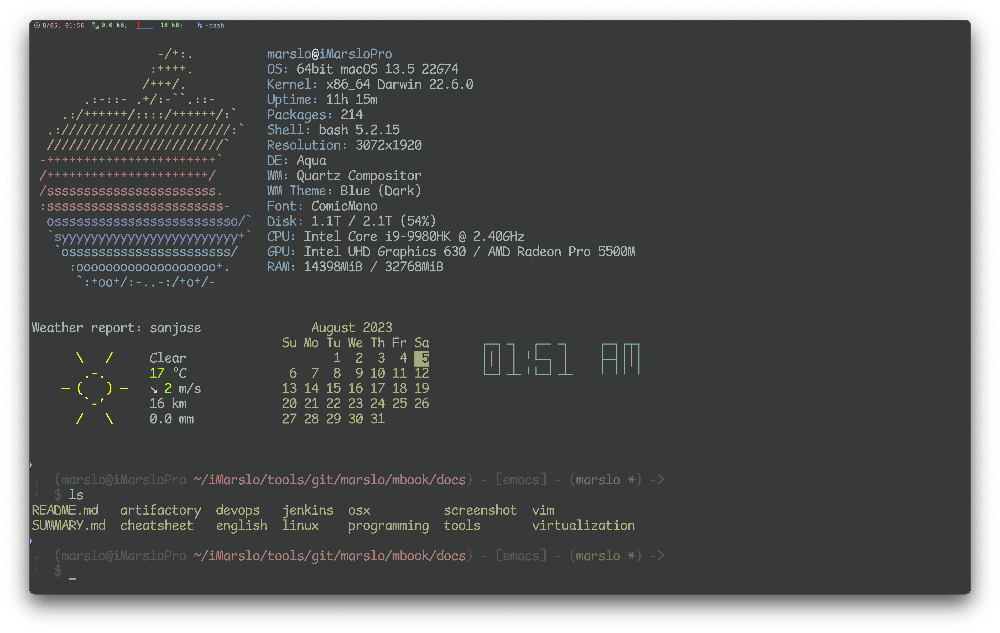

- Neutron

  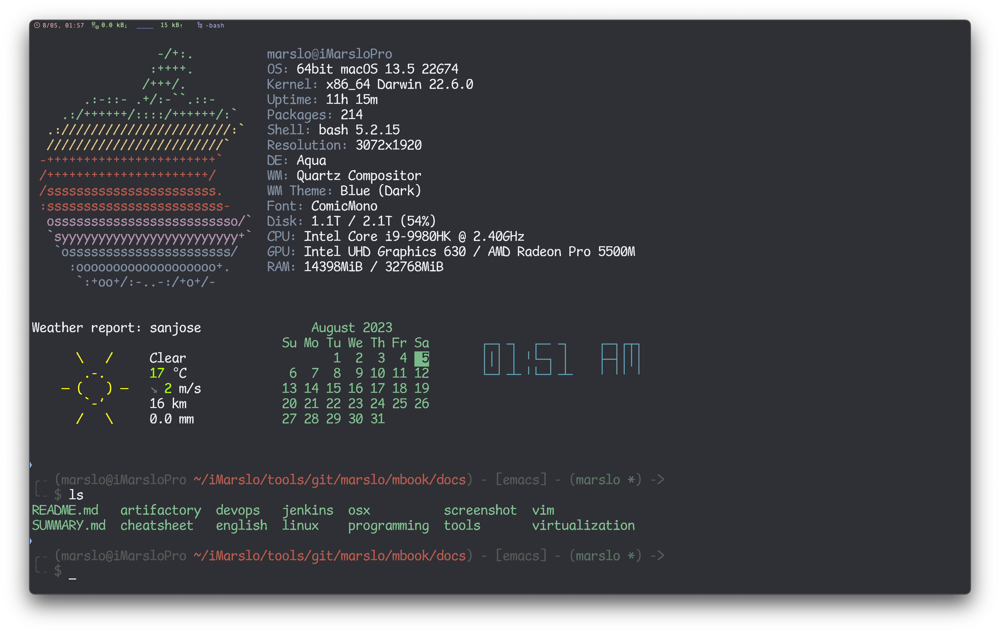

- Blazer

  

- Chester

  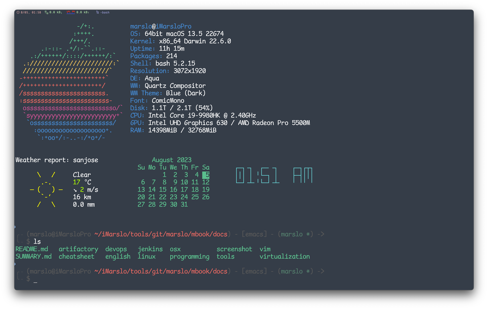

- [Mirage](https://github.com/robin-pfeiffer/ohmyzsh-mirage-theme)

  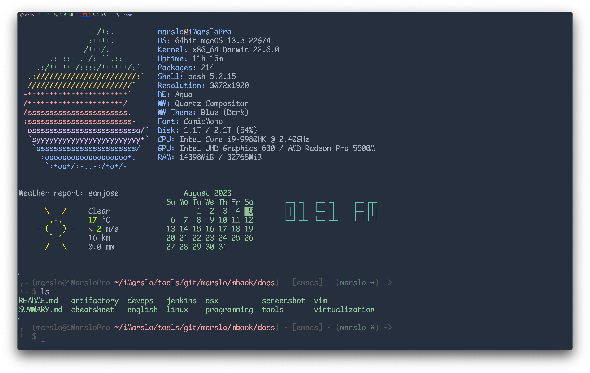

- Jubi

  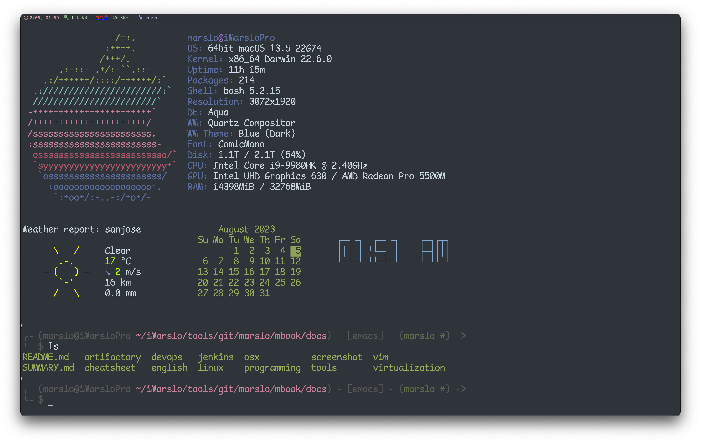
