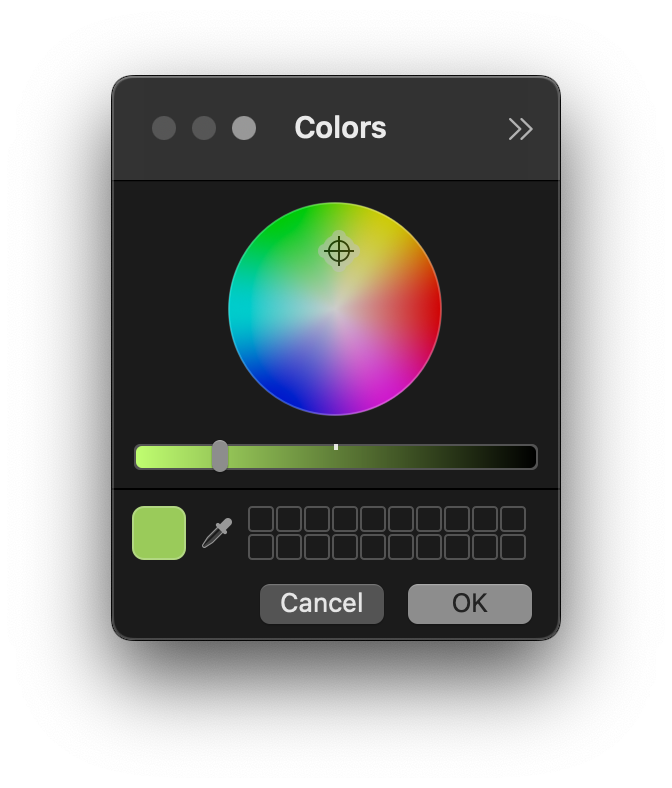
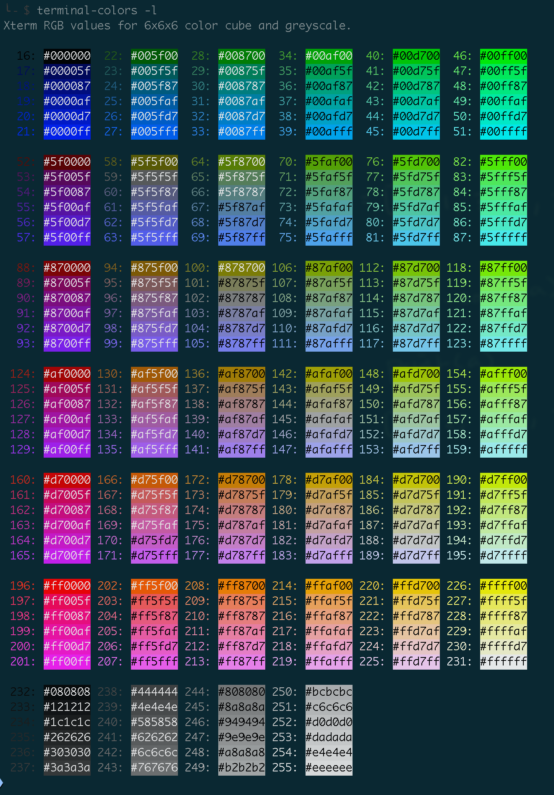

<!-- START doctoc generated TOC please keep comment here to allow auto update -->
<!-- DON'T EDIT THIS SECTION, INSTEAD RE-RUN doctoc TO UPDATE -->
**Table of Contents**  *generated with [DocToc](https://github.com/thlorenz/doctoc)*

- [shadowsocks service](#shadowsocks-service)
  - [CentOS](#centos)
- [copy artical content from csdn](#copy-artical-content-from-csdn)
- [color picker](#color-picker)
  - [iterm2-tab-set](#iterm2-tab-set)
  - [terminal-colors](#terminal-colors)

<!-- END doctoc generated TOC please keep comment here to allow auto update -->


## [shadowsocks service](https://github.com/shadowsocks/shadowsocks/tree/master)

### CentOS
#### basic environment
```bash
$ sudo yum install python-setuptools && sudo easy_install pip
$ sudo yum install epel-release
$ sudo yum install libsodium            # for aes-256-gcm
$ sudo yum -y groupinstall "Development Tools"
$ sudo yum -y install python3-pip       # optional
$ sudo -H python3 -m pip install --upgrade pip
```

#### git
```bash
$ sudo bash -c "cat > /etc/yum.repos.d/wandisco-git.repo" << EOF
[wandisco-git]
name=Wandisco GIT Repository
baseurl=http://opensource.wandisco.com/centos/7/git/\$basearch/
enabled=1
gpgcheck=1
gpgkey=http://opensource.wandisco.com/RPM-GPG-KEY-WANdisco
EOF

$ sudo rpm --import http://opensource.wandisco.com/RPM-GPG-KEY-WANdisco
$ sudo yum install -y git
```

- or [nhahv/install_git2.x_on_centos.md](https://gist.github.com/nhahv/7077a638b57f7d91ebe9a3c6caebbe4f)
  ```bash
  $ sudo yum install http://opensource.wandisco.com/centos/6/git/x86_64/wandisco-git-release-6-1.noarch.rpm
  $ sudo yum install -y git
  ```

## copy artical content from csdn
1. download html to local
1. [remove auto-switch to homepage function in html](https://blog.csdn.net/danshiming/article/details/124651989)
  ```html
  <div style="display:none;">
    
  </div>
  ```
  - or
    ```html
    <div style="display:none;">
      
    </div>
    ```
1. remove all `*.js` ( and might be all `*.css` )
1. [open the html in MS Word](https://blog.csdn.net/xue0zhi1qiang3/article/details/103865926)

bingo!

## color picker


> references:
> - [* imarslo : colors](../../linux/util/colors.html)
> - [The 5 Best Color Picker Apps for Mac](https://www.makeuseof.com/tag/color-picker-apps-mac/)
> - [256 Colors Cheat Sheet](https://www.ditig.com/256-colors-cheat-sheet)


### [iterm2-tab-set](https://www.npmjs.com/package/iterm2-tab-set)
- installation
  ```bash
  $ npm i iterm2-tab-set
  ```
- usage
  ```bash
  $ tabset --pick
  ```

  

  ```bash
  function cpick ()
  {
    if test tabset; then
      rgb=$(tabset -p | sed -nr "s:.*rgb\(([^)]+)\).*$:\1:p");
      hexc=$(for c in $(echo "${rgb}" | sed -re 's:,: :g'); do printf '%02x' "$c"; done);
      echo -e """\t$rgb ~~> $hexc""";
    fi
  }
  ```

  - result
    ```bash
    $ cpick
      125,199,53 ~~> 7dc735
    ```

### [terminal-colors](https://pypi.org/project/terminal-colors/)
- install
  ```bash
  $ python3 -m pip install terminal-colors
  ```

- usage
  ```bash
  $ terminal-colors -l
  ```

  

