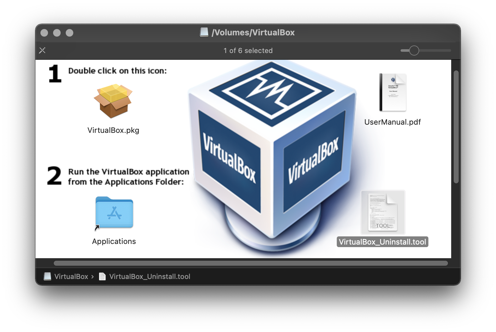

<!-- START doctoc generated TOC please keep comment here to allow auto update -->
<!-- DON'T EDIT THIS SECTION, INSTEAD RE-RUN doctoc TO UPDATE -->
**Table of Contents**  *generated with [DocToc](https://github.com/thlorenz/doctoc)*

- [install from commandline](#install-from-commandline)
- [uninstall](#uninstall)
- [install vms](#install-vms)
  - [Run Windows 10 on Mac with VirtualBox for Mac OS X](#run-windows-10-on-mac-with-virtualbox-for-mac-os-x)
- [vboxmanager](#vboxmanager)
  - [list](#list)
  - [run](#run)
  - [delete vms](#delete-vms)
- [troubleshooting](#troubleshooting)
  - [collect debug report](#collect-debug-report)
  - [Result Code: NS_ERROR_FAILURE (0x80004005)](#result-code-ns_error_failure-0x80004005)

<!-- END doctoc generated TOC please keep comment here to allow auto update -->

## install from commandline
```bash
$ hdiutil attach  VirtualBox-6.0.24-139119-OSX.dmg
$ sudo installer -pkg /Volumes/VirtualBox/VirtualBox.pkg -target /

# or
$ usr/bin/sudo -E -- /usr/bin/env LOGNAME=marslo USER=marslo USERNAME=marslo \
               /usr/sbin/installer -pkg /usr/local/Caskroom/virtualbox-beta/6.1.0_BETA2,134221/VirtualBox.pkg \
               -target / \
               -applyChoiceChangesXML /var/folders/s3/mg_f3cv54nn7y758j_t46zt40000gn/T/choices20201221-6005-wroatz.xml
```

## [uninstall](https://osxdaily.com/2019/01/25/uninstall-virtualbox-mac-completely/)
[VirtualBox_Uninstall.tool)](./VirtualBox_Uninstall.tool)



## install vms
### [Run Windows 10 on Mac with VirtualBox for Mac OS X](https://osxdaily.com/2015/03/25/install-run-windows-10-mac-virtualbox-os-x/)

## vboxmanager


setup `VboxManager` completion
```bash
$ git clone https://github.com/alexandregz/VBoxManage-completion.git \
      ~/.marslo/completion
$ cat >> ~/.marslo/.marslorc << EOF
[ -f ~/.marslo/completion/VBoxManage-completion.bash ] \
    && source ~/.marslo/completion/VBoxManage-completion.bash
EOF
```


### list
```bash
$ VBoxManage list vms
```

### run
```bash
$ VBoxManage startvm ubuntu --type gui
```

### delete vms
```bash
$ VBoxManage unregistervm --delete "Name of Virtual Machine"
```

## [troubleshooting](https://www.virtualbox.org/manual/ch12.html)
### collect debug report
```bash
$ VBoxBugReport
Oracle VM VirtualBox Bug Report Tool 6.1.16
(C) 2020 Oracle Corporation
All rights reserved.

  0% - collecting VBoxSVC.log...
 20% - collecting VBoxSVC.log.1...
 40% - collecting VirtualBox.xml...
 60% - collecting HostUsbDevices...
 80% - collecting HostUsbFilters...
100% - compressing...

Report was written to '2020-12-21-11-03-22-bugreport.tgz'
```

### [Result Code: NS_ERROR_FAILURE (0x80004005)](https://forums.virtualbox.org/viewtopic.php?f=39&t=98763&start=120)
- [test builds](https://www.virtualbox.org/wiki/Testbuilds)
  > disable [System Integrity Protection](https://developer.apple.com/library/archive/documentation/Security/Conceptual/System_Integrity_Protection_Guide/ConfiguringSystemIntegrityProtection/ConfiguringSystemIntegrityProtection.html) first

  - [macOS](https://www.virtualbox.org/download/testcase/VirtualBox-6.1.17-141968-OSX.dmg)
    ```bash
    $ csrutil status
    $ csrutil disable
    ```

- [solution](https://www.virtualbox.org/ticket/19795#comment:69)
  ```bash
  $ csrutil enable --without debug --without fs
  $ VBOX_KEXT_DESTINATION=/Library/Apple/System/Library/Extensions
  $ sudo cp -a "/Library/Application Support/VirtualBox/VBoxDrv.kext" "$VBOX_KEXT_DESTINATION"/VBoxDrv.kext
  $ sudo cp -a "/Library/Application Support/VirtualBox/VBoxNetFlt.kext" "$VBOX_KEXT_DESTINATION"/VBoxNetFlt.kext
  $ sudo cp -a "/Library/Application Support/VirtualBox/VBoxNetAdp.kext" "$VBOX_KEXT_DESTINATION"/VBoxNetAdp.kext
  $ sudo cp -a "/Library/Application Support/VirtualBox/VBoxUSB.kext" "$VBOX_KEXT_DESTINATION"/VBoxUSB.kext

  $ sudo kextload -b org.virtualbox.kext.VBoxDrv
  $ sudo kextload -b org.virtualbox.kext.VBoxNetFlt
  $ sudo kextload -b org.virtualbox.kext.VBoxNetAdp
  $ sudo kextload -b org.virtualbox.kext.VBoxUSB
  ```

  - [and](https://www.virtualbox.org/ticket/19795#comment:62)
    ```bash
    $ sudo kextload -b org.virtualbox.kext.VBoxDrv
    $ sudo kextload -b org.virtualbox.kext.VBoxNetFlt
    $ sudo kextload -b org.virtualbox.kext.VBoxNetAdp
    $ sudo kextload -b org.virtualbox.kext.VBoxUSB
    ```

#### other info
```bash
$ sudo kmutil showloaded | grep org.virtualbox
No variant specified, falling back to release
  196    3 0xffffff7fa2336000 0xb2000    0xb2000    org.virtualbox.kext.VBoxDrv (6.1.16) DAF044F0-5043-3B8E-8758-5A462567BDAA <8 6 5 3 1>
  197    0 0xffffff7fa2408000 0x2000     0x2000     org.virtualbox.kext.VBoxNetAdp (6.1.16) 76200407-D2F0-3D84-BCCF-7EEA18F16654 <196 6 5 1>
  199    0 0xffffff7fa2413000 0x5000     0x5000     org.virtualbox.kext.VBoxUSB (6.1.16) CA33FA52-5933-3F0E-9B40-8B1ECF4D6A36 <198 196 64 8 6 5 3 1>
  200    0 0xffffff7fa240e000 0x4000     0x4000     org.virtualbox.kext.VBoxNetFlt (6.1.16) C93EAF6A-676F-3370-BAE2-BDFD2BF16582 <196 8 6 5 3 1>

$ sudo kmutil load -b org.virtualbox.kext.VBoxDrv
$ sudo dmesg
```
