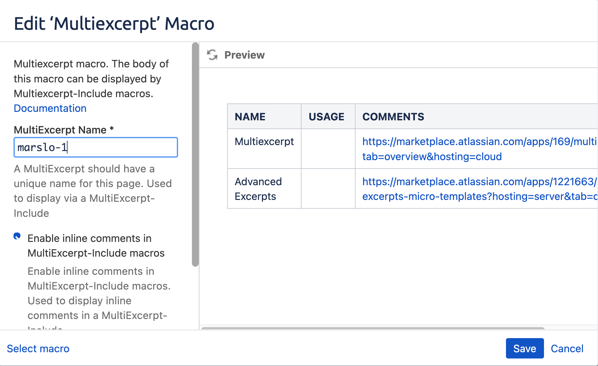
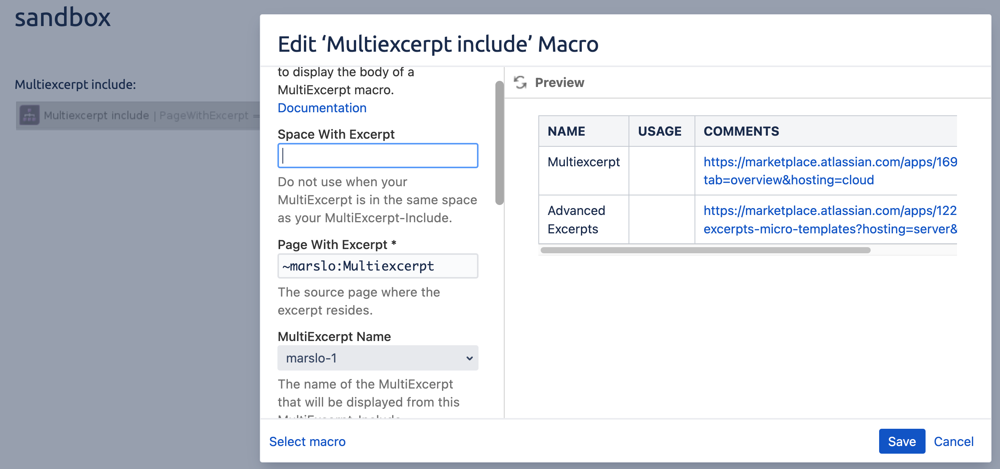
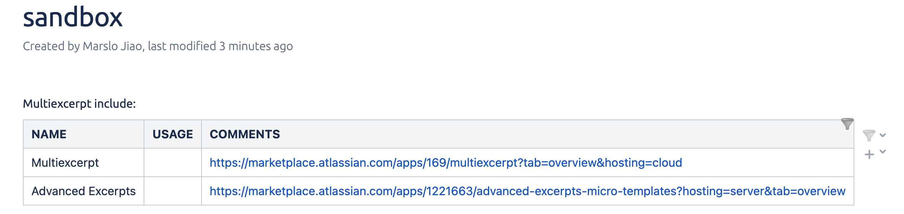

<!-- START doctoc generated TOC please keep comment here to allow auto update -->
<!-- DON'T EDIT THIS SECTION, INSTEAD RE-RUN doctoc TO UPDATE -->

- [jira](#jira)
  - [check fields](#check-fields)
  - [check attachment](#check-attachment)
  - [list all projects](#list-all-projects)
  - [search issue by JQL](#search-issue-by-jql)
  - [generate OAuth consumer](#generate-oauth-consumer)
  - [icons](#icons)
- [confluence](#confluence)
  - [get info](#get-info)
  - [publish to confluence](#publish-to-confluence)
  - [plugins](#plugins)

<!-- END doctoc generated TOC please keep comment here to allow auto update -->

> reference:
> - [* Confluence REST API examples](https://developer.atlassian.com/server/confluence/confluence-rest-api-examples/)
> - [* Jira REST API examples](https://developer.atlassian.com/server/jira/platform/jira-rest-api-examples/)
> - [Confluence Server REST API](https://developer.atlassian.com/server/confluence/confluence-server-rest-api/)
> - [./software/jira/docs/api/REST](https://docs.atlassian.com/software/jira/docs/api/REST/)
> - [JIRA Server platform REST API reference](https://docs.atlassian.com/software/jira/docs/api/REST/7.6.1/)
> - [Jenkins JIRA Pipeline Steps](https://jenkinsci.github.io/jira-steps-plugin/getting-started/)
>   - [Configuration](https://jenkinsci.github.io/jira-steps-plugin/getting-started/config/)
>     - [Authentication](https://jenkinsci.github.io/jira-steps-plugin/getting-started/config/authentication/)
>     - [Common Config](https://jenkinsci.github.io/jira-steps-plugin/getting-started/config/common/)
>     - [Jenkins Script](https://jenkinsci.github.io/jira-steps-plugin/getting-started/config/script/)
>     - [Configuration As Code Plugin](https://jenkinsci.github.io/jira-steps-plugin/getting-started/config/casc/)
>   - [Issue Steps](https://jenkinsci.github.io/jira-steps-plugin/steps/issue/)
>     - [jiraGetFields](https://jenkinsci.github.io/jira-steps-plugin/steps/issue/jira_get_fields/)
>     - [jiraGetIssue](https://jenkinsci.github.io/jira-steps-plugin/steps/issue/jira_get_issue/)
>     - [jiraEditIssue](https://jenkinsci.github.io/jira-steps-plugin/steps/issue/jira_edit_issue/)
>   - [Component Steps](https://jenkinsci.github.io/jira-steps-plugin/steps/component/)
>     - [jiraGetComponent](https://jenkinsci.github.io/jira-steps-plugin/steps/component/jira_get_component/)
>     - [jiraEditComponent](https://jenkinsci.github.io/jira-steps-plugin/steps/component/jira_edit_component/)
>     - [jiraGetComponentIssueCount](https://jenkinsci.github.io/jira-steps-plugin/steps/component/jira_get_component_issue_count/)
>   - [Comment Steps](https://jenkinsci.github.io/jira-steps-plugin/steps/comment/)
>     - [jiraGetComment](https://jenkinsci.github.io/jira-steps-plugin/steps/comment/jira_get_comment/)
>     - [jiraGetComments](https://jenkinsci.github.io/jira-steps-plugin/steps/comment/jira_get_comments/)
>     - [jiraAddComment](https://jenkinsci.github.io/jira-steps-plugin/steps/comment/jira_add_comment/)
>     - [jiraEditComment](https://jenkinsci.github.io/jira-steps-plugin/steps/comment/jira_edit_comment/)

## jira

```bash
$ jiraName='jira.sample.com'
$ jiraID='STORY-1'
```


> [!NOTE]
> - [Special headers](https://developer.atlassian.com/cloud/jira/platform/rest/v3/intro/#special-request-headers)
>   - `X-Atlassian-Token`
>   - `X-Force-Accept-Language`
>   - `X-AAccountId`

### check fields
```bash
$ curl -s \
       -k \
       -X GET https://${jiraName}/rest/api/2/issue/${jiraID} |
       jq --raw-output
```
### check attachment
- check attachment ID
  ```bash
  $ curl -s \
         -k \
         -X GET https://${jiraName}/rest/api/2/issue/${jiraID}?fields=attachment |
         jq --raw-output .fields.attachment[].id
  ```

- get attachments download url
  ```bash
  $ curl -s \
         -k \
         -X GET https://${jiraName}/rest/api/2/issue/${jiraID}?fields=attachment |
         jq --raw-output .fields.attachment[].content
  ```

  - download all attachments in Jira
    >    -I replace-str
    >           Replace occurrences of replace-str in the initial-arguments with names read from standard in-
    >           put.  Also, unquoted blanks do not terminate input items; instead the separator is  the  new-
    >           line character.  Implies -x and -L 1.

    ```bash
    $ curl -s \
           -k \
           -X GET https://${jiraName}/rest/api/2/issue/${jiraID}?fields=attachment |
           jq --raw-output .fields.attachment[].content |
           xargs -I '{}' curl -sgOJL '{}'
    ```

### list all projects
```bash
$ curl -fsSL -XGET https://jira.sample.com/rest/api/2/project |
  jq -r '.[] | [.key, .name] | join(" | ")' |
  column -s '|' -t
```

### search issue by JQL

> [!TIP]
> - [Search for issues using JQL (GET)](https://developer.atlassian.com/cloud/jira/platform/rest/v3/api-group-issue-search/#api-rest-api-3-search-get)
> - [JQL: What is advanced search in Jira Cloud?](https://support.atlassian.com/jira-software-cloud/docs/what-is-advanced-search-in-jira-cloud/)
> - [How to get all issues by project key and issue type using REST api](https://community.developer.atlassian.com/t/how-to-get-all-issues-by-project-key-and-issue-type-using-rest-api/16074)
> - JQL pattern rule:
>   1. remove all space
>   2. `%3D` instead of `=`
>     - `project=abc` -> `project%3Dabc`
>   3. `%20CONDITION%20` instead of `CONDITION`
>     - `AND` -> `%20AND%20`
>     - `OR` -> `%20OR%20`

- format JQL

  > [!TIP]
  > - [* iMarslo: using jql to get URLEncodign](../cheatsheet/character/json.html#get-urlencode)

  ```bash
  $ jql="$(sed 's/ //g;s/AND/ AND /g;s/OR/ OR /g;s/IN/ IN /g;s/IS/ IS /g' <<< "${jql}")"
  $ jql="$(printf %s "${jql}" | jq -sRr @uri)"

  # i.e.:
  $ jql='project = abc AND issuetype = release'

  $ jql="$(sed 's/ //g;s/AND/ AND /g;s/OR/ OR /g;s/IN/ IN /g;s/IS/ IS /g' <<< "${jql}")"
  $ echo $jql
  project=abc AND issuetype=release

  $ jql="$(printf %s "${jql}" | jq -sRr @uri)"
  $ echo $jql
  project%3Dabc%20AND%20issuetype%3Drelease
  ```

- api

  > [!NOTE]
  > - [* iMarslo : bin/jira](https://github.com/marslo/dotfiles/blob/main/.marslo/bin/jira)
  > - [query parameters](https://developer.atlassian.com/cloud/jira/platform/rest/v3/api-group-issue-search/#api-rest-api-3-search-get):
  >   - `maxResults`: `integer`
  >   - `startAt`: `integer`
  >   - `validateQuery`: `string`
  >   - `fields`: `array<string>`
  >   - `expand`: `string`
  >   - `properties`: `array<string>`
  >   - `fieldsByKeys`: `boolean`
  >   - sample: `search?jql=${jql}&maxResults=100&startAt=0`

  ```bash
  $ curl --silent \
         --insecure \
         --globoff \
         --netrc-file ~/.netrc \
         -XGET \
         "https://jira.sample.com/rest/api/2/search?jql=${jql}" | jq -r ${jqOpt}

  # i.e.:
  $ curlOpt='--silent --insecure --globoff --netrc-file ~/.netrc'
  $ url='https://jira.sample.com/rest/api/2'
  $ queryParams="startAt=0&maxResults=10"
  $ jql='project = abc AND issuetype = release'          # copy from Jira website

  $ jql="$(sed 's/ //g;s/AND/ AND /g;s/OR/ OR /g;s/IN/ IN /g;s/IS/ IS /g' <<< "${jql}")"
  $ jql="$(printf %s "${jql}" | jq -sRr @uri)"

  $ curl "${curlOpt}" "${url}/search?jql=${jql}&${queryParams}" |
         jq -r '.issues[]' |
         jq -r '. | [.key, .fields.summary, .fields.status.name, .fields.issuetype.name, .fields.updated, .fields.created] | join("|")' |
         while IFS='|' read -r _key _summary _status _issuetype _updated _created; do
           echo "- [${_key}] - ${_summary}"
           echo "  -  status    : ${_status}"
           echo "  -  issuetype : ${_issuetype}"
           echo "  -  created   : ${_created}"
           echo "  -  updated   : ${_updated}"
         done
  ```

### [generate OAuth consumer](https://developer.atlassian.com/cloud/jira/platform/jira-rest-api-oauth-authentication/)
```bash
$ openssl genrsa -out jira_privatekey.pem 1024
$ openssl req -newkey rsa:1024 -x509 -key jira_privatekey.pem -out jira_publickey.cer -days 365
$ openssl pkcs8 -topk8 -nocrypt -in jira_privatekey.pem -out jira_privatekey.pcks8
$ openssl x509 -pubkey -noout -in jira_publickey.cer  > jira_publickey.pem
```

### icons
#### priority

> [!NOTE|label:references:]
> - [how do I view ALL icons for priority](https://community.atlassian.com/t5/Jira-questions/how-do-I-view-ALL-icons-for-priority/qaq-p/802188)
> - [AlexanderBartash/JIRA-Priority-Icons](https://github.com/AlexanderBartash/JIRA-Priority-Icons)
> - [DevOps Use case: Jira Jenkins Integration](https://medium.com/@shrut_terminator/devops-usecase-jira-jenkins-integration-4051413446a9)

```bash
$ for _i in "blocker.png" "blocker.svg" "critical.png" "critical.svg" "high.png" "high.svg" "highest.png" "highest.svg" "low.png" "low.svg" "lowest.png" "lowest.svg" "major.png" "major.svg" "medium.png" "medium.svg" "minor.png" "minor.svg" "trivial.png" "trivial.svg"; do
    echo "--> ${_i}"
    curl -O https://jira-trigger-plugin.atlassian.net/images/icons/priorities/${_i}
  done
```

## confluence
```bash
$ confluenceName='my.confluence.com'
$ pageID='143765713'
```
> get page id:
> 

### get info
```bash
$ curl -s -X GET https://${confluenceName}/rest/api/content/${pageID} | jq --raw-output
```
- get space
  ```bash
  $ curl -s -X GET https://${confluenceName}/rest/api/content/${pageID} | jq .space.key
  ```
- get title
  ```bash
  $ curl -s -X GET https://${confluenceName}/rest/api/content/${pageID} | jq .title
  ```
- get page history
  ```bash
  $ curl -s -X GET https://${confluenceName}/rest/api/content/${pageID} | jq .version.number
  ```

  - get next version
    ```bash
    currentVer=$(curl -s -X GET https://${confluenceName}/rest/api/content/${pageID} | jq .version.number)
    newVer=$((currentVer+1))
    ```

### publish to confluence
> [sample script](https://raw.githubusercontent.com/marslo/mytools/master/itool/confluencePublisher.sh)

```bash
$ url="https://${confluenceName}/rest/api/content/${pageID}"
$ page=$(curl -s ${url})
$ space=$(echo "${page}" | jq .space.key)
$ title=$(echo "${page}" | jq .title)
$ currentVer=$(echo "${page}" | jq .version.number)
$ newVer=$((currentVer+1))

$ cat > a.json << EOF
{
  "id": "${pageID}",
  "type": "page",
  "title": ${title},
  "space": {"key": ${space}},
  "body": {
    "storage": {
      "value": "<h1>Hi confluence</h1>",
      "representation": "storage"
    }
  },
  "version": {"number":${newVer}}
}
EOF

$ curl -s \
       -i \
       -X PUT \
       -H 'Content-Type: application/json' \
       --data "$(cat a.json)" \
       https://${confluenceName}/rest/api/content/${pageID}
```
- result
  


### plugins
#### [Multiexcerpt](https://marketplace.atlassian.com/apps/169/multiexcerpt?tab=overview&hosting=cloud)

- create excerpt
  

- include excerpt
  

- result
  
