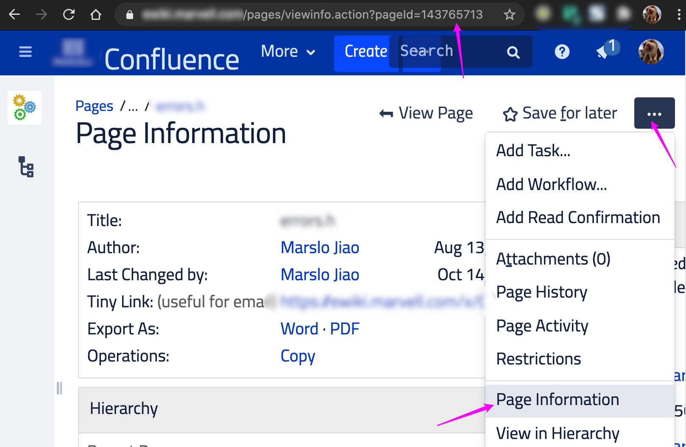

<!-- START doctoc generated TOC please keep comment here to allow auto update -->
<!-- DON'T EDIT THIS SECTION, INSTEAD RE-RUN doctoc TO UPDATE -->
**Table of Contents**  *generated with [DocToc](https://github.com/thlorenz/doctoc)*

- [jira](#jira)
  - [check fields](#check-fields)
  - [check attachment](#check-attachment)
- [confluence](#confluence)
  - [get info](#get-info)
  - [publish to confluence](#publish-to-confluence)

<!-- END doctoc generated TOC please keep comment here to allow auto update -->


> reference:
> - [Confluence REST API examples](https://developer.atlassian.com/server/confluence/confluence-rest-api-examples/)
> - [Jira REST API examples](https://developer.atlassian.com/server/jira/platform/jira-rest-api-examples/)
> - [JIRA Server platform REST API reference](https://docs.atlassian.com/software/jira/docs/api/REST/7.6.1/)

## jira
```bash
$ jiraName='my.jira.com'
$ jiraID='STORY-1'
```
### check fields
```bash
$ curl -s \
       -k \
       -X GET https://${jiraName}/rest/api/2/issue/${jiraID} \
       | jq --raw-output
```
### check attachment
- check attachment ID
  ```bash
  $ curl -s \
         -k \
         -X GET https://${jiraName}/rest/api/2/issue/${jiraID}?fields=attachment \
         | jq --raw-output .fields.attachment[].id
  ```

- get attachments download url
  ```bash
  $ curl -s \
         -k \
         -X GET https://${jiraName}/rest/api/2/issue/${jiraID}?fields=attachment \
         | jq --raw-output .fields.attachment[].content
  ```

  - download all attachments in Jira
    >    -I replace-str
    >           Replace occurrences of replace-str in the initial-arguments with names read from standard in-
    >           put.  Also, unquoted blanks do not terminate input items; instead the separator is  the  new-
    >           line character.  Implies -x and -L 1.

    ```bash
    $ curl -s \
           -k \
           -X GET https://${jiraName}/rest/api/2/issue/${jiraID}?fields=attachment \
           | jq --raw-output .fields.attachment[].content \
           | xargs -I '{}' curl -sgOJL '{}'
    ```

## confluence
```bash
$ confluenceName='my.confluence.com'
$ pageID='143765713'
```
> get page id:
> 

### get info
```bash
$ curl -s -X GET https://${confluenceName}/rest/api/content/${pageID} | jq --raw-output
```
- get space
  ```bash
  $ curl -s -X GET https://${confluenceName}/rest/api/content/${pageID} | jq .space.key
  ```
- get title
  ```bash
  $ curl -s -X GET https://${confluenceName}/rest/api/content/${pageID} | jq .title
  ```
- get page history
  ```bash
  $ curl -s -X GET https://${confluenceName}/rest/api/content/${pageID} | jq .version.number
  ```

  - get next version
    ```bash
    currentVer=$(curl -s -X GET https://${confluenceName}/rest/api/content/${pageID} | jq .version.number)
    newVer=$((currentVer+1))
    ```

### publish to confluence
> [sample script](https://raw.githubusercontent.com/marslo/mytools/master/itool/confluencePublisher.sh)

```bash
$ url="https://${confluenceName}/rest/api/content/${pageID}"
$ page=$(curl -s ${url})
$ space=$(echo "${page}" | jq .space.key)
$ title=$(echo "${page}" | jq .title)
$ currentVer=$(echo "${page}" | jq .version.number)
$ newVer=$((currentVer+1))

$ cat > a.json << EOF
{
  "id": "${pageID}",
  "type": "page",
  "title": ${title},
  "space": {"key": ${space}},
  "body": {
    "storage": {
      "value": "<h1>Hi confluence</h1>",
      "representation": "storage"
    }
  },
  "version": {"number":${newVer}}
}
EOF

$ curl -s \
       -i \
       -X PUT \
       -H 'Content-Type: application/json' \
       --data "$(cat a.json)" \
       https://${confluenceName}/rest/api/content/${pageID}
```
- result

