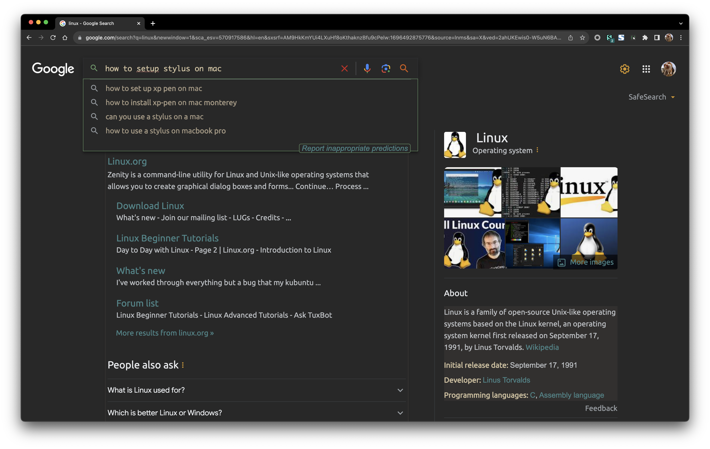
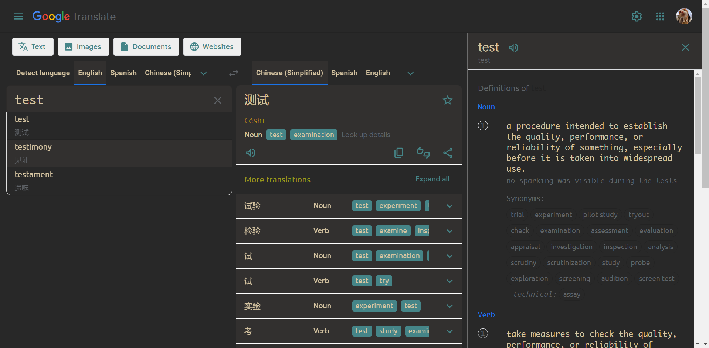
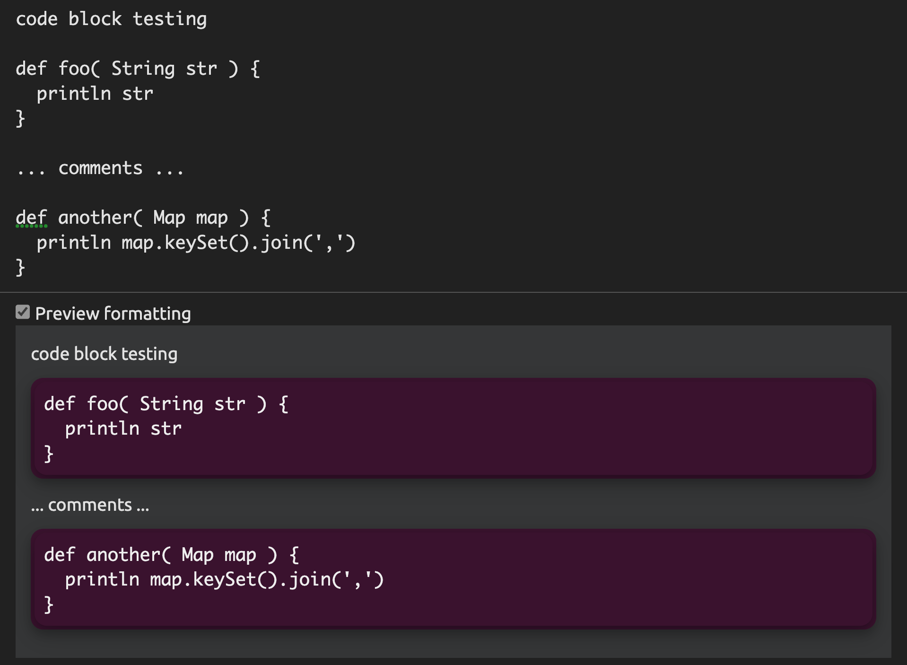
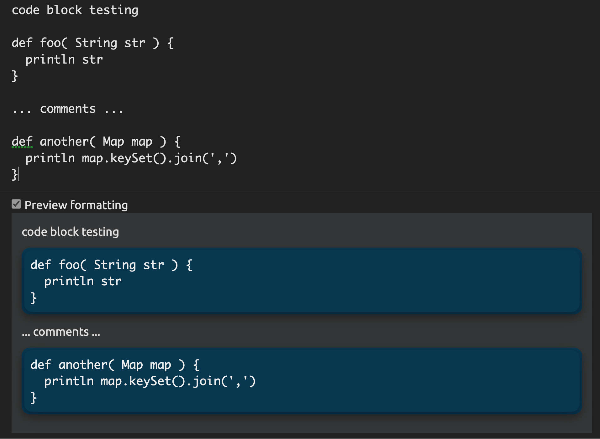
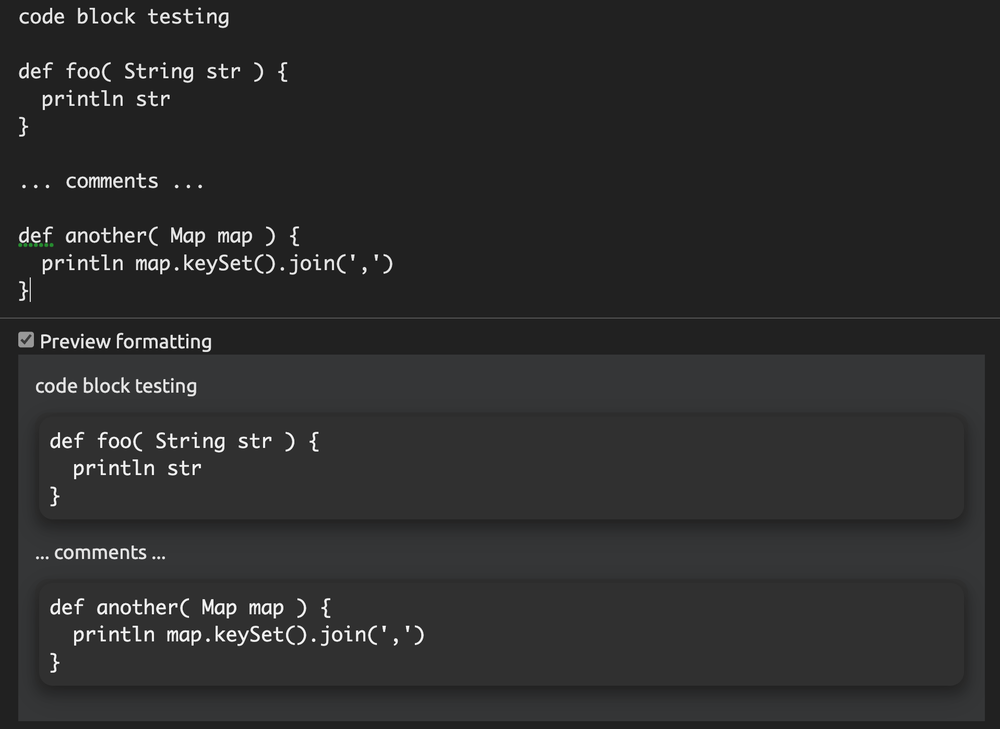
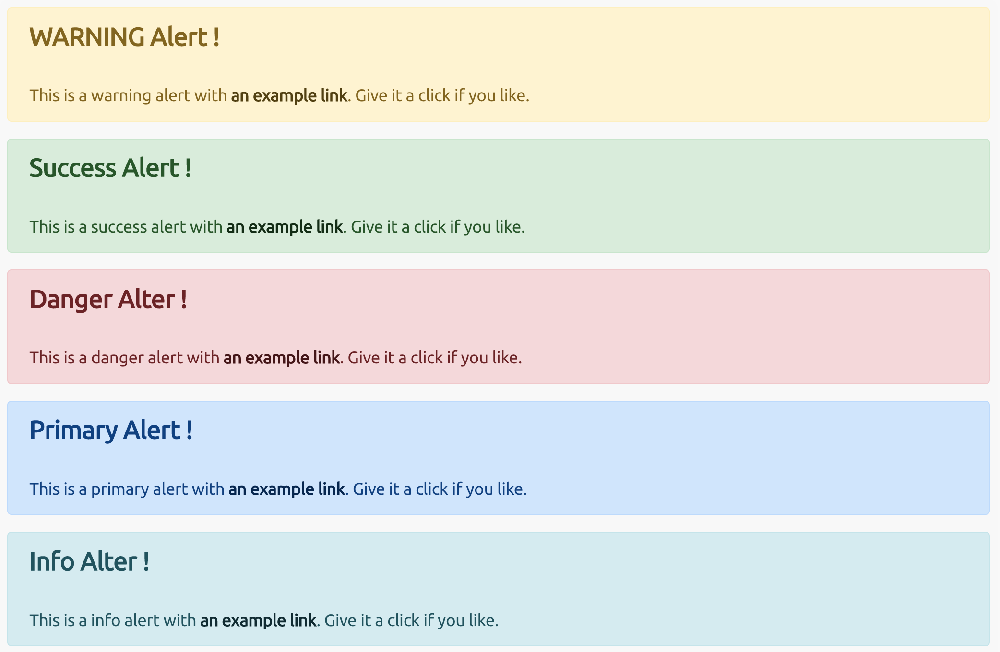
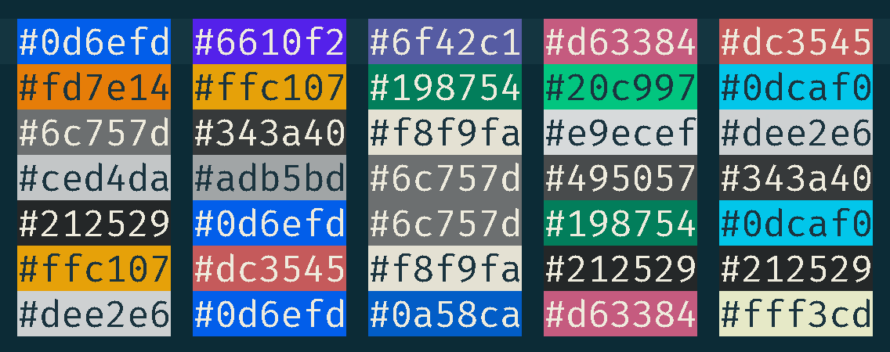

<!-- START doctoc generated TOC please keep comment here to allow auto update -->
<!-- DON'T EDIT THIS SECTION, INSTEAD RE-RUN doctoc TO UPDATE -->
**Table of Contents**  *generated with [DocToc](https://github.com/thlorenz/doctoc)*

- [stylus](#stylus)
- [bootstrap](#bootstrap)
  - [using boostrap sytles](#using-boostrap-sytles)
- [alert](#alert)
  - [bootstrap alert](#bootstrap-alert)
  - [callout](#callout)
- [kbd](#kbd)
- [font](#font)
- [selector](#selector)
  - [attribute selectors](#attribute-selectors)
  - [references](#references)

<!-- END doctoc generated TOC please keep comment here to allow auto update -->

> [!NOTE|label:references:]
> - [Buttons](https://uiverse.io/buttons)
>   - [hover me](https://uiverse.io/gharsh11032000/friendly-turkey-54)

## stylus

> [!TIP|label:references:]
> - [touhidulshawan/gruvbox-google](https://github.com/touhidulshawan/gruvbox-google)
> - [Factral/GoogleTranslateDarkTheme](https://github.com/Factral/GoogleTranslateDarkTheme/)
> - [Google Translate Dark Theme But better](https://userstyles.world/style/5215/google-translate-dark-theme-but-better)

- [google-gruvbox](https://github.com/marslo/google-gruvbox) | [google gruvbox](https://userstyles.world/style/12346/google-gruvbox)

  

  

- [font-ubuntu](https://github.com/marslo/font-ubuntu) | [marslo ( ubuntu )](https://userstyles.world/style/5264/marslo-ubuntu)

  - gerrit comments:

    

    

    

## bootstrap


> references:
> - [CSS: Cascading Style Sheets](https://developer.mozilla.org/en-US/docs/Web/CSS)
> - [bootstrap.min.css 4.x](https://cdn.jsdelivr.net/npm/bootstrap@4.3.1/dist/css/bootstrap.min.css)
> - [bootstrap.min.css 5.x](https://cdn.jsdelivr.net/npm/bootstrap@5.2.2/dist/css/bootstrap.min.css)
>   - [Bootstrap Alerts](https://www.tutorialrepublic.com/twitter-bootstrap-tutorial/bootstrap-alerts.php)
> - [docs.min.css](https://getbootstrap.com/docs/4.0/assets/css/docs.min.css)
> - [bootstrap components](https://getbootstrap.com/docs/4.0/components/alerts/)
> - [bootstrap utilities](https://getbootstrap.com/docs/4.0/utilities/borders/)
>   - [bootstrap colors](https://getbootstrap.com/docs/4.0/utilities/colors/)
> - [The Curious Case of the Slow Jenkins Job](https://marcesher.com/2017/06/27/the-curious-case-of-the-slow-jenkins-job/)
> - [Jekyll Doc Theme 6.0: Alert](https://idratherbewriting.com/documentation-theme-jekyll/mydoc_alerts.html)


### using boostrap sytles

> [!NOTE|style:callout]
> - bootstrap 4.x
>   ```html
>   <head>
>   <link href="https://getbootstrap.com/docs/4.0/assets/css/docs.min.css" rel="stylesheet" id="bootstrap-css">
>   <link href="https://maxcdn.bootstrapcdn.com/bootstrap/4.0.0/css/bootstrap.min.css" rel="stylesheet" id="bootstrap-css">
>   <script src="https://maxcdn.bootstrapcdn.com/bootstrap/4.0.0/js/bootstrap.min.js"></script>
>   <script src="https://cdnjs.cloudflare.com/ajax/libs/jquery/3.2.1/jquery.min.js"></script>
>   </head>
>   ```
>
> - [bootstap 5.x](https://www.tutorialrepublic.com/twitter-bootstrap-tutorial/bootstrap-get-started.php)
>   ```html
>   <head>
>       <meta charset="utf-8">
>       <meta name="viewport" content="width=device-width, initial-scale=1">
>       <!-- Bootstrap CSS -->
>       <link href="https://cdn.jsdelivr.net/npm/bootstrap@5.2.2/dist/css/bootstrap.min.css" rel="stylesheet" integrity="sha384-EVSTQN3/azprG1Anm3QDgpJLIm9Nao0Yz1ztcQTwFspd3yD65VohhpuuCOmLASjC" crossorigin="anonymous">
>   </head>
>   <body>
>       <!-- Bootstrap JS Bundle with Popper -->
>       <script src="https://cdn.jsdelivr.net/npm/bootstrap@5.0.2/dist/js/bootstrap.bundle.min.js" integrity="sha384-MrcW6ZMFYlzcLA8Nl+NtUVF0sA7MsXsP1UyJoMp4YLEuNSfAP+JcXn/tWtIaxVXM" crossorigin="anonymous"></script>
>   </body>
>   ```

- 4.x
  ```html
  <!doctype html>
  <html lang="en">
    <head>
      <!-- Required meta tags -->
      <meta charset="utf-8">
      <meta name="viewport" content="width=device-width, initial-scale=1, shrink-to-fit=no">

      <!-- Bootstrap CSS -->
      <link rel="stylesheet" href="https://cdn.jsdelivr.net/npm/bootstrap@4.0.0/dist/css/bootstrap.min.css" integrity="sha384-Gn5384xqQ1aoWXA+058RXPxPg6fy4IWvTNh0E263XmFcJlSAwiGgFAW/dAiS6JXm" crossorigin="anonymous">

      <title>Hello, world!</title>
    </head>
    <body>
      <h1>Hello, world!</h1>

      <!-- Optional JavaScript -->
      <!-- jQuery first, then Popper.js, then Bootstrap JS -->
      <script src="https://code.jquery.com/jquery-3.2.1.slim.min.js" integrity="sha384-KJ3o2DKtIkvYIK3UENzmM7KCkRr/rE9/Qpg6aAZGJwFDMVNA/GpGFF93hXpG5KkN" crossorigin="anonymous"></script>
      <script src="https://cdn.jsdelivr.net/npm/popper.js@1.12.9/dist/umd/popper.min.js" integrity="sha384-ApNbgh9B+Y1QKtv3Rn7W3mgPxhU9K/ScQsAP7hUibX39j7fakFPskvXusvfa0b4Q" crossorigin="anonymous"></script>
      <script src="https://cdn.jsdelivr.net/npm/bootstrap@4.0.0/dist/js/bootstrap.min.js" integrity="sha384-JZR6Spejh4U02d8jOt6vLEHfe/JQGiRRSQQxSfFWpi1MquVdAyjUar5+76PVCmYl" crossorigin="anonymous"></script>
    </body>
  </html>
  ```

- 5.x
  ```html
  <!DOCTYPE html>
  <html lang="en">
  <head>
      <meta charset="utf-8">
      <meta name="viewport" content="width=device-width, initial-scale=1">
      <title>original bootstrap 5.x alert</title>
      <!-- Bootstrap CSS -->
      <link href="https://cdn.jsdelivr.net/npm/bootstrap@5.0.2/dist/css/bootstrap.min.css" rel="stylesheet" integrity="sha384-EVSTQN3/azprG1Anm3QDgpJLIm9Nao0Yz1ztcQTwFspd3yD65VohhpuuCOmLASjC" crossorigin="anonymous">
  </head>
  <body>
      <h1>Hello, world!</h1>
      <!-- Bootstrap JS Bundle with Popper -->
      <script src="https://cdn.jsdelivr.net/npm/bootstrap@5.0.2/dist/js/bootstrap.bundle.min.js" integrity="sha384-MrcW6ZMFYlzcLA8Nl+NtUVF0sA7MsXsP1UyJoMp4YLEuNSfAP+JcXn/tWtIaxVXM" crossorigin="anonymous"></script>
  </body>
  </html>
  ```


## alert


> references:
> - [The Curious Case of the Slow Jenkins Job](https://marcesher.com/2017/06/27/the-curious-case-of-the-slow-jenkins-job/)
> - [Jekyll Doc Theme 6.0: Alert](https://idratherbewriting.com/documentation-theme-jekyll/mydoc_alerts.html)



### bootstrap alert

- bootstrap alert 4.x
  

- bootstrap alert 5.x
  

<!--sec data-title="bootstrap-alert 5.x" data-id="section0" data-show=true data-collapse=true ces-->
> ```css
> .alert{ --bs-alert-bg:transparent;--bs-alert-padding-x:1rem;--bs-alert-padding-y:1rem;--bs-alert-margin-bottom:1rem;--bs-alert-color:inherit;--bs-alert-border-color:transparent;--bs-alert-border:1px solid var(--bs-alert-border-color);--bs-alert-border-radius:0.375rem;position:relative;padding:var(--bs-alert-padding-y) var(--bs-alert-padding-x);margin-bottom:var(--bs-alert-margin-bottom);color:var(--bs-alert-color);background-color:var(--bs-alert-bg);border:var(--bs-alert-border);border-radius:var(--bs-alert-border-radius) }
> .alert-heading{ color:inherit }
> .alert-link{ font-weight:700 }
>
> .fade{ transition:opacity .15s linear }
> .fade:not(.show){ opacity:0 }
>
> .btn-close{ box-sizing:content-box;width:1em;height:1em;padding:.25em .25em;color:#000;background:transparent url("data:image/svg+xml,%3csvg xmlns='http://www.w3.org/2000/svg' viewBox='0 0 16 16' fill='%23000'%3e%3cpath d='M.293.293a1 1 0 0 1 1.414 0L8 6.586 14.293.293a1 1 0 1 1 1.414 1.414L9.414 8l6.293 6.293a1 1 0 0 1-1.414 1.414L8 9.414l-6.293 6.293a1 1 0 0 1-1.414-1.414L6.586 8 .293 1.707a1 1 0 0 1 0-1.414z'/%3e%3c/svg%3e") center/1em auto no-repeat;border:0;border-radius:.375rem;opacity:.5 }
> .btn-close:hover{ color:#000;text-decoration:none;opacity:.75 }
> .btn-close:focus{ outline:0;box-shadow:0 0 0 .25rem rgba(13,110,253,.25);opacity:1 }
> .btn-close.disabled,.btn-close:disabled{ pointer-events:none;-webkit-user-select:none;-moz-user-select:none;user-select:none;opacity:.25 }
> .btn-close-white{ filter:invert(1) grayscale(100%) brightness(200%) }
>
> .alert-dismissible{ padding-right:3rem }
> .alert-dismissible .btn-close{ position:absolute;top:0;right:0;z-index:2;padding:1.25rem 1rem }
>
> .alert-primary{ --bs-alert-color:#084298;--bs-alert-bg:#cfe2ff;--bs-alert-border-color:#b6d4fe }
> .alert-primary .alert-link{ color:#06357a }
>
> .alert-secondary{ --bs-alert-color:#41464b;--bs-alert-bg:#e2e3e5;--bs-alert-border-color:#d3d6d8 }
> .alert-secondary .alert-link{ color:#34383c }
>
> .alert-success{ --bs-alert-color:#0f5132;--bs-alert-bg:#d1e7dd;--bs-alert-border-color:#badbcc }
> .alert-success .alert-link{ color:#0c4128 }
>
> .alert-info{ --bs-alert-color:#055160;--bs-alert-bg:#cff4fc;--bs-alert-border-color:#b6effb }
> .alert-info .alert-link{ color:#04414d }
>
> .alert-warning{ --bs-alert-color:#664d03;--bs-alert-bg:#fff3cd;--bs-alert-border-color:#ffecb5 }
> .alert-warning .alert-link{ color:#523e02 }
>
> .alert-danger{ --bs-alert-color:#842029;--bs-alert-bg:#f8d7da;--bs-alert-border-color:#f5c2c7 }
> .alert-danger .alert-link{ color:#6a1a21 }
>
> .alert-light{ --bs-alert-color:#636464;--bs-alert-bg:#fefefe;--bs-alert-border-color:#fdfdfe }
> .alert-light .alert-link{ color:#4f5050 }
>
> .alert-dark{ --bs-alert-color:#141619;--bs-alert-bg:#d3d3d4;--bs-alert-border-color:#bcbebf }
> .alert-dark .alert-link{ color:#101214 }
> ```
>
> - template
>   ```html
>   <div style="--bs-alert-bg:transparent;--bs-alert-padding-x:1rem;--bs-alert-padding-y:1rem;--bs-alert-margin-bottom:1rem;--bs-alert-color:inherit;--bs-alert-border-color:transparent;--bs-alert-border:1px solid var(--bs-alert-border-color);--bs-alert-border-radius:0.375rem;position:relative;padding:var(--bs-alert-padding-y) var(--bs-alert-padding-x);margin-bottom:var(--bs-alert-margin-bottom);color:var(--bs-alert-color);background-color:var(--bs-alert-bg);border:var(--bs-alert-border);border-radius:var(--bs-alert-border-radius); padding-right:3rem;">
>     <h4 style="color:inherit; margin-top:0;margin-bottom:.5rem;font-weight:500;line-height:1.2">X Alert !</h4>
>     This is a x alert with <a href="#" style="font-weight:700">an example link</a>. Give it a click if you like.
>   </div>
>   ```
<!--endsec-->


<!--sec data-title="bootstrap 5.x :root" data-id="section1" data-show=true data-collapse=true ces-->



> ```css
> :root{
>   --bs-blue:#0d6efd;
>   --bs-indigo:#6610f2;
>   --bs-purple:#6f42c1;
>   --bs-pink:#d63384;
>   --bs-red:#dc3545;
>   --bs-orange:#fd7e14;
>   --bs-yellow:#ffc107;
>   --bs-green:#198754;
>   --bs-teal:#20c997;
>   --bs-cyan:#0dcaf0;
>   --bs-black:#000;
>   --bs-white:#fff;
>   --bs-gray:#6c757d;
>   --bs-gray-dark:#343a40;
>   --bs-gray-100:#f8f9fa;
>   --bs-gray-200:#e9ecef;
>   --bs-gray-300:#dee2e6;
>   --bs-gray-400:#ced4da;
>   --bs-gray-500:#adb5bd;
>   --bs-gray-600:#6c757d;
>   --bs-gray-700:#495057;
>   --bs-gray-800:#343a40;
>   --bs-gray-900:#212529;
>   --bs-primary:#0d6efd;
>   --bs-secondary:#6c757d;
>   --bs-success:#198754;
>   --bs-info:#0dcaf0;
>   --bs-warning:#ffc107;
>   --bs-danger:#dc3545;
>   --bs-light:#f8f9fa;
>   --bs-dark:#212529;
>   --bs-primary-rgb:13,110,253;
>   --bs-secondary-rgb:108,117,125;
>   --bs-success-rgb:25,135,84;
>   --bs-info-rgb:13,202,240;
>   --bs-warning-rgb:255,193,7;
>   --bs-danger-rgb:220,53,69;
>   --bs-light-rgb:248,249,250;
>   --bs-dark-rgb:33,37,41;
>   --bs-white-rgb:255,255,255;
>   --bs-black-rgb:0,0,0;
>   --bs-body-color-rgb:33,37,41;
>   --bs-body-bg-rgb:255,255,255;
>   --bs-font-sans-serif:system-ui,-apple-system,"Segoe UI",Roboto,"Helvetica Neue","Noto Sans","Liberation Sans",Arial,sans-serif,"Apple Color Emoji","Segoe UI Emoji","Segoe UI Symbol","Noto Color Emoji";
>   --bs-font-monospace:SFMono-Regular,Menlo,Monaco,Consolas,"Liberation Mono","Courier New",monospace;
>   --bs-gradient:linear-gradient(180deg, rgba(255, 255, 255, 0.15), rgba(255, 255, 255, 0));
>   --bs-body-font-family:var(--bs-font-sans-serif);
>   --bs-body-font-size:1rem;
>   --bs-body-font-weight:400;
>   --bs-body-line-height:1.5;
>   --bs-body-color:#212529;
>   --bs-body-bg:#fff;
>   --bs-border-width:1px;
>   --bs-border-style:solid;
>   --bs-border-color:#dee2e6;
>   --bs-border-color-translucent:rgba(0, 0, 0, 0.175);
>   --bs-border-radius:0.375rem;
>   --bs-border-radius-sm:0.25rem;
>   --bs-border-radius-lg:0.5rem;
>   --bs-border-radius-xl:1rem;
>   --bs-border-radius-2xl:2rem;
>   --bs-border-radius-pill:50rem;
>   --bs-link-color:#0d6efd;
>   --bs-link-hover-color:#0a58ca;
>   --bs-code-color:#d63384;
>   --bs-highlight-bg:#fff3cd
> }
> ```
<!--endsec-->


<!--sec data-title="bootstrap-alert 4.x" data-id="section2" data-show=true data-collapse=true ces-->
> ```css
> .alert{ position:relative; padding:.75rem 1.25rem; margin-bottom:1rem; border:1px solid transparent; border-radius:.25rem }
> .alert-heading{ color:inherit }
> .alert-link{ font-weight:700 }
>
> .alert-dismissible{ padding-right:4rem }
> .alert-dismissible .close{ position:absolute; top:0; right:0; padding:.75rem 1.25rem; color:inherit }
>
> .alert-primary{ color:#004085; background-color:#cce5ff; border-color:#b8daff }
> .alert-primary hr{ border-top-color:#9fcdff }
> .alert-primary .alert-link{ color:#002752 }
>
> .alert-secondary{ color:#383d41; background-color:#e2e3e5; border-color:#d6d8db }
> .alert-secondary hr{ border-top-color:#c8cbcf }
> .alert-secondary .alert-link{ color:#202326 }
>
> .alert-success{ color:#155724; background-color:#d4edda; border-color:#c3e6cb }
> .alert-success hr{ border-top-color:#b1dfbb }
> .alert-success .alert-link{ color:#0b2e13 }
>
> .alert-info{ color:#0c5460; background-color:#d1ecf1; border-color:#bee5eb }
> .alert-info hr{ border-top-color:#abdde5 }
> .alert-info .alert-link{ color:#062c33 }
>
> .alert-warning{ color:#856404; background-color:#fff3cd; border-color:#ffeeba }
> .alert-warning hr{ border-top-color:#ffe8a1 }
> .alert-warning .alert-link{ color:#533f03 }
>
> .alert-danger{ color:#721c24; background-color:#f8d7da; border-color:#f5c6cb }
> .alert-danger hr{ border-top-color:#f1b0b7 }
> .alert-danger .alert-link{ color:#491217 }
>
> .alert-light{ color:#818182; background-color:#fefefe; border-color:#fdfdfe }
> .alert-light hr{ border-top-color:#ececf6 }
> .alert-light .alert-link{ color:#686868 }
>
> .alert-dark{ color:#1b1e21; background-color:#d6d8d9; border-color:#c6c8ca }
> .alert-dark hr{ border-top-color:#b9bbbe }
> .alert-dark .alert-link{ color:#040505 }
> ```
>
> - template
>   ```html
>   <div style="position:relative; padding:.75rem 1.25rem; margin-bottom:1rem; border:1px solid transparent; border-radius:.25rem;">
>     <h4 style="color:inherit">X Alter !</h4>
>     This is a x alert with <a href="#" style="">an example link</a>. Give it a click if you like.
>   </div>
>   ```
<!--endsec-->

- warning
  - 5.x
    ```html
    <div style="--bs-alert-bg:transparent;--bs-alert-padding-x:1rem;--bs-alert-padding-y:1rem;--bs-alert-margin-bottom:1rem;--bs-alert-color:inherit;--bs-alert-border-color:transparent;--bs-alert-border:1px solid var(--bs-alert-border-color);--bs-alert-border-radius:0.375rem;position:relative;padding:var(--bs-alert-padding-y) var(--bs-alert-padding-x);margin-bottom:var(--bs-alert-margin-bottom);color:var(--bs-alert-color);background-color:var(--bs-alert-bg);border:var(--bs-alert-border);border-radius:var(--bs-alert-border-radius); padding-right:3rem; -bs-alert-color:#664d03;--bs-alert-bg:#fff3cd;--bs-alert-border-color:#ffecb5">
      <h4 style="color:inherit; margin-top:0;margin-bottom:.5rem;font-weight:500;line-height:1.2">Warning Alert !</h4>
      This is a warning alert with <a href="#" style="font-weight:700; color:#523e02">an example link</a>. Give it a click if you like.
    </div>
    ```
    - original
      ```html
      <div class="alert alert-warning alert-dismissible fade show">
        <h4 class="alert-heading">Warning Alert !</h4>
        This is a warning alert with <a href="#" class="alert-link">an example link</a>. Give it a click if you like.
      </div>
      ```

  - 4.x
    ```html
    <div style="position:relative; padding:.75rem 1.25rem; margin-bottom:1rem; border:1px solid transparent; border-radius:.25rem; color:#856404; background-color:#fff3cd; border-color:#ffeeba">
      <h4 style="font-size: 1.5rem; color:inherit">Warning Alert !</h4>
      This is a warning alert with <a href="#" style="color:#533f03">an example link</a>. Give it a click if you like.
    </div>

    <!-- 5.x colors -->
    <div style="position:relative; padding:1rem 1rem; margin-bottom:1rem; border:1px solid transparent; border-radius:.375rem; padding-right:3rem; color:#664d03; background-color:#fff3cd; border-color:#ffecb5">
      <h4 style="font-size: 1.5rem; color: #523e02; margin-top:0;margin-bottom:.5rem;font-weight:500;line-height:1.2">Warning Alert !</h4>
      This is a warning alert with <a href="#" style="font-weight:700; color:#523e02">an example link</a>. Give it a click if you like.
    </div>
    ```
    - original
      ```html
      <div class="alert alert-warning" role="alert">
        <h4 class="alert-heading">Warning Alert !</h4>
        This is a warning alert with <a href="#" class="alert-link">an example link</a>. Give it a click if you like.
      </div>
      ```

- success
  - 5.x
    ```html
    <div style="--bs-alert-bg:transparent;--bs-alert-padding-x:1rem;--bs-alert-padding-y:1rem;--bs-alert-margin-bottom:1rem;--bs-alert-color:inherit;--bs-alert-border-color:transparent;--bs-alert-border:1px solid var(--bs-alert-border-color);--bs-alert-border-radius:0.375rem;position:relative;padding:var(--bs-alert-padding-y) var(--bs-alert-padding-x);margin-bottom:var(--bs-alert-margin-bottom);color:var(--bs-alert-color);background-color:var(--bs-alert-bg);border:var(--bs-alert-border);border-radius:var(--bs-alert-border-radius); padding-right:3rem; --bs-alert-color:#0f5132;--bs-alert-bg:#d1e7dd;--bs-alert-border-color:#badbcc">
      <h4 style="color:inherit; margin-top:0;margin-bottom:.5rem;font-weight:500;line-height:1.2">Success Alert !</h4>
      This is a success alert with <a href="#" style="font-weight:700; color:#0c4128">an example link</a>. Give it a click if you like.
    </div>
    ```
    - original
      ```html
      <div class="alert alert-success alert-dismissible fade show">
        <h4 class="alert-heading">Success Alert !</h4>
        This is a success alert with <a href="#" class="alert-link">an example link</a>. Give it a click if you like.
      </div>
      ```

  - 4.x
    ```html
    <div style="position:relative; padding:.75rem 1.25rem; margin-bottom:1rem; border:1px solid transparent; border-radius:.25rem; color:#155724; background-color:#d4edda; border-color:#c3e6cb">
      <h4 style="color:inherit">Success Alert !</h4>
      This is a success alert with <a href="#" style="color:#0b2e13">an example link</a>. Give it a click if you like.
    </div>

    <!-- 5.x color -->
    <div style="position:relative; padding:1rem 1rem; margin-bottom:1rem; border:1px solid transparent; border-radius:.375rem; padding-right:3rem; color:#0f5132; background-color:#d1e7dd; border-color:#badbcc">
      <h4 style="font-size: 1.5rem; color: inherit; margin-top:0;margin-bottom:.5rem;font-weight:500;line-height:1.2">Success Alert !</h4>
      This is a success alert with <a href="#" style="font-weight:700; color:#0c4128">an example link</a>. Give it a click if you like.
    </div>
    ```

  - original
    ```html
    <div class="alert alert-success" role="alert">
      <h4 class="alert-heading">Success Alert !</h4>
      This is a success alert with <a href="#" class="alert-link">an example link</a>. Give it a click if you like.
    </div>
    ```

- danger
  - 5.x
    ```html
    <div style="--bs-alert-bg:transparent;--bs-alert-padding-x:1rem;--bs-alert-padding-y:1rem;--bs-alert-margin-bottom:1rem;--bs-alert-color:inherit;--bs-alert-border-color:transparent;--bs-alert-border:1px solid var(--bs-alert-border-color);--bs-alert-border-radius:0.375rem;position:relative;padding:var(--bs-alert-padding-y) var(--bs-alert-padding-x);margin-bottom:var(--bs-alert-margin-bottom);color:var(--bs-alert-color);background-color:var(--bs-alert-bg);border:var(--bs-alert-border);border-radius:var(--bs-alert-border-radius); padding-right:3rem; --bs-alert-color:#842029;--bs-alert-bg:#f8d7da;--bs-alert-border-color:#f5c2c7">
      <h4 style="color:inherit; margin-top:0;margin-bottom:.5rem;font-weight:500;line-height:1.2">Danger Alert !</h4>
      This is a danger alert with <a href="#" style="font-weight:700; color:#6a1a21">an example link</a>. Give it a click if you like.
    </div>
    ```
    - original
      ```html
      <div class="alert alert-danger alert-dismissible fade show">
        <h4 class="alert-heading">Danger Alert !</h4>
        This is a danger alert with <a href="#" class="alert-link">an example link</a>. Give it a click if you like.
      </div>
      ```

  - 4.x
    ```html
    <div style="position:relative; padding:.75rem 1.25rem; margin-bottom:1rem; border:1px solid transparent; border-radius:.25rem; color:#721c24; background-color:#f8d7da; border-color:#f5c6cb">
      <h4 style="font-size: 1.5rem; color:inherit">Danger Alter !</h4>
      This is a danger alert with <a href="#" style="color:#491217">an example link</a>. Give it a click if you like.
    </div>

    <!-- 5.x color -->
    <div style="position:relative; padding:1rem 1rem; margin-bottom:1rem; border:1px solid transparent; border-radius:.375rem; color:#842029; background-color:#f8d7da; border-color:#f5c2c7">
      <h4 style="font-size: 1.5rem; color:inherit; margin-top:0;margin-bottom:.5rem;font-weight:500;line-height:1.2">Danger Alert !</h4>
      This is a danger alert with <a href="#" style="font-weight:700; color:#6a1a21;">an example link</a>. Give it a click if you like.
    </div>
    ```
    - original
      ```html
      <div class="alert alert-danger" role="alert">
        <h4 class="alert-heading">Danger Alert !</h4>
        This is a danger alert with <a href="#" class="alert-link">an example link</a>. Give it a click if you like.
      </div>
      ```

- primary
  - 5.x
    ```html
    <div style="--bs-alert-bg:transparent;--bs-alert-padding-x:1rem;--bs-alert-padding-y:1rem;--bs-alert-margin-bottom:1rem;--bs-alert-color:inherit;--bs-alert-border-color:transparent;--bs-alert-border:1px solid var(--bs-alert-border-color);--bs-alert-border-radius:0.375rem;position:relative;padding:var(--bs-alert-padding-y) var(--bs-alert-padding-x);margin-bottom:var(--bs-alert-margin-bottom);color:var(--bs-alert-color);background-color:var(--bs-alert-bg);border:var(--bs-alert-border);border-radius:var(--bs-alert-border-radius); padding-right:3rem; --bs-alert-color:#084298;--bs-alert-bg:#cfe2ff;--bs-alert-border-color:#b6d4fe">
      <h4 style="color:inherit; margin-top:0;margin-bottom:.5rem;font-weight:500;line-height:1.2">Primary Alert !</h4>
      This is a primary alert with <a href="#" style="font-weight:700; color:#06357a">an example link</a>. Give it a click if you like.
    </div>
    ```
    - original
      ```html
      <div class="alert alert-primary alert-dismissible fade show">
        <h4 class="alert-heading">Primary Alert !</h4>
        This is a primary alert with <a href="#" class="alert-link">an example link</a>. Give it a click if you like.
      </div>
      ```

  - 4.x
    ```html
    <div style="position:relative; padding:.75rem 1.25rem; margin-bottom:1rem; border:1px solid transparent; border-radius:.25rem; color:#004085; background-color:#cce5ff; border-color:#b8daff">
      <h4 style="font-size: 1.5rem; color:inherit">Primary Alert !</h4>
      This is a primary alert with <a href="#" style="color:#002752">an example link</a>. Give it a click if you like.
    </div>

    <!-- 5.x color -->
    <div style="position:relative; padding:1rem 1rem; margin-bottom:1rem; border:1px solid transparent; border-radius:.375rem; padding-right:3rem; color:#084298; background-color:#cfe2ff; border-color:#b6d4fe">
      <h4 style="font-size: 1.5rem; color:inherit; margin-top:0;margin-bottom:.5rem;font-weight:500;line-height:1.2">Primary Alert !</h4>
      This is a primary alert with <a href="#" style="font-weight:700; color:#06357a">an example link</a>. Give it a click if you like.
    </div>
    ```
    - original
      ```html
      <div class="alert alert-primary" role="alert">
        <h4 class="alert-heading">Primary Alert !</h4>
        This is a primary alert with <a href="#" class="alert-link">an example link</a>. Give it a click if you like.
      </div>
      ```

- info
  - 5.x
    ```html
    <div style="--bs-alert-bg:transparent;--bs-alert-padding-x:1rem;--bs-alert-padding-y:1rem;--bs-alert-margin-bottom:1rem;--bs-alert-color:inherit;--bs-alert-border-color:transparent;--bs-alert-border:1px solid var(--bs-alert-border-color);--bs-alert-border-radius:0.375rem;position:relative;padding:var(--bs-alert-padding-y) var(--bs-alert-padding-x);margin-bottom:var(--bs-alert-margin-bottom);color:var(--bs-alert-color);background-color:var(--bs-alert-bg);border:var(--bs-alert-border);border-radius:var(--bs-alert-border-radius); padding-right:3rem; --bs-alert-color:#055160;--bs-alert-bg:#cff4fc;--bs-alert-border-color:#b6effb">
      <h4 style="color:inherit; margin-top:0;margin-bottom:.5rem;font-weight:500;line-height:1.2">Info Alert !</h4>
      This is a info alert with <a href="#" style="font-weight:700; color:#04414d">an example link</a>. Give it a click if you like.
    </div>
    ```
    - original
      ```html
      <div class="alert alert-info alert-dismissible fade show">
        <h4 class="alert-heading">Info Alert !</h4>
        This is a info alert with <a href="#" class="alert-link">an example link</a>. Give it a click if you like.
      </div>
      ```

  - 4.x
    ```html
    <div style="position:relative; padding:.75rem 1.25rem; margin-bottom:1rem; border:1px solid transparent; border-radius:.25rem; color:#0c5460;background-color:#d1ecf1;border-color:#bee5eb">
      <h4 style="font-size: 1.5rem; color:inherit">Info Alter !</h4>
      This is a info alert with <a href="#" style="color:#062c33">an example link</a>. Give it a click if you like.
    </div>

    <!-- 4.x style 5.x color -->
    <div style="position:relative; padding:1rem 1rem; margin-bottom:1rem; border:1px solid transparent; border-radius:.375rem; padding-right:3rem; color:#055160; background-color:#cff4fc; border-color:#b6effb">
      <h4 style="font-size: 1.5rem; color:inherit; margin-top:0;margin-bottom:.5rem;font-weight:500;line-height:1.2">Info Alert !</h4>
      This is a info alert with <a href="#" style="font-weight:700; color:#04414d">an example link</a>. Give it a click if you like.
    </div>
    ```
    - original
      ```html
      <div class="alert alert-info" role="alert">
        <h4 class="alert-heading">Info Alert !</h4>
        This is a info alert with <a href="#" class="alert-link">an example link</a>. Give it a click if you like.
      </div>
      ```


### callout


> references:
> - ["Bootstrap Calllouts"](https://bootsnipp.com/snippets/yNK5E)
> - [Bootstrap Callouts](https://codepen.io/superjaberwocky/pen/rLKxOa)
> - [mikeblum/callout.css](https://gist.github.com/mikeblum/aaffe654fc4f5a74c3b8b313fb43b2eb)
> - [docs.min.css](https://getbootstrap.com/docs/4.0/assets/css/docs.min.css)
> - [Callouts](https://rdmd.readme.io/docs/callouts)
> - [How TO - Callout Message](https://www.w3schools.com/HOWTO/howto_js_callout.asp)



- callout
  

<!--sec data-title="callout css" data-id="section3" data-show=true data-collapse=true ces-->
> ```css
> .bd-callout { padding: 1.25rem; margin-top: 1.25rem; margin-bottom: 1.25rem; border: 1px solid #eee; border-left-width: .25rem; border-radius: .25rem }
> .bd-callout h4 { margin-top: 0; margin-bottom: .25rem }
>
> .bd-callout p:last-child { margin-bottom: 0 }
> .bd-callout code { border-radius: .25rem }
> .bd-callout+.bd-callout { margin-top: -.25rem }
>
> .bd-callout-info { border-left-color: #5bc0de }
> .bd-callout-info h4 { color: #5bc0de }
>
> .bd-callout-warning { border-left-color: #f0ad4e }
> .bd-callout-warning h4 { color: #f0ad4e }
>
> .bd-callout-danger { border-left-color: #d9534f }
> .bd-callout-danger h4 { color: #d9534f }
>
> .bd-callout-primary{ border-left-color: #007bff }
> .bd-callout-primary h4 { color: #007bff }
>
> .bd-callout-success{ border-left-color: #28a745 }
> .bd-callout-success h4 { color: #28a745 }
>
> .bd-callout-default{ border-left-color: #6c757d }
> .bd-callout-default h4 { color: #6c757d }
> ```
<!--endsec-->

- default
  ```html
  <div style="display: block; padding: 1.25rem; margin-top: 1.25rem; margin-bottom: 1.25rem; border: 1px solid #eee; border-left-width: 0.25rem; border-radius: 0.25rem; border-left-color: #6c757d;">
    <h4 style="margin-top: 0; margin-bottom: 0.25rem; color: #6c757d;">Default Callout</h4>
    This is a default callout.
  </div>
  ```
  - original
    ```html
    <div class="bd-callout bd-callout-default">
      <h4>Default Callout</h4>
      This is a default callout.
    </div>
    ```

- primary
  ```html
  <div style="display: block; padding: 1.25rem; margin-top: 1.25rem; margin-bottom: 1.25rem; border: 1px solid #eee; border-left-width: .25rem; border-radius: .25rem; border-left-color: #007bff">
    <h4 style="margin-top: 0; margin-bottom: 0.25rem; color: #007bff">Primary Callout</h4>
    This is a primary callout.
  </div>
  ```
  - original
    ```html
    <div class="bd-callout bd-callout-primary">
      <h4>Primary Callout</h4>
      This is a primary callout.
    </div>
    ```

- warning
  ```html
  <div style="display: block; padding: 1.25rem; margin-top: 1.25rem; margin-bottom: 1.25rem; border: 1px solid #eee; border-left-width: .25rem; border-radius: .25rem; border-left-color: #f0ad4e">
    <h4 style="margin-top: 0; margin-bottom: 0.25rem; color: #f0ad4e">Warning Callout</h4>
    This is a warning callout.
  </div>
  ```
  - original
    ```html
    <div class="bd-callout bd-callout-warning">
      <h4>Warning Callout</h4>
      This is a warning callout.
    </div>
    ```

- danger
  ```html
  <div style="display: block; padding: 1.25rem; margin-top: 1.25rem; margin-bottom: 1.25rem; border: 1px solid #eee; border-left-width: .25rem; border-radius: .25rem; border-left-color: #d9534f">
    <h4 style="margin-top: 0; margin-bottom: 0.25rem; color: #d9534f">Danger Callout</h4>
    This is a danger callout.
  </div>
  ```
  - original
    ```html
    <div class="bd-callout bd-callout-danger">
      <h4>Danger Callout</h4>
      This is a danger callout.
    </div>
    ```

- succeed
  ```html
  <div style="display: block; padding: 1.25rem; margin-top: 1.25rem; margin-bottom: 1.25rem; border: 1px solid #eee; border-left-width: .25rem; border-radius: .25rem; border-left-color: #28a745">
    <h4 style="margin-top: 0; margin-bottom: 0.25rem; color: #28a745">Succeed Callout</h4>
    This is a succeed callout.
  </div>
  ```
  - original
    ```html
    <div class="bd-callout bd-callout-success">
      <h4>Success Callout</h4>
      This is a success callout.
    </div>
    ```

- info
  ```html
  <div style="display: block; padding: 1.25rem; margin-top: 1.25rem; margin-bottom: 1.25rem; border: 1px solid #eee; border-left-width: .25rem; border-radius: .25rem; border-left-color: #5bc0de">
    <h4 style="margin-top: 0; margin-bottom: 0.25rem; color: #5bc0de">Info Callout</h4>
    This is info callout.
  </div>
  ```
  - original
    ```html
    <div class="bd-callout bd-callout-info">
      <h4>Info Callout</h4>
      This is an info callout.
    </div>
    ```

## kbd

> references:
> - [Nice effect with the KBD tag](https://www.rgagnon.com/jsdetails/js-nice-effect-the-KBD-tag.html)
> - [keyscss/keys.css](https://github.com/michaelhue/keyscss/blob/master/keys.css)
> - [Styling the kbd element](https://dylanatsmith.com/wrote/styling-the-kbd-element)


```css
kbd {
  margin: 0px 0.1em;
  padding: 0.1em 0.6em;
  border-radius: 3px;
  border: 1px solid #ccc;
  color: #333;
  line-height: 1.4;
  font-size: 12px;
  display: inline-block;
  box-shadow: 0px 1px 0px rgba(0,0,0,0.2), inset 0px 0px 0px 2px #ffffff;
  background-color: rgb(247, 247, 247);
  text-shadow: 0 1px 0 #fff;
  -moz-box-shadow: 0 1px 0px rgba(0, 0, 0, 0.2), 0 0 0 2px #ffffff inset;
  -webkit-box-shadow: 0 1px 0px rgba(0, 0, 0, 0.2), 0 0 0 2px #ffffff inset;
  -moz-border-radius: 3px;
  -webkit-border-radius: 3px;
}
```

- [bootstrap kbd](https://cdn.jsdelivr.net/npm/bootstrap@4.3.1/dist/css/bootstrap.min.css)
  ```css
  kbd {
    font-family:SFMono-Regular,Menlo,Monaco,Consolas,"Liberation Mono","Courier New",monospace;
    font-size:1em;
    padding:.2rem .4rem;
    font-size:87.5%;
    color:#fff;
    background-color:#212529;
    border-radius:.2rem
  }
  kbd kbd {
    padding:0;
    font-size:100%;
    font-weight:700;
  }
  ```

- or
  ```css
  kbd {
    padding: 2px 4px;
    font-size: 90%;
    color: #fff;
    background-color: #333;
    border-radius: 3px;
    -webkit-box-shadow: inset 0 -1px 0 rgb(0 0 0 / 25%);
    box-shadow: inset 0 -1px 0 rgb(0 0 0 / 25%);
  }
  ```

- or for html
  ```html
  <a href="#" style="margin:0px 0.1em;padding:0.1em 0.6em;border-radius:3px;border:1px solid #ccc;color:#333;line-height:1.4;font-size:12px;display:inline-block;box-shadow:0px 1px 0px rgba(0,0,0,0.2), inset 0px 0px 0px 2px #ffffff;background-color:rgb(247, 247, 247);text-shadow:0 1px 0 #fff;">button</a>

  <!-- or -->
  <a href="#" style="margin:0px 0.1em;padding:0.1em 0.6em;border-radius:3px;border:1px solid #ccc;box-shadow:0px 1px 0px rgba(0,0,0,0.2), inset 0px 0px 0px 2px #ffffff;text-shadow:0 1px 0 #fff;line-height:1.4;font-size:12.0px;background-color:rgb(247,247,247);display:inline-block;color:rgb(51,51,51);">click me</a>
  ```

## font


> references:
> - best fonts for developer
>   - [Monaco](https://github.com/marslo/mytools/blob/master/others/fonts/monospace/monaco.ttf)
>   - [Comic Mono](https://github.com/dtinth/comic-mono-font)
>   - [Comic Shanns](https://github.com/shannpersand/comic-shanns)
>   - [Cascadia Code](https://github.com/microsoft/cascadia-code/releases)
>   - [monofur](https://github.com/marslo/mytools/blob/master/others/fonts/monospace/monofur.ttf)
>   - [Andale Mono](https://github.com/marslo/mytools/blob/master/others/fonts/monospace/andalemono.ttf)
>   - [Menlo](https://github.com/marslo/mytools/blob/master/others/fonts/monospace/Menlo-Regular.ttf)
>   - [Ubuntu Mono](https://design.ubuntu.com/font/)
>   - [Consolas](https://github.com/marslo/mytools/blob/master/others/fonts/monospace/CONSOLA.TTF)
>
> - find fonts via image
>   - [WhatTheFont Font](https://www.myfonts.com/pages/whatthefont)
>   - [font matcherator](https://www.fontspring.com/matcherator)
>   - [Identify Fonts](https://www.fontsquirrel.com/matcherator)
>   - [font finder](https://www.whatfontis.com/)


## selector

> [!TIP|references:references]
> references:
> - [CSS 属性选择器详解](https://www.w3school.com.cn/css/css_selector_attribute.asp)
> - [Attribute selectors](https://developer.mozilla.org/en-US/docs/Web/CSS/Attribute_selectors)
> - [CSS Selector Reference](https://www.w3schools.com/cssref/css_selectors.php)
> - [CSS selectors](https://developer.mozilla.org/en-US/docs/Web/CSS/CSS_Selectors)
>   - [Basic selectors](https://developer.mozilla.org/en-US/docs/Web/CSS/CSS_Selectors#basic_selectors)
>     - [Class selector](https://developer.mozilla.org/en-US/docs/Web/CSS/Class_selectors) : `.name`
>     - [ID selectors](https://developer.mozilla.org/en-US/docs/Web/CSS/ID_selectors) : `#name`
>     - [Attribute selector](https://developer.mozilla.org/en-US/docs/Web/CSS/Attribute_selectors) : `[attr]`, `[attr=value]`, `[attr~=value]`, `[attr|=value]`, `[attr^=value]`, `[attr$=value]`, `[attr*=value]`
>   - [Grouping selectors](https://developer.mozilla.org/en-US/docs/Web/CSS/CSS_Selectors#grouping_selectors)
>   - [Combinators](https://developer.mozilla.org/en-US/docs/Web/CSS/CSS_Selectors#combinators)
>     - [Child combinator](https://developer.mozilla.org/en-US/docs/Web/CSS/Child_combinator): `ul > li`
>     - [General sibling combinator](https://developer.mozilla.org/en-US/docs/Web/CSS/General_sibling_combinator): `p ~ span`
>     - [Adjacent sibling combinator](https://developer.mozilla.org/en-US/docs/Web/CSS/Adjacent_sibling_combinator): `h2 + p`
>     - [Column combinator](https://developer.mozilla.org/en-US/docs/Web/CSS/Column_combinator): `col || td`
>     - [Pseudo elements](https://developer.mozilla.org/en-US/docs/Web/CSS/Pseudo-elements): `p::first-line`
>   - [Pseudo-classes and pseudo-elements](https://developer.mozilla.org/en-US/docs/Web/CSS/CSS_Selectors#pseudo-classes_and_pseudo-elements)
>   - [Structure of a selector](https://developer.mozilla.org/en-US/docs/Web/CSS/CSS_Selectors#structure_of_a_selector)
> - [Pseudo-classes] (https://developer.mozilla.org/en-US/docs/Web/CSS/Pseudo-classes)
>   - [Tree-structural pseudo-classes](https://developer.mozilla.org/en-US/docs/Web/CSS/Pseudo-classes#tree-structural_pseudo-classes)
>     - `:root`
>     - `:first-child`
>     - `:last-child`
>   - [User action pseudo-classes](https://developer.mozilla.org/en-US/docs/Web/CSS/Pseudo-classes#user_action_pseudo-classes)
>     - `:hover`
>     - `:active`
>   - [Functional pseudo-classes](https://developer.mozilla.org/en-US/docs/Web/CSS/Pseudo-classes#functional_pseudo-classes)
>     - [`:is()`](https://developer.mozilla.org/en-US/docs/Web/CSS/:is)
>     - [`:not()`](https://developer.mozilla.org/en-US/docs/Web/CSS/:not)
>     - [`:where()`](https://developer.mozilla.org/en-US/docs/Web/CSS/:where)
>     - [`:has()`](https://developer.mozilla.org/en-US/docs/Web/CSS/:has)

### attribute selectors
- `[attr]` : Represents elements with an attribute name of attr.
- `[attr=value]` : Represents elements with an attribute name of attr whose value is exactly value.
- `[attr~=value]` : Represents elements with an attribute name of attr whose value is a whitespace-separated list of words, one of which is exactly value.
- `[attr|=value]` : Represents elements with an attribute name of attr whose value can be exactly value or can begin with value immediately followed by a hyphen, - (U+002D). It is often used for language subcode matches.
- `[attr^=value]` : Represents elements with an attribute name of attr whose value is prefixed (preceded) by value.
- `[attr$=value]` : Represents elements with an attribute name of attr whose value is suffixed (followed) by value.
- `[attr*=value]` : Represents elements with an attribute name of attr whose value contains at least one occurrence of value within the string.

- example
  ```html
  <ul>
    <li><a href="#internal">Internal link</a></li>
    <li><a href="http://example.com">Example link</a></li>
    <li><a href="#InSensitive">Insensitive internal link</a></li>
    <li><a href="http://example.org">Example org link</a></li>
    <li><a href="https://example.org">Example https org link</a></li>
  </ul>
  ```

  ```css
  a { color: blue; }

  /* Internal links, beginning with "#" */
  a[href^="#"] { background-color: gold; }

  /* Links with "example" anywhere in the URL */
  a[href*="example"] { background-color: silver; }

  /* Links with "insensitive" anywhere in the URL, regardless of capitalization */
  a[href*="insensitive" i] { color: cyan; }

  /* Links with "cAsE" anywhere in the URL, with matching capitalization */
  a[href*="cAsE" s] { color: pink; }

  /* Links that end in ".org" */
  a[href$=".org"] { color: red; }

  /* Links that start with "https" and end in ".org" */
  a[href^="https"][href$=".org"] { color: green; }
  ```

- another example
  - sample code
    ```css
    .dh-tl-tl {}
    .dh-tl-tr {}
    .dh-tl-br {}
    .dh-tl-bl {}
    .dh-tr-tl {}
    ...
    .dh-br-tl {}
    ...
    .dh-bl-tl {}
    ...
    ```
  - elegant way
    ```css
    [class^="dh-"][class$="-tl"] { color: red;    }
    [class^="dh"][class$="-tr"]  { color: orange; }
    [class^="dh"][class$="-bl"]  { color: green;  }
    [class^="dh"][class$="-br"]  { color: blue;   }
    ```

### references

| SELECTOR                 | EXAMPLE                   | EXAMPLE DESCRIPTION                                                                                      |
| :----------------------- | ------------------------- | ------------------------------------------------------------------------------------------------------   |
| `.class`                 | `.intro`                  | Selects all elements with class="intro"                                                                  |
| `.class1.class2`         | `.name1.name2`            | Selects all elements with both name1 and name2 set within its class attribute                            |
| `.class1 .class2`        | `.name1 .name2`           | Selects all elements with name2 that is a descendant of an element with name1                            |
| `#id`                    | `#firstname`              | Selects the element with id="firstname"                                                                  |
| `*`                      | `*`                       | Selects all elements                                                                                     |
| `element`                | `p`                       | Selects all `<p>` elements                                                                               |
| `element.class`          | `p.intro`                 | Selects all `<p>` elements with class="intro"                                                            |
| `element,element`        | `div, p`                  | Selects all `<div>` elements and all `<p>` elements                                                      |
| `element element`        | `div p`                   | Selects all `<p>` elements inside `<div>` elements                                                       |
| `element>element`        | `div > p`                 | Selects all `<p>` elements where the parent is a `<div>` element                                         |
| `element+element`        | `div + p`                 | Selects the first `<p>` element that is placed immediately after `<div>` elements                        |
| `element1~element2`      | `p ~ ul`                  | Selects every `<ul>` element that is preceded by a ``<p>`` element                                       |
| `[attribute]`            | `[target]`                | Selects all elements with a target attribute                                                             |
| `[attribute=value]`      | `[target=_blank]`         | Selects all elements with target="_blank"                                                                |
| `[attribute~=value]`     | `[title~=flower]`         | Selects all elements with a title attribute containing the word "flower"                                 |
| `[attribute∣=value]`     | `[lang∣=en]`              | Selects all elements with a lang attribute value equal to "en" or starting with "en-"                    |
| `[attribute^=value]`     | `a[href^="https"]`        | Selects every `<a>` element whose href attribute value begins with "https"                               |
| `[attribute$=value]`     | `a[href$=".pdf"]`         | Selects every `<a>` element whose href attribute value ends with ".pdf"                                  |
| `[attribute*=value]`     | `a[href*="w3schools"]`    | Selects every `<a>` element whose href attribute value contains the substring "w3schools"                |
| `:active`                | `a:active`                | Selects the active link                                                                                  |
| `::after`                | `p::after`                | Insert something after the content of each `<p>` element                                                 |
| `::before`               | `p::before`               | Insert something before the content of each `<p>` element                                                |
| `:checked`               | `input:checked`           | Selects every checked `<input>` element                                                                  |
| `:default`               | `input:default`           | Selects the default `<input>` element                                                                    |
| `:disabled`              | `input:disabled`          | Selects every disabled `<input>` element                                                                 |
| `:empty`                 | `p:empty`                 | Selects every `<p>` element that has no children (including text nodes)                                  |
| `:enabled`               | `input:enabled`           | Selects every enabled `<input>` element                                                                  |
| `:first-child`           | `p:first-child`           | Selects every `<p>` element that is the first child of its parent                                        |
| `::first-letter`         | `p::first-letter`         | Selects the first letter of every `<p>` element                                                          |
| `::first-line`           | `p::first-line`           | Selects the first line of every `<p>` element                                                            |
| `:first-of-type`         | `p:first-of-type`         | Selects every `<p>` element that is the first `<p>` element of its parent                                |
| `:focus`                 | `input:focus`             | Selects the input element which has focus                                                                |
| `:fullscreen`            | `:fullscreen`             | Selects the element that is in full-screen mode                                                          |
| `:hover`                 | `a:hover`                 | Selects links on mouse over                                                                              |
| `:in-range`              | `input:in-range`          | Selects input elements with a value within a specified range                                             |
| `:indeterminate`         | `input:indeterminate`     | Selects input elements that are in an indeterminate state                                                |
| `:invalid`               | `input:invalid`           | Selects all input elements with an invalid value                                                         |
| `:lang(language)`        | `p:lang(it)`              | Selects every `<p>` element with a lang attribute equal to "it" (Italian)                                |
| `:last-child`            | `p:last-child`            | Selects every `<p>` element that is the last child of its parent                                         |
| `:last-of-type`          | `p:last-of-type`          | Selects every `<p>` element that is the last `<p>` element of its parent                                 |
| `:link`                  | `a:link`                  | Selects all unvisited links                                                                              |
| `::marker`               | `::marker`                | Selects the markers of list items                                                                        |
| `:not(selector)`         | `:not(p)`                 | Selects every element that is not a `<p>` element                                                        |
| `:nth-child(n)`          | `p:nth-child(2)`          | Selects every `<p>` element that is the second child of its parent                                       |
| `:nth-last-child(n)`     | `p:nth-last-child(2)`     | Selects every `<p>` element that is the second child of its parent, counting from the last child         |
| `:nth-last-of-type(n)`   | `p:nth-last-of-type(2)`   | Selects every `<p>` element that is the second `<p>` element of its parent, counting from the last child |
| `:nth-of-type(n)`        | `p:nth-of-type(2)`        | Selects every `<p>` element that is the second `<p>` element of its parent                               |
| `:only-of-type`          | `p:only-of-type`          | Selects every `<p>` element that is the only `<p>` element of its parent                                 |
| `:only-child`            | `p:only-child`            | Selects every `<p>` element that is the only child of its parent                                         |
| `:optional`              | `input:optional`          | Selects input elements with no "required" attribute                                                      |
| `:out-of-range`          | `input:out-of-range`      | Selects input elements with a value outside a specified range                                            |
| `::placeholder`          | `input::placeholder`      | Selects input elements with the "placeholder" attribute specified                                        |
| `:read-only`             | `input:read-only`         | Selects input elements with the "readonly" attribute specified                                           |
| `:read-write`            | `input:read-write`        | Selects input elements with the "readonly" attribute NOT specified                                       |
| `:required`              | `input:required`          | Selects input elements with the "required" attribute specified                                           |
| `:root`                  | `:root`                   | Selects the document's root element                                                                      |
| `::selection`            | `::selection`             | Selects the portion of an element that is selected by a user                                             |
| `:target`                | `#news:target`            | Selects the current active #news element (clicked on a URL containing that anchor name)                  |
