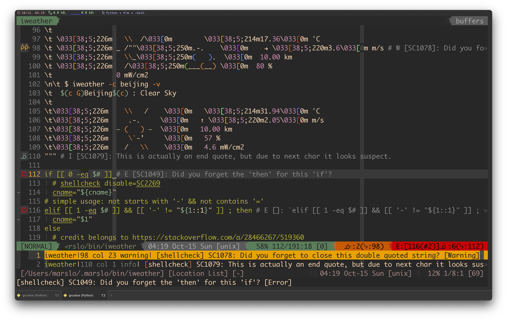
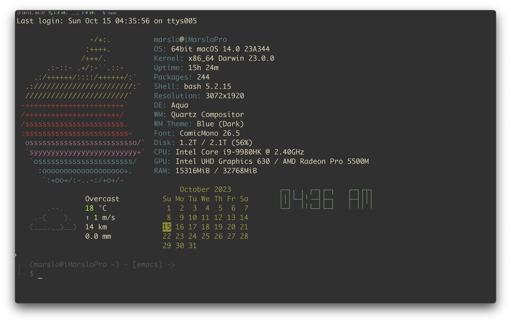
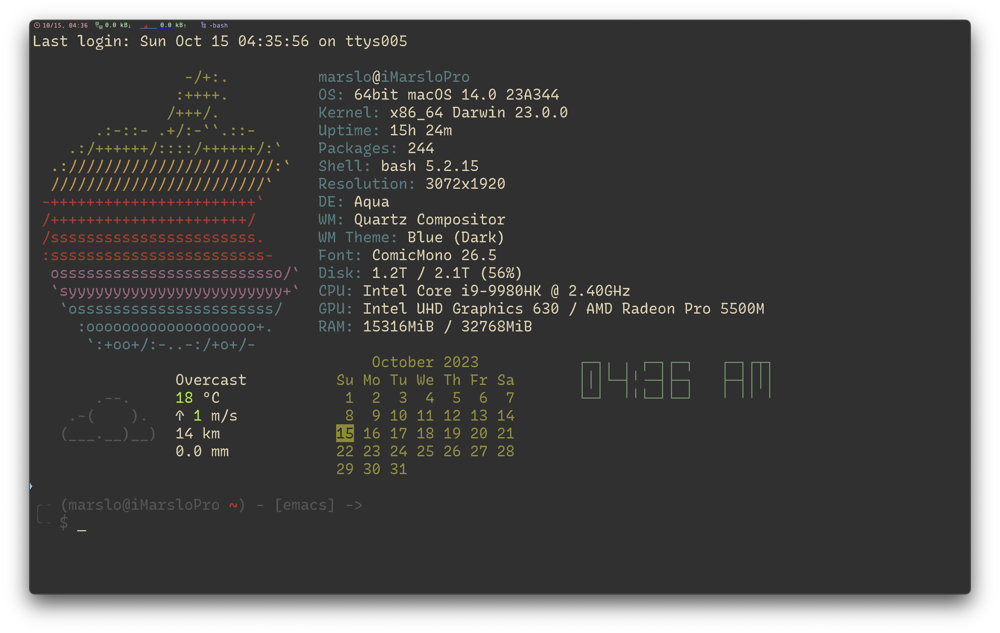
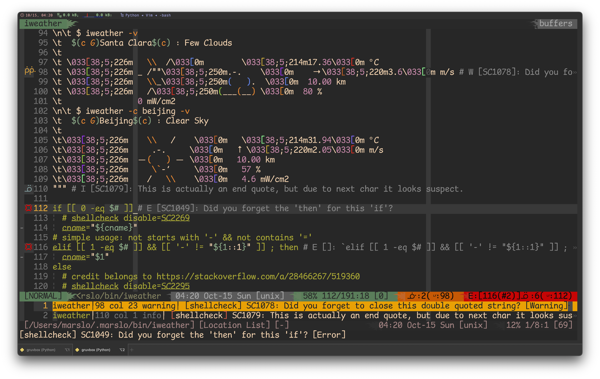
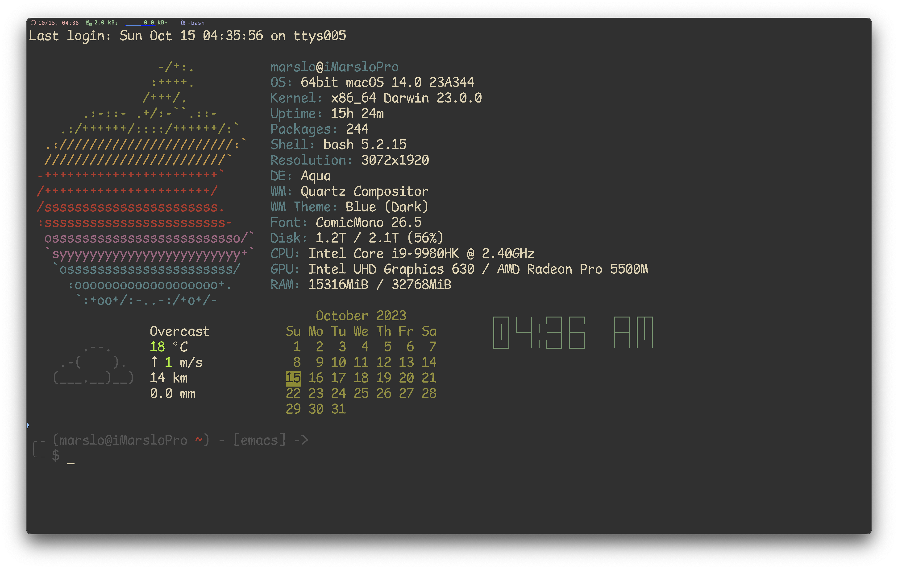
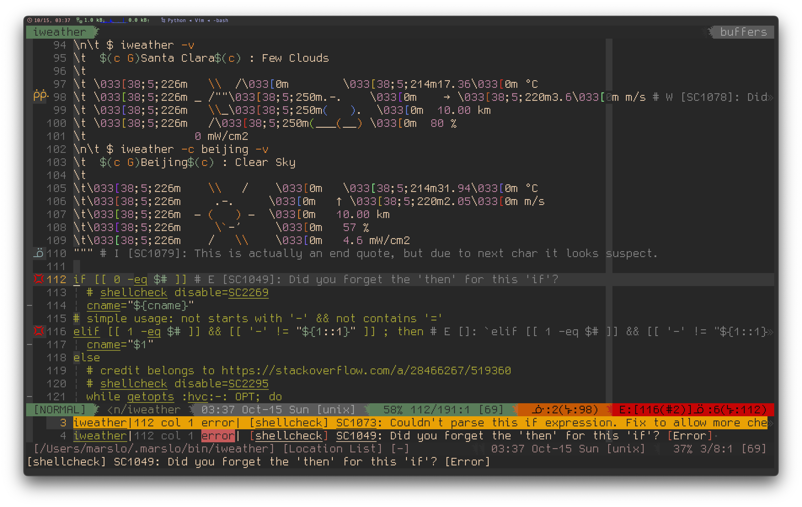
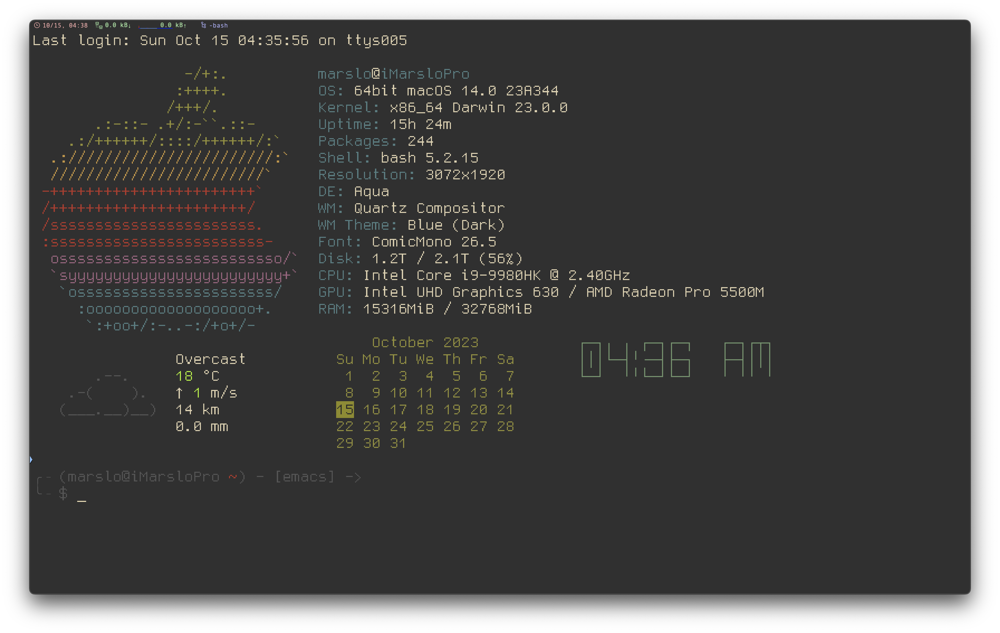

<!-- START doctoc generated TOC please keep comment here to allow auto update -->
<!-- DON'T EDIT THIS SECTION, INSTEAD RE-RUN doctoc TO UPDATE -->

- [highly recommended](#highly-recommended)
  - [Monaco](#monaco)
  - [RecMonoCasual](#recmonocasual)
  - [Comic Mono](#comic-mono)
  - [Gohu](#gohu)
- [nerd-fonts](#nerd-fonts)
  - [pixel](#pixel)
  - [hand-writing](#hand-writing)
  - [symbole](#symbole)
  - [others](#others)
- [powerline fonts](#powerline-fonts)

<!-- END doctoc generated TOC please keep comment here to allow auto update -->

> [!TIP]
> - [* 142 Programming Fonts](https://www.programmingfonts.org/)
> - [* arrowtype/recursive](https://github.com/arrowtype/recursive)
> - [Patch Fonts with Cursive Italic Styles](https://www.sainnhe.dev/post/patch-fonts-with-cursive-italic-styles/)
> - [sainnhe/icursive-nerd-font](https://git.sainnhe.dev/sainnhe/icursive-nerd-font) | [sainnhe/mono-nerd-font](https://git.sainnhe.dev/sainnhe/mono-nerd-font)
> - [INPUT™ fonts](https://input.djr.com/download/)
> - [Consolas font family](https://learn.microsoft.com/en-us/typography/font-list/consolas)
> - [ryanoasis/nerd-fonts](https://github.com/ryanoasis/nerd-fonts)
> - [ryanoasis/powerline-extra-symbols](https://github.com/ryanoasis/powerline-extra-symbols)
> - [ArrowType](https://www.arrowtype.com/)

## highly recommended

### Monaco

> [!NOTE]
> THE BEST ALWAYS !

- [Monaco](https://www.cufonfonts.com/font/monaco)
- Nerd-Fonts
  - [Monaco Nerd Font Mono](https://github.com/Karmenzind/monaco-nerd-fonts)
  - [Monaco Nerd Font](https://github.com/thep0y/monaco-nerd-font)
- Powerline
  - [Monaco for Powerline.ttf](https://gist.github.com/lujiacn/32b598b1a6a43c996cbd93d42d466466/raw/5be6ef0e44a3427fdb8343b4dacc29716449c59e/Monaco%2520for%2520Powerline.ttf)
  - [Monaco for Powerline.otf](https://github.com/supermarin/powerline-fonts/tree/master/Monaco)





### [RecMonoCasual](https://github.com/arrowtype/recursive/tree/main/fonts/ArrowType-Recursive-1.085/Recursive_Code)
```bash
$ curl --create-dirs -O --output-dir "${fontsPath}" \
       https://github.com/arrowtype/recursive/raw/main/fonts/ArrowType-Recursive-1.085/Recursive_Code/RecMonoCasual/RecMonoCasual-Regular-1.085.ttf &&
$ curl --create-dirs -O --output-dir "${fontsPath}" \
       https://github.com/arrowtype/recursive/raw/main/fonts/ArrowType-Recursive-1.085/Recursive_Code/RecMonoDuotone/RecMonoDuotone-Regular-1.085.ttf &&
$ curl --create-dirs -O --output-dir "${fontsPath}" \
       https://github.com/arrowtype/recursive/raw/main/fonts/ArrowType-Recursive-1.085/Recursive_Code/RecMonoLinear/RecMonoLinear-Regular-1.085.ttf &&
$ curl --create-dirs -O --output-dir "${fontsPath}" \
       https://github.com/arrowtype/recursive/blob/main/fonts/ArrowType-Recursive-1.085/Recursive_Code/RecMonoSemicasual/RecMonoSemicasual-Regular-1.085.ttf &&
  fc-cache -f -v

# or
$ version=1.085
$ url='https://github.com/arrowtype/recursive/blob/main/fonts/ArrowType-Recursive-1.085/Recursive_Code/'
$ while read -r _t; do
    curl --create-dirs -O --output-dir "${fontsPath}" \
         "${url}"/"RecMono${_t}/RecMono${_t}-Regular-1.085.ttf"
  done < <( echo 'Casual Duotone Linear Semicasual' | fmt -1 )
$ fc-cache -f -v
```




### [Comic Mono](https://dtinth.github.io/comic-mono-font/)

> [!NOTE|label:references:]
> - [knolljo/comic-mono-nerd](https://codeberg.org/knolljo/comic-mono-nerd)

- [Comic Mono](https://dtinth.github.io/comic-mono-font/ComicMono.ttf)
- [Comic Mono for NF](https://github.com/xtevenx/ComicMonoNF) or [here](https://codeberg.org/knolljo/comic-mono-nerd/raw/branch/master/ComicMonoNerd.ttf)





### [Gohu](https://github.com/ryanoasis/nerd-fonts/tree/master/patched-fonts/Gohu)
```bash
$ curl --create-dirs -O --output-dir "${fontsPath}" \
       https://github.com/ryanoasis/nerd-fonts/raw/master/patched-fonts/Gohu/uni-14/GohuFontuni14NerdFontMono-Regular.ttf &&
$ curl --create-dirs -O --output-dir "${fontsPath}" \
       https://github.com/ryanoasis/nerd-fonts/raw/master/patched-fonts/Gohu/uni-11/GohuFontuni11NerdFontMono-Regular.ttf &&
$ curl --create-dirs -O --output-dir "${fontsPath}" \
       https://github.com/ryanoasis/nerd-fonts/raw/master/patched-fonts/Gohu/14/GohuFont14NerdFontMono-Regular.ttf &&
$ curl --create-dirs -O --output-dir "${fontsPath}" \
       https://github.com/ryanoasis/nerd-fonts/raw/master/patched-fonts/Gohu/11/GohuFont11NerdFontMono-Regular.ttf &&
  fc-cache -f -v
```





## nerd-fonts

> [!NOTE|label:refereces:]
> - [download](https://www.nerdfonts.com/font-downloads)
> - [Karmenzind/monaco-nerd-fonts](https://github.com/Karmenzind/monaco-nerd-fonts)
> - [xtevenx/ComicMonoNF](https://github.com/xtevenx/ComicMonoNF)

- [AgaveNerdFontMono](https://github.com/ryanoasis/nerd-fonts/blob/master/patched-fonts/Agave/AgaveNerdFontMono-Regular.ttf)
  ```bash
  $ curl --create-dirs -O --output-dir "${fontsPath}" \
         https://github.com/ryanoasis/nerd-fonts/raw/master/patched-fonts/Agave/AgaveNerdFontMono-Regular.ttf &&
    fc-cache -f -v
  ```

- [CodeNewRoman](https://github.com/ryanoasis/nerd-fonts/tree/master/patched-fonts/CodeNewRoman) another `Monaco`
  ```bash
  $ curl --create-dirs -O --output-dir "${fontsPath}" \
         https://github.com/ryanoasis/nerd-fonts/raw/master/patched-fonts/CodeNewRoman/Regular/CodeNewRomanNerdFontMono-Regular.otf &&
    fc-cache -f -v
  ```

- [DejaVuSansMono](https://github.com/ryanoasis/nerd-fonts/tree/master/patched-fonts/DejaVuSansMono) another `Monaco`
  ```bash
  $ curl --create-dirs -O --output-dir "${fontsPath}" \
         https://github.com/ryanoasis/nerd-fonts/raw/master/patched-fonts/DejaVuSansMono/Regular/DejaVuSansMNerdFontMono-Regular.ttf &&
    fc-cache -f -v
  ```

### pixel
- [BigBlueTerminal](https://github.com/ryanoasis/nerd-fonts/tree/master/patched-fonts/BigBlueTerminal)
  ```bash
  $ curl --create-dirs -O --output-dir "${fontsPath}" \
         https://github.com/ryanoasis/nerd-fonts/raw/master/patched-fonts/BigBlueTerminal/BigBlueTerm437NerdFontMono-Regular.ttf &&
    fc-cache -f -v
  ```

### hand-writing
- [Monofur](https://github.com/ryanoasis/nerd-fonts/tree/master/patched-fonts/Monofur)
  ```bash
  $ curl --create-dirs -O --output-dir "${fontsPath}" \
         https://github.com/ryanoasis/nerd-fonts/raw/master/patched-fonts/Monofur/Regular/MonofurNerdFontMono-Regular.ttf &&
    fc-cache -f -v
  ```

- [ComicShannsMono](https://github.com/ryanoasis/nerd-fonts/tree/master/patched-fonts/ComicShannsMono)
  ```bash
  $ curl --create-dirs -O --output-dir "${fontsPath}" \
         https://github.com/ryanoasis/nerd-fonts/raw/master/patched-fonts/ComicShannsMono/ComicShannsMonoNerdFontMono-Regular.otf &&
    fc-cache -f -v
  ```

- [DaddyTimeMono](https://github.com/ryanoasis/nerd-fonts/tree/master/patched-fonts/DaddyTimeMono)
  ```bash
  $ curl --create-dirs -O --output-dir "${fontsPath}" \
         https://github.com/ryanoasis/nerd-fonts/raw/master/patched-fonts/DaddyTimeMono/DaddyTimeMonoNerdFontMono-Regular.ttf &&
    fc-cache -f -v
  ```

- [FantasqueSansMono](https://github.com/ryanoasis/nerd-fonts/tree/master/patched-fonts/FantasqueSansMono)
  ```bash
  $ curl --create-dirs -O --output-dir "${fontsPath}" \
         https://github.com/ryanoasis/nerd-fonts/raw/master/patched-fonts/FantasqueSansMono/Regular/FantasqueSansMNerdFontMono-Regular.ttf &&
    fc-cache -f -v
```

- [Hermit](https://github.com/ryanoasis/nerd-fonts/tree/master/patched-fonts/Hermit)
  ```bash
  $ curl --create-dirs -O --output-dir "${fontsPath}" \
         https://github.com/ryanoasis/nerd-fonts/raw/master/patched-fonts/Hermit/Regular/HurmitNerdFontMono-Regular.otf &&
    fc-cache -f -v
  ```

### symbole
- [NerdFontsSymbolsOnly](https://github.com/ryanoasis/nerd-fonts/tree/master/patched-fonts/NerdFontsSymbolsOnly)
  ```bash
  $ curl --create-dirs -O --output-dir "${fontsPath}" \
         https://github.com/ryanoasis/nerd-fonts/raw/master/patched-fonts/NerdFontsSymbolsOnly/SymbolsNerdFontMono-Regular.ttf &&
    fc-cache -f -v
  ```

### others
- [CascadiaCode](https://github.com/ryanoasis/nerd-fonts/tree/master/patched-fonts/CascadiaCode)
- [EnvyCodeR](https://github.com/ryanoasis/nerd-fonts/tree/master/patched-fonts/EnvyCodeR)
- [IBMPlexMono](https://github.com/ryanoasis/nerd-fonts/tree/master/patched-fonts/IBMPlexMono)
- JetBrains [original](https://www.jetbrains.com/lp/mono/) | [JetBrains Nerd Font](https://github.com/ryanoasis/nerd-fonts/tree/master/patched-fonts/JetBrainsMono)

## powerline fonts

> [!NOTE|label:references:]
> - [Comic Mono font](https://www.reddit.com/r/programming/comments/kj0prs/comment/ggvwadd/?utm_source=share&utm_medium=web2x&context=3)
> - [Showing special Unicode characters on MacOS](https://discussions.apple.com/thread/251585417)
> - [GNU Unifont Glyphs](https://unifoundry.com/unifont/)
> - [* lujiacn/Monaco for Powerline.md](https://gist.github.com/lujiacn/32b598b1a6a43c996cbd93d42d466466)
>   - [Monaco for Powerline.ttf](https://gist.github.com/lujiacn/32b598b1a6a43c996cbd93d42d466466/raw/5be6ef0e44a3427fdb8343b4dacc29716449c59e/Monaco%2520for%2520Powerline.ttf)
> - [* supermarin/powerline-fonts](https://github.com/supermarin/powerline-fonts)
>   - [Monaco for Powerline.otf](https://github.com/supermarin/powerline-fonts/tree/master/Monaco)
>   - [Menlo Regular for Powerline.otf](https://github.com/supermarin/powerline-fonts/tree/master/Menlo)
>   - [DejaVu Sans Mono for Powerline.otf](https://github.com/supermarin/powerline-fonts/raw/master/DejaVuSansMono/DejaVu%20Sans%20Mono%20for%20Powerline.otf)
> - [* powerline/fonts](https://github.com/powerline/fonts) ~ [AnwarShah/fonts](https://github.com/AnwarShah/fonts)
>   - [Monofur for Powerline.ttf](https://github.com/powerline/fonts/tree/master/Monofur)
> - [* Twixes/SF-Mono-Powerline](https://github.com/Twixes/SF-Mono-Powerline)
> - [* benbusby/anomaly-mono](https://github.com/benbusby/anomaly-mono)
> - [yumitsu/font-menlo-extra](https://github.com/yumitsu/font-menlo-extra)
> - [ithewei/powerline-fonts](https://gitee.com/ithewei/powerline-fonts)
> - [JayXon/powerline-web-fonts](https://github.com/JayXon/powerline-web-fonts)
> - [github topic: powerline-fonts](https://github.com/topics/powerline-fonts)
> - [ryanoasis/nerd-fonts](https://github.com/ryanoasis/nerd-fonts)
> - [Powerline Fonts](https://sourceforge.net/projects/powerline-fonts.mirror/)
> - windows
>   - [Change font for non-legacy command prompt in Windows 10 with non-ASCII charset - Properties vs default values?](https://superuser.com/a/1202335/112396)
>   - [gdetrez/powerline-test.sh](https://gist.github.com/gdetrez/5845092)


- install via package tool
  ```bash
  # debian
  $ sudo apt-get install fonts-powerline

  # centos/rhel
  $ sudo dnf install powerline-fonts
  ```

- install via cmd

  > [!TIP|label:fonts path in different system:]
  > - linux: `$HOME/.local/share/fonts`
  > - osx : `$HOME/Library/Fonts`
  >   ```bash
  >   $ fontPath=$HOME/Library/Fonts
  >   $ fontPath=$HOME/.local/share/fonts
  >   ```

  - via powershell
    ```powershell
    > Invoke-WebRequest -Uri "https://dtinth.github.io/comic-mono-font/ComicMono.ttf" -OutFile "ComicMono.ttf"; Invoke-WebRequest -Uri "https://dtinth.github.io/comic-mono-font/ComicMono-Bold.ttf" -OutFile "ComicMono-Bold.ttf"; $fonts = (New-Object -ComObject Shell.Application).Namespace(0x14); Get-ChildItem -include ComicMono* | % { $fonts.CopyHere($_.fullname) }
    ```

  - [cominc mono](https://dtinth.github.io) && [comic mono for powerline](https://github.com/marslo/mytools/raw/master/others/fonts/monospace/Comic-Mono-for-Powerline.ttf)
    ```bash
    # regular
    $ curl --create-dirs -O --output-dir "${fontsPath}" \
           https://dtinth.github.io/comic-mono-font/ComicMono.ttf &&
      curl --create-dirs -O --output-dir "${fontsPath}" \
           https://dtinth.github.io/comic-mono-font/ComicMono-Bold.ttf &&
      fc-cache -f -v

    # for powerline/vim-airline
    $ curl --create-dirs -O --output-dir "${fontsPath}" \
           https://github.com/marslo/mytools/raw/master/others/fonts/monospace/Comic-Mono-for-Powerline.ttf &&
      fc-cache -f -v
    ```

  - [monaco for powerline osx version](https://github.com/marslo/mytools/raw/master/others/fonts/monospace/Monaco-for-Powerline.otf) && [monaco for powerline windows version](https://github.com/marslo/mytools/raw/master/others/fonts/monospace/Monaco-for-Powerline.ttf)
    ```bash
    $ curl --create-dirs -O --output-dir "${fontsPath}" \
           https://github.com/marslo/mytools/raw/master/others/fonts/monospace/Monaco-for-Powerline.otf &&
      fc-cache -f -v
    ```

  - [menlo for powerline](https://github.com/marslo/mytools/raw/master/others/fonts/monospace/Menlo-Regular.ttf)
    ```bash
    $ curl --create-dirs -O --output-dir "${fontsPath}" \
           https://github.com/marslo/mytools/raw/master/others/fonts/monospace/Menlo-Regular.ttf &&
      fc-cache -f -v
    ```

  - [monofur for powerline](https://github.com/powerline/fonts/tree/master/Monofur)
    ```bash
    $ curl --create-dirs -O --output-dir "${fontsPath}" \
           https://github.com/powerline/fonts/raw/master/Monofur/Monofur%20for%20Powerline.ttf &&
      curl --create-dirs -O --output-dir "${fontsPath}" \
           https://github.com/powerline/fonts/raw/master/Monofur/Monofur%20Italic%20for%20Powerline.ttf &&
      curl --create-dirs -O --output-dir "${fontsPath}" \
           https://github.com/powerline/fonts/raw/master/Monofur/Monofur%20Bold%20for%20Powerline.ttf &&
      fc-cache -f -v
    ```

  - [sf-mono for powerline](https://github.com/Twixes/SF-Mono-Powerline)
    ```bash
    $ curl --create-dirs -O --output-dir "${fontsPath}" \
           https://github.com/Twixes/SF-Mono-Powerline/raw/master/SF-Mono-Powerline-Regular.otf &&
      curl --create-dirs -O --output-dir "${fontsPath}" \
           https://github.com/Twixes/SF-Mono-Powerline/raw/master/SF-Mono-Powerline-RegularItalic.otf &&
      curl --create-dirs -O --output-dir "${fontsPath}" \
           https://github.com/Twixes/SF-Mono-Powerline/raw/master/SF-Mono-Powerline-Bold.otf &&
      curl --create-dirs -O --output-dir "${fontsPath}" \
           https://github.com/Twixes/SF-Mono-Powerline/raw/master/SF-Mono-Powerline-BoldItalic.otf &&
      fc-cache -f -v
    ```

  - [anomaly mono for powerline](https://github.com/benbusby/anomaly-mono)
    ```bash
    $ curl --create-dirs -O --output-dir "${fontsPath}" \
           https://github.com/benbusby/anomaly-mono/raw/master/AnomalyMono-Powerline.otf &&
      fc-cache -f -v
    ```
