<!-- START doctoc generated TOC please keep comment here to allow auto update -->
<!-- DON'T EDIT THIS SECTION, INSTEAD RE-RUN doctoc TO UPDATE -->

- [font patcher](#font-patcher)
  - [patch fonts](#patch-fonts)
    - [setup font-patcher](#setup-font-patcher)
    - [patch fonts](#patch-fonts-1)
  - [check fonts](#check-fonts)
  - [get font name by language](#get-font-name-by-language)
  - [rename fonts to `postscriptname`](#rename-fonts-to-postscriptname)
  - [get font version](#get-font-version)
- [fonts](#fonts)
  - [cn](#cn)
    - [fonts](#fonts-1)
  - [highly recommended](#highly-recommended)
    - [Monaco](#monaco)
    - [RecMonoCasual](#recmonocasual)
    - [Comic Mono](#comic-mono)
    - [Agave](#agave)
    - [Operator Mono](#operator-mono)
    - [Gohu](#gohu)
    - [Monaspace RN](#monaspace-rn)
  - [nerd-fonts](#nerd-fonts)
    - [pixel](#pixel)
    - [hand-writing](#hand-writing)
    - [symbole](#symbole)
    - [others](#others)
  - [powerline fonts](#powerline-fonts)
  - [google fonts](#google-fonts)
  - [tips](#tips)
    - [Mac Office Fonts](#mac-office-fonts)

<!-- END doctoc generated TOC please keep comment here to allow auto update -->

> [!TIP|label:references:]
> - format:
>   - `ttf`: `TrueType Font`
>   - `otf`: `OpenType Font`
>   - `woff`: `Web Open Font Format`
> - [* 142 Programming Fonts](https://www.programmingfonts.org/)
> - [* arrowtype/recursive](https://github.com/arrowtype/recursive)
> - [* ryanoasis/nerd-fonts](https://github.com/ryanoasis/nerd-fonts)
> - [* iMarslo NerdFonts](https://github.com/marslo/fonts/tree/fonts) | [install guild](https://github.com/marslo/fonts/tree/main)
> - [Patch Fonts with Cursive Italic Styles](https://www.sainnhe.dev/post/patch-fonts-with-cursive-italic-styles/)
> - [sainnhe/icursive-nerd-font](https://git.sainnhe.dev/sainnhe/icursive-nerd-font) | [thlineric/icursive-nerd-font](https://github.com/thlineric/icursive-nerd-font) | [sainnhe/mono-nerd-font](https://git.sainnhe.dev/sainnhe/mono-nerd-font) | [40huo/Patched-Fonts](https://github.com/40huo/Patched-Fonts)
> - [INPUT™ fonts](https://input.djr.com/download/)
> - [Consolas font family](https://learn.microsoft.com/en-us/typography/font-list/consolas)
> - [monaspace](https://monaspace.githubnext.com/)
>   - [monaspace nerd font](https://github.com/ryanoasis/nerd-fonts/tree/master/patched-fonts/Monaspace) | [Monaspace.zip](https://github.com/ryanoasis/nerd-fonts/releases/latest/download/Monaspace.zip) | [Monaspace.tar.xz](https://github.com/ryanoasis/nerd-fonts/releases/latest/download/Monaspace.tar.xz)
> - [ryanoasis/powerline-extra-symbols](https://github.com/ryanoasis/powerline-extra-symbols)
>
>   [](https://github.com/ryanoasis/powerline-extra-symbols?tab=readme-ov-file)
>
> - [ArrowType](https://www.arrowtype.com/)
> - [oldschool font list](https://int10h.org/oldschool-pc-fonts/fontlist/)
> - [subframe7536/maple-font](https://github.com/subframe7536/Maple-font)
> - [字体查看器](https://tophix.com/zh-cn/font-tools/font-viewer)
> - [LUC DEVROYE](https://luc.devroye.org/italy-index.html)
> - [* Iosevka Customizer](https://typeof.net/Iosevka/customizer) | [be5invis/Iosevka](https://github.com/be5invis/Iosevka)

# font patcher

> [!TIP|label:references:]
> - [小白教程，如何使用FontForge修改字体的名称?](https://www.maoken.com/knowledge/fontforge/ff-articles/19009.html)

## patch fonts
### setup font-patcher
```bash
# osx
$ brew install fontforge
# ubuntu
$ sudo apt install python3-fontforge

# install font-patcher v3.2.1.1
$ [[ -d /opt/FontPatcher ]] || mkdir -p /opt/FontPatcher
$ curl -o /opt/FontPatcher/FontPatcher.zip \
       -fsSL https://github.com/marslo/fonts/raw/fonts/FontPatcher.v3.2.1.1.zip
$ unzip -o /opt/FontPatcher/FontPatcher.zip /opt/FontPatcher

# setup completion
## osx
$ cp /opt/FontPatcher/completion/font-patcher.sh $(brew --prefix)/etc/bash_completion.d/
## centos/rhel/ubuntu/wsl
$ cp /opt/FontPatcher/completion/font-patcher.sh /usr/share/bash-completion/completions/
## centos/rhel
$ cp /opt/FontPatcher/completion/font-patcher.sh /etc/bash_completion.d/

# setup environment
$ cat >> ~/.bashrc << EOF
FONT_PATCHER='/opt/FontPatcher'
test -d "${FONT_PATCHER}" && PATH+=":${FONT_PATCHER}"
export $PATH
EOF
```

[](https://github.com/marslo/fonts/raw/main/screenshots/font-patcher-v3.2.1.1-auto-completion.png)

### patch fonts

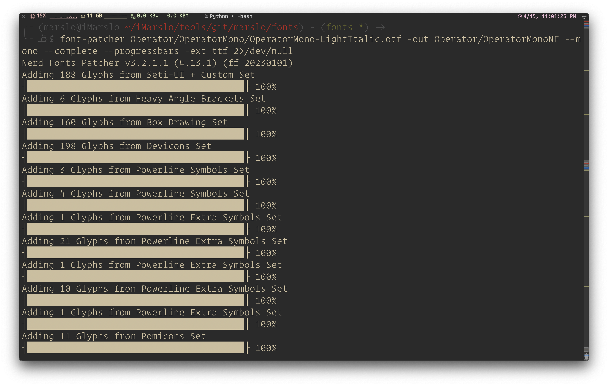

- mono
  ```bash
  $ font-patcher RecMonoSemicasual-Regular-1.085.ttf --mono --complete --quiet -ext ttf -out .

  # or patch for folders
  $ while read -r _f; do
      for _e in otf ttf; do
        outpath="$(dirname $(dirname $_f))_NF/$(basename $(dirname $_f))/${_e}";
        [[ -d "${outpath}" ]] || mkdir -p "${outpath}";
        echo ".. ${_e} » $(basename ${_f}) » ${outpath}";
        /opt/FontPatcher/font-patcher $(realpath "${_f}") --mono --complete --quiet -ext ${_e} -out "${outpath}";
      done;
    done < <(fd -u -tf -e ttf -e otf --full-path /path/to/folder)
  ```

- san
  - with name
    ```bash
    $ font-patcher --complete --progressbars --outputdir . --name 'Recursive Mono Casual Static Italic Nerd Font' /path/to/font.ttf 2>/dev/null

    # using name dynamically
    $ font='/path/to/font.ttf'
    $ fontfamily="$(fc-query -f '%{family}' "$(realpath "${font}")" | awk -F, '{print $1}')";
    $ style="$(fc-query -f '%{style}' "$(realpath "${font}")" | awk -F, '{print $1}')";
    $ name="${fontfamily} ${style} Nerd Font";
    $ font-patcher --complete --quiet --outputdir . --name "${name}" "${font}" 2>/dev/null
    ```

## check fonts

> [!NOTE|label:references:]
> - [Which font is used in Visual Studio Code Editor and how to change fonts?](https://stackoverflow.com/a/52789662/2940319)

- list installed fonts
  ```bash
  $ fc-list | sed -re 's/^.+\/([^:]+):\s?([^,:]+),?:?.*$/\1 : \2/g' | column -t -s: -o: | sort -t: -k2

  # or
  $ fc-list | awk '{$1=""}1' | sed -re 's/^\s*([^:,]+:?,?[^,:]+).*$/\1/' | column -t -s:
  ```

  - i.e.:
    ```bash
    $ fc-list | sed -re 's/^.+\/([^:]+):\s?([^,:]+),?:?.*$/\1 : \2/g' | column -t -s: -o: | sort -t: -k2 | grep operator
    OperatorProNerdFont-Italic.ttf                : Operator Pro Nerd Font
    OperatorProNerdFont-Regular.ttf               : Operator Pro Nerd Font
    OperatorMonoNerdFontMono-Light.ttf            : OperatorMono Nerd Font Mono
    OperatorMonoNerdFontMono-LightItalic.ttf      : OperatorMono Nerd Font Mono
    OperatorMonoLigNerdFontMono-Light.otf         : OperatorMonoLig Nerd Font Mono
    OperatorMonoLigNerdFontMono-LightItalic.otf   : OperatorMonoLig Nerd Font Mono
    OperatorProNerdFont-Light.ttf                 : OperatorPro Nerd Font
    OperatorProNerdFont-LightItalic.ttf           : OperatorPro Nerd Font
    ```

- list fonts properties
  ```bash
  $ fc-query /path/to/font.ttf
  ```

  - i.e.:
    ```bash
    $ fc-query Operator/OperatorMonoLigNF/OperatorMonoLigNerdFontMono-Light.ttf | grep -E 'family|style|fullname|weight|slant|spacing|file'
      family: "OperatorMonoLig Nerd Font Mono"(s) "OperatorMonoLig Nerd Font Mono Light"(s)
      familylang: "en"(s) "en"(s)
      style: "Light"(s) "Regular"(s)
      stylelang: "en"(s) "en"(s)
      fullname: "OperatorMonoLig Nerd Font Mono Light"(s)
      fullnamelang: "en"(s)
      slant: 0(i)(s)
      weight: 50(f)(s)
      spacing: 100(i)(s)
      file: "Operator/OperatorMonoLigNF/OperatorMonoLigNerdFontMono-Light.ttf"(s)
    ```

- [list particular field of fonts properties](https://stackoverflow.com/a/43614521/2940319)
  ```bash
  $ fc-query -f '%{family}\n' /path/to/font.ttf
  ```

  - i.e.:
    ```bash
    $ fc-query -f '%{family}\n%{style}\n%{fullname}' Recursive/Recursive_Desktop/RecursiveSansCslSt-LtItalic.ttf
    Recursive Sans Casual Static,Recursive Sn Csl St Lt
    Light Italic,Italic
    Recursive Sn Csl St Lt Italic

    $ fc-query -f '%{family}\n%{style}\n%{fullname}' Recursive/Recursive_Desktop/RecursiveSansCslSt-LtItalic.ttf | awk -F, '{print $1}'
    Recursive Sans Casual Static
    Light Italic
    Recursive Sn Csl St Lt Italic
    ```

## get font name by language

> [!NOTE|label:references:]
> - [How to get font information (ttf, otf) on the command line with fontconfig's fc-scan utility for my system language?](https://askubuntu.com/a/1284121/92979)
> - [fc-scan format - fcpatternformat](https://linux.die.net/man/3/fcpatternformat)
>   ```bash
>   $ fc-scan --format "%-40{family}%{style}\n" Meslo-LG-M-Regular-for-Powerline.ttf
>   Meslo LG M for Powerline                Regular
>   ```

- fullname & fullnamelang
  ```bash
  $ fc-scan --format "%{fullname}\n%{fullnamelang}" chinese.msyh.ttf
  Microsoft YaHei,微软雅黑
  en,zh-cn

  $ fc-scan --format "%{fullname[0]}\n%{fullname[1]}" chinese.msyh.ttf
  Microsoft YaHei
  微软雅黑
  ```

- get index of lang
  ```bash
  $ lang="en"
  $ sed -E "s/^(.*)${lang}.*/\1/;s/[^,]//g" <<< "$(fc-scan --format "%{fullnamelang}\n" chinese.msyh.ttf)" | wc -c
  1

  $ lang="zh-cn"
  $ sed -E "s/^(.*)${lang}.*/\1/;s/[^,]//g" <<< "$(fc-scan --format "%{fullnamelang}\n" chinese.msyh.ttf)" | wc -c
  2
  ```

- show font by lang
  ```bash
  $ lang="zh-cn"
  $ font="chinese.msyh.ttf"
  $ fc-scan --format "%{fullname[$(( $(sed -E "s/^(.*)${lang}.*/\1/;s/[^,]//g" <<<"$(fc-scan --format "%{fullnamelang}\n" "${font}")" | wc -c) -1 ))]}\n" "${font}"
  微软雅黑

  $ lang='en'
  $ fc-scan --format "%{fullname[$(( $(sed -E "s/^(.*)${lang}.*/\1/;s/[^,]//g" <<<"$(fc-scan --format "%{fullnamelang}\n" "${font}")" | wc -c) -1 ))]}\n" "${font}"
  Microsoft YaHei
  ```

## rename fonts to `postscriptname`

- show font `fullname`
  ```bash
  $ fd --glob *.ttf -tf --color=never /path/to/font |
    while read -r _f; do
      echo -n ">> $(basename "${_f}") : "; fc-scan --format "%{fullname}\n" "${_f}";
    done
  ```

```bash
$ while read -r _f; do
    echo ">> $_f <<";
    name="$(fc-scan --format "%{postscriptname}" "$_f").ttf";
    mv "${_f}" "${name}";
  done < <(ls -1 --color=never)

# or
$ fd --glob *.ttf -tf --color=never /path/to/font |
  while read -r _f; do
    mv "${_f}" "$(fc-scan --format "%{postscriptname}" "$_f").ttf";
  done
```

## get font version

> [!NOTE|label:references:]
> - [How to retrieve .ttf font version?](https://www.autohotkey.com/boards/viewtopic.php?style=19&t=132984)

- windows
  ```powershell
  Add-Type -AssemblyName PresentationCore;
  $font = New-Object -TypeName Windows.Media.GlyphTypeface -ArgumentList 'xxxx.ttf';
  $font.VersionStrings.Values

  # --- or ---
  # Requires AutoHotkey v2.0

  fontPath := A_WinDir . '\Fonts\Arial.ttf'
  command := "Add-Type -AssemblyName PresentationCore;"
             . "$font = New-Object -TypeName Windows.Media.GlyphTypeface -ArgumentList '" . fontPath . "';"
           . "$font.VersionStrings.Values"

  MsgBox CmdRet('powershell -Command "' . command . '"')

  CmdRet(sCmd, callBackFunc := '', encoding := '') {
      static flags := [HANDLE_FLAG_INHERIT := 0x1, CREATE_NO_WINDOW := 0x8000000], STARTF_USESTDHANDLES := 0x100

      (encoding = '' && encoding := 'cp' . DllCall('GetOEMCP', 'UInt'))
      DllCall('CreatePipe', 'PtrP', &hPipeRead := 0, 'PtrP', &hPipeWrite := 0, 'Ptr', 0, 'UInt', 0)
      DllCall('SetHandleInformation', 'Ptr', hPipeWrite, 'UInt', flags[1], 'UInt', flags[1])

      STARTUPINFO := Buffer(size := A_PtrSize*9 + 4*8, 0)
      NumPut('UInt', size, STARTUPINFO)
      NumPut('UInt', STARTF_USESTDHANDLES, STARTUPINFO, A_PtrSize*4 + 4*7)
      NumPut('Ptr', hPipeWrite, 'Ptr', hPipeWrite, STARTUPINFO, size - A_PtrSize*2)

      PROCESS_INFORMATION := Buffer(A_PtrSize*2 + 4*2, 0)
      if !DllCall('CreateProcess', 'Ptr', 0, 'Str', sCmd, 'Ptr', 0, 'Ptr', 0, 'UInt', true, 'UInt', flags[2]
                                 , 'Ptr', 0, 'Ptr', 0, 'Ptr', STARTUPINFO, 'Ptr', PROCESS_INFORMATION)
      {
          DllCall('CloseHandle', 'Ptr', hPipeRead)
          DllCall('CloseHandle', 'Ptr', hPipeWrite)
          throw OSError('CreateProcess is failed')
      }
      DllCall('CloseHandle', 'Ptr', hPipeWrite)
      temp := Buffer(4096, 0), output := ''
      while DllCall('ReadFile', 'Ptr', hPipeRead, 'Ptr', temp, 'UInt', 4096, 'UIntP', &size := 0, 'UInt', 0) {
          output .= stdOut := StrGet(temp, size, encoding)
          ( callBackFunc && callBackFunc(stdOut) )
      }
      DllCall('CloseHandle', 'Ptr', NumGet(PROCESS_INFORMATION, 'Ptr'))
      DllCall('CloseHandle', 'Ptr', NumGet(PROCESS_INFORMATION, A_PtrSize, 'Ptr'))
      DllCall('CloseHandle', 'Ptr', hPipeRead)
      return output
  }
  ```

# fonts

## cn

> [!TIP|label:references:]
> - [中文网字计划 - 字图 CDN](https://chinese-font.netlify.app/zh-cn/cdn/) | [github](https://github.com/KonghaYao/chinese-free-web-font-storage)
> - [猫啃](https://www.maoken.com/)
> - [自由字体网](https://ziyouziti.com/index-index-all.html)
> - [找字体](https://zfont.cn/cn/font_286.html)
> - [自改免费开源字体一览](https://lxgw.github.io/2021/01/15/Lxgw-Opensource-Chinese-Fonts/) | [开源字体一览(图文版)](https://github.com/lxgw/lxgw/blob/main/fonts.md)
> - [npm - chinese-fonts](https://www.npmjs.com/search?q=keywords:chinese-fonts)
> - [字库星球](https://www.mfonts.cn/)

| TYPE        | VALUE                                                                                           | COMMENTS |
|-------------|-------------------------------------------------------------------------------------------------|----------|
| style       | `Gothic`, `UI`, `Mono`, `Term`, `Fixed`                                                         |          |
| Serif       | `slab serif`, `old style`, `transitional serif`                                                 | 字体衬线 |
| orthography | `CL` - Classic<br> `SC` - Simplified Chinese<br> `TC` - TW<br> `HC` - Hong Kong<br> `J` - Japan | 汉字字形 |
| weight      | `Light`, `Regular`, `Medium`, `Bold`, `Black`                                                   | 字体粗细 |
| suffix      | `ttf` - TrueType Font<br> `otf` - OpenType Font<br> `woff` - Web Open Font Format               | 后缀     |


### fonts

> [!NOTE|label:references:]
> - [霞鹜漫黑 - lxgw/LxgwMarkerGothic](https://github.com/lxgw/LxgwMarkerGothic)
> - [霞鹜文楷](https://github.com/lxgw/LxgwWenKai) | [霞鹜文楷 Bright](https://github.com/lxgw/LxgwBright)
> - [霞鹜臻楷](https://github.com/lxgw/LxgwZhenKai)
> - [霞鹜新晰黑](https://github.com/lxgw/LxgwNeoXiHei)
> - [霞鹜漫黑](https://github.com/lxgw/LxgwMarkerGothic)
> - [芫荽](https://github.com/ButTaiwan/iansui)
> - [猫啃网糖圆体](https://www.maoken.com/tangyuan)
> - [抖音美好体](https://ziyouziti.com/index-ziti-xiazai-id-451.html) | [quark](https://pan.quark.cn/s/5f2b4e9d6da9)
> - [小赖字体](https://github.com/lxgw/kose-font)
> - [悠哉字体](https://github.com/lxgw/yozai-font)
> - [优设鲨鱼菲特健康体](https://www.uisdc.com/uisdc-sharkfit-font) | [download - `sxir`](https://pan.baidu.com/s/112BWtQDAhsDGUrf25xXjgA)
> - [更纱黑体](https://github.com/be5invis/Sarasa-Gothic) | [更纱黑体 NF](https://github.com/laishulu/Sarasa-Term-SC-Nerd) | [vscode等宽字体选择:更纱黑体](https://jqtmviyu.github.io/post/vscode-mono-font/)
>
>   [](https://zhuanlan.zhihu.com/p/627059922)
>   [](https://zhuanlan.zhihu.com/p/627059922)

## highly recommended

> [!TIP]
> - `fontsPath`:
>   - osx: `~/Library/Fonts` or `/System/Fonts`
>   - Linux: `~/.fonts` or `~/.local/share/fonts` or `/usr/share/fonts`

### Monaco

> [!NOTE]
> THE BEST ALWAYS !

- [Monaco](https://www.cufonfonts.com/font/monaco)
- Nerd-Fonts
  - [iMarslo: MonacoNerdFontMono-Regular](https://github.com/marslo/fonts/tree/fonts/Monaco)
  - [Monaco Nerd Font Mono](https://github.com/Karmenzind/monaco-nerd-fonts)
  - [Monaco Nerd Font](https://github.com/thep0y/monaco-nerd-font)
- Powerline
  - [Monaco for Powerline.ttf](https://gist.github.com/lujiacn/32b598b1a6a43c996cbd93d42d466466/raw/5be6ef0e44a3427fdb8343b4dacc29716449c59e/Monaco%2520for%2520Powerline.ttf)
  - [Monaco for Powerline.otf](https://github.com/supermarin/powerline-fonts/tree/master/Monaco)

[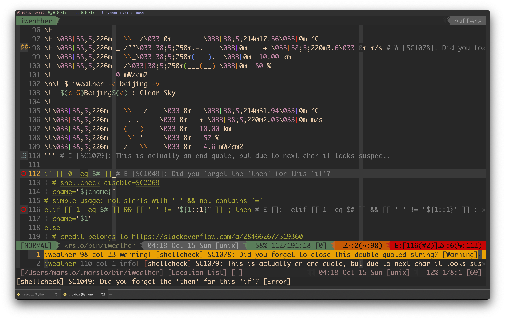](https://marslo.github.io/ibook/screenshot/vim/vim-airline-ale-monaco.png)

[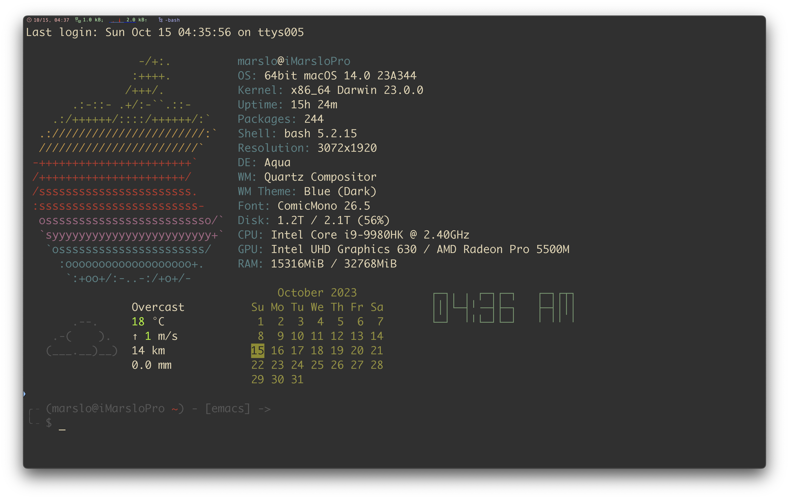](https://marslo.github.io/ibook/screenshot/tools/fonts/bash-Monaco.png)

### [RecMonoCasual](https://github.com/arrowtype/recursive/tree/main/fonts/ArrowType-Recursive-1.085/Recursive_Code)

> [!TIP|label:tips:]
> - [iMarslo Recursive](https://github.com/marslo/fonts/tree/fonts/Recursive) support both `otf` and `ttf` format

[](https://github.com/marslo/fonts/raw/main/screenshots/devicons.png)

[](https://github.com/marslo/fonts/raw/main/screenshots/RecMonoCasualNF.png)

```bash
# RecMonoCasual
$ curl --create-dirs -O --output-dir "${fontsPath}" \
       -fsSL --remote-name-all \
       https://github.com/marslo/fonts/raw/fonts/Recursive/Recursive_Code_NF/RecMonoCasual/RecMonoCasualNerdFontMono-Regular.otf \
       https://github.com/marslo/fonts/raw/fonts/Recursive/Recursive_Code_NF/RecMonoCasual/RecMonoCasualNerdFontMono-Italic.otf \
       https://github.com/marslo/fonts/raw/fonts/Recursive/Recursive_Code_NF/RecMonoCasual/RecMonoCasualNerdFontMono-Bold.otf \
       https://github.com/marslo/fonts/raw/fonts/Recursive/Recursive_Code_NF/RecMonoCasual/RecMonoCasualNerdFontMono-BoldItalic.otf

# RecMonoLinear
$ curl --create-dirs -O --output-dir "${fontsPath}" \
       -fsSL --remote-name-all \
       https://github.com/marslo/fonts/raw/fonts/Recursive/Recursive_Code_NF/RecMonoLinear/RecMonoLinearNerdFontMono-Regular.otf \
       https://github.com/marslo/fonts/raw/fonts/Recursive/Recursive_Code_NF/RecMonoLinear/RecMonoLinearNerdFontMono-Italic.otf \
       https://github.com/marslo/fonts/raw/fonts/Recursive/Recursive_Code_NF/RecMonoLinear/RecMonoLinearNerdFontMono-Bold.otf \
       https://github.com/marslo/fonts/raw/fonts/Recursive/Recursive_Code_NF/RecMonoLinear/RecMonoLinearNerdFontMono-BoldItalic.otf

# RecMonoSemicasual
$ curl --create-dirs -O --output-dir "${fontsPath}" \
       -fsSL --remote-name-all \
       https://github.com/marslo/fonts/raw/fonts/Recursive/Recursive_Code_NF/RecMonoSemicasual/RecMonoSmCasualNerdFontMono-Regular.otf \
       https://github.com/marslo/fonts/raw/fonts/Recursive/Recursive_Code_NF/RecMonoSemicasual/RecMonoSmCasualNerdFontMono-Italic.otf \
       https://github.com/marslo/fonts/raw/fonts/Recursive/Recursive_Code_NF/RecMonoSemicasual/RecMonoSmCasualNerdFontMono-Bold.otf \
       https://github.com/marslo/fonts/raw/fonts/Recursive/Recursive_Code_NF/RecMonoSemicasual/RecMonoSmCasualNerdFontMono-BoldItalic.otf

# RecMonoDuotone
$ curl --create-dirs -O --output-dir "${fontsPath}" \
       -fsSL --remote-name-all \
       https://github.com/marslo/fonts/raw/fonts/Recursive/Recursive_Code_NF/RecMonoDuotone/RecMonoDuotoneNerdFontMono-Regular.otf \
       https://github.com/marslo/fonts/raw/fonts/Recursive/Recursive_Code_NF/RecMonoDuotone/RecMonoDuotoneNerdFontMono-Italic.otf \
       https://github.com/marslo/fonts/raw/fonts/Recursive/Recursive_Code_NF/RecMonoDuotone/RecMonoDuotoneNerdFontMono-Bold.otf \
       https://github.com/marslo/fonts/raw/fonts/Recursive/Recursive_Code_NF/RecMonoDuotone/RecMonoDuotoneNerdFontMono-BoldItalic.otf
```

<!--sec data-title="original version" data-id="section0" data-show=true data-collapse=true ces-->

[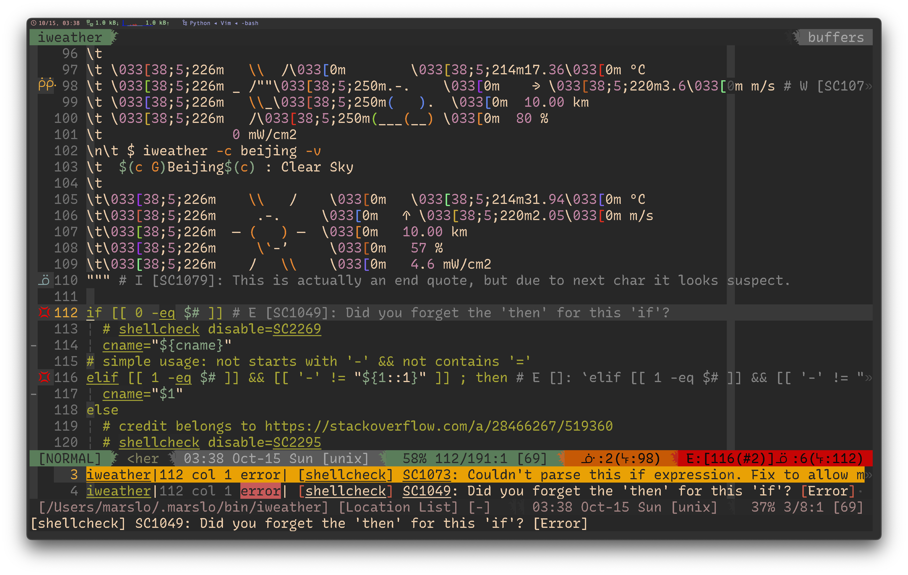](https://marslo.github.io/ibook/screenshot/vim/vim-airline-ale-3.png)

[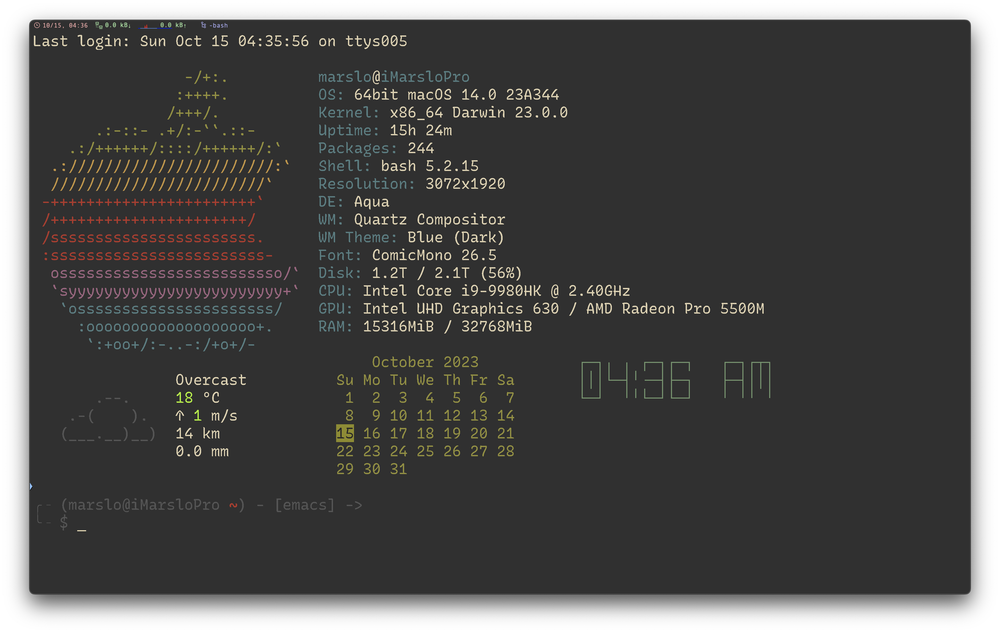](https://marslo.github.io/ibook/screenshot/tools/fonts/bash-RecMonoCasual.png)

```bash
$ curl --create-dirs -O --output-dir "${fontsPath}" \
       -fsSL --remote-name-all \
       https://github.com/arrowtype/recursive/raw/main/fonts/ArrowType-Recursive-1.085/Recursive_Code/RecMonoCasual/RecMonoCasual-Regular-1.085.ttf \
       https://github.com/arrowtype/recursive/raw/main/fonts/ArrowType-Recursive-1.085/Recursive_Code/RecMonoDuotone/RecMonoDuotone-Regular-1.085.ttf \
       https://github.com/arrowtype/recursive/raw/main/fonts/ArrowType-Recursive-1.085/Recursive_Code/RecMonoLinear/RecMonoLinear-Regular-1.085.ttf \
       https://github.com/arrowtype/recursive/raw/main/fonts/ArrowType-Recursive-1.085/Recursive_Code/RecMonoSemicasual/RecMonoSemicasual-Regular-1.085.ttf &&
  fc-cache -f -v

# or
$ version=1.085
$ url='https://github.com/arrowtype/recursive/raw/main/fonts/ArrowType-Recursive-1.085/Recursive_Code/'
$ while read -r _t; do
    curl --create-dirs -O --output-dir "${fontsPath}" \
         "${url}"/"RecMono${_t}/RecMono${_t}-Regular-1.085.ttf"
  done < <( echo 'Casual Duotone Linear Semicasual' | fmt -1 )
$ fc-cache -f -v
```
<!--endsec-->

### [Comic Mono](https://dtinth.github.io/comic-mono-font/)

> [!NOTE|label:references:]
> - [knolljo/comic-mono-nerd](https://codeberg.org/knolljo/comic-mono-nerd)

- [Comic Mono](https://dtinth.github.io/comic-mono-font/ComicMono.ttf)
- [Comic Mono for NF](https://github.com/xtevenx/ComicMonoNF) or [here](https://codeberg.org/knolljo/comic-mono-nerd/raw/branch/master/ComicMonoNerd.ttf)

[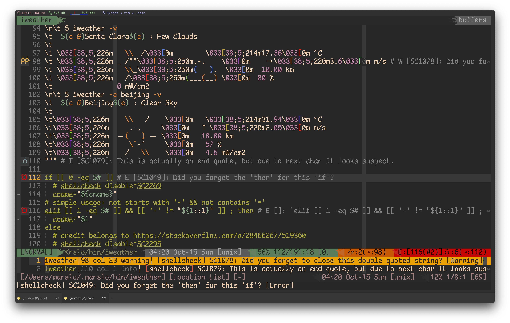](https://marslo.github.io/ibook/screenshot/vim/vim-airline-ale-comicmono.png)

[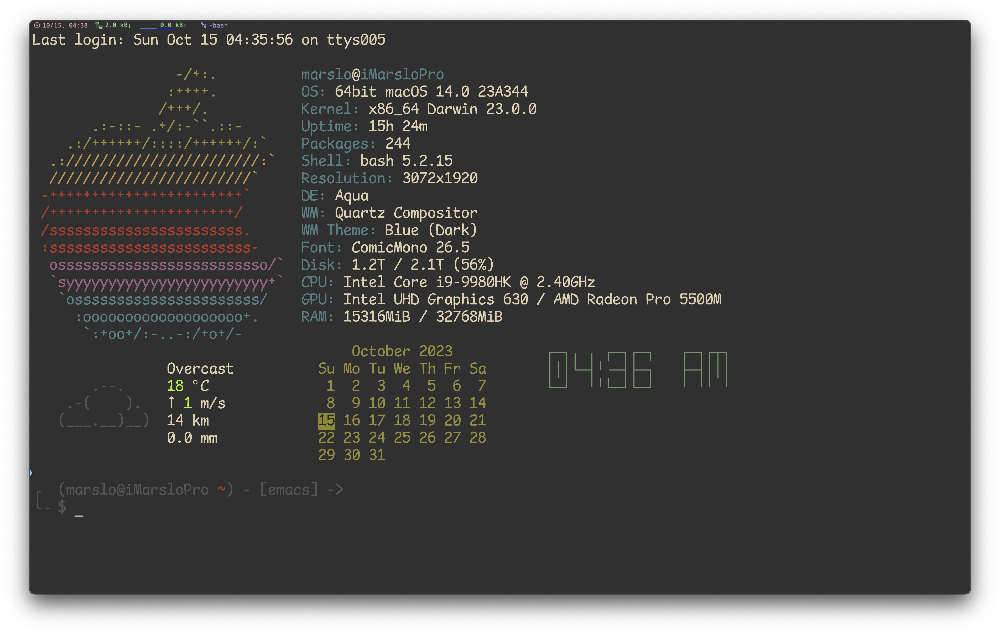](https://marslo.github.io/ibook/screenshot/tools/fonts/bash-ComicMonoNF.png)

### [Agave](https://github.com/blobject/agave)

> [!NOTE|label:references:]
> - [Agave Nerd Font Mono](https://github.com/ryanoasis/nerd-fonts/tree/master/patched-fonts/Agave)

- [AgaveNerdFontMono-Regular.ttf](https://github.com/ryanoasis/nerd-fonts/raw/master/patched-fonts/Agave/AgaveNerdFontMono-Regular.ttf)
- [AgaveNerdFontMono-Bold.ttf](https://github.com/ryanoasis/nerd-fonts/raw/master/patched-fonts/Agave/AgaveNerdFontMono-Bold.ttf)

```bash
$ curl --create-dirs -O --output-dir "${fontsPath}" \
       https://github.com/ryanoasis/nerd-fonts/raw/master/patched-fonts/Agave/AgaveNerdFontMono-Regular.ttf
$ curl --create-dirs -O --output-dir "${fontsPath}" \
       https://github.com/ryanoasis/nerd-fonts/raw/master/patched-fonts/Agave/AgaveNerdFontMono-Bold.ttf
```

[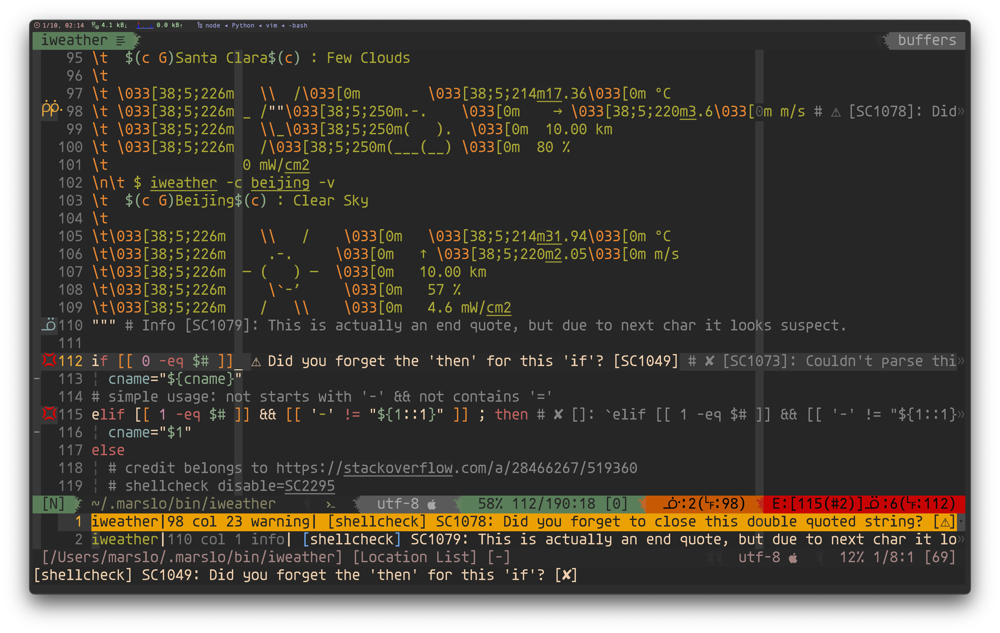](https://marslo.github.io/ibook/screenshot/vim/vim-airline-ale-agave.png)

[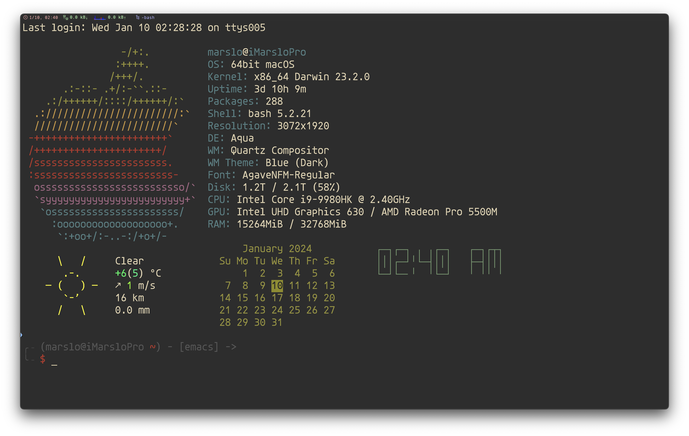](https://marslo.github.io/ibook/screenshot/tools/fonts/bash-AgaveNFM.png)

### [Operator Mono](https://www.typography.com/fonts/operator/styles/operatormono)

> [!NOTE|label:referencess:]
> - [40huo/Patched-Fonts - otf](https://github.com/40huo/Patched-Fonts) | [NF patched fonts - otf](https://github.com/keyding/Operator-Mono/tree/c67835e29097946b19fb3061ba661ee3bf61e57e)
> - [* xiyaowong/Operator-Fonts - ttf](https://github.com/xiyaowong/Operator-Fonts) | [mirror](https://github.com/marslo/Operator-Fonts)
> - [* beichensky/Font](https://github.com/beichensky/Font) | [为VSCode 设置好看的字体：Operator Mono](https://blog.csdn.net/zgd826237710/article/details/94137781?spm=1001.2014.3001.5501) | [mirror](https://github.com/imarslo/Font)
> - [补丁字体：Operator Mono的书呆子字体补丁](https://download.csdn.net/download/weixin_42104778/15068342)
> - [ajaybhatia/operator-mono-nerd-fonts](https://github.com/ajaybhatia/operator-mono-nerd-fonts) | [mirror](https://github.com/imarslo/operator-mono-nerd-fonts)
> - [TarunDaCoder/OperatorMono_NerdFont](https://github.com/TarunDaCoder/OperatorMono_NerdFont) | [mirror](https://github.com/imarslo/OperatorMono_NerdFont)
> - ligatures:
>   - [Operator Mono Ligatures Files](https://sourceforge.net/projects/operator-mono-ligatures.mirror/files/v2.5.2/)
>   - [kiliman/operator-mono-lig](https://github.com/kiliman/operator-mono-lig/tree/master)


[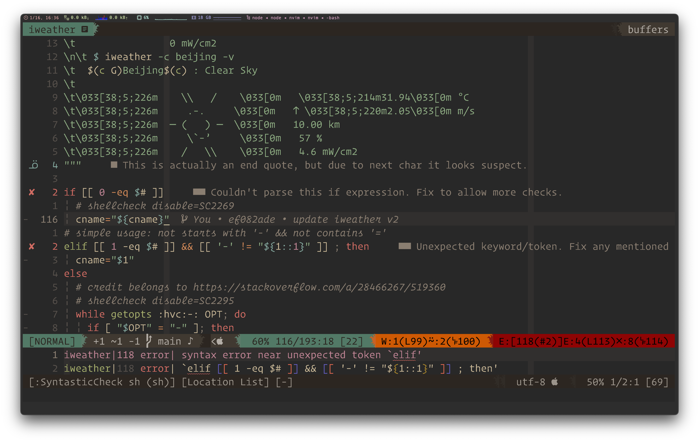](https://marslo.github.io/ibook/screenshot/tools/fonts/bash-operatorMonoNerd-airline.png)

[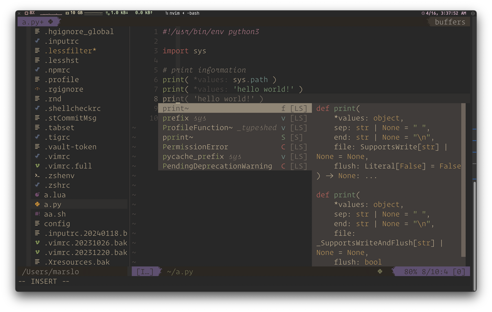](https://marslo.github.io/ibook/screenshot/tools/fonts/nvim-operator-mono-nerdtree-devicon-coc.png)

- patched via `Nerd Fonts Patcher v3.2.1.1 (4.13.1) (ff 20230101)`

  ```bash
  $ curl --create-dirs -O --output-dir "${fontsPath}" \
         -fsSL --remote-name-all \
         https://github.com/marslo/fonts/raw/fonts/Operator/OperatorMono/OperatorMono-Light.otf \
         https://github.com/marslo/fonts/raw/fonts/Operator/OperatorMono/OperatorMono-LightItalic.otf
  ```

  <!--sec data-title="previous version" data-id="section1" data-show=true data-collapse=true ces-->
  ```bash
  # Mono NF otf
  $ curl --create-dirs -O --output-dir "${fontsPath}" \
         -fsSL --remote-name-all \
         https://github.com/40huo/Patched-Fonts/raw/master/operator-mono-nerd-font/Operator%20Mono%20Light%20Italic%20Nerd%20Font%20Complete.otf \
         https://github.com/40huo/Patched-Fonts/raw/master/operator-mono-nerd-font/Operator%20Mono%20Light%20Italic%20Nerd%20Font%20Complete.otf

  # Mono NF ttf
  $ curl --create-dirs -O --output-dir "${fontsPath}" \
         -fsSL --remote-name-all \
         https://github.com/xiyaowong/Operator-Fonts/raw/master/Operator%20Mono%20Nerd%20Font/Operator%20Mono%20Light%20Italic%20Nerd%20Font%20Complete.ttf \
         https://github.com/xiyaowong/Operator-Fonts/raw/master/Operator%20Mono%20Nerd%20Font/Operator%20Mono%20Light%20Italic%20Nerd%20Font%20Complete.ttf

  # Pro NF
  $ curl --create-dirs -O --output-dir "${fontsPath}" \
         -fsSL --remote-name-all \
         https://github.com/xiyaowong/Operator-Fonts/raw/master/Operator%20Pro%20Nerd%20Font/Operator%20Pro%20Light%20Italic%20Nerd%20Font%20Complete.ttf \
         https://github.com/xiyaowong/Operator-Fonts/raw/master/Operator%20Pro%20Nerd%20Font/Operator%20Pro%20Light%20Nerd%20Font%20Complete.ttf

  $ showfonts | grep -e ': Operator.*Nerd Font'
  Operator Mono Light Nerd Font Complete.otf        : OperatorMono Nerd Font
  Operator Pro Light Italic Nerd Font Complete.ttf  : OperatorPro Nerd Font
  Operator Pro Light Nerd Font Complete.ttf         : OperatorPro Nerd Font
  Operator Mono Light Italic Nerd Font Complete.otf : OperatorMono Nerd Font
  ```
  <!--endsec-->

- ligatures

  ```bash
  $ ext='otf'             # or ext='ttf'
  $ curl --create-dirs -O --output-dir "${fontsPath}" \
         -fsSL --remote-name-all \
         https://github.com/marslo/fonts/raw/fonts/Operator/OperatorMonoLigNF/OperatorMonoLigNerdFontMono-Light."${ext}" \
         https://github.com/marslo/fonts/raw/fonts/Operator/OperatorMonoLigNF/OperatorMonoLigNerdFontMono-LightItalic."${ext}"
  ```

  <!--sec data-title="previous version" data-id="section2" data-show=true data-collapse=true ces-->
  ```bash
  $ curl --create-dirs -O --output-dir "${fontsPath}" \
         -fsSL --remote-name-all \
         https://github.com/beichensky/Font/raw/master/Operator%20Mono%20Lig/OperatorMonoLig-Light.otf \
         https://github.com/beichensky/Font/raw/master/Operator%20Mono%20Lig/OperatorMonoLig-LightItalic.otf

  $ showfonts | grep -e ': operator.*lig'
  OperatorMonoLig-LightItalic.otf                   : Operator Mono Lig
  OperatorMonoLig-Light.otf                         : Operator Mono Lig
  ```
  <!--endsec-->

- vim configure

  [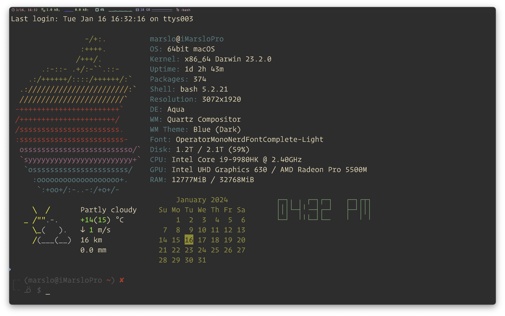](https://marslo.github.io/ibook/screenshot/tools/fonts/bash-operatorMonoNerd.png)

  [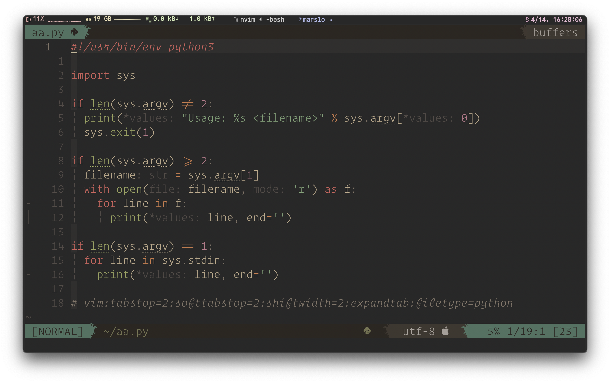](https://marslo.github.io/ibook/screenshot/tools/fonts/nvim-operator-mono-lig.png)

  ```vim
  Plug 'morhetz/gruvbox'                                              " ╮
  Plug 'sainnhe/gruvbox-material'                                     " ├ theme
  Plug 'luisiacc/gruvbox-baby', { 'branch': 'main' }                  " ╯
  Plug 'rrethy/vim-hexokinase', { 'do': 'make hexokinase' }

  set go=                                                             " hide everything (go = guioptions)
  set cpoptions+=n
  set guifont=OperatorMono\ Nerd\ Font\ Mono:h29                      " ╭ nerd font ╮ keep only one
  set guifont=OperatorMonoLig\ Nerd\ Font\ Mono:h29                   " ╰ ligatures ╯
  set renderoptions=type:directx,renmode:5

  if has( 'gui_running' ) || 'xterm-256color' == $TERM
    set background=dark
    colorscheme gruvbox-material                                      " sainnhe/gruvbox-material
  endif
  ```

### [Gohu](https://github.com/ryanoasis/nerd-fonts/tree/master/patched-fonts/Gohu)

[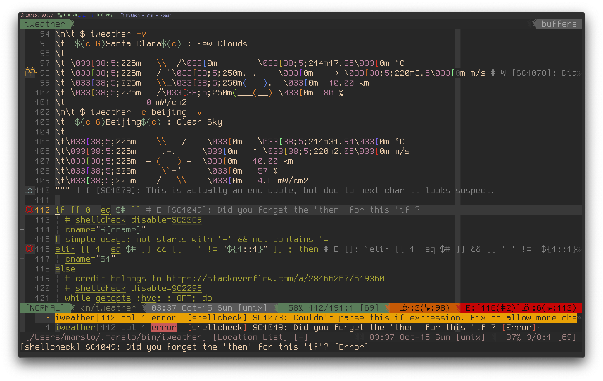](https://marslo.github.io/ibook/screenshot/vim/vim-airline-ale-2.png)

[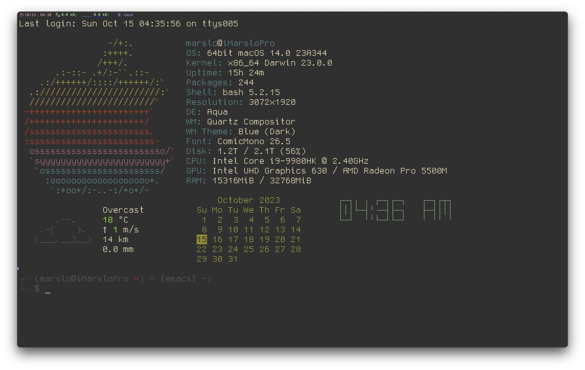](https://marslo.github.io/ibook/screenshot/tools/fonts/bash-Gohu.png)

```bash
$ curl --create-dirs -O --output-dir "${fontsPath}" \
       -fsSL --remote-name-all \
       https://github.com/ryanoasis/nerd-fonts/raw/master/patched-fonts/Gohu/uni-14/GohuFontuni14NerdFontMono-Regular.ttf \
       https://github.com/ryanoasis/nerd-fonts/raw/master/patched-fonts/Gohu/uni-11/GohuFontuni11NerdFontMono-Regular.ttf \
       https://github.com/ryanoasis/nerd-fonts/raw/master/patched-fonts/Gohu/14/GohuFont14NerdFontMono-Regular.ttf \
       https://github.com/ryanoasis/nerd-fonts/raw/master/patched-fonts/Gohu/11/GohuFont11NerdFontMono-Regular.ttf &&
  fc-cache -f -v
```

### [Monaspace RN](https://monaspace.githubnext.com/)

> [!NOTE|label:references:]
> - [monaspace nerd font](https://github.com/ryanoasis/nerd-fonts/tree/master/patched-fonts/Monaspace)
> - [Monaspace.zip](https://github.com/ryanoasis/nerd-fonts/releases/latest/download/Monaspace.zip) | [Monaspace.tar.xz](https://github.com/ryanoasis/nerd-fonts/releases/latest/download/Monaspace.tar.xz)

[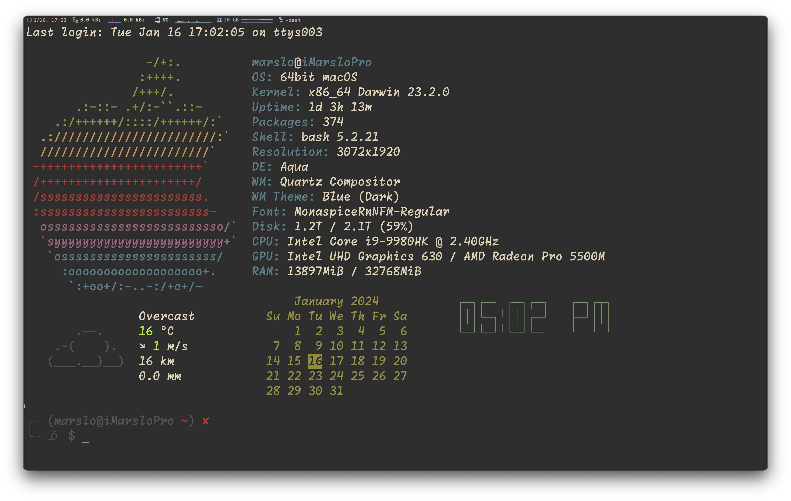](https://marslo.github.io/ibook/screenshot/tools/fonts/bash-MonaspaceRN.png)

[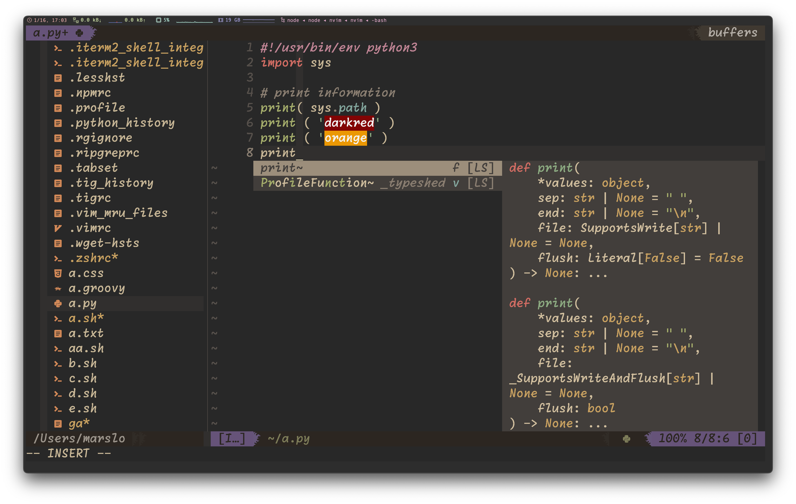](https://marslo.github.io/ibook/screenshot/tools/fonts/bash-MonaspaceRN-coc-nerdtree-hexokinase.png)

## nerd-fonts

> [!NOTE|label:refereces:]
> - [download](https://www.nerdfonts.com/font-downloads)
> - [Karmenzind/monaco-nerd-fonts](https://github.com/Karmenzind/monaco-nerd-fonts)
> - [xtevenx/ComicMonoNF](https://github.com/xtevenx/ComicMonoNF)
> - [#1103 What does --variable-width-glyphs do now?](https://github.com/ryanoasis/nerd-fonts/discussions/1103#discussioncomment-4852120)
>   - `Nerd Font Mono` (a strictly monospaced variant, created with `--mono`)
>   - `Nerd Font` (a somehow monospaced variant, maybe)
>   - `Nerd Font Propo` (a not monospaced variant, created with `--variable-width-glyphs`)

- [AgaveNerdFontMono](https://github.com/ryanoasis/nerd-fonts/raw/master/patched-fonts/Agave/AgaveNerdFontMono-Regular.ttf)
  ```bash
  $ curl --create-dirs -O --output-dir "${fontsPath}" \
         https://github.com/ryanoasis/nerd-fonts/raw/master/patched-fonts/Agave/AgaveNerdFontMono-Regular.ttf &&
    fc-cache -f -v
  ```

- [CodeNewRoman](https://github.com/ryanoasis/nerd-fonts/tree/master/patched-fonts/CodeNewRoman) another `Monaco`
  ```bash
  $ curl --create-dirs -O --output-dir "${fontsPath}" \
         https://github.com/ryanoasis/nerd-fonts/raw/master/patched-fonts/CodeNewRoman/Regular/CodeNewRomanNerdFontMono-Regular.otf &&
    fc-cache -f -v
  ```

- [DejaVuSansMono](https://github.com/ryanoasis/nerd-fonts/tree/master/patched-fonts/DejaVuSansMono) another `Monaco`
  ```bash
  $ curl --create-dirs -O --output-dir "${fontsPath}" \
         https://github.com/ryanoasis/nerd-fonts/raw/master/patched-fonts/DejaVuSansMono/Regular/DejaVuSansMNerdFontMono-Regular.ttf &&
    fc-cache -f -v
  ```

### pixel
- [BigBlueTerminal](https://github.com/ryanoasis/nerd-fonts/tree/master/patched-fonts/BigBlueTerminal)
  ```bash
  $ curl --create-dirs -O --output-dir "${fontsPath}" \
         https://github.com/ryanoasis/nerd-fonts/raw/master/patched-fonts/BigBlueTerminal/BigBlueTerm437NerdFontMono-Regular.ttf &&
    fc-cache -f -v
  ```

### hand-writing
- [Monofur](https://github.com/ryanoasis/nerd-fonts/tree/master/patched-fonts/Monofur)
  ```bash
  $ curl --create-dirs -O --output-dir "${fontsPath}" \
         https://github.com/ryanoasis/nerd-fonts/raw/master/patched-fonts/Monofur/Regular/MonofurNerdFontMono-Regular.ttf &&
    fc-cache -f -v
  ```

- [ComicShannsMono](https://github.com/ryanoasis/nerd-fonts/tree/master/patched-fonts/ComicShannsMono)
  ```bash
  $ curl --create-dirs -O --output-dir "${fontsPath}" \
         https://github.com/ryanoasis/nerd-fonts/raw/master/patched-fonts/ComicShannsMono/ComicShannsMonoNerdFontMono-Regular.otf &&
    fc-cache -f -v
  ```

- [DaddyTimeMono](https://github.com/ryanoasis/nerd-fonts/tree/master/patched-fonts/DaddyTimeMono)
  ```bash
  $ curl --create-dirs -O --output-dir "${fontsPath}" \
         https://github.com/ryanoasis/nerd-fonts/raw/master/patched-fonts/DaddyTimeMono/DaddyTimeMonoNerdFontMono-Regular.ttf &&
    fc-cache -f -v
  ```

- [FantasqueSansMono](https://github.com/ryanoasis/nerd-fonts/tree/master/patched-fonts/FantasqueSansMono)
  ```bash
  $ curl --create-dirs -O --output-dir "${fontsPath}" \
         https://github.com/ryanoasis/nerd-fonts/raw/master/patched-fonts/FantasqueSansMono/Regular/FantasqueSansMNerdFontMono-Regular.ttf &&
    fc-cache -f -v
```

- [Hermit](https://github.com/ryanoasis/nerd-fonts/tree/master/patched-fonts/Hermit)
  ```bash
  $ curl --create-dirs -O --output-dir "${fontsPath}" \
         https://github.com/ryanoasis/nerd-fonts/raw/master/patched-fonts/Hermit/Regular/HurmitNerdFontMono-Regular.otf &&
    fc-cache -f -v
  ```

### symbole
- [NerdFontsSymbolsOnly](https://github.com/ryanoasis/nerd-fonts/tree/master/patched-fonts/NerdFontsSymbolsOnly)
  ```bash
  $ curl --create-dirs -O --output-dir "${fontsPath}" \
         https://github.com/ryanoasis/nerd-fonts/raw/master/patched-fonts/NerdFontsSymbolsOnly/SymbolsNerdFontMono-Regular.ttf &&
    fc-cache -f -v
  ```

### others
- [CascadiaCode](https://github.com/ryanoasis/nerd-fonts/tree/master/patched-fonts/CascadiaCode)
- [EnvyCodeR](https://github.com/ryanoasis/nerd-fonts/tree/master/patched-fonts/EnvyCodeR)
- [IBMPlexMono](https://github.com/ryanoasis/nerd-fonts/tree/master/patched-fonts/IBMPlexMono)
- JetBrains [original](https://www.jetbrains.com/lp/mono/) | [JetBrains Nerd Font](https://github.com/ryanoasis/nerd-fonts/tree/master/patched-fonts/JetBrainsMono)
- [FantasqueSansM](https://github.com/belluzj/fantasque-sans) | [NF download](https://github.com/ryanoasis/nerd-fonts/releases/download/v3.3.0/FantasqueSansMono.zip)

  [](https://github.com/iamcco/coc-svg?tab=readme-ov-file)

- [lekton](https://www.fontsquirrel.com/fonts/lekton) | [download NF](https://github.com/ryanoasis/nerd-fonts/releases/download/v3.3.0/Lekton.zip) | [Lekton info](https://online-fonts.com/fonts/lekton)

## powerline fonts

> [!NOTE|label:references:]
> - [Comic Mono font](https://www.reddit.com/r/programming/comments/kj0prs/comment/ggvwadd/?utm_source=share&utm_medium=web2x&context=3)
> - [Showing special Unicode characters on MacOS](https://discussions.apple.com/thread/251585417)
> - [GNU Unifont Glyphs](https://unifoundry.com/unifont/)
> - [* lujiacn/Monaco for Powerline.md](https://gist.github.com/lujiacn/32b598b1a6a43c996cbd93d42d466466)
>   - [Monaco for Powerline.ttf](https://gist.github.com/lujiacn/32b598b1a6a43c996cbd93d42d466466/raw/5be6ef0e44a3427fdb8343b4dacc29716449c59e/Monaco%2520for%2520Powerline.ttf)
> - [* supermarin/powerline-fonts](https://github.com/supermarin/powerline-fonts)
>   - [Monaco for Powerline.otf](https://github.com/supermarin/powerline-fonts/tree/master/Monaco)
>   - [Menlo Regular for Powerline.otf](https://github.com/supermarin/powerline-fonts/tree/master/Menlo)
>   - [DejaVu Sans Mono for Powerline.otf](https://github.com/supermarin/powerline-fonts/raw/master/DejaVuSansMono/DejaVu%20Sans%20Mono%20for%20Powerline.otf)
> - [* powerline/fonts](https://github.com/powerline/fonts) ~ [AnwarShah/fonts](https://github.com/AnwarShah/fonts)
>   - [Monofur for Powerline.ttf](https://github.com/powerline/fonts/tree/master/Monofur)
> - [* Twixes/SF-Mono-Powerline](https://github.com/Twixes/SF-Mono-Powerline)
> - [* benbusby/anomaly-mono](https://github.com/benbusby/anomaly-mono)
> - [yumitsu/font-menlo-extra](https://github.com/yumitsu/font-menlo-extra)
> - [ithewei/powerline-fonts](https://gitee.com/ithewei/powerline-fonts)
> - [JayXon/powerline-web-fonts](https://github.com/JayXon/powerline-web-fonts)
> - [github topic: powerline-fonts](https://github.com/topics/powerline-fonts)
> - [ryanoasis/nerd-fonts](https://github.com/ryanoasis/nerd-fonts)
> - [Powerline Fonts](https://sourceforge.net/projects/powerline-fonts.mirror/)
> - windows
>   - [Change font for non-legacy command prompt in Windows 10 with non-ASCII charset - Properties vs default values?](https://superuser.com/a/1202335/112396)
>   - [gdetrez/powerline-test.sh](https://gist.github.com/gdetrez/5845092)


- install via package tool
  ```bash
  # debian
  $ sudo apt-get install fonts-powerline

  # centos/rhel
  $ sudo dnf install powerline-fonts
  ```

- install via cmd

  > [!TIP|label:fonts path in different system:]
  > - linux: `$HOME/.local/share/fonts`
  > - osx : `$HOME/Library/Fonts`
  >   ```bash
  >   $ fontPath=$HOME/Library/Fonts
  >   $ fontPath=$HOME/.local/share/fonts
  >   ```

  - via powershell
    ```powershell
    > Invoke-WebRequest -Uri "https://dtinth.github.io/comic-mono-font/ComicMono.ttf" -OutFile "ComicMono.ttf"; Invoke-WebRequest -Uri "https://dtinth.github.io/comic-mono-font/ComicMono-Bold.ttf" -OutFile "ComicMono-Bold.ttf"; $fonts = (New-Object -ComObject Shell.Application).Namespace(0x14); Get-ChildItem -include ComicMono* | % { $fonts.CopyHere($_.fullname) }
    ```

  - [cominc mono](https://dtinth.github.io) && [comic mono for powerline](https://github.com/marslo/mytools/raw/master/others/fonts/monospace/Comic-Mono-for-Powerline.ttf)
    ```bash
    # regular
    $ curl --create-dirs -O --output-dir "${fontsPath}" \
           https://dtinth.github.io/comic-mono-font/ComicMono.ttf &&
      curl --create-dirs -O --output-dir "${fontsPath}" \
           https://dtinth.github.io/comic-mono-font/ComicMono-Bold.ttf &&
      fc-cache -f -v

    # for powerline/vim-airline
    $ curl --create-dirs -O --output-dir "${fontsPath}" \
           https://github.com/marslo/mytools/raw/master/others/fonts/monospace/Comic-Mono-for-Powerline.ttf &&
      fc-cache -f -v
    ```

  - [monaco for powerline osx version](https://github.com/marslo/mytools/raw/master/others/fonts/monospace/Monaco-for-Powerline.otf) && [monaco for powerline windows version](https://github.com/marslo/mytools/raw/master/others/fonts/monospace/Monaco-for-Powerline.ttf)
    ```bash
    $ curl --create-dirs -O --output-dir "${fontsPath}" \
           https://github.com/marslo/mytools/raw/master/others/fonts/monospace/Monaco-for-Powerline.otf &&
      fc-cache -f -v
    ```

  - [menlo for powerline](https://github.com/marslo/mytools/raw/master/others/fonts/monospace/Menlo-Regular.ttf)
    ```bash
    $ curl --create-dirs -O --output-dir "${fontsPath}" \
           https://github.com/marslo/mytools/raw/master/others/fonts/monospace/Menlo-Regular.ttf &&
      fc-cache -f -v
    ```

  - [monofur for powerline](https://github.com/powerline/fonts/tree/master/Monofur)
    ```bash
    $ curl --create-dirs -O --output-dir "${fontsPath}" \
           https://github.com/powerline/fonts/raw/master/Monofur/Monofur%20for%20Powerline.ttf &&
      curl --create-dirs -O --output-dir "${fontsPath}" \
           https://github.com/powerline/fonts/raw/master/Monofur/Monofur%20Italic%20for%20Powerline.ttf &&
      curl --create-dirs -O --output-dir "${fontsPath}" \
           https://github.com/powerline/fonts/raw/master/Monofur/Monofur%20Bold%20for%20Powerline.ttf &&
      fc-cache -f -v
    ```

  - [sf-mono for powerline](https://github.com/Twixes/SF-Mono-Powerline)
    ```bash
    $ curl --create-dirs -O --output-dir "${fontsPath}" \
           https://github.com/Twixes/SF-Mono-Powerline/raw/master/SF-Mono-Powerline-Regular.otf &&
      curl --create-dirs -O --output-dir "${fontsPath}" \
           https://github.com/Twixes/SF-Mono-Powerline/raw/master/SF-Mono-Powerline-RegularItalic.otf &&
      curl --create-dirs -O --output-dir "${fontsPath}" \
           https://github.com/Twixes/SF-Mono-Powerline/raw/master/SF-Mono-Powerline-Bold.otf &&
      curl --create-dirs -O --output-dir "${fontsPath}" \
           https://github.com/Twixes/SF-Mono-Powerline/raw/master/SF-Mono-Powerline-BoldItalic.otf &&
      fc-cache -f -v
    ```

  - [anomaly mono for powerline](https://github.com/benbusby/anomaly-mono)
    ```bash
    $ curl --create-dirs -O --output-dir "${fontsPath}" \
           https://github.com/benbusby/anomaly-mono/raw/master/AnomalyMono-Powerline.otf &&
      fc-cache -f -v
    ```

## google fonts

> [!NOTE|label:references:]
> - [google/fonts](https://github.com/google/fonts)
> - [fonts.google.com](https://fonts.google.com/)

## tips

> [!NOTE|label:references:]
> - [分享字体表中的部分中文字体，自取自用 #46](https://github.com/F9y4ng/GreasyFork-Scripts/discussions/46)
> - [到底有哪些好看又免费的字体？这篇合集快收藏！](https://www.hellofont.cn/newsdetail?id=255)
> - [好看的中文字体 - 字形预览](https://ifonts.com/font/haokandezhongwenziti.html)
> - [字体天下](https://www.fonts.net.cn/)

### Mac Office Fonts

> [!TIP|label:references:]
> - CloudFonts:
>   - osx: `~/Library/Group Containers/UBF8T346G9.Office/FontCache/4/CloudFonts`
>   - windows: `%LOCALAPPDATA%\Microsoft\FontCache\4\CloudFonts`
> - Default Fonts:
>   - osx:
>     - outlook: `/Applications/Microsoft Outlook.app/Contents/Resources/DFonts`
>     - word: `/Applications/Microsoft Word.app/Contents/Resources/DFonts`
> - OfficeFonts:
>   - osx: `~/Library/Fonts`
>   - windows: `%LOCALAPPDATA%\Microsoft\Windows\Fonts`
