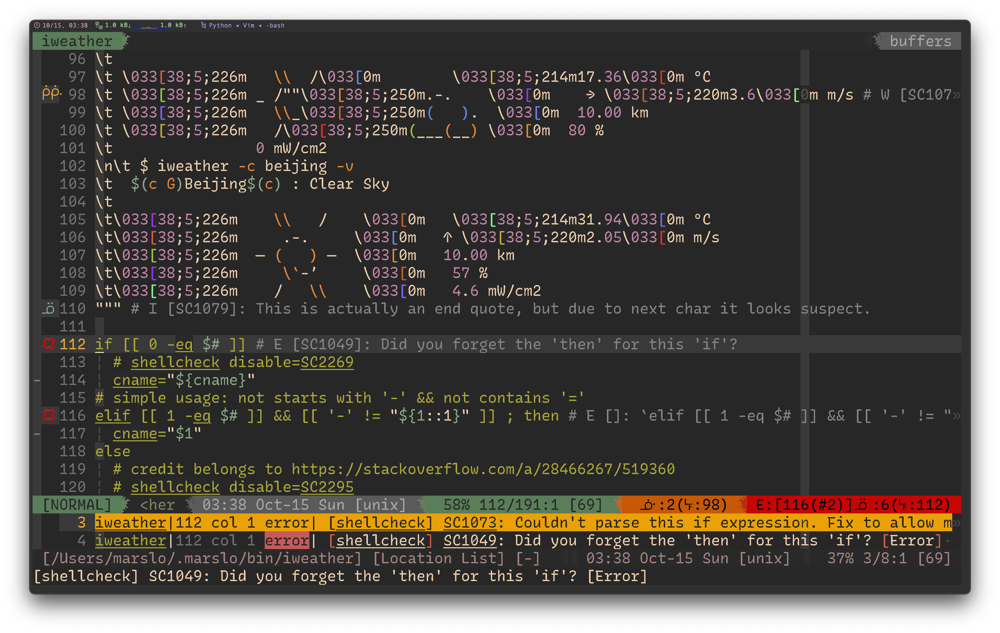

<!-- START doctoc generated TOC please keep comment here to allow auto update -->
<!-- DON'T EDIT THIS SECTION, INSTEAD RE-RUN doctoc TO UPDATE -->

- [list current fonts](#list-current-fonts)
- [highly recommended](#highly-recommended)
  - [Monaco](#monaco)
  - [RecMonoCasual](#recmonocasual)
  - [Comic Mono](#comic-mono)
  - [Agave](#agave)
  - [Operator Mono](#operator-mono)
  - [Gohu](#gohu)
  - [Monaspace RN](#monaspace-rn)
- [nerd-fonts](#nerd-fonts)
  - [pixel](#pixel)
  - [hand-writing](#hand-writing)
  - [symbole](#symbole)
  - [others](#others)
- [powerline fonts](#powerline-fonts)
- [devicons](#devicons)
  - [coding](#coding)
  - [folders](#folders)
  - [platform](#platform)
  - [math](#math)
  - [graph](#graph)
  - [tiaji](#tiaji)
  - [misc.](#misc)

<!-- END doctoc generated TOC please keep comment here to allow auto update -->

> [!TIP]
> - [* 142 Programming Fonts](https://www.programmingfonts.org/)
> - [* arrowtype/recursive](https://github.com/arrowtype/recursive)
> - [* ryanoasis/nerd-fonts](https://github.com/ryanoasis/nerd-fonts)
> - [Patch Fonts with Cursive Italic Styles](https://www.sainnhe.dev/post/patch-fonts-with-cursive-italic-styles/)
> - [sainnhe/icursive-nerd-font](https://git.sainnhe.dev/sainnhe/icursive-nerd-font) | [thlineric/icursive-nerd-font](https://github.com/thlineric/icursive-nerd-font) | [sainnhe/mono-nerd-font](https://git.sainnhe.dev/sainnhe/mono-nerd-font) | [40huo/Patched-Fonts](https://github.com/40huo/Patched-Fonts)
> - [INPUT™ fonts](https://input.djr.com/download/)
> - [Consolas font family](https://learn.microsoft.com/en-us/typography/font-list/consolas)
> - [monaspace](https://monaspace.githubnext.com/)
>   - [monaspace nerd font](https://github.com/ryanoasis/nerd-fonts/tree/master/patched-fonts/Monaspace) | [Monaspace.zip](https://github.com/ryanoasis/nerd-fonts/releases/latest/download/Monaspace.zip) | [Monaspace.tar.xz](https://github.com/ryanoasis/nerd-fonts/releases/latest/download/Monaspace.tar.xz)
> - [ryanoasis/powerline-extra-symbols](https://github.com/ryanoasis/powerline-extra-symbols)
> - [ArrowType](https://www.arrowtype.com/)
> - [oldschool font list](https://int10h.org/oldschool-pc-fonts/fontlist/)
> - [subframe7536/maple-font](https://github.com/subframe7536/Maple-font)

## list current fonts

> [!NOTE|label:references:]
> - [Which font is used in Visual Studio Code Editor and how to change fonts?](https://stackoverflow.com/a/52789662/2940319)

```bash
$ fc-list | sed -re 's/^.+\/([^:]+):\s?([^,:]+),?:?.*$/\1 : \2/g' | column -t -s: -o:

# or
$ fc-list | awk '{$1=""}1' | sed -re 's/^\s*([^:,]+:?,?[^,:]+).*$/\1/' | column -t -s:
```

- i.e.:
  ```bash
  $ fc-list | sed -re 's/^.+\/([^:]+):\s?([^,:]+),?:?.*$/\1 : \2/g' | column -t -s: -o: | grep operator
  OperatorMonoLig-LightItalic.otf                   : Operator Mono Lig
  Operator Mono Light Nerd Font Complete.otf        : OperatorMono Nerd Font
  Operator Pro Light Italic Nerd Font Complete.ttf  : OperatorPro Nerd Font
  OperatorMonoLig-Light.otf                         : Operator Mono Lig
  Operator Pro Light Nerd Font Complete.ttf         : OperatorPro Nerd Font
  Operator Mono Light Italic Nerd Font Complete.otf : OperatorMono Nerd Font
  ```

## highly recommended

> [!TIP]
> - `fontPath`:
>   - osx: `~/Library/Fonts` or `/System/Fonts`
>   - Linux: `~/.fonts` or `~/.local/share/fonts` or `/usr/share/fonts`

### Monaco

> [!NOTE]
> THE BEST ALWAYS !

- [Monaco](https://www.cufonfonts.com/font/monaco)
- Nerd-Fonts
  - [Monaco Nerd Font Mono](https://github.com/Karmenzind/monaco-nerd-fonts)
  - [Monaco Nerd Font](https://github.com/thep0y/monaco-nerd-font)
- Powerline
  - [Monaco for Powerline.ttf](https://gist.github.com/lujiacn/32b598b1a6a43c996cbd93d42d466466/raw/5be6ef0e44a3427fdb8343b4dacc29716449c59e/Monaco%2520for%2520Powerline.ttf)
  - [Monaco for Powerline.otf](https://github.com/supermarin/powerline-fonts/tree/master/Monaco)


### [RecMonoCasual](https://github.com/arrowtype/recursive/tree/main/fonts/ArrowType-Recursive-1.085/Recursive_Code)
```bash
$ curl --create-dirs -O --output-dir "${fontsPath}" \
       https://github.com/arrowtype/recursive/raw/main/fonts/ArrowType-Recursive-1.085/Recursive_Code/RecMonoCasual/RecMonoCasual-Regular-1.085.ttf &&
$ curl --create-dirs -O --output-dir "${fontsPath}" \
       https://github.com/arrowtype/recursive/raw/main/fonts/ArrowType-Recursive-1.085/Recursive_Code/RecMonoDuotone/RecMonoDuotone-Regular-1.085.ttf &&
$ curl --create-dirs -O --output-dir "${fontsPath}" \
       https://github.com/arrowtype/recursive/raw/main/fonts/ArrowType-Recursive-1.085/Recursive_Code/RecMonoLinear/RecMonoLinear-Regular-1.085.ttf &&
$ curl --create-dirs -O --output-dir "${fontsPath}" \
       https://github.com/arrowtype/recursive/blob/main/fonts/ArrowType-Recursive-1.085/Recursive_Code/RecMonoSemicasual/RecMonoSemicasual-Regular-1.085.ttf &&
  fc-cache -f -v

# or
$ version=1.085
$ url='https://github.com/arrowtype/recursive/blob/main/fonts/ArrowType-Recursive-1.085/Recursive_Code/'
$ while read -r _t; do
    curl --create-dirs -O --output-dir "${fontsPath}" \
         "${url}"/"RecMono${_t}/RecMono${_t}-Regular-1.085.ttf"
  done < <( echo 'Casual Duotone Linear Semicasual' | fmt -1 )
$ fc-cache -f -v
```




### [Comic Mono](https://dtinth.github.io/comic-mono-font/)

> [!NOTE|label:references:]
> - [knolljo/comic-mono-nerd](https://codeberg.org/knolljo/comic-mono-nerd)

- [Comic Mono](https://dtinth.github.io/comic-mono-font/ComicMono.ttf)
- [Comic Mono for NF](https://github.com/xtevenx/ComicMonoNF) or [here](https://codeberg.org/knolljo/comic-mono-nerd/raw/branch/master/ComicMonoNerd.ttf)


### [Agave](https://github.com/blobject/agave)

> [!NOTE|label:references:]
> - [Agave Nerd Font Mono](https://github.com/ryanoasis/nerd-fonts/tree/master/patched-fonts/Agave)

- [AgaveNerdFontMono-Regular.ttf](https://github.com/ryanoasis/nerd-fonts/raw/master/patched-fonts/Agave/AgaveNerdFontMono-Regular.ttf)
- [AgaveNerdFontMono-Bold.ttf](https://github.com/ryanoasis/nerd-fonts/raw/master/patched-fonts/Agave/AgaveNerdFontMono-Bold.ttf)

```bash
$ curl --create-dirs -O --output-dir "${fontsPath}" \
       https://github.com/ryanoasis/nerd-fonts/raw/master/patched-fonts/Agave/AgaveNerdFontMono-Regular.ttf
$ curl --create-dirs -O --output-dir "${fontsPath}" \
       https://github.com/ryanoasis/nerd-fonts/raw/master/patched-fonts/Agave/AgaveNerdFontMono-Bold.ttf
```


### [Operator Mono](https://www.typography.com/fonts/operator/styles/operatormono)

> [!NOTE|label:referencess:]
> - [40huo/Patched-Fonts - otf](https://github.com/40huo/Patched-Fonts) | [NF patched fonts - otf](https://github.com/keyding/Operator-Mono/tree/c67835e29097946b19fb3061ba661ee3bf61e57e)
> - [* xiyaowong/Operator-Fonts - ttf](https://github.com/xiyaowong/Operator-Fonts) | [mirror](https://github.com/marslo/Operator-Fonts)
> - [* beichensky/Font](https://github.com/beichensky/Font) | [为VSCode 设置好看的字体：Operator Mono](https://blog.csdn.net/zgd826237710/article/details/94137781?spm=1001.2014.3001.5501) | [mirror](https://github.com/imarslo/Font)
> - [补丁字体：Operator Mono的书呆子字体补丁](https://download.csdn.net/download/weixin_42104778/15068342)
> - [ajaybhatia/operator-mono-nerd-fonts](https://github.com/ajaybhatia/operator-mono-nerd-fonts) | [mirror](https://github.com/imarslo/operator-mono-nerd-fonts)
> - [TarunDaCoder/OperatorMono_NerdFont](https://github.com/TarunDaCoder/OperatorMono_NerdFont) | [mirror](https://github.com/imarslo/OperatorMono_NerdFont)
> - [kiliman/operator-mono-lig](https://github.com/kiliman/operator-mono-lig/tree/master)

- NF
  ```bash
  # Mono NF otf
  $ curl --create-dirs -O --output-dir "${fontsPath}" \
         https://github.com/40huo/Patched-Fonts/raw/master/operator-mono-nerd-font/Operator%20Mono%20Light%20Italic%20Nerd%20Font%20Complete.otf
  $ curl --create-dirs -O --output-dir "${fontsPath}" \
         https://github.com/40huo/Patched-Fonts/raw/master/operator-mono-nerd-font/Operator%20Mono%20Light%20Italic%20Nerd%20Font%20Complete.otf

  # Mono NF ttf
  $ curl --create-dirs -O --output-dir "${fontsPath}" \
         https://github.com/xiyaowong/Operator-Fonts/raw/master/Operator%20Mono%20Nerd%20Font/Operator%20Mono%20Light%20Italic%20Nerd%20Font%20Complete.ttf
  $ curl --create-dirs -O --output-dir "${fontsPath}" \
         https://github.com/xiyaowong/Operator-Fonts/raw/master/Operator%20Mono%20Nerd%20Font/Operator%20Mono%20Light%20Italic%20Nerd%20Font%20Complete.ttf

  # Pro NF
  $ curl --create-dirs -O --output-dir "${fontsPath}" \
         https://github.com/xiyaowong/Operator-Fonts/raw/master/Operator%20Pro%20Nerd%20Font/Operator%20Pro%20Light%20Italic%20Nerd%20Font%20Complete.ttf
  $ curl --create-dirs -O --output-dir "${fontsPath}" \
         https://github.com/xiyaowong/Operator-Fonts/raw/master/Operator%20Pro%20Nerd%20Font/Operator%20Pro%20Light%20Nerd%20Font%20Complete.ttf

  $ showfonts | grep -e ': Operator.*Nerd Font'
  Operator Mono Light Nerd Font Complete.otf        : OperatorMono Nerd Font
  Operator Pro Light Italic Nerd Font Complete.ttf  : OperatorPro Nerd Font
  Operator Pro Light Nerd Font Complete.ttf         : OperatorPro Nerd Font
  Operator Mono Light Italic Nerd Font Complete.otf : OperatorMono Nerd Font
  ```

- ligatures
  ```bash
  $ curl --create-dirs -O --output-dir "${fontsPath}" \
         https://github.com/beichensky/Font/raw/master/Operator%20Mono%20Lig/OperatorMonoLig-Light.otf
  $ curl --create-dirs -O --output-dir "${fontsPath}" \
         https://github.com/beichensky/Font/raw/master/Operator%20Mono%20Lig/OperatorMonoLig-LightItalic.otf
  $ showfonts | grep -e ': operator.*lig'
  OperatorMonoLig-LightItalic.otf                   : Operator Mono Lig
  OperatorMonoLig-Light.otf                         : Operator Mono Lig
  ```

- vim configure
  ```vim
  Plug 'morhetz/gruvbox'                                              " ╮
  Plug 'sainnhe/gruvbox-material'                                     " ├ theme
  Plug 'luisiacc/gruvbox-baby', { 'branch': 'main' }                  " ╯
  Plug 'rrethy/vim-hexokinase', { 'do': 'make hexokinase' }

  set go=                                                             " hide everything (go = guioptions)
  set cpoptions+=n
  set termguicolors
  set guifont=OperatorMono\ Nerd\ Font:h29                            " ╭  nerd font ╮ keep only one
  set guifont=Operator\ Mono\ Lig:h29                                 " ╰  ligatures ╯
  set renderoptions=type:directx,renmode:5

  if has( 'gui_running' ) || 'xterm-256color' == $TERM
    set background=dark
    colorscheme gruvbox-material                                      " sainnhe/gruvbox-material
  endif
  ```


### [Gohu](https://github.com/ryanoasis/nerd-fonts/tree/master/patched-fonts/Gohu)
```bash
$ curl --create-dirs -O --output-dir "${fontsPath}" \
       https://github.com/ryanoasis/nerd-fonts/raw/master/patched-fonts/Gohu/uni-14/GohuFontuni14NerdFontMono-Regular.ttf &&
$ curl --create-dirs -O --output-dir "${fontsPath}" \
       https://github.com/ryanoasis/nerd-fonts/raw/master/patched-fonts/Gohu/uni-11/GohuFontuni11NerdFontMono-Regular.ttf &&
$ curl --create-dirs -O --output-dir "${fontsPath}" \
       https://github.com/ryanoasis/nerd-fonts/raw/master/patched-fonts/Gohu/14/GohuFont14NerdFontMono-Regular.ttf &&
$ curl --create-dirs -O --output-dir "${fontsPath}" \
       https://github.com/ryanoasis/nerd-fonts/raw/master/patched-fonts/Gohu/11/GohuFont11NerdFontMono-Regular.ttf &&
  fc-cache -f -v
```


### [Monaspace RN](https://monaspace.githubnext.com/)

> [!NOTE|label:references:]
> - [monaspace nerd font](https://github.com/ryanoasis/nerd-fonts/tree/master/patched-fonts/Monaspace)
> - [Monaspace.zip](https://github.com/ryanoasis/nerd-fonts/releases/latest/download/Monaspace.zip) | [Monaspace.tar.xz](https://github.com/ryanoasis/nerd-fonts/releases/latest/download/Monaspace.tar.xz)


## nerd-fonts

> [!NOTE|label:refereces:]
> - [download](https://www.nerdfonts.com/font-downloads)
> - [Karmenzind/monaco-nerd-fonts](https://github.com/Karmenzind/monaco-nerd-fonts)
> - [xtevenx/ComicMonoNF](https://github.com/xtevenx/ComicMonoNF)
> - [#1103 What does --variable-width-glyphs do now?](https://github.com/ryanoasis/nerd-fonts/discussions/1103#discussioncomment-4852120)
>   - `Nerd Font Mono` (a strictly monospaced variant, created with `--mono`)
>   - `Nerd Font` (a somehow monospaced variant, maybe)
>   - `Nerd Font Propo` (a not monospaced variant, created with `--variable-width-glyphs`)

- [AgaveNerdFontMono](https://github.com/ryanoasis/nerd-fonts/blob/master/patched-fonts/Agave/AgaveNerdFontMono-Regular.ttf)
  ```bash
  $ curl --create-dirs -O --output-dir "${fontsPath}" \
         https://github.com/ryanoasis/nerd-fonts/raw/master/patched-fonts/Agave/AgaveNerdFontMono-Regular.ttf &&
    fc-cache -f -v
  ```

- [CodeNewRoman](https://github.com/ryanoasis/nerd-fonts/tree/master/patched-fonts/CodeNewRoman) another `Monaco`
  ```bash
  $ curl --create-dirs -O --output-dir "${fontsPath}" \
         https://github.com/ryanoasis/nerd-fonts/raw/master/patched-fonts/CodeNewRoman/Regular/CodeNewRomanNerdFontMono-Regular.otf &&
    fc-cache -f -v
  ```

- [DejaVuSansMono](https://github.com/ryanoasis/nerd-fonts/tree/master/patched-fonts/DejaVuSansMono) another `Monaco`
  ```bash
  $ curl --create-dirs -O --output-dir "${fontsPath}" \
         https://github.com/ryanoasis/nerd-fonts/raw/master/patched-fonts/DejaVuSansMono/Regular/DejaVuSansMNerdFontMono-Regular.ttf &&
    fc-cache -f -v
  ```

### pixel
- [BigBlueTerminal](https://github.com/ryanoasis/nerd-fonts/tree/master/patched-fonts/BigBlueTerminal)
  ```bash
  $ curl --create-dirs -O --output-dir "${fontsPath}" \
         https://github.com/ryanoasis/nerd-fonts/raw/master/patched-fonts/BigBlueTerminal/BigBlueTerm437NerdFontMono-Regular.ttf &&
    fc-cache -f -v
  ```

### hand-writing
- [Monofur](https://github.com/ryanoasis/nerd-fonts/tree/master/patched-fonts/Monofur)
  ```bash
  $ curl --create-dirs -O --output-dir "${fontsPath}" \
         https://github.com/ryanoasis/nerd-fonts/raw/master/patched-fonts/Monofur/Regular/MonofurNerdFontMono-Regular.ttf &&
    fc-cache -f -v
  ```

- [ComicShannsMono](https://github.com/ryanoasis/nerd-fonts/tree/master/patched-fonts/ComicShannsMono)
  ```bash
  $ curl --create-dirs -O --output-dir "${fontsPath}" \
         https://github.com/ryanoasis/nerd-fonts/raw/master/patched-fonts/ComicShannsMono/ComicShannsMonoNerdFontMono-Regular.otf &&
    fc-cache -f -v
  ```

- [DaddyTimeMono](https://github.com/ryanoasis/nerd-fonts/tree/master/patched-fonts/DaddyTimeMono)
  ```bash
  $ curl --create-dirs -O --output-dir "${fontsPath}" \
         https://github.com/ryanoasis/nerd-fonts/raw/master/patched-fonts/DaddyTimeMono/DaddyTimeMonoNerdFontMono-Regular.ttf &&
    fc-cache -f -v
  ```

- [FantasqueSansMono](https://github.com/ryanoasis/nerd-fonts/tree/master/patched-fonts/FantasqueSansMono)
  ```bash
  $ curl --create-dirs -O --output-dir "${fontsPath}" \
         https://github.com/ryanoasis/nerd-fonts/raw/master/patched-fonts/FantasqueSansMono/Regular/FantasqueSansMNerdFontMono-Regular.ttf &&
    fc-cache -f -v
```

- [Hermit](https://github.com/ryanoasis/nerd-fonts/tree/master/patched-fonts/Hermit)
  ```bash
  $ curl --create-dirs -O --output-dir "${fontsPath}" \
         https://github.com/ryanoasis/nerd-fonts/raw/master/patched-fonts/Hermit/Regular/HurmitNerdFontMono-Regular.otf &&
    fc-cache -f -v
  ```

### symbole
- [NerdFontsSymbolsOnly](https://github.com/ryanoasis/nerd-fonts/tree/master/patched-fonts/NerdFontsSymbolsOnly)
  ```bash
  $ curl --create-dirs -O --output-dir "${fontsPath}" \
         https://github.com/ryanoasis/nerd-fonts/raw/master/patched-fonts/NerdFontsSymbolsOnly/SymbolsNerdFontMono-Regular.ttf &&
    fc-cache -f -v
  ```

### others
- [CascadiaCode](https://github.com/ryanoasis/nerd-fonts/tree/master/patched-fonts/CascadiaCode)
- [EnvyCodeR](https://github.com/ryanoasis/nerd-fonts/tree/master/patched-fonts/EnvyCodeR)
- [IBMPlexMono](https://github.com/ryanoasis/nerd-fonts/tree/master/patched-fonts/IBMPlexMono)
- JetBrains [original](https://www.jetbrains.com/lp/mono/) | [JetBrains Nerd Font](https://github.com/ryanoasis/nerd-fonts/tree/master/patched-fonts/JetBrainsMono)

## powerline fonts

> [!NOTE|label:references:]
> - [Comic Mono font](https://www.reddit.com/r/programming/comments/kj0prs/comment/ggvwadd/?utm_source=share&utm_medium=web2x&context=3)
> - [Showing special Unicode characters on MacOS](https://discussions.apple.com/thread/251585417)
> - [GNU Unifont Glyphs](https://unifoundry.com/unifont/)
> - [* lujiacn/Monaco for Powerline.md](https://gist.github.com/lujiacn/32b598b1a6a43c996cbd93d42d466466)
>   - [Monaco for Powerline.ttf](https://gist.github.com/lujiacn/32b598b1a6a43c996cbd93d42d466466/raw/5be6ef0e44a3427fdb8343b4dacc29716449c59e/Monaco%2520for%2520Powerline.ttf)
> - [* supermarin/powerline-fonts](https://github.com/supermarin/powerline-fonts)
>   - [Monaco for Powerline.otf](https://github.com/supermarin/powerline-fonts/tree/master/Monaco)
>   - [Menlo Regular for Powerline.otf](https://github.com/supermarin/powerline-fonts/tree/master/Menlo)
>   - [DejaVu Sans Mono for Powerline.otf](https://github.com/supermarin/powerline-fonts/raw/master/DejaVuSansMono/DejaVu%20Sans%20Mono%20for%20Powerline.otf)
> - [* powerline/fonts](https://github.com/powerline/fonts) ~ [AnwarShah/fonts](https://github.com/AnwarShah/fonts)
>   - [Monofur for Powerline.ttf](https://github.com/powerline/fonts/tree/master/Monofur)
> - [* Twixes/SF-Mono-Powerline](https://github.com/Twixes/SF-Mono-Powerline)
> - [* benbusby/anomaly-mono](https://github.com/benbusby/anomaly-mono)
> - [yumitsu/font-menlo-extra](https://github.com/yumitsu/font-menlo-extra)
> - [ithewei/powerline-fonts](https://gitee.com/ithewei/powerline-fonts)
> - [JayXon/powerline-web-fonts](https://github.com/JayXon/powerline-web-fonts)
> - [github topic: powerline-fonts](https://github.com/topics/powerline-fonts)
> - [ryanoasis/nerd-fonts](https://github.com/ryanoasis/nerd-fonts)
> - [Powerline Fonts](https://sourceforge.net/projects/powerline-fonts.mirror/)
> - windows
>   - [Change font for non-legacy command prompt in Windows 10 with non-ASCII charset - Properties vs default values?](https://superuser.com/a/1202335/112396)
>   - [gdetrez/powerline-test.sh](https://gist.github.com/gdetrez/5845092)


- install via package tool
  ```bash
  # debian
  $ sudo apt-get install fonts-powerline

  # centos/rhel
  $ sudo dnf install powerline-fonts
  ```

- install via cmd

  > [!TIP|label:fonts path in different system:]
  > - linux: `$HOME/.local/share/fonts`
  > - osx : `$HOME/Library/Fonts`
  >   ```bash
  >   $ fontPath=$HOME/Library/Fonts
  >   $ fontPath=$HOME/.local/share/fonts
  >   ```

  - via powershell
    ```powershell
    > Invoke-WebRequest -Uri "https://dtinth.github.io/comic-mono-font/ComicMono.ttf" -OutFile "ComicMono.ttf"; Invoke-WebRequest -Uri "https://dtinth.github.io/comic-mono-font/ComicMono-Bold.ttf" -OutFile "ComicMono-Bold.ttf"; $fonts = (New-Object -ComObject Shell.Application).Namespace(0x14); Get-ChildItem -include ComicMono* | % { $fonts.CopyHere($_.fullname) }
    ```

  - [cominc mono](https://dtinth.github.io) && [comic mono for powerline](https://github.com/marslo/mytools/raw/master/others/fonts/monospace/Comic-Mono-for-Powerline.ttf)
    ```bash
    # regular
    $ curl --create-dirs -O --output-dir "${fontsPath}" \
           https://dtinth.github.io/comic-mono-font/ComicMono.ttf &&
      curl --create-dirs -O --output-dir "${fontsPath}" \
           https://dtinth.github.io/comic-mono-font/ComicMono-Bold.ttf &&
      fc-cache -f -v

    # for powerline/vim-airline
    $ curl --create-dirs -O --output-dir "${fontsPath}" \
           https://github.com/marslo/mytools/raw/master/others/fonts/monospace/Comic-Mono-for-Powerline.ttf &&
      fc-cache -f -v
    ```

  - [monaco for powerline osx version](https://github.com/marslo/mytools/raw/master/others/fonts/monospace/Monaco-for-Powerline.otf) && [monaco for powerline windows version](https://github.com/marslo/mytools/raw/master/others/fonts/monospace/Monaco-for-Powerline.ttf)
    ```bash
    $ curl --create-dirs -O --output-dir "${fontsPath}" \
           https://github.com/marslo/mytools/raw/master/others/fonts/monospace/Monaco-for-Powerline.otf &&
      fc-cache -f -v
    ```

  - [menlo for powerline](https://github.com/marslo/mytools/raw/master/others/fonts/monospace/Menlo-Regular.ttf)
    ```bash
    $ curl --create-dirs -O --output-dir "${fontsPath}" \
           https://github.com/marslo/mytools/raw/master/others/fonts/monospace/Menlo-Regular.ttf &&
      fc-cache -f -v
    ```

  - [monofur for powerline](https://github.com/powerline/fonts/tree/master/Monofur)
    ```bash
    $ curl --create-dirs -O --output-dir "${fontsPath}" \
           https://github.com/powerline/fonts/raw/master/Monofur/Monofur%20for%20Powerline.ttf &&
      curl --create-dirs -O --output-dir "${fontsPath}" \
           https://github.com/powerline/fonts/raw/master/Monofur/Monofur%20Italic%20for%20Powerline.ttf &&
      curl --create-dirs -O --output-dir "${fontsPath}" \
           https://github.com/powerline/fonts/raw/master/Monofur/Monofur%20Bold%20for%20Powerline.ttf &&
      fc-cache -f -v
    ```

  - [sf-mono for powerline](https://github.com/Twixes/SF-Mono-Powerline)
    ```bash
    $ curl --create-dirs -O --output-dir "${fontsPath}" \
           https://github.com/Twixes/SF-Mono-Powerline/raw/master/SF-Mono-Powerline-Regular.otf &&
      curl --create-dirs -O --output-dir "${fontsPath}" \
           https://github.com/Twixes/SF-Mono-Powerline/raw/master/SF-Mono-Powerline-RegularItalic.otf &&
      curl --create-dirs -O --output-dir "${fontsPath}" \
           https://github.com/Twixes/SF-Mono-Powerline/raw/master/SF-Mono-Powerline-Bold.otf &&
      curl --create-dirs -O --output-dir "${fontsPath}" \
           https://github.com/Twixes/SF-Mono-Powerline/raw/master/SF-Mono-Powerline-BoldItalic.otf &&
      fc-cache -f -v
    ```

  - [anomaly mono for powerline](https://github.com/benbusby/anomaly-mono)
    ```bash
    $ curl --create-dirs -O --output-dir "${fontsPath}" \
           https://github.com/benbusby/anomaly-mono/raw/master/AnomalyMono-Powerline.otf &&
      fc-cache -f -v
    ```

## devicons

> [!NOTE|label:references:]
> - [* iMarslo: useful unicode](../cheatsheet/text-processing/text-processing.md#useful-unicode)
> - [unicodes.jessetane](https://unicodes.jessetane.com/)
> - [Private Use Area: E000 - F8FF](https://jrgraphix.net/r/Unicode/E000-F8FF)
> - [U+E000 - U+F8FF: Private Use Area](https://utf8-chartable.de/unicode-utf8-table.pl)
>   - [U+E600 - U+E9FF](https://utf8-chartable.de/unicode-utf8-table.pl?start=58880&number=1024&utf8=-)
>   - [U+E5FA - U+E9F9](https://utf8-chartable.de/unicode-utf8-table.pl?start=58874&number=1024&utf8=dec&unicodeinhtml=hex)
>   - [U+E9FA - U+EDF9](https://utf8-chartable.de/unicode-utf8-table.pl?start=59898&number=1024&utf8=dec&unicodeinhtml=hex)
>   - [U+EDFA - U+F1F9](https://utf8-chartable.de/unicode-utf8-table.pl?start=60922&number=1024&utf8=dec&unicodeinhtml=hex)
>   - [U+F1FA - U+F5F9](https://utf8-chartable.de/unicode-utf8-table.pl?start=61946&number=1024&utf8=dec&unicodeinhtml=hex)
>   - [U+F0000 - U+F03FF](https://utf8-chartable.de/unicode-utf8-table.pl?start=983040&number=1024&utf8=-)
> - [Font Awesome 5 Code Icons](https://www.w3schools.com/icons/fontawesome5_icons_code.asp)

### coding

| UNICODE | ICON | HTML ENCODING | COMMENTS |
|:-------:|:----:|:-------------:|----------|
|  `E614` |     |   `&#xE614;`  | #        |
|  `F292` |     |   `&#xF292;`  | #        |
|  `EA90` |     |   `&#xEA90;`  | #        |
|  `F198` |     |   `&#xF198;`  | #        |
| `F0423` |   󰐣  |  `&#xF0423;`  | #        |
| `F0423` |   󰐣  |  `&#xF0423;`  | #        |
| `F0424` |   󰐤  |  `&#xF0424;`  | #        |
| `10995` |   𐦕  |   `&#10995;`  | #        |
| `10E98` |   𐺘  |  `&#x10E98;`  | #        |
| `F1183` |   󱆃  |  `&#xF1183;`  | #!       |
| `F1501` |   󱔁  |  `&#xF1501;`  | !?#      |
| `F12B7` |   󱊷  |  `&#xF12B7;`  | ESC      |
|  `F295` |     |   `&#xF295;`  | %        |
| `F03F0` |   󰏰  |  `&#xF03F0;`  | %        |
|  `F852` |     |   `&#xF852;`  | %        |
| `F0353` |   󰍓  |  `&#xF0353;`  | %        |
|  `E60C` |     |   `&#xE60C;`  | JS       |
|  `E74E` |     |   `&#xE74E;`  | JS       |
|  `F81D` |     |   `&#xF81D;`  | JS       |
|  `E781` |     |   `&#xE781;`  | JS       |
|  `F898` |     |   `&#xF898;`  | JS       |
| `F0399` |   󰎙  |  `&#xF0399;`  | JS       |
| `F06E6` |   󰛦  |  `&#xF06E6;`  | TS       |
|  `E628` |     |   `&#xE628;`  | TS       |
|  `F81A` |     |   `&#xF81A;`  | C#       |
| `F031B` |   󰌛  |  `&#xF031B;`  | C#       |
|  `E648` |     |   `&#xE648;`  | c#       |
|  `E649` |     |   `&#xE649;`  | C        |
| `F0671` |   󰙱  |  `&#xF0671;`  | C        |
| `F0672` |   󰙲  |  `&#xF0672;`  | C++      |
|  `E64B` |     |   `&#xE64B;`  | UDA      |
|  `E651` |     |   `&#xE651;`  | D        |
|  `FD42` |   ﵂  |   `&#xFD42;`  | V        |
| `F0844` |   󰡄  |  `&#xF0844;`  | V        |
| `F07D4` |   󰟔  |  `&#xF07D4;`  | R        |
|  `E612` |     |   `&#xE612;`  | txt      |
|  `E64E` |     |   `&#xE64E;`  | txt      |
|  `F2C5` |     |   `&#xF2C5;`  | ()       |
| `F0AE7` |   󰫧  |  `&#xF0AE7;`  | (x)      |
|  `E6B2` |     |   `&#xE6B2;`  | [T]      |
|  `EA8A` |     |   `&#xEA8A;`  | []       |
| `F0A3E` |   󰨾  |  `&#xF0A3E;`  | [..]     |
|  `EA8B` |     |   `&#xEA8B;`  | {}       |
|  `E60B` |     |   `&#xE60B;`  | {}       |
| `F0626` |   󰘦  |  `&#xF0626;`  | {..}     |
|  `FB25` |   ﬥ  |   `&#xFB25;`  | {...}    |
|  `E618` |     |   `&#xE618;`  | <>       |
| `F0761` |   󰝡  |  `&#xF0761;`  | <>       |
| `F0694` |   󰚔  |  `&#xF0694;`  | <>       |
| `F0171` |   󰅱  |  `&#xF0171;`  | <>       |
|  `EAE9` |     |   `&#xEAE9;`  | <>       |
|  `E7A3` |     |   `&#xE7A3;`  | </>      |
|  `F1C9` |     |   `&#xF1C9;`  | </>      |
|  `E796` |     |   `&#xE796;`  | </>      |
|  `F121` |     |   `&#xF121;`  | </>      |
|  `EA92` |     |   `&#xEA92;`  | `<T>`    |
|  `E67C` |     |   `&#xE67C;`  | (:a)     |
|  `F4B5` |     |   `&#xF4B5;`  | >_       |
|  `F120` |     |   `&#xF120;`  | >_       |
|  `E7A2` |     |   `&#xE7A2;`  | >_       |
|  `E683` |     |   `&#xE683;`  | >_       |
|  `E795` |     |   `&#xE795;`  | >_       |
| `F07B7` |   󰞷  |  `&#xF07B7;`  | >_       |
|  `E285` |     |   `&#xE285;`  | >        |
|  `E758` |     |   `&#xE758;`  | {less}   |
|  `E738` |     |   `&#xE738;`  | java     |
| `F0B37` |   󰬷  |  `&#xF0B37;`  | java     |
|  `E204` |     |   `&#xE204;`  | java     |
|  `E005` |     |   `&#xE005;`  | java     |
|  `F2A5` |     |   `&#xF2A5;`  | g        |
|  `F2A6` |     |   `&#xF2A6;`  | g        |
|  `E7B0` |     |   `&#xE7B0;`  | docker   |
|  `F308` |     |   `&#xF308;`  | docker   |
|  `E650` |     |   `&#xE650;`  | docker   |
| `F0868` |   󰡨  |  `&#xF0868;`  | docker   |
|  `E7C5` |     |   `&#xE7C5;`  | vim      |
|  `E62B` |     |   `&#xE62B;`  | vim      |
|  `F194` |     |   `&#xF194;`  | vim      |
|  `F27D` |     |   `&#xF27D;`  | vim      |
|  `FA76` |  勇  |   `&#xFA76;`  | vim      |
|  `FA77` |  勺  |   `&#xFA77;`  | vim      |
|  `F1CA` |     |   `&#xF1CA;`  | vim      |
|  `F36F` |     |   `&#xF36F;`  | neovim   |
|  `E235` |     |   `&#xE235;`  | python   |
| `F0320` |   󰌠  |  `&#xF0320;`  | python   |
|  `E73E` |     |   `&#xE73E;`  | markdown |
|  `F853` |     |   `&#xF853;`  | markdown |
|  `F858` |     |   `&#xF858;`  | markdown |
|  `E673` |     |   `&#xE673;`  | markdown |
|  `E616` |     |   `&#xE616;`  | npm      |
| `F06F7` |   󰛷  |  `&#xF06F7;`  | npm      |
|  `E767` |     |   `&#xE767;`  | jenkins  |
|  `E66E` |     |   `&#xE66E;`  | jenkins  |
|  `F4E5` |     |   `&#xF4E5;`  | png      |
|  `F4A5` |     |   `&#xF4A5;`  | file     |
|  `EB9D` |     |   `&#xEB9D;`  | file     |
|  `F15C` |     |   `&#xF15C;`  | file     |
|  `E7B4` |     |   `&#xE7B4;`  | Ai       |
|  `E73D` |     |   `&#xE73D;`  | php      |
| `F08C0` |   󰣀  |  `&#xF08C0;`  | ssh      |
|  `F1D3` |     |   `&#xF1D3;`  | git      |
|  `F1D2` |     |   `&#xF1D2;`  | git      |
|  `E776` |     |   `&#xE776;`  | ngix     |
|  `E791` |     |   `&#xE791;`  | ruby     |
|  `E724` |     |   `&#xE724;`  | go       |
|  `E719` |     |   `&#xE719;`  | node     |
| `F0AA9` |   󰪩  |  `&#xF0AA9;`  | database |
| `F0AAA` |   󰪪  |  `&#xF0AAA;`  | database |
|  `E7AA` |     |   `&#xE7AA;`  | S        |
|  `E72C` |     |   `&#xE72C;`  | TC       |
|  `E7BC` |     |   `&#xE7BC;`  | CS       |

### folders

| UNICODE | ICON | HTML ENCODING | COMMENTS  |
|:-------:|:----:|:-------------:|-----------|
|  `F07B` |     |   `&#xF07B;`  | close     |
|  `F07C` |     |   `&#xF07C;`  | open      |
|  `F114` |     |   `&#xF114;`  | close     |
|  `F115` |     |   `&#xF115;`  | open      |
|  `F067` |     |   `&#xF067;`  | close (+) |
|  `F068` |     |   `&#xF068;`  | open (-)  |
|  `F2D1` |     |   `&#xF2D1;`  | open (-)  |
|  `F48B` |     |   `&#xF48B;`  | open (-)  |

### platform

| UNICODE | ICON | HTML ENCODING | COMMENTS |
|:-------:|:----:|:-------------:|----------|
|  `F302` |     |   `&#xF302;`  | mac      |
|  `E711` |     |   `&#xE711;`  | mac      |
|  `F8FF` |     |   `&#xF8FF;`  | mac      |
|  `F316` |     |   `&#xF316;`  | redhat   |
|  `E7BB` |     |   `&#xE7BB;`  | redhat   |
|  `E712` |     |   `&#xE712;`  | linux    |
|  `F31A` |     |   `&#xF31A;`  | linux    |
|  `EBC6` |     |   `&#xEBC6;`  | linux    |
|  `F31B` |     |   `&#xF31B;`  | ubuntu   |
|  `EBC9` |     |   `&#xEBC9;`  | ubuntu   |
|  `F31C` |     |   `&#xF31C;`  | ubuntu   |
|  `E73A` |     |   `&#xE73A;`  | ubuntu   |
|  `E62A` |     |   `&#xE62A;`  | windows  |
|  `F17A` |     |   `&#xF17A;`  | windows  |
|  `E70F` |     |   `&#xE70F;`  | windows  |
| `F05B3` |   󰖳  |  `&#xF05B3;`  | windows  |
| `F0A21` |   󰨡  |  `&#xF0A21;`  | windows  |
|  `EBC5` |     |   `&#xEBC5;`  | debian   |
|  `F306` |     |   `&#xF306;`  | debian   |
|  `E77D` |     |   `&#xE77D;`  | debian   |
|  `E722` |     |   `&#xE722;`  | RPi      |
|  `F304` |     |   `&#xF304;`  | centos   |
|  `E70E` |     |   `&#xE70E;`  | android  |
|  `F17B` |     |   `&#xF17B;`  | android  |

### math

| UNICODE | ICON | HTML ENCODING | COMMENTS      |
|:-------:|:----:|:-------------:|---------------|
|  `F89F` |     |   `&#xF89F;`  | 123           |
| `F03A0` |   󰎠  |  `&#xF03A0;`  | 123           |
| `F1052` |   󱁒  |  `&#xF1052;`  | -1            |
| `F15CB` |   󱗋  |  `&#xF15CB;`  | +1            |
| `F1992` |   󱦒  |  `&#xF1992;`  | 1/2           |
| `F01C9` |   󰇉  |  `&#xF01C9;`  | R/B           |
| `F0195` |   󰆕  |  `&#xF0195;`  | +/-           |
| `F0963` |   󰥣  |  `&#xF0963;`  | x^y           |
|  `F12B` |     |   `&#xF12B;`  | x^2           |
|  `F12C` |     |   `&#xF12C;`  | x2 subscript  |
| `F0C96` |   󰲖  |  `&#xF0C96;`  | cos           |
| `F0C97` |   󰲗  |  `&#xF0C97;`  | sin           |
| `F0C98` |   󰲘  |  `&#xF0C98;`  | tan           |
| `F0784` |   󰞄  |  `&#xF0784;`  | square root   |
|  `F8FE` |     |   `&#xF8FE;`  | pi            |
|  `E22C` |     |   `&#xE22C;`  | pi            |
| `F03FF` |   󰏿  |  `&#xF03FF;`  | pi            |
| `F0400` |   󰐀  |  `&#xF0400;`  | pi            |
| `F0627` |   󰘧  |  `&#xF0627;`  | lambda        |
|  `E6B1` |     |   `&#xE6B1;`  | lambda        |
| `104E0` |   𐓠  |   `&#104E0;`  | alpha         |
| `F00A1` |   󰂡  |  `&#xF00A1;`  | beta          |
| `F10EE` |   󱃮  |  `&#xF10EE;`  | gamma         |
| `F04A0` |   󰒠  |  `&#xF04A0;`  | sigma         |
| `F03C9` |   󰏉  |  `&#xF03C9;`  | omega         |
| `102C8` |   𐋈  |   `&#102C8;`  | ∵             |
| `10B3A` |   𐬺  |   `&#10B3A;`  | ∴             |
| `10B3B` |   𐬻  |   `&#10B3B;`  | ∵             |
| `10B3C` |   𐬼  |   `&#10B3C;`  | ∵             |
| `10B3D` |   𐬽  |   `&#10B3D;`  | ∴             |
| `10B3E` |   𐬾  |   `&#10B3E;`  | ∵             |
| `10B3F` |   𐬿  |   `&#10B3F;`  | ∴             |
| `F0295` |   󰊕  |  `&#xF0295;`  | function      |
| `F0871` |   󰡱  |  `&#xF0871;`  | function of x |
| `1D6FB` |   𝛻  |   `&#1D6FB;`  | nabla         |
| `1D6FC` |   𝛼  |   `&#1D6FC;`  | alpha         |
| `1D6FD` |   𝛽  |   `&#1D6FD;`  | beta          |
| `1D6FE` |   𝛾  |   `&#1D6FE;`  | gamma         |
| `1D6FF` |   𝛿  |   `&#1D6FF;`  | delta         |
| `1D700` |   𝜀  |   `&#1D700;`  | epsilon       |
| `1D701` |   𝜁  |   `&#1D701;`  | zeta          |
| `1D702` |   𝜂  |   `&#1D702;`  | eta           |
| `1D703` |   𝜃  |   `&#1D703;`  | theta         |
| `1D704` |   𝜄  |   `&#1D704;`  | iota          |
| `1D705` |   𝜅  |   `&#1D705;`  | kappa         |
| `1D706` |   𝜆  |   `&#1D706;`  | lambda        |
| `1D707` |   𝜇  |   `&#1D707;`  | mu            |
| `1D708` |   𝜈  |   `&#1D708;`  | nu            |
| `1D709` |   𝜉  |   `&#1D709;`  | xi            |
| `1D70A` |   𝜊  |   `&#1D70A;`  | omicron       |
| `1D70B` |   𝜋  |   `&#1D70B;`  | pi            |
| `1D70C` |   𝜌  |   `&#1D70C;`  | rho           |
| `1D70D` |   𝜍  |   `&#1D70D;`  | sigma         |
| `1D70E` |   𝜎  |   `&#1D70E;`  | tau           |
| `1D70F` |   𝜏  |   `&#1D70F;`  | upsilon       |
| `1D710` |   𝜐  |   `&#1D710;`  | phi           |
| `1D711` |   𝜑  |   `&#1D711;`  | chi           |

### graph

| UNICODE | ICON | HTML ENCODING | COMMENTS     |
|:-------:|:----:|:-------------:|--------------|
|  `F85A` |     |   `&#xF85A;`  | chip         |
| `F035B` |   󰍛  |  `&#xF035B;`  | chip         |
|  `E266` |     |   `&#xE266;`  | chip         |
| `F1362` |   󱍢  |  `&#xF1362;`  | dinosaur     |
|  `E241` |     |   `&#xE241;`  | footsteps    |
| `F0DFA` |   󰷺  |  `&#xF0DFA;`  | footsteps    |
|  `E69E` |     |   `&#xE69E;`  | foot         |
|  `F361` |     |   `&#xF361;`  | foot         |
| `F02AC` |   󰊬  |  `&#xF02AC;`  | foot         |
| `F0F52` |   󰽒  |  `&#xF0F52;`  | foot         |
| `F169D` |   󱚝  |  `&#xF169D;`  | foot         |
| `F169E` |   󱚞  |  `&#xF169E;`  | robot        |
| `F169F` |   󱚟  |  `&#xF169F;`  | robot        |
| `F16A0` |   󱚠  |  `&#xF16A0;`  | robot        |
| `F16A1` |   󱚡  |  `&#xF16A1;`  | robot        |
| `F16A2` |   󱚢  |  `&#xF16A2;`  | robot        |
| `F16A3` |   󱚣  |  `&#xF16A3;`  | robot        |
| `F16A4` |   󱚤  |  `&#xF16A4;`  | robot        |
| `F16A5` |   󱚥  |  `&#xF16A5;`  | robot        |
| `F16A6` |   󱚦  |  `&#xF16A6;`  | robot        |
| `F1957` |   󱥗  |  `&#xF1957;`  | chips        |
|  `E763` |     |   `&#xE763;`  | cola         |
| `F01E5` |   󰇥  |  `&#xF01E5;`  | dark         |
| `10996` |   𐦖  |   `&#10996;`  | dark         |
| `F02CB` |   󰋋  |  `&#xF02CB;`  | earphone     |
| `F04B2` |   󰒲  |  `&#xF04B2;`  | zzz          |
| `F04B3` |   󰒳  |  `&#xF04B3;`  | no zzz       |
|  `E61C` |     |   `&#xE61C;`  | grass        |
|  `E006` |     |   `&#xE006;`  | coconut tree |
|  `32DB` |  ㋛  |   `&#32DB;`   | smile        |
|  `32E1` |  ㋡  |   `&#32E1;`   | smile        |

### tiaji

| UNICODE | ICON | HTML ENCODING | COMMENTS |
|:-------:|:----:|:-------------:|----------|
| `1D300` |   𝌀  |   `&#1D300;`  | -        |
| `1D301` |   𝌁  |   `&#1D301;`  | -        |
| `1D302` |   𝌂  |   `&#1D302;`  | -        |
| `1D303` |   𝌃  |   `&#1D303;`  | -        |
| `1D304` |   𝌄  |   `&#1D304;`  | -        |
| `1D305` |   𝌅  |   `&#1D305;`  | -        |

### misc.

| UNICODE | ICON | HTML ENCODING | COMMENTS            |
|:-------:|:----:|:-------------:|---------------------|
|  `E672` |     |   `&#xE672;`  | lock                |
|  `F023` |     |   `&#xF023;`  | lock                |
|  `F52A` |     |   `&#xF52A;`  | lock open           |
|  `EBE7` |     |   `&#xEBE7;`  | lock                |
|  `EB74` |     |   `&#xEB74;`  | lock open           |
|  `F09C` |     |   `&#xF09C;`  | lock open           |
|  `F084` |     |   `&#xF084;`  | key                 |
|  `F43D` |     |   `&#xF43D;`  | key                 |
| `F030B` |   󰌋  |  `&#xF030B;`  | key                 |
| `F0306` |   󰌆  |  `&#xF0306;`  | key                 |
| `F1184` |   󱆄  |  `&#xF1184;`  | key                 |
| `F1185` |   󱆅  |  `&#xF1185;`  | key                 |
|  `E60A` |     |   `&#xE60A;`  | key                 |
|  `F255` |     |   `&#xF255;`  | mouse drag          |
|  `F256` |     |   `&#xF256;`  | mouse               |
| `F027E` |   󰉾  |  `&#xF027E;`  | ”                   |
|  `F10D` |     |   `&#xF10D;`  | “                   |
|  `F10E` |     |   `&#xF10E;`  | ”                   |
| `F11A8` |   󱆨  |  `&#xF11A8;`  | ”                   |
| `F11A7` |   󱆧  |  `&#xF11A7;`  | “                   |
|  `F30C` |     |   `&#xF30C;`  | monster             |
|  `E651` |     |   `&#xE651;`  | D                   |
|  `E66D` |     |   `&#xE66D;`  | J                   |
|  `F8E2` |     |   `&#xF8E2;`  | P                   |
|  `E279` |     |   `&#xE279;`  | =                   |
|  `E27A` |     |   `&#xE27A;`  | =>                  |
|  `E374` |     |   `&#xE374;`  | N/A                 |
|  `F893` |     |   `&#xF893;`  | menu                |
|  `E615` |     |   `&#xE615;`  | tool                |
|  `EB65` |     |   `&#xEB65;`  | tool                |
|  `EB6D` |     |   `&#xEB6D;`  | tool                |
|  `F425` |     |   `&#xF425;`  | tool                |
| `F08EA` |   󰣪  |  `&#xF08EA;`  | hammer              |
|  `F0E3` |     |   `&#xF0E3;`  | hammer              |
|  `F204` |     |   `&#xF204;`  | switch off          |
|  `F205` |     |   `&#xF205;`  | switch on           |
| `F0A19` |   󰨙  |  `&#xF0A19;`  | switch off          |
| `F0A1A` |   󰨚  |  `&#xF0A1A;`  | switch off          |
| `F0521` |   󰔡  |  `&#xF0521;`  | switch on           |
|  `E688` |     |   `&#xE688;`  | -                   |
|  `E717` |     |   `&#xE717;`  | github              |
|  `F480` |     |   `&#xF480;`  | gist                |
|  `E783` |     |   `&#xE783;`  | stretch             |
| `F0274` |   󰉴  |  `&#xF0274;`  | H#                  |
| `F0504` |   󰔄  |  `&#xF0504;`  | °C                  |
|  `E339` |     |   `&#xE339;`  | °C                  |
| `F0505` |   󰔅  |  `&#xF0505;`  | °F                  |
|  `E341` |     |   `&#xE341;`  | °F                  |
|  `E6A2` |     |   `&#xE6A2;`  | WA                  |
| `F07EF` |   󰟯  |  `&#xF07EF;`  | SD                  |
| `F07FD` |   󰟽  |  `&#xF07FD;`  | 3D                  |
| `F1A1C` |   󱨜  |  `&#xF1A1C;`  | 2D                  |
| `F083E` |   󰠾  |  `&#xF083E;`  | HK                  |
| `F0A08` |   󰨈  |  `&#xF0A08;`  | police officer      |
| `F0A6F` |   󰩯  |  `&#xF0A6F;`  | 5G                  |
| `F0D6E` |   󰵮  |  `&#xF0D6E;`  | DEV                 |
| `F100D` |   󱀍  |  `&#xF100D;`  | ABC                 |
| `F132F` |   󱌯  |  `&#xF132F;`  | ab                  |
| `F07E4` |   󰟤  |  `&#xF07E4;`  | co2                 |
| `F12FE` |   󱋾  |  `&#xF12FE;`  | CO                  |
| `F13A3` |   󱎣  |  `&#xF13A3;`  | XS                  |
| `F0A78` |   󰩸  |  `&#xF0A78;`  | TM                  |
|  `F25C` |     |   `&#xF25C;`  | TM                  |
|  `E765` |     |   `&#xE765;`  | electrocardiography |
| `F147D` |   󱑽  |  `&#xF147D;`  | electrocardiography |
| `F172A` |   󱜪  |  `&#xF172A;`  | 5.1.2               |
| `F0A30` |   󰨰  |  `&#xF0A30;`  | bug                 |
| `F0A2F` |   󰨯  |  `&#xF0A2F;`  | bug fixed           |
| `F0A2E` |   󰨮  |  `&#xF0A2E;`  | bug fixed           |
| `F0A3F` |   󰨿  |  `&#xF0A3F;`  | ..]                 |
| `F0A40` |   󰩀  |  `&#xF0A40;`  | [..                 |
| `102E8` |   𐋨  |   `&#102E8;`  | b                   |
| `102C9` |   𐋉  |   `&#102C9;`  | 6                   |
|  `F444` |     |   `&#xF444;`  |                     |
|  `F812` |     |   `&#xF812;`  | keyboard            |
| `10669` |   𐙩  |   `&#10669;`  | 中                  |
| `10AE3` |   𐫣  |   `&#10AE3;`  | -                   |
| `16861` |   𖡡  |   `&#16861;`  | map location        |
| `1BC05` |   𛰅  |   `&#1BC05;`  | -                   |
| `1BC06` |   𛰆  |   `&#1BC06;`  | -                   |
| `1BC0A` |   𛰊  |   `&#1BC0A;`  | -                   |
| `1BC0B` |   𛰋  |   `&#1BC0B;`  | -                   |
| `1F000` |   🀀  |   `&#1F000;`  | majiang             |
| `1F001` |   🀁  |   `&#1F001;`  | majiang             |
| `1F002` |   🀂  |   `&#1F002;`  | majiang             |
| `1F003` |   🀃  |   `&#1F003;`  | majiang             |
| `1F718` |   🜘  |   `&#1F718;`  | -                   |
| `1F73B` |   🜻  |   `&#1F73B;`  | -                   |
|  `E245` |     |   `&#xE245;`  | -                   |
