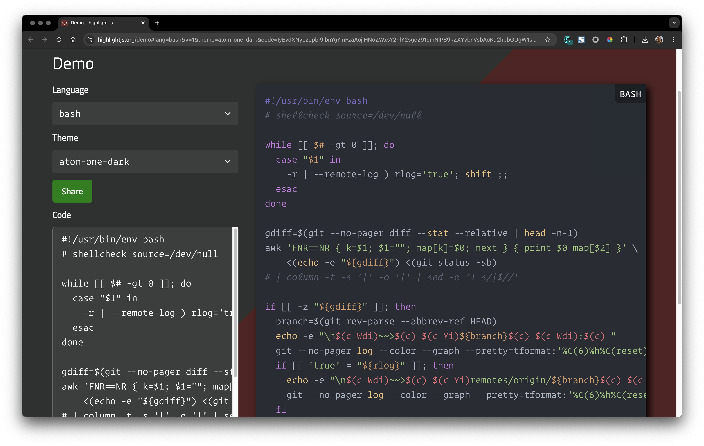

<!-- START doctoc generated TOC please keep comment here to allow auto update -->
<!-- DON'T EDIT THIS SECTION, INSTEAD RE-RUN doctoc TO UPDATE -->

- [prepare](#prepare)
- [init](#init)
  - [install plugin](#install-plugin)
  - [generate new pages](#generate-new-pages)
  - [diable the default highlight settings](#diable-the-default-highlight-settings)
- [theme](#theme)
  - [snark](#snark)
  - [fix unreadable link](#fix-unreadable-link)
  - [theme for code](#theme-for-code)
- [commands](#commands)
  - [new](#new)
  - [list](#list)
  - [server](#server)
  - [deploy](#deploy)
- [deploy](#deploy-1)
- [syntax highlighting](#syntax-highlighting)
- [Plugins](#plugins)
  - [hexojs/hexo-util](#hexojshexo-util)

<!-- END doctoc generated TOC please keep comment here to allow auto update -->

> [!NOTE|label:references:]
> - [How to use Hexo and deploy to GitHub Pages](https://gist.github.com/btfak/18938572f5df000ebe06fbd1872e4e39)
> - [hexojs/hexo-util](https://github.com/hexojs/hexo-util)
> - [btfak/useHexo.md](https://gist.github.com/btfak/18938572f5df000ebe06fbd1872e4e39)

## prepare

> [!NOTE|label:references:]
> - [Setup](https://hexo.io/docs/setup)

```bash
$ npm i -g hexo-cli
```

## init

> [!NOTE|label:references:]
> - [hexojs/hexo-starter](https://github.com/hexojs/hexo-starter)

```bash
$ mkdir myblog && cd myblog
$ hexo init

# or
$ hexo init imarslo.github.io
```

<!--sec data-title="init details" data-id="section1" data-show=true data-collapse=true ces-->
```bash
$ hexo init
INFO  Cloning hexo-starter https://github.com/hexojs/hexo-starter.git
INFO  Install dependencies
added 183 packages from 421 contributors and audited 189 packages in 22.277s

12 packages are looking for funding
  run `npm fund` for details

found 0 vulnerabilities

INFO  Start blogging with Hexo!
```
<!--endsec-->

### install plugin
```bash
$ npm install hexo-renderer-pug --save
$ npm install hexo-renderer-sass --save
$ npm install hexo-generator-feed --save
$ npm install hexo-generator-search --save
$ npm install hexo-generator-sitemap --save
```

### generate new pages
```bash
$ hexo new page archives
$ hexo new page categories
$ hexo new page tags
$ hexo new page about
```

- [or](https://hexo.io/docs/commands)
  ```bash
  $ hexo new page --path about/me "About me"
  ```

### diable the default highlight settings

> [!NOTE]
> default settings in `_config.xml`


$ sed '/highlight:/{n;s/^.*$/\ \ enable: false/;n;s/^.*$/\ \ line_number: false/;}' -i _config.xml

$ sed '/highlight:/{n;s/^.*$/\ \ enable: false/}' -i _config.xml
$ sed '/highlight:/{n;n;s/^.*$/\ \ line_number: false/}' -i _config.xml

$ grep highlight: _config.yml -A 6
highlight:
  enable: false
  line_number: false
  auto_detect: false
  tab_replace: ''
  wrap: true
  hljs: false



## theme

> [!NOTE]
> - [Themes](https://hexo.io/themes/)

### [snark](https://github.com/Litreily/hexo-theme-snark)

#### clone code


$ git submodule add https://github.com/imarslo/hexo-theme-snark.git themes/snark

$ git clone https://github.com/imarslo/hexo-theme-snark.git themes/snark
$ sed '/highlight:/{n;s/^.*$/\ \ enable: false/}' -i _config.xml
$ sed '/highlight:/{n;n;s/^.*$/\ \ line_number: false/}' -i _config.xml

$ git submodule sync --recursive
$ git submodule update --init --recursive



#### use snark
```bash
$ sed 's/^theme: landscape/theme: snark/' -i _config.xml
```

- `_config.xml`

  ```yaml
  theme: snark
  ```

### fix unreadable link

> [!NOTE|label:references:]
> - files: `themes/snark/layout/_partial/head.pug`
> - [CDN vs. Kit](https://docs.fontawesome.com/v5/web/use-with/wordpress/install-manually)
> - [BootstrapCDN](https://www.bootstrapcdn.com/) | [jsdelivr/bootstrapcdn](https://github.com/jsdelivr/bootstrapcdn)
> - [font-awesome CDN](https://cdnjs.com/libraries/font-awesome) | [cdnjs](https://cdnjs.com) | [cdnjs/cdnjs](https://github.com/cdnjs/cdnjs)
> - [jquery CDN](https://cdnjs.com/libraries/jquery) | [cdnjs](https://cdnjs.com) | [cdnjs/cdnjs](https://github.com/cdnjs/cdnjs)

- font-awesome.min.css

  > [!TIP|label:references:]
  > - deactive link:
  >   - `https://cdn.bootcss.com/font-awesome/4.7.0/css/font-awesome.min.css`
  > - [workable link](https://maxcdn.bootstrapcdn.com/font-awesome/4.7.0/css/font-awesome.min.css):
  >   - 4.7.0:
  >     - `https://maxcdn.bootstrapcdn.com/font-awesome/4.7.0/css/font-awesome.min.css`
  >     - `https://cdnjs.cloudflare.com/ajax/libs/font-awesome/4.7.0/css/font-awesome.min.css`
  >     - `https://stackpath.bootstrapcdn.com/font-awesome/4.7.0/css/font-awesome.min.css`
  >   - 6.6.0
  >     - `https://cdn.jsdelivr.net/npm/@fortawesome/fontawesome-free@6.6.0/css/fontawesome.min.css`
  >     - `https://cdnjs.cloudflare.com/ajax/libs/font-awesome/6.6.0/css/fontawesome.min.css`
  > - about the font-awesome:
  >   - [fontawesome-free-6.6.0-web.zip](https://use.fontawesome.com/releases/v6.6.0/fontawesome-free-6.6.0-web.zip)
  >   - [font-awesome-4.7.0.zip](https://fontawesome.com/v4/get-started/)
  > - others:
  >   - [tim-peterson/font-awesome.min.css](https://gist.github.com/tim-peterson/3772020)

  ```pug
  head
      ...
      link(rel='stylesheet', href='//maxcdn.bootstrapcdn.com/font-awesome/4.7.0/css/font-awesome.min.css')
      ...
  ```

- jquery.min.js

  > [!NOTE|label:references:]
  > - [jquery/jquery-dist](https://github.com/jquery/jquery-dist)
  > - activate link:
  >   - `https://cdn.jsdelivr.net/npm/jquery@3.4.1/dist/jquery.min.js`
  >   - `https://code.jquery.com/jquery-4.0.0-beta.2.slim.min.js`
  >   - `https://cdnjs.cloudflare.com/ajax/libs/jquery/3.7.1/jquery.min.js`

  ```pug
  head
      ...
      script(type='text/javascript', src='//cdn.jsdelivr.net/npm/jquery@3.4.1/dist/jquery.min.js')
      ...
  ```


### theme for code

> [!TIP|label:references:]
> - [* iMarslo : code themes](./code-theme.md)
> - [highlight.js](https://highlightjs.org/) | [github: highlightjs/highlight.js](https://github.com/highlightjs/highlight.js)
>   - [atom-one-dark](https://highlightjs.org/demo#lang=bash&v=1&theme=atom-one-dark&code=IyEvdXNyL2Jpbi9lbnYgYmFzaAojIHNoZWxsY2hlY2sgc291cmNlPS9kZXYvbnVsbAoKd2hpbGUgW1sgJCMgLWd0IDAgXV07IGRvCiAgY2FzZSAiJDEiIGluCiAgICAtciB8IC0tcmVtb3RlLWxvZyApIHJsb2c9J3RydWUnOyBzaGlmdCA7OwogIGVzYWMKZG9uZQoKZ2RpZmY9JChnaXQgLS1uby1wYWdlciDEFiAtLXN0YcQXcmVsYXRpdmUgfCBoZWFkIC1uLTEpCmF3ayAnRk5SPT1OUiB7IGs9JDE7ICQxPSIiOyBtYXBba109JDA7IG5leHQgfSB7IHByaW50ICQwxR0kMl0gfScgXOUAvDwoZWNobyAt5ADSe%2BUAkn0iKSA85QCV5ACDdXMgLXNiKQojIHwgY29sdW1uIC10IC1zICd8JyAtb8UHfCBzZWTEQycxIHMvfCQvLycKCmlm5AE%2BLXrLWOUBQ3RoZeQBNmJyYW5jaOcA%2FnJldi1wYXJzZSAtLWFiYsQPcmVmIEhFQUQp5AE06ACiXG4kKGMgV2RpKX5%2BPiQoYykgxBBZaSkke8ZQfckVxCU6xQ4iCiAg7wFj5AGjLS1jb2xvciAtLWdyYXBoIC0tcHJldHR5PXRmb3JtYXQ6JyVDKDYpJWglQyhyZXNldCkgLSVDKHllbGxvdyklZMoXJXMgJUMoZ3JlZW4pKCVjcinED2JsdWUpPCVhbj7JKSfqAN5jb21t5QCTZGF0ZT3pAeQtLW1heC1jb3VudD0zCiAg5gFE5gJGID3kAUrkAlfuAUn%2FAR%2FlAR%2FmAppzL29yaWdpbi%2F%2FAS4g%2FwEw%2FwEw%2FwEw%2FwEw%2FwEw%2BwEwIO8A5iLpAOfkANRmaQpmaQoKIyB2aW06dGFic3RvcD0yOnNvZnTLDuQDqHdpZHRoPTI6ZXhwYW5kdGFiOmZpbGV0eXBlPXNo)
>     [](https://marslo.github.io/ibook/screenshot/tools/codetheme/hexo-atom-one-dark.png)
>
>   - [base16-apprentice`](https://highlightjs.org/demo#lang=bash&v=1&theme=base16-apprentice&code=IyEvdXNyL2Jpbi9lbnYgYmFzaAojIHNoZWxsY2hlY2sgc291cmNlPS9kZXYvbnVsbAoKd2hpbGUgW1sgJCMgLWd0IDAgXV07IGRvCiAgY2FzZSAiJDEiIGluCiAgICAtciB8IC0tcmVtb3RlLWxvZyApIHJsb2c9J3RydWUnOyBzaGlmdCA7OwogIGVzYWMKZG9uZQoKZ2RpZmY9JChnaXQgLS1uby1wYWdlciDEFiAtLXN0YcQXcmVsYXRpdmUgfCBoZWFkIC1uLTEpCmF3ayAnRk5SPT1OUiB7IGs9JDE7ICQxPSIiOyBtYXBba109JDA7IG5leHQgfSB7IHByaW50ICQwxR0kMl0gfScgXOUAvDwoZWNobyAt5ADSe%2BUAkn0iKSA85QCV5ACDdXMgLXNiKQojIHwgY29sdW1uIC10IC1zICd8JyAtb8UHfCBzZWTEQycxIHMvfCQvLycKCmlm5AE%2BLXrLWOUBQ3RoZeQBNmJyYW5jaOcA%2FnJldi1wYXJzZSAtLWFiYsQPcmVmIEhFQUQp5AE06ACiXG4kKGMgV2RpKX5%2BPiQoYykgxBBZaSkke8ZQfckVxCU6xQ4iCiAg7wFj5AGjLS1jb2xvciAtLWdyYXBoIC0tcHJldHR5PXRmb3JtYXQ6JyVDKDYpJWglQyhyZXNldCkgLSVDKHllbGxvdyklZMoXJXMgJUMoZ3JlZW4pKCVjcinED2JsdWUpPCVhbj7JKSfqAN5jb21t5QCTZGF0ZT3pAeQtLW1heC1jb3VudD0zCiAg5gFE5gJGID3kAUrkAlfuAUn%2FAR%2FlAR%2FmAppzL29yaWdpbi%2F%2FAS4g%2FwEw%2FwEw%2FwEw%2FwEw%2FwEw%2BwEwIO8A5iLpAOfkANRmaQpmaQoKIyB2aW06dGFic3RvcD0yOnNvZnTLDuQDqHdpZHRoPTI6ZXhwYW5kdGFiOmZpbGV0eXBlPXNo)
>     [](https://marslo.github.io/ibook/screenshot/tools/codetheme/hexo-base16-apprentice.png)
>
>   - [base16-sandcastle](https://highlightjs.org/demo#lang=bash&v=1&theme=base16-sandcastle&code=IyEvdXNyL2Jpbi9lbnYgYmFzaAojIHNoZWxsY2hlY2sgc291cmNlPS9kZXYvbnVsbAoKd2hpbGUgW1sgJCMgLWd0IDAgXV07IGRvCiAgY2FzZSAiJDEiIGluCiAgICAtciB8IC0tcmVtb3RlLWxvZyApIHJsb2c9J3RydWUnOyBzaGlmdCA7OwogIGVzYWMKZG9uZQoKZ2RpZmY9JChnaXQgLS1uby1wYWdlciDEFiAtLXN0YcQXcmVsYXRpdmUgfCBoZWFkIC1uLTEpCmF3ayAnRk5SPT1OUiB7IGs9JDE7ICQxPSIiOyBtYXBba109JDA7IG5leHQgfSB7IHByaW50ICQwxR0kMl0gfScgXOUAvDwoZWNobyAt5ADSe%2BUAkn0iKSA85QCV5ACDdXMgLXNiKQojIHwgY29sdW1uIC10IC1zICd8JyAtb8UHfCBzZWTEQycxIHMvfCQvLycKCmlm5AE%2BLXrLWOUBQ3RoZeQBNmJyYW5jaOcA%2FnJldi1wYXJzZSAtLWFiYsQPcmVmIEhFQUQp5AE06ACiXG4kKGMgV2RpKX5%2BPiQoYykgxBBZaSkke8ZQfckVxCU6xA4iCiAg7wFi5AGiLS1jb2xvciAtLWdyYXBoIC0tcHJldHR5PXRmb3JtYXQ6JyVDKDYpJWglQyhyZXNldCkgLSVDKHllbGxvdyklZMoXJXMgJUMoZ3JlZW4pKCVjcinED2JsdWUpPCVhbj7JKSfqAN1jb21t5QCTZGF0ZT3pAeMtLW1heC1jb3VudD0zCiAg5gFD5gJFID3kAUnkAlbuAUj%2FAR7lAR7mAplzL29yaWdpbi%2F7AS0g5AEu%2FwEw%2FwEw%2FwEw%2FwEw%2FwEw%2BwEwIO8A5iLpAOfkANRmaQpmaQoKIyB2aW06dGFic3RvcD0yOnNvZnTLDuQDp3dpZHRoPTI6ZXhwYW5kdGFiOmZpbGV0eXBlPXNo)
>     [](https://marslo.github.io/ibook/screenshot/tools/codetheme/hexo-base16-sandcastle.png)
>
>   - [base16-solarized-dark](https://highlightjs.org/demo#lang=bash&v=1&theme=base16-solarized-dark&code=IyEvdXNyL2Jpbi9lbnYgYmFzaAojIHNoZWxsY2hlY2sgc291cmNlPS9kZXYvbnVsbAoKd2hpbGUgW1sgJCMgLWd0IDAgXV07IGRvCiAgY2FzZSAiJDEiIGluCiAgICAtciB8IC0tcmVtb3RlLWxvZyApIHJsb2c9J3RydWUnOyBzaGlmdCA7OwogIGVzYWMKZG9uZQoKZ2RpZmY9JChnaXQgLS1uby1wYWdlciDEFiAtLXN0YcQXcmVsYXRpdmUgfCBoZWFkIC1uLTEpCmF3ayAnRk5SPT1OUiB7IGs9JDE7ICQxPSIiOyBtYXBba109JDA7IG5leHQgfSB7IHByaW50ICQwxR0kMl0gfScgXOUAvDwoZWNobyAt5ADSe%2BUAkn0iKSA85QCV5ACDdXMgLXNiKQojIHwgY29sdW1uIC10IC1zICd8JyAtb8UHfCBzZWTEQycxIHMvfCQvLycKCmlm5AE%2BLXrLWOUBQ3RoZeQBNmJyYW5jaOcA%2FnJldi1wYXJzZSAtLWFiYsQPcmVmIEhFQUQp5AE06ACiXG4kKGMgV2RpKX5%2BPiQoYykgxBBZaSkke8ZQfckVxCU6xA4iCiAg7wFi5AGiLS1jb2xvciAtLWdyYXBoIC0tcHJldHR5PXRmb3JtYXQ6JyVDKDYpJWglQyhyZXNldCkgLSVDKHllbGxvdyklZMoXJXMgJUMoZ3JlZW4pKCVjcinED2JsdWUpPCVhbj7JKSfqAN1jb21t5QCTZGF0ZT3pAeMtLW1heC1jb3VudD0zCiAg5gFD5gJFID3kAUnkAlbuAUj%2FAR7lAR7mAplzL29yaWdpbi%2F7AS0g5AEu%2FwEw%2FwEw%2FwEw%2FwEw%2FwEw%2BwEwIO8A5iLpAOfkANRmaQpmaQoKIyB2aW06dGFic3RvcD0yOnNvZnTLDuQDp3dpZHRoPTI6ZXhwYW5kdGFiOmZpbGV0eXBlPXNo)
>     [](https://marslo.github.io/ibook/screenshot/tools/codetheme/hexo-base16-solarized-dark.png)

```yaml
# _config.yml
highlight:
    google_code_prettify: false
    highlight: true                        ## highlight.js
    highlight_theme: 'atom-one-dark'       ## refer: https://highlightjs.org/static/demo/
```

## commands

> [!NOTE|label:references:]
> - [Commands](https://hexo.io/docs/commands)
> - [options](https://hexo.io/docs/commands#Options)
>   - `--debug`
>   - `--silent`
>   - `--config customer.yml` or `--config custom.yml,custom2.json`
>   - `--draft`

### new

> [!NOTE|label:references:]
> - command format:
>   ```bash
>   $ hexo new [layout] <title>
>   ```

```bash
$ hexo new page --path about/me "About me"

# or
$ hexo new page --path about/me
```

### list

> [!TIP|label:supported:]
> - `hexo list page`
> - `hexo list post`
> - `hexo list tag`
> - `hexo list category`
> - `hexo list route`

```bash
# page
$ hexo list page
INFO  Validating config
INFO  Start processing
Date        Title       Path
2024-09-04  archives    archives/index.md
2024-09-04  categories  categories/index.md
2024-09-04  tags        tags/index.md
2024-09-04  about       about/index.md

# post
$ hexo list post
INFO  Validating config
INFO  Start processing
Date        Title        Path                   Category  Tags
2024-09-04  Hello World  _posts/hello-world.md
```

### server

> [!NOTE|label:references:]
> - Starts a local server. By default, this is at http://localhost:4000/

```bash
$ hexo g
$ hexo s

# or
$ hexo generate
$ hexo server

# override the default port
$ hexo server -p 5000

# enable logger
$ hexo server --log
```

### deploy

> [!NOTE]
> deploy the website

```bash
$ hexo deploy

# or generate before deploy
$ hexo deploy --generate
```

## deploy

> [!NOTE|label:references:]
> - [github pagers](https://hexo.io/docs/github-pages)

- [with workflow: .github/workflows/pages.yml](https://hexo.io/docs/github-pages)

  <!--sec data-title=".github/workflows/pages.yml" data-id="section0" data-show=true data-collapse=true ces-->
  ```yaml
  name: Pages

  on:
    push:
      branches:
        - main # default branch

  jobs:
    build:
      runs-on: ubuntu-latest
      steps:
        - uses: actions/checkout@v4
          with:
            token: ${{ secrets.GITHUB_TOKEN }}
            # If your repository depends on submodule, please see: https://github.com/actions/checkout
            submodules: recursive
        - name: Use Node.js 20
          uses: actions/setup-node@v4
          with:
            # Examples: 20, 18.19, >=16.20.2, lts/Iron, lts/Hydrogen, *, latest, current, node
            # Ref: https://github.com/actions/setup-node#supported-version-syntax
            node-version: "20"
        - name: Cache NPM dependencies
          uses: actions/cache@v4
          with:
            path: node_modules
            key: ${{ runner.OS }}-npm-cache
            restore-keys: |
              ${{ runner.OS }}-npm-cache
        - name: Install Dependencies
          run: npm install
        - name: Build
          run: npm run build
        - name: Upload Pages artifact
          uses: actions/upload-pages-artifact@v3
          with:
            path: ./public
    deploy:
      needs: build
      permissions:
        pages: write
        id-token: write
      environment:
        name: github-pages
        url: ${{ steps.deployment.outputs.page_url }}
      runs-on: ubuntu-latest
      steps:
        - name: Deploy to GitHub Pages
          id: deployment
          uses: actions/deploy-pages@v4
  ```
  <!--endsec-->

- [with hexo-deployer-git](https://hexo.io/docs/github-pages#One-command-deployment)

  > [!NOTE|label:references:]
  > - [hexojs/hexo-deployer-git](https://github.com/hexojs/hexo-deployer-git)
  > - [One-Command Deployment](https://hexo.io/docs/one-command-deployment)

  ```bash
  $ npm install hexo-deployer-git --save

  $ cat _config.yml
  deploy:
    type: git
    repo: https://github.com/<username>/<project>
    branch: gh-pages
  ```

## syntax highlighting

> [!NOTE|label:references:]
> - [Syntax Highlighting](https://hexo.io/docs/syntax-highlight)
> - [Highlight.js](https://highlightjs.readthedocs.io/en/latest/)
> - [prismjs](https://prismjs.com/)

- code block

  
  ```bash
  
  code snippet
  

  # or
  
  code snippet
  

  # or
  \`\`\`[language] [title] [url] [link text] [additional options]
  code snippet
  \`\`\`
  ```
  


## [Plugins](https://hexo.io/docs/plugins)
### [hexojs/hexo-util](https://github.com/hexojs/hexo-util?tab=readme-ov-file#installation)

```bash
$ npm install hexo-util --save
```
