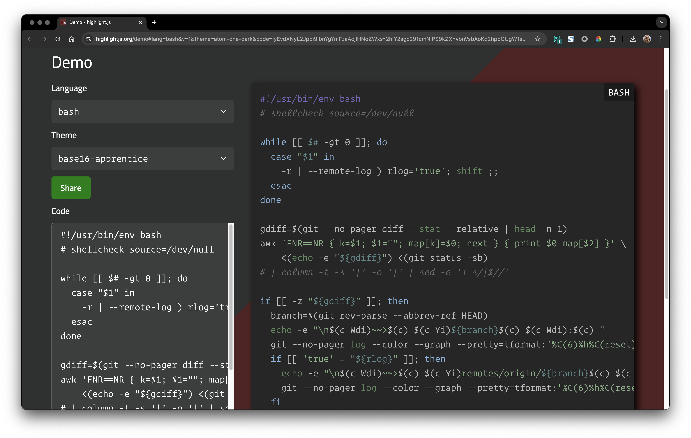
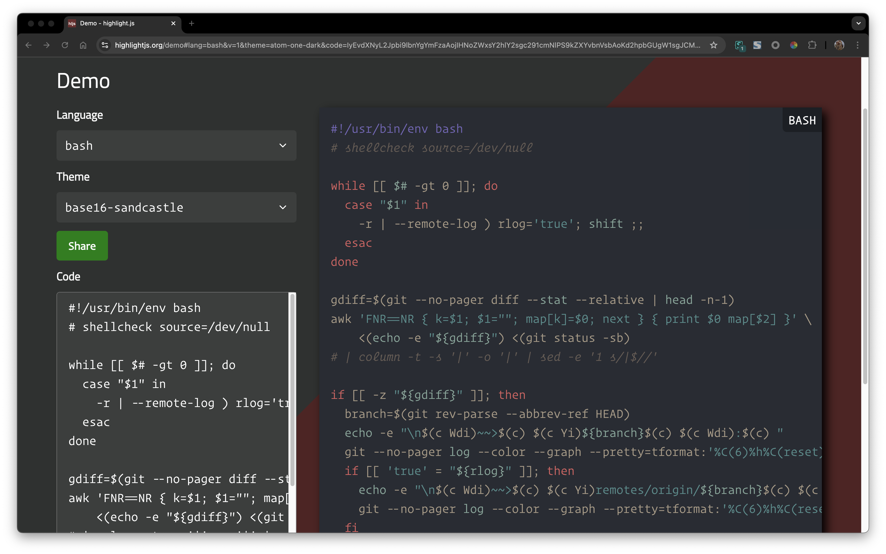

<!-- START doctoc generated TOC please keep comment here to allow auto update -->
<!-- DON'T EDIT THIS SECTION, INSTEAD RE-RUN doctoc TO UPDATE -->

- [prepare](#prepare)
- [init](#init)
- [add theme](#add-theme)
  - [clone code](#clone-code)
  - [install plugin](#install-plugin)
  - [generate new pages](#generate-new-pages)
  - [diable the default highlight settings](#diable-the-default-highlight-settings)
  - [use theme](#use-theme)
  - [theme for code](#theme-for-code)

<!-- END doctoc generated TOC please keep comment here to allow auto update -->


## prepare
```bash
$ npm i -g hexo-cli
```

## init
```bash
$ mkdir myblog && cd myblog
$ hexo init

# or
$ hexo init imarslo.github.io
```

<!--sec data-title="init details" data-id="section1" data-show=true data-collapse=true ces-->
```bash
$ hexo init
INFO  Cloning hexo-starter https://github.com/hexojs/hexo-starter.git
INFO  Install dependencies
added 183 packages from 421 contributors and audited 189 packages in 22.277s

12 packages are looking for funding
  run `npm fund` for details

found 0 vulnerabilities

INFO  Start blogging with Hexo!
```
<!--endsec-->

## add theme
> credit belongs to [snark](https://github.com/Litreily/hexo-theme-snark)

### clone code


$ git submodule add https://github.com/imarslo/hexo-theme-snark.git themes/snark

$ git clone https://github.com/imarslo/hexo-theme-snark.git themes/snark
$ sed '/highlight:/{n;s/^.*$/\ \ enable: false/}' -i _config.xml
$ sed '/highlight:/{n;n;s/^.*$/\ \ line_number: false/}' -i _config.xml

$ git submodule sync --recursive
$ git submodule update --init --recursive


### install plugin
```bash
$ npm install hexo-renderer-pug --save
$ npm install hexo-renderer-sass --save
$ npm install hexo-generator-feed --save
$ npm install hexo-generator-search --save
$ npm install hexo-generator-sitemap --save
```

### generate new pages
```bash
$ hexo new page archives
$ hexo new page categories
$ hexo new page tags
$ hexo new page about
```

### diable the default highlight settings

> [!NOTE]
> default settings in `_config.xml`


$ sed '/highlight:/{n;s/^.*$/\ \ enable: false/;n;s/^.*$/\ \ line_number: false/;}' -i _config.xml

$ sed '/highlight:/{n;s/^.*$/\ \ enable: false/}' -i _config.xml
$ sed '/highlight:/{n;n;s/^.*$/\ \ line_number: false/}' -i _config.xml

$ grep highlight: _config.yml -A 6
highlight:
  enable: false
  line_number: false
  auto_detect: false
  tab_replace: ''
  wrap: true
  hljs: false


### use theme
```bash
$ sed 's/^theme: landscape/theme: snark/' -i _config.xml
```

### theme for code

> [!TIP|label:references:]
> - [* iMarslo : code themes](./code-theme.md)
> - [highlight.js](https://highlightjs.org/) | [github: highlightjs/highlight.js](https://github.com/highlightjs/highlight.js)
>   - [atom-one-dark](https://highlightjs.org/demo#lang=bash&v=1&theme=atom-one-dark&code=IyEvdXNyL2Jpbi9lbnYgYmFzaAojIHNoZWxsY2hlY2sgc291cmNlPS9kZXYvbnVsbAoKd2hpbGUgW1sgJCMgLWd0IDAgXV07IGRvCiAgY2FzZSAiJDEiIGluCiAgICAtciB8IC0tcmVtb3RlLWxvZyApIHJsb2c9J3RydWUnOyBzaGlmdCA7OwogIGVzYWMKZG9uZQoKZ2RpZmY9JChnaXQgLS1uby1wYWdlciDEFiAtLXN0YcQXcmVsYXRpdmUgfCBoZWFkIC1uLTEpCmF3ayAnRk5SPT1OUiB7IGs9JDE7ICQxPSIiOyBtYXBba109JDA7IG5leHQgfSB7IHByaW50ICQwxR0kMl0gfScgXOUAvDwoZWNobyAt5ADSe%2BUAkn0iKSA85QCV5ACDdXMgLXNiKQojIHwgY29sdW1uIC10IC1zICd8JyAtb8UHfCBzZWTEQycxIHMvfCQvLycKCmlm5AE%2BLXrLWOUBQ3RoZeQBNmJyYW5jaOcA%2FnJldi1wYXJzZSAtLWFiYsQPcmVmIEhFQUQp5AE06ACiXG4kKGMgV2RpKX5%2BPiQoYykgxBBZaSkke8ZQfckVxCU6xQ4iCiAg7wFj5AGjLS1jb2xvciAtLWdyYXBoIC0tcHJldHR5PXRmb3JtYXQ6JyVDKDYpJWglQyhyZXNldCkgLSVDKHllbGxvdyklZMoXJXMgJUMoZ3JlZW4pKCVjcinED2JsdWUpPCVhbj7JKSfqAN5jb21t5QCTZGF0ZT3pAeQtLW1heC1jb3VudD0zCiAg5gFE5gJGID3kAUrkAlfuAUn%2FAR%2FlAR%2FmAppzL29yaWdpbi%2F%2FAS4g%2FwEw%2FwEw%2FwEw%2FwEw%2FwEw%2BwEwIO8A5iLpAOfkANRmaQpmaQoKIyB2aW06dGFic3RvcD0yOnNvZnTLDuQDqHdpZHRoPTI6ZXhwYW5kdGFiOmZpbGV0eXBlPXNo)
>     [](https://marslo.github.io/ibook/screenshot/tools/codetheme/hexo-atom-one-dark.png)
>
>   - [base16-apprentice`](https://highlightjs.org/demo#lang=bash&v=1&theme=base16-apprentice&code=IyEvdXNyL2Jpbi9lbnYgYmFzaAojIHNoZWxsY2hlY2sgc291cmNlPS9kZXYvbnVsbAoKd2hpbGUgW1sgJCMgLWd0IDAgXV07IGRvCiAgY2FzZSAiJDEiIGluCiAgICAtciB8IC0tcmVtb3RlLWxvZyApIHJsb2c9J3RydWUnOyBzaGlmdCA7OwogIGVzYWMKZG9uZQoKZ2RpZmY9JChnaXQgLS1uby1wYWdlciDEFiAtLXN0YcQXcmVsYXRpdmUgfCBoZWFkIC1uLTEpCmF3ayAnRk5SPT1OUiB7IGs9JDE7ICQxPSIiOyBtYXBba109JDA7IG5leHQgfSB7IHByaW50ICQwxR0kMl0gfScgXOUAvDwoZWNobyAt5ADSe%2BUAkn0iKSA85QCV5ACDdXMgLXNiKQojIHwgY29sdW1uIC10IC1zICd8JyAtb8UHfCBzZWTEQycxIHMvfCQvLycKCmlm5AE%2BLXrLWOUBQ3RoZeQBNmJyYW5jaOcA%2FnJldi1wYXJzZSAtLWFiYsQPcmVmIEhFQUQp5AE06ACiXG4kKGMgV2RpKX5%2BPiQoYykgxBBZaSkke8ZQfckVxCU6xQ4iCiAg7wFj5AGjLS1jb2xvciAtLWdyYXBoIC0tcHJldHR5PXRmb3JtYXQ6JyVDKDYpJWglQyhyZXNldCkgLSVDKHllbGxvdyklZMoXJXMgJUMoZ3JlZW4pKCVjcinED2JsdWUpPCVhbj7JKSfqAN5jb21t5QCTZGF0ZT3pAeQtLW1heC1jb3VudD0zCiAg5gFE5gJGID3kAUrkAlfuAUn%2FAR%2FlAR%2FmAppzL29yaWdpbi%2F%2FAS4g%2FwEw%2FwEw%2FwEw%2FwEw%2FwEw%2BwEwIO8A5iLpAOfkANRmaQpmaQoKIyB2aW06dGFic3RvcD0yOnNvZnTLDuQDqHdpZHRoPTI6ZXhwYW5kdGFiOmZpbGV0eXBlPXNo)
>     [](https://marslo.github.io/ibook/screenshot/tools/codetheme/hexo-base16-apprentice.png)
>
>   - [base16-sandcastle](https://highlightjs.org/demo#lang=bash&v=1&theme=base16-sandcastle&code=IyEvdXNyL2Jpbi9lbnYgYmFzaAojIHNoZWxsY2hlY2sgc291cmNlPS9kZXYvbnVsbAoKd2hpbGUgW1sgJCMgLWd0IDAgXV07IGRvCiAgY2FzZSAiJDEiIGluCiAgICAtciB8IC0tcmVtb3RlLWxvZyApIHJsb2c9J3RydWUnOyBzaGlmdCA7OwogIGVzYWMKZG9uZQoKZ2RpZmY9JChnaXQgLS1uby1wYWdlciDEFiAtLXN0YcQXcmVsYXRpdmUgfCBoZWFkIC1uLTEpCmF3ayAnRk5SPT1OUiB7IGs9JDE7ICQxPSIiOyBtYXBba109JDA7IG5leHQgfSB7IHByaW50ICQwxR0kMl0gfScgXOUAvDwoZWNobyAt5ADSe%2BUAkn0iKSA85QCV5ACDdXMgLXNiKQojIHwgY29sdW1uIC10IC1zICd8JyAtb8UHfCBzZWTEQycxIHMvfCQvLycKCmlm5AE%2BLXrLWOUBQ3RoZeQBNmJyYW5jaOcA%2FnJldi1wYXJzZSAtLWFiYsQPcmVmIEhFQUQp5AE06ACiXG4kKGMgV2RpKX5%2BPiQoYykgxBBZaSkke8ZQfckVxCU6xA4iCiAg7wFi5AGiLS1jb2xvciAtLWdyYXBoIC0tcHJldHR5PXRmb3JtYXQ6JyVDKDYpJWglQyhyZXNldCkgLSVDKHllbGxvdyklZMoXJXMgJUMoZ3JlZW4pKCVjcinED2JsdWUpPCVhbj7JKSfqAN1jb21t5QCTZGF0ZT3pAeMtLW1heC1jb3VudD0zCiAg5gFD5gJFID3kAUnkAlbuAUj%2FAR7lAR7mAplzL29yaWdpbi%2F7AS0g5AEu%2FwEw%2FwEw%2FwEw%2FwEw%2FwEw%2BwEwIO8A5iLpAOfkANRmaQpmaQoKIyB2aW06dGFic3RvcD0yOnNvZnTLDuQDp3dpZHRoPTI6ZXhwYW5kdGFiOmZpbGV0eXBlPXNo)
>     [](https://marslo.github.io/ibook/screenshot/tools/codetheme/hexo-base16-sandcastle.png)
>
>   - [base16-solarized-dark](https://highlightjs.org/demo#lang=bash&v=1&theme=base16-solarized-dark&code=IyEvdXNyL2Jpbi9lbnYgYmFzaAojIHNoZWxsY2hlY2sgc291cmNlPS9kZXYvbnVsbAoKd2hpbGUgW1sgJCMgLWd0IDAgXV07IGRvCiAgY2FzZSAiJDEiIGluCiAgICAtciB8IC0tcmVtb3RlLWxvZyApIHJsb2c9J3RydWUnOyBzaGlmdCA7OwogIGVzYWMKZG9uZQoKZ2RpZmY9JChnaXQgLS1uby1wYWdlciDEFiAtLXN0YcQXcmVsYXRpdmUgfCBoZWFkIC1uLTEpCmF3ayAnRk5SPT1OUiB7IGs9JDE7ICQxPSIiOyBtYXBba109JDA7IG5leHQgfSB7IHByaW50ICQwxR0kMl0gfScgXOUAvDwoZWNobyAt5ADSe%2BUAkn0iKSA85QCV5ACDdXMgLXNiKQojIHwgY29sdW1uIC10IC1zICd8JyAtb8UHfCBzZWTEQycxIHMvfCQvLycKCmlm5AE%2BLXrLWOUBQ3RoZeQBNmJyYW5jaOcA%2FnJldi1wYXJzZSAtLWFiYsQPcmVmIEhFQUQp5AE06ACiXG4kKGMgV2RpKX5%2BPiQoYykgxBBZaSkke8ZQfckVxCU6xA4iCiAg7wFi5AGiLS1jb2xvciAtLWdyYXBoIC0tcHJldHR5PXRmb3JtYXQ6JyVDKDYpJWglQyhyZXNldCkgLSVDKHllbGxvdyklZMoXJXMgJUMoZ3JlZW4pKCVjcinED2JsdWUpPCVhbj7JKSfqAN1jb21t5QCTZGF0ZT3pAeMtLW1heC1jb3VudD0zCiAg5gFD5gJFID3kAUnkAlbuAUj%2FAR7lAR7mAplzL29yaWdpbi%2F7AS0g5AEu%2FwEw%2FwEw%2FwEw%2FwEw%2FwEw%2BwEwIO8A5iLpAOfkANRmaQpmaQoKIyB2aW06dGFic3RvcD0yOnNvZnTLDuQDp3dpZHRoPTI6ZXhwYW5kdGFiOmZpbGV0eXBlPXNo)
>     [](https://marslo.github.io/ibook/screenshot/tools/codetheme/hexo-base16-solarized-dark.png)

```yaml
# _config.yml
highlight:
    google_code_prettify: false
    highlight: true                        ## highlight.js
    highlight_theme: 'atom-one-dark'       ## refer: https://highlightjs.org/static/demo/
```
