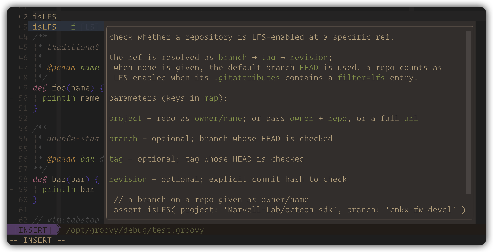

<!-- START doctoc generated TOC please keep comment here to allow auto update -->
<!-- DON'T EDIT THIS SECTION, INSTEAD RE-RUN doctoc TO UPDATE -->

- [groovy & jenkinsfile](#groovy--jenkinsfile)
  - [groovy libs setup](#groovy-libs-setup)
  - [jenkins libs setup](#jenkins-libs-setup)
  - [lsp-gdoc](#lsp-gdoc)
  - [vim and nvim settings](#vim-and-nvim-settings)
  - [environment variables](#environment-variables)
  - [enhanced groovy tree-sitter](#enhanced-groovy-tree-sitter)

<!-- END doctoc generated TOC please keep comment here to allow auto update -->


# groovy & jenkinsfile



## groovy libs setup

> [!NOTE|label:references:]
> - download all groovy jar files with `-sources.jar` && `-javadoc.jar`

```bash
# download <name>-sources.jar and <name>-javadoc.jar
$ curl -fsSL https://github.com/marslo/mytools/raw/main/itool/groovy-libs.sh | bash -s -- --jar --with-libs --path /opt/groovy

#                                                                                                     + <name>-sources.jar and <name>-javadoc.jar
#                                                                                                     v           + <name>.jar
$ curl -fsSL https://github.com/marslo/mytools/raw/main/itool/groovy-libs.sh | bash -s -- --jar --with-libs --with-bin --path /opt/groovy

# ── to cleanup ──
$ curl -fsSL https://github.com/marslo/mytools/raw/main/itool/groovy-libs.sh | bash -s -- --clean

# ── to latest install runtime only ──
$ curl -fsSL https://github.com/marslo/mytools/raw/main/itool/groovy-libs.sh | bash -s -- --runtime --latest
```

## jenkins libs setup

> [!NOTE|label:references:]
> - setup and linked all jar file into `${HOME}/.groovy/lib/`

```bash
#                                                                                                  + ln -sf to ~/.groovy/lib
#                                                                                                  |      + <name>-sources.jar
#                                                                                                  v      v       + <name>-javadoc.jar
$ curl -fsSL https://github.com/marslo/mytools/raw/main/itool/jenkins-libs.sh | bash -s -- --lts --ln --sources --javadoc --path /opt/jenkins

# ── to cleanup ──
$ curl -fsSL https://github.com/marslo/mytools/raw/main/itool/jenkins-libs.sh | bash -s -- --clean
```

## lsp-gdoc
```bash
# - sources.jar : unzip '*.java''*.groovy' ----►  ~/.cache/nvim/gdoc/src/  -- ctags --►  ~/.cache/nvim/gdoc/.tags
# - javadoc.jar : (list HTML manifest ONLY) ---►  ~/.cache/nvim/gdoc/javadoc-map.tsv
$ curl -fsSL https://github.com/marslo/mytools/raw/main/itool/lsp-gdoc | bash -s -- --build

# ── to cleanup ──
$ curl -fsSL https://github.com/marslo/mytools/raw/main/itool/lsp-gdoc | bash -s -- --clean
```

## vim and nvim settings

```json5
// ~/.config/nvim/coc-settings.json
{
  "groovy.enable": true,
  "groovy.java.home": "/opt/homebrew/Cellar/openjdk@21/21.0.12/libexec/openjdk.jdk/Contents/Home",
  "groovy.project.referencedLibraries": [
    "/opt/homebrew/opt/groovy/libexec/lib/*",
    "/opt/groovy/latest/*",
    "/opt/jenkins/latest/WEB-INF/lib/*",
    "/Users/marslo/.groovy/lib/*"
  ],
  "groovy.ls.vmargs": "-noverify -Xmx2G -XX:+UseG1GC -XX:+UseStringDeduplication",
  "groovy.trace.server": "off",
  "groovy.ls.feature.noRoot": true,
}
```

```vim
" ~/.vimrc
augroup Groovy
  autocmd FileType groovy,Jenkinsfile setlocal tags+=~/.cache/nvim/gdoc/.tags
augroup END

augroup JavaMarkdownDoc
  autocmd!
  autocmd ColorScheme * highlight default link markdownLineStart markdownH1
augroup END
silent! highlight default link markdownLineStart markdownH1
```

## environment variables

```bash
# ~/.bashrc or ~/.bash_profile

JAVA_HOME=$(/usr/libexec/java_home)
GROOVY_HOME="${HOMEBREW_OPT}/groovy/libexec"
_GROOVY_LIBS='/opt/groovy'
_JENKINS_LIBS="${HOME}/.groovy/lib"
GROOVY_CLASSPATH="${GROOVY_CLASSPATH:+$GROOVY_CLASSPATH:}"
test -d "${GROOVY_HOME}/lib"                  && GROOVY_CLASSPATH+=".:$(echo "${GROOVY_HOME}"/lib/*.jar   | tr ' ' ':'):"
test -d "${_GROOVY_LIBS}"                     && GROOVY_CLASSPATH+="$(echo "${_GROOVY_LIBS}"/latest/*.jar | tr ' ' ':'):"
test -d "${_GROOVY_LIBS}/extensions"          && GROOVY_CLASSPATH+="$(echo "${_GROOVY_LIBS}"/extensions/*/latest/*.jar | tr ' ' ':'):"
test -d "${_JENKINS_LIBS}"                    && GROOVY_CLASSPATH+="$(echo "${_JENKINS_LIBS}"/*.jar | tr ' ' ':'):"
test -f "${HOMEBREW_OPT}/coreutils/libexec/gnubin/paste" &&
     GROOVY_CLASSPATH=$( echo "${GROOVY_CLASSPATH}" | tr ':' '\n' | awk 'NF' | awk '!x[$0]++' | "${HOMEBREW_OPT}/coreutils/libexec/gnubin/paste" -s -d: )
test -f "${JAVA_HOME}/lib/tools.jar"          && GROOVY_CLASSPATH+=":${JAVA_HOME}/lib/tools.jar"
test -f "${JAVA_HOME}/lib/dt.jar"             && GROOVY_CLASSPATH+=":${JAVA_HOME}/lib/dt.jar"
CLASSPATH+=":${GROOVY_CLASSPATH}"
test -f "${HOMEBREW_OPT}/coreutils/libexec/gnubin/paste" &&
     CLASSPATH=$( echo "${CLASSPATH}" | tr ':' '\n' | awk 'NF' | awk '!x[$0]++' | "${HOMEBREW_OPT}/coreutils/libexec/gnubin/paste" -s -d: )
CPPFLAGS="-I${HOMEBREW_OPT}/openjdk/include"                   # https://stackoverflow.com/a/69504284/2940319
unset _GROOVY_LIBS _JENKINS_LIBS
```

## enhanced groovy tree-sitter

> [!NOTE|label:references:]
> - check details in [* iMarslo: nvim-treesitter](./nvim-treesitter.md)
