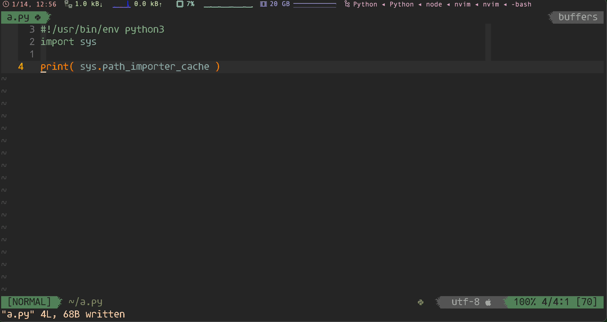
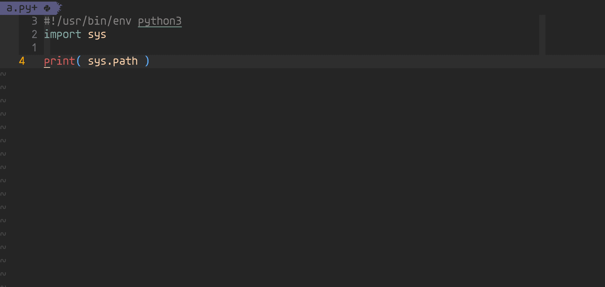
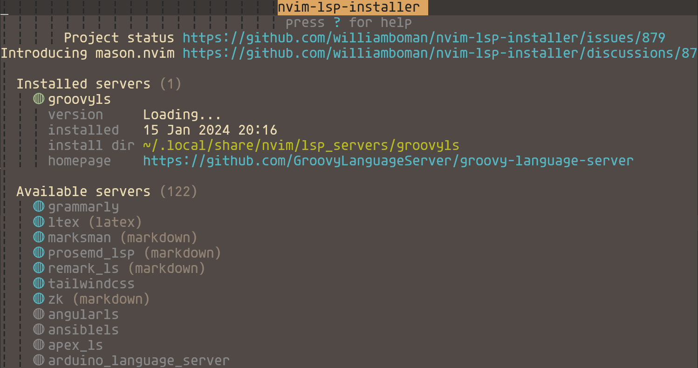
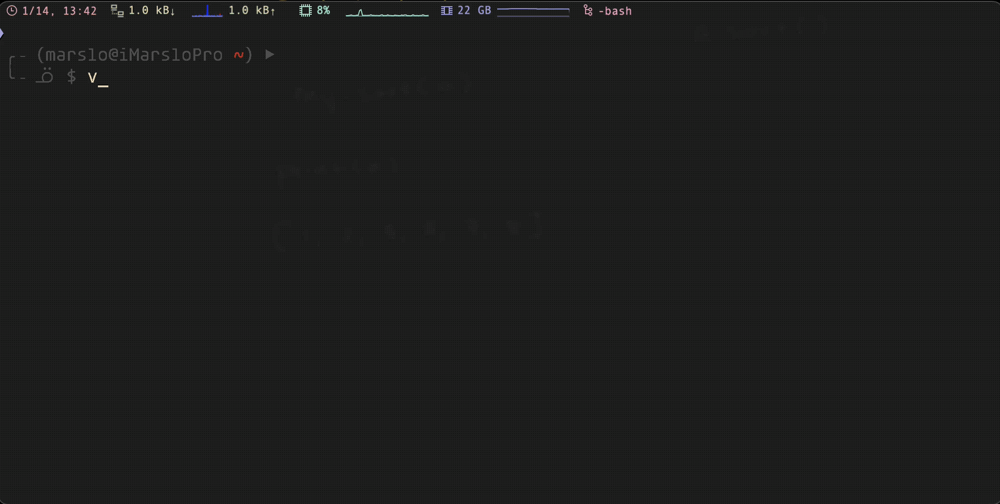
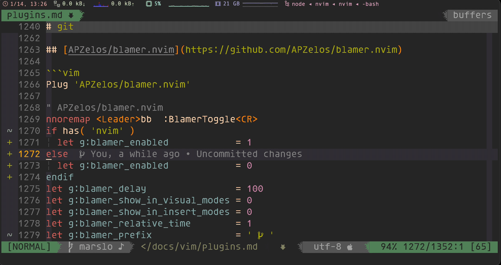
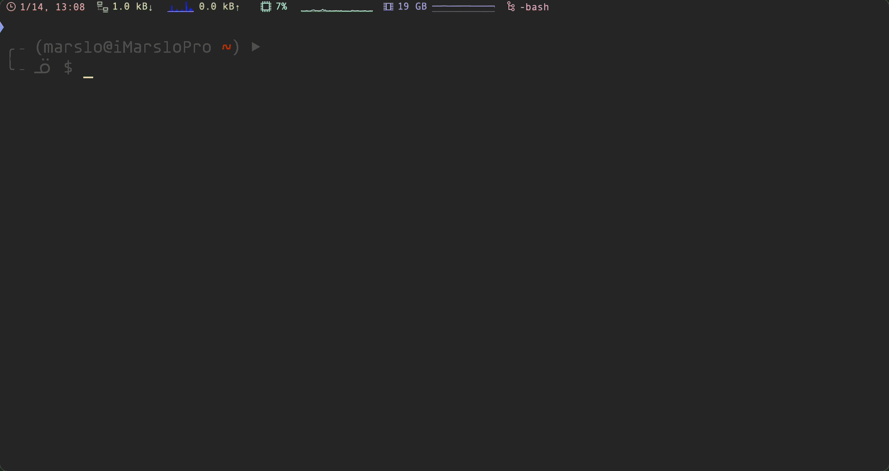

<!-- START doctoc generated TOC please keep comment here to allow auto update -->
<!-- DON'T EDIT THIS SECTION, INSTEAD RE-RUN doctoc TO UPDATE -->

- [plugin alternatives](#plugin-alternatives)
  - [autocompletion](#autocompletion)
  - [language server protocol](#language-server-protocol)
  - [ctrl-p](#ctrl-p)
  - [snippets](#snippets)
  - [cryptmethod](#cryptmethod)
  - [comments](#comments)
- [highly recommended](#highly-recommended)
  - [LunarWatcher/auto-pairs](#lunarwatcherauto-pairs)
  - [junegunn/fzf.vim](#junegunnfzfvim)
  - [luochen1990/rainbow](#luochen1990rainbow)
  - [Yggdroot/indentLine](#yggdrootindentline)
  - [airblade/vim-gitgutter](#airbladevim-gitgutter)
  - [vim-airline/vim-airline](#vim-airlinevim-airline)
- [programming](#programming)
  - [vim-syntastic/syntastic](#vim-syntasticsyntastic)
  - [tpope/vim-commentary](#tpopevim-commentary)
  - [coc.nvim](#cocnvim)
    - [extensions](#extensions)
  - [nvim-treesitter/nvim-treesitter](#nvim-treesitternvim-treesitter)
  - [williamboman/nvim-lsp-installer](#williambomannvim-lsp-installer)
  - [neovim/nvim-lspconfig](#neovimnvim-lspconfig)
    - [manual install lsp](#manual-install-lsp)
  - [copilot](#copilot)
  - [others](#others)
- [utils](#utils)
  - [vim-scripts/AuthorInfoDetect](#vim-scriptsauthorinfodetect)
  - [sjl/gundo.vim](#sjlgundovim)
  - [yegappan/mru](#yegappanmru)
- [markdown](#markdown)
  - [preservim/vim-markdown](#preservimvim-markdown)
  - [dhruvasagar/vim-table-mode](#dhruvasagarvim-table-mode)
  - [godlygeek/tabular](#godlygeektabular)
- [git](#git)
  - [tpope/vim-fugitive](#tpopevim-fugitive)
  - [APZelos/blamer.nvim](#apzelosblamernvim)
  - [zivyangll/git-blame.vim](#zivyangllgit-blamevim)
- [color and theme](#color-and-theme)
  - [scrooloose/nerdtree](#scrooloosenerdtree)
  - [ryanoasis/vim-devicons](#ryanoasisvim-devicons)
  - [RRethy/vim-hexokinase](#rrethyvim-hexokinase)
  - [NvChad/nvim-colorizer.lua](#nvchadnvim-colorizerlua)
- [troubleshooting](#troubleshooting)
  - [airline](#airline)

<!-- END doctoc generated TOC please keep comment here to allow auto update -->


> references:
> - [* vimcolorschemes](https://vimcolorschemes.com/)
> - [Spelling And Grammar With Vim](https://www.vimfromscratch.com/articles/spell-and-grammar-vim)
> - [iMarslo: deprecated plugins](./deprecated.html)
> - dotfiles/vimrc
>   - [* amix/vimrc](https://github.com/amix/vimrc)
>   - [vim-devicon author: ryanoasis/dotfiles](https://github.com/ryanoasis/dotfiles/tree/master)


# plugin alternatives
## autocompletion

> [!NOTE|label:references:]
> - [Code Completion for Neovim using Lazy](https://medium.com/@shaikzahid0713/code-completion-for-neovim-6127401ebec2)

- [* neoclide/coc.nvim](https://github.com/neoclide/coc.nvim)
- [* hrsh7th/nvim-cmp](https://github.com/hrsh7th/nvim-cmp) | [Nvim-cmp configuration for auto-completion](https://neovim.discourse.group/t/nvim-cmp-configuration-for-auto-completion/1045/3)
- [* ms-jpq/coq_nvim](https://github.com/ms-jpq/coq_nvim)
- [@ nvim-lua/completion-nvim](https://github.com/nvim-lua/completion-nvim?tab=readme-ov-file)
- [Shougo/deoplete.nvim](https://github.com/Shougo/deoplete.nvim?tab=readme-ov-file) | [Shougo/ddc.vim](https://github.com/Shougo/ddc.vim)
- [ycm-core/YouCompleteMe](https://github.com/ycm-core/YouCompleteMe)
- [prabirshrestha/asyncomplete.vim](https://github.com/prabirshrestha/asyncomplete.vim)
- [Shougo/ddc.vim](https://github.com/Shougo/ddc.vim)
- [L3MON4D3/LuaSnip](https://github.com/L3MON4D3/LuaSnip)

## [language server protocol](https://microsoft.github.io/language-server-protocol/)

> [!NOTE]
> - [Ale Alternatives](https://www.libhunt.com/r/ale)

- [* neovim/nvim-lspconfig](https://github.com/neovim/nvim-lspconfig)
- [* hrsh7th/cmp-nvim-lsp](https://github.com/hrsh7th/cmp-nvim-lsp)
- [prabirshrestha/vim-lsp](https://github.com/prabirshrestha/vim-lsp)
- [rhysd/vim-lsp-ale](https://github.com/rhysd/vim-lsp-ale)
- [mfussenegger/nvim-lint](https://github.com/mfussenegger/nvim-lint)
- [mattn/vim-lsp-settings](https://github.com/mattn/vim-lsp-settings)
- [ycm-core/lsp-examples](https://github.com/ycm-core/lsp-examples)
- [jose-elias-alvarez/null-ls.nvim](https://github.com/jose-elias-alvarez/null-ls.nvim)

## ctrl-p
- [Shougo/denite.nvim](https://github.com/Shougo/denite.nvim)

## [snippets](https://github.com/rockerBOO/awesome-neovim#snippet)
- [Snippets with CoC](https://www.chiarulli.me/Neovim/17-snippets/)

  > [!NOTE|label:references:]
  > - [Configure snippets workflow](https://github.com/neoclide/coc.nvim/wiki/Using-snippets#configure-snippets-workflow)
  > - [Snippets with CoC](https://www.chiarulli.me/Neovim/17-snippets/)
  > - [Coc.nvim completion and snippets are conflicting](https://www.reddit.com/r/neovim/comments/yl5t0o/cocnvim_completion_and_snippets_are_conflicting/)

  ```vim
  Plug 'neoclide/coc.nvim', { 'branch': 'release' }
  Plug 'honza/vim-snippets'
  let g:coc_global_extensions = [ 'coc-snippets' ]

  " coc-snippets
  imap <c-l> <Plug>(coc-snippets-expand)
  vmap <C-j> <Plug>(coc-snippets-select)
  let g:coc_snippet_next = '<c-j>'
  let g:coc_snippet_prev = '<c-k>'
  imap <C-j> <Plug>(coc-snippets-expand-jump)
  inoremap <silent><expr> <TAB>
        \ pumvisible() ? coc#_select_confirm() :
        \ coc#expandableOrJumpable() ? "\<C-r>=coc#rpc#request('doKeymap', ['snippets-expand-jump',''])\<CR>" :
        \ CheckBackSpace() ? "\<TAB>" :
        \ coc#refresh()
  function! CheckBackSpace() abort
    let col = col('.') - 1
    return !col || getline('.')[col - 1]  =~# '\s'
  endfunction
  let g:coc_snippet_next = '<tab>'
  ```
  - commands
    ```vim
    :CocList snippets
    :CocCommand snippets.editSnippets
    :CocCommand snippets.openSnippetFiles
    ```

- [hrsh7th/vim-vsnip](https://github.com/hrsh7th/vim-vsnip) | [hrsh7th/vim-vsnip-integ](https://github.com/hrsh7th/vim-vsnip-integ)
- [SirVer/UltiSnips](https://github.com/SirVer/ultisnips) | [thomasfaingnaert/vim-lsp-ultisnips](https://github.com/thomasfaingnaert/vim-lsp-ultisnips)
- [Shougo/neosnippet.vim](https://github.com/Shougo/neosnippet.vim) | [thomasfaingnaert/vim-lsp-neosnippet](https://github.com/thomasfaingnaert/vim-lsp-neosnippet)
- [L3MON4D3/LuaSnip](https://github.com/L3MON4D3/LuaSnip) | [rafamadriz/friendly-snippets](https://github.com/rafamadriz/friendly-snippets) | [Neovim setting up snippets with luasnip](https://sbulav.github.io/vim/neovim-setting-up-luasnip/) | [dotfiles/nvim/lua/config/snippets.lua](https://github.com/sbulav/dotfiles/blob/master/nvim/lua/config/snippets.lua) | [LuaSnip/Examples/snippets.lua](https://github.com/L3MON4D3/LuaSnip/blob/master/Examples/snippets.lua)
  ```vim
  " ~/.vimrc
  Plug 'L3MON4D3/LuaSnip', {'tag': 'v2.2.0', 'do': 'make install_jsregexp'}

  " L3MON4D3/LuaSnip
  imap <silent><expr> <Tab> luasnip#expand_or_jumpable() ? '<Plug>luasnip-expand-or-jump' : '<Tab>'
  inoremap <silent> <S-Tab> <cmd>lua require'luasnip'.jump(-1)<Cr>
  snoremap <silent> <Tab> <cmd>lua require('luasnip').jump(1)<Cr>
  snoremap <silent> <S-Tab> <cmd>lua require('luasnip').jump(-1)<Cr>
  imap <silent><expr> <C-E> luasnip#choice_active() ? '<Plug>luasnip-next-choice' : '<C-E>'
  smap <silent><expr> <C-E> luasnip#choice_active() ? '<Plug>luasnip-next-choice' : '<C-E>'
  ```
  ```lua
  -- init.lua
  require("luasnip").config.setup {
      updateevents = "TextChanged,TextChangedI",
      store_selection_keys = "<Tab>",
  }
  require("config.snippets")
  -- require("luasnip.loaders.from_vscode").lazy_load({ paths = { "~/.vim/snippet/groovy.lua" } })
  ```

## cryptmethod
- [kurotych/CCryptor.nvim](https://github.com/kurotych/ccryptor.nvim)
- [GPG](https://www.reddit.com/r/neovim/comments/7js0qq/comment/dr8zczy/?utm_source=share&utm_medium=web2x&context=3)

## comments
- [preservim/nerdcommenter](https://github.com/preservim/nerdcommenter)
- [tpope/vim-commentary](https://github.com/tpope/vim-commentary)

# highly recommended

> [!NOTE|label:references:]
> - [Vim Plugin Audit](https://tuckerchapman.com/2020/05/18/vim-plugin-audit/)

## [LunarWatcher/auto-pairs](https://github.com/LunarWatcher/auto-pairs/tree/master)

```vim
" LunarWatcher/auto-pairs
let g:AutoPairs                             = autopairs#AutoPairsDefine({ '<': '>' })
let g:AutoPairsMapBS                        = 1
let g:AutoPairsFlyMode                      = 0
let g:AutoPairsCompleteOnlyOnSpace          = 1
let g:AutoPairsNoJump                       = 0
let g:AutoPairsSpaceCompletionRegex         = '\w'
" to avoid impact with ctrl-p ( :Files )
let g:AutoPairsShortcutToggleMultilineClose = 0
let g:AutoPairsShortcutBackInsert           = '<M-b>'
let g:AutoPairsPrefix                       = '<M-j>'
let g:AutoPairsShortcutJump                 = '<M-n>'
let g:AutoPairsShortcutToggle               = '<M-j>'

augroup DevOps
  autocmd FileType markdown,html let g:AutoPairsCompleteOnlyOnSpace = 0
  autocmd FileType markdown,html let b:AutoPairs = autopairs#AutoPairsDefine({
        \ '<div>':'</div>', '<font>':'</font>', '<a>':'</a>', '<p>':'</p>',
        \ '<table>':'</table>', '<tbody>':'</tbody>',
        \ '<thread>':'</thread>', '<th>':'</th>', '<td>':'</td>'
        \ })
augroup END
```


## [junegunn/fzf.vim](https://github.com/junegunn/fzf.vim)
```vim
set runtimepath+=/usr/local/opt/fzf                                         " $ brew install fzf
Plug '/usr/local/opt/fzf'
Plug 'junegunn/fzf.vim'

" fzf.vim
nnoremap <C-p> :Files<CR>
nnoremap <C-g> :GFiles<CR>
nnoremap <C-s> :Ag<CR>
nnoremap <silent><leader>l  :Buffers<CR>
nnoremap <silent> <Leader>H :Helptags<CR>
nnoremap <silent> <Leader>g :Commits<CR>
let g:fzf_layout                  = { 'window': { 'width': 0.9, 'height': 0.6, 'relative': v:true } }
let g:fzf_history_dir             = '~/.vim/cache/fzf-history'
let g:fzf_vim                     = {}
let g:fzf_vim.preview_window      = [ 'right,50%', 'ctrl-\' ]
let g:fzf_vim.tags_command        = 'ctags -R'
let g:fzf_vim.commits_log_options = '--graph --color=always --format="%C(auto)%h%d %s %C(black)%C(bold)%cr"'
command! -bang -nargs=? -complete=dir Files
    \ call fzf#vim#files(<q-args>, {'options': ['--layout=reverse', '--info=inline', '--preview', 'bat --color=always {}']}, <bang>0)
command! -bang -complete=dir -nargs=? LS
    \ call fzf#run(fzf#wrap('ls', {'source': 'ls', 'dir': <q-args>}, <bang>0))
inoremap <expr> <c-x><c-l> fzf#vim#complete(fzf#wrap({
  \ 'prefix': '^.*$',
  \ 'source': 'rg -n ^ --color always',
  \ 'options': '--ansi --delimiter : --nth 3..',
  \ 'reducer': { lines -> join(split(lines[0], ':\zs')[2:], '') }}
  \ )
\ )
let g:fzf_action = {
  \ 'ctrl-t': 'tab split',
  \ 'ctrl-x': 'split',
  \ 'ctrl-v': 'vsplit'
\ }
let g:fzf_colors = {
  \ 'fg':         ['fg', 'Normal'],
  \ 'bg':         ['bg', 'Normal'],
  \ 'preview-bg': ['bg', 'NormalFloat'],
  \ 'hl':         ['fg', 'Comment'],
  \ 'fg+':        ['fg', 'CursorLine', 'CursorColumn', 'Normal'],
  \ 'bg+':        ['bg', 'CursorLine', 'CursorColumn'],
  \ 'hl+':        ['fg', 'Statement'],
  \ 'info':       ['fg', 'PreProc'],
  \ 'border':     ['fg', 'Ignore'],
  \ 'prompt':     ['fg', 'Conditional'],
  \ 'pointer':    ['fg', 'Exception'],
  \ 'marker':     ['fg', 'Keyword'],
  \ 'spinner':    ['fg', 'Label'],
  \ 'header':     ['fg', 'Comment']
\ }
```

## [luochen1990/rainbow](https://github.com/luochen1990/rainbow)
```vim
" install
Plug 'luochen1990/rainbow'

" luochen1990/rainbow
" for i in '75' '147' '108' '196' '208' '66' '106' '172' '115' '129'; do echo -e "\e[38;05;${i}m${i}"; done | column -c 250 -s ' '; echo -e "\e[m"
let g:rainbow_active    = 1
let g:rainbow_operators = 1
let g:rainbow_conf      = {
\   'guifgs' : [ '#6A5ACD', '#ff6347', '#b58900', '#9acd32', '#EEC900', '#9A32CD', '#EE7600', '#268bd2', '#183172' ],
\   'ctermfgs' : 'xterm-256color' == $TERM ? [ '75', '147', '108', '196', '208', '66', '106', '172', '115', '129' ] : [ 'lightblue', 'lightgreen', 'yellow', 'red', 'magenta' ],
\   'parentheses': [ ['(',')'], ['\[','\]'], ['{','}'], ['<', '>'] ],
\   'separately': {
\     '*': {},
\     'markdown': {
\       'parentheses_options': 'containedin=markdownCode contained',
\     },
\     'css': {
\       'parentheses': [ ['(',')'], ['\[','\]'] ],
\     },
\     'scss': {
\       'parentheses': [ ['(',')'], ['\[','\]'] ],
\     },
\     'html': {
\       'parentheses': [ ['(',')'], ['\[','\]'], ['{','}'], ['<', '>'] ],
\     },
\     'stylus': {
\       'parentheses': [ 'start=/{/ end=/}/ fold contains=@colorableGroup' ],
\     }
\   }
\}
```

## [Yggdroot/indentLine](https://github.com/Yggdroot/indentLine)
```vim
" install
Plug 'Yggdroot/indentLine'

" settings
nnoremap <leader>idl :IndentLineEnable<CR>

let g:indentLine_enabled              = 1
let g:indentLine_color_gui            = "#282828"
let g:indentLine_color_term           = 239
let g:indentLine_indentLevel          = 20
let g:indentLine_showFirstIndentLevel = 1
let g:indentLine_color_tty            = 0
let g:indentLine_faster               = 1
let g:indentLine_concealcursor        = 'inc'
let g:indentLine_conceallevel         = 2
if has( 'gui_running' ) || 'xterm-256color' == $TERM
  let g:indentLine_char               = '¦'
elseif has( 'win32' )
  let g:indentLine_color_term         = 8
  let g:indentLine_char               = '|'
else
  let g:indentLine_color_tty_dark     = 0
  let g:indentLine_char               = '¦'
endif
```

## [airblade/vim-gitgutter](https://github.com/airblade/vim-gitgutter)

> [!NOTE|label:references:]
> - [GitGutter Documentation](https://jisaacks.github.io/GitGutter/)
> - [Can't enable gitgutter with GitGutterEnable after disabling it on startup](https://github.com/airblade/vim-gitgutter/issues/409)
> - [How to display in real time](https://github.com/airblade/vim-gitgutter/issues/579)

```vim
Plug 'airblade/vim-gitgutter'

" airblade/vim-gitgutter
set updatetime=250
set signcolumn=yes
let g:gitgutter_git_executable = '/usr/local/bin/git'
let g:gitgutter_enabled        = 1
let g:gitgutter_realtime       = 0
let g:gitgutter_eager          = 0
highlight clear SignColumn
```

## [vim-airline/vim-airline](https://github.com/vim-airline/vim-airline)

> [!NOTE|label:references:]
> - [* iMarso : osx/apps/powerline](../osx/apps.html#powerline)
>   - [ryanoasis/powerline-extra-symbols](https://github.com/ryanoasis/powerline-extra-symbols)
>     
> - [* Getting started with vim-airline](https://tuckerchapman.com/2020/09/15/getting-started-vim-airline/)
> - [How do I fix the status bar symbols in the Airline plugin?](https://vi.stackexchange.com/a/16512/7389)
> - [Airline status line and tab line text changes colour when the vimrc is sourced.](https://www.reddit.com/r/vim/comments/q3ufc0/airline_status_line_and_tab_line_text_changes/)
> - [Vim Airline Setup](https://jnduli.co.ke/vim-airline-setup.html)
> - [autoload/airline/init.vim](https://github.com/vim-airline/vim-airline/blob/master/autoload/airline/init.vim)
> - [Getting started with vim-airline](https://tuckerchapman.com/posts/getting-started-vim-airline/)
> - section:
>   - [#787: How to modify contents of section Y?](https://github.com/vim-airline/vim-airline/issues/787#issue-84289641)
>   - [#1087: How to replace section_y with contents of section_x?](https://github.com/vim-airline/vim-airline/issues/1087)
>   - [#1845: how to disable additional section totally.](https://github.com/vim-airline/vim-airline/issues/1845#issuecomment-449700299)
> - tips:
>   - check loaded extensions : `:AirlineExtension`
>   - [#1373 How can I show system time in airline?](https://github.com/vim-airline/vim-airline/issues/1373#issuecomment-273040424)
>   - [* FAQ](https://github.com/vim-airline/vim-airline/wiki/FAQ)

```vim
Plug 'tpope/vim-fugitive'
Plug 'vim-airline/vim-airline'
Plug 'vim-airline/vim-airline-themes'

" vim-airline/vim-airline
let g:airline_powerline_fonts                      = 1
let g:airline_highlighting_cache                   = 1
let g:airline_detect_spelllang                     = 0              " disable spelling language
let g:airline_exclude_preview                      = 0              " disable in preview window
let g:airline_theme                                = 'base16_embers'" 'apprentice', 'base16', 'gruvbox', 'zenburn', 'base16_atelierheath'
let g:Powerline_symbols                            = 'fancy'
let g:airline_section_y                            = ''             " fileencoding
let g:airline_section_x                            = ''
let g:airline_section_z                            = "%3p%% %l/%L:%c [%B]"
let g:airline_skip_empty_sections                  = 1
let g:airline_detect_modified                      = 1
let g:airline_detect_paste                         = 1
let g:airline#extensions#wordcount#enabled         = 1
let g:airline#extensions#wordcount#filetypes       = '\vtext|nroff|plaintex'
let g:airline#extensions#quickfix#enabled          = 0
let g:airline#extensions#quickfix#quickfix_text    = 'Quickfix'
let g:airline_stl_path_style                       = 'short'
let g:airline#extensions#tabline#enabled           = 1              " ╮ enable airline tabline
let g:airline#extensions#tabline#fnamemod          = ':t'           " │
let g:airline#extensions#tabline#show_close_button = 0              " │ remove 'X' at the end of the tabline
let g:airline#extensions#tabline#show_buffers      = 1              " │
let g:airline#extensions#tabline#show_splits       = 0              " │ disables the buffer name that displays on the right of the tabline
let g:airline#extensions#tabline#tab_min_count     = 2              " │ minimum of 2 tabs needed to display the tabline
let g:airline#extensions#tabline#show_tabs         = 0              " │
let g:airline#extensions#tabline#tab_nr_type       = 1              " ╯ tab number
let g:airline#extensions#branch#format             = 2
let g:airline#extensions#fzf#enabled               = 1
let g:airline#extensions#nerdtree_statusline       = 1
let g:airline#extensions#syntastic#enabled         = 1
let g:airline#extensions#coc#enabled               = 1              " ╮
let g:airline#extensions#coc#show_coc_status       = 0              " │
let g:airline#extensions#coc#error_symbol          = ' ✗:'          " ├ coc
let g:airline#extensions#coc#warning_symbol        = ' ⍨:'          " │
let g:airline#extensions#coc#stl_format_err        = '%C(␊%L)'      " │
let g:airline#extensions#coc#stl_format_warn       = '%C(␊%L)'      " ╯
let g:airline#extensions#ale#enabled               = 0              " ╮
let g:airline#extensions#ale#error_symbol          = ' ᓆ :'         " │
let g:airline#extensions#ale#warning_symbol        = ' ᣍ :'         " ├ ale
let g:airline#extensions#ale#show_line_numbers     = 0              " │
let g:airline#extensions#ale#open_lnum_symbol      = '(␊:'          " │
let g:airline#extensions#ale#close_lnum_symbol     = ')'            " ╯
" let g:airline_mode_map                           = { '__': '-', 'n' : 'N', 'i' : 'I', 'R' : 'R', 'c' : 'C', 'v' : 'V', 'V' : 'V', '': 'V', 's' : 'S', 'S' : 'S', '': 'S', }
if !exists('g:airline_symbols') | let g:airline_symbols = {} | endif
let g:airline_symbols.dirty                        = ' ♪'
let g:airline_left_sep                             = ''
let g:airline_right_sep                            = ''
function! AirlineInit()
  let g:airline_section_a = airline#section#create([ '[', 'mode', ']' ])
  let g:airline_section_y = airline#section#create([ '%{strftime("%H:%M %b-%d %a")} ', '['.&ff.']' ])
  let g:airline_section_c = '%<' . airline#section#create([ '%F' ]) " let g:airline_section_c = '%<' . '%{expand(%:p:~)}'
endfunction
autocmd User AirlineAfterInit call AirlineInit()
```


- tips
  - [remove section_<x>](https://stackoverflow.com/a/45150368/2940319)
    ```vim
    let g:airline_section_<x>         = ''                          " remove the filetype part
    let g:airline_skip_empty_sections = 1                           " remove separators for empty sections
    ```

  - setup short mode
    ```vim
    let g:airline_mode_map = { '__': '-', 'n' : 'N', 'i' : 'I', 'R' : 'R', 'c' : 'C', 'v' : 'V', 'V' : 'V', '': 'V', 's' : 'S', 'S' : 'S', '': 'S', }
    ```

  - unicode symbols

    > [!NOTE|label:symbols]
    > - [`:help airline`](https://github.com/vim-airline/vim-airline/blob/master/doc/airline.txt)
    >   ```vim
    >   " powerline symbols
    >   let g:airline_left_sep          = ''     " \ue0b0
    >   let g:airline_left_alt_sep      = ''     " \ue0b1
    >   let g:airline_right_sep         = ''     " \ue0b2
    >   let g:airline_right_alt_sep     = ''     " \ue0b3
    >   let g:airline_symbols.branch    = ''     " \ue0a0
    >   let g:airline_symbols.colnr     = ' ℅:'   " \u2105 \u3a
    >   let g:airline_symbols.readonly  = ''     " \ue0a2
    >   let g:airline_symbols.linenr    = ' :'   " \ue0a1
    >   let g:airline_symbols.maxlinenr = '☰ '    " \u2630
    >   let g:airline_symbols.dirty     = '⚡'    " \u26a1
    >
    >   " old vim-powerline symbols
    >   let g:airline_left_sep          = '⮀'     " \u2b80
    >   let g:airline_left_alt_sep      = '⮁'     " \u2b81
    >   let g:airline_right_sep         = '⮂'     " \u2b82
    >   let g:airline_right_alt_sep     = '⮃'     " \u2b83
    >   let g:airline_symbols.branch    = '⭠'     " \u2b60
    >   let g:airline_symbols.readonly  = '⭤'     " \u2b64
    >   let g:airline_symbols.linenr    = '⭡'     " \u2b61
    >
    >   " unicode symbols
    >   let g:airline_left_sep           = '»'    " \u00bb
    >   let g:airline_left_sep           = '▶'    " \u25b6
    >   let g:airline_right_sep          = '«'    " \u00ab
    >   let g:airline_right_sep          = '◀'    " \u25c0
    >   let g:airline_symbols.colnr      = ' ㏇:' " \u33C7
    >   let g:airline_symbols.colnr      = ' ℅:'  " \u2105
    >   let g:airline_symbols.crypt      = '🔒'   " \U0001f512
    >   let g:airline_symbols.linenr     = '☰'    " \u2630
    >   let g:airline_symbols.linenr     = ' ␊:'  " \u240a
    >   let g:airline_symbols.linenr     = ' ␤:'  " \u2424
    >   let g:airline_symbols.linenr     = '¶'    " \u00b6
    >   let g:airline_symbols.maxlinenr  = ''
    >   let g:airline_symbols.maxlinenr  = '㏑'   " \u33d1
    >   let g:airline_symbols.branch     = '⎇'    " \u2387
    >   let g:airline_symbols.paste      = 'ρ'    " \u03c1
    >   let g:airline_symbols.paste      = 'Þ'    " \u00de
    >   let g:airline_symbols.paste      = '∥'    " \u2225
    >   let g:airline_symbols.spell      = 'Ꞩ'    " \ua7a8
    >   let g:airline_symbols.notexists  = 'Ɇ'    " \u0246
    >   let g:airline_symbols.notexists  = '∄'    " \u2204
    >   let g:airline_symbols.whitespace = 'Ξ'    " \u039e
    >   ```
    >
    > - [`:help airline-customization`](https://vi.stackexchange.com/a/3363/7389)
    >   ```vim
    >   " unicode symbols
    >   let g:airline_left_sep           = '»'
    >   let g:airline_left_sep           = '▶'
    >   let g:airline_right_sep          = '«'
    >   let g:airline_right_sep          = '◀'
    >   let g:airline_symbols.linenr     = '␊'
    >   let g:airline_symbols.linenr     = '␤'
    >   let g:airline_symbols.linenr     = '¶'
    >   let g:airline_symbols.branch     = '⎇'
    >   let g:airline_symbols.paste      = 'ρ'
    >   let g:airline_symbols.paste      = 'Þ'
    >   let g:airline_symbols.paste      = '∥'
    >   let g:airline_symbols.whitespace = 'Ξ'
    >   ```

    ```vim
    let g:airline_symbols.branch         = '⎇'                    " ╮
    let g:airline_symbols.paste          = 'ρ'                    " ├ unicode symbols
    let g:airline_symbols.dirty          = ' ↯'                   " ╯
    ```

  - [get theme randomly](https://github.com/vim-airline/vim-airline-themes/issues/170#issuecomment-476524390)

    > [!NOTE]
    > - [#2145 : Align section C to the left when overflowed](https://github.com/vim-airline/vim-airline/issues/2145#issuecomment-673640814)

    ```vim
    let g:airline_theme                  = 'random'
    ```

#### sections

> [!NOTE|label:references:]
> - [#696 : Accents may cause status line exceed width](https://github.com/vim-airline/vim-airline/issues/696#issuecomment-75034875)

```vim
let g:airline_section_x                          = "%-{strftime(\"%H:%M\ %d/%m/%y\")} %1*--%n%%--%*"
let g:airline_section_y                          = "%{&fenc}%{&bomb ? '[bom]' : ''}%{strlen(&ff) > 0 ? '['.&ff.']' : ''}"
let g:airline#parts#ffenc#skip_expected_string   ='utf-8[unix]'
let g:airline_section_c_only_filename            = 0

function! AirlineInit()
  " NORMAL  docs/vim/
  let g:airline_section_a = airline#section#create([ 'mode', '  ', '%{join( split(getcwd(), "/")[-2:-1], "/" )}', '/' ])
  " NORMAL  docs/vim/plugins.md
  let g:airline_section_a = airline#section#create([ 'mode', '  ', '%{join( split(expand("%:p"), "/")[-3:-1], "/" )}' ])
  let g:airline_section_y = airline#section#create(['%{strftime("%H:%M %b-%d %a")} ', '['.&ff.']'])
  let g:airline_section_c = '%<' . airline#section#create(['%{expand("%:p:~")}'])
endfunction
autocmd User AirlineAfterInit call AirlineInit()
```

- section_a

  > [!NOTE|label:paths:]
  > - show relative path `%F` : `let g:airline_section_c = airline#section#create([ '%F' ])` -> `~/.vimrc`
  > - show filename only `%f` : `let g:airline_section_c = airline#section#create([ '%f' ])` -> `.vimrc`

  

  

  - via function
    ```vim
    function! ShortPath()
      let pathlist=split(expand("%:p:~"), "/")
      return len(pathlist) < 3 ? join( pathlist[-2:-1], "/" ) : join( pathlist[-3:-1], "/" )
    endfunction
    " or"
    function! ShortPath()
      let pathlist=split(expand("%:p:~"), "/")
      if len(pathlist) < 3 | let final_result=join( pathlist[-2:-1], "/" ) | else | let final_result=join( pathlist[-3:-1], "/" ) | endif
      return final_result
    endfunction

    let g:airline_section_a = airline#section#create([ 'mode', '  ', ShortPath() ])
    ```

    - i.e.:
      ```vim
      function! ShortPath()
        let pathlist=split(expand("%:p:~"), "/")
        return len(pathlist) < 3 ? join( pathlist[-2:-1], "/" ) : join( pathlist[-3:-1], "/" )
      endfunction
      function! AirlineInit()
        let g:airline_section_a = airline#section#create([ '[', 'mode', ']', '  ', '%{&fenc}', '  ', ShortPath() ])
        let g:airline_section_y = airline#section#create([ '%{strftime("%H:%M %b-%d %a")} ', '['.&ff.']' ])
        let g:airline_section_c = '%<' . airline#section#create([ '%F' ]) " let g:airline_section_c = '%<' . '%{expand(%:p:~)}'
      endfunction
      autocmd User AirlineAfterInit call AirlineInit()
      ```

      

  - via `%{}`
    ```vim
    function! AirlineInit()
      let pathlist=split( expand("%:p:~"), "/" )
      let g:airline_section_a = airline#section#create([ 'mode', '  ', '%{len(pathlist) < 3 ? join( pathlist[-2:-1], "/" ) : join( pathlist[-3:-1], "/" )}'])
    endfunction
    autocmd User AirlineAfterInit call AirlineInit()
    ```

    


- sections with length limitation
  - `%<'`: `let g:airline_section_c = '%<' . airline#section#create(['%{expand("%:p:~")}'])`
  - [`%-0.xx{}`](https://github.com/vim-airline/vim-airline/issues/1485#issuecomment-309734370) : `let g:airline_section_c = '%<' . '%-0.13{expand("%:p:~")}'`

  - i.e.:
    ```vim
    let g:airline_section_c = '%<' . '%-0.20{expand("%:p:~")}'
    " <docs/vim/plugins.md

    let g:airline_section_c = '%<' . '%{expand("%:p:~")}'
    " ~/path/to/ibook/docs/vim/plugins.md

    let g:airline_section_c = airline#section#create(['%F'])
    " ~/path/to/book/docs/vim/plugins.md
    ```

#### themes

> - [n-st/vim-airline-screenshots](https://github.com/n-st/vim-airline-screenshots)
> - [* Change the vim-airline theme](https://github.com/vim-airline/vim-airline/wiki/Screenshots)
>   - `:AirlineTheme random` : `let g:airline_theme='random'` : `:echo g:airline_theme`
>     
>   - [tomorrow](https://github.com/vim-airline/vim-airline/wiki/Screenshots#tomorrow-1)
>   - [distinguished](https://github.com/vim-airline/vim-airline/wiki/Screenshots#distinguished)
>   - [base16](https://github.com/vim-airline/vim-airline/wiki/Screenshots#base16)
>   - [angr](https://github.com/vim-airline/vim-airline/wiki/Screenshots#angr)
>   - [zenburn](https://github.com/vim-airline/vim-airline/wiki/Screenshots#zenburn)
>   - [zenburn](https://github.com/vim-airline/vim-airline/wiki/Screenshots#zenburn)
>   - [wombat](https://github.com/vim-airline/vim-airline/wiki/Screenshots#wombat)

- great themes
  - * base16_embers
    

  - * base16
    

  - * apprentice
    

  - * gruvbox
    

  - * zenburn
    

  - angr
  - selenized/selenized_bw
  - biogoo
  - base16_default
  - base16color
  - base16_chalk
  - base16_bright
  - biogoo ( dark background in insert mode )

- nice themes
  - owo
  - hybrid
  - bubblegum
  - supernova
  - alduin
  - base16_summerfruit
  - base16_atelierseaside
  - raven ( no background color )
  - peaksea ( no background color change )

# programming
## [vim-syntastic/syntastic](https://github.com/vim-syntastic/syntastic)

> [!NOTE|label:references:]
> - [#1577 : Unknown function: SyntasticStatuslineFlag](https://github.com/vim-syntastic/syntastic/issues/1577)
> - [In Editor Linting with Syntastic](https://medium.com/usevim/in-editor-linting-with-syntastic-6814122bdbec)
>   ```vim
>   :SyntasticInfo
>   ```

```vim
Plug 'vim-syntastic/syntastic'

" syntastic settings                                                " Plug 'vim-syntastic/syntastic'
set statusline+=%#warningmsg#
set statusline+=%{SyntasticStatuslineFlag()}
set statusline+=%*
let g:syntastic_always_populate_loc_list = 1
let g:syntastic_auto_loc_list            = 1
let g:syntastic_check_on_open            = 1
let g:syntastic_check_on_wq              = 0
let g:syntastic_loc_list_height          = 2
let g:syntastic_ignore_files             = ['\.py$']
let g:syntastic_html_tidy_ignore_errors  = [" proprietary attribute \"ng-"]
let g:syntastic_enable_signs             = 1
let g:syntastic_info_symbol              = 'ೲ'                      " ࠵ ϊ
let g:syntastic_error_symbol             = '✗'                      " ஓ ௐ ྾
let g:syntastic_warning_symbol           = '⍨'                      " ᓆ ᓍ
let g:syntastic_style_error_symbol       = '⍥'
let g:syntastic_style_warning_symbol     = 'ఠ'                      " ⍤ ൠ
highlight link SyntasticErrorSign        Error
highlight link SyntasticWarningSign      GruvboxYellow
highlight link SyntasticStyleErrorSign   GruvboxRedSign
highlight link SyntasticStyleWarningSign GruvboxPurpleSign
```


<!--sec data-title="former version" data-id="section0" data-show=true data-collapse=true ces-->
  ```vim
  Bundle 'vim-syntastic/syntastic'

  " configure syntastic syntax checking to check on open as well as save
  set statusline+=%#warningmsg#
  set statusline+=\ %{SyntasticStatuslineFlag()}                      " vim-syntastic/syntastic
  set statusline+=\ %* |
  let g:syntastic_always_populate_loc_list  = 1
  let g:syntastic_auto_loc_list             = 1
  let g:syntastic_check_on_open             = 1
  let g:syntastic_check_on_wq               = 0
  let g:syntastic_loc_list_height           = 2
  let g:syntastic_ignore_files              = ['\.py$']
  let g:syntastic_html_tidy_ignore_errors   = [" proprietary attribute \"ng-"]
  ```
<!--endsec-->

## [tpope/vim-commentary](https://github.com/tpope/vim-commentary)

```vim
" tpope/vim-commentary
map  <C-/>     gcc
map  <leader>x gcc
imap <C-/>     <Esc><Plug>CommentaryLineA
xmap <C-/>     <Plug>Commentary

augroup DevOps
  autocmd FileType ignore,gitconfig setlocal commentstring=#\ %s
augroup END
```

## [coc.nvim](https://github.com/neoclide/coc.nvim)

> [!NOTE|label:references:]
> - [CocList 入坑指南](https://zhuanlan.zhihu.com/p/71846145) | [coc.nvim 插件体系 - 介绍](https://zhuanlan.zhihu.com/p/65524706)
> - [* Language servers](https://github.com/neoclide/coc.nvim/wiki/Language-servers)
> - [#805 ALE diagnostic signs don't appear](https://github.com/neoclide/coc.nvim/issues/805)
> - [#3402 Can coc vim display all message diagnostic in lines of code](https://github.com/neoclide/coc.nvim/issues/3402)
> - [NeoVim for Java Development (COC)](https://javadev.org/devtools/ide/neovim/coc/)
> - [dansomething/coc-groovy](https://github.com/dansomething/coc-groovy)
> - [Manage coc extensions](https://github.com/neoclide/coc.nvim/wiki/Using-coc-extensions#manage-coc-extensions)
> - [Debug language server](https://github.com/neoclide/coc.nvim/wiki/Debug-language-server#using-output-channel)
> - [nicknisi/dotfiles/config/nvim/coc-settings.json](https://github.com/nicknisi/dotfiles/blob/master/config/nvim/coc-settings.json)
> - [YongJieYongJie/dotfiles/coc-settings.json](https://github.com/YongJieYongJie/dotfiles/blob/master/coc-settings.json)

- initialize
  ```bash
  $ pip install jedi
  ```

  ```vim
  Plug 'neoclide/coc.nvim', { 'branch': 'release' }

  " neoclide/coc.nvim
  set updatetime=300
  set signcolumn=yes
  let g:coc_global_extensions = [
    \   'coc-sh',
    \   'coc-groovy', 'coc-java',
    \   'coc-docker',
    \   'coc-json',
    \   'coc-docker',
    \   'coc-css', 'coc-htmlhint', 'coc-html-css-support',
    \   'coc-pyright',
    \   'coc-snippets',
    \   'coc-emoji'
    \ ]
  function! CheckBackspace() abort
    let col = col('.') - 1
    return !col || getline('.')[col - 1]  =~# '\s'
  endfunction
  function! ShowDocumentation()
    if CocAction('hasProvider', 'hover')
      call CocActionAsync('doHover')
    else
      call feedkeys('K', 'in')
    endif
  endfunction
  autocmd FileType   json syntax match Comment +\/\/.\+$+
  autocmd FileType   html let b:coc_root_patterns = ['.git', '.env', 'tailwind.config.js', 'tailwind.config.cjs']
  inoremap <silent><expr> <S-C-space> coc#refresh()
  inoremap <silent><expr> <DOWN>
        \ coc#pum#visible() ? coc#pum#next(1) :
        \ CheckBackspace() ? "\<Tab>" :
        \ coc#refresh()
  inoremap <expr><UP> coc#pum#visible() ? coc#pum#prev(1) : "\<C-h>"
  inoremap <silent><expr> <TAB> coc#pum#visible() ? coc#pum#confirm()
                                \: "\<C-g>u\<CR>\<c-r>=coc#on_enter()\<CR>"
  command! -nargs=0 OR   :call     CocActionAsync('runCommand', 'editor.action.organizeImport')
  nmap     <silent> [g  <Plug>(coc-diagnostic-prev)
  nmap     <silent> ]g  <Plug>(coc-diagnostic-next)
  nmap     <silent> gd  <Plug>(coc-definition)
  nmap     <silent> gy  <Plug>(coc-type-definition)
  nmap     <silent> gi  <Plug>(coc-implementation)
  nmap     <silent> gr  <Plug>(coc-references)
  nnoremap <silent> K   :call ShowDocumentation()<CR>
  nmap     <leader>cl   <Plug>(coc-codelens-action)
  imap     <C-l>        <Plug>(coc-snippets-expand)
  ```

- open configure file ( `coc-settings.json` )
  ```vim
  :CocConfig
  ```

  - [language server setup](https://www.narga.net/how-to-set-up-code-completion-for-vim/)
    ```json
    {
        "languageserver": {
            "intelephense": {
                "command": "intelephense",
                "args": ["--stdio"],
                "filetypes": ["php"],
                "initializationOptions": {
                    "storagePath": "/tmp/intelephense"
                }
            }
        },
    }
    ```

- check information
  ```vim
  :CocInfo
  :checkhealth
  :CocOpenLog
  :CocCommand workspace.showOutput
  ```

- CocConfig:
  ```json
  {
    "codeLens.enable": true,
    "java.referencesCodeLens.enabled": true,
    "diagnostic.displayByAle": false,
    "diagnostic.errorSign": "✗",
    "diagnostic.infoSign": "i",
    "diagnostic.warningSign": "⚠",
    "diagnostic.hintSign": "➤"
  }
  ```
  - start completion from 2nd string
    ```json
    {
      "suggest.minTriggerInputLength": 2
    }
    ```
  - cause issue of trigger

    > [!TIP]
    > - support autoTrigger: `always`, `trigger`

    ```json
    {
      "suggest.autoTrigger": "trigger",
      "suggest.triggerCompletionWait": 50
    }
    ```



- troubleshooting
  ```bash
  $ rust-analyzer --help
  error: 'rust-analyzer' is not installed for the toolchain 'stable-x86_64-unknown-linux-gnu'

  $ rustup component add rust-analyzer
  ```

### extensions

> [!NOTE|label:references:]
> - [Implemented coc extensions](https://github.com/neoclide/coc.nvim/wiki/Using-coc-extensions#implemented-coc-extensions)
>   - [yuki-yano/fzf-preview.vim](https://github.com/yuki-yano/fzf-preview.vim)
>   - [neoclide/coc-highlight](https://github.com/neoclide/coc-highlight)
>   - [yaegassy/coc-pylsp](https://github.com/yaegassy/coc-pylsp) | [fannheyward/coc-pyright](https://github.com/fannheyward/coc-pyright) | [yaegassy/coc-pydocstring](https://github.com/yaegassy/coc-pydocstring) | [neoclide/coc-python](https://github.com/neoclide/coc-python)
>   - [xiyaowong/coc-symbol-line](https://github.com/xiyaowong/coc-symbol-line)
>   - [neoclide/coc-pairs](https://github.com/neoclide/coc-pairs)

- list all installed
  ```vim
  :CocList extensions

  $ ls ~/.config/coc/extensions/node_modules
  coc-css     coc-emoji   coc-html-css-support  coc-java  coc-omni     coc-sh        coc-tag
  coc-docker  coc-groovy  coc-htmlhint          coc-json  coc-pyright  coc-snippets
  ```

- add/remove execute:
  ```bash
  :CocInstall coc-sh coc-groovy coc-json coc-css coc-pyright coc-snippets coc-emoji coc-omni coc-tag coc-htmlhint coc-html-css-support coc-docker
  :CocInstall @yaegassy/coc-tailwindcss3
  :CocUninstall coc-git
  ```

- or
  ```bash
  $ nvim -c 'CocInstall -sync coc-groovy \
                              coc-java \
                              coc-css \
                              coc-pyright \
                              coc-snippet \
                              coc-emoji \
                              coc-tag \
                              coc-docker\
                              coc-htmlhint\
                              coc-html-css-support \
                              coc-sh \
                              coc-omni|q'
  ```

- [using custom registry](https://github.com/neoclide/coc.nvim/wiki/Using-coc-extensions#using-custom-registry)
  ```bash
  $ cat ~/.npmrc
  coc.nvim:registry=https://registry.npmjs.org/
  ```

- [update extensions](https://github.com/neoclide/coc.nvim/wiki/Using-coc-extensions#update-extensions)
  ```vim
  :CocUpdate
  :CocUpdateSync
  ```
  ```bash
  # or
  $ vim -c 'CocUpdateSync|q'
  ```

#### [coc-snippets](https://github.com/neoclide/coc-snippets)

```vim
: CocCommand workspace.showOutput snippets
[Info  - 04:39:05.988] Using ultisnips directories:
[
  "UltiSnips",
  "/Users/marslo/.config/coc/ultisnips"
]
[Info  - 04:39:06.009] Loading textmate snippets from filetypes: groovy

:CocList snippets
:CocCommand snippets.openSnippetFiles
:CocCommand snippets.editSnippets
:CocCommand snippets.openOutput
```

## [nvim-treesitter/nvim-treesitter](https://github.com/nvim-treesitter/nvim-treesitter)

> [!NOTE]
> - if install from standalone package, `tree-sitter` required
>   - osx: `$ brew install tree-sitter`
> - [Vim/Neovim 代码高亮插件 -- nvim-treesitter](https://zhuanlan.zhihu.com/p/609164334)
> - [#1097 tree-sitter executable not found](https://github.com/nvim-treesitter/nvim-treesitter/issues/1097)
> - [Tree-sitter CLI](https://github.com/tree-sitter/tree-sitter/blob/master/cli/README.md)



```bash
# tree-sitter executable not found
$ cargo install tree-sitter-cli
# or
$ sudo npm i -g tree-sitter-cli

$ which -a tree-sitter
~/.cargo/bin/tree-sitter
```

- others
  ```bash
  $ pip3 install tree_sitter
  # or
  $ brew install tree_sitter
  ```

  ```vim
  Plug 'nvim-treesitter/nvim-treesitter', { 'do': ':TSUpdate' }
  ```

- install
  ```vim
  :TSInstall bash css gitcommit git_config gpg html java jq lua python xml yaml
  ```

- check via
  ```vim
  :TSBufToggle highlight
  :TSInstallInfo
  :TSModuleInfo
  :checkhealth nvim-treesitter
  :echo nvim_get_runtime_file('*/lua.so', v:true)
  ['/Users/marslo/.vim/plugged/nvim-treesitter/parser/lua.so', '/usr/local/Cellar/neovim/0.9.5/lib/nvim/parser/lua.so']
  ```

## [williamboman/nvim-lsp-installer](https://github.com/williamboman/nvim-lsp-installer)

> [!NOTE|label:references:]
> - [#848 - Spawning language server with cmd: a-language-server failed. The language server is either not installed, missing from PATH, or not executable.](https://github.com/williamboman/nvim-lsp-installer/issues/848)
> - [#17354 - Spawning language server with cmd: pyright-langserver failed. The language server is either not installed, missing from PATH, or not executable.](https://github.com/neovim/neovim/issues/17354)

```bash
$ mkdir -p ~/.cache/nvim/
```
```vim
# show all available packages
:LspInstall <TAB>
:LspInstall <package>
" i.e.:
:LspInstall groovyls

:LspInstallInfo
:LspPrintInstalled

:LspUninstall <package>
```



## [neovim/nvim-lspconfig](https://github.com/neovim/nvim-lspconfig)



```vim
Plug 'neovim/nvim-lspconfig'
```

- debug
  ```vim
  :LspInfo
  :LspLog
  ```

### manual install lsp

> [!NOTE]
> - [williamboman/nvim-lsp-installer](https://github.com/williamboman/nvim-lsp-installer) install lsp via `:LspInstall`

- [gradlels](https://github.com/neovim/nvim-lspconfig/blob/master/doc/server_configurations.md#gradle_ls)

  ```bash
  $ mkdir -p ~/.vim/lsp
  $ git clone https://github.com/microsoft/vscode-gradle.git ~/.vim/lsp/vscode-gradle && cd $_
  $ ./gradlew installDist
  $ sudo ln -sf /opt/lsp/gradle-language-server/build/install/gradle-language-server/bin/gradle-language-server /usr/local/bin/
  $ which -a gradle-language-server
  /usr/local/bin/gradle-language-server

  # details for offline install
  $ la ~/.gradle/wrapper/dists/gradle-8.5-bin/5t9huq95ubn472n8rpzujfbqh/
  total 4.0K
  -rw-rw-r-- 1 marslo marslo    0 Jan 15 19:58 gradle-8.5-bin.zip.lck
  drwxrwxr-x 5 marslo marslo 4.0K Jan 15 19:58 gradle-8.5
  -rw-rw-r-- 1 marslo marslo    0 Jan 15 19:58 gradle-8.5-bin.zip.ok
  ```

  ```lua
  require'lspconfig'.gradle_ls.setup {
    filetypes = { 'groovy', 'Jenkinsfile' }
  }
  ```

- groovyls
  - [GroovyLanguageServer/groovy-language-server](https://github.com/GroovyLanguageServer/groovy-language-server)
    ```bash
    # java has to be less than jdk 19
    $ brew install openjdk@17
    $ export JAVA_HOME='/usr/local/opt/openjdk@17'
    $ export PATH=${JAVA_HOME}/bin:${PATH}
    $ export CPPFLAGS="-I${JAVA_HOME}/include ${CPPFLAGS}"

    $ git clone git@github.com:GroovyLanguageServer/groovy-language-server.git
    $ ./gradew build

    # run
    $ git@github.com:GroovyLanguageServer/groovy-language-server.git
    ```

  - [ycm-core/lsp-examples](https://github.com/ycm-core/lsp-examples)
    > [!NOTE|label:@deprecated]
    > **using gradlels instead of groovyls**
    > - full ycm-core/lsp-examples list
    >   ```vim
    >   Plug 'ycm-core/lsp-examples',  { 'do': 'python3 install.py --enable-groovy --enable-yaml --enable-bash --enable-json --enable-python --enable-lua --enable-docker' }
    >   ```

    ```vim
    # .vimrc
    Plug 'ycm-core/lsp-examples',  { 'do': 'python3 install.py --enable-groovy' }

    # ~/.config/nvim/init.lua
    require'lspconfig'.groovyls.setup{
      filetypes = { 'groovy', 'Jenkinsfile' },
      cmd = { "java", "-jar", "~/.vim/plugged/lsp-examples/groovy/groovy-language-server/build/libs/groovy-language-server-all.jar" },
    }
    ```

- [ansiblels](https://github.com/neovim/nvim-lspconfig/blob/master/doc/server_configurations.md#ansiblels)
  ```bash
  $ npm install -g @ansible/ansible-language-server
  ```
  ```vim
  # ~/.config/nvim/init.lua
  require'lspconfig'.ansiblels.setup{}
  ```

- [bashls](https://github.com/neovim/nvim-lspconfig/blob/master/doc/server_configurations.md#bashls)

  ```bash
  $ npm i -g bash-language-server
  ```
  ```vim
  # ~/.config/nvim/init.lua
  require'lspconfig'.bashls.setup{}
  ```

- [cmake](https://github.com/neovim/nvim-lspconfig/blob/master/doc/server_configurations.md#cmake) | [cmake-language-server](https://github.com/regen100/cmake-language-server)
  ```bash
  $ pip install cmake-language-server
  ```
  ```vim
  # ~/.config/nvim/init.lua
  require'lspconfig'.cmake.setup{}
  ```

- [cssls](https://github.com/neovim/nvim-lspconfig/blob/master/doc/server_configurations.md#cssls)
  ```bash
  $ npm i -g vscode-langservers-extracted
  ```
  ```vim
  # ~/.config/nvim/init.lua
  local capabilities = vim.lsp.protocol.make_client_capabilities()
  capabilities.textDocument.completion.completionItem.snippetSupport = true
  require'lspconfig'.cssls.setup { capabilities = capabilities, }
  require'lspconfig'.cssls.setup{}
  ```

- [dockerls](https://github.com/neovim/nvim-lspconfig/blob/master/doc/server_configurations.md#dockerls)
  ```bash
  $ npm install -g dockerfile-language-server-nodejs
  ```
  ```vim
  # ~/.config/nvim/init.lua
  require'lspconfig'.dockerls.setup{}
  ```

- [pylsp](https://github.com/neovim/nvim-lspconfig/blob/master/doc/server_configurations.md#pylsp)

  > [!NOTE|label:references:]
  > - [python-lsp/python-lsp-server](https://github.com/python-lsp/python-lsp-server)

  ```bash
  $ pip install python-lsp-server
  $ sudo npm install -g pyright
  ```
  ```vim
  require'lspconfig'.pylsp.setup {}
  ```

- [vimls](https://github.com/neovim/nvim-lspconfig/blob/master/doc/server_configurations.md#vimls)
  ```bash
  $ npm install -g vim-language-server
  ```
  ```vim
  require'lspconfig'.vimls.setup{}
  ```

- [yamlls](https://github.com/neovim/nvim-lspconfig/blob/master/doc/server_configurations.md#yamlls)
  ```bash
  $ npm install -g yaml-language-server
  ```
  ```vim
  require'lspconfig'.yamlls.setup{}
  ```

## copilot

> [!NOTE|label:references:]
> - [Getting started with GitHub Copilot](https://docs.github.com/en/copilot/using-github-copilot/getting-started-with-github-copilot?tool=vimneovim)
> - [Installing the GitHub Copilot extension in Vim/Neovim on macOS](https://docs.github.com/en/copilot/using-github-copilot/getting-started-with-github-copilot?tool=vimneovim#prerequisites-3)
> - [Managing billing for GitHub Copilot](https://docs.github.com/en/billing/managing-billing-for-github-copilot)
> - [GitHub CoPilot self-signed certificate error in Intellij](https://sidd.io/2023/01/github-copilot-self-signed-cert-issue/)
> - [* Using Github Copilot with Vim](https://ovid.github.io/articles/using-github-copilot-with-vim.html)
> - [* Cautiously Configuring Copilot](https://code.kiwi.com/articles/cautiously-configuring-copilot/)
> - [* Configuring GitHub Copilot in your environment](https://docs.github.com/en/copilot/configuring-github-copilot/configuring-github-copilot-in-your-environment?tool=vimneovim)


- setup
  ```vim
  Plug 'github/copilot.vim'
  let g:Copilot_proxy_strict_ssl = v:false

  " install via
  :Copilot setup
  ```

  - others
    ```vim
    :Copilot status
    Copilot: Ready
    ```

- config
  ```vim
  let g:Copilot_proxy = '192.168.100.1:8080'
  let g:Copilot_proxy_strict_ssl = v:false
  ```

- self-signed certificate error

  > [!NOTE|label:references:]
  > - [IntelliJ IDEA and Github Copilot: not working due to self signed certificate](https://stackoverflow.com/a/75247385/2940319)
  > - [SSL Converter](https://www.sslshopper.com/ssl-converter.html)
  > - [* Installing custom certificates](https://docs.github.com/en/copilot/configuring-github-copilot/configuring-network-settings-for-github-copilot#installing-custom-certificates)
  >   - [Add certificates to a keychain using Keychain Access on Mac](https://support.apple.com/en-gb/guide/keychain-access/kyca2431/mac)
  >   - [Installing a root CA certificate in the trust store](https://ubuntu.com/server/docs/security-trust-store)
  >   - [Installing the trusted root certificate in windows](https://learn.microsoft.com/en-us/skype-sdk/sdn/articles/installing-the-trusted-root-certificate)

  ```vim
  $ openssl x509 -inform der -in <exported_cert>.cer -out mycert.pem
  $ export NODE_EXTRA_CA_CERTS="/path/to/mycert.pem"

  # or
  $ keytool -import -storepass changeit -keystore PATH_TO_YOUR_INTELLIJ_JRE/lib/security/cacerts -file PATH_TO_YOUR_CUSTOM_ROOTCA.pem
  ```

- [vscode](https://stackoverflow.com/a/55191955/2940319)
  ```
  "http.proxyStrictSSL": false
  ```

## others

#### [ycm-core/YouCompleteMe](./deprecated.html#ycm-coreyoucompleteme)
#### [ycm-core/lsp-examples](./deprecated.html#ycm-corelsp-examples)
#### [dense-analysis/ale](./deprecated.html#dense-analysisale)

#### [hrsh7th/cmp-nvim-lsp](https://github.com/hrsh7th/cmp-nvim-lsp)
```lua
require('cmp_nvim_lsp').default_capabilities

require'cmp'.setup {
  sources = {
    { name = 'nvim_lsp' }
  }
}

-- The nvim-cmp almost supports LSP's capabilities so You should advertise it to LSP servers..
local capabilities = require('cmp_nvim_lsp').default_capabilities()

-- An example for configuring `clangd` LSP to use nvim-cmp as a completion engine
require('lspconfig').clangd.setup {
  capabilities = capabilities,
  ...  -- other lspconfig configs
}
```

```vim
Plug 'hrsh7th/cmp-nvim-lsp'
set runtimepath+=~/.vim/plugged/cmp-nvim-lsp
```

#### [vim-easycomplete](https://github.com/jayli/vim-easycomplete)

> [!NOTE|label:references:]
> - [How to improve your vim/nvim coding experience with vim-easycomplete?](https://dev.to/jayli/how-to-improve-your-vimnvim-coding-experience-with-vim-easycomplete-29o0)
> - [Vim-EasyComplete 体验优化踩坑记录](https://zhuanlan.zhihu.com/p/425555993)
> - [vim-easycomplete VS vim-lsp](https://www.libhunt.com/compare-vim-easycomplete-vs-vim-lsp?ref=compare)
> - [Which lsp plugin should I use?](https://www.reddit.com/r/vim/comments/7lnhrt/which_lsp_plugin_should_i_use/)

# utils
## [vim-scripts/AuthorInfoDetect](https://github.com/vim-scripts/AuthorInfo)
```vim
Plug 'marslo/authorinfo'

noremap <leader>aid :AuthorInfoDetect<CR>
let g:vimrc_author = 'marslo'
let g:vimrc_email  = 'marslo.jiao@gmail.com'
autocmd BufWritePre, FileWritePre * :AuthorInfoDetect<CR>
autocmd BufWritePre               * :AuthorInfoDetect<CR>
```

## [sjl/gundo.vim](https://docs.stevelosh.com/gundo.vim/)

> [!TIP]
> - [delete undo file for 3 days ago](https://www.reddit.com/r/vim/comments/13s4e6l/remove_older_than_x_days_undo_files/)
>   ```bash
>   $ find ~/.vim/undo -mtime +3
>   # or
>   $ fd --type=file \
>        --change-older-than=30days \
>        . \
>        ~/.cache/vim/{backup,swap,undo}/ \
>        -x rm -v
>   ```

```vim
Plug 'sjl/gundo.vim'

noremap <Leader>u :GundoToggle<CR>
set undodir=~/.vim/undo/
set undofile
```

## [yegappan/mru](https://github.com/yegappan/mru)
```vim
noremap <leader>re :MRU<CR>
let MRU_Auto_Close    = 1                                           " most recently used(mru)
let MRU_Max_Entries   = 10
let MRU_Exclude_Files = '^/tmp/.*\|^/temp/.*\|^/media/.*\|^/mnt/.*'
```

# markdown
## [preservim/vim-markdown](https://github.com/preservim/vim-markdown)
```vim
Plug 'preservim/vim-markdown'

" preservim/vim-markdown
let g:vim_markdown_toc_autofit         = 1
let g:vim_markdown_conceal             = 0
let g:vim_markdown_conceal_code_blocks = 0
let g:vim_markdown_strikethrough       = 1
let g:vim_markdown_folding_disabled    = 1
" let g:vim_markdown_frontmatter         = 1
" let g:vim_markdown_json_frontmatter    = 1
" let g:vim_markdown_autowrite           = 1
" let g:vim_markdown_follow_anchor       = 1
" let g:vim_markdown_anchorexpr          = "'<<'.v:anchor.'>>'"
```

## [dhruvasagar/vim-table-mode](https://github.com/dhruvasagar/vim-table-mode)
```vim
Plug 'dhruvasagar/vim-table-mode'

noremap <Leader>tm :TableModeToggle<CR>
let g:table_mode_corner          = '|'
let g:table_mode_header_fillchar = '-'
let g:table_mode_align_char      = ":"
let g:table_mode_corner          = "|"
let g:table_mode_align_char      = ":"
" let g:table_mode_corner_corner = '+'
function! s:isAtStartOfLine(mapping)
  let text_before_cursor = getline('.')[0 : col('.')-1]
  let mapping_pattern = '\V' . escape(a:mapping, '\')
  let comment_pattern = '\V' . escape(substitute(&l:commentstring, '%s.*$', '', ''), '\')
  return (text_before_cursor =~? '^' . ('\v(' . comment_pattern . '\v)?') . '\s*\v' . mapping_pattern . '\v$')
endfunction
inoreabbrev <expr> <bar><bar>
          \ <SID>isAtStartOfLine('\|\|') ?
          \ '<c-o>:TableModeEnable<cr><bar><space><bar><left><left>' : '<bar><bar>'
inoreabbrev <expr> __
          \ <SID>isAtStartOfLine('__') ?
          \ '<c-o>:silent! TableModeDisable<cr>' : '__'
let g:tabular_loaded             = 1
```

## [godlygeek/tabular](https://github.com/godlygeek/tabular)
```vim
" install
Plug 'godlygeek/tabular'

" settings
noremap <Leader>tb :TableModeToggle<CR>
let g:table_mode_corner='|'
let g:table_mode_header_fillchar='-'
let g:table_mode_corner_corner='|'
function! s:isAtStartOfLine(mapping)
  let text_before_cursor = getline('.')[0 : col('.')-1]
  let mapping_pattern = '\V' . escape(a:mapping, '\')
  let comment_pattern = '\V' . escape(substitute(&l:commentstring, '%s.*$', '', ''), '\')
  return (text_before_cursor =~? '^' . ('\v(' . comment_pattern . '\v)?') . '\s*\v' . mapping_pattern . '\v$')
endfunction

inoreabbrev <expr> <bar><bar>
          \ <SID>isAtStartOfLine('\|\|') ?
          \ '<c-o>:TableModeEnable<cr><bar><space><bar><left><left>' : '<bar><bar>'
inoreabbrev <expr> __
          \ <SID>isAtStartOfLine('__') ?
          \ '<c-o>:silent! TableModeDisable<cr>' : '__'

let g:tabular_loaded = 1
if exists(":Tabularize")
  nmap <Leader>a= :Tabularize /=<CR>
  vmap <Leader>a= :Tabularize /=<CR>
  nmap <leader>a: :Tabularize /:\zs<CR>
  vmap <leader>a: :Tabularize /:\zs<CR>
  inoremap <silent> <Bar>   <Bar><Esc>:call <SID>table_auto_align()<CR>
  function! s:table_auto_align()
    let p = '^\s*|\s.*\s|\s*$'
    if exists(':Tabularize') && getline('.') =~# '^\s*|'
      \ && (getline(line('.')-1) =~# p || getline(line('.')+1) =~# p)
      let column = strlen(substitute(getline('.')[0:col('.')],'[^|]','','g'))
      let position = strlen(matchstr(getline('.')[0:col('.')],'.*|\s*\zs.*'))
      Tabularize/|/l1
      normal! 0
      call search(repeat('[^|]*|',column).'\s\{-\}'.repeat('.',position),'ce',line('.'))
    endif
  endfunction
endif
```

# git
- call bash cmd in silent mode
  ```bash
  nnoremap <leader>mp  :execute 'silent !git push --force' \| redraw!<CR>
  ```



## [tpope/vim-fugitive](https://github.com/tpope/vim-fugitive)
```vim
Plug 'tpope/vim-fugitive'

" fugitive
nnoremap <leader>mp :silent exec '! git mp'<CR>
nnoremap <Leader>ga :Git add %:p<CR><CR>
nnoremap <Leader>gs :Gstatus<CR>
nnoremap <leader>gl :silent! Glog<CR>:bot copen<CR>
nnoremap <leader>gp :Ggrep<Space>
nnoremap <leader>gb :Git branch<Space>
nnoremap <leader>go :Git checkout<Space>
nnoremap <leader>gc :Git commit -am ""<Left>
command! -bar -nargs=* Gpull execute 'Git pull'
command! -bar -nargs=* Gpush execute 'Git push'
```

## [APZelos/blamer.nvim](https://github.com/APZelos/blamer.nvim)

```vim
Plug 'APZelos/blamer.nvim'

" APZelos/blamer.nvim
nnoremap <Leader>bb  :BlamerToggle<CR>
if has( 'nvim' )
  let g:blamer_enabled            = 1
else
  let g:blamer_enabled            = 0
endif
let g:blamer_delay                = 100
let g:blamer_show_in_visual_modes = 0
let g:blamer_show_in_insert_modes = 0
let g:blamer_relative_time        = 1
let g:blamer_prefix               = '  '
```

## [zivyangll/git-blame.vim](https://github.com/zivyangll/git-blame.vim)

```vim
" zivyangll/git-blame.vim
nnoremap <Leader>ebb :<C-u>call gitblame#echo()<CR>
```

# color and theme
> [!NOTE|label:references:]
> - [Highlighting color strings with correspondent color](https://vi.stackexchange.com/a/26891/7389)
> - plugins:
>   - [chrisbra/Colorizer](https://github.com/chrisbra/Colorizer)
>   - [gko/vim-coloresque](https://github.com/gko/vim-coloresque)
>   - [ap/vim-css-color](https://github.com/ap/vim-css-color)
>   - [skammer/vim-css-color](https://github.com/skammer/vim-css-color)
>   - [lifepillar/vim-colortemplate](https://github.com/lifepillar/vim-colortemplamarkdownRulete)
> - theme
>   - [rafi/awesome-vim-colorschemes](https://github.com/rafi/awesome-vim-colorschemes)
>   - [morhetz/gruvbox](https://github.com/morhetz/gruvbox) | [sainnhe/gruvbox-material](https://github.com/sainnhe/gruvbox-material) | [luisiacc/gruvbox-baby](https://github.com/luisiacc/gruvbox-baby) | [ellisonleao/gruvbox.nvim](https://github.com/ellisonleao/gruvbox.nvim)
> - wallpapers
>   - [FrenzyExists/wallpapers](https://github.com/FrenzyExists/wallpapers/tree/main)

```vim
set enc=utf-8
set guifont=Powerline_Consolas:h11
set renderoptions=type:directx,gamma:1.5,contrast:0.5,geom:1,renmode:5,taamode:1,level:0.5
```

## [scrooloose/nerdtree](https://github.com/preservim/nerdtree)

> [!NOTE|label:references:]
> - [#201 - File coloring based on type.](https://github.com/preservim/nerdtree/issues/201)
> - configs
>   - [bdryanovski/vimrc/vimsrc/_plugins.vim](https://github.com/bdryanovski/vimrc/blob/master/vimsrc/_plugins.vim#L128)

```vim
" scrooloose/nerdtree
map <C-A-n> :NERDTreeToggle<CR>
nnoremap <silent> <leader>nt :NERDTreeToggle<CR>
let g:NERDTreeWinPos              = 'left'
let g:NERDTreeIgnore              = [ '^node_modules$', '^.git$' ]
let NERDTreeShowHidden            = 1
let g:NERDTreeWinSize             = 25
let g:NERDTreeFileLines           = 1
let g:NERDTreeDirArrowExpandable  = '+'
let g:NERDTreeDirArrowCollapsible = '⏵'
autocmd BufEnter * if winnr() == winnr('h') && bufname('#') =~ 'NERD_tree_\d\+' && bufname('%') !~ 'NERD_tree_\d\+' && winnr('$') > 1 |
    \ let buf=bufnr() | buffer# | execute "normal! \<C-W>w" | execute 'buffer'.buf | endif
autocmd BufEnter * if winnr('$') == 1 && exists('b:NERDTree') && b:NERDTree.isTabTree() | quit | endif
```



## [ryanoasis/vim-devicons](https://github.com/ryanoasis/vim-devicons)

> [!NOTE|label:unicodes]
> - [vim-devicon](https://github.com/ryanoasis/vim-devicons)
>   - [FAQ & Troubleshooting](https://github.com/ryanoasis/vim-devicons/wiki/FAQ-&-Troubleshooting)
>   - [Extra Configuration](https://github.com/ryanoasis/vim-devicons/wiki/Extra-Configuration#character-mappings)
>   - [Usage](https://github.com/ryanoasis/vim-devicons/wiki/usage)
>   - [vim-scripts/vim-webdevicons/readme.md](https://github.com/vim-scripts/vim-webdevicons/blob/master/readme.md)
> - bracket issue in nerdtree
>   - [Square brackets around icons](https://github.com/ryanoasis/vim-devicons/wiki/FAQ-&-Troubleshooting#square-brackets-around-icons)
>   - [#37 - g:webdevicons_conceal_nerdtree_brackets](https://github.com/ryanoasis/vim-devicons/issues/37#issuecomment-93743685)
>   - [#185 - docs(readme): fix conflict with NERDTree](https://github.com/luochen1990/rainbow/pull/185)
>   - [Remove those rectangular bracket around folder icon?](https://www.reddit.com/r/neovim/comments/n31xfr/remove_those_rectangular_bracket_around_folder/)
> - configs
>   - [bdryanovski/vimrc/vimsrc/_plugins.vim](https://github.com/bdryanovski/vimrc/blob/master/vimsrc/_plugins.vim#L47-L70)
>   - [LumpyChen/Conf-mac/Vim/.vimrc.bundles.local](https://github.com/LumpyChen/Conf-mac/blob/master/Vim/.vimrc.bundles.local#L8)
>   - [zeorin/dotfiles/.vimrc](https://github.com/zeorin/dotfiles/blob/e01cebffcd11763ac647aad160eeba861758b348/.vimrc#L850) | [latest](https://github.com/zeorin/dotfiles/blob/b5bddeef0694acaf7cbb1da3e48862d1d0cd8a3e/.vimrc#L876)
>   - [skbolton/titan/nvim/nvim/plugin/filesystem.vim](https://github.com/skbolton/titan/blob/b6c44d3c9b6aab2ae011d6072ca0e2a5a254a82a/nvim/nvim/plugin/filesystem.vim#L19)
>   - [#276 - The symbol for opened folder in NERDTree is not working](https://github.com/ryanoasis/vim-devicons/issues/276#issue-470708269)
> - icons:
>   - [* iMarslo: devicons](../tools/fonts.md#devicons)
>   - [filetype: U+E5FA to U+E9F9](https://utf8-chartable.de/unicode-utf8-table.pl?start=58874&number=1024&utf8=dec&unicodeinhtml=hex)
> - requires [nerd fonts](https://github.com/ryanoasis/nerd-fonts) | [nerd fonts preview and download](https://www.nerdfonts.com/font-downloads)

```vim
Plug 'ryanoasis/vim-devicons'
Plug 'tiagofumo/vim-nerdtree-syntax-highlight'

" ryanoasis/vim-devicons
let g:WebDevIconsUnicodeDecorateFolderNodes = 1
let g:WebDevIconsNerdTreeAfterGlyphPadding  = ' '
if exists('g:loaded_webdevicons') | call webdevicons#refresh() | endif

" tiagofumo/vim-nerdtree-syntax-highlight
let s:brown       = "905532"
let s:aqua        = "3AFFDB"
let s:blue        = "689FB6"
let s:darkBlue    = "44788E"
let s:purple      = "834F79"
let s:lightPurple = "834F79"
let s:red         = "AE403F"
let s:beige       = "F5C06F"
let s:yellow      = "F09F17"
let s:orange      = "D4843E"
let s:darkOrange  = "F16529"
let s:pink        = "CB6F6F"
let s:salmon      = "EE6E73"
let s:green       = "8FAA54"
let s:lightGreen  = "31B53E"
let s:white       = "FFFFFF"
let s:rspec_red   = 'FE405F'
let s:git_orange  = 'F54D27'
let g:WebDevIconsDefaultFolderSymbolColor                = s:beige
let g:WebDevIconsDefaultFileSymbolColor                  = s:blue
let g:NERDTreeSyntaxEnabledExtensions                    = ['c', 'h', 'c++', 'cpp', 'php', 'rb', 'js', 'css', 'html']
let g:NERDTreeSyntaxEnabledExactMatches                  = ['node_modules', 'favicon.ico']
let g:NERDTreeHighlightCursorline                        = 1
let g:NERDTreeExtensionHighlightColor                    = {}
let g:NERDTreeExactMatchHighlightColor                   = {}
let g:NERDTreePatternMatchHighlightColor                 = {}
let g:NERDTreeExtensionHighlightColor['css']             = s:blue
let g:NERDTreeExactMatchHighlightColor['.gitignore']     = s:git_orange
let g:NERDTreePatternMatchHighlightColor['.*_spec\.rb$'] = s:rspec_red
```

- [more settings for vim-devicon](https://github.com/zeorin/dotfiles/blob/e01cebffcd11763ac647aad160eeba861758b348/.vimrc#L850) | [latest](https://github.com/zeorin/dotfiles/blob/b5bddeef0694acaf7cbb1da3e48862d1d0cd8a3e/.vimrc)
  ```vim
  Plug 'ryanoasis/vim-devicons'

  let g:WebDevIconsUnicodeDecorateFolderNodes = 1
  let g:DevIconsEnableFoldersOpenClose = 1
  if exists("g:loaded_webdevicons") | call webdevicons#refresh() | endif
  augroup devicons
    autocmd!
    autocmd FileType nerdtree setlocal nolist
    autocmd FileType nerdtree syntax match hideBracketsInNerdTree "\]" contained conceal containedin=ALL
    autocmd FileType nerdtree syntax match hideBracketsInNerdTree "\[" contained conceal containedin=ALL
    autocmd FileType nerdtree setlocal conceallevel=3
    autocmd FileType nerdtree setlocal concealcursor=nvic
  augroup END
  function! DeviconsColors(config)
    let colors = keys(a:config)
    augroup devicons_colors
      autocmd!
      for color in colors
        if color == 'normal'
          exec 'autocmd FileType nerdtree,startify if &background == ''dark'' | '.
            \ 'highlight devicons_'.color.' guifg='.g:sol.gui.base01.' ctermfg='.g:sol.cterm.base01.' | '.
            \ 'else | '.
            \ 'highlight devicons_'.color.' guifg='.g:sol.gui.base1.' ctermfg='.g:sol.cterm.base1.' | '.
            \ 'endif'
        elseif color == 'emphasize'
          exec 'autocmd FileType nerdtree,startify if &background == ''dark'' | '.
            \ 'highlight devicons_'.color.' guifg='.g:sol.gui.base1.' ctermfg='.g:sol.cterm.base1.' | '.
            \ 'else | '.
            \ 'highlight devicons_'.color.' guifg='.g:sol.gui.base01.' ctermfg='.g:sol.cterm.base01.' | '.
            \ 'endif'
        else
          exec 'autocmd FileType nerdtree,startify highlight devicons_'.color.' guifg='.g:sol.gui[color].' ctermfg='.g:sol.cterm[color]
        endif
        exec 'autocmd FileType nerdtree,startify syntax match devicons_'.color.' /\v'.join(a:config[color], '|').'/ containedin=ALL'
      endfor
    augroup END
  endfunction
  let g:devicons_colors = {
    \'normal': ['', '', '', '', ''],
    \'emphasize': ['', '', '', '', '', '', '', '', '', '', ''],
    \'yellow': ['', '', ''],
    \'orange': ['', '', '', 'λ', '', ''],
    \'red': ['', '', '', '', '', '', '', '', ''],
    \'magenta': [''],
    \'violet': ['', '', '', ''],
    \'blue': ['', '', '', '', '', '', '', '', '', '', '', '', ''],
    \'cyan': ['', '', '', ''],
    \'green': ['', '', '', '']
  \}
  call DeviconsColors(g:devicons_colors)
  ```

## [RRethy/vim-hexokinase](https://github.com/RRethy/vim-hexokinase)
```vim
Plug 'rrethy/vim-hexokinase', { 'do': 'make hexokinase' }

" rrethy/vim-hexokinase
let g:Hexokinase_highlighters  = [ 'backgroundfull' ]              " available options: 'virtual', 'sign_column', 'background', 'backgroundfull', 'foreground', 'foregroundfull'
let g:Hexokinase_optInPatterns = [
\     'full_hex',
\     'triple_hex',
\     'rgb',
\     'rgba',
\     'hsl',
\     'hsla',
\     'colour_names'
\ ]
let g:Hexokinase_ftEnabled     = [ 'css', 'html', 'javascript']    " not recommended
```

## [NvChad/nvim-colorizer.lua](https://github.com/NvChad/nvim-colorizer.lua)
```vim
Plug 'NvChad/nvim-colorizer.lua'
```
```ruby
# ~/.config/nvim/init.lua
require('config/theme')

# ~/.config/nvim/lua/config/theme.lua
require 'colorizer'.setup()
require 'colorizer'.setup {
  filetypes = {
    '*';
    css = { rgb_fn = true; mode = 'background'; };
    html = { names = true; };
    cmp_docs = {always_update = true}
  },
  user_default_options = { RRGGBBAA = true, css_fn = true, css = true, tailwind = true },
  buftypes = { "*", "!prompt", "!popup", }
}
```

# troubleshooting
## airline

> [!NOTE|label:references:]
> - fonts
>   - [Why vim-airline is not showing symbols properly?](https://stackoverflow.com/a/34210791/2940319)
>   - [The powerline font symbols are not showing up](https://github.com/vim-airline/vim-airline/wiki/FAQ#the-powerline-font-symbols-are-not-showing-up)
>   - [lujiacn/Monaco for Powerline.md](https://gist.github.com/lujiacn/32b598b1a6a43c996cbd93d42d466466)
>     ```vim
>     if has("mac") || has("macunix")
>         set guifont=Monaco\ for\ Powerline:h24
>     elseif has("win32") || has("win64")
>         set guifont=Monaco\ for\ Powerline:h14:cANSI
>         set renderoptions=type:directx,renmode:5
>     endif
>     ```

- solution : install powerline fonts

  > [!NOTE]
  > - [* powerline/fonts](https://github.com/powerline/fonts)
  > - [supermarin/powerline-fonts](https://github.com/supermarin/powerline-fonts)

  ```bash
  $ git clone git@github.com:powerline/fonts.git ${iRCHOME}/utils/
  $ git clone git@github.com:supermarin/powerline-fonts.git ${iRCHOME}/utils/

  $ cd ${iRCHOME}/utils/fonts
  $ ./install.sh
  ```
