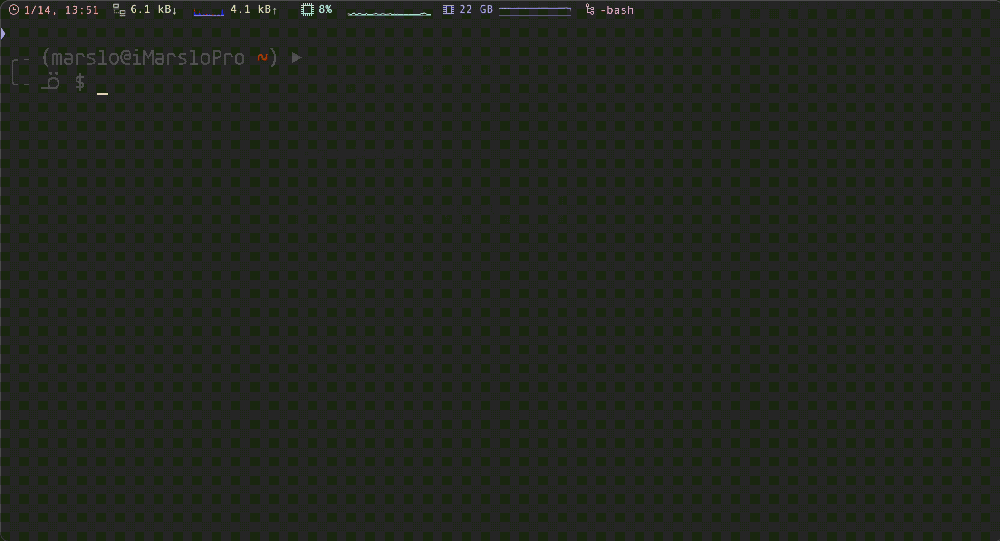

<!-- START doctoc generated TOC please keep comment here to allow auto update -->
<!-- DON'T EDIT THIS SECTION, INSTEAD RE-RUN doctoc TO UPDATE -->

- [usage](#usage)
  - [`Tabularize`](#tabularize)
    - [align with the N pattern](#align-with-the-n-pattern)
    - [align on specific symbol](#align-on-specific-symbol)
- [useful commands](#useful-commands)
- [plugin alternatives](#plugin-alternatives)
  - [autocompletion](#autocompletion)
  - [language server protocol](#language-server-protocol)
  - [ctrl-p](#ctrl-p)
  - [snippets](#snippets)
  - [cryptmethod](#cryptmethod)
- [highly recommended](#highly-recommended)
  - [LunarWatcher/auto-pairs](#lunarwatcherauto-pairs)
  - [junegunn/fzf.vim](#junegunnfzfvim)
  - [luochen1990/rainbow](#luochen1990rainbow)
  - [Yggdroot/indentLine](#yggdrootindentline)
  - [airblade/vim-gitgutter](#airbladevim-gitgutter)
  - [vim-airline/vim-airline](#vim-airlinevim-airline)
- [programming](#programming)
  - [vim-syntastic/syntastic](#vim-syntasticsyntastic)
  - [tpope/vim-commentary](#tpopevim-commentary)
  - [coc.nvim](#cocnvim)
  - [nvim-treesitter/nvim-treesitter](#nvim-treesitternvim-treesitter)
  - [neovim/nvim-lspconfig](#neovimnvim-lspconfig)
  - [others](#others)
- [utils](#utils)
  - [vim-scripts/AuthorInfoDetect](#vim-scriptsauthorinfodetect)
  - [sjl/gundo.vim](#sjlgundovim)
  - [yegappan/mru](#yegappanmru)
- [markdown](#markdown)
  - [preservim/vim-markdown](#preservimvim-markdown)
  - [dhruvasagar/vim-table-mode](#dhruvasagarvim-table-mode)
  - [godlygeek/tabular](#godlygeektabular)
- [git](#git)
  - [tpope/vim-fugitive](#tpopevim-fugitive)
  - [APZelos/blamer.nvim](#apzelosblamernvim)
  - [zivyangll/git-blame.vim](#zivyangllgit-blamevim)
- [color and theme](#color-and-theme)
  - [ryanoasis/vim-devicons](#ryanoasisvim-devicons)
  - [RRethy/vim-hexokinase](#rrethyvim-hexokinase)
- [troubleshooting](#troubleshooting)
  - [airline](#airline)

<!-- END doctoc generated TOC please keep comment here to allow auto update -->


> references:
> - [* vimcolorschemes](https://vimcolorschemes.com/)
> - [Spelling And Grammar With Vim](https://www.vimfromscratch.com/articles/spell-and-grammar-vim)
> - [* amix/vimrc](https://github.com/amix/vimrc)
> - [deprecated plugins](./deprecated.html)


# usage
## [`Tabularize`](https://github.com/godlygeek/tabular)

> [!TIP|label:references:]
> - [Tabular cheatsheet](https://devhints.io/tabular)
> - [align with first space](https://stackoverflow.com/a/15915827/2940319) : `/^\s*\S\+\zs/l0c1l0`
> - [align the second `=` to left](https://stackoverflow.com/a/5424784/2940319) : `/^\(.\{-}\zs=\)\{2}/l1l0`
>   

| specifier | comments                             |
|:---------:|--------------------------------------|
|   `l<N>`  | left-align (with N spaces padding)   |
|   `r<N>`  | right-align (with N spaces padding)  |
|   `c<N>`  | center-align (with N spaces padding) |


`:Tabularize /,/r1c1l0` means:
* splitting fields on commas (`:`)
* print everything before the first comma right aligned, then 1 space
* then the comma center aligned, then 1 space,
* then everything after the comma left aligned.


- including the `<sep>`
  - align to left
    ```vim
    :Tabularize /<sep>
    ```
    - or
      ```vim
      :Tabularize /<sep>/l1
      ```

  - align to center
    ```vim
    :Tabularize /<sep>/r1c1l0
    ```

  

- align without `<sep>`

  > [!NOTE]
  > [`help /zs`](https://vimhelp.org/pattern.txt.html#%2F%5Czs)

  ```vim
  :Tabularize /<sep>\zs/<specifier>
  ```

### align with the N pattern
> i.e.: the second match (`=`)
> - refer to [matches the N pattern](tricky.html#matches-the-n-pattern)

- [align on first matche](https://stackoverflow.com/a/11497961/2940319)
  - align the first `:`
    ```vim
    :Tabularize /^[^:]*\zs:
    ```
    [or](https://stackoverflow.com/a/23840400/2940319)
    ```vim
    :Tabularize /:.*
    ```

  

  - [via vim cmd](https://stackoverflow.com/questions/20435920/dynamic-vim-tabular-patterns)

    > [!NOTE]
    > only for default left-alignemnt. Not support customized right/middle alignment.
    > i.e.: `/r1c1l0`

    ```vim
    command! -nargs=1 -range First exec <line1> . ',' . <line2> . 'Tabularize /^[^' . escape(<q-args>, '\^$.[?*~') . ']*\zs' . escape(<q-args>, '\^$.[?*~')
    ```

- align with 2nd matches
  ```vim
  :Tabularize /^\(.\{-}\zs=\)\{N}/
               |
              `^` means start of the line
  ```

  


  - or with `\v` (very magic)
    > reference:
    > - [`:help \v`](https://vimhelp.org/pattern.txt.html#%2F%5Cv)
    > - [vim pattern: overview of ordinary atoms](tricky.html#overview-of-ordinary-atoms)

    ```vim
    :Tabularize /\v^(.{-}\zs\=){N}/<specifier>
    ```

- for every N matches
  ```vim
  : Tabularize /\(.\{-}\zs=\)\{N}/<specifier>
               |
               no `^` means every `{N}` matches
  ```
  - or
    ```vim
    :Tabularize /\v(.{-}\zs\=){N}/<specifier>
    ```

### [align on specific symbol](https://vi.stackexchange.com/a/12652/7389)

> [!NOTE|label:pre condition:]
> - align the first `:` and last matches `,` as below:
> ```groovy
> [
>   isRunning : proc.getOrDefault( 'run' , false ) ,
>   name : proc.getOrDefault( 'name' , '') ,
>   runningStage : proc.getOrDefault( 'stage' , ['all'] ) ,
>   type : proc.type.split('^.*\\u00BB\\s*').last() ,
> ]
> ```

- first `:`
  > reference: via
  > - `/^[^;]*\zs:`
  > - `/^[^;]*\zs:/r1c1l0`
  > - `/^[^;]*/r1c1l0`

  - `/^[^:]*\zs:`
    ```groovy
    isRunning    : proc.getOrDefault( 'run' , false ) ,
    name         : proc.getOrDefault( 'name' , '') ,
    runningStage : proc.getOrDefault( 'stage' , ['all'] ) ,
    type         : proc.type.split('^.*\\u00BB\\s*').last() ,
    ```
    
    

  - `/^[^:]*\zs/r1c1l0`
    ```groovy
       isRunning  : proc.getOrDefault( 'run' , false ) ,
            name  : proc.getOrDefault( 'name' , '') ,
    runningStage  : proc.getOrDefault( 'stage' , ['all'] ) ,
            type  : proc.type.split('^.*\\u00BB\\s*').last() ,
    ```

  - `/^[^:]*\zs:/r1c1l0`
    ```groovy
       isRunning : proc.getOrDefault( 'run' , false ) ,
            name : proc.getOrDefault( 'name' , '') ,
    runningStage : proc.getOrDefault( 'stage' , ['all'] ) ,
            type : proc.type.split('^.*\\u00BB\\s*').last() ,
    ```
    

  - `/^[^:]*/r1c1l0`
    ```groovy
      isRunning   : proc.getOrDefault( 'run' , false ) ,
        name      : proc.getOrDefault( 'name' , '') ,
    runningStage  : proc.getOrDefault( 'stage' , ['all'] ) ,
        type      : proc.type.split('^.*\\u00BB\\s*').last() ,
    ```

  - `/^[^:]*:/r1c1l0`:
    ```groovy
      isRunning :  proc.getOrDefault( 'run' , false ) ,
        name :     proc.getOrDefault( 'name' , '') ,
    runningStage : proc.getOrDefault( 'stage' , ['all'] ) ,
        type :     proc.type.split('^.*\\u00BB\\s*').last() ,
    ```

- last `,`
  > tips:
  > - actually the pattern not matches with the final `,`, but matches with `)<.*> ,`
  >
  > **sample code**:
  > ```groovy
  >    isRunning : proc.getOrDefault( 'run' , false ) ,
  >         name : proc.getOrDefault( 'name' , '') ,
  > runningStage : proc.getOrDefault( 'stage' , ['all'] ) ,
  >         type : proc.type.split('^.*\\u00BB\\s*').last() ,
  > ```

  - `/)[^,]*\zs,`
    ```groovy
       isRunning : proc.getOrDefault( 'run' , false )       ,
            name : proc.getOrDefault( 'name' , '')          ,
    runningStage : proc.getOrDefault( 'stage' , ['all'] )   ,
            type : proc.type.split('^.*\\u00BB\\s*').last() ,
    ```

    - or even better align

      - `:1,3Tabularize /,` or `:'<,'>Tabularize /,`
        ```groovy
           isRunning : proc.getOrDefault( 'run'   , false )   ,
                name : proc.getOrDefault( 'name'  , '')       ,
        runningStage : proc.getOrDefault( 'stage' , ['all'] ) ,
                type : proc.type.split('^.*\\u00BB\\s*').last() ,
        ```
      - `:Tabularize /)[^,]*\zs,`
        ```groovy
           isRunning : proc.getOrDefault( 'run'   , false )     ,
                name : proc.getOrDefault( 'name'  , '')         ,
        runningStage : proc.getOrDefault( 'stage' , ['all'] )   ,
                type : proc.type.split('^.*\\u00BB\\s*').last() ,
        ```

    

# useful commands

```vim
command! -nargs=0 -bar -range=% Reverse
    \       let save_mark_t = getpos("'t")
    \<bar>      <line2>kt
    \<bar>      exe "<line1>,<line2>g/^/m't"
    \<bar>  call setpos("'t", save_mark_t)
nnoremap <Leader>r :Reverse <bar> nohlsearch<CR>
xnoremap <Leader>r :Reverse <bar> nohlsearch<CR>

command! -nargs=0 DocTocUpdate execute 'silent !/usr/local/bin/doctoc --notitle --update-only --github --maxlevel 3 %' | execute 'redraw!'
command! -nargs=0 DocTocCreate execute 'silent !/usr/local/bin/doctoc --notitle --github --maxlevel 3 %' | execute 'redraw!'
command! -nargs=1        First execute                           'Tabularize /^[^' . escape(<q-args>, '\^$.[?*~') . ']*\zs' . escape(<q-args>, '\^$.[?*~')
command! -nargs=1 -range First execute <line1> . ',' . <line2> . 'Tabularize /^[^' . escape(<q-args>, '\^$.[?*~') . ']*\zs' . escape(<q-args>, '\^$.[?*~')
command! -nargs=0        Iname execute 'echo expand("%:p")'
```

# plugin alternatives

## autocompletion
- [ycm-core/YouCompleteMe](https://github.com/ycm-core/YouCompleteMe)
- [neoclide/coc.nvim](https://github.com/neoclide/coc.nvim) | [CocList 入坑指南](https://zhuanlan.zhihu.com/p/71846145) | [coc.nvim 插件体系 - 介绍](https://zhuanlan.zhihu.com/p/65524706)
- [prabirshrestha/asyncomplete.vim](https://github.com/prabirshrestha/asyncomplete.vim)
- [Shougo/ddc.vim](https://github.com/Shougo/ddc.vim)

## [language server protocol](https://microsoft.github.io/language-server-protocol/)

> [!NOTE]
> - [Ale Alternatives](https://www.libhunt.com/r/ale)

- [prabirshrestha/vim-lsp](https://github.com/prabirshrestha/vim-lsp)
- [rhysd/vim-lsp-ale](https://github.com/rhysd/vim-lsp-ale)
- [mfussenegger/nvim-lint](https://github.com/mfussenegger/nvim-lint)
- [neovim/nvim-lspconfig](https://github.com/neovim/nvim-lspconfig)
- [mattn/vim-lsp-settings](https://github.com/mattn/vim-lsp-settings)
- [ycm-core/lsp-examples](https://github.com/ycm-core/lsp-examples)
- [jose-elias-alvarez/null-ls.nvim](https://github.com/jose-elias-alvarez/null-ls.nvim)

## ctrl-p
- [Shougo/denite.nvim](https://github.com/Shougo/denite.nvim)

## snippets
- [hrsh7th/vim-vsnip](https://github.com/hrsh7th/vim-vsnip) | [hrsh7th/vim-vsnip-integ](https://github.com/hrsh7th/vim-vsnip-integ)
- [SirVer/UltiSnips](https://github.com/SirVer/ultisnips) | [thomasfaingnaert/vim-lsp-ultisnips](https://github.com/thomasfaingnaert/vim-lsp-ultisnips)
- [Shougo/neosnippet.vim](https://github.com/Shougo/neosnippet.vim) | [thomasfaingnaert/vim-lsp-neosnippet](https://github.com/thomasfaingnaert/vim-lsp-neosnippet)

## cryptmethod
- [kurotych/CCryptor.nvim](https://github.com/kurotych/ccryptor.nvim)
- [GPG](https://www.reddit.com/r/neovim/comments/7js0qq/comment/dr8zczy/?utm_source=share&utm_medium=web2x&context=3)

# highly recommended

> [!NOTE|label:references:]
> - [Vim Plugin Audit](https://tuckerchapman.com/2020/05/18/vim-plugin-audit/)

## [LunarWatcher/auto-pairs](https://github.com/LunarWatcher/auto-pairs/tree/master)

```vim
" LunarWatcher/auto-pairs
let g:AutoPairs                             = autopairs#AutoPairsDefine({ '<': '>' })
let g:AutoPairsMapBS                        = 1
let g:AutoPairsFlyMode                      = 0
let g:AutoPairsCompleteOnlyOnSpace          = 1
let g:AutoPairsNoJump                       = 0
let g:AutoPairsSpaceCompletionRegex         = '\w'
" to avoid impact with ctrl-p ( :Files )
let g:AutoPairsShortcutToggleMultilineClose = 0
let g:AutoPairsShortcutBackInsert           = '<M-b>'
let g:AutoPairsPrefix                       = '<M-j>'
let g:AutoPairsShortcutJump                 = '<M-n>'
let g:AutoPairsShortcutToggle               = '<M-j>'

augroup DevOps
  autocmd FileType markdown,html let g:AutoPairsCompleteOnlyOnSpace = 0
  autocmd FileType markdown,html let b:AutoPairs = autopairs#AutoPairsDefine({
        \ '<div>':'</div>', '<font>':'</font>', '<a>':'</a>', '<p>':'</p>',
        \ '<table>':'</table>', '<tbody>':'</tbody>',
        \ '<thread>':'</thread>', '<th>':'</th>', '<td>':'</td>'
        \ })
augroup END
```


## [junegunn/fzf.vim](https://github.com/junegunn/fzf.vim)
```vim
set runtimepath+=/usr/local/opt/fzf                                         " $ brew install fzf
Plug '/usr/local/opt/fzf'
Plug 'junegunn/fzf.vim'

" fzf.vim
nnoremap <C-p> :Files<CR>
nnoremap <C-g> :GFiles<CR>
nnoremap <C-s> :Ag<CR>
nnoremap <silent><leader>l  :Buffers<CR>
nnoremap <silent> <Leader>H :Helptags<CR>
nnoremap <silent> <Leader>g :Commits<CR>
let g:fzf_layout                  = { 'window': { 'width': 0.9, 'height': 0.6, 'relative': v:true } }
let g:fzf_history_dir             = '~/.vim/cache/fzf-history'
let g:fzf_vim                     = {}
let g:fzf_vim.preview_window      = [ 'right,50%', 'ctrl-\' ]
let g:fzf_vim.tags_command        = 'ctags -R'
let g:fzf_vim.commits_log_options = '--graph --color=always --format="%C(auto)%h%d %s %C(black)%C(bold)%cr"'
command! -bang -nargs=? -complete=dir Files
    \ call fzf#vim#files(<q-args>, {'options': ['--layout=reverse', '--info=inline', '--preview', 'bat --color=always {}']}, <bang>0)
command! -bang -complete=dir -nargs=? LS
    \ call fzf#run(fzf#wrap('ls', {'source': 'ls', 'dir': <q-args>}, <bang>0))
inoremap <expr> <c-x><c-l> fzf#vim#complete(fzf#wrap({
  \ 'prefix': '^.*$',
  \ 'source': 'rg -n ^ --color always',
  \ 'options': '--ansi --delimiter : --nth 3..',
  \ 'reducer': { lines -> join(split(lines[0], ':\zs')[2:], '') }}
  \ )
\ )
let g:fzf_action = {
  \ 'ctrl-t': 'tab split',
  \ 'ctrl-x': 'split',
  \ 'ctrl-v': 'vsplit'
\ }
let g:fzf_colors = {
  \ 'fg':         ['fg', 'Normal'],
  \ 'bg':         ['bg', 'Normal'],
  \ 'preview-bg': ['bg', 'NormalFloat'],
  \ 'hl':         ['fg', 'Comment'],
  \ 'fg+':        ['fg', 'CursorLine', 'CursorColumn', 'Normal'],
  \ 'bg+':        ['bg', 'CursorLine', 'CursorColumn'],
  \ 'hl+':        ['fg', 'Statement'],
  \ 'info':       ['fg', 'PreProc'],
  \ 'border':     ['fg', 'Ignore'],
  \ 'prompt':     ['fg', 'Conditional'],
  \ 'pointer':    ['fg', 'Exception'],
  \ 'marker':     ['fg', 'Keyword'],
  \ 'spinner':    ['fg', 'Label'],
  \ 'header':     ['fg', 'Comment']
\ }
```

## [luochen1990/rainbow](https://github.com/luochen1990/rainbow)
```vim
" install
Plug 'luochen1990/rainbow'

" luochen1990/rainbow
" for i in '75' '147' '108' '196' '208' '66' '106' '172' '115' '129'; do echo -e "\e[38;05;${i}m${i}"; done | column -c 250 -s ' '; echo -e "\e[m"
let g:rainbow_active    = 1
let g:rainbow_operators = 1
let g:rainbow_conf      = {
\   'guifgs' : [ '#6A5ACD', '#ff6347', '#b58900', '#9acd32', '#EEC900', '#9A32CD', '#EE7600', '#268bd2', '#183172' ],
\   'ctermfgs' : 'xterm-256color' == $TERM ? [ '75', '147', '108', '196', '208', '66', '106', '172', '115', '129' ] : [ 'lightblue', 'lightgreen', 'yellow', 'red', 'magenta' ],
\   'parentheses': [ ['(',')'], ['\[','\]'], ['{','}'] ],
\   'separately': {
\     '*': {},
\     'markdown': {
\       'parentheses_options': 'containedin=markdownCode contained',
\     },
\     'css': {
\       'parentheses': [ ['(',')'], ['\[','\]'] ],
\     },
\     'scss': {
\       'parentheses': [ ['(',')'], ['\[','\]'] ],
\     },
\     'html': {
\       'parentheses': [ ['(',')'], ['\[','\]'], ['{','}'] ],
\     },
\     'stylus': {
\       'parentheses': [ 'start=/{/ end=/}/ fold contains=@colorableGroup' ],
\     }
\   }
\}
```

## [Yggdroot/indentLine](https://github.com/Yggdroot/indentLine)
```vim
" install
Plug 'Yggdroot/indentLine'

" settings
nnoremap <leader>idl :IndentLineEnable<CR>

let g:indentLine_enabled              = 1
let g:indentLine_color_gui            = "#282828"
let g:indentLine_color_term           = 239
let g:indentLine_indentLevel          = 20
let g:indentLine_showFirstIndentLevel = 1
let g:indentLine_color_tty            = 0
let g:indentLine_faster               = 1
let g:indentLine_concealcursor        = 'inc'
let g:indentLine_conceallevel         = 2
if has( 'gui_running' ) || 'xterm-256color' == $TERM
  let g:indentLine_char               = '¦'
elseif has( 'win32' )
  let g:indentLine_color_term         = 8
  let g:indentLine_char               = '|'
else
  let g:indentLine_color_tty_dark     = 0
  let g:indentLine_char               = '¦'
endif
```

## [airblade/vim-gitgutter](https://github.com/airblade/vim-gitgutter)

> [!NOTE|label:references:]
> - [GitGutter Documentation](https://jisaacks.github.io/GitGutter/)
> - [Can't enable gitgutter with GitGutterEnable after disabling it on startup](https://github.com/airblade/vim-gitgutter/issues/409)
> - [How to display in real time](https://github.com/airblade/vim-gitgutter/issues/579)

```vim
Plug 'airblade/vim-gitgutter'

" airblade/vim-gitgutter
let g:gitgutter_git_executable = '/usr/local/bin/git'
let g:gitgutter_enabled        = 1
let g:gitgutter_realtime       = 0
let g:gitgutter_eager          = 0
set updatetime=250
set signcolumn=yes
highlight clear SignColumn
```

## [vim-airline/vim-airline](https://github.com/vim-airline/vim-airline)

> [!NOTE|label:references:]
> - [* iMarso : osx/apps/powerline](../osx/apps.html#powerline)
>   - [ryanoasis/powerline-extra-symbols](https://github.com/ryanoasis/powerline-extra-symbols)
>     
> - [* Getting started with vim-airline](https://tuckerchapman.com/2020/09/15/getting-started-vim-airline/)
> - [How do I fix the status bar symbols in the Airline plugin?](https://vi.stackexchange.com/a/16512/7389)
> - [Airline status line and tab line text changes colour when the vimrc is sourced.](https://www.reddit.com/r/vim/comments/q3ufc0/airline_status_line_and_tab_line_text_changes/)
> - [Vim Airline Setup](https://jnduli.co.ke/vim-airline-setup.html)
> - [autoload/airline/init.vim](https://github.com/vim-airline/vim-airline/blob/master/autoload/airline/init.vim)
> - [Getting started with vim-airline](https://tuckerchapman.com/posts/getting-started-vim-airline/)
> - section:
>   - [#787: How to modify contents of section Y?](https://github.com/vim-airline/vim-airline/issues/787#issue-84289641)
>   - [#1087: How to replace section_y with contents of section_x?](https://github.com/vim-airline/vim-airline/issues/1087)
>   - [#1845: how to disable additional section totally.](https://github.com/vim-airline/vim-airline/issues/1845#issuecomment-449700299)
> - tips:
>   - check loaded extensions : `:AirlineExtension`
>   - [#1373 How can I show system time in airline?](https://github.com/vim-airline/vim-airline/issues/1373#issuecomment-273040424)
>   - [* FAQ](https://github.com/vim-airline/vim-airline/wiki/FAQ)

```vim
Plug 'tpope/vim-fugitive'
Plug 'vim-airline/vim-airline'
Plug 'vim-airline/vim-airline-themes'

" vim-airline/vim-airline
let g:airline_powerline_fonts                      = 1
let g:airline_highlighting_cache                   = 1
let g:airline_detect_spelllang                     = 0              " disable spelling language
let g:airline_exclude_preview                      = 0              " disable in preview window
let g:airline_theme                                = 'base16_embers'" 'apprentice', 'base16', 'gruvbox', 'zenburn', 'base16_atelierheath'
let g:Powerline_symbols                            = 'fancy'
let g:airline_section_y                            = ''             " fileencoding
let g:airline_section_x                            = ''
let g:airline_section_z                            = "%3p%% %l/%L:%c [%B]"
let g:airline_skip_empty_sections                  = 1
let g:airline_detect_modified                      = 1
let g:airline_detect_paste                         = 1
let g:airline#extensions#wordcount#enabled         = 1
let g:airline#extensions#wordcount#filetypes       = '\vtext|nroff|plaintex'
let g:airline#extensions#quickfix#enabled          = 0
let g:airline#extensions#quickfix#quickfix_text    = 'Quickfix'
let g:airline_stl_path_style                       = 'short'
let g:airline#extensions#tabline#enabled           = 1              " ╮ enable airline tabline
let g:airline#extensions#tabline#fnamemod          = ':t'           " │
let g:airline#extensions#tabline#show_close_button = 0              " │ remove 'X' at the end of the tabline
let g:airline#extensions#tabline#show_buffers      = 1              " │
let g:airline#extensions#tabline#show_splits       = 0              " │ disables the buffer name that displays on the right of the tabline
let g:airline#extensions#tabline#tab_min_count     = 2              " │ minimum of 2 tabs needed to display the tabline
let g:airline#extensions#tabline#show_tabs         = 0              " │
let g:airline#extensions#tabline#tab_nr_type       = 1              " ╯ tab number
let g:airline#extensions#branch#format             = 2
let g:airline#extensions#fzf#enabled               = 1
let g:airline#extensions#nerdtree_statusline       = 1
let g:airline#extensions#syntastic#enabled         = 1
let g:airline#extensions#coc#enabled               = 1              " ╮
let g:airline#extensions#coc#show_coc_status       = 0              " │
let g:airline#extensions#coc#error_symbol          = ' ✗:'          " ├ coc
let g:airline#extensions#coc#warning_symbol        = ' ⍨:'          " │
let g:airline#extensions#coc#stl_format_err        = '%C(␊%L)'      " │
let g:airline#extensions#coc#stl_format_warn       = '%C(␊%L)'      " ╯
let g:airline#extensions#ale#enabled               = 0              " ╮
let g:airline#extensions#ale#error_symbol          = ' ᓆ :'         " │
let g:airline#extensions#ale#warning_symbol        = ' ᣍ :'         " ├ ale
let g:airline#extensions#ale#show_line_numbers     = 0              " │
let g:airline#extensions#ale#open_lnum_symbol      = '(␊:'          " │
let g:airline#extensions#ale#close_lnum_symbol     = ')'            " ╯
" let g:airline_mode_map                           = { '__': '-', 'n' : 'N', 'i' : 'I', 'R' : 'R', 'c' : 'C', 'v' : 'V', 'V' : 'V', '': 'V', 's' : 'S', 'S' : 'S', '': 'S', }
if !exists('g:airline_symbols') | let g:airline_symbols = {} | endif
let g:airline_symbols.dirty                        = ' ♪'
let g:airline_left_sep                             = ''
let g:airline_right_sep                            = ''
function! AirlineInit()
  let g:airline_section_a = airline#section#create([ '[', 'mode', ']' ])
  let g:airline_section_y = airline#section#create([ '%{strftime("%H:%M %b-%d %a")} ', '['.&ff.']' ])
  let g:airline_section_c = '%<' . airline#section#create([ '%F' ]) " let g:airline_section_c = '%<' . '%{expand(%:p:~)}'
endfunction
autocmd User AirlineAfterInit call AirlineInit()
```


- tips
  - [remove section_<x>](https://stackoverflow.com/a/45150368/2940319)
    ```vim
    let g:airline_section_<x>         = ''                          " remove the filetype part
    let g:airline_skip_empty_sections = 1                           " remove separators for empty sections
    ```

  - setup short mode
    ```vim
    let g:airline_mode_map = { '__': '-', 'n' : 'N', 'i' : 'I', 'R' : 'R', 'c' : 'C', 'v' : 'V', 'V' : 'V', '': 'V', 's' : 'S', 'S' : 'S', '': 'S', }
    ```

  - unicode symbols

    > [!NOTE|label:symbols]
    > - [`:help airline`](https://github.com/vim-airline/vim-airline/blob/master/doc/airline.txt)
    >   ```vim
    >   " powerline symbols
    >   let g:airline_left_sep          = ''     " \ue0b0
    >   let g:airline_left_alt_sep      = ''     " \ue0b1
    >   let g:airline_right_sep         = ''     " \ue0b2
    >   let g:airline_right_alt_sep     = ''     " \ue0b3
    >   let g:airline_symbols.branch    = ''     " \ue0a0
    >   let g:airline_symbols.colnr     = ' ℅:'   " \u2105 \u3a
    >   let g:airline_symbols.readonly  = ''     " \ue0a2
    >   let g:airline_symbols.linenr    = ' :'   " \ue0a1
    >   let g:airline_symbols.maxlinenr = '☰ '    " \u2630
    >   let g:airline_symbols.dirty     = '⚡'    " \u26a1
    >
    >   " old vim-powerline symbols
    >   let g:airline_left_sep          = '⮀'     " \u2b80
    >   let g:airline_left_alt_sep      = '⮁'     " \u2b81
    >   let g:airline_right_sep         = '⮂'     " \u2b82
    >   let g:airline_right_alt_sep     = '⮃'     " \u2b83
    >   let g:airline_symbols.branch    = '⭠'     " \u2b60
    >   let g:airline_symbols.readonly  = '⭤'     " \u2b64
    >   let g:airline_symbols.linenr    = '⭡'     " \u2b61
    >
    >   " unicode symbols
    >   let g:airline_left_sep           = '»'    " \u00bb
    >   let g:airline_left_sep           = '▶'    " \u25b6
    >   let g:airline_right_sep          = '«'    " \u00ab
    >   let g:airline_right_sep          = '◀'    " \u25c0
    >   let g:airline_symbols.colnr      = ' ㏇:' " \u33C7
    >   let g:airline_symbols.colnr      = ' ℅:'  " \u2105
    >   let g:airline_symbols.crypt      = '🔒'   " \U0001f512
    >   let g:airline_symbols.linenr     = '☰'    " \u2630
    >   let g:airline_symbols.linenr     = ' ␊:'  " \u240a
    >   let g:airline_symbols.linenr     = ' ␤:'  " \u2424
    >   let g:airline_symbols.linenr     = '¶'    " \u00b6
    >   let g:airline_symbols.maxlinenr  = ''
    >   let g:airline_symbols.maxlinenr  = '㏑'   " \u33d1
    >   let g:airline_symbols.branch     = '⎇'    " \u2387
    >   let g:airline_symbols.paste      = 'ρ'    " \u03c1
    >   let g:airline_symbols.paste      = 'Þ'    " \u00de
    >   let g:airline_symbols.paste      = '∥'    " \u2225
    >   let g:airline_symbols.spell      = 'Ꞩ'    " \ua7a8
    >   let g:airline_symbols.notexists  = 'Ɇ'    " \u0246
    >   let g:airline_symbols.notexists  = '∄'    " \u2204
    >   let g:airline_symbols.whitespace = 'Ξ'    " \u039e
    >   ```
    >
    > - [`:help airline-customization`](https://vi.stackexchange.com/a/3363/7389)
    >   ```vim
    >   " unicode symbols
    >   let g:airline_left_sep           = '»'
    >   let g:airline_left_sep           = '▶'
    >   let g:airline_right_sep          = '«'
    >   let g:airline_right_sep          = '◀'
    >   let g:airline_symbols.linenr     = '␊'
    >   let g:airline_symbols.linenr     = '␤'
    >   let g:airline_symbols.linenr     = '¶'
    >   let g:airline_symbols.branch     = '⎇'
    >   let g:airline_symbols.paste      = 'ρ'
    >   let g:airline_symbols.paste      = 'Þ'
    >   let g:airline_symbols.paste      = '∥'
    >   let g:airline_symbols.whitespace = 'Ξ'
    >   ```

    ```vim
    let g:airline_symbols.branch         = '⎇'                    " ╮
    let g:airline_symbols.paste          = 'ρ'                    " ├ unicode symbols
    let g:airline_symbols.dirty          = ' ↯'                   " ╯
    ```

  - [get theme randomly](https://github.com/vim-airline/vim-airline-themes/issues/170#issuecomment-476524390)

    > [!NOTE]
    > - [#2145 : Align section C to the left when overflowed](https://github.com/vim-airline/vim-airline/issues/2145#issuecomment-673640814)

    ```vim
    let g:airline_theme                  = 'random'
    ```

#### sections

> [!NOTE|label:references:]
> - [#696 : Accents may cause status line exceed width](https://github.com/vim-airline/vim-airline/issues/696#issuecomment-75034875)

```vim
let g:airline_section_x                          = "%-{strftime(\"%H:%M\ %d/%m/%y\")} %1*--%n%%--%*"
let g:airline_section_y                          = "%{&fenc}%{&bomb ? '[bom]' : ''}%{strlen(&ff) > 0 ? '['.&ff.']' : ''}"
let g:airline#parts#ffenc#skip_expected_string   ='utf-8[unix]'
let g:airline_section_c_only_filename            = 0

function! AirlineInit()
  " NORMAL  docs/vim/
  let g:airline_section_a = airline#section#create([ 'mode', '  ', '%{join( split(getcwd(), "/")[-2:-1], "/" )}', '/' ])
  " NORMAL  docs/vim/plugins.md
  let g:airline_section_a = airline#section#create([ 'mode', '  ', '%{join( split(expand("%:p"), "/")[-3:-1], "/" )}' ])
  let g:airline_section_y = airline#section#create(['%{strftime("%H:%M %b-%d %a")} ', '['.&ff.']'])
  let g:airline_section_c = '%<' . airline#section#create(['%{expand("%:p:~")}'])
endfunction
autocmd User AirlineAfterInit call AirlineInit()
```

- section_a

  > [!NOTE|label:paths:]
  > - show relative path `%F` : `let g:airline_section_c = airline#section#create([ '%F' ])` -> `~/.vimrc`
  > - show filename only `%f` : `let g:airline_section_c = airline#section#create([ '%f' ])` -> `.vimrc`

  

  

  - via function
    ```vim
    function! ShortPath()
      let pathlist=split(expand("%:p:~"), "/")
      return len(pathlist) < 3 ? join( pathlist[-2:-1], "/" ) : join( pathlist[-3:-1], "/" )
    endfunction
    " or"
    function! ShortPath()
      let pathlist=split(expand("%:p:~"), "/")
      if len(pathlist) < 3 | let final_result=join( pathlist[-2:-1], "/" ) | else | let final_result=join( pathlist[-3:-1], "/" ) | endif
      return final_result
    endfunction

    let g:airline_section_a = airline#section#create([ 'mode', '  ', ShortPath() ])
    ```

    - i.e.:
      ```vim
      function! ShortPath()
        let pathlist=split(expand("%:p:~"), "/")
        return len(pathlist) < 3 ? join( pathlist[-2:-1], "/" ) : join( pathlist[-3:-1], "/" )
      endfunction
      function! AirlineInit()
        let g:airline_section_a = airline#section#create([ '[', 'mode', ']', '  ', '%{&fenc}', '  ', ShortPath() ])
        let g:airline_section_y = airline#section#create([ '%{strftime("%H:%M %b-%d %a")} ', '['.&ff.']' ])
        let g:airline_section_c = '%<' . airline#section#create([ '%F' ]) " let g:airline_section_c = '%<' . '%{expand(%:p:~)}'
      endfunction
      autocmd User AirlineAfterInit call AirlineInit()
      ```

      

  - via `%{}`
    ```vim
    function! AirlineInit()
      let pathlist=split( expand("%:p:~"), "/" )
      let g:airline_section_a = airline#section#create([ 'mode', '  ', '%{len(pathlist) < 3 ? join( pathlist[-2:-1], "/" ) : join( pathlist[-3:-1], "/" )}'])
    endfunction
    autocmd User AirlineAfterInit call AirlineInit()
    ```

    


- sections with length limitation
  - `%<'`: `let g:airline_section_c = '%<' . airline#section#create(['%{expand("%:p:~")}'])`
  - [`%-0.xx{}`](https://github.com/vim-airline/vim-airline/issues/1485#issuecomment-309734370) : `let g:airline_section_c = '%<' . '%-0.13{expand("%:p:~")}'`

  - i.e.:
    ```vim
    let g:airline_section_c = '%<' . '%-0.20{expand("%:p:~")}'
    " <docs/vim/plugins.md

    let g:airline_section_c = '%<' . '%{expand("%:p:~")}'
    " ~/path/to/ibook/docs/vim/plugins.md

    let g:airline_section_c = airline#section#create(['%F'])
    " ~/path/to/book/docs/vim/plugins.md
    ```

#### themes

> - [n-st/vim-airline-screenshots](https://github.com/n-st/vim-airline-screenshots)
> - [* Change the vim-airline theme](https://github.com/vim-airline/vim-airline/wiki/Screenshots)
>   - `:AirlineTheme random` : `let g:airline_theme='random'` : `:echo g:airline_theme`
>     
>   - [tomorrow](https://github.com/vim-airline/vim-airline/wiki/Screenshots#tomorrow-1)
>   - [distinguished](https://github.com/vim-airline/vim-airline/wiki/Screenshots#distinguished)
>   - [base16](https://github.com/vim-airline/vim-airline/wiki/Screenshots#base16)
>   - [angr](https://github.com/vim-airline/vim-airline/wiki/Screenshots#angr)
>   - [zenburn](https://github.com/vim-airline/vim-airline/wiki/Screenshots#zenburn)
>   - [zenburn](https://github.com/vim-airline/vim-airline/wiki/Screenshots#zenburn)
>   - [wombat](https://github.com/vim-airline/vim-airline/wiki/Screenshots#wombat)

- great themes
  - * base16_embers
    

  - * base16
    

  - * apprentice
    

  - * gruvbox
    

  - * zenburn
    

  - angr
  - selenized/selenized_bw
  - biogoo
  - base16_default
  - base16color
  - base16_chalk
  - base16_bright
  - biogoo ( dark background in insert mode )

- nice themes
  - owo
  - hybrid
  - bubblegum
  - supernova
  - alduin
  - base16_summerfruit
  - base16_atelierseaside
  - raven ( no background color )
  - peaksea ( no background color change )

# programming
## [vim-syntastic/syntastic](https://github.com/vim-syntastic/syntastic)

> [!NOTE|label:references:]
> - [#1577 : Unknown function: SyntasticStatuslineFlag](https://github.com/vim-syntastic/syntastic/issues/1577)
> - [In Editor Linting with Syntastic](https://medium.com/usevim/in-editor-linting-with-syntastic-6814122bdbec)
>   ```vim
>   :SyntasticInfo
>   ```

```vim
Plug 'vim-syntastic/syntastic'

" syntastic settings                                                " Plug 'vim-syntastic/syntastic'
set statusline+=%#warningmsg#
set statusline+=%{SyntasticStatuslineFlag()}
set statusline+=%*
let g:syntastic_always_populate_loc_list = 1
let g:syntastic_auto_loc_list            = 1
let g:syntastic_check_on_open            = 1
let g:syntastic_check_on_wq              = 0
let g:syntastic_loc_list_height          = 2
let g:syntastic_ignore_files             = ['\.py$']
let g:syntastic_html_tidy_ignore_errors  = [" proprietary attribute \"ng-"]
let g:syntastic_enable_signs             = 1
let g:syntastic_info_symbol              = 'ೲ'                      " ࠵ ϊ
let g:syntastic_error_symbol             = '✗'                      " ஓ ௐ ྾
let g:syntastic_warning_symbol           = '⍨'                      " ᓆ ᓍ
let g:syntastic_style_error_symbol       = '⍥'
let g:syntastic_style_warning_symbol     = 'ఠ'                      " ⍤ ൠ
highlight link SyntasticErrorSign        Error
highlight link SyntasticWarningSign      GruvboxYellow
highlight link SyntasticStyleErrorSign   GruvboxRedSign
highlight link SyntasticStyleWarningSign GruvboxPurpleSign
```


<!--sec data-title="former version" data-id="section0" data-show=true data-collapse=true ces-->
  ```vim
  Bundle 'vim-syntastic/syntastic'

  " configure syntastic syntax checking to check on open as well as save
  set statusline+=%#warningmsg#
  set statusline+=\ %{SyntasticStatuslineFlag()}                      " vim-syntastic/syntastic
  set statusline+=\ %* |
  let g:syntastic_always_populate_loc_list  = 1
  let g:syntastic_auto_loc_list             = 1
  let g:syntastic_check_on_open             = 1
  let g:syntastic_check_on_wq               = 0
  let g:syntastic_loc_list_height           = 2
  let g:syntastic_ignore_files              = ['\.py$']
  let g:syntastic_html_tidy_ignore_errors   = [" proprietary attribute \"ng-"]
  ```
<!--endsec-->


## [tpope/vim-commentary](https://github.com/tpope/vim-commentary)

```vim
" tpope/vim-commentary
map  <C-/>     gcc
map  <leader>x gcc
imap <C-/>     <Esc><Plug>CommentaryLineA
xmap <C-/>     <Plug>Commentary

augroup DevOps
  autocmd FileType ignore,gitconfig setlocal commentstring=#\ %s
augroup END
```

## [coc.nvim](https://github.com/neoclide/coc.nvim)

> [!NOTE|label:references:]
> - [* Language servers](https://github.com/neoclide/coc.nvim/wiki/Language-servers)
> - [#805 ALE diagnostic signs don't appear](https://github.com/neoclide/coc.nvim/issues/805)
> - [#3402 Can coc vim display all message diagnostic in lines of code](https://github.com/neoclide/coc.nvim/issues/3402)
> - [NeoVim for Java Development (COC)](https://javadev.org/devtools/ide/neovim/coc/)

- initilize
  ```bash
  $ pip install jedi
  ```

  ```vim
  Plug 'neoclide/coc.nvim', {'branch': 'release'}
  ```

  and execute:
  ```bash
  :CocInstall coc-sh coc-groovy coc-json coc-css coc-pyright coc-git coc-snippets
  :CocInstall @yaegassy/coc-tailwindcss3
  :CocUninstall coc-git
  ```

- open configure file ( `coc-settings.json` )
  ```vim
  :CocConfig
  ```

- check information
  ```vim
  :CocInfo
  :checkhealth
  ```

- CocConfig:
  ```json
  {
    "codeLens.enable": true,
    "java.referencesCodeLens.enabled": true,
    "diagnostic.displayByAle": false,
    "diagnostic.errorSign": "✗",
    "diagnostic.infoSign": "i",
    "diagnostic.warningSign": "⚠",
    "diagnostic.hintSign": "➤"
  }
  ```
  - cause issue of trigger
    ```json
    {
      "suggest.autoTrigger": "trigger",
      "suggest.triggerCompletionWait": 50
    }
    ```

## [nvim-treesitter/nvim-treesitter](https://github.com/nvim-treesitter/nvim-treesitter)

> [!NOTE]
> - if install from standalone package, `tree-sitter` required
>   - osx: `$ brew install tree-sitter`
> - [Vim/Neovim 代码高亮插件 -- nvim-treesitter](https://zhuanlan.zhihu.com/p/609164334)

```bash
$ pip3 install tree_sitter
# or
$ brew install tree_sitter
```

```vim
Plug 'nvim-treesitter/nvim-treesitter', { 'do': ':TSUpdate' }
```

- install
  ```vim
  :TSInstall bash css gitcommit git_config gpg html java jq lua python xml yaml
  ```

- check via
  ```vim
  :TSInstallInfo
  :TSModuleInfo
  :checkhealth nvim-treesitter
  :echo nvim_get_runtime_file('*/lua.so', v:true)
  ['/Users/marslo/.vim/plugged/nvim-treesitter/parser/lua.so', '/usr/local/Cellar/neovim/0.9.5/lib/nvim/parser/lua.so']
  ```



## [neovim/nvim-lspconfig](https://github.com/neovim/nvim-lspconfig)

```vim
Plug 'neovim/nvim-lspconfig'
```

- [gradlels](https://github.com/neovim/nvim-lspconfig/blob/master/doc/server_configurations.md#gradle_ls)

  ```bash
  $ mkdir -p ~/.vim/lsp
  $ git clone https://github.com/microsoft/vscode-gradle.git ~/.vim/lsp/vscode-gradle && cd $_
  $ ./gradlew installDist
  ```

- groovyls
  > [!NOTE]
  > - full ycm-core/lsp-examples list
  >   ```vim
  >  Plug 'ycm-core/lsp-examples',  { 'do': 'python3 install.py --enable-groovy --enable-yaml --enable-bash --enable-json --enable-python --enable-lua --enable-docker' }
  >   ```

  ```vim
  # .vimrc
  Plug 'ycm-core/lsp-examples',  { 'do': 'python3 install.py --enable-groovy' }

  # ~/.config/nvim/init.lua
  require'lspconfig'.groovyls.setup{
    filetypes = { 'groovy', 'Jenkinsfile' },
    cmd = { "java", "-jar", "~/.vim/plugged/lsp-examples/groovy/groovy-language-server/build/libs/groovy-language-server-all.jar" },
  }
  ```

  - [GroovyLanguageServer/groovy-language-server](https://github.com/GroovyLanguageServer/groovy-language-server)
    ```bash
    # java has to be less than jdk 19
    $ brew install openjdk@17
    $ export JAVA_HOME='/usr/local/opt/openjdk@17'
    $ export PATH=${JAVA_HOME}/bin:${PATH}
    $ export CPPFLAGS="-I${JAVA_HOME}/include ${CPPFLAGS}"

    $ git clone git@github.com:GroovyLanguageServer/groovy-language-server.git
    $ ./gradew build

    # run
    $ git@github.com:GroovyLanguageServer/groovy-language-server.git
    ```

- [ansiblels](https://github.com/neovim/nvim-lspconfig/blob/master/doc/server_configurations.md#ansiblels)
  ```bash
  $ npm install -g @ansible/ansible-language-server
  ```
  ```vim
  # ~/.config/nvim/init.lua
  require'lspconfig'.ansiblels.setup{}
  ```

- [bashls](https://github.com/neovim/nvim-lspconfig/blob/master/doc/server_configurations.md#bashls)

  ```bash
  $ npm i -g bash-language-server
  ```
  ```vim
  # ~/.config/nvim/init.lua
  require'lspconfig'.bashls.setup{}
  ```

- [cmake](https://github.com/neovim/nvim-lspconfig/blob/master/doc/server_configurations.md#cmake) | [cmake-language-server](https://github.com/regen100/cmake-language-server)
  ```bash
  $ pip install cmake-language-server
  ```
  ```vim
  # ~/.config/nvim/init.lua
  require'lspconfig'.cmake.setup{}
  ```

- [cssls](https://github.com/neovim/nvim-lspconfig/blob/master/doc/server_configurations.md#cssls)
  ```bash
  $ npm i -g vscode-langservers-extracted
  ```
  ```vim
  # ~/.config/nvim/init.lua
  local capabilities = vim.lsp.protocol.make_client_capabilities()
  capabilities.textDocument.completion.completionItem.snippetSupport = true
  require'lspconfig'.cssls.setup { capabilities = capabilities, }
  require'lspconfig'.cssls.setup{}
  ```

- [dockerls](https://github.com/neovim/nvim-lspconfig/blob/master/doc/server_configurations.md#dockerls)
  ```bash
  $ npm install -g dockerfile-language-server-nodejs
  ```
  ```vim
  # ~/.config/nvim/init.lua
  require'lspconfig'.dockerls.setup{}
  ```

- [pylsp](https://github.com/neovim/nvim-lspconfig/blob/master/doc/server_configurations.md#pylsp)

  > [!NOTE|label:references:]
  > - [python-lsp/python-lsp-server](https://github.com/python-lsp/python-lsp-server)

  ```bash
  $ pip install python-lsp-server
  ```
  ```vim
  require'lspconfig'.pylsp.setup{}
  ```

- [vimls](https://github.com/neovim/nvim-lspconfig/blob/master/doc/server_configurations.md#vimls)
  ```bash
  $ npm install -g vim-language-server
  ```
  ```vim
  require'lspconfig'.vimls.setup{}
  ```

- [yamlls](https://github.com/neovim/nvim-lspconfig/blob/master/doc/server_configurations.md#yamlls)


## others

#### [ycm-core/YouCompleteMe](./deprecated.html#ycm-coreyoucompleteme)
#### [ycm-core/lsp-examples](./deprecated.html#ycm-corelsp-examples)
#### [dense-analysis/ale](./deprecated.html#dense-analysisale)

#### [vim-easycomplete](https://github.com/jayli/vim-easycomplete)

> [!NOTE|label:references:]
> - [How to improve your vim/nvim coding experience with vim-easycomplete?](https://dev.to/jayli/how-to-improve-your-vimnvim-coding-experience-with-vim-easycomplete-29o0)
> - [Vim-EasyComplete 体验优化踩坑记录](https://zhuanlan.zhihu.com/p/425555993)
> - [vim-easycomplete VS vim-lsp](https://www.libhunt.com/compare-vim-easycomplete-vs-vim-lsp?ref=compare)
> - [Which lsp plugin should I use?](https://www.reddit.com/r/vim/comments/7lnhrt/which_lsp_plugin_should_i_use/)

# utils
## [vim-scripts/AuthorInfoDetect](https://github.com/vim-scripts/AuthorInfo)
```vim
Plug 'marslo/authorinfo'

noremap <leader>aid :AuthorInfoDetect<CR>
let g:vimrc_author = 'marslo'
let g:vimrc_email  = 'marslo.jiao@gmail.com'
autocmd BufWritePre, FileWritePre * :AuthorInfoDetect<CR>
autocmd BufWritePre               * :AuthorInfoDetect<CR>
```

## [sjl/gundo.vim](https://docs.stevelosh.com/gundo.vim/)

> [!TIP]
> - [delete undo file for 3 days ago](https://www.reddit.com/r/vim/comments/13s4e6l/remove_older_than_x_days_undo_files/)
>   ```bash
>   $ find ~/.vim/undo -mtime +3
>   # or
>   $ fd --type=file \
>        --change-older-than=30days \
>        . \
>        ~/.cache/vim/{backup,swap,undo}/ \
>        -x rm -v
>   ```

```vim
Plug 'sjl/gundo.vim'

noremap <Leader>u :GundoToggle<CR>
set undodir=~/.vim/undo/
set undofile
```

## [yegappan/mru](https://github.com/yegappan/mru)
```vim
noremap <leader>re :MRU<CR>
let MRU_Auto_Close    = 1                                           " most recently used(mru)
let MRU_Max_Entries   = 10
let MRU_Exclude_Files = '^/tmp/.*\|^/temp/.*\|^/media/.*\|^/mnt/.*'
```

# markdown
## [preservim/vim-markdown](https://github.com/preservim/vim-markdown)
```vim
Plug 'preservim/vim-markdown'

" preservim/vim-markdown
let g:vim_markdown_toc_autofit         = 1
let g:vim_markdown_conceal             = 0
let g:vim_markdown_conceal_code_blocks = 0
let g:vim_markdown_strikethrough       = 1
let g:vim_markdown_folding_disabled    = 1
" let g:vim_markdown_frontmatter         = 1
" let g:vim_markdown_json_frontmatter    = 1
" let g:vim_markdown_autowrite           = 1
" let g:vim_markdown_follow_anchor       = 1
" let g:vim_markdown_anchorexpr          = "'<<'.v:anchor.'>>'"
```

## [dhruvasagar/vim-table-mode](https://github.com/dhruvasagar/vim-table-mode)
```vim
Plug 'dhruvasagar/vim-table-mode'

noremap <Leader>tm :TableModeToggle<CR>
let g:table_mode_corner          = '|'
let g:table_mode_header_fillchar = '-'
let g:table_mode_align_char      = ":"
let g:table_mode_corner          = "|"
let g:table_mode_align_char      = ":"
" let g:table_mode_corner_corner = '+'
function! s:isAtStartOfLine(mapping)
  let text_before_cursor = getline('.')[0 : col('.')-1]
  let mapping_pattern = '\V' . escape(a:mapping, '\')
  let comment_pattern = '\V' . escape(substitute(&l:commentstring, '%s.*$', '', ''), '\')
  return (text_before_cursor =~? '^' . ('\v(' . comment_pattern . '\v)?') . '\s*\v' . mapping_pattern . '\v$')
endfunction
inoreabbrev <expr> <bar><bar>
          \ <SID>isAtStartOfLine('\|\|') ?
          \ '<c-o>:TableModeEnable<cr><bar><space><bar><left><left>' : '<bar><bar>'
inoreabbrev <expr> __
          \ <SID>isAtStartOfLine('__') ?
          \ '<c-o>:silent! TableModeDisable<cr>' : '__'
let g:tabular_loaded             = 1
```

## [godlygeek/tabular](https://github.com/godlygeek/tabular)
```vim
" install
Plug 'godlygeek/tabular'

" settings
noremap <Leader>tb :TableModeToggle<CR>
let g:table_mode_corner='|'
let g:table_mode_header_fillchar='-'
let g:table_mode_corner_corner='|'
function! s:isAtStartOfLine(mapping)
  let text_before_cursor = getline('.')[0 : col('.')-1]
  let mapping_pattern = '\V' . escape(a:mapping, '\')
  let comment_pattern = '\V' . escape(substitute(&l:commentstring, '%s.*$', '', ''), '\')
  return (text_before_cursor =~? '^' . ('\v(' . comment_pattern . '\v)?') . '\s*\v' . mapping_pattern . '\v$')
endfunction

inoreabbrev <expr> <bar><bar>
          \ <SID>isAtStartOfLine('\|\|') ?
          \ '<c-o>:TableModeEnable<cr><bar><space><bar><left><left>' : '<bar><bar>'
inoreabbrev <expr> __
          \ <SID>isAtStartOfLine('__') ?
          \ '<c-o>:silent! TableModeDisable<cr>' : '__'

let g:tabular_loaded = 1
if exists(":Tabularize")
  nmap <Leader>a= :Tabularize /=<CR>
  vmap <Leader>a= :Tabularize /=<CR>
  nmap <leader>a: :Tabularize /:\zs<CR>
  vmap <leader>a: :Tabularize /:\zs<CR>
  inoremap <silent> <Bar>   <Bar><Esc>:call <SID>table_auto_align()<CR>
  function! s:table_auto_align()
    let p = '^\s*|\s.*\s|\s*$'
    if exists(':Tabularize') && getline('.') =~# '^\s*|'
      \ && (getline(line('.')-1) =~# p || getline(line('.')+1) =~# p)
      let column = strlen(substitute(getline('.')[0:col('.')],'[^|]','','g'))
      let position = strlen(matchstr(getline('.')[0:col('.')],'.*|\s*\zs.*'))
      Tabularize/|/l1
      normal! 0
      call search(repeat('[^|]*|',column).'\s\{-\}'.repeat('.',position),'ce',line('.'))
    endif
  endfunction
endif
```

# git
- call bash cmd in silent mode
  ```bash
  nnoremap <leader>mp  :execute 'silent !git push --force' \| redraw!<CR>
  ```

## [tpope/vim-fugitive](https://github.com/tpope/vim-fugitive)
```vim
Plug 'tpope/vim-fugitive'

" fugitive
nnoremap <leader>mp :silent exec '! git mp'<CR>
nnoremap <Leader>ga :Git add %:p<CR><CR>
nnoremap <Leader>gs :Gstatus<CR>
nnoremap <leader>gl :silent! Glog<CR>:bot copen<CR>
nnoremap <leader>gp :Ggrep<Space>
nnoremap <leader>gb :Git branch<Space>
nnoremap <leader>go :Git checkout<Space>
nnoremap <leader>gc :Git commit -am ""<Left>
command! -bar -nargs=* Gpull execute 'Git pull'
command! -bar -nargs=* Gpush execute 'Git push'
```

## [APZelos/blamer.nvim](https://github.com/APZelos/blamer.nvim)

```vim
Plug 'APZelos/blamer.nvim'

" APZelos/blamer.nvim
nnoremap <Leader>bb  :BlamerToggle<CR>
let g:blamer_enabled              = 0
let g:blamer_delay                = 100
let g:blamer_show_in_visual_modes = 0
let g:blamer_show_in_insert_modes = 0
let g:blamer_relative_time        = 1
" let g:blamer_prefix             = ' » '
```

## [zivyangll/git-blame.vim](https://github.com/zivyangll/git-blame.vim)

```vim
" zivyangll/git-blame.vim
nnoremap <Leader>ebb :<C-u>call gitblame#echo()<CR>
```

# color and theme
> [!NOTE|label:references:]
> - [Highlighting color strings with correspondent color](https://vi.stackexchange.com/a/26891/7389)
> - plugins:
>   - [chrisbra/Colorizer](https://github.com/chrisbra/Colorizer)
>   - [gko/vim-coloresque](https://github.com/gko/vim-coloresque)
>   - [ap/vim-css-color](https://github.com/ap/vim-css-color)
>   - [skammer/vim-css-color](https://github.com/skammer/vim-css-color)

## [ryanoasis/vim-devicons](https://github.com/ryanoasis/vim-devicons)

> [!NOTE|label:unicodes]
> - [filetype: U+E5FA to U+E9F9](https://utf8-chartable.de/unicode-utf8-table.pl?start=58874&number=1024&utf8=dec&unicodeinhtml=hex)
> - requires [nerd fonts](https://github.com/ryanoasis/nerd-fonts) | [nerd fonts preview and download](https://www.nerdfonts.com/font-downloads)

## [RRethy/vim-hexokinase](https://github.com/RRethy/vim-hexokinase)

```vim
Plug 'rrethy/vim-hexokinase', { 'do': 'make hexokinase' }

" rrethy/vim-hexokinase
let g:Hexokinase_highlighters  = [ 'backgroundfull' ]              " available options: 'virtual', 'sign_column', 'background', 'backgroundfull', 'foreground', 'foregroundfull'
let g:Hexokinase_optInPatterns = [
\     'full_hex',
\     'triple_hex',
\     'rgb',
\     'rgba',
\     'hsl',
\     'hsla',
\     'colour_names'
\ ]
let g:Hexokinase_ftEnabled     = [ 'css', 'html', 'javascript']    " not recommended
```

# troubleshooting
## airline

> [!NOTE|label:references:]
> - fonts
>   - [Why vim-airline is not showing symbols properly?](https://stackoverflow.com/a/34210791/2940319)
>   - [The powerline font symbols are not showing up](https://github.com/vim-airline/vim-airline/wiki/FAQ#the-powerline-font-symbols-are-not-showing-up)
>   - [lujiacn/Monaco for Powerline.md](https://gist.github.com/lujiacn/32b598b1a6a43c996cbd93d42d466466)
>     ```vim
>     if has("mac") || has("macunix")
>         set guifont=Monaco\ for\ Powerline:h24
>     elseif has("win32") || has("win64")
>         set guifont=Monaco\ for\ Powerline:h14:cANSI
>         set renderoptions=type:directx,renmode:5
>     endif
>     ```

- solution : install powerline fonts

  > [!NOTE]
  > - [* powerline/fonts](https://github.com/powerline/fonts)
  > - [supermarin/powerline-fonts](https://github.com/supermarin/powerline-fonts)

  ```bash
  $ git clone git@github.com:powerline/fonts.git ${iRCHOME}/utils/
  $ git clone git@github.com:supermarin/powerline-fonts.git ${iRCHOME}/utils/

  $ cd ${iRCHOME}/utils/fonts
  $ ./install.sh
  ```
