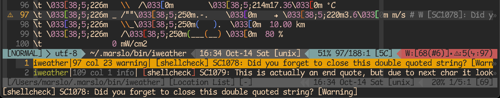
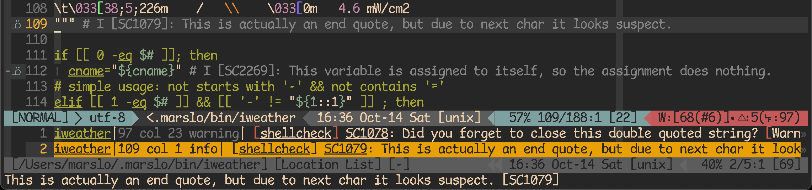

<!-- START doctoc generated TOC please keep comment here to allow auto update -->
<!-- DON'T EDIT THIS SECTION, INSTEAD RE-RUN doctoc TO UPDATE -->

- [usage](#usage)
  - [`Tabularize`](#tabularize)
    - [align with the N pattern](#align-with-the-n-pattern)
    - [align on specific symbol](#align-on-specific-symbol)
- [useful commands](#useful-commands)
- [highly recommended](#highly-recommended)
  - [LunarWatcher/auto-pairs](#lunarwatcherauto-pairs)
  - [junegunn/fzf.vim](#junegunnfzfvim)
  - [luochen1990/rainbow](#luochen1990rainbow)
  - [Yggdroot/indentLine](#yggdrootindentline)
  - [airblade/vim-gitgutter](#airbladevim-gitgutter)
  - [vim-airline/vim-airline](#vim-airlinevim-airline)
  - [dense-analysis/ale](#dense-analysisale)
- [programming](#programming)
  - [vim-syntastic/syntastic](#vim-syntasticsyntastic)
  - [tpope/vim-commentary](#tpopevim-commentary)
  - [ycm-core/YouCompleteMe](#ycm-coreyoucompleteme)
    - [install](#install)
    - [tips](#tips)
    - [extra](#extra)
  - [ycm-core/lsp-examples](#ycm-corelsp-examples)
    - [GroovyLanguageServer/groovy-language-server](#groovylanguageservergroovy-language-server)
  - [others](#others)
- [utils](#utils)
  - [vim-scripts/AuthorInfoDetect](#vim-scriptsauthorinfodetect)
  - [sjl/gundo.vim](#sjlgundovim)
  - [yegappan/mru](#yegappanmru)
- [markdown](#markdown)
  - [preservim/vim-markdown](#preservimvim-markdown)
  - [dhruvasagar/vim-table-mode](#dhruvasagarvim-table-mode)
  - [godlygeek/tabular](#godlygeektabular)
- [git](#git)
  - [tpope/vim-fugitive](#tpopevim-fugitive)
  - [APZelos/blamer.nvim](#apzelosblamernvim)
  - [zivyangll/git-blame.vim](#zivyangllgit-blamevim)
- [color and theme](#color-and-theme)
- [others](#others-1)
  - [deprecated](#deprecated)
  - [not been using](#not-been-using)
- [troubleshooting](#troubleshooting)
  - [ycmd](#ycmd)
    - [ycm download failed](#ycm-download-failed)
  - [tabnine](#tabnine)
  - [airline](#airline)

<!-- END doctoc generated TOC please keep comment here to allow auto update -->


> references:
> - [* vimcolorschemes](https://vimcolorschemes.com/)
> - [Spelling And Grammar With Vim](https://www.vimfromscratch.com/articles/spell-and-grammar-vim)
> - [* amix/vimrc](https://github.com/amix/vimrc)



# usage
## [`Tabularize`](https://github.com/godlygeek/tabular)

> [!TIP]
> - [Tabular cheatsheet](https://devhints.io/tabular)
> - [align with first space](https://stackoverflow.com/a/15915827/2940319) : `/^\s*\S\+\zs/l0c1l0`
> - [align the second `=` to left](https://stackoverflow.com/a/5424784/2940319) : `/^\(.\{-}\zs=\)\{2}/l1l0`
>   

| specifier | comments                             |
|:---------:|--------------------------------------|
|   `l<N>`  | left-align (with N spaces padding)   |
|   `r<N>`  | right-align (with N spaces padding)  |
|   `c<N>`  | center-align (with N spaces padding) |


`:Tabularize /,/r1c1l0` means:
* splitting fields on commas (`:`)
* print everything before the first comma right aligned, then 1 space
* then the comma center aligned, then 1 space,
* then everything after the comma left aligned.


- including the `<sep>`
  - align to left
    ```vim
    :Tabularize /<sep>
    ```
    - or
      ```vim
      :Tabularize /<sep>/l1
      ```

  - align to center
    ```vim
    :Tabularize /<sep>/r1c1l0
    ```

  

- align without `<sep>`

  > [!NOTE]
  > [`help /zs`](https://vimhelp.org/pattern.txt.html#%2F%5Czs)

  ```vim
  :Tabularize /<sep>\zs/<specifier>
  ```

### align with the N pattern
> i.e.: the second match (`=`)
> - refer to [matches the N pattern](tricky.html#matches-the-n-pattern)

- [align on first matche](https://stackoverflow.com/a/11497961/2940319)
  - align the first `:`
    ```vim
    :Tabularize /^[^:]*\zs:
    ```
    [or](https://stackoverflow.com/a/23840400/2940319)
    ```vim
    :Tabularize /:.*
    ```

  

  - [via vim cmd](https://stackoverflow.com/questions/20435920/dynamic-vim-tabular-patterns)

    > [!NOTE]
    > only for default left-alignemnt. Not support customized right/middle alignment.
    > i.e.: `/r1c1l0`

    ```vim
    command! -nargs=1 -range First exec <line1> . ',' . <line2> . 'Tabularize /^[^' . escape(<q-args>, '\^$.[?*~') . ']*\zs' . escape(<q-args>, '\^$.[?*~')
    ```

- align with 2nd matches
  ```vim
  :Tabularize /^\(.\{-}\zs=\)\{N}/
               |
              `^` means start of the line
  ```

  


  - or with `\v` (very magic)
    > reference:
    > - [`:help \v`](https://vimhelp.org/pattern.txt.html#%2F%5Cv)
    > - [vim pattern: overview of ordinary atoms](tricky.html#overview-of-ordinary-atoms)

    ```vim
    :Tabularize /\v^(.{-}\zs\=){N}/<specifier>
    ```

- for every N matches
  ```vim
  : Tabularize /\(.\{-}\zs=\)\{N}/<specifier>
               |
               no `^` means every `{N}` matches
  ```
  - or
    ```vim
    :Tabularize /\v(.{-}\zs\=){N}/<specifier>
    ```

### [align on specific symbol](https://vi.stackexchange.com/a/12652/7389)

> [!NOTE|label:pre condition:]
> - align the first `:` and last matches `,` as below:
> ```groovy
> [
>   isRunning : proc.getOrDefault( 'run' , false ) ,
>   name : proc.getOrDefault( 'name' , '') ,
>   runningStage : proc.getOrDefault( 'stage' , ['all'] ) ,
>   type : proc.type.split('^.*\\u00BB\\s*').last() ,
> ]
> ```

- first `:`
  > reference: via
  > - `/^[^;]*\zs:`
  > - `/^[^;]*\zs:/r1c1l0`
  > - `/^[^;]*/r1c1l0`

  - `/^[^:]*\zs:`
    ```groovy
    isRunning    : proc.getOrDefault( 'run' , false ) ,
    name         : proc.getOrDefault( 'name' , '') ,
    runningStage : proc.getOrDefault( 'stage' , ['all'] ) ,
    type         : proc.type.split('^.*\\u00BB\\s*').last() ,
    ```
    
    

  - `/^[^:]*\zs/r1c1l0`
    ```groovy
       isRunning  : proc.getOrDefault( 'run' , false ) ,
            name  : proc.getOrDefault( 'name' , '') ,
    runningStage  : proc.getOrDefault( 'stage' , ['all'] ) ,
            type  : proc.type.split('^.*\\u00BB\\s*').last() ,
    ```

  - `/^[^:]*\zs:/r1c1l0`
    ```groovy
       isRunning : proc.getOrDefault( 'run' , false ) ,
            name : proc.getOrDefault( 'name' , '') ,
    runningStage : proc.getOrDefault( 'stage' , ['all'] ) ,
            type : proc.type.split('^.*\\u00BB\\s*').last() ,
    ```
    

  - `/^[^:]*/r1c1l0`
    ```groovy
      isRunning   : proc.getOrDefault( 'run' , false ) ,
        name      : proc.getOrDefault( 'name' , '') ,
    runningStage  : proc.getOrDefault( 'stage' , ['all'] ) ,
        type      : proc.type.split('^.*\\u00BB\\s*').last() ,
    ```

  - `/^[^:]*:/r1c1l0`:
    ```groovy
      isRunning :  proc.getOrDefault( 'run' , false ) ,
        name :     proc.getOrDefault( 'name' , '') ,
    runningStage : proc.getOrDefault( 'stage' , ['all'] ) ,
        type :     proc.type.split('^.*\\u00BB\\s*').last() ,
    ```

- last `,`
  > tips:
  > - actually the pattern not matches with the final `,`, but matches with `)<.*> ,`
  >
  > **sample code**:
  > ```groovy
  >    isRunning : proc.getOrDefault( 'run' , false ) ,
  >         name : proc.getOrDefault( 'name' , '') ,
  > runningStage : proc.getOrDefault( 'stage' , ['all'] ) ,
  >         type : proc.type.split('^.*\\u00BB\\s*').last() ,
  > ```

  - `/)[^,]*\zs,`
    ```groovy
       isRunning : proc.getOrDefault( 'run' , false )       ,
            name : proc.getOrDefault( 'name' , '')          ,
    runningStage : proc.getOrDefault( 'stage' , ['all'] )   ,
            type : proc.type.split('^.*\\u00BB\\s*').last() ,
    ```

    - or even better align

      - `:1,3Tabularize /,` or `:'<,'>Tabularize /,`
        ```groovy
           isRunning : proc.getOrDefault( 'run'   , false )   ,
                name : proc.getOrDefault( 'name'  , '')       ,
        runningStage : proc.getOrDefault( 'stage' , ['all'] ) ,
                type : proc.type.split('^.*\\u00BB\\s*').last() ,
        ```
      - `:Tabularize /)[^,]*\zs,`
        ```groovy
           isRunning : proc.getOrDefault( 'run'   , false )     ,
                name : proc.getOrDefault( 'name'  , '')         ,
        runningStage : proc.getOrDefault( 'stage' , ['all'] )   ,
                type : proc.type.split('^.*\\u00BB\\s*').last() ,
        ```

    

# useful commands

```vim
command! -nargs=0 -bar -range=% Reverse
    \       let save_mark_t = getpos("'t")
    \<bar>      <line2>kt
    \<bar>      exe "<line1>,<line2>g/^/m't"
    \<bar>  call setpos("'t", save_mark_t)
nnoremap <Leader>r :Reverse <bar> nohlsearch<CR>
xnoremap <Leader>r :Reverse <bar> nohlsearch<CR>

command! -nargs=0 DocToc execute 'silent !/usr/local/bin/doctoc --notitle --update-only --github --maxlevel 3 %' | execute 'redraw!'
command! -nargs=0 FullPath execute 'echo expand("%:p")'
```

# highly recommended

> [!NOTE|label:references:]
> - [Vim Plugin Audit](https://tuckerchapman.com/2020/05/18/vim-plugin-audit/)

## [LunarWatcher/auto-pairs](https://github.com/LunarWatcher/auto-pairs/tree/master)

```vim
" LunarWatcher/auto-pairs
let g:AutoPairs                             = autopairs#AutoPairsDefine({ '<': '>' })
let g:AutoPairsMapBS                        = 1
let g:AutoPairsFlyMode                      = 0
let g:AutoPairsCompleteOnlyOnSpace          = 1
let g:AutoPairsNoJump                       = 0
let g:AutoPairsSpaceCompletionRegex         = '\w'
" to avoid impact with ctrl-p ( :Files )
let g:AutoPairsShortcutToggleMultilineClose = 0
let g:AutoPairsShortcutBackInsert           = '<M-b>'
let g:AutoPairsPrefix                       = '<M-j>'
let g:AutoPairsShortcutJump                 = '<M-n>'
let g:AutoPairsShortcutToggle               = '<M-j>'

augroup DevOps
  autocmd FileType markdown,html let g:AutoPairsCompleteOnlyOnSpace = 0
  autocmd FileType markdown,html let b:AutoPairs = autopairs#AutoPairsDefine({
        \ '<div>':'</div>', '<font>':'</font>', '<a>':'</a>', '<p>':'</p>',
        \ '<table>':'</table>', '<tbody>':'</tbody>',
        \ '<thread>':'</thread>', '<th>':'</th>', '<td>':'</td>'
        \ })
augroup END
```


## [junegunn/fzf.vim](https://github.com/junegunn/fzf.vim)
```vim
set runtimepath+=/usr/local/opt/fzf                                         " $ brew install fzf
Plug '/usr/local/opt/fzf'
Plug 'junegunn/fzf.vim'

" fzf.vim
nnoremap <C-p> :Files<CR>
nnoremap <C-g> :GFiles<CR>
nnoremap <C-s> :Ag<CR>
nnoremap <silent><leader>l  :Buffers<CR>
nnoremap <silent> <Leader>H :Helptags<CR>
nnoremap <silent> <Leader>g :Commits<CR>
let g:fzf_layout                  = { 'window': { 'width': 0.9, 'height': 0.6, 'relative': v:true } }
let g:fzf_history_dir             = '~/.vim/cache/fzf-history'
let g:fzf_vim                     = {}
let g:fzf_vim.preview_window      = [ 'right,50%', 'ctrl-\' ]
let g:fzf_vim.tags_command        = 'ctags -R'
let g:fzf_vim.commits_log_options = '--graph --color=always --format="%C(auto)%h%d %s %C(black)%C(bold)%cr"'
command! -bang -nargs=? -complete=dir Files
    \ call fzf#vim#files(<q-args>, {'options': ['--layout=reverse', '--info=inline', '--preview', 'bat --color=always {}']}, <bang>0)
command! -bang -complete=dir -nargs=? LS
    \ call fzf#run(fzf#wrap('ls', {'source': 'ls', 'dir': <q-args>}, <bang>0))
inoremap <expr> <c-x><c-l> fzf#vim#complete(fzf#wrap({
  \ 'prefix': '^.*$',
  \ 'source': 'rg -n ^ --color always',
  \ 'options': '--ansi --delimiter : --nth 3..',
  \ 'reducer': { lines -> join(split(lines[0], ':\zs')[2:], '') }}
  \ )
\ )
let g:fzf_action = {
  \ 'ctrl-t': 'tab split',
  \ 'ctrl-x': 'split',
  \ 'ctrl-v': 'vsplit'
\ }
let g:fzf_colors = {
  \ 'fg':         ['fg', 'Normal'],
  \ 'bg':         ['bg', 'Normal'],
  \ 'preview-bg': ['bg', 'NormalFloat'],
  \ 'hl':         ['fg', 'Comment'],
  \ 'fg+':        ['fg', 'CursorLine', 'CursorColumn', 'Normal'],
  \ 'bg+':        ['bg', 'CursorLine', 'CursorColumn'],
  \ 'hl+':        ['fg', 'Statement'],
  \ 'info':       ['fg', 'PreProc'],
  \ 'border':     ['fg', 'Ignore'],
  \ 'prompt':     ['fg', 'Conditional'],
  \ 'pointer':    ['fg', 'Exception'],
  \ 'marker':     ['fg', 'Keyword'],
  \ 'spinner':    ['fg', 'Label'],
  \ 'header':     ['fg', 'Comment']
\ }
```

## [luochen1990/rainbow](https://github.com/luochen1990/rainbow)
```vim
" install
Plug 'luochen1990/rainbow'

" luochen1990/rainbow
" for i in '75' '147' '108' '196' '208' '66' '106' '172' '115' '129'; do echo -e "\e[38;05;${i}m${i}"; done | column -c 250 -s ' '; echo -e "\e[m"
let g:rainbow_active    = 1
let g:rainbow_operators = 1
let g:rainbow_conf      = {
\   'guifgs' : [ '#6A5ACD', '#ff6347', '#b58900', '#9acd32', '#EEC900', '#9A32CD', '#EE7600', '#268bd2', '#183172' ],
\   'ctermfgs' : 'xterm-256color' == $TERM ? [ '75', '147', '108', '196', '208', '66', '106', '172', '115', '129' ] : [ 'lightblue', 'lightgreen', 'yellow', 'red', 'magenta' ],
\   'parentheses': [ ['(',')'], ['\[','\]'], ['{','}'] ],
\   'separately': {
\     '*': {},
\     'markdown': {
\       'parentheses_options': 'containedin=markdownCode contained',
\     },
\     'css': {
\       'parentheses': [ ['(',')'], ['\[','\]'] ],
\     },
\     'scss': {
\       'parentheses': [ ['(',')'], ['\[','\]'] ],
\     },
\     'html': {
\       'parentheses': [ ['(',')'], ['\[','\]'], ['{','}'] ],
\     },
\     'stylus': {
\       'parentheses': [ 'start=/{/ end=/}/ fold contains=@colorableGroup' ],
\     }
\   }
\}
```

## [Yggdroot/indentLine](https://github.com/Yggdroot/indentLine)
```vim
" install
Plug 'Yggdroot/indentLine'

" settings
nnoremap <leader>idl :IndentLineEnable<CR>

let g:indentLine_enabled              = 1
let g:indentLine_color_gui            = "#282828"
let g:indentLine_color_term           = 239
let g:indentLine_indentLevel          = 20
let g:indentLine_showFirstIndentLevel = 1
let g:indentLine_color_tty            = 0
let g:indentLine_faster               = 1
let g:indentLine_concealcursor        = 'inc'
let g:indentLine_conceallevel         = 2
if has( 'gui_running' ) || 'xterm-256color' == $TERM
  let g:indentLine_char               = '¦'
elseif has( 'win32' )
  let g:indentLine_color_term         = 8
  let g:indentLine_char               = '|'
else
  let g:indentLine_color_tty_dark     = 0
  let g:indentLine_char               = '¦'
endif
```

## [airblade/vim-gitgutter](https://github.com/airblade/vim-gitgutter)

> [!NOTE|label:references:]
> - [GitGutter Documentation](https://jisaacks.github.io/GitGutter/)
> - [Can't enable gitgutter with GitGutterEnable after disabling it on startup](https://github.com/airblade/vim-gitgutter/issues/409)
> - [How to display in real time](https://github.com/airblade/vim-gitgutter/issues/579)

```vim
Plug 'airblade/vim-gitgutter'

" airblade/vim-gitgutter
let g:gitgutter_git_executable = '/usr/local/bin/git'
let g:gitgutter_enabled        = 1
let g:gitgutter_realtime       = 0
let g:gitgutter_eager          = 0
set updatetime=250
set signcolumn=yes
highlight clear SignColumn
```

## [vim-airline/vim-airline](https://github.com/vim-airline/vim-airline)

> [!NOTE|label:references:]
> - [* iMarso : osx/apps/powerline](../osx/apps.html#powerline)
>   - [ryanoasis/powerline-extra-symbols](https://github.com/ryanoasis/powerline-extra-symbols)
>     
> - [* Getting started with vim-airline](https://tuckerchapman.com/2020/09/15/getting-started-vim-airline/)
> - [How do I fix the status bar symbols in the Airline plugin?](https://vi.stackexchange.com/a/16512/7389)
> - [Airline status line and tab line text changes colour when the vimrc is sourced.](https://www.reddit.com/r/vim/comments/q3ufc0/airline_status_line_and_tab_line_text_changes/)
> - [Vim Airline Setup](https://jnduli.co.ke/vim-airline-setup.html)
> - [autoload/airline/init.vim](https://github.com/vim-airline/vim-airline/blob/master/autoload/airline/init.vim)
> - [Getting started with vim-airline](https://tuckerchapman.com/posts/getting-started-vim-airline/)
> - section:
>   - [#787: How to modify contents of section Y?](https://github.com/vim-airline/vim-airline/issues/787#issue-84289641)
>   - [#1087: How to replace section_y with contents of section_x?](https://github.com/vim-airline/vim-airline/issues/1087)
>   - [#1845: how to disable additional section totally.](https://github.com/vim-airline/vim-airline/issues/1845#issuecomment-449700299)
> - tips:
>   - check loaded extensions : `:AirlineExtension`
>   - [#1373 How can I show system time in airline?](https://github.com/vim-airline/vim-airline/issues/1373#issuecomment-273040424)
>   - [* FAQ](https://github.com/vim-airline/vim-airline/wiki/FAQ)

```vim
Plug 'tpope/vim-fugitive'
Plug 'vim-airline/vim-airline'
Plug 'vim-airline/vim-airline-themes'

" vim-airline/vim-airline
let g:airline_powerline_fonts                      = 1
let g:airline_highlighting_cache                   = 1
let g:airline_detect_spelllang                     = 0              " disable spelling language
let g:airline_exclude_preview                      = 0              " disable in preview window
let g:airline_theme                                = 'base16_embers'" 'base16' 'apprentice', 'gruvbox', 'zenburn'
let g:Powerline_symbols                            = 'fancy'
let g:airline_section_y                            = ''             " fileencoding
let g:airline_section_x                            = ''
let g:airline_section_z                            = "%3p%% %l/%L:%c [%B]"
let g:airline_skip_empty_sections                  = 1
let g:airline_detect_modified                      = 1
let g:airline_detect_paste                         = 1
let g:airline#extensions#wordcount#enabled         = 0
let g:airline#extensions#quickfix#enabled          = 0
let g:airline#extensions#quickfix#quickfix_text    = 'Quickfix'
let g:airline#extensions#tabline#fnamemod          = ':t'
let g:airline_stl_path_style                       = 'short'
let g:airline#extensions#tabline#enabled           = 1              " ╮ enable airline tabline
let g:airline#extensions#tabline#show_close_button = 0              " │ remove 'X' at the end of the tabline
let g:airline#extensions#tabline#show_buffers      = 1              " │
let g:airline#extensions#tabline#show_splits       = 0              " │ disables the buffer name that displays on the right of the tabline
let g:airline#extensions#tabline#tab_min_count     = 2              " │ minimum of 2 tabs needed to display the tabline
let g:airline#extensions#tabline#show_tabs         = 1              " │
let g:airline#extensions#tabline#tab_nr_type       = 1              " ╯ tab number
let g:airline#extensions#branch#format             = 2
let g:airline#extensions#ale#enabled               = 1              " ╮
let airline#extensions#ale#error_symbol            = ' ᓆ :'         " │
let airline#extensions#ale#warning_symbol          = ' ᣍ :'         " ├ ale
let airline#extensions#ale#show_line_numbers       = 1              " │
let airline#extensions#ale#open_lnum_symbol        = '(␊:'          " │
let airline#extensions#ale#close_lnum_symbol       = ')'            " ╯
if !exists('g:airline_symbols') | let g:airline_symbols = {} | endif
let g:airline_symbols.dirty                        = ' ♪'
let g:airline_left_sep                             = ''
let g:airline_right_sep                            = ''
function! AirlineInit()
  let g:airline_section_a = airline#section#create([ '[', 'mode', ']', '  ', '%{&fenc}' ])
  let g:airline_section_y = airline#section#create([ '%{strftime("%H:%M %b-%d %a")} ', '['.&ff.']' ])
  let g:airline_section_c = '%<' . airline#section#create([ '%F' ]) " let g:airline_section_c = '%<' . '%{expand(%:p:~)}'
endfunction
autocmd User AirlineAfterInit call AirlineInit()
```


- tips
  - [remove section_<x>](https://stackoverflow.com/a/45150368/2940319)
    ```vim
    let g:airline_section_<x>         = ''                          " remove the filetype part
    let g:airline_skip_empty_sections = 1                           " remove separators for empty sections
    ```

  - setup short mode
    ```vim
    let g:airline_mode_map = { '__': '-', 'n' : 'N', 'i' : 'I', 'R' : 'R', 'c' : 'C', 'v' : 'V', 'V' : 'V', '': 'V', 's' : 'S', 'S' : 'S', '': 'S', }
    ```

  - unicode symbols

    > [!NOTE|label:symbols]
    > - [`:help airline`](https://github.com/vim-airline/vim-airline/blob/master/doc/airline.txt)
    >   ```vim
    >   " powerline symbols
    >   let g:airline_left_sep          = ''     " \ue0b0
    >   let g:airline_left_alt_sep      = ''     " \ue0b1
    >   let g:airline_right_sep         = ''     " \ue0b2
    >   let g:airline_right_alt_sep     = ''     " \ue0b3
    >   let g:airline_symbols.branch    = ''     " \ue0a0
    >   let g:airline_symbols.colnr     = ' ℅:'   " \u2105 \u3a
    >   let g:airline_symbols.readonly  = ''     " \ue0a2
    >   let g:airline_symbols.linenr    = ' :'   " \ue0a1
    >   let g:airline_symbols.maxlinenr = '☰ '    " \u2630
    >   let g:airline_symbols.dirty     = '⚡'    " \u26a1
    >
    >   " old vim-powerline symbols
    >   let g:airline_left_sep          = '⮀'     " \u2b80
    >   let g:airline_left_alt_sep      = '⮁'     " \u2b81
    >   let g:airline_right_sep         = '⮂'     " \u2b82
    >   let g:airline_right_alt_sep     = '⮃'     " \u2b83
    >   let g:airline_symbols.branch    = '⭠'     " \u2b60
    >   let g:airline_symbols.readonly  = '⭤'     " \u2b64
    >   let g:airline_symbols.linenr    = '⭡'     " \u2b61
    >
    >   " unicode symbols
    >   let g:airline_left_sep           = '»'    " \u00bb
    >   let g:airline_left_sep           = '▶'    " \u25b6
    >   let g:airline_right_sep          = '«'    " \u00ab
    >   let g:airline_right_sep          = '◀'    " \u25c0
    >   let g:airline_symbols.colnr      = ' ㏇:' " \u33C7
    >   let g:airline_symbols.colnr      = ' ℅:'  " \u2105
    >   let g:airline_symbols.crypt      = '🔒'   " \U0001f512
    >   let g:airline_symbols.linenr     = '☰'    " \u2630
    >   let g:airline_symbols.linenr     = ' ␊:'  " \u240a
    >   let g:airline_symbols.linenr     = ' ␤:'  " \u2424
    >   let g:airline_symbols.linenr     = '¶'    " \u00b6
    >   let g:airline_symbols.maxlinenr  = ''
    >   let g:airline_symbols.maxlinenr  = '㏑'   " \u33d1
    >   let g:airline_symbols.branch     = '⎇'    " \u2387
    >   let g:airline_symbols.paste      = 'ρ'    " \u03c1
    >   let g:airline_symbols.paste      = 'Þ'    " \u00de
    >   let g:airline_symbols.paste      = '∥'    " \u2225
    >   let g:airline_symbols.spell      = 'Ꞩ'    " \ua7a8
    >   let g:airline_symbols.notexists  = 'Ɇ'    " \u0246
    >   let g:airline_symbols.notexists  = '∄'    " \u2204
    >   let g:airline_symbols.whitespace = 'Ξ'    " \u039e
    >   ```
    >
    > - [`:help airline-customization`](https://vi.stackexchange.com/a/3363/7389)
    >   ```vim
    >   " unicode symbols
    >   let g:airline_left_sep           = '»'
    >   let g:airline_left_sep           = '▶'
    >   let g:airline_right_sep          = '«'
    >   let g:airline_right_sep          = '◀'
    >   let g:airline_symbols.linenr     = '␊'
    >   let g:airline_symbols.linenr     = '␤'
    >   let g:airline_symbols.linenr     = '¶'
    >   let g:airline_symbols.branch     = '⎇'
    >   let g:airline_symbols.paste      = 'ρ'
    >   let g:airline_symbols.paste      = 'Þ'
    >   let g:airline_symbols.paste      = '∥'
    >   let g:airline_symbols.whitespace = 'Ξ'
    >   ```

    ```vim
    let g:airline_symbols.branch         = '⎇'                    " ╮
    let g:airline_symbols.paste          = 'ρ'                    " ├ unicode symbols
    let g:airline_symbols.dirty          = ' ↯'                   " ╯
    ```

  - [get theme randomly](https://github.com/vim-airline/vim-airline-themes/issues/170#issuecomment-476524390)

    > [!NOTE]
    > - [#2145 : Align section C to the left when overflowed](https://github.com/vim-airline/vim-airline/issues/2145#issuecomment-673640814)

    ```vim
    let g:airline_theme                  = 'random'
    ```

#### sections

> [!NOTE|label:references:]
> - [#696 : Accents may cause status line exceed width](https://github.com/vim-airline/vim-airline/issues/696#issuecomment-75034875)

```vim
let g:airline_section_x                          = "%-{strftime(\"%H:%M\ %d/%m/%y\")} %1*--%n%%--%*"
let g:airline_section_y                          = "%{&fenc}%{&bomb ? '[bom]' : ''}%{strlen(&ff) > 0 ? '['.&ff.']' : ''}"
let g:airline#parts#ffenc#skip_expected_string   ='utf-8[unix]'
let g:airline_section_c_only_filename            = 0

function! AirlineInit()
  " NORMAL  docs/vim/
  let g:airline_section_a = airline#section#create([ 'mode', '  ', '%{join( split(getcwd(), "/")[-2:-1], "/" )}', '/' ])
  " NORMAL  docs/vim/plugins.md
  let g:airline_section_a = airline#section#create([ 'mode', '  ', '%{join( split(expand("%:p"), "/")[-3:-1], "/" )}' ])
  let g:airline_section_y = airline#section#create(['%{strftime("%H:%M %b-%d %a")} ', '['.&ff.']'])
  let g:airline_section_c = '%<' . airline#section#create(['%{expand("%:p:~")}'])
endfunction
autocmd User AirlineAfterInit call AirlineInit()
```

- section_a

  > [!NOTE|label:paths:]
  > - show relative path `%F` : `let g:airline_section_c = airline#section#create([ '%F' ])` -> `~/.vimrc`
  > - show filename only `%f` : `let g:airline_section_c = airline#section#create([ '%f' ])` -> `.vimrc`

  

  

  - via function
    ```vim
    function! ShortPath()
      let pathlist=split(expand("%:p:~"), "/")
      return len(pathlist) < 3 ? join( pathlist[-2:-1], "/" ) : join( pathlist[-3:-1], "/" )
    endfunction
    " or"
    function! ShortPath()
      let pathlist=split(expand("%:p:~"), "/")
      if len(pathlist) < 3 | let final_result=join( pathlist[-2:-1], "/" ) | else | let final_result=join( pathlist[-3:-1], "/" ) | endif
      return final_result
    endfunction

    let g:airline_section_a = airline#section#create([ 'mode', '  ', ShortPath() ])
    ```

    - i.e.:
      ```vim
      function! ShortPath()
        let pathlist=split(expand("%:p:~"), "/")
        return len(pathlist) < 3 ? join( pathlist[-2:-1], "/" ) : join( pathlist[-3:-1], "/" )
      endfunction
      function! AirlineInit()
        let g:airline_section_a = airline#section#create([ '[', 'mode', ']', '  ', '%{&fenc}', '  ', ShortPath() ])
        let g:airline_section_y = airline#section#create([ '%{strftime("%H:%M %b-%d %a")} ', '['.&ff.']' ])
        let g:airline_section_c = '%<' . airline#section#create([ '%F' ]) " let g:airline_section_c = '%<' . '%{expand(%:p:~)}'
      endfunction
      autocmd User AirlineAfterInit call AirlineInit()
      ```

      

  - via `%{}`
    ```vim
    function! AirlineInit()
      let pathlist=split( expand("%:p:~"), "/" )
      let g:airline_section_a = airline#section#create([ 'mode', '  ', '%{len(pathlist) < 3 ? join( pathlist[-2:-1], "/" ) : join( pathlist[-3:-1], "/" )}'])
    endfunction
    autocmd User AirlineAfterInit call AirlineInit()
    ```

    


- sections with length limitation
  - `%<'`: `let g:airline_section_c = '%<' . airline#section#create(['%{expand("%:p:~")}'])`
  - [`%-0.xx{}`](https://github.com/vim-airline/vim-airline/issues/1485#issuecomment-309734370) : `let g:airline_section_c = '%<' . '%-0.13{expand("%:p:~")}'`

  - i.e.:
    ```vim
    let g:airline_section_c = '%<' . '%-0.20{expand("%:p:~")}'
    " <docs/vim/plugins.md

    let g:airline_section_c = '%<' . '%{expand("%:p:~")}'
    " ~/path/to/ibook/docs/vim/plugins.md

    let g:airline_section_c = airline#section#create(['%F'])
    " ~/path/to/book/docs/vim/plugins.md
    ```

#### themes

> - [n-st/vim-airline-screenshots](https://github.com/n-st/vim-airline-screenshots)
> - [* Change the vim-airline theme](https://github.com/vim-airline/vim-airline/wiki/Screenshots)
>   - `:AirlineTheme random` : `let g:airline_theme='random'` : `:echo g:airline_theme`
>     
>   - [tomorrow](https://github.com/vim-airline/vim-airline/wiki/Screenshots#tomorrow-1)
>   - [distinguished](https://github.com/vim-airline/vim-airline/wiki/Screenshots#distinguished)
>   - [base16](https://github.com/vim-airline/vim-airline/wiki/Screenshots#base16)
>   - [angr](https://github.com/vim-airline/vim-airline/wiki/Screenshots#angr)
>   - [zenburn](https://github.com/vim-airline/vim-airline/wiki/Screenshots#zenburn)
>   - [zenburn](https://github.com/vim-airline/vim-airline/wiki/Screenshots#zenburn)
>   - [wombat](https://github.com/vim-airline/vim-airline/wiki/Screenshots#wombat)

- great themes
  - * base16_embers
    

  - * base16
    

  - * apprentice
    

  - * gruvbox
    

  - * zenburn
    

  - angr
  - selenized/selenized_bw
  - biogoo
  - base16_default
  - base16color
  - base16_chalk
  - base16_bright
  - biogoo ( dark background in insert mode )

- nice themes
  - owo
  - hybrid
  - bubblegum
  - supernova
  - alduin
  - base16_summerfruit
  - base16_atelierseaside
  - raven ( no background color )
  - peaksea ( no background color change )

## [dense-analysis/ale](https://github.com/dense-analysis/ale)

> [!NOTE|label:references:]
> - [How do I disable "annotations" generated by ALE in vim?](https://www.reddit.com/r/vim/comments/151tiqz/how_do_i_disable_annotations_generated_by_ale_in/)
> - [How do i get rid of Ale errors on the line i am editing?](https://www.reddit.com/r/vim/comments/b9amj9/how_do_i_get_rid_of_ale_errors_on_the_line_i_am/)

```vim
Plug 'stephpy/vim-yaml'
Plug 'pedrohdz/vim-yaml-folds'
Plug 'dense-analysis/ale'

" yamllint                                                          " brew install yamllint
" ale                                                               " :help g:ale_echo_msg_format
let g:ale_echo_msg_format                 = '[%linter%] %code%: %s [%severity%] '
let g:ale_virtualtext_prefix              = '%comment% %type% [%code%]: '
let g:ale_sign_error                      = '💢'                    " ✘ 👾 💣  🙅 🤦
let g:ale_sign_warning                    = 'ᑹᑹ'                    " ⚠ ⸮ ⸘ ☹
let g:ale_sign_info                       = 'ᓆ'                     " ⸚ ϔ 𐘿 𐰦
let g:ale_sign_style_error                = '⍥'                     " ᑹ
let g:ale_sign_style_warning              = 'ᓍ'                     " ᓏ
let g:ale_lint_on_text_changed            = 'never'
let g:ale_fix_on_save                     = 0
let g:ale_lint_on_save                    = 1
let g:ale_warn_about_trailing_blank_lines = 1
let g:ale_warn_about_trailing_whitespace  = 1
let g:ale_set_balloons                    = 1
let g:ale_hover_to_preview                = 1
let g:ale_floating_preview                = 1
let g:ale_close_preview_on_insert         = 1
```






# programming
## [vim-syntastic/syntastic](https://github.com/vim-syntastic/syntastic)

> [!NOTE|label:references:]
> - [#1577 : Unknown function: SyntasticStatuslineFlag](https://github.com/vim-syntastic/syntastic/issues/1577)
> - [In Editor Linting with Syntastic](https://medium.com/usevim/in-editor-linting-with-syntastic-6814122bdbec)
>   ```vim
>   :SyntasticInfo
>   ```

```vim
Plug 'vim-syntastic/syntastic'

" syntastic settings                                                " Plug 'vim-syntastic/syntastic'
set statusline+=%#warningmsg#
set statusline+=%{SyntasticStatuslineFlag()}
set statusline+=%*
let g:syntastic_always_populate_loc_list = 1
let g:syntastic_auto_loc_list            = 1
let g:syntastic_check_on_open            = 1
let g:syntastic_check_on_wq              = 0
let g:syntastic_loc_list_height          = 2
let g:syntastic_ignore_files             = ['\.py$']
let g:syntastic_html_tidy_ignore_errors  = [" proprietary attribute \"ng-"]
let g:syntastic_enable_signs             = 1
let g:syntastic_info_symbol              = 'ೲ'                      " ࠵ ϊ
let g:syntastic_error_symbol             = '✗'                      " ஓ ௐ ྾
let g:syntastic_warning_symbol           = '⍨'                      " ᓆ ᓍ
let g:syntastic_style_error_symbol       = '⍥'
let g:syntastic_style_warning_symbol     = 'ఠ'                      " ⍤ ൠ
highlight link SyntasticErrorSign        Error
highlight link SyntasticWarningSign      GruvboxYellow
highlight link SyntasticStyleErrorSign   GruvboxRedSign
highlight link SyntasticStyleWarningSign GruvboxPurpleSign
```


<!--sec data-title="former version" data-id="section0" data-show=true data-collapse=true ces-->
  ```vim
  Bundle 'vim-syntastic/syntastic'

  " configure syntastic syntax checking to check on open as well as save
  set statusline+=%#warningmsg#
  set statusline+=\ %{SyntasticStatuslineFlag()}                      " vim-syntastic/syntastic
  set statusline+=\ %* |
  let g:syntastic_always_populate_loc_list  = 1
  let g:syntastic_auto_loc_list             = 1
  let g:syntastic_check_on_open             = 1
  let g:syntastic_check_on_wq               = 0
  let g:syntastic_loc_list_height           = 2
  let g:syntastic_ignore_files              = ['\.py$']
  let g:syntastic_html_tidy_ignore_errors   = [" proprietary attribute \"ng-"]
  ```
<!--endsec-->


## [tpope/vim-commentary](https://github.com/tpope/vim-commentary)

```vim
" tpope/vim-commentary
map  <C-/>     gcc
map  <leader>x gcc
imap <C-/>     <Esc><Plug>CommentaryLineA
xmap <C-/>     <Plug>Commentary

augroup DevOps
  autocmd FileType ignore,gitconfig setlocal commentstring=#\ %s
augroup END
```

## [ycm-core/YouCompleteMe](https://github.com/ycm-core/YouCompleteMe)

> [!NOTE|label:references:]
> - [* iMarslo: build python from source](../programming/python/config.html#install-from-source-code)
> - [* iMarslo: build vim from source](../vim/install.html#install-python311-and-vim9)
> - [gitter room](https://app.gitter.im/#/room/#Valloric_YouCompleteMe:gitter.im)
> - [ycm-core/YouCompleteMe](https://github.com/ycm-core/YouCompleteMe)
> - [Eclipse Downloads](https://download.eclipse.org/jdtls/snapshots/)
>   - [jdt-language-server-1.19.0-202301090450.tar.gz)](https://www.eclipse.org/downloads/download.php?file=/jdtls/snapshots/jdt-language-server-1.19.0-202301090450.tar.gz)
> - [Vim/YouCompleteMe](https://wiki.archlinux.org/title/Vim/YouCompleteMe)
> - [在vim中配置最新YouCompleteMe代码自动补全插件](https://blog.csdn.net/qq_28584889/article/details/97131637)
> - [* How to Set Up Code-Completion for Vim in macOS](https://medium.com/@rohmanhakim/how-to-set-up-code-completion-for-vim-in-macos-9766dd459385)

### install

> [!TIP|label:references:]
> - [Building Vim from source](https://github.com/ycm-core/YouCompleteMe/wiki/Building-Vim-from-source)
> - [* Installation](https://github.com/ycm-core/YouCompleteMe?tab=readme-ov-file#installation)
>   - [* macOS](https://github.com/ycm-core/YouCompleteMe?tab=readme-ov-file#macos)
>   - [Linux 64-bit](https://github.com/ycm-core/YouCompleteMe/tree/master?tab=readme-ov-file#linux-64-bit)
>   - [Windows](https://github.com/ycm-core/YouCompleteMe?tab=readme-ov-file#windows)
> - [Full Installation Guide](https://github.com/ycm-core/YouCompleteMe/wiki/Full-Installation-Guide)
> - [Full installation on CentOS](https://github.com/ycm-core/YouCompleteMe/wiki/Full-installation-on-CentOS)
> - [Windows Installation Guide for Unix‐like Environments](https://github.com/ycm-core/YouCompleteMe/wiki/Windows-Installation-Guide-for-Unix%E2%80%90like-Environments)
> - [* Troubleshooting steps for ycmd server SHUT DOWN](https://github.com/ycm-core/YouCompleteMe/wiki/Troubleshooting-steps-for-ycmd-server-SHUT-DOWN)

| OPTION             | LANGUAGE               | TOOL                          | DEPENDENCIES      |
|--------------------|------------------------|-------------------------------|-------------------|
| --clang-completer  | C, C++, Objective-C    | Clang（libclang）             | Clang             |
| --clangd-completer | C, C++, Objective-C    | clang-tools-extra<br>(clangd) | clang-tools-extra |
| --cs-completer     | C#                     | Mono Runtime                  | Mono Runtime      |
| --rust-completer   | Rust                   | RustToolChains                | RustToolChains    |
| --go-completer     | golang                 | GoToolchain                   | GoToolchain       |
| --js-completer     | JavaScript             | Tern                          | node.js、npm      |
| --ts-completer     | JavaScript, TypeScript | tsserver                      | node.js、npm      |
| --java-completer   | Java                   | eclipse.jdt.ls                | JDK8              |
| --all              | all                    | -                             | -                 |


- environment setup

  - macOS

    > [!NOTE|label:references:]
    > - [#1925 How to build using -march=native?](https://github.com/ycm-core/YouCompleteMe/issues/1925#issuecomment-173184661)
    > - [vim ycm c++ 环境搭建](https://www.xjx100.cn/news/651145.html?action=onClick)
    > - [MAC安装YCM](https://www.xjx100.cn/news/651144.html?action=onClick)
    >   - C/C++/Objective-C/Objective-C++：`--clang-completer`
    >   - C#：`brew install Mono` first and enabled by `--cs-completer`
    >   - Go：`brew install go` and enabled by `--go-completer`
    >   - TypeScript：insall Node.js and npm，and enable typescript via `npm install -g typescript`
    >   - JavaScript: install Node.js and npm，and enabled via `--js-completer`
    >   - Rust: install Rust，`--rust-completer`
    >   - Java: `brew install java`，enabled via `--java-completer`
    >   - for all support : enabled via `--all`

    ```bash
    $ brew install cmake python go nodejs
    $ pip install urllib3
    $ pip install --user cmake
    $ sudo xcode-select -switch /Applications/Xcode.app
    $ brew install java
    $ sudo ln -sfn $(brew --prefix java)/libexec/openjdk.jdk /Library/Java/JavaVirtualMachines/openjdk.jdk

    # optioinal for C#
    $ brew install mono
    # optional
    $ brew install jdtls

    ## check
    # cmake
    $ ~/Library/Python/3.12/bin/cmake --version
    cmake version 3.28.1
    CMake suite maintained and supported by Kitware (kitware.com/cmake).
    $ /usr/local/bin/cmake --version
    cmake version 3.28.1
    CMake suite maintained and supported by Kitware (kitware.com/cmake).
    # java
    $ java -version
    openjdk version "20.0.1" 2023-04-18
    OpenJDK Runtime Environment Homebrew (build 20.0.1)
    OpenJDK 64-Bit Server VM Homebrew (build 20.0.1, mixed mode, sharing)

    # c/c++
    $ xbuild --version
    >>>> xbuild tool is deprecated and will be removed in future updates, use msbuild instead <<<<
    XBuild Engine Version 14.0
    Mono, Version 6.12.0.182
    Copyright (C) 2005-2013 Various Mono authors
    MSBUILD: error MSBUILD0000: Project file '--version' not found.

    $ msbuild --version
    Microsoft (R) Build Engine version 16.10.1 for Mono
    Copyright (C) Microsoft Corporation. All rights reserved.
    16.10.1.6601

    $ gcc --version
    Apple clang version 15.0.0 (clang-1500.1.0.2.5)
    Target: x86_64-apple-darwin23.2.0
    Thread model: posix
    InstalledDir: /Applications/Xcode.app/Contents/Developer/Toolchains/XcodeDefault.xctoolchain/usr/bin

    # node
    $ node --version
    v20.10.0
    ```

    - python

      > [!NOTE|label:install python from source]
      > - [iMarslo: build python from source](../programming/python/config.html#install-from-source-code)

      ```bash
      $ python --version
      Python 3.11.4
      $ pip --version
      pip 23.2.1 from /usr/local/lib/python3.11/site-packages/pip (python 3.11)
      ```


  - wsl/ubuntu install

    > [!NOTE|label:references:]
    > - [nodejs/snap](https://github.com/nodejs/snap)
    > - [How to install cmake 3.2 on Ubuntu](https://askubuntu.com/a/1254438/92979)
    > - tips
    >   - using snap instead of apt for nodejs due to
    >     ```bash
    >     $ sudo apt install nodejs
    >     $ node --version
    >     v12.22.9
    >     ```

    ```bash
    $ sudo mkdir -p /etc/apt/keyrings
    $ curl -fsSL https://deb.nodesource.com/gpgkey/nodesource-repo.gpg.key | sudo gpg --dearmor -o /etc/apt/keyrings/nodesource.gpg
    $ echo "deb [signed-by=/etc/apt/keyrings/nodesource.gpg] https://deb.nodesource.com/node_current.x nodistro main" | sudo tee /etc/apt/sources.list.d/nodesource.list

    $ sudo apt install build-essential cmake vim-nox python3-dev
    $ sudo apt install mono-complete golang openjdk-17-jdk openjdk-17-jre npm

    # nodejs/golang using snap instead of $ sudo apt isntall nodejs
    $ sudo snap install node --classic --channel=15
    # upgrade version to 20.x
    $ sudo snap refresh --channel=20 node
    node (20/stable) 20.8.0 from OpenJS Foundation (iojs✓) refreshed

    # check
    $ go version
    go version go1.18.1 linux/amd64
    $ node --version
    v20.10.0
    $ cmake --version
    cmake version 3.22.1
    CMake suite maintained and supported by Kitware (kitware.com/cmake).
    $ java --version
    openjdk 19.0.2 2023-01-17
    OpenJDK Runtime Environment (build 19.0.2+7-Ubuntu-0ubuntu322.04)
    OpenJDK 64-Bit Server VM (build 19.0.2+7-Ubuntu-0ubuntu322.04, mixed mode, sharing)
    ```

    - snap install for cmake and golang
      ```bash
      $ sudo snap install cmake --classic
      $ sudo snap install go --classic
      # or
      $ sudo apt install golang-go

      $ go version
      go version go1.21.5 linux/amd64
      ```

  - centos

    > [!NOTE]
    > - [#2756: CMake Error,no libclang found](https://github.com/ycm-core/YouCompleteMe/issues/2756)
    > - [Using LLVM 13.0.1 Toolset](https://access.redhat.com/documentation/en-us/red_hat_developer_tools/1/html/using_llvm_13.0.1_toolset/assembly_llvm#proc_installing-comp-toolset_assembly_llvm)
    > - [PDF: Red Hat Developer Tools 1: Using LLVM 13.0.1 Toolset](https://access.redhat.com/documentation/en-us/red_hat_developer_tools/1/pdf/using_llvm_13.0.1_toolset/red_hat_developer_tools-1-using_llvm_13.0.1_toolset-en-us.pdf)
    > - [Getting Started with the LLVM System](https://llvm.org/docs/GettingStarted.html)

    
    > - `dnf install gcc-c++`
    

    * dnf install
      ```bash
      $ sudo dnf install cmake make
      ```

    * [* iMarslo: build python from source](../programming/python/config.html#install-from-source-code)
      ```bash
      # or
      $ sudo dnf install python3-devel
      ```
    * [* iMarslo: build gcc from source](../linux/tools.html#gcc)
    * [* iMarslo: build ruby from source](../linux/tools.html#ruby)
    * [* iMarslo: build mono from source](../linux/tools.html#mono)

    - or
      ```bash
      $ sudo dnf install -y cmake \
                            clang clang-devel clang-libs clang-tools-extra \   # no libclang found
                            llvm llvm-libs \
                            go
      $ curl --proto '=https' --tlsv1.2 -sSf https://sh.rustup.rs | sh
      $ sudo dnf install java-17-openjdk-devel java-17-openjdk

      # upgrade nodejs
      $ node --version
      v12.22.5
      $ sudo npm i -g n
      $ sudo mkdir -p /usr/local/n && sudo chwon -R $(whoami) /usr/local/n
      $ sudo n latest
      $ which -a node
      /usr/local/bin/node
      /usr/bin/node
      $ node --version
      v20.8.1
      $ /usr/bin/node --version
      v12.22.5
      ```

- install with `install.py`
  ```bash
  # full install
  $ cd ~/.vim/bundle/YouCompleteMe
  $ python3 install.py --all --verbose
  ```

  - with `--system-libclang`
    ```bash
    $ brew install llvm
    $ cd ~/.vim/bundle/YouCompleteMe
    $ python3 install.py --system-libclang --all --verbose

    $ cat ~/.vimrc
    ...
    let g:ycm_clangd_binary_path = trim(system('brew --prefix llvm')).'/bin/clangd'
    ...
    ```

- install with `install.sh`
  ```bash
  $ cd ~/.vim/bundle/YouCompleteMe
  $ ./install.py --all --verbose

  # or
  $ ./install.py --clangd-completer --verbose

  # or
  ./install.py --verbose
  ```

### tips

- popup

  > [!NOTE|label:references]
  > - [YCM documentation hover - should we enable it by default](https://www.reddit.com/r/vim/comments/g9v832/ycm_documentation_hover_should_we_enable_it_by/)
  >   - `:help completeopt`
  >   - `:help previewpopup`
  >   - `:help completepopup`
  > - [The `g:ycm_add_preview_to_completeopt` option](https://github.com/ycm-core/YouCompleteMe?tab=readme-ov-file#the-gycm_add_preview_to_completeopt-option)

  ```vim
  let g:ycm_add_preview_to_completeopt                = 0
  let g:ycm_autoclose_preview_window_after_insertion  = 1
  let g:ycm_autoclose_preview_window_after_completion = 1
  set completeopt-=preview
  set completeopt+=popup
  ```

- hint
  ```vim
  # highlight
  highlight link YcmInlayHint Comment
  ```

### extra

- .ycm_extra_conf.py

  > [!NOTE|label:references]
  > - [* ycm-core/ycmd/.ycm_extra_conf.py](https://github.com/ycm-core/ycmd/blob/master/.ycm_extra_conf.py)
  > - [iogf's ycm_extra_conf](https://github.com/ycm-core/ycmd/issues/1329#issuecomment-535715712)
  > - [ycm_extra_conf/ycm_extra_conf.py](https://github.com/zxcyec/ycm_extra_conf/blob/master/ycm_extra_conf.py)
  > - [nemausus/dotfiles/ycm_extra_conf.py](https://github.com/nemausus/dotfiles/blob/master/ycm_extra_conf.py)
  > - [A better YouCompleteMe Config](https://jonasdevlieghere.com/post/a-better-youcompleteme-config/#ycm_extra_confpy)
  > - [CM代码补全插件找不到c++头文件](https://www.xjx100.cn/news/651148.html?action=onClick)
  > - to disable prompt message for extra config in vimrc
  >   ```
  >   let g:ycm_confirm_extra_conf = 0
  >   ```

  ```bash
  # create simple file for sample.cpp
  $ g++ -v test.cpp
  #include “…” search starts here:
  #include <…> search starts here:
  /usr/include/c++/11
  /usr/include/x86_64-linux-gnu/c++/11
  /usr/include/c++/11/backward
  /usr/lib/gcc/x86_64-linux-gnu/11/include
  /usr/local/include
  /usr/include/x86_64-linux-gnu
  /usr/include

  $ cat >> ~/.ycm_extra_conf.py << EOF
  flags = [
  '-Wall',
  '-Wextra',
  #'-Werror',
  #'-Wc++98-compat',
  '-Wno-long-long',
  '-Wno-variadic-macros',
  '-fexceptions',
  '-stdlib=libc++',
  # THIS IS IMPORTANT! Without a "-std=<something>" flag, clang won't know which
  # language to use when compiling headers. So it will guess. Badly. So C++
  # headers will be compiled as C headers. You don't want that so ALWAYS specify
  # a "-std=<something>".
  # For a C project, you would set this to something like 'c99' instead of
  # 'c++11'.
  '-std=c++11',
  # ...and the same thing goes for the magic -x option which specifies the
  # language that the files to be compiled are written in. This is mostly
  # relevant for c++ headers.
  # For a C project, you would set this to 'c' instead of 'c++'.
  '-x', 'c++',
  '-I', '.',
  '-isystem', '/usr/include/c++/11',
  '-isystem', '/usr/include/x86_64-linux-gnu/c++/11',
  '-isystem', '/usr/include/c++/11/backward',
  '-isystem', '/usr/lib/gcc/x86_64-linux-gnu/11/include',
  '-isystem', '/usr/local/include',
  '-isystem', '/usr/include/x86_64-linux-gnu',
  '-isystem', '/usr/include',
  ]
  EOF
  ```

- vimrc

  > [!NOTE|label:references:]
  > - [chxuan/vimplus/.vimrc](https://github.com/chxuan/vimplus/blob/master/.vimrc#L270)
  > - [A better YouCompleteMe Config](https://jonasdevlieghere.com/post/a-better-youcompleteme-config/)
  > - ycm
  >   - [vimrc_ycm_minimal](https://github.com/ycm-core/YouCompleteMe/blob/master/vimrc_ycm_minimal)
  >   - [test/vimrc](https://github.com/ycm-core/YouCompleteMe/blob/master/test/vimrc)
  >   - [#3906 completion popmenu close automatically After type `.`](https://github.com/ycm-core/YouCompleteMe/issues/3906)

  ```vim
  Plug 'ycm-core/YouCompleteMe', { 'do': 'python3 install.py --all' }
  Plug 'ycm-core/lsp-examples',  { 'do': 'python3 install.py --all' }

  " ycm-core/YouCompleteMe
  nnoremap <leader>gc :YcmCompleter GoToDeclaration<CR>
  nnoremap <leader>gf :YcmCompleter GoToDefinition<CR>
  nnoremap <leader>go :YcmCompleter GoToInclude<cr>
  nnoremap <leader>gg :YcmCompleter GoToDefinitionElseDeclaration<CR>
  nnoremap <leader>gd :YcmDiags<CR>
  let g:ycm_extra_conf_globlist                      = ['~/.marslo/ycm/*', '~/.vim/plugged/YouCompleteMe/*']
  let g:ycm_key_invoke_completion                    = '<C-\>'
  let g:ycm_echo_current_diagnostic                  = 'virtual-text'
  let g:ycm_error_symbol                             = '✗'
  let g:ycm_warning_symbol                           = '✹'
  let g:ycm_seed_identifiers_with_syntax             = 1
  let g:ycm_complete_in_comments                     = 1
  let g:ycm_complete_in_strings                      = 1
  let g:ycm_collect_identifiers_from_tags_files      = 1
  let g:ycm_keep_logfiles                            = 1
  let g:ycm_log_level                                = 'debug'
  let g:ycm_show_detailed_diag_in_popup              = 1
  let g:ycm_filepath_completion_use_working_dir      = 1
  let g:ycm_min_num_of_chars_for_completion          = 1
  let g:ycm_complete_in_comments                     = 1
  let g:ycm_autoclose_preview_window_after_insertion = 1
  let g:ycm_filetype_whitelist                       = { '*': 1, 'ycm_nofiletype': 1 }
  let g:ycm_filetype_specific_completion_to_disable  = { 'gitcommit': 1, 'vim': 1 }
  let g:ycm_filetype_blacklist                       = {
    \   'tagbar'  : 1,
    \   'notes'   : 1,
    \   'netrw'   : 1,
    \   'unite'   : 1,
    \   'vimwiki' : 1,
    \   'infolog' : 1,
    \   'leaderf' : 1,
    \   'mail'    : 1,
    \   'help'    : 1,
    \   'undo'    : 1
    \ }
  let g:ycm_semantic_triggers                        =  {
    \   'c'         : [ '->', '.'],
    \   'objc'      : [ '->', '.', 're!\[[_a-zA-Z]+\w*\s', 're!^\s*[^\W\d]\w*\s', 're!\[.*\]\s'],
    \   'ocaml'     : [ '.', '#'],
    \   'cpp,cuda,objcpp' : [ '->', '.', '::'],
    \   'perl'      : [ '->'],
    \   'php'       : [ '->', '::'],
    \   'cs,d,elixir,go,groovy,java,javascript,julia,perl6,python,scala,typescript,vb': ['.'],
    \   'ruby,rust' : [ '.', '::'],
    \   'lua'       : [ '.', ':'],
    \   'erlang'    : [ ':'],
    \ }

  " ycm-core/lsp-examples
  let g:ycm_lsp_dir = expand( pluginHome . 'lsp-examples' )
  let s:pip_os_dir  = 'bin'
  if has( 'win32' ) | let s:pip_os_dir = 'Scripts' | end
  source $HOME/.vim/plugged/lsp-examples/vimrc.generated

  augroup YCMCustomized
    autocmd!
    autocmd Filetype vim let g:ycm_complete_in_strings = 3
    autocmd FileType c,cpp,sh,python,groovy,Jenkinsfile let b:ycm_hover = {
      \ 'command': 'GetDoc',
      \ 'syntax': &filetype,
      \ 'popup_params': {
      \     'maxwidth': 80,
      \     'border': [],
      \     'borderchars': ['─', '│', '─', '│', '┌', '┐', '┘', '└'],
      \   },
      \ }
  augroup END
  ```

## [ycm-core/lsp-examples](https://github.com/ycm-core/lsp-examples)

> [!NOTE|label:references:]
> - [YouCompleteMe](http://blog.fpliu.com/it/software/vim/plugin/YouCompleteMe)
>   - [YouCompleteMe with JSON](http://blog.fpliu.com/it/software/vim/plugin/YouCompleteMe/config/JSON)
>   - [YouCompleteMe with YAML](http://blog.fpliu.com/it/software/vim/plugin/YouCompleteMe/config/YAML)
>   - [YouCompleteMe with VimL](http://blog.fpliu.com/it/software/vim/plugin/YouCompleteMe/config/VimL)
> - [My Julia setup for vim with YCM on Linux](https://discourse.julialang.org/t/my-julia-setup-for-vim-with-ycm-on-linux/45485)
> - [Language Server Protocol Specification - 3.17](https://microsoft.github.io/language-server-protocol/specifications/lsp/3.17/specification/#textDocument_semanticTokens)

- vimrc
  ```bash
  $ cat ~/.vimrc
  Plug 'ycm-core/lsp-examples'

  vim +BundleInstall +qa
  ```

- install
  ```bash
  $ cd ~/.vim/plugged/lsp-examples
  $ python install.py --all

  ## add into .vimrc
  source $HOME/.vim/plugged/lsp-examples/vimrc.generated
  ```

  <!--sec data-title="deprecated" data-id="section1" data-show=true data-collapse=true ces-->
  ```bash
  $ cd ~/.vim/bundle/lsp-examples
  $ python install.py --enable-cmake \
                      --enable-python \
                      --enable-viml \
                      --enable-bash \
                      --enable-json \
                      --enable-yaml \
                      --enable-groovy \
                      --enable-docker
  $ cat /Users/marslo/.vim/bundle/lsp-examples/vimrc.generated | pbcopy
  # paste into .vimrc
  ```

  - sample vimrc
    ```bash
    """ ycm lsp
    let g:ycm_lsp_dir = '~/.vim/bundle/lsp-examples'
    let s:pip_os_dir  = 'bin'
    let g:ycm_language_server = [
      \   { 'name': 'docker',
      \     'filetypes': [ 'dockerfile' ],
      \     'cmdline': [ expand( g:ycm_lsp_dir . '/docker/node_modules/.bin/docker-langserver' ), '--stdio' ]
      \   },
      \   {
      \     'name': 'cmake',
      \     'cmdline': [ expand( g:ycm_lsp_dir . '/cmake/venv/' . s:pip_os_dir . '/cmake-language-server' )],
      \     'filetypes': [ 'cmake' ],
      \    },
      \   {
      \     'name': 'python',
      \     'cmdline': [ 'node', expand( g:ycm_lsp_dir . '/python/node_modules/.bin/pyright-langserver' ), '--stdio' ],
      \     'filetypes': [ 'python' ],
      \   },
      \   { 'name': 'vim',
      \     'filetypes': [ 'vim' ],
      \     'cmdline': [ expand( g:ycm_lsp_dir . '/viml/node_modules/.bin/vim-language-server' ), '--stdio' ]
      \   },
      \   {
      \     'name': 'bash',
      \     'cmdline': [ 'node', expand( g:ycm_lsp_dir . '/bash/node_modules/.bin/bash-language-server' ), 'start' ],
      \     'filetypes': [ 'sh', 'bash' ],
      \   },
      \   {
      \     'name': 'json',
      \     'cmdline': [ 'node', expand( g:ycm_lsp_dir . '/json/node_modules/.bin/vscode-json-languageserver' ), '--stdio' ],
      \     'filetypes': [ 'json' ],
      \     'capabilities': { 'textDocument': { 'completion': { 'completionItem': { 'snippetSupport': v:true } } } },
      \   },
      \   {
      \     'name': 'yaml',
      \     'cmdline': [ 'node', expand( g:ycm_lsp_dir . '/yaml/node_modules/.bin/yaml-language-server' ), '--stdio' ],
      \     'filetypes': [ 'yaml' ],
      \     'capabilities': {
      \       'workspace': { 'configuration': v:true },
      \       'textDocument': {
      \         'completion': {
      \           'completionItem': { 'snippetSupport': v:true },
      \         }
      \       }
      \     },
      \   },
      \   {
      \     'name': 'groovy',
      \     'cmdline': [ 'java', '-jar', expand( g:ycm_lsp_dir . '/groovy/groovy-language-server/build/libs/groovy-language-server-all.jar' ) ],
      \     'filetypes': [ 'groovy' ]
      \   }
      \ ]
    ```
  <!--endsec-->

### [GroovyLanguageServer/groovy-language-server](https://github.com/GroovyLanguageServer/groovy-language-server)
```bash
# java has to be less than jdk 19
$ brew install openjdk@17
$ export JAVA_HOME='/usr/local/opt/openjdk@17'
$ export PATH=${JAVA_HOME}/bin:${PATH}
$ export CPPFLAGS="-I${JAVA_HOME}/include ${CPPFLAGS}"

$ git clone git@github.com:GroovyLanguageServer/groovy-language-server.git
$ ./gradew build

# run
$ git@github.com:GroovyLanguageServer/groovy-language-server.git
```

## others

#### [vim-easycomplete](https://github.com/jayli/vim-easycomplete)

> [!NOTE|label:references:]
> - [How to improve your vim/nvim coding experience with vim-easycomplete?](https://dev.to/jayli/how-to-improve-your-vimnvim-coding-experience-with-vim-easycomplete-29o0)
> - [Vim-EasyComplete 体验优化踩坑记录](https://zhuanlan.zhihu.com/p/425555993)
> - [vim-easycomplete VS vim-lsp](https://www.libhunt.com/compare-vim-easycomplete-vs-vim-lsp?ref=compare)
> - [Which lsp plugin should I use?](https://www.reddit.com/r/vim/comments/7lnhrt/which_lsp_plugin_should_i_use/)

# utils
## [vim-scripts/AuthorInfoDetect](https://github.com/vim-scripts/AuthorInfo)
```vim
Plug 'marslo/authorinfo'

noremap <leader>aid :AuthorInfoDetect<CR>
let g:vimrc_author = 'marslo'
let g:vimrc_email  = 'marslo.jiao@gmail.com'
autocmd BufWritePre, FileWritePre * :AuthorInfoDetect<CR>
autocmd BufWritePre               * :AuthorInfoDetect<CR>
```

## [sjl/gundo.vim](https://docs.stevelosh.com/gundo.vim/)

> [!TIP]
> - [delete undo file for 3 days ago](https://www.reddit.com/r/vim/comments/13s4e6l/remove_older_than_x_days_undo_files/)
>   ```bash
>   $ find ~/.vim/undo -mtime +3
>   # or
>   $ fd --type=file \
>        --change-older-than=30days \
>        . \
>        ~/.cache/vim/{backup,swap,undo}/ \
>        -x rm -v
>   ```

```vim
Plug 'sjl/gundo.vim'

noremap <Leader>u :GundoToggle<CR>
set undodir=~/.vim/undo/
set undofile
```

## [yegappan/mru](https://github.com/yegappan/mru)
```vim
noremap <leader>re :MRU<CR>
let MRU_Auto_Close    = 1                                           " most recently used(mru)
let MRU_Max_Entries   = 10
let MRU_Exclude_Files = '^/tmp/.*\|^/temp/.*\|^/media/.*\|^/mnt/.*'
```

# markdown
## [preservim/vim-markdown](https://github.com/preservim/vim-markdown)
```vim
Plug 'preservim/vim-markdown'

" preservim/vim-markdown
let g:vim_markdown_toc_autofit         = 1
let g:vim_markdown_conceal             = 0
let g:vim_markdown_conceal_code_blocks = 0
let g:vim_markdown_strikethrough       = 1
let g:vim_markdown_folding_disabled    = 1
" let g:vim_markdown_frontmatter         = 1
" let g:vim_markdown_json_frontmatter    = 1
" let g:vim_markdown_autowrite           = 1
" let g:vim_markdown_follow_anchor       = 1
" let g:vim_markdown_anchorexpr          = "'<<'.v:anchor.'>>'"
```

## [dhruvasagar/vim-table-mode](https://github.com/dhruvasagar/vim-table-mode)
```vim
Plug 'dhruvasagar/vim-table-mode'

noremap <Leader>tm :TableModeToggle<CR>
let g:table_mode_corner          = '|'
let g:table_mode_header_fillchar = '-'
let g:table_mode_align_char      = ":"
let g:table_mode_corner          = "|"
let g:table_mode_align_char      = ":"
" let g:table_mode_corner_corner = '+'
function! s:isAtStartOfLine(mapping)
  let text_before_cursor = getline('.')[0 : col('.')-1]
  let mapping_pattern = '\V' . escape(a:mapping, '\')
  let comment_pattern = '\V' . escape(substitute(&l:commentstring, '%s.*$', '', ''), '\')
  return (text_before_cursor =~? '^' . ('\v(' . comment_pattern . '\v)?') . '\s*\v' . mapping_pattern . '\v$')
endfunction
inoreabbrev <expr> <bar><bar>
          \ <SID>isAtStartOfLine('\|\|') ?
          \ '<c-o>:TableModeEnable<cr><bar><space><bar><left><left>' : '<bar><bar>'
inoreabbrev <expr> __
          \ <SID>isAtStartOfLine('__') ?
          \ '<c-o>:silent! TableModeDisable<cr>' : '__'
let g:tabular_loaded             = 1
```

## [godlygeek/tabular](https://github.com/godlygeek/tabular)
```vim
" install
Plug 'godlygeek/tabular'

" settings
noremap <Leader>tb :TableModeToggle<CR>
let g:table_mode_corner='|'
let g:table_mode_header_fillchar='-'
let g:table_mode_corner_corner='|'
function! s:isAtStartOfLine(mapping)
  let text_before_cursor = getline('.')[0 : col('.')-1]
  let mapping_pattern = '\V' . escape(a:mapping, '\')
  let comment_pattern = '\V' . escape(substitute(&l:commentstring, '%s.*$', '', ''), '\')
  return (text_before_cursor =~? '^' . ('\v(' . comment_pattern . '\v)?') . '\s*\v' . mapping_pattern . '\v$')
endfunction

inoreabbrev <expr> <bar><bar>
          \ <SID>isAtStartOfLine('\|\|') ?
          \ '<c-o>:TableModeEnable<cr><bar><space><bar><left><left>' : '<bar><bar>'
inoreabbrev <expr> __
          \ <SID>isAtStartOfLine('__') ?
          \ '<c-o>:silent! TableModeDisable<cr>' : '__'

let g:tabular_loaded = 1
if exists(":Tabularize")
  nmap <Leader>a= :Tabularize /=<CR>
  vmap <Leader>a= :Tabularize /=<CR>
  nmap <leader>a: :Tabularize /:\zs<CR>
  vmap <leader>a: :Tabularize /:\zs<CR>
  inoremap <silent> <Bar>   <Bar><Esc>:call <SID>table_auto_align()<CR>
  function! s:table_auto_align()
    let p = '^\s*|\s.*\s|\s*$'
    if exists(':Tabularize') && getline('.') =~# '^\s*|'
      \ && (getline(line('.')-1) =~# p || getline(line('.')+1) =~# p)
      let column = strlen(substitute(getline('.')[0:col('.')],'[^|]','','g'))
      let position = strlen(matchstr(getline('.')[0:col('.')],'.*|\s*\zs.*'))
      Tabularize/|/l1
      normal! 0
      call search(repeat('[^|]*|',column).'\s\{-\}'.repeat('.',position),'ce',line('.'))
    endif
  endfunction
endif
```

# git
- call bash cmd in silent mode
  ```bash
  nnoremap <leader>mp  :execute 'silent !git push --force' \| redraw!<CR>
  ```

## [tpope/vim-fugitive](https://github.com/tpope/vim-fugitive)
```vim
Plug 'tpope/vim-fugitive'

" fugitive
nnoremap <leader>mp :silent exec '! git mp'<CR>
nnoremap <Leader>ga :Git add %:p<CR><CR>
nnoremap <Leader>gs :Gstatus<CR>
nnoremap <leader>gl :silent! Glog<CR>:bot copen<CR>
nnoremap <leader>gp :Ggrep<Space>
nnoremap <leader>gb :Git branch<Space>
nnoremap <leader>go :Git checkout<Space>
nnoremap <leader>gc :Git commit -am ""<Left>
command! -bar -nargs=* Gpull execute 'Git pull'
command! -bar -nargs=* Gpush execute 'Git push'
```

## [APZelos/blamer.nvim](https://github.com/APZelos/blamer.nvim)

```vim
Plug 'APZelos/blamer.nvim'

" APZelos/blamer.nvim
nnoremap <Leader>bb  :BlamerToggle<CR>
let g:blamer_enabled              = 0
let g:blamer_delay                = 100
let g:blamer_show_in_visual_modes = 0
let g:blamer_show_in_insert_modes = 0
let g:blamer_relative_time        = 1
" let g:blamer_prefix             = ' » '
```

## [zivyangll/git-blame.vim](https://github.com/zivyangll/git-blame.vim)

```vim
" zivyangll/git-blame.vim
nnoremap <Leader>ebb :<C-u>call gitblame#echo()<CR>
```

# color and theme
> [!NOTE|label:references:]
> - [Highlighting color strings with correspondent color](https://vi.stackexchange.com/a/26891/7389)
> - plugins:
>   - [chrisbra/Colorizer](https://github.com/chrisbra/Colorizer)
>   - [gko/vim-coloresque](https://github.com/gko/vim-coloresque)
>   - [ap/vim-css-color](https://github.com/ap/vim-css-color)
>   - [skammer/vim-css-color](https://github.com/skammer/vim-css-color)

# others
## deprecated

<!--sec data-title="using fzf.vim instead of ctrlp" data-id="section4" data-show=true data-collapse=true ces-->
- [kien/ctrlp.vim](https://github.com/kien/ctrlp.vim)
  ```vim
  Plug 'kien/ctrlp.vim'

  let g:ctrlp_map                 = '<c-p>'                           " CtrlP
  let g:ctrlp_working_path_mode   = 'ra'                              " search parents as well (stop searching safety)
  let g:ctrlp_max_height          = 8
  let g:ctrlp_max_depth           = 100
  let g:ctrl_root_makers          = ['.ctrlp']                        " stop search if these files present
  let g:ctrlp_use_caching         = 1
  let g:ctrlp_clear_cache_on_exit = 0                                 " cross session caching
  if has('win32') || has('win95') || has('win64')
    let g:ctrlp_cache_dir = $VIM . '/cache/ctrlp'
  else
    let g:ctrlp_cache_dir = '$HOME/.vim/cache/ctrlp'
  endif
  let g:ctrlp_custom_ignore = {
      \ 'dir':  '\v[\/]\.(git|hg|svn)$',
      \ 'file': '\v\.(exe|so|dll|rpm|tar|gz|bz2|zip|ctags|tags)|tags|ctags$',
      \ 'link': 'some_bad_symbolic_links',
      \ }
  ```
<!--endsec-->

<!--sec data-title="codota/tabnine-nvim instead of tabnine-vim" data-id="section5" data-show=true data-collapse=true ces-->
- [tabnine-vim](https://github.com/tabnine/YouCompleteMe)

  > [!DANGER|label:ERROR]
  > not working for python3.9+, using [codota/tabnine-nvim](https://github.com/codota/tabnine-nvim)

  
  > - [tabnine/YouCompleteMe](https://github.com/tabnine/YouCompleteMe)
  

  ```vim
  " tabnine-vim
  if index(['vim'], &filetype) == -1 | let g:loaded_youcompleteme = 1 | endif
  if !(&filetype == 'vim')           | let g:loaded_youcompleteme = 1 | endif
  if &filetype ==# 'vim'             | let g:loaded_youcompleteme = 0 | endif

  let g:ycm_filetype_blacklist                      = { 'vim':0  }
  let b:ycm_largefile                               = 1
  let g:ycm_disable_for_files_larger_than_kb        = 1000
  let g:ycm_python_binary_path                      = '/usr/local/opt/python/libexec/bin/python'
  let g:ycm_min_num_of_chars_for_completion         = 2
  let g:ycm_python_binary_path                      = '/usr/local/opt/python@3.9/libexec/bin/python'
  let g:ycm_filetype_specific_completion_to_disable = { 'gitcommit': 1 }
  let g:ycm_semantic_triggers                       = {
    \   'c': ['->', '.'],
    \   'objc': ['->', '.', 're!\[[_a-zA-Z]+\w*\s', 're!^\s*[^\W\d]\w*\s',
    \            're!\[.*\]\s'],
    \   'ocaml': ['.', '#'],
    \   'cpp,cuda,objcpp': ['->', '.', '::'],
    \   'perl': ['->'],
    \   'php': ['->', '::'],
    \   'cs,d,elixir,go,groovy,java,javascript,julia,perl6,python,scala,typescript,vb': ['.'],
    \   'ruby,rust': ['.', '::'],
    \   'lua': ['.', ':'],
    \   'erlang': [':'],
    \ }

  function! TriggerYCM()
    if g:loaded_youcompleteme == 1
      let g:loaded_youcompleteme = 0
    else
      let g:loaded_youcompleteme = 1
    endif
  endfunction
  nmap <C-y> :call TriggerYCM()<CR>
  ```

  - disable tabnine for vim
    ```vim
    " tabnine-vim                                                        " Plug 'codota/tabnine-vim'
    if index(['vim'], &filetype) == -1 | let g:loaded_youcompleteme = 1 | endif
    if !( &filetype == 'vim' )         | let g:loaded_youcompleteme = 1 | endif
    ```
<!--endsec-->

<!--sec data-title="tpope/vim-commentary instead of EnhCommentify" data-id="section6" data-show=true data-collapse=true ces-->
- [vim-scripts/EnhCommentify.vim](https://github.com/vim-scripts/EnhCommentify.vim)
  ```vim
  " EnhCommentify
  let g:EnhCommentifyAlignRight      = 'Yes'
  let g:EnhCommentifyRespectIndent   = 'yes'
  let g:EnhCommentifyPretty          = 'Yes'
  let g:EnhCommentifyMultiPartBlocks = 'Yes'
  let g:EnhCommentifyUseSyntax       = 'Yes'
  ```
<!--endsec-->

<!--sec data-title="codota/tabnine-nvim instead of tabnine-vim" data-id="section7" data-show=true data-collapse=true ces-->
- [honza/vim-snippets](https://github.com/honza/vim-snippets)
  ```vim
  Plug 'honza/vim-snippets'
  ```
<!--endsec-->

## not been using

<!--sec data-title="not been using" data-id="section8" data-show=true data-collapse=true ces-->
- [msanders/snipmate.vim](https://github.com/msanders/snipmate.vim)
  ```vim
  Plug 'msanders/snipmate.vim'

  " Snippet
  imap <S-C-J> <Plug>snipMateNextOrTrigger
  smap <S-C-J> <Plug>snipMateNextOrTrigger
  imap <Tab>   <Plug>snipMateNextOrTrigger
  ```

- [jiangmiao/auto-pairs](https://github.com/jiangmiao/auto-pairs)

  > [!NOTE|label:references:]
  > - [#128 : Disable autopairs for certain filetypes](https://github.com/jiangmiao/auto-pairs/issues/128#issuecomment-195461762)
  >   ```vim
  >   au Filetype markdown let b:AutoPairs={'(':')', '[':']', '{':'}','"':'"', '`':'`'}
  >   ```

  ```vim
  Plug 'jiangmiao/auto-pairs'
  " or
  Plug 'marslo/auto-pairs'

  " settings
  let g:AutoPairs = {'(':')', '[':']', '{':'}', '<':'>',"'":"'",'"':'"', '`':'`'}
  let g:AutoPairsParens = {'(':')', '[':']', '{':'}', '<':'>'}
  let g:AutoPairsFlyMode = 0
  let g:AutoPairsShortcutBackInsert = '<M-b>'
  ```

- [gabrielelana/vim-markdown](https://github.com/gabrielelana/vim-markdown)
  ```vim
  Plug 'gabrielelana/vim-markdown'

  nnoremap <Leader>cc :let &cole=(&cole == 2) ? 0 : 2 <bar> echo 'conceallevel ' . &cole <CR>
  let g:vim_markdown_folding_style_pythonic = 1
  let g:vim_markdown_override_foldtext      = 0
  let g:vim_markdown_autowrite              = 1
  let g:vim_markdown_new_list_item_indent   = 4
  let g:vim_markdown_toc_autofit            = 1
  let g:vim_markdown_conceal                = 0
  set conceallevel                          = 2
  let g:vim_markdown_frontmatter            = 1
  let g:vim_markdown_json_frontmatter       = 1
  let g:markdown_enable_spell_checking      = 0
  let g:markdown_enable_input_abbreviations = 0
  let g:markdown_enable_conceal             = 0
  hi markdownItalic           guifg=gray25    gui=underline
  hi MarkdownHeadingDelimiter gui=bold        guifg=gray25
  hi htmlSpecialChar          guifg=black
  hi markdownBold             gui=bold        guifg=gray25
  hi markdownUrl              guifg=#2fb3a6
  hi markdownAutomaticLink    guifg=#2fb3a6
  hi markdownLinkText         guifg=#317849
  hi markdownUrlTitle         guifg=#317849
  hi markdownBlockquote       guifg=#317849   gui=bold
  hi markdownId               guifg=#2fb3a6
  hi markdownIdDeclaration    guifg=#317849   gui=bold
  hi markdownListMarker       guifg=#317849
  ```

- [tpope/vim-markdown](https://github.com/tpope/vim-markdown)
  ```vim
  Plug 'tpope/vim-markdown'

  " for tpope vim-markdown
  let g:markdown_fenced_languages = ['html', 'python', 'bash=sh']
  let g:markdown_syntax_conceal = 0
  let g:markdown_minlines = 100
  ```
<!--endsec-->

# troubleshooting

> [!TIP|label:how to debug:]
> - `:message`
> - `:YcmDebugInfo`
> - `:YcmDiags`
> - `:YcmToggleLogs`
> - `:py3 import sys; print( sys.version)` : `3.12.1 (main, Dec  7 2023, 20:45:44) [Clang 15.0.0 (clang-1500.0.40.1)]`

## ycmd

#### `c++/libclang.dylib` cannot be found issue

> [!NOTE]
> - [libclang](https://github.com/ycm-core/YouCompleteMe?tab=readme-ov-file#c-family-semantic-completion)
> - [#1925 How to build using -march=native?](https://github.com/ycm-core/YouCompleteMe/issues/1925#issuecomment-173184661)
> - [#1141 Compilation errors with --system-libclang on macOS Mojave](https://github.com/ycm-core/ycmd/issues/1141#issuecomment-443677162)

```bash
$ ln -sf $(brew --prefix llvm)/lib/libclang.dylib $(brew --prefix llvm)/lib/c++/libclang.dylib

# or : https://github.com/ycm-core/YouCompleteMe/issues/1925#issuecomment-173184661
$ EXTRA_CMAKE_ARGS="-DCMAKE_CXX_FLAGS=-march=native" ./install.py --clang-completer --system-libclang

# for libclang
$ EXTRA_CMAKE_ARGS='-DPATH_TO_LLVM_ROOT=/path/to/your/llvm' ./install.py --clang-completer --system-libclang
```

#### Question can be turned off with options, see YCM docs
```bash
Found /path/to/.ycm_extra_conf.py. Load?
(Question can be turned off with options, see YCM docs)
```

- [solution](https://github.com/ycm-core/YouCompleteMe?tab=readme-ov-file#the-gycm_extra_conf_globlist-option)
  ```vim
  let g:ycm_extra_conf_globlist = ['~/path/to/ycm_extra_conf/*', '~/.vim/plugged/YouCompleteMe/*']
  ```

### ycm download failed
#### download failed for `jdt-language-server-1.14.0-202207211651.tar.gz`

> [!NOTE|label:related issues:]
> - [#4063: Failing to build, Java Error 404 HTTP](https://github.com/ycm-core/YouCompleteMe/issues/4063)
> - [#4136: Installing jdt.ls for Java support...FAILED (Similar to #3972 & #3974)](https://github.com/ycm-core/YouCompleteMe/issues/4136)
> - [#3974: 404 error downloading JDT.LS](https://github.com/ycm-core/YouCompleteMe/issues/3974)

1. [solution 1](https://github.com/ycm-core/ycmd/blob/master/build.py#L92): using `ycm-core/YouCompleteMe` instead of [`tabnine/YouCompleteMe`](https://github.com/tabnine/YouCompleteMe/blob/master/.gitmodules#L3) ( [details](https://github.com/tabnine/ycmd/blob/master/build.py#L92) )

1. solution 2:
  ```bash
  $ git diff -- build.py
  diff --git a/build.py b/build.py
  index 4f586f28..01c19315 100755
  --- a/build.py
  +++ b/build.py
  @@ -89,10 +89,10 @@ DYNAMIC_PYTHON_LIBRARY_REGEX = """
     )$
   """

  -JDTLS_MILESTONE = '1.14.0'
  -JDTLS_BUILD_STAMP = '202207211651'
  +JDTLS_MILESTONE = '1.19.0'
  +JDTLS_BUILD_STAMP = '202301090450'
   JDTLS_SHA256 = (
  -  '4978ee235049ecba9c65b180b69ef982eedd2f79dc4fd1781610f17939ecd159'
  +  'acfd91918c51770a2e63a5a4d72f3543611ad7e1610b917c28797548b84e8460'
   )

   RUST_TOOLCHAIN = 'nightly-2022-08-17'
  ```

1. [solution 3](https://github.com/ycm-core/YouCompleteMe/issues/4136#issuecomment-1448333945)
  - download the tar.gz manually
    - [snapshots](https://download.eclipse.org/jdtls/snapshots/)
    - [milestone](https://projects.eclipse.org/projects/eclipse.jdt.ls)

  - copy/move [clangd-16.0.1-x86_64-apple-darwin.tar.bz2](https://github.com/ycm-core/llvm/releases/download/16.0.1/clangd-16.0.1-x86_64-apple-darwin.tar.bz2) into `YouCompleteme/third_party/ycmd/third_party/eclipse.jdt.ls/target/cache/`
    ```bash
    $ mkdir -p YouCompleteme/third_party/ycmd/third_party/eclipse.jdt.ls/target/cache/ && cd !$
    $ wget https://github.com/ycm-core/llvm/releases/download/16.0.1/clangd-16.0.1-x86_64-apple-darwin.tar.bz2
    ```

#### download failed for [`clangd-17.0.1-x86_64-apple-darwin.tar.bz2`](https://github.com/ycm-core/llvm/releases/download/17.0.1/clangd-17.0.1-x86_64-apple-darwin.tar.bz2) | [clangd-17.0.1-x86_64-unknown-linux-gnu.tar.bz2](https://github.com/ycm-core/llvm/releases/download/17.0.1/clangd-17.0.1-x86_64-unknown-linux-gnu.tar.bz2)
```bash
$ mkdir -p YouCompleteMe/third_party/ycmd/third_party/clangd/cache

# osx
$ curl -o YouCompleteMe/third_party/ycmd/third_party/clangd/cache/clangd-17.0.1-x86_64-apple-darwin.tar.bz2 \
       -fsSL https://github.com/ycm-core/llvm/releases/download/17.0.1/clangd-17.0.1-x86_64-apple-darwin.tar.bz2
# wsl (windows)
$ curl -o YouCompleteMe/third_party/ycmd/third_party/clangd/cache/clangd-17.0.1-x86_64-unknown-linux-gnu.tar.bz2
       -fsSL https://github.com/ycm-core/llvm/releases/download/17.0.1/clangd-17.0.1-x86_64-unknown-linux-gnu.tar.bz2
```

#### download failed for [`omnisharp.http-osx.tar.gz` v1.37.11](https://github.com/OmniSharp/omnisharp-roslyn/releases/download/v1.37.11/omnisharp.http-osx.tar.gz) | [omnisharp.http-linux-x64.tar.gz](https://github.com/OmniSharp/omnisharp-roslyn/releases/download/v1.37.11/omnisharp.http-linux-x64.tar.gz)
```bash
$ mkdir -p YouCompleteMe/third_party/ycmd/third_party/omnisharp-roslyn/v1.37.11

# osx
$ curl -o YouCompleteMe/third_party/ycmd/third_party/omnisharp-roslyn/v1.37.11/omnisharp.http-osx.tar.gz \
       -fsSL https://github.com/OmniSharp/omnisharp-roslyn/releases/download/v1.37.11/omnisharp.http-osx.tar.gz
# wsl (ubuntu)
$ curl -o YouCompleteMe/third_party/ycmd/third_party/omnisharp-roslyn/v1.37.11/omnisharp.http-linux-x64.tar.gz \
       -fsSL https://github.com/OmniSharp/omnisharp-roslyn/releases/download/v1.37.11/omnisharp.http-linux-x64.tar.gz
```

#### scripts for download
```bash
# osx
$ curl -fsSL -o ~/Desktop/clangd-17.0.1-x86_64-apple-darwin.tar.bz2 https://github.com/ycm-core/llvm/releases/download/17.0.1/clangd-17.0.1-x86_64-apple-darwin.tar.bz2
$ curl -fsSL -o ~/Desktop/omnisharp.http-osx.tar.gz                 https://github.com/OmniSharp/omnisharp-roslyn/releases/download/v1.37.11/omnisharp.http-osx.tar.gz
# wsl (windows)
$ curl -fsSL -o ~/Desktop/clangd-17.0.1-x86_64-unknown-linux-gnu.tar.bz2 https://github.com/ycm-core/llvm/releases/download/17.0.1/clangd-17.0.1-x86_64-unknown-linux-gnu.tar.bz2
$ curl -fsSL -o ~/Desktop/omnisharp.http-linux-x64.tar.gz                https://github.com/OmniSharp/omnisharp-roslyn/releases/download/v1.37.11/omnisharp.http-linux-x64.tar.gz

$ for _d in YouCompleteMe/YouCompleteMe/third_party/ycmd/third_party/clangd/cache/ \
            YouCompleteMe/third_party/ycmd/third_party/clangd/cache \
            YouCompleteMe/third_party/ycmd/third_party/eclipse.jdt.ls/target/cache \
            YouCompleteMe/third_party/ycmd/third_party/eclipse.jdt.ls/target/cache/third_party/ycmd/third_party/eclipse.jdt.ls;
  do
    mkdir -p "${_d}"
    # osx
    cp ~/Desktop/clangd-17.0.1-x86_64-apple-darwin.tar.bz2 ${_d}
    # wsl ( windows )
    cp ~/Desktop/clangd-17.0.1-x86_64-unknown-linux-gnu.tar.bz2 "${_d}"
  done

# oxx
$ mkdir -p YouCompleteMe/third_party/ycmd/third_party/omnisharp-roslyn/v1.37.11/ &&
  cp ~/Desktop/omnisharp.http-osx.tar.gz YouCompleteMe/third_party/ycmd/third_party/omnisharp-roslyn/v1.37.11/
# wsl ( windows )
$ mkdir -p YouCompleteMe/third_party/ycmd/third_party/omnisharp-roslyn/v1.37.11/ &&
  cp ~/Desktop/omnisharp.http-linux-x64.tar.gz YouCompleteMe/third_party/ycmd/third_party/omnisharp-roslyn/v1.37.11/
```

#### all caches
```bash
$ find YouCompleteMe/ -name '*.zip' -o -name '*.tar.*'
YouCompleteMe/YouCompleteMe/third_party/ycmd/third_party/clangd/cache/clangd-17.0.1-x86_64-apple-darwin.tar.bz2
YouCompleteMe/third_party/ycmd/ycmd/tests/testdata/python-future/embedded_standard_library/python35.zip
YouCompleteMe/third_party/ycmd/clang_archives/libclang-17.0.1-x86_64-apple-darwin.tar.bz2
YouCompleteMe/third_party/ycmd/third_party/go/pkg/mod/cache/download/honnef.co/go/tools/@v/v0.4.2.zip
YouCompleteMe/third_party/ycmd/third_party/go/pkg/mod/cache/download/mvdan.cc/gofumpt/@v/v0.4.0.zip
YouCompleteMe/third_party/ycmd/third_party/go/pkg/mod/cache/download/mvdan.cc/xurls/v2/@v/v2.4.0.zip
YouCompleteMe/third_party/ycmd/third_party/go/pkg/mod/cache/download/golang.org/x/vuln/@v/v0.0.0-20230110180137-6ad3e3d07815.zip
YouCompleteMe/third_party/ycmd/third_party/go/pkg/mod/cache/download/golang.org/x/tools/gopls/@v/v0.13.2.zip
YouCompleteMe/third_party/ycmd/third_party/go/pkg/mod/cache/download/golang.org/x/tools/@v/v0.11.2-0.20230810185051-cc6b5804b8cf.zip
YouCompleteMe/third_party/ycmd/third_party/go/pkg/mod/cache/download/golang.org/x/sys/@v/v0.10.0.zip
YouCompleteMe/third_party/ycmd/third_party/go/pkg/mod/cache/download/golang.org/x/text/@v/v0.11.0.zip
YouCompleteMe/third_party/ycmd/third_party/go/pkg/mod/cache/download/golang.org/x/sync/@v/v0.3.0.zip
YouCompleteMe/third_party/ycmd/third_party/go/pkg/mod/cache/download/golang.org/x/exp/typeparams/@v/v0.0.0-20221212164502-fae10dda9338.zip
YouCompleteMe/third_party/ycmd/third_party/go/pkg/mod/cache/download/golang.org/x/exp/@v/v0.0.0-20220722155223-a9213eeb770e.zip
YouCompleteMe/third_party/ycmd/third_party/go/pkg/mod/cache/download/golang.org/x/mod/@v/v0.12.0.zip
YouCompleteMe/third_party/ycmd/third_party/go/pkg/mod/cache/download/github.com/!burnt!sushi/toml/@v/v1.2.1.zip
YouCompleteMe/third_party/ycmd/third_party/go/pkg/mod/cache/download/github.com/google/go-cmp/@v/v0.5.9.zip
YouCompleteMe/third_party/ycmd/third_party/go/pkg/mod/cache/download/github.com/sergi/go-diff/@v/v1.1.0.zip
YouCompleteMe/third_party/ycmd/third_party/clangd/cache/clangd-17.0.1-x86_64-apple-darwin.tar.bz2
YouCompleteMe/third_party/ycmd/third_party/jedi_deps/jedi/test/examples/zipped_imports/pkg.zip
YouCompleteMe/third_party/ycmd/third_party/jedi_deps/jedi/test/examples/zipped_imports/not_pkg.zip
YouCompleteMe/third_party/ycmd/third_party/omnisharp-roslyn/v1.37.11/omnisharp.http-osx.tar.gz
YouCompleteMe/third_party/ycmd/third_party/eclipse.jdt.ls/target/cache/jdt-language-server-1.26.0-202307271613.tar.gz
YouCompleteMe/third_party/ycmd/third_party/eclipse.jdt.ls/target/cache/third_party/ycmd/third_party/eclipse.jdt.ls/clangd-17.0.1-x86_64-apple-darwin.tar.bz2
YouCompleteMe/third_party/ycmd/third_party/eclipse.jdt.ls/target/cache/clangd-17.0.1-x86_64-apple-darwin.tar.bz2
```

<!--sec data-title="older version" data-id="section2" data-show=true data-collapse=true ces-->
```bash
$ find YouCompleteMe/ -name '*.zip' -o -name '*.tar.*'
YouCompleteMe/third_party/ycmd/ycmd/tests/testdata/python-future/embedded_standard_library/python35.zip
YouCompleteMe/third_party/ycmd/clang_archives/libclang-16.0.1-x86_64-apple-darwin.tar.bz2
YouCompleteMe/third_party/ycmd/third_party/go/pkg/mod/cache/download/honnef.co/go/tools/@v/v0.3.2.zip
YouCompleteMe/third_party/ycmd/third_party/go/pkg/mod/cache/download/mvdan.cc/gofumpt/@v/v0.3.1.zip
YouCompleteMe/third_party/ycmd/third_party/go/pkg/mod/cache/download/mvdan.cc/xurls/v2/@v/v2.4.0.zip
YouCompleteMe/third_party/ycmd/third_party/go/pkg/mod/cache/download/golang.org/x/vuln/@v/v0.0.0-20220725105440-4151a5aca1df.zip
YouCompleteMe/third_party/ycmd/third_party/go/pkg/mod/cache/download/golang.org/x/tools/gopls/@v/v0.9.4.zip
YouCompleteMe/third_party/ycmd/third_party/go/pkg/mod/cache/download/golang.org/x/tools/@v/v0.1.13-0.20220812184215-3f9b119300de.zip
YouCompleteMe/third_party/ycmd/third_party/go/pkg/mod/cache/download/golang.org/x/sys/@v/v0.0.0-20220722155257-8c9f86f7a55f.zip
YouCompleteMe/third_party/ycmd/third_party/go/pkg/mod/cache/download/golang.org/x/text/@v/v0.3.7.zip
YouCompleteMe/third_party/ycmd/third_party/go/pkg/mod/cache/download/golang.org/x/sync/@v/v0.0.0-20220722155255-886fb9371eb4.zip
YouCompleteMe/third_party/ycmd/third_party/go/pkg/mod/cache/download/golang.org/x/exp/typeparams/@v/v0.0.0-20220722155223-a9213eeb770e.zip
YouCompleteMe/third_party/ycmd/third_party/go/pkg/mod/cache/download/golang.org/x/mod/@v/v0.6.0-dev.0.20220419223038-86c51ed26bb4.zip
YouCompleteMe/third_party/ycmd/third_party/go/pkg/mod/cache/download/github.com/!burnt!sushi/toml/@v/v1.2.0.zip
YouCompleteMe/third_party/ycmd/third_party/go/pkg/mod/cache/download/github.com/google/go-cmp/@v/v0.5.8.zip
YouCompleteMe/third_party/ycmd/third_party/go/pkg/mod/cache/download/github.com/sergi/go-diff/@v/v1.1.0.zip
YouCompleteMe/third_party/ycmd/third_party/clangd/cache/clangd-16.0.1-x86_64-apple-darwin.tar.bz2
YouCompleteMe/third_party/ycmd/third_party/jedi_deps/jedi/test/examples/zipped_imports/pkg.zip
YouCompleteMe/third_party/ycmd/third_party/jedi_deps/jedi/test/examples/zipped_imports/not_pkg.zip
YouCompleteMe/third_party/ycmd/third_party/omnisharp-roslyn/v1.37.11/omnisharp.http-osx.tar.gz
YouCompleteMe/third_party/ycmd/third_party/eclipse.jdt.ls/target/cache/jdt-language-server-1.14.0-202207211651.tar.gz
YouCompleteMe/third_party/ycmd/third_party/eclipse.jdt.ls/target/cache/clangd-16.0.1-x86_64-apple-darwin.tar.bz2
```
<!--endsec-->

#### tips

- `libclang` download failure
  - error
    ```bash
    $ python install.py --all
    ...
    -- Downloading libclang 6.0.0 from https://dl.bintray.com/micbou/libclang/libclang-6.0.0-x86_64-apple-darwin.tar.bz2
    -- [download 0% complete]
    CMake Error at ycm/CMakeLists.txt:108 (file):
      file DOWNLOAD cannot compute hash on failed download
    ```

  - solution:

    1. ultimate solution: using `YouCompleteMe/third_party/ycmd` replace the `tabnine-vim/third_party/ycmd`
      ```bash
      $ cd ~/.vim/bundle
      $ mv tabnine-vim/third_party/ycmd{,.bak}
      $ cp -r YouCompleteMe/third_party/ycmd  tabnine-vim/third_party/

      $ python install.py --all
      ```
    1. replace the libclang 6.0.0 to [`16.0.1`](https://github.com/ycm-core/ycmd/blob/master/build.py#L110)

      - `./ycmd/cpp/ycm/CMakeLists.txt`
        ```bash
        # https://github.com/ycm-core/llvm/releases/download/16.0.1/libclang-16.0.1-x86_64-apple-darwin.tar.bz2

        $ git diff -- third_party/ycmd/cpp/ycm/CMakeLists.txt
        diff --git a/third_party/ycmd/cpp/ycm/CMakeLists.txt b/third_party/ycmd/cpp/ycm/CMakeLists.txt
        index 047b118d..9d912c98 100644
        --- a/third_party/ycmd/cpp/ycm/CMakeLists.txt
        +++ b/third_party/ycmd/cpp/ycm/CMakeLists.txt
        @@ -30,12 +30,12 @@ if ( USE_CLANG_COMPLETER AND
              NOT PATH_TO_LLVM_ROOT AND
              NOT EXTERNAL_LIBCLANG_PATH )

        -  set( CLANG_VERSION 6.0.0 )
        +  set( CLANG_VERSION 16.0.1 )

           if ( APPLE )
             set( LIBCLANG_DIRNAME "libclang-${CLANG_VERSION}-x86_64-apple-darwin" )
             set( LIBCLANG_SHA256
        -         "fd12532e3eb7b67cfede097134fc0a5b478c63759bcbe144ae6897f412ce2fe6" )
        +         "43f7e4e72bc1d661eb01ee61666ee3a62a97d2993586c0b98efa6f46a96e768f" )
           elseif ( WIN32 )
             if( 64_BIT_PLATFORM )
               set( LIBCLANG_DIRNAME "libclang-${CLANG_VERSION}-win64" )
        @@ -84,7 +84,7 @@ if ( USE_CLANG_COMPLETER AND

           set( LIBCLANG_DOWNLOAD ON )
           set( LIBCLANG_URL
        -       "https://dl.bintray.com/micbou/libclang/${LIBCLANG_FILENAME}" )
        +       "https://github.com/ycm-core/llvm/releases/download/${CLANG_VERSION}/${LIBCLANG_FILENAME}" )

           # Check if the Clang archive is already downloaded and its checksum is
           # correct.  If this is not the case, remove it if needed and download it.
        ```

- full logs
  <!--sec data-title="full logs" data-id="section3" data-show=true data-collapse=true ces-->
  ```bash
  $ python install.py --all --verbose
  Searching Python 3.11 libraries...
  Found Python library: /usr/local/opt/python@3.11/Frameworks/Python.framework/Versions/3.11/lib/python3.11/config-3.11-darwin/libpython3.11.dylib
  Found Python headers folder: /usr/local/opt/python@3.11/Frameworks/Python.framework/Versions/3.11/include/python3.11
  -- The C compiler identification is AppleClang 14.0.3.14030022
  -- The CXX compiler identification is AppleClang 14.0.3.14030022
  -- Detecting C compiler ABI info
  -- Detecting C compiler ABI info - done
  -- Check for working C compiler: /Applications/Xcode.app/Contents/Developer/Toolchains/XcodeDefault.xctoolchain/usr/bin/cc - skipped
  -- Detecting C compile features
  -- Detecting C compile features - done
  -- Detecting CXX compiler ABI info
  -- Detecting CXX compiler ABI info - done
  -- Check for working CXX compiler: /Applications/Xcode.app/Contents/Developer/Toolchains/XcodeDefault.xctoolchain/usr/bin/c++ - skipped
  -- Detecting CXX compile features
  -- Detecting CXX compile features - done
  -- Found Python3: /usr/local/opt/python@3.11/bin/python3.11 (found suitable version "3.11.6", minimum required is "3.6") found components: Interpreter Development Development.Module Development.Embed
  -- Performing Test CMAKE_HAVE_LIBC_PTHREAD
  -- Performing Test CMAKE_HAVE_LIBC_PTHREAD - Success
  -- Found Threads: TRUE
  -- Using libclang archive: /Users/marslo/.vim/bundle/YouCompleteMe/third_party/ycmd/cpp/../clang_archives/libclang-17.0.1-x86_64-apple-darwin.tar.bz2
  -- Using libclang to provide semantic completion for C/C++/ObjC
  -- Using external libclang: /private/var/folders/s3/mg_f3cv54nn7y758j_t46zt40000gn/T/ycm_build_o7x3lu3s/lib/libclang.dylib
  -- Using Abseil hash tables
  -- Configuring done (13.9s)
  -- Generating done (0.6s)
  -- Build files have been written to: /private/var/folders/s3/mg_f3cv54nn7y758j_t46zt40000gn/T/ycm_build_o7x3lu3s
  [  0%] Building CXX object absl/absl/time/CMakeFiles/absl_civil_time.dir/internal/cctz/src/civil_time_detail.cc.o
  [  3%] Building CXX object absl/absl/time/CMakeFiles/absl_time_zone.dir/internal/cctz/src/time_zone_format.cc.o
  [  3%] Building CXX object absl/absl/base/CMakeFiles/absl_log_severity.dir/log_severity.cc.o
  [  3%] Building CXX object absl/absl/time/CMakeFiles/absl_time_zone.dir/internal/cctz/src/time_zone_fixed.cc.o
  [  4%] Building CXX object absl/absl/time/CMakeFiles/absl_time_zone.dir/internal/cctz/src/time_zone_if.cc.o
  [  6%] Building CXX object absl/absl/base/CMakeFiles/absl_exponential_biased.dir/internal/exponential_biased.cc.o
  [  8%] Building CXX object absl/absl/numeric/CMakeFiles/absl_int128.dir/int128.cc.o
  [  8%] Building CXX object absl/absl/time/CMakeFiles/absl_time_zone.dir/internal/cctz/src/time_zone_impl.cc.o
  [  8%] Building CXX object absl/absl/time/CMakeFiles/absl_time_zone.dir/internal/cctz/src/time_zone_libc.cc.o
  [  8%] Building CXX object absl/absl/time/CMakeFiles/absl_time_zone.dir/internal/cctz/src/time_zone_lookup.cc.o
  [  8%] Building CXX object absl/absl/time/CMakeFiles/absl_time_zone.dir/internal/cctz/src/time_zone_info.cc.o
  [  8%] Building CXX object absl/absl/base/CMakeFiles/absl_spinlock_wait.dir/internal/spinlock_wait.cc.o
  [  9%] Linking CXX static library libabsl_spinlock_wait.a
  [  9%] Built target absl_spinlock_wait
  [ 11%] Building CXX object absl/absl/time/CMakeFiles/absl_time_zone.dir/internal/cctz/src/time_zone_posix.cc.o
  [ 13%] Linking CXX static library libabsl_exponential_biased.a
  [ 13%] Built target absl_exponential_biased
  [ 13%] Building CXX object absl/absl/time/CMakeFiles/absl_time_zone.dir/internal/cctz/src/zone_info_source.cc.o
  [ 13%] Linking CXX static library libabsl_log_severity.a
  [ 13%] Built target absl_log_severity
  [ 14%] Linking CXX static library libabsl_civil_time.a
  [ 14%] Building CXX object absl/absl/base/CMakeFiles/absl_raw_logging_internal.dir/internal/raw_logging.cc.o
  [ 16%] Linking CXX static library libabsl_int128.a
  [ 16%] Built target absl_civil_time
  [ 16%] Built target absl_int128
  [ 18%] Linking CXX static library libabsl_time_zone.a
  [ 19%] Linking CXX static library libabsl_raw_logging_internal.a
  [ 19%] Built target absl_time_zone
  [ 19%] Built target absl_raw_logging_internal
  [ 19%] Building CXX object absl/absl/debugging/CMakeFiles/absl_debugging_internal.dir/internal/address_is_readable.cc.o
  [ 21%] Building CXX object absl/absl/types/CMakeFiles/absl_bad_variant_access.dir/bad_variant_access.cc.o
  [ 21%] Building CXX object absl/absl/base/CMakeFiles/absl_throw_delegate.dir/internal/throw_delegate.cc.o
  [ 21%] Building CXX object absl/absl/types/CMakeFiles/absl_bad_optional_access.dir/bad_optional_access.cc.o
  [ 21%] Building CXX object absl/absl/debugging/CMakeFiles/absl_debugging_internal.dir/internal/vdso_support.cc.o
  [ 21%] Building CXX object absl/absl/base/CMakeFiles/absl_base.dir/internal/sysinfo.cc.o
  [ 24%] Building CXX object absl/absl/base/CMakeFiles/absl_base.dir/internal/spinlock.cc.o
  [ 24%] Building CXX object absl/absl/base/CMakeFiles/absl_base.dir/internal/thread_identity.cc.o
  [ 26%] Building CXX object absl/absl/debugging/CMakeFiles/absl_debugging_internal.dir/internal/elf_mem_image.cc.o
  [ 26%] Building CXX object absl/absl/base/CMakeFiles/absl_base.dir/internal/cycleclock.cc.o
  [ 26%] Building CXX object absl/absl/base/CMakeFiles/absl_base.dir/internal/unscaledcycleclock.cc.o
  [ 27%] Linking CXX static library libabsl_debugging_internal.a
  [ 29%] Linking CXX static library libabsl_bad_variant_access.a
  /Applications/Xcode.app/Contents/Developer/Toolchains/XcodeDefault.xctoolchain/usr/bin/ranlib: file: libabsl_debugging_internal.a(elf_mem_image.cc.o) has no symbols
  /Applications/Xcode.app/Contents/Developer/Toolchains/XcodeDefault.xctoolchain/usr/bin/ranlib: file: libabsl_debugging_internal.a(vdso_support.cc.o) has no symbols
  /Applications/Xcode.app/Contents/Developer/Toolchains/XcodeDefault.xctoolchain/usr/bin/ranlib: file: libabsl_debugging_internal.a(elf_mem_image.cc.o) has no symbols
  /Applications/Xcode.app/Contents/Developer/Toolchains/XcodeDefault.xctoolchain/usr/bin/ranlib: file: libabsl_debugging_internal.a(vdso_support.cc.o) has no symbols
  /Applications/Xcode.app/Contents/Developer/Toolchains/XcodeDefault.xctoolchain/usr/bin/ranlib: file: libabsl_bad_variant_access.a(bad_variant_access.cc.o) has no symbols
  /Applications/Xcode.app/Contents/Developer/Toolchains/XcodeDefault.xctoolchain/usr/bin/ranlib: file: libabsl_bad_variant_access.a(bad_variant_access.cc.o) has no symbols
  warning: /Applications/Xcode.app/Contents/Developer/Toolchains/XcodeDefault.xctoolchain/usr/bin/ranlib: archive library: libabsl_bad_variant_access.a the table of contents is empty (no object file members in the library define global symbols)
  [ 29%] Built target absl_debugging_internal
  [ 29%] Built target absl_bad_variant_access
  [ 29%] Building CXX object absl/absl/debugging/CMakeFiles/absl_stacktrace.dir/stacktrace.cc.o
  [ 31%] Linking CXX static library libabsl_bad_optional_access.a
  /Applications/Xcode.app/Contents/Developer/Toolchains/XcodeDefault.xctoolchain/usr/bin/ranlib: file: libabsl_bad_optional_access.a(bad_optional_access.cc.o) has no symbols
  /Applications/Xcode.app/Contents/Developer/Toolchains/XcodeDefault.xctoolchain/usr/bin/ranlib: file: libabsl_bad_optional_access.a(bad_optional_access.cc.o) has no symbols
  warning: /Applications/Xcode.app/Contents/Developer/Toolchains/XcodeDefault.xctoolchain/usr/bin/ranlib: archive library: libabsl_bad_optional_access.a the table of contents is empty (no object file members in the library define global symbols)
  [ 31%] Built target absl_bad_optional_access
  [ 32%] Linking CXX static library libabsl_stacktrace.a
  [ 32%] Built target absl_stacktrace
  [ 32%] Linking CXX static library libabsl_throw_delegate.a
  [ 32%] Built target absl_throw_delegate
  [ 34%] Linking CXX static library libabsl_base.a
  [ 34%] Built target absl_base
  [ 34%] Building CXX object absl/absl/debugging/CMakeFiles/absl_demangle_internal.dir/internal/demangle.cc.o
  [ 34%] Building CXX object absl/absl/hash/CMakeFiles/absl_city.dir/internal/city.cc.o
  [ 37%] Building CXX object absl/absl/strings/CMakeFiles/absl_strings_internal.dir/internal/ostringstream.cc.o
  [ 37%] Building CXX object absl/absl/base/CMakeFiles/absl_malloc_internal.dir/internal/low_level_alloc.cc.o
  [ 37%] Building CXX object absl/absl/hash/CMakeFiles/absl_wyhash.dir/internal/wyhash.cc.o
  [ 39%] Building CXX object absl/absl/strings/CMakeFiles/absl_strings_internal.dir/internal/escaping.cc.o
  [ 39%] Building CXX object absl/absl/strings/CMakeFiles/absl_strings_internal.dir/internal/utf8.cc.o
  [ 40%] Linking CXX static library libabsl_wyhash.a
  [ 40%] Built target absl_wyhash
  [ 42%] Linking CXX static library libabsl_city.a
  [ 42%] Built target absl_city
  [ 42%] Linking CXX static library libabsl_strings_internal.a
  [ 42%] Built target absl_strings_internal
  [ 42%] Linking CXX static library libabsl_malloc_internal.a
  [ 42%] Building CXX object absl/absl/strings/CMakeFiles/absl_strings.dir/ascii.cc.o
  [ 45%] Building CXX object absl/absl/strings/CMakeFiles/absl_strings.dir/internal/charconv_bigint.cc.o
  [ 45%] Building CXX object absl/absl/strings/CMakeFiles/absl_strings.dir/escaping.cc.o
  [ 45%] Building CXX object absl/absl/strings/CMakeFiles/absl_strings.dir/charconv.cc.o
  [ 47%] Building CXX object absl/absl/strings/CMakeFiles/absl_strings.dir/internal/charconv_parse.cc.o
  [ 47%] Building CXX object absl/absl/strings/CMakeFiles/absl_strings.dir/internal/memutil.cc.o
  [ 49%] Building CXX object absl/absl/strings/CMakeFiles/absl_strings.dir/match.cc.o
  [ 50%] Building CXX object absl/absl/strings/CMakeFiles/absl_strings.dir/str_cat.cc.o
  [ 50%] Building CXX object absl/absl/strings/CMakeFiles/absl_strings.dir/numbers.cc.o
  [ 50%] Building CXX object absl/absl/strings/CMakeFiles/absl_strings.dir/str_replace.cc.o
  [ 52%] Linking CXX static library libabsl_demangle_internal.a
  [ 52%] Built target absl_malloc_internal
  [ 54%] Building CXX object absl/absl/strings/CMakeFiles/absl_strings.dir/str_split.cc.o
  [ 54%] Built target absl_demangle_internal
  [ 55%] Building CXX object absl/absl/synchronization/CMakeFiles/absl_graphcycles_internal.dir/internal/graphcycles.cc.o
  [ 55%] Building CXX object absl/absl/strings/CMakeFiles/absl_strings.dir/string_view.cc.o
  [ 57%] Building CXX object absl/absl/strings/CMakeFiles/absl_strings.dir/substitute.cc.o
  [ 57%] Linking CXX static library libabsl_graphcycles_internal.a
  [ 57%] Built target absl_graphcycles_internal
  [ 57%] Linking CXX static library libabsl_strings.a
  /Applications/Xcode.app/Contents/Developer/Toolchains/XcodeDefault.xctoolchain/usr/bin/ranlib: file: libabsl_strings.a(string_view.cc.o) has no symbols
  /Applications/Xcode.app/Contents/Developer/Toolchains/XcodeDefault.xctoolchain/usr/bin/ranlib: file: libabsl_strings.a(string_view.cc.o) has no symbols
  [ 57%] Built target absl_strings
  [ 57%] Building CXX object absl/absl/time/CMakeFiles/absl_time.dir/format.cc.o
  [ 59%] Building CXX object absl/absl/strings/CMakeFiles/absl_cord.dir/cord.cc.o
  [ 59%] Building CXX object absl/absl/time/CMakeFiles/absl_time.dir/civil_time.cc.o
  [ 60%] Building CXX object absl/absl/debugging/CMakeFiles/absl_symbolize.dir/symbolize.cc.o
  [ 60%] Building CXX object absl/absl/time/CMakeFiles/absl_time.dir/clock.cc.o
  [ 62%] Building CXX object absl/absl/hash/CMakeFiles/absl_hash.dir/internal/hash.cc.o
  [ 63%] Building CXX object absl/absl/strings/CMakeFiles/absl_cord.dir/internal/cord_internal.cc.o
  [ 65%] Building CXX object absl/absl/time/CMakeFiles/absl_time.dir/duration.cc.o
  [ 65%] Building CXX object absl/absl/strings/CMakeFiles/absl_cord.dir/internal/cord_rep_ring.cc.o
  [ 67%] Building CXX object absl/absl/time/CMakeFiles/absl_time.dir/time.cc.o
  In file included from /Users/marslo/.vim/bundle/YouCompleteMe/third_party/ycmd/cpp/absl/absl/strings/cord.cc:15:
  In file included from /Users/marslo/.vim/bundle/YouCompleteMe/third_party/ycmd/cpp/absl/absl/strings/cord.h:78:
  /Users/marslo/.vim/bundle/YouCompleteMe/third_party/ycmd/cpp/absl/absl/functional/function_ref.h:124:16: warning: definition of implicit copy constructor for 'FunctionRef<void (std::string_view)>' is deprecated because it has a user-declared copy assignment operator [-Wdeprecated-copy]
    FunctionRef& operator=(const FunctionRef& rhs) = delete;
                 ^
  /Users/marslo/.vim/bundle/YouCompleteMe/third_party/ycmd/cpp/absl/absl/strings/cord.h:1325:33: note: in implicit copy constructor for 'absl::FunctionRef<void (std::string_view)>' first required here
      return ForEachChunkAux(rep, callback);
                                  ^
  [ 67%] Linking CXX static library libabsl_hash.a
  [ 67%] Linking CXX static library libabsl_symbolize.a
  [ 67%] Built target absl_hash
  [ 67%] Built target absl_symbolize
  [ 67%] Linking CXX static library libabsl_time.a
  [ 67%] Built target absl_time
  [ 67%] Building CXX object absl/absl/synchronization/CMakeFiles/absl_synchronization.dir/blocking_counter.cc.o
  [ 68%] Building CXX object absl/absl/synchronization/CMakeFiles/absl_synchronization.dir/internal/create_thread_identity.cc.o
  [ 70%] Building CXX object absl/absl/synchronization/CMakeFiles/absl_synchronization.dir/barrier.cc.o
  [ 70%] Building CXX object absl/absl/synchronization/CMakeFiles/absl_synchronization.dir/internal/per_thread_sem.cc.o
  [ 70%] Building CXX object absl/absl/synchronization/CMakeFiles/absl_synchronization.dir/notification.cc.o
  [ 72%] Building CXX object absl/absl/synchronization/CMakeFiles/absl_synchronization.dir/internal/waiter.cc.o
  [ 73%] Building CXX object absl/absl/synchronization/CMakeFiles/absl_synchronization.dir/mutex.cc.o
  1 warning generated.
  [ 75%] Linking CXX static library libabsl_cord.a
  [ 75%] Built target absl_cord
  [ 75%] Linking CXX static library libabsl_synchronization.a
  [ 75%] Built target absl_synchronization
  [ 77%] Building CXX object absl/absl/container/CMakeFiles/absl_hashtablez_sampler.dir/internal/hashtablez_sampler_force_weak_definition.cc.o
  [ 77%] Building CXX object absl/absl/container/CMakeFiles/absl_hashtablez_sampler.dir/internal/hashtablez_sampler.cc.o
  [ 78%] Linking CXX static library libabsl_hashtablez_sampler.a
  [ 78%] Built target absl_hashtablez_sampler
  [ 78%] Building CXX object absl/absl/container/CMakeFiles/absl_raw_hash_set.dir/internal/raw_hash_set.cc.o
  [ 80%] Linking CXX static library libabsl_raw_hash_set.a
  [ 80%] Built target absl_raw_hash_set
  [ 81%] Building CXX object ycm/CMakeFiles/ycm_core.dir/Character.cpp.o
  [ 81%] Building CXX object ycm/CMakeFiles/ycm_core.dir/Candidate.cpp.o
  [ 83%] Building CXX object ycm/CMakeFiles/ycm_core.dir/IdentifierUtils.cpp.o
  [ 83%] Building CXX object ycm/CMakeFiles/ycm_core.dir/CodePoint.cpp.o
  [ 86%] Building CXX object ycm/CMakeFiles/ycm_core.dir/Repository.cpp.o
  [ 86%] Building CXX object ycm/CMakeFiles/ycm_core.dir/Result.cpp.o
  [ 86%] Building CXX object ycm/CMakeFiles/ycm_core.dir/IdentifierCompleter.cpp.o
  [ 86%] Building CXX object ycm/CMakeFiles/ycm_core.dir/Word.cpp.o
  [ 86%] Building CXX object ycm/CMakeFiles/ycm_core.dir/PythonSupport.cpp.o
  [ 86%] Building CXX object ycm/CMakeFiles/ycm_core.dir/IdentifierDatabase.cpp.o
  [ 90%] Building CXX object ycm/CMakeFiles/ycm_core.dir/versioning.cpp.o
  [ 90%] Building CXX object ycm/CMakeFiles/ycm_core.dir/Utils.cpp.o
  [ 90%] Building CXX object ycm/CMakeFiles/ycm_core.dir/ycm_core.cpp.o
  [ 91%] Building CXX object ycm/CMakeFiles/ycm_core.dir/ClangCompleter/ClangCompleter.cpp.o
  [ 91%] Building CXX object ycm/CMakeFiles/ycm_core.dir/ClangCompleter/ClangHelpers.cpp.o
  [ 93%] Building CXX object ycm/CMakeFiles/ycm_core.dir/ClangCompleter/ClangUtils.cpp.o
  [ 93%] Building CXX object ycm/CMakeFiles/ycm_core.dir/ClangCompleter/CompilationDatabase.cpp.o
  [ 95%] Building CXX object ycm/CMakeFiles/ycm_core.dir/ClangCompleter/CompletionData.cpp.o
  [ 95%] Building CXX object ycm/CMakeFiles/ycm_core.dir/ClangCompleter/Documentation.cpp.o
  [ 96%] Building CXX object ycm/CMakeFiles/ycm_core.dir/ClangCompleter/Range.cpp.o
  [ 96%] Building CXX object ycm/CMakeFiles/ycm_core.dir/ClangCompleter/TranslationUnit.cpp.o
  [ 98%] Building CXX object ycm/CMakeFiles/ycm_core.dir/ClangCompleter/TranslationUnitStore.cpp.o
  [100%] Linking CXX shared library /Users/marslo/.vim/bundle/YouCompleteMe/third_party/ycmd/ycm_core.cpython-311-darwin.so
  ld: warning: directory not found for option '-L/usr/local/Cellar/node/20.8.0/lib'
  ld: warning: dylib (/usr/local/opt/python@3.11/Frameworks/Python.framework/Versions/3.11/lib/python3.11/config-3.11-darwin/libpython3.11.dylib) was built for newer macOS version (14.0) than being linked (13.3)
  ld: warning: dylib (/usr/local/opt/llvm/lib/libunwind.dylib) was built for newer macOS version (14.0) than being linked (13.3)
  ld: warning: dylib (/usr/local/opt/llvm/lib/libunwind.dylib) was built for newer macOS version (14.0) than being linked (13.3)
  [100%] Built target ycm_core
  running build
  running build_py
  creating /Users/marslo/.vim/bundle/YouCompleteMe/third_party/ycmd/third_party/regex-build
  creating /Users/marslo/.vim/bundle/YouCompleteMe/third_party/ycmd/third_party/regex-build/regex
  copying regex_3/__init__.py -> /Users/marslo/.vim/bundle/YouCompleteMe/third_party/ycmd/third_party/regex-build/regex
  copying regex_3/regex.py -> /Users/marslo/.vim/bundle/YouCompleteMe/third_party/ycmd/third_party/regex-build/regex
  copying regex_3/_regex_core.py -> /Users/marslo/.vim/bundle/YouCompleteMe/third_party/ycmd/third_party/regex-build/regex
  copying regex_3/test_regex.py -> /Users/marslo/.vim/bundle/YouCompleteMe/third_party/ycmd/third_party/regex-build/regex
  running build_ext
  building 'regex._regex' extension
  creating /Users/marslo/.vim/bundle/YouCompleteMe/third_party/ycmd/third_party/regex-build/3
  creating /Users/marslo/.vim/bundle/YouCompleteMe/third_party/ycmd/third_party/regex-build/3/temp.macosx-14-x86_64-cpython-311
  creating /Users/marslo/.vim/bundle/YouCompleteMe/third_party/ycmd/third_party/regex-build/3/temp.macosx-14-x86_64-cpython-311/regex_3
  clang -Wsign-compare -Wunreachable-code -fno-common -dynamic -DNDEBUG -g -fwrapv -O3 -Wall -isysroot /Library/Developer/CommandLineTools/SDKs/MacOSX14.sdk -I/usr/local/opt/tcl-tk/include -I/usr/local/opt/openjdk@17/include -I/usr/local/opt/openldap/include -I/usr/local/opt/curl/include -I/usr/local/opt/binutils/include -I/usr/local/opt/sqlite/include -I/usr/local/include -I/usr/local/opt/readline/include -I/usr/local/opt/openssl@1.1/include -I/usr/local/Cellar/node/20.8.0/include -I/usr/local/opt/libressl/include -I/usr/local/opt/tcl-tk/include -I/usr/local/opt/ruby/include -I/usr/local/Cellar/icu4c@71.1/71.1/include -I/usr/local/opt/llvm/include -I/usr/local/opt/python@3.11/Frameworks/Python.framework/Versions/3.11/include/python3.11 -c regex_3/_regex.c -o /Users/marslo/.vim/bundle/YouCompleteMe/third_party/ycmd/third_party/regex-build/3/temp.macosx-14-x86_64-cpython-311/regex_3/_regex.o
  regex_3/_regex.c:24940:23: warning: unused function 'contains_repeat' [-Wunused-function]
   24940 | Py_LOCAL_INLINE(BOOL) contains_repeat(RE_CODE* code, RE_CODE* end_code) {
         |                       ^~~~~~~~~~~~~~~
  1 warning generated.
  clang -Wsign-compare -Wunreachable-code -fno-common -dynamic -DNDEBUG -g -fwrapv -O3 -Wall -isysroot /Library/Developer/CommandLineTools/SDKs/MacOSX14.sdk -I/usr/local/opt/tcl-tk/include -I/usr/local/opt/openjdk@17/include -I/usr/local/opt/openldap/include -I/usr/local/opt/curl/include -I/usr/local/opt/binutils/include -I/usr/local/opt/sqlite/include -I/usr/local/include -I/usr/local/opt/readline/include -I/usr/local/opt/openssl@1.1/include -I/usr/local/Cellar/node/20.8.0/include -I/usr/local/opt/libressl/include -I/usr/local/opt/tcl-tk/include -I/usr/local/opt/ruby/include -I/usr/local/Cellar/icu4c@71.1/71.1/include -I/usr/local/opt/llvm/include -I/usr/local/opt/python@3.11/Frameworks/Python.framework/Versions/3.11/include/python3.11 -c regex_3/_regex_unicode.c -o /Users/marslo/.vim/bundle/YouCompleteMe/third_party/ycmd/third_party/regex-build/3/temp.macosx-14-x86_64-cpython-311/regex_3/_regex_unicode.o
  clang -bundle -undefined dynamic_lookup -isysroot /Library/Developer/CommandLineTools/SDKs/MacOSX14.sdk -L/usr/local/opt/openldap/lib -L/usr/local/opt/curl/lib -L/usr/local/opt/binutils/lib -L/usr/local/opt/python@3.11/lib -L/usr/local/opt/ruby/lib -L/usr/local/opt/tcl-tk/lib -L/usr/local/opt/sqlite/lib -L/usr/local/lib -L/usr/local/opt/readline/lib -L/usr/local/opt/openssl@1.1/lib -L/usr/local/Cellar/node/20.8.0/lib -L/usr/local/opt/libressl/lib -L/usr/local/Cellar/icu4c@71.1/71.1/lib -L/usr/local/opt/llvm/lib -I/usr/local/opt/tcl-tk/include -I/usr/local/opt/openjdk@17/include -I/usr/local/opt/openldap/include -I/usr/local/opt/curl/include -I/usr/local/opt/binutils/include -I/usr/local/opt/sqlite/include -I/usr/local/include -I/usr/local/opt/readline/include -I/usr/local/opt/openssl@1.1/include -I/usr/local/Cellar/node/20.8.0/include -I/usr/local/opt/libressl/include -I/usr/local/opt/tcl-tk/include -I/usr/local/opt/ruby/include -I/usr/local/Cellar/icu4c@71.1/71.1/include -I/usr/local/opt/llvm/include /Users/marslo/.vim/bundle/YouCompleteMe/third_party/ycmd/third_party/regex-build/3/temp.macosx-14-x86_64-cpython-311/regex_3/_regex.o /Users/marslo/.vim/bundle/YouCompleteMe/third_party/ycmd/third_party/regex-build/3/temp.macosx-14-x86_64-cpython-311/regex_3/_regex_unicode.o -o /Users/marslo/.vim/bundle/YouCompleteMe/third_party/ycmd/third_party/regex-build/regex/_regex.cpython-311-darwin.so
  ld: warning: directory not found for option '-L/usr/local/Cellar/node/20.8.0/lib'
  running build
  running build_py
  creating /Users/marslo/.vim/bundle/YouCompleteMe/third_party/ycmd/third_party/watchdog_deps/watchdog/build/lib3
  creating /Users/marslo/.vim/bundle/YouCompleteMe/third_party/ycmd/third_party/watchdog_deps/watchdog/build/lib3/watchdog
  copying src/watchdog/watchmedo.py -> /Users/marslo/.vim/bundle/YouCompleteMe/third_party/ycmd/third_party/watchdog_deps/watchdog/build/lib3/watchdog
  copying src/watchdog/version.py -> /Users/marslo/.vim/bundle/YouCompleteMe/third_party/ycmd/third_party/watchdog_deps/watchdog/build/lib3/watchdog
  copying src/watchdog/events.py -> /Users/marslo/.vim/bundle/YouCompleteMe/third_party/ycmd/third_party/watchdog_deps/watchdog/build/lib3/watchdog
  copying src/watchdog/__init__.py -> /Users/marslo/.vim/bundle/YouCompleteMe/third_party/ycmd/third_party/watchdog_deps/watchdog/build/lib3/watchdog
  creating /Users/marslo/.vim/bundle/YouCompleteMe/third_party/ycmd/third_party/watchdog_deps/watchdog/build/lib3/watchdog/utils
  copying src/watchdog/utils/patterns.py -> /Users/marslo/.vim/bundle/YouCompleteMe/third_party/ycmd/third_party/watchdog_deps/watchdog/build/lib3/watchdog/utils
  copying src/watchdog/utils/__init__.py -> /Users/marslo/.vim/bundle/YouCompleteMe/third_party/ycmd/third_party/watchdog_deps/watchdog/build/lib3/watchdog/utils
  copying src/watchdog/utils/event_debouncer.py -> /Users/marslo/.vim/bundle/YouCompleteMe/third_party/ycmd/third_party/watchdog_deps/watchdog/build/lib3/watchdog/utils
  copying src/watchdog/utils/dirsnapshot.py -> /Users/marslo/.vim/bundle/YouCompleteMe/third_party/ycmd/third_party/watchdog_deps/watchdog/build/lib3/watchdog/utils
  copying src/watchdog/utils/delayed_queue.py -> /Users/marslo/.vim/bundle/YouCompleteMe/third_party/ycmd/third_party/watchdog_deps/watchdog/build/lib3/watchdog/utils
  copying src/watchdog/utils/platform.py -> /Users/marslo/.vim/bundle/YouCompleteMe/third_party/ycmd/third_party/watchdog_deps/watchdog/build/lib3/watchdog/utils
  copying src/watchdog/utils/process_watcher.py -> /Users/marslo/.vim/bundle/YouCompleteMe/third_party/ycmd/third_party/watchdog_deps/watchdog/build/lib3/watchdog/utils
  copying src/watchdog/utils/bricks.py -> /Users/marslo/.vim/bundle/YouCompleteMe/third_party/ycmd/third_party/watchdog_deps/watchdog/build/lib3/watchdog/utils
  copying src/watchdog/utils/echo.py -> /Users/marslo/.vim/bundle/YouCompleteMe/third_party/ycmd/third_party/watchdog_deps/watchdog/build/lib3/watchdog/utils
  creating /Users/marslo/.vim/bundle/YouCompleteMe/third_party/ycmd/third_party/watchdog_deps/watchdog/build/lib3/watchdog/observers
  copying src/watchdog/observers/fsevents.py -> /Users/marslo/.vim/bundle/YouCompleteMe/third_party/ycmd/third_party/watchdog_deps/watchdog/build/lib3/watchdog/observers
  copying src/watchdog/observers/inotify.py -> /Users/marslo/.vim/bundle/YouCompleteMe/third_party/ycmd/third_party/watchdog_deps/watchdog/build/lib3/watchdog/observers
  copying src/watchdog/observers/__init__.py -> /Users/marslo/.vim/bundle/YouCompleteMe/third_party/ycmd/third_party/watchdog_deps/watchdog/build/lib3/watchdog/observers
  copying src/watchdog/observers/api.py -> /Users/marslo/.vim/bundle/YouCompleteMe/third_party/ycmd/third_party/watchdog_deps/watchdog/build/lib3/watchdog/observers
  copying src/watchdog/observers/inotify_buffer.py -> /Users/marslo/.vim/bundle/YouCompleteMe/third_party/ycmd/third_party/watchdog_deps/watchdog/build/lib3/watchdog/observers
  copying src/watchdog/observers/winapi.py -> /Users/marslo/.vim/bundle/YouCompleteMe/third_party/ycmd/third_party/watchdog_deps/watchdog/build/lib3/watchdog/observers
  copying src/watchdog/observers/read_directory_changes.py -> /Users/marslo/.vim/bundle/YouCompleteMe/third_party/ycmd/third_party/watchdog_deps/watchdog/build/lib3/watchdog/observers
  copying src/watchdog/observers/kqueue.py -> /Users/marslo/.vim/bundle/YouCompleteMe/third_party/ycmd/third_party/watchdog_deps/watchdog/build/lib3/watchdog/observers
  copying src/watchdog/observers/inotify_c.py -> /Users/marslo/.vim/bundle/YouCompleteMe/third_party/ycmd/third_party/watchdog_deps/watchdog/build/lib3/watchdog/observers
  copying src/watchdog/observers/polling.py -> /Users/marslo/.vim/bundle/YouCompleteMe/third_party/ycmd/third_party/watchdog_deps/watchdog/build/lib3/watchdog/observers
  copying src/watchdog/observers/fsevents2.py -> /Users/marslo/.vim/bundle/YouCompleteMe/third_party/ycmd/third_party/watchdog_deps/watchdog/build/lib3/watchdog/observers
  creating /Users/marslo/.vim/bundle/YouCompleteMe/third_party/ycmd/third_party/watchdog_deps/watchdog/build/lib3/watchdog/tricks
  copying src/watchdog/tricks/__init__.py -> /Users/marslo/.vim/bundle/YouCompleteMe/third_party/ycmd/third_party/watchdog_deps/watchdog/build/lib3/watchdog/tricks
  running egg_info
  writing src/watchdog.egg-info/PKG-INFO
  writing dependency_links to src/watchdog.egg-info/dependency_links.txt
  writing entry points to src/watchdog.egg-info/entry_points.txt
  writing requirements to src/watchdog.egg-info/requires.txt
  writing top-level names to src/watchdog.egg-info/top_level.txt
  reading manifest file 'src/watchdog.egg-info/SOURCES.txt'
  reading manifest template 'MANIFEST.in'
  warning: no files found matching '*.h' under directory 'src'
  warning: no files found matching 'docs/*.txt'
  adding license file 'LICENSE'
  adding license file 'COPYING'
  adding license file 'AUTHORS'
  writing manifest file 'src/watchdog.egg-info/SOURCES.txt'
  copying src/watchdog/py.typed -> /Users/marslo/.vim/bundle/YouCompleteMe/third_party/ycmd/third_party/watchdog_deps/watchdog/build/lib3/watchdog
  running build_ext
  building '_watchdog_fsevents' extension
  creating /Users/marslo/.vim/bundle/YouCompleteMe/third_party/ycmd/third_party/watchdog_deps/watchdog/build/3
  creating /Users/marslo/.vim/bundle/YouCompleteMe/third_party/ycmd/third_party/watchdog_deps/watchdog/build/3/temp.macosx-14-x86_64-cpython-311
  creating /Users/marslo/.vim/bundle/YouCompleteMe/third_party/ycmd/third_party/watchdog_deps/watchdog/build/3/temp.macosx-14-x86_64-cpython-311/src
  clang -Wsign-compare -Wunreachable-code -fno-common -dynamic -DNDEBUG -g -fwrapv -O3 -Wall -isysroot /Library/Developer/CommandLineTools/SDKs/MacOSX14.sdk -I/usr/local/opt/tcl-tk/include -I/usr/local/opt/openjdk@17/include -I/usr/local/opt/openldap/include -I/usr/local/opt/curl/include -I/usr/local/opt/binutils/include -I/usr/local/opt/sqlite/include -I/usr/local/include -I/usr/local/opt/readline/include -I/usr/local/opt/openssl@1.1/include -I/usr/local/Cellar/node/20.8.0/include -I/usr/local/opt/libressl/include -I/usr/local/opt/tcl-tk/include -I/usr/local/opt/ruby/include -I/usr/local/Cellar/icu4c@71.1/71.1/include -I/usr/local/opt/llvm/include -DWATCHDOG_VERSION_STRING=\"3.0.0\" -DWATCHDOG_VERSION_MAJOR=3 -DWATCHDOG_VERSION_MINOR=0 -DWATCHDOG_VERSION_BUILD=0 -I/usr/local/opt/python@3.11/Frameworks/Python.framework/Versions/3.11/include/python3.11 -c src/watchdog_fsevents.c -o /Users/marslo/.vim/bundle/YouCompleteMe/third_party/ycmd/third_party/watchdog_deps/watchdog/build/3/temp.macosx-14-x86_64-cpython-311/src/watchdog_fsevents.o -std=c99 -pedantic -Wall -Wextra -fPIC -Wno-nullability-completeness -Wno-nullability-extension -Wno-newline-eof -Wno-error=unused-command-line-argument
  src/watchdog_fsevents.c:681:5: warning: 'FSEventStreamScheduleWithRunLoop' is deprecated: first deprecated in macOS 13.0 - Use FSEventStreamSetDispatchQueue instead. [-Wdeprecated-declarations]
    681 |     FSEventStreamScheduleWithRunLoop(stream_ref, run_loop_ref, kCFRunLoopDefaultMode);
        |     ^
  /Library/Developer/CommandLineTools/SDKs/MacOSX14.sdk/System/Library/Frameworks/CoreServices.framework/Frameworks/FSEvents.framework/Headers/FSEvents.h:1153:1: note: 'FSEventStreamScheduleWithRunLoop' has been explicitly marked deprecated here
   1153 | FSEventStreamScheduleWithRunLoop(
        | ^
  1 warning generated.
  clang -bundle -undefined dynamic_lookup -isysroot /Library/Developer/CommandLineTools/SDKs/MacOSX14.sdk -L/usr/local/opt/openldap/lib -L/usr/local/opt/curl/lib -L/usr/local/opt/binutils/lib -L/usr/local/opt/python@3.11/lib -L/usr/local/opt/ruby/lib -L/usr/local/opt/tcl-tk/lib -L/usr/local/opt/sqlite/lib -L/usr/local/lib -L/usr/local/opt/readline/lib -L/usr/local/opt/openssl@1.1/lib -L/usr/local/Cellar/node/20.8.0/lib -L/usr/local/opt/libressl/lib -L/usr/local/Cellar/icu4c@71.1/71.1/lib -L/usr/local/opt/llvm/lib -I/usr/local/opt/tcl-tk/include -I/usr/local/opt/openjdk@17/include -I/usr/local/opt/openldap/include -I/usr/local/opt/curl/include -I/usr/local/opt/binutils/include -I/usr/local/opt/sqlite/include -I/usr/local/include -I/usr/local/opt/readline/include -I/usr/local/opt/openssl@1.1/include -I/usr/local/Cellar/node/20.8.0/include -I/usr/local/opt/libressl/include -I/usr/local/opt/tcl-tk/include -I/usr/local/opt/ruby/include -I/usr/local/Cellar/icu4c@71.1/71.1/include -I/usr/local/opt/llvm/include /Users/marslo/.vim/bundle/YouCompleteMe/third_party/ycmd/third_party/watchdog_deps/watchdog/build/3/temp.macosx-14-x86_64-cpython-311/src/watchdog_fsevents.o -lm -o /Users/marslo/.vim/bundle/YouCompleteMe/third_party/ycmd/third_party/watchdog_deps/watchdog/build/lib3/_watchdog_fsevents.cpython-311-darwin.so -framework CoreFoundation -framework CoreServices
  ld: warning: directory not found for option '-L/usr/local/Cellar/node/20.8.0/lib'
  Installing Omnisharp v1.37.11
  Using cached Omnisharp: omnisharp.http-osx.tar.gz
  Extracting Omnisharp to /Users/marslo/.vim/bundle/YouCompleteMe/third_party/ycmd/third_party/omnisharp-roslyn...DONE
  Done installing Omnisharp
  go: downloading golang.org/x/tools/gopls v0.13.2
  go: downloading golang.org/x/tools v0.11.2-0.20230810185051-cc6b5804b8cf
  go: downloading honnef.co/go/tools v0.4.2
  go: downloading github.com/sergi/go-diff v1.1.0
  go: downloading mvdan.cc/gofumpt v0.4.0
  go: downloading mvdan.cc/xurls/v2 v2.4.0
  go: downloading golang.org/x/mod v0.12.0
  go: downloading golang.org/x/sync v0.3.0
  go: downloading golang.org/x/text v0.11.0
  go: downloading golang.org/x/sys v0.10.0
  go: downloading golang.org/x/vuln v0.0.0-20230110180137-6ad3e3d07815
  go: downloading github.com/google/go-cmp v0.5.9
  go: downloading golang.org/x/exp/typeparams v0.0.0-20221212164502-fae10dda9338
  go: downloading github.com/BurntSushi/toml v1.2.1
  go: downloading golang.org/x/exp v0.0.0-20220722155223-a9213eeb770e
  npm notice created a lockfile as package-lock.json. You should commit this file.
  npm WARN tern_runtime No repository field.
  npm WARN tern_runtime No license field.

  added 30 packages from 125 contributors in 7.411s

  1 package is looking for funding
    run `npm fund` for details

  info: downloading installer
  info: profile set to 'default'
  info: default host triple is x86_64-apple-darwin
  info: skipping toolchain installation

  Rust is installed now. Great!

  To get started you need Cargo's bin directory
  (/var/folders/s3/mg_f3cv54nn7y758j_t46zt40000gn/T/rust_install_b3bomd59/bin) in
  your PATH
  environment variable. This has not been done automatically.

  To configure your current shell, run:
  source
  "/var/folders/s3/mg_f3cv54nn7y758j_t46zt40000gn/T/rust_install_b3bomd59/env"
  info: syncing channel updates for 'nightly-2023-08-18-x86_64-apple-darwin'
  info: latest update on 2023-08-18, rust version 1.73.0-nightly (076887268 2023-08-17)
  info: downloading component 'cargo'
  info: downloading component 'clippy'
  info: downloading component 'rust-docs'
  info: downloading component 'rust-std'
  info: downloading component 'rustc'
   56.1 MiB /  56.1 MiB (100 %)  38.3 MiB/s in  1s ETA:  0s
  info: downloading component 'rustfmt'
  info: installing component 'cargo'
  info: installing component 'clippy'
  info: installing component 'rust-docs'
   13.8 MiB /  13.8 MiB (100 %)   4.0 MiB/s in  3s ETA:  0s
  info: installing component 'rust-std'
   25.0 MiB /  25.0 MiB (100 %)  11.8 MiB/s in  2s ETA:  0s
  info: installing component 'rustc'
   56.1 MiB /  56.1 MiB (100 %)  12.8 MiB/s in  4s ETA:  0s
  info: installing component 'rustfmt'

    nightly-2023-08-18-x86_64-apple-darwin installed - rustc 1.73.0-nightly (076887268 2023-08-17)

  info: default toolchain set to 'nightly-2023-08-18-x86_64-apple-darwin'
  info: checking for self-update
  info: downloading component 'rust-src'
  info: installing component 'rust-src'
  info: downloading component 'rust-analyzer'
  info: installing component 'rust-analyzer'
  info: component 'rustfmt' for target 'x86_64-apple-darwin' is up to date
  info: component 'clippy' for target 'x86_64-apple-darwin' is up to date
  Downloading jdt.ls from https://download.eclipse.org/jdtls/milestones/1.26.0/jdt-language-server-1.26.0-202307271613.tar.gz...
  Extracting jdt.ls to /Users/marslo/.vim/bundle/YouCompleteMe/third_party/ycmd/third_party/eclipse.jdt.ls/target/repository...
  Done installing jdt.ls
  npm notice created a lockfile as package-lock.json. You should commit this file.
  npm WARN tsserver No repository field.
  npm WARN tsserver No license field.

  added 1 package from 1 contributor in 1.09s
  Using cached Clangd: /Users/marslo/.vim/bundle/YouCompleteMe/third_party/ycmd/third_party/clangd/cache/clangd-17.0.1-x86_64-apple-darwin.tar.bz2
  Extracting Clangd to /Users/marslo/.vim/bundle/YouCompleteMe/third_party/ycmd/third_party/clangd/output...
  Done installing Clangd
  Clangd completer enabled. If you are using .ycm_extra_conf.py files, make sure they use Settings() instead of the old and deprecated FlagsForFile().
  ```
  <!--endsec-->

#### ycm no hints

> [!NOTE|label:references:]
> - [.vim/.ycm_extra_conf.py](https://github.com/rasendubi/dotfiles/blob/master/.vim/.ycm_extra_conf.py)
> - [Why python autocompletion does not work if path to python binary is taken from variable?](https://vi.stackexchange.com/questions/14414/why-python-autocompletion-does-not-work-if-path-to-python-binary-is-taken-from-v)
> - [vim - Youcomplete me unable to find an appropriate Python library](https://stackoverflow.com/questions/37277976/vim-youcomplete-me-unable-to-find-an-appropriate-python-library)
> - [#2874 : "ycmd server SHUTDOWN" error on macOS High Sierra](https://github.com/ycm-core/YouCompleteMe/issues/2874)

```bash
$ cd ~/.vim/bundle/YouCompleteMe/third_party/ycmd/
$ cp ycmd/default_settings.json .
$ python ycmd --options_file default_settings.json
2023-10-13 01:42:34,337 - INFO - Completion config: 50, detailing -1 candiates
2023-10-13 01:42:34,337 - INFO - Completion config: 50, detailing -1 candiates
2023-10-13 01:42:34,337 - INFO - Completion config: 50, detailing -1 candiates
2023-10-13 01:42:34,338 - INFO - Completion config: 50, detailing -1 candiates
serving on http://1.0.0.127.in-addr.arpa:63691
```

## tabnine

- `YouCompleteMe unavailable: module 'collections' has no attribute 'Mapping'`

  > [!TIP]
  > - using [codota/tabnine-nvim](https://github.com/codota/tabnine-nvim)
  > - [Broken on python 3.10 #107](https://github.com/codota/tabnine-vim/issues/107)
  > - [YouCompleteMe#macos](https://github.com/tabnine/YouCompleteMe#macos)
  > <br>
  > python version:
  > ```bash
  > $ python --version
  > Python 3.10.4
  > $ python-config --configdir
  > /usr/local/opt/python@3.10/Frameworks/Python.framework/Versions/3.10/lib/python3.10/config-3.10-darwin
  > ```

  - solution
    ```bash
    # optional
    $ brew install cmake go

    # mandatory
    $ cd ~/.vim/bundle/tabnine-vim
    $ git checkout python3
    $ find . -name "*.pyc" -delete
    $ python3 install.py
    Searching Python 3.10 libraries...
    Found Python library: /usr/local/opt/python@3.10/Frameworks/Python.framework/Versions/3.10/lib/python3.10/config-3.10-darwin/libpython3.10.dylib
    Found Python headers folder: /usr/local/opt/python@3.10/Frameworks/Python.framework/Versions/3.10/include/python3.10
    -- The C compiler identification is AppleClang 12.0.0.12000032
    -- The CXX compiler identification is AppleClang 12.0.0.12000032
    ...
    ```

- `Killed: 9`
  - caused by enabled `--enable-cscope`
  - ~~`$ sudo make uninstall && sudo make install`~~

## airline

> [!NOTE|label:references:]
> - [#2316 : Airline breaks down under certain conditions](https://github.com/vim-airline/vim-airline/issues/2316)
> - fonts
>   - [Why vim-airline is not showing symbols properly?](https://stackoverflow.com/a/34210791/2940319)
>   - [The powerline font symbols are not showing up](https://github.com/vim-airline/vim-airline/wiki/FAQ#the-powerline-font-symbols-are-not-showing-up)
>   - [lujiacn/Monaco for Powerline.md](https://gist.github.com/lujiacn/32b598b1a6a43c996cbd93d42d466466)
>     ```vim
>     if has("mac") || has("macunix")
>         set guifont=Monaco\ for\ Powerline:h24
>     elseif has("win32") || has("win64")
>         set guifont=Monaco\ for\ Powerline:h14:cANSI
>         set renderoptions=type:directx,renmode:5
>     endif
>     ```

- solution : install powerline fonts

  > [!NOTE]
  > - [* powerline/fonts](https://github.com/powerline/fonts)
  > - [supermarin/powerline-fonts](https://github.com/supermarin/powerline-fonts)

  ```bash
  $ git clone git@github.com:powerline/fonts.git ${iRCHOME}/utils/
  $ git clone git@github.com:supermarin/powerline-fonts.git ${iRCHOME}/utils/

  $ cd ${iRCHOME}/utils/fonts
  $ ./install.sh
  ```

