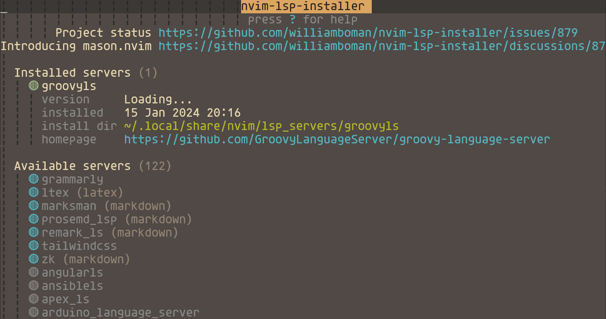
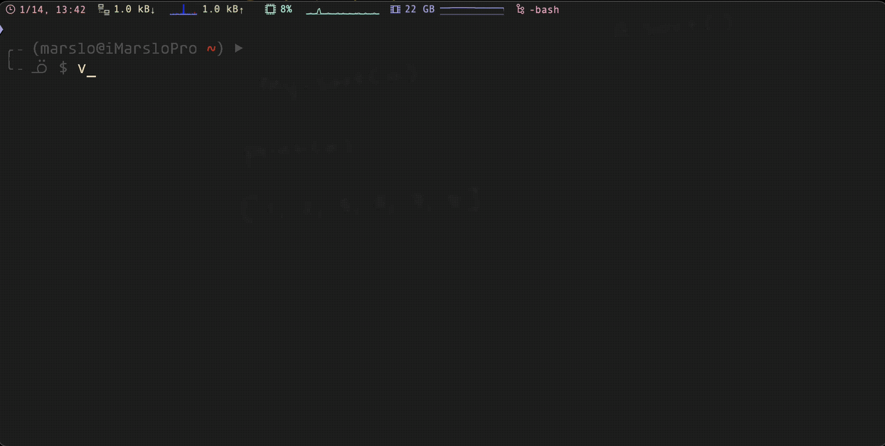

<!-- START doctoc generated TOC please keep comment here to allow auto update -->
<!-- DON'T EDIT THIS SECTION, INSTEAD RE-RUN doctoc TO UPDATE -->

- [plugin alternatives](#plugin-alternatives)
  - [autocompletion](#autocompletion)
  - [language server protocol](#language-server-protocol)
  - [snippets](#snippets)
  - [cryptmethod](#cryptmethod)
  - [comments](#comments)
- [programming](#programming)
  - [williamboman/nvim-lsp-installer](#williambomannvim-lsp-installer)
  - [neovim/nvim-lspconfig](#neovimnvim-lspconfig)
    - [manual install lsp](#manual-install-lsp)
  - [tpope/vim-commentary](#tpopevim-commentary)
  - [sjl/gundo.vim](#sjlgundovim)
- [colors and themes](#colors-and-themes)
  - [NvChad/nvim-colorizer.lua](#nvchadnvim-colorizerlua)
- [others](#others)
  - [ctrl-p](#ctrl-p)
  - [ycm-core/YouCompleteMe](#ycm-coreyoucompleteme)
  - [ycm-core/lsp-examples](#ycm-corelsp-examples)
  - [dense-analysis/ale](#dense-analysisale)
  - [hrsh7th/cmp-nvim-lsp](#hrsh7thcmp-nvim-lsp)
  - [vim-easycomplete](#vim-easycomplete)

<!-- END doctoc generated TOC please keep comment here to allow auto update -->


# plugin alternatives
## autocompletion

> [!NOTE|label:references:]
> - [Code Completion for Neovim using Lazy](https://medium.com/@shaikzahid0713/code-completion-for-neovim-6127401ebec2)

- [* neoclide/coc.nvim](https://github.com/neoclide/coc.nvim)
- [* hrsh7th/nvim-cmp](https://github.com/hrsh7th/nvim-cmp) | [Nvim-cmp configuration for auto-completion](https://neovim.discourse.group/t/nvim-cmp-configuration-for-auto-completion/1045/3)
- [* ms-jpq/coq_nvim](https://github.com/ms-jpq/coq_nvim)
- [@ nvim-lua/completion-nvim](https://github.com/nvim-lua/completion-nvim?tab=readme-ov-file)
- [Shougo/deoplete.nvim](https://github.com/Shougo/deoplete.nvim?tab=readme-ov-file) | [Shougo/ddc.vim](https://github.com/Shougo/ddc.vim)
- [ycm-core/YouCompleteMe](https://github.com/ycm-core/YouCompleteMe)
- [prabirshrestha/asyncomplete.vim](https://github.com/prabirshrestha/asyncomplete.vim)
- [Shougo/ddc.vim](https://github.com/Shougo/ddc.vim)


#### [vim-easycomplete](https://github.com/jayli/vim-easycomplete)

> [!NOTE|label:references:]
> - [How to improve your vim/nvim coding experience with vim-easycomplete?](https://dev.to/jayli/how-to-improve-your-vimnvim-coding-experience-with-vim-easycomplete-29o0)
> - [Vim-EasyComplete 体验优化踩坑记录](https://zhuanlan.zhihu.com/p/425555993)
> - [vim-easycomplete VS vim-lsp](https://www.libhunt.com/compare-vim-easycomplete-vs-vim-lsp?ref=compare)
> - [Which lsp plugin should I use?](https://www.reddit.com/r/vim/comments/7lnhrt/which_lsp_plugin_should_i_use/)


## [language server protocol](https://microsoft.github.io/language-server-protocol/)

> [!NOTE]
> - [Ale Alternatives](https://www.libhunt.com/r/ale)

- [* neovim/nvim-lspconfig](https://github.com/neovim/nvim-lspconfig)
- [* hrsh7th/cmp-nvim-lsp](https://github.com/hrsh7th/cmp-nvim-lsp)
- [prabirshrestha/vim-lsp](https://github.com/prabirshrestha/vim-lsp)
- [rhysd/vim-lsp-ale](https://github.com/rhysd/vim-lsp-ale)
- [mfussenegger/nvim-lint](https://github.com/mfussenegger/nvim-lint)
- [mattn/vim-lsp-settings](https://github.com/mattn/vim-lsp-settings)
- [ycm-core/lsp-examples](https://github.com/ycm-core/lsp-examples)
- [jose-elias-alvarez/null-ls.nvim](https://github.com/jose-elias-alvarez/null-ls.nvim)

## [snippets](https://github.com/rockerBOO/awesome-neovim#snippet)
- [Snippets with CoC](https://www.chiarulli.me/Neovim/17-snippets/)

- [hrsh7th/vim-vsnip](https://github.com/hrsh7th/vim-vsnip) | [hrsh7th/vim-vsnip-integ](https://github.com/hrsh7th/vim-vsnip-integ)
- [SirVer/UltiSnips](https://github.com/SirVer/ultisnips) | [thomasfaingnaert/vim-lsp-ultisnips](https://github.com/thomasfaingnaert/vim-lsp-ultisnips)
- [Shougo/neosnippet.vim](https://github.com/Shougo/neosnippet.vim) | [thomasfaingnaert/vim-lsp-neosnippet](https://github.com/thomasfaingnaert/vim-lsp-neosnippet)
- [L3MON4D3/LuaSnip](https://github.com/L3MON4D3/LuaSnip) | [rafamadriz/friendly-snippets](https://github.com/rafamadriz/friendly-snippets) | [Neovim setting up snippets with luasnip](https://sbulav.github.io/vim/neovim-setting-up-luasnip/) | [dotfiles/nvim/lua/config/snippets.lua](https://github.com/sbulav/dotfiles/blob/master/nvim/lua/config/snippets.lua) | [LuaSnip/Examples/snippets.lua](https://github.com/L3MON4D3/LuaSnip/blob/master/Examples/snippets.lua)
  ```vim
  " ~/.vimrc
  Plug 'L3MON4D3/LuaSnip', {'tag': 'v2.2.0', 'do': 'make install_jsregexp'}

  " L3MON4D3/LuaSnip
  imap <silent><expr> <Tab> luasnip#expand_or_jumpable() ? '<Plug>luasnip-expand-or-jump' : '<Tab>'
  inoremap <silent> <S-Tab> <cmd>lua require'luasnip'.jump(-1)<Cr>
  snoremap <silent> <Tab> <cmd>lua require('luasnip').jump(1)<Cr>
  snoremap <silent> <S-Tab> <cmd>lua require('luasnip').jump(-1)<Cr>
  imap <silent><expr> <C-E> luasnip#choice_active() ? '<Plug>luasnip-next-choice' : '<C-E>'
  smap <silent><expr> <C-E> luasnip#choice_active() ? '<Plug>luasnip-next-choice' : '<C-E>'
  ```
  ```lua
  -- init.lua
  require("luasnip").config.setup {
      updateevents = "TextChanged,TextChangedI",
      store_selection_keys = "<Tab>",
  }
  require("config.snippets")
  -- require("luasnip.loaders.from_vscode").lazy_load({ paths = { "~/.vim/snippet/groovy.lua" } })
  ```

## cryptmethod
- [kurotych/CCryptor.nvim](https://github.com/kurotych/ccryptor.nvim)
- [GPG](https://www.reddit.com/r/neovim/comments/7js0qq/comment/dr8zczy/?utm_source=share&utm_medium=web2x&context=3)

## comments
- [preservim/nerdcommenter](https://github.com/preservim/nerdcommenter)
- [tpope/vim-commentary](https://github.com/tpope/vim-commentary)

# programming
## [williamboman/nvim-lsp-installer](https://github.com/williamboman/nvim-lsp-installer)

> [!NOTE|label:references:]
> - [#848 - Spawning language server with cmd: a-language-server failed. The language server is either not installed, missing from PATH, or not executable.](https://github.com/williamboman/nvim-lsp-installer/issues/848)
> - [#17354 - Spawning language server with cmd: pyright-langserver failed. The language server is either not installed, missing from PATH, or not executable.](https://github.com/neovim/neovim/issues/17354)



```bash
$ mkdir -p ~/.cache/nvim/
```
```vim
# show all available packages
:LspInstall <TAB>
:LspInstall <package>
" i.e.:
:LspInstall groovyls

:LspInstallInfo
:LspPrintInstalled

:LspUninstall <package>
```

## [neovim/nvim-lspconfig](https://github.com/neovim/nvim-lspconfig)



```vim
Plug 'neovim/nvim-lspconfig'
```

- debug
  ```vim
  :LspInfo
  :LspLog
  ```

### manual install lsp

> [!NOTE]
> - [williamboman/nvim-lsp-installer](https://github.com/williamboman/nvim-lsp-installer) install lsp via `:LspInstall`

- [gradlels](https://github.com/neovim/nvim-lspconfig/blob/master/doc/server_configurations.md#gradle_ls)

  ```bash
  $ mkdir -p ~/.vim/lsp
  $ git clone https://github.com/microsoft/vscode-gradle.git ~/.vim/lsp/vscode-gradle && cd $_
  $ ./gradlew installDist
  $ sudo ln -sf /opt/lsp/gradle-language-server/build/install/gradle-language-server/bin/gradle-language-server /usr/local/bin/
  $ which -a gradle-language-server
  /usr/local/bin/gradle-language-server

  # details for offline install
  $ la ~/.gradle/wrapper/dists/gradle-8.5-bin/5t9huq95ubn472n8rpzujfbqh/
  total 4.0K
  -rw-rw-r-- 1 marslo marslo    0 Jan 15 19:58 gradle-8.5-bin.zip.lck
  drwxrwxr-x 5 marslo marslo 4.0K Jan 15 19:58 gradle-8.5
  -rw-rw-r-- 1 marslo marslo    0 Jan 15 19:58 gradle-8.5-bin.zip.ok
  ```

  ```lua
  require'lspconfig'.gradle_ls.setup {
    filetypes = { 'groovy', 'Jenkinsfile' }
  }
  ```

- groovyls
  - [GroovyLanguageServer/groovy-language-server](https://github.com/GroovyLanguageServer/groovy-language-server)
    ```bash
    # java has to be less than jdk 19
    $ brew install openjdk@17
    $ export JAVA_HOME='/usr/local/opt/openjdk@17'
    $ export PATH=${JAVA_HOME}/bin:${PATH}
    $ export CPPFLAGS="-I${JAVA_HOME}/include ${CPPFLAGS}"

    $ git clone git@github.com:GroovyLanguageServer/groovy-language-server.git
    $ ./gradew build

    # run
    $ git@github.com:GroovyLanguageServer/groovy-language-server.git
    ```

  - [ycm-core/lsp-examples](https://github.com/ycm-core/lsp-examples)
    > [!NOTE|label:@deprecated]
    > **using gradlels instead of groovyls**
    > - full ycm-core/lsp-examples list
    >   ```vim
    >   Plug 'ycm-core/lsp-examples',  { 'do': 'python3 install.py --enable-groovy --enable-yaml --enable-bash --enable-json --enable-python --enable-lua --enable-docker' }
    >   ```

    ```vim
    # .vimrc
    Plug 'ycm-core/lsp-examples',  { 'do': 'python3 install.py --enable-groovy' }

    # ~/.config/nvim/init.lua
    require'lspconfig'.groovyls.setup{
      filetypes = { 'groovy', 'Jenkinsfile' },
      cmd = { "java", "-jar", "~/.vim/plugged/lsp-examples/groovy/groovy-language-server/build/libs/groovy-language-server-all.jar" },
    }
    ```

- [ansiblels](https://github.com/neovim/nvim-lspconfig/blob/master/doc/server_configurations.md#ansiblels)
  ```bash
  $ npm install -g @ansible/ansible-language-server
  ```
  ```vim
  # ~/.config/nvim/init.lua
  require'lspconfig'.ansiblels.setup{}
  ```

- [bashls](https://github.com/neovim/nvim-lspconfig/blob/master/doc/server_configurations.md#bashls)

  ```bash
  $ npm i -g bash-language-server
  ```
  ```vim
  # ~/.config/nvim/init.lua
  require'lspconfig'.bashls.setup{}
  ```

- [cmake](https://github.com/neovim/nvim-lspconfig/blob/master/doc/server_configurations.md#cmake) | [cmake-language-server](https://github.com/regen100/cmake-language-server)
  ```bash
  $ pip install cmake-language-server
  ```
  ```vim
  # ~/.config/nvim/init.lua
  require'lspconfig'.cmake.setup{}
  ```

- [cssls](https://github.com/neovim/nvim-lspconfig/blob/master/doc/server_configurations.md#cssls)
  ```bash
  $ npm i -g vscode-langservers-extracted
  ```
  ```vim
  # ~/.config/nvim/init.lua
  local capabilities = vim.lsp.protocol.make_client_capabilities()
  capabilities.textDocument.completion.completionItem.snippetSupport = true
  require'lspconfig'.cssls.setup { capabilities = capabilities, }
  require'lspconfig'.cssls.setup{}
  ```

- [dockerls](https://github.com/neovim/nvim-lspconfig/blob/master/doc/server_configurations.md#dockerls)
  ```bash
  $ npm install -g dockerfile-language-server-nodejs
  ```
  ```vim
  # ~/.config/nvim/init.lua
  require'lspconfig'.dockerls.setup{}
  ```

- [pylsp](https://github.com/neovim/nvim-lspconfig/blob/master/doc/server_configurations.md#pylsp)

  > [!NOTE|label:references:]
  > - [python-lsp/python-lsp-server](https://github.com/python-lsp/python-lsp-server)

  ```bash
  $ pip install python-lsp-server
  $ sudo npm install -g pyright
  ```
  ```vim
  require'lspconfig'.pylsp.setup {}
  ```

- [vimls](https://github.com/neovim/nvim-lspconfig/blob/master/doc/server_configurations.md#vimls)
  ```bash
  $ npm install -g vim-language-server
  ```
  ```vim
  require'lspconfig'.vimls.setup{}
  ```

- [yamlls](https://github.com/neovim/nvim-lspconfig/blob/master/doc/server_configurations.md#yamlls)
  ```bash
  $ npm install -g yaml-language-server
  ```
  ```vim
  require'lspconfig'.yamlls.setup{}
  ```

## [tpope/vim-commentary](https://github.com/tpope/vim-commentary)

```vim
" tpope/vim-commentary
map  <C-/>     gcc
map  <leader>x gcc
imap <C-/>     <Esc><Plug>CommentaryLineA
xmap <C-/>     <Plug>Commentary

augroup DevOps
  autocmd FileType ignore,gitconfig setlocal commentstring=#\ %s
augroup END
```

## [sjl/gundo.vim](https://docs.stevelosh.com/gundo.vim/)

> [!TIP]
> - [delete undo file for 3 days ago](https://www.reddit.com/r/vim/comments/13s4e6l/remove_older_than_x_days_undo_files/)
>   ```bash
>   $ find ~/.vim/undo -mtime +3
>   # or
>   $ fd --type=file \
>        --change-older-than=30days \
>        . \
>        ~/.cache/vim/{backup,swap,undo}/ \
>        -x rm -v
>   ```

```vim
Plug 'sjl/gundo.vim'

noremap <Leader>u :GundoToggle<CR>
set undodir=~/.vim/undo/
set undofile
```

# colors and themes
## [NvChad/nvim-colorizer.lua](https://github.com/NvChad/nvim-colorizer.lua)
```vim title="~/.vimrc.d/extension"
Plug 'NvChad/nvim-colorizer.lua'
```
```ruby title="~/.config/nvim/init.lua"
require('config/theme')

# ~/.config/nvim/lua/config/theme.lua
require 'colorizer'.setup()
require 'colorizer'.setup {
  filetypes = {
    '*';
    css = { rgb_fn = true; mode = 'background'; };
    html = { names = true; };
    cmp_docs = {always_update = true}
  },
  user_default_options = { RRGGBBAA = true, css_fn = true, css = true, tailwind = true },
  buftypes = { "*", "!prompt", "!popup", }
}
```


# others

> [!NOTE|label:references:]
> - [Neovim for Newbs. FREE NEOVIM COURSE](https://www.youtube.com/playlist?list=PLsz00TDipIffreIaUNk64KxTIkQaGguqn)
>   - [From 0 to IDE in NEOVIM from scratch | FREE COURSE // EP 1](https://www.youtube.com/watch?v=zHTeCSVAFNY)
>   - [A BEAUTIFUL neovim config with Lazy | FREE COURSE // EP 2](https://www.youtube.com/watch?v=4zyZ3sw_ulc&list=PLsz00TDipIffreIaUNk64KxTIkQaGguqn&index=2)
>   - [LSP in Neovim. Thanks to BILL GATES?! | FREE COURSE // EP 3](https://www.youtube.com/watch?v=S-xzYgTLVJE&list=PLsz00TDipIffreIaUNk64KxTIkQaGguqn&index=3)
>   - [What the hell is NULL-LS | FREE COURSE // EP 4](https://www.youtube.com/watch?v=SxuwQJ0JHMU&list=PLsz00TDipIffreIaUNk64KxTIkQaGguqn&index=4)
>   - [Autocomplete and Snippets in Neovim | FREE COURSE // EP 5](https://www.youtube.com/watch?v=iXIwm4mCpuc&list=PLsz00TDipIffreIaUNk64KxTIkQaGguqn&index=5)
>   - [How to configure Debuggers in Neovim | FREE COURSE // EP 6](https://www.youtube.com/watch?v=oYzZxi3SSnM&list=PLsz00TDipIffreIaUNk64KxTIkQaGguqn&index=6)
> - [Neovim Configuration](https://www.youtube.com/playlist?list=PLsz00TDipIffxsNXSkskknolKShdbcALR)

## ctrl-p
- [Shougo/denite.nvim](https://github.com/Shougo/denite.nvim)

## [ycm-core/YouCompleteMe](./deprecated.html#ycm-coreyoucompleteme)
## [ycm-core/lsp-examples](./deprecated.html#ycm-corelsp-examples)
## [dense-analysis/ale](./deprecated.html#dense-analysisale)

## [hrsh7th/cmp-nvim-lsp](https://github.com/hrsh7th/cmp-nvim-lsp)
```lua
require('cmp_nvim_lsp').default_capabilities

require'cmp'.setup {
  sources = {
    { name = 'nvim_lsp' }
  }
}

-- The nvim-cmp almost supports LSP's capabilities so You should advertise it to LSP servers..
local capabilities = require('cmp_nvim_lsp').default_capabilities()

-- An example for configuring `clangd` LSP to use nvim-cmp as a completion engine
require('lspconfig').clangd.setup {
  capabilities = capabilities,
  ...  -- other lspconfig configs
}
```

```vim
Plug 'hrsh7th/cmp-nvim-lsp'
set runtimepath+=~/.vim/plugged/cmp-nvim-lsp
```

## [vim-easycomplete](https://github.com/jayli/vim-easycomplete)

> [!NOTE|label:references:]
> - [How to improve your vim/nvim coding experience with vim-easycomplete?](https://dev.to/jayli/how-to-improve-your-vimnvim-coding-experience-with-vim-easycomplete-29o0)
> - [Vim-EasyComplete 体验优化踩坑记录](https://zhuanlan.zhihu.com/p/425555993)
> - [vim-easycomplete VS vim-lsp](https://www.libhunt.com/compare-vim-easycomplete-vs-vim-lsp?ref=compare)
> - [Which lsp plugin should I use?](https://www.reddit.com/r/vim/comments/7lnhrt/which_lsp_plugin_should_i_use/)
